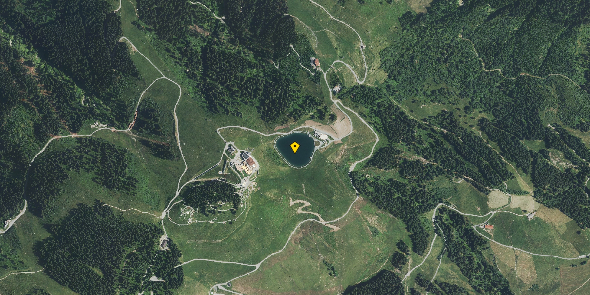
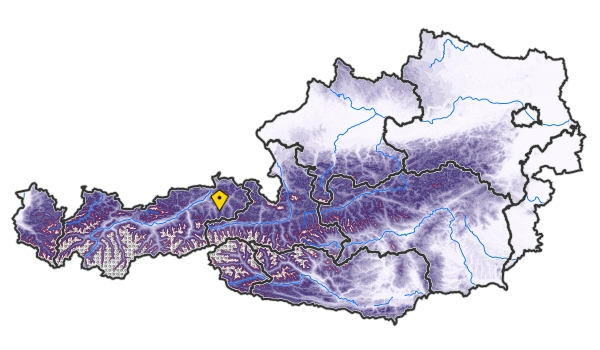
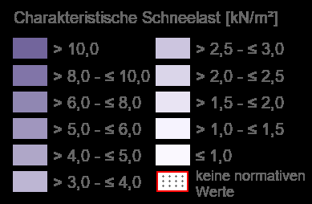
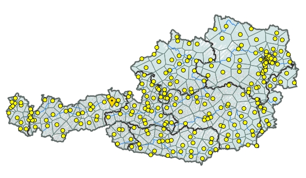
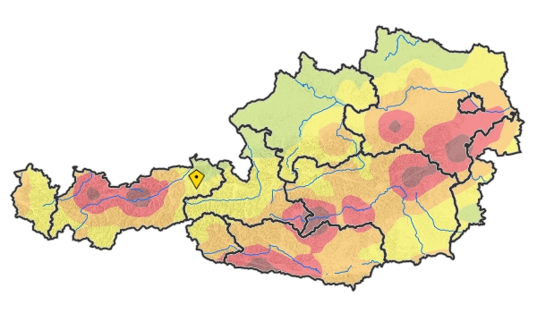
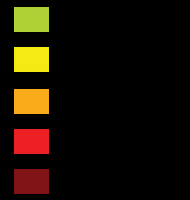
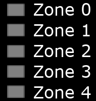
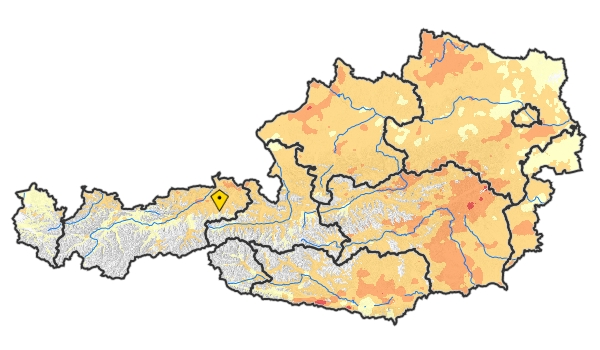

# HORA natural-hazards atlas extract — Speicherteich Hartkaser

Four-page site report from Austria's official natural-hazards atlas ([hora.gv.at](https://hora.gv.at)) for the Hartkaser snowmaking reservoir, covering characteristic snow load, base wind speed, seismic ground acceleration, and hail hazard.

## Site overview

**Coordinates (identical on all four pages):**

- Geogr. Länge: 12,27574° O
- Geogr. Breite: 47,49397° N
- Seehöhe: 1470 m

**Aerial view of the reservoir** (yellow marker indicates the queried point):

---

## 1 — Charakteristische Schneelast am Boden sk (50-jährlich) sowie 25- und 100-jährliche Schneelast (s25 und s100)

*Characteristic ground snow load (50-year return period) and 25- and 100-year snow loads.*

**Values:**

- sk: 9,8 kN/m²
- s25: 8,7 kN/m²
- s100: 10,8 kN/m²

**Legend — Charakteristische Schneelast [kN/m²]:**

| Column 1              | Column 2              |
|-----------------------|-----------------------|
| > 10,0                | > 2,5 — ≤ 3,0         |
| > 8,0 — ≤ 10,0        | > 2,0 — ≤ 2,5         |
| > 6,0 — ≤ 8,0         | > 1,5 — ≤ 2,0         |
| > 5,0 — ≤ 6,0         | > 1,0 — ≤ 1,5         |
| > 4,0 — ≤ 5,0         | ≤ 1,0                 |
| > 3,0 — ≤ 4,0         | keine normativen Werte |

(The site value sk = 9,8 kN/m² falls in the "> 8,0 — ≤ 10,0" bracket. "keine normativen Werte" applies above 2000 m a.s.l. and is shown with a red-hatched swatch.)

**Quellenangabe:** Verwaltungsdaten, DGM: BEV · Gewässer, DHM, DOP: BMLUK · Schneelast: ÖNORM B 1991-1-3:2022-05-15

**Erläuterung:**

Maßgeblich für die Berechnung der charakteristischen Schneelast am Boden ist die Schneelastkarte gemäß ÖNORM B 1991-1-3:2022-05-15 in Anhang B. Die dieser Abfrage zugrunde liegende Online-Version der Karte unter https://hora.gv.at wurde mit dem Austria Standards International akkordiert.

Oberhalb von 2000 Metern Seehöhe gibt es gemäß ÖNORM B 1991-1-3:2022-05-15 keine normativen Werte. Für höher liegende Standorte können Details bei den in ÖNORM B 1991-1-3:2022-05-15, Abschnitt 5.1 genannten Instituten eingeholt werden.

Das der Berechnung zugrunde liegende Höhenmodell der österreichischen Bundesländer hat eine Auflösung von 50 m (horizontal) und 0,1 m (vertikal). Die Werte für sk, s25 und s100 wurden auf eine Nachkommastellen gerundet.

---

## 2 — Grundwert der Basiswindgeschwindigkeit vb,0

*Base value of the reference wind speed (and corresponding base velocity pressure). Yellow dots on the overview map mark the Austrian reference-wind measurement stations.*

**Values:**

- vb,0: 35,57 m/s
- qb,0: 0,79 kN/m²

**Quellenangabe:** Verwaltungsdaten: BEV · Gewässer, DGM, DHM, DOP: BMLUK · Basiswindgeschwindigkeit: ÖNORM B 1991-1-4 und ÖNORM EN 1991-1-4

**Erläuterung:**

Der Grundwert der Basiswindgeschwindigkeit (vb,0) ist definiert für eine Höhe von 10 m über Grund für freies offenes Gelände der Geländekategorie II und entspricht den Vorgaben gemäß ÖNORM B 1991-1-4 und ÖNORM EN 1991-1-4 in der aktuellen Fassung sowie dem Ortsverzeichnis der ÖNORM B 1991-1-4:2023-04-01, Anhang A. Liegt die Seehöhe des Standortes mehr als 250 m über jener des in der ÖNORM B 1991-1-4:2023-04-01, Tabelle A.1 angegebenen nächstliegenden Ortes, so sind die Werte nach ÖNORM B 1991-1-4:2023-04-01, Tabelle A.2 anzunehmen, falls nicht ein diesbezügliches Windgutachten einer der unter ÖNORM B 1991-1-4:2023-04-01, Abschnitt 6.2.2 genannten Instituten vorliegt.

Der korrespondierende Grundwert des Basisgeschwindigkeitsdrucks (qb,0) entspricht dem Ortsverzeichnis der ÖNORM B 1991-1-4:2023-04-01, Anhang A bzw. wurde gemäß ÖNORM B 1991-1-4, Formel (1) berechnet. Die Abminderungsfaktoren fs für Basisgeschwindigkeitsdrücke gemäß ÖNORM B 1991-1-4, Tabelle 3 wurden nicht berücksichtigt. Standorte mit relativen Seehöhen bis 250 m oberhalb des nächstgelegenen Ortes und unterhalb von 800 m absoluter Seehöhe können auch in windexponierten Lagen liegen. Dieser Umstand ist nach Bedarf bei der Berechnung von Windlasten zu berücksichtigen.

Die dieser Abfrage zugrunde liegende Online-Version der Karte wurde mit dem Austria Standards International akkordiert, die Angabe obiger Werte erfolgt jedoch ohne Gewähr. Das der Berechnung zugrunde liegende Höhenmodell der österreichischen Bundesländer hat eine Auflösung von 1 m (horizontal) und 0,1 m (vertikal). Die Werte für vb,0 und qb,0 wurden auf eine bzw. zwei Nachkommastellen gerundet.

---

## 3 — Effektive horizontale Bodenbeschleunigung

*Effective horizontal ground acceleration (seismic hazard).*

**Values:**

- Zone 1: (Grad VI) leichte Gebäudeschäden
- agR: 0,37 m/s² (Referenzort: 6352 Ellmau)

**Legend — Erdbebenzonen** (colours top-to-bottom: green, yellow, orange, red, dark red):

- Zone 0
- Zone 1  *(the site falls here)*
- Zone 2
- Zone 3
- Zone 4

**Quellenangabe:** Verwaltungsdaten: BEV · Gewässer, DGM, DHM, DOP: BMLUK · Erdbebenzonen: ÖNORM EN 1998-1

**Erläuterung:**

Die Karte der Erdbebengefährdung für Österreich stellt die „horizontale Referenz-Bodenbeschleunigung" gemäß aktuell gültiger ÖNORM B 1998-1 dar. Diese angegebene Erdbebeneinwirkung wird in einem Zeitraum von 50 Jahren (durchschnittliche Gebäudenutzung) mit einer Wahrscheinlichkeit von 90% nicht überschritten.

Die Kartengenauigkeit beträgt zwei Kilometer, da die Lokalisierungsgenauigkeit von Erdbeben in diesem Rahmen liegt. Daher liegen in den Übergangsbereichen vereinzelt Orte augenscheinlich in der benachbarten Zone. In diesen Fällen gilt der beim jeweiligen Ort ausgewiesene agR-Wert. Die Zonenzuordnung ist in der Norm ausgeführt. Diese Zone ist dann zu nehmen, wohinein der ortspezifische agR-Wert fällt. Liegt der Wert genau an der Zonengrenze, so ist die höhere Zone zu wählen, für die dann höhere Auflagen gelten.

---

## 4 — Hagelgefährdung — max. Hagelkorngröße

*Hail hazard — maximum hailstone size.*

**Values (return period → maximum hailstone size):**

- 30 Jahre: > 4 cm — ≤ 5 cm
- 20 Jahre: > 4 cm — ≤ 5 cm
- 10 Jahre: > 3 cm — ≤ 4 cm

**Quellenangabe:** Verwaltungsdaten: BEV · Gewässer, DGM, DHM, DOP: BMLUK · Hagelgefährdung: ÖNORM B 3663:2026-07-15

**Erläuterung:**

Grundlage für die Österreichische Hagelgefährdungskarte ist ein metastatistisches Modell zur Berechnung von Wiederkehrperioden für Hagelkorngrößen. Die komplexen Abhängigkeiten von Hagelereignissen werden mit Ort, Zeit und ausgewählten atmosphärischen Eingangsgrößen berücksichtigt. Die Hagelereignisse stammen von Hagelindikatoren aus dreidimensionalen, hochaufgelösten Radarmessungen der Jahre 2009 bis 2022, die anhand eines Archivs aus Hagelmeldungen auf beobachtete Hagelkorngrößen kalibriert wurden. Für die Wiederkehrperioden (10, 20, und 30 Jahre) sind Hagelkorngrößen in fünf Größenklassen (interpretierbar als „Hagelgefährdung") verfügbar.

Die Hagelgefährdungskarte zeigt hochaufgelöst lokale Strukturen. Nur in wenigen Regionen, mit keinen oder zu wenigen Hagelereignissen, unterliegt das Ergebnis einer größeren Unsicherheit und kann ggf. nicht wiedergegeben werden. Das Vertrauensmaß bildet diese lokalen Unsicherheiten in einem 5-Sterne System ab (5 Sterne: höchstes Vertrauen).

Die horizontale räumliche Auflösung beträgt 1 km. Das der Darstellung zugrundeliegende Höhenmodell hat eine Auflösung von 50 m (horizontal) und 0,1 m (vertikal). Berücksichtigt sind alle Regionen bis 1500 m Seehöhe, da darunter der höchsten Konzentration an Agrar- und Sachgütern besteht und drüber keine ausreichende Validierungsgrundlage besteht. Angabe der Klassenwerte in ganzen Zahlen.

---

## Footer (identical on all pages)

Design & Layout: LFRZ GmbH — © LFRZ GmbH, 2026 — https://hora.gv.at, Datum 07.09.2026
