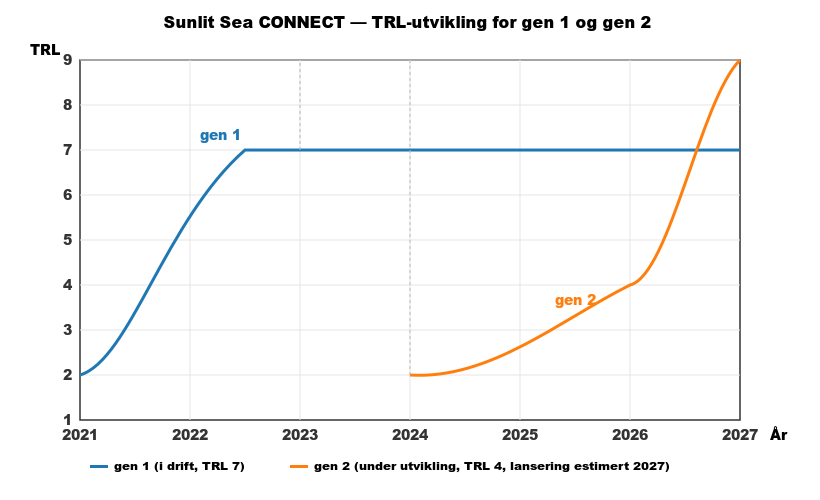

# Revisorpakke — prinsippendring for aktivering av utviklingskostnader, avskrivningsreversering og nedskrivingstest 2025

_Beløp i denne pakken er angitt i hele tusen kroner (avrundet til nærmeste tusen), med mindre annet er angitt. Eventuelle avvik på inntil én enhet i sumrader skyldes uavhengig avrunding av komponentene. Eksakte beløp med desimaler er tilgjengelige på forespørsel._

## 1. Innledning og formål

Sunlit Sea AS legger med dette frem en samlet informasjonspakke som dekker de regnskapsmessige forholdene ved avleggelsen av 2025-regnskapet. Disposisjonene henger sammen og springer alle ut av en samlet vurdering av foretakets utviklingsplattform for flytende solkraftverk (gen 1 og gen 2, jf. seksjon 3):

1. Endring av regnskapsprinsipp fra kostnadsføring til aktivering av utviklingskostnader for utviklingsplattformen, med virkning for 2024 og 2025. Konkret gjelder dette utgifter påløpt i foretakets deltakelse i EU Horizon-prosjektene SuRE og Surewave — begge er innsatsfaktorer i gen 2-utviklingen.
2. Reversering av avskrivninger på utviklingsaktiveringer på konto 1005 og tilhørende periodisering av utsatt inntekt på konto 2160, fra og med 1. januar 2024. Reverseringen omfatter samtlige aktiveringer på konto 1005 — både 2021-basisen og Surewave-aktiveringene for 2022, 2023 og 2024 — fordi hele restbeholdningen støtter gen 2-utviklingen som ennå ikke er tatt i bruk.
3. Etablering og bruk av ny konto 7794 «Korreksjoner tidligere år» for resultatvirkningen av korreksjonene som tilhører 2024.
4. Referanse til tidligere gjennomført omklassifisering av pressverktøy til konto 1205 i 2024.
5. Nedskrivingstest av foretakets samlede balanseførte utviklingsverdier per 31.12.2025.

Vi ber revisor gjennomgå og bekrefte disposisjonene forut for endelig avleggelse av 2025-regnskapet.

## 2. Foretaks- og standardgrunnlag

Sunlit Sea AS er et norsk aksjeselskap som utvikler, produserer og kommersialiserer flytende solkraftverk (FPV — floating photovoltaic) for near-shore marine forhold. Foretakets produkt heter Sunlit Sea CONNECT og er levert i en første generasjon (gen 1, med anlegg i drift) og er under aktiv videreutvikling til en andre generasjon (gen 2, planlagt lansering 2027).

Foretaket klassifiseres som lite foretak etter regnskapsloven § 1-5 annet ledd. Pr. balansedag overskrides ikke mer enn én av de tre tersklene (balansesum inntil 84 MNOK, salgsinntekter inntil 168 MNOK, gjennomsnittlig antall ansatte inntil 50 årsverk).

Primær regnskapsstandard: NRS 8 God regnskapsskikk for små foretak.

Utfyllende standarder anvendt:

- NRS(F) Nedskrivning av anleggsmidler — for nedskrivingstest-metodikken (særlig pkt. 3 om indikatorer og pkt. 5 om gjenvinnbart beløp).
- NRS 4 Offentlige tilskudd — for behandling av tilhørende Skattefunn-, IN-, Enova-, Sintef- og EU-tilskudd.
- NRS 8 pkt. 6.1.1.2 — for adgangen små foretak har til å unnlate balanseføring av utsatt skattefordel.

Sentrale lovhjemler:

- Regnskapsloven § 1-5 — kategorier av foretak
- Regnskapsloven § 5-1 — klassifisering av eiendeler
- Regnskapsloven § 5-3 tredje ledd — plikt til nedskrivning
- Regnskapsloven § 5-6 — vilkår for aktivering av utviklingsutgifter, herunder små foretaks valgrett (fjerde ledd)
- Regnskapsloven § 5-13 — utsatt skatt for små foretak
- Regnskapsloven § 4-1 annet ledd — små foretaks adgang til unntak fra sammenstillingsprinsippet
- Regnskapsloven § 7-39 — noteopplysningskrav for anleggsmidler

## 3. Foretakets teknologiplattform og EU-prosjekter

Denne seksjonen etablerer teknologibakgrunnen som resten av pakken bygger på. Formålet er at revisor skal kunne følge sammenhengen mellom (a) den samlede utviklingsplattformen foretaket har bygget opp siden oppstart, (b) de balanseførte utviklingsverdiene på konto 1005, og (c) begrunnelsen for både prinsippendringen og reverseringen av avskrivninger.

### 3.1 Gen 1 og gen 2 — to påfølgende versjoner av samme produkt

Sunlit Sea har utviklet det samme produktet — et integrert flytende solkraftverk — i to påfølgende generasjoner:

- Gen 1 (i drift). Første generasjons enhet består av et glass/PET solpanel limt sammen med to pressede aluminiumsdeler (5083-H111, 1,5 mm) som danner en flottør med luft inne. Polystyren-cup fyller rommet under panelet, butyl/silikon fungerer som kantforsegling, og to-komponent silikon-potting er brukt for å minimere vanninntrengning. Brakets på flottørkanten kobler enheter sammen. PU-topplaget er mørkeblått med målt absorptivitet 0,88-0,91. Enheten er panel-integrert og produktet er produsert i lavt volum i egen produksjon (Askim). Den mest sentrale gen 1-driftsreferansen er Skiftestjørna-anlegget i Haugaland Næringspark: 105 kWp installert 10. oktober 2024, drevet av Sunlit Sea under en «develop-operate-sell»-modell med kraftkjøpsavtale med EV PowerCharge AS. Anlegget har levert produksjon over forventning gjennom første fulle driftsperiode.
- Gen 2 (under utvikling, produktnavn Sunlit Sea CONNECT gen. 2). Full redesign hvor det integrerte konseptet beholdes, men arkitekturen endres for kostnads- og skalerbarhetshensyn: standard kommersielle solpaneler i utility-skala (2384 × 1303 mm, 710-740 Wp) settes inn i en støpt PU-ramme som er bundet til en aluminiumsbunn (5083-H111, 0,8 mm). PU har tre distinkte roller — støpt strukturramme, indre infill og oppdriftskopplinger — mot gen 1s enkle underliggende PU-lag. Hengselgeometrien er redesignet basert på funn fra Surewaves bølgetank-testing. Prototypeserien går fra P1 → P2 → P3 (bygd og testet) → P4 (støping av form startet) → P5 (designbeslutning under vurdering). Foretaket vurderer nåværende tilstand til å være TRL 4.

Utviklingsplattformen som ligger til grunn for begge generasjoner — aluminiumforming, PU-formulering, DNV-verifisert designmetodikk, hengsel- og koblingssystem, marine driftsforhold, salgs- og prosjektutviklingsmodell — er kumulativ. Gen 2 viderefører gen 1s tekniske grunnlag uten brudd, og læring fra ett års utviklingsarbeid går direkte inn i påfølgende års arbeid.

Styret besluttet høsten 2025 å avvikle videre produksjon av gen 1 og konsentrere ressursene om gen 2-utviklingen fram mot planlagt kommersiell lansering i 2027.

TRL-utviklingen for de to generasjonene er illustrert i figuren under.

### 3.2 EU Horizon-prosjektene SuRE og Surewave

Sunlit Sea deltar i to Horizon Europe-prosjekter. Begge leverer teknisk arbeid som mater direkte inn i gen 2-utviklingsplattformen.

Surewave (grant 101083342, HORIZON-CL5-2021-D3-03). Varighet 1. september 2022 til 31. desember 2026 (opprinnelig ferdig 2025, forlenget 12 måneder av hensyn til partneren ACCIONAs demonstrator av flytende bølgebrytere i Spania). Sunlit Sea er partner 2 av 7 i et konsortium ledet av SINTEF. Øvrige partnere: Ceit, MARIN, ACCIONA, Clement Germany og IFEU. Sunlit Sea leder WP2 «Global framework & specifications» og WP8 «Dissemination, communication & exploitation», og bidrar i WP1 (SINTEF), WP6 «Technical validation» (SINTEF) og WP7 «Integrated sustainability assessment» (IFEU). Sentrale bidrag inn i gen 2: bølgetank-testing (gjennomført sammen med SINTEF og MARIN) som eksponerte svakheter i gen 1s hengselgeometri og har vært utløser for hengselredesignet i gen 2 P4, samt utvikling av breakwater-konsept sammen med Clement Systems.

SuRE. Varighet 1. oktober 2024 til 31. august 2027. Sunlit Sea er partner i et konsortium ledet av Institutt for Energiteknikk (IFE), som leder WP3 og WP8. Øvrige partnere: Fraunhofer (WP1-leder), TNO (WP2-leder), CT1 (WP4-leder), Zimmermann PV Steel Group (WP5-leder) og Compaz (WP7-leder). Sunlit Sea leder WP6 «Sunlit's integrated FPV technology» — hoved-arbeidspakken for foretaket. Sentrale bidrag inn i gen 2: en formell modellkjede som kobler manufacturing-simulering (aluminiumspressing i LS-DYNA med maskinlæring-styrt geometri-generering fra FreeCAD), strukturell FEM (SiSim ved IFE), termisk CFD, og livssyklus-analyse (TNO) — brukt til å screene og velge geometrier og materialer for gen 2-prototypene. D6.1 (Model chain description) er levert; D6.2 (Multi-domain design screening) er under forberedelse.

I tillegg til Horizon-prosjektene støttes gen 2-utviklingen av norske ordninger som Enova, Innovasjon Norge og Skattefunn. Disse behandles etter foretakets etablerte praksis (jf. seksjon 5 om Skattefunn og seksjon 7 om øvrige tilskudd).

### 3.3 Balanseførte utviklingsverdier på konto 1005 og gen 2-plattformen

Restbeholdningen på konto 1005 per 31.12.2025 består av følgende komponenter (grunnlag før korrigert avskrivning 2025):

- 2021-basis: opprinnelig aktivert beløp 18 571 tusen kr. Består av utviklingsutgifter aktivert i 2021 med grunnlag i tidligere støtteordninger — sentralt her er Innovasjon Norges miljøteknologistøtte tilsagn juni 2021 på 8,4 MNOK (med matchende egenkapital fra Holta Invest AS og annen investor), samt tidligere Innovasjon Norge- og Skattefunn-perioder. Detaljert sammensetning per støtteprogram er dokumentert i regnskapsførers avstemminger og i foretakets bilagsdokumentasjon.
- Surewave 2022: opprinnelig aktivert beløp 12 765 tusen kr. Utviklingsarbeid i Surewave-prosjektets første fase.
- Surewave 2023: opprinnelig aktivert beløp 4 752 tusen kr. Utviklingsarbeid i Surewave-prosjektets midtfase.
- Surewave 2024: opprinnelig aktivert beløp 2 187 tusen kr. Utviklingsarbeid i Surewave, siste år før prosjektet ble forlenget.

Samlet opprinnelig aktivert beløp: 38 275 tusen kr. Etter 2024s omklassifisering av pressverktøy (jf. seksjon 10) og de årlige avskrivningene som er tatt frem til nå, sto konto 1005 med foreløpig saldo 5 649 tusen kr per det tidspunktet regnskapet foreløpig ble ført ut.

Vurderingen som gjelder alle disse komponentene, gjelder samlet: samtlige aktiveringer støtter foretakets integrerte FPV-teknologi og har i sin helhet gått inn i den tekniske plattformen som gen 2-produktet bygger på. Ingen komponent kan skilles ut som «tatt i bruk» i regnskapsmessig forstand så lenge gen 2-produktet er under utvikling. Dette er grunnlaget for at reverseringen av avskrivningene i seksjon 9 gjelder hele restbeholdningen — ikke bare de nye SuRE-aktiveringene.

## 4. Prinsippendring — fra kostnadsføring til aktivering av utviklingskostnader

### 4.1 Bakgrunn

I 2024-regnskapet ble utgifter knyttet til foretakets deltakelse i EU Horizon-prosjektet SuRE kostnadsført løpende på konto 6791. Dette var et lovlig regnskapsprinsipp i henhold til regnskapsloven § 5-6 fjerde ledd, som gir små foretak valgrett mellom aktivering og kostnadsføring av utviklingsutgifter.

Ved forberedelse av 2025-regnskapet har foretaket revurdert dette prinsippvalget. Med bakgrunn i teknologiplattformen som er beskrevet i seksjon 3 — hvor gen 2-utviklingen for alvor startet 1. januar 2024 og hvor både SuRE og Surewave er innsatsfaktorer i den samme utviklingsplattformen — er det klart at SuRE-utgiftene fra 2024 og fremover ikke er ordinære driftskostnader, men investeringer i en identifiserbar utviklingseiendel som forventes å generere fremtidige økonomiske fordeler. Samme vurdering gjelder for Surewave-utgiftene, men disse har foretaket allerede aktivert løpende i sin regnskapsføring (Surewave-aktiveringene på konto 1005 for 2022, 2023 og 2024).

Kostnadsføring av SuRE-utgiftene gir dermed ikke lenger et dekkende bilde av foretakets eiendeler og resultat. Balanseføring gir mer relevant og pålitelig informasjon, og bringer også regnskapsbehandlingen av de to Horizon-prosjektene i sammenheng.

### 4.2 Hjemmel og metode for gjennomføring

Prinsippendringen har hjemmel i regnskapslovens generelle adgang til å endre regnskapsprinsipp når det gir mer relevant informasjon (jf. regnskapsloven § 4-3), samt NRS 8 sin adgang for små foretak til å benytte unntaket fra sammenstillingsprinsippet i regnskapsloven § 4-1 annet ledd.

Metode: resultatføring i endringsåret (NRS 8-adgang for små foretak), ikke retrospektiv omarbeidelse av 2024-sammenligningstall etter NRS 5 hovedmetode.

Rent teknisk gjennomføres korreksjonen på to måter avhengig av hvilket år korreksjonen tilhører:

- Korreksjoner som tilhører 2024 (aktivering av SuRE 2024, reversering av 2024-avskrivninger på kto 1005, reversering av 2024-periodisering av utsatt inntekt på kto 2160) resultatføres i 2025 mot ny konto 7794 «Korreksjoner tidligere år». Kontoen vises som egen linje i resultatregnskapet og spesifiseres i note (jf. pkt. 11.4 og notetekst i pkt. 13).
- Korreksjoner som tilhører 2025 (aktivering av SuRE 2025, sletting/omkorrigering av 2025-avskrivninger på kto 1005 og 2025-periodisering på kto 2160) gjennomføres ved at posteringer i 2025 slettes/korrigerer aktuelle konti direkte.

2024-tallene i sammenligningskolonnen i 2025-regnskapet endres ikke; de står som avlagt. Effekten av endringen kommer utelukkende inn i 2025-regnskapet.

Begrunnelse for metodevalg: enklere administrativt, unngår omarbeidelse av 2024-tall som er avlagt og bekreftet av revisor, og passer et lite foretak med begrenset regnskapskapasitet.

### 4.3 Konsistent anvendelse fremover

Aktivering av utviklingskostnader knyttet til gen 2-utviklingsplattformen blir foretakets valgte prinsipp fremover. Alle kvalifiserende utviklingsutgifter fra og med 1. januar 2024 aktiveres, uavhengig av finansieringskilde. Skattefunn behandles utenfor denne prinsippendringen (jf. pkt. 6).

## 5. Vilkårsvurdering etter regnskapsloven § 5-6 annet ledd

Regnskapsloven § 5-6 annet ledd oppstiller fire vilkår for at utviklingsutgifter kan aktiveres:

1. Sannsynlig at utviklingsprosjektet vil generere fremtidige økonomiske fordeler.
2. Prosjektet kan måles pålitelig.
3. Foretaket har tilstrekkelige ressurser til å fullføre prosjektet.
4. Foretaket kan måle utgiftene som kan knyttes til prosjektet.

For Sunlit Seas SuRE-arbeid vurderes samtlige vilkår som oppfylt kontinuerlig gjennom hele foretakets levetid siden oppstart i 2019:

- Sannsynlige fremtidige økonomiske fordeler. Foretaket har levert en første generasjon av produktet som er tatt i kommersiell drift (gen 1, TRL 7). Gen 2 er nå på TRL 4, med bekreftet prosjektpipeline i Norge (Storavatnet 3,2 MWp, Gunneklevfjorden 3,2 MWp, Skien Havn 350 kWp). Ekstern validering foreligger gjennom EU Horizon-programmet (SuRE-prosjektet med IFE som norsk leder, Surewave-prosjektet med SINTEF), DNV-verifisering etter DNV-RP-0584 siden 2022, og et markedspotensial for flytende solkraft globalt anslått til om lag 7,9 mrd USD i 2026 med forventet årlig vekst rundt 12% mot 2036.
- Prosjektet kan måles pålitelig. SuRE er et definert EU-prosjekt med formell arbeidspakke-struktur, budsjett, milepæler og rapporteringskrav godkjent av CINEA (European Climate, Infrastructure and Environment Executive Agency).
- Tilstrekkelige ressurser til fullføring. Innvilget Horizon Europe-finansiering er i seg selv en indikator på at ressursene er tilstrekkelige. Foretaket har videre tilgang til norske støtteordninger (Enova, Innovasjon Norge, Skattefunn) og planlegger en rettet emisjon i 2026 som styrker likviditeten.
- Pålitelig kostnadsmåling. Utgifter knyttet til SuRE er separat identifisert i regnskapet på konto 6791.

Vilkårene begrenser dermed ikke reklassifiseringen. Den praktiske grensen settes av kost-nytte-vurdering av tilbakevirkende endringer og av hva som er identifiserbart i regnskapet — foretaket går ikke lenger tilbake enn 1. januar 2024, som er tidspunktet gen 2-utviklingen for alvor startet.

## 6. Skattefunn holdes utenfor prinsippendringen

Skattefunn er en skattefradragsordning administrert av Norges Forskningsråd og Skatteetaten. Skattefunn-refusjonen kommer til foretaket gjennom skatteseddelen som reduksjon av betalbar skatt, og fungerer i praksis som en implisitt aktivering på skatte-siden.

Skattefunn holdes derfor utenfor denne prinsippendringen. Konkret gjelder dette:

| Skattefunn-år | Beløp (tusen kr) | Behandling |
|---|---|---|
| 2024 | 1 258 | Allerede aktivert i 2024-regnskapet — ingen endring |
| 2025 | 507 | Behandles etter etablert praksis — ikke omfattet av prinsippendringen |

## 7. Aktivering-oversikt for SuRE-kostnader

Følgende SuRE-kostnader, som var kostnadsført på konto 6791 i 2024 og 2025, reklassifiseres til aktivering på konto 1005 gjennom prinsippendringen:

| År | Beløp (tusen kr) | Merknad |
|---|---|---|
| 2024 | 1 018 | Redusert med Skattefunn-refusjon på 113 tusen kr |
| 2025 | 818 | — |
| **Sum ny aktivering** | **1 836** | |

## 8. Behandling av tilhørende offentlige tilskudd

Foretakets etablerte praksis for tilskudd knyttet til aktiverte utviklingsverdier er bruttoføring: aktivering til brutto verdi på konto 1005, med tilhørende utsatt inntekt på konto 2160 «Opptjente tilskudd» som periodiseres i takt med avskrivningene. Praksis er i tråd med NRS 4 Offentlige tilskudd pkt. 3.4 og NRS 8 pkt. 7.1.1.3.2.

Denne bruttoføringen har en direkte konsekvens for reverseringen av avskrivningene (jf. pkt. 9): når avskrivning på konto 1005 stoppes eller reverseres, må også periodiseringen «reduksjon avskrivning» på konto 2160 stoppes/reverseres for samme perioder. De to postene er koblet.

## 9. Reversering av avskrivninger på tidligere aktiveringer

### 9.1 Bakgrunn og prinsipp

Etter NRS 8 pkt. 4.3.1.1.2 skal avskrivning av aktiverte utviklingsutgifter starte fra det tidspunkt eiendelen er ferdigstilt og tatt i bruk. Så lenge eiendelen er under utvikling, avskrives den ikke — den er i stedet underlagt årlig nedskrivningsvurdering.

Restbeholdningen på konto 1005 per 31.12.2025 tilhører foretakets samlede utviklingsplattform (jf. seksjon 3.3), som gen 2-produktet bygger på. Verken 2021-basisen eller Surewave-aktiveringene for 2022, 2023 og 2024 er tatt i bruk i regnskapsmessig forstand — de er alle deler av teknologigrunnlaget for det gen 2-produktet som er under utvikling og planlegges lansert i 2027.

Avskrivning på disse restbeløpene skulle derfor ikke ha fortsatt etter at gen 2-utviklingen for alvor startet 1. januar 2024. Avskrivningene som er tatt i 2024 og 2025 reverseres — for samtlige aktiveringer på konto 1005, ikke bare de nye SuRE-aktiveringene.

Avskrivninger tatt før 2024 (2021, 2022 og 2023) reverseres ikke. Disse er allerede godkjent av revisor i tidligere år, gen 1 var tatt i bruk fra og med 2023, og en så vidt omfattende retrospektiv omregning ville skape unødvendige spørsmål fra Skatteetaten uten proporsjonal nytte.

### 9.2 Konto 1005 — avstemming per 31.12.2025

Under vises konto 1005 slik den fremkommer per 31.12.2025 basert på regnskapsførers oppdaterte avstemming. Alle tall i tusen kroner.

|          |                             | Aktivert beløp | 2021    | 2022    | 2023    | 2024    | Rest pr 31.12.24 | Justert avskrivning etter omklass 2024 | Korrigert avskrivning 2025 | Rest pr 31.12.25 |      |
|----------|-----------------------------|----------------|---------|---------|---------|---------|------------------|----------------------------------------|----------------------------|------------------|------|
|          | 2021                        | 18 571         | 3 714   | 3 714   | 3 714   | 3 714   | 3 714            | 975                                    | 2 739                      |                  |      |
| Surewave | 2022                        | 12 765         |         | 2 553   | 2 553   | 2 553   | 5 106            | 235                                    | 2 435                      | 2 435            | 1 år |
| Surewave | 2023                        | 4 752          |         |         | 950     | 950     | 2 851            |                                        | 950                        | 1 901            | 2 år |
| Surewave | 2024                        | 2 187          |         |         |         | 437     | 1 750            |                                        | 437                        | 1 312            | 3 år |
|          | **Sum**                     | 38 275         | 3 714   | 6 267   | 7 218   | 7 655   | 13 421           |                                        |                            |                  |      |
|          | foreløpig pr 31.12.24       |                |         |         |         |         | 13 421           | 1 210                                  |                            |                  |      |
|          | for mye avskrevet bokført   |                | -3 545  |         |         |         | 3 545            |                                        |                            |                  |      |
|          | omklassifisert pressverktøy |                | -4 755  |         |         |         | -4 755           |                                        |                            |                  |      |
|          | saldo 31.12.24              |                |         |         |         |         | 12 211           |                                        |                            |                  |      |
|          | Anleggskartotek             |                |         |         |         |         | 13 421           |                                        |                            |                  |      |
|          | Diff 2024                   |                |         |         |         |         | -1 210           |                                        |                            |                  |      |
|          | Pr 31.12.25                 |                |         |         |         |         | 0                |                                        | 6 562                      | 5 649            |      |

Merknad om «Justert avskrivning etter omklass 2024» og avvikende avskrivningssatser for 2021 og 2022 Surewave: I 2024 ble pressverktøy skilt ut som eget driftsmiddel fra aktivert utvikling og omklassifisert til konto 1205 med bokført verdi 4 226 tusen kr (dokumentert i eget bilag om omklassifiseringen). Grunnlaget for aktiveringene i 2021 og 2022 — og dermed også de årlige avskrivningssatsene — ble redusert. Dette forklarer at «Korrigert avskrivning 2025» for 2021 (2 739 tusen kr) er lavere enn opprinnelig 5-års lineær sats (3 714 tusen kr), og at avskrivningssatsen for 2022 Surewave i 2025 (2 435 tusen kr) er lavere enn opprinnelig sats (2 553 tusen kr).

### 9.3 Konto 2160 — avstemming per 31.12.2025

Konto 2160 «Opptjente tilskudd» inneholder utsatt inntekt fra offentlige tilskudd knyttet til aktiveringene på konto 1005. Under vises den oppdaterte avstemmingen fra regnskapsfører. Alle tall i tusen kroner.

|                                                        | Grunnlag / Avsetning | 2021    | 2022    | 2023    | 2024    | Rest pr 31.12.24 | Avskrivning 2025 | Rest pr 31.12.25 |
|--------------------------------------------------------|----------------------|---------|---------|---------|---------|------------------|------------------|------------------|
| Uopptjent inntekt 2021                                 | -13 656              | 2 731   | 2 731   | 2 731   | 2 731   | -2 731           | 2 731            | 0                |
| Uopptjent inntekt 2022                                 | -9 853               |         | 1 971   | 1 971   | 1 971   | -3 941           | 1 971            | -1 971           |
| Uopptjent inntekt 2023                                 | -6 544               |         |         | 1 309   | 1 309   | -3 926           | 1 309            | -2 617           |
| Uopptjent inntekt 2024                                 | -2 196               |         |         |         | 439     | -1 757           | 439              | -1 318           |
| **SUM**                                                | -32 249              | 2 731   | 4 702   | 6 011   | 6 450   | -12 356          | **6 450**        | -5 906           |
| Korreksjoner 2025                                      | 759                  |         |         |         |         |                  |                  | 759              |
| Uopptjent 21 ferdig avskrevet                          | 13 656               |         |         |         |         |                  |                  |                  |
| **Rest uopptjent inntekt pr 31.12.25**                 | **-17 834**          |         |         |         |         |                  |                  | **-5 147**       |
| Saldo etter reversering av avskrivbninger 2024 og 2025 |                      |         |         |         |         |                  |                  | -18 046          |

### 9.4 Konkret reversering

Reverseringen omfatter både konto 1005 (utviklingsverdi-siden) og konto 2160 (tilskudds-siden), for samme perioder:

**Konto 1005 — reversering av avskrivninger:**

- Samtlige avskrivninger tatt i 2025 (6 562 tusen kr) — reverseres ved at 2025-avskrivningen ikke blir stående i 2025-regnskapet.
- Samtlige avskrivninger tatt i 2024 (7 655 tusen kr, bekreftet av regnskapsfører) — resultatføres i 2025-regnskapet mot konto 7794 «Korreksjoner tidligere år».

**Konto 2160 — reversering av tilhørende utsatt inntekt-periodisering:**

- Samtlige periodiseringer av utsatt inntekt tatt i 2025 (6 450 tusen kr) — slettes direkte.
- Samtlige periodiseringer av utsatt inntekt tatt i 2024 (6 450 tusen kr) — resultatføres i 2025-regnskapet mot konto 7794 «Korreksjoner tidligere år».

Etter reverseringene beveger konto 2160 seg fra -5 147 tusen kr til -18 046 tusen kr (mer utsatt inntekt beholdes, siden den ikke lenger periodiseres mot avskrivning).

## 10. Konto 1205 Pressverktøy (referanse)

I 2024 ble pressverktøy skilt ut som eget driftsmiddel fra aktivert utvikling (konto 1005) og omklassifisert til konto 1205 med bokført verdi 4 226 tusen kr. Denne omklassifiseringen ble gjennomgått og bekreftet i forbindelse med revisjonen i fjor og gjentas ikke i sin helhet her.

Konsekvensen for foreliggende revisorpakke er begrenset til at avskrivningsgrunnlaget på 2021- og 2022 Surewave-aktiveringene på konto 1005 ble redusert fra opprinnelige nivåer, hvilket reflekteres i «Korrigert avskrivning 2025»-kolonnen i tabellen i pkt. 9.2.

Kontoen for pressverktøy (kto 1205, bokført 4 226 tusen kr) berøres ikke av prinsippendringen som beskrives i denne pakken, og skal ikke reverseres eller endres. Den nevnes her utelukkende for kontekst.

## 11. Balanseeffekt og resultatpåvirkning

Endringen tas i sin helhet som resultatpost i 2025-regnskapet (Metode B, jf. pkt. 4.2).

### 11.1 Konto 1005 Aktivert utvikling

| Post | Beløp (tusen kr) |
|---|---|
| Startsaldo per 31.12.2025 (bokført slik regnskapet foreløpig står) | 5 649 |
| + SuRE 2024 aktivering | +1 018 |
| + SuRE 2025 aktivering | +818 |
| + Reversering av 2025-avskrivninger (alle rader på kto 1005) | +6 562 |
| + Reversering av 2024-avskrivninger (alle rader på kto 1005) | +7 655 |
| **Justert saldo konto 1005 per 31.12.2025** | **21 702** |

### 11.2 Konto 2160 Opptjente tilskudd

| Post | Beløp (tusen kr) |
|---|---|
| Korrigert startsaldo per 31.12.2025 | -5 147 |
| + Reversering av 2025-periodisering av utsatt inntekt | -6 450 |
| + Reversering av 2024-periodisering av utsatt inntekt | -6 450 |
| **Justert saldo konto 2160 per 31.12.2025** | **-18 046** |

Netto endring i utsatt inntekt (mer negativ = mer utsatt inntekt beholdes på balansen): -12 900 tusen kr.

### 11.3 Konto 1205 Pressverktøy

Informasjons-punkt. Bokført verdi 4 226 tusen kr. Berøres ikke av prinsippendringen (jf. pkt. 10).

### 11.4 Netto resultateffekt

| Post | Beløp (tusen kr) |
|---|---|
| 2024-korreksjoner ført mot konto 7794 «Korreksjoner tidligere år» (egen resultatlinje) | 2 223 |
| 2025-korreksjoner (direkte i 2025-regnskapet) | 930 |
| **Samlet resultatøkning i 2025** | **3 153** |

Sammenstilling som viser hvordan de tre komponentene i 2024-delen summerer til 2 223 tusen kr (mot konto 7794):

- Aktivering av SuRE 2024 (fra kostnadsføring til aktivering): +1 018 tusen kr
- Reversering av 2024-avskrivninger på konto 1005: +7 655 tusen kr
- Reversering av 2024-periodisering av utsatt inntekt på konto 2160: -6 450 tusen kr
- Netto: 2 223 tusen kr

Foreløpig årsresultat 2025 etter korreksjonene: underskudd 3 282 tusen kr.

Egenkapital etter korreksjonene: positiv 1 455 tusen kr.

### 11.5 Utsatt skatt

Aktivering av utviklingskostnader utgjør en skatteøkende midlertidig forskjell mellom regnskapsmessig verdi (på balansen) og skattemessig verdi (som er null — kostnadene er fradragsberettiget skattemessig som løpende drift). Prinsipielt utløser dette en utsatt skatt-forpliktelse på 22% av forskjellen.

Foretaket har imidlertid vesentlig fremførbart skattemessig underskudd fra tidligere års drift som utligner denne forpliktelsen. Netto skatteposisjon vurderes å være en utsatt skattefordel.

Etter NRS 8 pkt. 6.1.1.2 kan små foretak unnlate å balanseføre utsatt skattefordel selv om vilkårene for balanseføring er oppfylt. Selskapet gjør bruk av denne adgangen — hverken utsatt skatt-forpliktelse eller utsatt skattefordel er balanseført. Ingen skattekostnad-effekt er reflektert i tallene ovenfor.

Fordi gen 2-utviklingen ikke er tatt i bruk enda, vil den midlertidige forskjellen fra aktiveringen først begynne å reversere når avskrivning påbegynnes. Posisjonen er inntil videre hvilende.

## 12. Nedskrivingstest per 31.12.2025

### 12.1 Formål og hjemmel

Balanseførte utviklingsverdier skal årlig vurderes for nedskrivning etter regnskapsloven § 5-3 tredje ledd: «Anleggsmidler skal nedskrives til virkelig verdi ved verdifall som forventes ikke å være forbigående.» Vurderingsmetodikken følger NRS 8 pkt. 4.3.1.1.2 og NRS(F) Nedskrivning av anleggsmidler.

Etter NRS(F) pkt. 3 skal foretaket ved regnskapsavleggelsen vurdere om det finnes indikatorer på verdifall på grunnlag av syv minimumsindikatorer. Hvis ingen indikatorer slår ut, og eiendelen ikke inngår i en vurderingsenhet der andre eiendeler har indikatorutslag, er det forsvarlig å unnlate videre undersøkelser (NRS(F) pkt. 3 siste avsnitt).

### 12.2 Vurderingsenhet

Etter NRS(F) pkt. 4.1 bestemmes vurderingsenheten av det laveste nivået hvor det er mulig å identifisere inngående kontantstrømmer som er uavhengige av kontantstrømmer fra andre grupperinger. For mindre foretak med ett enkelt forretningsområde vil foretaket som helhet ofte være den naturlige vurderingsenheten.

Sunlit Sea AS har ett forretningsområde: utvikling, produksjon og kommersialisering av flytende solkraftverk. Som beskrevet i seksjon 3 er all FoU-aktivitet i foretakets historie rettet mot samme produktfamilie, og gen 1 og gen 2 er suksessive versjoner av det samme produktet.

Vurderingsenhet: foretakets samlede utviklingsplattform for flytende solkraftverk (jf. seksjon 3.3). Omfatter både 2021-basisen, Surewave-aktiveringene og de nye SuRE 2024/2025-aktiveringene. Nedskrivningsplikten vurderes for hele enheten under ett.

### 12.3 Indikatorvurdering — de syv minimumsindikatorene

**Indikator 1 — Vesentlig markedsverdifall på anleggsmidlet ut over normalt slit/elde.**

Vurderingsenheten er egenutviklet immateriell teknologi uten observerbar markedspris. Indikatoren er ikke meningsfull for denne typen eiendel. Ingen utslag.

**Indikator 2 — Vesentlig negativ endring i teknologiske, markedsmessige, økonomiske eller juridiske rammebetingelser.**

Utviklingen har gått motsatt vei gjennom 2025 og inn i 2026. Det globale FPV-markedet vokser med anslått 12% CAGR mot 2036 og var verdsatt til om lag 7,9 mrd USD i 2026. Klassifiseringsselskapet Det Norske Veritas (DNV) utvidet sitt rammeverk for flytende solkraft i mai 2026 med to nye støttestandarder (DNV-ST-C108 og DNV-ST-E309) i tillegg til en oppdatert versjon av DNV-RP-0584, som Sunlit Seas designmetodikk har vært verifisert til siden 2022. Det utvidede standardverket hever inngangsbarrieren for nye konkurrenter og styrker verdien av foretakets tidlige verifisering. Ingen utslag.

**Indikator 3 — Vesentlig økning i markedsrenter eller andre markedsbaserte avkastningskrav.**

Norges Banks styringsrente og alternative lånerenter for norske utviklingsforetak har ikke endret seg vesentlig i 2025. Endring i diskonteringsrente er ikke en aktuell verdifallsdriver for vurderingsenheten. Ingen utslag.

**Indikator 4 — Markedsverdi av egenkapitalen lavere enn balanseført egenkapital.**

Sunlit Sea AS er ikke børsnotert. Siste gjennomførte emisjon indikerte en selskapsverdi rundt 5 millioner EUR (om lag 55-60 millioner NOK avhengig av valutakurs). Styret planlegger nå en rettet emisjon i 2026 til om lag tilsvarende kurs. Verdivurderingen ligger over foretakets balanseførte egenkapital, også etter den justerte balansen som følger av prinsippendringen. Ingen utslag.

**Indikator 5 — Observert ukurans eller fysisk skade.**

Fysisk skade er ikke aktuelt for immateriell teknologi. Ukurans er den sentrale vurderingen. Foretakets utviklingsplattform er kumulativ. Gen 2 videreutvikler gen 1 uten å bryte med det underliggende teknologi-grunnlaget. Kompetanse og løsninger fra aluminiumforming, polyuretan-formuleringer, DNV-verifisert designmetodikk, hengsel- og koblingssystem, marine driftsforhold, bølge- og vindlast-testing samt salgs- og prosjektutviklingsmodell er direkte anvendt i gen 2-arkitekturen. SuRE-arbeidet spesifikt bidrar med modellkjede for pressing, strukturell respons, termisk respons og livssyklus-analyse for gen 2-prototyper. Ingen aktivert utviklingsverdi er ukurant. Ingen utslag.

**Indikator 6 — Vesentlige endringer med negative konsekvenser for bruk eller forventet bruk, herunder planer om avvikling eller restrukturering.**

Situasjonen er motsatt. Foretaket er i aktiv videreutvikling mot kommersialisering. Gen 2 prototype 3 er testet gjennom UV- og bølgetankforsøk, prototype 4 er under støping med reviderte designelementer, og egne støpetester i Norge er startet. Planlagt gen 2-lansering er i 2027. Ingen restrukturering eller avvikling foreligger. Prosjektpipelinen som gen 2 skal betjene omtales under indikator 7. Ingen utslag.

**Indikator 7 — Intern rapportering som tilsier dårligere avkastning enn forventet.**

Foretaket har den motsatte observasjonen. Prosjektpipelinen består av tre bekreftede norske prosjekter under aktiv utvikling:

- Storavatnet i Haugaland Næringspark i Tysvær kommune — 3,2 MWp første fase med langtidspotensial på 30-50 MW installert effekt. Prosjektet utvikles i samarbeid med Endra AS, Fagne AS og Haugaland Næringspark AS.
- Gunneklevfjorden ved Hærøya Industripark i Porsgrunn kommune — 3,2 MWp installasjon. Reguleringen er på plass, Hærøya Nett har bekreftet nettkapasitet, og Miljødirektoratet har bekreftet forankring i undervanns-voll som akseptabel. Lokal solkraftentreprenør Prosolar AS bistår med prosjektering.
- Skien Havn — 350 kWp installasjon med eksisterende kommunal dispensasjon. Aaltvedt Betong AS har uttrykt interesse for en kraftkjøpsavtale, og prosjektet kvalifiserer for tilskudd fra Enova og Telemark Utviklingsfond.

Driftsdokumentasjon: Skiftestjørna-anlegget (jf. seksjon 3.1) har levert produksjon over forventning gjennom sin første fulle driftsperiode.

Ekstern validering av teknologiplattformen i 2025-2026:

- Institutt for Energiteknikk (IFE), som norsk leder av SuRE-prosjektet, har innstilt CINEA på at Sunlit Sea skal få utvidet sin del av SuRE-prosjektet med om lag 0,4 millioner EUR etter at den tyske aktøren BayWa r.e. trakk seg fra prosjektet høsten 2025.
- SINTEF har invitert Sunlit Sea til å søke om deltakelse i EIC Transition-programmet sammen med Clement Systems og en potensiell portugisisk energiaktør. En eventuell allokering til Sunlit Sea vil ligge i størrelsesorden 0,5-1 millioner EUR.

Ingen av disse invitasjonene eller innstillingene ville vært mulig uten at foretakets teknologi er kommet så langt i utviklingen at fagkyndige prosjektpartnere har konkret tillit til leveringsevnen. Ingen vesentlig overskridelse mot budsjett foreligger. Ingen utslag.

### 12.4 Sammendrag av indikatorvurderingen

Ingen av de syv minimumsindikatorene i NRS(F) pkt. 3 og NRS 8 pkt. 4.3.2.2 slår ut for vurderingsenheten per 31.12.2025. Det er heller ingen andre eiendeler i foretaket som har indikatorutslag som kunne trukket vurderingsenheten inn i en utvidet vurdering.

Etter NRS(F) pkt. 3 siste avsnitt er det derfor forsvarlig å unnlate videre undersøkelse av verdifall. Beregning av gjenvinnbart beløp er ikke påkrevd.

### 12.5 Kvalitativ bruksverdi-vurdering

Selv om formell bruksverdi-beregning ikke er påkrevd, gis kort kvalitativ vurdering av at balanseført verdi er dekket av forventet fremtidig bruksverdi.

Etter prinsippendringen består vurderingsenheten av 21 702 tusen kr balanseført utviklingsverdi. Den norske prosjektpipelinen som gen 2 skal betjene består av tre bekreftede prosjekter med samlet installert effekt på om lag 6,75 MWp, med Storavatnet-lokalitetens langtidspotensial på 30-50 MW som betydelig oppside. Gen 2 er priset for å konkurrere i det globale EPC-markedet for solkraftverk, med Sunlit Seas del av produksjonskosten under 70 EUR/kWp på toppen av panelkostnaden — konkurransedyktig i en bred del av EPC-prisspennet globalt (300-1800 EUR/kWp avhengig av marked).

Markedets verdivurdering av foretaket (jf. indikator 4) og de pågående EU-prosjekt-utvidelsene (jf. indikator 7) er samtidig eksterne verdi-signaler på selve teknologiplattformen. Bruksverdi vurderes klart å overstige balanseført verdi.

### 12.6 Konklusjon nedskrivingstest

Ingen nedskrivning gjennomføres i 2025-regnskapet. Balanseført verdi på vurderingsenheten videreføres uendret etter prinsippendringen og reverserte avskrivninger.

## 13. Foreslått notetekst

### 13.1 Note om regnskapsprinsipp — endring for aktivering av utviklingsutgifter

Selskapet har fra og med regnskapsåret 2025 endret regnskapsprinsipp for utviklingsutgifter knyttet til Horizon Europe-prosjektet SuRE. Kostnader som tidligere ble kostnadsført løpende aktiveres nå på konto 1005 «Aktivert utvikling» når vilkårene i regnskapsloven § 5-6 annet ledd er oppfylt. Endringen omfatter kostnader påløpt fra og med 1. januar 2024. Prinsippendringen resultatføres i endringsåret etter NRS 8-adgangen for små foretak (jf. regnskapsloven § 4-1 annet ledd), og sammenligningstallene for 2024 er ikke omarbeidet. Effekten av prinsippendringen for 2024 er ført mot konto 7794 «Korreksjoner tidligere år» (se egen note). Aktivering bruttoføres med tilhørende utsatt inntekt på konto 2160 «Opptjente tilskudd».

### 13.2 Note om konto 7794 — Korreksjoner tidligere år

Linjen «Korreksjoner tidligere år» (konto 7794) i resultatregnskapet utgjør 2 223 tusen kr og reflekterer resultatvirkningen for 2024 av endringen i regnskapsprinsipp for aktivering av utviklingskostnader. Beløpet består av:

| Komponent | Beløp (tusen kr) |
|---|---|
| Aktivering av SuRE-utviklingskostnader for 2024 som opprinnelig ble kostnadsført | +1 018 |
| Reversering av avskrivninger tatt i 2024 på balanseførte utviklingsverdier (konto 1005) | +7 655 |
| Reversering av tilhørende periodisering av utsatt inntekt for 2024 (konto 2160) | -6 450 |
| **Netto resultatvirkning for 2024 ført i 2025** | **2 223** |

### 13.3 Note om avskrivninger av aktiverte utviklingsverdier

Balanseførte utviklingsverdier på konto 1005 avskrives ikke før eiendelen er tatt i bruk. Gen 2-produktet som utviklingsplattformen er rettet mot, er under aktiv utvikling med planlagt lansering i 2027. Avskrivning påbegynnes fra faktisk bruksdato, ikke fra estimert lansering. Inntil eiendelen er tatt i bruk gjennomføres årlig nedskrivningsvurdering.

### 13.4 Note om utsatt skatt

Selskapet har vesentlig fremførbart skattemessig underskudd fra tidligere år som utligner den skatteøkende midlertidige forskjellen som følger av aktivering av utviklingskostnader. Netto skatteposisjon vurderes å være en utsatt skattefordel. Etter NRS 8 pkt. 6.1.1.2 er utsatt skattefordel ikke balanseført.

## 14. Oppsummering og hva revisor bes bekrefte

Sunlit Sea AS ber revisor bekrefte følgende disposisjoner i forbindelse med avleggelsen av 2025-regnskapet:

1. Endring av regnskapsprinsipp for SuRE-utviklingskostnader fra kostnadsføring til aktivering, med resultatføring i 2025 etter NRS 8-adgangen for små foretak (jf. pkt. 4).
2. Aktivering av SuRE 2024 (1 018 tusen kr) og SuRE 2025 (818 tusen kr) på konto 1005 (jf. pkt. 7).
3. Bruttoføring av tilhørende tilskudd på konto 2160, konsistent med etablert praksis (jf. pkt. 8).
4. Reversering av avskrivninger på konto 1005 for 2024 og 2025 — for samtlige aktiveringer, herunder 2021-basisen og Surewave-aktiveringene — med tilsvarende reversering av utsatt inntekt-periodisering på konto 2160 for samme perioder (jf. pkt. 9).
5. Etablering og bruk av ny konto 7794 «Korreksjoner tidligere år» for 2024-korreksjonene som egen linje i resultatregnskapet (jf. pkt. 4.2 og notetekst i pkt. 13.2).
6. Direkte-korreksjon av 2025-posteringer på konto 1005 og konto 2160 for 2025-korreksjonene.
7. At konto 1205 «Pressverktøy» (bokført 4 226 tusen kr, omklassifisert fra konto 1005 i 2024) ikke berøres av prinsippendringen (jf. pkt. 10).
8. At utsatt skatt ikke balanseføres, etter NRS 8 pkt. 6.1.1.2-adgangen for små foretak (jf. pkt. 11.5 og notetekst i pkt. 13.4).
9. Nedskrivingstest gjennomført med konklusjon: ingen nedskrivning (jf. pkt. 12).

Netto resultateffekt av alle disposisjonene: resultatøkning 3 153 tusen kr i 2025 (fordelt 2 223 tusen kr mot konto 7794 for 2024-del, og 930 tusen kr direkte i 2025). Foreløpig årsresultat 2025 etter korreksjonene: underskudd 3 282 tusen kr. Egenkapital etter korreksjonene: positiv 1 455 tusen kr.

For nærmere avklaring og videre dialog bes det tas kontakt med undertegnede.

Med vennlig hilsen

Sunlit Sea AS

_________________________________

[Navn]  
[Rolle]  
[E-post]  
[Telefon]
