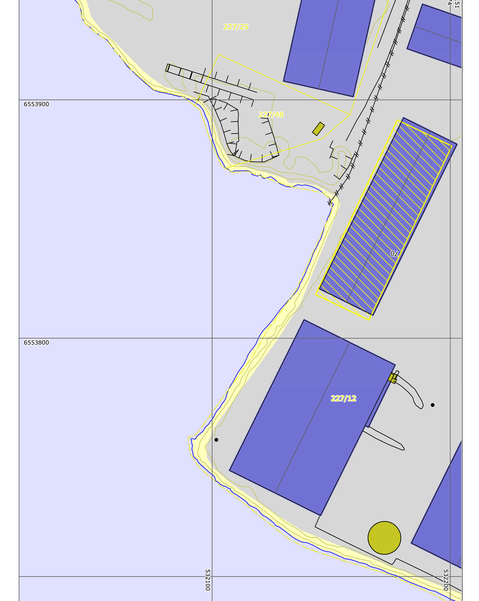

# D1 Situasjonsplan – Vollsfjorden flytende solcelleanlegg

| | |
|---|---|
| **Dokumentdato** | 2025-02-18 |
| **Avsender / opphav** | Prosolar AS (tegning D1_Situasjonsplan, Rev1) |
| **Kildefil** | `funding/background/nye/Vollsfjorden Solkraftanlegg/Tillatelse/D1 situasjonsplan.pdf.pdf` |
| **Konvertert** | 2026-08-21 med `pdftotext -layout` + `scripts/extract_pdf_images.py` + `scripts/insert_pdf_page_images.py` |

> Automatisk konvertert fra PDF. Layout fra `-layout` er beholdt. Bilder ligger i `images/tillatelse_d1_situasjonsplan/` og er lenket inn nederst på hver side.

---

                                                                                               N

                                           ,06
                                       48

                                                 36

                     ,54
                                                   ,42

                   61

                                                                     48,72

                                                         23,    36,
                                                             91     23

                                       FASE 2

                           FASE 1

Tegnforklaring:            Prosjekt:                       Rev1: -           Tegning:      D1_Situasjonsplan
                           Prosolar AS                     -                 Dato:         18/02/2025
Solcellepaneler
                           Havnevegen 70                   Rev2: -           Målestokk: 1:1000
                           3739 Skien                      -                 Prosjektnummer: 25912
Sjømerker (bøye)
Eks. Terreng               227/12, Skien                   Rev3: -           Produsert av:
Eiendomsgrense                                             -
Byggegrense                                                                           18/02/2025

