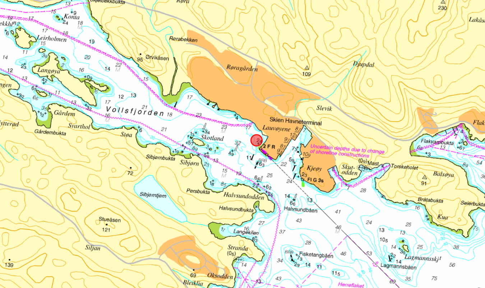

# Tillatelse til plassering av flytende solcelleanlegg – Skien Havneterminal, Vollsfjorden

| | |
|---|---|
| **Dokumentdato** | 2025-09-11 |
| **Avsender / opphav** | Kystverket (vedtak, ref. 2025/1079-19) |
| **Kildefil** | `funding/background/nye/Vollsfjorden Solkraftanlegg/Tillatelse/Tillatelse til plassering av flytende solcelleanlegg - Skien Havneterminal - Vollsfjorden - Skien kommune - Telemark fylke.pdf` |
| **Konvertert** | 2026-08-21 med `pdftotext -layout` + `scripts/extract_pdf_images.py` + `scripts/insert_pdf_page_images.py` |

> Automatisk konvertert fra PDF. Layout fra `-layout` er beholdt. Bilder ligger i `images/tillatelse_plassering_flytende_solcelleanlegg_skien_havneterminal/` og er lenket inn nederst på hver side.

---

PROSOLAR AS
Elsetvegen 65
3731 SKIEN

Deres ref.:             Vår ref.:            Arkiv nr.:          Saksbehandler:                           Dato:
                        2025/1079-19                             Jan Olsen                                11.09.2025

Tillatelse til plassering av flytende solcelleanlegg - Skien Havneterminal -
Vollsfjorden - Skien kommune - Telemark fylke
Kystverket viser til søknad fra CK Norbygg AS på vegne av Prosolar AS, datert 24. februar
2025. Kystverket gjorde 18. mars 2025 oppmerksom på at tiltaket krever tillatelse etter
havne- og farvannsloven § 14 tredje ledd bokstav b og at det er Kystverket som er rette
myndighet til å saksbehandle søknader om energianlegg i sjø. Vi fikk oversendt søknaden
fra Grenland Havn IKS 15. april 2025 og fikk ytterligere dokumenter fra Prosolar AS 5. mai
2025.

Vedtak
Med hjemmel i havne- og farvannsloven § 14 tredje ledd bokstav b gir vi tillatelse til
etablering av flytende solcelleanlegg ved Skien havneterminal.

Tillatelsen gis på følgende vilkår, jf. havne- og farvannsloven § 16:
    1. Tiltaket skal utføres som beskrevet i denne tillatelsen/vist i vedlagte tegning og
       kartutsnitt.
    2. Tiltakshaver skal sende inn P-melding før oppstart av arbeidet med å etablere
       tiltaket, herunder informasjonstekst, posisjon, oppstartstidspunkt og forventet
       ferdigstillelse til efs@kartverket.no Informasjon om tiltaket må sendes til Efs i god
       tid for å komme med i neste utgivelse av Efs. Se her for frister. Det er tiltakshavers
       ansvar å sjekke fristene. Arbeidet kan ikke starte før meldingen er publisert.
    3. Når tiltaket er ferdigstilt, skal tiltakshaver sende inn melding om kartrettelse til
       Kartverket. Meldingen skal inneholde følgende:
              a. dokumentasjon om tiltaket ‘as-built’, fortrinnsvis på digitalt format (sosi,
                 shape, gz).
              b. kart (i hensiktsmessig målestokk der tiltaket er nøyaktig inntegnet)
              c. posisjoner i WGS-84 datum
    4. Informasjon om tiltaket sendes til Kartverket via Rett i kartet Sjøkart eller til
       efs@kartverket.no. Det skal sendes kopi til post@kystverket.no med emnetittel
       «ferdigstilt tiltak + saks/-referansesnummer».

 Avdelinga for hav- og kystforvalting
 Sentral postadresse:    Kystverket                  Telefon:     +47 07847                 Internett:   www.kystverket.no
                         Postboks 1502                                                      E-post:      post@kystverket.no
                         6025 ÅLESUND
 For besøksadresse se www.kystverket.no              Bankgiro:    7694 05 06766             Org.nr.:     NO 874 783 242
 Brev, sakskorrespondanse og e-post bes adressert til Kystverket, ikke til avdeling eller enkeltperson

       Hvis tiltaket senere fjernes permanent, skal informasjon om dette sendes til
       Kartverket via Rett i kartet Sjøkart. Kopi skal sendes til Kystverket til
       post@kystverket.no med emnetittel «fjerning av godkjent tiltak + saks/-
       referansenummer».
   5. Anleggets ytterpunkt merkes med gult blinkende lys med karakterer LFI 5s.
      Farvannet er skjermet og det er ikke behov for intens karakter.
   6. Ved permanent opphør av bruken av installasjonen/anlegget skal tiltakshaver sørge
      for fullstendig opprydding, herunder fjerning av installasjoner over og under vann.
      Fullstendig opprydding skal være fullført senest innen 6 måneder etter opphør.
      Melding om dette skal sendes Kystverket.

1. Sakens bakgrunn
Saken gjelder søknad om tillatelse til å etablere et flytende solcelleanlegg i Grenland Havn
i Skien kommune. Tiltaket er midlertidig i inntil to år og etableres i to faser. Første fase
omfatter et anlegg bestående av 9 flåter med et areal på ca. 270 m2. Andre fase omfatter
en utvidelse til totalt 54 flåter med et samlet areal på 1620 m2. Samlet sett vil dette utgjøre
1890 m2 i løpet av år to. Tiltaksområdet er avsatt til havn samt bruk og vern av sjø og
vassdrag i kommuneplanens arealdel. Området er regulert til havn og havneområde i sjø
gjennom reguleringsplan for Voldsfjorden industriområde.

                                                                                                  Side 2

Parter og andre interessenter har hatt anledning til å uttale seg om saken jf. forvaltningsloven
§ 16. Søknaden med relevant informasjon ble sendt til uttalelse med fire ukers høringsfrist.
Kystverket har mottatt uttalelser og disse oppsummeres kort her:
   -   Norsk maritimt museum kjenner ikke til kulturminner på stedet og ser heller ikke
       behov for arkeologiske forundersøkelse.
   -   Fiskeridirektoratet ser ikke at det flytende solcelle anlegget rører ved deres interesser
       og har ingen innvendinger til at det gis midlertidig tillatelse.
   -   Skien kommune uttaler at tiltaket i utgangspunktet ikke er i tråd med plan. Siden
       tiltaket er midlertidig og ikke innebærer arealinngrep som setter synlige varige spor,
       så har ikke reguleringsplanen bindende virkning og således er tiltaket ikke i strid med
       plan.
   -   Grenland havn IKS vurderer at plasseringen ikke er i konflikt med ordinær
       havnevirksomhet. Det påpekes at det bør stilles krav til en forpliktende plan for
       beredskap og opprydding.
   -   Statsforvalterens miljøavdeling har ingen merknader til saken.
   -   Forsvarsbygg har ingen merknader til saken.

2. Kystverkets vurdering av saken
Etter Kystverkets vurdering kan omsøkte tiltak “påvirke sikkerheten, ferdselen eller
forsvars- og beredskapsinteresser i farvannet” og krever derfor tillatelse etter havne- og
farvannsloven § 14. Som tiltak regnes innretninger, naturinngrep og aktivitet jf. første ledd
andre punktum. Flytende solcelleanlegg i sjø er ansett som energianlegg i sjø. Etter havne-
og farvannsloven § 14 tredje ledd bokstav b, og Samferdselsdepartementets delegering er
Kystverket tillatelsesmyndighet i saken.
Tillatelser etter havne- og farvannsloven § 14 kan ikke gis i strid med vedtatte arealplaner
etter plan- og bygningsloven jf. havne- og farvannsloven § 14 fjerde ledd. Skien kommune
vurderer at omsøkte tiltak ikke er i strid med plan
2.1 Kystverkets vurdering av sjøtransport- og havneinteresser
Det er ikke registrert AIS data i umiddelbar nærhet av planlagte anleggslokasjon. Utenfor
det omsøkte anlegget viser dataene at trafikken i området er moderat, 142 passeringer fra
januar 2024 til mars 2025, med en betydelig andel på 108 passeringene utført av
offshorefartøy og spesialfartøy. Trafikken varierer noe gjennom året, med en topp i
sommermånedene.
Tiltaket vil ikke skape noen kjente utfordringer for sikkerhet eller framkommelighet i
farvannet.

2.2 Havne og farvannsloven § 14 jf. § 1. Kystverkets ansvar for miljøvurdering.
Ved vurdering om det skal gis tillatelse etter havne- og farvannsloven § 14 skal det også
vurderes om tiltaket legger til rette for en “miljøvennlig drift av havn og bruk av farvann” jf.
havne- og farvannsloven § 1. Hensyn til miljø skal i henhold til forarbeider vurderes bredt.
Kystverket er videre bundet av prinsippene i naturmangfoldloven (§§ 8-12) som legger til
grunn at et forvaltningsorgan må sikre at tiltaket sikrer biologisk mangfold og bærekraftig
bruk og vern av områder. Det skal også gjøres en vurdering etter vannforskriften § 12 når
det fattes enkeltvedtak som innebærer ny aktivitet eller nye inngrep i et område som
omfattes av forskriften. Hensyn til miljøet skal vurderes opp mot tiltakets art og
samfunnsnytte.

                                                                                                   Side 3
Tiltaket vurderes å ikke påvirke biologisk mangfold eller vannkvaliteten negativt og er i tråd
med naturmangfoldloven og vannforskriften.

3. Konklusjon
På bakgrunn av vurderingene ovenfor har vi kommet til at vi kan gi tillatelse til søknaden
om midlertidig etablering av flytende solcelleanlegg som omsøkt. Avgjørende for utfallet av
saken har vært at tiltaket vurderes å ikke skape utfordringer for sjøtrafikken.
Det fremgår av havne- og farvannsloven § 16 siste ledd at tillatelsen faller bort hvis
arbeidet med tiltaket ikke er satt i gang innen tre år etter at tillatelsen ble gitt. Det samme
gjelder hvis arbeidet med tiltaket blir innstilt i mer enn to år. Kystverket kan forlenge fristen
én gang med inntil tre år.
Vedtaket med vilkår finner du fremst i dette brevet.

4. Rett til å klage
Dette er et enkeltvedtak som søkeren og andre med rettslig klageinteresse kan klage på
innen 3 – tre – uker etter at dette brevet er kommet frem. Se vedlagte Orientering om
klageadgang.
Muligheten til å klage må være benyttet før søksmål om gyldigheten av vedtaket eller krav
om erstatning som følge av vedtaket reises, jf. forvaltningsloven § 27b. Søksmål kan likevel
reises når det er gått seks måneder fra klage første gang ble framsatt, og det ikke skyldes
forsømmelse fra klagerens side at klageinstansens avgjørelse ikke foreligger.
Vi presiserer at vedtaket er basert på reglene i havne- og farvannsloven og ikke annet lov-
og regelverk. For eksempel kan tiltaket være søknadspliktig etter plan- og bygningsloven,
og det må tiltakshaver selv undersøke med kommunen. Videre må forholdet til
kulturminnelovgivningen og forurensningsloven avklares med vedkommende myndighet.
Havne- og farvannsloven regulerer ikke nabo- eller eiendomsforhold. Slike forhold er derfor
ikke vurdert i forbindelse med dette vedtaket. Søkeren må selv innhente nødvendig
samtykke fra grunneiere og andre rettighetshavere. Kystverket har ikke ansvar for å følge
opp dette. Privatrettslige tvister mellom partene avgjøres enten gjennom avtale eller av
domstolene.

Med hilsen

Ruben Alseth                                             Jan Olsen
avdelingsleder                                           seniorrådgiver

Dokumentet er elektronisk godkjent

Eksterne kopimottakere:
 Grenland Havn IKS                   Strømtangvegen 39                3950        BREVIK

Vedlegg:
Vedlegg:

                                                                                                    Side 4
1   D1 situasjonsplan.pdf

                            Side 5
ORIENTERING OM KLAGEADGANG
KLAGEORGAN
Enkeltvedtak fattet av Kystverket kan påklages til Nærings- og fiskeridepartementet, jf.
forvaltningsloven § 28.

Klagen skal sendes til Kystverket per e-post til post@kystverket.no eller per post til
Kystverket, Postboks 1502, 6025 ÅLESUND.
KLAGEFRIST
Klagefristen er 3 uker fra den dag dette brevet kom frem, jf. forvaltningsloven § 29. Det er
tilstrekkelig at klagen er postlagt innen fristens utløp. Dersom klagen kommer for sent, kan
Kystverket se bort fra klagen. Det kan søkes om å få forlenget fristen, men da må man
oppgi årsaken til dette, jf. forvaltningsloven §§ 29 og 31.
KLAGENS INNHOLD
Klagen må inneholde følgende, jf. forvaltningsloven § 32:
   -   hvilket vedtak det klages over
   -   den eller de endringer som ønskes
   -   eventuelle andre opplysninger som kan ha betydning for vurderingen av klagen
I tillegg bør man nevne de grunner klagen støtter seg til. Klagen må undertegnes.
UTSETTING AV GJENNOMFØRING AV VEDTAKET
Selv om det er klageadgang på et vedtak, kan vedtaket vanligvis gjennomføres straks.
Førsteinstansen, klageinstansen eller annet overordnet organ, kan beslutte at vedtak
likevel ikke skal iverksettes før klagefristen er ute eller klagen er avgjort, jf.
forvaltningsloven § 42. Man kan søke om å få utsatt gjennomføringen av et vedtak til
klagefristen er ute eller til klagen er avgjort (søke om oppsettende virkning av klagen), jf.
forvaltningsloven § 42. Begrunnet søknad sendes til den etaten som er førsteinstans for
vedtaket. En avgjørelse om oppsettende virkning kan ikke påklages.
RETT TIL Å SE SAKSDOKUMENTENE OG TIL Å KREVE VEILEDNING
Med visse begrensninger har en part rett til å se dokumentene i saken, jf. forvaltningsloven
§§ 18 og 19. Parten må i tilfelle ta kontakt med Kystverket. Man vil da få nærmere
veiledning om adgangen til å klage, om fremgangsmåten og reglene om saksbehandlingen.
KOSTNADER VED KLAGESAKEN
En part kan kreve dekning for vesentlige kostnader i forbindelse med klagesaken, jf.
forvaltningsloven § 36. Forutsetningen er da vanligvis at det organet som traff det
opprinnelige vedtaket har gjort en feil slik at vedtaket blir endret.
Det kan også søkes om å få dekket utgifter til nødvendig advokathjelp etter reglene om fritt
rettsråd. Vanligvis gjelder visse inntekts- og formuesgrenser. Klageinstansen eller partens
advokat kan gi nærmere opplysninger om dette.
KLAGE TIL SIVILOMBUDET
Hvis man mener å ha vært utsatt for urett fra den offentlige forvaltnings side, kan man
klage til Stortingets ombud for forvaltningen (Sivilombudet). Sivilombudet kan ikke selv
endre vedtaket, men kan gi sin vurdering av hvordan den offentlige forvaltning har
behandlet saken, og om det er gjort eventuelle feil eller forsømmelser.

                                                                                                Side 6
