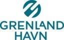

# Søknad oversendes til Kystverket for vurdering etter havne- og farvannsloven § 14 tredje ledd bokstav b

| | |
|---|---|
| **Dokumentdato** | 2025-04-15 |
| **Avsender / opphav** | Grenland Havn IKS (ref. 23/59-12/WALAHL) |
| **Kildefil** | `funding/background/nye/Vollsfjorden Solkraftanlegg/Tillatelse/Søknad oversendes til Kystverket for vurdering om behandling etter Lov om havner og farvann §14 b n.pdf` |
| **Konvertert** | 2026-08-21 med `pdftotext -layout` + `scripts/extract_pdf_images.py` + `scripts/insert_pdf_page_images.py` |

> Automatisk konvertert fra PDF. Layout fra `-layout` er beholdt. Bilder ligger i `images/tillatelse_soknad_oversendes_kystverket_hfl_14b/` og er lenket inn nederst på hver side.

---

Tonia Hansen

                                                                  Dato:        15.04.2025
                                                                  Referanse:   23/59 - 12 / WALAHL

Søknad oversendes til Kystverket for vurdering om
behandling etter Lov om havner og farvann §14 b n

Tilbakemelding på søknad – Flytende solcelleanlegg

Vi viser til søknaden om etablering av flytende solcelleanlegg i sjøområde innenfor vårt
forvaltningsområde.

Etter vurdering har Kystverket konkludert med at tiltaket anses som et energianlegg i sjø, og
at det dermed omfattes av havn- og farvannsloven § 14 tredje ledd bokstav b, som fastslår
at:

"Departementet skal behandle og avgjøre søknader om tiltak i sjø når tiltaket gjelder [...] b)
energianlegg, kabler, rørledninger og lignende anlegg."

I tråd med dette har Kystverket bedt om at saken oversendes dem for videre vurdering om
tiltaket skal saksbehandles av Kystverket.

Undertegnede vil da oversende deres søknad til Kystverket.

Med vennlig hilsen
Walter Ahlgreen
havnekaptein
wa@grenland-havn.no

Dokumentet er elektronisk godkjent og har derfor ingen signatur

Kopi til
Grenland Havn IKS                     Strømtangvegen 39                 3950        Brevik
Kystverket

 Grenland Havn IKS                    Telefon      35 93 10 00            grenland-havn.no
 Strømtangvegen 39                    Org. nr.     970 940 510            ghv@grenland-havn.no
 3950 Brevik

Side 2 av 2
