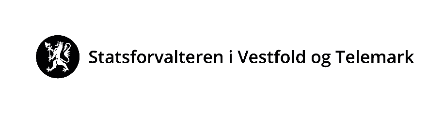

# Uttalelse – Skien havneterminal, Vollsfjorden – flytende solcelleanlegg

| | |
|---|---|
| **Dokumentdato** | 2025-06-03 |
| **Avsender / opphav** | Statsforvalteren i Vestfold og Telemark (ref. 2025/3191) |
| **Kildefil** | `funding/background/nye/Vollsfjorden Solkraftanlegg/Tillatelse/Uttalelse Statsforvalteren.pdf` |
| **Konvertert** | 2026-08-21 med `pdftotext -layout` + `scripts/extract_pdf_images.py` + `scripts/insert_pdf_page_images.py` |

> Automatisk konvertert fra PDF. Layout fra `-layout` er beholdt. Bilder ligger i `images/tillatelse_uttalelse_statsforvalteren/` og er lenket inn nederst på hver side.

---

                                                       Vår dato:                        Vår ref:

                                                       03.06.2025                       2025/3191

                                                       Deres dato:                      Deres ref:

                                                       09.05.2025                       2025/1079-7

Kystverket sørøst                                      Saksbehandler, innvalgstelefon

Postboks 1502                                          Andreas Riis Fossnes, 33371209
6025 ÅLESUND

Uttalelse - Skien havneterminal - Vollsfjorden - flytende solcelleanlegg -
Prosolar AS

Vi viser til oversendelse fra Kystverket datert 09.05.2025.

Saken gjelder
Saken gjelder søknad om tillatelse til å etablere et flytende solcelleanlegg i Grenland Havn i Skien
kommune. Kystverket behandler saken etter havne- og farvannsloven § 14 og har bedt om uttalelse
fra kommunen og øvrige myndigheter inkludert Statsforvalteren. Dersom kommunen vurderer at
denne saken i tillegg vil kreve dispensasjon etter plan- og bygningsloven § 19-2, vil Statsforvalteren få
denne til uttalelse før det kan gis tillatelse.

Tiltaket er midlertidig i inntil to år og etableres i to faser. Første fase omfatter et anlegg bestående av
9 flåter med et areal på ca. 270 m2. Andre fase omfatter en utvidelse til totalt 54 flåter med et samlet
areal på 1620 m2. Samlet sett vil dette utgjøre 1890 m2 i løpet av år to.

Tiltaksområdet er avsatt til havn samt bruk og vern av sjø og vassdrag i kommuneplanens arealdel.
Området er regulert til havn og havneområde i sjø gjennom reguleringsplan for Voldsfjorden
industriområde.

Rollen til Statsforvalterens fagavdelinger
Statsforvalterens fagavdelinger skal ivareta nasjonale og viktige regionale interesser innen miljøvern,
klima, landbruk, samfunnssikkerhet, folkehelse, barn og unges interesser og gravplasser.

Miljøavdelingens vurdering
Naturmangfold
Det er registrert en forekomst av algen sjøglattkrans (Tolypella nidifica), en art som er vurdert
som sterkt truet (EN) på Norsk rødliste for arter, ca. 160 meter fra det planlagte tiltaksområdet.
Arten er kjent for å vokse på grunt vann, vanligvis grunnere enn 2 meter, og unntaksvis ned til 10
meters dyp.

E-postadresse:                    Postadresse:        Besøksadresse:                    Telefon: 33 37 10 00
sfvtpost@statsforvalteren.no      Postboks 2076       Grev Wedels gate 1,               www.statsforvalteren.no/vt
Sikker melding:                   3103 Tønsberg       3111 Tønsberg
www.statsforvalteren.no/melding                                                         Org.nr. 974 762 501

                                                    Side: 2/2

Funnet er av eldre dato og vurderes som sannsynligvis unøyaktig angitt. Området der funnet er
registrert er sterkt nedbygd, og stemmer dårlig overens med artens kjente leveområder. I tillegg er
det utført utfylling i sjøen ved det angitte funnstedet, noe som ytterligere svekker sannsynligheten
for at arten finnes der i dag. Dybdedata viser at tiltaksområdet for solcelleanlegget, som ligger ca.
160 meter fra funnstedet, har en dybde på ca. 8–16 meter, noe som er betydelig dypere enn artens
kjente leveområder.

På bakgrunn av dette vurderer vi at funnet ikke er relevant her og har ingen ytterligere merknader til
saken.

Med hilsen

Astrid Lie Olsen (e.f.)                             Andreas Riis Fossnes
plansjef                                            seniorrådgiver

Dokumentet er elektronisk godkjent

Kopi til:
 Skien kommune                            Postboks 158                        3701      SKIEN
 Telemark fylkeskommune                   Postboks 2844                       3702      SKIEN
 Fiskeridirektoratet                      Postboks 185 Sentrum                5804      BERGEN
 Grenland Havn IKS
