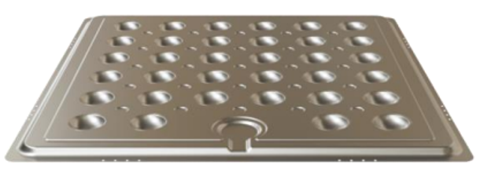
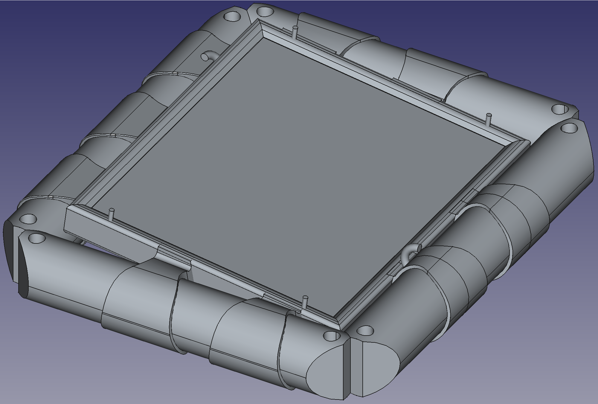
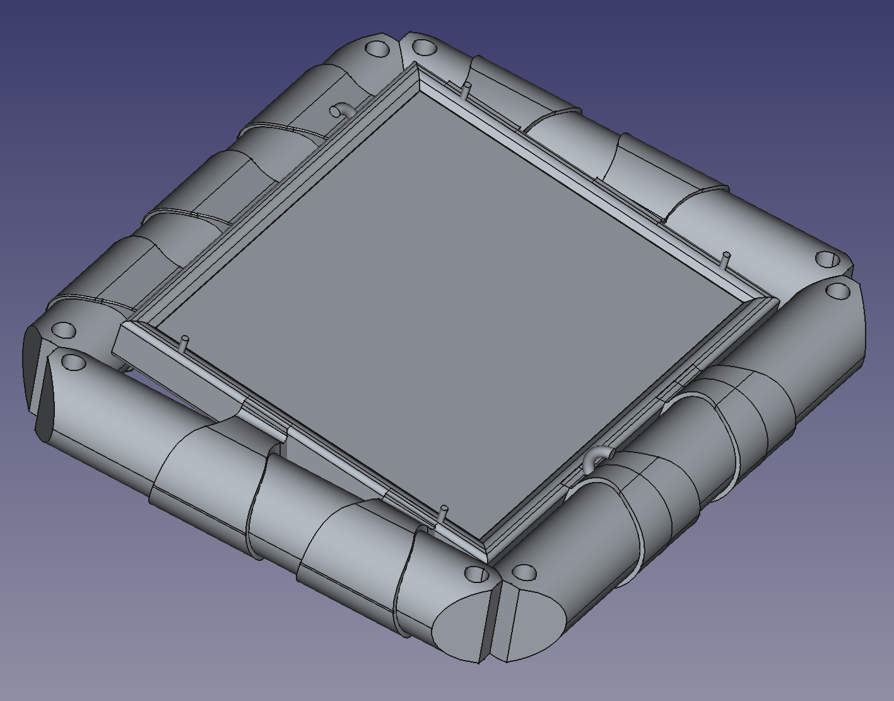
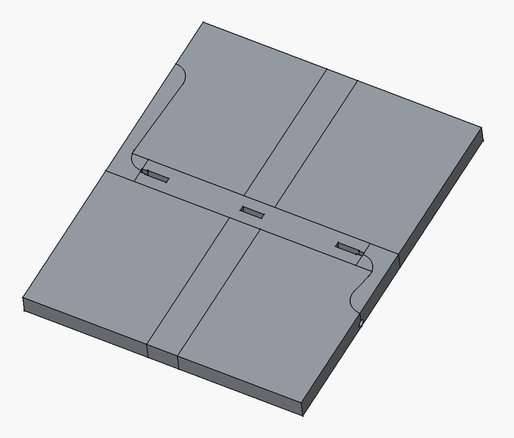
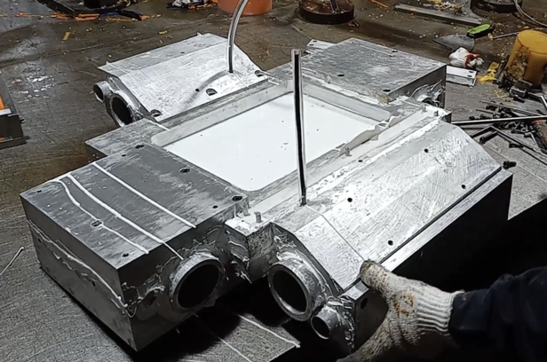
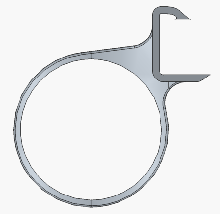
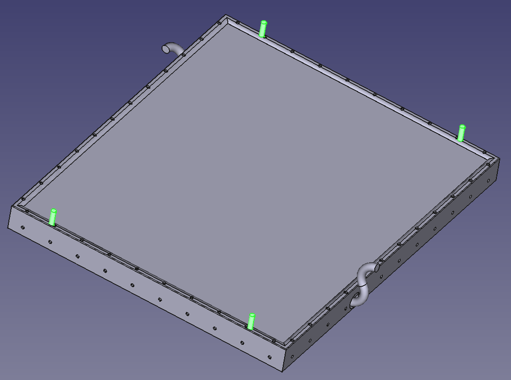

## Purpose of this brief

We are exploring a working collaboration with Norsmaterials on the polyurethane parts of our Gen 2 floating photovoltaic (FPV) product. This document is written for your R&D team, so we start the technical conversation from the same baseline: where we are, how we got here, and what we want to learn from each test cast.

We are calibrating deliberately: we skip PU-fundamentals (you know that better than we do) and instead focus on the specifics of our geometry, our interfaces, our environment and our development schedule.

---

## Who we are

Sunlit Sea AS is a Norwegian FPV company. We design, manufacture and deploy floating photovoltaic units for calm-to-moderate sea states, with a target 25-year aquatic operating life. Our first-generation product (Gen 1) is deployed; we are now developing Sunlit Sea CONNECT gen. 2, a full redesign that targets the cost point where floating PV competes with turnkey EPC solar-park economics globally (€300–€1800/kWp depending on market), while remaining certifiable to the same durability standards. The current TRL is 5–6; prototype 4 is next and pilot deployment is planned first half of 2026.

{width=451px}

We are a partner in the Horizon Europe SuRE project (WP6), where our task is to build and demonstrate a full model chain covering pressing simulation, structural response, thermal behaviour and life-cycle impact for successive Gen 2 prototypes. The D6.1 deliverable (Model chain description) has been submitted; D6.2 (Multi-domain design screening) is in preparation.

Norwegian project pipeline lined up for Gen 2 rollout:

- Skien havn — a ~300 kWp deployment, coming up first. Near-term.
- Storavatnet in Haugaland Næringspark — a 3.2 MWp phase-1 build with 30–50 MW long-term capacity, in partnership with Endra, Fagne and Haugaland Næringspark. Intended as Gen 2's flagship reference at commercial scale.
- Gunnekleivfjorden inside Hærøya Industripark — a 3.2 MWp project, a bit later than Storavatnet.

The collaboration with Norsmaterials will directly serve these projects' timelines: their casting capacity and iteration turnaround feed the Norwegian side of the Gen 2 supply chain.

---

## The Gen 1 → Gen 2 story in one page

| Aspect | Gen 1 (deployed) | Sunlit Sea CONNECT gen. 2 (in development) |
|---|---|---|
| PV | Custom-integrated PV modules, assembled at our factory | Standard commercial 710–740 Wp panels — decoupled from the float, dropped in at deployment |
| Float body | Two pressed aluminium half-shells, bonded, air-filled | Aluminium bottom plate + cast PU frame around the panel |
| Module size | Panel-integrated float, custom panel dimensions | End product target: utility-scale panel footprint, 2384 × 1303 mm per module (matching the standard 710–740 Wp panels above). Current prototypes P3 and P4 are cast at a scaled-down ~55 × 70 cm mock footprint for fast iteration; the geometry scales up once the P4/P5 architecture is frozen. |
| Aluminium sheet | 1.5 mm (5083-H111) | 0.8 mm (5083-H111). Base case: flat sheet attached directly to the PV panel frame. Hydroforming into a cup geometry is under evaluation as an alternative — the SuRE D6.1 pressing pipeline explored the cup-forming route via FEM — but flat is currently the more likely choice for the shipping product. |
| Infill / structure | Polystyrene cup infill | Cast PU frame wrapping around the PV panel frame and bonded to the panel glass and the aluminium bottom plate (structural, not just infill), plus interior infill — most likely a cast-in-place PU foam, possibly reinforced with a large-cell aluminium honeycomb, or alternatively pre-cast PU pieces fitted in place with a gel-like adhesive |
| PU top layer | Dark blue, absorptivity 0.88–0.91 measured | Prototypes P1, P2 and P3 have all used dark blue PU (P3 was primarily a water-ingress test on the dark PU). An off-white variant was tried alongside on P3 to see if it would solve the Gen 1 over-heating problem — thermal picture improved as expected (absorptivity ~0.35 by colour), but UV durability was still unacceptable. Off-white is not a confirmed Gen 2 direction; actively searching for a better UV-resistant PU — this is a top ask of the Norsmaterials collaboration. |
| Distance PV → water | 8.5 cm | 6 cm at the lowest edge — the panel sits at a 2° tilt, so the opposite edge sits higher |
| Hinge / connection | Rigid inter-panel connection assembled at factory | Revised hinge geometry (based on Surewave wave-tank findings) with PU-foam connector rods |
| Manufacturing | Fully in-house at Askim (now wound down) | Prototype casting at Tongge (Weihai, China) for P3. In-house prototype casting has now started in Norway with 3D-printed moulds — looking for a collaboration partner to accelerate and inform it. Open to full Norwegian production for the shipping product if it can be cost-competitive with the Tongge route. |
| Design driver | Empirical iteration | Risk-based, model-chain-driven iteration across four domains (pressing, structural, thermal, LCA) |
| Cost target | n/a — Gen 1 was a small-volume specialty product; cost was never targeted at commodity EPC scale | Set by the market, not by Gen 1. Large glass/glass PV panels run around €130/kWp from China today. Turnkey EPC delivery of a solar park runs €300–€1800/kWp depending on market. To compete across that whole range, our Gen 2 production cost on top of the solar-panel cost must stay at or below ~€70/kWp — leaving roughly €100/kWp for logistics, inverters, electrical work and installation (the low end of the EPC range typically excludes some of these). |

Two evolutions shaped Gen 2. First, the Gen 1 hinge design showed weaknesses in Surewave wave-tank testing — the hinge is being fully redesigned for P4. Second, market prices for standard PV panels have fallen much faster than for the specialised panels Gen 1 used, so Gen 2 decouples panel assembly from float manufacture: buy standard panels, drop them into cast PU frames on aluminium bottoms.

{width=451px}

{width=451px}

The Gen 1 dark-blue PU absorptivity caused significant panel over-heating; that finding motivated an off-white PU evaluation on Gen 2 Prototype 3, run alongside the primary water-ingress test on dark blue PU. The off-white variant improved the thermal picture as expected but its UV durability was still unacceptable, so off-white is not a confirmed Gen 2 direction. Finding a PU formulation that solves both the thermal and the UV problems simultaneously is now one of the top reasons for this Norsmaterials collaboration.

On the aluminium bottom, the current base case is a flat 0.8 mm sheet attached to the PV panel frame — simpler and cheaper than any forming step, and the more likely direction for the shipping product. A pressed-cup variant produced by hydroforming remains under evaluation as an alternative (the SuRE D6.1 pressing pipeline established that hydroforming avoids the tool wear and thinning risks of the punch/die route we started from, so if we do end up forming, hydroforming is the route). The choice between flat and pressed will be settled by the D6.2 multi-domain screening.

---

## Where PU sits in Gen 2

PU has three distinct roles in Sunlit Sea CONNECT gen. 2 — this is a change from Gen 1's single PU underside layer:

1. Cast PU frame (new in Gen 2) — the structural element that holds the standard PV panel and mates with the aluminium bottom plate. Carries the mechanical load, seals the panel edge, takes UV on the topside and salt-water contact on the underside. This is the largest single PU volume in the module and where we need Norsmaterials' guidance most.

    {width=451px}

2. Interior infill (most likely PU foam) — where the geometry calls for it, blocks the thermal-bridge path from the PV lamination stack down through the cup and into the sea. The base case is a cast-in-place PU foam; alternatives under evaluation are pre-cast PU pieces bonded with a gel-like adhesive (see the puzzle-fit concept in the figure below) and PU foam reinforced with a large-cell aluminium honeycomb for added stiffness (which would also reintroduce a limited thermal bridge — see open question B below). Whether we *want* the thermal bridge is a separate open architectural question.

    {width=451px}

3. PU-foam connector rods — inter-module connecting elements in the CONNECT hinge system. Buoyant, flexible enough for hinge motion, resistant to salt-water fatigue.

    {width=451px}

Two architectural decisions on PU are still open, and they are what we most need help thinking through:

- A. Cast-on-frame vs. separate-and-mount. Cast-on-frame means we cast PU directly onto the aluminium float body (flat sheet or pressed cup, depending on the pending forming decision). Separate-and-mount means we produce PU parts independently and bond them at assembly. We must decide before we build P5.
- B. Whether to reintroduce a controlled thermal bridge via a pressed-cup or honeycomb-aluminium infill topology. This is an open D6.2 question.

---

## What we've measured, and what we haven't

| Measurement | Status |
|---|---|
| Gen 1 dark-blue PU absorptivity | Measured 0.88–0.91 (spectral reflectance 300–1650 nm, AM1.5G-weighted, four measurements on two samples, front and back) |
| Gen 1 dark-blue PU emissivity | Measured ε = 0.85 (average of 0.80 and 0.90, handheld IR camera calibrated against black electrical tape as ε ≈ 0.95) |
| Dark-blue PU thermal stability (informal) | After ~2 h sun exposure at ~45 °C ambient, the dark-blue PU showed visible softening and emitted a noticeable odour — safety-relevant observation for design temperature limits |
| Off-white PU absorptivity (tried alongside dark blue on Gen 2 Prototype 3) | Expected ~0.35 from colour, not yet measured |
| PU tensile behaviour across three Shore hardness grades | 70A, 80A, 90A tested in coupon form. C+ 85A grade reached ~6 MPa at ~400 % strain; higher-quality 70A and 80A grades exceeded 10 MPa at >750 % strain without breaking (lower bound — samples slipped from grips even after roughening) |
| Accelerated UV on dark PU (condition A3) | IEC TS 62788-7-2 A3 (65 °C chamber, 90 °C black-panel, 0.8 W/m² at 340 nm, 80 % RH). Test stopped at 209 h of a planned 1000 h due to severe degradation: darkening and burn marks. 70A/80A softened badly, 90A blackened but stayed hard. Sample temperature reached ~95 °C, exceeding PU stability. Revised programme uses condition A1 (45 °C chamber, 70 °C black-panel) |
| UV mass gain on minipatches | 2–8 g increase vs. zero on references — suggestive of moisture ingress, inconclusive at this exposure length |
| Design limit used in modelling for PU hinge peak T | 70 °C — evaluated as a screening metric in the thermal CFD |
| Gen 2 P3 UV on off-white PU (condition A1) | Evaluated — UV damage still unacceptable. Off-white is not confirmed for Gen 2; searching for a better UV-resistant PU formulation. |
| P3 adhesion — shear (PU/glass, long sides) and tensile (loose hinges) after UV | Methodology adapted after initial cutting attempt shattered tempered glass — hinges removed from one sample, remaining box + loose hinges exposed. Testing in progress at IFE |
| Aluminium material card (Al 5083-H111) | Complete: r0 ≈ 0.71, r45 ≈ 0.84, r90 ≈ 0.64, rbb ≈ 1.13 (Yld2003 + Voce fits) |
| P4 SiSim structural results | Aluminium bottom + frame stresses approaching yield under 10 mm horizontal elongation; PU stresses exceeded yield in localised regions; glass stresses highest near PU-ring attachment |
| P4 buoyancy | Under self-weight alone, ~half of the bottom plate is submerged. Need increased buoyancy volume or reduced module weight for adequate freeboard (design constraint feeding into P5) |
| P4 mould cast | Started |
| 25-year aquatic durability, real conditions | Not tested. A primer we are aware of reports ~20 years aquatic — we need 25 — dedicated testing required |

---

## Development pipeline that Norsmaterials would plug into

We are running a risk-based, prototype-per-cycle development approach: P1 → P2 → P3 (built, in test) → P4 (mould cast started) → P5 (design pending). Each prototype is designed with input from the four modelling domains (pressing feasibility, structural response, thermal behaviour, life-cycle impact), and each is tested against the failure modes that are highest-risk at that stage.

The model chain that supports this is documented in SuRE D6.1 and — for the pressing side — generates ~1,300 feasible cup geometries that are then screened structurally, thermally and by LCA (D6.2, in progress). This means the design space we are casting into is *large* and *ranked* — we are not casting a single geometry blindly and hoping.

Mould and casting workflow already in place. Moulds for the cast PU components are designed inside the same FreeCAD parametric model that generates the structural design, so mould geometry stays consistent with the current design state. The workflow progression is:

1. 3D-printed mould for rapid iteration — a design change becomes a new printed mould in a short cycle.
2. Casting onto mock solar panels (glass + bottom plate + frame) to produce prototypes representative of the integrated unit.
3. Inspection and functional testing.
4. Once a mould geometry proves viable, promotion to a multi-part metal (aluminium) mould suitable for production-representative casting. Prototype 3 was cast in a metal mould of this kind at our current casting vendor (Tongge, Weihai, China).

{width=451px}

{width=451px}

For a Norsmaterials collaboration to plug into this cleanly, we would need:

- A shared understanding of which candidate geometries are being cast when.
- A per-cast learning objective — what specifically is each cast testing?
- A per-cast feedback pass — your observations on castability, cure, adhesion behaviour, defects, surface finish, mould release.
- A running list of test-plan revisions that we and you both agree to.

Norsmaterials fits into this workflow in two places: (a) collaborating on the in-house prototype casting we have already started in Norway — bringing PU-formulation, mould-design and cure-behaviour expertise to the 3D-printed-mould step so we iterate faster and pick the right materials from the start; and (b) advising on — and potentially producing — the promotion of viable geometries to metal moulds for the next production-representative casts. Longer term, if the economics can match the Tongge route, we are open to shifting the shipping product's PU production to Norway as well.

---

## Design constraints Norsmaterials should know about

- Hinge halves are cast integrally with the float-structure as a single cast unit on each of the four sides of the module. This means the mould must accommodate the hinge features, and the PU formulation must serve both the flat float-structure sections and the geometrically demanding hinge halves.

    {width=451px}
- PU foam connector rods run along all four sides of the module, serving as both structural interconnection and buoyancy. Different PU formulation from the frame (lower density, higher flexibility).
- Grounding pins pass through the cast PU — four conductive pins extending upward through the float-structure at the corners of the PV panel frame. Required because the cast PU covers the panel's conventional grounding holes; the pins re-establish the electrical bonding path. The mould / casting process must accommodate these pins.

    {width=451px}
- Design principle for hinges (from SuRE structural modelling). Loads between neighbouring floats should be absorbed as close to the centre of the connection point as possible, and as far as possible from the PU-glass and PU-aluminium interfaces, which are the critical water-ingress paths. This shapes the hinge geometry and PU-formulation choice.
- Test framework for structural comparison. A six-load-case × six-measurement-point matrix (XY bending, XZ bending, XY compression, XY stretch, YZ bending, XZ shear at six interface locations) has been defined and is applied across successive prototype revisions. This is available for the Norsmaterials collaboration to use as a reference for what "better" means quantitatively.
- Combined UV + heat is substantially more severe than either alone. The 209 h condition-A3 failure was driven by combined loading; PU choices need to survive both stressors simultaneously, not one at a time.
- P4 buoyancy shortfall. With current geometry and PU density, the module sits low in the water. Reducing cast PU mass or moving to a lower-density formulation is on the table for P5.
- Alternative infill concepts under consideration. Beyond a plain cast-in-place PU foam, two variants are on the table: (a) a puzzle-fit infill made of multiple interlocking pre-cast PU pieces designed to fit around junction boxes and cables beneath the glass without leaving air cavities, bonded in place with a gel-like adhesive — offers repair-and-replace friendliness and simpler small moulds; and (b) a PU-foam-plus-large-cell-aluminium-honeycomb variant that adds stiffness (and reintroduces a limited thermal-bridge path — see open question B). Norsmaterials input on gel-like adhesive formulation, castability of small puzzle-fit pieces and interface bonding across both concepts would be useful.

---

## What we want from Norsmaterials — concretely

1. PU formulation choice for three distinct roles. Given the environment (Al 5083-H111 substrate, laminated glass on the topside, seawater, UV, temperature range roughly −10 °C to +50 °C surface, 25-year target), which NORSelast® or NORSfoam® variant fits (a) the cast structural frame (must survive combined UV + heat — dark PU failed at 209 h condition A3, and the off-white variant we tried alongside on Gen 2 Prototype 3 has since also shown unacceptable UV damage), (b) the thermal-bridge-blocking or puzzle-fit infill and (c) the buoyant connector rods (low density, high flexibility, salt-water fatigue)? A hybrid combination across the three is fine — we would rather have three targeted formulations than one compromise material. A better UV-resistant PU for the top layer is our most urgent open item. We have read your public material list (01, 02, S4, EL, PIR, Spray, AF, NORSfoam®) but do not have hardness, temperature or UV data to reason from.
2. Collaboration on our in-house Norway prototype casting. Prototype 3 was cast at Tongge in China. That works for volume but is slow for iterative prototyping. We have started casting in Norway in-house with 3D-printed moulds and want to accelerate that with a partner who brings serious PU-formulation, mould-design and cure-behaviour expertise. Partnering with Norsmaterials would let us close feedback loops in days instead of weeks and reduce the number of Chinese production runs we pay for. Longer term, if the economics can match Tongge's, we are open to shifting the shipping product's PU production to Norway too.
3. Mould-design collaboration — both 3D-printed and metal. Help us design moulds so that each cast teaches us something specific — not just "a part came out." We can supply the geometry (we already have the CAD and, per prototype, the STEP files, all inside a single FreeCAD parametric model). Advice on 3D-print material choice for prototype moulds and on the metal-mould promotion step would both be valuable.
4. Hinge / connector-rod geometry help. The Gen 2 hinge is being redesigned for P4 after Surewave wave-tank testing exposed Gen 1 hinge weaknesses. We would value your view on castability of the revised hinge geometry (integral with the float-structure, one hinge half on each of four sides per module), and on the PU-foam formulation for the connector rods that pass through the hinges.
5. Grounding-pin integration. The cast PU frame must accommodate four conductive grounding pins through the corners of the panel frame. Can these be cast in place, or do we design a pass-through / post-fit approach?
6. Lower-density PU formulation for buoyancy. SiSim (IFE structural simulation) found that Prototype 4 sits low — half of the bottom plate submerged under self-weight alone. Reducing cast PU density or moving load-bearing mass out of the frame is on the table for P5. What are your options?
7. Adhesion strategy for PU-glass and PU-Al 5083-H111 interfaces. Both mechanical and chemical. Pre-treatment recommendations. Note that these interfaces are the identified water-ingress paths — the structural design deliberately routes load *away* from them.
8. Long-term aquatic durability. Any prior work from your aquaculture / marine customers that speaks to 25-year targets in salt water with UV loading and biofouling — especially where the failure mode was PU adhesion rather than bulk PU.
9. Biofouling. You market biofouling-resistant materials for aquaculture. Are any of those directly applicable to a topside FPV panel?

---

## Open questions we want your input on

1. Which NORSelast / NORSfoam variant fits each of the three PU roles (structural frame, thermal-bridge or puzzle-fit infill, connector rods)? A hybrid across the three is fine.
2. Combined UV + heat safety margin. Dark PU failed at 209 h under IEC TS 62788-7-2 condition A3 with sample T ≈ 95 °C. The off-white variant we tried alongside dark blue on Gen 2 Prototype 3 has now also shown unacceptable UV damage under the revised condition A1 protocol. Given a design PU-hinge peak-temperature limit of 70 °C and the 25-year aquatic target, what safety margin should we design for, and which of your variants would actually get us there?
3. Cast-on-frame vs. separate-and-mount — given demoulding, adhesion, field-repair and long-term reliability trade-offs, which architecture do you recommend?
4. Norway-based prototype casting turnaround. For 3D-printed moulds, how fast can you produce a small test batch (a few casts on a mock-panel dummy) with per-cast written feedback on castability, cure, defects, mould release?
5. Metal-mould promotion. For the geometries that graduate from the 3D-printed step, would you produce the metal mould, or would you advise a specialist mould-maker while you do the casting?
6. Grounding-pin integration — can we cast around the pins, or should we design a pass-through / post-fit approach?
7. Lower-density formulation. Given the P4 buoyancy shortfall (~half of bottom plate submerged under self-weight), can we drop cast-PU density enough to give meaningful freeboard back without sacrificing structural performance?
8. What test-cast protocol would you propose to maximise learning per iteration on: (a) adhesion to Al 5083-H111, (b) adhesion to laminated glass, (c) UV / salt-spray / thermal-cycling durability?
9. Any prior projects — public or NDA-restricted — that share our combination of marine + UV + Al-adhesion + biofouling?

---

## What we can share to help you help us

- Gen 1 assembly diagram (all components, bond regions, sealant strategy).
- Gen 1 float photos as built.
- Gen 1 passive-cooling paths.
- Gen 2 Prototype 3 FreeCAD parametric model of the full integrated unit.
- Gen 2 Prototype 4 FreeCAD parametric model with the updated hinge geometry.
- Gen 2 Prototype 3 metal casting mould (multi-part aluminium assembly with hinge and connector features) before and after PU casting.
- Gen 2 Prototype 4 connector-component FreeCAD mould design (carabiner-like locking mechanism with circular bore, snap-fit hooks, adjustment screw).
- Puzzle-fit PU foam infill concept (alternative infill under evaluation).
- Grounding-pin concept (four pins through the corners of the panel frame).
- All CAD available as STEP on request; native FreeCAD parametric files on request.
- Pressing pipeline flow diagram from SuRE D6.1.
- Target cup shape.
- Aluminium material card (5083-H111) with r-values, Voce hardening, Yld2003 fit.
- PU tensile-strip data across three hardness grades (70A, 80A, 90A).
- PU optical characterisation (absorptivity + emissivity, methodology and raw values).
- UV chamber protocols (condition A3 attempted, condition A1 as revised) and the 209-h failure observations.
- Six-load-case × six-measurement-point structural test framework.
- Nathan Roosloot's (IFE) SiSim FEM results for Prototype 4 (peak stresses in Al / PU / glass; buoyancy / freeboard finding).
- Roosloot, Selj and Otnes, IEEE Journal of Photovoltaics, 2024 — the edge-sealant durability methodology (lap shear + failure-mode classification) that our current adhesion testing builds on.

---

## Practical

- Product state: Sunlit Sea CONNECT gen. 2, currently TRL 5–6. Prototype 3 cast at Tongge (Weihai, China) in autumn 2025; prototype 4 in preparation with revised hinge geometry, panel height and sealing.
- Timeline: P4 mould iterations through Q3 2026 (this is where Norway-based prototyping via Norsmaterials would slot in), freeze the P5 architecture in Q4 2026. Norwegian project pipeline the collaboration feeds into: Skien havn (~300 kWp, near-term), Storavatnet at Haugaland Næringspark (3.2 MWp phase 1, with 30–50 MW long-term potential), and Gunnekleivfjorden inside Hærøya Industripark (3.2 MWp, a bit later).
- Next step: a virtual meeting with your R&D team on the questions above, then an on-site session (Sandane or Trondheim) when concrete casts are on the table.
- Contact: Eirik Larsen, Sunlit Sea AS.

---

## Sources for the company profile Norsmaterials shared publicly

- [NORSmaterials home](https://norsmaterials.com/)
- [NORSelast® product page](https://norsmaterials.com/norselast/)
- [NORSmaterials on LinkedIn](https://no.linkedin.com/company/norsmaterials)
