# SUREWAVE-DEMO — Project Gantt

36-month implementation plan (M1–M36). WPs, tasks, milestones and deliverables are extracted from the proposal WP, task, deliverable, milestone and KPI tables and mirror `Surewave_proposal_V1.docx`.

## Work packages

| WP  | Title                                                     | Lead       | Start | End |
| --- | --------------------------------------------------------- | ---------- | ----- | --- |
| WP1 | Management, IP and innovation management                  | SINTEF     | M1    | M36 |
| WP2 | Site characterisation and demonstrator engineering        | Sunlit Sea | M1    | M12 |
| WP3 | Design verification and model validation                  | SINTEF     | M1    | M34 |
| WP4 | Manufacturing, instrumentation and factory acceptance     | Sunlit Sea | M7    | M20 |
| WP5 | Deployment, operation and validation campaign             | CLEMENT    | M15   | M34 |
| WP6 | Business validation, exploitation and dissemination       | EDP        | M1    | M36 |

## Tasks

| ID    | Title                                                          | Lead       | WP  | Start | End | Duration (months) |
| ----- | -------------------------------------------------------------- | ---------- | --- | ----- | --- | ----------------- |
| T1.1  | Administrative, financial and legal coordination               | SINTEF     | WP1 | M1    | M36 | 36                |
| T1.2  | Technical coordination and risk management                     | SINTEF     | WP1 | M1    | M36 | 36                |
| T1.3  | Data management                                                | SINTEF     | WP1 | M1    | M36 | 36                |
| T1.4  | IP and innovation management                                   | Sunlit Sea | WP1 | M1    | M36 | 36                |
| T2.1  | Requirements specification                                     | Sunlit Sea | WP2 | M1    | M6  | 6                 |
| T2.2  | Site characterisation and metocean design basis                | CLEMENT    | WP2 | M1    | M6  | 6                 |
| T2.3  | FPV platform detailed design                                   | Sunlit Sea | WP2 | M4    | M12 | 9                 |
| T2.4  | Breakwater and mooring system design                           | CLEMENT    | WP2 | M4    | M12 | 9                 |
| T3.1  | Integrated design verification                                 | SINTEF     | WP3 | M3    | M12 | 10                |
| T3.2  | Energy yield modelling and assessment                          | EDP        | WP3 | M4    | M18 | 15                |
| T3.3  | Model validation against operational data                      | SINTEF     | WP3 | M24   | M34 | 11                |
| T4.1  | Instrumentation specification                                  | SINTEF     | WP4 | M7    | M9  | 3                 |
| T4.2  | FPV manufacturing                                              | Sunlit Sea | WP4 | M9    | M18 | 10                |
| T4.3  | Breakwater and mooring manufacturing                           | CLEMENT    | WP4 | M9    | M18 | 10                |
| T4.4  | Digital monitoring platform                                    | SINTEF     | WP4 | M9    | M18 | 10                |
| T4.5  | Factory acceptance testing                                     | Sunlit Sea | WP4 | M16   | M20 | 5                 |
| T4.6  | Accelerated ageing and durability assessment                   | Sunlit Sea | WP4 | M12   | M30 | 19                |
| T5.1  | Site preparation, permitting and installation planning         | CLEMENT    | WP5 | M15   | M20 | 6                 |
| T5.2  | Installation and commissioning                                 | CLEMENT    | WP5 | M21   | M22 | 2                 |
| T5.3  | Operational validation campaign                                | CLEMENT    | WP5 | M22   | M34 | 13                |
| T5.4  | Reliability and durability assessment                          | SINTEF     | WP5 | M24   | M34 | 11                |
| T5.5  | Recovery and post-campaign assessment                          | CLEMENT    | WP5 | M33   | M34 | 2                 |
| T6.1  | Market and customer validation                                 | EDP        | WP6 | M1    | M34 | 34                |
| T6.2  | Techno-economic analysis and scale-up assessment               | EDP        | WP6 | M6    | M30 | 25                |
| T6.3  | Business model, exploitation and commercialisation roadmap    | Sunlit Sea | WP6 | M6    | M36 | 31                |
| T6.4  | Site comparison and replication study                          | EDP        | WP6 | M1    | M30 | 30                |
| T6.5  | Investor and stakeholder engagement                            | Sunlit Sea | WP6 | M12   | M36 | 25                |
| T6.6  | Dissemination and communication                                | SINTEF     | WP6 | M1    | M36 | 36                |

## Milestones

| ID  | Name                                            | Related WPs | Due | Means of verification                                                     |
| --- | ----------------------------------------------- | ----------- | --- | -------------------------------------------------------------------------- |
| MS1 | Design basis frozen                             | WP2, WP6    | M6  | D2.1 accepted; site design basis complete; D6.7 closed                     |
| MS2 | Design verified and released to manufacture     | WP2, WP3    | M12 | D2.2, D2.3 and D3.1 accepted; change control active                        |
| MS3 | Components manufactured and accepted            | WP4         | M20 | D4.2, D4.3 and D4.4 accepted; units signed off; sensors calibrated         |
| MS4 | Demonstrator commissioned and generating        | WP5         | M22 | D5.2 accepted; grid-connected; monitoring streams live                     |
| MS5 | Performance quantified against design targets   | WP3, WP5    | M30 | K2 and K3 measured and reported in D5.3; D6.2 delivered                    |
| MS6 | TRL 6 and commercial readiness achieved         | All         | M36 | D3.3, D5.4 and D6.5 accepted; conformity statement; ≥3 LOIs                |

## Deliverables

| ID   | Name                                                                | WP  | Lead       | Due |
| ---- | ------------------------------------------------------------------- | --- | ---------- | --- |
| D1.1 | Data Management Plan                                                | WP1 | SINTEF     | M6  |
| D1.2 | IP strategy and freedom-to-operate report                           | WP1 | Sunlit Sea | M12 |
| D2.1 | System requirements specification                                   | WP2 | Sunlit Sea | M6  |
| D2.2 | FPV platform detailed design                                        | WP2 | Sunlit Sea | M12 |
| D2.3 | Breakwater and mooring design package                               | WP2 | CLEMENT    | M12 |
| D3.1 | Design verification report                                          | WP3 | SINTEF     | M12 |
| D3.2 | Energy yield assessment                                             | WP3 | EDP        | M18 |
| D3.3 | Model validation report                                             | WP3 | SINTEF     | M34 |
| D4.1 | Instrumentation specification                                       | WP4 | SINTEF     | M9  |
| D4.2 | FPV manufacturing completion report                                 | WP4 | Sunlit Sea | M18 |
| D4.3 | Breakwater manufacturing completion report                          | WP4 | CLEMENT    | M18 |
| D4.4 | Factory acceptance test report                                      | WP4 | Sunlit Sea | M20 |
| D5.1 | Installation and operations plan                                    | WP5 | CLEMENT    | M20 |
| D5.2 | Deployment and commissioning report                                 | WP5 | CLEMENT    | M22 |
| D5.3 | Interim performance and structural validation report                | WP5 | SINTEF     | M30 |
| D5.4 | Final performance, reliability and lessons-learned report           | WP5 | SINTEF     | M34 |
| D6.1 | Market and customer validation report                               | WP6 | EDP        | M9  |
| D6.2 | Techno-economic and scale-up assessment                             | WP6 | EDP        | M30 |
| D6.3 | Business model canvas                                               | WP6 | Sunlit Sea | M12 |
| D6.4 | Replication study and first-project definition                      | WP6 | EDP        | M30 |
| D6.5 | Investment-ready business plan and commercialisation roadmap        | WP6 | Sunlit Sea | M36 |
| D6.6 | Dissemination, exploitation and communication plan                  | WP6 | SINTEF     | M6  |
| D6.7 | Comparative site assessment                                         | WP6 | EDP        | M6  |

## Gantt visualisation

```mermaid
gantt
    title SUREWAVE-DEMO 36-month schedule
    dateFormat  X
    axisFormat  M%s

    section WP1 Management (SINTEF)
    T1.1 Admin & financial coord     :active, t11, 1, 36
    T1.2 Technical coord & risk mgmt :active, t12, 1, 36
    T1.3 Data management             :active, t13, 1, 36
    T1.4 IP & innovation mgmt (SiS)  :active, t14, 1, 36

    section WP2 Site & design (Sunlit Sea)
    T2.1 Requirements spec (SiS)     :t21, 1, 6
    T2.2 Site & metocean (CLEMENT)   :t22, 1, 6
    T2.3 FPV platform design (SiS)   :t23, 4, 12
    T2.4 Breakwater & mooring (CLEM) :t24, 4, 12

    section WP3 Design verification (SINTEF)
    T3.1 Design verification         :t31, 3, 12
    T3.2 Energy yield (EDP)          :t32, 4, 18
    T3.3 Model validation vs ops     :t33, 24, 34

    section WP4 Manufacturing (Sunlit Sea)
    T4.1 Instrumentation spec        :t41, 7, 9
    T4.2 FPV manufacturing (SiS)     :t42, 9, 18
    T4.3 Breakwater mfg (CLEMENT)    :t43, 9, 18
    T4.4 Digital monitoring platform :t44, 9, 18
    T4.5 Factory acceptance test     :t45, 16, 20
    T4.6 Ageing & durability (SiS)   :t46, 12, 30

    section WP5 Deployment & operation (CLEMENT)
    T5.1 Site prep & permitting      :t51, 15, 20
    T5.2 Installation & commission   :crit, t52, 21, 22
    T5.3 Operational campaign        :t53, 22, 34
    T5.4 Reliability & durability    :t54, 24, 34
    T5.5 Recovery & post-campaign    :t55, 33, 34

    section WP6 Business & dissemination (EDP)
    T6.1 Market & customer valid.    :t61, 1, 34
    T6.2 Techno-economic & scale-up  :t62, 6, 30
    T6.3 Business model & roadmap    :t63, 6, 36
    T6.4 Replication study           :t64, 1, 30
    T6.5 Investor engagement (SiS)   :t65, 12, 36
    T6.6 Dissemination (SINTEF)      :t66, 1, 36

    section Milestones
    MS1 Design basis frozen          :milestone, m1, 6, 0d
    MS2 Design released to mfg       :milestone, m2, 12, 0d
    MS3 Components accepted          :milestone, m3, 20, 0d
    MS4 Demonstrator commissioned    :milestone, m4, 22, 0d
    MS5 Performance quantified       :milestone, m5, 30, 0d
    MS6 TRL 6 & commercial readiness :milestone, m6, 36, 0d
```

## Critical path notes

- **Design freeze at M12** (MS2) is the pacing item for manufacturing: WP4 tasks depend on D2.2, D2.3 and D3.1.
- **Commissioning window is short** (T5.2 spans M21–M22, only two months) — depends on components accepted at MS3 (M20).
- **Operational validation** (T5.3, M22–M34) provides the 12+ months of continuous operation required for objective O4 (≥ 12 months operation, availability ≥ 95 %, PR ≥ 0.80).
- **Recovery at M33–M34** (T5.5) overlaps with the tail of the operational campaign; scheduling requires care to preserve enough operating time before decommissioning.
