# Executive Summary

This deliverable (D6.1) documents the modelling framework and simulation workflow developed in Work Package 6 (WP6) of the SuRE project to support the engineering development of the Sunlit Sea floating photovoltaic (FPV) system. The work addresses the requirements for data-format and inter-model data-transfer specifications for the modelling chain as defined in the Description of Work.

Sunlit Sea is developing an integrated FPV unit in which the PV panel and float-structure form a combined mechanical system. This integration creates strong coupling between manufacturing, structural, thermal and electrical domains, and drives the need for coordinated, model-supported engineering. WP6 provides the modelling infrastructure for this development.

The core of the work is an automated simulation pipeline for aluminium float pressing, implemented in Python using FreeCAD for parametric geometry generation, LS-DYNA for finite element forming simulations, and machine learning (TensorFlow/Keras) for guided design space exploration. Approximately 3,900 forming simulations have been executed, curated into approximately 1,300 high-quality data points characterising the feasibility boundary of the design space.

Beyond manufacturing, the deliverable covers thermal modelling using computational fluid dynamics (CFD), which identified a thermal over-temperature risk in the polyurethane (PU) hinge material and drove a material colour change from dark blue to off-white (Section 5.2.4). Structural finite element modelling of the prototype floater, performed by IFE using a STEP file exported from Sunlit Sea’s parametric FreeCAD model, demonstrated the CAD-to-FEM data flow and revealed that aluminium stresses approach yield under moderate loading and that prototype buoyancy is insufficient for adequate freeboard (Section 5.3.2). Experimental activities include tensile testing of PU grades, accelerated UV exposure testing, and ongoing adhesion testing of PU-glass and PU-aluminium interfaces on prototype samples.

The deliverable defines a conceptual model chain linking design parameters through domain-specific models to performance metrics, with shared parameter definitions and simulation traceability across domains. Full automation of data transfer between models remains a target for D6.2. The deviation from the originally envisioned integrated model chain is documented and justified in Chapter 9.

# 1 Introduction

## 1.1 Sunlit FPV system and development context

Floating photovoltaic (FPV) systems enable solar electricity generation without occupying land area and are therefore an important technology for expanding renewable energy production. Within the SuRE project, several European FPV technologies are being further developed to improve sustainability, reliability and cost efficiency.

Sunlit Sea develops an FPV system based on an integrated FPV unit, where the PV panel and the floating structure form a combined structural system (Figure 1-1). This concept differs from conventional FPV systems where panels are mounted on independent float elements. The integrated approach reduces the number of components, simplifies installation, and enables improved mechanical robustness by distributing loads through a unified structure.

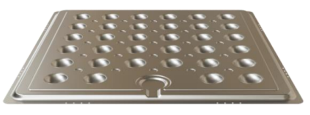

At the same time, this integration introduces stronger coupling between mechanical, thermal and electrical behaviour. Design decisions in one domain (e.g. float geometry or material selection) directly influence performance in other domains (e.g. panel temperature, structural stresses, or water ingress risk). This creates a need for coordinated engineering supported by modelling and testing.

The first-generation (Gen 1) Sunlit product (Figure 1-2) realised this integration with a glass/PET PV module bonded to two pressed aluminium float halves using a butyl/silicone edge sealant. The space between the module and floating unit is filled with two-component silicone potting for minimised water ingress. The polystyrene cup infill provides additional structural support and contributes to the buoyancy of the system. Brackets on the float lip provide interconnection with neighbouring units.

The SuRE project targets a transition from this first-generation design to a next-generation product (Gen 2) with improved performance, manufacturability, and structural integration. This report documents the modelling framework and development process that support this progression — from manufacturing simulation and material characterisation to structural, thermal, and economic modelling — as Sunlit works toward the Gen 2 design. The target Gen 2 deployment — a modular array of interconnected integrated units on still water — is illustrated in Figure 1-3.

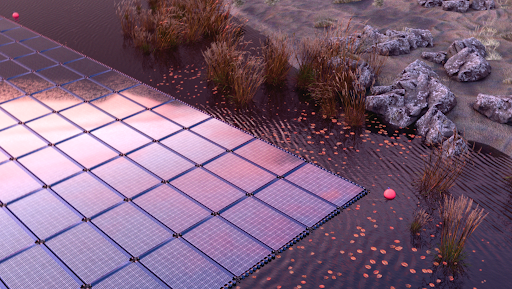

## 1.2 Objectives and tasks of WP6 and Deliverable D6.1

Work Package 6 (WP6) addresses modelling and simulation activities supporting the engineering development of the Sunlit floating photovoltaic system. Within Deliverable D6.1, two objectives from the SuRE Description of Work are particularly relevant:

- O6.1.1 Develop a digital product development cycle for Sunlit’s aluminium floater
- O6.2.1 Identify and optimise the next-generation floater prototype

These objectives should be interpreted in the context of the entire integrated FPV unit, not only the aluminium components. The floater concept includes the PV panel, float-structure, interconnection elements and supporting structural components.

Deliverable D6.1 documents the modelling framework and workflow used to support this development process. In particular, it addresses the requirement: "Data format and inter-model transfer specifications for the modelling chain."

The work described in this deliverable therefore relates primarily to:

- Task 6.1: FEM model development for pressing of aluminium
- Task 6.2: Model harmonisation and interfacing for digital product development

## 1.3 Scope of modelling and testing covered in this report

This D6.1 Deliverable report describes the modelling framework used in the engineering development of the Sunlit floater concept. Particular emphasis is placed on:

**Modelling of aluminium float manufacturing**

This includes simulation of forming processes used to produce the float structure, evaluation of manufacturability limits, and analysis of how geometric parameters influence material usage, structural behaviour and production feasibility.

**Integration of simulation and testing activities**

Numerical models are used to explore design variations and identify promising concepts, while physical testing is used to validate model predictions and characterise real-world behaviour. The interaction between these two activities forms the basis of the development cycle.

**Definition of modelling parameters and outputs**

The modelling work relies on a structured definition of input parameters (e.g. geometry, material properties, environmental conditions) and output metrics (e.g. stress, temperature, deformation, cost indicators). This enables consistent comparison between different design variants.

**Data structures connecting different modelling domains**

The manufacturing model (Chapter 4), and the mechanical, thermal and economic models (Chapter 5), operate on shared or linked parameters. The manufacturing model simulates aluminium float pressing to evaluate forming feasibility; the mechanical and thermal models characterise structural behaviour and heat transfer; the economic model links design choices to material and production cost. The report describes how data is structured and transferred between these models to ensure consistency and traceability, with model harmonisation and interfacing addressed in Chapter 6.

The report does not attempt to optimise the full system simultaneously. Instead, it describes the engineering workflow used to investigate specific design domains and progressively improve the system through iterative development.

# 2 Sunlit FPV System Architecture

## 2.1 Overview of the Sunlit integrated FPV unit

The Sunlit floating photovoltaic (FPV) system consists of modular floating units, where an off-the-shelf PV panel is integrated with surrounding and supporting structural components to form a floating solar unit. Each unit acts both as an energy-generating component and as part of the structural system. Mechanical loads from waves, wind, handling and array interaction are therefore transferred through a set of coupled interfaces between PV components, structural components, and interconnection elements. The system architecture is illustrated in Figure 2-1. The diagram should be interpreted as an interface diagram, not a simple component hierarchy. The double arrows indicate interfaces between components. These interfaces are critical because they govern:

- mechanical load transfer
- electrical functionality
- thermal coupling
- sealing and water ingress behaviour
- manufacturability and assembly
- long-term durability

The architecture therefore defines both the components and the interaction mechanisms that must be addressed in modelling and design.

A reference Gen 2 unit (Prototype 4) is shown assembled in Figure 2-2 from three viewing angles. The same unit is then taken apart in the following subsections, with each component group described separately and shown in its own figure to give an exploded view of how the integrated unit is composed.

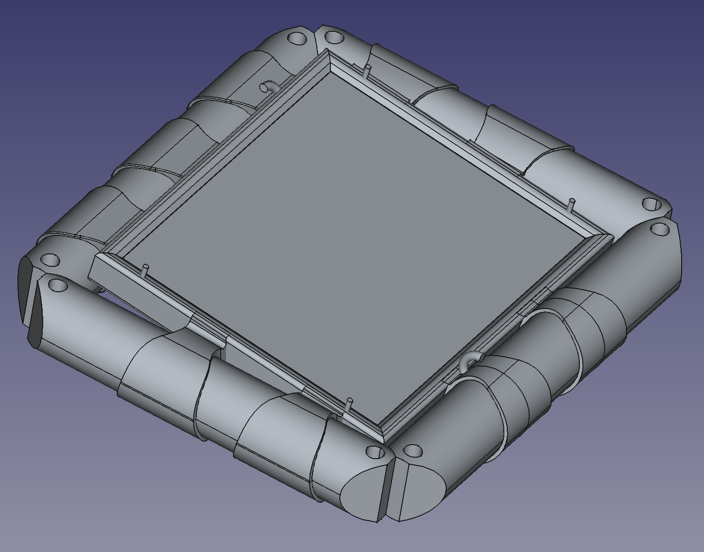

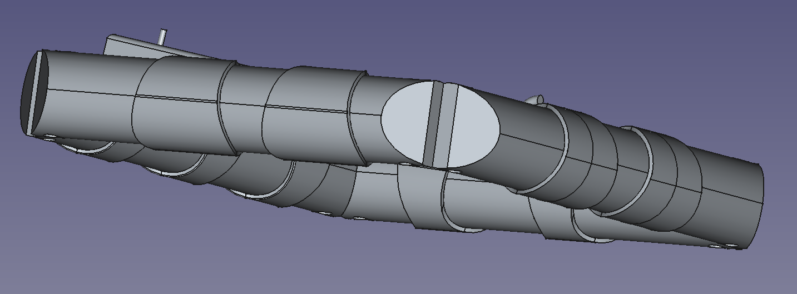

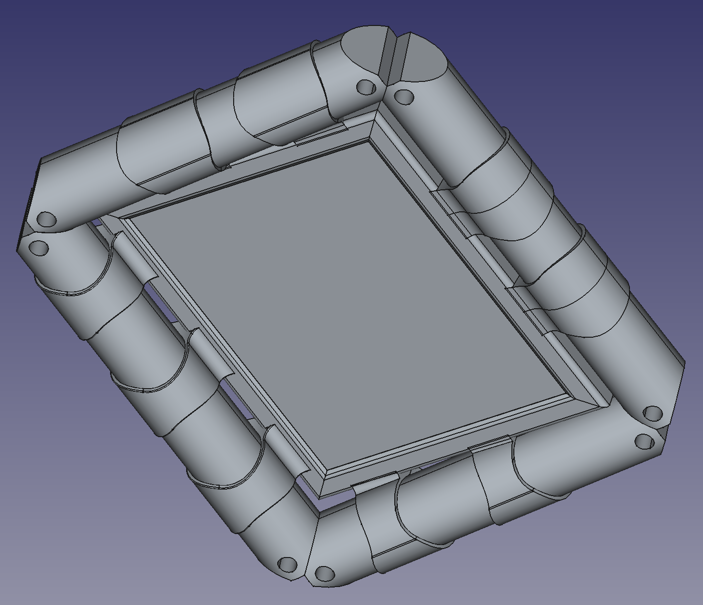

## 2.2 Main system components

The FPV unit is described through the following main component groups:

- PV panel
- Float-structure
- Infill
- Bottom
- Grounding
- Hinges and
- connectors

These are functional elements of the integrated system. The mooring and anchoring are not considered in this Deliverable. Depending on design choices, some components may be physically merged or realised differently, but the functional distinction remains important for structuring the modelling and development work.

### 2.2.1 PV panel

The PV panel is based on commercially available, off-the-shelf solar modules. Rather than being fixed, the PV panel is treated as a design parameter within a defined market space. Several candidate modules with similar external dimensions are currently being evaluated. A commonly available format is approximately 2384 mm × 1303 mm, used by multiple manufacturers including

- Risen Energy (RSM132 series)
- Canadian Solar (TOPBiHiKu7)
- Haitai Solar (HTM series)
- Yingli Solar (YLM 3.0PLUS)
- Trina Solar (TSM-DEG21 series)

In addition, the alternative format established in Gen 1 (1770 mm × 1770 mm) is considered.

The outer components of the PV panel, which are relevant for integration with the rest of the unit, consist of the frame, glass and potentially polymer (front and backside), junction box(es), cables and MC4 connectors. The choice of PV module geometry has system-level implications including buoyancy and required float volume, total system weight and centre of gravity, manufacturability (tool sizes, forming limits), logistics and handling, and array layout and packing density.

In addition to geometry, module construction is evaluated. Glass–glass modules typically offer better durability and moisture resistance but higher weight, while glass–polymer backsheet modules are lighter but may require additional protection measures. In the Sunlit concept, the PV panel is structurally integrated into the floating unit, creating strong coupling between module choice and structural behaviour, thermal performance, sealing and ingress risk, and interaction with infill, bottom and float-structure. The PV panel must therefore be treated as a configurable system component rather than a fixed input. Figure 2-3 shows the reference PV panel used for the Gen 2 Prototype 4 unit, viewed from the top (glass surface, frame and cable exit) and from the underside (frame, junction-box footprints and cable routing).

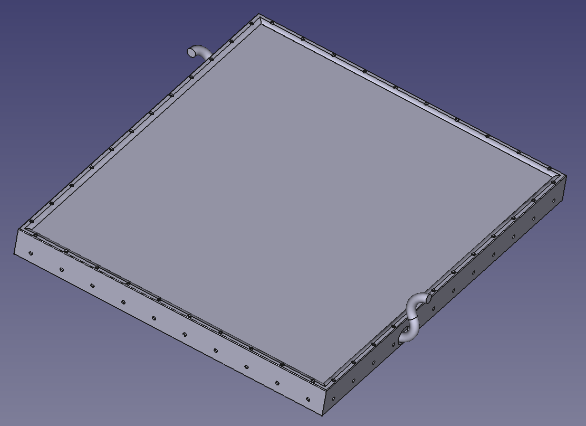

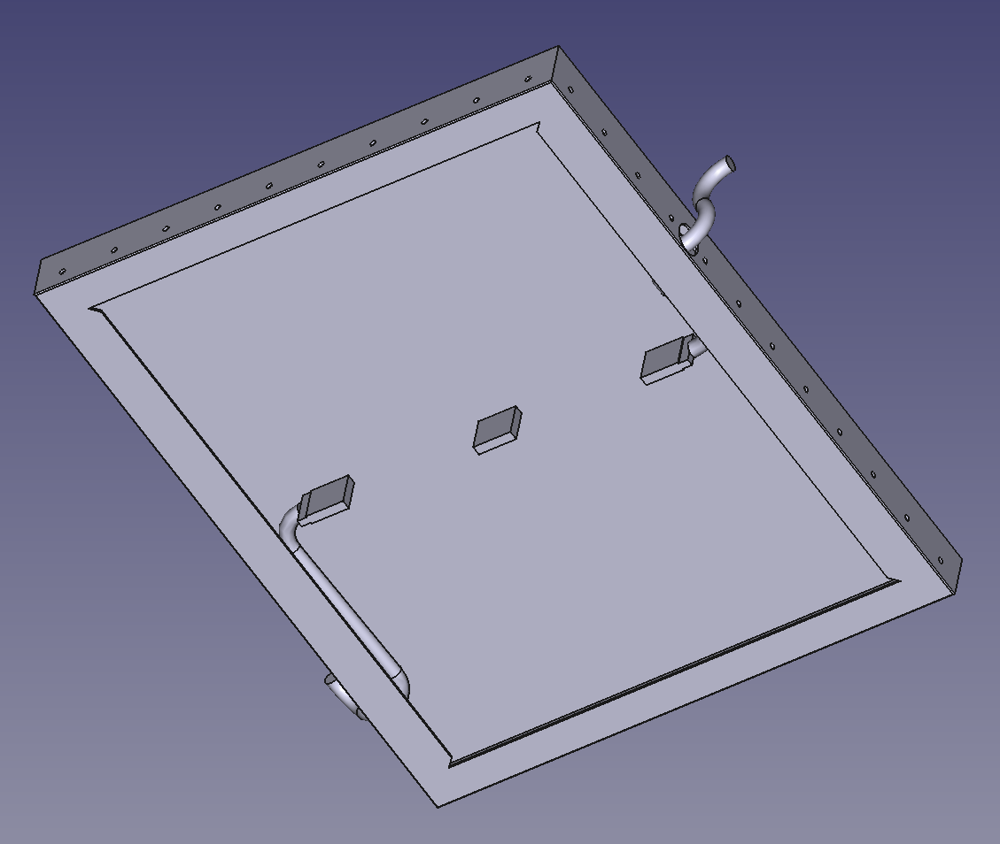

### 2.2.2 Float-structure

The float-structure is the structural component that wraps around and holds together the PV panel, bottom plate and hinge system. In current design concepts, it is made of PU, but the definition is functional rather than material-specific. The float-structure holds the system together, protects against water ingress, and enables operation in a marine environment. It is not the infill, not the bottom plate, and not necessarily the main buoyant volume. It does not provide standalone functionality and must be considered together with the rest of the system.

The float-structure has several critical interfaces that drive much of the engineering complexity of the integrated design. By directly casting the float-structure onto the PV panel, the two are connected at three interfaces: at the top glass, the panel frame and the bottom plate placed underneath the panel. The top glass interface has very limited contact area, and is a part of the float where saline and dirty water will regularly collect after waves and rain before drying. Minimising water ingress at this interface is therefore critical for long-term reliability. A critical challenge at the float-structure interface with the bottom plate includes marine growth due to submersion, placing further demands on material durability and surface properties.

Besides adhesion to the PV panel, the float-structure interfaces with the hinges that connect the units. As such, the structure must ensure that forces acting on the system are absorbed primarily in the hinge section, so that the float-structure itself — and especially the interface between the float-structure and the solar panel frame — takes as little load as possible. In the current design this implies that the hinges are integrated with the float-structure into a single cast unit, although other options are being evaluated.

Lastly, a key requirement is that the float-structure must handle routing of cables emerging from the PV panel, either from beneath or through the frame, while maintaining sealing and structural integrity.

The cast PU float-structure of Gen 2 Prototype 4 is shown in isolation in Figure 2-4 from a representative set of viewing angles. The hinge halves are integrated with the float-structure as a single cast unit on each of the four sides; the two views together show the long-side profile and an end-side profile, illustrating how the same casting concept applies on every edge of the unit.

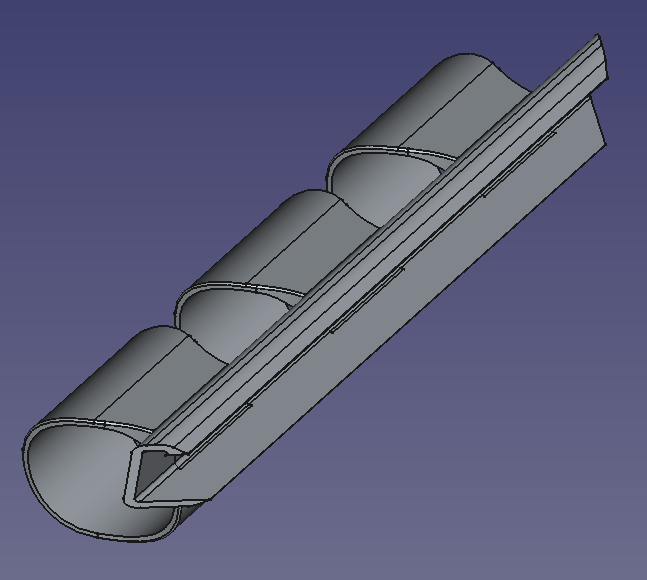

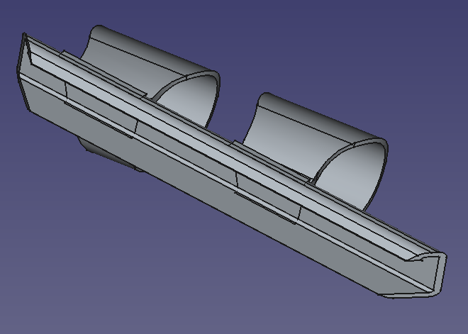

### 2.2.3 Infill

The infill is located underneath the PV module and inside the PV frame, surrounding the junction box and cables. Possible implementations for the infill include PU foam, aluminium press-formed structures (cups), polystyrene blocks and aluminium honeycomb (polystyrene blocks were used in the Gen 1 design; see Figure 1-2). In the Gen 2 Prototype 1 concept, the pressed aluminium bottom plate itself serves as the infill: the cup geometry creates enclosed air pockets between the cups, providing both structural support and buoyancy without a separate infill component (Figure 2-5). Depending on the concept, the infill may be separate or integrated with the bottom, and may require adhesion to glass, frame and/or bottom. The infill contributes to structural support of the glass, internal load distribution, sealing and water protection, and accommodation of the junction box and cables. Structural simulations performed without the infill (Section 5.3.2) have shown that its absence leads to stresses approaching or exceeding yield in both aluminium and PU components, confirming its structural importance.

An alternative infill concept (Figure 2-6) uses multiple interlocking PU foam pieces designed to puzzle-fit around the junction boxes and cables beneath the glass, eliminating air cavities that would otherwise remain around these components. Because the pieces meet each other and the surrounding surfaces at irregular interfaces, this concept requires potting compound or adhesive along the joints and at the glass and bottom interfaces to ensure proper bonding.

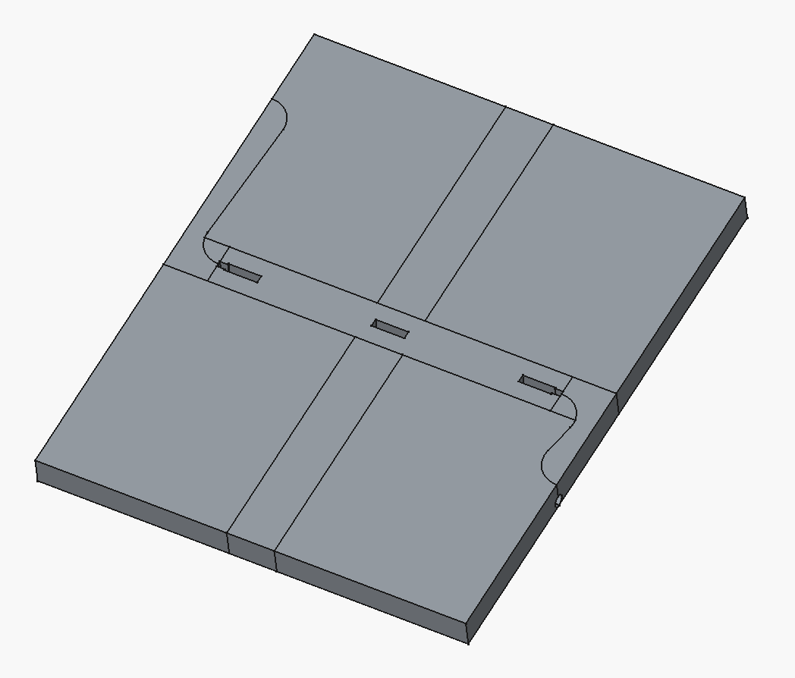

### 2.2.4 Bottom

The bottom is the bottom plate of the floating unit, connected to the frame and the infill. It can take several forms: a flat plate, a press-formed aluminium sheet with cup structures, or a shaped volume extending downward for buoyancy (the Gen 1 design uses press-formed aluminium sheets for the bottom; see Figure 1-2). In some designs, the bottom and infill may be the same physical object. The bottom plays a key role in structural stiffness, buoyancy and volume distribution, manufacturability, and cable routing (it must allow cable passage if needed). Buoyancy simulations (Section 5.3.2) have indicated that the prototype floater sits deep in the water, with approximately half the bottom plate submerged under self-weight, which has implications for the design of the bottom geometry and overall system buoyancy. Figures 2-7 and 2-8 illustrate the two principal bottom plate variants: a flat unpressed sheet and a press-formed sheet with cup structures.

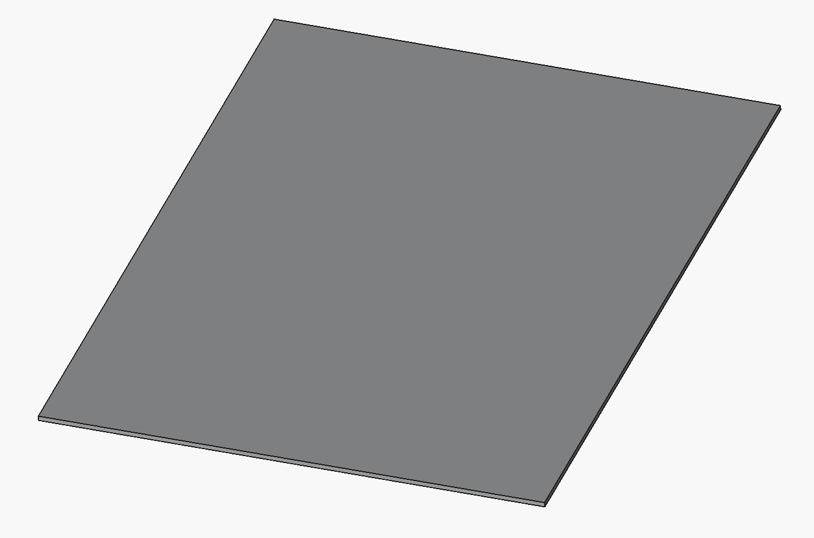

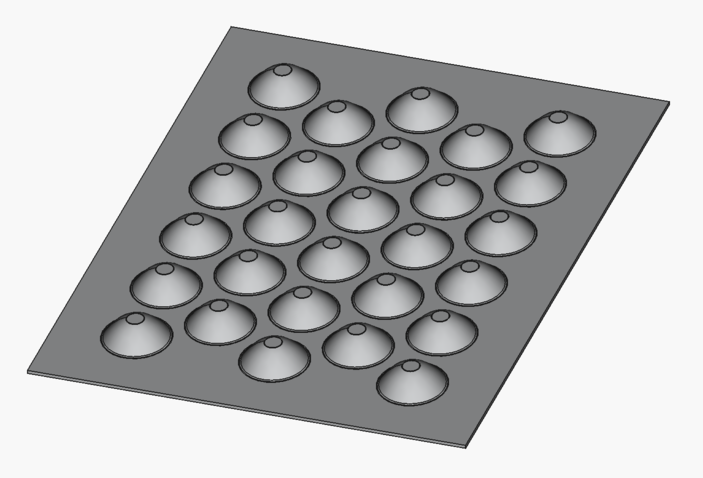

### 2.2.5 Grounding

Grounding is traditionally handled through the PV frame using dedicated holes. In the Sunlit concept, these may be covered by the float-structure. Alternative grounding solutions are therefore required, such as conductive pins extending through the float-structure or grounding connected to the bottom plate. Grounding must be treated as a dedicated subsystem, as it affects electrical safety, corrosion behaviour, and integration and accessibility. Figure 2-9 shows one of the grounding-pin concepts considered for the Gen 2 design, with conductive pins (highlighted in green) extending upward through the float-structure at the four corners of the panel frame.

### 2.2.6 Hinges

Hinges connect multiple floating units and are one of the most critical components in the system due to their role in load transfer and durability. They may be implemented as PU hinges, ropes with springs, or rope-based systems. In the current design concept, the hinges are integrated with the float-structure as a single cast PU unit, with the locking element provided by a separate connector component (see Figures 2-10 and 2-11 for the Gen 2 P4 hinge geometry). Key aspects include the connection to the float-structure and the behaviour under load, including fatigue, extreme loads and cyclic motion from waves.

Findings from wave tank testing in the EU project Surewave showed that snapping loads occur at certain wave lengths and that maximum loads exceed what earlier bracket and hinge designs could withstand. These findings led to a reprioritisation of engineering effort from aluminium pressing optimisation to hinge and interconnection system redesign.

### 2.2.7 Connectors

As part of the hinge system, the connectors define how hinges attach and lock between neighbouring units. Examples include bolts and brackets, PU rods, rope-through-hole systems, and carabiner-like mechanisms. In some concepts, connectors are integrated into the hinge; in others, they are separate. They strongly influence assembly, replaceability, load transfer and manufacturability. Figures 2-10 and 2-11 show FreeCAD side-views of the Gen 2 Prototype 4 left and right hinges, illustrating how the two opposing hinge halves are designed to be joined by a connecting rod acting as the connector component.

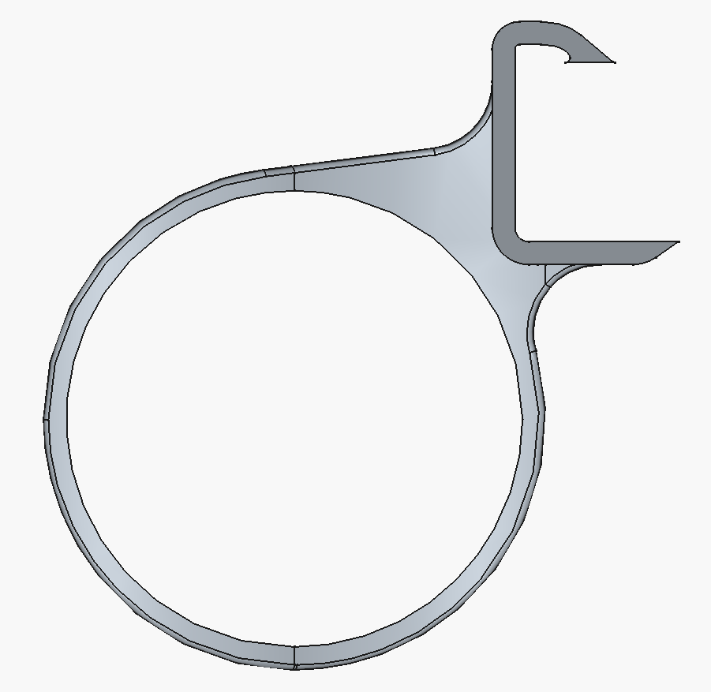

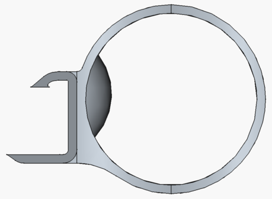

A connector concept under investigation uses buoyant PU foam rods designed to run along all four sides of the unit. In this concept, the connector elements serve a dual function: structural interconnection between neighbouring units and a contribution to overall system buoyancy. Figure 2-12 shows the FreeCAD model of this concept for the Gen 2 Prototype 4.

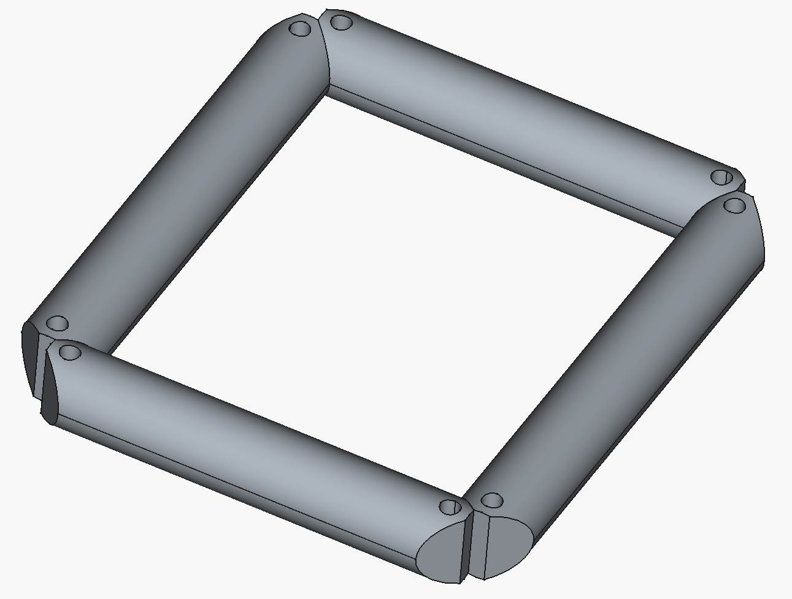

How the hinge and connector concepts compose into a full array is shown in Figure 2-13, which renders a 3 × 3 matrix of Gen 2 Prototype 3 units interconnected through the connector rods. The rod-and-hinge interface between every pair of neighbouring units is the same as that described in §2.2.6 and shown in isolation in Figures 2-10 and 2-11; tiling that interface in two directions produces the array geometry that the modelling and load-transfer work in Ch 5 and the prototype testing in §5.3 ultimately have to validate.

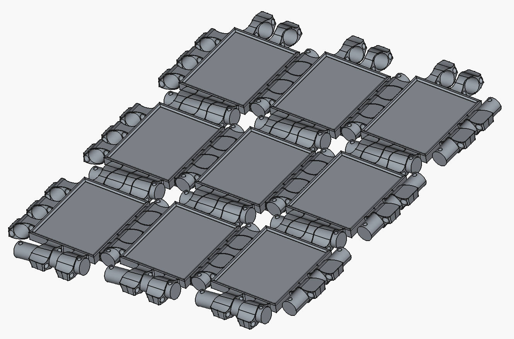

## 2.3 Critical interfaces in the integrated unit

The integrated system is defined not only by its individual components, but by the interfaces between them. Each interface governs behaviour across multiple domains:

- mechanical
- electrical
- thermal

The following interface structure can be used for reference:

- I1: Frame ↔ Glass
- I2: Glass ↔ JBox
- I3: JBox ↔ Infill
- I4: Glass ↔ Infill
- I5: Frame ↔ Infill
- I6: Infill ↔ Bottom
- I7: Frame ↔ Bottom
- I8: Cables ↔ MC4
- I9: Frame ↔ Cables
- I10: Float-structure ↔ Cables
- I11: JBox ↔ Cables
- I12: Infill ↔ Cables
- I13: Frame ↔ Grounding
- I14: Frame ↔ Float-structure
- I15: Float-structure ↔ Hinges
- I16: Float-structure ↔ Bottom
- I17: Float-structure ↔ Glass
- I18: Float-structure ↔ Grounding
- I19: Hinges ↔ Connectors

These interfaces will be referenced in later chapters when discussing:

- modelling assumptions
- failure modes
- testing
- optimisation

The list is retained at this level of granularity primarily for forward use in D6.2. Each I-entry corresponds to a physical location in the integrated unit at which stress, displacement, temperature, water-ingress or sealing performance is to be probed, and the same interface labels will be used as measurement points in the FEM and CFD simulations underpinning the multi-domain screening of D6.2. In the present deliverable the list is therefore an inventory of the interface phenomena that the model chain must be able to address, rather than a set of locations already instrumented in simulation.

The system architecture is illustrated in Figure 2-1, which shows the integrated panel–float unit and its connections to neighbouring units within an array.

## 2.4 Key engineering challenges in the integrated floater concept

The integrated architecture introduces several key engineering challenges. These arise both from the individual components and, in particular, from the interfaces between them.

### 2.4.1 Float manufacturing feasibility

Balancing manufacturability with structural performance, buoyancy, and geometric integration is a central challenge. This applies both to the Bottom and to any press-formed or otherwise shaped structural elements used as part of the Infill or supporting structure. Design choices such as panel dimensions, bottom geometry, and infill concept directly affect forming feasibility, tooling requirements, tolerances, and production scalability.

### 2.4.2 Structural load transfer between units

Loads from waves, handling, and array interaction must be transferred through interconnected units without overstressing components or introducing fatigue-critical regions (Figure 2-14 shows Gen 1 FPV units during real-conditions evaluation in a flowing water channel, illustrating the challenge of load transfer and resistance to submergence under current exposure — FDS constraint FC1, current-loading scenario). This is particularly important for the Hinges, Connectors, float-structure, and their interfaces to the PV panel and Bottom. Since the system is modular, local connection design has major influence on global structural reliability.

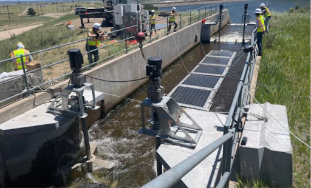

### 2.4.3 Environmental exposure of materials

Components are exposed to UV radiation, moisture, saltwater, temperature cycles, and biological growth. These stressors may affect different parts of the system in different ways, including polymer degradation, corrosion, loss of adhesion, fouling, and changes in mechanical behaviour over time. The environmental durability of materials and interfaces is therefore a core design issue.

### 2.4.4 Water ingress and sealing

Preventing water ingress into sensitive areas such as panel interfaces, cable paths, grounding points, and electrical components is critical. In the Sunlit concept, this challenge is closely linked to the interfaces between Frame, float-structure, Infill, Bottom, JBox, and Cables. Cable routing and local penetrations may require special geometric adaptation or sealing strategies.

### 2.4.5 Thermal behaviour of the integrated system

The interaction between PV panel, surrounding structural components, and environment influences both electrical performance and material degradation. Thermal behaviour depends on module construction, colour and properties of surrounding materials, solar loading, cooling to air and water, and the thermal coupling between components. Since module type is itself a design variable, thermal behaviour must be considered as part of the broader system trade-off.

### 2.4.6 Installation and maintenance considerations

The system must be designed for efficient installation, inspection, grounding, connection, replacement or repair of components under field conditions, as well as recycling after end of life. This includes practical access to connectors, hinges, grounding solutions, and electrical interfaces. Design choices that improve integration or sealing may also make maintenance more difficult, so these aspects must be balanced carefully.

### 2.4.7 Manufacturability and cost efficiency

The design must enable scalable production with controlled cost. This includes not only material consumption, but also process complexity, number of parts, assembly effort, tooling, logistics, and compatibility with commercially available PV modules. Since the PV panel is selected from available market options rather than fixed from the outset, manufacturability and cost efficiency must be evaluated at the system level.

These engineering challenges form the main background for the modelling and development activities described in the following chapters. The purpose of the modelling framework is not only to analyse individual components, but to support design choices across the coupled mechanical, thermal, electrical, and manufacturing domains that define the integrated floating PV unit.

## 2.5 Summary

The Sunlit FPV unit is an integrated structure built around a market-available PV panel: a float-structure that wraps panel, bottom plate and hinges into a single cast assembly; an infill that supports the glass and contributes to buoyancy; a pressed aluminium bottom plate; grounding, hinges and connectors that interconnect units into an array. The Gen 2 Prototype 4 reference unit is presented assembled in Figure 2-2 and as an exploded set of component-group figures (Figures 2-3 to 2-12) through §2.2; Figure 2-13 then shows how multiple units compose into a 3 × 3 array. The system is best understood through its interfaces (I1–I19) rather than its components in isolation: load transfer, sealing, electrical safety and thermal coupling all emerge at component boundaries. The chapter has identified seven recurring engineering challenges — manufacturing feasibility, structural load transfer, environmental exposure, water ingress, thermal behaviour, installation/maintenance, and cost — that motivate the modelling and testing activities of Ch 4–5.

# 3 Product Development Framework and Design Domains

## 3.1 Introduction

The Product Development Framework documented in this chapter — covering the Functional Design Specification (§3.2), the functional and engineering domains used to organise the work (§3.3), the prioritisation approach for engineering investigations (§3.4), the model-supported development cycle (§3.5), and the parameter and data structures (§3.6) — has been developed in WP6 of the SuRE project. It is the structured methodology Sunlit Sea now uses to develop the next-generation FPV product, and it is one of the contributions of WP6 in addition to the domain-specific models reported in Chapters 4 and 5.

This chapter describes the engineering methodology used to develop the Sunlit FPV system. The framework combines modelling, simulation and experimental testing in a structured process that supports iterative improvement of the design. It is applied across multiple engineering domains, including manufacturing, structural behaviour and thermal performance.

The purpose of the framework is to enable systematic exploration of design alternatives, reduce reliance on time-consuming physical prototyping, and ensure traceability between design decisions, simulations and test results.

The chapter is structured as follows. Section 3.2 describes the Functional Design Specification (FDS) that defines what the system must achieve. Section 3.3 introduces the functional and engineering domains through which these requirements are addressed. Section 3.4 describes the risk-based approach used to prioritise engineering investigations. Section 3.5 presents the model-supported development cycle, and Section 3.6 defines the parameter framework and data structures that support consistency and traceability across the modelling work.

## 3.2 Functional Design Specification

The engineering development of the Sunlit floating PV system is guided by an FDS. The FDS defines the requirements that the system must satisfy, organised into three tiers.

Principal functions (FP) define the core purpose of the system. The system must

- produce electrical power (FP1) and
- be certified for deployment (FP2).

Sunlit's design has received preliminary DNV verification, and certification under DNV is the working baseline assumption for FP2.

<!-- IFE: please specify the targeted certification standard / scheme for FP2 (e.g. specific DNV-ST-XXXX, IEC 63214 or other), based on what you have seen in the FPV market and in your collaborations. The DoW states only that "Sunlit's design has received preliminary DNV verification" — we need to firm this up. -->

Constraint functions (FC) define requirements that the design must satisfy. These include

- flotation under static and operational loading (FC1) — the system must remain afloat at rest and under representative live loads (people walking on the array, accumulated snow or ice) without becoming submerged, and must continue to do so under current exposure up to 3 m/s,
- watertightness (FC2),
- mechanical attachment between units (FC3),
- feasibility of changing panel supplier (FC5),
- resistance to high wind (FC6),
- resistance to waves up to 1.5 Hs (FC7),
- cost competitiveness (FC8),
- electrical grounding (FC9), and
- resistance to environmental ageing — the system must retain its functional performance throughout the design lifetime under combined exposure to UV, moisture (liquid and vapour), saltwater, soiling, and temperature cycling, with degradation rates of materials and interfaces low enough that none of FC1–FC9 are violated by end of life (FC10).

The FC4 entry of the previous FDS revision (resistance to submergence under current exposure up to 3 m/s) has been merged into FC1, since the engineering distinction is between unloaded and loaded buoyancy, not between absence and presence of currents. The 3 m/s current limit is retained as the relevant loading scenario under FC1.

The 3 m/s current and 1.5 Hs wave limits in FC1 and FC7 correspond to the deployment envelope for the targeted ~100 kW pilot at Singløya Nord (DoW T6.4) and align with Sea State Code (SSC) 4 (Moderate, wave height 1.25–2.5 m) using the WMO classification cited in the SuRE Description of Work. The broader project ambition is to validate the Sunlit design up to SSC 5 (Rough, Hs 2.5–4 m) as required for the SO4 KPI; that ambition is addressed primarily through D6.2 / D6.4. The FDS does not currently set a specific wind-speed limit for FC6 — wind-induced loading on the integrated unit is treated qualitatively at present, and refinement is expected through coupling with the IFE 3DFloat hydrodynamic model in WP2 / WP6.

<!-- IFE: do you have a recommended numerical wind-speed bound for FC6 (e.g. mean or gust speed used in your structural assumptions for SiSim)? If so we will fold it in. -->

Secondary functions (FS) define desirable but not absolute requirements. These include

- walkability (FS1),
- fast production (FS2), and
- fast installation (FS3).

The FDS ensures that all development activities remain aligned with system-level requirements. From these functions, a set of design domains is identified, as described in the following section.

## 3.3 Functional and engineering domains

The requirements defined in the FDS are translated into two complementary sets of domains. Functional domains define what the system must achieve. Engineering domains define how these requirements are analysed and addressed through modelling and testing. The relationship between these two layers is illustrated in Figure 3-1.

### 3.3.1 Functional domains

The main functional domains derived from the FDS are described below.

Energy production is the primary function of the system. It requires maintaining adequate incoming solar irradiance, limiting thermal losses that reduce module efficiency, and ensuring electrical integrity under environmental exposure. While energy production is not directly optimised in WP6, it is indirectly influenced by thermal and structural design choices.

Flotation performance requires that the system provides sufficient buoyancy and stability under all expected operating conditions, including uneven loading and wave action. Flotation performance is strongly influenced by float geometry, material distribution and system mass.

Mechanical interconnection governs how loads are transferred between the modular floating units. The interconnection system must transfer loads without overstressing sensitive components such as PV modules and allow relative motion to accommodate waves and thermal expansion. This domain is critical for system-level structural integrity and is strongly influenced by fatigue behaviour, material selection and connection design.

Resistance to environmental loads reflects the combination of stressors the system is exposed to over its lifetime. Besides the aforementioned wave-induced mechanical loads, this includes wind, UV radiation, moisture in liquid and vapour form, soiling and salt. Components must withstand these conditions without significant degradation.

Manufacturability requires that the system can be produced at scale using feasible and cost-effective processes. This includes compatibility with aluminium forming processes, minimisation of material usage, and repeatability of manufacturing steps. Manufacturability directly constrains the feasible design space and must be considered alongside performance requirements.

Operational usability requires that the system supports efficient installation, inspection and maintenance. This includes accessibility of electrical connections, ability to repair (where possible) or replace modules in the field, and robustness during handling. Design choices that improve manufacturability or structural performance must not compromise operational usability.

Together, these functional domains define the multi-dimensional design space within which the system must be developed.

### 3.3.2 Engineering domains

The modelling work in WP6 is organised into engineering domains, which represent the areas where quantitative modelling and experimental work are used to inform design decisions. As shown in Figure 3-1, the mapping between functional and engineering domains is many-to-many: a single functional requirement may be addressed by multiple engineering domains, and a single engineering domain may serve several functional requirements.

Float manufacturing feasibility focuses on the manufacturability of the aluminium float structure. Key challenges include determining feasible geometries within forming limits (depth, curvature, spacing), avoiding defects such as buckling, tearing or excessive thinning, and balancing float volume with material usage. This domain is addressed through FEM simulations of aluminium forming processes and parametric exploration of geometric design variables.

Structural load transfer addresses how mechanical loads are distributed within and between floating units. Key aspects include load paths from environmental forces through the interconnection system, stress distribution in structural components, and identification of fatigue-critical regions. Both modelling and physical testing are used to evaluate structural behaviour.

Thermal behaviour focuses on the temperature response of the integrated system. Key aspects include heat transfer between PV modules, float structure and environment, the influence of material surface properties such as absorptivity and emissivity, and identification of conditions leading to elevated temperatures. Thermal modelling is used to evaluate worst-case conditions and guide design choices such as material selection or colour.

Component integration addresses the interfaces between system components, which are critical in the integrated design. Key aspects include mechanical interfaces between panel frame, float-structure and interconnections (see also Section 2.3), sealing strategies to prevent water ingress, and interaction between structural and electrical components.

Manufacturing economics evaluates the cost implications of design and manufacturing choices, including material consumption, process complexity and production scalability. While detailed cost modelling is outside the scope of this deliverable, design decisions are assessed with respect to their impact on cost efficiency.

### 3.3.3 Trade-offs across domains

The combination of multiple functional and engineering domains creates a high-dimensional design space with competing objectives. For example, increasing float depth improves buoyancy but may exceed manufacturing limits. Reducing material thickness lowers cost but may reduce structural robustness. Changing material properties may improve thermal behaviour but affect durability or cost.

Rather than attempting global optimisation at this stage, the approach taken in WP6 is to investigate key domains individually, reduce uncertainty in critical areas, and progressively converge towards improved design configurations. The modelling framework enables systematic exploration of this design space and identification of feasible regions satisfying multiple constraints simultaneously.

## 3.4 Prioritisation of engineering investigations

Engineering investigations within WP6 are prioritised by qualitative engineering judgement against a fixed set of factors rather than by formal risk scoring. The factors used are listed below, grouped into resource cost on one side and expected benefit on the other.

**Resource factors** considered for each candidate investigation:

- **Estimated effort** — engineering manhours required to plan, execute and analyse the investigation;
- **Material cost** — feedstock, prototype hardware and consumables (e.g. aluminium sheet, PU resin, sample preparation);
- **Calendar time** — wall-clock duration, including external dependencies such as casting vendor lead times, lab availability or supplier responses;
- **Probability of a usable result** — qualitative confidence that the investigation will produce information that survives validation and can be acted on, as opposed to data that is too noisy, too narrow or too costly to interpret.

**Benefit factors** considered for each candidate investigation:

- **Influence on subsequent design choices** — how strongly the result is expected to discriminate between competing design directions, fix open architectural questions (e.g. cast-on-frame vs. separate-and-mount), or close out major uncertainties in the model chain;
- **Time-to-market impact** — whether the result accelerates the path to a deployable Gen 2 product, e.g. by closing a manufacturability question that blocks tooling investment;
- **Improvement against the FDS** — the magnitude by which the result is expected to improve performance against the constraint or secondary functions in §3.2 (FC1–FC10, FS1–FS3) or against the SuRE WP6 KPIs (50 % aluminium reduction, ~3 % thermal-loss reduction, validation up to SSC 5).

In practice, the prioritisation is exercised informally during planning discussions and reflected in the choice of which investigations are scheduled, deferred, or dropped. Examples of investigations selected on this basis include the early focus on aluminium forming limits (high impact on manufacturability and cost; medium effort once the LS-DYNA pipeline was established), the adoption of hydroforming over the punch/die approach (Section 4.2), and the prioritisation of PU thermal and UV characterisation following the thermal over-temperature finding detailed in Section 5.2.4. Investigations that scored low on benefit relative to effort, or where the probability of a usable result was judged too low, were either descoped or referred to later phases of the project.

This is not a formal risk-scoring exercise — no numerical risk register is maintained, and no uncertainty × impact × effort calculation is carried out per investigation — but the same factors are applied consistently across decisions, and the resulting allocation of effort is recorded in the engineering activity log that supports this report.

## 3.5 Model-supported development cycle

The modelling and testing activities within each engineering domain follow a common iterative development cycle, as shown in the lower part of Figure 3-1. Numerical models are used to evaluate design alternatives efficiently across a wide parameter space. Physical tests are used to validate model predictions and capture real-world behaviour not fully represented in simulations.

The cycle proceeds as follows. Initial design concepts are defined through parametric CAD models, where the geometry is expressed in terms of explicit design parameters such as float depth, curvature, material thickness and connection geometry. Rather than defining a single fixed design, parametric models allow systematic variation of these parameters, enabling automated generation of design variants and consistent input to simulation workflows.

Numerical simulations are then used to evaluate candidate designs under relevant conditions. Depending on the domain, this includes manufacturing simulations of aluminium forming processes, mechanical simulations of stress, deformation and load transfer, and thermal simulations of temperature distribution and heat transfer. Simulations provide quantitative outputs such as stress distributions, deformation patterns, temperature fields and indicators of manufacturability, which are used to compare design alternatives and identify promising configurations.

Promising designs are selected for prototype manufacturing, which serves to verify that designs are manufacturable in practice, identify practical challenges not captured in simulations, and provide physical samples for testing. The level of fidelity ranges from simplified test samples to fully integrated system components, depending on the investigation.

In the Sunlit development process, prototype manufacturing is closely integrated with the parametric design system. Moulds for casting PU components are designed within the same FreeCAD parametric model used for the structural design, ensuring that mould geometry remains consistent with the current design state. Moulds are initially 3D-printed to allow rapid iteration: a design change can be reflected in a new printed mould and tested within a short cycle. Casting is performed onto mock solar panels consisting of glass, a bottom plate and a frame, producing prototypes that are representative of the integrated unit. After inspection and functional testing, mould designs that prove viable are promoted to metal moulds suitable for production-representative casting. Figures 3-4 and 3-5 show an example of this progression: the metal mould of Prototype 3 before and after PU casting. This progression from parametric model to 3D-printed mould to cast prototype to metal mould defines the prototyping track of the development cycle. Multiple prototype generations (P1–P4 and beyond) have been produced in this way, each incorporating lessons from the previous round of testing. Figures 3-2 and 3-3 show the FreeCAD parametric models of Prototypes 3 and 4, illustrating the evolution of the float-structure and hinge geometry between iterations. As part of production scale-up investigations, a casting vendor was engaged and visited, providing input to mould design requirements for larger-scale manufacture.

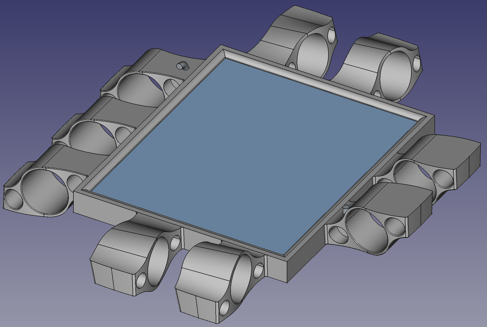

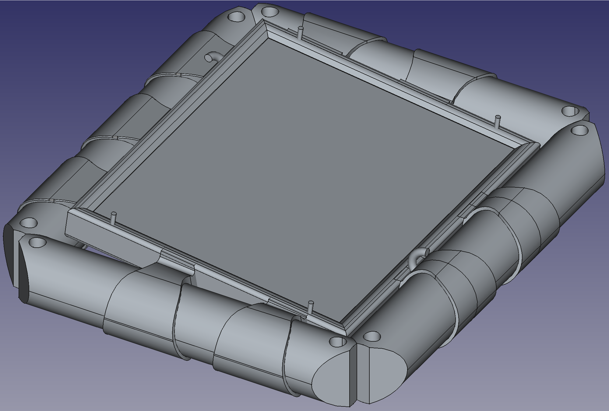

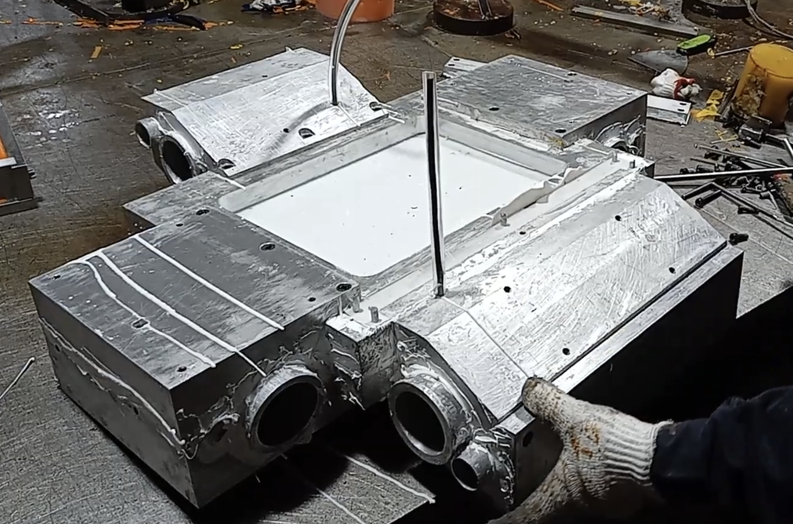

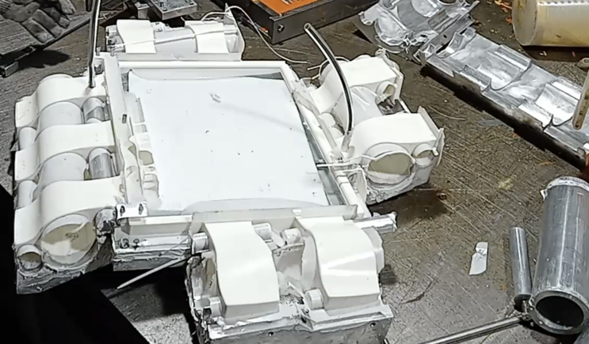

The mould design process is not limited to the float-structure: Figure 3-6 shows the FreeCAD parametric mould design for the Gen 2 Prototype 4 connector component, illustrating how the same parametric approach is applied to smaller functional components with more complex geometry.

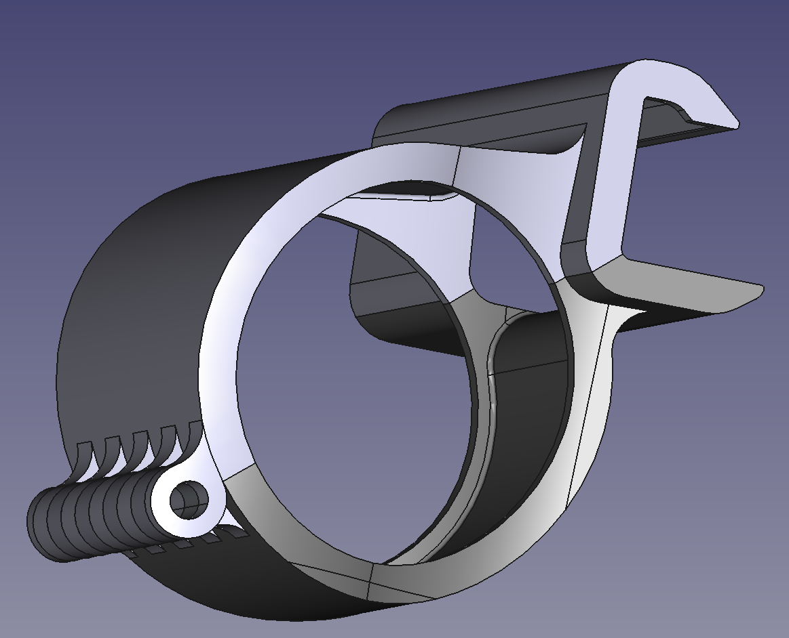

Experimental testing provides data on real-world behaviour. Testing activities include mechanical testing (tensile, fatigue, load transfer) and environmental testing (UV exposure including temperature response, moisture ingress). These tests are essential for validating simulation models, identifying failure modes, and quantifying performance under realistic conditions.

Simulation results are then compared with experimental results to assess model accuracy. Where discrepancies are identified, model assumptions are updated, input parameters are refined, and modelling approaches are improved. This validation process enables iterative improvement of both the design, through better-informed decisions, and the modelling framework, through increased predictive capability.

## 3.6 Parameter framework and data structures

To ensure consistency across modelling domains and support traceability throughout the development process, parameters are categorised into three groups, as shown in the lower part of Figure 3-1.

Design parameters are variables defining the geometry and configuration of the system, such as float shape, material thickness and connection layout. Process parameters are variables related to manufacturing or environmental conditions, such as forming pressures, temperatures and boundary conditions. Performance outputs are metrics used to evaluate system behaviour, such as stress, deformation, temperature and cost indicators.

Design parameters serve as inputs to the parametric CAD models that initiate the development cycle. Process parameters are inputs to the numerical simulations. Performance outputs are generated by both simulations and physical tests, and are used in the validation and comparison step to assess design quality.

This categorisation enables structured parameter management, consistent data exchange between models, and comparison of results across design iterations. Simulation inputs, outputs and experimental data are organised within a structured data framework based on three principles: traceability, so that each design iteration can be linked to its corresponding simulation and test results; consistency, so that shared parameters are defined identically across different models; and interoperability, so that data can be transferred between modelling domains without loss of meaning.

The resulting parameter and data structure forms the basis of the model chain described in Chapter 6.

## 3.7 Summary

The product development framework developed in WP6 anchors the engineering work in an FDS that defines what the system must do (FP, FC, FS), maps those requirements onto functional and engineering domains that delimit how the work is organised, prioritises investigations by qualitative judgement of effort against expected benefit, and exercises an iterative model-and-test cycle in which parametric CAD, numerical simulation and physical prototyping feed each other. Parameters are managed in three categories — design, process and performance — with consistent definitions across domains so that data can flow through the chain and design iterations remain traceable.

# 4 FEM Model Development for Aluminium Float Pressing

## 4.1 Manufacturing objectives and design parameters

The float structure is a central component of the Sunlit system, providing buoyancy, contributing to structural stiffness, and representing a significant share of material cost. The manufacturing concept is therefore a key driver for technical performance and economic viability.
The primary manufacturing objectives are:

**Maximise buoyancy per unit material**

Increasing enclosed volume improves flotation performance while reducing material usage lowers cost.

**Ensure manufacturability using scalable forming processes**

The design must be compatible with industrial aluminium forming techniques, particularly press-based forming.

**Maintain structural integrity**

The resulting geometry must provide sufficient stiffness and avoid failure modes such as local buckling or fatigue-critical features.

To address these objectives, the float concept investigated in this work is based on formed aluminium sheets with cup-like geometries. These geometries increase structural depth and enclosed volume while maintaining low material thickness. The forming transformation is illustrated in Figures 4-1a and 4-1b, showing the raw aluminium sheet and the pressed part separately, while Figure 4-2 shows a representative cup shape targeted by the forming process.

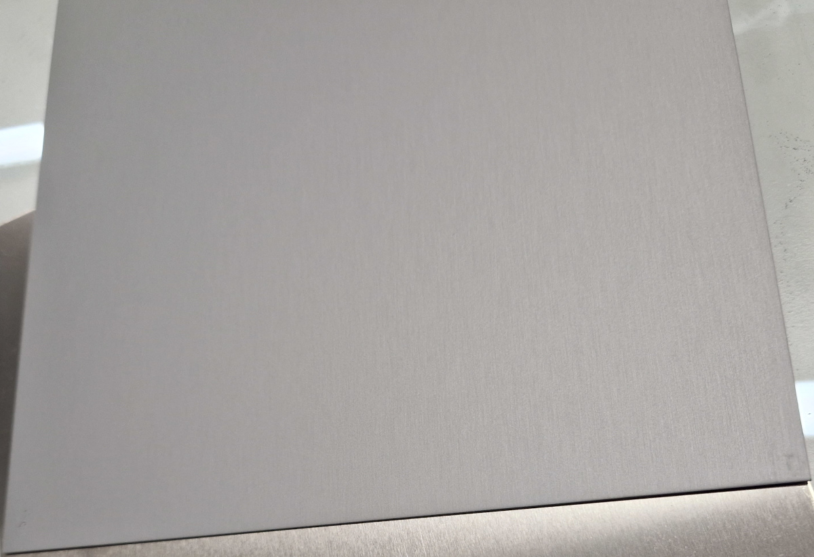

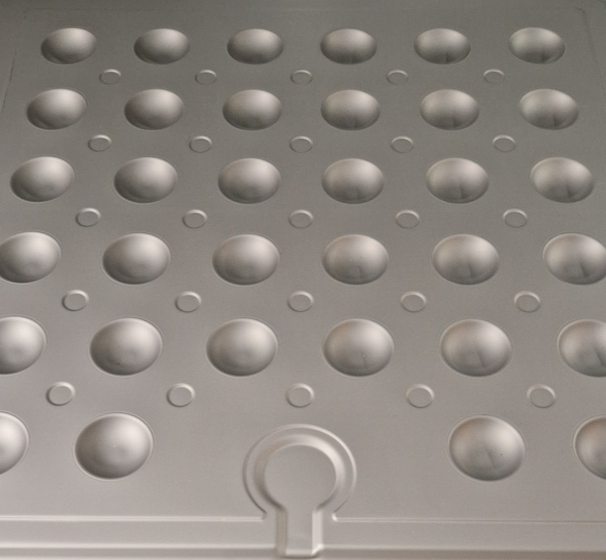

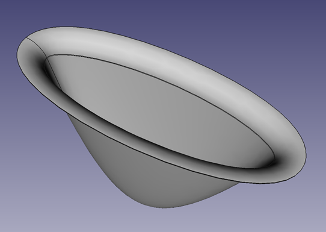

The geometry of the float is defined through a set of design parameters varied systematically in the modelling process. The nine parameters and their explored ranges are:

- **Cup radius (10–40 mm):** radius of the circle bounding one cup; controls contact area with the PV panel and material flow during forming.
- **Cup depth (5–40 mm):** vertical displacement of material; directly drives buoyancy and stiffness.
- **Cup eccentricity (0.7–1.0, ratio of ellipse y/x):** allows elliptical cups to exploit the orthotropic plastic behaviour of rolled aluminium sheet — the major axis is oriented along the more formable direction so that deeper cups can be formed within the same thickness budget. The underlying anisotropy is detailed in §4.2.
- **Cup angle (10–85°):** steepness of the internal cup surface; high angles give flatter cup bottoms, low angles give steeper walls.
- **Cup tip radius (2–32 mm, constrained to 20–80 % of cup radius):** flat area at the bottom of the cup, used as the bonding surface between the two pressed float halves.
- **Cup lip radius (1 mm):** fillet at the transition from the flat region into the cup; sharp transitions raise the risk of tearing or thinning.
- **Cup spacing (0–40 mm):** flat material between cups; supplies the aluminium drawn into the cups and supports the solar panel.
- **Sheet thickness (0.8 mm, fixed):** key cost and structural-performance driver. Treated as a free parameter early on, but the resulting parameter space was too large for tractable Pareto search; 0.8 mm was selected based on supplier recommendations and the cup-depth budget under glass-glass modules and is a standard market thickness, so it was frozen for systematic exploration.
- **Forming pressure (4–12 MPa):** fluid pressure applied during hydroforming.

Together these nine parameters define a multi-dimensional design space; their ranges are bounded by physical constraints, manufacturing limits and prior design experience from the first-generation product.

Floater overall size is not included in this set and is architecturally out of scope for the pressing simulation: each FEM run represents a single cup, so its outputs depend only on local cup geometry and material parameters and are independent of how many cups are tiled across a floater. Floater size is nevertheless a system-level design variable that affects container packing density, walkability, buoyancy distribution and stress paths through the array, and is recognised in §2.2.1. We have judged it solvable for any of the candidate panel formats and have therefore selected the largest economic panel class (2384 × 1303 mm) as the current reference, with the 1770 × 1770 mm Gen 1-class square panel kept as an alternative. The natural place for systematic evaluation of floater size is the life-cycle assessment work (§5.4.2 and interface DI-5 in §6.3), where overall dimensions directly drive per-unit material totals, production effort and plant-level layout. The cup-level pressing simulations feed into that analysis by providing manufacturability constraints and per-cup material usage that scale to any floater size once the cup count is set by the chosen outer envelope.

## 4.2 Modelling framework and tool development

To evaluate manufacturability and guide design decisions, an FEM modelling framework has been developed by Sunlit Sea.

The forming process is modelled as a nonlinear deformation problem using the FEM software LS-DYNA, where the aluminium sheet undergoes large plastic deformation and contact interactions between forming tool and sheet are explicitly represented. The first-generation Sunlit product was manufactured using a conventional punch/die press, in which a rigid punch forces the sheet into a matching die cavity. The simulation framework was therefore initially built around the punch/die geometry, in line with the inherited Gen 1 manufacturing route: this had high upside if successful, since it would have allowed direct reuse of Gen 1 tooling experience and infrastructure. Figure 4-3 shows the punch/die tooling geometry as used in an early iteration of the pressing FEM simulation setup, and Figures 4-4 and 4-5 show the same setup as a finite element mesh, with and without a gripper ring evaluated to control material flow and reduce thinning at the cup walls.

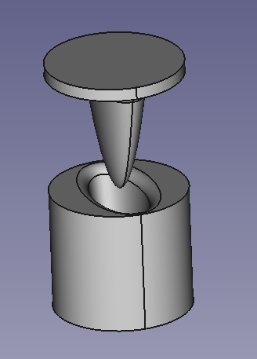

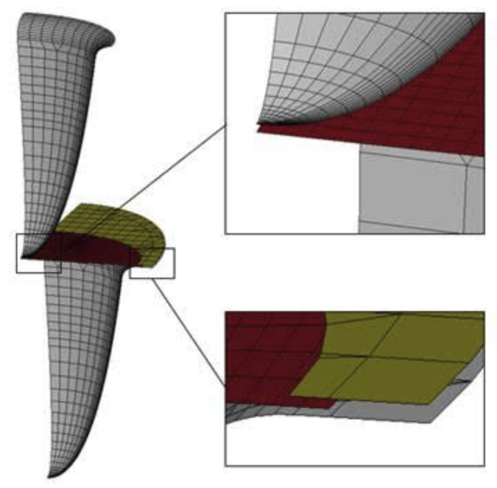

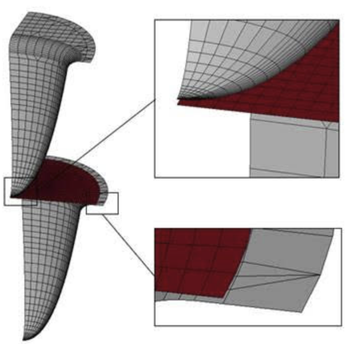

Within WP6, closer simulation evaluation of the punch/die route alongside an alternative hydroforming concept showed that the upside of the hydroforming route was substantially greater than what continued refinement of the punch/die approach could deliver — both in terms of tooling cost and lead time (a hydroforming mould is considerably simpler and cheaper to produce than a matched punch/die set, which matters for the iterative development cycle of Ch 3) and in terms of forming uniformity (fluid pressure acts uniformly on one face of the sheet, removing the need for a matched gripper geometry). On this basis, the gripper-ring punch/die concept was abandoned and hydroforming was adopted as the target manufacturing route for Gen 2. This redirection — illustrative of the prioritisation approach in §3.4, where a high-upside alternative was pursued in preference to incremental optimisation of an existing route — is a WP6 outcome rather than a pre-SuRE Sunlit decision. The simulation models the hydroforming process accordingly.

The aluminium alloy used in the float design is marine-grade AA5083-H111, supplied as cold-rolled sheet, whose chemical composition is given in Figure 4-6. AA5083 combines good formability, weldability and corrosion resistance with a high thermal conductivity; the thermal role of this conductivity in the Gen 1 and Gen 2 designs is discussed in Section 5.2.1. In the H111 temper, the alloy is annealed and then slightly strain-hardened by cold working. Sheet thicknesses of 1.5 mm have been used in earlier product generations and 0.8 mm is the current design target, the latter chosen to reduce material consumption at the cost of a tighter manufacturing window. The cold rolling process introduces a pronounced orthotropic anisotropy in the plastic behaviour of the sheet, expressed as direction-dependent yield stresses and plastic strain ratios relative to the rolling axis. The constitutive model used in the forming simulations must explicitly capture this anisotropy if forming predictions are to be meaningful at the accuracy level required for iterative boundary search in a multi-parameter design space.

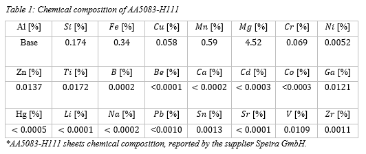

This is done through adoption of the non-quadratic anisotropic Yld2003 yield function, implemented in LS-DYNA through the *MAT_WTM_STM (Strong Texture Model) material keyword. Yld2003 generalises the isotropic Hershey–Hosford yield function by splitting it into two additive terms, each applied to a linearly transformed stress tensor, producing a total of eight anisotropy coefficients that are calibrated against experimentally measured directional plasticity data. The yield function is paired with a Voce-type strain hardening law, in which the flow stress increases with accumulated plastic strain towards a saturation level through an exponential functional form. Together, these two components constitute a physically rigorous and widely used model for the plastic behaviour of rolled aluminium sheet.

The calibration of the anisotropy coefficients and of the hardening parameters draws on three types of mechanical tests carried out on AA5083-H111 sheet of the relevant thickness. Uniaxial tensile tests performed at 0°, 45° and 90° to the rolling direction following ISO 10113:2020 provide directional yield stresses and plastic strain ratios. Biaxial bulge tests following ISO 16808:2014 extend the measured flow curve into the large-strain regime, well beyond the uniform elongation limit accessible from uniaxial tests. A forming limit curve (FLC) measured by the Nakajima test following ISO 12004-2:2009 characterises the onset of necking across the range of strain states relevant to deep drawing. The Lankford plastic strain ratios used in the calibrated material card are r0 ≈ 0.71, r45 ≈ 0.84, r90 ≈ 0.64, with an equibiaxial value rbb ≈ 1.13 (taken from the `*MAT_WTM_STM` block of the LS-DYNA keyword file used for the production runs). These values show that the sheet is most prone to through-thickness thinning when strained parallel to the transverse direction (r90 is the lowest), least prone along the diagonal (r45 is the highest), and that the equibiaxial response is favourable for deep drawing. This directional pattern is the physical motivation for treating cup ellipse eccentricity as a design parameter in Section 4.1: by orienting the major elliptic axis of each cup relative to the rolling direction of the sheet, the forming process can exploit the most favourable strain-ratio directions and accommodate deeper cups within the same sheet thickness budget.

To capture the transition from stable plastic deformation to localised necking, the model introduces a small-amplitude random field of shell element thickness variations across the blank via the LS-DYNA *PERTURBATION keyword. The perturbation field is generated as an isotropic Gaussian random field using Karhunen–Loève spectral decomposition, producing microscopic thickness variations of the order of a few micrometres on a characteristic length scale of order one millimetre. These variations act as imperfections in the Marciniak–Kuczyński sense, triggering localised necking under increasing strain and allowing the onset of plastic instability to emerge from the simulation rather than being imposed externally. Fracture is then flagged when the local through-thickness strain exceeds a critical value — the fracture criterion — which is treated as a calibrated model parameter rather than derived from first principles. Sensitivity checks have shown that the exact value of the fracture threshold has limited influence on the predicted forming limits, provided that the instability is triggered by the thickness-perturbation field before the threshold is reached; the calibration therefore captures the onset of localisation rather than the final stage of ductile failure.

The simulations provide quantitative outputs including strain and stress distributions, thickness reduction (thinning), regions of potential failure (tearing, necking), and the final geometry after forming. Each simulation takes between 1 and 50 minutes depending on geometry complexity. The primary output metric is time-to-crack, which indicates how far through the forming process the simulation progresses before material failure occurs. Simulations where no crack occurs represent feasible designs. Two additional metrics, lip-mean and edge-mean, characterise the quality of the formed geometry at critical regions.

The FEM framework enables rapid evaluation of many design variants, identification of infeasible regions of the design space, and informed selection of candidate geometries for further investigation. The resulting FEM discretisation for the hydroforming die is shown in Figure 4-7.

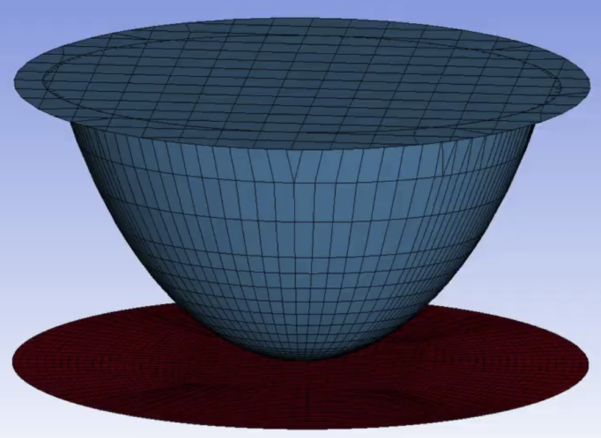

## 4.3 Aluminium pressing simulation pipeline

To efficiently explore the design space, the FEM modelling is embedded within an automated simulation pipeline that connects geometry generation, simulation execution and result evaluation. The pipeline is implemented in Python and consists of the following steps, illustrated in Figure 4-8:

Parametric geometry generation: a CAD model is generated programmatically using the FreeCAD Python API. Each of the nine design parameters described in Section 4.1 is represented internally as a normalised value in the range 0 to 1, which is mapped linearly to its physical range. A specific design point is therefore a vector of nine independent normalised values (one per parameter), not a single combined value. This enables automated generation of arbitrary design variants from a single parametric definition.

Mesh generation and model setup: the CAD geometry is exported as a STEP file, and Python scripts generate LS-DYNA keyword files (.k files) using template-based generation. These files define the mesh, material properties, boundary conditions, contact definitions and forming pressure.

Simulation execution: LS-DYNA performs the forming simulation.

Post-processing: key metrics (time-to-crack, lip-mean, edge-mean) are extracted from the simulation output.

Evaluation against criteria: results are compared against manufacturability criteria. A design is considered feasible if the forming process completes without material failure.

Storage and traceability: input parameters and outputs are stored in a structured CSV dataset. Each simulation is identified by an input_hash — a SHA-256 hash computed over the concatenated string representation of all nine input parameter values, used purely as a stable unique identifier for the row. The hash is not itself a normalised parameter value; the original parameter values are stored alongside it in the same row, and the hash only serves to deduplicate and index simulations across the full campaign.

The CSV dataset stores one row per simulation, keyed by input_hash — a hash of the concatenated input parameter values that serves as a unique identifier. The nine input fields are cup_rad, cup_lip, cup_depth, cup_angle, cup_y_to_x, cup_tip, space, alu_thick and pressure, corresponding one-to-one with the design parameters defined in Section 4.1. The three output fields are time_to_crack (the key manufacturability metric, capturing how far through the forming process the simulation progresses before material failure), lip_mean (a quality metric averaged over the cup lip region) and edge_mean (a quality metric averaged over the cup edge region). Two versions of the dataset are maintained: collect_full.csv contains all executed simulations (approximately 3,900 rows at the time of writing), while collect.csv contains the curated subset along the Pareto front (approximately 1,300 rows) retained after data culling. Both files share the same schema, so the machine-learning workflows and other downstream consumers can operate on either without modification.

The pipeline is fully automated, allowing batch simulation of design variants and systematic exploration of the parameter space.

## 4.4 Parameter space exploration and optimisation

The design of the float structure involves navigating a parameter space with competing objectives.

Three complementary approaches are used to select which parameter combinations to simulate:

Random sampling within the normalised parameter space, providing broad coverage of the design space in early stages.

Iterative boundary search, where a custom algorithm starts from a previously simulated design and systematically adjusts one parameter at a time using binary search. If the previous simulation succeeded, the parameter is pushed toward a harder region (e.g. deeper cup); if it failed, pushed toward an easier region. This converges efficiently toward the boundary between feasible and infeasible designs — the Pareto front where competing objectives are balanced.

Machine-learning-guided sampling, where a neural network trained on the accumulated dataset predicts forming outcomes for untested parameter combinations. The ML model (implemented using TensorFlow and Keras with Hyperband hyperparameter tuning via keras-tuner) estimates the forming pressure required for successful forming given a set of geometric inputs. This enables targeted sampling in regions predicted to be near the feasibility boundary, improving the efficiency of the exploration.

As the dataset grows, periodic data culling is performed to maintain a high-quality dataset along the Pareto front. For each parameter, redundant interior points are removed, retaining only the boundary value, the point immediately above, and the point immediately below the feasibility threshold. This process has reduced the full dataset of approximately 3,900 simulations to a curated dataset of approximately 1,300 high-quality data points characterising the feasibility boundaries of the design space.

The combination of iterative boundary search, ML-guided sampling and periodic culling is itself the result of several iterations within WP6. Earlier rounds relied on random sampling to populate the dataset, but the resulting points were spread thinly across the feasible interior and gave the neural network too little information at the feasibility boundary to make accurate predictions, slowing convergence rather than accelerating it. Replacing the unstructured random pool with a smaller dataset concentrated along the boundary, refreshed by culling, was what made the ML-guided exploration effective. The hydroforming feasibility boundary is now considered well-characterised at the level of detail required to feed the multi-domain screening of D6.2; no additional pressing simulations are planned for that purpose, and the curated dataset of approximately 1,300 points is in fact larger than strictly necessary, retained at this size to support sensitivity studies and re-screening as downstream constraints (structural, thermal, LCA) are refined.

The genetic algorithm library DEAP is used as a fallback candidate generator when neither the iterative boundary search nor the ML model produces a valid next design point — for example, after an exhausted local search or when ML predictions cluster outside the feasible region. DEAP runs a small genetic-algorithm loop over the nine normalised design parameters, treating each parameter vector as an individual, applying mutation and crossover, and selecting candidates that pass the geometric and parameter-validation pre-screen of Stage 1 (Section 7.3). The first valid offspring is returned as the next design point to simulate. This guarantees that the pipeline can always propose a fresh, geometrically admissible candidate and prevents the exploration loop from stalling.

## 4.5 Experimental validation of pressing models

While FEM simulations provide valuable insight, they rely on assumptions regarding material behaviour and process conditions — in particular the friction coefficient at the tool–sheet interface and the fracture criterion threshold, neither of which can be derived from first principles. Experimental validation is therefore required.

The material constitutive model itself (Yld2003 yield function and Voce hardening law, Section 4.2) is calibrated against standardised uniaxial, biaxial and forming-limit tests of the AA5083-H111 sheet and does not depend on any specific cup geometry or forming process — these are intrinsic material properties that apply equally to punch/die and hydroforming. In contrast, the friction coefficient and the critical thickness strain used as fracture criterion are process-dependent and must be calibrated against forming outcomes from real parts.

For this purpose, the simulation framework has been calibrated against the known forming envelope of the Gen 1 Sunlit product, which was manufactured using a conventional punch/die press. The physical forming reference was obtained partly through Sunlit Sea's earlier collaboration in the MariSol project with the UK partner Accura, where the punch/die runs that establish the Gen 1 forming envelope were carried out: a cup depth of 38.5 mm forms without failure, while a cup depth of 40 mm fails during the drawing process. The friction coefficient and fracture threshold in the simulation were tuned so that the model reproduces both outcomes: successful forming at 38.5 mm with no sign of localised necking, and clear fracture at 40 mm. The two resulting parameter values (a friction coefficient of approximately 0.085 and a critical through-thickness strain of approximately −0.45) have subsequently been held fixed across the parametric exploration described in Section 4.4.

It should be noted that these process-dependent parameters were calibrated against punch/die forming data and are applied here to hydroforming simulations. The contact mechanics differ between the two processes: in punch/die forming the friction acts at the punch–sheet and die–sheet interfaces under controlled contact pressure, whereas in hydroforming the fluid pressure acts uniformly on one face of the sheet while friction acts only at the mould–sheet interface on the opposite face. The material model predictions are therefore on firm ground, but the friction and fracture calibration carries a process-transfer uncertainty that should be addressed by recalibrating against hydroforming-specific forming trials as production tooling becomes available. The proof-of-concept described below represents the first step in building that hydroforming-specific validation basis.

An early application of the calibrated model was a two-parameter study of cup depth against drawbead distance using a simple iterative boundary-search algorithm. About thirty simulations were enough to trace the feasibility boundary, and all fracture instances occurred in the same orientation — perpendicular to the transverse direction, approximately 50 mm from the cup centre — consistent with r90 being the lowest Lankford coefficient (Figures 4-9 and 4-10). The study served both as a validation (the model reproduces the directional fracture bias expected from the material anisotropy) and as the methodological precursor to the full nine-parameter boundary search of §4.4.

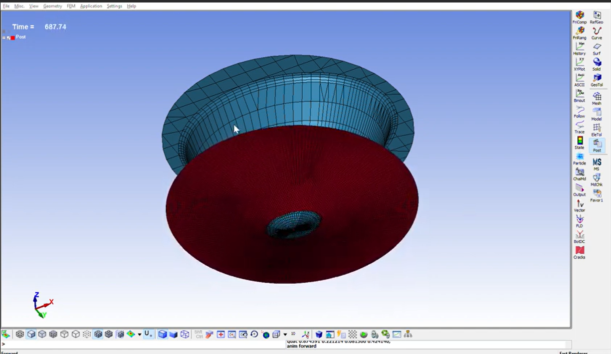

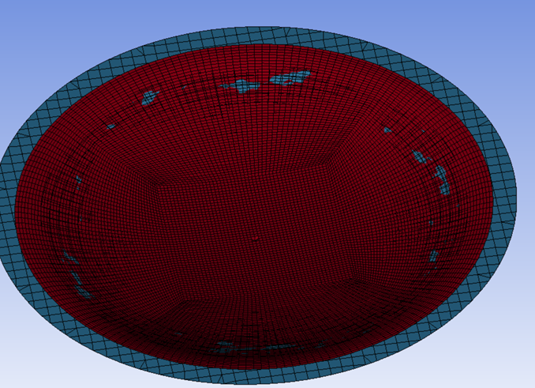

In addition to simulation validation, a physical proof-of-concept for the hydroforming process was conducted. A pressing tool was prototyped by 3D-printing a mould form and casting it in epoxy. A 0.8 mm aluminium sheet was secured to the mould with sealed edges, and a water injection system was used to apply forming pressure. This demonstrated that the hydroforming approach is practically feasible and provided the basis for a specification issued to external manufacturing vendors.

## 4.6 Integration with the broader modelling framework

The aluminium pressing model is integrated into the broader WP6 modelling framework. Outputs from this domain feed into structural modelling (by defining feasible geometries and material distributions after forming), economic assessment (through material usage and manufacturing complexity), and system design (by constraining the available design space). Conversely, requirements from other domains such as structural performance and buoyancy define targets for the manufacturing design.

## 4.7 Summary

The FEM modelling of aluminium float pressing establishes a simulation-driven approach to manufacturing design. Through the automated pipeline, approximately 3,900 forming simulations have been executed and curated into a dataset of approximately 1,300 high-quality data points along the Pareto front. The combination of parametric modelling, automated simulation, iterative boundary search, machine learning and experimental validation provides a foundation for optimising the float structure with respect to both performance and cost.

# 5 Thermal, Mechanical and Economic Modelling

## 5.1 Overview

Beyond manufacturing feasibility, the development of the Sunlit FPV system requires modelling and testing across the other closely connected engineering domains outlined in Section 3.3.2. This chapter describes the thermal, mechanical and economic modelling activities performed in WP6.

## 5.2 Heat transfer modelling

### 5.2.1 Objective and relevance

The thermal behaviour of the integrated FPV system has a direct impact on energy yield (PV efficiency decreases with increasing temperature), material durability (particularly for polymers and sealants that can e.g. soften and/or expand under increasing temperatures), and reliability (elevated temperatures accelerate degradation mechanisms). In the Sunlit concept, thermal behaviour is influenced by the close coupling between the PV module, float-structure and surrounding environment (water, air, solar radiation). Heat transfer modelling is therefore required to understand and control temperature behaviour under realistic operating conditions.

In the Gen 1 product, heat from the PV panel dissipates passively downward through the polystyrene infill and the pressed aluminium bottom plate into the surrounding water, as illustrated in Figure 5-1. This thermal path — exploiting the high thermal conductivity of aluminium as a bridge between the panel and the water — is a key design feature of the integrated Gen 1 float concept and motivates the choice of AA5083-H111 as the float material. In the Gen 2 concept the infill is likely to be PU foam, which is thermally resistive; heat dissipation to water occurs instead primarily through the aluminium panel frame and the aluminium bottom plate, without a low-resistance path through the infill body. Whether this thermal bridge should be reintroduced in Gen 2 — for example through pressed-cup aluminium infill or aluminium honeycomb — is an open design question to be addressed through the D6.2 thermal CFD runs.

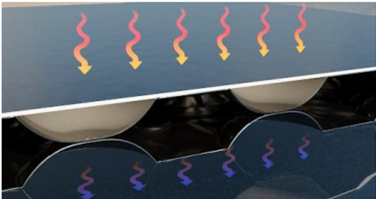

### 5.2.2 Modelling approach

Thermal behaviour is analysed using CFD. The model includes solar irradiance input (absorbed energy), convective heat transfer with air and water, radiative heat exchange with the environment, and conductive heat transfer within system components. Material surface properties are included explicitly, as they strongly influence temperature behaviour.

To support the thermal modelling, the optical properties of the PU hinge material, which initially had a dark blue colour, were measured experimentally. Absorptivity was determined by measuring spectral reflectance over the range 300–1650 nm using a laboratory spectrometer, weighting against the AM1.5G solar spectrum, and assuming negligible transmission through the hinge thickness. Four measurements on two samples (front and back) yielded an average reflectivity of 10.0% over 300–1650 nm, corresponding to an absorptivity of A = 0.88–0.91 depending on assumptions about reflectance in the 1650–2500 nm range. Emissivity was measured outdoors using a handheld IR camera calibrated against a reference surface (black electrical tape, known emissivity ~0.95). Two measurements yielded PU emissivity values of 0.80 and 0.90, giving an average of ε = 0.85. During the emissivity measurement, it was noted that after approximately two hours of sun exposure at around 45°C, the dark blue PU already showed signs of softening and emitted a noticeable odour.

### 5.2.3 Boundary conditions and scenarios

To evaluate worst-case conditions, environmental inputs are derived from ERA5 reanalysis climate data covering a period of five years. The selected worst-case location is off the coast of Singapore (latitude 1.25° N, longitude 104° E), which combines high solar irradiance with typically low wind speeds and high ambient temperatures, and therefore represents a thermally demanding site for the system. From the ERA5 record, the worst-case instance used in the simulations has a global horizontal irradiance of 943 W/m², an air temperature of 28.1°C, a water temperature of 21.5°C and a wind speed of 0.5 m/s. Under these conditions, module temperatures predicted by the Faiman model reach 60.2–61.3°C, establishing the thermal loading for the CFD simulations described in the following section.

### 5.2.4 Key findings and design implications

The thermal modelling, combined with the measured surface properties (Section 5.2.2), showed that the dark blue PU reaches temperatures that can exceed acceptable limits for the material under high-irradiance conditions. This finding was independently confirmed by accelerated UV exposure testing (Section 5.3.3), where PU samples exhibited severe darkening, burn marks and softening after only 209 hours of a planned 1,000-hour test — partly attributed to elevated sample temperatures approaching 95°C.

As a direct consequence of these findings, the PU colour was changed from dark blue to off-white in subsequent prototype iterations to reduce solar absorptivity and peak operating temperatures. This design change demonstrates the practical value of the thermal modelling in informing material selection decisions.

Within the model chain, the thermal CFD acts as a downstream consumer of the parametric CAD geometry and of the experimentally measured surface properties, and as a producer of peak component temperatures used as a screening metric. The corresponding data interface — including the STEP geometry transfer from FreeCAD, the absorptivity and emissivity values communicated as scalars per material domain, and the environmental boundary conditions derived from ERA5 — is documented as interface DI-4 in Section 6.3. The peak PU temperature output feeds into the multi-stage screening described in Section 7.3 (Stage 3: structural and thermal performance screening), where it is evaluated against material stability limits and used alongside manufacturability and structural metrics to filter the design space.

## 5.3 Mechanical testing and structural modelling

### 5.3.1 Objective and scope

Mechanical modelling and testing address the structural behaviour and durability of the system under operational loads. This includes load transfer between interconnected units, behaviour of flexible components (hinges and connectors), and response to cyclic loading and fatigue. Given the marine environment, components are subjected to repeated loading over long lifetimes, making fatigue behaviour and environmental degradation critical considerations.

### 5.3.2 Structural modelling

Structural behaviour is analysed using numerical models that evaluate stress and strain distributions, deformation under load, and load transfer paths between components. A mechanical design principle has been established for the hinge system: loads between neighbouring floats should be absorbed as close to the centre of the connection point as possible, and as far as possible from the PU-glass and PU-aluminium interfaces, which are critical areas for water ingress. A test matrix of six load cases (XY bending, XZ bending, XY compression, XY stretch, YZ bending, XZ shear) and six measurement points at key interfaces has been defined as a reusable framework for comparing successive prototype revisions.

In parallel, IFE has developed a 3D FEM model of the Sunlit prototype floater using their SiSim tool, with MSC PATRAN for pre-processing. The model takes a STEP file exported from Sunlit Sea's parametric FreeCAD model as input, demonstrating the CAD-to-structural-FEM data flow in practice. The solution domain comprises two connected floating modules with approximately 310,000 elements and 2,000,000 degrees of freedom; one linear analysis step takes approximately 2.5 minutes. Different material domains (PU, glass, aluminium) are assigned separate material properties, and mechanical interactions between parts are defined by interface boundary conditions.

A buoyancy boundary condition has been implemented that computes vertical position from the balance of gravity and buoyancy forces. This revealed that the Prototype 4 floater sits rather deep in the water, with approximately half of the bottom plate submerged under self-weight alone. This finding has implications for the design, suggesting that increased buoyancy volume or reduced system weight may be needed to achieve adequate freeboard.

Stress analysis under 10 mm imposed horizontal elongation (representing wave or current loading) showed that the largest stresses in Prototype 4 occur in the thin aluminium bottom plate and frame, with aluminium stresses approaching yield level. The PU stresses exceeded yield in localised regions. In the glass, the largest stresses were found at the upper surface near the PU ring attachment, and were sensitive to how the glass is attached to the aluminium frame. The simulations used an interface stiffness of 100 MPa per mm displacement, considered a relatively stiff connection.

It should be noted that the IFE simulation was performed without the infill between the bottom plate and glass. This is a significant simplification relative to the current design, where the infill provides structural support to the glass, internal load distribution, and sealing. The absence of infill means that the stress results likely overestimate stresses in the glass and underestimate overall system stiffness. However, the results build a strong case for why the infill is structurally necessary: without it, both aluminium and PU stresses approach or exceed yield under moderate loading conditions.

### 5.3.3 Coupling with environmental effects

Mechanical performance of the integrated unit is strongly coupled to environmental stressors — temperature affects material stiffness and strength, UV exposure drives long-term polymer degradation, and moisture ingress alters interface and material properties — and these stressors interact rather than acting independently. Because such effects are difficult to capture from first principles in the structural model alone, dedicated experimental investigations have been carried out to characterise them and to feed quantitative inputs back into the model chain. The principal findings to date are summarised below.

**Tensile properties of PU hinge materials.** Three PU grades with different Shore hardness (70A, 80A, 90A) were tested in coupon form (thin strip samples). The lowest-quality material (C+ 85A) reached approximately 6 MPa tensile strength at about 400 % strain. The two higher-quality grades exceeded 10 MPa at strains above 750 % without breaking — testing to failure was not possible because the samples slipped from the tester grips even after surface roughening, so the reported values are lower bounds.

**UV exposure of PU and minipatches.** PU samples (both minipatches representing the hinge-to-panel interface and tensile strips) were subjected to accelerated UV exposure following IEC TS 62788-7-2 condition A3 (chamber 65 °C, black-panel 90 °C, irradiance 0.8 W/m² at 340 nm, RH 80 %). The test was stopped after 209 h of a planned 1,000 h exposure due to severe degradation: all samples darkened and several minipatches showed burn marks. The 70A and 80A grades showed the most softening and burn damage; the 90A samples blackened but stayed hard. The elevated minipatch temperature (estimated ≈ 95 °C, due to proximity to the light source rather than to the design absorptivity) likely exceeded the thermal stability of the darker PU grades. A revised programme was defined using condition A1 (chamber 45 °C, black-panel 70 °C) to avoid thermal damage while preserving meaningful UV acceleration. Gravimetric measurements on the minipatches showed 2–8 g mass increase in exposed samples versus zero in references, suggestive of moisture ingress but inconclusive at this exposure duration.

**Adhesion and interface testing on Prototype 3.** Adhesion testing of the PU-glass and PU-aluminium interfaces is in progress on Prototype 3 (P3) samples. An initial attempt to cut P3 samples into individual test pieces failed because the tempered glass shattered on cutting. The revised approach removes the hinges from one sample (chemical bonding only) and exposes the remaining box plus loose hinges in the UV chamber; after exposure, shear testing of the PU-glass interface (long sides) and tensile testing of the loose hinges become accessible. The methodology builds on prior work at IFE on edge-sealant durability for the Gen 1 Sunlit product (Roosloot, Selj and Otnes, IEEE Journal of Photovoltaics, 2024), which established lap shear testing and failure-mode classification as tools for evaluating adhesion under environmental stress.

Together, these results illustrate why experimental coupling is essential to the model chain: the combined UV-plus-temperature degradation observed in the early test was substantially more severe than either stressor would have predicted alone, and the resulting design decisions — PU colour change (Section 5.2.4), hardness-grade selection, and revised UV test protocol — feed back into the parametric and material inputs of the manufacturing, structural and thermal models. Full experimental characterisation of the white PU on Prototype 3, including post-UV mechanical and adhesion data, is targeted for D6.2.

<!-- TODO for IFE (Nathan): Please update the status of the accelerated UV testing on white PU (condition A1 protocol). Provide accumulated chamber hours to date and the expected completion date so D6.2 can plan around the results. -->

<!-- TODO for IFE (Nathan): Please update the status of the P3 adhesion testing — shear testing of the PU-glass interface (long sides) and tensile testing of the loose hinges after UV exposure. Provide current status and expected completion date. -->

### 5.3.4 Role in design development

Mechanical modelling and testing validate that the system can withstand expected loads, identify weak points in design or materials, and guide improvements in component design and material selection. The results have directly informed the transition from dark to light-coloured PU, the redesign of hinge geometry between prototype iterations, and the prioritisation of adhesion testing as a critical investigation.

The structural modelling sits within the model chain as the consumer of two upstream data flows and a producer of stress and deformation metrics that feed downstream decisions. From the parametric CAD it receives the system geometry as a STEP file (interface DI-2 in Section 6.3); from the pressing FEM it can additionally receive the as-formed thickness distribution across the aluminium sheet (interface DI-3), so that local thinning is reflected in the structural response rather than assumed uniform. The outputs — peak von Mises stresses in the aluminium, PU and glass domains, deformation under prescribed load cases, and the buoyancy/freeboard balance — are used as inputs to the structural and thermal performance screening stage of Section 7.3 and to identify design variants where stresses approach yield or freeboard is inadequate. Integration of these flows into an automated pipeline, together with the addition of the infill domain to the SiSim model, is targeted for D6.2.

## 5.4 Economic and life-cycle considerations

### 5.4.1 Objective and relevance

In addition to technical performance, the Sunlit system must achieve cost competitiveness and sustainability. Design choices in WP6 directly influence cost drivers such as aluminium consumption (governed by sheet thickness and cup geometry), complexity of forming processes, number of components and assembly steps, and compatibility with commercially available PV modules. For example, reducing sheet thickness from 1.0 mm to 0.8 mm lowers material cost but increases manufacturing difficulty and may reduce structural robustness — a trade-off that the forming simulation framework is designed to evaluate.

### 5.4.2 Life-cycle assessment (LCA)

Life-cycle considerations include embodied energy and carbon footprint of materials, durability and expected lifetime, and recyclability of components. Detailed LCA modelling for the Sunlit system in SuRE is carried out by TNO as part of the sustainability assessment work. The role of WP6 is to supply the engineering data that defines the life-cycle inventory — materials, masses, dimensions, process parameters and site conditions — and to update this data as the design evolves through the modelling and prototyping cycle.

The LCA work builds on methodology developed in the earlier Surewave project, where the Sunlit technology was one of the systems assessed (under IFEU's lead for that project) using a cradle-to-grave system boundary and a functional unit of 1 MWh of produced electricity. The component-level data flow established there — with structured tables of masses, energy requirements and production locations, refined iteratively as designs matured — provides the reference pattern for the equivalent data exchange with TNO in SuRE.

A baseline inventory for the Sunlit Gen 2 product has already been transferred to TNO. This baseline corresponds to Prototype 3 of the Gen 2 design and comprises a per-unit bill of materials (aluminium bottom plate, PU, PU foam, silicone, cabling and a reference solar panel) together with project-level components required for deployment (mooring and anchoring, cabling, inverters, transformers and ground works). The full description of these inputs and of how they are exchanged with TNO is given in Section 6.3 under interface DI-5 of the model chain. As the design parameters explored in this report (cup geometry, sheet thickness, PU quantities, material selection) are updated through successive iterations, revised values are communicated to TNO so that the life-cycle inventory continues to track the current design rather than a fixed baseline.

The coupling between the WP6 modelling framework and the LCA work is therefore bidirectional in intent. The modelling provides concrete inputs for the inventory, while LCA outputs — relative contributions of different materials and processes to the overall environmental impact — provide a further performance dimension alongside manufacturability, structural performance and cost, to be used in the screening and selection of design variants. Full integration of LCA metrics into the parameter-screening workflow described in Chapter 7 is targeted for D6.2.

<!-- TODO for TNO: Please confirm whether the Q2 2026 LCA results timeline is still on track, and whether preliminary results can be shared into the D6.2 draft ahead of the final deliverable. -->

## 5.5 Summary

Beyond manufacturing feasibility, WP6 has produced measured PU optical properties (Section 5.2.2) that identified a thermal over-temperature risk and drove a colour change (Section 5.2.4), PU tensile data across three hardness grades, accelerated-UV results that triggered a revised test protocol on Prototype 3, and a structural FEM model in SiSim that flagged buoyancy and stress hot-spots in the prototype.

# 6 Model Harmonisation and Digital Product Development

## 6.1 Role of the model chain in WP6

A central objective of WP6 is to support the transition to a model-supported digital product development framework. In this context, a model chain refers to a set of interconnected models representing different engineering domains, a structured flow of data between these models, and a consistent parameter framework enabling traceability across design iterations. The purpose of the model chain is to link design parameters to system-level performance, enable efficient screening of design alternatives, and support engineering decisions across domains.

Several domain-specific models have been developed (manufacturing, thermal, mechanical), a shared parameter framework has been established, and structured workflows for data exchange are in place.

## 6.2 Conceptual structure of the model chain

The model chain can be understood as a sequence of transformations from design definition to performance evaluation. The main elements are: design parameter definition (geometry, materials, system configuration); domain-specific models (manufacturing FEM, structural behaviour, thermal behaviour); performance metrics (manufacturability indicators, structural safety margins, peak temperatures, material usage); and a decision layer where results are interpreted to guide design iteration. This structure is illustrated in Figure 6-1.

## 6.3 Data flow between modelling domains

A key aspect of the model chain is the flow of data between domains. Even where models are not fully coupled, dependencies exist and must be managed explicitly.

The manufacturing model (Chapter 4) takes geometric parameters (cup depth, spacing, curvature) and material properties (aluminium grade, thickness) as input. It produces the feasible geometry after forming, the thickness distribution across the formed sheet, and manufacturability indicators including time-to-crack. These outputs constrain the design space for downstream models. As a concrete example, a cup configuration with depth 20 mm, radius 25 mm and 0.8 mm sheet thickness produces a thickness distribution after forming that varies across the cup geometry, with thinning concentrated at the cup walls. This as-formed geometry and thickness map — rather than the idealised CAD geometry — is what the structural model should use as input, since local thinning affects structural strength and fatigue behaviour.

The structural model receives the system geometry as a STEP file from Sunlit Sea's parametric FreeCAD model. IFE's FEM tool (SiSim, with MSC PATRAN for pre-processing) imports this geometry, assigns material properties to each domain (aluminium, glass, PU), defines interface boundary conditions, and computes stress distributions under applied loads. This data flow has been demonstrated in practice: the structural simulation of two connected prototype modules (310,000 elements, 2,000,000 degrees of freedom) used a STEP file exported directly from the parametric design, and the results (Section 5.3.2) fed back into the design process.

Thermal modelling uses the system geometry and measured material surface properties (absorptivity A = 0.88–0.91 and emissivity ε = 0.85 for dark PU, significantly lower values expected for off-white PU). The thermal model outputs peak component temperatures under worst-case environmental conditions, which are compared against material stability limits to assess design feasibility.

Each modelling domain produces outputs mapped to performance indicators: manufacturability limits (pass/fail), structural safety margins, temperature limits, and material usage. These metrics are used consistently across design iterations to enable comparison between design variants.

The interfaces between modelling domains are summarised in Table 6-1. For each interface, the table specifies the producing and consuming models, the data transferred, the file format or data structure used, and the current implementation status. These data interfaces are labelled DI-1 to DI-6 to distinguish them from the physical component-to-component interfaces (I1–I19) defined in Chapter 2.

Table 6-1. Summary of inter-model data interfaces (DI-1 to DI-6) in the WP6 modelling chain.

| ID | From | To | Data transferred | Format | Status |
|----|------|----|-----------------|--------|--------|
| DI-1 | Parametric CAD (FreeCAD) | Pressing FEM (LS-DYNA) | Cup geometry (9 parameters: radius, depth, eccentricity, angle, tip radius, lip radius, spacing, sheet thickness, pressure) | STEP + LS-DYNA keyword files (.k) generated from Handlebars templates | Implemented and automated |
| DI-2 | Parametric CAD (FreeCAD) | Structural FEM (SiSim / IFE) | Full 3D assembly geometry of two connected floating modules; material domain assignments (aluminium, glass, PU) communicated separately | STEP (ISO 10303); minor geometric simplifications applied by IFE before import (e.g. screw holes removed) | Implemented; data transfer manual |
| DI-3 | Pressing FEM (LS-DYNA) | Structural FEM (SiSim / IFE) | As-formed thickness distribution field across the pressed sheet; used to identify thinning and tearing locations in the metal | LS-DYNA element output; extractable per simulation on demand | Available on demand; not yet passed to structural FEM; full integration targeted for D6.2 |
| DI-4 | Parametric CAD + material measurements | Thermal CFD (IFE) | System geometry; surface optical properties (absorptivity A, emissivity ε) per material domain; environmental boundary conditions (GHI, T_air, T_water, wind speed) | STEP for geometry; scalar property values communicated manually; boundary conditions from ERA5 climate dataset | Implemented; data transfer manual |
| DI-5 | WP6 models (pressing FEM + CAD) + prototype data | LCA model (TNO, WP1 T1.3) | Per-unit bill of materials (aluminium mass, PU mass, PU foam mass, silicone, cabling, solar panel spec); project-level components (mooring, anchoring, inverters, transformers, cabling); production locations; site conditions | STEP file for geometry; parameter tables and component lists exchanged by email; iterative updates as design evolves | Active — Prototype 3 baseline delivered to TNO; updates provided as design and modelling progress |
| DI-6 | Pressing FEM dataset (CSV) | ML model (TensorFlow / Keras) | Per-simulation record: input_hash, cup_rad, cup_lip, cup_depth, cup_angle, cup_y_to_x, cup_tip, space, alu_thick, pressure (inputs); time_to_crack, lip_mean, edge_mean (outputs) | CSV (collect.csv / collect_full.csv); normalised parameter values (0–1) mapped to physical ranges | Implemented and automated |

The three interfaces involving external models (DI-2, DI-3, DI-4) are described in more detail below.

Interface DI-2: Parametric CAD to structural FEM

The geometry of the Sunlit floating unit is maintained as a fully parametric FreeCAD model (Section 3.5). For structural analysis, this model is exported as a STEP file and transferred to IFE, who import it into MSC PATRAN for pre-processing before running the structural simulation in SiSim. The exchange has been demonstrated in practice for a two-module assembly (Section 5.3.2).

On the Sunlit side, the export procedure is straightforward: FreeCAD's STEP export produces an ISO 10303 file representing the complete 3D assembly. The STEP file contains the geometry of all structural domains — aluminium frame and bottom plate, glass, and PU components — as separate solids. No material or load information is embedded in the STEP file; these are assigned by IFE within their pre-processing environment.

[TODO for IFE: specify the STEP version (AP214 or AP242) that SiSim/PATRAN requires; confirm which geometric features are removed or simplified before meshing (known: screw holes removed; confirm whether fillets, cable routing features or other details are also suppressed); confirm how material properties (elastic modulus, Poisson ratio, density) are communicated — currently understood to be assigned manually by IFE from agreed values, but the handover mechanism is not formally defined.]

The current data transfer is manual: Sunlit exports a STEP file and sends it to IFE. No automated link between the FreeCAD model and the IFE workflow exists at this stage. Automating this exchange — so that a design change in FreeCAD triggers a new structural simulation — is targeted for D6.2.

Figures 6-2 through 6-5 illustrate the FreeCAD-to-STEP workflow: the parametric model with its design-controlling properties, and the resulting STEP geometry viewed from three angles.

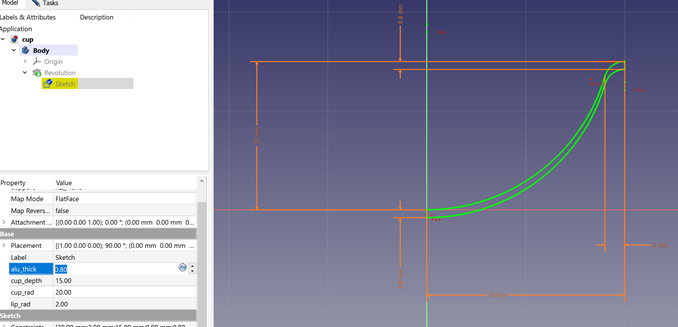

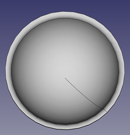

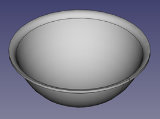

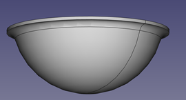

Interface DI-3: Pressing FEM thickness distribution to structural FEM

The LS-DYNA forming simulation produces, as part of its element output, the through-thickness strain and resulting thickness distribution across the pressed aluminium sheet at the end of the forming process. This field captures where the metal has thinned during forming, and — critically — whether and where the simulation predicts tearing or necking. These results have been used throughout the pressing simulation campaign to evaluate forming quality: a simulation where thinning remains within acceptable limits and no tearing is predicted represents a feasible design, while one where the thickness drops to zero at any point indicates forming failure.

Although this output has not been systematically archived for all approximately 3,900 simulations in the dataset (the primary stored metrics are the scalar indicators time-to-crack, lip-mean and edge-mean), the thickness distribution field can be extracted by re-running any simulation with minor post-processing adjustments. The underlying simulation files and input parameters are retained, so the spatial thinning field is available on demand for any design point in the dataset.

The intended downstream use of this field is to provide a more accurate input to the structural FEM model. Rather than assuming uniform nominal thickness throughout the aluminium bottom sheet, the structural model should account for the reduced and non-uniform wall thickness that results from forming. Local thinning concentrated at cup walls is a structurally critical feature: it reduces cross-sectional area and may create fatigue initiation sites under cyclic loading. Passing the as-formed thickness map to IFE's SiSim model would allow stress analysis to reflect the actual manufactured geometry rather than the idealised CAD representation.

The format for this transfer has not yet been agreed. The natural output from LS-DYNA is a nodal or element-centred field that can be exported as a text table of coordinates and thickness values. [TODO for IFE: confirm the preferred input format for importing a mapped thickness field into SiSim/PATRAN — whether a CSV of nodal coordinates and thickness values is acceptable, or whether a different format is required; confirm the coordinate system convention.]

Full implementation of this interface is targeted for D6.2.

Interface DI-4: Parametric CAD and material properties to thermal CFD

The thermal CFD model developed by IFE (Section 5.2) takes the system geometry, material surface properties, and environmental boundary conditions as input, and produces temperature distributions across system components as output.

On the geometry side, the system geometry is transferred via STEP file from Sunlit's FreeCAD model, following the same exchange procedure as DI-2. [TODO for IFE: confirm whether the same STEP file used for structural analysis is also used for thermal CFD, or whether a simplified geometry (e.g. without internal PV components) is used; confirm which material domains are represented in the CFD mesh.]

Material surface properties have been characterised experimentally by Sunlit Sea and communicated to IFE as scalar values. The relevant properties for the thermal model are absorptivity (A = 0.88–0.91 for dark blue PU; significantly lower for off-white PU — to be measured) and emissivity (ε = 0.85, measured with handheld IR camera). These values are currently communicated informally. [TODO for IFE: confirm the full list of material properties required by the CFD model beyond absorptivity and emissivity — e.g. thermal conductivity, specific heat, density for each material domain — and confirm whether these are sourced from Sunlit, from standard material databases, or from IFE's own material library.]

Environmental boundary conditions follow the Singapore worst-case scenario described in Section 5.2.3, which provides the air and water temperatures, wind speed and solar irradiance used as inputs to the CFD model.

The CFD model outputs temperature fields across all component domains. The primary performance metric extracted is the peak temperature of the PU hinge material, evaluated against the 70°C material stability limit. [TODO for IFE: confirm what output format the CFD results are delivered in, and whether spatial temperature fields or only scalar peak/average values are archived; confirm whether output data is stored in a format compatible with the WP6 data framework.]

Interface DI-5: WP6 to LCA (TNO)

Life-cycle assessment for the Sunlit floating PV system is conducted by TNO as part of the broader SuRE sustainability assessment work. The WP6 engineering and modelling work is one of the primary inputs to this assessment: design parameters, bill of materials, production processes and site conditions all feed into the LCA model.

The methodological pattern follows the approach used in the earlier Surewave project, where the Sunlit product was one of several technologies assessed. In Surewave, engineering partners provided the LCA team with component-level and material-level inputs — masses, dimensions, energy requirements for production, country of origin for materials and sub-assemblies, and installation and operation parameters — structured as tables keyed by plant location and design variant. A cradle-to-grave system boundary was used, covering production, transport, assembly, operation and decommissioning, while excluding production equipment and detailed recycling pathways. The functional unit was 1 MWh of produced electricity. This pattern provides a reference for how the SuRE data exchange is being structured.

In SuRE, the LCA interface has been active from an early stage of the project. Sunlit Sea has transferred the current STEP file of the Gen 2 product to TNO as the geometric reference for material volumes and mass estimates, and has provided an initial bill of materials corresponding to Prototype 3 of the Gen 2 product. This baseline is used by TNO to build the first life-cycle inventory for the new Sunlit design within SuRE. As the design evolves through the modelling and prototyping cycle described in this report — with updates to the aluminium thickness, cup geometry, PU quantities, and material selection — revised values are communicated to TNO so that the LCA tracks the design state rather than remaining fixed to an outdated snapshot.

The baseline data provided to TNO is structured at two levels.

At the level of the individual floating unit, the main inputs are: a solar panel with junction box, short cables and MC4 connectors; an aluminium bottom plate, currently sheet alloy 5083H111 at approximately 2382 × 1301 × 0.8 mm; PU (approximately 12 kg per unit in the current design); PU foam (approximately 2 kg per unit); silicone sealant (approximately 0.2 kg per unit, as tubed material); a return cable of approximately 1.4 m; and a grounding cable of approximately 1.4 m. These quantities are directly linked to the design parameters covered by the WP6 modelling framework, and the simulation pipeline described in Chapters 4 and 5 provides the path by which updated values are obtained as the design changes.

At the project level, the main inputs are the components required to deploy and operate a plant of given size. These include anchoring and mooring hardware (in the current working assumption, four buoys, approximately 160 m of mooring rope, four anchoring chains and four anchors per 30 × 30 m² block of array, noting that anchoring and mooring lie outside Sunlit's own technology scope), cabling between the installation and the inverter (typically 50–100 m, heavily project-dependent), inverters (one per approximately 330 kWp, currently assumed to be Huawei units), transformers and associated power conversion equipment, and ground works. The specific site under evaluation in SuRE is an inland Norwegian lake, which differs from the offshore sites assessed in Surewave in the hazards it presents: wave loads are lower, but the system is exposed to ice, snow loading, flora and fauna considerations, and in some locations ice cast from nearby wind turbines. These site-specific considerations influence the LCA through the structural and protective components required and through operation and maintenance assumptions.

The data exchange with TNO is currently managed through direct correspondence, in which parameter lists and tables are shared as updates become available. No formal data structure or automated pipeline has been established at this stage. [TODO with TNO: agree on a structured template (e.g. spreadsheet with fixed rows per material and project component) to replace free-form email exchanges as the data matures; confirm the functional unit and system boundary for the SuRE LCA, following or adapting the Surewave precedent; agree on which WP6 simulation outputs are used directly as LCA inputs (e.g. whether material mass is computed from the FreeCAD model, from post-forming LS-DYNA results, or from weighed prototype measurements); agree on how design iterations are versioned so that LCA results can be traced back to a specific design state.] Formalising this interface is a target for D6.2.

## 6.4 Parameter management and data consistency

Key parameters are defined once and reused across models. Geometric parameters are shared between the parametric CAD model and FEM simulations. Material properties (density, elastic modulus, thermal conductivity, surface optical properties) are shared between manufacturing, structural and thermal models. Each simulation is associated with a specific set of input parameters and corresponding outputs, identified by a unique hash. This enables tracking of design evolution and identification of parameter sensitivities across the approximately 3,900 simulations performed to date.

## 6.5 Level of model integration

At present, the model chain consists of loosely coupled models where data transfer is partly manual and models are executed separately. Parameter definitions are shared and workflows are structured to enable iterative development.

## 6.6 Summary

A conceptual model chain has been defined and the six interfaces between its tools (DI-1 to DI-6) have been catalogued in Table 6-1, with three (DI-1, DI-6, and partially DI-5) fully implemented and the rest to be brought from manual to automated transfer in D6.2.

# 7 Screening of the Design Parameter Space

## 7.1 Role of parameter screening in the development process

The modelling framework established in WP6 enables systematic evaluation of design alternatives across multiple engineering domains. A central application of this framework is the screening of the design parameter space, a structured process where a large number of design variants are generated, each variant is evaluated against domain-specific criteria, and infeasible regions are progressively excluded. The purpose is to reduce the viable design space, identify critical constraints, and guide engineering effort towards the most promising regions.

## 7.2 Definition and structure of the design parameter space

The design parameter space is defined by the nine independent variables described in Section 4.1 (cup radius, cup depth, cup eccentricity, cup angle, cup tip radius, cup lip radius, cup spacing, sheet thickness and forming pressure). Each parameter is defined within a bounded range. The parameter space is highly coupled: for example, cup depth and sheet thickness jointly influence forming feasibility, while cup radius and spacing together determine how much material is available for drawing during forming.

## 7.3 Multi-stage screening methodology

To manage complexity and computational cost, screening is performed using a multi-stage filtering approach.

Stage 1 — Geometric and manufacturability pre-screening: candidate designs are evaluated using simplified criteria to eliminate obviously infeasible configurations, including geometric feasibility checks (minimum radii, spacing constraints, cup tip smaller than cup radius) and parameter validation rules. This avoids unnecessary simulation of infeasible designs.

Stage 2 — Manufacturing simulation screening: designs passing the initial filter are evaluated using the FEM forming model (Chapter 4). Each simulation is evaluated against manufacturability criteria including whether forming completes without cracking (time-to-crack), minimum thickness after forming, and absence of localised failure indicators. Of the approximately 3,900 simulations performed, roughly 1,300 satisfied manufacturability constraints and were retained in the curated dataset. This stage represents the primary constraint on the design space, as manufacturing limits define hard feasibility boundaries.

Stage 3 — Structural and thermal performance screening: manufacturable designs are further evaluated using structural models (load transfer, stress distribution) and thermal models (temperature behaviour under environmental conditions). Because these evaluations are more computationally expensive, they are applied to a reduced set of candidates identified in Stage 2.

Stage 4 — Engineering judgement and selection: the final stage involves interpretation of results, balancing competing objectives, considering model uncertainties, and incorporating practical considerations not fully captured in models. Candidate designs are selected for prototyping or further study.

## 7.4 Data handling and traceability

For each evaluated design, the input parameter set, simulation outputs from each domain, and pass/fail status for each criterion are stored. Each design retains a unique identity (input hash) throughout the screening process, enabling tracking of how designs are eliminated, comparison between similar parameter combinations, and identification of parameter sensitivities across iterations.

## 7.5 Observations from parameter screening

The screening process has yielded several observations about the structure of the feasible design space. Cup depth is the most constrained parameter: feasible depth is strongly dependent on cup radius, sheet thickness and lip radius. Increasing cup depth beyond the feasibility boundary produces sharp transitions to forming failure (cracking), while other parameters show more gradual performance degradation. Cup eccentricity has a notable influence on formability, consistent with the anisotropic grain structure of rolled aluminium sheet. The interaction between cup spacing and cup radius governs how much material is available for drawing, creating coupled constraints that cannot be resolved by adjusting either parameter independently. These observations guide the prioritisation of design efforts and the selection of parameter ranges for subsequent iterations.

## 7.6 Limitations

The screening approach is subject to computational limitations (FEM simulations require 1–50 minutes each, preventing exhaustive exploration), model limitations (simplified representations may not capture all failure modes), and incomplete domain coupling (not all interactions between manufacturing, structural and thermal domains are fully represented in the current framework). Screening results must therefore be validated experimentally, and safety margins must be maintained in design selection.

## 7.7 Summary

The four-stage screening reduced ≈ 3,900 design variants to ≈ 1,300 manufacturability-feasible candidates and identified cup depth as the most constrained parameter; structural and thermal screening, applied to this curated set, is the headline activity of D6.2.

# 8 Conclusions

## 8.1 Assessment of outcomes

The work described in this deliverable was more productive in some areas than others, and produced several findings that were not anticipated at the outset.

## 8.2 What worked, what proved harder, and what surprised

**What worked well.** The automated pressing pipeline (FreeCAD → LS-DYNA → Python/ML) operated effectively at scale. Machine learning-guided exploration identified feasible regions that uniform grid sampling would have missed, and the combination of iterative boundary search and physical validation produced a curated dataset that is directly usable for multi-domain screening in D6.2. The thermal CFD produced an immediately actionable result: the over-temperature finding caused a design change — the dark-blue → off-white colour change — before any physical failure occurred, demonstrating that the modelling loop can surface critical issues ahead of prototype testing. The CAD-to-structural-FEM data flow (STEP export from FreeCAD into SiSim) was demonstrated in practice and establishes the template for DI-2 automation in D6.2.

**What proved harder than planned.** Three of the six data interfaces (DI-2, DI-3, DI-4) remain manual rather than automated, which is the primary deviation from the DoW scope (documented in Chapter 9). Building reliable domain-specific models took longer than expected because each domain required substantial experimental input before meaningful simulation was possible — material surface properties for thermal CFD, Lankford values and forming-limit data for the pressing FEM, and prototype STEP geometry for structural FEM. The structural simulation was also performed without the PU foam infill, a significant simplification that limits the reliability of stress predictions in the glass and PU domains.

**What surprised.** UV degradation of the dark-blue PU was far more severe than anticipated: the planned 1,000-hour test had to be stopped after 209 hours due to burn marks, softening and blackening, forcing a protocol change to a lower-temperature condition. The buoyancy analysis revealed that Prototype 4 sits approximately half-submerged under self-weight alone — a finding that implies the current design needs increased buoyancy volume or reduced mass to achieve adequate freeboard. Cup depth emerged as the dominant constraint on the manufacturing design space, with feasibility depending strongly on the joint values of cup radius and lip radius rather than on depth alone.

## 8.3 Contribution to SuRE objectives

The work contributes to cost efficiency through optimisation of material usage and manufacturing processes, to reliability through structural and thermal modelling and experimental validation, and to sustainability through reduced material consumption and support for life-cycle assessment. The transition towards a model-supported development process enables faster design iteration and reduced development risk.

## 8.4 Limitations and outlook

The modelling framework represents an intermediate stage of development. The model chain is not yet fully automated, coupling between certain domains remains limited, and some model assumptions require further validation. The current framework supports screening and engineering guidance rather than full optimisation, and experimental validation remains essential. Future work (D6.2) will focus on strengthening integration between modelling domains, automating data transfer, expanding parameter space exploration, and further validating models through experimental testing.

# 9 Deviation from Description of Work

## 9.1 Expected versus actual outcome

According to the Description of Work, Deliverable D6.1 was expected to provide data-format and inter-model data-transfer specifications for the modelling chain, including modelling of mechanical load, heat transfer, float production and life-cycle assessment. The intended outcome was a model chain where multiple domain-specific models are connected, data is transferred between models in a structured way, and the framework supports digital product development and design optimisation.

The work presented in this deliverable does not constitute a fully integrated and automated model chain as originally envisioned. Instead, the outcome consists of domain-specific modelling components that have been developed and applied, a common parameter framework, a conceptual model chain with defined data flow, and partially connected workflows. The deviation lies primarily in the level of integration and automation.

## 9.2 Reasons for the deviation

The deviation can be attributed to four factors. First, several modelling domains required substantial development before meaningful integration could be achieved — manufacturing modelling needed a dedicated FEM framework, thermal modelling required experimental characterisation of material properties, and mechanical behaviour required characterisation of PU components. Building reliable domain-specific models was a prerequisite for model integration.

Second, the Sunlit system introduces strong coupling between geometry, manufacturing processes, and structural and thermal performance. The feasible design space is not known a priori, and manufacturing constraints must be identified before system-level optimisation is possible. This has led to a staged approach where manufacturing feasibility is addressed first and other domains are integrated progressively — different from the original expectation of simultaneous model coupling, but necessary to avoid propagating infeasible designs through the model chain.

Third, the floater concept has evolved during the project, driven by new insights from modelling and testing (notably the thermal over-temperature finding and UV degradation results), changes in material selection, and improved understanding of environmental conditions. This evolution has required continuous updating of models and redefinition of key parameters, making early implementation of a fixed data-transfer structure impractical.

Fourth, developing the integration infrastructure must be balanced against the need to generate engineering insight within the available resources and timeframe. Priority has been given to generating engineering results and reducing key technical uncertainties.

## 9.3 Alignment and path forward

Despite the deviation in integration level, the work remains aligned with the core objectives of the SuRE project: development of a digital product development cycle, identification and optimisation of floater design concepts, reduction of material usage and cost drivers, and improvement of system reliability. The model chain is conceptually defined, partially implemented, and operational at the level of engineering workflows. Future developments targeting formalisation of data formats, increased automation and tighter domain coupling are expected to be addressed in D6.2.