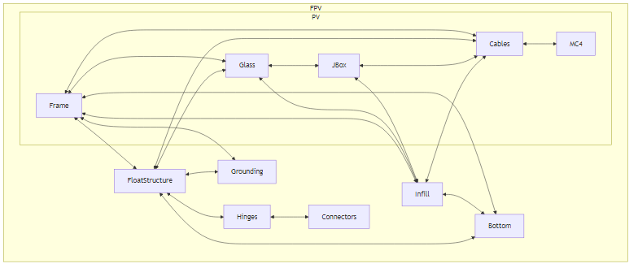
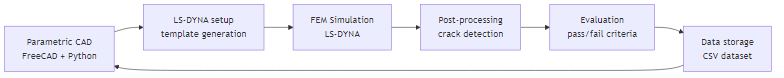
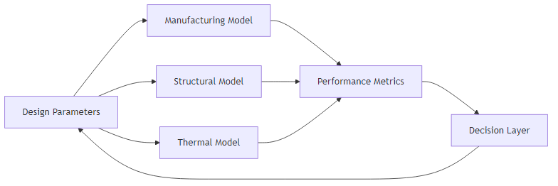

# Executive Summary

This deliverable (D6.1) documents the modelling framework and simulation workflow developed in Work Package 6 (WP6) of the SuRE project to support the engineering development of the Sunlit Sea floating photovoltaic system. The work addresses the requirement for data-format and inter-model data-transfer specifications for the modelling chain as defined in the Description of Work.

Sunlit Sea is developing an integrated floating PV unit in which the photovoltaic panel and float structure form a combined mechanical system. This integration creates strong coupling between manufacturing, structural, thermal and electrical domains, and drives the need for coordinated, model-supported engineering. WP6 provides the modelling infrastructure for this development.

The core of the work is an automated simulation pipeline for aluminium float pressing, implemented in Python using FreeCAD for parametric geometry generation, LS-DYNA for finite element forming simulations, and machine learning (TensorFlow/Keras) for guided design space exploration. Approximately 3,900 forming simulations have been executed, curated into approximately 1,300 high-quality data points characterising the feasibility boundary of the design space.

Beyond manufacturing, the deliverable covers thermal modelling using CFD, which identified a thermal over-temperature risk in the polyurethane hinge material under high-irradiance conditions and directly led to a material colour change from dark blue to off-white. Structural finite element modelling of the prototype floater, performed by IFE using a STEP file exported from Sunlit Sea’s parametric FreeCAD model, demonstrated the CAD-to-FEM data flow and revealed that aluminium stresses approach yield under moderate loading and that prototype buoyancy is insufficient for adequate freeboard. Experimental activities include tensile testing of PU grades, accelerated UV exposure testing, and ongoing adhesion testing of PU-glass and PU-aluminium interfaces on prototype samples.

The deliverable defines a conceptual model chain linking design parameters through domain-specific models to performance metrics, with shared parameter definitions and simulation traceability across domains. Full automation of data transfer between models remains a target for D6.2. The deviation from the originally envisioned integrated model chain is documented and justified in Chapter 9.

# 1 Introduction

## 1.1 Sunlit FPV system and development context

Floating photovoltaic (FPV) systems enable solar electricity generation without occupying land area and are therefore an important technology for expanding renewable energy production. Within the SuRE project, several European FPV technologies are being further developed to improve sustainability, reliability and cost efficiency.

Sunlit Sea develops an FPV system based on an integrated floating photovoltaic unit, where the photovoltaic panel and the floating structure form a combined structural system. See Figure 1-1 This concept differs from conventional floating PV systems where panels are mounted on independent float elements. The integrated approach reduces the number of components, simplifies installation, and enables improved mechanical robustness by distributing loads through a unified structure.

At the same time, this integration introduces stronger coupling between mechanical, thermal and electrical behaviour. Design decisions in one domain (e.g. float geometry or material selection) directly influence performance in other domains (e.g. panel temperature, structural stresses, or water ingress risk). This creates a need for coordinated engineering supported by modelling and testing.

## 1.2 Objectives and tasks of WP6 and Deliverable D6.1

Work Package 6 (WP6) addresses modelling and simulation activities supporting the engineering development of the Sunlit floating photovoltaic system.
Two objectives from the SuRE Description of Work are particularly relevant:

- O6.1.1 Develop a digital product development cycle for Sunlit’s aluminium floater
- O6.2.1 Identify and optimise the next-generation floater prototype

These objectives should be interpreted in the context of the entire integrated floating PV unit, not only the aluminium components. The floater concept includes the photovoltaic panel, float structure, interconnection elements and supporting structural components.
Deliverable D6.1 – Sunlit model chain documents the modelling framework and workflow used to support this development process. In particular, it addresses the requirement:
“Data format and inter-model transfer specifications for the modelling chain.”
The work described in this deliverable relates primarily to:

- Task 6.1: FEM model development for pressing of aluminium
- Task 6.2: Model harmonisation and interfacing for digital product development

## 1.3 Scope of modelling and testing covered in this report

This report describes the modelling framework used in the engineering development of the Sunlit floater concept. Particular emphasis is placed on:
Modelling of aluminium float manufacturing
This includes simulation of forming processes used to produce the float structure, evaluation of manufacturability limits, and analysis of how geometric parameters influence material usage, structural behaviour and production feasibility.
Integration of simulation and testing activities
Numerical models are used to explore design variations and identify promising concepts, while physical testing is used to validate model predictions and characterise real-world behaviour. The interaction between these two activities forms the basis of the development cycle.
Definition of modelling parameters and outputs
The modelling work relies on a structured definition of input parameters (e.g. geometry, material properties, environmental conditions) and output metrics (e.g. stress, temperature, deformation, cost indicators). This enables consistent comparison between different design variants.
Data structures connecting different modelling domains
Different models (e.g. manufacturing, mechanical, thermal) operate on shared or linked parameters. The report therefore describes how data is structured and transferred between models to ensure consistency and traceability across the development process.
The report does not attempt to optimise the full system simultaneously. Instead, it describes the engineering workflow used to investigate specific design domains and progressively improve the system through iterative development.

# 2 Sunlit Floating PV System Architecture

## 2.1 Overview of the Sunlit integrated FPV unit

The Sunlit floating photovoltaic (FPV) system consists of modular floating units, where an off-the-shelf photovoltaic panel is integrated with surrounding and supporting structural components to form a floating solar unit. Multiple such units are mechanically interconnected to form a floating PV array.
Each unit acts both as an energy-generating component and as part of the structural system. Mechanical loads from waves, wind, handling and array interaction are therefore transferred through a set of coupled interfaces between PV components, structural components, and interconnection elements.
The system architecture is illustrated in Figure 2-1. The diagram should be interpreted as an interface diagram, not a simple component hierarchy. The double arrows indicate interfaces between components. These interfaces are critical because they govern:
- mechanical load transfer
- electrical functionality
- thermal coupling
- sealing and water ingress behaviour
- manufacturability and assembly
- long-term durability
The architecture therefore defines both the components and the interaction mechanisms that must be addressed in modelling and design.

## 2.2 Main system components

The floating PV unit is described through the following main component groups: PV panel, FloatStructure, Infill, Bottom, Grounding, Hinges and Connectors. These are functional elements of an integrated system. Depending on design choices, some components may be physically merged or realised differently, but the functional distinction remains important for structuring the modelling and development work.

### 2.2.1 PV panel

The PV panel is based on commercially available, off-the-shelf solar modules. Rather than being fixed, the PV panel is treated as a design parameter within a defined market space. Several candidate modules with similar external dimensions are currently being evaluated. A commonly available format is approximately 2384 mm × 1303 mm, used by multiple manufacturers including Risen Energy (RSM132 series), Canadian Solar (TOPBiHiKu7), Haitai Solar (HTM series), Yingli Solar (YLM 3.0PLUS) and Trina Solar (TSM-DEG21 series). In addition, alternative formats are considered, including square modules of approximately 1770 mm × 1770 mm.
The PV panel consists of the frame, glass, junction box(es), cables and MC4 connectors. The choice of PV module geometry has system-level implications including buoyancy and required float volume, total system weight and centre of gravity, manufacturability (tool sizes, forming limits), logistics and handling, and array layout and packing density.
In addition to geometry, module construction is evaluated. Glass–glass modules typically offer better durability and moisture resistance but higher weight, while glass–polymer backsheet modules are lighter and cheaper but may require additional protection measures. In the Sunlit concept, the PV panel is structurally integrated into the floating unit, creating strong coupling between module choice and structural behaviour, thermal performance, sealing and ingress risk, and interaction with infill, bottom and FloatStructure. The PV panel must therefore be treated as a configurable system component rather than a fixed input.

### 2.2.2 FloatStructure

The FloatStructure is the structural component that wraps around and holds together the PV panel, bottom plate and hinge system. In current design concepts it is made of polyurethane (PU), but the definition is functional rather than material-specific. The FloatStructure holds the system together, protects against water ingress, and enables operation in a marine environment. It is not the infill, not the bottom plate, and not necessarily the main buoyant volume. It does not provide standalone functionality and must be considered together with the rest of the system.
The FloatStructure has several critical interfaces that drive much of the engineering complexity of the integrated design.
The FloatStructure interfaces with the hinges, and one of its main functions is to ensure that forces acting on the system are absorbed primarily in the hinge section, so that the FloatStructure itself — and especially the interface between the FloatStructure and the solar panel frame — takes as little load as possible. In the current design this implies that the hinges are integrated with the FloatStructure into a single cast unit, although other options are being evaluated.
The FloatStructure interfaces with the glass surface of the solar panel. This is a section with very limited contact area, and it is a part of the float where saline and dirty water will regularly collect after waves and rain before drying. Minimising water ingress at this interface is therefore critical for long-term reliability.
The FloatStructure interfaces with the bottom plate. This is a part of the float that will frequently be submerged and is susceptible to marine growth, placing demands on material durability and surface properties.
A further key requirement is that the FloatStructure must handle routing of cables emerging from the PV panel, either from beneath or through the frame, while maintaining sealing and structural integrity.

### 2.2.3 Infill

The infill is located underneath the glass and inside the PV frame. It occupies the internal volume and surrounds the junction box and cables. Possible implementations include polyurethane foam, aluminium press-formed structures (cups), polystyrene blocks and aluminium honeycomb. Depending on the concept, the infill may be separate or integrated with the bottom, and may require adhesion to glass, frame and/or bottom. The infill contributes to structural support of the glass, internal load distribution, sealing and water protection, and accommodation of the junction box and cables. Structural simulations performed without the infill (Section 5.3.3) have shown that its absence leads to stresses approaching or exceeding yield in both aluminium and polyurethane components, confirming its structural importance.

### 2.2.4 Bottom

The bottom is the bottom plate of the floating unit, connected to the frame and the infill. It can take several forms: a flat plate, a press-formed aluminium sheet with cup structures, or a shaped volume extending downward for buoyancy. In some designs, the bottom and infill may be the same physical object. The bottom plays a key role in structural stiffness, buoyancy and volume distribution, manufacturability, and cable routing (it must allow cable passage if needed). Buoyancy simulations (Section 5.3.3) have indicated that the prototype floater sits deep in the water, with approximately half the bottom plate submerged under self-weight, which has implications for the design of the bottom geometry and overall system buoyancy.

### 2.2.5 Grounding

### 2.2.6 Hinges

### 2.2.7 Connectors

## 2.3 Critical interfaces in the integrated unit

The system is defined not only by components, but by the interfaces between them.
Each interface governs behaviour across multiple domains:
- mechanical
- electrical
- thermal
The following interface structure can be used for reference:
- I1: Frame ↔ Glass
- I2: Glass ↔ JBox
- I3: JBox ↔ Infill
- I4: Glass ↔ Infill
- I5: Frame ↔ Infill
- I6: Infill ↔ Bottom
- I7: Frame ↔ Bottom
- I8: Cables ↔ MC4
- I9: Frame ↔ Cables
- I10: FloatStructure ↔ Cables
- I11: JBox ↔ Cables
- I12: Infill ↔ Cables
- I13: Frame ↔ Grounding
- I14: Frame ↔ FloatStructure
- I15: FloatStructure ↔ Hinges
- I16: FloatStructure ↔ Bottom
- I17: FloatStructure ↔ Glass
- I18: FloatStructure ↔ Grounding
- I19: Hinges ↔ Connectors
These interfaces will be referenced in later chapters when discussing:
- modelling assumptions
- failure modes
- testing
- optimisation

The system architecture is illustrated in Figure 2-1, which shows the integrated panel–float unit and its connections to neighbouring units within an array.

## 2.4 Key engineering challenges in the integrated floater concept

The integrated architecture introduces several key engineering challenges. These arise both from the individual components and, in particular, from the interfaces between them.

### 2.4.1 Float manufacturing feasibility

Balancing manufacturability with structural performance, buoyancy, and geometric integration is a central challenge. This applies both to the Bottom and to any press-formed or otherwise shaped structural elements used as part of the Infill or supporting structure. Design choices such as panel dimensions, bottom geometry, and infill concept directly affect forming feasibility, tooling requirements, tolerances, and production scalability.

### 2.4.2 Structural load transfer between units

Loads from waves, handling, and array interaction must be transferred through interconnected units without overstressing components or introducing fatigue-critical regions. This is particularly important for the Hinges, Connectors, FloatStructure, and their interfaces to the PV panel and Bottom. Since the system is modular, local connection design has major influence on global structural reliability.

### 2.4.3 Environmental exposure of materials

Components are exposed to UV radiation, moisture, saltwater, temperature cycles, and biological growth. These stressors may affect different parts of the system in different ways, including polymer degradation, corrosion, loss of adhesion, fouling, and changes in mechanical behaviour over time. The environmental durability of materials and interfaces is therefore a core design issue.

### 2.4.4 Water ingress and sealing

Preventing water ingress into sensitive areas such as panel interfaces, cable paths, grounding points, and electrical components is critical. In the Sunlit concept, this challenge is closely linked to the interfaces between Frame, FloatStructure, Infill, Bottom, JBox, and Cables. Cable routing and local penetrations may require special geometric adaptation or sealing strategies.

### 2.4.5 Thermal behaviour of the integrated system

The interaction between PV panel, surrounding structural components, and environment influences both electrical performance and material degradation. Thermal behaviour depends on module construction, colour and properties of surrounding materials, solar loading, cooling to air and water, and the thermal coupling between components. Since module type is itself a design variable, thermal behaviour must be considered as part of the broader system trade-off.

### 2.4.6 Installation and maintenance considerations

The system must be designed for efficient installation, inspection, grounding, connection, and replacement of components under field conditions. This includes practical access to connectors, hinges, grounding solutions, and electrical interfaces. Design choices that improve integration or sealing may also make maintenance more difficult, so these aspects must be balanced carefully.

### 2.4.7 Manufacturability and cost efficiency

The design must enable scalable production with controlled cost. This includes not only material consumption, but also process complexity, number of parts, assembly effort, tooling, logistics, and compatibility with commercially available PV modules. Since the PV panel is selected from available market options rather than fixed from the outset, manufacturability and cost efficiency must be evaluated at the system level.
These engineering challenges form the main background for the modelling and development activities described in the following chapters. The purpose of the modelling framework is not only to analyse individual components, but to support design choices across the coupled mechanical, thermal, electrical, and manufacturing domains that define the integrated floating PV unit.

# 3 Product Development Framework and Design Domains

## 3.1 Introduction

This chapter describes the engineering methodology used to develop the Sunlit floating photovoltaic system. The framework combines modelling, simulation and experimental testing in a structured process that supports iterative improvement of the design. It is applied across multiple engineering domains, including manufacturing, structural behaviour and thermal performance.

The purpose of the framework is to enable systematic exploration of design alternatives, reduce reliance on time-consuming physical prototyping, and ensure traceability between design decisions, simulations and test results.

The chapter is structured as follows. Section 3.2 describes the Functional Design Specification that defines what the system must achieve. Section 3.3 introduces the functional and engineering domains through which these requirements are addressed. Section 3.4 describes the risk-based approach used to prioritise engineering investigations. Section 3.5 presents the model-supported development cycle, and Section 3.6 defines the parameter framework and data structures that support consistency and traceability across the modelling work.

## 3.2 Functional Design Specification

The engineering development of the Sunlit floating PV system is guided by a Functional Design Specification (FDS). The FDS defines the requirements that the system must satisfy, organised into three tiers.

Principal functions define the core purpose of the system. The system must produce electrical power (FP1) and be certified for deployment (FP2).

Constraint functions define hard requirements that the design must satisfy. These include flotation (FC1), watertightness (FC2), mechanical attachment between units (FC3), resistance to submergence under current exposure up to 3 m/s (FC4), feasibility of changing panel supplier (FC5), resistance to high wind (FC6), resistance to waves up to 1.5 Hs (FC7), cost competitiveness (FC8), and electrical grounding (FC9).

Secondary functions define desirable but not absolute requirements. These include walkability (FS1), fast production (FS2), and fast installation (FS3).

The FDS ensures that all development activities remain aligned with system-level requirements. From these functions, a set of design domains is identified, as described in the following section.

## 3.3 Functional and engineering domains

The requirements defined in the FDS are translated into two complementary sets of domains. Functional domains define what the system must achieve. Engineering domains define how these requirements are analysed and addressed through modelling and testing. The relationship between these two layers is illustrated in Figure 3-1.

### 3.3.1 Functional domains

The main functional domains derived from the FDS are described below.

Energy production is the primary function of the system. It requires maintaining adequate solar exposure, limiting thermal losses that reduce module efficiency, and ensuring electrical integrity under environmental exposure. While energy production is not directly optimised in WP6, it is indirectly influenced by thermal and structural design choices.

Flotation performance requires that the system provides sufficient buoyancy and stability under all expected operating conditions, including uneven loading and wave action. Flotation performance is strongly influenced by float geometry, material distribution and system mass.

Mechanical interconnection governs how loads are transferred between the modular floating units. The interconnection system must transfer loads without overstressing components, allow relative motion to accommodate waves and thermal expansion, and prevent excessive load transfer into sensitive components such as PV modules. This domain is critical for system-level structural integrity and is strongly influenced by fatigue behaviour, material selection and connection design.

Resistance to environmental loads reflects the combination of stressors the system is exposed to over its lifetime, including wave-induced mechanical loads, wind, UV radiation, moisture and saltwater. Components must withstand these conditions without significant degradation.

Manufacturability requires that the system can be produced at scale using feasible and cost-effective processes. This includes compatibility with aluminium forming processes, minimisation of material usage, and repeatability of manufacturing steps. Manufacturability directly constrains the feasible design space and must be considered alongside performance requirements.

Operational usability requires that the system supports efficient installation, inspection and maintenance. This includes accessibility of electrical connections, ability to replace modules in the field, and robustness during handling. Design choices that improve manufacturability or structural performance must not compromise operational usability.

Together, these functional domains define the multi-dimensional design space within which the system must be developed.

### 3.3.2 Engineering domains

The modelling work in WP6 is organised into engineering domains, which represent the areas where quantitative modelling and experimental work are used to inform design decisions. As shown in Figure 3-1, the mapping between functional and engineering domains is many-to-many: a single functional requirement may be addressed by multiple engineering domains, and a single engineering domain may serve several functional requirements.

Float manufacturing feasibility focuses on the manufacturability of the aluminium float structure. Key challenges include determining feasible geometries within forming limits (depth, curvature, spacing), avoiding defects such as buckling, tearing or excessive thinning, and balancing float volume with material usage. This domain is addressed through FEM simulations of aluminium forming processes and parametric exploration of geometric design variables.

Structural load transfer addresses how mechanical loads are distributed within and between floating units. Key aspects include load paths from environmental forces through the interconnection system, stress distribution in structural components, and identification of fatigue-critical regions. Both modelling and physical testing are used to evaluate structural behaviour.

Thermal behaviour focuses on the temperature response of the integrated system. Key aspects include heat transfer between PV modules, float structure and environment, the influence of material surface properties such as absorptivity and emissivity, and identification of conditions leading to elevated temperatures. Thermal modelling is used to evaluate worst-case conditions and guide design choices such as material selection or colour.

Component integration addresses the interfaces between system components, which are critical in the integrated design. Key aspects include mechanical interfaces between panel frame, float structure and interconnections, sealing strategies to prevent water ingress, and interaction between structural and electrical components.

Manufacturing economics evaluates the cost implications of design and manufacturing choices, including material consumption, process complexity and production scalability. While detailed cost modelling is outside the scope of this deliverable, design decisions are assessed with respect to their impact on cost efficiency.

### 3.3.3 Trade-offs across domains

The combination of multiple functional and engineering domains creates a high-dimensional design space with competing objectives. For example, increasing float depth improves buoyancy but may exceed manufacturing limits. Reducing material thickness lowers cost but may reduce structural robustness. Changing material properties may improve thermal behaviour but affect durability or cost.

Rather than attempting global optimisation at this stage, the approach taken in WP6 is to investigate key domains individually, reduce uncertainty in critical areas, and progressively converge towards improved design configurations. The modelling framework enables systematic exploration of this design space and identification of feasible regions satisfying multiple constraints simultaneously.

## 3.4 Risk-based prioritisation

Engineering investigations are prioritised using a risk-based approach, where risk is defined as a combination of uncertainty (lack of knowledge about system behaviour), impact (consequences for performance, cost or reliability), and effort required (time and resources needed to investigate the issue).

In practice, this means that development focuses first on areas where uncertainty is high and potential impact on system performance or cost is significant. Examples of high-priority areas include aluminium forming limits affecting manufacturability, durability of interconnection systems under cyclic loading, and thermal behaviour of materials under extreme environmental conditions.

This prioritisation ensures that critical design constraints are identified early. The development process can be understood as navigating a partially known design space, where each investigation provides information that influences subsequent steps.

## 3.5 Model-supported development cycle

The modelling and testing activities within each engineering domain follow a common iterative development cycle, as shown in the lower part of Figure 3-1. Numerical models are used to evaluate design alternatives efficiently across a wide parameter space. Physical tests are used to validate model predictions and capture real-world behaviour not fully represented in simulations.

The cycle proceeds as follows. Initial design concepts are defined through parametric CAD models, where the geometry is expressed in terms of explicit design parameters such as float depth, curvature, material thickness and connection geometry. Rather than defining a single fixed design, parametric models allow systematic variation of these parameters, enabling automated generation of design variants and consistent input to simulation workflows.

Numerical simulations are then used to evaluate candidate designs under relevant conditions. Depending on the domain, this includes manufacturing simulations of aluminium forming processes, mechanical simulations of stress, deformation and load transfer, and thermal simulations of temperature distribution and heat transfer. Simulations provide quantitative outputs such as stress distributions, deformation patterns, temperature fields and indicators of manufacturability, which are used to compare design alternatives and identify promising configurations.

Promising designs are selected for prototype manufacturing, which serves to verify that designs are manufacturable in practice, identify practical challenges not captured in simulations, and provide physical samples for testing. The level of fidelity ranges from simplified test samples to fully integrated system components, depending on the investigation.

In the Sunlit development process, prototype manufacturing is closely integrated with the parametric design system. Moulds for casting polyurethane components are designed within the same FreeCAD parametric model used for the structural design, ensuring that mould geometry remains consistent with the current design state. Moulds are initially 3D-printed to allow rapid iteration: a design change can be reflected in a new printed mould and tested within a short cycle. Casting is performed onto mock solar panels consisting of glass, a bottom plate and a frame, producing prototypes that are representative of the integrated unit. After inspection and functional testing, mould designs that prove viable are promoted to metal moulds suitable for production-representative casting. This progression from parametric model to 3D-printed mould to cast prototype to metal mould defines the prototyping track of the development cycle. Multiple prototype generations (P1–P4 and beyond) have been produced in this way, each incorporating lessons from the previous round of testing. As part of production scale-up investigations, a casting vendor was engaged and visited, providing input to mould design requirements for larger-scale manufacture.

Experimental testing provides data on real-world behaviour. Testing activities include mechanical testing (tensile, fatigue, load transfer), environmental testing (UV exposure, moisture ingress), and thermal testing (temperature response under irradiation). These tests are essential for validating simulation models, identifying failure modes, and quantifying performance under realistic conditions.

Simulation results are then compared with experimental results to assess model accuracy. Where discrepancies are identified, model assumptions are updated, input parameters are refined, and modelling approaches are improved. This validation process enables iterative improvement of both the design, through better-informed decisions, and the modelling framework, through increased predictive capability.

## 3.6 Parameter framework and data structures

To ensure consistency across modelling domains and support traceability throughout the development process, parameters are categorised into three groups, as shown in the lower part of Figure 3-1.

Design parameters are variables defining the geometry and configuration of the system, such as float shape, material thickness and connection layout. Process parameters are variables related to manufacturing or environmental conditions, such as forming pressures, temperatures and boundary conditions. Performance outputs are metrics used to evaluate system behaviour, such as stress, deformation, temperature and cost indicators.

Design parameters serve as inputs to the parametric CAD models that initiate the development cycle. Process parameters are inputs to the numerical simulations. Performance outputs are generated by both simulations and physical tests, and are used in the validation and comparison step to assess design quality.

This categorisation enables structured parameter management, consistent data exchange between models, and comparison of results across design iterations. Simulation inputs, outputs and experimental data are organised within a structured data framework based on three principles: traceability, so that each design iteration can be linked to its corresponding simulation and test results; consistency, so that shared parameters are defined identically across different models; and interoperability, so that data can be transferred between modelling domains without loss of meaning.

The resulting parameter and data structure forms the basis of the model chain described in Chapter 6.

# 4 FEM Model Development for Aluminium Float Pressing

## 4.1 Manufacturing objectives and design parameters

The float structure is a central component of the Sunlit system, providing buoyancy, contributing to structural stiffness, and representing a significant share of material cost. The manufacturing concept is therefore a key driver for technical performance and economic viability.
The primary manufacturing objectives are:
Maximise buoyancy per unit material
Increasing enclosed volume improves flotation performance while reducing material usage lowers cost.
Ensure manufacturability using scalable forming processes
The design must be compatible with industrial aluminium forming techniques, particularly press-based forming.
Maintain structural integrity
The resulting geometry must provide sufficient stiffness and avoid failure modes such as local buckling or fatigue-critical features.
To address these objectives, the float concept investigated in this work is based on formed aluminium sheets with cup-like geometries. These geometries increase structural depth and enclosed volume while maintaining low material thickness.

The geometry of the float is defined through a set of design parameters, which are varied systematically in the modelling process. The following parameters and their explored ranges are used:

Cup radius (10–40 mm): the radius of a circle bounding one cup. The cup itself may be elliptical within this circle. Controls the contact area with the photovoltaic panel and influences material flow during forming.

Cup depth (5–40 mm): the vertical displacement of material during forming. Directly influences buoyancy and stiffness. Increasing depth improves enclosed volume but increases forming difficulty.

Cup eccentricity (0.7–1.0, ratio of ellipse y/x): allows elliptical rather than circular cup shapes as a design response to the orthotropic plastic behaviour of rolled aluminium sheet, which is described in more detail in Section 4.2. Because the sheet is most prone to thinning when strained parallel to the transverse direction and most formable along the diagonal, a circular cup loads the material asymmetrically with respect to the material's own directional preferences. By orienting the major axis of an elliptical cup in the more formable direction of the sheet, the forming process can exploit the most favourable strain-ratio directions and reduce the risk of tearing, which in turn allows deeper cups to be formed within the same sheet thickness budget and translates directly into greater buoyancy per unit material.

Cup angle (10–85°): controls the steepness of the internal cup surface. High angles produce flatter cup bottoms; low angles produce steeper walls.

Cup tip radius (2–32 mm, constrained to 20–80% of cup radius): the flat area at the bottom of each cup, which serves as the bonding surface between top and bottom float halves.

Cup lip radius (1 mm): the fillet radius at the transition from the flat region into the cup. Sharp transitions increase risk of tearing or thinning.

Cup spacing (0–40 mm): the distance between cups, determining how much flat material remains between formed features. This is the area from which the cups draw aluminium during forming, and also where the solar panel rests.

Sheet thickness (0.8 mm): a key parameter affecting both structural performance and cost. Reducing thickness is desirable but increases sensitivity to forming defects and structural instability.

Forming pressure (4–12 MPa): the fluid pressure applied during hydroforming.

These nine parameters define a multi-dimensional design space that must be explored to identify feasible configurations. The parameter ranges are bounded by physical constraints, manufacturing limits and prior design experience from the first-generation product.

Floater overall size is not included in this set of parameters, and is in fact architecturally out of scope for the pressing simulation. Each FEM run represents the forming of a single cup, so simulation outputs depend only on local cup geometry and material parameters, not on how many cups are tiled across a floater or on the overall floater dimensions. Changing floater size does not change what the pressing simulation computes at the cup level. Floater size is nevertheless a key system-level design variable, recognised in Section 2.2.1, where the overall dimensions are essentially determined by the choice of PV panel around which the float is built: the 2384 × 1303 mm module class used as the current reference, the approximately 1770 × 1770 mm square alternative, and any other panel format under consideration each imply a different outer envelope and a corresponding floater size.

The natural place for systematic evaluation of floater size is therefore the life-cycle assessment work (Section 5.4.2 and interface I-5 in Section 6.3), where changes in overall dimensions directly drive material totals per unit, per-unit production effort, and plant-level layout and component counts. The cup-level pressing simulations described in this chapter feed into that analysis by providing manufacturability constraints and per-cup material usage estimates, which can be scaled to any floater size once the cup count is determined by the chosen outer envelope.

## 4.2 Modelling framework and tool development

To evaluate manufacturability and guide design decisions, a finite element modelling (FEM) framework has been developed by Sunlit Sea.

The forming process is modelled as a nonlinear deformation problem using LS-DYNA, where the aluminium sheet undergoes large plastic deformation and contact interactions between tool and sheet are explicitly represented. The first-generation Sunlit product was manufactured using a conventional punch/die press, in which a rigid punch forces the sheet into a matching die cavity. For the current generation, hydroforming has been adopted as the target manufacturing route: an incompressible fluid applies pressure to one side of the sheet, pressing it into a cup-shaped mould without a matching rigid punch. This change was driven by tooling flexibility and cost considerations — a hydroforming mould is considerably simpler and cheaper to produce than a matched punch/die set, which is important for the iterative design process described in Chapter 3. The simulation models the hydroforming process accordingly.

The aluminium alloy used in the float design is marine-grade AA5083-H111, supplied as cold-rolled sheet. AA5083 combines good formability, weldability and corrosion resistance with a high thermal conductivity that is directly exploited by the floater architecture, where the metal body acts as a thermal bridge between the photovoltaic panel and the surrounding water. In the H111 temper the alloy is annealed and then slightly strain-hardened by cold working. Sheet thicknesses of 1.5 mm have been used in earlier product generations and 0.8 mm is the current design target, the latter chosen to reduce material consumption at the cost of a tighter manufacturing window. The cold rolling process introduces a pronounced orthotropic anisotropy in the plastic behaviour of the sheet, expressed as direction-dependent yield stresses and plastic strain ratios relative to the rolling axis. The constitutive model used in the forming simulations must explicitly capture this anisotropy if forming predictions are to be meaningful at the accuracy level required for iterative boundary search in a multi-parameter design space.

The constitutive model adopted in the framework is the non-quadratic anisotropic Yld2003 yield function, implemented in LS-DYNA through the *MAT_WTM_STM (Strong Texture Model) material keyword. Yld2003 generalises the isotropic Hershey–Hosford yield function by splitting it into two additive terms, each applied to a linearly transformed stress tensor, producing a total of eight anisotropy coefficients that are calibrated against experimentally measured directional plasticity data. The yield function is paired with a Voce-type strain hardening law, in which the flow stress increases with accumulated plastic strain towards a saturation level through an exponential functional form. Together, these two components constitute a physically rigorous and widely used model for the plastic behaviour of rolled aluminium sheet.

The calibration of the anisotropy coefficients and of the hardening parameters draws on three types of mechanical tests carried out on AA5083-H111 sheet of the relevant thickness. Uniaxial tensile tests performed at 0°, 45° and 90° to the rolling direction following ISO 10113:2020 provide directional yield stresses and plastic strain ratios. Biaxial bulge tests following ISO 16808:2014 extend the measured flow curve into the large-strain regime, well beyond the uniform elongation limit accessible from uniaxial tests. A forming limit curve (FLC) measured by the Nakajima test following ISO 12004-2:2009 characterises the onset of necking across the range of strain states relevant to deep drawing. The resulting Lankford plastic strain ratios are approximately r0 ≈ 0.66, r45 ≈ 0.84, r90 ≈ 0.71, with an equibiaxial value of approximately 1.09. These values show that the sheet is most prone to through-thickness thinning when strained parallel to the transverse direction (r90 is the lowest), least prone along the diagonal (r45 is the highest), and that the equibiaxial response is favourable for deep drawing. This directional pattern is the physical motivation for treating cup ellipse eccentricity as a design parameter in Section 4.1: by orienting the major elliptic axis of each cup relative to the rolling direction of the sheet, the forming process can exploit the most favourable strain-ratio directions and accommodate deeper cups within the same sheet thickness budget.

To capture the transition from stable plastic deformation to localised necking, the model introduces a small-amplitude random field of shell element thickness variations across the blank via the LS-DYNA *PERTURBATION keyword. The perturbation field is generated as an isotropic Gaussian random field using Karhunen–Loève spectral decomposition, producing microscopic thickness variations of the order of a few micrometres on a characteristic length scale of order one millimetre. These variations act as imperfections in the Marciniak–Kuczyński sense, triggering localised necking under increasing strain and allowing the onset of plastic instability to emerge from the simulation rather than being imposed externally. Fracture is then flagged when the local through-thickness strain exceeds a critical value — the fracture criterion — which is treated as a calibrated model parameter rather than derived from first principles. Sensitivity checks have shown that the exact value of the fracture threshold has limited influence on the predicted forming limits, provided that the instability is triggered by the thickness-perturbation field before the threshold is reached; the calibration therefore captures the onset of localisation rather than the final stage of ductile failure.

The simulations provide quantitative outputs including strain and stress distributions, thickness reduction (thinning), regions of potential failure (tearing, necking), and the final geometry after forming. Each simulation takes between 1 and 50 minutes depending on geometry complexity. The primary output metric is time-to-crack, which indicates how far through the forming process the simulation progresses before material failure occurs. Simulations where no crack occurs represent feasible designs. Two additional metrics, lip-mean and edge-mean, characterise the quality of the formed geometry at critical regions.

The FEM framework enables rapid evaluation of many design variants, identification of infeasible regions of the design space, and informed selection of candidate geometries for further investigation.

## 4.3 Aluminium pressing simulation pipeline

To efficiently explore the design space, the FEM modelling is embedded within an automated simulation pipeline that connects geometry generation, simulation execution and result evaluation. The pipeline is implemented in Python and consists of the following steps, illustrated in Figure 4-1:

Parametric geometry generation: a CAD model is generated programmatically using the FreeCAD Python API. The geometry is defined in terms of normalised parameter values (0 to 1), which are mapped to the physical parameter ranges described in Section 4.1. This enables automated generation of arbitrary design variants from a single parametric definition.

Mesh generation and model setup: the CAD geometry is exported as a STEP file, and Python scripts generate LS-DYNA keyword files (.k files) using template-based generation. These files define the mesh, material properties, boundary conditions, contact definitions and forming pressure.

Simulation execution: LS-DYNA performs the forming simulation.

Post-processing: key metrics (time-to-crack, lip-mean, edge-mean) are extracted from the simulation output.

Evaluation against criteria: results are compared against manufacturability criteria. A design is considered feasible if the forming process completes without material failure.

Storage and traceability: input parameters and outputs are stored in a structured CSV dataset. Each simulation is identified by a unique hash of its input parameters, enabling traceability and comparison across the full simulation campaign.

The CSV dataset stores one row per simulation, keyed by input_hash — a hash of the concatenated input parameter values that serves as a unique identifier. The nine input fields are cup_rad, cup_lip, cup_depth, cup_angle, cup_y_to_x, cup_tip, space, alu_thick and pressure, corresponding one-to-one with the design parameters defined in Section 4.1. The three output fields are time_to_crack (the key manufacturability metric, capturing how far through the forming process the simulation progresses before material failure), lip_mean (a quality metric averaged over the cup lip region) and edge_mean (a quality metric averaged over the cup edge region). Two versions of the dataset are maintained: collect_full.csv contains all executed simulations (approximately 3,900 rows at the time of writing), while collect.csv contains the curated subset along the Pareto front (approximately 1,300 rows) retained after data culling. Both files share the same schema, so the machine-learning workflows and other downstream consumers can operate on either without modification.

The pipeline is fully automated, allowing batch simulation of design variants and systematic exploration of the parameter space. Over the course of the project, approximately 3,900 forming simulations have been executed using this pipeline.

## 4.4 Parameter space exploration and optimisation

The design of the float structure involves navigating a parameter space with competing objectives. Increasing cup depth improves buoyancy but increases risk of failure during forming. Reducing sheet thickness lowers cost but increases susceptibility to thinning and tearing. Cup eccentricity can improve formability by aligning with the anisotropic grain structure of rolled aluminium, but deviates from the structurally preferred circular geometry.

Three complementary approaches are used to select which parameter combinations to simulate:

Random sampling within the normalised parameter space, providing broad coverage of the design space in early stages.

Iterative boundary search, where a custom algorithm starts from a previously simulated design and systematically adjusts one parameter at a time using binary search. If the previous simulation succeeded, the parameter is pushed toward a harder region (e.g. deeper cup); if it failed, pushed toward an easier region. This converges efficiently toward the boundary between feasible and infeasible designs — the Pareto front where competing objectives are balanced.

Machine-learning-guided sampling, where a neural network trained on the accumulated dataset predicts forming outcomes for untested parameter combinations. The ML model (implemented using TensorFlow and Keras with Hyperband hyperparameter tuning via keras-tuner) estimates the forming pressure required for successful forming given a set of geometric inputs. This enables targeted sampling in regions predicted to be near the feasibility boundary, improving the efficiency of the exploration.

As the dataset grows, periodic data culling is performed to maintain a high-quality dataset along the Pareto front. For each parameter, redundant interior points are removed, retaining only the boundary value, the point immediately above, and the point immediately below the feasibility threshold. This process has reduced the full dataset of approximately 3,900 simulations to a curated dataset of approximately 1,300 high-quality data points characterising the feasibility boundaries of the design space.

The genetic algorithm library DEAP is used as a fallback generator when neither the iterative search nor the ML model produces valid candidates.

## 4.5 Experimental validation of pressing models

While FEM simulations provide valuable insight, they rely on assumptions regarding material behaviour and process conditions — in particular the friction coefficient at the tool–sheet interface and the fracture criterion threshold, neither of which can be derived from first principles. Experimental validation is therefore required.

The material constitutive model itself (Yld2003 yield function and Voce hardening law, Section 4.2) is calibrated against standardised uniaxial, biaxial and forming-limit tests of the AA5083-H111 sheet and does not depend on any specific cup geometry or forming process — these are intrinsic material properties that apply equally to punch/die and hydroforming. In contrast, the friction coefficient and the critical thickness strain used as fracture criterion are process-dependent and must be calibrated against forming outcomes from real parts.

For this purpose, the simulation framework has been calibrated against the known forming envelope of the first-generation Sunlit product, which was manufactured using a conventional punch/die press. Physical forming experience from that earlier product established that a cup depth of 38.5 mm forms without failure, while a cup depth of 40 mm fails during the drawing process. The friction coefficient and fracture threshold in the simulation were tuned so that the model reproduces both outcomes: successful forming at 38.5 mm with no sign of localised necking, and clear fracture at 40 mm. The two resulting parameter values (a friction coefficient of approximately 0.085 and a critical through-thickness strain of approximately −0.45) have subsequently been held fixed across the parametric exploration described in Section 4.4.

It should be noted that these process-dependent parameters were calibrated against punch/die forming data and are applied here to hydroforming simulations. The contact mechanics differ between the two processes: in punch/die forming the friction acts at the punch–sheet and die–sheet interfaces under controlled contact pressure, whereas in hydroforming the fluid pressure acts uniformly on one face of the sheet while friction acts only at the mould–sheet interface on the opposite face. The material model predictions are therefore on firm ground, but the friction and fracture calibration carries a process-transfer uncertainty that should be addressed by recalibrating against hydroforming-specific forming trials as production tooling becomes available. The proof-of-concept described below represents the first step in building that hydroforming-specific validation basis.

An early application of the calibrated model was a two-parameter study of cup depth against drawbead distance, in which a simple iterative boundary-search algorithm was used to locate the curve separating successful from unsuccessful forming operations in a two-dimensional parameter space. Approximately thirty simulations were sufficient to trace the feasibility boundary across a practical range of drawbead distances, and all fracture instances occurred in the same characteristic orientation — perpendicular to the transverse direction, approximately 50 mm from the cup centre — consistent with r90 being the lowest Lankford coefficient of the material. This two-parameter study served as both a validation exercise and a methodological precursor: it established the viability of the boundary-search algorithm later extended to the nine-parameter design space of Section 4.4, and it demonstrated that the calibrated model reproduces the directional bias in fracture location expected from the measured material anisotropy.

In addition to simulation validation, a physical proof-of-concept for the hydroforming process was conducted. A pressing tool was prototyped by 3D-printing a mould form and casting it in epoxy. A 0.8 mm aluminium sheet was secured to the mould with sealed edges, and a water injection system was used to apply forming pressure. This demonstrated that the hydroforming approach is practically feasible and provided the basis for a specification issued to external manufacturing vendors.

## 4.6 Integration with the broader modelling framework

The aluminium pressing model is integrated into the broader WP6 modelling framework. Outputs from this domain feed into structural modelling (by defining feasible geometries and material distributions after forming), economic assessment (through material usage and manufacturing complexity), and system design (by constraining the available design space). Conversely, requirements from other domains such as structural performance and buoyancy define targets for the manufacturing design.

## 4.7 Summary

The FEM modelling of aluminium float pressing establishes a simulation-driven approach to manufacturing design. Through the automated pipeline, approximately 3,900 forming simulations have been executed and curated into a dataset of approximately 1,300 high-quality data points along the Pareto front. The combination of parametric modelling, automated simulation, iterative boundary search, machine learning and experimental validation provides a foundation for optimising the float structure with respect to both performance and cost.

# 5 Thermal, Mechanical and Economic Modelling

## 5.1 Overview

Beyond manufacturing feasibility, the development of the Sunlit floating PV system requires modelling and testing across several additional engineering domains. This chapter describes the thermal, mechanical and economic modelling activities performed in WP6. These domains are closely interconnected: thermal behaviour influences material durability, structural design influences thermal coupling, and cost considerations constrain all design choices.

## 5.2 Heat transfer modelling

### 5.2.1 Objective and relevance

The thermal behaviour of the integrated floating PV system has a direct impact on energy yield (PV efficiency decreases with increasing temperature), material durability (particularly for polymers and sealants), and reliability (elevated temperatures accelerate degradation mechanisms). In the Sunlit concept, thermal behaviour is influenced by the close coupling between the photovoltaic module, float structure and surrounding environment (water, air, solar radiation). Heat transfer modelling is therefore required to understand and control temperature behaviour under realistic operating conditions.

### 5.2.2 Modelling approach

Thermal behaviour is analysed using computational fluid dynamics (CFD) and heat transfer modelling. The model includes solar irradiance input (absorbed energy), convective heat transfer with air and water, radiative heat exchange with the environment, and conductive heat transfer within system components. Material surface properties are included explicitly, as they strongly influence temperature behaviour.

To support the thermal modelling, the optical properties of the polyurethane (PU) hinge material were measured experimentally. Absorptivity was determined by measuring spectral reflectance over the range 300–1650 nm using a laboratory spectrometer, weighting against the AM1.5G solar spectrum, and assuming negligible transmission through the hinge thickness. Four measurements on two samples (front and back) yielded an average reflectivity of 10.0% over 300–1650 nm, corresponding to an absorptivity of A = 0.88–0.91 depending on assumptions about reflectance in the 1650–2500 nm range. Emissivity was measured outdoors using a handheld IR camera calibrated against a reference surface (black electrical tape, known emissivity ~0.95). Two measurements yielded PU emissivity values of 0.80 and 0.90, giving an average of ε = 0.85. During the emissivity measurement, it was noted that after approximately two hours of sun exposure at around 45°C, the dark blue PU already showed signs of softening and emitted a noticeable odour.

### 5.2.3 Boundary conditions and scenarios

To evaluate worst-case conditions, environmental inputs are derived from ERA5 reanalysis climate data covering a representative period of five years. The selected worst-case location is Singapore (latitude 1.25° N, longitude 104° E), which combines high solar irradiance with typically low wind speeds and high ambient temperatures, and therefore represents a thermally demanding site for the system. From the ERA5 record, the worst-case instance used in the simulations has a global horizontal irradiance of 943 W/m², an air temperature of 28.1°C, a water temperature of 21.5°C and a wind speed of 0.5 m/s. Under these conditions, module temperatures predicted by the Faiman model reach 60.2–61.3°C, establishing the thermal loading for the CFD simulations described in the following section.

### 5.2.4 Key findings and design implications

The thermal modelling, combined with the measured surface properties, showed that the dark blue PU (absorptivity 0.88–0.91) reaches temperatures that can exceed acceptable limits for the material under high-irradiance conditions. This finding was independently confirmed by accelerated UV exposure testing (Section 5.3.2), where PU samples exhibited severe darkening, burn marks and softening after only 209 hours of a planned 1,000-hour test — partly attributed to elevated sample temperatures approaching 95°C.

As a direct consequence of these findings, the PU colour was changed from dark blue to off-white in subsequent prototype iterations to reduce solar absorptivity and peak operating temperatures. This design change demonstrates the practical value of the thermal modelling in informing material selection decisions.

## 5.3 Mechanical testing and structural modelling

### 5.3.1 Objective and scope

Mechanical modelling and testing address the structural behaviour and durability of the system under operational loads. This includes load transfer between interconnected units, behaviour of flexible components (hinges and connectors), and response to cyclic loading and fatigue. Given the marine environment, components are subjected to repeated loading over long lifetimes, making fatigue behaviour and environmental degradation critical considerations.

### 5.3.2 Experimental investigations

Experimental testing focuses on key components and materials. The following investigations have been performed or are in progress.

Tensile testing of PU hinge materials: the tensile strength of three PU types with different Shore hardness (70A, 80A, 90A) was evaluated using coupon samples consisting of thin strips. For the lowest-quality material (C+ 85A), maximum tensile strength of approximately 6 MPa was found at a strain of approximately 400%. The two higher-quality materials showed tensile strengths exceeding 10 MPa with strains above 750%. For these materials, testing to failure was not achieved because the samples slipped out of the tester grips before breaking, even when mitigation approaches such as surface roughening were applied. Ultimate stress and strain therefore exceed the measured values.

UV exposure testing: PU samples (both minipatches representing the hinge-to-panel interface and tensile strips) were subjected to accelerated UV exposure following IEC TS 62788-7-2. The initial test used condition A3 (chamber temperature 65°C, black panel temperature 90°C, irradiance 0.8 W/m² at 340 nm, relative humidity 80%). The test was stopped after 209 hours of a planned 1,000-hour exposure due to severe degradation observed in the samples. All samples were severely darkened and several minipatches displayed burn marks. Clear differences between PU hardnesses were observed: the 90A samples showed surface blackening but no burn marks and remained hard; the 80A samples showed burn marks and surface softening; the 70A samples showed the most severe burn marks and the greatest softening. The elevated temperatures (estimated at approximately 95°C for the minipatches, which were closer to the light source) likely exceeded the thermal stability of the darker PU grades. The tensile strips, positioned at the correct irradiance level, showed darkening and cracking but no burn marks. Following these results, a revised test programme was defined using condition A1 (chamber temperature 45°C, black panel temperature 70°C) to avoid thermal damage while still providing meaningful UV acceleration. Gravimetric measurements on the minipatches showed mass increases of 2–8 g in UV-exposed samples compared to zero in reference samples, indicating possible moisture ingress, although the exposure duration was too short for conclusive results.

Adhesion and interface testing: testing of adhesion between PU and glass/aluminium interfaces is in progress on prototype 3 (P3) samples. An initial attempt to cut P3 samples into individual pieces for testing was unsuccessful because the tempered glass shattered immediately upon cutting. A revised approach was adopted: hinges are removed from one sample (chemical bonding only), and the remaining box plus loose hinges are placed in the UV chamber. After exposure, the long sides will be available for shear testing of the PU-glass interface, and the loose hinges for tensile testing. This methodology builds on earlier work at IFE on edge sealant durability for the first-generation Sunlit product (Roosloot, Selj and Otnes, IEEE Journal of Photovoltaics, 2024), which established lap shear testing and failure mode classification as tools for evaluating adhesion degradation under environmental stress.

### 5.3.3 Structural modelling

Structural behaviour is analysed using numerical models that evaluate stress and strain distributions, deformation under load, and load transfer paths between components. A mechanical design principle has been established for the hinge system: loads between neighbouring floats should be absorbed as close to the centre of the connection point as possible, and as far as possible from the PU-glass and PU-aluminium interfaces, which are critical areas for water ingress. A test matrix of six load cases (XY bending, XZ bending, XY compression, XY stretch, YZ bending, XZ shear) and six measurement points at key interfaces has been defined as a reusable framework for comparing successive prototype revisions.

In parallel, IFE has developed a 3D FEM model of the Sunlit prototype floater using their SiSim tool, with MSC PATRAN for pre-processing. The model takes a STEP file exported from Sunlit Sea's parametric FreeCAD model as input, demonstrating the CAD-to-structural-FEM data flow in practice. The solution domain comprises two connected floating modules with approximately 310,000 elements and 2,000,000 degrees of freedom; one linear analysis step takes approximately 2.5 minutes. Different material domains (polyurethane, glass, aluminium) are assigned separate material properties, and mechanical interactions between parts are defined by interface boundary conditions.

A buoyancy boundary condition has been implemented that computes vertical position from the balance of gravity and buoyancy forces. This revealed that the prototype floater sits rather deep in the water, with approximately half of the bottom plate submerged under self-weight alone. This finding has implications for the design, suggesting that increased buoyancy volume or reduced system weight may be needed to achieve adequate freeboard.

Stress analysis under 10 mm imposed horizontal elongation (representing wave or current loading) showed that the largest stresses occur in the thin aluminium bottom plate and frame, with aluminium stresses approaching yield level. The polyurethane stresses exceeded yield in localised regions. In the glass, the largest stresses were found at the upper surface near the PU ring attachment, and were sensitive to how the glass is attached to the aluminium frame. The simulations used an interface stiffness of 100 MPa per mm displacement, considered a relatively stiff connection.

It should be noted that the IFE simulation was performed without the infill between the bottom plate and glass. This is a significant simplification relative to the current design, where the infill provides structural support to the glass, internal load distribution, and sealing. The absence of infill means that the stress results likely overestimate stresses in the glass and underestimate overall system stiffness. However, the results build a strong case for why the infill is structurally necessary: without it, both aluminium and polyurethane stresses approach or exceed yield under moderate loading conditions.

### 5.3.4 Coupling with environmental effects

Mechanical performance is influenced by environmental factors including temperature (affecting material stiffness and strength), UV exposure (affecting long-term degradation) and moisture ingress (affecting interfaces and materials). The UV testing results described above demonstrate that these effects can be severe and interact with each other: the combination of UV radiation and elevated temperature produced degradation far more rapid than anticipated from either stressor alone.

### 5.3.5 Role in design development

Mechanical modelling and testing validate that the system can withstand expected loads, identify weak points in design or materials, and guide improvements in component design and material selection. The results have directly informed the transition from dark to light-coloured PU, the redesign of hinge geometry between prototype iterations, and the prioritisation of adhesion testing as a critical investigation.

## 5.4 Economic and life-cycle considerations

### 5.4.1 Objective and relevance

In addition to technical performance, the Sunlit system must achieve cost competitiveness and sustainability. Design choices in WP6 directly influence cost drivers such as aluminium consumption (governed by sheet thickness and cup geometry), complexity of forming processes, number of components and assembly steps, and compatibility with commercially available PV modules. For example, reducing sheet thickness from 1.0 mm to 0.8 mm lowers material cost but increases manufacturing difficulty and may reduce structural robustness — a trade-off that the forming simulation framework is designed to evaluate.

### 5.4.2 Life-cycle assessment (LCA)

Life-cycle considerations include embodied energy and carbon footprint of materials, durability and expected lifetime, and recyclability of components. Detailed LCA modelling for the Sunlit system in SuRE is carried out by TNO as part of the sustainability assessment work. The role of WP6 is to supply the engineering data that defines the life-cycle inventory — materials, masses, dimensions, process parameters and site conditions — and to update this data as the design evolves through the modelling and prototyping cycle.

The LCA work builds on methodology developed in the earlier SUREWAVE project, where the Sunlit technology was one of the systems assessed (under IFEU's lead for that project) using a cradle-to-grave system boundary and a functional unit of 1 MWh of produced electricity. The component-level data flow established there — with structured tables of masses, energy requirements and production locations, refined iteratively as designs matured — provides the reference pattern for the equivalent data exchange with TNO in SuRE.

A baseline inventory for the Sunlit Gen 2 product has already been transferred to TNO. This baseline corresponds to Prototype 3 of the Gen 2 design and comprises a per-unit bill of materials (aluminium bottom plate, polyurethane, polyurethane foam, silicone, cabling and a reference solar panel) together with project-level components required for deployment (mooring and anchoring, cabling, inverters, transformers and ground works). The full description of these inputs and of how they are exchanged with TNO is given in Section 6.3 under interface I-5 of the model chain. As the design parameters explored in this report (cup geometry, sheet thickness, polyurethane quantities, material selection) are updated through successive iterations, revised values are communicated to TNO so that the life-cycle inventory continues to track the current design rather than a fixed baseline.

The coupling between the WP6 modelling framework and the LCA work is therefore bidirectional in intent. The modelling provides concrete inputs for the inventory, while LCA outputs — relative contributions of different materials and processes to the overall environmental impact — provide a further performance dimension alongside manufacturability, structural performance and cost, to be used in the screening and selection of design variants. Full integration of LCA metrics into the parameter-screening workflow described in Chapter 7 is targeted for D6.2.

## 5.5 Summary

The thermal, mechanical and economic modelling activities extend the WP6 work beyond manufacturing feasibility. Concrete outcomes include measured PU surface properties (absorptivity 0.88–0.91, emissivity 0.85) feeding the thermal model, the identification and mitigation of a thermal over-temperature risk through a material colour change, characterisation of PU tensile properties across three hardness grades, preliminary UV degradation results informing revised testing protocols, and an ongoing adhesion testing programme on prototype 3 samples. These activities provide a basis for evaluating and improving the Sunlit floating PV system across coupled engineering domains.

# 6 Model Harmonisation and Digital Product Development

## 6.1 Role of the model chain in WP6

A central objective of WP6 is to support the transition to a model-supported digital product development framework. In this context, a model chain refers to a set of interconnected models representing different engineering domains, a structured flow of data between these models, and a consistent parameter framework enabling traceability across design iterations. The purpose of the model chain is to link design parameters to system-level performance, enable efficient screening of design alternatives, and support engineering decisions across domains.

At the current stage of the project, the model chain is partially implemented. Several domain-specific models have been developed (manufacturing, thermal, mechanical), a shared parameter framework has been established, and emerging workflows for data exchange are in place. Full integration of these elements is an ongoing process and will be further developed in subsequent work (D6.2).

## 6.2 Conceptual structure of the model chain

The model chain can be understood as a sequence of transformations from design definition to performance evaluation. The main elements are: design parameter definition (geometry, materials, system configuration); domain-specific models (manufacturing FEM, structural behaviour, thermal behaviour); performance metrics (manufacturability indicators, structural safety margins, peak temperatures, material usage); and a decision layer where results are interpreted to guide design iteration. This structure is illustrated in Figure 6-1.

## 6.3 Data flow between modelling domains

A key aspect of the model chain is the flow of data between domains. Even where models are not fully coupled, dependencies exist and must be managed explicitly.

The manufacturing model (Chapter 4) takes geometric parameters (cup depth, spacing, curvature) and material properties (aluminium grade, thickness) as input. It produces the feasible geometry after forming, the thickness distribution across the formed sheet, and manufacturability indicators including time-to-crack. These outputs constrain the design space for downstream models. As a concrete example, a cup configuration with depth 20 mm, radius 25 mm and 0.8 mm sheet thickness produces a thickness distribution after forming that varies across the cup geometry, with thinning concentrated at the cup walls. This as-formed geometry and thickness map — rather than the idealised CAD geometry — is what the structural model should use as input, since local thinning affects structural strength and fatigue behaviour.

The structural model receives the system geometry as a STEP file from Sunlit Sea's parametric FreeCAD model. IFE's FEM tool (SiSim, with MSC PATRAN for pre-processing) imports this geometry, assigns material properties to each domain (aluminium, glass, polyurethane), defines interface boundary conditions, and computes stress distributions under applied loads. This data flow has been demonstrated in practice: the structural simulation of two connected prototype modules (310,000 elements, 2,000,000 degrees of freedom) used a STEP file exported directly from the parametric design, and the results — including the finding that aluminium stresses approach yield under horizontal loading and that buoyancy is insufficient for adequate freeboard — fed back into the design process.

Thermal modelling uses the system geometry and measured material surface properties (absorptivity A = 0.88–0.91 and emissivity ε = 0.85 for dark PU, significantly lower values expected for off-white PU). The thermal model outputs peak component temperatures under worst-case environmental conditions, which are compared against material stability limits to assess design feasibility.

Each modelling domain produces outputs mapped to performance indicators: manufacturability limits (pass/fail), structural safety margins, temperature limits, and material usage. These metrics are used consistently across design iterations to enable comparison between design variants.

The interfaces between modelling domains are summarised in Table 6-1. For each interface, the table specifies the producing and consuming models, the data transferred, the file format or data structure used, and the current implementation status.

Table 6-1. Summary of inter-model data interfaces in the WP6 modelling chain.

| ID | From | To | Data transferred | Format | Status |
|----|------|----|-----------------|--------|--------|
| I-1 | Parametric CAD (FreeCAD) | Pressing FEM (LS-DYNA) | Cup geometry (9 parameters: radius, depth, eccentricity, angle, tip radius, lip radius, spacing, sheet thickness, pressure) | STEP + LS-DYNA keyword files (.k) generated from Handlebars templates | Implemented and automated |
| I-2 | Parametric CAD (FreeCAD) | Structural FEM (SiSim / IFE) | Full 3D assembly geometry of two connected floating modules; material domain assignments (aluminium, glass, polyurethane) communicated separately | STEP (ISO 10303); minor geometric simplifications applied by IFE before import (e.g. screw holes removed) | Implemented; data transfer manual |
| I-3 | Pressing FEM (LS-DYNA) | Structural FEM (SiSim / IFE) | As-formed thickness distribution field across the pressed sheet; used to identify thinning and tearing locations in the metal | LS-DYNA element output; extractable per simulation on demand | Available on demand; not yet passed to structural FEM; full integration targeted for D6.2 |
| I-4 | Parametric CAD + material measurements | Thermal CFD (IFE) | System geometry; surface optical properties (absorptivity A, emissivity ε) per material domain; environmental boundary conditions (GHI, T_air, T_water, wind speed) | STEP for geometry; scalar property values communicated manually; boundary conditions from ERA5 climate dataset | Implemented; data transfer manual |
| I-5 | WP6 models (pressing FEM + CAD) + prototype data | LCA model (TNO, WP1 T1.3) | Per-unit bill of materials (aluminium mass, PU mass, PU foam mass, silicone, cabling, solar panel spec); project-level components (mooring, anchoring, inverters, transformers, cabling); production locations; site conditions | STEP file for geometry; parameter tables and component lists exchanged by email; iterative updates as design evolves | Active — Prototype 3 baseline delivered to TNO; updates provided as design and modelling progress |
| I-6 | Pressing FEM dataset (CSV) | ML model (TensorFlow / Keras) | Per-simulation record: input_hash, cup_rad, cup_lip, cup_depth, cup_angle, cup_y_to_x, cup_tip, space, alu_thick, pressure (inputs); time_to_crack, lip_mean, edge_mean (outputs) | CSV (collect.csv / collect_full.csv); normalised parameter values (0–1) mapped to physical ranges | Implemented and automated |

The three interfaces involving external models (I-2, I-3, I-4) are described in more detail below.

Interface I-2: Parametric CAD to structural FEM

The geometry of the Sunlit floating unit is maintained as a fully parametric FreeCAD model (Section 3.5). For structural analysis, this model is exported as a STEP file and transferred to IFE, who import it into MSC PATRAN for pre-processing before running the structural simulation in SiSim. The exchange has been demonstrated in practice for a two-module assembly (Section 5.3.3).

On the Sunlit side, the export procedure is straightforward: FreeCAD's STEP export produces an ISO 10303 file representing the complete 3D assembly. The STEP file contains the geometry of all structural domains — aluminium frame and bottom plate, glass, and polyurethane components — as separate solids. No material or load information is embedded in the STEP file; these are assigned by IFE within their pre-processing environment.

[TODO for IFE: specify the STEP version (AP214 or AP242) that SiSim/PATRAN requires; confirm which geometric features are removed or simplified before meshing (known: screw holes removed; confirm whether fillets, cable routing features or other details are also suppressed); confirm how material properties (elastic modulus, Poisson ratio, density) are communicated — currently understood to be assigned manually by IFE from agreed values, but the handover mechanism is not formally defined.]

The current data transfer is manual: Sunlit exports a STEP file and sends it to IFE. No automated link between the FreeCAD model and the IFE workflow exists at this stage. Automating this exchange — so that a design change in FreeCAD triggers a new structural simulation — is targeted for D6.2.

Interface I-3: Pressing FEM thickness distribution to structural FEM

The LS-DYNA forming simulation produces, as part of its element output, the through-thickness strain and resulting thickness distribution across the pressed aluminium sheet at the end of the forming process. This field captures where the metal has thinned during forming, and — critically — whether and where the simulation predicts tearing or necking. These results have been used throughout the pressing simulation campaign to evaluate forming quality: a simulation where thinning remains within acceptable limits and no tearing is predicted represents a feasible design, while one where the thickness drops to zero at any point indicates forming failure.

Although this output has not been systematically archived for all approximately 3,900 simulations in the dataset (the primary stored metrics are the scalar indicators time-to-crack, lip-mean and edge-mean), the thickness distribution field can be extracted by re-running any simulation with minor post-processing adjustments. The underlying simulation files and input parameters are retained, so the spatial thinning field is available on demand for any design point in the dataset.

The intended downstream use of this field is to provide a more accurate input to the structural FEM model. Rather than assuming uniform nominal thickness throughout the aluminium bottom sheet, the structural model should account for the reduced and non-uniform wall thickness that results from forming. Local thinning concentrated at cup walls is a structurally critical feature: it reduces cross-sectional area and may create fatigue initiation sites under cyclic loading. Passing the as-formed thickness map to IFE's SiSim model would allow stress analysis to reflect the actual manufactured geometry rather than the idealised CAD representation.

The format for this transfer has not yet been agreed. The natural output from LS-DYNA is a nodal or element-centred field that can be exported as a text table of coordinates and thickness values. [TODO for IFE: confirm the preferred input format for importing a mapped thickness field into SiSim/PATRAN — whether a CSV of nodal coordinates and thickness values is acceptable, or whether a different format is required; confirm the coordinate system convention.]

Full implementation of this interface is targeted for D6.2.

Interface I-4: Parametric CAD and material properties to thermal CFD

The thermal CFD model developed by IFE (Section 5.2) takes the system geometry, material surface properties, and environmental boundary conditions as input, and produces temperature distributions across system components as output.

On the geometry side, the system geometry is transferred via STEP file from Sunlit's FreeCAD model, following the same exchange procedure as I-2. [TODO for IFE: confirm whether the same STEP file used for structural analysis is also used for thermal CFD, or whether a simplified geometry (e.g. without internal PV components) is used; confirm which material domains are represented in the CFD mesh.]

Material surface properties have been characterised experimentally by Sunlit Sea and communicated to IFE as scalar values. The relevant properties for the thermal model are absorptivity (A = 0.88–0.91 for dark blue PU; significantly lower for off-white PU — to be measured) and emissivity (ε = 0.85, measured with handheld IR camera). These values are currently communicated informally. [TODO for IFE: confirm the full list of material properties required by the CFD model beyond absorptivity and emissivity — e.g. thermal conductivity, specific heat, density for each material domain — and confirm whether these are sourced from Sunlit, from standard material databases, or from IFE's own material library.]

Environmental boundary conditions follow the Singapore worst-case scenario described in Section 5.2.3, which provides the air and water temperatures, wind speed and solar irradiance used as inputs to the CFD model.

The CFD model outputs temperature fields across all component domains. The primary performance metric extracted is the peak temperature of the PU hinge material, evaluated against the 70°C material stability limit. [TODO for IFE: confirm what output format the CFD results are delivered in, and whether spatial temperature fields or only scalar peak/average values are archived; confirm whether output data is stored in a format compatible with the WP6 data framework.]

Interface I-5: WP6 to LCA (TNO)

Life-cycle assessment for the Sunlit floating PV system is conducted by TNO as part of the broader SuRE sustainability assessment work. The WP6 engineering and modelling work is one of the primary inputs to this assessment: design parameters, bill of materials, production processes and site conditions all feed into the LCA model.

The methodological pattern follows the approach used in the earlier SUREWAVE project, where the Sunlit product was one of several technologies assessed. In SUREWAVE, engineering partners provided the LCA team with component-level and material-level inputs — masses, dimensions, energy requirements for production, country of origin for materials and sub-assemblies, and installation and operation parameters — structured as tables keyed by plant location and design variant. A cradle-to-grave system boundary was used, covering production, transport, assembly, operation and decommissioning, while excluding production equipment and detailed recycling pathways. The functional unit was 1 MWh of produced electricity. This pattern provides a reference for how the SuRE data exchange is being structured.

In SuRE, the LCA interface has been active from an early stage of the project. Sunlit Sea has transferred the current STEP file of the Gen 2 product to TNO as the geometric reference for material volumes and mass estimates, and has provided an initial bill of materials corresponding to Prototype 3 of the Gen 2 product. This baseline is used by TNO to build the first life-cycle inventory for the new Sunlit design within SuRE. As the design evolves through the modelling and prototyping cycle described in this report — with updates to the aluminium thickness, cup geometry, polyurethane quantities, and material selection — revised values are communicated to TNO so that the LCA tracks the design state rather than remaining fixed to an outdated snapshot.

The baseline data provided to TNO is structured at two levels.

At the level of the individual floating unit, the main inputs are: a solar panel with junction box, short cables and MC4 connectors; an aluminium bottom plate, currently sheet alloy 5083H111 at approximately 2382 × 1301 × 0.8 mm; polyurethane (approximately 12 kg per unit in the current design); polyurethane foam (approximately 2 kg per unit); silicone sealant (approximately 0.2 kg per unit, as tubed material); a return cable of approximately 1.4 m; and a grounding cable of approximately 1.4 m. These quantities are directly linked to the design parameters covered by the WP6 modelling framework, and the simulation pipeline described in Chapters 4 and 5 provides the path by which updated values are obtained as the design changes.

At the project level, the main inputs are the components required to deploy and operate a plant of given size. These include anchoring and mooring hardware (in the current working assumption, four buoys, approximately 160 m of mooring rope, four anchoring chains and four anchors per 30 × 30 m² block of array, noting that anchoring and mooring lie outside Sunlit's own technology scope), cabling between the installation and the inverter (typically 50–100 m, heavily project-dependent), inverters (one per approximately 330 kWp, currently assumed to be Huawei units), transformers and associated power conversion equipment, and ground works. The specific site under evaluation in SuRE is an inland Norwegian lake, which differs from the offshore sites assessed in SUREWAVE in the hazards it presents: wave loads are lower, but the system is exposed to ice, snow loading, flora and fauna considerations, and in some locations ice cast from nearby wind turbines. These site-specific considerations influence the LCA through the structural and protective components required and through operation and maintenance assumptions.

The data exchange with TNO is currently managed through direct correspondence, in which parameter lists and tables are shared as updates become available. No formal data structure or automated pipeline has been established at this stage. [TODO with TNO: agree on a structured template (e.g. spreadsheet with fixed rows per material and project component) to replace free-form email exchanges as the data matures; confirm the functional unit and system boundary for the SuRE LCA, following or adapting the SUREWAVE precedent; agree on which WP6 simulation outputs are used directly as LCA inputs (e.g. whether material mass is computed from the FreeCAD model, from post-forming LS-DYNA results, or from weighed prototype measurements); agree on how design iterations are versioned so that LCA results can be traced back to a specific design state.] Formalising this interface is a target for D6.2.

## 6.4 Parameter management and data consistency

Key parameters are defined once and reused across models. Geometric parameters are shared between the parametric CAD model and FEM simulations. Material properties (density, elastic modulus, thermal conductivity, surface optical properties) are shared between manufacturing, structural and thermal models. Each simulation is associated with a specific set of input parameters and corresponding outputs, identified by a unique hash. This enables tracking of design evolution and identification of parameter sensitivities across the approximately 3,900 simulations performed to date.

## 6.5 Level of model integration

At present, the model chain consists of loosely coupled models where data transfer is partly manual and models are executed separately. Parameter definitions are shared and workflows are structured to enable iterative development. Future development will target automated data transfer between models, tighter coupling between manufacturing, structural and thermal domains, and integration into a unified digital workflow. These developments are expected to be addressed in D6.2.

## 6.6 Summary

The model harmonisation work in WP6 establishes the foundation for a digital product development framework. Key outcomes include the definition of a conceptual model chain linking design parameters to performance metrics, development of domain-specific models, establishment of parameter structures enabling data consistency and traceability, and initial workflows for data exchange between models. The current integration level is sufficient to support the iterative design development practised in WP6, with full automation targeted for subsequent phases.

# 7 Screening of the Design Parameter Space

## 7.1 Role of parameter screening in the development process

The modelling framework established in WP6 enables systematic evaluation of design alternatives across multiple engineering domains. A central application of this framework is the screening of the design parameter space, a structured process where a large number of design variants are generated, each variant is evaluated against domain-specific criteria, and infeasible regions are progressively excluded. The purpose is to reduce the viable design space, identify critical constraints, and guide engineering effort towards the most promising regions.

## 7.2 Definition and structure of the design parameter space

The design parameter space is defined by the nine independent variables described in Section 4.1 (cup radius, cup depth, cup eccentricity, cup angle, cup tip radius, cup lip radius, cup spacing, sheet thickness and forming pressure). Each parameter is defined within a bounded range. The parameter space is highly coupled: for example, cup depth and sheet thickness jointly influence forming feasibility, while cup radius and spacing together determine how much material is available for drawing during forming.

## 7.3 Multi-stage screening methodology

To manage complexity and computational cost, screening is performed using a multi-stage filtering approach.

Stage 1 — Geometric and manufacturability pre-screening: candidate designs are evaluated using simplified criteria to eliminate obviously infeasible configurations, including geometric feasibility checks (minimum radii, spacing constraints, cup tip smaller than cup radius) and parameter validation rules. This avoids unnecessary simulation of infeasible designs.

Stage 2 — Manufacturing simulation screening: designs passing the initial filter are evaluated using the FEM forming model (Chapter 4). Each simulation is evaluated against manufacturability criteria including whether forming completes without cracking (time-to-crack), minimum thickness after forming, and absence of localised failure indicators. Of the approximately 3,900 simulations performed, roughly 1,300 satisfied manufacturability constraints and were retained in the curated dataset. This stage represents the primary constraint on the design space, as manufacturing limits define hard feasibility boundaries.

Stage 3 — Structural and thermal performance screening: manufacturable designs are further evaluated using structural models (load transfer, stress distribution) and thermal models (temperature behaviour under environmental conditions). Because these evaluations are more computationally expensive, they are applied to a reduced set of candidates identified in Stage 2.

Stage 4 — Engineering judgement and selection: the final stage involves interpretation of results, balancing competing objectives, considering model uncertainties, and incorporating practical considerations not fully captured in models. Candidate designs are selected for prototyping or further study.

## 7.4 Data handling and traceability

For each evaluated design, the input parameter set, simulation outputs from each domain, and pass/fail status for each criterion are stored. Each design retains a unique identity (input hash) throughout the screening process, enabling tracking of how designs are eliminated, comparison between similar parameter combinations, and identification of parameter sensitivities across iterations.

## 7.5 Observations from parameter screening

The screening process has yielded several observations about the structure of the feasible design space. Cup depth is the most constrained parameter: feasible depth is strongly dependent on cup radius, sheet thickness and lip radius. Increasing cup depth beyond the feasibility boundary produces sharp transitions to forming failure (cracking), while other parameters show more gradual performance degradation. Cup eccentricity has a notable influence on formability, consistent with the anisotropic grain structure of rolled aluminium sheet. The interaction between cup spacing and cup radius governs how much material is available for drawing, creating coupled constraints that cannot be resolved by adjusting either parameter independently. These observations guide the prioritisation of design efforts and the selection of parameter ranges for subsequent iterations.

## 7.6 Limitations

The screening approach is subject to computational limitations (FEM simulations require 1–50 minutes each, preventing exhaustive exploration), model limitations (simplified representations may not capture all failure modes), and incomplete domain coupling (not all interactions between manufacturing, structural and thermal domains are fully represented in the current framework). Screening results must therefore be validated experimentally, and safety margins must be maintained in design selection.

## 7.7 Summary

The screening of the design parameter space provides a structured method for navigating a multi-dimensional design problem. Through the multi-stage process, approximately 3,900 design variants have been evaluated, with approximately 1,300 satisfying manufacturability constraints. The process has identified the feasibility boundaries of the design space, key parameter sensitivities, and promising regions for further development. Screening is integrated into the iterative development cycle, with results used to refine parameter ranges, focus modelling and testing effort, and select designs for experimental validation.

# 8 Conclusions

## 8.1 Summary of work performed

This deliverable has presented the modelling framework developed in WP6 to support the engineering development of the Sunlit floating photovoltaic system. The work has combined parametric design definition, numerical modelling across multiple domains, experimental validation, and systematic evaluation of design alternatives. The modelling activities have been organised into manufacturing feasibility of aluminium float structures, structural behaviour and load transfer, thermal performance under environmental conditions, and economic and life-cycle considerations.

## 8.2 Key technical outcomes

The main technical outcomes are:

A manufacturing-driven design framework has been established. An automated FEM simulation pipeline (FreeCAD, Python, LS-DYNA) has been developed and used to execute approximately 3,900 forming simulations, curated into approximately 1,300 high-quality data points along the Pareto front of the design space. Machine learning (TensorFlow/Keras) has been integrated to improve sampling efficiency. Physical validation has confirmed good agreement between simulated and observed forming outcomes.

Multi-domain modelling has been implemented. Thermal modelling using CFD, supported by measured PU surface properties (absorptivity 0.88–0.91, emissivity 0.85), identified a thermal over-temperature risk that led to a material colour change from dark blue to off-white. Mechanical testing characterised PU tensile properties across three hardness grades and revealed severe UV-induced degradation after only 209 hours of accelerated exposure. Adhesion testing of PU-glass and PU-aluminium interfaces is in progress on prototype 3 samples.

An initial model chain has been defined, linking design parameters through domain-specific models to performance metrics. Parameter definitions are shared across models and each simulation is traceable through a unique identifier. Data flow between manufacturing, structural and thermal domains has been defined conceptually, with partial implementation through structured workflows.

Parameter space screening has been applied to systematically identify feasible design regions and characterise parameter sensitivities, with cup depth identified as the most constrained parameter.

## 8.3 Contribution to SuRE objectives

The work contributes to cost efficiency through optimisation of material usage and manufacturing processes, to reliability through structural and thermal modelling and experimental validation, and to sustainability through reduced material consumption and support for life-cycle assessment. The transition towards a model-supported development process enables faster design iteration and reduced development risk.

## 8.4 Limitations and outlook

The modelling framework represents an intermediate stage of development. The model chain is not yet fully automated, coupling between certain domains remains limited, and some model assumptions require further validation. The current framework supports screening and engineering guidance rather than full optimisation, and experimental validation remains essential. Future work (D6.2) will focus on strengthening integration between modelling domains, automating data transfer, expanding parameter space exploration, and further validating models through experimental testing.

# 9 Deviation from Description of Work

## 9.1 Expected versus actual outcome

According to the Description of Work, Deliverable D6.1 was expected to provide data-format and inter-model data-transfer specifications for the modelling chain, including modelling of mechanical load, heat transfer, float production and life-cycle assessment. The intended outcome was a model chain where multiple domain-specific models are connected, data is transferred between models in a structured way, and the framework supports digital product development and design optimisation.

The work presented in this deliverable does not constitute a fully integrated and automated model chain as originally envisioned. Instead, the outcome consists of domain-specific modelling components that have been developed and applied, a common parameter framework, a conceptual model chain with defined data flow, and partially connected workflows. The deviation lies primarily in the level of integration and automation.

## 9.2 Reasons for the deviation

The deviation can be attributed to four factors. First, several modelling domains required substantial development before meaningful integration could be achieved — manufacturing modelling needed a dedicated FEM framework, thermal modelling required experimental characterisation of material properties, and mechanical behaviour required characterisation of PU components. Building reliable domain-specific models was a prerequisite for model integration.

Second, the Sunlit system introduces strong coupling between geometry, manufacturing processes, and structural and thermal performance. The feasible design space is not known a priori, and manufacturing constraints must be identified before system-level optimisation is possible. This has led to a staged approach where manufacturing feasibility is addressed first and other domains are integrated progressively — different from the original expectation of simultaneous model coupling, but necessary to avoid propagating infeasible designs through the model chain.

Third, the floater concept has evolved during the project, driven by new insights from modelling and testing (notably the thermal over-temperature finding and UV degradation results), changes in material selection, and improved understanding of environmental conditions. This evolution has required continuous updating of models and redefinition of key parameters, making early implementation of a fixed data-transfer structure impractical.

Fourth, developing the integration infrastructure must be balanced against the need to generate engineering insight within the available resources and timeframe. Priority has been given to generating engineering results and reducing key technical uncertainties.

## 9.3 Alignment and path forward

Despite the deviation in integration level, the work remains aligned with the core objectives of the SuRE project: development of a digital product development cycle, identification and optimisation of floater design concepts, reduction of material usage and cost drivers, and improvement of system reliability. The model chain is conceptually defined, partially implemented, and operational at the level of engineering workflows. Future developments targeting formalisation of data formats, increased automation and tighter domain coupling are expected to be addressed in D6.2.