# SuRE Deliverable D1.1 — Monitoring Concepts

_Deltares (Sacha de Rijk, Lisa van Eck, Emma van Veenendaal, Miguel Dionisio) og Fraunhofer (Alexander Graef, Stefan Wieland). Datert 28.02.2025. Konvertert fra `sure_d1.1_Monitoring Concepts.pdf` med `pdftotext -layout`. Rå tekst-konvertering._

                 SUSTAINABLE, RELIABLE
                 AND EFFICIENT FLOATING
                 PHOTOVOLTAIC
                 POWER PLANTS

            D1.1 Monitoring Concepts
             By Sacha de Rijk, Lisa van Eck,
             Emma van Veenendaal, and Miguel
             Dionisio (DELTARES); Alexander
             Graef and Stefan Wieland
             (FRAUNHOFER)

              2W8P.012.2025

     SUSTAINABILITY

Deliverable D1.1: Monitoring
Concepts

Identifying FPV interactions with
ecosystems and establishing
environmental impact guidelines

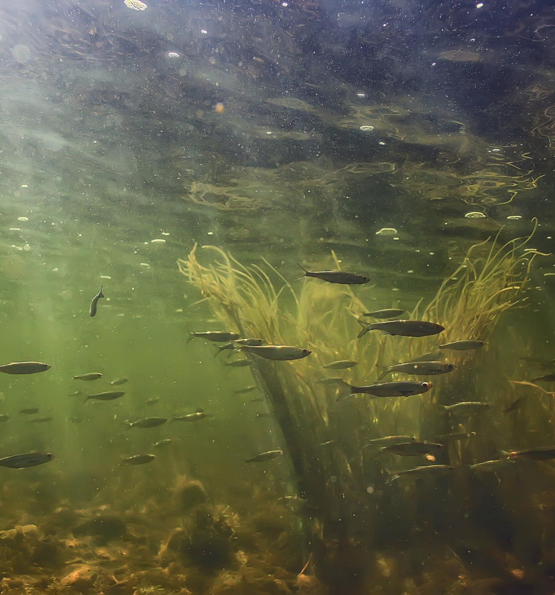

PROJECT               101123321
                      Sustainable, reliable and efficient floating PV power plants
Project number:       SuRE
Project name:
Project acronym:

TOPIC                 SUBJECT                                                       DATES

Deliverable No.       D1.1                                                             27.02.2025
Related               WP1                                                              24.02.2025
Deliverable Title                                                                      03.03.2025
Deliverable Due Date  Monitoring concepts                                              03.03.2025
Deliverable Type      28.02.2025
Dissemination level   other
Authors (s)           Public
                      Deltares: Sacha de Rijk. Lisa van Eck, Emma
Checked by            van Veenendaal, and Miguel Dionisio.
Reviewed by           Fraunhofer ISE: Alexander Graef and Stefan
                      Wieland
Approved by           Fraunhofer ISE:
Status                Laketricity: Charlotte Larue and Harold
                      Meurisse
                      Mario Silva (IFE)
                      Final

DISCLAIMER/ ACKNOWLEDGMENT

COPYRIGHT �, ALL RIGHTS RESERVED. THIS DOCUMENT OR ANY PART THEREOF MAY NOT BE MADE PUBLIC OR DISCLOSED,
COPIED OR OTHERWISE REPRODUCED OR USED IN ANY FORM OR BY ANY MEANS, WITHOUT PRIOR PERMISSION IN WRITING
FROM THE SuRE CONSORTIUM. NEITHER THE SuRE CONSORTIUM NOR ANY OF ITS MEMBERS, THEIR OFFICERS, EMPLOYEES OR
AGENTS SHALL BE LIABLE OR RESPONSIBLE, IN NEGLIGENCE OR OTHERWISE, FOR ANY LOSS, DAMAGE OR EXPENSE WHATEVER
SUSTAINED BY ANY PERSON AS A RESULT OF THE USE, IN ANY MANNER OR FORM, OF ANY KNOWLEDGE, INFORMATION OR DATA
CONTAINED IN THIS DOCUMENT, OR DUE TO ANY INACCURACY, OMISSION OR ERROR THEREIN CONTAINED.

ALL INTELLECTUAL PROPERTY RIGHTS, KNOW-HOW AND INFORMATION PROVIDED BY AND/OR ARISING FROM THIS DOCUMENT,
SUCH AS DESIGNS, DOCUMENTATION, AS WELL AS PREPARATORY MATERIAL IN THAT REGARD, IS AND SHALL REMAIN THE
EXCLUSIVE PROPERTY OF THE SuRE CONSORTIUM AND ANY OF ITS MEMBERS OR ITS LICENSORS. NOTHING CONTAINED IN THIS
DOCUMENT SHALL GIVE, OR SHALL BE CONSTRUED AS GIVING, ANY RIGHT, TITLE, OWNERSHIP, INTEREST, LICENSE OR ANY
OTHER RIGHT IN OR TO ANY IP, KNOW-HOW AND INFORMATION.

FUNDED BY THE EUROPEAN UNION. VIEWS AND OPINIONS EXPRESSED ARE HOWEVER THOSE OF THE AUTHOR(S) ONLY AND
DO NOT NECESSARILY REFLECT THOSE OF THE EUROPEAN UNION OR CINEA. NEITHER THE EUROPEAN UNION NOR THE
GRANTING AUTHORITY CAN BE HELD RESPONSIBLE FOR THEM.

                                                                                                              2

Executive SuRE project summary

Floating PV, if it is to aid the transition to a climate-neutral and resilient society and
contribute towards the EU policy goals, must overcome 3 challenges that are also high-
lighted in the Work Programme. FPV must prove its sustainability, by demonstrating
low impact on biodiversity and satisfy end-of-life requirements, its longevity and
reliability by demonstrating system components that satisfy structural and functional
requirements for the entire lifecycle, and its affordability, by reducing the LCOE from
FPV power plants. These are the challenges that the objectives of SuRE seek to
overcome. Activities are structured into 3 generalizable topics, SUstainability,
Reliability, and Efficiency, which gives SuRE FPV its name, and are designed to
advance the entire FPV industry. We will further work with concrete technology
developments for 3 leading European FPV technologies to improve their design,
sustainability, cost competitiveness and application range. The three FPV technology
providers are Ciel et Terre (CTI), who have installed 650 MW globally, Zimmermann
PV-Steel Group (ZIM), who is dominating the European FPV market, and Sunlit Sea
(Sunlit) who is providing a innovative FPV solution for off-shore deployment. CTI has
recently prototyped a new floater design, which will be developed and tested in SuRE,
first 50 kW, then on 5 MW scale. ZIM aims to expand their technology to higher sea
states, and will build a 5 MW based on the developments in floater-, connection- and
anchoring- technology in SuRE. Sunlit are about to scale up their FPV technology and
see potential for large reduc- tions in cost and CO2 footprint through the activities
planned in SuRE. They will build a smaller, but still commercially relevant, pilot of 100
on the Norwegian cost. Ultimately, SuRE will provide both cost-efficient and
sustainable new FPV technologies and generalizable knowledge, thereby expanding
the potential application areas without environmental sacrifices.

Executive deliverable summary

Research on the environmental impact of floating photovoltaic (FPV) systems is still in
its infancy. This knowledge gap is hindering the permitting process by authorities
responsible for environmental protection. More data and their analysis are needed to
understand the environmental impact in relation to nature's needs, legal obligations
and demands set by local authorities or other stakeholders using the water as a
resource.

This document guides the reader in choosing the right monitoring variables, as well as
setting up a cost-efficient and effective monitoring plan. Furthermore, it helps creating
consistency between datasets, which may then together form one large and internally
consistent database. Creating such a database is important for a relatively new
technology like FPV. With more knowledge, certain aspects of the relations between
FPV design and impact on water types will transpire. This way the sector will learn how
to balance FPV impact and performance.

                                                                                                                                                                         3

Table of Contents

1 Introduction ____________________________________________________ 6
2 Finding FPV-suitable waterbodies ___________________________________ 9

   2.1 Physical parameters ______________________________________________________ 9
   2.2 Ecological sensitivity ______________________________________________________ 9
   2.3 Non-WFD waterbodies ___________________________________________________ 11
3 Step by step towards monitoring plan _______________________________ 13
   3.1 Step 1: Understanding the waterbody of interest and intended FPV system ________ 13
   3.2 Step 2: Identifying potential impacts and prioritizing parameters for the specific
   waterbody ___________________________________________________________________ 14
   3.3 Step 3: Defining where & when ____________________________________________ 17
   3.4 Step 4: Selecting equipment and methods ___________________________________ 19
   3.5 Step 5: Database management and data analysis ______________________________ 21
4 Baseline measurements _________________________________________ 23
5 Innovations in monitoring techniques _______________________________ 24
   5.1 (Underwater) Drones ____________________________________________________ 24
   5.2 Remote sensing _________________________________________________________ 24
6 Appendix A - Information sheet for step 1____________________________ 25
7 Appendix B- Example monitoring plan_______________________________ 26
8 References ___________________________________________________ 27
9 List of Acronyms _______________________________________________ 27

                                                                                                                                                                         4

Figures & Tables

Figure 1 The process of seasonal stratification occurring in deeper lakes (deeper than 4 meters) ........................ 7
Figure 2 Simplified food web in a lake. The lower trophic levels include primary producers such as algae and
aquatic vegetation, which utilize sunlight to produce oxygen and organic material. This organic material forms
a food source for zooplankton and macrofauna. The remaining fauna (fish, birds and bats) shown in this picture
is described as higher trophic level. ........................................................................................................................ 7
Figure 3 Illustration of the classification used in the Water Framework Directive which applies to all European
waters. Picture from the Irish WFD website (www.catchments.ie). ..................................................................... 10
Figure 4 Map view of the ecological status of the 3rd (thus latest) River Basin Management Plans. .................. 11
Figure 5 The interaction of the FPV and important indicators for flora and fauna in and nearby a waterbody. .. 15
Figure 6 Monitoring of a waterbody with (left) and without FPV system (right). The red dot is the measurement
location. ................................................................................................................................................................ 17
Figure 7 Red dots are monitoring locations. The point outside the FPV system must be chosen in such a way that
it is outside the sphere of influence of the FPV system but not too close to the shores........................................ 18
Figure 8 Choosing a gradient in monitoring in a waterbody with a PV system. Red dots are monitoring locations.
.............................................................................................................................................................................. 18
Figure 9 Schematic illustration of the different options regarding the use of sensor at fixed stations or monthly
visits. ..................................................................................................................................................................... 19

Table 1 showing the Tier 1 variables, to be measured at all cases. * Wind and hydrodynamics only in deeper
lakes where stratification can occur (c. more than 5 meters deep) ...................................................................... 14
Table 2 showing the Tier 2 variables to be measured in some cases (please note that the order is not a priority
list)......................................................................................................................................................................... 16
Table 3 showing the possible equipment that can be used for Tier 1 and 2 measurements................................. 19
Table 4 Example data frame of monitoring effort in a long format. ..................................................................... 22

                                                                                                                                                                         5

   1 Introduction

Research on the environmental impact of floating photovoltaic (FPV) systems is still in
its infancy. With only a few fully commercial FPV plants installed to date, the limited
amount of data and accompanying analysis is understandable. This knowledge gap is
hindering, however, the permitting process by authorities responsible for
environmental protection. More data and their analysis are needed to understand the
environmental impact in relation to nature's needs, legal obligations and demands set
by local authorities or other stakeholders using the water as a resource.

One essential data source is in situ monitoring data, which consists of the sampling of
local water constituents and conditions. Other data sources are remote measurements
or modelling, each having specific advantages, but they heavily rely on in situ data for
their calibration and validation. This advice gives recommendations on how, when and
what in situ data to collect. Goal of the proposed `Monitoring advice' is to collect data
which helps to understand the impact of FPV on a local water resource and its
depending flora and fauna at a local scale.

This advice is part of the EU-HORIZON project SuRE-PV and is intended to be used
within this project as well as within other FPV initiatives. The advice is written by
Deltares and Fraunhofer ISE and is strongly based on the currently known relations
within the natural system and the expected impacts of the FPV system on that system.
The advice is set up as generic as possible, making it applicable to a range of different
waterbodies as well as to different FPV systems and designs. The below monitoring
recommendations will address the following questions, focusing mainly on the first two:

  1. How does the FPV impact hydrodynamics? This includes impacts on surface waves,
     currents and stratification. Stratification is the separation of a body of water into distinct
     and stable vertical layers based on the density of the water (Figure 1).

  2. How does FPV affect the lower tropic levels of the food web? The lower trophic levels
     include primary producers such as algae and aquatic vegetation, which utilize sunlight to
     produce oxygen and organic material. This directly provides food for the primary
     consumers such as zooplankton and macrofauna (e.g., larvae, snails or worms) and is
     thus essential for the productivity and energy flow in the ecosystem (Figure 2).

  3. How does FPV affect the higher trophic levels of the food web? The artificial island
     formed by FPV may provide habitat for sessile organisms, a resting place for birds,
     shelter for fish, and attract or repel other organisms such as bats and insects (Figure 2).

The above three questions are not separated, on the contrary: the hydrodynamics in a
waterbody may strongly affect the lower trophic food web, which in turn may strongly
affect the higher trophic food web (and vice versa). Hence, the same indicators and
monitoring requirements could be relevant for answering several of these questions.

                                                                                                                                                                         6

Figure 1 The process of seasonal stratification occurring in deeper lakes (deeper than 4 meters)

Figure 2 Simplified food web in a lake. The lower trophic levels include primary producers such as algae and
aquatic vegetation, which utilize sunlight to produce oxygen and organic material. This organic material forms a
food source for zooplankton and macrofauna. The remaining fauna (fish, birds and bats) shown in this picture is
described as higher trophic level.

                                                                                                                                                                        7

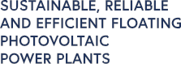

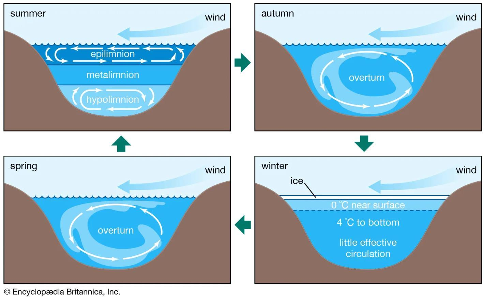

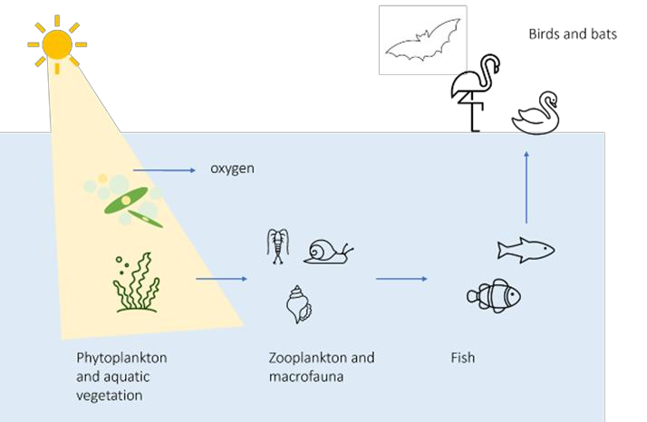

On the short term, this document helps in choosing the right monitoring variables, as
well as setting up a cost-efficient and effective monitoring plan, which is adequate for
answering the questions asked by permitting authorities or other stakeholders.
Furthermore, it helps creating consistency between datasets, which may then together
form one large and internally consistent database. Creating such a database is
important for a relatively new technology like FPV. With more knowledge, certain
aspects of the relations between FPV design and impact on water types will transpire.
This way the sector will learn how to balance FPV impact and performance. In the long
term, this will reduce the need for intensive impact-monitoring. However, some
minimum monitoring activities will remain relevant for every FPV plant despite the
available knowledge, if only to categorize the waterbody or to identify new phenomena
and trends over time.

                                                                                                                                                                         8

   2 Finding FPV-suitable waterbodies

The implementation of FPV systems depends on finding suitable waterbodies. A
waterbody is a certain clearly distinguishable part of surface water, such as a lake, a
stream, river or a part of a river, lake or stream. The term waterbody also includes
artificial reservoirs or smaller pools of water such as ponds. To identify FPV-suitable
waterbodies, it is essential to consider their physical characteristics and their
ecological sensitivity. Identifying these waterbodies relies on a combination of
environmental assessments and data from robust sources.

    2.1 Physical parameters

For the suitability of waterbodies to host FPV systems it is important to take into
account the surface area, depth, hydrology and proximity to energy grids. Waterbodies
with sufficiently large surface areas are generally more suitable for large-scale FPV
systems, as they can better accommodate installations. This is due to economic
feasibility, as larger installations often benefit from economies of scale and improved
cost-effectiveness. However, a larger waterbody does not necessarily mean a lower
ecological impact. The extent of the impact depends mainly on the percentage of the
water surface covered by the panels. Information on the size of waterbodies within the
Water Framework Directive (WFD) can be accessed through the Water Information
System for Europe (WISE). Links to these databases are given below.

The depth of the waterbody can also play an important role. In deeper areas, there is
typically not enough light at the bottom for growth of vegetation. As a result, installing
FPV systems on these deeper parts reduces the risk of impacting aquatic vegetation
(Error! Reference source not found.). Although specific size and depth requirements d
epend on the project and local conditions, these characteristics play a key role in
mitigating potential disruptions. Detailed depth data may require consultation of
national databases. However, in some cases, depth information can also be derived
from the WISE database, as waterbody types--such as those in the Netherlands--are
linked to depth classifications.

Waterbodies with calm wave conditions often reduce stress on FPV infrastructure,
simplifying deployment and maintenance. Data on wave dynamics can often be found
in hydrological studies or basin-specific management plans. Proximity to energy grids
and maintenance facilities is also crucial, as it directly affects economic feasibility and
operational efficiency. Regional planning documents and infrastructure maps can offer
insights into site accessibility.

    2.2 Ecological sensitivity

Ecological sensitivity refers to the vulnerability of a waterbody and its ecosystems to
disturbances, such as reduced light penetration and habitat alterations caused by
floating photovoltaic (FPV) systems. Sensitive ecosystems, often characterized by the
presence of unique or threatened species, critical habitats, or compromised conditions,
are more susceptible to such disturbances. For example, a shallow pond with dense
aquatic vegetation serving as a vital fish habitat. The introduction of FPV in such a

                                                                                                                                                                         9

pond, could disrupt both plant and animal life. Waterbodies with high ecological
resilience--characterized by their capacity to withstand and recover from
disturbances--exhibit lower ecological sensitivity and are more likely to endure FPV
impacts with minimal disruption. In contrast, ecosystems with low resilience are more
vulnerable to degradation and may experience irreversible changes. Key factors
influencing resilience include water quality, habitat connectivity, and biodiversity. Thus,
understanding ecological sensitivity is essential for evaluating the potential impacts of
FPV systems and ensuring their placement minimizes ecological disruption.

Legal frameworks, such as the Water Framework Directive (WFD) and Natura 2000,
provide tools to assess ecological sensitivity. The WFD classifies waterbodies based
on their ecological and chemical status, using respectively Biological Quality Elements
(BQE), which include fish, aquatic vegetation, macroinvertebrates, and phytoplankton
and concentrations of chemical substances. Waterbodies classified as having "high",
"good" or "moderate" ecological status may be more resilient to changes, potentially
making them suitable for FPV systems (Figure 3). Water authorities have the obligation
to improve WFD waterbodies with bad or poor classification, these efforts may not be
consistent with FPV installation. Under all circumstances authorities should prevent
deterioration to a lower WFD class. Waterbodies within or close to Natura 2000 sites,
protected under the EU Habitats and Birds Directives, have high ecological value and
are subject to stringent regulations to prevent adverse impacts.

Figure 3 Illustration of the classification used in the Water Framework Directive which applies to all European
waters. Picture from the Irish WFD website (www.catchments.ie).

By using these legal frameworks, we can effectively assess ecological sensitivity and
ensure FPV systems are deployed in locations where they pose minimal ecological
risks while supporting sustainable energy goals. There are different resources that
can be used to evaluate the ecological conditions, legal status, and suitability of
waterbodies for FPV deployment:

    1. WISE Water Framework Directive Database - European Environment
         Agency
         The WISE WFD database contains data from the 1st and 2nd River Basin
         Management Plans reported by EU Members States according to article 13 of
         the Water Framework Directive (WFD). The database includes information

                                                                                                                                                                       10

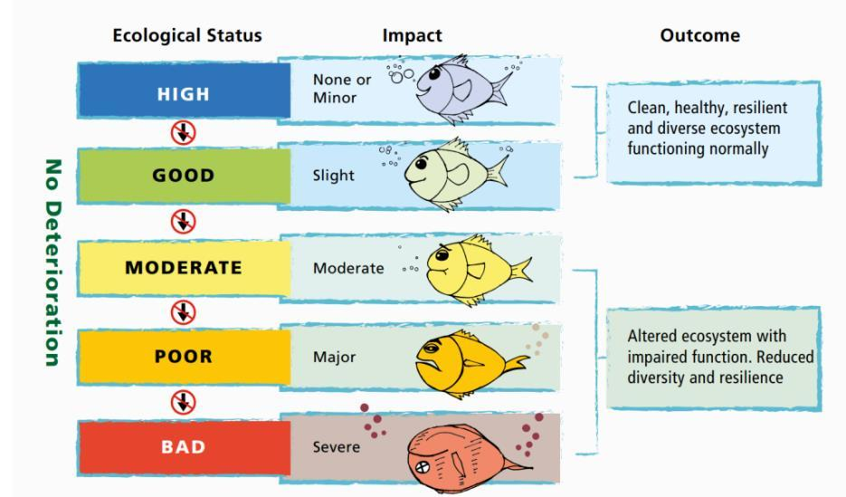

         about surface water bodies (number and size, water body category, ecological
         status or potential, chemical status, significant pressures and impacts). The
         information is presented by country, river basin district (RBD) and river basin
         district sub-unit (where applicable).

              a. WISE Water Framework Directive (data viewer) | European Environment
                   Agency's home page ; for an overview per country

              b. Water Framework Directive - River Basin Management Plans | European
                   Environment Agency's home page ; for a map view of the ecological or
                   chemical status (figure 3)

              c. DISCODATA ; the actual database with detailed information per WFD
                   waterbody. To retrieve data, navigate to the WISE_WFD database, select the
                   latest version, and open the SWB_SurfaceWaterBody table. Then, click on the
                   three small dots next to the table and choose Open table viewer to view the
                   data.

    2. Natura 2000 Viewer
         The Natura 2000 Viewer provides access to data on protected areas under the
         Natura 2000 network, highlighting ecologically sensitive regions and habitats.
              a. Natura 2000 Viewer ; for a map view of Natura 2000 sites, habitats, species
                   and countries.

Figure 4 Map view of the ecological status of the 3rd (thus latest) River Basin Management Plans.

    2.3 Non-WFD waterbodies
Some waterbodies fall outside the scope of the WFD and present viable opportunities
for FPV installations. Artificial reservoirs and irrigation or industrial basins are not
always classified as WFD waterbodies and often offer controlled environments with
lower ecological sensitivity, making them favourable for development. Lists of artificial
waterbodies can often be found in local water management plans or industrial zoning
records. Similarly, brackish and intertidal zones, such as deltas and estuaries, may
also offer opportunities for FPV systems, though these environments require additional

                                                                                                                                                                       11

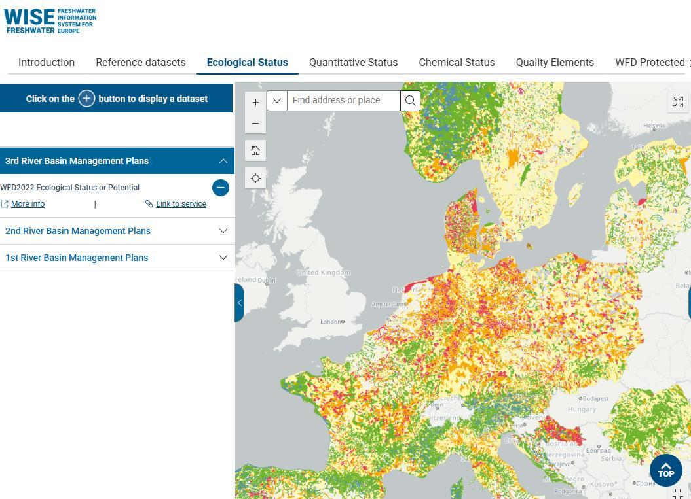

consideration for wave conditions, salinity and tidal fluctuations. Coastal zone
management plans and marine spatial planning frameworks provide relevant data for
evaluating these areas.
In conclusion, identifying suitable waterbodies for FPV requires a comprehensive
understanding of physical characteristics, ecological sensitivity, and the regulatory
framework in place. The understanding can be supported by reliable data and
collaboration with stakeholders. Resources such as the WISE system, Natura 2000
databases, and national planning inventories provide the tools necessary to align FPV
site selection with ecological and legal standards, advancing renewable energy goals
sustainably.

                                                                                                                                                                       12

   3 Step by step towards monitoring plan

This chapter shows you the five steps for creating an effective monitoring plan. In short
the five steps are:

    1. Understanding the waterbody of interest and intended FPV system. Begin by
         analysing the characteristics of the waterbody to gain insight into its dynamics and
         baseline conditions.

    2. Identifying potential impacts and prioritizing parameters for the specific
         waterbody. Determine the possible impacts of floating solar parks on the
         waterbody. Identify the most relevant indicators and variables that quantify these
         impacts.

    3. Defining where to place the monitoring locations. Select the appropriate
         monitoring locations and determine the frequency and timing of measurements
         to ensure comprehensive data collection.

    4. Selecting Equipment and methods. Choose suitable monitoring equipment
         based on the identified quantities to be measured and establish a realistic budget
         to support the monitoring activities.

    5. Database Management and Data Analysis. Organize the collected data in a
         structured database and perform thorough data analyses to identify patterns and
         assess potential impacts.

This process is cyclical: findings from Step 5 may reveal the need for additional
measurements or adjustments in the monitoring plan, ensuring an iterative approach to
refining and improving the monitoring strategy.

    3.1 Step 1: Understanding the waterbody of interest and intended FPV system

The first step in developing a monitoring plan for a FPV installation is conducting a
comprehensive analysis of the considered waterbody. This involves gathering all
available information on the characteristics of the waterbody where the FPV system is
to be installed. Understanding the specific features and dynamics is critical, as the
environmental impacts of the installation will depend significantly on the type of
waterbody involved.

For instance, the expected impacts on an irrigation pond may differ substantially from
those on a deep drinking water reservoir, a sandpit lake, or a large natural lake. Each
waterbody type presents unique ecological, physical, and chemical conditions, which
influence the potential effects of FPV installation and, consequently, the required

                                                                                                                                                                       13

monitoring strategies. The objective of this step is to collect existing data and
knowledge about the waterbody to create a robust foundation for informed decision-
making. By understanding the baseline conditions, a better prediction the potential
environmental impacts of FPV installation can be made. The format provided in
Appendix A allows you to easily fill in the details about the waterbody and the intended
FPV system.

In addition to understanding the waterbody, it's also crucial to consider the properties
of the potential FPV system you're thinking of, as the impact can vary significantly
depending on factors like coverage percentage or the row distance between the panels
(Appendix A).

3.2 Step 2: Identifying potential impacts and prioritizing parameters for the
       specific waterbody

Table 1 shows the recommended quantities for monitoring, henceforth called "Tier 1".
Figure 5 shows the indicators and the interactions in a simplified way. All Tier 1
quantities are those which are directly impacted by installing FPV (Figure 5). More
information on these indicators will offer hydrologists and ecologist a solid base to
assess the consequences for the waterbody and connected waterbodies.

Table 1 showing the Tier 1 variables, to be measured at all cases. * Wind and hydrodynamics only in deeper lakes
where stratification can occur (c. more than 5 meters deep)

Indicator        Measuring what?      Frequency
Wind *           Windspeed and        Whole year round using in situ sensors
                 direction
Hydrodynamics *  Waves                Whole year round using in situ sensors
Light in water   Amount of available  Whole year round using in situ sensors or
column           light                monthly visits
Oxygen in water  Concentration of     Whole year round using in situ sensors or
column           oxygen               monthly visits
Primary          Chlorophyl-a         Whole year round using in situ sensors or
production                            monthly visits
Temperature in   Water temperature    Whole year round using in situ sensors or
water column                          monthly visits
Turbidity 1      Number of particles  Whole year round using in situ sensors or
                 in water column      monthly visits

1 This measures how clear or murky the water is. Important parameter to explain the available light in water
column.

                                                                                                                                                                       14

Figure 5 The interaction of the FPV and important indicators for flora and fauna in and nearby a waterbody.

In addition to Tier 1, Tier 2 monitoring quantities are quantities that depend on
specifics of the location or can be required by permitting authorities or stakeholders.
Some Tier 2 monitoring quantities are shown in Table 2. The table shows also the
potential situations where these Tier 2 measurements might be necessary. Together
with the stakeholders it can be decided to monitor variables for the Tier 2 list.
Please note that micro- or nanoplastics are not in the list of Tier 2 (Table 2). The
reason is that we consider monitoring at the FPV plant (in situ) not an adequate
method to determine if degradation of FPV components occurs over time. This
should be examined in a laboratory setting.

                                                                                                                                                                       15

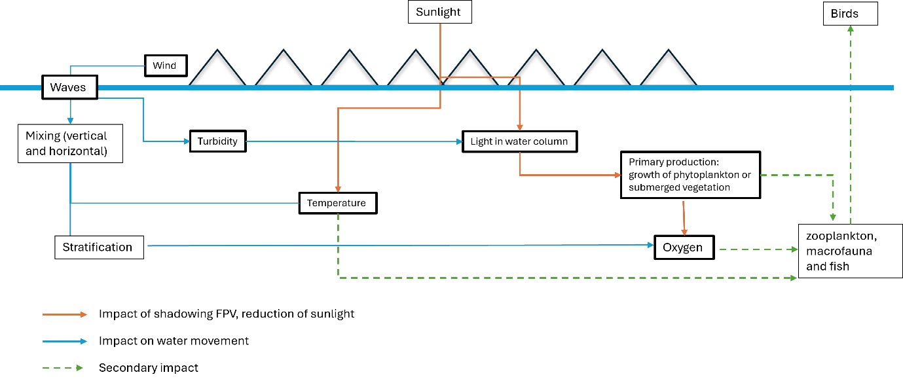

Table 2 showing the Tier 2 variables to be measured in some cases (please note that the order is not a priority list).

Indicator       Measuring what?         Frequency        When to be measured
Chemical        Presence of relevant    Once a year.
composition     hazardous               Or when a        This could be required in a drinking water
(e.g., lead,    substances              calamity like a  reservoir because very strict targets for
antimony,                               fire has         concentrations of chemical substances
PFAS2)          Total N and P           occurred         apply.
                                                         Could also be required when stakeholders
Nutrients and   Coverage functional     6 times from     are worried about certain substances like
pH              groups and species      April to         PFAS.
Submerged                               October          Important to explain changes in
vegetation      In addition to          Once a year      productivity of the lake. Required in WFD
                Chlorophyl-a (Tier 1),                   waterbodies.
Phytoplankton   the composition of a    Bi- weekly       Required when shallow parts3 where
                population can be       sampling from    submerged vegetation has potential to
Zooplankton     determined              May to           grow.
                                        October          Required in WFD waterbodies.
Fish            Density and species                      Can be required in waters sensitive to
                composition             Bi-weekly        blue algae (eutrophic or mesotrophic).
Organic                                                  Measuring to substantiate the idea that
buildup (flora  Species composition     Once a year      algae composition changes, at the
and fauna       Biomass                                  expense of blue algae.
growing on the                          Once a year      Required in WFD waterbodies.
FPV             Species composition                      Only required if there are worries about
installation)   (algae, macrofauna,     Monthly during   the impact on the overall food web. This
Birds           flora)                  breeding         will be indicated by the involved ecologist.
                Biomass estimates       season           Substantiate the question if FPV has
Bats            (weight)                For several      effect on fish stocks (+or -).
                                        years            Required in WFD waterbodies.
Amphibians      Number of breeders                       Can be required to substantiate if the
and reptiles    vs non-breeders.        Frequency to     buildup leads to increase of biodiversity or
                Number of indicators    be determined    introduces invasive species.
                species                 by involved      Can also be required for maintenance of
                                        specialists      anchor lines.
                Flight patterns
                                        Once every       Might be necessary in areas with rare bird
                Numbers and             three years      species occurrences or nature protected
                species                                  areas.
                                                         Required when the waterbody is in or
                                                         close to Natura 2000 area (depending on
                                                         the goals in that area).
                                                         Might be required in regions where bats
                                                         are present and depend on this lake for
                                                         food or when the lake's position is
                                                         interfering with flyways.
                                                         Required when the waterbody is in or
                                                         close to Natura 2000 area (depending on
                                                         the goals in that area).
                                                         Might be required in regions where rare
                                                         species occur which might be impacted

2 Hazardous substances in solar panels can be lead and/or antimony (soldering materials). The backsheets of panels can
contain PFAS. However, PFAS free solar panels are available as well.
3 In most cases potential habitat for submerged vegetation is between 0 and 4 meters. However this range can be vary
depending on lake characteristics.

                                                                                                                                                                       16

Tier 3 monitoring quantities could be chosen to pursue research questions on the
fringes of what is known about the FPV impact on waterbodies. For example, the
impact of FPV covering on the exchange of (greenhouse) gases between water and
atmosphere or the wearing of the used plastics in floaters. In most cases the questions
will be initiated by research partners.

    3.3 Step 3: Defining where & when
Floating solar parks can cover large parts of a waterbody. Where should one monitor
and how many monitoring locations are needed? We present three options based on
what we learned from scientific papers and on general knowledge of measurement
strategies used in aquatic ecological field research (mainly the Water Framework
Directive). Feasibility is also an aspect which is considered for the options. After the
options for location we show you some options for frequency and duration.
Option 1 -reference point in a similar waterbody
This option requires a second identical or at least comparable waterbody to act as a
reference (Figure 6). Waterbodies are comparable if they have about the same size,
depth, bottom sediments and are fed by the same source (e.g., river or groundwater).
This is the preferred option. To find a situation like this will be however, rare.

Figure 6 Monitoring of a waterbody with (left) and without FPV system (right). The red dot is the measurement
location.

Option 2 - reference point in same waterbody as FPV
In case there is no other waterbody which can act as a reference, the advice is to
choose two monitoring locations in the same waterbody: one under and one outside
the PV system (Figure 7). The location outside the FPV installation acts as the
reference site. This reference site should be chosen such as to be minimally affected
by the presence of the FPV installation, while still being representative of the
waterbody portion covered by the FPV.

                                                                                                                                                                       17

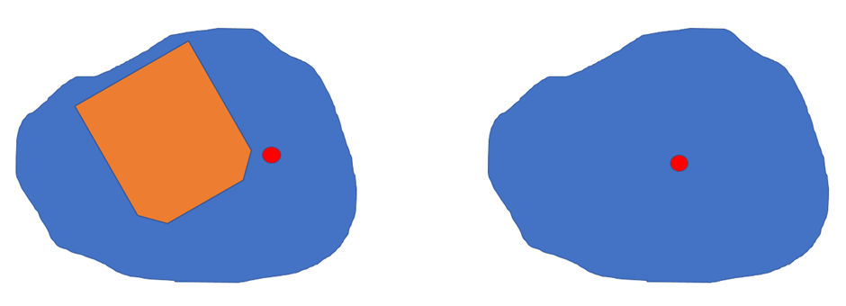

Figure 7 Red dots are monitoring locations. The point outside the FPV system must be chosen in such a way that
it is outside the sphere of influence of the FPV system but not too close to the shores

Option 3 - choose a gradient
This option involves monitoring at different locations on and beyond the FPV
installation (Figure 8) to spatially resolve the FPV impact on the waterbody. Monitoring
results will show whether there are differences between the centre of the PV system
and the edge and how the effects change as the distance from the PV system
increases. In the sketch of Figure 8, three measuring points are drawn, but there could
of course be more.

Figure 8 Choosing a gradient in monitoring in a waterbody with a PV system. Red dots are monitoring locations.

After the location is chosen, the monitoring frequency and duration need to be
chosen. Tables 1 contains the frequency of monitoring for the Tier 1 variables,
duration is at least one year to include all seasonal changes. Continuous monitoring
can be done by placing sensors in the water at a fixed depth (at c. 80 to 100 cm) or
along a vertical string to capture also the changes against depth. These sensors will
provide information of the surrounding water conditions every hour. If installations of
equipment for continuous measurements is not possible an alternative is visit the
FPV each month and perform the measurements during the visit (Figure 9).

In short, we have three options regarding frequency. All three option will provide you
with sufficient data to assess the impact. The choice depends on the available
budget, feasibility, and wishes from associated researchers, permitting bodies or
other stakeholders. The three are:

    1. continuous measurements against depth for all Tier 1 variables
    2. continuous measurements at fixed depths for all Tier 1 variables
    3. monthly visits for all Tier 1 variables

                                                                                                                                                                       18

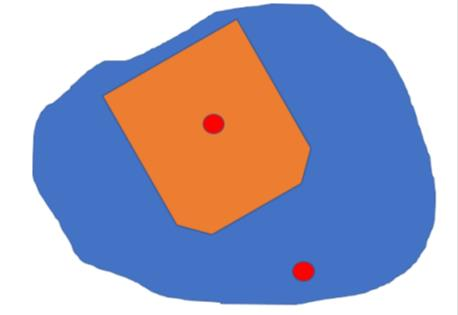

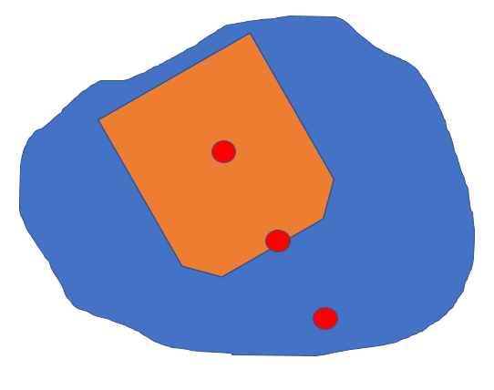

Figure 9 Schematic illustration of the different options regarding the use of sensor at fixed stations or monthly
visits.

    3.4 Step 4: Selecting equipment and methods

This step helps to choose suitable monitoring equipment based on the identified
quantities to be measured and establish a realistic budget to support the monitoring
activities (Table 3). The information on prices is indicative and the mentioned equipment
is not exhaustive. We advise to request quotes at local specialized monitoring
companies.

Table 3 showing the possible equipment that can be used for Tier 1 and 2 measurements.

Indicators       Measured          Measuring Device                 Purchase costs (order of
                 variable                                           magnitude)
Tier 1
Hydrodynamics    Water movement    Wave Buoy                        High, price per buoy ~ 9.000 EUR
Wind                               Anemometer                       Low, price per sensor ~ 900 EUR
                 Windspeed and
Light in water   direction         PAR sensor for continuous        Low, price per sensor ~ 500 EUR
column           Amount of         measurements
                 available light

Oxygen in water  Concentration of  Secchi disk for one time         Very low to purchase (~20EUR) but
column           oxygen            measurements                     needs personnel cost
                                                                    Medium, price per chain ~ 5.000
Primary production Chlorophyl-a    Optical (Luminescent) DO         EUR
                                   Sensor Chain (continuous at      Low, price per sensor ~ 2500 EUR
Temperature in   Water             various depths)
water column     temperature                                        Low, price per sensor ~ 1.500 EUR
                                   Exo YSI optical dissolved smart  High, price per chain ~ 10.000 EUR
                                   sensor. (continuous at fixed     Low, price per sensor ~ 2500 EUR
                                   depth)

                                   Optical Fluorescence Sensor
                                   (Exo YSI Sensor)

                                   Thermistor Chain (continuous
                                   at various depths)

                                   Exo YSI sensor (continuous at
                                   fixed depth)

                                                                                                                   19

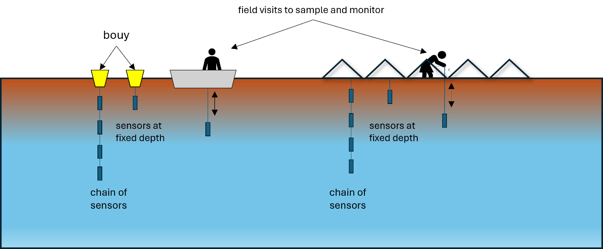

Turbidity         Number of             Exo YSI sensor (continuous at    Low, price per sensor ~ 2500 EUR
                  particles in water    fixed depth)
Multiprobe        column                                                 High, price ~ 15.000 EUR (however,
including most                          A fixed-position multiparameter  all variables are included)
Tier 1 variables  light, temperature,   probe Aquaread `AP7000
                  pH, redox
                  potential,
                  dissolved oxygen,
                  oxygen saturation,
                  salinity, turbidity,
                  conductivity, and
                  chlorophyll-a

Tier 2            Concentrations or Sampling and analysing in            Depend on number of samples.
Chemical                                                                 E.g., analysis of PFAS is estimated
composition       bioassays4            laboratory                       to be c. 700 EUR per sample in a
Nutrients                                                                certified laboratory. Additional
Submerged         Total                 Sampling and laboratory          costs of field sampling
vegetation                              analysis                         Low costs per sample
                  Coverage of
Phytoplankton     groups and            Observations                     Mostly only along the shores in
Zooplankton       species                                                shallow areas. Observations from
Fish                                                                     the shore or a boat are sufficient.
Birds             Species and           1Sampling and determination      No diving is required. Follow the
                  abundance             2 FRRF (Fast Repetition Rate     national protocols for monitoring
Bats                                    Fluorometry)                     (WFD). Hiring a specialized
                  Species and                                            consultant is a good option.
Organic build up  abundance             Sample probing in laboratory     1High due to laboratory work and
                                                                         the high number of species
                  species               Underwater Cameras/field         2. used for estimation of
                                        sampling/electrofishing          phytoplankton abundance
                                                                         High due to laboratory work. Costs
                  (indicator) species Cameras or field observations      are up to 200 EUR per sample,
                                                                         mostly lower than phytoplankton
                  species               Bat detectors and field          determination.
                                        observations                     Low-High depending on method.
                                                                         Expert costs for field sampling and
                                                                         electrofishing. Hiring an expert
                                                                         consultant is a good option.
                                                                         Low-Medium depending on
                                                                         method and intensity. Expert costs
                                                                         for field observations and analyses
                                                                         of the camera results. Hiring a
                                                                         expert consultant is a good option.
                                                                         Low-Medium depending on
                                                                         method and intensity. Expert costs
                                                                         for field sampling and analyses of
                                                                         noises form detectors. Hiring a
                                                                         expert consultant is a good option.

                  Species and           Field sampling, weighing, and
                  biomass               determination

Tier 1 measurements are taken continuously with sensors while tier 2 measurements
are taken with probing or sampling. The preparation and installation of continuous
sensors typically takes 3 to 4 days with qualified personnel. Maintenance requirements

4 bioassays are tests that use living organisms, cells, or tissues to measure the effects of a substance

                                                                                                                                                                       20

are usually low; however, unexpected issues can lead to significant cost increases if
additional trips to the location become necessary.

For sampling of non-continuous measurements, a full working day is required per
parameter. Travel expenses back and forth as well as the daily rate of expert personnel
rate need to be taken into account. The probing/sampling frequency of non-continuous
parameters depends on the scope of the measurement and the conditions at the
location. For example, bird analysis should be scheduled in accordance with bird
migration patterns, if applicable to the location in question. As a rule of thumb, 4-5
observation sessions yearly are required.

The data evaluation in the case of non-laboratory analysis can typically be completed
within one working day, provided experts and automated systems are utilized. Analysis
involving laboratory processing, as it can be necessary for phytoplankton or
zooplankton, is more costly. Diving investigations, due to the need for equipment and
skilled personnel, result in higher costs as well, whereas bird monitoring is generally
more affordable. The established analysis of fish populations using electrofishing is
considered expensive due to specialized equipment and expertise requirements.

    3.5 Step 5: Database management and data analysis

One of the goals of developing a monitoring strategy for assessing the potential effects
of floating solar systems on water quality and ecology is to gain a general
understanding of these effects, rather than focusing on a single specific system. This
broader knowledge can also support organizations in showcasing their expertise
internationally.

Currently, there is no standardized format or central repository for storing data on FPV
systems and their environmental effects. As a result, valuable information is often
fragmented, making comparisons and large-scale analyses challenging. To address
this, it is essential that all measurements are stored in a structured, standardized, and
centrally accessible manner for professionals working on this topic. This approach
ensures secure and centralized data storage while keeping information easily
accessible for research, policy-making, and system optimization.

Our advice for storing the collected data in a structured and accessible manner is a
relational database (e.g., PostgreSQL, SQLite) or a well-organized CSV/Parquet file
structure if working with simpler data management tools. Then the following aspects
of the obtained data are recommended (also Table 5):

    1. Store data in long format:
              a. Each row represents a single observation (i.e., one parameter at one time
                   point).
              b. This makes data handling and analysis more simple.

    2. Standardized naming:
              a. Use clear, consistent parameter names (e.g., water_temp instead of WT).
              b. Use lowercase and underscores for readability (e.g., wind_speed).

                                                                                                                                                                       21

3. Metadata Focus:
         a. Include metadata columns to describe the data
         b. Important metadata fields:
                    i. location_id (Unique site identifier)
                    ii. measurement_type (below FPV sytem, next to FPV system, in open
                        water)
                   iii. fpv_system_type (Floating PV system classification)
                   iv. coverage_percent (Percentage of water surface covered by FPV)
                   v. date_time (Timestamp in ISO 8601 format)
                   vi. parameter_name (Measured variable)
                  vii. value (Observed measurement)
                 viii. unit (Unit of measurement)
                   ix. data_source (Sensor/manual sampling)

Table 4 Example data frame of monitoring effort in a long format.

location  measur    fpv_sys  coverag  date_ti   paramet            value  unit  data_so
_id       ement_t   tem_typ  e_perce  me        er_nam             15.2   �C    urce
A01       ype       e        nt                 e                  8.5    mg/L
A01       below_F   Type_A   30       2025-     water_te           3.2    �g/L  Sensor_
A02       PV                          02-14     mperatu            7.8          X
A02                 Type_A   30       10:00:00  re                 2.5    NTU
A03       next_to_                    2025-     dissolve                        Sensor_
          FPV       Type_B   45       02-14     d_oxyge                         Y
                                      10:00:00  n
          open_w    Type_B   45       2025-                                     Lab
          ater                        02-14     chloroph                        Analysis
                    Type_C   60       11:00:00  yll
          below_F                     2025-                                     Sensor_
          PV                          02-14     pH                              Z
                                      11:00:00
          next_to_                    2025-     turbidity                       Manual
          FPV                         02-14                                     Samplin
                                      12:00:00                                  g

                                                                                          22

   4 Baseline measurements

Regardless of which monitoring strategy is chosen, it is recommended to always carry
out baseline measurements; meaning a campaign before installing the PV systems.
This is best done the year before. In some cases baseline information is available.
However, in most cases it won't.
Once a waterbody has been sufficiently assessed and deemed suitable for the
installation of an FPV system (step 1), it is essential to establish a baseline
understanding of its ecological and physical conditions. Baseline measurements are
critical for evaluating the impact of the FPV system post-installation. These
measurements should focus on parameters that directly correspond to the primary
environmental pressures introduced by FPV systems. Our advice is to monitor all
quantities that reflect the most direct impacts of FPV on the waterbody through shading
and wind shear, the so called Tier 1 variables (Table 1).

                                                                                                                                                                       23

   5 Innovations in monitoring techniques

    5.1 (Underwater) Drones

Underwater drones are being increasingly used in water management. Very often the
purpose is simply inspection, but the drones are nowadays also equipped with sensors
to monitor water quality variables such as temperature and oxygen. Monitoring under
floating PV systems has also already been undertaken (Pedroso et al., 2021). An
important advantage of drones is that they can travel to locations (both horizontally
and vertically) under a solar park that otherwise would be difficult to reach by
conventional monitoring. This way, 3D-resolved fluctuations of certain water quality
parameters can be obtained. A big challenge is to keep the drone in position to be able
to perform the measurements at selected locations.

    5.2 Remote sensing

Earth observations can be used to monitor several water quality parameters such as
chlorophyll-a, suspended matter and yellow matter. A major advantage is their
coverage of large areas allowing therefore to observe complete waterbodies. Satellites
suitable for monitoring water quality have a revisit period of several days (Sentinel-2
for example has a revisit time of 5 days) which means that every 5 days a new satellite
image is available to be processed, assuming that there is no cloud coverage. There
are limitations, however. One of them is the size of the waterbody which needs to be
considered in relation to the spatial resolution of the sensing instrument on board the
satellite. Sentinel-2 has a spatial resolution of 10, 20 and 60 m. Small waterbodies are
therefore problematic to be monitored with satellites. Cloud coverage is another
limitation because clouds block the satellite's sensors from directly observing the water
surface beneath them, they may scatter sunlight in various directions, creating
atmospheric interference and cloud shadows can distort the light being reflected off
the water. Finally, not all water quality parameters can currently be (directly) monitored
with earth observations. Despite the limitations, earth observation data can be used to
monitor the impact of floating solar parks on water quality in case waterbodies are large
enough.

Currently, new Sentinel expansion missions are being developed (ESA). Some of
these missions will come with more spectral bands (hyperspectral) and improved
spatial resolutions. For water quality, especially the CHIME mission will be of interest
(CHIME).

                                                                                                                                                                       24

6 Appendix A - Information sheet for step 1

Characteristic description                  Properties
Name of the waterbody
Location of the waterbody (x, y             Water usage east:
coordinates)                                Water usage South:
Size/area of the waterbody                  Water usage west:
Maximum depth of the waterbody              Water usage north:

Bathymetric chart

Hydrological connection with surrounding
water (e.g. isolated, connected to river,
connected to canal)
Predominant wind direction

Ecosystem services of the waterbody (e.g.
recreation, transport, nature)

Is waterbody classified as a WFD
waterbody or in a protected nature reserve
(e.g. Natura 2000 area)?
Current ecological and chemical status (by
WFD classification or expert judgment)
What measurements are available? (e.g.
nutrients, oxygen, temperature, bird
observations, fish counting's, bat
observations or other biological data
Solar park name
Initiator/founder

Contact details

(Expected) year of installation
Number of solar panels
Total area of the solar park (in hectares)
Area covered by solar panels (in
percentage)
Border width to solar panels
Row distance between solar panels
Number of rows with solar panels
Row length
Orientation of solar panels
Panels fixed or tracking the sun?
Type of anchoring (land, shore, seabed)
Minimum height (in meters)

                                                                25

 Maximum height (in meters)
 Horizontal gaps
 Vertical gaps
 Space between floats and solar panels
 Glass plates present?
 Type of material for floating components

   7 Appendix B- Example monitoring plan

Following the steps of this guideline, a monitoring plan for a typical waterbody and
respective FPV system is shown as an example in the following. The primary goal of this
monitoring plan is to evaluate the ecological and physical-chemical impacts of the FPV
system. The required sensor quantity is mostly independent of the lake and FPV size, as
the FPV influence is analysed with the relation between critical points of interest (e. g.
plant centre and reference area).
Tier 1: Continuous monitoring

- Light in the water column (PAR sensors)
                Locations: Below FPV-System (1 x in the middle, 1 x at the edge, 1 x in-between)
                   and 1 x in reference area outside FPV system influence
                Cost: Approximately 500 EUR per sensor, i. e. 2.000 EUR

- Dissolved oxygen (DO sensor chain)
                Locations: 1 x below FPV system, 1 x in reference area
                Cost: Approximately 5.000 EUR per chain, i. e. 10.000 EUR

- Chlorophyll-a for phytoplankton growth (optical fluorescence sensor)
                Locations: 1 x below FPV system, 1 x in reference area
                Cost: Approximately 1.500 EUR per sensor, i. e. 3.000 EUR

- Water temperature (thermistor chain)
                Locations: 1 x below FPV system, 1 x in reference area
                Cost: Approximately 10.000 EUR per chain, i. e. 20.000 EUR

Installation Requirements: 3-4 days for deployment with qualified personnel
(estimated cost of 5,000 EUR)
Maintenance: Estimated at 2,000 EUR annually. No regular maintenance is
required/scheduled to begin with, but it is expectable that software and data

                                                                                                                                                                       26

management as well as sensor troubleshooting, including the corresponding travels,
leads to expenses.

   8 References

Pedroso de Lima R.L., K. Paxinou, F. Boogaard, O. Akkerman, F. Lin, 2021. In-SituWater Quality
Observations under a Large-Scale Floating Solar Farm Using Sensors and Underwater Drones.
Sustainability 2021, 13, 6421. https://doi.org/10.3390/su13116421

   9 List of Acronyms

      � SuRE: Sustainable, Reliable and Efficient Floating Photovoltaic Power Plants
      � WFD: Water Framework Directive
      � BQE: Biological Quality Elements
      � RBD: River Basin District
      � ESA: European Space Agency
      � CHIME: Copernicus Hyperspectral Imaging Mission for the Environment
      � FPV: Floating Photovoltaic

                                                                                                                                                                       27

