# SuRE WP6: PU UV — preliminary results

_Nathan Roosloot, IFE. Datert 12.03.2025. Konvertert fra `250312 - UV minipatch preliminary results.pdf` med `pdftotext -layout`. Rå tekst-konvertering; PowerPoint-bullets erstattet med `-`._

12.03.2025

SuRE WP6: PU UV
(preliminary) results

Nathan Roosloot
Sample overview                                                   #2

- 12x minipatches, 3 different hardnesses
- 4x 90A (Serial# 107 - 110)
- 4x 80A (Serial# 206 - 209)
- 4x 70A (Serial# 307 - 310)

- 4x 20x15x0.2 cm3 PU sheets
- 2x B 70A
- 1x B 80-85A
- 1x C+ 85A (lower quality product)
     Three unique sheets cut in 20 10x1.5 cm2 strips for tensile

         testing

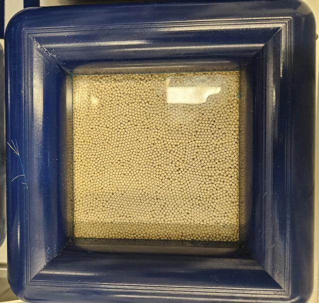

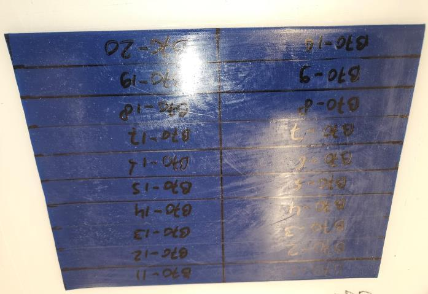

Testing plan                                                            #3

- Goals:
- Test PU tensile strength and PU-glass and PU-Al adhesive

         strength as a function of UV exposure

- Measure moisture ingress in minipatches after humidity

         exposure

- Strength testing: tensile for PU, lap shear strength for minipatches
- Sample cutting of minipatches to be done after UV exposure

- UV exposure: 1000h at condition A3 (see table below)
- Standard test for PV components, previously performed on

         dogbones and edge sealant samples in MariSol, but now with
         RH = 80% instead of 20% to test moisture ingress

- Black panel T means that black item in chamber reaches 90 C.

         PU will be close to that since dark blue

- Many other PV tests with max ambient T of 85 C, so

             components should be stable at such T

- 1000h UV dose (kWh/m2) about 2 years of exposure in

             S�tre, but test at higher T (accelerates degradation)

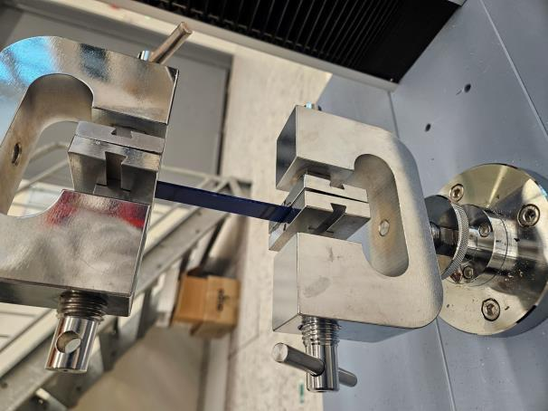

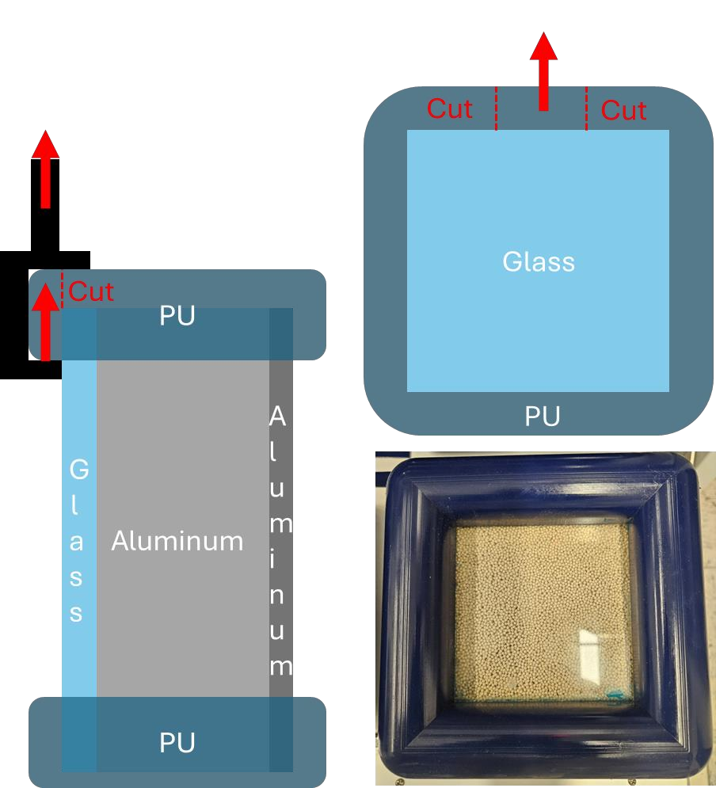

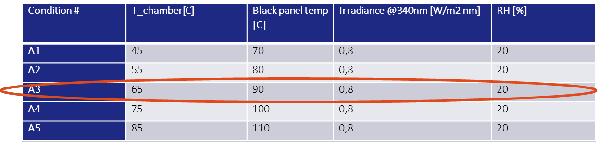

UV chamber test                                                  107       # 4 308

- Samples in UV (top image is before start):                     108  206  309
- 5 minipatches: 2x 90A, 1x 80A, 2x 70A
- 9 tensile samples per sheet type (27 total)

- Test paused after 209.09h of exposure for inspection (bottom

    image):

     All samples (both minipatches and tensile strips) severely

         darkened

     Several of the minipatches displaying burn marks

 UV test stopped completely as result of the observations

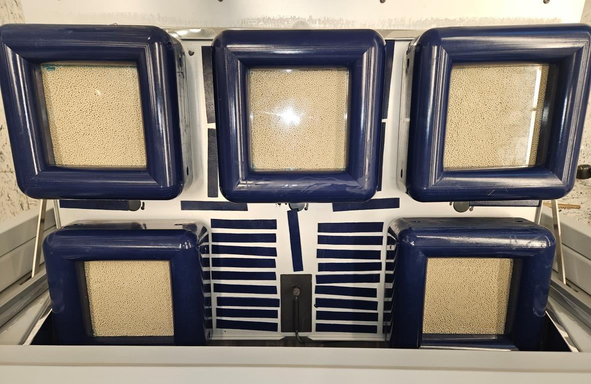

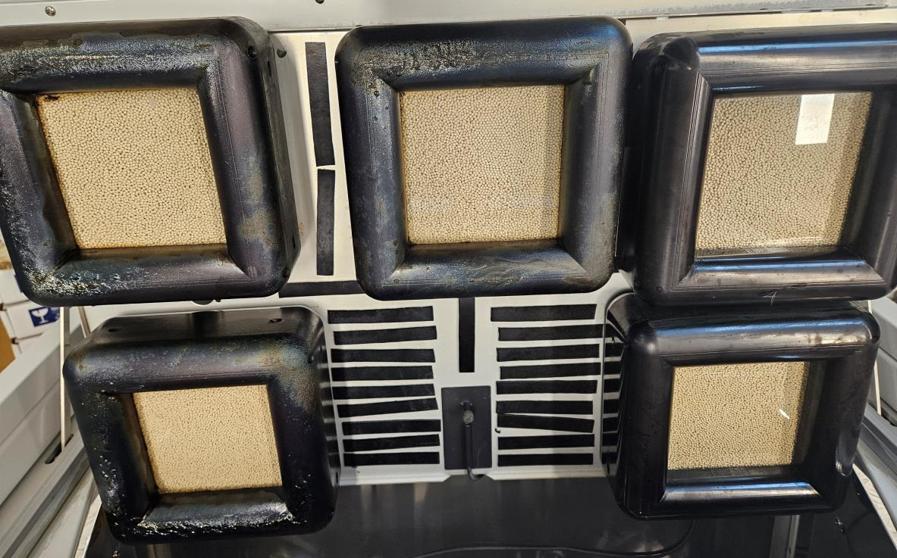

UV results after 209h: minipatches                                                 #5

- All samples darkened, and several with burn marks                      107           108

- Clear differences in visual appearance of PU types (inspection              206

    some hours after test stop, all samples at RT):                 308                309

- 90A (107&108): top black but no burn marks. PU still feels

         hard to touch. Some sides still blue

- 80A (206): top black and burn marks. PU on top deforms

         on touch (feels soft). Sides also black.

- 70A (308 & 309): top black and most severe burn marks.

         PU deforms easily on touch (feels softer than 80A). Sides
         black as well.

- Due to sample height, samples closer to light source, leading

    to elevated irradiance and temperature

- Technical support: irradiance on the minipatches is about

         25% higher than on the tensile ones

- Irradiance 1 W/m2
- Based on irradiance increase, approximate new T is ~95 C

         for black samples [Stefan-Boltzmann energy balance
         approximation]

- Measure manually to confirm
        Likely higher than what will be experienced in the field

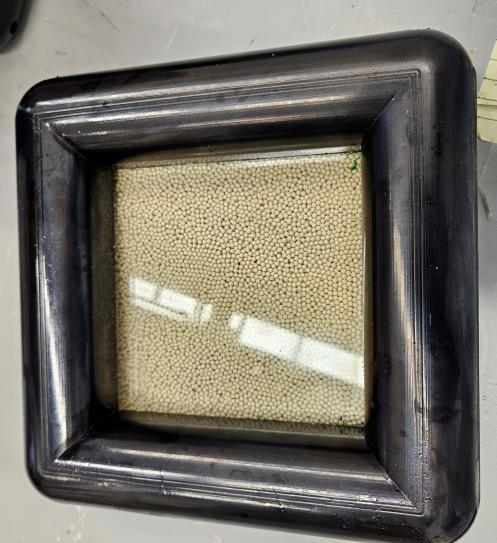

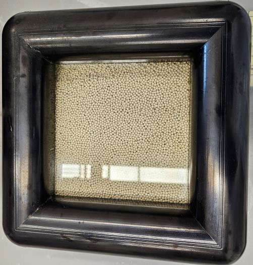

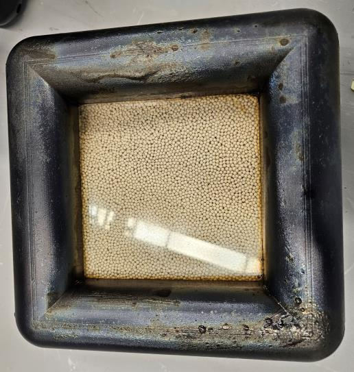

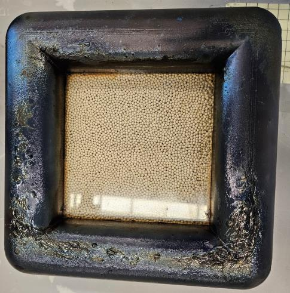

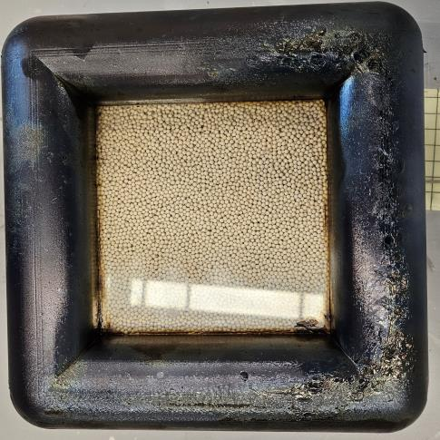

UV results after 209h: minipatches (2)                                                      #6

- Gravimetric measurements:                                     Sample # Mass pre-UV (Mg)ass post-UV (g) Difference (g)

- Ref samples no mass increase                                         107  3312  3318      6

- UV samples increase between 2 and 8g                                 108  3316  3324      8

- Possibly lower ingress with decreasing sample          109 (REF)       3320  3320      0

             hardness, but differences too small to say                    206  3258  3264      6

     Possibility of moisture ingress, but ingress too low for              308  3252  3256      4

         conclusive results (longer measurement series needed)

                                                                           309  3242  3244      2

                                                                310 (REF)       3268  3268      0
UV results after 209h: tensile strips                                   #7

- Samples at same level as trey, so irradiance and sample T not

    higher than test standard (T up to 90 C).

- Darkening and cracking of samples observed, but no burn

    marks

- Also clear visual differences between sample types:
- Images on left are front of all samples after UV, images on

         right are with first 4 samples flipped to show back (original
         color)

- B 80-85A: samples black with small cracks
- B 70A: samples black with (seemingly) larger cracks
- C 85+: samples black but no cracks
     C 85+ supposedly lowest quality but visually look best

- Tensile testing not done yet

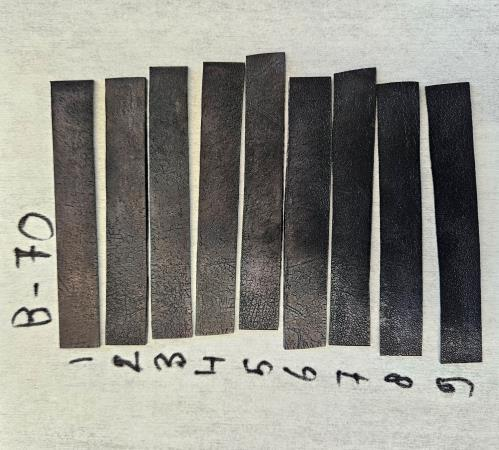

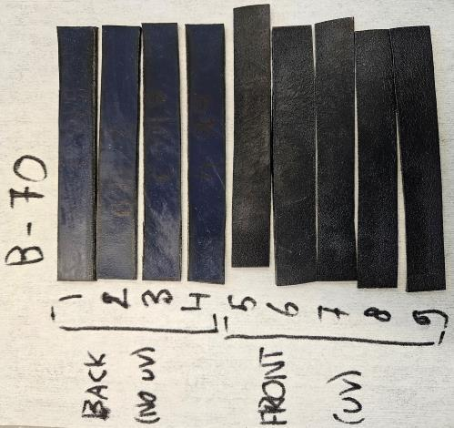

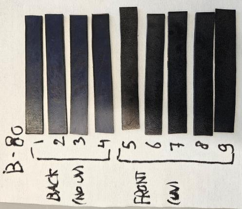

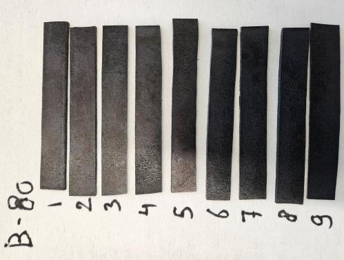

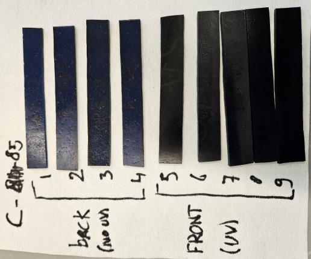

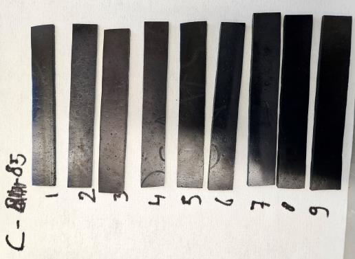

Suggested way forward                                                             #8

- New UV test at lower T to avoid burning
- Suggest condition A1 (chamber T 45, black panel T 70 C)
- Still somewhat elevated temperature to accelerate UV

             degradation, test at RT would limit degradation severely

- Max temperature on minipatches expected to be ~75 C
- NB! Will be measured before test is started

- Samples in UV:
- Minipatches: use `fresh' ones. Not much use for exposed ones in

             new UV test.

- Total matrix:
- Reference (no UV): 1x 90A, 2x 80A, 1x 70A
- 209h UV at A3 condition: 2x 90A, 1x 80A, 1x 70A
- 1000h UV at A1 condition: 1x 90A, 1x 80A, 1x 70A

- Tensile samples: Take out 6 samples per PU type to test now, leave

             3 in per type. Put in 5 fresh ones per type

- Total matrix (per PU type):
- Reference (no UV): 6 samples
- 209h UV at A3: 6 samples
- 1000h UV at A1: 5 samples
- 209h UV at A3 + 1000h at A1: 3 samples

            Have second B70 sheet to include more samples as

                  reference/1000h UV at A1, and to assess effect of pull testing

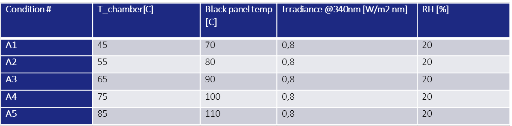

Relevant information from manufacturer                              #9

- To avoid many (expensive) iterations of testing with more

    surprises, it would be good to get as much information on the
    PU as possible from the manufacturer.

- Questions to ask:
- What is the expected thermal stability of the PU? At what

         upper T limit can stress testing be done?

- Is there information (theoretical and/or testing results)

         regarding UV stability of the different PU types?

- Under what sample and test conditions (e.g. sample

         dimensions, pull rate, ambient T, potential
         preconditioning) was the strength of the 90A PU (image on
         right) evaluated?

- Are there any other material parameters that can be

         shared on the material?

- What was the motivation to pick this material for the

         hinges compared to other alternatives?

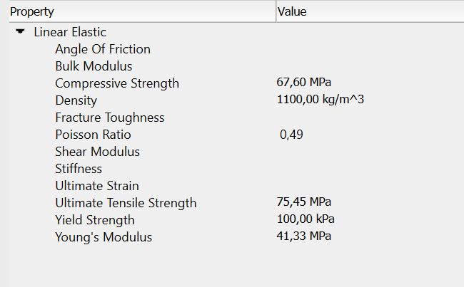

