# Simulation of stresses in Sunlit Sea prototype floater

_Hallvard G. Fjær, Gulshan Noorsumar. Datert 10.04.2026. Konvertert fra `Simulations4SunlitSea01.pdf` med `pdftotext -layout`. Rå tekst-konvertering; PowerPoint-bullets erstattet med `-`._

Simulation of stresses in
Sunlit Sea prototype floater

Hallvard G. Fj�r, Gulshan Noorsumar

10.04.2026

CAD files to FEM mesh

� CAD file on STEP format was received from Sunlit Sea
� Some geometrical details (screw holes in aluminium) were removed in a CAD tool

   before files were imported to MSC PATRAN
� Some details were left out whereas the solids important to the mechanical

   performance were prepared for meshing, and different parts were meshed by TE10
   and HEX20 elements

                                                                                                                                                                                                           2

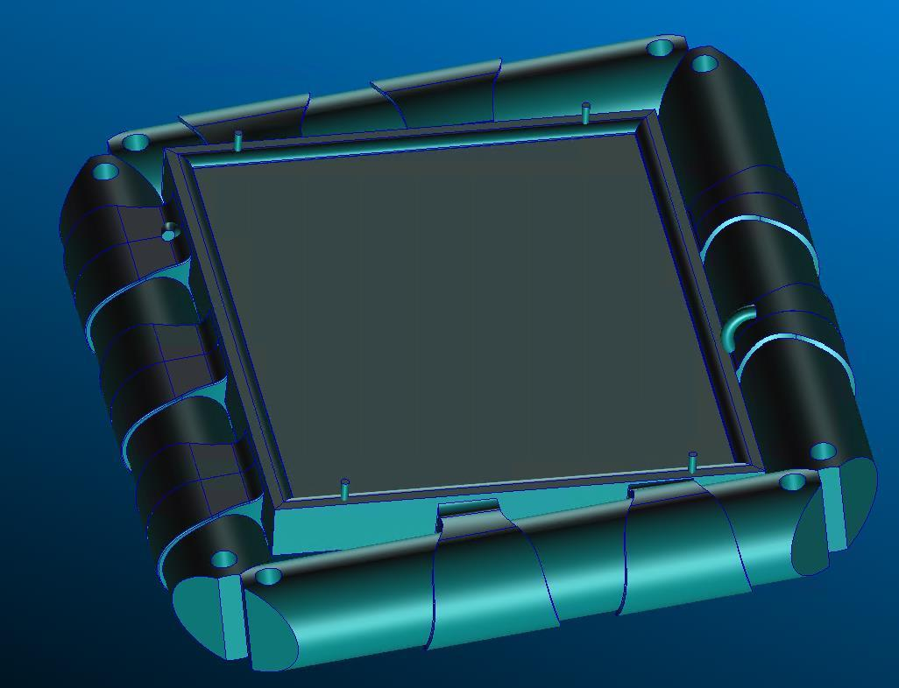

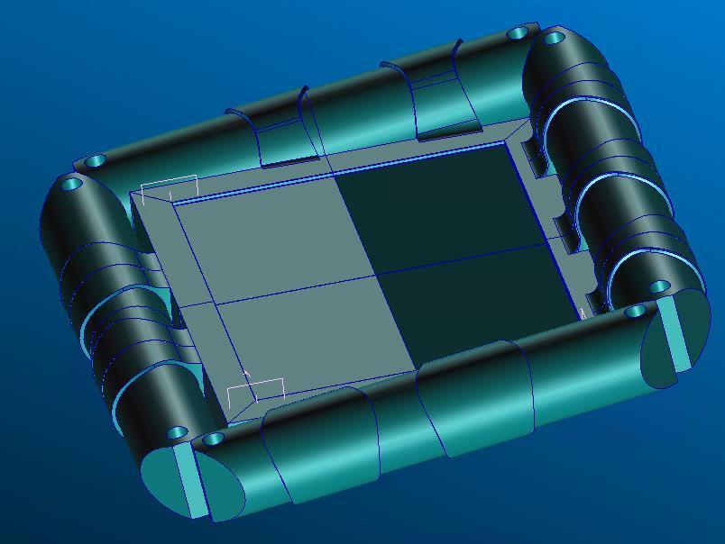

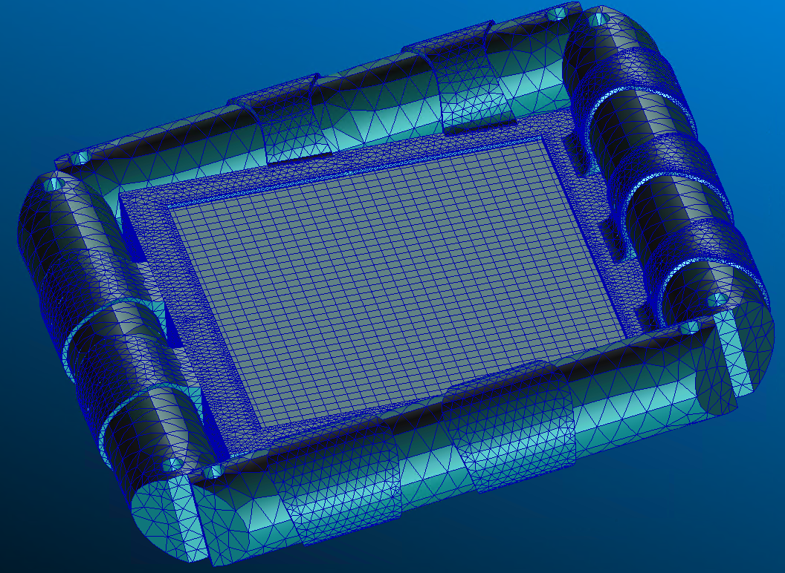

    Different domains    Polyurethane parts
                            Aluminium parts
� Different domains are
   given different
   material properties

� Mechanical
   interactions between
   parts are defined by
   interface boundary
   conditions

         Glass

                                             3

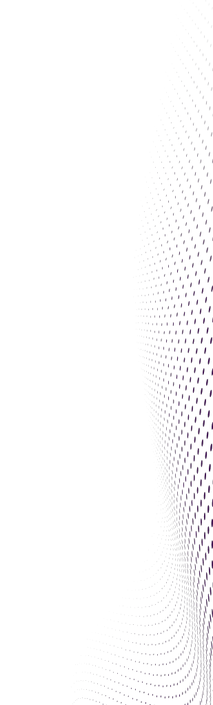

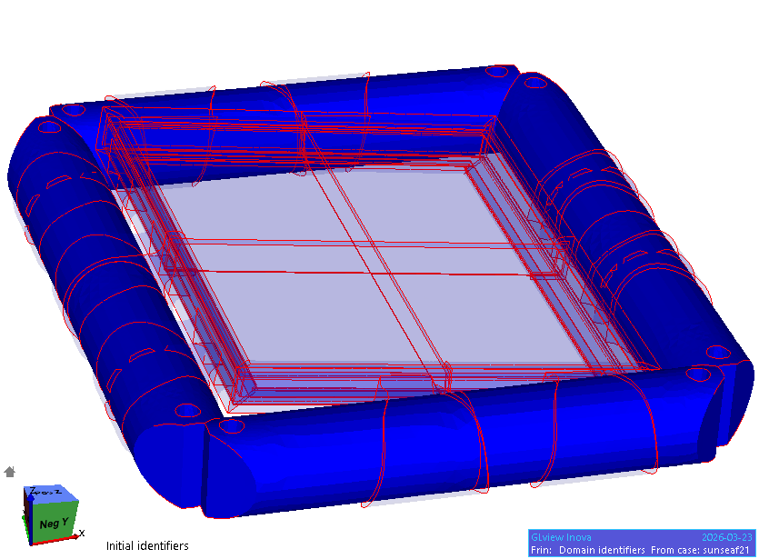

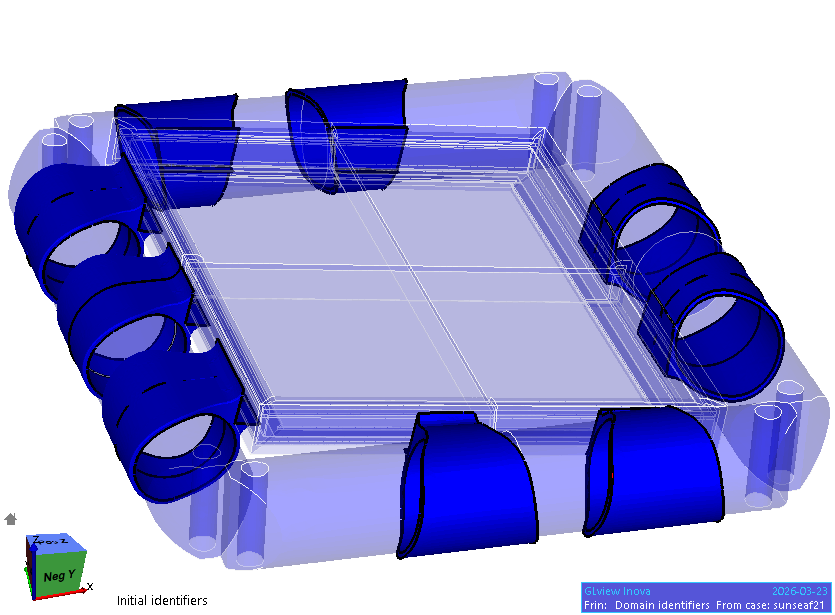

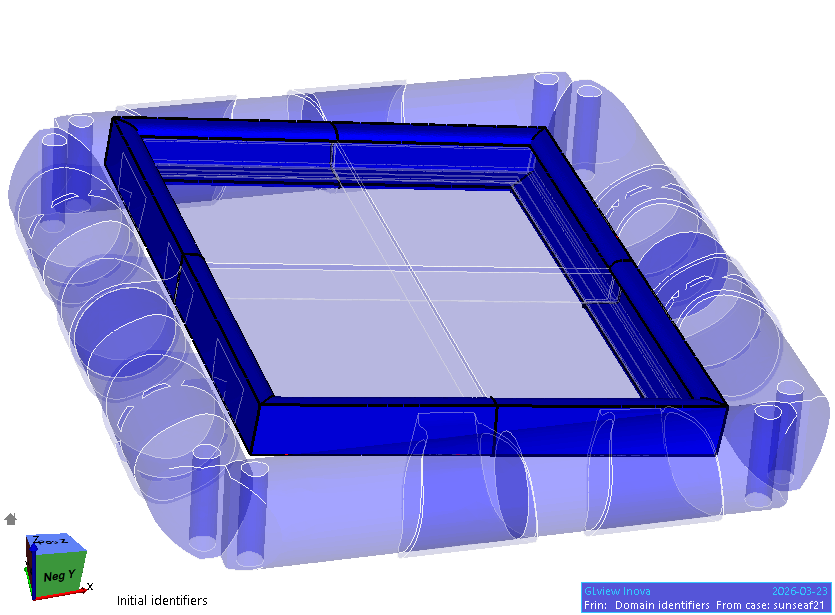

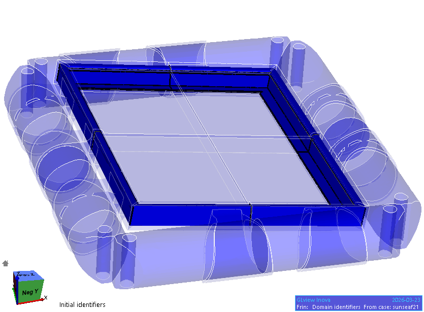

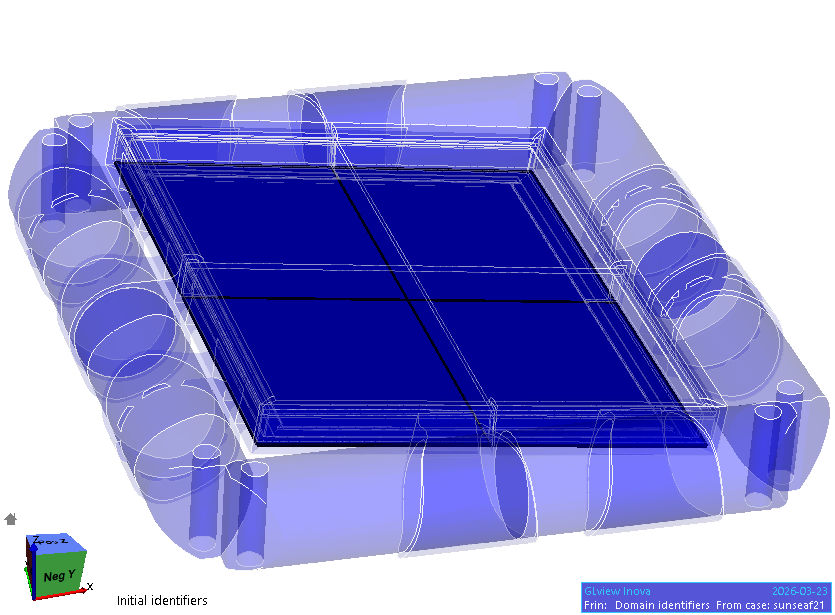

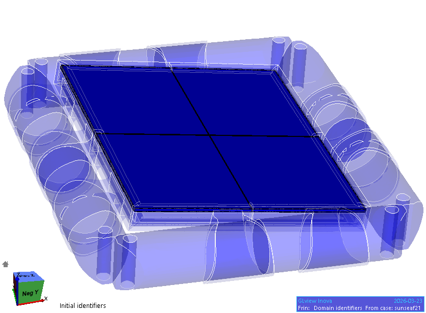

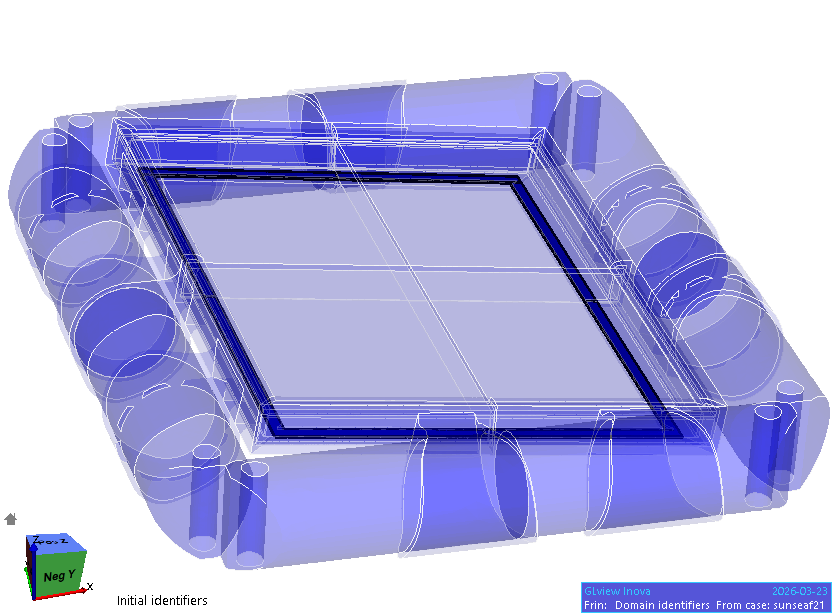

  Rearrangement or expansion of floater components

� With SiSim it is possible to move and copy the different domains.
� To investigate the stresses around a floater rod/hinge, both computing on halves of floaters (left figure) and copy-and-

   paste of floater components (right figure) have been tested. Our experience so far is that it is easier to impose
   reasonable boundary conditions with the latter alternative.
� By adding more copy operations on the input file, it is possible to add a large number of floaters to the solution
   domain, but that will lead to longer computation times.
� With the current prototypes, addressing two connected floating modules is believed to the best choice. With full sized
   modules it could be relevant to include a larger number of modules to investigate relevant effects on a larger scale.
� With the solution domain shown to the right below having 310000 elements and ca 2000000 degrees of freedom, one
   linear analysis step takes about 2.5 minutes.

                                                                                                                                                                                                                  4

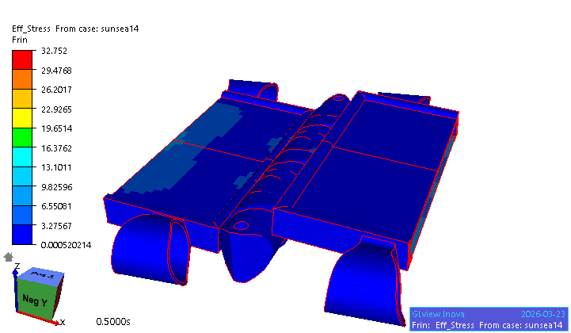

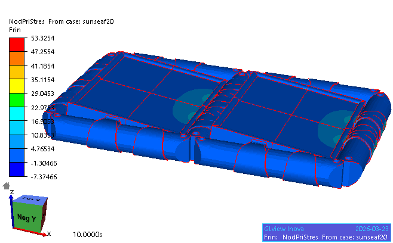

External forces and buoyancy

� It is possible to define constraints/given displacements or distributed forces (pressure) on the outer boundary.
� To have a controlled deformation of the floater it has been found best to impose the displacement (zero or

   evolving) on selected parts of the boundary. Residual forces are then calculated to give the required force to
   yield that given displacement.
� A boundary condition that specifies buoyancy forces from computed vertical position has been implemented.
   This can be used to identity how deep into the water floaters would sink, from their own weight and from
   added loads such as persons stepping on the floaters. The shown figure (water waves added only for
   illustration) indicates that the prototype floater will position itself rather deep into the water causing half of the
   bottom plates of the modules to have directly in contact with the water.

                                                                                                                                                                                                              5

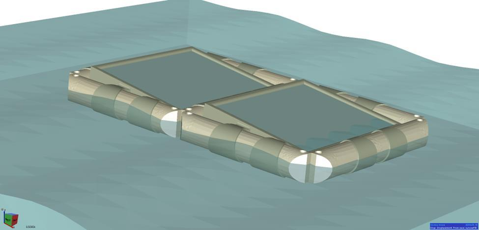

   Buoyancy and inertial effects                                           Vertical displacement of node in central hinge

� A simulation needs a few time steps (or iterations) on boundary                                                                                 6
   conditions to converge. It must identify the part of the surface area
   that is covered by water to set the correct boundary conditions. (red
   curve)

� If inertial effects are added, the initially unbalanced buoyancy force
   will initiate an oscillation. The inertial effects and the wave motion
   in the water is not included, so one could expect these oscillations
   to go on without any dampening. However, numerical dissipation of
   kinetic energy is observed.
   The associated dampening of the oscillations is dependent on the
   size of the time step. With a time step of 0.025 sec (magenta curve
   and video), more than 10 periods can be identified. With longer
   time steps (0.05 sec: green curve and 0.1 sec: blue curve) the
   dampening is stronger.

� The shown period of the oscillations is believed to be strongly
   underestimated. If the hydrodynamic forces from water could be
   represented by an added mass, one might be able to replicate the
   dynamic forces reasonably well with our model.

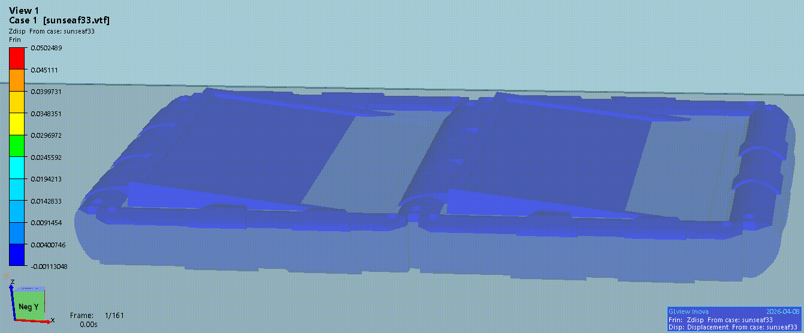

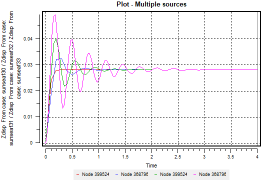

Response to horizontal forces or                                            Horizontal elongation defined by displacement
imposed horizontal elongation                                                                                                 dx=f(t)

Waves, currents and wind forces are expected to induce horizontal                dx=0
forces on an array of floaters. These external forces will in turn lead to
interface forces between the different parts of the floater and internal
stresses in the different domains

Results from simulations both with imposed x-displacements and
localized x-forces are shown here.

The vertical displacements comes mainly from the balance of gravity         Horizontal elongation induced by forces
and buoyancy forces, but they also turn out to be influenced by the                                                         F
torque from the horizontal forces, especially in the case of residual
forces from the constraints defined by the defined displacements

Some small stiffness in the y-direction suppress spurious displacements
in that direction

                                                                            7

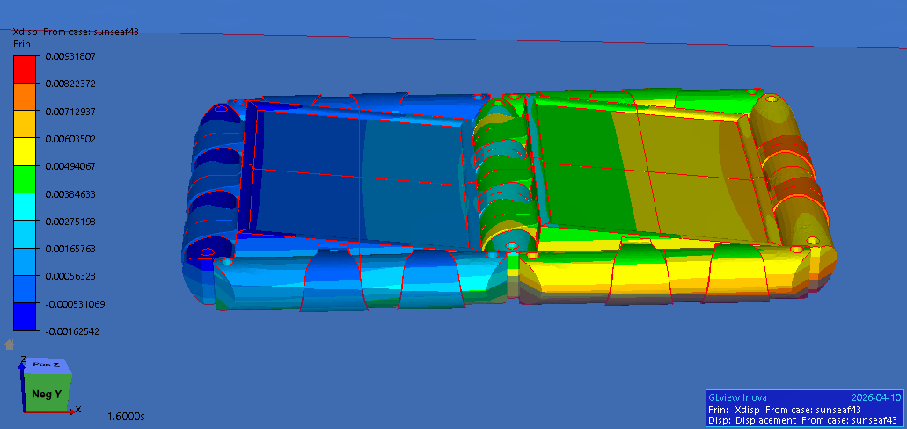

XX stresses from 10 mm imposed xx elongation

The largest xx stresses are seen in
the thin aluminium bottom plate
and in aluminium frame
This is assumed to be mainly due to
the much smaller thickness of the
aluminium plate than the glass.
A considerable difference is seen
between the top and the bottom
surface of both plates.
This indicates that there is some
significant bending of these plates

                                                                                                                                                                                                            8

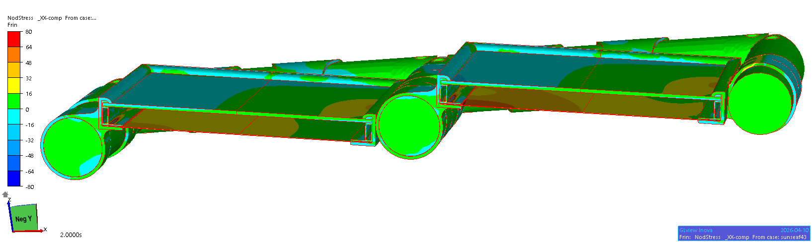

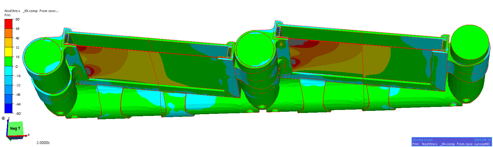

XX stresses and distortions magnified x5

A significant bending of the upper side of the           All parts
aluminium frame is seen, leading to large                  Only glass
stresses both in a flange of the frame and in the        Only aluminium parts
bottom plate                                         Only polyuretane parts

Showing the stress field in the different material
and with their different range of stresses reveals
that the stress in the aluminium is close to the
yield stress level and that the largest stresses
seen in the polyurethane is well above yield.

In the glass, the largest stresses are found at the
upper surface near the attachment of the
polyurethane ring. This maximum stress is also
believed to depend on how the glass is attached
to the aluminium frame

                                                                               9

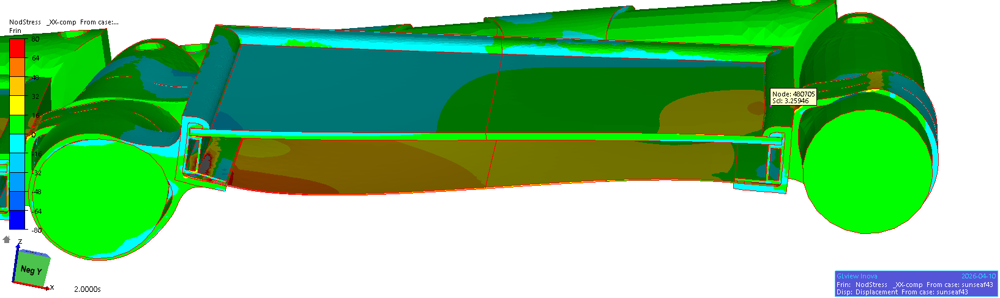

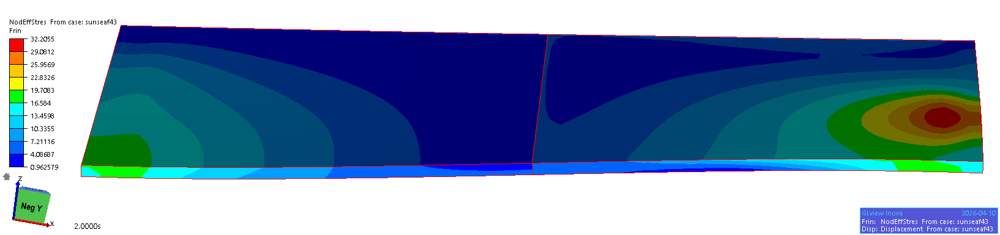

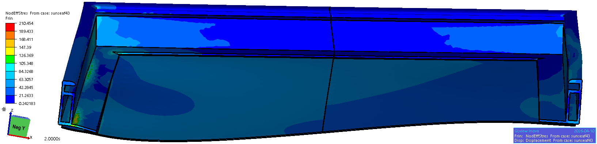

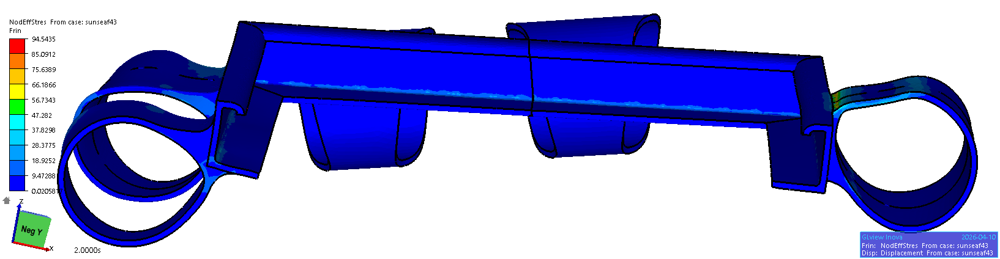

  Glass attachment

The way (here) the glass (actually PV module sandwich) is attached to the
aluminium frame could strongly influence the stresses in the glass and in
the interface between the polyurethane and the glass.
If a rubber inlay is used, or if the glass is allowed to move rather freely in
the slot of the aluminium frame, the stresses in the glass would be
expected to become low, whereas the stresses at the glass/polyurethane
interface could be significant. In the simulations, an interface stiffness of
100 MPa per mm displacement was applied
If the glass is glued to the aluminium, the forces between the aluminium
and the glass would become larger, whereas the stresses at the
glass/polyurethane interface (considered to be critical) could be
significant.
In the simulations an interface stiffness of 100 MPa per mm
displacement was applied - considered as a rather stiff connection

                                                                                                                                                                                                                    10

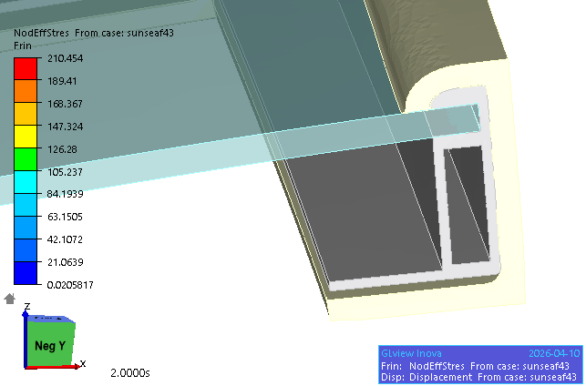

