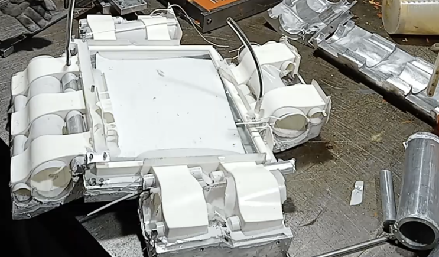
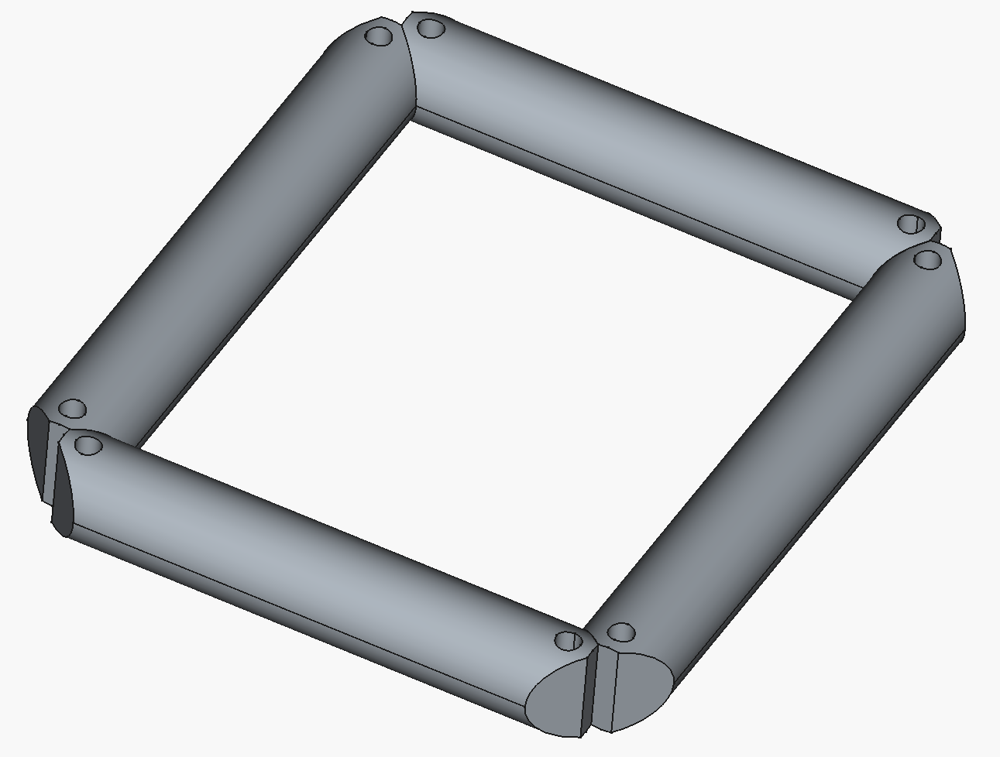
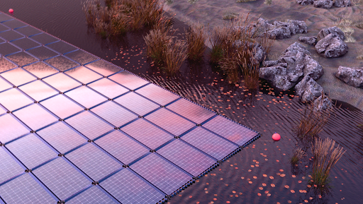

## WP6 — what was committed (DoW)

**Overall goal:** Build an integrated model chain — aluminium pressing simulation, structural FEM, thermal CFD, and LCA — and use it to drive multi-dimensional optimisation of Sunlit's floater design.

**TRL commitment:** TRL 2 → TRL 6

**Key KPIs:**

- 50% reduction in aluminium material consumption
- ~3% thermal loss reduction (~6°C lower operating temperature)
- SSC5 structural validation

## On track — milestone status

| Milestone | Status |
|---|---|
| D6.1 — model chain architecture + pressing pipeline | Delivered |
| Pressing simulation pipeline | Complete — ~3,900 runs; 1,300 Pareto-filtered candidates |
| First full CAD → FEM → redesign loop | Complete (P3 → P4) |
| Gen2 prototype development | P3 built and under test; P4 design closed |

WP6 is on track with all DoW commitments at first review.

## D6.1 — what's been delivered

D6.1 documents the model chain architecture and delivers first modelling results:

- **Interfaces defined** — 19 physical component interfaces (I1–I19) and 6 model-to-model data interfaces (I-1 to I-6)
- **Pressing pipeline** — ~3,900 forming simulations; 1,300 Pareto-filtered geometries ready for multi-domain screening in D6.2
- **Structural FEM** — first SiSim analysis on P3 by IFE complete; load paths and failure modes identified
- **Thermal CFD** — model built and run for Gen2 geometry; result already driving a production decision
- **Screening methodology** — four-domain pass/fail framework defined; execution is the D6.2 headline deliverable

## KPI progress

| KPI | Target | Evidence at first review |
|---|---|---|
| Aluminium reduction | 50% | Pressing pipeline operational; 1,300 candidates span 0.8–1.5 mm range; quantified reduction delivered in D6.2 |
| Thermal loss | ~3% / 6°C | CFD drives colour change: worst-case hinge temp drops **83.8°C → 48.3°C**; implemented in Gen2 |
| SSC5 structural | Validated | IFE FEM confirms infill critical; P4 redesign complete; validated FEM with infill in D6.2 |

## The model chain in practice — first complete loop

The core WP6 claim is that modelling drives design decisions. This loop has been completed once:

1. P3 geometry built in parametric FreeCAD
2. STEP file exported to IFE (interface I-2)
3. IFE ran SiSim FEM — 10 mm imposed horizontal elongation
4. Findings: insufficient freeboard; aluminium and PU near/above yield; glass attachment sensitive to mounting method
5. Findings drove P4: hinge geometry revised, buoyant PU rods on all four sides, load paths rerouted away from PU–glass interfaces

This is the TRL advancement the DoW describes.

## IFE findings → P4 design responses

Each IFE finding maps to a concrete P4 design change:

| IFE finding | Design response in P4 |
|---|---|
| Al and PU near/above yield (simulated without infill — deliberate) | Infill confirmed structurally necessary; PU foam with adhesive bonding selected for next FEM run |
| Insufficient freeboard / deep submergence | Rod dimensions adjusted; angled bottom plate under evaluation to shift float toward water surface |
| Glass stresses sensitive to panel–frame attachment | Hinge redesigned to route loads away from PU–glass and PU–Al interfaces; attachment method treated as explicit variable in next simulation |

## P3 — built, mold-to-cast workflow validated

:::: {.columns}
::: {.column width="50%"}
- Metal mold produced and cast — the FreeCAD → 3D-print → metal mold → PU cast workflow is proven end to end
- Full P3 sample now in UV chamber at IFE; loose hinges in tensile and shear testing
- PU tensile + UV degradation running at revised A1 protocol (~75°C max on samples) for clean 1000 h dataset
:::
::: {.column width="50%"}
{width="100%"}
:::
::::

## P4 — design closed, casting upcoming

:::: {.columns}
::: {.column width="50%"}
Design changes from IFE findings now locked in:

- Hinge geometry revised — load transfer shifted toward centre, away from PU–glass and PU–Al interfaces
- Buoyant PU foam rods on all four sides — dual function: connector and added buoyancy
- Infill redesigned — puzzle-fit multi-piece PU foam eliminates air cavities around junction boxes

Mold designed in FreeCAD; 3D-printed mold trial upcoming.
:::
::: {.column width="50%"}
{width="100%"}
:::
::::

## D6.2 — completing the chain

Each of the ~1,300 pressing candidates is evaluated across four domains in sequence. Pass/fail at each stage reduces the pool to a design short-list:

1. **Manufacturing feasibility** — already filtered in D6.1
2. **Structural** — peak stresses from SiSim (interfaces I-2 / I-3)
3. **Thermal** — peak PU temperature from CFD (interface I-4)
4. **Life-cycle impact** — material and process data to TNO LCA (interface I-5)

All four interfaces will be implemented by D6.2:

| Interface | D6.1 status | D6.2 target |
|---|---|---|
| I-2: CAD → FEM (STEP) | Manual, demonstrated | Automated; STEP version and simplifications documented |
| I-3: Thickness field → FEM | Defined | Implemented: LS-DYNA → SiSim/PATRAN |
| I-4: Geometry → thermal CFD | Manual, demonstrated | Formalised; material property list agreed with IFE |
| I-5: Design data → LCA | Ad hoc | Versioned template; functional unit and system boundary confirmed |

## Summary

- **D6.1 delivered** — model chain architecture, pressing pipeline, first FEM and CFD results
- **First model loop completed** — CAD → FEM → findings → revised design working in practice
- **Thermal CFD drives a production decision** — 83.8°C → 48.3°C; off-white PU implemented in Gen2
- **Prototype on schedule** — P3 built and under test; P4 design closed
- **D6.2 roadmap clear** — four interfaces to be implemented; 1,300 candidates screened; design recommendation produced

{width="80%"}
