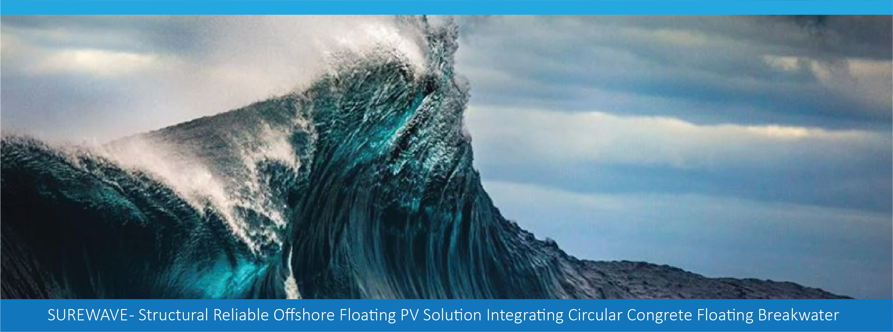
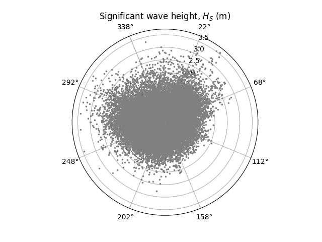
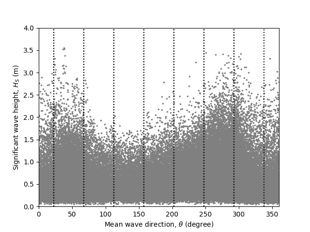
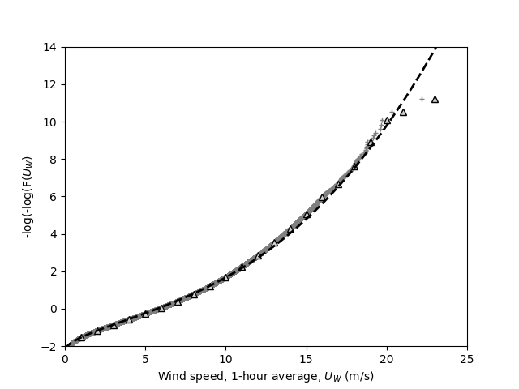
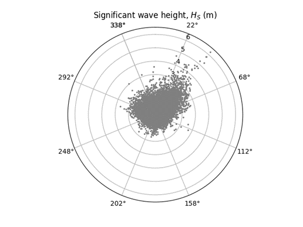
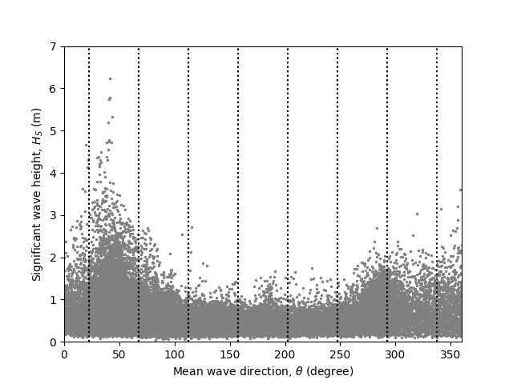
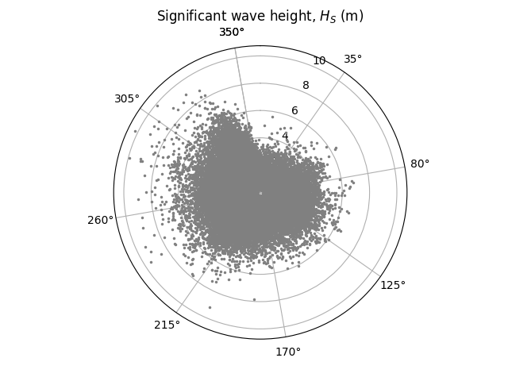
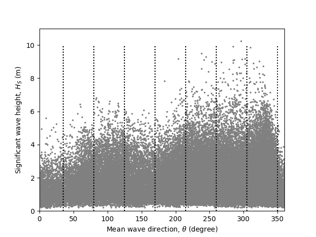

> Source: `SUREWAVE_D2.1_Use_case_scenario.docx` — Document date: 2023-01-31 — Converted: 2026-09-28 via pandoc/pdftotext

---

##### 

Deliverable number: D2.1

{width="8.245833333333334in" height="3.0701388888888888in"}

**Title: Use case scenario basis for typical, rough location**

# **Disclaimer:**  {#disclaimer .TOC-Heading}

The SUREWAVE project is Funded by the European Union. Views and opinions expressed are however those of the author(s) only and do not necessarily reflect those of the European Union. Neither the European Union nor the granting authority can be held responsible for them

Deliverable details

  ---------- -------- ------------------------------------------------------
  **WP**     2        

  **Task**   D2.1     Use case scenario basis for typical, rough location
  ---------- -------- ------------------------------------------------------

  ------------------------- ------ -- -------------------------- ----------------------
  **Dissemination level**   PU        **Due delivery date**      

  **Deliverable type**      R         **Actual delivery date**   31.01.2023
  ------------------------- ------ -- -------------------------- ----------------------

  -------------------------------- ---------------------------------------------
  **Lead beneficiary**             **SINTEF**

  **Contributing beneficiaries**   
  -------------------------------- ---------------------------------------------

  ---------------------- ------------ ------------------------ ------------------------
  **Document Version**   **Date**     **Author**               **Comments**0F0F0F[^1]

  1.0                    03.01.2023   Balram Panjwani          Draft version

  1.1                    20.01.2023   Bjørn Riise              First version

  1.2                    24.01.2023   Virgile Delhaye          Revision-1

  1.3                    25.01.2023   Joep van der Zanden      Revision-2

  2.0                    30.01.2023   Bjørn Riise              Second version

  2.1                    31.01.2023   Tim Bunnik               Revision-1

  3.0                    31.01.2023   Balram Panjwani          Final version
  ---------------------- ------------ ------------------------ ------------------------

+-------------------------------------------------------------------------------------------------------------------------------------------------+
| **Dissemination level**                                                                                                                         |
+:====================================+:==========================================================================================================+
| PU                                  | Public- fully open                                                                                        |
+-------------------------------------+-----------------------------------------------------------------------------------------------------------+
| SEN                                 | SEN = Sensitive -- limited under the conditions of the Grant Agreement                                    |
+-------------------------------------+-----------------------------------------------------------------------------------------------------------+
| EU classified                       | EU classified -- restraint -- UE/EU-restricted, confidential, secret-UE/EU secret under Decision 2015/444 |
+-------------------------------------+-----------------------------------------------------------------------------------------------------------+
| **Deliverable type**                                                                                                                            |
+-------------------------------------+-----------------------------------------------------------------------------------------------------------+
| R:                                  | Document, report (excluding the periodic and final reports)                                               |
+-------------------------------------+-----------------------------------------------------------------------------------------------------------+
| DEM:                                | Demonstrator, pilot, prototype, plan designs                                                              |
+-------------------------------------+-----------------------------------------------------------------------------------------------------------+
| DEC:                                | Websites, patents filing, press & media actions, videos, etc.                                             |
+-------------------------------------+-----------------------------------------------------------------------------------------------------------+
| OTHER:                              | Software, technical diagram, etc.                                                                         |
+-------------------------------------+-----------------------------------------------------------------------------------------------------------+

**EXECUTIVE SUMMARY**

A set of Metocean design criteria, based on three sites located in European Waters, for further use in the SUREWAVE project work, have been defined. The locations, as listed in [Table 1](#_Ref125978510), are chosen to include both mild and harsh environmental conditions, including wave directionality and conditions where wind *U~W~* \> 25 m/s, current *U~C~* \> 1.2 m/s, and maximum wave height *H~max~* \> 14 m have been considered.

+-----------------------+-----------------+-----------------+-----------------------+----------------------------------------------------+-------+
| **Region**            | **Coordinates** | **Water depth** | ***H~S,median~* (m)** | **Extreme values; R = 50 years**                   |       |
|                       |                 |                 |                       |                                                    |       |
|                       |                 | **(m)**         |                       |                                                    |       |
|                       |                 |                 |                       +----------------+----------------+------------------+       |
|                       |                 |                 |                       | ***H~S~* (m)** | ***T~P~* (s)** | ***u~W~* (m/s)** |       |
+:=====================:+:===============:+:===============:+:=====================:+:==============:+:==============:+:================:+:=====:+
| Baltic Sea            | 54°12\'N        | 16              | 0.6                   | 4.4            | 9.6            | 22.4             | Mild  |
|                       |                 |                 |                       |                |                |                  |       |
|                       | 4°24\'E         |                 |                       |                |                |                  |       |
+-----------------------+-----------------+-----------------+-----------------------+----------------+----------------+------------------+-------+
| Western Mediterranean | 39°00\'N        | 38              | 0.5                   | 7.0            | 11.7           | 20.8             | Mid   |
|                       |                 |                 |                       |                |                |                  |       |
|                       | 0°00\'E         |                 |                       |                |                |                  |       |
+-----------------------+-----------------+-----------------+-----------------------+----------------+----------------+------------------+-------+
| Greater               | 56°54\'N        | 49              | 1.6                   | 12.3           | 14.8           | 26.0             | Harsh |
|                       |                 |                 |                       |                |                |                  |       |
| North Sea             | 5°00\'E         |                 |                       |                |                |                  |       |
+-----------------------+-----------------+-----------------+-----------------------+----------------+----------------+------------------+-------+

: []{#_Ref125978510 .anchor}Table 1 Relevant locations in semi-open European waters

**Deliverable Review**

+----------------------------------------------------------------------------------+-----------------+---------------------------------------+-----------------+-----------------+---------------------------------------+-----------------+
|                                                                                  | **Reviewer #1: Bjørn Riise**                                              | **Reviewer #2: Virgile Delhaye**                                          |
|                                                                                  +-----------------+---------------------------------------+-----------------+-----------------+---------------------------------------+-----------------+
|                                                                                  | **Answer**      | **Comments**                          | **Type\***      | **Answer**      | **Comments**                          | **Type\***      |
+----------------------------------------------------------------------------------+-----------------+---------------------------------------+-----------------+-----------------+---------------------------------------+-----------------+
| 1.  Is the deliverable in accordance with                                                                                                                                                                                                |
+----------------------------------------------------------------------------------+-----------------+---------------------------------------+-----------------+-----------------+---------------------------------------+-----------------+
| (i) The Description of Work?                                                     | Yes             |                                       | M               | Yes             |                                       | M               |
|                                                                                  |                 |                                       |                 |                 |                                       |                 |
|                                                                                  | No              |                                       | m               | No              |                                       | m               |
|                                                                                  |                 |                                       |                 |                 |                                       |                 |
|                                                                                  |                 |                                       | a               |                 |                                       | a               |
+----------------------------------------------------------------------------------+-----------------+---------------------------------------+-----------------+-----------------+---------------------------------------+-----------------+
| (ii) The international State of the Art?                                         | Yes             | *Not applicable for this deliverable* | M               | Yes             | *Not applicable for this deliverable* | M               |
|                                                                                  |                 |                                       |                 |                 |                                       |                 |
|                                                                                  | No              |                                       | m               | No              |                                       | m               |
|                                                                                  |                 |                                       |                 |                 |                                       |                 |
|                                                                                  |                 |                                       | a               |                 |                                       | a               |
+----------------------------------------------------------------------------------+-----------------+---------------------------------------+-----------------+-----------------+---------------------------------------+-----------------+
| 2.  Is the quality of the deliverable in a status                                                                                                                                                                                        |
+----------------------------------------------------------------------------------+-----------------+---------------------------------------+-----------------+-----------------+---------------------------------------+-----------------+
| (i) That allows it to be sent to European Commission?                            | Yes             |                                       | M               | Yes             |                                       | M               |
|                                                                                  |                 |                                       |                 |                 |                                       |                 |
|                                                                                  | No              |                                       | m               | No              |                                       | m               |
|                                                                                  |                 |                                       |                 |                 |                                       |                 |
|                                                                                  |                 |                                       | a               |                 |                                       | a               |
+----------------------------------------------------------------------------------+-----------------+---------------------------------------+-----------------+-----------------+---------------------------------------+-----------------+
| (ii) That needs improvement of the writing by the originator of the deliverable? | Yes             |                                       | M               | Yes             |                                       | M               |
|                                                                                  |                 |                                       |                 |                 |                                       |                 |
|                                                                                  | No              |                                       | m               | No              |                                       | m               |
|                                                                                  |                 |                                       |                 |                 |                                       |                 |
|                                                                                  |                 |                                       | a               |                 |                                       | a               |
+----------------------------------------------------------------------------------+-----------------+---------------------------------------+-----------------+-----------------+---------------------------------------+-----------------+
| (iii) That need further work by the Partners responsible for the deliverable?    | Yes             |                                       | M               | Yes             |                                       | M               |
|                                                                                  |                 |                                       |                 |                 |                                       |                 |
|                                                                                  | No              |                                       | m               | No              |                                       | m               |
|                                                                                  |                 |                                       |                 |                 |                                       |                 |
|                                                                                  |                 |                                       | a               |                 |                                       | a               |
+----------------------------------------------------------------------------------+-----------------+---------------------------------------+-----------------+-----------------+---------------------------------------+-----------------+

\* Type of comments: M = Major comment; m = minor comment; a = advice

# Table of Contents {#table-of-contents .TOC-Heading}

[1. Introduction [4](#introduction)](#introduction)

[2. Methodology [5](#methodology)](#methodology)

[Hindcast data [5](#hindcast-data)](#hindcast-data)

[Directional dependence [5](#directional-dependence)](#directional-dependence)

[Long-term variability and definition of extremes [5](#long-term-variability-and-definition-of-extremes)](#long-term-variability-and-definition-of-extremes)

[Extreme wind [5](#extreme-wind)](#extreme-wind)

[Extreme waves [6](#extreme-waves)](#extreme-waves)

[Operational data [7](#operational-data)](#operational-data)

[Wave spectra [7](#wave-spectra)](#wave-spectra)

[Extreme current [8](#extreme-current)](#extreme-current)

[Marine growth [8](#marine-growth)](#marine-growth)

[3. Site-specific wind and wave conditions [9](#site-specific-wind-and-wave-conditions)](#site-specific-wind-and-wave-conditions)

[General [9](#general)](#general)

[Baltic Sea 54°12\'N 14°24\'E (Mild) [10](#baltic-sea-5412n-1424e-mild)](#baltic-sea-5412n-1424e-mild)

[Western Mediterranean 39°00\'N 0°00\'E (Mid) [14](#western-mediterranean-3900n-000e-mid)](#western-mediterranean-3900n-000e-mid)

[Greater North Sea - 56°54\'N 5°00\'E (Harsh) [18](#greater-north-sea---5654n-500e-harsh)](#greater-north-sea---5654n-500e-harsh)

[4. Power production estimate [22](#power-production-estimate)](#power-production-estimate)

[5. References [22](#references)](#references)

# Introduction {#introduction .SUREWAVE}

The SUREWAVE project is developing a breakwater concept for floating photovoltaic (FPV), suited for offshore conditions, typically with wind speed \> 25 m/s, current \>1.2 m/s, and wave height \> 14 m.

The objective of this document is to define a set of Metocean design criteria, based on sites located in European Waters, for further use in the SUREWAVE project work. The locations are chosen to include both mild and harsh environmental conditions, including wave directionality and locations where the wind *U~W~* \> 25 m/s, the current *U~C~* \> 1.2 m/s, and the maximum wave height *H~max~* \> 14 m.

The present work comprises:

- chose a set of relevant locations,

- provide hindcast data for the locations, and

- establish a set of Metocean design criteria in agreement with DNV RP0584

Further design criteria are described in the project deliverable D2.3 "High level understanding of the system general loads".

The project work and deliverables focus on chosen critical elements and it is not providing a full set of design criteria. Furthermore, the document, data, and results are for project use only, and any use of the data and/or results takes place without any form of guarantee. Partners outside the SUREWAVE consortium require written permission to use the data.

[Table 2](#_Ref125015627) lists applicable rules and regulations, standards, recommended practices, and other relevant references. Where no specific design criteria have been defined, the design should comply with DNV-RP-0584 or other applicable Norwegian standards and regulations. In case of a conflict between documents, this should be discussed and a solution should be agreed on. Typically, the hierarchy is as follows: applicable rules and regulations, company-specified criteria, and DNV-RP-0584.

[]{#_Ref125015627 .anchor}Table 2 Applicable rules, regulations, standards, recommendations, and references

+---------------------------------------------------------------------------------------------------------------------------------------------------------------------------------------------------------------------------------------------------------------------------------------+
| - DNV-RP-0584, Design, development and operation of floating solar photovoltaic systems                                                                                                                                                                                               |
+=======================================================================================================================================================================================================================================================================================+
| - DNV-RP-C205, Environmental loads and conditions                                                                                                                                                                                                                                     |
+---------------------------------------------------------------------------------------------------------------------------------------------------------------------------------------------------------------------------------------------------------------------------------------+
| - Haver, S., and Winterstein, S. R. (2008), Environmental Contour Lines: A Method for Estimating Long Term Extremes by a Short Term Analysis, DOI: <https://doi.org/10.5957/SMC-2008-067>)                                                                                            |
|                                                                                                                                                                                                                                                                                       |
| - NORSOK N-003:2017, Actions and action effects                                                                                                                                                                                                                                       |
|                                                                                                                                                                                                                                                                                       |
| - M. Dörenkämper, D. van der Werf, K. Sinapis, M.M. de Jong, W. Folkerts (2019), Influence of Wave Induced Movements on the Performance of Floating PV Systems, 36th European Photovoltaic Solar Energy Conference and Exhibition, 1759 -- 1762 (doi:10.4229/EUPVSEC20192019-6DO.9.1) |
+---------------------------------------------------------------------------------------------------------------------------------------------------------------------------------------------------------------------------------------------------------------------------------------+

# Methodology  {#methodology .SUREWAVE}

## Hindcast data {#hindcast-data .surewave_sub}

The European Centre for Medium-Range Weather Forecasts (ECMWF) provides the ERA5 hourly hindcast data. For each of the chosen locations data with a time step of 3 hours and for a total of 25 years have been obtained and used to establish the wind and wave criteria.

## Directional dependence  {#directional-dependence .surewave_sub}

Directions are given in degrees clockwise from (true) north. For wind and waves the directions are taken from the data. I.e., wind and waves of 90 degrees are coming from the east.

The wave data are grouped into 8 directional sectors, each with a size of 45 degrees, defined by their mid-point. I.e., sector 0 is spanning from -22.5 to 22.5 degrees and has a midpoint at the north, while sector 90 spans from 67.5 to 112.5 degrees and has a midpoint at the east.

## Long-term variability and definition of extremes {#long-term-variability-and-definition-of-extremes .surewave_sub}

To account for the long-term variability the contour line method (IFORM approach ref. Haver, Winterstein 2008, and DNV-RP-C205 section 3.6 Long term wave statistics and section 3.7.2 Metocean contours) have been used to establish the *H~S~* - *T~P~* dependence for the extreme values.

## Extreme wind {#extreme-wind .surewave_sub}

Based on the hindcast data a long-term model (Weibull is established for each location, providing *U~W~* (1-hour average), where extreme values for return periods of 1, 5, and 50 years.

The Weibull distribution is given by

$F_{U_{W}}\left( u_{W} \right) = 1 - \exp\left( - \left( \frac{u_{W} - \gamma}{\alpha}\  \right)^{\beta} \right)$,

Where; $\beta$ is Shape parameters in Weibull distribution; $u_{W}\$ is one-hour average velocity; $\gamma$ is the location parameter in the 3-parameter Weibull distribution; $\alpha$ is the scale parameters in the Weibull distribution

A logarithmic wind speed profile can be taken for neutral atmospheric conditions which is expressed as

$$u_{W}(z) = \frac{u^{*}}{k_{a}} \cdot log(\frac{z}{z_{0}})$$

where $k_{a}$ = 0.4 is von Karman's constant, z is the height and$\ z_{0}$ is the roughness length. For offshore locations, the roughness parameter $z_{0}$ typically varies between 0.0001 m in open sea without waves and 0.01 m in coastal areas with onshore wind. The roughness parameter for offshore locations may be solved implicitly from the following equation (DNV-RP-C205).

$$z_{0} = \frac{A_{C}}{g} \cdot \left( \frac{k_{a}u_{W}(z)}{log(\frac{z}{z_{0}})} \right)$$

where g is the acceleration of gravity and $A_{C}$ is Charnock's constant. $A_{C}$ is usually higher for "young" developing and rapidly growing waves than for "old" fully developed waves. For open sea with fully developed waves, $A_{C}$ = 0.011-0.014 is recommended.

As an alternative to the logarithmic wind profile, a power law profile may be assumed. The wind speed *u* as a function of height above mean water level *z* is given by (DNV-RP-C205)

$u_{W}(z) = u_{w}\left( z_{ref} \right) \cdot \left( \frac{z}{z_{ref}} \right)^{\alpha}$,

where α=0.12, and *u~W~(z~ref~)* is the velocity at the reference height *z~ref~* = 10 m

## Extreme waves {#extreme-waves .surewave_sub}

Based on the hindcast data a long-term joint model (Weibull, Lognormal) is established for each location, providing *H~S~* - *T~P~* (3-hour sea states) contours where extreme sea states can be extracted for return periods of 1, 5, and 50 years. Where H~S~ is a significant wave height and T~P~ is the wave period

Applying binned sea state data, the marginal long-term variability for *H~S~* is modeled using a Weibull distribution, and the conditional long-term variability for *T~P~* is modelled using a lognormal distribution and subsequently the Metocean contours are found.

The Weibull distribution is given by

$F_{H_{S}}\left( h_{S} \right) = 1 - \exp\left( - \left( \frac{h_{S} - \gamma}{\alpha}\  \right)^{\beta} \right)$,

and the lognormal distribution is given by

$f_{T_{P}|H_{S}}\left( t_{P} \middle| h_{S} \right) = \frac{1}{\sigma t_{P}\sqrt{2\pi}}\exp\left( - \frac{\left( \ln{t_{P} - \mu} \right)^{2}}{2\sigma^{2}} \right)\$,

were

$\mu = E\left\lbrack \ln T_{P} \right\rbrack = a_{0} + a_{1}H_{S}^{a_{2}}$, and

$\sigma = std\left\lbrack \ln T_{P} \right\rbrack = b_{0} + b_{1}exp(b_{2}H_{S})$.

The parameters for the Weibull $(\gamma,\ \alpha,\ \beta)$ and lognormal distributions ${(\ a}_{0},\ b_{1},\ {b_{2}\ b}_{0})$ are found by the least square fitting to the data. The parameter *b~0~* is defined from both the data and engineering judgment. The parameter *a~0~* is found from the omnidirectional data. Both the Weibull and the lognormal distribution parameters are listed below for the chosen locations (see [Table 5](#_Ref125974731), [Table 12](#_Ref125976110), and [Table 18](#_Ref125048875)).

The characteristic largest crest-to-trough wave height *H~max,c~* in a stationary sea state of duration t may be taken as

$$H_{max,c} = 0.5H_{S}\sqrt{(1 - \rho)\ln{(t/T_{Z})}\ }\ ;\ \ where\ \rho = 0.73,\ t = 3\ hour,\ $$

and the most probable individual wave period *T~H\ max~* = 1.16*T~Z~*. Considering a return period of 50 years for the harshest locations *H~max,c~* \> 14 m.

For reference, the steepness curve as found in DNV-RP-C205 is given by

$$S_{P} = \frac{2\pi}{g}\frac{{\ H}_{S}}{T_{P}^{2}};S_{P} = \frac{1}{15}\ for\ T_{P} \leq 8\ s,\ S_{P} = \frac{1}{25}for\ T_{P} \geq 15\ s,\ and\ linearly\ interpolated\ in\ between$$

Where $S_{P}$ is Average wave steepness; $T_{P}$ is peak period

## Operational data {#operational-data .surewave_sub}

For fatigue analyses the 25 years\' time-series can be used either directly or using binned data.

## Wave spectra {#wave-spectra .surewave_sub}

For irregular waves, the wind sea and swell should be based on a JONSWAP spectrum given by (DNV-RP-C205)

$S_{J}(\omega) = A_{\gamma}\frac{5}{16} \cdot H_{S}^{2} \cdot \omega_{P}^{4} \cdot \omega^{- 5}\exp\left( - \frac{5}{4} \cdot \left( \frac{\omega}{\omega_{P}\ } \right)^{- 4} \right) \cdot {\ \gamma}^{\exp\left( - 0.5 \cdot \left( \frac{{\omega - \omega}_{P}}{\sigma \cdot \omega_{P}} \right)^{2} \right)}$,

where

$\sigma = 0.07\ for\ \omega \leq \omega_{P}$, $\sigma = 0.09\ for\ \omega > \omega_{P}$, and $A_{\gamma} = 1 - 0.287 \cdot \ln\gamma$.

$\omega$ = Wave angular frequency

$\omega_{P}$ = Angular spectral peak frequency

$\sigma\ \$= Spectral width parameters

$\gamma$ = Non-dimensional peak shape parameter

$A_{\gamma}$ = Normalizing factor.

If not specified the peak shape parameter γ for wind sea is found based on *H~S~* and *T~P~* and they are given by

$\gamma = 5\ \ for\ \ T_{P}/\sqrt{H_{S}} \leq 3.6$,

$\gamma = \exp\left( 5.75 - 1.15\frac{T_{P}}{\sqrt{H_{S}}} \right)\ for\ 3.6 < T_{P}/\sqrt{H_{S}} < 5$, and

$\gamma = 1\ \ for\ \ 5 \leq T_{P}/\sqrt{H_{S}}$,

while for swell *\*
$$\gamma = 10$$

To include the effect of separate wind sea and swell, two separate JONSWAP spectra should be used. The individual significant wave height and gamma should be found as proposed by Torsethaugen and Haver (2004), also given in DNV RP-C205, appendix A. The distinction between wind and swell dominate sea states is given by

$$T_{f} = a_{f}H_{S}^{1/3},\ with\ a_{f} = 5.3$$

The factor $a_{f}$ depends on the fetch length

For wind-dominated sea (*T~P~*≤*T~f~*)

$$H_{S1} = r_{pw}H_{S},\ \ T_{P1} = T_{P},\ \ \gamma = 35\left( 1 + {3.5exp}\left( - H_{S} \right) \right)\left( \frac{2\pi H_{S1}}{gT_{P}^{2}}\  \right)^{0.857}$$

$$H_{S2} = \ \sqrt{1 - r_{pw}^{2}}H_{S},\ \ T_{P2} = T_{f} + 2,\ \ \gamma = 1,\ \ and\ $$

$$r_{pw} = 0.7 + 0.3\exp{( - \left( 2\frac{T_{f} - T_{P}}{T_{f} - 2\sqrt{}H_{S}} \right)^{2})}.$$

While for swell-dominated sea (*T~P~*\>*T~f~*)

$$H_{S1} = r_{ps}H_{S},\ \ T_{P1} = T_{P},\ \ \gamma = 35\left( 1 + {3.5exp}\left( - H_{S} \right) \right)\left( \frac{2\pi H_{S1}}{gT_{P}^{2}}\  \right)^{0.857}(1 + 6\frac{T_{P} - T_{f}}{25 - T_{f}})$$

$$H_{S2} = \ \sqrt{1 - r_{ps}^{2}}H_{S},\ \ T_{P2} = a_{f}H_{S2}^{1/3},\ \ \gamma = 1,\ \ and\ $$

$$r_{ps} = 0.6 + 0.4\exp\left( - \left( \frac{T_{P} - T_{f}}{0.3\left( 25 - T_{f} \right)} \right)^{2} \right).$$

Where;

$H_{S1}$ is Primary peak

$H_{S2}$ is Primary peak

## Extreme current {#extreme-current .surewave_sub}

For a return period of 50 years a current velocity *u~C~* = 1.2 m/s, with a constant vertical profile, should be applied. For a return period of 5 years a 10 percent reduction, i.e., *u~C~* = 1.08 m/s, may be used.

Current from all directional sectors should be combined with waves from all directional sectors. 50 years current should be combined with 5 years wind and waves, and that 5 years current should be combined with 50 years wind and waves. See [Table 3](#_Ref125015700) for design values.

  -----------------------------------------------------------------------
                 Return period                   Velocity, *u~C~* (m/s)
  -------------------------------------------- --------------------------
                    50 years                              1.2

                    5 years                               1.08
  -----------------------------------------------------------------------

  : []{#_Ref125015700 .anchor}Table 3 Current velocity u~C~ which should represent return periods of 5 and 50 years.

## Marine growth {#marine-growth .surewave_sub}

For design analyses a layer of marine growth should be included. If found and available, site-specific data should be used. If the site-specific data are not available then data, as given in [Table 3](#_Ref125973130), from NORSOK N-003 may be used. [Table 4](#_Ref125973130) provides the maximum thickness and density as a function of water depth. For further details and values for deeper waters see NORSOK N-003 section 6.11.1.

The mass of marine growth should be added to both the structural mass and the hydrodynamics added mass in the analysis. Both zero and maximum thicknesses should be assessed. For fatigue analyses the thickness may increase linearly to the given value over a period of 2 years. Otherwise, the most severe of zero and maximum thickness should be applied.

  -----------------------------------------------------------------------
    **Water depth (m)**     **Thickness (mm)**       **Density kg/m3**
  ----------------------- ----------------------- -----------------------
         Above +2                    0                      \-

         -15 to +2                  60                     1325

        -30 to -15                  50                     1325

        -40 to -30                  40                     1325

        -60 to -40                  30                     1100

       -100 to --60                 20                     1100
  -----------------------------------------------------------------------

  : []{#_Ref125973130 .anchor}Table 4 Marine growth, thickness and density, as a function of water depth.

# Site-specific wind and wave conditions {#site-specific-wind-and-wave-conditions .SUREWAVE}

## General {#general .surewave_sub}

Although SUREWAVE developing an FPV concept for harsh offshore conditions (wind speed \> 25 m/s, current \>1.2 m/s, and wave height \> 14 m), the concept needs to be evaluated in mild conditions which are more frequent than the harsh conditions. Considering the different regions of semi open waters around European, as shown in [Figure 1](#_Ref87877047), a total of three locations are evaluated and used to establish a set of design conditions. The three chosen locations are defined as mild, mid, and harsh conditions, as listed in [Table 5](#_Ref125974200).

![[]{#_Ref87877047 .anchor}Figure 1 European waters](../images/2023-01-31_surewave_d2.1_use_case_scenario/image4.png){width="5.191663385826772in" height="4.725259186351706in"}

+-----------------------+------------------+-----------------+-----------------------+----------------------------------------------------+-------+
| **Region**            | **Coordinates**  | **Water depth** | ***H~S,median~* (m)** | **Extreme values; R = 50 years**                   |       |
|                       |                  |                 |                       |                                                    |       |
|                       |                  | **(m)**         |                       |                                                    |       |
|                       |                  |                 |                       +----------------+----------------+------------------+       |
|                       |                  |                 |                       | ***H~S~* (m)** | ***T~P~* (s)** | ***u~W~* (m/s)** |       |
+:=====================:+:================:+:===============:+:=====================:+:==============:+:==============:+:================:+:=====:+
| Baltic Sea            | 54°12\'N 4°24\'E | 16              | 0.6                   | 4.4            | 9.6            | 22.4             | Mild  |
+-----------------------+------------------+-----------------+-----------------------+----------------+----------------+------------------+-------+
| Western Mediterranean | 39°00\'N 0°00\'E | 38              | 0.5                   | 7.0            | 11.7           | 20.8             | Mid   |
+-----------------------+------------------+-----------------+-----------------------+----------------+----------------+------------------+-------+
| Greater               | 56°54\'N 5°00\'E | 49              | 1.6                   | 12.3           | 14.8           | 26.0             | Harsh |
|                       |                  |                 |                       |                |                |                  |       |
| North Sea             |                  |                 |                       |                |                |                  |       |
+-----------------------+------------------+-----------------+-----------------------+----------------+----------------+------------------+-------+

: []{#_Ref125974200 .anchor}Table 5 Relevant locations in semi-open European waters

## Baltic Sea 54°12\'N 14°24\'E (Mild) {#baltic-sea-5412n-1424e-mild .surewave_sub}

The location 54°12\'N 14°24\'E in the Baltic Sea region is shown in [Figure 2](#_Ref125973882), and the directional significant wave heights *H~S~* for that location are shown in [Figure 3](#_Ref125974383).

![[]{#_Ref125973882 .anchor}Figure 2 Location 54°12\'N 14°24\'E, in region Baltic](../images/2023-01-31_surewave_d2.1_use_case_scenario/image5.jpeg){width="5.0in" height="2.9479166666666665in"}

  --------------------------------------------------------------------------------------------------------------------------------------------------------------------
  {width="2.601851487314086in" height="2.654038713910761in"}   {width="3.537037401574803in" height="2.6527777777777777in"}
  --------------------------------------------------------------------------------- ----------------------------------------------------------------------------------

  --------------------------------------------------------------------------------------------------------------------------------------------------------------------

  : []{#_Ref125974383 .anchor}Figure 3 Directional wave data for for location 54°12\'N 14°24\'E, in region Baltic Sea, significant wave height H~S~ (m) as a function of mean wave direction ϴ (°).

Firstly, all wave data are applied to establish an omnidirectional joint model, as shown in [Figure 4](#_Ref125974583). These parameters and extreme values as listed in [Table 6](#_Ref125974731), [Table 7](#_Ref125974733), and [Table 8](#_Ref125974740).

It is found challenging to find a good fit for the steepest waves (left side of the contour), and it is found acceptable to use the least conservative of the calculated contour line and the DNV steepness curve.

![[]{#_Ref125974583 .anchor}Figure 4 Omnidirectional scatter diagram (H~S~-T~P~) and joint distribution model (Weibull -- Lognormal) for location 54°12\'N 14°24\'E, in region Baltic Sea. Contour lines for R = 1 year (dotted line), 5 years (dashed line) and 50 years (solid line) and DNV RP-C205 steepness criteria (dotted line) and DNV RP-0584 lower and upper bound (dashed line).](../images/2023-01-31_surewave_d2.1_use_case_scenario/image8.png){width="5.0in" height="3.75in"}

+-----------------------------+---------------------------------------------------------------------------+
| **Weibull**                 | **Lognormal**                                                             |
+:=======:+:=======:+:=======:+:==========:+:==========:+:==========:+:==========:+:========:+:==========:+
| **α**   | **β**   | **γ**   | ***a~0~*** | ***a~1~*** | ***a~2~*** | ***b~0~*** | ***b1*** | ***b~2~*** |
+---------+---------+---------+------------+------------+------------+------------+----------+------------+
| 0.636   | 1.339   | 0.094   | 0.6813     | 0.794      | 0.4703     | 0.025      | 0.244    | -0.3322    |
+---------+---------+---------+------------+------------+------------+------------+----------+------------+

: []{#_Ref125974731 .anchor}Table 6 Omnidirectional distribution parameters for H~S~-T~P~ joint model (Baltic Sea 54°12\'N 14°24\'E (Mild))

+-----------------+-------------------------+-------------------------+-------------------------+
|                 | **R = 1 year**          | **R = 5 years**         | **R = 50 years**        |
+:===============:+:==========:+:==========:+:==========:+:==========:+:==========:+:==========:+
|                 | ***H~S~*** | ***T~P~*** | ***H~S~*** | ***T~P~*** | ***H~S~*** | ***T~P~*** |
+-----------------+------------+------------+------------+------------+------------+------------+
| Fit to all data | 3.1        | 7.5        | 3.5        | 8.2        | 4.1        | 9.2        |
+-----------------+------------+------------+------------+------------+------------+------------+

: []{#_Ref125974733 .anchor}Table 7 Omnidirectional extreme sea state (H~S~-T~P~) values (Baltic Sea 54°12\'N 14°24\'E (Mild))

+----------------+----------------------------------+--------------------------------------------------+-----------------+
| ***H~S~* (m)** | ***T~P~* (s)**                   | ***T~P~* (s); return period, R (years)**         | ***Steepness*** |
|                |                                  |                                                  |                 |
|                |                                  |                                                  | ***criteria***  |
|                |                                  |                                                  |                 |
|                |                                  |                                                  | ***(RP-C205)*** |
|                +----------+------------+----------+----------------+----------------+----------------+                 |
|                | **Mean** | **Median** | **Mode** | **R = 1**      | **R = 5**      | **R = 50**     |                 |
+:==============:+:========:+:==========:+:========:+:==============:+:==============:+:==============:+:===============:+
| 0.5            | 3.6      | 3.5        | 3.3      | 1.6            | 1.5            | 1.3            | 2.2             |
+----------------+----------+------------+----------+----------------+----------------+----------------+-----------------+
| 1              | 4.5      | 4.4        | 4.2      | 2.3            | 2.1            | 1.9            | 3.1             |
+----------------+----------+------------+----------+----------------+----------------+----------------+-----------------+
| 1.5            | 5.2      | 5.2        | 5        | 3.1            | 2.8            | 2.6            | 3.8             |
+----------------+----------+------------+----------+----------------+----------------+----------------+-----------------+
| 2              | 6        | 5.9        | 5.8      | 4              | 3.7            | 3.4            | 4.4             |
+----------------+----------+------------+----------+----------------+----------------+----------------+-----------------+
| 2.5            | 6.8      | 6.7        | 6.6      | 5.2            | 4.8            | 4.3            | 4.9             |
+----------------+----------+------------+----------+----------------+----------------+----------------+-----------------+
| 3              | 7.5      | 7.5        | 7.4      | 6.8            | 6              | 5.4            | 5.4             |
+----------------+----------+------------+----------+----------------+----------------+----------------+-----------------+
| 3.5            | 8.3      | 8.3        | 8.2      |                |                | 6.7            | 5.8             |
+----------------+----------+------------+----------+----------------+----------------+----------------+-----------------+
| 4              | 9.1      | 9.1        | 9        |                |                | 8.3            | 6.2             |
+----------------+----------+------------+----------+----------------+----------------+----------------+-----------------+

: []{#_Ref125974740 .anchor}Table 8 Omnidirectional peak period **T~P~** estimates for given significant wave height **H~S~** (Baltic Sea 54°12\'N 14°24\'E (Mild))

Secondly, the directional data are used to establish a directional joint model for the waves, with parameters listed in [Table 9](#_Ref128580819) , and extreme values listed in [Table 10](#_Ref128580828). Also included in the table are omnidirectional extreme values as found from the integrated annual probability of exceedance from all directional sectors.

+--------------------------------------------------+------------------------------------------------------------------------------------------------------------+
| **Sector**                                       | **Distribution parameters**                                                                                |
+:============:+:======================:+:========:+:========:+:========:+:========:+:==========:+:==========:+:==========:+:==========:+:========:+:==========:+
| **Centre**   | **Boundaries**         | **Prb.** | **Weibull**                    | **Lognormal**                                                             |
|              |                        |          |                                |                                                                           |
| **ϴ~C~ (°)** | **(ϴ~L~ - ϴ~U~\] (°)** | **(%)**  |                                |                                                                           |
|              |                        |          +----------+----------+----------+------------+------------+------------+------------+----------+------------+
|              |                        |          | **α**    | **β**    | **γ**    | ***a~0~*** | ***a~1~*** | ***a~2~*** | ***b~0~*** | ***b1*** | ***b~2~*** |
+--------------+------------------------+----------+----------+----------+----------+------------+------------+------------+------------+----------+------------+
| 0            | -22.5 - 22.5           | 8.5      | 0.613    | 1.23     | 0.051    | 0.6813     | 0.9214     | 0.3736     | 0.025      | 0.2998   | -0.7768    |
+--------------+------------------------+----------+----------+----------+----------+------------+------------+------------+------------+----------+------------+
| 45           | 22.5 - 67.5            | 17.9     | 0.533    | 1.152    | 0.148    | 0.6813     | 0.9779     | 0.3954     | 0.025      | 0.3438   | -0.7789    |
+--------------+------------------------+----------+----------+----------+----------+------------+------------+------------+------------+----------+------------+
| 90           | 67.5 - 112.5           | 9.1      | 0.463    | 1.224    | 0.116    | 0.6813     | 0.761      | 0.5084     | 0.025      | 0.339    | -0.4594    |
+--------------+------------------------+----------+----------+----------+----------+------------+------------+------------+------------+----------+------------+
| 135          | 112.5 - 157.5          | 6.8      | 0.524    | 1.559    | 0.07     | 0.6813     | 0.5997     | 0.6456     | 0.025      | 0.2373   | -1.395     |
+--------------+------------------------+----------+----------+----------+----------+------------+------------+------------+------------+----------+------------+
| 180          | 157.5 - 202.5          | 9.6      | 0.493    | 1.284    | 0.128    | 0.6813     | 0.63       | 0.5761     | 0.025      | 0.1359   | -0.9651    |
+--------------+------------------------+----------+----------+----------+----------+------------+------------+------------+------------+----------+------------+
| 225          | 202.5 - 247.5          | 12.4     | 0.689    | 1.528    | 0.087    | 0.6813     | 0.6393     | 0.5278     | 0.025      | 0.1551   | -1.0548    |
+--------------+------------------------+----------+----------+----------+----------+------------+------------+------------+------------+----------+------------+
| 270          | 247.5 - 292.5          | 19.5     | 0.856    | 1.588    | 0.073    | 0.6813     | 0.7426     | 0.4377     | 0.025      | 0.2887   | -1.0759    |
+--------------+------------------------+----------+----------+----------+----------+------------+------------+------------+------------+----------+------------+
| 315          | 292.5 - 337.5          | 16.1     | 0.619    | 1.261    | 0.105    | 0.6813     | 0.8534     | 0.4007     | 0.025      | 0.2376   | -1.0014    |
+--------------+------------------------+----------+----------+----------+----------+------------+------------+------------+------------+----------+------------+

: []{#_Ref128580819 .anchor}Table 9 Directional sectors and joint distribution model parameters for HS-TP, location 56°54\'N 5°00\'E

+--------------------------------------------------+---------------------------------------------------------------------------------------------------------------+
| **Sector**                                       | ***H~S~* (m) and *T~P~* (S); Return period R**                                                                |
+:============:+:======================:+:========:+:===========:+:===========:+:===========:+:===========:+:===========:+:===========:+:===========:+:===========:+
| **Centre**   | **Boundaries**         | **Prb.** | **R = 1 year**            | **R = 5 years**           | **R = 50 years**          | **ULS^1)^**               |
|              |                        |          |                           |                           |                           |                           |
| **ϴ~C~ (°)** | **(ϴ~L~ - ϴ~U~\] (°)** | **(%)**  |                           |                           |                           |                           |
|              |                        |          +-------------+-------------+-------------+-------------+-------------+-------------+-------------+-------------+
|              |                        |          | ***H~S~***  | ***T~P~***  | ***H~S~***  | ***T~P~***  | ***H~S~***  | ***T~P~***  | ***H~S~***  | ***T~P~***  |
+--------------+------------------------+----------+-------------+-------------+-------------+-------------+-------------+-------------+-------------+-------------+
| 0            | -22.5 - 22.5           | 8.5      | 2.5         | 7.2         | 3.1         | 8           | 3.9         | 9.1         | 4.3         | 9.7         |
+--------------+------------------------+----------+-------------+-------------+-------------+-------------+-------------+-------------+-------------+-------------+
| 45           | 22.5 - 67.5            | 17.9     | 2.8         | 8.5         | 3.3         | 9.6         | 4.1         | 11.0        | 4.4         | 9.6         |
+--------------+------------------------+----------+-------------+-------------+-------------+-------------+-------------+-------------+-------------+-------------+
| 90           | 67.5 - 112.5           | 9.1      | 2.0         | 5.8         | 2.4         | 6.5         | 3.0         | 7.5         | 3.4         | 8.1         |
+--------------+------------------------+----------+-------------+-------------+-------------+-------------+-------------+-------------+-------------+-------------+
| 135          | 112.5 - 157.5          | 6.8      | 1.6         | 4.4         | 1.9         | 4.9         | 2.2         | 5.4         | 2.4         | 5.8         |
+--------------+------------------------+----------+-------------+-------------+-------------+-------------+-------------+-------------+-------------+-------------+
| 180          | 157.5 - 202.5          | 9.6      | 2.0         | 5.1         | 2.4         | 5.7         | 3.0         | 6.5         | 3.3         | 6.9         |
+--------------+------------------------+----------+-------------+-------------+-------------+-------------+-------------+-------------+-------------+-------------+
| 225          | 202.5 - 247.5          | 12.4     | 2.3         | 5.3         | 2.7         | 5.8         | 3.2         | 6.4         | 3.4         | 6.7         |
+--------------+------------------------+----------+-------------+-------------+-------------+-------------+-------------+-------------+-------------+-------------+
| 270          | 247.5 - 292.5          | 19.5     | 2.8         | 6.4         | 3.2         | 6.8         | 3.8         | 7.5         | 4.1         | 7.8         |
+--------------+------------------------+----------+-------------+-------------+-------------+-------------+-------------+-------------+-------------+-------------+
| 315          | 292.5 - 337.5          | 16.1     | 2.7         | 7.1         | 3.2         | 7.8         | 4.0         | 8.7         | 4.4         | 9.6         |
+--------------+------------------------+----------+-------------+-------------+-------------+-------------+-------------+-------------+-------------+-------------+
| Omni (integrated)                     |          | 3.2         | 7.7         | 3.7         | 8.5         | 4.4         | 9.6         |             |             |
+---------------------------------------+----------+-------------+-------------+-------------+-------------+-------------+-------------+-------------+-------------+

: []{#_Ref128580828 .anchor}Table 10 Directional sectors and extreme sea states (HS-TP) location 56°54\'N 5°00\'E

1)  Minimum of calculated equivalent characteristic(R=200) value and the omni-directional value, R=50 (N-003)

Thirdly, all wind data are applied to establish a marginal distribution as shown in [Figure 5](#_Ref128580944), with parameters and extreme values as listed in [Table 11](#_Ref128580930).

{width="5.0in" height="3.75in"}

[]{#_Ref128580944 .anchor}Figure 5 Marginal distribution of 1-hour average wind speed U~W~ for location the Region Greater North Sea, 56°54\'N 5°00\'E

+---------------------------+--------+-----------------------------------------------------------+
| **Weibull parameters**    |        | ***U~W~(m/s); return period***                            |
+:===========:+:===========:+:======:+:================:+:=================:+:==================:+
| **α**       | **β**       | **γ**  | ***R = 1 year*** | ***R = 5 years*** | ***R = 50 years*** |
+-------------+-------------+--------+------------------+-------------------+--------------------+
| 8.233       | 2.526       | -0.312 | 19.4             | 20.7              | 22.4               |
+-------------+-------------+--------+------------------+-------------------+--------------------+

: []{#_Ref128580930 .anchor}Table 11 Omnidirectional distribution parameters and extreme values for 1 hour wind speed

## Western Mediterranean 39°00\'N 0°00\'E (Mid) {#western-mediterranean-3900n-000e-mid .surewave_sub}

The location 39°00\'N 0°00\'E in the Western Mediterranean region is shown in [Figure 6](#_Ref125975785), and the directional significant wave heights *H~S~* for that location are shown in [Figure 7](#_Ref125975790).

![[]{#_Ref125975785 .anchor}Figure 6 Location 39°00\'N 0°00\'E, in region Western Mediterranean.](../images/2023-01-31_surewave_d2.1_use_case_scenario/image10.jpg){width="5.129553805774278in" height="2.949494750656168in"}

  ------------------------------------------------------------------------------------------------------------------------------------------------------------------------
  {width="2.708647200349956in" height="2.7777777777777777in"}   {width="3.6927405949256342in" height="2.7738331146106736in"}
  ----------------------------------------------------------------------------------- ------------------------------------------------------------------------------------

  ------------------------------------------------------------------------------------------------------------------------------------------------------------------------

  : []{#_Ref125975790 .anchor}Figure 7 Directional wave data for for location 39°00\'N 0°00\'E, in region Western Mediterranean, significant wave height H~S~ (m) as a function of mean wave direction ϴ (°).

Firstly, all wave data are applied to establish an omnidirectional joint model, as shown in [Figure 8](#_Ref125976166), and with parameters and extreme values as listed in [Table 12](#_Ref125976110), [Table 13](#_Ref125976111), and [Table 14](#_Ref125976113).

It is found challenging to find a good fit for the steepest waves (left side of the contour), and it is found acceptable to use the least conservative of the calculated contour line and the DNV steepness curve.

![[]{#_Ref125976166 .anchor}Figure 8 Omnidirectional scatter diagram (H~S~-T~P~) and joint distribution model (Weibull -- Lognormal) for location 39°00\'N 0°00\'E, in region Western Mediterranean. Contour lines for R = 1 year (dotted line), 5 years (dashed line) and 50 years (solid line) and DNV RP-C205 steepness criteria (dotted line) and DNV RP-0584 lower and upper bound (dashed line).](../images/2023-01-31_surewave_d2.1_use_case_scenario/image13.png){width="5.0in" height="3.75in"}

+-----------------------------+---------------------------------------------------------------------------+
| **Weibull**                 | **Lognormal**                                                             |
+:=======:+:=======:+:=======:+:==========:+:==========:+:==========:+:==========:+:========:+:==========:+
| **α**   | **β**   | **γ**   | ***a~0~*** | ***a~1~*** | ***a~2~*** | ***b~0~*** | ***b1*** | ***b~2~*** |
+---------+---------+---------+------------+------------+------------+------------+----------+------------+
| 0.163   | 0.673   | 0.392   | 0.0187     | 1.7219     | 0.1792     | 0.025      | 0.3566   | -0.3853    |
+---------+---------+---------+------------+------------+------------+------------+----------+------------+

: []{#_Ref125976110 .anchor}Table 12 Omnidirectional distribution parameters for H~S~-T~P~ joint model (Western Mediterranean 39°00\'N 0°00\'E (Mid))

+-----------------+-------------------------+-------------------------+-------------------------+
|                 | **R = 1 year**          | **R = 5 years**         | **R = 50 years**        |
+:===============:+:==========:+:==========:+:==========:+:==========:+:==========:+:==========:+
|                 | ***H~S~*** | ***T~P~*** | ***H~S~*** | ***T~P~*** | ***H~S~*** | ***T~P~*** |
+-----------------+------------+------------+------------+------------+------------+------------+
| Fit to all data | 4.0        | 9.1        | 5.1        | 10.1       | 6.8        | 11.6       |
+-----------------+------------+------------+------------+------------+------------+------------+

: []{#_Ref125976111 .anchor}Table 13 Omnidirectional extreme sea state (H~S~-T~P~) values (Western Mediterranean 39°00\'N 0°00\'E (Mid))

+----------------+----------------------------------+--------------------------------------------------+-----------------+
| ***H~S~* (m)** | ***T~P~* (s)**                   | ***T~P~* (s); return period, R (years)**         | ***Steepness*** |
|                |                                  |                                                  |                 |
|                |                                  |                                                  | ***criteria***  |
|                |                                  |                                                  |                 |
|                |                                  |                                                  | ***(RP-C205)*** |
|                +----------+------------+----------+----------------+----------------+----------------+                 |
|                | **Mean** | **Median** | **Mode** | **R = 1**      | **R = 5**      | **R = 50**     |                 |
+:==============:+:========:+:==========:+:========:+:==============:+:==============:+:==============:+:===============:+
| 0.5            | 4.9      | 4.7        | 4.2      | 1.6            | 1.4            | 1.2            | 2.2             |
+----------------+----------+------------+----------+----------------+----------------+----------------+-----------------+
| 1              | 5.9      | 5.7        | 5.3      | 2.5            | 2.2            | 1.9            | 3.1             |
+----------------+----------+------------+----------+----------------+----------------+----------------+-----------------+
| 1.5            | 6.7      | 6.5        | 6.2      | 3.5            | 3.1            | 2.7            | 3.8             |
+----------------+----------+------------+----------+----------------+----------------+----------------+-----------------+
| 2              | 7.3      | 7.2        | 6.9      | 4.5            | 4              | 3.6            | 4.4             |
+----------------+----------+------------+----------+----------------+----------------+----------------+-----------------+
| 2.5            | 7.9      | 7.8        | 7.6      | 5.5            | 5              | 4.5            | 4.9             |
+----------------+----------+------------+----------+----------------+----------------+----------------+-----------------+
| 3              | 8.4      | 8.3        | 8.1      | 6.6            | 6              | 5.4            | 5.4             |
+----------------+----------+------------+----------+----------------+----------------+----------------+-----------------+
| 3.5            | 8.9      | 8.8        | 8.7      | 7.7            | 6.9            | 6.2            | 5.8             |
+----------------+----------+------------+----------+----------------+----------------+----------------+-----------------+
| 4              | 9.3      | 9.3        | 9.2      |                | 7.8            | 7              | 6.2             |
+----------------+----------+------------+----------+----------------+----------------+----------------+-----------------+
| 4.5            | 9.7      | 9.7        | 9.6      |                | 8.7            | 7.8            | 6.6             |
+----------------+----------+------------+----------+----------------+----------------+----------------+-----------------+
| 5              | 10.2     | 10.1       | 10.1     |                | 9.8            | 8.6            | 6.9             |
+----------------+----------+------------+----------+----------------+----------------+----------------+-----------------+
| 5.5            | 10.6     | 10.5       | 10.5     |                |                | 9.3            | 7.3             |
+----------------+----------+------------+----------+----------------+----------------+----------------+-----------------+
| 6              | 11       | 10.9       | 10.9     |                |                | 10             | 7.6             |
+----------------+----------+------------+----------+----------------+----------------+----------------+-----------------+
| 6.5            | 11.3     | 11.3       | 11.3     |                |                | 10.8           | 7.9             |
+----------------+----------+------------+----------+----------------+----------------+----------------+-----------------+

: []{#_Ref125976113 .anchor}Table 14 Omnidirectional peak period **T~P~** estimates for given significant wave height **H~S~**

Secondly, the directional data are used to establish a directional joint model for the waves, with parameters listed in [Table 15](#_Ref125976548), and extreme values listed in [Table 16](#_Ref125976559). Also included in the table are omnidirectional extreme values as found from the integrated annual probability of exceedance from all directional sectors.

+--------------------------------------------------+------------------------------------------------------------------------------------------------------------+
| **Sector**                                       | **Distribution parameters**                                                                                |
+:============:+:======================:+:========:+:========:+:========:+:========:+:==========:+:==========:+:==========:+:==========:+:========:+:==========:+
| **Centre**   | **Boundaries**         | **Prb.** | **Weibull**                    | **Lognormal**                                                             |
|              |                        |          |                                |                                                                           |
| **ϴ~C~ (°)** | **(ϴ~L~ - ϴ~U~\] (°)** | **(%)**  |                                |                                                                           |
|              |                        |          +----------+----------+----------+------------+------------+------------+------------+----------+------------+
|              |                        |          | **α**    | **β**    | **γ**    | ***a~0~*** | ***a~1~*** | ***a~2~*** | ***b~0~*** | ***b1*** | ***b~2~*** |
+--------------+------------------------+----------+----------+----------+----------+------------+------------+------------+------------+----------+------------+
| 0            | -22.5 - 22.5           | 3.5      | 0.429    | 0.906    | 0.345    | 0.0187     | 1.6793     | 0.1821     | 0.025      | 0.487    | -0.5864    |
+--------------+------------------------+----------+----------+----------+----------+------------+------------+------------+------------+----------+------------+
| 45           | 22.5 - 67.5            | 27.2     | 0.240    | 0.717    | 0.521    | 0.0187     | 1.7976     | 0.1545     | 0.025      | 0.3723   | -0.4346    |
+--------------+------------------------+----------+----------+----------+----------+------------+------------+------------+------------+----------+------------+
| 90           | 67.5 - 112.5           | 30.5     | 0.096    | 0.681    | 0.397    | 0.0187     | 1.7174     | 0.1602     | 0.025      | 0.3358   | -0.7289    |
+--------------+------------------------+----------+----------+----------+----------+------------+------------+------------+------------+----------+------------+
| 135          | 112.5 - 157.5          | 17.1     | 0.017    | 0.475    | 0.470    | 0.0187     | 1.6694     | 0.2387     | 0.025      | 0.3173   | -0.5109    |
+--------------+------------------------+----------+----------+----------+----------+------------+------------+------------+------------+----------+------------+
| 180          | 157.5 - 202.5          | 7.1      | 0.117    | 0.839    | 0.324    | 0.0187     | 1.7597     | 0.2735     | 0.025      | 0.3173   | -0.5109    |
+--------------+------------------------+----------+----------+----------+----------+------------+------------+------------+------------+----------+------------+
| 225          | 202.5 - 247.5          | 4.0      | 0.113    | 0.811    | 0.362    | 0.0187     | 1.8728     | 0.3454     | 0.025      | 0.3158   | -0.3468    |
+--------------+------------------------+----------+----------+----------+----------+------------+------------+------------+------------+----------+------------+
| 270          | 247.5 - 292.5          | 7.6      | 0.387    | 1.230    | 0.345    | 0.0187     | 1.4373     | 0.2428     | 0.025      | 0.3642   | -1.0842    |
+--------------+------------------------+----------+----------+----------+----------+------------+------------+------------+------------+----------+------------+
| 315          | 292.5 - 337.5          | 3.0      | 0.722    | 1.538    | 0.124    | 0.0187     | 1.4768     | 0.2137     | 0.025      | 0.4974   | -1.1668    |
+--------------+------------------------+----------+----------+----------+----------+------------+------------+------------+------------+----------+------------+

: []{#_Ref125976548 .anchor}Table 15 Directional sectors and joint distribution model parameters for H~S~-T~P~, location 56°54\'N 5°00\'E.

+---------------------------------------------------+---------------------------------------------------------------------------------------------------------------+
| **Sector**                                        | ***H~S~* (m) and *T~P~* (S); Return period R**                                                                |
+:============:+:======================:+:=========:+:===========:+:===========:+:===========:+:===========:+:===========:+:===========:+:===========:+:===========:+
| **Centre**   | **Boundaries**         | **Prb.**  | **R = 1 year**            | **R = 5 years**           | **R = 50 years**          | **ULS^1)^**               |
|              |                        |           |                           |                           |                           |                           |
| **ϴ~C~ (°)** | **(ϴ~L~ - ϴ~U~\] (°)** | **(%)**   |                           |                           |                           |                           |
|              |                        |           +-------------+-------------+-------------+-------------+-------------+-------------+-------------+-------------+
|              |                        |           | ***H~S~***  | ***T~P~***  | ***H~S~***  | ***T~P~***  | ***H~S~***  | ***T~P~***  | ***H~S~***  | ***T~P~***  |
+--------------+------------------------+-----------+-------------+-------------+-------------+-------------+-------------+-------------+-------------+-------------+
| 0            | -22.5 - 22.5           | 3.5       | 2.7         | 7.6         | 3.6         | 8.5         | 4.9         | 9.6         | 5.8         | 10.3        |
+--------------+------------------------+-----------+-------------+-------------+-------------+-------------+-------------+-------------+-------------+-------------+
| 45           | 22.5 - 67.5            | 27.2      | 3.9         | 9.4         | 5.1         | 10.3        | 7.0         | 11.5        | 7.0         | 11.7        |
+--------------+------------------------+-----------+-------------+-------------+-------------+-------------+-------------+-------------+-------------+-------------+
| 90           | 67.5 - 112.5           | 30.5      | 2.0         | 6.9         | 2.6         | 7.5         | 3.5         | 8.3         | 4.1         | 8.8         |
+--------------+------------------------+-----------+-------------+-------------+-------------+-------------+-------------+-------------+-------------+-------------+
| 135          | 112.5 - 157.5          | 17.1      | 1.3         | 6.0         | 1.8         | 6.9         | 2.7         | 8.4         | 3.4         | 9.5         |
+--------------+------------------------+-----------+-------------+-------------+-------------+-------------+-------------+-------------+-------------+-------------+
| 180          | 157.5 - 202.5          | 7.1       | 1.2         | 6.4         | 1.5         | 7.3         | 2.0         | 8.5         | 2.3         | 9.2         |
+--------------+------------------------+-----------+-------------+-------------+-------------+-------------+-------------+-------------+-------------+-------------+
| 225          | 202.5 - 247.5          | 4         | 1.1         | 7.2         | 1.5         | 8.6         | 2.0         | 10.9        | 2.3         | 12.4        |
+--------------+------------------------+-----------+-------------+-------------+-------------+-------------+-------------+-------------+-------------+-------------+
| 270          | 247.5 - 292.5          | 7.6       | 1.9         | 5.4         | 2.2         | 5.8         | 2.7         | 6.4         | 3           | 6.7         |
+--------------+------------------------+-----------+-------------+-------------+-------------+-------------+-------------+-------------+-------------+-------------+
| 315          | 292.5 - 337.5          | 3         | 2.0         | 5.7         | 2.5         | 6.1         | 3.0         | 6.6         | 3.3         | 6.9         |
+--------------+------------------------+-----------+-------------+-------------+-------------+-------------+-------------+-------------+-------------+-------------+
| Omni (integrated)                     |           | 4.0         | 9.2         | 5.2         | 10.2        | 7.0         | 11.7        |             |             |
+---------------------------------------+-----------+-------------+-------------+-------------+-------------+-------------+-------------+-------------+-------------+

: []{#_Ref125976559 .anchor}Table 16 Directional sectors and extreme sea states (H~S~-T~P~) location 56°54\'N 5°00\'E.

1)  Minimum of calculated equivalent characteristic (R=200) value and the omni-directional value R=50 (N-003)

Thirdly, all wind data are applied to establish a marginal distribution as shown in [Figure 9](#_Ref125976501), with parameters and extreme values as listed in [Table 17](#_Ref125976520).

![[]{#_Ref125976501 .anchor}Figure 9 Marginal distribution of 1-hour average wind speed U~W~ for location the Region Greater North Sea, 56°54\'N 5°00\'E](../images/2023-01-31_surewave_d2.1_use_case_scenario/image14.png){width="5.0in" height="3.75in"}

+---------------------------+-------+-----------------------------------------------------------+
| **Weibull parameters**    |       | ***U~W~(m/s); return period***                            |
+:===========:+:===========:+:=====:+:================:+:=================:+:==================:+
| **α**       | **β**       | **γ** | ***R = 1 year*** | ***R = 5 years*** | ***R = 50 years*** |
+-------------+-------------+-------+------------------+-------------------+--------------------+
| 4.257       | 1.636       | 0.417 | 16.8             | 18.5              | 20.8               |
+-------------+-------------+-------+------------------+-------------------+--------------------+

: []{#_Ref125976520 .anchor}Table 17 Omnidirectional distribution parameters and extreme values for 1 hour wind speed

## Greater North Sea - 56°54\'N 5°00\'E (Harsh) {#greater-north-sea---5654n-500e-harsh .surewave_sub}

The location 56°54\'N 5°00\'E in the Greater North Sea region is shown in [Figure 10](#_Ref124961917) and the directional significant wave heights *H~S~* for that location is shown in [Figure 11](#_Ref125049514). This is probably a location where offshore wind farms will be installed.

![[]{#_Ref124961917 .anchor}Figure 10 Region Greater North Sea, location 56°54\'N 5°00\'E (red mark)](../images/2023-01-31_surewave_d2.1_use_case_scenario/image15.jpeg){width="5.369372265966754in" height="2.6464643482064742in"}

  -----------------------------------------------------------------------------------------------------------------------------------------------------------------------
  {width="2.622567804024497in" height="2.6694444444444443in"}   {width="3.5545220909886264in" height="2.670009842519685in"}
  ----------------------------------------------------------------------------------- -----------------------------------------------------------------------------------

  -----------------------------------------------------------------------------------------------------------------------------------------------------------------------

  : []{#_Ref125049514 .anchor}Figure 11 Directional wave data for location 56°54\'N 5°00\'E, significant wave height HS (m) as a function of mean wave direction ϴ (°). European waters

Firstly, all wave data are applied to establish an omnidirectional joint model, as shown in [Figure 12](#_Ref125048432), and with parameters and extreme values as listed in [Table 18](#_Ref125048875), [Table 19](#_Ref125053987), and [Table 20](#_Ref125048451).

It is found challenging to find a good fit for the steepest waves (left side of the contour), and it is found acceptable to use the least conservative of the calculated contour line and the DNV steepness curve.

![[]{#_Ref125048432 .anchor}Figure 12 Omnidirectional scatter diagram (H~S~-T~P~) and joint distribution model (Weibull -- Lognormal) for location the Region Greater North Sea, 56°54\'N 5°00\'E (harsh conditions). Contour lines for R = 1 year (dotted line), 5 years (dashed line) and 50 years (solid line) and DNV RP-C205 steepness criteria (dotted line) and DNV RP0584 lower and upper bound (dashed line).](../images/2023-01-31_surewave_d2.1_use_case_scenario/image18.png){width="4.93in" height="3.7in"}

+-----------------------------+---------------------------------------------------------------------------+
| **Weibull**                 | **Lognormal**                                                             |
+:=======:+:=======:+:=======:+:==========:+:==========:+:==========:+:==========:+:========:+:==========:+
| **α**   | **β**   | **γ**   | ***a~0~*** | ***a~1~*** | ***a~2~*** | ***b~0~*** | ***b1*** | ***b~2~*** |
+---------+---------+---------+------------+------------+------------+------------+----------+------------+
| 1.484   | 1.258   | 0.50    | 1.0802     | 0.718      | 0.3238     | 0.0565     | 0.4409   | -0.5339    |
+---------+---------+---------+------------+------------+------------+------------+----------+------------+

: []{#_Ref125048875 .anchor}Table 18 Omnidirectional distribution parameters for H~S~-T~P~ joint model (Greater North Sea - 56°54\'N 5°00\'E (Harsh))

+-------------------------+-------------------------+---------------------------+
| **R = 1 year**          | **R = 5 years**         | **R = 50 years**          |
+:==========:+:==========:+:==========:+:==========:+:===========:+:===========:+
| ***H~S~*** | ***T~P~*** | ***H~S~*** | ***T~P~*** | ***H~S~***  | ***T~P~***  |
+------------+------------+------------+------------+-------------+-------------+
| 8.2 m      | 12.2 s     | 9.5 m      | 13.0 s     | 11.1 m      | 14.1 s      |
+------------+------------+------------+------------+-------------+-------------+

: []{#_Ref125053987 .anchor}Table 19 Omnidirectional extreme sea state (H~S~-T~P~) values (Greater North Sea - 56°54\'N 5°00\'E (Harsh))

+----------------+----------------------------------+--------------------------------------------------+-----------------+
| ***H~S~* (m)** | ***T~P~* (s)**                   | ***T~P~* (s); return period, R (years)**         | ***Steepness*** |
|                |                                  |                                                  |                 |
|                |                                  |                                                  | ***criteria***  |
|                |                                  |                                                  |                 |
|                |                                  |                                                  | ***(RP-C205)*** |
|                +----------+------------+----------+----------------+----------------+----------------+                 |
|                | **Mean** | **Median** | **Mode** | **R = 1**      | **R = 5**      | **R = 50**     |                 |
+:==============:+:========:+:==========:+:========:+:==============:+:==============:+:==============:+:===============:+
| 1              | 6.3      | 6          | 5.5      | 2.1            | 1.9            | 1.6            | 3.1             |
+----------------+----------+------------+----------+----------------+----------------+----------------+-----------------+
| 1.5            | 6.9      | 6.7        | 6.3      | 2.8            | 2.5            | 2.2            | 3.8             |
+----------------+----------+------------+----------+----------------+----------------+----------------+-----------------+
| 2              | 7.4      | 7.2        | 6.9      | 3.6            | 3.3            | 2.9            | 4.4             |
+----------------+----------+------------+----------+----------------+----------------+----------------+-----------------+
| 2.5            | 7.9      | 7.7        | 7.5      | 4.4            | 4.1            | 3.7            | 4.9             |
+----------------+----------+------------+----------+----------------+----------------+----------------+-----------------+
| 3              | 8.3      | 8.2        | 8        | 5.1            | 4.8            | 4.4            | 5.4             |
+----------------+----------+------------+----------+----------------+----------------+----------------+-----------------+
| 3.5            | 8.7      | 8.6        | 8.5      | 5.9            | 5.5            | 5.2            | 5.8             |
+----------------+----------+------------+----------+----------------+----------------+----------------+-----------------+
| 4              | 9.1      | 9.1        | 9        | 6.6            | 6.2            | 5.9            | 6.2             |
+----------------+----------+------------+----------+----------------+----------------+----------------+-----------------+
| 4.5            | 9.5      | 9.5        | 9.4      | 7.2            | 6.9            | 6.5            | 6.6             |
+----------------+----------+------------+----------+----------------+----------------+----------------+-----------------+
| 5              | 9.9      | 9.9        | 9.8      | 7.8            | 7.5            | 7.1            | 6.9             |
+----------------+----------+------------+----------+----------------+----------------+----------------+-----------------+
| 5.5            | 10.3     | 10.2       | 10.2     | 8.4            | 8.1            | 7.6            | 7.3             |
+----------------+----------+------------+----------+----------------+----------------+----------------+-----------------+
| 6              | 10.7     | 10.6       | 10.6     | 9              | 8.6            | 8.2            | 7.6             |
+----------------+----------+------------+----------+----------------+----------------+----------------+-----------------+
| 6.5            | 11       | 11         | 10.9     | 9.5            | 9.1            | 8.7            | 7.9             |
+----------------+----------+------------+----------+----------------+----------------+----------------+-----------------+
| 7              | 11.4     | 11.3       | 11.3     | 10.1           | 9.6            | 9.1            | 8.2             |
+----------------+----------+------------+----------+----------------+----------------+----------------+-----------------+
| 7.5            | 11.7     | 11.7       | 11.6     | 10.7           | 10.2           | 9.6            | 8.5             |
+----------------+----------+------------+----------+----------------+----------------+----------------+-----------------+
| 8              | 12.1     | 12         | 12       | 11.5           | 10.7           | 10.1           | 8.8             |
+----------------+----------+------------+----------+----------------+----------------+----------------+-----------------+
| 8.5            | 12.4     | 12.4       | 12.3     |                | 11.3           | 10.6           |                 |
+----------------+----------+------------+----------+----------------+----------------+----------------+-----------------+
| 9              | 12.7     | 12.7       | 12.7     |                | 11.9           | 11             |                 |
+----------------+----------+------------+----------+----------------+----------------+----------------+-----------------+
| 9.5            | 13.1     | 13         | 13       |                |                | 11.5           |                 |
+----------------+----------+------------+----------+----------------+----------------+----------------+-----------------+
| 10             | 13.4     | 13.4       | 13.3     |                |                | 12.1           |                 |
+----------------+----------+------------+----------+----------------+----------------+----------------+-----------------+
| 10.5           | 13.7     | 13.7       | 13.7     |                |                | 12.7           |                 |
+----------------+----------+------------+----------+----------------+----------------+----------------+-----------------+
| 11             | 14       | 14         | 14       |                |                | 13.6           |                 |
+----------------+----------+------------+----------+----------------+----------------+----------------+-----------------+

: []{#_Ref125048451 .anchor}Table 20 Omnidirectional peak period TP estimates for given significant wave height HS

Secondly, the directional data are used to establish a directional joint model for the waves, with parameters listed in [Table 21](#_Ref125049645), and extreme values listed in [*Table 22*](#_Ref125049652). Also included in the table are omnidirectional extreme values as found from the integrated annual probability of exceedance from all directional sectors.

+---------------------------------------+--------------------------------------------------------------------------------------------------------------------------------------+
| **Sector**                            | **Distribution parameters**                                                                                                          |
+:============:+:======================:+:============:+:============:+:============:+:============:+:============:+:============:+:============:+:============:+:============:+
| **Centre**   | **Boundaries**         | **Weibull**                                | **Lognormal**                                                                           |
|              |                        |                                            |                                                                                         |
| **ϴ~C~ (°)** | **(ϴ~L~ - ϴ~U~\] (°)** |                                            |                                                                                         |
|              |                        +--------------+--------------+--------------+--------------+--------------+--------------+--------------+--------------+--------------+
|              |                        | **α**        | **β**        | **γ**        | ***a~0~***   | ***a~1~***   | ***a~2~***   | ***b~0~***   | ***b1***     | ***b~2~***   |
+--------------+------------------------+--------------+--------------+--------------+--------------+--------------+--------------+--------------+--------------+--------------+
| 12.5         | -10 -- 35              | 0.792        | 1.083        | 0.50         | 1.0802       | 0.7655       | 0.2806       | 0.025        | 0.4235       | -0.3338      |
+--------------+------------------------+--------------+--------------+--------------+--------------+--------------+--------------+--------------+--------------+--------------+
| 57.5         | 35 -- 80               | 1.340        | 1.379        | 0.50         | 1.0802       | 0.5737       | 0.4395       | 0.025        | 0.2389       | -0.4661      |
+--------------+------------------------+--------------+--------------+--------------+--------------+--------------+--------------+--------------+--------------+--------------+
| 102.5        | 80 -- 125              | 1.562        | 1.383        | 0.50         | 1.0802       | 0.5238       | 0.4564       | 0.025        | 0.2074       | -0.5230      |
+--------------+------------------------+--------------+--------------+--------------+--------------+--------------+--------------+--------------+--------------+--------------+
| 147.5        | 125 -- 170             | 1.382        | 1.346        | 0.50         | 1.0802       | 0.5600       | 0.4244       | 0.025        | 0.2514       | -0.5010      |
+--------------+------------------------+--------------+--------------+--------------+--------------+--------------+--------------+--------------+--------------+--------------+
| 192.5        | 170 -- 215             | 1.142        | 1.142        | 0.75         | 1.0802       | 0.6817       | 0.3263       | 0.025        | 0.4936       | -0.7977      |
+--------------+------------------------+--------------+--------------+--------------+--------------+--------------+--------------+--------------+--------------+--------------+
| 237.5        | 215 -- 260             | 1.269        | 1.111        | 0.75         | 1.0802       | 0.6743       | 0.3427       | 0.025        | 0.4359       | -0.6846      |
+--------------+------------------------+--------------+--------------+--------------+--------------+--------------+--------------+--------------+--------------+--------------+
| 282.5        | 260 -- 305             | 1.245        | 1.057        | 0.75         | 1.0802       | 0.7989       | 0.2666       | 0.025        | 0.3425       | -0.3612      |
+--------------+------------------------+--------------+--------------+--------------+--------------+--------------+--------------+--------------+--------------+--------------+
| 327.5        | 305 -- 350             | 1.237        | 1.134        | 0.75         | 1.0802       | 0.8932       | 0.2291       | 0.025        | 0.3652       | -0.2960      |
+--------------+------------------------+--------------+--------------+--------------+--------------+--------------+--------------+--------------+--------------+--------------+

: []{#_Ref125049645 .anchor}Table 21 Directional sectors and joint distribution model parameters for HS-TP, location 56°54\'N 5°00\'E

[]{#_Ref125049652 .anchor}

+---------------------------------------------------+---------------------------------------------------------------------------------------------------------------+
| **Sector**                                        | ***H~S~* (m) and *T~P~* (S); Return period R**                                                                |
+:============:+:======================:+:=========:+:===========:+:===========:+:===========:+:===========:+:===========:+:===========:+:===========:+:===========:+
| **Centre**   | **Boundaries**         | **Prb.**  | **R = 1 year**            | **R = 5 years**           | **R = 50 years**          | **ULS (R = 200)**         |
|              |                        |           |                           |                           |                           |                           |
| **ϴ~C~ (°)** | **(ϴ~L~ - ϴ~U~\] (°)** | **(%)**   |                           |                           |                           |                           |
|              |                        |           +-------------+-------------+-------------+-------------+-------------+-------------+-------------+-------------+
|              |                        |           | ***H~S~***  | ***T~P~***  | ***H~S~***  | ***T~P~***  | ***H~S~***  | ***T~P~***  | ***H~S~***  | ***T~P~***  |
+--------------+------------------------+-----------+-------------+-------------+-------------+-------------+-------------+-------------+-------------+-------------+
| 12.5         | -10 -- 35              | 5.1       | 4           | 9.1         | 5           | 9.8         | 6.5         | 10.7        | 7.3         | 11.2        |
+--------------+------------------------+-----------+-------------+-------------+-------------+-------------+-------------+-------------+-------------+-------------+
| 57.5         | 35 -- 80               | 6.0       | 4.9         | 9.3         | 5.9         | 10.3        | 7.1         | 11.5        | 7.9         | 12.2        |
+--------------+------------------------+-----------+-------------+-------------+-------------+-------------+-------------+-------------+-------------+-------------+
| 102.5        | 80 -- 125              | 7.4       | 5.8         | 9.5         | 6.9         | 10.4        | 8.3         | 11.7        | 9.2         | 12.4        |
+--------------+------------------------+-----------+-------------+-------------+-------------+-------------+-------------+-------------+-------------+-------------+
| 147.5        | 125 -- 170             | 7.0       | 5.3         | 9.2         | 6.3         | 10          | 7.7         | 11.2        | 8.5         | 11.8        |
+--------------+------------------------+-----------+-------------+-------------+-------------+-------------+-------------+-------------+-------------+-------------+
| 192.5        | 170 -- 215             | 11.2      | 6.1         | 10.1        | 7.3         | 10.9        | 9.1         | 12          | 10.1        | 12.6        |
+--------------+------------------------+-----------+-------------+-------------+-------------+-------------+-------------+-------------+-------------+-------------+
| 237.5        | 215 -- 260             | 17.0      | 7.3         | 11.2        | 8.8         | 12.2        | 10.9        | 13.6        | 12.2        | 14.4        |
+--------------+------------------------+-----------+-------------+-------------+-------------+-------------+-------------+-------------+-------------+-------------+
| 282.5        | 260 -- 305             | 17.3      | 7.8         | 11.7        | 9.5         | 12.6        | 11.9        | 13.8        | 13.3        | 14.5        |
+--------------+------------------------+-----------+-------------+-------------+-------------+-------------+-------------+-------------+-------------+-------------+
| 327.5        | 305 -- 350             | 28.9      | 7.4         | 12.1        | 8.8         | 12.8        | 10.7        | 13.7        | 11.8        | 14.2        |
+--------------+------------------------+-----------+-------------+-------------+-------------+-------------+-------------+-------------+-------------+-------------+
|              |                        |           | 8.6         | 12.4        | 10.1        | 13.4        | 12.3        | 14.8        |             |             |
+--------------+------------------------+-----------+-------------+-------------+-------------+-------------+-------------+-------------+-------------+-------------+

: Table 22 Directional sectors and extreme sea states (HS-TP) location 56°54\'N 5°00\'E

Thirdly, all wind data are applied to establish a marginal distribution as shown in [Figure 13](#_Ref125059249), with parameters and extreme values as listed in [Table 23](#_Ref125059233).

![[]{#_Ref125059249 .anchor}Figure 13 Marginal distribution of 1-hour average wind speed U~W~ for location the Region Greater North Sea, 56°54\'N 5°00\'E](../images/2023-01-31_surewave_d2.1_use_case_scenario/image19.png){width="5.060605861767279in" height="3.7954549431321083in"}

+---------------------------+--------+-----------------------------------------------------------+
| **Weibull parameters**    |        | ***U~W~(m/s); return period***                            |
+:===========:+:===========:+:======:+:================:+:=================:+:==================:+
| **α**       | **β**       | **γ**  | ***R = 1 year*** | ***R = 5 years*** | ***R = 50 years*** |
+-------------+-------------+--------+------------------+-------------------+--------------------+
| 9.882       | 2.605       | -0.465 | 22.6             | 24.1              | 26.0               |
+-------------+-------------+--------+------------------+-------------------+--------------------+

: []{#_Ref125059233 .anchor}Table 23 Omnidirectional distribution parameters and extreme values for 1 hour wind speed

# Power production estimate {#power-production-estimate .SUREWAVE}

For each of the locations, a power production estimate for a total of 18000 PV units has been calculated including wave corrected performance ratio (WCPR). The calculations have firstly been carried out by PVsyst1F1F1F[^2] for a fixed system as summarized in [Table 24](#_Ref125979755), and secondly, the calculated production estimate has been adjusted according to the WCPR, as summarized in [Table 25](#_Ref125979771). The WCPR has been found based on the work carried out by Dörenkämper et. al (2019) where the decrease in production was estimated for three different locations.

+-----------------------+------------------+-------------------------+----------------+---------------+
| **Region**            | **Coordinates**  | **Nominal power (kWp)** | **Energy**     | **Yield**     |
|                       |                  |                         |                |               |
|                       |                  |                         | **production** | **(KWh/kWp)** |
|                       |                  |                         |                |               |
|                       |                  |                         | **in year 1**  |               |
|                       |                  |                         |                |               |
|                       |                  |                         | **(kWh)**      |               |
+:=====================:+:================:+:=======================:+:==============:+:=============:+
| Baltic Sea            | 54°12\'N 4°24\'E | 9679                    | 8972433        | 927           |
+-----------------------+------------------+-------------------------+----------------+---------------+
| Western Mediterranean | 39°00\'N 0°00\'E | 9679                    | 12640774       | 1306          |
+-----------------------+------------------+-------------------------+----------------+---------------+
| Greater               | 56°54\'N 5°00\'E | 9679                    | 8691742        | 898           |
|                       |                  |                         |                |               |
| North Sea             |                  |                         |                |               |
+-----------------------+------------------+-------------------------+----------------+---------------+

: []{#_Ref125979755 .anchor}Table 24 Power production estimate for the relevant locations in semi-open European waters, fixed system

+-----------------------+------------------+-------+------------------------+--------------------+--------------+-----------------------+---------------+
| **Region**            | **Coordinates**  |       | ***H~S,\ R=50\ ~*(m)** | ***H~S,med~* (m)** | **WCPR^1)^** | **Energy production** | **Yield**     |
|                       |                  |       |                        |                    |              |                       |               |
|                       |                  |       |                        |                    | **(%)**      | **in year 1**         | **(KWh/kWp)** |
|                       |                  |       |                        |                    |              |                       |               |
|                       |                  |       |                        |                    |              | **(kWh)**             |               |
+:=====================:+:================:+:=====:+:======================:+:==================:+:============:+:=====================:+:=============:+
| Baltic Sea            | 54°12\'N 4°24\'E | Mild  | 4.4                    | 0.6                | 7.4          | 8311739               | 859           |
+-----------------------+------------------+-------+------------------------+--------------------+--------------+-----------------------+---------------+
| Western Mediterranean | 39°00\'N 0°00\'E | Mid   | 7.0                    | 0.5                | 7.2          | 11732939              | 1212          |
+-----------------------+------------------+-------+------------------------+--------------------+--------------+-----------------------+---------------+
| Greater               | 56°54\'N 5°00\'E | Harsh | 12.3                   | 1.6                | 9.2          | 7893701               | 816           |
|                       |                  |       |                        |                    |              |                       |               |
| North Sea             |                  |       |                        |                    |              |                       |               |
+-----------------------+------------------+-------+------------------------+--------------------+--------------+-----------------------+---------------+

: []{#_Ref125979771 .anchor}Table 25 Power production estimate for the relevant locations in semi-open European waters, incl. WCPR

1)  Based on Dörenkämper et. al (2019), inter- and extrapolated values.

All the data on these three locations will be uploaded in SUREWAVE project folder.

# References {#references .SUREWAVE}

+-----------------------------------------------------------------------------------------------------------------------------------------------------------------------------------------------------------------------------------------------------------------------------------------+
| 1.  DNV-RP-0584, Design, development and operation of floating solar photovoltaic systems                                                                                                                                                                                               |
+=========================================================================================================================================================================================================================================================================================+
| 2.  DNV-RP-C205, Environmental loads and conditions                                                                                                                                                                                                                                     |
+-----------------------------------------------------------------------------------------------------------------------------------------------------------------------------------------------------------------------------------------------------------------------------------------+
| 3.  Haver, S., and Winterstein, S. R. (2008), Environmental Contour Lines: A Method for Estimating Long Term Extremes by a Short Term Analysis, DOI: <https://doi.org/10.5957/SMC-2008-067>)                                                                                            |
|                                                                                                                                                                                                                                                                                         |
| 4.  NORSOK N-003:2017, Actions and action effects                                                                                                                                                                                                                                       |
|                                                                                                                                                                                                                                                                                         |
| 5.  M. Dörenkämper, D. van der Werf, K. Sinapis, M.M. de Jong, W. Folkerts (2019), Influence of Wave Induced Movements on the Performance of Floating PV Systems, 36th European Photovoltaic Solar Energy Conference and Exhibition, 1759 -- 1762 (doi:10.4229/EUPVSEC20192019-6DO.9.1) |
|                                                                                                                                                                                                                                                                                         |
| 6.  https://www.pvsyst.com/                                                                                                                                                                                                                                                             |
+-----------------------------------------------------------------------------------------------------------------------------------------------------------------------------------------------------------------------------------------------------------------------------------------+

[^1]: Creation. modification. final version for evaluation. revised version following evaluation. final

[^2]: https://www.pvsyst.com/
