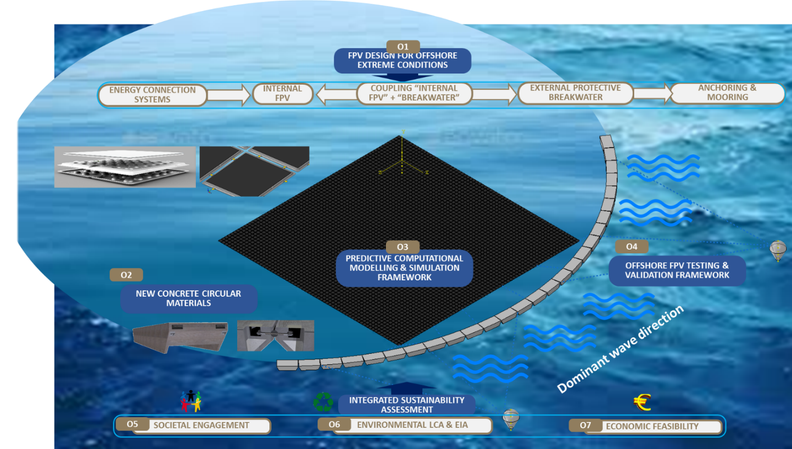
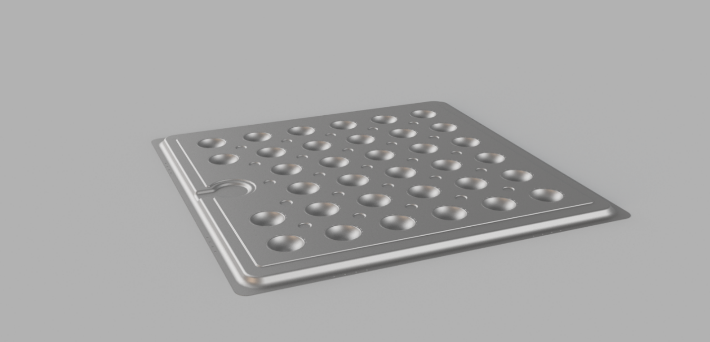
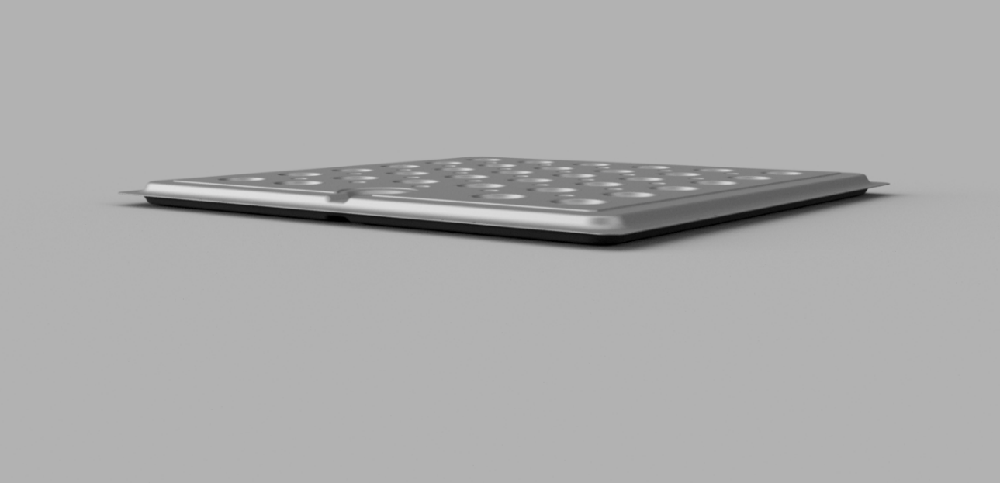
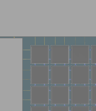
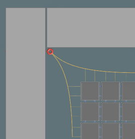

> Source: `SUREWAVE_D2.3_general_loads_final.docx` — Document date: 2023-01-31 — Converted: 2026-09-28 via pandoc/pdftotext

---

##### 

##### 

Deliverable number: D2.3

{width="8.245833333333334in" height="3.0701388888888888in"}

**Title: High level understanding of the system general loads**

# **Disclaimer:**  {#disclaimer .TOC-Heading}

The SUREWAVE project is Funded by the European Union. Views and opinions expressed are however those of the author(s) only and do not necessarily reflect those of the European Union. Neither the European Union nor the granting authority can be held responsible for them

Deliverable details

  ---------- -------- ---------------------------------------------------------
  **WP**     2        

  **Task**   D2.3     High level understanding of the system\'s general loads
  ---------- -------- ---------------------------------------------------------

  ------------------------- ------ -- -------------------------- ----------------------
  **Dissemination level**   SEN       **Due delivery date**      

  **Deliverable type**      R         **Actual delivery date**   31.01.2023
  ------------------------- ------ -- -------------------------- ----------------------

  -------------------------------- ---------------------------------------------
  **Lead beneficiary**             **SIS**

  **Contributing beneficiaries**   
  -------------------------------- ---------------------------------------------

  ---------------------- ------------ ------------------------ -------------------
  **Document Version**   **Date**     **Author**               **Comments**[^1]

  1.0                    03.01.2023   Bjørn Riise              Draft version

  1.1                    24.01.2023   Virgile Delhaye          Revision-1

  1.2                    25.01.2023   Balram Panjwani          Revision-2

  1.3                    27.01.2023   Joep van der Zanden      Revision-3

  2.0                    30.01.2023   Bjørn Riise              First version

  2.1                    31.01.2023   Tim Bunnik               Revision-1

  3.0                    31.01.2023   Bjørn Riise              Final version
  ---------------------- ------------ ------------------------ -------------------

+-------------------------------------------------------------------------------------------------------------------------------------------------+
| **Dissemination level**                                                                                                                         |
+:====================================+:==========================================================================================================+
| PU                                  | Public- fully open                                                                                        |
+-------------------------------------+-----------------------------------------------------------------------------------------------------------+
| SEN                                 | SEN = Sensitive -- limited under the conditions of the Grant Agreement                                    |
+-------------------------------------+-----------------------------------------------------------------------------------------------------------+
| EU classified                       | EU classified -- restraint -- UE/EU-restricted, confidential, secret-UE/EU secret under Decision 2015/444 |
+-------------------------------------+-----------------------------------------------------------------------------------------------------------+
| **Deliverable type**                                                                                                                            |
+-------------------------------------+-----------------------------------------------------------------------------------------------------------+
| R:                                  | Document, report (excluding the periodic and final reports)                                               |
+-------------------------------------+-----------------------------------------------------------------------------------------------------------+
| DEM:                                | Demonstrator, pilot, prototype, plan designs                                                              |
+-------------------------------------+-----------------------------------------------------------------------------------------------------------+
| DEC:                                | Websites, patents filing, press & media actions, videos, etc.                                             |
+-------------------------------------+-----------------------------------------------------------------------------------------------------------+
| OTHER:                              | Software, technical diagram, etc.                                                                         |
+-------------------------------------+-----------------------------------------------------------------------------------------------------------+

**EXECUTIVE SUMMARY**

describing the method for establishing general design loads on the full system. This report is associated with tasks 2.1, 2.2 and 2.3

**Deliverable Review**

+----------------------------------------------------------------------------------+-----------------+---------------------------------------+-----------------+-----------------+---------------------------------------+-----------------+
|                                                                                  | **Reviewer #1:** Balram Panjwani                                          | **Reviewer #2:** Joep van der Zanden                                      |
|                                                                                  +-----------------+---------------------------------------+-----------------+-----------------+---------------------------------------+-----------------+
|                                                                                  | **Answer**      | **Comments**                          | **Type\***      | **Answer**      | **Comments**                          | **Type\***      |
+----------------------------------------------------------------------------------+-----------------+---------------------------------------+-----------------+-----------------+---------------------------------------+-----------------+
| 1.  Is the deliverable in accordance with                                                                                                                                                                                                |
+----------------------------------------------------------------------------------+-----------------+---------------------------------------+-----------------+-----------------+---------------------------------------+-----------------+
| (i) The Description of Work?                                                     | Yes             |                                       | M               | Yes             |                                       | M               |
|                                                                                  |                 |                                       |                 |                 |                                       |                 |
|                                                                                  | No              |                                       | m               | No              |                                       | m               |
|                                                                                  |                 |                                       |                 |                 |                                       |                 |
|                                                                                  |                 |                                       | a               |                 |                                       | a               |
+----------------------------------------------------------------------------------+-----------------+---------------------------------------+-----------------+-----------------+---------------------------------------+-----------------+
| (ii) The international State of the Art?                                         | Yes             | *Not applicable for this deliverable* | M               | Yes             | *Not applicable for this deliverable* | M               |
|                                                                                  |                 |                                       |                 |                 |                                       |                 |
|                                                                                  | No              |                                       | m               | No              |                                       | m               |
|                                                                                  |                 |                                       |                 |                 |                                       |                 |
|                                                                                  |                 |                                       | a               |                 |                                       | a               |
+----------------------------------------------------------------------------------+-----------------+---------------------------------------+-----------------+-----------------+---------------------------------------+-----------------+
| 2.  Is the quality of the deliverable in a status                                                                                                                                                                                        |
+----------------------------------------------------------------------------------+-----------------+---------------------------------------+-----------------+-----------------+---------------------------------------+-----------------+
| (i) That allows it to be sent to European Commission?                            | Yes             |                                       | M               | Yes             |                                       | M               |
|                                                                                  |                 |                                       |                 |                 |                                       |                 |
|                                                                                  | No              |                                       | m               | No              |                                       | m               |
|                                                                                  |                 |                                       |                 |                 |                                       |                 |
|                                                                                  |                 |                                       | a               |                 |                                       | a               |
+----------------------------------------------------------------------------------+-----------------+---------------------------------------+-----------------+-----------------+---------------------------------------+-----------------+
| (ii) That needs improvement of the writing by the originator of the deliverable? | Yes             |                                       | M               | Yes             |                                       | M               |
|                                                                                  |                 |                                       |                 |                 |                                       |                 |
|                                                                                  | No              |                                       | m               | No              |                                       | m               |
|                                                                                  |                 |                                       |                 |                 |                                       |                 |
|                                                                                  |                 |                                       | a               |                 |                                       | a               |
+----------------------------------------------------------------------------------+-----------------+---------------------------------------+-----------------+-----------------+---------------------------------------+-----------------+
| (iii) That need further work by the Partners responsible for the deliverable?    | Yes             |                                       | M               | Yes             |                                       | M               |
|                                                                                  |                 |                                       |                 |                 |                                       |                 |
|                                                                                  | No              |                                       | m               | No              |                                       | m               |
|                                                                                  |                 |                                       |                 |                 |                                       |                 |
|                                                                                  |                 |                                       | a               |                 |                                       | a               |
+----------------------------------------------------------------------------------+-----------------+---------------------------------------+-----------------+-----------------+---------------------------------------+-----------------+

\* Type of comments: M = Major comment; m = minor comment; a = advice

# Table of Contents {#table-of-contents .TOC-Heading}

[1. Introduction [4](#introduction)](#introduction)

[2. Rules, regulations, standards, and recommended practices [4](#rules-regulations-standards-and-recommended-practices)](#rules-regulations-standards-and-recommended-practices)

[3. System description [5](#system-description)](#system-description)

[General [5](#general)](#general)

[Breakwater [6](#breakwater)](#breakwater)

[The mechanical connection between single breakwater units [6](#the-mechanical-connection-between-single-breakwater-units)](#the-mechanical-connection-between-single-breakwater-units)

[Single float unit [7](#single-float-unit)](#single-float-unit)

[Mechanical joints between single FPV units [8](#mechanical-joints-between-single-fpv-units)](#mechanical-joints-between-single-fpv-units)

[Mechanical connection to the breakwaters [8](#mechanical-connection-to-the-breakwaters)](#mechanical-connection-to-the-breakwaters)

[Mooring system [9](#mooring-system)](#mooring-system)

[4. Energy connection systems [9](#energy-connection-systems)](#energy-connection-systems)

[General [9](#general-1)](#general-1)

[Junction box [10](#junction-box)](#junction-box)

[Cables routes on breakwaters [13](#cables-routes-on-breakwaters)](#cables-routes-on-breakwaters)

[Cable routes on the solar float [13](#cable-routes-on-the-solar-float)](#cable-routes-on-the-solar-float)

[DC cable from FPV matrix to wave breaker [14](#dc-cable-from-fpv-matrix-to-wave-breaker)](#dc-cable-from-fpv-matrix-to-wave-breaker)

[DC cable on top of the wave breaker [14](#dc-cable-on-top-of-the-wave-breaker)](#dc-cable-on-top-of-the-wave-breaker)

[5. General design considerations [14](#general-design-considerations)](#general-design-considerations)

[Design Philosophy [14](#design-philosophy)](#design-philosophy)

[The partial safety factor method [15](#the-partial-safety-factor-method)](#the-partial-safety-factor-method)

[Load categorization and load cases [16](#load-categorization-and-load-cases)](#load-categorization-and-load-cases)

[Long-term variability and definition of extremes [18](#long-term-variability-and-definition-of-extremes)](#long-term-variability-and-definition-of-extremes)

[6. Global load and response analyses [18](#global-load-and-response-analyses)](#global-load-and-response-analyses)

[General [18](#general-2)](#general-2)

[Aerodynamic analysis [19](#aerodynamic-analysis)](#aerodynamic-analysis)

[Hydrodynamic analysis [19](#hydrodynamic-analysis)](#hydrodynamic-analysis)

[Structural analysis [21](#structural-analysis)](#structural-analysis)

[Connector strength analysis [21](#connector-strength-analysis)](#connector-strength-analysis)

[7. Wave tank testing [21](#wave-tank-testing)](#wave-tank-testing)

# Introduction {#introduction .SUREWAVE}

The SUREWAVE project is developing a breakwater concept for floating photovoltaic (FPV), suited for offshore conditions, typically with wind speed \> 25 m/s, current \>1.2 m/s, and wave height \> 14 m.

The breakwater concept, including the FPV system and all the components, should be designed for a design life of 25 years. This is the period of time over which the floating structure and the station-keeping system should provide an acceptable minimum level of safety and the PV system should provide an acceptable minimum energy production.

The objective of this document is to describe the method for establishing general design loads on the full system, with reference to the recommended practice DNV-RP-0584 "Design, development and operation of floating solar photovoltaic systems".

This document is a high-level presentation of the general loads on the system and provides preliminary requirements for chosen critical components, and integration requirements between the breakwater and FPV system. The document focuses on chosen critical components and is not providing a full set of design requirements. Furthermore, the document, provided data and results are for the SUREWAVE project use only, and any use of the data and/or results takes place without any form of guarantee. This also requires written permission from the SUREWAVE consortium members.

Specific environmental design criteria relevant to the project use-case scenarios are defined by the project chosen locations (ref. D2.1: "Use case scenario basis for typical, rough location", public report (SINTEF -- M4), associated to Task 2.1), including wind, waves, and water current.

This document is arranged as follows: After the introduction, a list of relevant rules, regulations, standards, and recommended practices are listed before the overall system and the energy connection is described. Then the design philosophy is presented before the method for global load and design analyses, and model testing is presented.

#  Rules, regulations, standards, and recommended practices  {#rules-regulations-standards-and-recommended-practices .SUREWAVE}

Table 1 lists applicable rules and regulations, standards, recommended practices, and other relevant references. Where no specific design criteria have been defined, the design should comply with DNV-RP-0584 or other applicable Norwegian standards and regulations. In case of a conflict between documents, this should be discussed and a solution should be agreed on. Typically, the hierarchy is as follows: applicable rules and regulations, company-specified criteria, and DNV-RP-0584.

Table 1 Applicable rules, regulations, standards, recommendations, and references

+--------------------------------------------------------------------------------------------------------------------------------------------------------------------------------------------+
| - DNV-RP-0584, Design, development and operation of floating solar photovoltaic systems                                                                                                    |
+============================================================================================================================================================================================+
| - DNV-RP-C205, Environmental loads and conditions                                                                                                                                          |
+--------------------------------------------------------------------------------------------------------------------------------------------------------------------------------------------+
| - EN 1999-1-1, Design of aluminium structures: General structural rules                                                                                                                    |
|                                                                                                                                                                                            |
| - Haver, S., and Winterstein, S. R. (2008), Environmental Contour Lines: A Method for Estimating Long Term Extremes by a Short Term Analysis, DOI: <https://doi.org/10.5957/SMC-2008-067>) |
|                                                                                                                                                                                            |
| - NORSOK N-003:2017, Actions and action effects                                                                                                                                            |
+--------------------------------------------------------------------------------------------------------------------------------------------------------------------------------------------+

# System description {#system-description .SUREWAVE}

## General

The general idea for the system is to have floating breakwaters utilized as protection against short-period wind waves or ship-induced waves, as schematically shown in [Figure 1](#_Ref125980952). The breakwater concept comprises the following

- breakwater,

- mechanical joints between single breakwater units,

- single float unit,

- mechanical joints between single FPV units,

- mechanical connection between the FPV matrix and the breakwater, and

- mooring system

as further described below. And the energy connection system as described in Section 4.

{width="6.3in" height="3.6215277777777777in"}

[]{#_Ref125980952 .anchor}Figure 1 Schematic outline of the breakwater concept

In general, the mechanical connections of the system, including connections between the breakwater and floating PV module have 3 main functions:

- maintaining the distance between the breakwater and the PV system,

- minimize the force transfer from the breakwater to the PV system, and

- compensate the different dynamic behaviours of breakwater and PV-system by flexibility.

## Breakwater 

The most common type of breakwater is the box shape or pontoon-type breakwater with flexible connections between the elements, allowing arrangements of long floating breakwaters. An example of a breakwater is shown in [Figure 2](#_Ref125981105). More details are provided in the project deliverable D2.2 "Requirements for surface mooring system between FPV array and breakwater".

![[]{#_Ref125981105 .anchor}Figure 2 Breakwater](../images/2023-01-31_surewave_d2.3_general_loads/image4.jpg){width="5.596708223972003in" height="1.8888888888888888in"}

## The mechanical connection between single breakwater units {#the-mechanical-connection-between-single-breakwater-units .surewave_sub}

The mechanical connection between single breakwater units is designed to transfer loads in all directions but prevent the transmission of moments in at least one direction This is necessary to prevent failure of the components over the entire length.

An example of a connection between breakwater units is shown in [Figure 3](#_Ref125981112). More details are provided in the project deliverable D2.2 "Requirements for surface mooring system between FPV array and breakwater".

![[]{#_Ref125981112 .anchor}Figure 3 Mechanical connection between single breakwater units](../images/2023-01-31_surewave_d2.3_general_loads/image5.png){width="3.9785159667541556in" height="2.585858486439195in"}

## Single float unit

The FPV system consists of single FPV units. The chosen unit is the "Sunlit Sea FPV model 1" with main dimensions as listed in [Table 2](#_Ref87946170). The Sunlit Sea unit consists of a photovoltaic (PV) panel sealed to an aluminium float, which gives a fully built-in solution lying flat on the water surface, as shown in [Figure 4](#_Ref87877047). To obtain the required energy output several floats are connected together in a large matrix, shielded by the breakwaters.

  -----------------------------------------------------------------------
  Length                        1880 mm       
  ------------------------ ------------------ ---------------------------
  Width                         1880 mm       

  Height                         85 mm        

  Weight                         65 kg        
  -----------------------------------------------------------------------

  : []{#_Ref87946170 .anchor}Table 2 Single unit main dimensions

  ------------------------------------------------------------------------------------------------------------------------------------------------
  {width="4.528301618547681in" height="2.021712598425197in"}
  ------------------------------------------------------------------------------------------------------------------------------------------------

  ------------------------------------------------------------------------------------------------------------------------------------------------

{width="4.510199037620297in" height="1.0377351268591426in"}

![[]{#_Ref87877047 .anchor}Figure 4 The aluminium float made from two symmetrical blanks, positioned facing each other and welded (top and middle), and with a PV panel bonded to the top (bottom)](../images/2023-01-31_surewave_d2.3_general_loads/image8.png){alt="A picture containing text, accessory, case Description automatically generated" width="4.555249343832021in" height="2.1981135170603676in"}

## Mechanical joints between single FPV units

To connect the floats into a large matrix, a system of 2 brackets + hinges are mounted on each side of the panel. This gives a total of 8 brackets and 8 shared hinges (one hinge is shared between two panels) per panel. The present Sunlit Sea hinge design is shown in [Figure 5](#_Ref125981448) and material properties are provided in

[Table 3](#_Ref125982285).

![[]{#_Ref125981448 .anchor}Figure 5 Present Sunlit Sea hinge design](../images/2023-01-31_surewave_d2.3_general_loads/image9.png){width="4.250923009623797in" height="2.4343438320209976in"}

[]{#_Ref125982285 .anchor}

  ------------------------------------------------------------------------
  Material property                    
  ------------------------------------ -----------------------------------
  Hardness                                            90 A

  Tensile strength                                  38.2 Mpa

  Tensile stress at 100 % elongation                12.6 Mpa

  Tensile stress at 300 % elongating                 27 Mpa

  Elongation                                          460 %

  Tear Strength                                      55 KN/m

  Resilience                                          52 %

  70°C x 22h Compression Set                          27 %

  DIN Abrasion mm^3^                                42 mm^3^
  ------------------------------------------------------------------------

  : Table 3 Present Sunlit Sea hinge material properties

## Mechanical connection to the breakwaters {#mechanical-connection-to-the-breakwaters .surewave_sub}

To connect the FPV matrix to the breakwaters a couple of alternatives are suggested:

1)  each of the perimeter floats are directly connected to the breakwater, as exemplified in [Figure 6](#_Ref124961917), left, or

2)  each of the perimeter floats are connected to a surface mooring system, which ends in a limited number of mooring points attached to the breakwater, as exemplified in [Figure 6](#_Ref124961917), right.

  ------------------------------------------------------------------------------------------------------------------------------------------------------------------------------------------------------------------------------------------------------------------------------------
  {width="2.6941272965879266in" height="3.092227690288714in"}   {width="3.029417104111986in" height="3.1195100612423445in"}
  ----------------------------------------------------------------------------------------------------------------------------------------------------- ------------------------------------------------------------------------------------------------------------------------------

  ------------------------------------------------------------------------------------------------------------------------------------------------------------------------------------------------------------------------------------------------------------------------------------

  : []{#_Ref124961917 .anchor}Figure 6 Mechanical connection between FPV matrix and breakwaters, left: each of the perimeter floats directly connected to the breakwater, and right: each of the perimeter floats are connected to a surface mooring system, which ends in a limited number of mooring points attached to the breakwater.

## Mooring system {#mooring-system .surewave_sub}

In general, while the FPV matrix is connected to the breakwater, the breakwater is moored to the anchoring system. The mooring system has, in addition to station keeping, 3 main functions:

- maintaining the distance between the breakwater and the PV system,

- minimize the force transfer from the breakwater to the PV system, and

- compensate the different dynamic behaviours of breakwater and PV-system by flexibility.

# Energy connection systems {#energy-connection-systems .SUREWAVE}

## General  {#general-1 .surewave_sub}

For the SUREWAVE project, the work with the energy connection systems is focussed on the junction box, routing, and collection of the DC homeruns, more precisely:

- Junction box

- Cable routes on wave breakers

- Cable routes on solar floats

- DC cable from FPV matrix to wave breaker

- DC cable on top of the wave breaker

These are further discussed in the document below.

Note that other mature elements have been excluded in this work, such as the electrical interface to the inverter, transformer station, DC homeruns from FPV. However, for a final design all relevant components should be included.

In general, the functional design specifications are based on:

- Mechanical loading from slamming loads/overwash

- Water ingress due to diffusion

- Marine fouling

- Saltwater-induced corrosion, and

- UV degradation (in combination with elevated temperatures).

More detailed, the energy connection system components listed above will experience one or several of the following load cases:

1)  Movement of the breakwater in relation to the FPV matrix. I.e., the differing mutual correlation will cause loading of the hinges and fasteners on both the breakwater, matrix, and surface mooring system.

2)  Decomposition of the loads into the matrix. I.e., loads transferred from the wave breaker via a hinge and thereafter decomposed in several directions across the matrix, and not only normally into the matrix.

3)  Dissipation of the loads in the matrix. I.e., how quickly the energy from waves is dissipated in the FPV matrix. A higher dissipation ratio will cause larger loads on all components. Depending on the sea state, the loads will accumulate to a certain quasi-steady state load.

4)  Overwash (mechanical loading) causes an impact on components on the breakwater and floats.

5)  Standing waves within the matrix. Depending on the dampening effect, it is possible that the whole matrix may resonate, causing transversal tension and loading on all components.

6)  Extreme loading conditions, according to DNV-RP-0584.

7)  Fatigue loading conditions, according to DNV-RP-0584.

8)  Water vapour exposure. Dependent on humidity level and temperature. Probably more exposed than the test procedure in IEC-61215 (ref. damp heat testing MQT13)

9)  Water spray exposure according to IP66 (powerful jets of water at a rate of 100 liters per minute at 100 kPa from a distance of 3 m for 15 minutes, and IP67 (Protection against full immersion up to 1 m in depth for 30 minutes.

10) Saltwater corrosion.

11) Corrosion due to biofouling.

12) Other failure modes

## Junction box {#junction-box .surewave_sub}

The junction box, as an example shown in [Figure 7](#_Ref123633329), is an electrical component for parallel coupling the DC home runs from the strings of solar panels comprising the FPV matrix. In the case of SUREWAVE, the junction boxes will be placed on dummy floats, and the wave breakers, as exemplified in [Figure 8](#_Ref123633482).

Each string of solar panels is comprised of 14 solar floats. The home run from the cables is routed onto a dummy float string and once 14 strings have been pooled together, they are joined in a junction box, [Figure 9](#_Ref123634195).

Larger gauge cables are routed from the junction box to the inverter/transformer station.

![[]{#_Ref123633329 .anchor}Figure 7 Typical solar junction box.](../images/2023-01-31_surewave_d2.3_general_loads/image12.png){alt="A picture containing text, businesscard Description automatically generated" width="2.6161614173228345in" height="2.068127734033246in"}

![[]{#_Ref123633482 .anchor}Figure 8 In this illustration, the PV system is composed of 14 parallel coupled strings combined in a junction box, far right in this illustration. In this example, the junction box is located on a dummy float. I.e., a float without a solar panel.](../images/2023-01-31_surewave_d2.3_general_loads/image13.png){alt="Calendar Description automatically generated" width="5.654129483814523in" height="2.62171697287839in"}

![[]{#_Ref123634195 .anchor}Figure 9 Close up of a junction box combining 14 strings into two home runs in a combiner box (yellow square).](../images/2023-01-31_surewave_d2.3_general_loads/image14.png){alt="Diagram Description automatically generated with medium confidence" width="3.0434765966754154in" height="2.8282819335083116in"}

The junction boxes will be exposed to severe environmental conditions, surviving humidity, water spray, corrosion, biofouling, and mechanical loads. The grade of severity is related to the location of the junction box, situated on the wave breaker or within the FPV matrix, in addition to Metocean conditions.

The junction box situated on the wave breaker is expected to experience overwash from certain wave height/frequency ratios. Overwash will expose the junction box to:

- Mechanical loading from slamming loads

- Risk of water ingress due to powerful water jets and water pressure exposure

- Water ingress due to diffusion

- Marine fouling

- Saltwater induced corrosion

- UV degradation (in combination with elevated temperatures)

Overwash may cause severe loading situations that require the development of bespoke protective measures/solutions.

The expected exposure to gushing water/water jets will be determined during the SUREWAVE project. It is likely that the components should be verified to withstand the test regime stated in the "Ingress Protection" standard, for instance IP 66 and IP 67. The permissible amount of liquid phase water ingress is determined in this work. It is likely that the permissible amount of water will be tied to the amount of water that can be absorbed by desiccants during each O&M interval.

Water will also leak through semipermeable materials such as seals, polymers, interfaces, and through DC cables. The amount of tolerable water ingress should be determined in this work and included in the design specification. In the design of the components, measures should be taken to address intolerable amounts of water. It is likely that the components should be tested in accordance with the ASTM Standard Test Method E96. The permissible amount of gas-phase water intrusion is likely linked to the amount of water that can be absorbed in a chosen amount of desiccant during each O&M interval.

Marine fouling may cause leakage and corrosion. The effect of marine fouling should be understood and described in the design specifications.

Salt water will cause corrosion of all exposed metal and in particular bimetal joints. Bimetal joints are not permissible. In addition, salt water may accumulate in cavities and experience wetting/drying cycles causing salt to accumulate and increase the corrosivity of the liquid. The junction box should be designed to avoid saltwater accumulation and withstand saltwater exposure in the splash zone. It is likely that the components should be tested in accordance with IEC 60068-2-11 or 2-52.

All components will be exposed to UV light, also in combination with the elevated temperatures. Particularly polymer materials degrade under those conditions. To guarantee 25 years of operational life, the materials should also withstand UV light exposure. It is likely that the components should be UV-exposure tested using the same testing regime as in the IEC 61215.

## Cables routes on breakwaters {#cables-routes-on-breakwaters .surewave_sub}

The cables will be routed on top of the breakwaters, which allows for additional usage of the breakwaters.

The cables will be exposed to similar environmental conditions as the junction boxes:

- Mechanical loading from slamming loads

- (Risk of water ingress due to powerful water jets and water pressure exposure)

- Water ingress due to diffusion

- Marine fouling

- Saltwater induced corrosion

- UV degradation (in combination with elevated temperatures)

Mechanical loading from overwash will require the cables to be continuously supported.

It is assumed that there is no risk of water ingress due to powerful water jets and water pressure exposure since the cables are fabricated from one continuous piece of material, with the interconnections addressed in the junction boxes. However, water ingress due to diffusion should be addressed in a similar manner as for the junction boxes. The amount of permissible water diffusion into the cables should be determined from a solid-state solid solubility analysis, ensuring that the water levels never rise above the dew point, at lower temperatures.

Marine fouling may cause leakage and corrosion. The effect of marine fouling should be understood and described in the design specifications.

Chemical and UV exposure should be understood and addressed.

## Cable routes on the solar float {#cable-routes-on-the-solar-float .surewave_sub}

In essence, the solar floats are comprised of a float, solar panel, and cabling. Cable routing is an integral part of the solar float. This ensures that the design can med made robust, cost-efficient, and visually pleasing. The following section specifies the environmental loading conditions on the cables and cable fixtures.

The cables will be exposed to similar environmental conditions as the cables routed on the breakwaters:

- Mechanical loading from slamming loads

- (Risk of water ingress due to powerful water jets and water pressure exposure)

- Water ingress due to diffusion

- Marine fouling

- Saltwater induced corrosion

- UV degradation (in combination with elevated temperatures)

However, small differences are present.

The slamming loads are expected to be smaller since the location is better sheltered and the cross-section of the cables is smaller.

The risk of water intrusion due to diffusion is higher since the cables are closer to the water.

## DC cable from FPV matrix to wave breaker {#dc-cable-from-fpv-matrix-to-wave-breaker .surewave_sub}

The DC cables will have to leapfrog from the matrix of solar floats onto the wave breaker. This distance is exposed to movements and water exposure.

The cables will be exposed to similar environmental conditions as the cables routed on the wave breakers:

- Mechanical loading from slamming loads

- Water ingress due to diffusion

- Marine fouling

- Saltwater induced corrosion

- UV degradation (in combination with elevated temperatures)

In addition, the cables will be subjected to:

- Movements between wave breaker and array.

## DC cable on top of the wave breaker {#dc-cable-on-top-of-the-wave-breaker .surewave_sub}

The DC cables on top of the wave breaker will be exposed to similar environmental exposure as the cables routed in the solar floats. The cables will be affixed to cable racetracks. The full structure will be exposed to high humidity, corrosive environment, and overwash.

# General design considerations {#general-design-considerations .SUREWAVE}

## Design Philosophy {#design-philosophy .surewave_sub}

The Breakwater and FPV system will be unmanned during severe environmental loading conditions. Hence, the consequences of failure are mainly of environmental and economical nature, and a damaged structure is regarded as acceptable as long as it does not cause harm to other structures (RP-0584).

To ensure structural integrity a limit state design should be applied. A limit state is a condition beyond which a structure or structural component will no longer satisfy the design requirements. The following limit states should be considered:

- Deployment, towing, and installation phase.

- The ultimate limit state (ULS) corresponds to the maximum load-carrying resistance.

- Accidental limit states (ALS) correspond to survival conditions in a damaged condition or in the presence of abnormal environmental conditions.

- Fatigue limit states (FLS) correspond to failure due to the effect of cumulative damage of cyclic loading during the entire lifetime.

- Serviceability limit states (SLS) according to the intended use.

## **The partial safety factor method** {#the-partial-safety-factor-method .surewave_sub}

**To ensure that the target safety level is met a partial safety factor method should be used. The method is based on a separate assessment of the load effect in the structure due to each applied load process where load and resistance factors should be applied to characteristic values of load effect and resistance (RP-0584). The load effect S can be any loading effect such as external or internal force, internal stress in a cross-section, or a deformation. And the resistance R (against S) is the corresponding resistance (material strengths) such as a capacity or yield stress of a critical deformation.**

**The design load effect Sd is obtained by multiplication of the characteristic load effect Sc by a specified load factor γ~S~, i.e.,**

$$S_{d} = S_{c} \cdot \gamma_{S}$$

**And the design resistance *R~d~* is obtained by dividing the characteristic resistance, *R~c~* by a specified material factor γ~R~, i.e.,**

$$R_{d} = R_{c}/\gamma_{R}$$

**Then the safety level is considered to be satisfactory when the design load effect S~d~ does not exceed the design resistance R~d~, i.e.,**

$$S_{d} \leq R_{d}$$

**The load factors, as listed in** [Table 4](#_Ref124962537)**, account for:**

- **possible unfavourable deviation of the loads from characteristic values,**

- **the reduced probability that various loads acting together will act simultaneously at the characteristic value, and**

- **uncertainty in the model and analysis used for the determination of load effects.**

**The material factor for aluminium should be in agreement with relevant standards for the applied material., and account for**

- **unfavourable deviation in the material resistance from characteristic values, and**

- **possible reduction of the material resistance in the structure.**

+:--------------:+:-------------------------:+:-----------:+:--------:+:---------:+:--------:+:---------------:+
| **Load**       | **Limit state**           | **Load categories**                                             |
|                |                           |                                                                 |
| **factor set** |                           |                                                                 |
|                |                           +-------------+----------+-----------+----------+-----------------+
|                |                           | **Q**       | **Q**    | **E^1)^** | **D**    | **P**           |
+----------------+---------------------------+-------------+----------+-----------+----------+-----------------+
| **(a)**        | **ULS**                   | **1.25**    | **1.25** | **0.7**   | **1.0**  | **0.9/1.1^3)^** |
+----------------+---------------------------+-------------+----------+-----------+----------+-----------------+
| **(b)**        | **ULS**                   | **1.0^2)^** | **1.0**  | **1.35**  | **1.0**  | **0.9/1.1^3)^** |
+----------------+---------------------------+-------------+----------+-----------+----------+-----------------+
| **(d)**        | **ALS intact structure**  | **1.0^2)^** | **1.0**  | **1.0**   | **1.0**  | **0.9/1.1^3)^** |
+----------------+---------------------------+-------------+----------+-----------+----------+-----------------+
| **I**          | **ALS damaged structure** | **1.0^2)^** | **1.0**  | **1.0**   | **1.0**  | **0.9/1.1^3)^** |
+----------------+---------------------------+-------------+----------+-----------+----------+-----------------+
| **FLS**        | **FLS**                   | **1.0**     | **1.0**  | **1.0**   | **1.0**  | **1.0**         |
+----------------+---------------------------+-------------+----------+-----------+----------+-----------------+

: []{#_Ref124962537 .anchor}**Table** 4 **Load factors for ULS an ALS conditions (table 5-1 in DN-RP-0584, consequence category 1)**

1)  **When environmental loads are combined with functional loads from boat impacts, the environmental load factor should be increased from 0.7 to 1.0 to reflect that boat impacts are correlated with the wave conditions.**

2)  **The most conservative value of 0.9 and 1.1 should be used.**

3)  **ALS intact structure is for the accident analysis, while ALS damaged structure should be used for post-accident situations**

**The characteristic values of R and S are chosen as specific quantiles in their respective probability distributions. The characteristic load effect S~c~, depending on the limit state, is defined as follows:**

- **ULS: the characteristic load effect whose return period is at least 50 years;**

- **FLS: the characteristic load effect is based on the expected load effect history;**

- **SLS and ALS: the characteristic load effect is a specified value, depending on operational requirements. For details see [Error! Reference source not found.](#_Ref75777683).**

## **Load categorization and load cases**  {#load-categorization-and-load-cases .surewave_sub}

**Load, load components, and load combinations considered should be selected to assess the effects of the most onerous design actions on each component being designed, which may vary from component to component.**

**In** [Table 5](#_Ref124969444) **the basis for characteristic loads in design conditions, including the specified return period for environmental loads (E), are listed.**

**In** [Table 6](#_Ref124969482) **a list of relevant design load cases that should be assessed is given, specifying the environmental conditions. Also listed are some parameters of interest.**

+-----------------------+--------------------------------------------------------------------------------------------------------------------------------+
| **Load**              | **Limit states -- operating design conditions**                                                                                |
|                       |                                                                                                                                |
| **category**          |                                                                                                                                |
|                       +--------------------------------+------------------------------+------------------------------------------+---------------------+
|                       | **ULS**                        | **FLS**                      | **ALS**                                  | **SLS**             |
|                       |                                |                              +----------------------+-------------------+                     |
|                       |                                |                              | **Intact**           | **Damaged**       |                     |
+:=====================:+:==============================:+:============================:+:====================:+:=================:+:===================:+
| **Permanent (G)**     | **Expected values based on structural properties**                                                                             |
+-----------------------+--------------------------------------------------------------------------------------------------------------------------------+
| **Variable (Q)**      | **Specified value (maximum or minimum)^1)^**                                                                                   |
+-----------------------+--------------------------------+------------------------------+----------------------+-------------------+---------------------+
| **Environmental (E)** | **50-years return period^2)^** | **25-years scatter diagram** | **500-years return** | **1-year**        | **Specified value** |
|                       |                                |                              |                      |                   |                     |
|                       |                                |                              | **Period^2)^**       | **return period** |                     |
+-----------------------+--------------------------------+------------------------------+----------------------+-------------------+---------------------+
| **Accidental (A)**    | **Specified accidental loads**                                                                                                 |
+-----------------------+--------------------------------------------------------------------------------------------------------------------------------+
| **Deformation (D)**   | **Expected values based on structural analyses**                                                                               |
+-----------------------+--------------------------------------------------------------------------------------------------------------------------------+
| **Prestressing (P)**  | **Specified value, based on hydrodynamic analyses and/or model testing.**                                                      |
+-----------------------+--------------------------------------------------------------------------------------------------------------------------------+

: []{#_Ref124969444 .anchor}**Table** 5 **Basis for characteristic loads in design conditions (ref. table 4-1 in DN-RP-0584)**

1)  **Whichever produces the most unfavourable load effect**

2)  **Assuming a strong correlation between wind and waves the following conditions should be assessed: 50-years wind and wave combined with 5-years current; and 50-years current combined with 5-years wind and wave. Likewise, 500 years values are combined with 50 years values.**

> **The load categories are defined as follows:**

- **Permanent loads (G) are loads that will not vary during the period considered, such as structural mass and mass of installed components.**

- **Variable function loads (Q) are loads that may vary during the period under consideration, and which are related to the operation and normal use, such as loads from workers and variable equipment.**

- **Accidental loads (A) are loads related to accidental events, abnormal operations, or technical failure, i.e., events that occur more rarely than characteristic loads for design in the ULS, such as loss of buoyancy and loss of mooring lines.**

- **Environmental loads (E) are loads caused by environmental phenomena.**

- **Deformation loads (D) are loads caused by inflicted deformations, such as temperature loads.**

- **Prestressing loads (P) are loads that are applied to different components to induce desirable strains and stress, such as pretension loads on bolted connections and anchors, originating from the mooring lines**

+----------+------------------------------+-----------------+------------------------------+---------------+-----------------+---------------------------------------------------------------------------------+
| **Case** | **Description**              | **Limit state** | **Waves**                    | **Wind^1)^**  | **Current^1)^** | **Parameters of interest**                                                      |
|          |                              |                 |                              |               |                 |                                                                                 |
|          |                              |                 |                              |               | **(m/s)**       |                                                                                 |
+:========:+==============================+:===============:+:============================:+:=============:+:===============:+:===============================================================================:+
| **1**    | **Extreme**                  | **ULS**         | **50 years contour**         | **50 years**  | **0, and**      | **Maximum load on breakwater, FPV, and connections; slamming loads; overwash;** |
|          |                              |                 |                              |               |                 |                                                                                 |
|          | **waves**                    |                 |                              |               | **5 years**     |                                                                                 |
+----------+------------------------------+-----------------+------------------------------+---------------+-----------------+---------------------------------------------------------------------------------+
| **2**    | **Extreme current**          | **ULS**         | **5 years**                  | **5 years**   | **50 years**    | **Load on the breakwater, FPV, and connections; overwash;**                     |
+----------+------------------------------+-----------------+------------------------------+---------------+-----------------+---------------------------------------------------------------------------------+
| **4**    | **Life of**                  | **ALS**         | **5 years contour**          | **Hurricane** | **0, and**      | **Wind loads; connection loads for lifted float**                               |
|          |                              |                 |                              |               |                 |                                                                                 |
|          | **perimeter float**          |                 |                              | **condition** | **5 years**     |                                                                                 |
+----------+------------------------------+-----------------+------------------------------+---------------+-----------------+---------------------------------------------------------------------------------+
| **6**    | **Damaged,**                 | **ALS^2)^**     | **1-year contour**           | **1 year**    | **0, and**      | **Mooring loads;**                                                              |
|          |                              |                 |                              |               |                 |                                                                                 |
|          | **one flooded breakwater**   |                 |                              |               | **1 year**      | **breakwater buoyancy**                                                         |
+----------+------------------------------+-----------------+------------------------------+---------------+-----------------+---------------------------------------------------------------------------------+
| **7**    | **Damaged,**                 | **ALS^3)^**     | **1-year contour**           | **1 year**    | **0, and**      | **Mooring loads**                                                               |
|          |                              |                 |                              |               |                 |                                                                                 |
|          | **loss of one mooring line** |                 |                              |               | **1 year**      |                                                                                 |
+----------+------------------------------+-----------------+------------------------------+---------------+-----------------+---------------------------------------------------------------------------------+
| **8**    | **Fatigue**                  | **FLS**         | **25-years scatter diagram** | **1 year**    | **0, and**      | **Connection loads;**                                                           |
|          |                              |                 |                              |               |                 |                                                                                 |
|          |                              |                 |                              |               | **1 year**      | **mooring loads**                                                               |
+----------+------------------------------+-----------------+------------------------------+---------------+-----------------+---------------------------------------------------------------------------------+
|          |                              |                 |                              |               |                 |                                                                                 |
+----------+------------------------------+-----------------+------------------------------+---------------+-----------------+---------------------------------------------------------------------------------+

: []{#_Ref124969482 .anchor}**Table** 6 **List of relevant design load cases**

1)  **Where more than 1 value is given, a sensitivity study should be carried out**

2)  **Boat impact, i.e., the environmental load factor of 1.0**

3)  **Loss of one mooring line should not result in collapse or drift of the system**

**The environmental actions are stochastic in nature and will therefore give rise to stochastic loads. The expected load or load effect should be used, i.e., the mean of max based on several seeds, unless otherwise specified in the design of a specific structural component.**

**The effects of corrosion/degradation which reduce the durability of the structure and affect the properties and geometrical parameters of structural and non-structural components should be applied in all limit states. ULS, ALS, and SLS conditions should include the worst-case maximum corrosion/degradation expected during the life of the system, as well as no corrosion/degradation if loads from this could be more onerous for any components. FLS condition may apply the mean corrosion/degradation for parameters such as material properties and thickness.**

## **Long-term variability and definition of extremes** {#long-term-variability-and-definition-of-extremes .surewave_sub}

**To account for the long-term variability, analyses should be based on the contour line method (Haver, Winterstein 2008, and DNV-RP-C205 section 3.6 Long-term wave statistics and section 3.7.2 Metocean contours). A sufficient number (\> 24) of 3-hour simulations should be carried out for a sufficient number of sea states along the contour line, from where the time series maxima should be extracted and a Gumbel distribution should be established. From the most extreme sea state, a given percentile level defines the extreme design value. For the present design, a percentile level of p = 0.90 and p = 0.95 should be used for R=50 years and R=500 years, respectively.**

# **Global load and response analyses**  {#global-load-and-response-analyses .SUREWAVE}

## **General** {#general-2 .surewave_sub}

**The global loads and response assessment should include:**

- **Aerodynamic analysis**

- **Hydrodynamics analysis**

- **Structural analyses (including connection- and mooring-point strength analysis)**

- **Connector strength analysis, both for the connector between the breakwater units, the connectors between breakwater and FPV array, and connectors between individual FPV units.**

- **Mooring and anchoring analyses**

**Global loads and response models should be established to cover the assessments defined above. The results from the hydrodynamic analysis are used as input to define and decide on the load cases.**

**A typical analyses process to assess extreme waves (ULS) is outlined through the following points:**

1)  **For a sufficient number of the sea states along the contour line for R = 50 years 3-hour wave time series (24 seeds) are established, and the corresponding wind (R = 50 years) and current (R = 5 years) are found.**

2)  **Analyses are carried out with a time domain simulation program, where maximum connection loads and corresponding local wave parameters can be extracted.**

3)  **From each of the 3-hour time series, the maximum tension is extracted and a Gumbel distribution is established.**

4)  **From the Gumbel distribution, the 0.9 percentile defines the sea state extreme value. The design value is taken from the most severe seat state along the contour line.**

5)  **Using the design tensions and wave pressure from the corresponding wave a linear static FEM analysis is carried out, applying both relevant load and resistance factors.**

6)  **The results from the FEM analyses are used to show that the structural capacity is satisfactory and provides an acceptable minimum level of safety for the system according to relevant structural design standards.**

## **Aerodynamic analysis** {#aerodynamic-analysis .surewave_sub}

**Aerodynamic models need to be employed to calculate wind-driven loads on the breakwater, the FPV units, and the complete system (FB+FPV). The model needs to be built based on the exterior dimensions of the FB and FPV. In principle, the aerodynamic model should:**

- **Represent the major external features of major components.**

- **Since both FB and FPV will be exposed to the marine atmospheric boundary layer (MABL) and therefore an accurate representation of MABL is a necessity. This has been discussed in D2.1**

- **Represent the individual floats are realistic as possible,**

- **Capture all relevant loads.**

**The aerodynamic model should be used to provide the following parameters:**

- **The pressure distribution on all the components**

- **The forces and center of pressure for both FB and FPV**

- **The lift and drag coefficients.**

## **Hydrodynamic analysis** {#hydrodynamic-analysis .surewave_sub}

**A hydrodynamic model should be established to calculate loads on the breakwater, the FPV units, the connections, and the mooring. The model should be built with rigid bodies, representing the breakwaters and the floats. The model should:**

- **represent the individual floats are realistic as possible,**

- **include realistic connections**

- **include the mooring points, and**

- **capture all relevant loads.**

**The model should be used to assess:**

- **the global motions (surge, sway, heave, roll, pitch, and yaw) both for the breakwaters, individual floats, and the matrix,**

- **the forces in the connections and the connection points**

- **the mooring tension and mooring point forces.**

**Furthermore, the model should be used to extract and/or define required inputs for detailed structural assessments, including float accelerations and pressure.**

**All relevant environmental effects should be assessed, including but not limited to: first-order wave loads, mean drift loads, drag loads, added mass and damping due to radiating waves, slamming, breaking wave impact, green water due to overtopping, and wind loads (both average and wind gust)**

**An assessment of the different contributions to the motion response should be included, splitting the three components:**

- **mean displacement due to mean environmental loads,**

- **low-frequency displacements, in the frequency range of the natural periods of the moored platform in the surge, sway, and yaw modes of motion, due to low-frequency wind loads and second-order wave load, and**

- **oscillations in the frequency range of the incoming waves, due to first-order wave loads.**

**The model should be used to perform both static and dynamic load assessment with a realistic representation of the environmental actions in the time domain, typically given by**

$M + \ A_{\infty} = \int_{- \infty}^{\infty}{\kappa(t - \tau)\dot{x(\tau)d\tau + Cx(t) + Kx(t)}} = F^{FK} + F^{D} + C_{q}\left| u - \dot{x} \right|\left( u - \dot{x} \right),$

**where**

- **M is the dry mass.**

- ***A~∞~* is the added mass at high frequencies**

- ***x* is the system displacement**

- **κ is the retardation function accounting for frequency depended added mass and damping,**

- **C is hydrostatic restoring force,**

- ***K* is a nonlinear restoring force,**

- ***F^FK^* is the Froude Krylov force,**

- ***F^D^* is the diffraction force**

- ***C~q~* is quadratic damping to approximation viscous effects,**

- ***u* is the water particle velocity**

**The hydrodynamic loads may be based on diffraction analyses with one** **single panel unit, where force RAOs are established, as well as derived added mass and damping. These components should be applied to each of the single units in the total matrix. In addition, a drag force, due to the current, should be included based on the Morison formula.**

**There will be significant wave shielding/attenuation effects between the panels. The panels on the exposed side (towards the incoming waves) will move more than on the backward side. This effect should be discussed and taken into account.**

**The hydrodynamic coefficients should be based on experimental results and the numerical model should be compared with and adjusted accordingly to model test results.**

**For larger matrix sizes simplification may be used, such as lumped model, reduced DOF, or similar, as long as the simplifications are justified and results are carefully evaluated.**

**In the hydrodynamic analysis report, it should be documented that all relevant physical effects are included. Furthermore, justifications for any assumptions or simplifications should be made and it should be documented that they are accurate or conservative.**

**A sufficient number of matrix configurations should be analysed, such that trends are revealed and conclusions can be drawn.**

**For the model testing a sufficient number of tests should be carried out to calibrate and verify the analysis model.**

## **Structural analysis** {#structural-analysis .surewave_sub}

**The analyses should be based on the results from the hydrodynamics analyses, which will define the load cases. Using the design tensions and wave pressure defined FEM analysis should be carried out by applying both relevant load and resistance factors.**

**Radiation/diffraction loads should be implemented based on the force RAOs. In addition, drag loads, due to current, should be included. In general, evenly distributed pressure loads should be used. However, if deemed necessary, points load may be used. If so, the point of attack should be evaluated and the effect of the simplification should be discussed.**

**The results from the FEM analyses should be used to show that the structural capacity is satisfactory and provide an acceptable minimum level of safety for the system according to relevant structural design standards.**

**For fatigue life assessment the safe life design, based on the evaluation of SN-curves, should be used, with a material factor γ~R~=1 and a design fatigue factor DFF = 2.**

## **Connector strength analysis** {#connector-strength-analysis .surewave_sub}

**Strength analyses should be carried out for**

- **the connectors between the breakwater units,**

- **the connectors between the breakwater and FPV array, and**

- **the connectors between individual FPV units.**

The strength analysis should be based on input from the hydrodynamic analysis and should ensure that the connectors

- are able to withstand all expected forces during the project lifetime without failure.

- have sufficient wear resistance to accommodate the movement for the design life.

- limits the movement of the floats to mitigate the potential impact from neighboring floats.

The connectors should be tested against maximum (ULS and ALS) tension. In addition, the connectors should be tested for cycling loading equivalent with a number of storms. Ideally testing in an irregular storm condition would be preferred. However, as this might be difficult to carry out, a pragmatic approach may be used. Considering a 6-hour storm based on *H~S~* and *T~P~* values from the scatter diagram, repeatable cycles based on the wave periods, using a load equal to 80 percent of the maximum ULS load may be used.

# Wave tank testing {#wave-tank-testing .SUREWAVE}

Wave tank testing should be carried out to

- study global behaviour,

- establish hydrodynamic load characteristics,

- calibrate numerical models, and

- identify key failure modes, if the system is brought to the limits.

The testing should be based on Froude\'s law of scaling with a realistic representation of the breakwater, floats, hinges, and waves.

A detailed description and scope of the wave tank experiments have been described in Task 6.4 and results from the wave tank experiments will be published in deliverable D6.2 in M26.

[^1]: Creation. modification. final version for evaluation. revised version following evaluation. final
