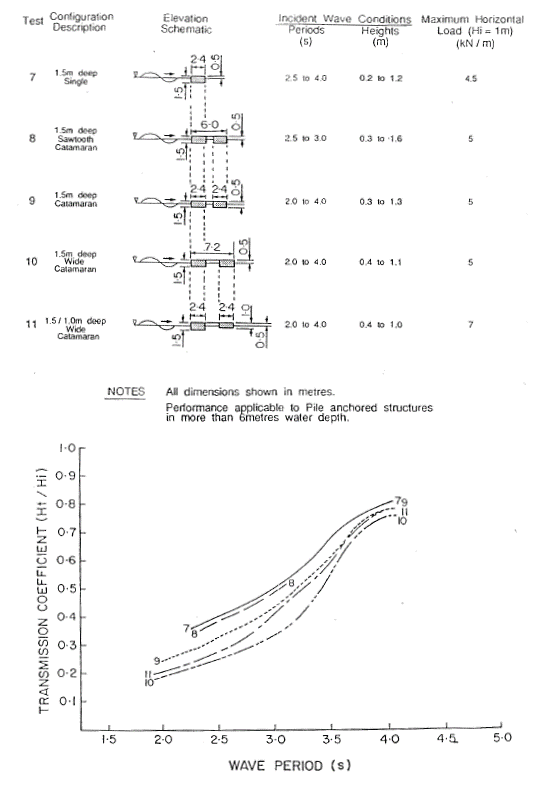
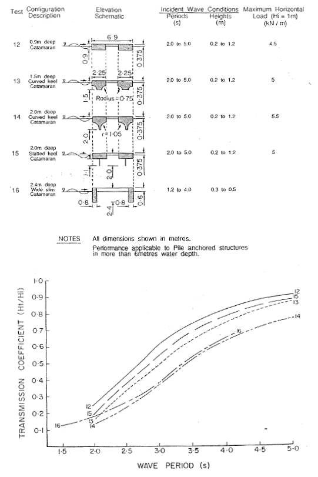
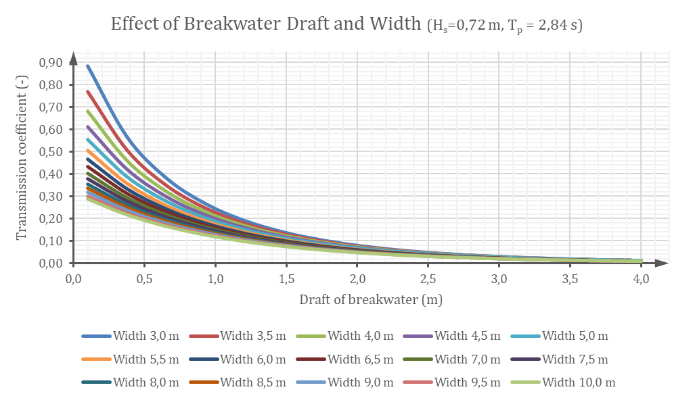
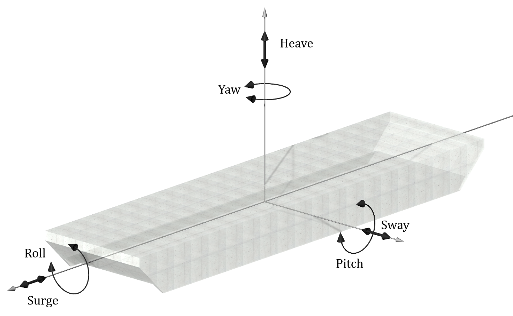
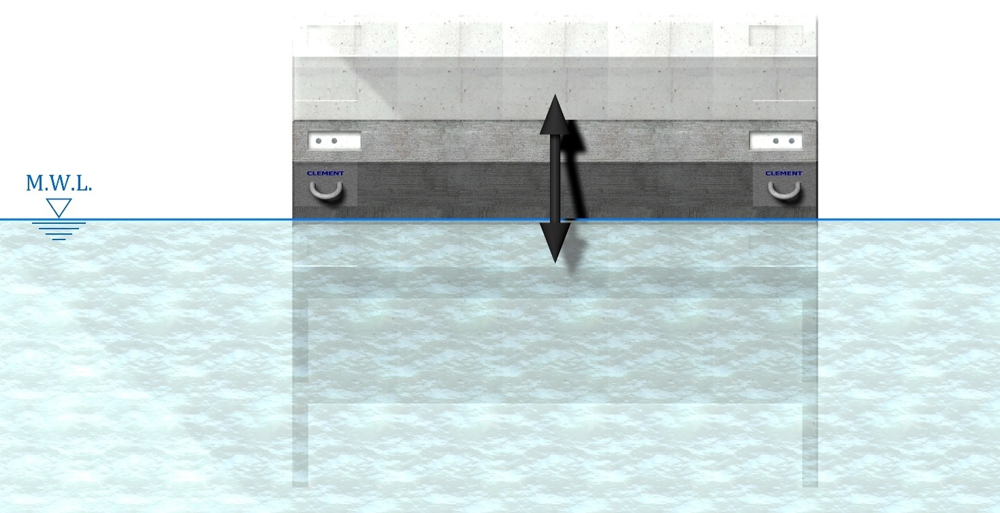

> Source: `SUREWAVE_D2.2_Requirements_for_surface_mooring_system.docx` — Document date: 2023-02-01 — Converted: 2026-09-28 via pandoc/pdftotext

---

##### 

##### 

Deliverable number: D2.2

{width="8.245833333333334in" height="3.0701388888888888in"}

#  {#section-2 .TOC-Heading}

**Disclaimer:\**

The SUREWAVE project is Funded by the European Union. Views and opinions expressed are however those of the author(s) only and do not necessarily reflect those of the European Union. Neither the European Union nor the granting authority can be held responsible for them

**Title: Requirements for surface mooring system between FPV array and breakwater**

Deliverable details

  ---------------------------------------------------------------------------------------------------------
  Work package:          WP2
  ---------------------- ----------------------------------------------------------------------------------
  Task:                  2.2 + 2.3

  Document name:         D2.2 -- Requirements for surface mooring system between FPV array and breakwater

  Lead beneficiary:      Clement Germany GmbH

  Dissemination level:   SEN

  Deliverable type:      R

  Due date:              31.01.2023

  Delivery date:         
  ---------------------------------------------------------------------------------------------------------

  ------------------------------------------------------------------------
   **Document version**    **Date**      **Author**      **Comments**[^1]
  ---------------------- ------------ ----------------- ------------------
           1.0            30.01.2023    Thomas Pehlke     Draft version

           1.1            30.01.2023   Balram Panjwani      Revision-1

           1.2            31.01.2023    Thomas Pehlke       Revision-2

           1.3            01.02.2023     Bjørn Riise        Revision-3

           1.4            01.02.2023   Virgile Delhaye      Revision-4

           2.0            01.02.2023    Thomas Pehlke     Final version
  ------------------------------------------------------------------------

+------------------------------------------------------------------------------------------------------------------------------+
| **Dissemination level**                                                                                                      |
+:===============:+:==========================================================================================================:+
| PU              | > Public: fully open                                                                                       |
+-----------------+------------------------------------------------------------------------------------------------------------+
| SEN             | > Sensitive: limited under the conditions of the Grant Agreement                                           |
+-----------------+------------------------------------------------------------------------------------------------------------+
| EU classified   | > EU classified: restraint -- UE/EU-restricted, confidential, secret-UE/EU, secret under Decision 2015/444 |
+-----------------+------------------------------------------------------------------------------------------------------------+
| **Deliverable type**                                                                                                         |
+-----------------+------------------------------------------------------------------------------------------------------------+
| R               | > Document, report (excluding the periodic and final reports)                                              |
+-----------------+------------------------------------------------------------------------------------------------------------+
| DEM             | > Demonstrator, pilot, prototype, plan designs                                                             |
+-----------------+------------------------------------------------------------------------------------------------------------+
| DEC             | > Websites, patents filing, press & media actions, videos, etc.                                            |
+-----------------+------------------------------------------------------------------------------------------------------------+
| OTHER           | > Software, technical diagram, etc.                                                                        |
+-----------------+------------------------------------------------------------------------------------------------------------+

Executive summary

This document will set the preliminary requirements for the main critical components: floating breakwater, anchoring/mooring, mechanical joints/connection elements and energy connection systems.

Deliverable review

+----------------------------------------------------------------------------------+--------------+---------------------------------------+--------------+-------------+---------------------------------------+-------------+
|                                                                                  | **Reviewer #1: Balram Panjwani**                                    | **Reviewer #2:** Bjørn Riise                                      |
|                                                                                  +--------------+---------------------------------------+--------------+-------------+---------------------------------------+-------------+
|                                                                                  | **Answer**   | **Comments**                          | **Type\***   | **Answer**  | **Comments**                          | **Type\***  |
+----------------------------------------------------------------------------------+--------------+---------------------------------------+--------------+-------------+---------------------------------------+-------------+
| 1.  Is the deliverable in accordance with                                                                                                                                                                                  |
+----------------------------------------------------------------------------------+--------------+---------------------------------------+--------------+-------------+---------------------------------------+-------------+
| (i) The Description of Work?                                                     | Yes          |                                       | M            | Yes         |                                       | M           |
|                                                                                  |              |                                       |              |             |                                       |             |
|                                                                                  | No           |                                       | m            | No          |                                       | m           |
|                                                                                  |              |                                       |              |             |                                       |             |
|                                                                                  |              |                                       | a            |             |                                       | a           |
+----------------------------------------------------------------------------------+--------------+---------------------------------------+--------------+-------------+---------------------------------------+-------------+
| (ii) The international State of the Art?                                         | Yes          | *Not applicable for this deliverable* | M            | Yes         | *Not applicable for this deliverable* | M           |
|                                                                                  |              |                                       |              |             |                                       |             |
|                                                                                  | No           |                                       | m            | No          |                                       | m           |
|                                                                                  |              |                                       |              |             |                                       |             |
|                                                                                  |              |                                       | a            |             |                                       | a           |
+----------------------------------------------------------------------------------+--------------+---------------------------------------+--------------+-------------+---------------------------------------+-------------+
| 2.  Is the quality of the deliverable in a status                                                                                                                                                                          |
+----------------------------------------------------------------------------------+--------------+---------------------------------------+--------------+-------------+---------------------------------------+-------------+
| (i) That allows it to be sent to European Commission?                            | Yes          |                                       | M            | Yes         |                                       | M           |
|                                                                                  |              |                                       |              |             |                                       |             |
|                                                                                  | No           |                                       | m            | No          |                                       | m           |
|                                                                                  |              |                                       |              |             |                                       |             |
|                                                                                  |              |                                       | a            |             |                                       | a           |
+----------------------------------------------------------------------------------+--------------+---------------------------------------+--------------+-------------+---------------------------------------+-------------+
| (ii) That needs improvement of the writing by the originator of the deliverable? | Yes          |                                       | M            | Yes         |                                       | M           |
|                                                                                  |              |                                       |              |             |                                       |             |
|                                                                                  | No           |                                       | m            | No          |                                       | m           |
|                                                                                  |              |                                       |              |             |                                       |             |
|                                                                                  |              |                                       | a            |             |                                       | a           |
+----------------------------------------------------------------------------------+--------------+---------------------------------------+--------------+-------------+---------------------------------------+-------------+
| (iii) That need further work by the Partners responsible for the deliverable?    | Yes          |                                       | M            | Yes         |                                       | M           |
|                                                                                  |              |                                       |              |             |                                       |             |
|                                                                                  | No           |                                       | m            | No          |                                       | m           |
|                                                                                  |              |                                       |              |             |                                       |             |
|                                                                                  |              |                                       | a            |             |                                       | a           |
+----------------------------------------------------------------------------------+--------------+---------------------------------------+--------------+-------------+---------------------------------------+-------------+

Table of Content

1\. Introduction [4](#introduction)

1.1. General [4](#general)

1.2. Description of deliverable [4](#description-of-deliverable)

1.3. Description of related tasks [4](#description-of-related-tasks)

2\. Description of assembly components [6](#description-of-assembly-components)

2.1. Assembly overview [6](#assembly-overview)

2.2. Floating breakwater (FB) [7](#floating-breakwater-fb)

2.3. Floating PV array (FPV) [7](#floating-pv-array-fpv)

2.4. Anchoring (AN) [8](#anchoring-an)

2.5. Connection (CO) between floating breakwater and FPV array [8](#connection-co-between-floating-breakwater-and-fpv-array)

2.6. Interaction between the components [8](#interaction-between-the-components)

3\. Evaluation [9](#evaluation)

3.1. General [9](#general-1)

3.2. Preliminary design considerations [15](#preliminary-design-considerations)

3.3. Summary of technical requirements [30](#summary-of-technical-requirements)

4\. Bibliography, References [33](#bibliography-references)

# Introduction

## General

This deliverable is related to the technical objective ***O1 -- "Novel floating PV design for offshore extreme conditions"*** with following sub-objectives:

- Research and design on novel ***breakwater*** concept with a large wave attenuation effect, as external element for the protection and attenuation of the wind, waves, and currents harmful to the internal FPV elements whilst ensures that overall structure is safely and non-destructively conducting associated forces into the anchoring, not impairing the functionality of the PV-systems.

- Research and optimization of the ***coupling design between external breakwater and internal FPV***, including innovative mechanical joints designs to ensure a robust and flexible design and optimal structural behaviour.

- Optimizing ***anchoring and mooring*** of the full FPV system including it in the whole breakwater design as a critical element affecting its structural behaviour owing to extreme offshore conditions.

While the individual components of the system are developed and investigated in WP3, the tasks from WP2 shall set out the basic design requirements for this development.

## Description of deliverable

The deliverable D2.2 summarizes the results of investigations and determinations of critical components (floating breakwater, anchoring, connections between breakwater and FPV array). This results in technical requirements that are expressed as basic design criteria regarding required force transmission, moveability, geometric boundary conditions, material properties, dynamic behaviour, and durability requirements, which serve as a basis for further design of components in WP3.

## Description of related tasks

The associated tasks/subtasks are:

#### T2.2 -- Research, analysis, and preliminary requirements of critical components 

1)  ***Breakwater:*** A model, based on best practice marine engineering and in the extension of already available research results, will be developed by CLEMENT, indicating the dominating loads on the structure to create a predictable wave spectrum for the floating installation behind, with the critical collaboration of ACC (Acciona construction, a SUREWAVE partner) who will develop the physical solution under a new circular concrete material solution within WP4.

2)  ***Anchoring / mooring:*** CLEMENT will specify the anchoring and mooring design for an optimal FPV operation in offshore conditions with the breakwater. In the breakwater model, the anchoring technology will be researched considering the specific requirements of targeted use-case locations (*as defined in deliverable D2.1* \[1\]) and based on conceptual anchoring of DNVGL-OS-E301, also considering the minimization of the use of resources and impact on the environment.

3)  ***Mechanical joints/connection elements:*** The mechanical joints will require a substantial degree of innovation, research, and development by SINTEF, considering the loads subjected on the joints between the individual concrete breakwaters. The detailed maximum load and fatigue analysis will be carried out in WP6, based on the preliminary requirements and results from this subtask.

4)  ***Energy connection systems:*** Within this subtask, several mature elements (electrical interface to the inverter, transformer station, DC home runs from FPV) have been excluded, and the focus will be put on the research and requirements definition for the junction box, routing and collection of the DC home runs and the physical interface between floating solar installation and the breakwater, by SIS with the key support of SINTEF. *🡪 This subtask is treated in deliverable D2.3* \[2\]*.*

#### 

#### T2.3. -- Integration requirements with a breakwater and other critical components

1)  ***Mechanical joining of the breakwater and FPV array:*** The interface between the breakwater and FPV array will be deeply analysed and understood. The breakwater will be moored to the anchoring system while the FPV array will be moored to the breakwater. This task focuses on establishing a knowledge base for designing the surface mooring system. All implications of the on-site deployment of the FPV installation, or off-site assembly of the FPV array will be considered and the requirements will be defined. For instance, off-site assembly of the FPV array results in strict requirements for tugging the array to the installation site, whereas on-site assembly implies restrictions on the sea state during installation. HSE requirements, tools, vessels, and workload will all be considered in this task.

# Description of assembly components

## Assembly overview

The conceptual approach of SUREWAVE is shown in [Figure 1](#_Ref125446912).

![[]{#_Ref125446912 .anchor}Figure 1 - Conceptual approach of SUREWAVE](../images/2023-02-01_surewave_d2.2_requirements_surface_mooring_system/image4.png){alt="Graphical user interface, diagram Description automatically generated" width="6.6930555555555555in" height="3.8065693350831147in"}

The main components of the concept are shown in [Figure 2](#_Ref125448620).

![[]{#_Ref125448620 .anchor}Figure 2 - Overview of main components](../images/2023-02-01_surewave_d2.2_requirements_surface_mooring_system/image5.png){width="2.5498425196850394in" height="1.3538254593175854in"}

## Floating breakwater (FB)

Generally, floating breakwaters can be divided into categories according to their appearance. The most common type is the pontoon floating breakwater as a prismatic/rectangular structure (single or double pontoon, or other variations) \[3\]. Most of these breakwaters are constructed of reinforced concrete modules with either flexible or pre- or post-tensioned connections to form larger monolithic structures \[4\] \[5\].

These modules are often produced as precast elements with transportable sizes to be economically reasonable and technically feasible.

The SUREWAVE concept intends that the breakwater protects the floating PV system from waves. Depending on the location, a completely circumferential or a sectional arrangement in the wave-dominated direction is required.

## Floating PV array (FPV)

The floating PV system consists of single FPV units of "Sunlit Sea FPV model 1 ([Figure 3](#_Ref126056467))" with a size of 1,88 m x 1,88 m x 0,085 m. The units consist of a photovoltaic (PV) panel sealed to an aluminium float, which provides a fully built-in solution lying flat on the water surface. The single units are connected to each other to form a larger array. Further details and a description of the energy connection system are available in deliverable D2.3 \[2\].

![[]{#_Ref126056467 .anchor}Figure 3 - SunLit Sea concept](../images/2023-02-01_surewave_d2.2_requirements_surface_mooring_system/image6.jpeg){width="5.441558398950131in" height="3.054676290463692in"}

## Anchoring (AN)

The floating breakwaters and the floating PV system respectively need to be kept in position by the anchoring. SUREWAVE FPV solution deployment is planned for deep sea conditions. Therefore, the anchoring consists of an anchor made of fluke anchors, plate anchors, anchor piles, suction anchors, or gravity anchors and a connection between the anchor and the floating breakwater made of anchors chains, steel wire ropes, or fibre ropes.

General requirements are already available in DNVGL-OS-E301 \[6\]. However, the selection of the appropriate anchoring system depends on the site conditions, the layout of the breakwater and any required function as an additional damping element. This also applies to the decision between a single-point and a multi-point anchoring.

## Connection (CO) between floating breakwater and FPV array

The SUREWAVE concept does not consider a separate anchoring of the floating PV system (FPV), but only of the floating breakwater (FB). In order to keep the FPV in place and to avoid a collision with the FB, a connection between FPV and FB is necessary. This includes a load transfer induced from the FPV to the breakwater and possibly also in the other direction. Subject to the layout of the breakwater, tension, and compression forces can occur.

Under certain circumstances, it might be necessary that the FPV also gets an additional anchoring, especially if at partially protected locations the FB is placed only in the direction of the predominating waves.

## Interaction between the components

The interaction between components including desired functions and properties is illustrated in [Figure 4](#_Ref125629971).

![[]{#_Ref125629971 .anchor}Figure 4 - Interaction between components (larger resolution in Appendix A)](../images/2023-02-01_surewave_d2.2_requirements_surface_mooring_system/image7.emf){width="6.6930555555555555in" height="4.140406824146981in"}

The individual categories can be described as follows:

"*Desired Functions*" summarizes the main objectives for each component.

"*Input*" describes the minimum requirements to be considered in the design.

"*Properties (pre-defined)*" refers to the required properties that result from the specifications of the proposal or its boundary conditions.

"*Properties (functional)*" results from functional requirements.

"*Interaction*" shows with arrows the dependency of individual components on each other.

# Evaluation

## General

### Identification of the problem

The basic idea of SUREWAVE is the generation of power by means of FPV systems, which are to be located in exposed locations (offshore). Since floating solar plants have so far only been developed for sheltered locations, there is a need for wave protection, which essentially has to perform the following tasks:

- Protection against low period waves to avoid dynamic excitation and wave spillover,

- Stabilization of the overall system for waves of a larger period,

- Anchoring of the FPV due to the connection between FB and FPV, and

- Accommodation of the power cable from the FPV to the anchoring.

Simply because of mass, size, and exposure, the FB and the FPV have different dynamic floatation characteristics. However, due to the connection between the two components, there is an interaction that, while necessary due to the mentioned tasks, should not be disadvantageous.

Therefore, the task of the connection cannot just simply be reduced to load transfer and space keeping. It must be checked in detail how the FB behaves in different waves, which wave energy is transmitted and how the transmitted wave affects the FPV.

### Site conditions

General wind, wave, and current conditions are summarized in the proposal objectives for European sea-basins with open-sea very harsh environments and implemented in deliverable D2.1 \[1\]. This includes wind speeds \>25 m/s, currents \> 1,2 m/s, and wave heights \> 14 m.

However, the entire wave spectrum must be considered in the design because even waves of low heights or small periods can have an unfavourable effect on the system.

There are different approaches to determine the corresponding design parameters. The more realistic approach is wave determination based on statistical evaluations of hindcast data for real locations. This is done for a chosen set of locations in deliverable D2.1 \[1\] based on hindcast date from the European Centre for Medium-Range Weather Forecasts (ECMWF) with a probability prediction according to Haver & Winterstein \[7\] and DNV-RP-C205 \[8\].

Another approach is wave prediction according to the Shore Protection Manual (SPM) \[9\] or Silvester & Hsu \[10\] for deep-water conditions and as a function of fetch length, wind speed, and wind duration. If it is assumed that the sea state is not fetch- but duration limited and the water depth is sufficient for deep-water conditions, then the only variables are the wind speed and the wind duration. In combination with classifying scales such as the Beaufort scale or the World Meteorological Organization (WMO) code table 3700 for sea states, a gradation of the wave parameters can be made depending on the wind speed.

The SPM \[9\] provides the following equations as limits for a fully arisen sea:

  -----------------------------------------------------------------------------------------------
  $$\widetilde{H} = \frac{g \bullet H_{s}}{U^{2}} = 0,2433$$     []{#_Ref126057785 .anchor}(3‑1)
  ------------------------------------------------------------- ---------------------------------
  $${\widetilde{T}}_{p} = \frac{g \bullet T_{p}}{U} = 8,134$$                 (3‑2)

  $$\widetilde{t} = \frac{g \bullet t}{U} = 71500$$              []{#_Ref126057790 .anchor}(3‑3)
  -----------------------------------------------------------------------------------------------

The SPM uses a wind stress factor $U_{A}$ instead of the wind speed in 10 m height ($U_{10}$).

  ------------------------------------------------
  $$U_{A} = 0,71 \bullet U_{10}^{1,23}$$   (3‑4)
  ---------------------------------------- -------

  ------------------------------------------------

with

  ----------------------------------------------------
  $$H_{s}$$   ...   Significant wave height (m)
  ----------- ----- ----------------------------------
  $$T_{p}$$   ...   Peak wave period (s)

  $$g$$       ...   Gravity acceleration (9,81 m/s²)

  $$t$$       ...   Wind duration (s)

  $$U$$       ...   Wind speed (m/s)
  ----------------------------------------------------

In equations [(3‑1)](#_Ref126057785) to [(3‑3)](#_Ref126057790), $\widetilde{H}$, ${\widetilde{T}}_{p}$, and $\widetilde{t}$ are dimensionless parameters.

However, this application is not recommended by Bishop \[11\], as it can lead to highly overestimated wave parameters. If the wind speed $U_{10}$ is used, the equations correspond to those in the publication by Hasselmann \[12\].

For illustration purposes, the following [Figure 5](#_Ref125540510) was taken from the SPM.

![[]{#_Ref125540510 .anchor}Figure 5 - Wave prediction according to SPM for deep-water conditions \[9\] (Layout edited)](../images/2023-02-01_surewave_d2.2_requirements_surface_mooring_system/image8.png){width="6.692913385826771in" height="4.58998031496063in"}

Silvester and Hsu \[10\] give equation [(3‑5)](#_Ref125613542) that describes the required time $T_{\lim}$ for fully developed sea for a specific wind speed $U$ and fetch $x$.

  -----------------------------------------------------------------------------------------
  $$T_{\lim} = 3078 \bullet \sqrt[3]{U \bullet x^{2}}$$   []{#_Ref125613542 .anchor}(3‑5)
  ------------------------------------------------------- ---------------------------------

  -----------------------------------------------------------------------------------------

If the duration is longer, the fetch length is the limited variable. The fetch limited wave height and period can be calculated according to the fetch limited wave prediction and the following equations \[10\]:

  -------------------------------------------------------------------------------------------------------------------------------------------------------------------------------------------------------------------------------------------------------------------------------------------------------------------------------------
  $$H_{s} = 0,026 \bullet U^{2} \bullet \tanh{\left\lbrack 3,326 \bullet \left( d_{w} \bullet U^{- 2} \right)^{\frac{1}{4}} \right\rbrack\sqrt{\tanh\left\{ \frac{0,422 \bullet x \bullet U^{- 2}}{\tanh^{2}\left\lbrack 3,326 \bullet \left( d_{w} \bullet U^{- 2} \right)^{\frac{1}{4}} \right\rbrack} \right\}}}$$            (3‑6)
  ----------------------------------------------------------------------------------------------------------------------------------------------------------------------------------------------------------------------------------------------------------------------------------------------------------------------------- -------
  $$T_{p} = 0,846 \bullet U \bullet \tanh{\left\lbrack 1,789 \bullet \left( d_{w} \bullet U^{- 2} \right)^{\frac{3}{8}} \right\rbrack \bullet \sqrt[3]{\tanh\left\{ \frac{0,422 \bullet x \bullet U^{- 2}}{\tanh^{3}\left\lbrack 1,789 \bullet \left( d_{w} \bullet U^{- 2} \right)^{\frac{3}{8}} \right\rbrack} \right\}}}$$    (3‑7)

  -------------------------------------------------------------------------------------------------------------------------------------------------------------------------------------------------------------------------------------------------------------------------------------------------------------------------------------

with

  ------------------------------------------------------
  $$d_{w}$$   ...   Average water depth over fetch (m)
  ----------- ----- ------------------------------------
  $$H_{s}$$   ...   Significant wave height (m)

  $$T_{p}$$   ...   Peak wave period (s)
  ------------------------------------------------------

For duration limited wave prediction, the fetch length must be replaced by an effective fetch $x_{E}$ according to the following equation:

  --------------------------------------------------------------------------------------------
  $$x_{E} = \left( \frac{T_{\lim}}{3078 \bullet \sqrt[3]{U}} \right)^{\frac{1}{2}}$$   (3‑8)
  ------------------------------------------------------------------------------------ -------

  --------------------------------------------------------------------------------------------

![Figure 6 - Comparison between wave prediction methods according to SPM \[9\] and Silvester and Hsu \[10\]](../images/2023-02-01_surewave_d2.2_requirements_surface_mooring_system/image9.png){width="6.3710225284339455in" height="4.157227690288714in"}

An indication of an average relationship between the Beaufort wind scale and the significant wave height and the average wave periods is given in Journée and Massie \[13\] for open ocean and North Sea areas.

Figure 7 - Wave spectrum parameter estimates - Open Ocean Areas (Bretschneider) \[13\]

Figure 8 - Wave spectrum parameter estimates -- North Sea Areas (JONSWAP) \[13\]

With above mentioned approaches, a wide range of wave height and period combinations can be obtained as basis for the setting of incident waves.

### Desired conditions 

The FPV panels are relatively lightweight and have only a small freeboard due to their construction. Therefore, they are particularly susceptible to waves of low heights and small periods. Long waves or waves of higher periods are less problematic, as the panels simply float with the wave on the water surface. The harmful frequency ranges must be investigated as part of the project.

According to the state-of-the-art, floating breakwaters are most effective for small wave heights and small periods. With increasing periods, however, the effectiveness decreases and the transmission increases. In addition, the dynamic behaviour of the FB can create secondary waves that have an unfavourable effect on FPV.

As part of the FB design, the attenuable frequency ranges with the associated degree of attenuation must be superimposed on the frequency ranges permitted for the FPV.

This results in specifications regarding the necessary flexibility of the connection and, by determining the phase shift, the required distance between FB and FPV.

## Preliminary design considerations

### Analysis process

Based on the proposed analysis process of PIANC \[14\] and the calculation process of Fousert \[15\] the development of the design is considered according to the following diagram:

### Characteristic methods of reducing wave heights

The performance of a FB, respectively the effectiveness, is characterized by the transmission coefficient which is usually defined satisfactorily for regular waves as the ratio of the transmitted wave height to the incident wave height:

  -----------------------------------------
  $$C_{t} = \frac{H_{t}}{H_{i}}$$   (3‑9)
  --------------------------------- -------

  -----------------------------------------

For wave climates of short-crested irregular waves, the definition may need to reflect the amount of energy transmission instead of wave height transmission. The transmission coefficient is formulated as the ratio of the transmitted wave height squared to the incident wave height squared \[3\]:

  --------------------------------------------------
  $$C_{t} = \frac{H_{t}^{2}}{H_{i}^{2}}$$   (3‑10)
  ----------------------------------------- --------

  --------------------------------------------------

The transmitted wave height on the leeward side of incident wave energy transmits under the FB. The reduction in wave height occurs because of the interaction between the FB and the incident waves. This interaction occurs in the following ways:

#### Reflection of energy

Incident wave energy reflects from vertical or inclined surfaces back to seawards. The amount of energy that is reflected in seawards depends on the incident wave height, the draft and the freeboard of the FB, and the water depth in relation to the draft \[5\].

#### Absorption of energy

Incident wave energy is absorbed by the structure and subsequent transformation of the energy back into the water in other waveforms may be achieved through motion induced into the FB. The absorbed energy is transmitted back to the water primarily in the form of secondary out-of-phase wave trains. The amount of absorption is influenced by the mass of the FB, its moment of inertia, its relative change in buoyancy during the passage of waves, and its relative width with respect to the wave climate \[5\].

#### Dissipation of energy

Incident wave energy dissipates through transformation into heat, sound, friction, and turbulence. This is achieved by breaking of waves on sloping surfaces or against structural members of the breakwater. Dissipation is mainly influenced by the geometry of the FB and mooring restraints \[5\].

### Factors affecting the efficiency of the FB

Referring to chapter [3.2.2](#characteristic-methods-of-reducing-wave-heights), the performance of a FB depends on its physical and hydrodynamic characteristics and its anchoring as well as on the site conditions. Therefore, the transmission is influenced by the following items:

- Incident waves (significant height, period, length)

- FB geometry (width and draft)

- FB mechanical properties (centre of gravity, total mass, moment of inertia)

The transmission coefficient is given by PIANC \[14\] with the expression:

  ----------------------------------------------------------------------------------------------------------------------------------------------------------------------------------------------------------------------------------------------------------------------------------------------------------------------------------------------------------------------------------------------------------------
  $$C_{t} = f\left( \underset{Wave}{\overset{\frac{d}{L};\frac{H}{L}}{︸}}\ ;\underset{Geometry}{\overset{\frac{W}{L};\frac{h}{d}}{︸}};\ \underset{Mass}{\overset{\frac{M}{\rho\ W\ h};\frac{I}{M\ W^{2}}}{︸}}\ ;\underset{Mooring}{\overset{\frac{h_{G}}{h};\frac{k\ W}{M\ g}}{︸}}\ ;\underset{Viscosity}{\overset{\theta\ ;\ \frac{W\sqrt{g\ d}}{\gamma}}{︸}} \right)$$   []{#_Ref126160755 .anchor}(3‑11)
  ----------------------------------------------------------------------------------------------------------------------------------------------------------------------------------------------------------------------------------------------------------------------------------------------------------------------------------------------------------------------------- ----------------------------------

  ----------------------------------------------------------------------------------------------------------------------------------------------------------------------------------------------------------------------------------------------------------------------------------------------------------------------------------------------------------------------------------------------------------------

Therein, the regular wave is characterized by its height (H), its period (T), and its length (L). The geometry of the FB is described with the width (W) and the total height (h). The mechanical properties of the FB are defined with the centre of mass (h~G~), the total mass (M), and the inertia (I). The following [Figure 9](#_Ref126160708) shows the parameters of equation [(3‑11)](#_Ref126160755).

![[]{#_Ref126160708 .anchor}Figure 9 - Factors affecting the efficiency of the FB \[14\]](../images/2023-02-01_surewave_d2.2_requirements_surface_mooring_system/image10.png){width="6.6930555555555555in" height="2.5131944444444443in"}

### The geometry of the FB

A variety of geometries of FB have been evaluated in the past, both numerically and in model tests. Besides the dynamic behaviour, mainly the efficiency was investigated and the study showed that the efficiency depends on the width and draft of FB.

The following diagrams have been taken as examples from publications. They show the transmission coefficients for different breakwater configurations.

![[]{#_Ref125813447 .anchor}Figure 10 - Wave transmission coefficient as a function of wave period for various floating breakwater configurations valid for pile anchored mooring arrangements in water depths greater than or equal to 6,0 m \[16\]](../images/2023-02-01_surewave_d2.2_requirements_surface_mooring_system/image11.png){width="5.224879702537183in" height="4.300203412073491in"}

![Figure 11 - Floating breakwater configuration subjected to model testing \[16\]](../images/2023-02-01_surewave_d2.2_requirements_surface_mooring_system/image12.png){width="6.6930555555555555in" height="8.234722222222222in"}

It is shown that the transmission coefficient decreases with increases in the width and depth of the FB. Therefore, a combination of large width and draft is preferable.

{width="3.267716535433071in" height="4.7952755905511815in"}{width="3.267716535433071in" height="4.7952755905511815in"}

![[]{#_Ref125641789 .anchor}Figure 12 - Floating breakwater performance with 1,5 m deep unit configuration including catamarans (left) and catamarans including curved and slatted keels (right) \[17\]](../images/2023-02-01_surewave_d2.2_requirements_surface_mooring_system/image15.png){width="4.663301618547681in" height="3.7455260279965006in"}

![[]{#_Ref125638614 .anchor}Figure 13 - Floating bodies with fundamental cross section in freely floating system \[18\]](../images/2023-02-01_surewave_d2.2_requirements_surface_mooring_system/image16.png){width="5.677083333333333in" height="7.21875in"}

[]{#_Ref125638596 .anchor}Figure 14 - Transmission coefficient $\frac{H_{T}}{H_{I}}$ related to the value of $T/T_{W}$ or $B/L$ \[18\]

The symbols in the diagrams indicate:

  -------------------------------------------------------------------------------------
  $$T$$       ...   Natural oscillation period of the floating body
  ----------- ----- -------------------------------------------------------------------
  $$T_{w}$$   ...   Wave period

  $$B$$       ...   Average width of the floating body ($W\ in\ other\ publications)$

  $$L$$       ...   Wave length
  -------------------------------------------------------------------------------------

The diagrams in [Figure 14](#_Ref125638596) are related to the floating bodies shown in [Figure 13](#_Ref125638614). They consider different cross sections of the floating body and its natural oscillation period.

The results of publications are compared and summarized for a fixed FB (cuboid of infinite length) as a function of breakwater draft and width. The transmission coefficients in [Figure 15](#_Ref125699125) to [Figure 18](#_Ref125641662) were determined according to Macagno's formula \[19\] for a rectangular, fixed, and infinitely long breakwater with a draft $d_{P}$, and width $W_{P}$, a water depth $d$, subject to regular waves with $k = \frac{2 \bullet \pi}{L}$

  ---------------------------------------------------------------------------------------------------------------------------------------------------------------------------------------------------------------------
  $$C_{t,M} = \frac{1}{\sqrt{1 + \left\lbrack k \bullet W_{P} \bullet \frac{\sinh{k \bullet d}}{2 \bullet \cosh\left( k \bullet d - k \bullet d_{P} \right)} \right\rbrack^{2}}}$$   []{#_Ref125697229 .anchor}(3‑12)
  ---------------------------------------------------------------------------------------------------------------------------------------------------------------------------------- ----------------------------------

  ---------------------------------------------------------------------------------------------------------------------------------------------------------------------------------------------------------------------

Equation [(3‑12)](#_Ref125697229) indicates the expected wave transmission, even if dynamic aspects have not yet been considered. For the time being, this is sufficient for an estimation. For further investigations, however, the dynamic effects must be taken into account.

Ruol, Martinelli, and Pezzutto \[20\] are proposing a correction of Macagno's formula accounting for dynamic effects.

  --------------------------------------------------
  $$C_{t} = \beta(\chi) \bullet C_{t,M}$$   (3‑13)
  ----------------------------------------- --------

  --------------------------------------------------

Macagno's formula is based on four variables. Ruol, Martinelli and Pezzutto \[20\] introduce a combination of these variables, indicated by $\chi$, which is shown as a simplification of $\frac{T_{p}}{T_{h}}$.

  ---------------------------------------------------------------------------------------------------------------------------------------
  $$\chi \approx \frac{T_{p}}{T_{h}} \approx \frac{T_{p}}{2 \bullet \pi} \bullet \sqrt{\frac{g}{d_{P} + 0,35 \bullet W_{P}}}$$   (3‑14)
  ------------------------------------------------------------------------------------------------------------------------------ --------

  ---------------------------------------------------------------------------------------------------------------------------------------

To fit the ratio between experimental and numerical transmission coefficient, a correction formula $\beta$ is proposed by the authors \[20\] as a function of $\chi$, considering the boundary conditions for very long and very short waves resulting in $\beta = 1$ for $\chi > 1,3$ and $\chi < 0,3$.

  --------------------------------------------------------------------------------------------------------------------------------------------------
  $$\beta = \frac{1}{1 + \left( \frac{\chi - \chi_{0}}{\sigma} \right) \bullet e^{- \left( \frac{\chi - \chi_{0}}{\sigma} \right)^{2}}}$$   (3‑15)
  ----------------------------------------------------------------------------------------------------------------------------------------- --------

  --------------------------------------------------------------------------------------------------------------------------------------------------

where $\chi_{0} = 0,7919$ (with 95% confidence interval 0,7801; 0,8037) and $\sigma = 0,1922$ (0,1741; 0,2103).

The validation of the equations above is based on test results of wave transmission published in the studies of Martinelli et al. \[21\], Gesraha \[22\], Koutandos, et al. \[23\], Cox et al. \[24\], and Peña et al. \[25\].

![[]{#_Ref125699125 .anchor}Figure 15 - Effect of breakwater draft and width for $H_{s} = 0,36\ m$ and $T_{p} = 2,23\ s$](../images/2023-02-01_surewave_d2.2_requirements_surface_mooring_system/image17.png){width="6.377952755905512in" height="2.521742125984252in"}

{width="6.377952755905512in" height="2.5413845144356957in"}

![[]{#_Ref125699150 .anchor}Figure 17 - Effect of breakwater draft and width $H_{s} = 0,90\ m$ and $T_{p} = 3,07\ s$](../images/2023-02-01_surewave_d2.2_requirements_surface_mooring_system/image19.png){width="6.377952755905512in" height="3.319919072615923in"}

As shown in [Figure 15](#_Ref125699125) to [Figure 17](#_Ref125699150), when the draft is about twice the wave height, the width has only a negligible influence.

[Figure 18](#_Ref125641662) represents the transmission coefficient of a fixed FB subject to breakwater width and wave period.

![[]{#_Ref125641662 .anchor}Figure 18 - Effect of breakwater width and wave period for a draft of 0,8 m and a wave height of 1,0 m](../images/2023-02-01_surewave_d2.2_requirements_surface_mooring_system/image20.png){width="6.6930555555555555in" height="3.270138888888889in"}

The results are quite comparable with the results of Cox, Blumberg, and Wright \[17\] as shown in [Figure 12](#_Ref125641789).

### Breakwater motions

Wave action on FB results in six degrees of movement with a heave, sway and surge as horizontal and vertical displacements and roll, yaw, and pitch as rotations about the axis of the FB. These movements are shown in the following figure:

{width="4.595660542432196in" height="2.8346456692913384in"}

Considering a perpendicular wave direction, the motion of the FB can be simplified to the three degrees of motion heave, roll, and sway as shown in [Figure 20](#_Ref119406557) to [Figure 22](#_Ref119406575):

![[]{#_Ref119406557 .anchor}Figure 20 - Sway motion of a FB](../images/2023-02-01_surewave_d2.2_requirements_surface_mooring_system/image22.jpeg){width="6.102362204724409in" height="1.9224628171478566in"}

{width="6.102362204724409in" height="3.1366808836395452in"}

![[]{#_Ref119406575 .anchor}Figure 22 - Roll motion of a FB](../images/2023-02-01_surewave_d2.2_requirements_surface_mooring_system/image24.jpeg){width="6.102362204724409in" height="2.5916185476815397in"}

For wave directions with an oblique angle to the FB, the motion is the result of all six degrees of motion.

The moored FB has natural periods for each motion, which are subject to the physical and hydrodynamic characteristics of the FB, its anchoring system, and the connection restraints of adjacent breakwater modules. These are mainly the following properties:

- Geometry of FB

- Mass of FB and distribution of mass

- Moments of inertia of FB

- Mooring line characteristics e.g., length, weight, elasticity, and pre-tension of mooring lines

- Connection characteristics e.g., degrees of freedom, load transfer, allowable movements, pre-tension of connections

Secondary waves are generated by each of the motions. These waves radiate outwards with relative magnitude and phase relationships depending on the mentioned properties of the FB and its anchoring.

For incident wave periods greater than approx. 4 seconds, the secondary waves behind the FB generated by breakwater motion are negligible compared to the residual wave heights resulting from wave energy transmitted under the FB \[5\].

In the diagrams of [Figure 14](#_Ref125638596) \[18\] and other publications (e.g. Ruol, Martinelli, and Zanuttigh \[26\]) it is shown that waves shorter than the draft of the FB cannot transfer energy below the floating body. Waves are reflected and the FB moves slightly back and forward (sway).

Wave with periods equal to the natural oscillation period ($T_{n}$) of the FB induce orbital movements (roll) even greater than that of the surface water. Accordingly, the FB generates secondary waves, which are in opposition of phase with the incident waves when the peak period ($T_{p}$) is smaller than $T_{n}$ or in a phase when $T_{p}$ is greater than $T_{n}$.

Dissipation is certainly related to the relative motions between the float and the water, so that greater dissipation of waves near the natural period occurs for short waves or for waves near the natural period, while very little dissipation is expected for long waves \[26\].

## Summary of technical requirements

### Force transmission

Globally, loads from wind, waves, and currents act on the assembly. These loads must be safely transferred into the seabed. It is intended that the connection between the anchor or anchors and the assembly will be made directly via FB, as this is also where the largest proportion of the actions occur. Nevertheless, forces still act within the system, which then must be transferred to the anchoring via the FB. Therefore, the connection between FB and FPV also takes over the task of anchoring the FPV.

As already described in section [2.5](#connection-co-between-floating-breakwater-and-fpv-array), the connection should not only have an anchoring effect but should also keep the distance between both components (FB and FPV) constant or at a minimum distance to be defined. Thus, there is the possibility of an opposing motion of FB and FPV when acted upon by waves and phase shifting of the incident wave to the transmitted wave occurs.

### Moveability

The connection between FB and FPV must not transmit any moments besides the mentioned tasks. A rigid, unhinged connection would transmit the roll movements directly so that the damping effect would be less or not present.

Depending on how both components move for themselves and in relation to each other, and how a force transmission is connected with these movements, it must be determined in the further course whether the connection must be designed as a tension or compression bar or both. If necessary, damping or elastic properties may also be required.

### Geometric boundaries

The dependence of the geometry of the FB on the efficiency has already been described in previous sections. Especially for small-period waves, the transmission must be reduced to a minimum. It must be investigated which wave spectrum is harmful to the FPV or up to which spectrum a wave attenuation must take place. Accordingly, the geometry of the FB can be defined, using the preliminary approach, mentioned earlier, which needs to be confirmed numerically and experimentally.

In addition, the dimensions of the individual wave breaker elements are basically not limited, but with increasing size, the total weight will be the limiting criterion. In this respect, the minimum size must be selected so that the required wave attenuation takes place, but at a maximum so that the total weight remains in a transportable and handleable condition.

As can be seen from [Figure 10](#_Ref125813447) to [Figure 12](#_Ref125641789), the catamaran type has the most effective characteristics in terms of wave attenuation. This type consists of two keels or floats that are firmly connected to each other at a defined distance. Either the buoyancy is realized directly by the keels or floats or additionally also by the connection between them. In further investigations, this type will be considered, as shown in [Figure 23](#_Ref125714931).

### Material properties

The SUREWAVE proposal is to use a new circular material solution for the FB. According to conventional construction methods, the FB consists of a core of polystyrene and a shell of reinforced concrete. The water absorption of the polystyrene is a maximum of 2% by volume and is therefore almost negligible. Therefore, the core also serves as a buoyancy body. However, it is not assigned any stability-relevant functions from a static point of view.

Both components shall be replaced within the proposal. The shell is to be made of ultra high performance fiber reinforced concrete (UHPFRC), which has a high compressive strength (approx. 130 kN/m²) and thus also a high density (approx. 2.400 kg/m³). Therefore, the aim of the project is also to reduce the wall thicknesses of the outer shell and thus also the total volume of concrete.

The core is also to be made of concrete, a flowable foam concrete. However, according to the state of the art, flowable foam concrete still absorbs a large amount of water (\>20% by volume), so a significantly higher weight of the breakwater elements is to be expected, not only due to the higher dead weight of flowable foam concrete (approx. 300 kg/m³) compared to polystyrene (approx. 15 to 30 kg/m³), but also due to the water absorption. Therefore, in the further course of the project, it must be examined to what extent the water absorption can be reduced or prevented and at the same time the dead weight can be reduced as far as possible.

The following [Table 1](#_Ref125714793) indicates the ratio between the intended composition with new circular materials against the common construction. This refers to a cross section as shown in [Figure 23](#_Ref125714931).

![[]{#_Ref125714931 .anchor}Figure 23 - Typical FB cross section](../images/2023-02-01_surewave_d2.2_requirements_surface_mooring_system/image25.png){width="6.364583333333333in" height="3.2666896325459316in"}

+--------------------+----------------------------------+-------------------------------------+
|                    | ***Common construction method*** | ***Intended composition***          |
+:===================+:================================:+:================:+:================:+
| Dimensions         | 20,0 m x 5,0 m x 2,5 m           | 20,0 m x 5,0 m x 2,5 m              |
+--------------------+----------------------------------+------------------+------------------+
| Keel               | 0,8 m                            | without keel     | 0,8 m            |
+--------------------+----------------------------------+------------------+------------------+
| Weight             | approx. 100 tons                 | approx. 168 tons | approx. 132 tons |
+--------------------+----------------------------------+------------------+------------------+
| Material for walls | Reinforced concrete              | UHPFRC                              |
+--------------------+----------------------------------+-------------------------------------+
| Material for core  | Polystyrene                      | Flowable foam concrete              |
+--------------------+----------------------------------+-------------------------------------+
| Water absorption   | \< 2% by volume                  | \> 20 % by volume                   |
+--------------------+----------------------------------+------------------+------------------+
| Freeboard          | 0,7 m                            | 0,7 m            | 0,35 m           |
+--------------------+----------------------------------+------------------+------------------+
| Draft              | 1,8 m                            | 1,8 m            | 2,15 m           |
+--------------------+----------------------------------+------------------+------------------+

: []{#_Ref125714793 .anchor}Table 1 - Comparison between FB common construction method and intended method

### Durability requirements

In principle, the components must be designed in accordance with the Eurocode standards for the respective materials. With appropriate application, a design life of at least 50 years can be assumed. Generally, floating structures are movable installations. All components that can move in relation to each other or that are subject to dynamic loads are subject to wear and tear. Therefore, it must be defined in advance exactly what wear parts are and how they can be replaced. Planned or deliberately arranged wear parts prevent damage to load-bearing components through their wear. Proper maintenance extends the service life and reduces wear.

# Bibliography, References

The following list summarizes applicable rules and regulations, standards, recommendations, and other relevant references. Unless otherwise noted, standards and guidelines are applied in their latest revision/edition.

  -----------------------------------------------------------------------------------------------------------------------------------------------------------------------------------------------------------------------------------------------------------------------------------------------
  \[1\]    SUREWAVE Consortium, *Deliverable D2.1 - Use case scenario basis for typical, rough location,* 2023.
  -------- --------------------------------------------------------------------------------------------------------------------------------------------------------------------------------------------------------------------------------------------------------------------------------------
  \[2\]    SUREWAVE Consortium, *Deliverable D2.3 - High level understanding of the system general loads,* 2023.

  \[3\]    L. Z. Hales, „Floating breakwaters: State-of-the-Art - Literature review," U.A. Army, Corps of Engineers, Fort Belvoir, 1981.

  \[4\]    B. L. McCartney, „Floating breakwater design," Journal of Waterway, Port, Coastal, and Ocean Engineering, Washington, 1985.

  \[5\]    Western Canada Hydraulic Laboratories Ltd., *Development of a Manual for the Design of Floating Breakwaters,* Ottawa, Ontario: Department of Fisheries and Oceans, Small Craft Harbours Branch, 1981.

  \[6\]    DNV GL, DNVGL-OS-E301 - Offshore Standards - Position Mooring, DNV GL, 2018.

  \[7\]    S. W. S. Haver, *Environmental Contour Lines: A Method for Estimating Long Term Extremes by a Short Term Analysis,* 2008.

  \[8\]    DNV, *DNV-RP-C205 - Environmental Conditions and Environmental Loads,* 2010.

  \[9\]    Coastal Engineering Reserche Center, U.S. Army, Corps of Engineers, *CERC: Shore Protection Manual,* 1984.

  \[10\]   R. H. J. Silvester, *Coastal Stabilization: Innovative Concepts,* PTR Trentice Hall, 1993.

  \[11\]   C. Bishop, M. Donelan und K. Kahma, *Shore Protection Manual\'s Wave Prediction Reviewed,* 1992.

  \[12\]   K. e. a. Hasselmann, *Measurements of Wind-Wave Growth and Swell Decay During the Joint North Sea Wave Project (JONSWAP),* 1973.

  \[13\]   J. M. W. Journée, *Offshore Hydromechanics, First Edition,* Delft University of Technology, 2001.

  \[14\]   PIANC MarCom, Floating Breakwaters - A Practical Guide for Design and Construction, 1994.

  \[15\]   M. W. Fousert, „Floating breakwater - a theoretical study of a dynamic wave attenuating system," Delft University of Technology, Delft, 2006.

  \[16\]   G. P. Blumberg und R. J. Cox, „Floating breakwater physical model testing for marina applications," PIANC, 1988.

  \[17\]   R. J. Cox, G. P. Blumberg und M. J. Wright, „Floating breakwaters - practical performance data," Third International Conference on Coastal and Port Engineering in Developing Countries Mombasa, Mombasa, Kenya, 1991.

  \[18\]   J. Kato, S. Hagino und Y. Uekita, „Damping effect of floating breakwater to which anti-rolling system is applied," Fisheries Engineering, Agricultural Engineering Research Station, Ministry of Agriculture and Forestry, Hiratsuka, Japan, 1966.

  \[19\]   E. Macagno, „Houle dans un canal présentant un passage en charge," *La Houille Blanche,* Bd. 1, pp. 10-37, 1954.

  \[20\]   P. M. L. P. P. Ruol, „Formula to Predict Transmission for ᴨ-Type Floating Breakwaters," *Journal of Waterway, Port, Coastal, and Ocean Engineering,* 2013.

  \[21\]   L. Martinelli, P. Ruol und B. Zanuttigh, „Wave basin experiments on floating breakwaters with different layouts," Elsevier Science, 2008.

  \[22\]   M. Gesraha, „Analysis of Π-type floating breakwater in obliques waves:: I. Impervious rigid wave boards," *Applied Ocean Res.,* pp. 327-338, 2006.

  \[23\]   E. V. Koutandos, P. E. Prinos und X. Gironella, „Floating breakwaters under regular and irregular wave forcing: reflection and transmission characteristics," Journal of Hydraulic Research, 2005.

  \[24\]   R. Cox, I. Coghlan und C. Kerry, „Floating breakwater performance in irregular waves with particular emphasis on wave transmission and reflection, energy dissipation, motion and restraining forces," Coastal Structures, 2007.

  \[25\]   E. Peña González, J. Ferreras und F. Sanchez-Tembleque, „Experimental study on wave transmission coefficient, mooring lines and module connector forces with different designs of floating breakwaters," Journal of Ocean Engineering / University of A Coruña, Coruña, Spain, 2011.

  \[26\]   P. Ruol, L. Martinelli und B. Zanuttigh, „2D and 3D experimental analysis on dissipation induced by moored complex bodies," Padova / Bologna, 2009.

  \[27\]   A. L. Stehno, „A physical and computational comparison of floating breakwater design efficiencies for habitat restoration in the indian river lagoon," Florida Institut of Technology, Melbourne, Florida, 2017.
  -----------------------------------------------------------------------------------------------------------------------------------------------------------------------------------------------------------------------------------------------------------------------------------------------

{width="14.8125in" height="9.163194444444445in"}

[^1]: Creation, modification, final version for evaluation, revised version following evaluation, final
