> Source: `SUREWAVE_CFD_Simulations_Plate.docx` — Document date: 2023-03-10 — Converted: 2026-09-28 via pandoc/pdftotext

---

##### 

Deliverable number: NA

{width="8.245833333333334in" height="3.0701388888888888in"}

Title: Estimation of Aerodynamic Forces on PV Modules using CFD Simulations

# **Disclaimer:**  {#disclaimer .TOC-Heading}

The SUREWAVE project is Funded by the European Union. Views and opinions expressed are however those of the author(s) only and do not necessarily reflect those of the European Union. Neither the European Union nor the granting authority can be held responsible for them

Deliverable details

  ---------- -------- ------------------------------------------------------
  **WP**     1        

  **Task**   D        
  ---------- -------- ------------------------------------------------------

  ------------------------- ------ -- -------------------------- ---------------------
  **Dissemination level**   SEN       **Due delivery date**      

  **Deliverable type**      R         **Actual delivery date**   
  ------------------------- ------ -- -------------------------- ---------------------

  -------------------------------- ---------------------------------------------
  **Lead beneficiary**             **SINTEF**

  **Contributing beneficiaries**   
  -------------------------------- ---------------------------------------------

  ---------------------- ------------ ------------------------ -------------------
  **Document Version**   **Date**     **Author**               **Comments**[^1]

  1.0                    10.03.2023   Balram Panjwani          First version

                                                               

                                                               

                                                               

                                                               

                                                               

                                                               
  ---------------------- ------------ ------------------------ -------------------

+-------------------------------------------------------------------------------------------------------------------------------------------------+
| **Dissemination level**                                                                                                                         |
+:====================================+:==========================================================================================================+
| PU                                  | Public- fully open                                                                                        |
+-------------------------------------+-----------------------------------------------------------------------------------------------------------+
| SEN                                 | SEN = Sensitive -- limited under the conditions of the Grant Agreement                                    |
+-------------------------------------+-----------------------------------------------------------------------------------------------------------+
| EU classified                       | EU classified -- restraint -- UE/EU-restricted, confidential, secret-UE/EU secret under Decision 2015/444 |
+-------------------------------------+-----------------------------------------------------------------------------------------------------------+
| **Deliverable type**                                                                                                                            |
+-------------------------------------+-----------------------------------------------------------------------------------------------------------+
| R:                                  | Document, report (excluding the periodic and final reports)                                               |
+-------------------------------------+-----------------------------------------------------------------------------------------------------------+
| DEM:                                | Demonstrator, pilot, prototype, plan designs                                                              |
+-------------------------------------+-----------------------------------------------------------------------------------------------------------+
| DEC:                                | Websites, patents filing, press & media actions, videos, etc.                                             |
+-------------------------------------+-----------------------------------------------------------------------------------------------------------+
| OTHER:                              | Software, technical diagram, etc.                                                                         |
+-------------------------------------+-----------------------------------------------------------------------------------------------------------+

**EXECUTIVE SUMMARY**

A CFD The study aimed to evaluate the efficacy of a breakwater in reducing aerodynamic forces on floating photovoltaic (PV) panels through computational fluid dynamics (CFD) simulations. By positioning a breakwater ahead of an 8x8 matrix of PV panels at a distance of 2 meters, and varying the angles of attack (0, 5, and 10 degrees), the impact of the breakwater on lift and drag coefficients was assessed. Results demonstrated a significant reduction in aerodynamic forces with the breakwater, particularly at angles up to 10 degrees. However, beyond this threshold, the PV panels were exposed to increased wind forces. The findings underscored the importance of strategic breakwater placement and highlighted its effectiveness in mitigating aerodynamic forces under certain wind conditions. This research provides valuable insights for optimizing breakwater design and placement to enhance the resilience and performance of floating PV systems in varying environmental conditions.

**Deliverable Review**

+:---------------------------------------------------------------------------------+:----------------+:--------------------------------------+:----------------+:----------------+:--------------------------------------+:----------------+
|                                                                                  | **Reviewer #1: Virgile Delhaye**                                          | **Reviewer #2:**                                                          |
|                                                                                  +-----------------+---------------------------------------+-----------------+-----------------+---------------------------------------+-----------------+
|                                                                                  | **Answer**      | **Comments**                          | **Type\***      | **Answer**      | **Comments**                          | **Type\***      |
+----------------------------------------------------------------------------------+-----------------+---------------------------------------+-----------------+-----------------+---------------------------------------+-----------------+
| 1.  Is the deliverable in accordance with                                                                                                                                                                                                |
+----------------------------------------------------------------------------------+-----------------+---------------------------------------+-----------------+-----------------+---------------------------------------+-----------------+
| (i) The Description of Work?                                                     | Yes             |                                       | M               | Yes             |                                       | M               |
|                                                                                  |                 |                                       |                 |                 |                                       |                 |
|                                                                                  | No              |                                       | m               | No              |                                       | m               |
|                                                                                  |                 |                                       |                 |                 |                                       |                 |
|                                                                                  |                 |                                       | a               |                 |                                       | a               |
+----------------------------------------------------------------------------------+-----------------+---------------------------------------+-----------------+-----------------+---------------------------------------+-----------------+
| (ii) The international State of the Art?                                         | Yes             | *Not applicable for this deliverable* | M               | Yes             | *Not applicable for this deliverable* | M               |
|                                                                                  |                 |                                       |                 |                 |                                       |                 |
|                                                                                  | No              |                                       | m               | No              |                                       | m               |
|                                                                                  |                 |                                       |                 |                 |                                       |                 |
|                                                                                  |                 |                                       | a               |                 |                                       | a               |
+----------------------------------------------------------------------------------+-----------------+---------------------------------------+-----------------+-----------------+---------------------------------------+-----------------+
| 2.  Is the quality of the deliverable in a status                                                                                                                                                                                        |
+----------------------------------------------------------------------------------+-----------------+---------------------------------------+-----------------+-----------------+---------------------------------------+-----------------+
| (i) That allows it to be sent to European Commission?                            | Yes             |                                       | M               | Yes             |                                       | M               |
|                                                                                  |                 |                                       |                 |                 |                                       |                 |
|                                                                                  | No              |                                       | m               | No              |                                       | m               |
|                                                                                  |                 |                                       |                 |                 |                                       |                 |
|                                                                                  |                 |                                       | a               |                 |                                       | a               |
+----------------------------------------------------------------------------------+-----------------+---------------------------------------+-----------------+-----------------+---------------------------------------+-----------------+
| (ii) That needs improvement of the writing by the originator of the deliverable? | Yes             |                                       | M               | Yes             |                                       | M               |
|                                                                                  |                 |                                       |                 |                 |                                       |                 |
|                                                                                  | No              |                                       | m               | No              |                                       | m               |
|                                                                                  |                 |                                       |                 |                 |                                       |                 |
|                                                                                  |                 |                                       | a               |                 |                                       | a               |
+----------------------------------------------------------------------------------+-----------------+---------------------------------------+-----------------+-----------------+---------------------------------------+-----------------+
| (iii) That need further work by the Partners responsible for the deliverable?    | Yes             |                                       | M               | Yes             |                                       | M               |
|                                                                                  |                 |                                       |                 |                 |                                       |                 |
|                                                                                  | No              |                                       | m               | No              |                                       | m               |
|                                                                                  |                 |                                       |                 |                 |                                       |                 |
|                                                                                  |                 |                                       | a               |                 |                                       | a               |
+----------------------------------------------------------------------------------+-----------------+---------------------------------------+-----------------+-----------------+---------------------------------------+-----------------+

\* Type of comments: M = Major comment; m = minor comment; a = advice

# Table of Contents {#table-of-contents .TOC-Heading}

[1. INTRODUCTION [4](#introduction)](#introduction)

[2. SUREWAVE Concept [6](#surewave-concept)](#surewave-concept)

[3. Methodology [7](#methodology)](#methodology)

[4. Simulation matrix [7](#simulation-matrix)](#simulation-matrix)

[5. Results and discussion. [8](#results-and-discussion.)](#results-and-discussion.)

[Aerodynamic coefficients of the panels [8](#aerodynamic-coefficients-of-the-panels)](#aerodynamic-coefficients-of-the-panels)

[Validation of lift and drag relationships: [11](#validation-of-lift-and-drag-relationships)](#validation-of-lift-and-drag-relationships)

[Effect of breakwater on the aerodynamic coefficients: [12](#_Toc161325774)](#_Toc161325774)

[6. Conclusion [14](#conclusion)](#conclusion)

[7. References [14](#references)](#references)

# INTRODUCTION  {#introduction .SUREWAVE}

Over the past decade, the production of energy from photovoltaic (PV) modules has seen rapid growth, increased by a record 270 TWh (up 26%) in 2022, reaching almost 1 300 TWh. In 2022, it showcased the most significant absolute growth in generation among all renewable technologies, surpassing wind energy for the first time in history. This growth rate aligns with the projections outlined in the Net Zero Emissions by 2050 Scenario for the period spanning from 2023 to 2030[^2].

There has been an increasing interest in floating PV (FPV) technology, marking the emergence of a new sector. Yearwise installation of FPV energy is shown in Figure 1.

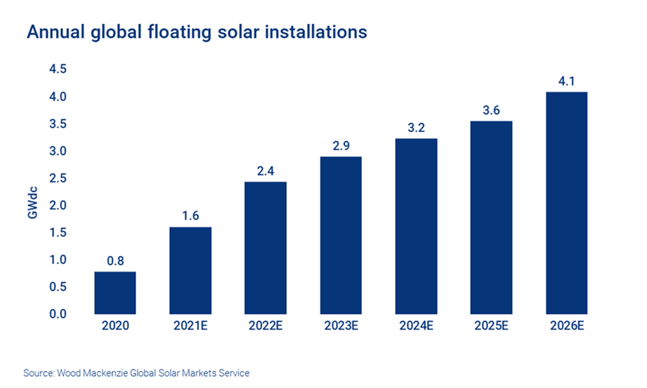{width="6.300694444444445in" height="3.7805555555555554in"}

Figure 1: The floating PV installation

Floating solar panels offer significant potential for generating renewable energy in various geographical regions. This innovative approach involves installing solar panels on floating structures atop bodies of water, including inland lakes, artificial reservoirs, quarry lakes, irrigation canals, or even offshore locations. While most installations currently occur in inland environments, scaling up on land is limited by land scarcity and local community resistance. To circumvent such challenges, offshore installations are increasingly considered. Numerous research studies have compared the advantages and disadvantages of floating photovoltaic (FPV) systems to ground-mounted PV installations, highlighting their potential for higher power efficiency and irradiation levels, albeit with considerations for site-specific factors\[1\], \[2\], \[3\], \[4\], \[5\].

Whether deployed on land surfaces or bodies of water, these structures are designed to withstand for 20 years under various weather conditions. However, these structures face significant challenges from external forces, especially gusts of wind, which have the potential to cause substantial damage to the entire floating structure. Consequently, solar cell platforms are exposed to significant aerodynamic loads, potentially causing traction forces that can displace or misalign the platform, risking damage to the solar cells from collisions.

Accurately estimating the forces exerted by these wind gusts is crucial for ensuring the stability and resilience of floating solar installations. Conducting physical measurements on these systems can be both time-consuming and expensive. Several wind tunnel studies have attempted to estimate the aerodynamic forces on photovoltaic (PV) panels. For instance, Ogedengbe (2013) \[6\] conducted wind tunnel experiments using scaled aluminum models to calculate pressure coefficients across panel surfaces. While some studies, such as those by ogdan and Cretu, 2019 \[7\]; Sheikh, 2019 \[8\], have utilized scaled models in wind tunnels, these experiments remain expensive and are limited in scope to only a few PV modules. An alternative approach to estimating the forces acting on these structures is through the use of numerical models. These models allow for the simulation of various environmental conditions and can provide valuable insights into the behaviour of floating solar panels under different scenarios. By leveraging numerical models, we can efficiently assess the structural integrity of floating solar installations and develop strategies to mitigate the impact of external forces, thus enhancing their reliability and longevity. Computational Fluid Dynamics (CFD) has emerged as a powerful tool in engineering and scientific research for predicting and analyzing fluid flow phenomena.

Numerous studies have been undertaken to understand the behavior of these structures, focusing particularly on the aerodynamic forces exerted on the arrays. Several studies have investigated the impact of wind on photovoltaic (PV) panels. Many previous studies have been conducted on the fixed PV systems and these studies can be broadly categorized into three groups: ground-mounted, commercial roof-mounted, and residential roof-mounted systems. Some studies focus solely on investigating wind effects on ground-mounted systems (\[9\], \[10\], \[11\], \[12\]), while others examine both ground-mounted and roof-mounted systems, providing comparative data on wind load effects between the two (\[13\], \[14\]). The majority of previous experimental studies on roof-mounted systems have primarily focused on commercial buildings (\[15\]; \[13\] \[14\]).

Several literature studies have investigated wind loads on solar panels using various methods. Bitsumalik (2010) \[16\] employed Computational Fluid Dynamics (CFD) to evaluate wind loads on ground-mounted solar panels across four different scenarios, demonstrating strong agreement between numerical simulations and experimental data. Jubayer and Hagen (2012) \[17\] conducted both numerical and experimental analyses, examining wind angles ranging from 0 to 180 degrees to determine coefficients of drag, lift, and overturning moment. Warsido (2014) \[18\] investigated the sheltering effect of consecutively placed solar panels through wind tunnel experiments, exploring a larger number of panels and different spacing factors compared to previous studies. Radu et al. \[19\] highlighted that the first row of solar panels can reduce wind load on subsequent rows due to a sheltering effect, calculating drag coefficients based on pressure distributions and visualizing flow patterns. Browne et al. \[20\] analyzed static and dynamic wind load coefficients on panel arrays, suggesting tilt angle reduction as a strategy to reduce normal force.

Additionally, Garcia et al. \[21\] introduced the concept of wind breaks to mitigate wind loads on solar troughs for optimized structures. These studies underscore the significance of local pressure distribution measurements for accurately estimating drag and lift forces on solar panel arrays.

The majority of existing studies have predominantly focused on analyzing wind loads on solar panels in ground-based installations. However, the distinct challenges encountered by floating PV systems deployed on water bodies are different. Unlike ground-mounted systems where the forces are managed by fixed support structures and panels are firmly anchored to the ground, floating PV systems face inherent flexibility and buoyancy issues. Simply increasing the weight of materials to strengthen them may not be adequate, as an overweight system could lead to sinking to the bottom. Given the need to balance buoyancy and weight for stability, and the inability to increase system weight to withstand wind loads, it is imperative to conduct a comprehensive assessment of drag and lift coefficients at varying inlet angles. Such analyses are crucial for designing structurally robust systems including mooring and anchoring system capable of withstanding fluctuating wind conditions.

There have been some studies on the aerodynamic assessment of floating PV system. Choi et al \[22\] investigated wind load effects on a solar panel array for floating photovoltaic systems. Their experimentally studies revealed higher drag and lift coefficients for the first and last rows of panels due to direct wind exposure, with subsequent rows experiencing reduced coefficients due to a sheltering effect. Economic analysis suggests potential cost reductions of up to 19% for a 2.5 MW system by using lower-cost materials in regions experiencing reduced wind loads.

The innovation of this study lies in the evaluation of breakwater efficacy for reducing aerodynamic forces on floating photovoltaic (PV) panels through computational fluid dynamics (CFD) simulations. By strategically positioning a breakwater ahead of an 8x8 matrix of PV panels and varying angles of attack, this research assesses the impact of breakwater placement on lift and drag coefficients. Unlike previous studies that primarily focused on ground-based installations, this research addresses the unique challenges faced by floating PV systems deployed on water bodies. The findings highlight the potential of breakwaters in mitigating aerodynamic forces under specific wind conditions, offering valuable insights for optimizing breakwater design and placement to enhance the resilience and performance of floating PV systems in various environmental contexts.

# SUREWAVE Concept {#surewave-concept .SUREWAVE}

One of the main objectives of Horizon Europe funded SUREWAVE is to develop and test an innovative concept of Floating Photo-Voltaic (FPV) system consisting of an external floating breakwater structure made of new circular materials acting as a protection against severe wave loads on the FPV structure itself, allowing increased operational availability and energy output. Such a concept is able to operate in all the European sea-basins including open-sea very harsh environments with high wind (speed \>25 m/s), current (\>1.2 m/s) and wave (height \>14 m), thus unlocking the massive deployment of Offshore FPV at European and worldwide level. The concept is shown in Figure. One of the challenges with any floating design is the forces acting on the floating support structures. One of the main objective of the present study is to estimate the lift and drag forces acting on the FPV with and without breakwater. However one of the challenge is to estimate the lift and drag forces of the FPV system consisting of 7000 panels.

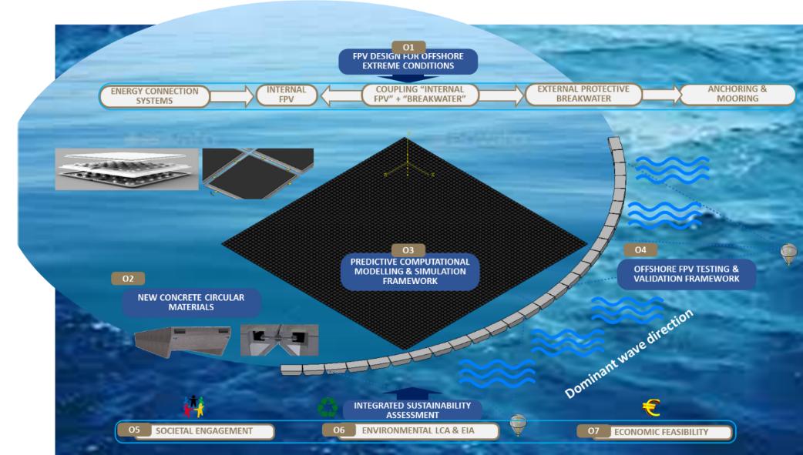{width="5.687861986001749in" height="3.2696773840769904in"}

Figure 2: SUREWAVE concept

# Methodology {#methodology .SUREWAVE}

For this study, CFD simulations were conducted using OpenFOAM, an open-source CFD software package. The SimpleFoam solver was employed to solve the steady-state Reynolds-averaged Navier-Stokes (RANS) equations. The turbulence model chosen for this study was the Spalart-Allmaras model, which is widely used for simulating turbulent flows with moderate computational cost.

Boundary conditions were specified to model the flow around the PV modules realistically. At the inlet boundary, a fixedValue condition was applied to specify the velocity profile based on the desired angle of attack. At the outlet boundary, a zeroGradient condition was used to represent an extrapolation of the flow properties. For the remaining boundaries, slip conditions were assumed to simulate the flow behavior. However, for the surfaces of the PV modules, a noSlip boundary condition was applied to represent the physical interaction between the fluid and the solid surfaces.

# Verification of the OpenFoam setup {#verification-of-the-openfoam-setup .SUREWAVE}

To assess the precision of the numerical model, we replicated the experiments conducted by Fage and Johansen \[23\] on the flow past a flat plate at various inclination angles. In these experiments a flat plate was vertically mounting inside wind tunnel with a slight clearance between its ends and the wind tunnel\'s floor and ceiling. During the experiment pressure distribution around the plate and Strouhal number, were measured at different inclination angles of plate or angle of attack with respect to incoming air. The plate has a span of 1.5 m and a chord length of 0.15 m, as depicted in Figure 3.

In addition to this, for comparison we have also used LES results from Shademan and Naghib-Lahouti \[24\]. Their study focuses on the effects of aspect ratio and inclination angle on aerodynamic loads of a flat plate.

In this study, the model simulated as explained in the previous section was utilized. Using that model, the flow past the flat plate at angles of α = 30°, 50°, and 90°, mirroring the experimental setup by Fage and Johansen, were conducted.

At the inlet of the domain, a uniform velocity of 15 m/s corresponding to a Reynolds number of 1.5 × 10^5^ based on the plate\'s chord length was imposed. For meshing first BlockMesh was crated and the snappyHexMesh was used to capture the plate geometry. Figure 4 and 5 shows a comparison between the mean pressure coefficient $C_{p} = \frac{P - P_{0}}{0.5\rho U_{0}^{2}}$ obtained from our simulations and those from the experiments by Fage and Johansen. A good agreement between the experiments and numerical results at 30- and 50-degrees AOA confirms the model\'s capability to accurately predict the flow over the plates. However, the observed disparity at higher angles of attack of 90 degree, as depicted in Figure 6, suggests that the model\'s accuracy reduces with increase in AOA. This discrepancy arises from the model\'s inability to adequately capture flow separation at higher angles of attack, attributed to the use of the RANS method with a simplified turbulence model such as the Spalart-Allmaras eddy viscosity model. We believe that employing a more sophisticated turbulence model or employing large eddy simulations might improve the results. Nevertheless, considering that FPV applications typically operates at lower angles of attack, we have confident in RANS model\'s accuracy, particularly its effectiveness at smaller angles of attack. Thus, we can conclude that our model is sufficient for the current aerodynamic assessment of the FPV.

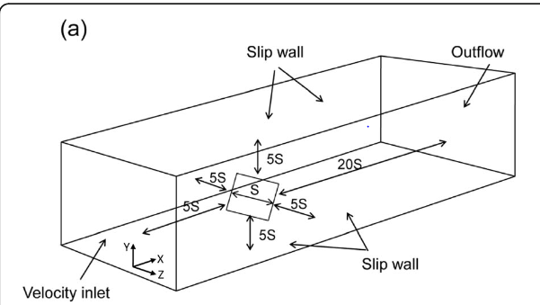{width="4.3898862642169725in" height="2.229753937007874in"}

Figure 3: Domain dimension and boundary condition (image taken from ref: \[24\])

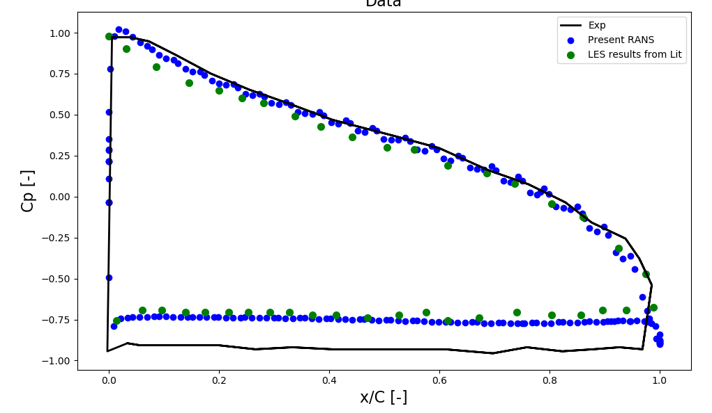{width="4.270195756780402in" height="2.5024617235345583in"}

Figure 4: Mean pressure coefficients and sectional streamlines at the mid-span (AOA=30^0^)

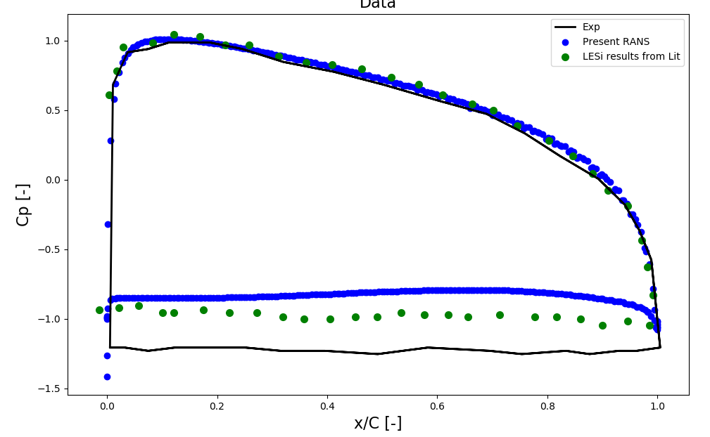{width="4.462462817147856in" height="2.6906069553805776in"}

Figure 5: Mean pressure coefficients and sectional streamlines at the mid-span (AOA=50^0^)

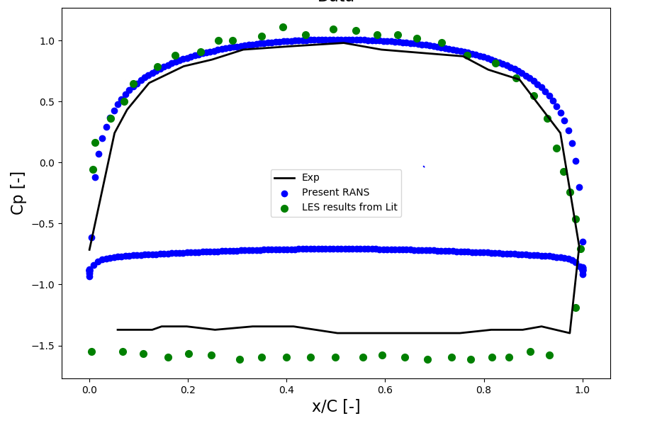{width="4.753523622047244in" height="3.1548687664041997in"}

Figure 6: Mean pressure coefficients and sectional streamlines at the mid-span (AOA=90^0^)

# Simulation matrix  {#simulation-matrix .SUREWAVE}

CFD simulations were conducted for four different configurations of the PV module matrix: 4x8, 8x8, 12x8, and 16x8. Within each configuration, simulations were performed at various angle of attack values ranging from 0 to 20 degrees. The simulations matrix is shown in Table-1.

Table-1: Simulation matrix

  -----------------------------------------------
  Simulation setup        AOA
  ----------------------- -----------------------
  4X8                     0, 5, 10, 15, 20

  8x8                     0, 5, 10, 15, 20

  12x8                    0, 5, 10, 15, 20

  16x8                    0, 5, 10, 15, 20
  -----------------------------------------------

The lift and drag forces were computed for each configuration and angle of attack. These forces were then plotted as functions of the number of panels in the first row (4, 8, 12, and 16) for each angle of attack.

The results revealed trends in how the aerodynamic forces varied with changes in the number of panels in the first row and the angle of attack. Generally, an increase in the number of panels in the first row led to higher lift and drag forces, as expected. Additionally, the angle of attack influenced the magnitudes of these forces, with higher angles typically resulting in increased forces due to changes in flow patterns and pressure distributions around the PV modules.

# Results and discussion.  {#results-and-discussion. .SUREWAVE}

## Aerodynamic coefficients of the panels

The focus was on analyzing the variations in lift and drag coefficients with changes in the number of panels. Figures 1 and 2 depict the variations of lift and drag coefficients, respectively, as a function of the number of panels. Similarly, the results for all the configurations for 0 to 20 angle of attack is given in Table-2 to Table-6.

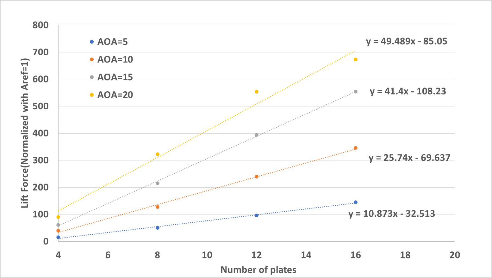{width="4.851485126859143in" height="2.745676946631671in"}

Figure 2: Variation of lift force with Number of Panels

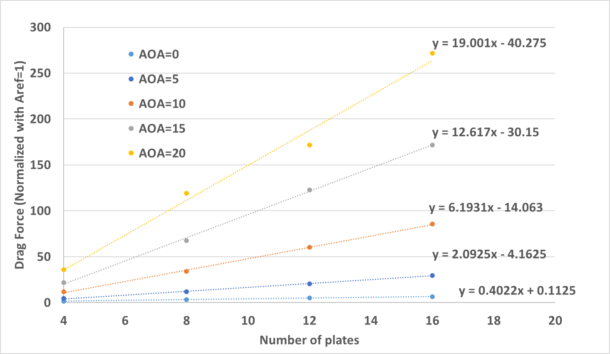{width="5.099009186351706in" height="2.9634044181977255in"}

Figure 3: Variation of drag force with Number of Panels

Table-2: Aerodynamic coefficient at 0 AOA

+--------+------+------+--------+------------------+-----------------------------------------------+
| Matrix | AOA  | Cl   | Cd     | Lift correlation | Lift correlation                              |
+:=======+:=====+:=====+:=======+:=================+:==============================================+
| 4X8    | 0    | 0    | 1.6875 | 0                | Cl = 0.4022\*N+0.112                          |
|        |      |      |        |                  |                                               |
|        |      |      |        |                  | Where; N is the number of plates in front row |
+--------+------+------+--------+                  |                                               |
| 8x8    | 0    | 0    | 3.375  |                  |                                               |
+--------+------+------+--------+                  |                                               |
| 12x8   | 0    | 0    | 4.95   |                  |                                               |
+--------+------+------+--------+                  |                                               |
| 16x8   | 0    | 0    | 6.525  |                  |                                               |
+--------+------+------+--------+------------------+-----------------------------------------------+

Table-3: Aerodynamic coefficient at 5 AOA

+--------+------+---------+--------+-----------------------------------------------+-----------------------------------------------+
| Matrix | AOA  | Cl      | Cd     | Lift correlation                              | Lift correlation                              |
+:=======+:=====+:========+:=======+:==============================================+:==============================================+
| 4X8    | 5    | 14.625  | 4.725  | Cl = 10.873\*N-32.51                          | Cl = 2.09\*N-4.162                            |
|        |      |         |        |                                               |                                               |
|        |      |         |        | Where, N is the number of plates in front row | Where, N is the number of plates in front row |
+--------+------+---------+--------+                                               |                                               |
| 8x8    | 5    | 49.95   | 11.925 |                                               |                                               |
+--------+------+---------+--------+                                               |                                               |
| 12x8   | 5    | 96.075  | 20.7   |                                               |                                               |
+--------+------+---------+--------+                                               |                                               |
| 16x8   | 5    | 144.225 | 29.7   |                                               |                                               |
+--------+------+---------+--------+-----------------------------------------------+-----------------------------------------------+

Table-4: Aerodynamic coefficient at 10 AOA

+--------+------+---------+--------+-----------------------------------------------+-----------------------------------------------+
| Matrix | AOA  | Cl      | Cd     | Lift correlation                              | Lift correlation                              |
+:=======+:=====+:========+:=======+:==============================================+:==============================================+
| 4X8    | 10   | 39.375  | 11.7   | Cl = 25.74\*N-69.64                           | Cl = 6.2\*N-14.1                              |
|        |      |         |        |                                               |                                               |
|        |      |         |        | Where, N is the number of plates in front row | Where, N is the number of plates in front row |
+--------+------+---------+--------+                                               |                                               |
| 8x8    | 10   | 127.35  | 33.975 |                                               |                                               |
+--------+------+---------+--------+                                               |                                               |
| 12x8   | 10   | 238.95  | 60.3   |                                               |                                               |
+--------+------+---------+--------+                                               |                                               |
| 16x8   | 10   | 345.375 | 85.5   |                                               |                                               |
+--------+------+---------+--------+-----------------------------------------------+-----------------------------------------------+

Table-5: Aerodynamic coefficient at 15 AOA

+--------+------+--------+---------+-----------------------------------------------+-----------------------------------------------+
| Matrix | AOA  | Cl     | Cd      | Lift correlation                              | Lift correlation                              |
+:=======+:=====+:=======+:========+:==============================================+:==============================================+
| 4X8    | 15   | 61.2   | 22.05   | Cl = 41.4\*N-108.23                           | Cl = 12.61\*N-30.15                           |
|        |      |        |         |                                               |                                               |
|        |      |        |         | Where, N is the number of plates in front row | Where, N is the number of plates in front row |
+--------+------+--------+---------+                                               |                                               |
| 8x8    | 15   | 214.65 | 67.5    |                                               |                                               |
+--------+------+--------+---------+                                               |                                               |
| 12x8   | 15   | 393.75 | 122.625 |                                               |                                               |
+--------+------+--------+---------+                                               |                                               |
| 16x8   | 15   | 553.5  | 171.9   |                                               |                                               |
+--------+------+--------+---------+-----------------------------------------------+-----------------------------------------------+

Table-6: Aerodynamic coefficient at 20 AOA

+--------+------+---------+--------+-----------------------------------------------+-----------------------------------------------+
| Matrix | AOA  | Cl      | Cd     | Lift correlation                              | Lift correlation                              |
+:=======+:=====+:========+:=======+:==============================================+:==============================================+
| 4X8    | 20   | 90      | 36     | Cl = 49.489\*N-86.05                          | Cl = 19N-40.28                                |
|        |      |         |        |                                               |                                               |
|        |      |         |        | Where, N is the number of plates in front row | Where, N is the number of plates in front row |
+--------+------+---------+--------+                                               |                                               |
| 8x8    | 20   | 322.875 | 119.25 |                                               |                                               |
+--------+------+---------+--------+                                               |                                               |
| 12x8   | 20   | 553.5   | 171.9  |                                               |                                               |
+--------+------+---------+--------+                                               |                                               |
| 16x8   | 20   | 672.975 | 271.8  |                                               |                                               |
+--------+------+---------+--------+-----------------------------------------------+-----------------------------------------------+

Both the lift and drag coefficients exhibited a linear relationship with the number of panels across all angles of attack up to 15°. Then a curve fitting was performed to obtain the relationship between the lift and drag coefficients and the number of panels. A linear relationship was observed between aerodynamic coefficients (lift and drag) with number of panels and these correlations are provided in Table-2 to Table-6. As the number of panels increased from 4x8 to 16x8 configurations, there was a noticeable increase in the lift coefficient. However, beyond 15° angle of attack, the correlation deviated from linearity, suggesting a change in aerodynamic behavior. This deviation could be attributed to flow separation occurring at higher angles of attack, leading to nonlinear variations in lift coefficient as the airflow becomes detached from the panel surfaces.

Overall, the findings highlight the significant influence of the number of panels on the aerodynamic performance of PV arrays. While linear relationships were observed up to 15° angle of attack, deviations from linearity beyond this point suggest the onset of flow separation and turbulent effects. These insights underscore the importance of considering aerodynamic factors in PV panel design for structural integrity. Further studies could explore advanced numerical techniques such as large eddy simulations to capture the nonlinear aerodynamic responses and optimize PV array designs for enhanced performance across a wider range of operating conditions.

The contour plots depicting the pressure distribution over the photovoltaic (PV) panel arrays provided detailed information about the aerodynamic characteristics of the system. Through meticulous analysis of these plots, intricate flow patterns and pressure gradients across the array surface can be discerned, shedding light on the aerodynamic forces acting upon the panels. By visually examining the contour plots, regions of high and low pressure can be identified, providing crucial information regarding areas of potential aerodynamic lift and drag. Additionally, the contour plots facilitate the identification of flow separation points and boundary layer behavior, offering deeper insights into the aerodynamic efficiency and performance of the PV panel arrays. These visualizations serve as a vital tool in understanding the complex interplay between airflow and panel geometry, aiding in the optimization of panel configuration and placement for enhanced aerodynamic performance and energy production.

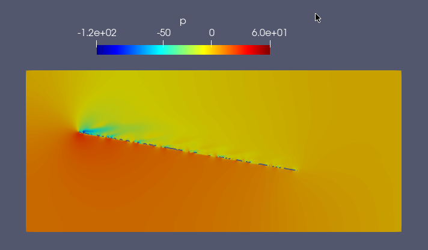{width="4.393588145231846in" height="2.5668011811023623in"}

Figure 4: Contour plots of pressure distribution in the mid-section of 8x8 configuration

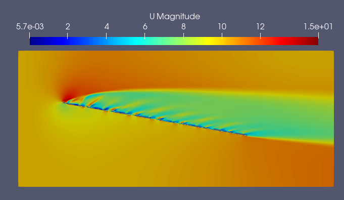{width="4.376846019247594in" height="2.538685476815398in"}

Figure 5: Contour plots of velocity distribution in the mid-section of 8x8 configuration

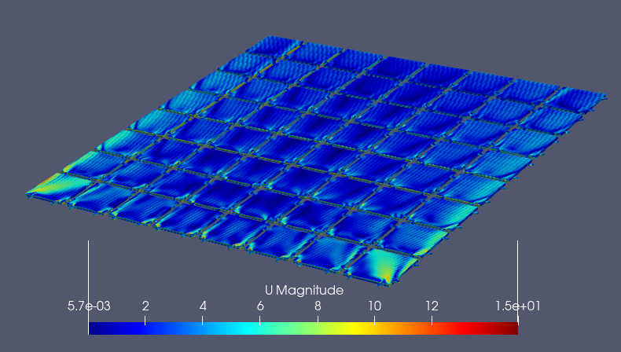{width="5.365224190726159in" height="3.042777777777778in"}

Figure 6: Velocity distribution on floats for 8x8 configuration

## Validation of lift and drag relationships: 

As mentioned, a series of CFD simulations were performed on arrays of varying panel numbers: 4x8, 8x8, 12x8, and 16x8 configurations. Through a detailed analysis, a correlation have developed to elucidate the relationship between the number of panels and the corresponding lift and drag coefficients. To validate the reliability and applicability of this correlation, additional simulations were undertaken at 10 degree angle of attack, focusing on a 32x8 panel configuration. The purpose was to examine the predictive capability of the correlation when applied to an array size beyond those originally considered. Upon comparison of the CFD results for the 32x8 panel configuration with the predictions derived from the established correlation, a discrepancy of approximately 10% and 7% in lift and drag respectively was observed. These simplified correlations developed for small number of panels, although suitable for a fewer range of panel configurations, may not fully encapsulate the complexities introduced by larger arrays.

[]{#_Toc161325774 .anchor}Effect of breakwater on the aerodynamic coefficients:

Introducing a breakwater not only attenuate high-frequency waves but it acts as a barrier against wind which offers a promising solution to minimize aerodynamic forces on floating photovoltaic (PV) panels. In aerodynamic simulations without breakwater, it was observed that the lift and drag forces increased with the angle of attack, indicating a potential challenge for floating PV systems exposed to wind. By strategically placing breakwaters around the floating PV array, several benefits can be realized. Firstly, the breakwater serves as a physical barrier and placing the panels in the sheltered zone behind the breakwater ensures that they experience reduced wind speeds and smoother airflow, minimizing the aerodynamic forces acting upon them. This attenuation of wind speed effectively mitigates the aerodynamic forces experienced by the panels. Moreover, the breakwater helps to create a calmer microenvironment within its sheltered area, further reducing the impact of turbulent wind conditions on the panels. Additionally, the breakwater\'s role in attenuating high-frequency waves is crucial. Waves can induce oscillatory motions in floating structures, leading to dynamic loads that can exacerbate the effects of aerodynamic forces. By dampening wave energy, the breakwater enhances the stability of the floating PV array, reducing the likelihood of excessive movement and associated aerodynamic loading. The introduction of a breakwater offers a multifaceted approach to minimizing aerodynamic forces on floating PV panels. By attenuating both wind and wave energy, the breakwater not only reduces the immediate impact of aerodynamic forces but also enhances the overall performance and stability of the floating PV system, contributing to its effectiveness as a sustainable energy solution.

To assess the effectiveness of the breakwater in reducing aerodynamic forces on the floating PV panels, a series of CFD simulations were conducted. In these simulations, a single breakwater of dimensions LxWxH was positioned ahead of an 8x8 matrix of PV panels, maintaining a distance of 2 and 7 meters between the breakwater and the panels. The PV panels were subjected to two angles of attack ( 5 and 10 degrees) to represent different wind conditions. Table-7 shows the simulation matrix performed with the breakwater.

Table-7: Simulation matrix

  ----------------------------------------------------------------
  Simulation setup   Panels        AOA      Distance from Ponton
  ------------------ ------------- -------- ----------------------
  Case-1             8x8           5        2

  Case-2             8x8           5        7

  Case-3             8x8           10       7
  ----------------------------------------------------------------

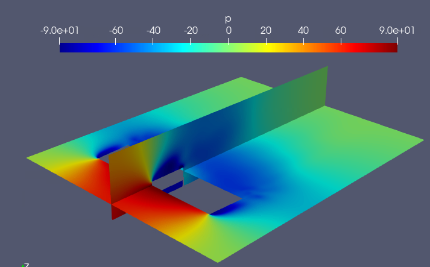{width="5.260285433070866in" height="3.268543307086614in"}

Figure 6: Velocity distribution on floats for 8x8 configuration with breakwater

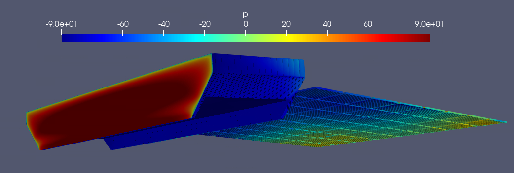{width="5.697726377952756in" height="2.007538276465442in"}

Figure 7: Pressure distribution on floats and breakwater for 8x8 configuration with breakwater

A few CFD simulations were performed for each angle of attack, comparing the lift and drag coefficients of the PV panels with and without the presence of the breakwater. The results of these simulations, summarized in Table-8, provided valuable insights into the impact of the breakwater on aerodynamic forces experienced by the PV panels.

Table-7: Cd and Cl with and without breakwater for 8x8 matrix

+-------------------------------+-------------------------+---------------------+
| Simulation setup              | Without break water     | With breakwater     |
|                               +------------+------------+----------+----------+
|                               | Cd         | Cl         | Cd       | Cl       |
+:==============================+:===========+:===========+:=========+:=========+
| Case-1 (AOA 5, distance=2 m)  | 86         | 550        | 1        | 65       |
+-------------------------------+------------+------------+----------+----------+
| Case-2 (AOA 5, distance=5 m)  | 86         | 550        | 27       | 237      |
+-------------------------------+------------+------------+----------+----------+
| Case-3 (AOA 10, distance=5 m) | 206        | 940        | 48       | 227      |
+-------------------------------+------------+------------+----------+----------+

Analysis of the simulation results revealed a significant reduction in both lift and drag forces when the breakwater was introduced, particularly for angles of attack up to 10 degrees. The breakwater successfully dampened wind speeds and altered airflow pattern, leading to reduced aerodynamic loads on the PV panels within its sheltered area. Nonetheless, as the distance between the breakwater and FPV increases, the efficacy of the breakwater diminishes. Determining the distance between them requires careful consideration of wave movements to ensure they do not collide.

We have also observed, beyond 10 degrees of angle of attack, the PV panels will be exposed to wind forces beyond the protective reach of the breakwater. At these higher angles, the effectiveness of the breakwater in mitigating aerodynamic forces reduces, and the panels experienced increased lift and drag coefficients compared to the sheltered conditions provided by the breakwater. These findings underscore the importance of strategically positioning the breakwater and understanding its limitations in mitigating aerodynamic forces under varying wind conditions. While the breakwater proves to be highly effective in reducing aerodynamic forces at lower angles of attack, it is crucial to consider additional measures or adjustments to protect the PV panels when exposed to higher wind angles.

# Aerodynamic assessment of a Sunlit Sea existing design {#aerodynamic-assessment-of-a-sunlit-sea-existing-design .SUREWAVE}

In this study, CFD simulations were conducted to investigate the aerodynamic behaviour of a 14x14 floating photovoltaic (PV) matrix, with and without the presence of a breakwater. A configuration with a breakwater and FPV with 0 degree and 5 degree FPV inclination is shown in Figure respectively. The 14x14 matrix configuration resemblance to the Sunlit Sea concept, consisting of a grid layout comprising 14 strings, with each string consisting of 14 PV modules, resulting in a total capacity of 105 kWp. The 14x14 matrix configuration serves as a representative model for real-world applications, facilitating a thorough examination of the aerodynamic forces of floating PV arrays. One of the key aspects analyzed in this study was the estimation of lift and drag coefficients to assess the forces acting on the floating PV system. By employing CFD techniques, the lift and drag coefficients were calculated for both scenarios. The results were then compared between the configurations with and without the breakwater to determine the influence of the breakwater on the aerodynamic performance of the system. The lift and drag coefficients serve as crucial parameters in understanding the distribution of forces exerted on the floating PV system, which directly impacts its stability and structural integrity.

the simulation results from Table-8 indicate notable differences in the aerodynamic performance between the configurations with and without the breakwater at a 5-degree angle of attack (AOA) and a distance of 2 meters. Specifically, for the configuration without the breakwater, the drag coefficient (Cd) is recorded at 372 and the lift coefficient (Cl) at 2350, while with the breakwater, the Cd is significantly reduced to 10 and the Cl to 300. These findings underscore the effectiveness of the breakwater in mitigating aerodynamic forces acting on the floating PV system, thereby enhancing its overall stability and performance in offshore environments

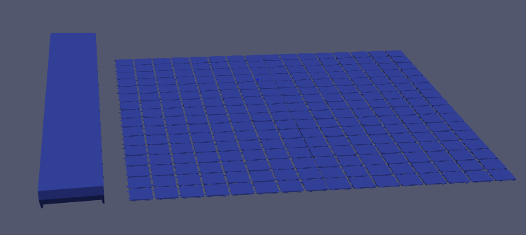{width="6.3in" height="2.8256944444444443in"}

Figure breakwater with FPV (FPV are not tilted)

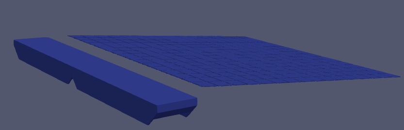{width="6.144152449693788in" height="1.6840726159230097in"}

Figure breakwater with FPV (FPV are tilted at 5 degree)

Table-8: Cd and Cl with and without breakwater for 16x16 matrix

+------------------------------+-------------------------+---------------------+
| Simulation setup             | Without break water     | With breakwater     |
|                              +------------+------------+----------+----------+
|                              | Cd         | Cl         | Cd       | Cl       |
+:=============================+:===========+:===========+:=========+:=========+
| Case-1 (AOA 5, distance=2 m) | 372        | 2350       | 10       | 300      |
+------------------------------+------------+------------+----------+----------+

# Conclusion  {#conclusion .SUREWAVE}

The present study has shown the importance of analyzing wind load effects on PV arrays, especially in the context of floating photovoltaic (PV) systems. Through comprehensive CFD simulations, we have gained valuable insights into the factors influencing drag and lift coefficients. Our findings emphasize the significance of accurately estimating both drag and lift forces during the design phase of floating PV systems to address safety concerns such as overturning.

Furthermore, our study highlights the efficacy of employing a breakwater as a protective measure against wind forces. By strategically implementing the breakwater, particularly at lower angles of attack, we observed a substantial reduction in the impact of wind forces on the solar panel array, thereby enhancing the overall stability and resilience of the floating PV system.

# References  {#references .SUREWAVE}

\[1\] A. Sahu, N. Yadav, and K. Sudhakar, "Floating photovoltaic power plant: A review," *Renewable and Sustainable Energy Reviews*, vol. 66, pp. 815--824, Dec. 2016, doi: 10.1016/j.rser.2016.08.051.

\[2\] M. Abid, Z. Abid, J. Sagin, R. Murtaza, D. Sarbassov, and M. Shabbir, "Prospects of floating photovoltaic technology and its implementation in Central and South Asian Countries," *Int. J. Environ. Sci. Technol.*, vol. 16, no. 3, pp. 1755--1762, Mar. 2019, doi: 10.1007/s13762-018-2080-5.

\[3\] W. Shi *et al.*, "Review on the development of marine floating photovoltaic systems," *Ocean Engineering*, vol. 286, p. 115560, Oct. 2023, doi: 10.1016/j.oceaneng.2023.115560.

\[4\] N. Mavraki *et al.*, "Fouling community composition on a pilot floating solar-energy installation in the coastal Dutch North Sea," *Front. Mar. Sci.*, vol. 10, p. 1223766, Dec. 2023, doi: 10.3389/fmars.2023.1223766.

\[5\] R. Claus and M. López, "Key issues in the design of floating photovoltaic structures for the marine environment," *Renewable and Sustainable Energy Reviews*, vol. 164, p. 112502, Aug. 2022, doi: 10.1016/j.rser.2022.112502.

\[6\] A. Abiola-Ogedengbe, H. Hangan, and K. Siddiqui, "Experimental investigation of wind effects on a standalone photovoltaic (PV) module," *Renewable Energy*, vol. 78, pp. 657--665, Jun. 2015, doi: 10.1016/j.renene.2015.01.037.

\[7\] O. Bogdan and D. Creţu, "Wind Load Design of Photovoltaic Power Plants by Comparison of Design Codes and Wind Tunnel Tests," *Mathematical Modelling in Civil Engineering*, vol. 15, no. 3, pp. 13--27, Sep. 2019, doi: 10.2478/mmce-2019-0008.

\[8\] I. I. Sheikh, "Numerical Investigation of Drag and Lift Coefficient on a Fixed Tilt Ground Mounted Photovoltaic Module System over Inclined Terrain".

\[9\] A. M. Aly, A. G. Chowdhury, and G. Bitsuamlak, "Wind profile management and blockage assessment for a new 12-fan Wall of Wind facility at FIU," *Wind and Structures*, vol. 14, no. 4, pp. 285--300, Jul. 2011, doi: 10.12989/WAS.2011.14.4.285.

\[10\] A. M. Aly, "Aerodynamics of ground-mounted solar panels\_ Test model scale effects," *J. Wind Eng. Ind. Aerodyn.*, 2013.

\[11\] A. M. Aly and G. Bitsuamlak, "Wind-Induced Pressures on Solar Panels Mounted on Residential Homes," *J. Archit. Eng.*, vol. 20, no. 1, p. 04013003, Mar. 2014, doi: 10.1061/(ASCE)AE.1943-5568.0000132.

\[12\] A. M. Aly, "On the evaluation of wind loads on solar panels: The scale issue," *Solar Energy*, vol. 135, pp. 423--434, Oct. 2016, doi: 10.1016/j.solener.2016.06.018.

\[13\] G. A. Kopp, "Aerodynamic mechanisms for wind loads on tilted, roof-mounted, solar arrays," *J. Wind Eng. Ind. Aerodyn.*, 2012.

\[14\] T. Stathopoulos, I. Zisis, and E. Xypnitou, "Local and overall wind pressure and force coefficients for solar panels," *Journal of Wind Engineering and Industrial Aerodynamics*, vol. 125, pp. 195--206, Feb. 2014, doi: 10.1016/j.jweia.2013.12.007.

\[15\] D. Banks, "The role of corner vortices in dictating peak wind loads on tilted flat solar panels mounted on large, flat roofs," *Journal of Wind Engineering and Industrial Aerodynamics*, vol. 123, pp. 192--201, Dec. 2013, doi: 10.1016/j.jweia.2013.08.015.

\[16\] G. T. Bitsuamlak, A. K. Dagnew, and J. Erwin, "Evaluation of wind loads on solar panel modules using CFD," 2010.

\[17\] C. M. Jubayer and H. Hangan, "Numerical Simulation of Wind Loading on Photovoltaic Panels," in *Structures Congress 2012*, Chicago, Illinois, United States: American Society of Civil Engineers, Mar. 2012, pp. 1180--1189. doi: 10.1061/9780784412367.106.

\[18\] W. P. Warsido, G. T. Bitsuamlak, J. Barata, and A. Gan Chowdhury, "Influence of spacing parameters on the wind loading of solar array," *Journal of Fluids and Structures*, vol. 48, pp. 295--315, Jul. 2014, doi: 10.1016/j.jfluidstructs.2014.03.005.

\[19\] A. Radu, E. Axinte, and C. Theohari, "Steady wind pressures on solar collectors on flat-roofed buildings," *Journal of Wind Engineering and Industrial Aerodynamics*, vol. 23, pp. 249--258, Jan. 1986, doi: 10.1016/0167-6105(86)90046-2.

\[20\] M. T. L. Browne, Z. J. Taylor, S. Li, and S. Gamble, "A wind load design method for ground-mounted multi-row solar arrays based on a compilation of wind tunnel experiments," *Journal of Wind Engineering and Industrial Aerodynamics*, vol. 205, p. 104294, Oct. 2020, doi: 10.1016/j.jweia.2020.104294.

\[21\] E. Torres García, M. Ogueta-Gutiérrez, S. Ávila, S. Franchini, E. Herrera, and J. Meseguer, "On the effects of windbreaks on the aerodynamic loads over parabolic solar troughs," *Applied Energy*, vol. 115, pp. 293--300, Feb. 2014, doi: 10.1016/j.apenergy.2013.11.013.

\[22\] S. M. Choi, C.-D. Park, S.-H. Cho, and B.-J. Lim, "Effects of wind loads on the solar panel array of a floating photovoltaic system -- Experimental study and economic analysis," *Energy*, vol. 256, p. 124649, Oct. 2022, doi: 10.1016/j.energy.2022.124649.

\[23\] Fage and Johansen, "On the flow of air behind an inclined flat plate of infinite span," *Proc. R. Soc. Lond. A*, vol. 116, no. 773, pp. 170--197, Sep. 1927, doi: 10.1098/rspa.1927.0130.

\[24\] M. Shademan and A. Naghib-Lahouti, "Effects of aspect ratio and inclination angle on aerodynamic loads of a flat plate," *Adv. Aerodyn.*, vol. 2, no. 1, p. 14, Dec. 2020, doi: 10.1186/s42774-020-00038-7.

[^1]: Creation. modification. final version for evaluation. revised version following evaluation. final

[^2]: https://www.iea.org/energy-system/renewables/solar-pv
