> Source: `SUREWAVE_D3.1_Design_description_of_internal_floating_PV_components.docx` — Document date: 2023-06-26 — Converted: 2026-09-28 via pandoc/pdftotext

---

##### 

Deliverable number: D3.1

{width="8.245833333333334in" height="3.0701388888888888in"}

Title: Design description of internal floating PV components

# **Disclaimer:**  {#disclaimer .TOC-Heading}

The SUREWAVE project is Funded by the European Union. Views and opinions expressed are however those of the author(s) only and do not necessarily reflect those of the European Union. Neither the European Union nor the granting authority can be held responsible for them

Deliverable details

+--------------------------------------+-----------------------------------------------------+---------------------------------------------------------------+
| **WP**                               | 3                                                   |                                                               |
+:========================+:===========+:===========+:===========+:===========+:=============+===============================+===============================+
| **Task**                             | D3.1                                                | **Design description of internal floating PV components**     |
+-------------------------+------------+-------------------------+------------+--------------+-------------------------------+-------------------------------+
| **Dissemination level** | Public                               |            | **Due delivery date**                        | 31.05.2023                    |
+-------------------------+--------------------------------------+------------+----------------------------------------------+-------------------------------+
| **Deliverable type**    | R --- Document, report               |            | **Actual delivery date**                     | 26.06.2023                    |
+-------------------------+-------------------------+------------+------------+----------------------------------------------+-------------------------------+
| **Lead beneficiary**                              | **SIS**                                                                                                |
+---------------------------------------------------+--------------------------------------------------------------------------------------------------------+
| **Contributing beneficiaries**                    |                                                                                                        |
+---------------------------------------------------+--------------------------------------------------------------------------------------------------------+

  ---------------------- ------------ ------------------------------------------------------- -------------------
  **Document Version**   **Date**     **Author**                                              **Comments**

  1.0                                 [Christoffer Isdahl](mailto:christoffer@sunlitsea.no)   Draft version

  1.1                    01.06.23     [Eirik Larsen](mailto:eirik.larsen@kodeworks.no)        Revision-1

  1.2                    05.06.23     Tasnime Ouchtar                                         Revision-2

  1.3                    07.06.23     [Christoffer Isdahl](mailto:christoffer@sunlitsea.no)   Revision-3

  1.4                    13.06.23     [Balram Panjwani](mailto:Balram.Panjwani@sintef.no)     Revison-4

  Final-v1               12.06.23     [Christoffer Isdahl](mailto:christoffer@sunlitsea.no)   Uploaded

                         15.06.2023                                                           Feedback from PO

  2.0                    22.06.2023   [Balram Panjwani](mailto:Balram.Panjwani@sintef.no)     Revision

  Final_v2               26.06.23     [Christoffer Isdahl](mailto:christoffer@sunlitsea.no)   Comments included
  ---------------------- ------------ ------------------------------------------------------- -------------------

+-------------------------------------------------------------------------------------------------------------------------------------------------+
| **Dissemination level**                                                                                                                         |
+:====================================+:==========================================================================================================+
| PU                                  | Public- fully open                                                                                        |
+-------------------------------------+-----------------------------------------------------------------------------------------------------------+
| SEN                                 | SEN = Sensitive -- limited under the conditions of the Grant Agreement                                    |
+-------------------------------------+-----------------------------------------------------------------------------------------------------------+
| EU classified                       | EU classified -- restraint -- UE/EU-restricted, confidential, secret-UE/EU secret under Decision 2015/444 |
+-------------------------------------+-----------------------------------------------------------------------------------------------------------+
| **Deliverable type**                                                                                                                            |
+-------------------------------------+-----------------------------------------------------------------------------------------------------------+
| R:                                  | Document, report (excluding the periodic and final reports)                                               |
+-------------------------------------+-----------------------------------------------------------------------------------------------------------+
| DEM:                                | Demonstrator, pilot, prototype, plan designs                                                              |
+-------------------------------------+-----------------------------------------------------------------------------------------------------------+
| DEC:                                | Websites, patents filing, press & media actions, videos, etc.                                             |
+-------------------------------------+-----------------------------------------------------------------------------------------------------------+
| OTHER:                              | Software, technical diagram, etc.                                                                         |
+-------------------------------------+-----------------------------------------------------------------------------------------------------------+

EXECUTIVE SUMMARY

Critical challenges of the internal FPV individual components and the optimal operation of these components in offshore conditions will be addressed in this deliverable. The main aspects to be analysed are:

1)  Global floating PV farm design (to avoid conductivities, minimize over-wash, minimize splash zone, compensate non-optimum inclination, etc.).

2)  Design of optimal string module (to integrate PV module).

3)  Use of recyclable material for the string and improvement in the corrosion behaviour of the string.

4)  Designing of flexible joints between the floats.

5)  Maximizing PV panels cooling.

6)  Smart sensing technology

This executive summary provides an overview of the key points discussed in the document. The document covers various aspects of the design and performance of floating photovoltaic (FPV) systems in a marine environment. The first section highlights the importance of designing hinges and brackets capable of withstanding environmental forces and ensuring the structural integrity of the floating panels. It emphasizes the need for reduced surface-to-cross-section area ratios, secure fastening, and load-bearing capacity to withstand the drag force exerted by the FPV matrix.

The report also focuses on PV panel cooling in a marine environment. It explains the significance of convective heat transfer and evaporation as cooling mechanisms facilitated by water. The presence of water enhances conductive cooling due to its higher thermal conductivity, while water movement induced by waves and currents improves convective heat transfer. Stagnant water can negatively affect cooling efficiency and lead to debris accumulation, biofouling, and corrosion. Using potting material and dimples on the aluminium float is mentioned as a strategy to enhance cooling effectiveness.

Then the deliverable argues what the implications of wind and waves on FPV systems in the marine environment might be. Wind-induced power generation, wave-induced oscillations, and sea state are identified as factors influencing energy output. Flutter caused by wind can lead to improved cooling but also structural fatigue. Wave-induced motions can affect the alignment of PV modules and increase mechanical stresses, resulting in decreased energy generation. Understanding and managing these effects is crucial for optimizing performance and ensuring long-term reliability.

It addresses the heating effect of bird droppings on PV panels. It explains how droppings can reduce transmittance, act as insulation, create shading, and alter surface properties, decreasing energy production and potential damage. Regular cleaning and maintenance are recommended to mitigate these effects. The project partner Sunlit Seas' approach to floating sensors and module surveillance is briefly mentioned, along with optimal string module design, which is based on the International Electrotechnical Commission requirements.

The final section briefly mentions the need for robustness and durability evaluation of the FPV system, considering the harsh marine environment. Compliance with design standards is noted, but further testing under extreme offshore conditions is necessary.

Overall, this deliverable provides valuable insights into the design considerations, cooling mechanisms, environmental impacts, and thermal management strategies related to floating photovoltaic systems in offshore conditions.

**Deliverable Review**

+---------------------------------------------------------------------------------+---------------------------------------------------------------------------+---------------------------------------------------------------------------+
|                                                                                 | **Reviewer #1:** Balram Panjwani                                          | **Reviewer #2:** Eirik Larsen                                             |
|                                                                                 +-----------------+---------------------------------------+-----------------+-----------------+---------------------------------------+-----------------+
|                                                                                 | **Answer**      | **Comments**                          | **Type\***      | **Answer**      | **Comments**                          | **Type\***      |
+=================================================================================+=================+=======================================+=================+=================+=======================================+=================+
| 1.  Is the deliverable in accordance with                                                                                                                                                                                               |
+---------------------------------------------------------------------------------+-----------------+---------------------------------------+-----------------+-----------------+---------------------------------------+-----------------+
| i.  The Description of Work?                                                    | ☒ Yes           |                                       | ☐ M             | ☒Yes            |                                       | ☐ M             |
|                                                                                 |                 |                                       |                 |                 |                                       |                 |
|                                                                                 | ☐ No            |                                       | ☐ m             | ☐ No            |                                       | ☐ m             |
|                                                                                 |                 |                                       |                 |                 |                                       |                 |
|                                                                                 |                 |                                       | ☐ a             |                 |                                       | ☐ a             |
+---------------------------------------------------------------------------------+-----------------+---------------------------------------+-----------------+-----------------+---------------------------------------+-----------------+
| ii. The international State of the Art?                                         | ☐ Yes           | *Not applicable for this deliverable* | ☐ M             | ☐ Yes           | *Not applicable for this deliverable* | ☐ M             |
|                                                                                 |                 |                                       |                 |                 |                                       |                 |
|                                                                                 | ☐ No            |                                       | ☐ m             | ☐ No            |                                       | ☐ m             |
|                                                                                 |                 |                                       |                 |                 |                                       |                 |
|                                                                                 |                 |                                       | ☐ a             |                 |                                       | ☐ a             |
+---------------------------------------------------------------------------------+-----------------+---------------------------------------+-----------------+-----------------+---------------------------------------+-----------------+
| 2.  Is the quality of the deliverable in a status                                                                                                                                                                                       |
+---------------------------------------------------------------------------------+-----------------+---------------------------------------+-----------------+-----------------+---------------------------------------+-----------------+
| iii. That allows it to be sent to European Commission?                          | ☒ Yes           |                                       | ☐ M             | ☒ Yes           |                                       | ☐ M             |
|                                                                                 |                 |                                       |                 |                 |                                       |                 |
|                                                                                 | ☐ No            |                                       | ☐ m             | ☐ No            |                                       | ☐ m             |
|                                                                                 |                 |                                       |                 |                 |                                       |                 |
|                                                                                 |                 |                                       | ☐ a             |                 |                                       | ☐ a             |
+---------------------------------------------------------------------------------+-----------------+---------------------------------------+-----------------+-----------------+---------------------------------------+-----------------+
| iv. That needs improvement of the writing by the originator of the deliverable? | ☐ Yes           |                                       | ☐ M             | ☐ Yes           |                                       | ☐ M             |
|                                                                                 |                 |                                       |                 |                 |                                       |                 |
|                                                                                 | ☒ No            |                                       | ☐ m             | ☒No             |                                       | ☐ m             |
|                                                                                 |                 |                                       |                 |                 |                                       |                 |
|                                                                                 |                 |                                       | ☐ a             |                 |                                       | ☐ a             |
+---------------------------------------------------------------------------------+-----------------+---------------------------------------+-----------------+-----------------+---------------------------------------+-----------------+
| v.  That need further work by the Partners responsible for the deliverable?     | ☐ Yes           |                                       | ☐ M             | ☐ Yes           |                                       | ☐ M             |
|                                                                                 |                 |                                       |                 |                 |                                       |                 |
|                                                                                 | ☒ No            |                                       | ☐ m             | ☒No             |                                       | ☐ m             |
|                                                                                 |                 |                                       |                 |                 |                                       |                 |
|                                                                                 |                 |                                       | ☐ a             |                 |                                       | ☐ a             |
+---------------------------------------------------------------------------------+-----------------+---------------------------------------+-----------------+-----------------+---------------------------------------+-----------------+

\* Type of comments: M = Major comment; m = minor comment; a = advice

# Table of Contents {#table-of-contents .TOC-Heading}

[1. Introduction [5](#introduction)](#introduction)

[2. General design challenges [5](#general-design-challenges)](#general-design-challenges)

[2.1 Hinge loads [6](#hinge-loads)](#hinge-loads)

[3. Global floating PV farm design [7](#global-floating-pv-farm-design)](#global-floating-pv-farm-design)

[3.1 Use of aluminium in FPV modules: [7](#use-of-aluminium-in-fpv-modules)](#use-of-aluminium-in-fpv-modules)

[3.2 Conductivity [8](#conductivity)](#conductivity)

[3.3 Earth leakage [8](#earth-leakage)](#earth-leakage)

[3.4 Minimizing overwash and splash zones [9](#minimizing-overwash-and-splash-zones)](#minimizing-overwash-and-splash-zones)

[Overwash [9](#overwash)](#overwash)

[Splash zones [9](#splash-zones)](#splash-zones)

[4. Optimal string module design / Design of optimal string module (to integrate PV module) [10](#optimal-string-module-design-design-of-optimal-string-module-to-integrate-pv-module)](#optimal-string-module-design-design-of-optimal-string-module-to-integrate-pv-module)

[5. Use of recyclable materials / Use of recyclable materials for the string [12](#use-of-recyclable-materials-use-of-recyclable-materials-for-the-string)](#use-of-recyclable-materials-use-of-recyclable-materials-for-the-string)

[5.1 Recycling aluminium [12](#recycling-aluminium)](#recycling-aluminium)

[5.2 Recycling polyurethane [13](#recycling-polyurethane)](#recycling-polyurethane)

[5.3 Recycling foam cups [13](#recycling-foam-cups)](#recycling-foam-cups)

[6. Flexible joint design / Design of flexible joints (between the floats) [14](#flexible-joint-design-design-of-flexible-joints-between-the-floats)](#flexible-joint-design-design-of-flexible-joints-between-the-floats)

[6.1 Design requirements for the hinges and brackets [15](#design-requirements-for-the-hinges-and-brackets)](#design-requirements-for-the-hinges-and-brackets)

[6.2 String length and load between the floats [16](#string-length-and-load-between-the-floats)](#string-length-and-load-between-the-floats)

[6.3 Joint design [17](#joint-design)](#joint-design)

[7. PV panels cooling / Maximise PV panels cooling [19](#pv-panels-cooling-maximise-pv-panels-cooling)](#pv-panels-cooling-maximise-pv-panels-cooling)

[7.1 Water cooling [20](#water-cooling)](#water-cooling)

[7.2 Wind and wave implications in the marine environment [22](#wind-and-wave-implications-in-the-marine-environment)](#wind-and-wave-implications-in-the-marine-environment)

[7.3 Conductive, radiative, and convective heat dissipation [23](#conductive-radiative-and-convective-heat-dissipation)](#conductive-radiative-and-convective-heat-dissipation)

[7.4 Heating effect of bird droppings [24](#heating-effect-of-bird-droppings)](#heating-effect-of-bird-droppings)

[8. Built-in smart sensing technology [24](#built-in-smart-sensing-technology)](#built-in-smart-sensing-technology)

[9. The system\'s robustness and durability [25](#the-systems-robustness-and-durability)](#the-systems-robustness-and-durability)

[9.1 Welded connections [25](#welded-connections)](#welded-connections)

[9.2 Sealing architecture: Protection of the external environment of the electronics [26](#sealing-architecture-protection-of-the-external-environment-of-the-electronics)](#sealing-architecture-protection-of-the-external-environment-of-the-electronics)

[9.3 Connecting hinges [27](#connecting-hinges)](#connecting-hinges)

[9.4 Minimizing of Electrical Connections. [28](#minimizing-of-electrical-connections.)](#minimizing-of-electrical-connections.)

[10. Conclusions [29](#conclusions)](#conclusions)

[Bibliography [31](#bibliography)](#bibliography)

#  Introduction

The objective is to discuss the adaptation of the floating solar panels for extreme conditions, integrated with novel wave breaker technology.

Main aspect: Study the design of the internal individual FPV components, focusing on the critical aspects/components and design for optimal operation in offshore conditions.

The report is organised as follows: firstly, some of the identified critical challenges are discussed before more in-depth discussions are presented for the global floating PV farm. String module, use of recyclable materials, corrosion resistance, flexible joints, PV panels cooling, monitoring, and finally the robustness and durability of the system are discussed.

# General design challenges

The installation and operation of PV farms in offshore conditions present several critical challenges that need to be addressed to ensure optimal operation and maximize energy generation.

Offshore installations are subjected to extreme weather conditions, including high winds, saltwater exposure, and corrosive elements. PV components must be designed to withstand these harsh conditions and maintain their performance and structural integrity over an extended period.\
Moreover, these farms are exposed to wave and tidal forces, which can cause excessive structural loads and movement. The design of floating PV components should incorporate measures to mitigate the effects of these forces and maintain stability, preventing damage to the system[^1].

The corrosive nature of saltwater and the accumulation of marine organisms pose challenges to the longevity and efficiency of PV components. Protective coatings, corrosion-resistant materials, and anti-fouling measures must be implemented to minimize degradation and maintain optimal performance.

Offshore environments introduce additional electrical safety considerations due to the proximity of water. Adequate insulation, grounding, and protection against electrical faults are crucial to ensure the safety of personnel and the integrity of the PV system.

## 2.1 Hinge loads

The connections between the floats are of particular interest to this research project. Hinge loads between two or more floats will pose specific challenges that need to be addressed to ensure the stability and longevity of our floating structure. The hinge systems must be able to withstand extreme weather events, strong currents, and variable water depths, and ensure the integrity and stability of the floating structure under different conditions.

**Extreme wind and wave conditions:** The floating structure will be subjected to dynamic forces from waves and currents. Hinge loads can be amplified during wave actions, leading to increased stresses and potential structural damage. Hinge loads can induce cyclic loading on the floating structure, resulting in fatigue accumulation over time. The repetitive nature of these loads can lead to material fatigue, stress concentration, and degradation of structural components[^2]. Ensuring the durability of hinge systems is essential to prevent premature failure. We will go into further depth later in the document.

**Exposure to the corrosive environment:** The marine environment exposes floating structures to corrosive saltwater and the accumulation of marine organisms. Hinge components, such as pins, bearings, and connectors, are particularly susceptible to corrosion and fouling. Regular maintenance and the use of corrosion-resistant materials are vital to mitigate these effects and maintain optimal hinge functionality. The project partner Sunlit Sea is currently applying polyurethane rubber while moulding the hinges, which do not corrode.

**Misalignments:** Hinge loads can cause misalignment and unwanted movements between the connected floats. These movements can impact the overall stability of the floating structure, affecting the efficiency of the PV system and potentially leading to electrical and mechanical issues. Hinge loads can result in uneven load distribution across the connected floats. This non-uniform loading can lead to stress concentration points, weakening the structure and increasing the risk of failure.

**Inspection and maintenance:** Measures to regularly inspect, maintain, and potential replacement hinge components due to wear and tear will need to be established. Accessing and servicing the hinge points in a marine environment can be challenging and may involve additional costs and logistical considerations. Continuous monitoring of the hinge loads, structural integrity, and alignment is crucial to identify potential issues and to undertake timely maintenance or repairs. This will help extend the lifespan of the hinge system.

# Global floating PV farm design

## 3.1 Use of aluminium in FPV modules: 

The FPV in this project utilize thin sheets of aluminium, which offers several benefits that contribute to the efficiency, durability, and cost-effectiveness of the installation.

Thin aluminium sheets, when press-shaped, have a relatively low weight-to-strength ratio, making them ideal for floating PV systems. Their lightweight nature helps reduce the overall weight of the structure, enabling better buoyancy and stability. This is especially important for floating PV systems, as the weight of the structure affects its ability to float and remain stable in the water.

Marine aluminium (5083-H111) naturally forms a thin oxide layer on its surface, which provides inherent corrosion resistance[^3]. This oxide layer acts as a protective barrier, preventing further corrosion and extending the lifespan of the aluminium sheets. In marine environments, where the floating PV systems are exposed to saltwater and other corrosive elements, the corrosion resistance of aluminium is highly advantageous.

Thin aluminium sheets exhibit excellent durability and longevity, even in challenging marine environments[^4]. They are highly resistant to weathering, UV radiation, and degradation caused by exposure to water. This ensures the structural integrity and performance of the floating PV system over an extended period, minimizing maintenance requirements and increasing the system\'s lifespan.

Moreover, aluminium sheets are relatively easy to fabricate, cut, and shape into desired sizes and forms. This flexibility allows for efficient manufacturing and customization of the floating PV structure. The lightweight nature of aluminium also simplifies the installation process, making it easier and more cost-effective to transport and pre-assemble.

Aluminium is highly recyclable, meaning it can be reused and repurposed at the end of its lifecycle. Utilizing aluminium sheets in our floating PV system aligns with sustainability goals by reducing the environmental impact associated with the disposal of materials. Additionally, aluminium production requires less energy compared to other metals, contributing to the overall eco-friendliness of the floating PV installation. Additionally, the durability and long lifespan of aluminium sheets result in reduced maintenance and replacement expenses over time.

Furthermore, aluminium possesses excellent thermal conductivity properties, allowing for efficient dissipation of heat generated by the PV modules. This is particularly important in floating PV systems, as excessive heat can reduce the efficiency and lifespan of solar cells. By effectively managing heat, thin aluminium sheets help optimize the performance of the PV modules.

## 3.2 Conductivity

To avoid conductivity, we have paid attention to the design and layout of electrical components and connections within the floating PV system. The electrical wiring and connections are properly insulated and protected to prevent unintended conductivity through the aluminium floats. Proper routing and segregation of electrical cables are completed to minimize the risk of conductivity issues.

Anodizing aluminium floats can indeed also reduce conductivity. As briefly mentioned, Sunlit Sea anodizes its floats, to obtain a protective oxide layer on the surface of the aluminium. During the anodizing process, the aluminium float is immersed in an electrolytic solution and subjected to an electrical current. This causes controlled oxidation of the aluminium surface, resulting in the formation of a thick, porous, and stable oxide layer[^5]. This oxide layer acts as an insulator, effectively reducing the electrical conductivity of the aluminium float.

## 3.3 Earth leakage

To reduce the risk of earth leakage and ensure the safety of the global project PV design, several measures are taken. Sunlit Sea has implemented a robust grounding system that conforms to relevant electrical codes and standards. This involves connecting the PV system\'s metal components, such as the floating structure, frames, and other conductive elements, to a dedicated grounding electrode or earth grounding. The grounding system provides a low-resistance path for electrical fault currents, directing them safely[^6].

The company also follows proper wiring and connection practices during the installation and pre-fabrication of the FPV system. Pre-fabrication makes it easier to ensure that all electrical connections are securely made, insulated, and protected from environmental elements. Poorly made or loose connections can increase the risk of earth leakage and other electrical faults[^7].

Each float also has a cut-off switch, which is an implemented ground fault protection device (GFPD) in the electrical circuitry of the FPV installation. GFPDs are designed to detect ground faults and quickly interrupt the flow of current, minimizing the risk of electrical shock hazards. These devices monitor the imbalance between the current flowing in the supply conductors and the returning current in the grounding system, providing enhanced safety against earth leakage.

## 3.4 Minimizing overwash and splash zones

Splash zones primarily involve intermittent splashing at the module edges, while overwash entails the temporary submersion of the entire module surface. Managing both splash zones and overwash is important to minimize the adverse effects of water exposure and maintain the performance and longevity of the floating PV system.

### Overwash

Overwash of saltwater can negatively impact the performance and efficiency of the PV modules. When saltwater accumulates on the module surface, it can create a barrier between the sunlight and the PV cells, reducing the amount of light reaching the cells. This reduction in light absorption leads to a decrease in electricity generation. Additionally, the presence of saltwater can cause corrosion or degradation of the module components, further affecting performance.

Excessive saltwater overwash can increase the frequency and complexity of maintenance and cleaning activities. Saltwater deposits can leave residues on the module surface, requiring regular cleaning to maintain optimal performance. Cleaning procedures can be time-consuming, labor-intensive, and costly, particularly in these planned offshore and marine environments. By reducing overwash, the need for frequent and extensive cleaning can be minimized, resulting in more efficient maintenance operations.

Saltwater is known to be highly corrosive and can cause accelerated degradation of materials. When saltwater continuously contacts the PV module and its components, it can lead to corrosion, rusting, and the deterioration of electrical connections. These effects can compromise the structural integrity and lifespan of the PV system. By reducing overwash, the exposure to corrosive saltwater is minimized, enhancing the long-term durability and reliability of the floating PV modules.

Furthermore, saltwater is conductive, and excessive overwash can pose electrical safety risks. If saltwater should come into contact with exposed electrical components or connections, it could create potential leakage paths or short circuits. These electrical faults would then lead to system malfunctions, damage to equipment, or other safety hazards for personnel involved in maintenance or operation. By reducing overwash, the risk of electrical safety issues caused by saltwater contact is mitigated.

### Splash zones

Properly positioning the PV modules within the floating structure can help minimize exposure to splash zones. Placing the modules away from the edges or perimeter of the floating platform can reduce the likelihood of water splashing onto the module surfaces. A possible consideration in offshore locations is to implement dummy floats in the outer perimeter of the installation.

An effective mooring system can further help stabilize the FPV installation, minimizing excessive movement and wave-induced splashing. Sunlit Sea utilizes a catenary mooring system, which can offer several benefits for an offshore floating photovoltaic (FPV) site.

Catenary mooring systems are known for their flexibility and adaptability to varying water depths. They can accommodate changes in water levels due to tidal fluctuations or seasonal variations, allowing the FPV installation to maintain its position and stability. This flexibility is particularly advantageous in offshore areas, where water depths can vary significantly.

Catenary mooring systems are generally more cost-effective compared to other complex mooring systems, such as tension leg mooring (TLM) or dynamic positioning (DP). The simplicity of the catenary system, with mooring lines suspended in a catenary curve, reduces the overall complexity and cost of the mooring design and installation. Catenary mooring systems distribute the mooring loads along the length of the mooring lines. The weight of the mooring lines and the catenary curve provides a natural damping effect, allowing for the absorption of wave and current forces[^8]. This load distribution helps to minimize the stresses on the floating structure and enhances overall stability.

The use of multiple mooring lines provides redundancy in case of failure or damage to a single line, ensuring the integrity and position control of the FPV installation. This redundancy enhances the overall safety and reliability of the system, reducing the risk of complete system failure.

Catenary mooring systems generally require less maintenance compared to other mooring systems. The absence of complex mechanical components, such as tensioning systems or thrusters, simplifies the maintenance and inspection procedures[^9]. This can result in reduced maintenance costs and less operational downtime.

Such solutions are considered environmentally friendly as they have minimal impact on the seabed. The mooring lines are suspended in the water column without being attached to the seabed, reducing the disturbance to marine ecosystems and habitats. This makes catenary mooring systems suitable for sensitive offshore environments. This is an argument that is important to the project and its stakeholders.

The implementation of the breakwater itself is the final factor that can help in dissipating or deflecting wave energy, reducing the likelihood of splashing. These physical structures can act as buffers to minimize the impact of waves reaching the modules and create calmer conditions within the installation.

# Optimal string module design / Design of optimal string module (to integrate PV module)

Sunlit Sea delivers its solution in modules that are delivered on pallets. Each string consists of 14 individual float modules that are electrically connected. Different strings are serially connected to add to the installation. If the strings are shipped on the back of a standard truck, two pallets can fit, when the strings come in stacks of fourteen.\
\
The main reason there are no more than fourteen floats in a string is due to international requirements for maximum voltage. The International Electrotechnical Commission requires that the limit for direct currents (DC) is below 1500-volt. Strings of fourteen assure that this limit is not surpassed. Arrangements lower than this can be customized as needed.

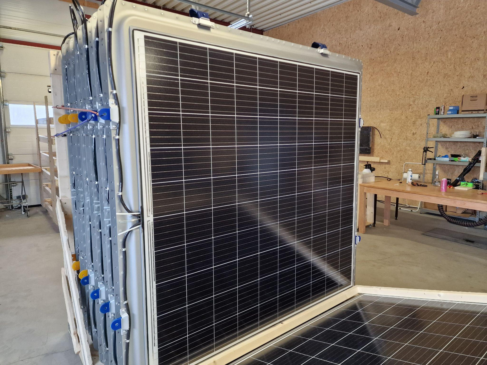{width="3.1875in" height="2.3868055555555556in"}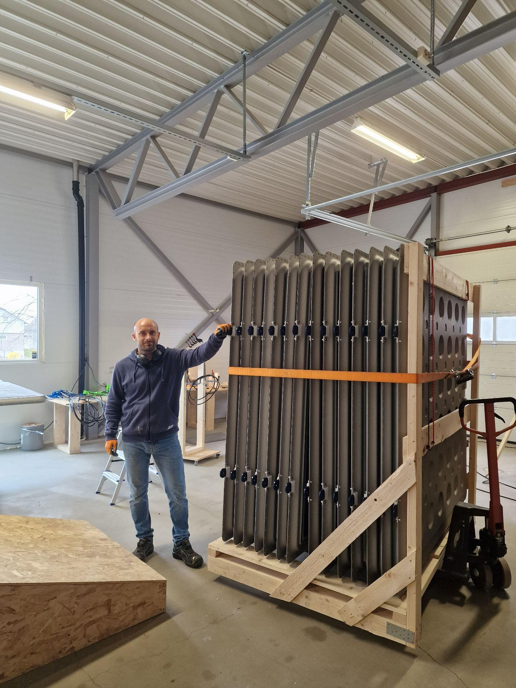{width="1.7916666666666667in" height="2.3944444444444444in"}

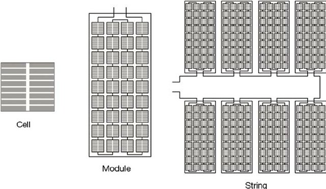

The efficiency of the PV module is a crucial factor to maximize the energy output. Higher module efficiency means that more sunlight is converted into electricity, increasing the overall energy generation of the system. With the current PV, provided by MetSolar from Lithuania, each module has an output of 537 W. When Sunlit Sea selected PV modules for the design, higher efficiency ratings were prioritized. While performance is essential, the cost-effectiveness of the PV string module design should also be considered. Evaluate the balance between module quality, efficiency, and the overall system cost[^10]. It is crucial to select modules that provide a good balance of performance and cost, ensuring a reasonable return on investment for the FPV system.

# Use of recyclable materials / Use of recyclable materials for the string 

##  5.1 Recycling aluminium

As previously highlighted, aluminium is an excellent material, in terms of recycling. Aluminium recycling offers significant energy savings compared to primary aluminium production. The recycling process requires only around 5% of the energy needed to produce aluminium from raw materials[^11].\
This energy efficiency helps reduce greenhouse gas emissions and conserves valuable natural resources. It is highly recyclable without losing its inherent properties. Unlike some other materials, aluminium can be recycled repeatedly without any degradation in quality[^12]. By recycling aluminium, we can conserve natural resources and reduce the need for mining and extraction of bauxite, the primary source of aluminium.

Aluminium recycling offers economic advantages at various levels. It reduces the dependence on costly primary aluminium production, which requires significant investment in mining and refining processes[^13]. Overall, the recyclability of aluminium provides a sustainable and efficient solution for reducing energy consumption, conserving resources, and promoting economic growth.

**Marine grade aluminium used in floats**\
\
Sunlit Sea uses Aluminium 5083 - which is a marine-grade type, widely utilized in such environments. Recycling marine grade aluminium, such as 5083, that has been used at offshore installations can present some challenges compared to recycling other forms of aluminium. It may have been exposed to various elements, such as saltwater, oils, and other contaminants. This can make the recycling process more complex as the aluminium needs to be properly cleaned and treated to remove any impurities or hazardous substances before recycling.

Marine-grade aluminium alloys like 5083 may have specific composition requirements for their intended applications. The recycling process needs to ensure that the recycled aluminium meets the required specifications for marine-grade applications, including strength, corrosion resistance, and other desired properties. This may involve additional refining and alloying steps to achieve the desired composition[^14].

While recycling marine-grade aluminium from offshore installations may involve some additional considerations, it is still feasible to recycle these materials. Proper handling, cleaning, and processing techniques can ensure that the recycled aluminium retains its properties and can be used in various applications, including marine-grade applications[^15].

## 5.2 Recycling polyurethane 

The hinges used between each float are casted in a PU-rubber called polyurethane. PU is a versatile and widely used polymer material that can have varying degrees of recyclability depending on its specific composition and application. In general, polyurethane can be recycled, but the recyclability may vary depending on the type of polyurethane, its formulation, and the recycling infrastructure available. The recyclability of polyurethane is not without challenges. Some types of polyurethane may contain additives, fillers, or coatings that can affect the recycling process and limit their recyclability. The hinges used in Sunlit Seas' product have an additional UV-material added to the mix.

It can be mechanically recycled, which involves processes such as grinding, shredding, or melting the material to create recycled polyurethane products. However, the success of mechanical recycling depends on factors such as the purity of the polyurethane waste, the absence of contaminants, and the availability of suitable recycling technologies.

Chemical recycling methods, such as depolymerization or solvolysis, can be used to break down polyurethane into its chemical constituents, allowing for the production of new polyurethane or other chemical products.

##  5.3 Recycling foam cups

The foam cups used to fill the dimples are made of EPS-expanded polystyrene, which has tiny air pockets trapped within the material. The low density and composition of EPS make it challenging to recycle through traditional recycling methods[^16].

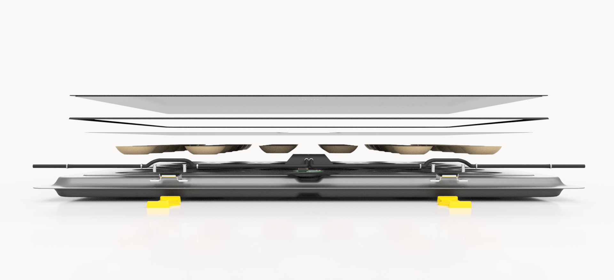{width="6.299660979877515in" height="2.0827471566054245in"}

Many recycling facilities do not have the capability to efficiently recycle foam cups due to their low density. However, some specialized recycling facilities may accept EPS for recycling[^17]. It is important to check with local recycling programs or waste management facilities to determine if they accept foam cups for recycling and what specific requirements they may have. Alternative solutions that can be considered for decommissioned systems are recycling programs for the foam, and collecting and compacting the material, before it is shipped off to specialized facilities.

# Flexible joint design / Design of flexible joints (between the floats)

The floats are attached together using flexible joints called hinges, as shown in the picture below. Those joints are held to the float using brackets designed by Sunlit Sea. These brackets and hinges have solely been tested for near-shore conditions, with a maximum rating of 0.9m rough waves. Extreme wind, current and wave performance in correlation to the Sunlit Sea design basis is part of future studies.

  ---------------------------------------------------------------------------------
   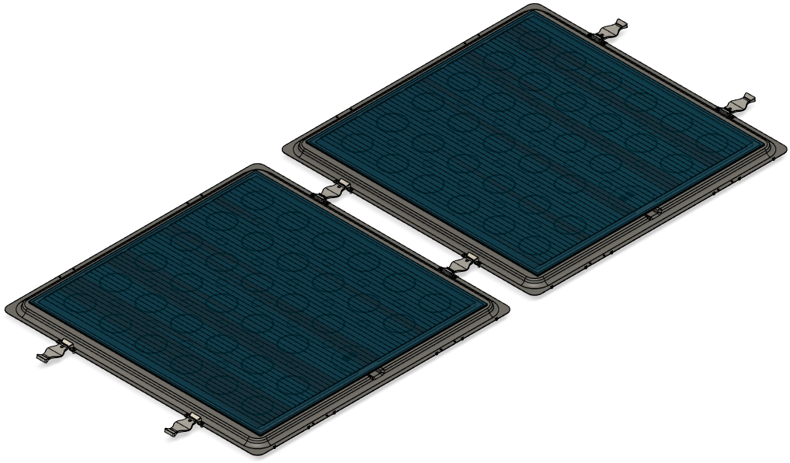{width="3.129628171478565in" height="1.654319772528434in"}

                       Figure 3: *Two floats holding together*
  ---------------------------------------------------------------------------------

The hinge is made of Polyurethane Rubber and has been designed to hold the floats together when a constraint is applied to them, mainly due to the marine flow. Here is a scheme of the composition of the hinge:

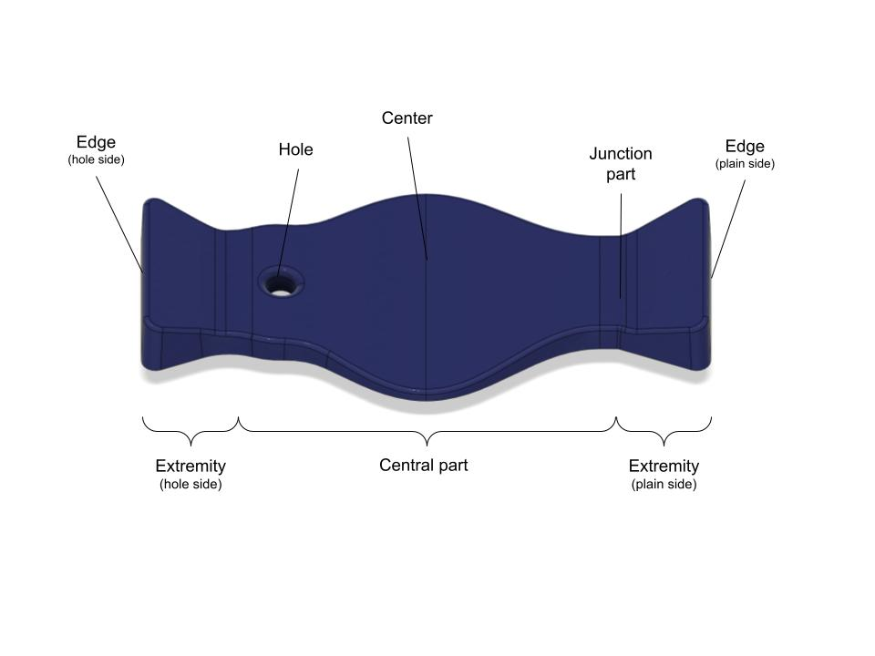{width="3.952988845144357in" height="2.1892530621172352in"}

Figure 4 Hinge scheme

The brackets are made from aluminium and are attached to one side of the float using bolts and rivets.

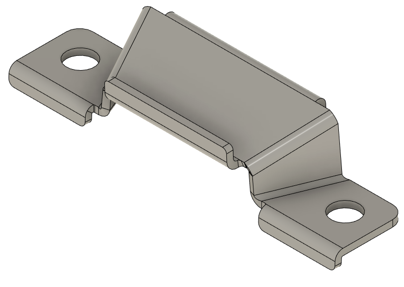{width="2.8in" height="2.0in"}

Figure 5 Bracket

## 6.1 Design requirements for the hinges and brackets

To hold the floats together during all steps of the deployment, the hinges and the brackets must fulfill some requirements. First, the hinge must ensure that the floats always stay 15 cm away from one another after their deployment. To comply with this requirement, the hinge must resist compression enough to make sure that the floats don't crash into each other but also must resist tension to withstand the maximal load the floats will endure during their lifetime. To reach the two requirements, the hinge is made from a highly resistant rubber developed by Strukturplast. To ensure that the hinge will not break at one specific point, the cross-section must be constant along its length making the load evenly distributed throughout the section.

Then, the hinge must be securely attached to the float. This is done by using a specific bracket that will trap the extremity of the hinge between the float and itself. The reduction of the section between the edge and the central part must be great enough for the hinge not to slip away from the bracket.

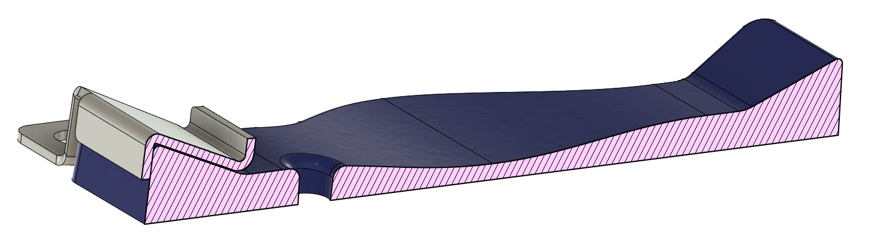{width="6.299660979877515in" height="1.6666666666666667in"}

Figure 6 Hinge cross-section

Finally, the hinge needs to be made out of a material that is resistant enough to the load applied during all steps of deployment, as well as flexible enough to enable some complex geometry of the overall stack of floats. For example, the material composing the hinges must not allow snagging. However, it must enable the hinges to roll off on top of each other and to withstand the situation presented below.

It must also be able to bend easily, which is done by making it flatter on its central part. In order to reduce as much as possible, the weathering, the hinge must have a reduced surface-to-cross-section area ratio. During the project, lab testing of the hinges will be performed to estimate the failure loads and learning from this will be utilized to find out suitable materials which can withstand extreme conditions.

The bracket must be locking the hinge on one side of the panel. It is made of 1.5 mm 5083 aluminium, like the rest of the float, to avoid corrosion caused by the usage of two metals with different oxidation rates. It must be securely fastened to the float in order not to break away in extreme situations.

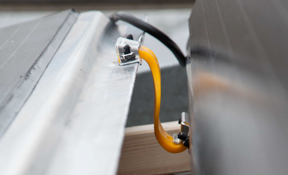{width="3.2031255468066493in" height="1.946998031496063in"}

Figure 7 bracket made 5083 aluminium

## 6.2 String length and load between the floats

Based on the campaigns carried out at Stadt Towing Tank, it is possible to have an estimation of the overall load that the floats will have to withstand after deployment. The force experienced by an array of panel floats may be given by:

$F = 0.5\rho SC_{D}U^{2}$

where:

$\rho$ is the density of water. We take ρ=998.2 kg/m^3^;

S is the total wetted areas;

$C_{D} = C_{D}(N,\ Re,\ Fr)$ is the drag coefficient as a function of N (the number of floats), the Reynold number, and the Froude number;

U is the undisturbed current velocity.

The model and the measured drag coefficients enabled us to have precise data about the drag force that the floats will endure, depending on the velocity U. The results are resumed in the two tables below. Table-1 and Table-2 provide forces on the FPV matrix exposed to current float with velocities of 1.1 m/s and 0.75 m/s respectively.

Table 1 Force on an FPV matrix exposed to float with current velocity *U~C~* = 1.1 m/s

+:-----------:+:---------------------:+:-----------------:+:----------------:+
| **Effect**  | **Configuration^1)^** | **Force estimates (N)**              |
|             |                       |                                      |
|             | **(M x N)**           |                                      |
|             |                       +-------------------+------------------+
|             |                       | **One array^1)^** | **Full matrix**  |
+-------------+-----------------------+-------------------+------------------+
| 0.5 kWp     | 1 x 1                 | 22 N              | 22 N             |
+-------------+-----------------------+-------------------+------------------+
| 4.7 kWp     | 3 x 3                 | 44 N              | 132 N            |
+-------------+-----------------------+-------------------+------------------+
| 25 kWp      | 7 x 7                 | 87 N              | 612 N            |
+-------------+-----------------------+-------------------+------------------+
| 0.1 MWp     | 14 x 14               | 0.2 kN            | 2.3 kN           |
+-------------+-----------------------+-------------------+------------------+
| 1 MWp       | 44 x 44               | 0.5 kN            | 21.5 kN          |
+-------------+-----------------------+-------------------+------------------+
| 5.2 MWp     | 100 x 100             | 1.1 kN            | 109 kN           |
+-------------+-----------------------+-------------------+------------------+
| 50 MWp      | 309 x 309             | 3.4 kN            | 1038 kN          |
+-------------+-----------------------+-------------------+------------------+

1)  With calculated flow direction parallel with the N panels

Table 2 Force on a FPV matrix expose to current float with velocity *U~C~* = 0.75 m/s

+:-----------:+:---------------------:+:-----------------:+:----------------:+
| **Effect**  | **Configuration^1)^** | **Force estimates (N)**              |
|             |                       |                                      |
|             | **(M x N)**           |                                      |
|             |                       +-------------------+------------------+
|             |                       | **One array^1)^** | **Full matrix**  |
+-------------+-----------------------+-------------------+------------------+
| 0.5 kWp     | 1 x 1                 | 7 N               | 7 N              |
+-------------+-----------------------+-------------------+------------------+
| 4.7 kWp     | 3 x 3                 | 17 N              | 51 N             |
+-------------+-----------------------+-------------------+------------------+
| 25 kWp      | 7 x 7                 | 37 N              | 258 N            |
+-------------+-----------------------+-------------------+------------------+
| 0.1 MWp     | 14 x 14               | 71 kN             | 999 N            |
+-------------+-----------------------+-------------------+------------------+
| 1 MWp       | 44 x 44               | 0.2 kN            | 9.6 kN           |
+-------------+-----------------------+-------------------+------------------+
| 5.2 MWp     | 100 x 100             | 0.5 kN            | 49.5 kN          |
+-------------+-----------------------+-------------------+------------------+
| 50 MWp      | 309 x 309             | 1.5 kN            | 472 kN           |
+-------------+-----------------------+-------------------+------------------+

1)  With calculated flow direction parallel with the N panels

The brackets and hinges must withstand the drag force exerted by a 1MWp FPV matrix, meaning that the two hinges between two floats should withstand a load of 500N, meaning that each hinge should withstand at least 250N.

## 6.3 Joint design

To tackle all the challenges, the design of the brackets and the hinges have been thoroughly discussed and evolved towards a design capable of dealing with all the requirements.

The bracket is made of 1.5 mm thick aluminium and was designed to perfectly fit the lip of the float. It is attached to the float using a pair of rivet nuts, which can withstand more than 5kN, in accordance with the documentation from the producer.

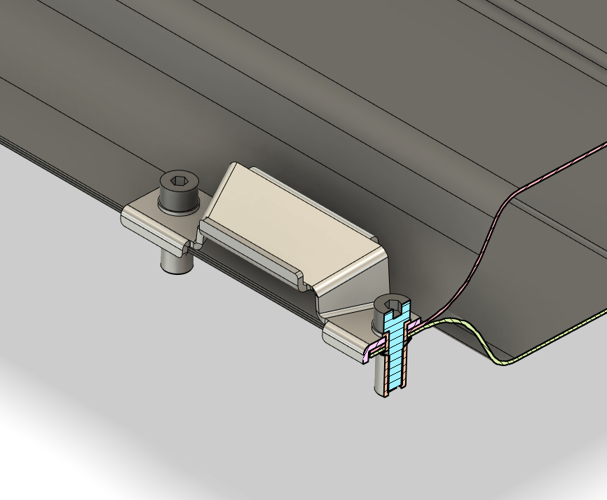{width="4.493395669291338in" height="3.1233169291338583in"}

Figure 8 joints

The bracket has the following dimensions :

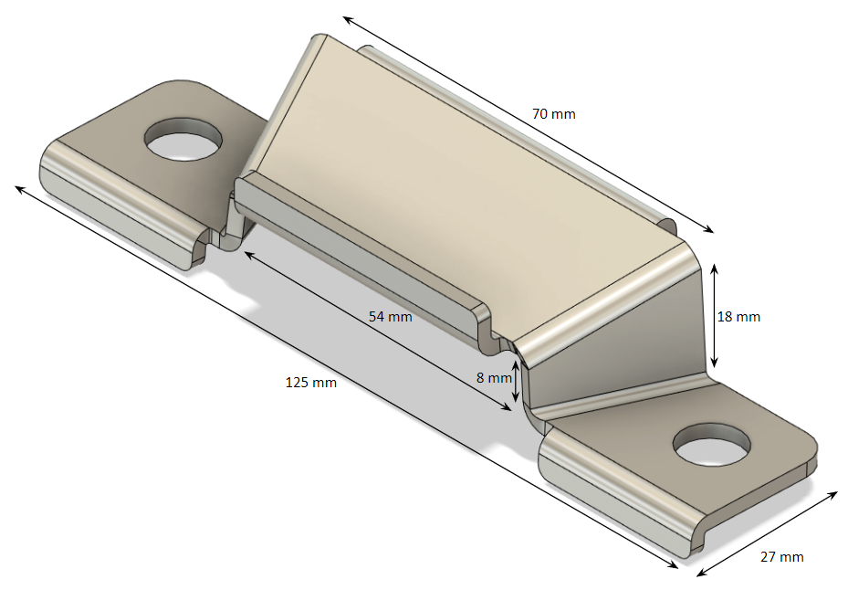{width="4.915400262467192in" height="3.1966382327209097in"}

Figure 9 bracket dimensions

The bracket was designed to avoid having a concentration of constraints, especially on the sharp edges: the angles have been rounded off, and a piece has been added to the outer part to give more strength to the overall piece.

In order to make sure that the hinge will not slip off the bracket, some features have been added. On the back of the bracket, an overlap of metal covering the edge of the hinge has been added for it not to be able to slip toward the float that it is attached to. In order to make sure that the hinge will not slip away from the float and the bracket, a reduction of the section has been done on each extremity of the hinge. The reduction of the section is governed by a factor 2: the section reduces from 1360mm² on the extremity to 600mm² on the central part.

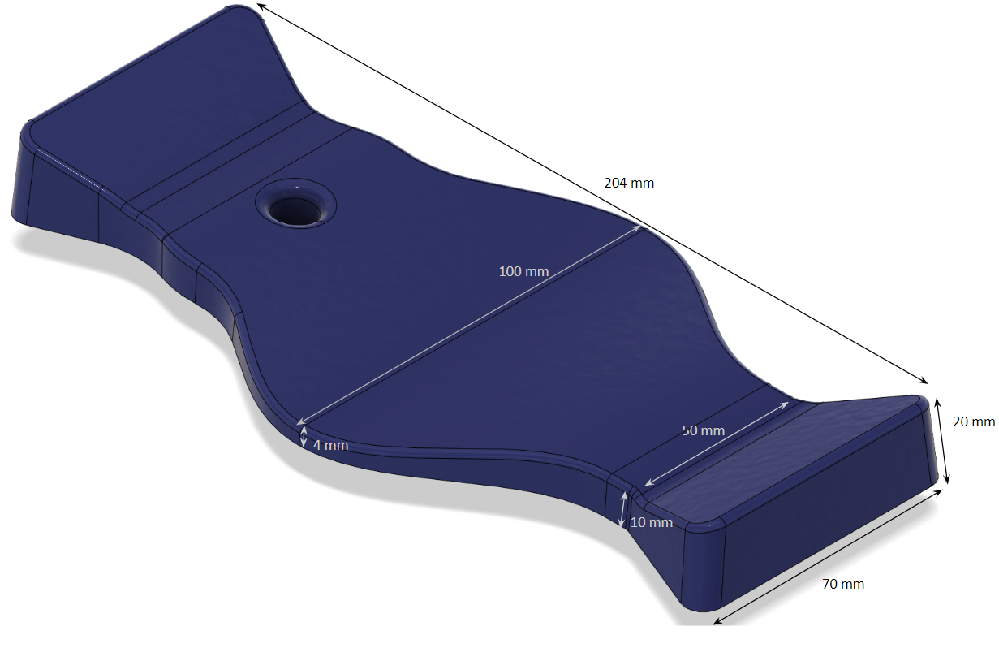{width="4.985429790026247in" height="2.466680883639545in"}

Figure 10 Hinge dimensions

The cross-section of the hinge has been set so that the hinge will withstand a 5kN load. Knowing that the rubber used, called NORSelast 02, has a tensile strength of 42MPa, the required cross-section is 119mm². The actual cross-section in the final design is 430 to 510mm², making it confident that the hinge will hold at least 5kN of a parallel horizontal load. It has been achieved with a flat area in the centre of the hinge, which enables the hinge to bend easily. The overall surface of the hinge receiving UV is 10200mm².

Hinge performance and validation for offshore conditions are still needed and are an integral part of the ongoing research. The first stage is hinge tests and material studies, scheduled in SINTEF labs in autumn 2023.

# PV panels cooling / Maximise PV panels cooling

In a marine environment, cooling of photovoltaic (PV) modules is a critical aspect to optimize their performance and ensure long-term reliability. The cooling principles in a marine environment can be understood through the mechanisms of convective heat transfer and evaporation. Sunlit Seas' flat design offers several advantages in this regard, utilizing the entire surface for cooling, leaving it less exposed to wind drag. Nevertheless, focusing on a non-tilted design leads to other limitations, like less optimal inclination towards the sun and lower energy output. Increased water cooling compensates for the inclination variable. Panel orientation towards the sun and geographical location in the world (strength of solar radiation) are additional factors that will affect overall production.

The estimated energy loss due to flat-tilted design is approximately 15%.[^18]

## 7.1 Water cooling

Convective heat transfer involves the exchange of heat between the PV module and the surrounding air or water. In a marine environment, the presence of water offers a unique opportunity for enhanced convective cooling. As water comes into contact with the PV module\'s surface, it absorbs the heat generated by the solar cells[^19]. Due to the higher thermal conductivity of water compared to air, heat is transferred more efficiently through conduction from the PV module to the water.

Furthermore, the movement of water in the marine environment introduces the phenomenon of forced convection. Waves, currents, and tidal movements induce water flow around the PV module, enhancing the convective heat transfer[^20]. This flow of water carries away the excess heat from the PV module, preventing overheating and maintaining lower operating temperatures.\
\
On the contrary, stagnant water may affect the structure negatively, potentially affecting its performance, structural integrity, and overall energy output.

Stagnant water limits the natural convective cooling process, as there is a lack of water movement and limited airflow. This can result in higher temperatures on the PV module surface, reducing its electrical output and overall energy generation.

It also provides an environment conducive to the accumulation of debris, such as leaves, branches, algae, and other organic matter. The accumulation of debris on the PV module\'s surface can block sunlight, reducing the solar irradiance reaching the cells and subsequently decreasing energy output. Additionally, the presence of organic matter can lead to biofouling, where microorganisms, such as algae and barnacles, attach and grow on the surface. Biofouling further reduces energy generation and increases maintenance requirements. Stagnant water around the floating PV structure increases the risk of corrosion, particularly if the structure is made of metal, such as aluminium or steel. Stagnant water creates a favorable environment for the accumulation of salts, sediments, and other corrosive agents.

Evaporation is another cooling mechanism that can occur in a marine environment. As water contacts the PV module, it can evaporate due to the heat absorbed from the solar cells. Evaporation is an energy-intensive process that requires the conversion of liquid water into vapor, effectively dissipating heat. This cooling mechanism can be particularly effective in marine environments due to the abundant availability of water.

The combination of convective heat transfer and evaporation in a marine environment helps to mitigate the thermal stress on the PV module. By maintaining lower operating temperatures, the cooling mechanisms improve the efficiency and performance of the solar cells, as their electrical characteristics are influenced by temperature. To do so, Sunlit Sea has incorporated dimples, which are most easily described as cup shapes on the aluminium float. These cups are identical on both sides of the aluminium sheets, which means that they touch at the same point when joined together. This gives the structure increased stiffness and stability, but most importantly, it brings the water even closer to the PV module. This increases cooling efficiency without jeopardizing the strength of the structure.

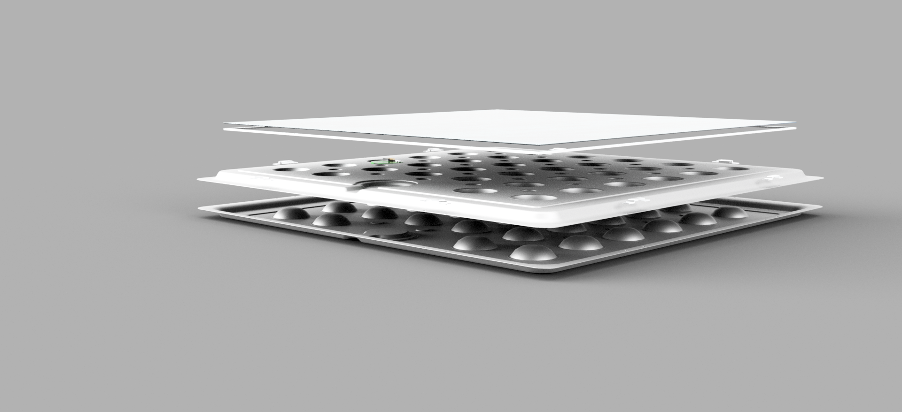{width="6.299660979877515in" height="2.875in"}\
Figure 11 Dimple structure in aluminium sheets. Credit: Sunlit Sea

Each dimple is then filled with a potting material which has additional beneficial thermal traits. They are filled with styrofoam. Styrofoam possesses desirable thermal traits, including low thermal conductivity, high R-value, moisture resistance, buoyancy, and dimensional stability. These characteristics make it a suitable potting material for insulating the aluminium structure of a floating system, helping to minimize heat transfer, maintain thermal stability, and provide buoyancy support.\
Styrofoam helps maintain a more stable temperature within the floating structure and mitigates heat loss to the surrounding water.\
\
It is worth noting that the design and configuration of the PV module in a marine environment can influence the cooling effectiveness[^21]. Factors such as the orientation and tilt angle of the PV module, the distance from the water surface, and the presence of shading or obstructions can impact the exposure to cooling airflow and water flow.

In conclusion, in a marine environment, PV module cooling is primarily achieved through convective heat transfer and evaporation. The presence of water facilitates enhanced convective cooling due to its higher thermal conductivity and the forced convection induced by water movements. The evaporation of water further aids in dissipating heat from the PV module. Understanding these cooling principles is essential in optimizing the performance and reliability of PV modules in marine environments, ensuring their efficient operation and prolonged lifespan.

## 7.2 Wind and wave implications in the marine environment

The energy output of a floating photovoltaic (FPV) offshore installation can be significantly influenced by wind and waves, which are inherent characteristics of the marine environment. The interactions between the FPV system and these environmental factors impact several aspects of its performance and energy generation potential.

The presence of wind in the offshore environment affects the energy output of the FPV system through wind-induced power generation. As the wind blows across the surface of the water, it creates air movement and generates dynamic pressures on the PV module, causing it to vibrate or oscillate[^22]. This vibration induces strain on the module, which can alter its output characteristics. In some cases, this phenomenon, known as flutter, can lead to increased power production due to improved cooling and reduced temperature gradients across the module\'s surface. However, excessive flutter can also lead to structural fatigue and reduced energy output over time.

Moreover, waves in the offshore environment induce oscillatory motions on the floating structure of the FPV system. These wave-induced oscillations can lead to misalignment or changes in the angle of incidence between the PV module and the incoming sunlight, resulting in reduced solar irradiance and energy generation. Secondly, the oscillatory motions can induce mechanical stresses and strains on the floating structure, affecting the integrity and alignment of the PV module, and potentially leading to decreased energy output and increased wear and tear over time.

The sea state, characterized by wave height and period, influences the energy output of the FPV system. Higher wave heights and more severe sea states can introduce more significant mechanical loads and dynamic forces on the floating structure. These increased loads can lead to structural vibrations, misalignment, or even potential damage to the PV module or the supporting components[^23]. Consequently, energy output may be reduced due to suboptimal alignment and increased mechanical stresses.

In conclusion, wind and waves have a significant impact on the energy output of an FPV offshore installation. Wind-induced power generation, wind speed, turbulence, wave-induced oscillations, sea state, and wave height all contribute to the overall performance and energy generation potential of the system. Understanding and managing these effects are essential for optimizing the energy output and ensuring the long-term reliability and efficiency of FPV installations in offshore environments.

## 7.3 Conductive, radiative, and convective heat dissipation 

While evaluating the PV cooling it is important to consider how heat is dispatched on different materials. For this purpose, we may consider a square-shaped aluminium surface floating on water.\
Heat dissipation typically occurs through a combination of conductive, radiative, and convective mechanisms. In the case of a square-shaped aluminium surface, heat is conducted from the hotter regions to the cooler regions of the surface. The aluminium material, known for its high thermal conductivity, facilitates efficient conduction of heat.[^24] The conductive heat dissipation process involves the transfer of thermal energy through direct molecular interactions within the material[^25]. The rate of conductive heat transfer is influenced by factors such as the thermal conductivity of aluminium, the temperature difference across the surface, and the thickness of the aluminium material.

An aluminium surface emits and absorbs thermal radiation according to its temperature and emissivity. The square-shaped aluminium surface radiates heat energy in the form of electromagnetic waves, predominantly in the infrared spectrum. The rate of radiative heat dissipation is influenced by the temperature of the surface, the emissivity of aluminium, and the surrounding environment[^26]. Factors such as surface roughness and the presence of reflective or absorbing materials can also affect radiative heat transfer.

Convective heat dissipation occurs when there is airflow over the surface. As air flows over the surface, it picks up heat through convection, carrying away thermal energy. The rate of convective heat transfer is influenced by factors such as the velocity and temperature of the airflow, the surface area of the aluminium, and the convective heat transfer coefficient, which depends on the surface roughness and the properties of the fluid[^27].

## 7.4 Heating effect of bird droppings

Bird droppings on a PV panel can indeed cause heating effects, which can in turn affect the energy production of the panel. Bird droppings may contain dust, dirt, and other particles, which can accumulate on the surface of the PV panel over time. This soiling reduces the transmittance of sunlight through the panel, leading to decreased light absorption by the PV cells. The reduced transmittance limits the amount of solar energy available for conversion into electricity, thereby reducing the energy production of the PV panel.

It can act as an insulating layer on the surface of the PV panel. This layer impedes the dissipation of heat from the panel, particularly during periods of high solar radiation and ambient temperatures. The insulation effect prevents effective cooling of the PV cells, leading to increased temperatures on the panel\'s surface. Elevated temperatures can negatively impact the electrical performance and efficiency of the PV cells, resulting in reduced energy production.

In addition, bird droppings can create localized shading on the PV panel surface. When sunlight is blocked by the droppings, the shaded area experiences reduced or no solar irradiance[^28]. The uneven distribution of sunlight can lead to non-uniform heating of the panel, potentially causing hot spots. Hot spots occur when certain areas of the panel become significantly hotter than the surrounding areas, which can result in localized damage to the cells and reduced energy output.

As a consequence, bird droppings can alter the surface properties of the PV panel, affecting the reflection and scattering of sunlight. The presence of droppings can change the surface roughness and optical properties of the panel, leading to variations in the reflection and scattering of light[^29]. These variations can influence the light trapping and absorption within the PV cells, affecting their performance and energy conversion efficiency.

To mitigate the effects of bird droppings on PV panels, regular cleaning, and maintenance are essential. Prompt removal of droppings can help prevent the accumulation of heat, shading, hot spot formation, and soiling. Implementing protective measures such as bird deterrents or installing physical barriers can also help minimize the likelihood of bird droppings on the panels.

# Built-in smart sensing technology

Leading technologies in the market are not extensively utilizing sensors to optimize O&M. Since O&M costs are expected to be significant in marine locations, Sunlit Sea will employ power and monitoring electronics at the module level to optimize O&M for the entire installation. These systems are expected to improve performance, safety, and perceived risk for Sunlit Sea\'s installations. These innovations have the potential to significantly reduce costs and expand market opportunities for Sunlit Sea compared to competing FPV actors.

**Sensorics and module surveillance**

The floats and panel matrix are equipped with various types of sensors, such as load cells in the corners of the matrix to measure anchoring forces, high-precision wave gauges from UiO (University of Oslo), and acceleration and rotation sensors. Data from the wave gauges, as well as the acceleration and rotation sensors, are both analog and digitally processed in a microcontroller per float. The signal processing and data processing for wave data are based on research on waves in the Arctic, including at the Mathematical Institute at UiO, modern research on positioning and drift filters, and research on increasing precision in low-frequency data, with the aim of developing a method that allows the use of the cheapest type of sensors without significant loss of data quality.

Sensor data from strain gauges on floats, panels, and load cells in the corners will be analysed to model the forces experienced by the bonding. Furthermore, the results are used to validate finite element simulations and subsequently reduce the load in other areas of the float. The relationship between temperature and power production will be modelled using temperature measurements. Wind measurements are used in data analysis to estimate the proportion of measured waves attributed to wind and the proportion coming from deeper water.

**Wave Induced Performance Ratio**

Sunlit Sea is specifically developing sensors to track wave movement and mismatch losses. Each float has the capacity for a built-in smart sensing technology in the junction box. The junction box is being developed to contain a 6-axial inertia sensor and a real-time reporting system that conveys sensor readings over cable.

At the receiving end, a software package filters and processes the data by culling, time-windowing, cosine-tapering, running-averaging, low- and high-pass filtering, compensating for missing data, and feedback-filtering data (raw and filtered) are made available.

# The system\'s robustness and durability

Operating floating modules in a harsh marine environment involves several challenges, which entails that the product must be re-validated on an individual component level. Evaluation of the system\'s robustness and durability will be conducted by defining criteria for offshore conditions, to see if it complies with the recommended practice of DNV; [[DNV-RP-0584 Design, development and operation of floating solar photovoltaic systems]{.underline}](https://www.dnv.com/energy/standards-guidelines/dnv-rp-0584-design-development-and-operation-of-floating-solar-photovoltaic-systems.html). Nevertheless, the circumstances in which the system will be implemented have yet to be tested. In addition to a system description, this section will complete an accurate design evaluation based on the expected offshore conditions.

## 9.1 Welded connections 

There are 3 types of welds in the architecture of the float, see Figure 12. First, we have the perimeter welding of the float, which provides bonding between the two pressed blanks. Then we have the hole welds. They allow for the resistance to water intrusion of every hole bored in the float. Finally, we have the dimples welds shown on reads far right. This gives the float its increased stiffness, even with thinner sheets of aluminium.

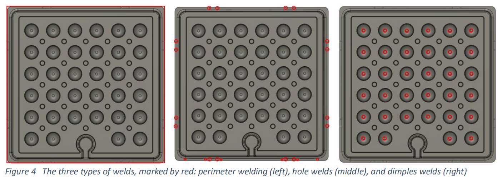{width="6.299660979877515in" height="2.0737357830271215in"}

Figure 12 Three types of welds, marked by red: perimeter welding (left), hole welds (middle), and dimple welds (right)

## 9.2 Sealing architecture: Protection of the external environment of the electronics

As shown in Figure 13, the sealing architecture includes a joint between the PV panel lip and the aluminium float. The joint itself is applied as a bead of 7 mm on the perimeter of the PV panel, onto the float. The PV panel is then gently pressed against the float to bond. The inside of the pocket created by this joint is then filled with a potting material to protect the electrical components and increase the mechanical overall resistance of the assembly

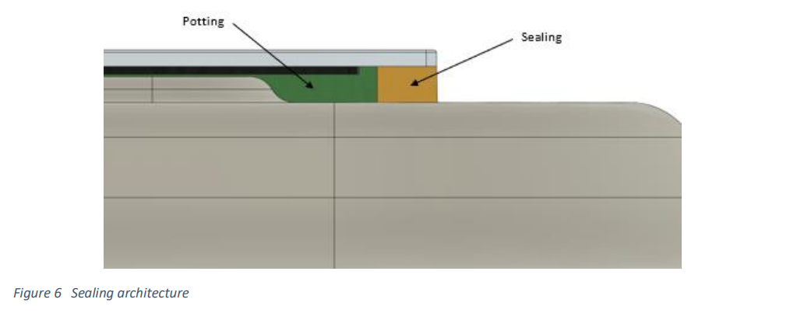{width="5.715178258967629in" height="1.6281211723534559in"}

Figure 13 Sealing architecture.

## 9.3 Connecting hinges 

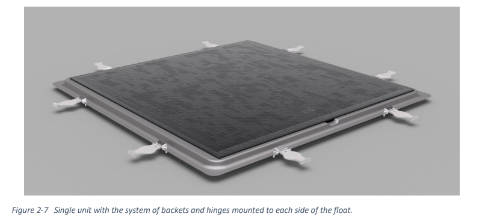{width="6.115277777777778in" height="2.716666666666667in"}To connect the floats into a large matrix, 2 aluminium brackets + hinges are mounted on each side of the panel. This gives 8 brackets and 8 shared hinges (one hinge is shared between two panels) per panel, as shown in Figure 14. For a view of the hinge, made from casted polyurethane polymer, and the bracket, made from aluminium, see Figure 15. The brackets are a centrepiece of the mechanical fastening of the system. On one side, they are bolted to the aluminium float with blind rivet nuts, where each rivet nut offers a load resistance of 17,5kN. On the other hand, they encompass the polyurethane hinges within the parallelepipedal socket that they are shaped in. These connections are designed for mild sea states

Figure 14 Single unit with the system of backets and hinges mounted to each side of the float

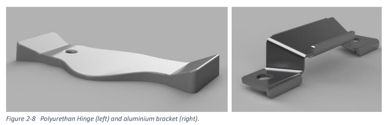{width="6.090687882764654in" height="1.6770516185476816in"}\
Figure 15 Polyurethan Hinge (left) and aluminium bracket (right)\
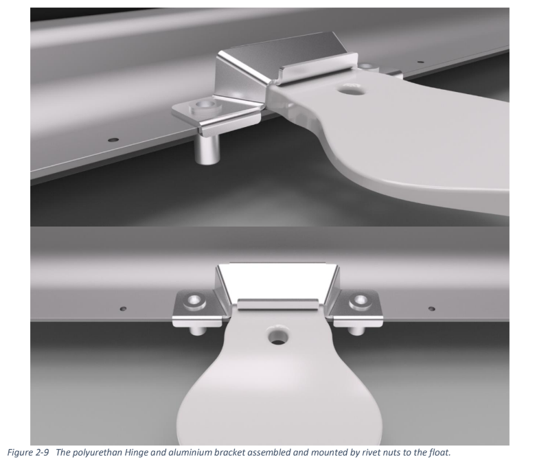{width="4.617882764654418in" height="3.6083311461067367in"}\
Figure 16 Polyurethan Hinge and aluminium bracket assembled and mounted by rivet nuts to the float

## 9.4 Minimizing of Electrical Connections.

Cables through the \"CDV\" that protects the \"keyhole\" shape of the float containing the junction box underneath the solar panel. Cables are soldered onto the junction box rather than connected with MC4 contacts which is more common in the business. All floats in a string are joined together this way.

# Conclusions

In conclusion, the deliverable has brought attention to several crucial factors relevant to the design and implementation of floating photovoltaic (FPV) systems in offshore marine environments. The floating PV solutions proposed by Sunlit Sea have been previously tested for mild sea states, but the general theoretical aspects, correlating with the offshore environment, are subject to discussion and need to be tested and validated. Evaluation of the system\'s robustness and durability will be conducted by defining criteria for offshore conditions, to comply with the recommended practice of DNV; [[DNV-RP-0584 Design, development and operation of floating solar photovoltaic systems]{.underline}](https://www.dnv.com/energy/standards-guidelines/dnv-rp-0584-design-development-and-operation-of-floating-solar-photovoltaic-systems.html). The following conclusions have been made:

**Design of optimal string module**

The report has emphasized design features that optimize energy production, ensure optimal operation and maintenance routines, provide structural integrity details, and mitigate forces and loads that could be detrimental to these systems. By prioritizing higher efficiency ratings and considering cost-effectiveness, the aim has been to maximize energy output while ensuring a reasonable return on investment. The adherence to international voltage limits and the flexibility to accommodate customized arrangements demonstrate commitment to delivering efficient and compliant FPV solutions.

**\
Design flexible joints between the floats**

The discussed design considerations, particularly the robust joint design utilizing corrosion-resistant aluminium brackets and well-engineered hinges, are essential to ensure the structural integrity of FPV systems in the face of extreme forces. Each hinge has undergone testing and is expected to withstand 250N in mild conditions. Hinge loads have yet to be tested for offshore conditions. While these hinges will be exposed to repetitive cyclic loads and snagging motions, it is hoped that the breakwater structure will prevent non-uniform loads. Further hydrodynamic studies are necessary to understand better how the floating matrix behaves when subjected to excessive drag forces. Separate hinge tests are scheduled in SINTEF labs in autumn 2023.

**Maximizing PV panel cooling**\
Both the shape and materials used in the FPV system offer several benefits in terms of cooling. Optimizing the cooling efficiency of PV modules through convective heat transfer and evaporation, capitalizing on the presence of water in marine environments, is crucial for achieving optimal performance and long-term reliability. For example, the flat design allows for increased overwash and splash zones, which can lower the PV temperature. However, areas frequently exposed to overwash and splashing will require more extensive cleaning routines to prevent salts and corrosion.

Understanding the effects of wind and waves on energy generation and system stability is crucial for maximizing the potential of FPV systems. Aluminium, known for its excellent thermal properties, is well-suited for offshore conditions. Wind, tidal movements, and cold water can increase product longevity and energy output. Avoiding stagnant water is also beneficial as it makes it more challenging for marine growth, such as algae and debris, to form.

**Use of recyclable material for the string**\
The deliverable has highlighted the recycling benefits of aluminium while emphasizing the importance of considering mix characteristics, proper cleaning, handling, and establishing solid processing requirements. The ability to adhere to recommended practices is likely an important factor for several stakeholder groups and thus impacts the feasibility of future projects. Creating an overview of the recyclability of various product components and materials is a potential avenue to explore by researchers working with environmental impact aspects.

**Improve the corrosion behaviour of the string**\
The marine-grade aluminium (5083) and anodization are two effective measures employed to combat corrosion. Specifically designed to withstand harsh conditions, it possess enhanced corrosion resistance properties. Due to its alloy mix, 5083, create a protective oxide layer on the surface, shielding the metal from corrosive agents like seawater. The anodization forms a thick, durable oxide layer, through a electrochemical treatment. This process not only strengthens the metal but also provides excellent corrosion resistance. By combining marine-grade aluminium and anodization, the resulting material exhibits exceptional resistance to corrosion, making them ideal for marine, and offshore applications such as this FPV. These anti-corrosion measures contribute significantly to the longevity and reliability of the floats.

**Considerations for Global PV Design**\
The project partner Sunlit Sea has identified several key challenges in addressing global photovoltaic (PV) design considerations. The focus on sustainability and renewable energy underscores the significance of minimizing the environmental impact of PV installations. Carefully considering factors like material selection, energy efficiency, and carbon footprint reduction when designing the PV systems.

Moreover, recognizing the importance of adapting PV designs to local conditions. Geographical factors such as solar irradiance, weather patterns, and land availability played a crucial role in the design approach. By tailoring designs to specific locations, the project partners aim to optimize the performance of PV systems and maximize energy generation.

In summary, the global PV design considerations revolve around sustainability and adaptability. The project partners prioritize environmentally friendly practices and strive to create PV installations that harmonize with local conditions, ultimately aiming to harness solar energy efficiently and responsibly.

**Smart Sensing Technologies**\
The project partners are leading the way in utilizing sensors technology to optimize the operation and maintenance (O&M) of floating photovoltaic (FPV) systems in marine environments. By incorporating the power and monitoring electronics at the module level, we aim to improve the overall performance, safety, and risk perception of their installations while reducing O&M costs. The implementation of smart sensing technology within the floats, particularly in the junction box, allows for tracking wave movement and mismatch losses. The sensors measure movement on six different axes using gyroscopes and accelerometers, providing real-time data for orientation and rotation calculations. Ongoing research aims to further develop test methodologies and sensorics to analyse movements, mechanical loads, and water/salt intrusion in both field and laboratory settings. These advancements in sensor technology hold the potential to significantly reduce costs and open new market opportunities in the FPV industry.

# Bibliography

Aasen Øystein, "Modeling and control of catenary mooring systems for vessels, oil rigs, and barges". NTNU Open, Published 2018. p. 20, URL: [[https://ntnuopen.ntnu.no/ntnu-xmlui/bitstream/handle/11250/2491570/18159_FULLTEXT.pdf?sequence=1&isAllowed=y]{.underline}](https://ntnuopen.ntnu.no/ntnu-xmlui/bitstream/handle/11250/2491570/18159_FULLTEXT.pdf?sequence=1&isAllowed=y) (Accessed 17.05.23)

Anil Kumar Sisodia. Ram kumar Mathur, "Impact of bird dropping deposition on solar photovoltaic module performance: a systematic study in Western Rajasthan", Environmental Science and Pollution Research, Published Oct 2019, SSN 0944-1344 Volume 26 Number 30, DOI: DOI 10.1007/s11356-019-06100-2 (Accessed: 25.05.23)

A. Vinoth Jebaraj , K.V.V. Aditya , T. Sampath Kumar , L. Ajaykumar , C.R. Deepak, "Mechanical and corrosion behaviour of aluminium alloy 5083 and its weldment for marine applications", ScienceDirect: Materialstoday - Proceedings, [Volume 22, Part 4](https://www.sciencedirect.com/journal/materials-today-proceedings/vol/22/part/P4), 2020, p. 1474, DOI: [[https://www.sciencedirect.com/science/article/abs/pii/S2214785320306106?via%3Dihub]{.underline}](https://www.sciencedirect.com/science/article/abs/pii/S2214785320306106?via%3Dihub) (Accessed 15.05.23)

Bouvy Arjan," Tips to avoid corrosion in marine environments". HydroShapes, Last modified Nov 19, 2020. URL: [[https://www.shapesbyhydro.com/en/material-properties/tips-to-avoid-corrosion-in-marine-environments/]{.underline}](https://www.shapesbyhydro.com/en/material-properties/tips-to-avoid-corrosion-in-marine-environments/) (Accessed 12.05.23)

Chen Lin, Biswajit Basu, "Wave‐current interaction effects on structural responses of floating offshore wind turbines", ResearchGate, Last modified Dec 2018. DOI: [[[10.1002/we.2288]{.underline}]{.mark}](http://dx.doi.org/10.1002/we.2288) (Accessed 12.05.23)

DNV, "Climate Change and Effect on Marine Structure Design", Research and Innovation, Position Paper 1 - 2010. p. 6, URL: [[https://trimis.ec.europa.eu/sites/default/files/project/documents/20130118_142058_70493_ClimateChange%26EffectOnMarineStructureDesign%5B2010%5D.pdf]{.underline}](https://trimis.ec.europa.eu/sites/default/files/project/documents/20130118_142058_70493_ClimateChange%26EffectOnMarineStructureDesign%5B2010%5D.pdf) (Accessed 12.05.23)

Jian Daia , Chi Zhangb , Han Vincent Limc , Kok Keng Angb, , Xudong Qianb , Johnny Liang Heng Wongd , Sze Tiong Tanc , Chien Looi Wangd "Design and construction of floating modular photovoltaic system for water reservoirs". ScienceDirect: Energy, [Volume 191](https://www.sciencedirect.com/journal/energy/vol/191/suppl/C), 15 January 2020, 116549. DOI: <https://doi.org/10.1016/j.energy.2019.116549> (Accessed 15.05.23)

Hossein Eisapour Amir, A.H. Shafaghat, Mohammed Hayden, Eisapour Mehdi Mehd , Talebizadehsardari Pouyan, Brambilla Arianna, Fung S Alan, "A new design to enhance the conductive and convective heat transfer of latent heat thermal energy storage units". ScienceDirect, [Volume 215](https://www.sciencedirect.com/journal/applied-thermal-engineering/vol/215/suppl/C), October 2022, 118955. p. 5,URL: [[https://www.sciencedirect.com/science/article/abs/pii/S1359431122008936]{.underline}](https://www.sciencedirect.com/science/article/abs/pii/S1359431122008936) (Accessed 01.06.23).

Hydro Papers, "No time to WASTE: How to increase the use of recycled materials? Outlook and lessons learned about circular economy from the aluminium industry". PDF, Published Oct 19th 2022. URL: Hydro_Papers_Recycle_outlook_May30_2022_lowres (1).pdf (Accessed 19.05.2023)

K V Vidyanandan, "An Overview of Factors Affecting the Performance of Solar PV Systems". ResearchGate. Published Feb 2017. p 2. URL: [[https://www.researchgate.net/publication/319165448_An_Overview_of_Factors_Affecting_the_Performance_of_Solar_PV_Systems]{.underline}](https://www.researchgate.net/publication/319165448_An_Overview_of_Factors_Affecting_the_Performance_of_Solar_PV_Systems) (Accessed 24.05.23)

Kwan C Tom, "API recommended practice for design, analysis, and maintenance of catenary mooring for Floating Production System (FPS)". TU Delft, Published 1978. URL: [[https://repository.tudelft.nl/islandora/object/uuid%3A277c3a69-fc4f-445c-b93d-a2cee27c9c80]{.underline}](https://repository.tudelft.nl/islandora/object/uuid%3A277c3a69-fc4f-445c-b93d-a2cee27c9c80)

(Accessed 06.06.23)

Loai Ben Naji, Osama M Ibrahim, Al-Fadhalah Khaled, "Formation of Protective Aluminum-Oxide Layer on the Surface of Fe-Cr-Al Sintered-Metal-Fibers via Multi-Stage Thermal Oxidation". ResearchGate, Nov 2018. URL: [[https://www.researchgate.net/publication/328830117_Formation_of_Protective_Aluminum-Oxide_Layer_on_the_Surface_of_Fe-Cr-Al_Sintered-Metal-Fibers_via_Multi-Stage_Thermal_Oxidation]{.underline}](https://www.researchgate.net/publication/328830117_Formation_of_Protective_Aluminum-Oxide_Layer_on_the_Surface_of_Fe-Cr-Al_Sintered-Metal-Fibers_via_Multi-Stage_Thermal_Oxidation) (Accessed 17.05.23)

L P Schaefer, "Electrical grounding systems and corrosion". IEEE Xplore, Volume 74. Issue 2, Published May 1955. p. 16, URL: [[https://ieeexplore.ieee.org/document/6371476]{.underline}](https://ieeexplore.ieee.org/document/6371476) (Accessed 25.05.23)

Miller Randy, "Recycling Expanded Polystyrene (EPS): Giving "Styrofoam" New Life". Published May 26th, 2020. URL: [[https://millerrecycling.com/expanded-polystrene-styrofoam-new-life/]{.underline}](https://millerrecycling.com/expanded-polystrene-styrofoam-new-life/) (Accessed 03.06.23)

Niru Kumari, Vaibhav Bahadur, Marc Hodes, Salamon Todd, Kolodner Paul, Lyons Alan, Garimella Suresh, "Analysis of Evaporating Mist Flow for Enhanced Convective Heat Transfer". ResearchGate, Published July 2010. P. 3, URL: Analysis_of_Evaporating_Mist_Flow_for_Enhanced_Con.pdf (Accessed 25.05.2023)

ROHM Co., Ltd, "Basics of Thermal Resistance and Heat Dissipation", No. 64AN043E Rev.001 Aug 2021, p. 2, URL: [[https://fscdn.rohm.com/en/products/databook/applinote/common/basics_of_thermal_resistance_and_heat_dissipation_an-e.pdf]{.underline}](https://fscdn.rohm.com/en/products/databook/applinote/common/basics_of_thermal_resistance_and_heat_dissipation_an-e.pdf) (Accessed 29.05.23)

Weiss Karl-Anders, M. Aßmus, Jack Steffen, Köhl Michael, "Measurement and simulation of dynamic mechanical loads on PV-modules", ResearchGate, Published Aug 2009, p. 6, [DOI:[[10.1117/12.824859]{.underline}](http://dx.doi.org/10.1117/12.824859)]{.mark} (Accessed 19.05.23)

# 

[^1]: Jian Daia , Chi Zhangb , Han Vincent Limc , Kok Keng Angb, , Xudong Qianb , Johnny Liang Heng Wongd , Sze Tiong Tanc , Chien Looi Wangd "Design and construction of floating modular photovoltaic system for water reservoirs". ScienceDirect: Energy, [Volume 191](https://www.sciencedirect.com/journal/energy/vol/191/suppl/C), 15 January 2020, 116549. DOI: <https://doi.org/10.1016/j.energy.2019.116549> (Accessed 15.05.23)

[^2]: Chen Lin, Biswajit Basu, "Wave‐current interaction effects on structural responses of floating offshore wind turbines", ResearchGate, Last modified Dec 2018. DOI: [[[10.1002/we.2288]{.underline}]{.mark}](http://dx.doi.org/10.1002/we.2288) (Accessed 12.05.23)

[^3]: A. Vinoth Jebaraj , K.V.V. Aditya , T. Sampath Kumar , L. Ajaykumar , C.R. Deepak, "Mechanical and corrosion behaviour of aluminium alloy 5083 and its weldment for marine applications", ScienceDirect: Materialstoday - Proceedings, [Volume 22, Part 4](https://www.sciencedirect.com/journal/materials-today-proceedings/vol/22/part/P4), 2020, p. 1474, DOI: [[https://www.sciencedirect.com/science/article/abs/pii/S2214785320306106?via%3Dihub]{.underline}](https://www.sciencedirect.com/science/article/abs/pii/S2214785320306106?via%3Dihub) (Accessed 15.05.23)

[^4]: Bouvy Arjan," Tips to avoid corrosion in marine environments". HydroShapes, Last modified Nov 19, 2020. URL: [[https://www.shapesbyhydro.com/en/material-properties/tips-to-avoid-corrosion-in-marine-environments/]{.underline}](https://www.shapesbyhydro.com/en/material-properties/tips-to-avoid-corrosion-in-marine-environments/) (Accessed 12.05.23)

[^5]: Loai Ben Naji, Osama M Ibrahim, Al-Fadhalah Khaled, "Formation of Protective Aluminum-Oxide Layer on the Surface of Fe-Cr-Al Sintered-Metal-Fibers via Multi-Stage Thermal Oxidation". ResearchGate, Nov 2018. URL: [[https://www.researchgate.net/publication/328830117_Formation_of_Protective_Aluminum-Oxide_Layer_on_the_Surface_of_Fe-Cr-Al_Sintered-Metal-Fibers_via_Multi-Stage_Thermal_Oxidation]{.underline}](https://www.researchgate.net/publication/328830117_Formation_of_Protective_Aluminum-Oxide_Layer_on_the_Surface_of_Fe-Cr-Al_Sintered-Metal-Fibers_via_Multi-Stage_Thermal_Oxidation) (Accessed 17.05.23)

[^6]: L P Schaefer, "Electrical grounding systems and corrosion". IEEE Xplore, Volume 74. Issue 2, Published May 1955. p. 16, URL: [[https://ieeexplore.ieee.org/document/6371476]{.underline}](https://ieeexplore.ieee.org/document/6371476) (Accessed 25.05.23)

[^7]: P Schaefer, "Electrical grounding systems and corrosion". IEEE Xplore, Volume 74. Issue 2, Published May 1955. p. 16, URL: [[https://ieeexplore.ieee.org/document/6371476]{.underline}](https://ieeexplore.ieee.org/document/6371476) (Accessed 25.05.23)

[^8]: Aasen Øystein, "Modeling and control of catenary mooring systems for vessels, oil rigs, and barges". NTNU Open, Published 2018. p. 20, URL: [[https://ntnuopen.ntnu.no/ntnu-xmlui/bitstream/handle/11250/2491570/18159_FULLTEXT.pdf?sequence=1&isAllowed=y]{.underline}](https://ntnuopen.ntnu.no/ntnu-xmlui/bitstream/handle/11250/2491570/18159_FULLTEXT.pdf?sequence=1&isAllowed=y) (Accessed 17.05.23)

[^9]: Kwan C Tom, "API recommended practice for design, analysis, and maintenance of catenary mooring for Floating Production System (FPS)". TU Delft, Published 1978. URL: [[https://repository.tudelft.nl/islandora/object/uuid%3A277c3a69-fc4f-445c-b93d-a2cee27c9c80]{.underline}](https://repository.tudelft.nl/islandora/object/uuid%3A277c3a69-fc4f-445c-b93d-a2cee27c9c80) (Accessed 06.06.23)

[^10]: K V Vidyanandan, "An Overview of Factors Affecting the Performance of Solar PV Systems". ResearchGate. Published Feb 2017. P 3. [[https://www.researchgate.net/publication/319165448_An_Overview_of_Factors_Affecting_the_Performance_of_Solar_PV_Systems]{.underline}](https://www.researchgate.net/publication/319165448_An_Overview_of_Factors_Affecting_the_Performance_of_Solar_PV_Systems) (Accessed 24.05.23)

[^11]: Hydro Papers, "No time to WASTE: How to increase the use of recycled materials? Outlook and lessons learned about circular economy from the aluminium industry". PDF, Published Oct 19th 2022. URL: Hydro_Papers_Recycle_outlook_May30_2022_lowres (1).pdf (Accessed 19.05.2023)

[^12]: Hydro Papers, "No time to WASTE: How to increase the use of recycled materials? Outlook and lessons learned about circular economy from the aluminium industry". PDF, Published Oct 19th 2022. URL: Hydro_Papers_Recycle_outlook_May30_2022_lowres (1).pdf (Accessed 20.05.2023)

[^13]: Hydro Papers, "No time to WASTE: How to increase the use of recycled materials? Outlook and lessons learned about circular economy from the aluminium industry". PDF, Published Oct 19th 2022. URL: Hydro_Papers_Recycle_outlook_May30_2022_lowres (1).pdf (Accessed 20.05.2023)

[^14]: Hydro Papers, "No time to WASTE: How to increase the use of recycled materials? Outlook and lessons learned about circular economy from the aluminium industry". PDF, Published Oct 19th 2022. URL: Hydro_Papers_Recycle_outlook_May30_2022_lowres (1).pdf (Accessed 18.05.2023)

[^15]: Hydro Papers, "No time to WASTE: How to increase the use of recycled materials? Outlook and lessons learned about circular economy from the aluminium industry". PDF, Published Oct 19th 2022. URL: Hydro_Papers_Recycle_outlook_May30_2022_lowres (1).pdf (Accessed 19.05.2023)

[^16]: Miller Randy, "Recycling Expanded Polystyrene (EPS): Giving "Styrofoam" New Life". Published May 26th, 2020. URL: [[https://millerrecycling.com/expanded-polystrene-styrofoam-new-life/]{.underline}](https://millerrecycling.com/expanded-polystrene-styrofoam-new-life/) (Accessed 03.06.23)

[^17]: Miller Randy, "Recycling Expanded Polystyrene (EPS): Giving "Styrofoam" New Life". Published May 26th, 2020. URL: [[https://millerrecycling.com/expanded-polystrene-styrofoam-new-life/]{.underline}](https://millerrecycling.com/expanded-polystrene-styrofoam-new-life/) (Accessed 04.06.23)

[^18]: Roofit.Solar, \"The angle of solar panels\". Published 8. February 2023. URL : <https://roofit.solar/the-best-direction-for-solar-panels/#:~:text=Most%20roofs%20usually%20have%20slopes,compared%20to%20tilted%20rooftop%20installations>. (Accessed : 20.06.23).

[^19]: Niru Kumari, Vaibhav Bahadur, Marc Hodes, Salamon Todd, Kolodner Paul, Lyons Alan, Garimella Suresh, "Analysis of Evaporating Mist Flow for Enhanced Convective Heat Transfer". ResearchGate, Published July 2010. P. 3, URL: Analysis_of_Evaporating_Mist_Flow_for_Enhanced_Con.pdf (Accessed 25.05.2023)

[^20]: Hossein Eisapour Amir, A.H. Shafaghat, Mohammed Hayden, Eisapour Mehdi Mehd , Talebizadehsardari Pouyan, Brambilla Arianna, Fung S Alan, "A new design to enhance the conductive and convective heat transfer of latent heat thermal energy storage units". ScienceDirect, [Volume 215](https://www.sciencedirect.com/journal/applied-thermal-engineering/vol/215/suppl/C), October 2022, 118955. p. 5,URL: [[https://www.sciencedirect.com/science/article/abs/pii/S1359431122008936]{.underline}](https://www.sciencedirect.com/science/article/abs/pii/S1359431122008936) (Accessed 01.06.23).

[^21]: K V Vidyanandan, "An Overview of Factors Affecting the Performance of Solar PV Systems". ResearchGate. Published Feb 2017. p 2. URL: [[https://www.researchgate.net/publication/319165448_An_Overview_of_Factors_Affecting_the_Performance_of_Solar_PV_Systems]{.underline}](https://www.researchgate.net/publication/319165448_An_Overview_of_Factors_Affecting_the_Performance_of_Solar_PV_Systems) (Accessed 24.05.23)

[^22]: Weiss Karl-Anders, M. Aßmus, Jack Steffen, Köhl Michael, "Measurement and simulation of dynamic mechanical loads on PV-modules", ResearchGate, Published Aug 2009, p. 6, [DOI:[[10.1117/12.824859]{.underline}](http://dx.doi.org/10.1117/12.824859)]{.mark} (Accessed 19.05.23)

[^23]: DNV, "Climate Change and Effect on Marine Structure Design", Research and Innovation, Position Paper 1 - 2010. p. 6, URL: [[https://trimis.ec.europa.eu/sites/default/files/project/documents/20130118_142058_70493_ClimateChange%26EffectOnMarineStructureDesign%5B2010%5D.pdf]{.underline}](https://trimis.ec.europa.eu/sites/default/files/project/documents/20130118_142058_70493_ClimateChange%26EffectOnMarineStructureDesign%5B2010%5D.pdf) (Accessed 12.05.23)

[^24]: ROHM Co., Ltd, "Basics of Thermal Resistance and Heat Dissipation", No. 64AN043E Rev.001 Aug 2021, p. 2-4, URL: [[https://fscdn.rohm.com/en/products/databook/applinote/common/basics_of_thermal_resistance_and_heat_dissipation_an-e.pdf]{.underline}](https://fscdn.rohm.com/en/products/databook/applinote/common/basics_of_thermal_resistance_and_heat_dissipation_an-e.pdf) (Accessed 29.05.23)

[^25]: ROHM Co., Ltd, "Basics of Thermal Resistance and Heat Dissipation", No. 64AN043E Rev.001 Aug 2021, p. 2-4, URL: [[https://fscdn.rohm.com/en/products/databook/applinote/common/basics_of_thermal_resistance_and_heat_dissipation_an-e.pdf]{.underline}](https://fscdn.rohm.com/en/products/databook/applinote/common/basics_of_thermal_resistance_and_heat_dissipation_an-e.pdf) (Accessed 29.05.23)

[^26]: ROHM Co., Ltd, "Basics of Thermal Resistance and Heat Dissipation", No. 64AN043E Rev.001 Aug 2021, p. 2-4, URL: [[https://fscdn.rohm.com/en/products/databook/applinote/common/basics_of_thermal_resistance_and_heat_dissipation_an-e.pdf]{.underline}](https://fscdn.rohm.com/en/products/databook/applinote/common/basics_of_thermal_resistance_and_heat_dissipation_an-e.pdf) (Accessed 29.05.23)

[^27]: ROHM Co., Ltd, "Basics of Thermal Resistance and Heat Dissipation", No. 64AN043E Rev.001 Aug 2021, p. 2-4, URL: [[https://fscdn.rohm.com/en/products/databook/applinote/common/basics_of_thermal_resistance_and_heat_dissipation_an-e.pdf]{.underline}](https://fscdn.rohm.com/en/products/databook/applinote/common/basics_of_thermal_resistance_and_heat_dissipation_an-e.pdf) (Accessed 29.05.23)

[^28]: Anil Kumar Sisodia. Ram kumar Mathur, "Impact of bird dropping deposition on solar photovoltaic module performance: a systematic study in Western Rajasthan", Environmental Science and Pollution Research, Published Oct 2019, SSN 0944-1344 Volume 26 Number 30, DOI: DOI 10.1007/s11356-019-06100-2 (Accessed: 25.05.23)

[^29]: Anil Kumar Sisodia. Ram kumar Mathur, "Impact of bird dropping deposition on solar photovoltaic module performance: a systematic study in Western Rajasthan", Environmental Science and Pollution Research, Published Oct 2019, SSN 0944-1344 Volume 26 Number 30, DOI: DOI 10.1007/s11356-019-06100-2 (Accessed: 22.05.23)
