> Source: `SUREWAVE_D3.2_Floating_breakwater_design.docx` — Document date: 2023-08-08 — Converted: 2026-09-28 via pandoc/pdftotext

---

##### 

+--------------------------------------------------------------------------------------------------------------------------------------------------------------------------------------------------------------------------------------------------------------------------------------------------------+
| Deliverable number: D3.2                                                                                                                                                                                                                                                                               |
+=============================================================================================================================================================+==========================================================================================================================================+
| #####                                                                                                                                                                                                                                                                                                  |
+--------------------------------------------------------------------------------------------------------------------------------------------------------------------------------------------------------------------------------------------------------------------------------------------------------+
| ##### {width="7.8701301399825025in" height="2.5902777777777777in"}                                                                                                                                                                                                                |
+--------------------------------------------------------------------------------------------------------------------------------------------------------------------------------------------------------------------------------------------------------------------------------------------------------+
| ##### SUREWAVE -- Structural Reliable Offshore Floating PV Solution Integrating Circular Concrete Floating Breakwater                                                                                                                                                                                  |
+--------------------------------------------------------------------------------------------------------------------------------------------------------------------------------------------------------------------------------------------------------------------------------------------------------+
| ##### **Floating breakwater design**                                                                                                                                                                                                                                                                   |
|                                                                                                                                                                                                                                                                                                        |
| ##### **(Shape, size, and composition)**                                                                                                                                                                                                                                                               |
+--------------------------------------------------------------------------------------------------------------------------------------------------------------------------------------------------------------------------------------------------------------------------------------------------------+
| ##### **Disclaimer:**                                                                                                                                                                                                                                                                                  |
|                                                                                                                                                                                                                                                                                                        |
| > The SUREWAVE project is funded by the European Union. Views and opinions expressed are however those of the author(s) only and do not necessarily reflect those of the European Union. Neither the European Union nor the granting authority can be held responsible for them.                       |
+--------------------------------------------------------------------------------------------------------------------------------------------------------------------------------------------------------------------------------------------------------------------------------------------------------+
| #####                                                                                                                                                                                                                                                                                                  |
+-------------------------------------------------------------------------------------------------------------------------------------------------------------+------------------------------------------------------------------------------------------------------------------------------------------+
| ##### The SUREWAVE project has received funding from the European Union\'s Horizon Europe Research and innovation funding programme under GA No. 101083342. | ##### {width="3.00255249343832in" height="0.6299212598425197in"}                                                    |
+-------------------------------------------------------------------------------------------------------------------------------------------------------------+------------------------------------------------------------------------------------------------------------------------------------------+

Deliverable details

  ------------------------------------------------------------------------------------------
  Work package:          WP3
  ---------------------- -------------------------------------------------------------------
  Task:                  3.2

  Document name:         D3.2 -- Floating breakwater design (shape, size, and composition)

  Lead beneficiary:      Clement Germany GmbH

  Dissemination level:   SEN

  Deliverable type:      OTHERS / Explanatory report /Memo

  Due date:              31.07.2023

  Delivery date:         08.08.2023
  ------------------------------------------------------------------------------------------

  -----------------------------------------------------------------------------
   **Document version**      **Date**         **Author**      **Comments**[^1]
  ---------------------- ----------------- ----------------- ------------------
           1.0              03.08.2023       Thomas Pehlke     Draft version

           1.0              04.08.2023      Balram Panjwani       Revision

           2.0              08.08.2023      Virgile Delhaye        Final

                                                             

                                                             

                                                             
  -----------------------------------------------------------------------------

+--------------------------------------------------------------------------------------------------------------------------------------------------+
| **Dissemination level**                                                                                                                          |
+:===================================:+:==========================================================================================================:+
| PU                                  | > Public: fully open                                                                                       |
+-------------------------------------+------------------------------------------------------------------------------------------------------------+
| SEN                                 | > Sensitive: limited under the conditions of the Grant Agreement                                           |
+-------------------------------------+------------------------------------------------------------------------------------------------------------+
| EU classified                       | > EU classified: restraint -- UE/EU-restricted, confidential, secret-UE/EU, secret under Decision 2015/444 |
+-------------------------------------+------------------------------------------------------------------------------------------------------------+
| **Deliverable type**                                                                                                                             |
+-------------------------------------+------------------------------------------------------------------------------------------------------------+
| R                                   | > Document, report (excluding the periodic and final reports)                                              |
+-------------------------------------+------------------------------------------------------------------------------------------------------------+
| DEM                                 | > Demonstrator, pilot, prototype, plan designs                                                             |
+-------------------------------------+------------------------------------------------------------------------------------------------------------+
| DEC                                 | > Websites, patents filing, press & media actions, videos, etc.                                            |
+-------------------------------------+------------------------------------------------------------------------------------------------------------+
| OTHER                               | > Software, technical diagram, etc.                                                                        |
+-------------------------------------+------------------------------------------------------------------------------------------------------------+

Executive summary

The study focuses on investigating the behavior of floating breakwaters composed of precast elements connected through flexible connections. The investigation is carried out in offshore areas, considering real possible wave spectra and wind speeds provided by project partner SIS. The main criteria for evaluation include wave breaking or attenuating effect, dynamic behavior, internal load carrying capacity, and force characteristics and transmission to couplings. The breakwater design has been optimized through coupled aero-hydrodynamics with the aim of maximizing the photovoltaic (PV) area for cost-effectiveness. Numerous correlations found in existing literature, designed to estimate the transmission coefficient, have been thoroughly examined and discussed. These correlations\' outcomes have been compared with the outcomes of high-fidelity Computational Fluid Dynamics (CFD) simulations and it is presented here.

Deliverable review

+----------------------------------------------------------------------------------+-----------------+---------------------------------------+-----------------+-----------------+---------------------------------------+-----------------+
|                                                                                  | **Reviewer #1: Balram Panjwani**                                          | **Reviewer #2: Virgile Delhaye**                                          |
|                                                                                  +-----------------+---------------------------------------+-----------------+-----------------+---------------------------------------+-----------------+
|                                                                                  | **Answer**      | **Comments**                          | **Type\***      | **Answer**      | **Comments**                          | **Type\***      |
+----------------------------------------------------------------------------------+-----------------+---------------------------------------+-----------------+-----------------+---------------------------------------+-----------------+
| 1.  Is the deliverable in accordance with                                                                                                                                                                                                |
+----------------------------------------------------------------------------------+-----------------+---------------------------------------+-----------------+-----------------+---------------------------------------+-----------------+
| (i) The Description of Work?                                                     | Yes             |                                       | M               | Yes             |                                       | M               |
|                                                                                  |                 |                                       |                 |                 |                                       |                 |
|                                                                                  | No              |                                       | m               | No              |                                       | m               |
|                                                                                  |                 |                                       |                 |                 |                                       |                 |
|                                                                                  |                 |                                       | a               |                 |                                       | a               |
+----------------------------------------------------------------------------------+-----------------+---------------------------------------+-----------------+-----------------+---------------------------------------+-----------------+
| (ii) The international State of the Art?                                         | Yes             | *Not applicable for this deliverable* | M               | Yes             | *Not applicable for this deliverable* | M               |
|                                                                                  |                 |                                       |                 |                 |                                       |                 |
|                                                                                  | No              |                                       | m               | No              |                                       | m               |
|                                                                                  |                 |                                       |                 |                 |                                       |                 |
|                                                                                  |                 |                                       | a               |                 |                                       | a               |
+----------------------------------------------------------------------------------+-----------------+---------------------------------------+-----------------+-----------------+---------------------------------------+-----------------+
| 2.  Is the quality of the deliverable in a status                                                                                                                                                                                        |
+----------------------------------------------------------------------------------+-----------------+---------------------------------------+-----------------+-----------------+---------------------------------------+-----------------+
| (i) That allows it to be sent to European Commission?                            | Yes             |                                       | M               | Yes             |                                       | M               |
|                                                                                  |                 |                                       |                 |                 |                                       |                 |
|                                                                                  | No              |                                       | m               | No              |                                       | m               |
|                                                                                  |                 |                                       |                 |                 |                                       |                 |
|                                                                                  |                 |                                       | a               |                 |                                       | a               |
+----------------------------------------------------------------------------------+-----------------+---------------------------------------+-----------------+-----------------+---------------------------------------+-----------------+
| (ii) That needs improvement of the writing by the originator of the deliverable? | Yes             |                                       | M               | Yes             |                                       | M               |
|                                                                                  |                 |                                       |                 |                 |                                       |                 |
|                                                                                  | No              |                                       | m               | No              |                                       | m               |
|                                                                                  |                 |                                       |                 |                 |                                       |                 |
|                                                                                  |                 |                                       | a               |                 |                                       | a               |
+----------------------------------------------------------------------------------+-----------------+---------------------------------------+-----------------+-----------------+---------------------------------------+-----------------+
| (iii) That need further work by the Partners responsible for the deliverable?    | Yes             |                                       | M               | Yes             |                                       | M               |
|                                                                                  |                 |                                       |                 |                 |                                       |                 |
|                                                                                  | No              |                                       | m               | No              |                                       | m               |
|                                                                                  |                 |                                       |                 |                 |                                       |                 |
|                                                                                  |                 |                                       | a               |                 |                                       | a               |
+----------------------------------------------------------------------------------+-----------------+---------------------------------------+-----------------+-----------------+---------------------------------------+-----------------+

Table of Content

1\. Introduction [5](#introduction)

1.1. General [5](#general)

1.2. Description of deliverable [5](#description-of-deliverable)

1.3. Description of related tasks [5](#description-of-related-tasks)

2\. Input [6](#input)

2.1. Wave conditions [6](#wave-conditions)

2.2. Material properties [11](#material-properties)

2.3. Geometries [13](#geometries)

2.4. Floatability and floating stability [16](#floatability-and-floating-stability)

3\. Simulations with FLOW-3D HYDRO [19](#simulations-with-flow-3d-hydro)

3.1. General [19](#general-1)

3.2. Set-up [19](#set-up)

3.3. Approach to evaluate results [21](#approach-to-evaluate-results)

3.4. Evaluation of results [26](#evaluation-of-results)

4\. Theoretical approaches to determine transmission [29](#theoretical-approaches-to-determine-transmission)

4.1. General [29](#general-2)

4.2. Formula of MACAGNO [29](#formula-of-macagno)

4.3. Extension of MACAGNO formula [29](#extension-of-macagno-formula)

4.4. Formula of WIEGEL [31](#formula-of-wiegel)

4.5. Approach of COX [32](#approach-of-cox)

4.6. FOUSERT / VAN TOL Correlation for dynamic behaviour [34](#fousert-van-tol-correlation-for-dynamic-behaviour)

5\. Summary [52](#summary)

6\. Recommendation for upcoming tasks [55](#recommendation-for-upcoming-tasks)

7\. Bibliography, References [56](#bibliography-references)

8\. Result plots [58](#result-plots)

# Introduction

## General

This deliverable is related to the technical ***Objective O1 -- "Novel floating PV design for offshore extreme conditions"*** and to ***Challenge 1 -- "Dimensioning of the Floating breakwaters including connections and mooring to protect FPV system against severe load conditions"***.

## Description of deliverable

The activities performed in this memo are associated with task 3.2. The design parameters of the floating breakwater are presented. The main result includes plots and drawings for the optimized breakwater solution.

The relationships between reflection and transmission, the dynamic behaviour, and the force transfer are also presented for various realistic wave spectra and breakwater cubature.

## Description of related tasks

The description of the task is provided here which is taken from the SUREWACE Annex Part B.

#### T3.2 -- Overall design of the external breakwater 

As precast elements, they are limited in size and are therefore connected to each other with flexible connections based on preliminary sizes and geometries of the modular and perimetral breakwaters as shown in Section 1.2.1. Following the Beaufort scale for wind speeds, the behaviour of floating breakwaters with variable dimensions at real possible wave spectra in offshore areas will be investigated with regards to the following criteria:

- Wave breaking or attenuating effect (proportion of reflection and transmission -- critical link from the breakwater optimization through coupled aero-hydrodynamics in subtask 5.2.3)

- Dynamic behaviour

- Internal load carrying capacity

- Force characteristics and transmission to couplings

To get the most benefit from the system versus the costs, the PV area should be as large as possible. Therefore, all studies are intended to maximize this area.

The task directly interacts with the necessary anchoring & mooring (T3.3), with the required material properties and design of breakwater shell and inner core (T4.1 and T4.2) and with the wave loading and overtopping (T5.2).

# Input

## Wave conditions

The wave conditions used in the design of the breakwater are specified in deliverable \"D2.1 -- Use case scenario basis for typical, rough location\" with the following additional assumptions:

The upper boundary of the significant wave height for a certain wave peak period is either

- The steepness criteria according to DNV-RP-C205 \[1\] or

- The 50 years contour line, if the steepness criteria line exceeds the contour line.

Approximately at a wave peak period of $T_{p} = 7\ s$, the steepness criteria line exceeds the 50 years contour line.

Accordingly, peak period to wave height combinations are chosen for further investigation.

#### Steepness criteria

The DNV-RP-C205 report \[1\] defines the steepness criteria with $S_{p} = 1/15\$for $T_{p} \leq 8\ s$, with $S_{p} = 1/25$ for $T_{p} \geq 15\ s$, and a linear interpolation in between. The significant wave height is subject to the wave peak period as per the following equation \[1\]:

  ------------------------------------------------------------------------------------------------------------
  $$H_{s} = \frac{S_{p} \bullet g \bullet T_{p}^{2}}{2\ \pi} = \frac{g \bullet T_{p}^{2}}{30\ \pi}$$   (2‑1)
  ---------------------------------------------------------------------------------------------------- -------

  ------------------------------------------------------------------------------------------------------------

Using this equation, wave peak period to wave height combinations are set with intervals of 0.5s (see [Table 1](#_Ref142296961)). Steepness criteria versus 50 years contour lines for the Baltic, Mediterranean, and North Sea are taken from previous deliverables (D2.1) and shown in [Figure 1](#_Ref142297057)

  --------------------------------------------------------------------------------------------------------
   $T_{p}$ (s)     1,0    1,5    2,0    2,5    3,0    3,5    4,0    4,5    5,0    5,5    6,0    6,5    7,0
  ------------- ------ ------ ------ ------ ------ ------ ------ ------ ------ ------ ------ ------ ------
   $H_{s}$ (m)    0,10   0,23   0,42   0,65   0,94   1,28   1,67   2,11   2,60   3,15   3,75   4,40   5,10

  --------------------------------------------------------------------------------------------------------

  : []{#_Ref142296961 .anchor}Table 1 - Wave peak period to significant wave height combinations for steepness criteria

![[]{#_Ref142297057 .anchor}Figure 1 - Steepness criteria versus 50 years contour lines for Baltic, Mediterranean and North Sea \[2\]](../images/2023-08-08_surewave_d3.2_floating_breakwater_design/image3.png){width="5.807291119860017in" height="2.497969160104987in"}

#### 50 years contour line

The evaluation of the 50 years contour line for three locations in Europe is described in deliverable D2.1. The following diagrams are abstracted and graphically adjusted:

![Figure 2 - 50 years contour line for hindcast data in the North Sea (for details see Deliverable D2.1 \[2\])](../images/2023-08-08_surewave_d3.2_floating_breakwater_design/image4.png){width="6.2204724409448815in" height="2.5221434820647417in"}

![Figure 3 - 50 years contour line for hindcast data in the Mediterranean Sea (for details see Deliverable D2.1 \[2\])](../images/2023-08-08_surewave_d3.2_floating_breakwater_design/image5.png){width="6.2204724409448815in" height="2.478740157480315in"}

![Figure 4 - 50 years contour line for hindcast data in the Baltic Sea (for details see Deliverable D2.1 \[2\])](../images/2023-08-08_surewave_d3.2_floating_breakwater_design/image6.png){width="6.2204724409448815in" height="2.4897845581802276in"}

Wave peak period to wave height combinations are set for harsh conditions of the North Sea with intervals of 0.5 m:

  -------------------------------------------------------------------------------------------------
   $T_{p}$ (s)    7,60   8,20   8,70   9,10   9,60   10,1   10,6   11,0   11,5   12,1   12,7   13,6
  ------------- ------ ------ ------ ------ ------ ------ ------ ------ ------ ------ ------ ------
   $H_{s}$ (m)    5,50   6,00   6,50   7,00   7,50   8,00   8,50   9,00   9,50   10,0   10,5   11,0

  -------------------------------------------------------------------------------------------------

  : Table 2 - Wave peak period to significant wave height combinations for 50 years contour line of North Sea hindcast data (for details see Deliverable D2.1 \[2\], Table 20)

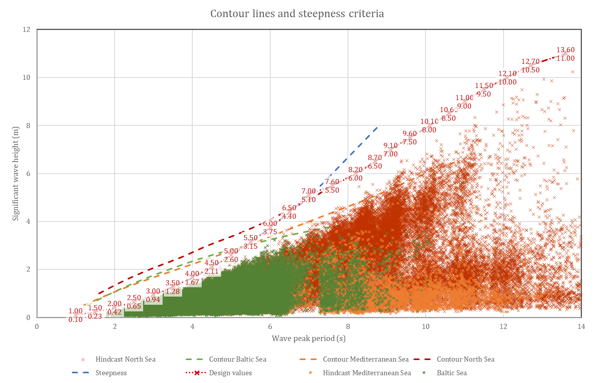{width="6.692054899387577in" height="4.0627416885389325in"}

#### Deep water conditions

It is assumed that there is sufficient water depth at all locations to allow deep-water conditions to be applied. Any influence of the seabed on the waves is not considered. Therefore, the wavelengths are calculated with the following equation for deep-water conditions:

  ---------------------------------------------------------------------------
  $$L = \frac{g}{\omega} \bullet T = \frac{g}{2\pi} \bullet T^{2}$$   (2‑2)
  ------------------------------------------------------------------- -------

  ---------------------------------------------------------------------------

With:

  --------------------------------------------------------------------------
  L      ...   Wave length (m)
  ------ ----- -------------------------------------------------------------
  g      ...   Acceleration of gravity (m/s²)

  T      ...   Wave period (s)
  --------------------------------------------------------------------------

#### Translation of peak period to wave height combinations into JONSWAP sea state spectrum

In order to characterize the waves as realistically as possible, the peak period to wave height combinations are translated into a sea state spectrum according to JONSWAP. As in the North Sea the harshest conditions are expected, the mean value for the peak enhancement factor is used with $\gamma = 3,3$ \[3\]. Correlating wind speeds and fetch lengths are to be determined which are used as input variables for the breakwater simulations. In deliverable D2.2, these parameters were calculated with the following equations:

  ---------------------------------------------------------------------------------------------------------------------------------
  $$\frac{g \bullet H_{s}}{U^{2}} = 1,6 \bullet 10^{- 3} \bullet \left( \frac{g \bullet x}{U^{2}} \right)^{\frac{1}{2}}$$    (2‑3)
  ------------------------------------------------------------------------------------------------------------------------- -------
  $$\frac{g \bullet T_{p}}{U} = 0,2857 \bullet \left( \frac{g \bullet x}{U^{2}} \right)^{\frac{1}{3}}$$                      (2‑4)

  ---------------------------------------------------------------------------------------------------------------------------------

With:

  ------------------------------------------------------------------------------
  $$H_{s}$$   ...   Significant wave height (m)
  ----------- ----- ------------------------------------------------------------
  $$U$$       ...   Wind speed in 10 m height (m/s) 🡪 $U = U_{10}$

  x           ...   Fetch length (m)

  g           ...   Acceleration of gravity (m/s²)
  ------------------------------------------------------------------------------

However, these equations are not recommended by Bishop \[4\], as they can lead to highly overestimated wave parameters. If the wind speed $U_{10}$ is used, the equations correspond to those in the publication by Hasselmann \[5\]. The fetchlength Values can also be taken from [Figure 6](#_Ref140759064).

![[]{#_Ref140759064 .anchor}Figure 6 - Wave prediction according to SPM for deep-water conditions \[6\] (Layout edited)](../images/2023-08-08_surewave_d3.2_floating_breakwater_design/image8.png){width="5.96875in" height="3.7538429571303586in"}

This yields the following wave parameters:

+-------+-------------------+-------+--------+------------------------+--------+
| T~p~  | S~P~              | H~s~  | U~10~  | x                      | L      |
+:=====:+:=======:+:=======:+:=====:+:======:+:==========:+:=========:+:======:+
| \(s\) | (-)     | (-)     | \(m\) | (m/s)  | \(m\)      | (km)      | \(m\)  |
+-------+---------+---------+-------+--------+------------+-----------+--------+
| 1.0   | 0.07    | 1/15    | 0.10  | 10.06  | 410.19     | 0.41      | 1.56   |
+-------+---------+---------+-------+--------+------------+-----------+--------+
| 1.5   | 0.07    | 1/15    | 0.23  | 15.09  | 922.94     | 0.92      | 3.51   |
+-------+---------+---------+-------+--------+------------+-----------+--------+
| 2.0   | 0.07    | 1/15    | 0.42  | 20.12  | 1,640.78   | 1.64      | 6.25   |
+-------+---------+---------+-------+--------+------------+-----------+--------+
| 2.5   | 0.07    | 1/15    | 0.65  | 25.15  | 2,563.72   | 2.56      | 9.76   |
+-------+---------+---------+-------+--------+------------+-----------+--------+
| 3.0   | 0.07    | 1/15    | 0.94  | 30.18  | 3,691.75   | 3.69      | 14.05  |
+-------+---------+---------+-------+--------+------------+-----------+--------+
| 3.5   | 0.07    | 1/15    | 1.28  | 35.21  | 5,024.88   | 5.02      | 19.13  |
+-------+---------+---------+-------+--------+------------+-----------+--------+
| 4.0   | 0.07    | 1/15    | 1.67  | 40.46  | 6,526.98   | 6.53      | 24.98  |
+-------+---------+---------+-------+--------+------------+-----------+--------+
| 4.5   | 0.07    | 1/15    | 2.11  | 45.37  | 8,288.88   | 8.29      | 31.62  |
+-------+---------+---------+-------+--------+------------+-----------+--------+
| 5.0   | 0.07    | 1/15    | 2.60  | 50.22  | 10,272.09  | 10.27     | 39.03  |
+-------+---------+---------+-------+--------+------------+-----------+--------+
| 5.5   | 0.07    | 1/15    | 3.15  | 55.38  | 12,397.68  | 12.40     | 47.23  |
+-------+---------+---------+-------+--------+------------+-----------+--------+
| 6.0   | 0.07    | 1/15    | 3.75  | 60.45  | 14,744.52  | 14.74     | 56.21  |
+-------+---------+---------+-------+--------+------------+-----------+--------+
| 6.5   | 0.07    | 1/15    | 4.40  | 50.00  | 29,675.25  | 29.68     | 65.97  |
+-------+---------+---------+-------+--------+------------+-----------+--------+
| 7.0   | 0.07    | 1/15    | 5.10  | 50.00  | 39,868.45  | 39.87     | 76.50  |
+-------+---------+---------+-------+--------+------------+-----------+--------+
| 7.6   | 0.07    | 1/15    | 5.50  | 50.00  | 46,367.58  | 46.37     | 90.18  |
+-------+---------+---------+-------+--------+------------+-----------+--------+
| 8.2   | 0.07    | 1/15    | 6.00  | 50.00  | 55,181.25  | 55.18     | 104.98 |
+-------+---------+---------+-------+--------+------------+-----------+--------+
| 8.7   | 0.06    | 1/16    | 6.50  | 50.00  | 64,761.33  | 64.76     | 118.18 |
+-------+---------+---------+-------+--------+------------+-----------+--------+
| 9.1   | 0.06    | 1/17    | 7.00  | 50.00  | 75,107.81  | 75.11     | 129.29 |
+-------+---------+---------+-------+--------+------------+-----------+--------+
| 9.6   | 0.06    | 1/18    | 7.50  | 50.00  | 86,220.70  | 86.22     | 143.89 |
+-------+---------+---------+-------+--------+------------+-----------+--------+
| 10.1  | 0.05    | 1/18    | 8.00  | 50.00  | 98,100.00  | 98.10     | 159.27 |
+-------+---------+---------+-------+--------+------------+-----------+--------+
| 10.6  | 0.05    | 1/19    | 8.50  | 50.00  | 110,745.70 | 110.75    | 175.43 |
+-------+---------+---------+-------+--------+------------+-----------+--------+
| 11.0  | 0.05    | 1/20    | 9.00  | 50.00  | 124,157.81 | 124.16    | 188.92 |
+-------+---------+---------+-------+--------+------------+-----------+--------+
| 11.5  | 0.05    | 1/21    | 9.50  | 50.00  | 138,336.33 | 138.34    | 206.48 |
+-------+---------+---------+-------+--------+------------+-----------+--------+
| 12.1  | 0.05    | 1/22    | 10.00 | 50.00  | 153,281.25 | 153.28    | 228.59 |
+-------+---------+---------+-------+--------+------------+-----------+--------+
| 12.7  | 0.04    | 1/23    | 10.50 | 50.00  | 168,992.58 | 168.99    | 251.82 |
+-------+---------+---------+-------+--------+------------+-----------+--------+
| 13.6  | 0.04    | 1/25    | 11.00 | 50.00  | 185,470.31 | 185.47    | 288.78 |
+-------+---------+---------+-------+--------+------------+-----------+--------+

: []{#_Ref141083609 .anchor}Table 3 - Wave parameters as input for simulations

## Material properties

### Conventional construction with polystyrene and concrete

The conventional and widely used construction method for floating concrete pontoons and breakwaters comprises an outer shell of reinforced concrete and a core of expanded polystyrene: EPS (see [Figure 7](#_Ref142297404), [Figure 8](#_Ref142297405), and [Figure 9](#_Ref142297407)). The buoyancy is realized by the polystyrene, while the concrete shell protects the core from mechanical impacts and UV radiation. EPS is watertight therefore a concrete bottom slab is not required.

The following material properties are considered for conventional constructions:

- Density of reinforced concrete $\sim\ 2,5\ t/m³$

- Density of expanded polystyrene $\sim\ 15\ kg/m³$

- Water absorption of expanded polystyrene \< 2,0 Vol.-%

The development of new circular materials runs parallel to this work package in WP4. In the first design iteration, conventional construction materials (reinforced concrete and expanded polystyrene) have been utilized. To enhance load transfer and distribution, transverse walls have been incorporated within the FB, and the edges of the polystyrene core have been chamfered. (see [Figure 7](#_Ref142297404), [Figure 8](#_Ref142297405), and [Figure 9](#_Ref142297407)).

![[]{#_Ref142297404 .anchor}Figure 7 - Principal interior of a breakwater pontoon in conventional design (isometry)](../images/2023-08-08_surewave_d3.2_floating_breakwater_design/image9.png){width="6.678392388451444in" height="1.9478258967629047in"}

![[]{#_Ref142297405 .anchor}Figure 8 - Principal interior of a breakwater pontoon in conventional design (longitudinal section)](../images/2023-08-08_surewave_d3.2_floating_breakwater_design/image10.png){width="6.667361111111111in" height="0.7291666666666666in"}

![[]{#_Ref142297407 .anchor}Figure 9 - Principal interior of a breakwater pontoon in conventional design (cross section)](../images/2023-08-08_surewave_d3.2_floating_breakwater_design/image11.png){width="3.8608694225721787in" height="1.5535826771653543in"}

### Construction with a new circular material solution

Preliminary new circular materials for the outer shell in Task T4.1 and for the core in Task 4.2 have been proposed. Since the tasks are not finished yet, preliminary results from Task 4.1 and Task 4.2 are used with a forecast of expected final results.

The following material properties are considered for new circular materials:

- Density of reinforced light weight concrete $\sim\ 1,9\ t/m³$

- Density of light weight concrete $\sim\ 300\ kg/m³$

- Water absorption of light weight concrete \> 20,0 Vol.-%

The light weight concrete\'s (LWC) water absorption capacity would lead to negative floatability. To counteract this, an additional bottom slab is utilized to prevent water from being absorbed into the core (see [Figure 10](#_Ref142298009), [Figure 11](#_Ref142298010), and [Figure 12](#_Ref142298011))

![[]{#_Ref142298009 .anchor}Figure 10 - Principal interior of a breakwater pontoon with new circular materials and bottom slab (isometry)](../images/2023-08-08_surewave_d3.2_floating_breakwater_design/image12.png){width="6.677529527559055in" height="2.2956528871391075in"}

![[]{#_Ref142298010 .anchor}Figure 11 - Principal interior of a breakwater pontoon with new circular materials and bottom slab (longit. section)](../images/2023-08-08_surewave_d3.2_floating_breakwater_design/image13.png){width="6.674786745406824in" height="1.2260870516185476in"}

![[]{#_Ref142298011 .anchor}Figure 12 - Principal interior of a breakwater pontoon with new circular materials and bottom slab (cross section)](../images/2023-08-08_surewave_d3.2_floating_breakwater_design/image14.jpeg){width="3.5217399387576553in" height="1.9807731846019248in"}

### Weight limits as a boundary for FB dimensions

The FB is to consist of pontoons of modular design. To ensure that these can be manufactured without relatively high machinery costs, their weight is to be limited. The upper weight limit used in the analysis is set to approx. 120 tons as this weight can still be handled by mobile cranes. Some models with higher weights have been simulated for comparison only.

## Geometries

With reference to deliverable D2.2, chapter 3.2.3 \[7\]. As described, the transmission is influenced by the following items:

- Incident waves (significant height, period, length)

- FB geometry (width, draft, shape)

- FB mechanical properties (centre of gravity, total mass, moment of inertia)

- FB mooring properties (mooring spring stiffness, mooring damping)

The wave parameters are defined in Chapter [2.1](#wave-conditions). The mechanical properties are given automatically by the construction method with the outer shell and inner core. Similar conditions are considered for all different cross sections. The mooring is initially neglected to be able to determine the actual influence of the breakwater cross section.

Under consideration of these boundary conditions, the effect of the width-draft-ratio and of the shape (cross section) can be directly derived or evaluated. In principle, it needs to be confirmed that the cross section of the conventional design (FB with two keels) is more effective in terms of transmission than other cross sections. In addition, the most effective width-draft ratio was to be determined, considering the conditions of Chapter [2.2.3](#weight-limits-as-a-boundary-for-fb-dimensions).

The following cross-sections are investigated (see [Figure 13](#_Ref141944321) to [Figure 29](#_Ref141951872) ):

![[]{#_Ref141084026 .anchor}Table 4 - Data set of FB sections, used in simulations](../images/2023-08-08_surewave_d3.2_floating_breakwater_design/image15.emf){width="6.6930555555555555in" height="3.4097222222222223in"}

+-----------------------------------------------------------------------------------+-----------------------------------------------------------------------------------+
| 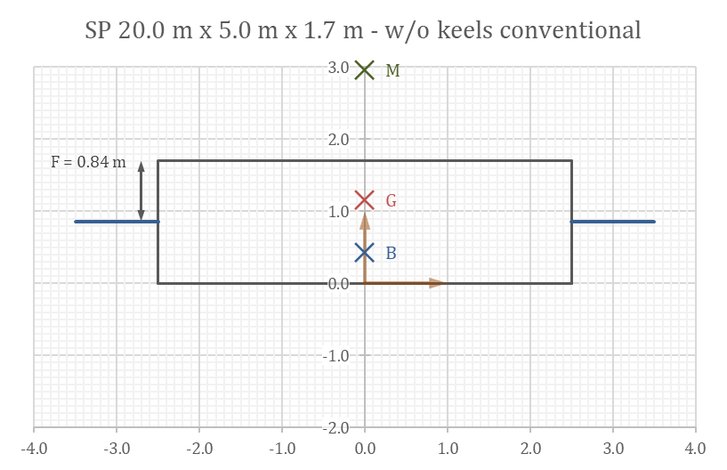{width="3.2283464566929134in" height="2.086242344706912in"} | 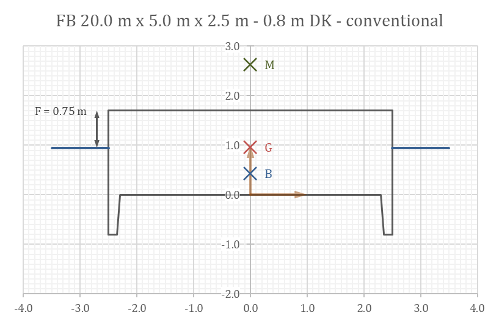{width="3.2283464566929134in" height="2.086242344706912in"} |
|                                                                                   |                                                                                   |
| []{#_Ref141944321 .anchor}Figure 13 - Model No. 1                                 | []{#_Ref141943800 .anchor}Figure 14 - Model No. 2                                 |
+===================================================================================+===================================================================================+
| 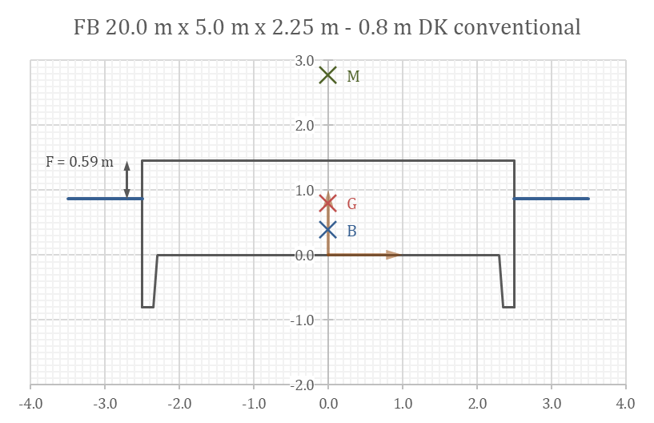{width="3.2283464566929134in" height="2.086242344706912in"} | 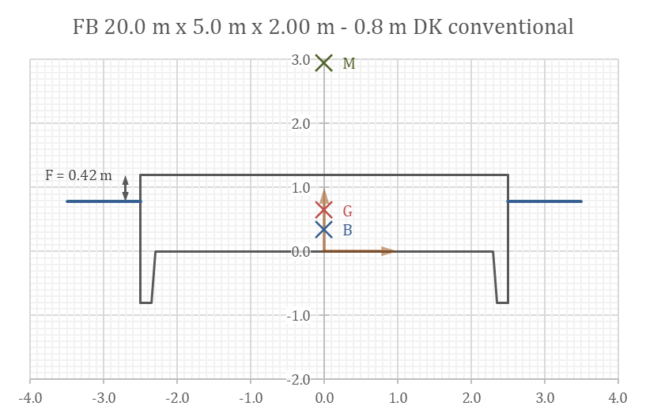{width="3.2283464566929134in" height="2.086242344706912in"} |
|                                                                                   |                                                                                   |
| Figure 15 - Model No. 3                                                           | Figure 16 - Model No. 4                                                           |
+-----------------------------------------------------------------------------------+-----------------------------------------------------------------------------------+
| 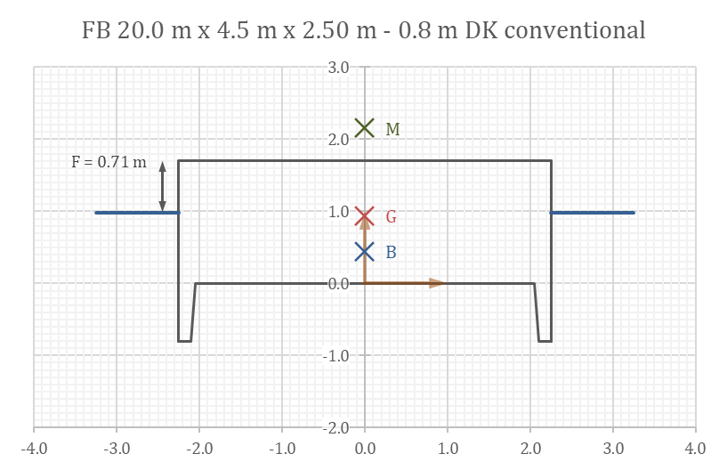{width="3.2283464566929134in" height="2.086242344706912in"} | 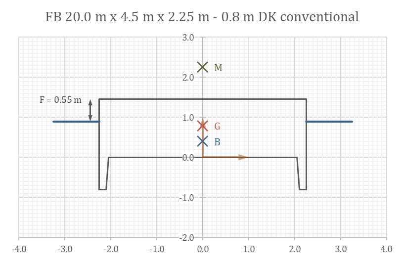{width="3.2283464566929134in" height="2.086242344706912in"} |
|                                                                                   |                                                                                   |
| Figure 17 - Model No. 5                                                           | Figure 18 - Model No. 6                                                           |
+-----------------------------------------------------------------------------------+-----------------------------------------------------------------------------------+

+-----------------------------------------------------------------------------------+-----------------------------------------------------------------------------------+
| 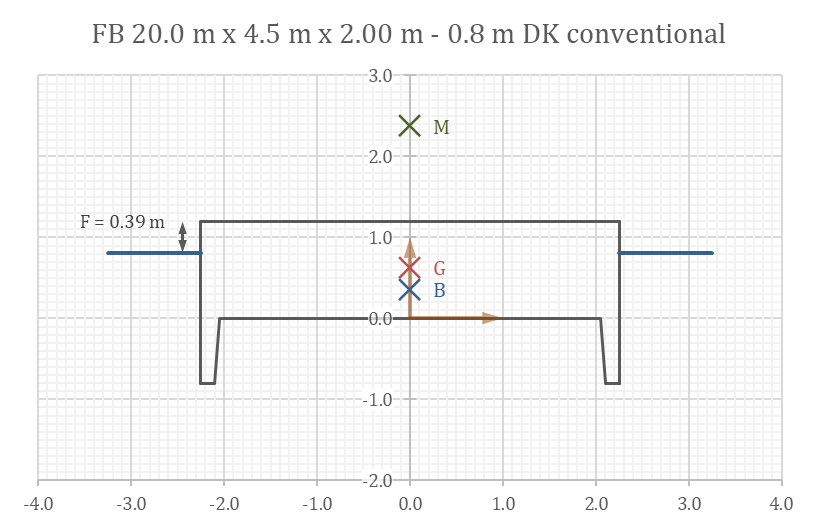{width="3.2283464566929134in" height="2.086242344706912in"} | 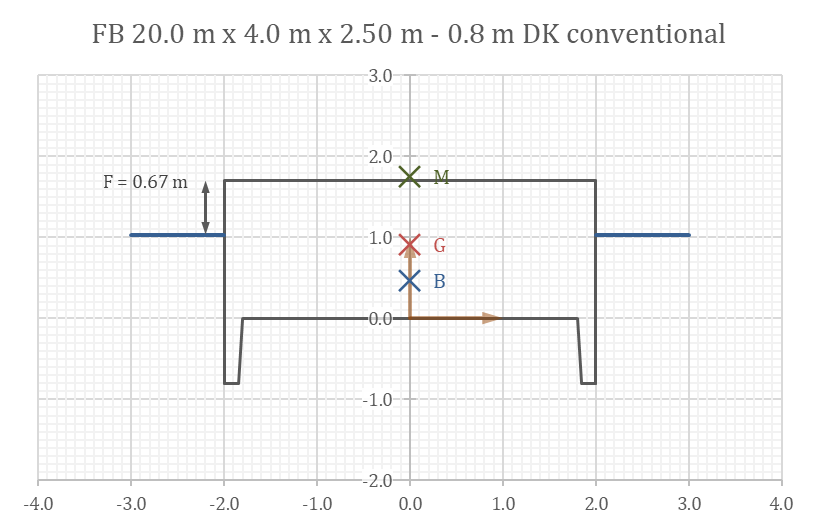{width="3.2283464566929134in" height="2.086242344706912in"} |
|                                                                                   |                                                                                   |
| Figure 19 - Model No. 7                                                           | Figure 20 - Model No. 8                                                           |
+===================================================================================+===================================================================================+
| 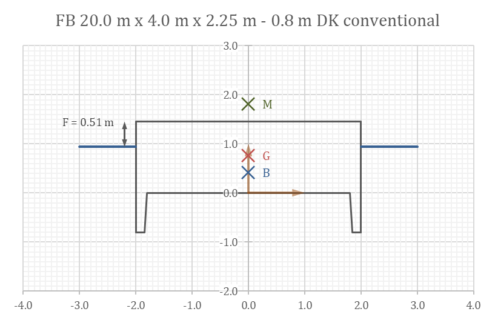{width="3.2283464566929134in" height="2.086242344706912in"} | 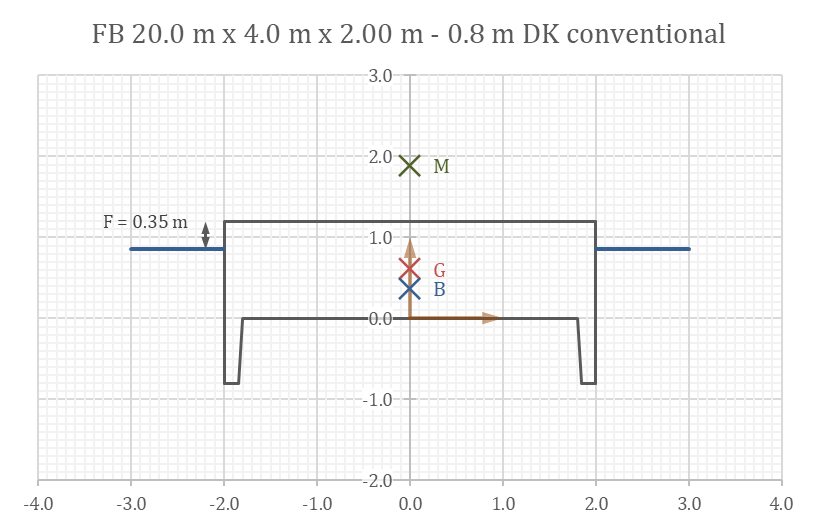{width="3.2283464566929134in" height="2.086242344706912in"} |
|                                                                                   |                                                                                   |
| Figure 21 - Model No. 9                                                           | []{#_Ref141943806 .anchor}Figure 22 - Model No. 10                                |
+-----------------------------------------------------------------------------------+-----------------------------------------------------------------------------------+
| 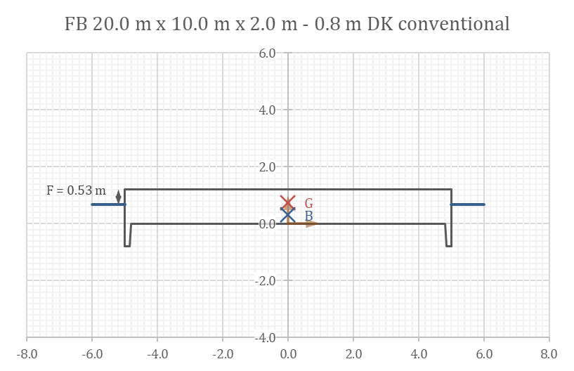{width="3.2283464566929134in" height="2.086242344706912in"} | 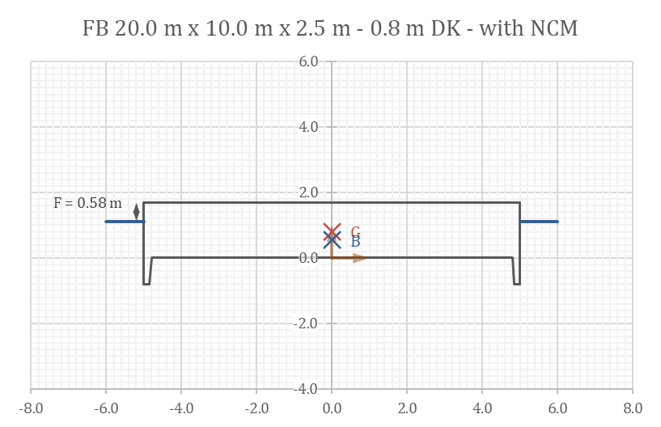{width="3.2283464566929134in" height="2.086242344706912in"} |
|                                                                                   |                                                                                   |
| []{#_Ref141946962 .anchor}Figure 23 - Model No. 11                                | []{#_Ref141948033 .anchor}Figure 24 - Model No. 12                                |
+-----------------------------------------------------------------------------------+-----------------------------------------------------------------------------------+

+-----------------------------------------------------------------------------------+-----------------------------------------------------------------------------------+
| 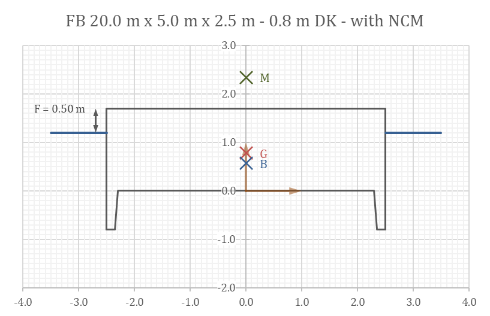{width="3.2283464566929134in" height="2.086242344706912in"} | 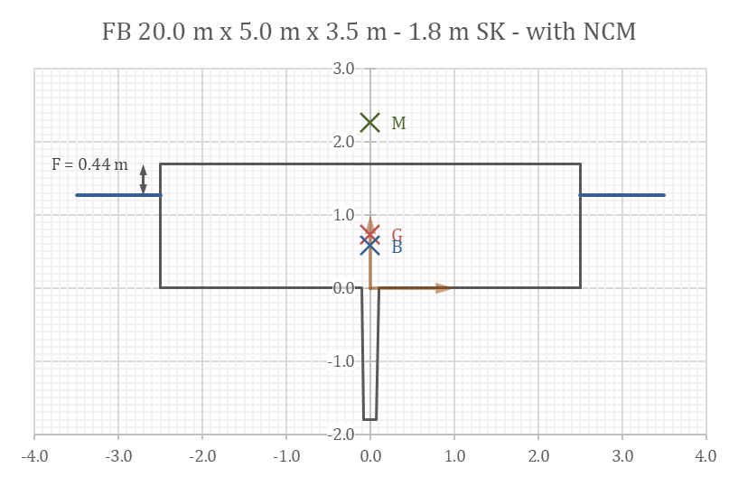{width="3.2283464566929134in" height="2.086242344706912in"} |
|                                                                                   |                                                                                   |
| []{#_Ref141945111 .anchor}Figure 25 - Model No. 13                                | Figure 26 - Model No. 14                                                          |
+===================================================================================+===================================================================================+
| 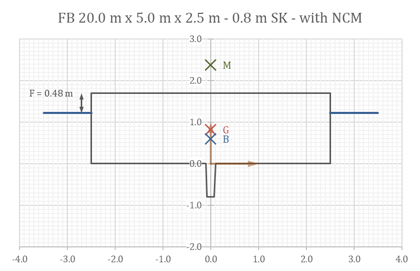{width="3.2283464566929134in" height="2.086242344706912in"} | 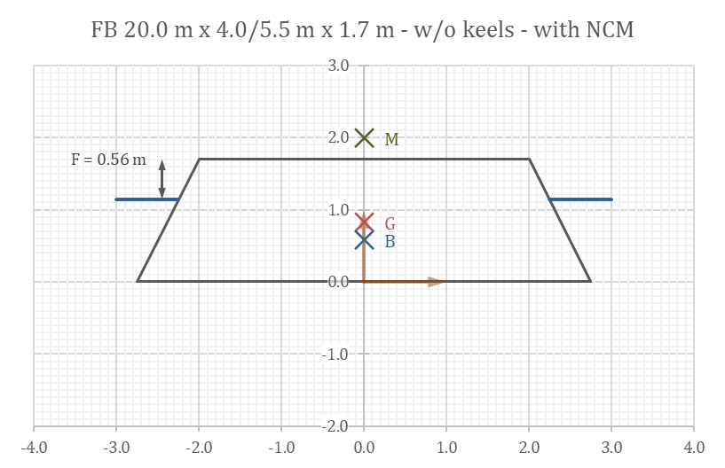{width="3.2283464566929134in" height="2.086242344706912in"} |
|                                                                                   |                                                                                   |
| []{#_Ref141946752 .anchor}Figure 27 - Model No. 15                                | []{#_Ref141948049 .anchor}Figure 28 - Model No. 16                                |
+-----------------------------------------------------------------------------------+-----------------------------------------------------------------------------------+
| 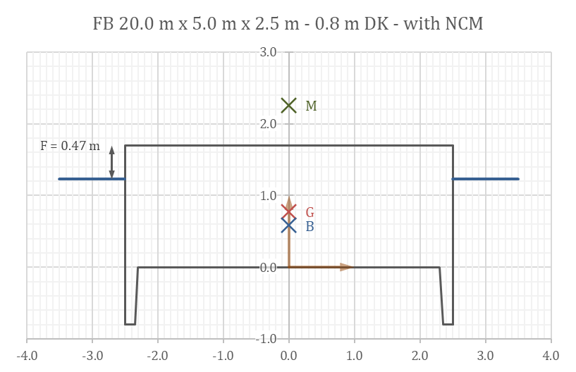{width="3.2283464566929134in" height="2.086242344706912in"} |                                                                                   |
|                                                                                   |                                                                                   |
| []{#_Ref141951872 .anchor}Figure 29 - Model No. 17                                |                                                                                   |
+-----------------------------------------------------------------------------------+-----------------------------------------------------------------------------------+

## Floatability and floating stability

The floatability and floating stability are calculated and shown in the following template for model no. 17. After engineering (simple) calculation, detailed CFD simulations are performed and described in the next section.

{width="5.569444444444445in" height="9.409027777777778in"}

{width="5.949305555555555in" height="9.409027777777778in"}

# Simulations with FLOW-3D HYDRO

## General

The evaluation of FB efficiency with regards to transmission was done with simulation software FLOW-3D Hydro. This software is a complete CFD modelling solution for the civil and environmental engineering industry. FLOW-3D Hydro is an ideal tool to analyse the performance of complex wave and structure interactions such as hydrodynamic loading on coastal infrastructure, wave transmission, overtopping, and floating structure dynamics. \[8\]

## Set-up

The following conditions are used as simulation input:

- 600 s simulation duration with step size of 0.1 s

- Active physics models:

  - Gravity and non-inertial

  - Moving objects

  - Turbulence and viscosity

- Mesh sizes and conditions as per [Table 5](#_Ref141083306)

- Wave conditions for JONSWAP spectrum with values of [Table 3](#_Ref141083609) with wave generation at boundary mesh X-Min

- Wave absorbing layer at boundary mesh X-Max with damping coefficient from 0 to 1 and a layer length ≥ wave length

- Initial conditions -- fluid elevation at ±0 m height

- Length of boundary mesh in X-direction varies subject to wave lengths

- Width of boundary mesh in Y-direction is equal to length of FB with 20 m

- Height of boundary mesh in Z-direction varies subject to wave height

- FB as moving object and modelling with STL-file with conditions of [Table 4](#_Ref141084026)

- Translational and rotational options (allowed movements) with coupled motion in X-translation, Z-translation, and Y-rotation

- Stationary history probe at a distance behind the FB with a larger value of 5 m or $2 \bullet H_{s}$

- Horizontal fixation (massless elastic rope) with two springs towards X-Min and two springs towards X-Max with a spring coefficient of 10.000 kg/s² and without damping effect

End wall

Mesh grid lines

Water surface

Wave absorbing layer

Wave generation

History probe

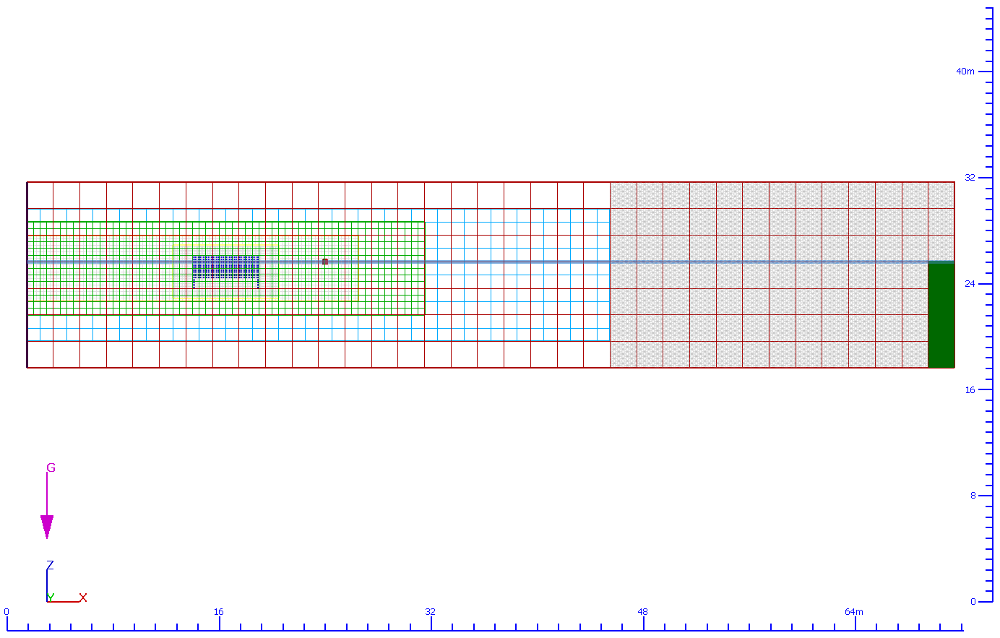{width="6.691511373578303in" height="2.4260870516185475in"}

Figure 30 - FLOW-3D Hydro general set-up with view in Y-direction

+-------------------+--------------------------------------------------------------------------------------------------+
| Simulation name   | Mesh sizes (m)                                                                                   |
|                   +----------+----------+----------+----------+----------+----------+----------+----------+----------+
|                   | Boundary | Zone_1   | \# cells | Zone_2   | \# cells | Zone_3   | \# cells | Zone_4   | \# cells |
+:==================+:========:+:========:+:========:+:========:+:========:+:========:+:========:+:========:+:========:+
| Hs=0.1m_Tp=1s     | 0.5000   | 0.2500   | 40       | 0.1250   | 40       | 0.0625   | 20       | 0.0313   | 10       |
+-------------------+----------+----------+----------+----------+----------+----------+----------+----------+----------+
| Hs=0.23m_Tp=1.5s  | 1.0000   | 0.5000   | 40       | 0.2500   | 40       | 0.1250   | 20       | 0.0625   | 10       |
+-------------------+----------+----------+----------+----------+----------+----------+----------+----------+----------+
| Hs=0.42m_Tp=2s    | 1.0000   | 0.5000   | 40       | 0.2500   | 40       | 0.1250   | 20       | 0.0625   | 10       |
+-------------------+----------+----------+----------+----------+----------+----------+----------+----------+----------+
| Hs=0.65m_Tp=2.5s  | 1.0000   | 0.5000   | 40       | 0.2500   | 40       | 0.1250   | 20       | 0.0625   | 10       |
+-------------------+----------+----------+----------+----------+----------+----------+----------+----------+----------+
| Hs=0.94m_Tp=3s    | 2.0000   | 1.0000   | 40       | 0.5000   | 40       | 0.2500   | 20       | 0.1250   | 10       |
+-------------------+----------+----------+----------+----------+----------+----------+----------+----------+----------+
| Hs=1.28m_Tp=3.5s  | 2.0000   | 1.0000   | 40       | 0.5000   | 40       | 0.2500   | 20       | 0.1250   | 10       |
+-------------------+----------+----------+----------+----------+----------+----------+----------+----------+----------+
| Hs=1.67m_Tp=4s    | 2.0000   | 1.0000   | 40       | 0.5000   | 40       | 0.2500   | 20       | 0.1250   | 10       |
+-------------------+----------+----------+----------+----------+----------+----------+----------+----------+----------+
| Hs=2.11m_Tp=4.5s  | 2.0000   | 1.0000   | 20       | 0.5000   | 20       | 0.2500   | 10       | 0.1250   | 5        |
+-------------------+----------+----------+----------+----------+----------+----------+----------+----------+----------+
| Hs=2.6m_Tp=5s     | 2.0000   | 1.0000   | 20       | 0.5000   | 20       | 0.2500   | 10       | 0.1250   | 5        |
+-------------------+----------+----------+----------+----------+----------+----------+----------+----------+----------+
| Hs=3.15m_Tp=5.5s  | 2.0000   | 1.0000   | 20       | 0.5000   | 20       | 0.2500   | 10       | 0.1250   | 5        |
+-------------------+----------+----------+----------+----------+----------+----------+----------+----------+----------+
| Hs=3.75m_Tp=6s    | 2.0000   | 1.0000   | 20       | 0.5000   | 20       | 0.2500   | 10       | 0.1250   | 5        |
+-------------------+----------+----------+----------+----------+----------+----------+----------+----------+----------+
| Hs=4.4m_Tp=6.5s   | 2.5000   | 1.2500   | 20       | 0.6250   | 20       | 0.3125   | 10       |          |          |
+-------------------+----------+----------+----------+----------+----------+----------+----------+----------+----------+
| Hs=5.1m_Tp=7s     | 2.5000   | 1.2500   | 20       | 0.6250   | 20       | 0.3125   | 10       |          |          |
+-------------------+----------+----------+----------+----------+----------+----------+----------+----------+----------+
| Hs=5.5m_Tp=7.6s   | 2.5000   | 1.2500   | 20       | 0.6250   | 20       | 0.3125   | 10       |          |          |
+-------------------+----------+----------+----------+----------+----------+----------+----------+----------+----------+
| Hs=6m_Tp=8.2s     | 2.5000   | 1.2500   | 20       | 0.6250   | 20       | 0.3125   | 10       |          |          |
+-------------------+----------+----------+----------+----------+----------+----------+----------+----------+----------+
| Hs=6.5m_Tp=8.7s   | 2.5000   | 1.2500   | 20       | 0.6250   | 20       | 0.3125   | 10       |          |          |
+-------------------+----------+----------+----------+----------+----------+----------+----------+----------+----------+
| Hs=7m_Tp=9.1s     | 2.5000   | 1.2500   | 20       | 0.6250   | 20       | 0.3125   | 10       |          |          |
+-------------------+----------+----------+----------+----------+----------+----------+----------+----------+----------+
| Hs=7.5m_Tp=9.6s   | 2.5000   | 1.2500   | 20       | 0.6250   | 20       | 0.3125   | 10       |          |          |
+-------------------+----------+----------+----------+----------+----------+----------+----------+----------+----------+
| Hs=8m_Tp=10.1s    | 2.5000   | 1.2500   | 20       | 0.6250   | 20       | 0.3125   | 10       |          |          |
+-------------------+----------+----------+----------+----------+----------+----------+----------+----------+----------+
| Hs=8.5m_Tp=10.6s  | 2.5000   | 1.2500   | 20       | 0.6250   | 20       | 0.3125   | 10       |          |          |
+-------------------+----------+----------+----------+----------+----------+----------+----------+----------+----------+
| Hs=9m_Tp=11s      | 2.5000   | 1.2500   | 20       | 0.6250   | 20       | 0.3125   | 10       |          |          |
+-------------------+----------+----------+----------+----------+----------+----------+----------+----------+----------+
| Hs=9.5m_Tp=11.5s  | 2.5000   | 1.2500   | 20       | 0.6250   | 20       | 0.3125   | 10       |          |          |
+-------------------+----------+----------+----------+----------+----------+----------+----------+----------+----------+
| Hs=10m_Tp=12.1s   | 2.5000   | 1.2500   | 20       | 0.6250   | 20       | 0.3125   | 10       |          |          |
+-------------------+----------+----------+----------+----------+----------+----------+----------+----------+----------+
| Hs=10.5m_Tp=12.7s | 2.5000   | 1.2500   | 20       | 0.6250   | 20       | 0.3125   | 10       |          |          |
+-------------------+----------+----------+----------+----------+----------+----------+----------+----------+----------+
| Hs=11m_Tp=13.6s   | 2.5000   | 1.2500   | 20       | 0.6250   | 20       | 0.3125   | 10       |          |          |
+-------------------+----------+----------+----------+----------+----------+----------+----------+----------+----------+

: []{#_Ref141083306 .anchor}Table 5 - Mesh sizes and conditions for FLOW-3D Hydro simulations

## Approach to evaluate results

The evaluation of FB efficiency in terms of transmission are assessed with the ratio between wave generation (boundary, X-Min, fluid elevation) and free surface elevation of the history probe behind the FB -- see diagram 1 and 2 in [Figure 31](#_Ref141090165).

The volume of the fluid should remain constant over the simulation period. But due to program internal simulation inaccuracies, the fluid volume and thus also the elevation of the water level fluctuates (diagram 3 in [Figure 31](#_Ref141090165)). Since the history probe reports the free surface elevation in relation to the water level, the elevations need to be adjusted to account for the deviation between the fluid volume at the respective time against the fluid volume at the simulation start.

![[]{#_Ref141090165 .anchor}Figure 31 - Example of FLOW-3D Hydro results printout](../images/2023-08-08_surewave_d3.2_floating_breakwater_design/image36.png){width="6.686805555555556in" height="6.686805555555556in"}

The water level at a certain point in time of the simulation can be derived from the following equation:

  ------------------------------------------------------------------------------------------------------------------------------------------------------------------------------
  $${WL}_{raw}(t) = \frac{\left( V_{Fluid,raw}(t) - V_{FB,draft} - V_{End\ wall} \right)}{\left( X_{Max} - X_{Min} \right) \bullet \left( Y_{Max} - Y_{Min} \right)}$$   (3‑1)
  ---------------------------------------------------------------------------------------------------------------------------------------------------------------------- -------

  ------------------------------------------------------------------------------------------------------------------------------------------------------------------------------

With:

  --------------------------------------------------------------------------------------------------
  $${WL}_{raw}(t)$$      ...   Water level (raw data) at a certain time of the simulation (m)
  ---------------------- ----- ---------------------------------------------------------------------
  $$V_{Fluid,raw}(t)$$   ...   Volume of fluid (raw data) at a certain time of the simulation (m³)

  $$V_{FB,draft}$$       ...   Volume of the FB below the water line (m³)

  $$V_{End\ wall}$$      ...   Volume of the wall at boundary mesh X-Max (m³)

  $$X_{Max}$$            ...   Max. position of boundary mesh in X-direction (m)

  $$X_{Min}$$            ...   Min. position of boundary mesh in X-direction (m)

  $$Y_{Max}$$            ...   Max. position of boundary mesh in Y-direction (m)

  $$Y_{Min}$$            ...   Min. position of boundary mesh in Y-direction (m)
  --------------------------------------------------------------------------------------------------

The following [Figure 32](#_Ref141102927) shows the surface elevation of the history probe against the water level without adjustment.

![[]{#_Ref141102927 .anchor}Figure 32 - Surface elevation of history probe against water level](../images/2023-08-08_surewave_d3.2_floating_breakwater_design/image37.png){width="6.69375in" height="3.147222222222222in"}

The water level can be aligned with the following equation:

  -----------------------------------------------------------------------
  $${WL}_{aligned}(t) = mean\left( {WL}_{raw}(T_{p}) \right)$$    (3‑2)
  --------------------------------------------------------------- -------

  -----------------------------------------------------------------------

With:

  ------------------------------------------------------------------------------------------------------------------------
  $${WL}_{aligned}(t)$$                      ...   Aligned water level at a certain time of the simulation (m)
  ------------------------------------------ ----- -----------------------------------------------------------------------
  $$mean\left( {WL}_{raw}(T_{p}) \right)$$   ...   Mean value of water levels (raw data) over a period = wave period (m)

  ------------------------------------------------------------------------------------------------------------------------

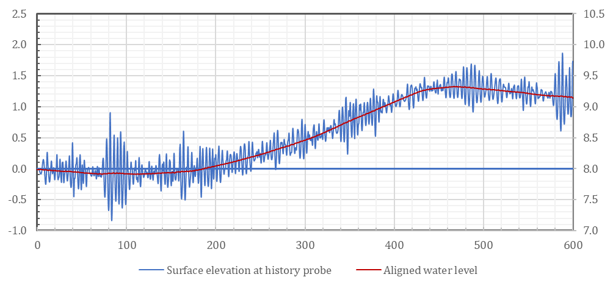{width="6.69375in" height="3.147222222222222in"}

The adjusted surface elevation of the history probe can be determined with the following equation:

  -------------------------------------------------------------------------------
  $${FSE}_{adjust}(t) = {FSE}_{raw}(t) - {WL}_{aligned}(t) + {WL}_{0}$$   (3‑3)
  ----------------------------------------------------------------------- -------

  -------------------------------------------------------------------------------

With:

  ----------------------------------------------------------------------------------------------------------------------------
  $${FSE}_{adjust}(t)$$   ...   Adjusted free surface elevation of the history probe at a certain time of the simulation (m)
  ----------------------- ----- ----------------------------------------------------------------------------------------------
  $${FSE}_{raw}(t)$$      ...   Free surface elevation (raw data) at a certain time of simulation (m)

  $${WL}_{aligned}(t)$$   ...   The aligned water level at a certain time of the simulation (m)

  $${WL}_{0}$$            ...   The water level at the start of simulation (m)
  ----------------------------------------------------------------------------------------------------------------------------

The adjusted free surface elevation at the history probe is shown against the adjusted water level in [Figure 34](#_Ref141104857).

![[]{#_Ref141104857 .anchor}Figure 34 - Adjusted surface elevation at history probe against the adjusted water level](../images/2023-08-08_surewave_d3.2_floating_breakwater_design/image39.png){width="6.6875in" height="3.1534722222222222in"}

The incident surface elevation at the wave generation (boundary X-Min) is not related to the water level. Therefore, the incident surface elevation can be compared directly with the adjusted surface elevation of the history probe.

The comparison is shown in following [Figure 35](#_Ref141105344).

![[]{#_Ref141105344 .anchor}Figure 35 - Adjusted surface elevation at history probe against the surface elevation at wave generation](../images/2023-08-08_surewave_d3.2_floating_breakwater_design/image40.png){width="6.69375in" height="3.147222222222222in"}

Subsequently, all maximum and minimum values were determined as well as the corresponding mean values. The ratio between incoming and transmitted waves was determined by a comparison between these mean values.

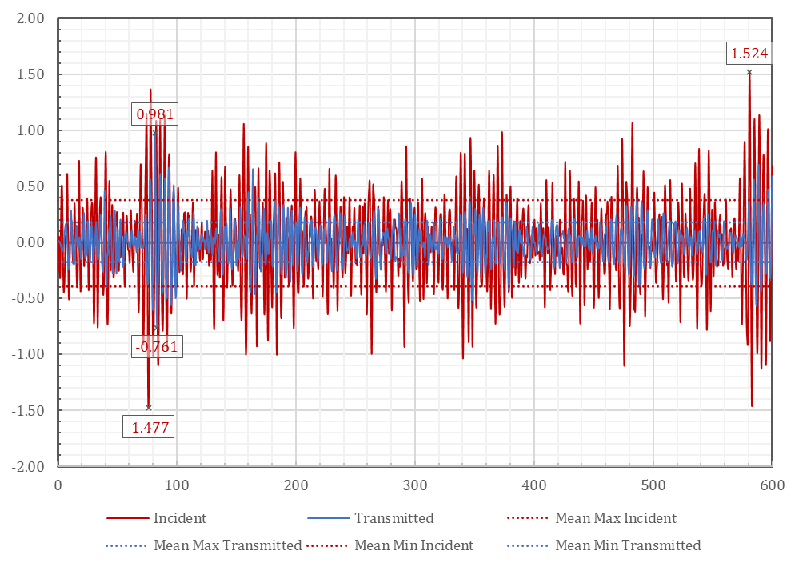{width="6.69375in" height="4.727083333333334in"}

## Evaluation of results

The simulations have shown that as the wave period increases, the efficiency of all cross sections decreases. For better comparability of the efficiency, the cross sections were compared in the critical range.

The following [Figure 37](#_Ref141943173) shows the transmission coefficients for FB with various width and draft including double keels. It refers to Models No. 2 to 10 ([Figure 14](#_Ref141943800) to [Figure 22](#_Ref141943806)) in conventional design.

![[]{#_Ref141943173 .anchor}Figure 37 - Transmission coefficients for various FB in terms of width and height/draft](../images/2023-08-08_surewave_d3.2_floating_breakwater_design/image42.png){width="4.720138888888889in" height="2.2434787839020123in"}

It is shown that the FB is more effective with larger width and height which is related to the draft. This tendency is also confirmed for the 10 m wide Model No. 11 ([Figure 23](#_Ref141946962)), which was investigated for comparison reasons. Due to the total weight, it (Model 11) is not very cost-effective for production reasons.

The following [Figure 38](#_Ref141944232) shows the effect of keels with Model No. 1 ([Figure 13](#_Ref141944321)) and Model No. 2 ([Figure 14](#_Ref141943800)) in conventional design.

![[]{#_Ref141944232 .anchor}Figure 38 - Transmission coefficients for Model No. 1 vs. Model No. 2](../images/2023-08-08_surewave_d3.2_floating_breakwater_design/image43.png){width="6.69375in" height="2.513888888888889in"}

For high frequency waves, the model without keels is even a little better. It is assumed that this is due to the lower hydrodynamic added mass and the small, exposed surface. But starting from a wave period of approx. 2.5 s the model with keels is getting more effective.

The following [Figure 39](#_Ref141945024) compares the influence of conventional design with reinforced concrete and polystyrene of Model No. 2 ([Figure 14](#_Ref141943800)) versus the design with the new circular material of Model No. 13 ([Figure 25](#_Ref141945111)).

![[]{#_Ref141945024 .anchor}Figure 39 - Transmission coefficients for Model No. 2 vs. Model No. 13](../images/2023-08-08_surewave_d3.2_floating_breakwater_design/image44.png){width="6.69375in" height="2.513888888888889in"}

Model No. 13 with new circular material has the same cubature but higher mass and therefore higher draft. But the figure shows that the difference is negligible.

The following [Figure 40](#_Ref141945865) shows the effect of a double keel of Model No. 13 ([Figure 25](#_Ref141945111)) against a single keel of Model No. 15 ([Figure 27](#_Ref141946752)).

![[]{#_Ref141945865 .anchor}Figure 40 - Transmission coefficients for Model No. 13 vs. Model No. 15](../images/2023-08-08_surewave_d3.2_floating_breakwater_design/image45.png){width="6.6875in" height="2.513888888888889in"}

The single keel Model No. 15 is a little more efficient in high-frequency waves but less efficient for waves with larger periods. The same tendency can be seen in Model No. 14 with a longer single keel. This Model No. 14 is even more efficient than Model No. 15 in high frequency waves but loses its efficiency due to large motions for larger wave periods.

Model No. 12 ([Figure 24](#_Ref141948033)) with a 10 m width was also investigated for comparison reasons with results in [Figure 41](#_Ref141947954). It is again confirmed that a larger width decreases transmission. But the difference is marginal and does not justify the increased production and transportation costs.

![[]{#_Ref141947954 .anchor}Figure 41 - Transmission coefficients for Model No. 12 vs. Model No. 13](../images/2023-08-08_surewave_d3.2_floating_breakwater_design/image46.png){width="6.6875in" height="2.513888888888889in"}

Model No. 16 ([Figure 28](#_Ref141948049)) has the lowest efficiency compared to all other models in high frequency waves. Therefore, it was discarded for further consideration.

Thus, it was decided to proceed with a double keel model with a maximum extent in terms of weight. Model No. 13 was slightly changed with an additional allowance for couplings. [Figure 42](#_Ref141951834) shows the comparison between Model No. 13 and Model No. 17 ([Figure 29](#_Ref141951872)).

![[]{#_Ref141951834 .anchor}Figure 42 - Transmission coefficient for Model 13 vs. Model 17](../images/2023-08-08_surewave_d3.2_floating_breakwater_design/image47.png){width="6.69375in" height="2.513888888888889in"}

The result plots for each wave peak period to wave height combination are shown in Chapter [7](#result-plots).

###  

# Theoretical approaches to determine transmission

## General

There are many publications on numerical and experimental investigations of floating breakwaters of various shapes and sizes. To be able to predict the efficiency of floating breakwaters for specific sea states, many predictive formulas from test results have been developed. In the following chapters, the best-known approaches are presented as a comparison to the results of FLOW-3D Hydro.

## Formula of MACAGNO

Macagno \[9\] proposed a formula for transmission prediction for a box-type FB with the following conditions:

- rigid structure

- fixed structure

- no overtopping

- linear wave theory

Since the theoretical approach of a rigid, fixed body is less complicated, the influence of FB motion was neglected by Macagno, which might be sufficient for many cases but will not represent the realistic behaviour of the FB and the transmitted wave \[10\].

The transmission coefficient according to Macagno is determined with the following formula \[9\]:

  ----------------------------------------------------------------------------------------------------------------------------------------------------------------------------------------------------
  $$C_{t,M} = \frac{1}{\sqrt{1 + \left\lbrack k \bullet W_{FB} \bullet \frac{\sinh{k \bullet h}}{2 \bullet \cosh(k \bullet h - k \bullet d)} \right\rbrack^{2}}}$$   []{#_Ref140486622 .anchor}(4‑1)
  ------------------------------------------------------------------------------------------------------------------------------------------------------------------ ---------------------------------

  ----------------------------------------------------------------------------------------------------------------------------------------------------------------------------------------------------

With:

  ------------------------------------------------------------------------------
  $$C_{t,M}$$   ...   Transmission coefficient according to Macagno \[9\]
  ------------- ----- ----------------------------------------------------------
  $$k$$         ...   Wave number (rad/m) $k = \frac{2 \bullet \pi}{L}$

  $$W_{FB}$$    ...   Width of FB (m)

  $$h$$         ...   Water depth (m)

  $$d$$         ...   Draft of FB (m)
  ------------------------------------------------------------------------------

The results of the Macagno equation for the chosen FB are shown in [Figure 43](#_Ref141858136).

## Extension of MACAGNO formula

Equation [(4‑1)](#_Ref140486622) provides an estimate of the anticipated wave transmission without accounting for dynamic aspects, which is good enough at this stage. However, for more comprehensive analyses, it is imperative to incorporate dynamic effects, such as the impact of the natural period of FB oscillation and the influence of FB motion \[10\].

Ruol, Martinelli, and Pezzutto \[11\] have proposed a correction of Macagno's formula accounting for dynamic effects and a Π-shaped FB.

  -----------------------------------------------------------------------
  $$C_{t} = \beta(\chi) \bullet C_{t,M}$$                         (4‑2)
  --------------------------------------------------------------- -------

  -----------------------------------------------------------------------

With:

  -----------------------------------------------------------------------------------------
  $$C_{t,M}$$       ...   Transmission coefficient according to Macagno \[9\]
  ----------------- ----- -----------------------------------------------------------------
  $$C_{t}$$         ...   Transmission coefficient according to Ruol et. al \[11\]

  $$\beta(\chi)$$   ...   Correction function (-) as per equation [(4‑5)](#_Ref140497039)
  -----------------------------------------------------------------------------------------

Macagno's formula [(4‑1)](#_Ref140486622) is based on four variables. Ruol, Martinelli, and Pezzutto \[11\] introduce a combination of these variables, indicated by $\chi$, which is shown as a simplification of $\frac{T_{p}}{T_{h}}$.

  -------------------------------------------------------------------------------------------------------------------------------------------------------------
  $$\chi \approx \frac{T_{p}}{T_{h}} \approx \frac{T_{p}}{2 \bullet \pi} \bullet \sqrt{\frac{g}{d + 0,35 \bullet W_{FB}}}$$   []{#_Ref140496408 .anchor}(4‑3)
  --------------------------------------------------------------------------------------------------------------------------- ---------------------------------

  -------------------------------------------------------------------------------------------------------------------------------------------------------------

With:

  -----------------------------------------------------------------------------
  $$T_{p}$$    ...   Wave peak period (s)
  ------------ ----- ----------------------------------------------------------
  $$T_{h}$$    ...   Natural period of heave oscillation (s)

  $$d$$        ...   Draft of FB (m)

  $$W_{FB}$$   ...   Width of FB (m)
  -----------------------------------------------------------------------------

Since Macagno's formula refers to regular waves, it is recommended to replace the peak period $T_{p}$ by the mean period $T_{m}$, assuming $T_{m} \cong \frac{T_{p}}{1.1}$ \[11\]. Accordingly, equation [(4‑3)](#_Ref140496408) yields to:

  -------------------------------------------------------------------------------------------------------------------------------------------------
  $$\chi \approx \frac{T_{p}}{1.1 \bullet T_{h}} \approx \frac{T_{p}}{2.2 \bullet \pi} \bullet \sqrt{\frac{g}{d + 0,35 \bullet W_{FB}}}$$   (4‑4)
  ----------------------------------------------------------------------------------------------------------------------------------------- -------

  -------------------------------------------------------------------------------------------------------------------------------------------------

To fit the ratio between experimental and numerical transmission coefficient, a correction function $\beta$ is proposed by the authors \[11\] as a function of $\chi$, considering the boundary conditions for very long and very short waves resulting in $\beta = 1$ for $\chi > 1,3$ and $\chi < 0,3$.

  ---------------------------------------------------------------------------------------------------------------------------------------------------------------------------------
  $$\beta(\chi) = \frac{1}{1 + \left( \frac{\chi - \chi_{0}}{\sigma} \right) \bullet e^{- \left( \frac{\chi - \chi_{0}}{\sigma} \right)^{2}}}$$   []{#_Ref140497039 .anchor}(4‑5)
  ----------------------------------------------------------------------------------------------------------------------------------------------- ---------------------------------

  ---------------------------------------------------------------------------------------------------------------------------------------------------------------------------------

where $\chi_{0} = 0,7919$ (with 95% confidence interval 0,7801; 0,8037) and $\sigma = 0,1922$ (0,1741; 0,2103).

The validation of the Ruol, Martinelli, and Pezzutto model is based on test results of wave transmission published in the studies of Martinelli et al. \[12\], Gesraha \[13\], Koutandos, et al. \[14\], Cox et al. \[15\], and Peña et al. \[16\].

The comparison between the original Macagno equation \[9\] against the correction of Ruol, Matinelli, and Pezzutto \[11\] is shown in the following [Figure 43](#_Ref141858136).

[]{#_Ref141858136 .anchor}Figure 43 - Transmission coefficient according to Macagno \[9\] vs. Macagno corrected by Ruol, Martinelli, and Pezzutto \[11\]

## Formula of WIEGEL

A linear theory was developed by Wiegel \[17\] to predict the wave heights transmitted under a rigid, vertical, thin barrier extending from above the water line to a depth. Wiegel postulated that the power transmitted by a wave between the bottom of the vertical barrier and the seabed would remain unchanged if the structure were absent in that location. \[10\].

Wiegel established the following equation:

  ---------------------------------------------------------------------------------------------------------------------
  $$C_{t,W} = \sqrt{\frac{2k \bullet (h - d) + \sinh{2k \bullet (h - d)}}{\left( \sinh{2kh} \right) + 2kh}}$$   (4‑6)
  ------------------------------------------------------------------------------------------------------------- -------

  ---------------------------------------------------------------------------------------------------------------------

With:

  --------------------------------------------------------------------------------
  $$C_{t,W}$$   ...   Transmission coefficient according to Wiegel \[17\]
  ------------- ----- ------------------------------------------------------------
  $$k$$         ...   Wave number (rad/m) $k = \frac{2 \bullet \pi}{L}$

  $$h$$         ...   Water depth (m)

  $$d$$         ...   Draft of FB (m)
  --------------------------------------------------------------------------------

Kriebel and Bollmann \[18\] developed the modified power transmission theory based on the theory of Wiegel and they included the effect of partial wave reflection.

The following equation was developed:

  -----------------------------------------------------------------------------------
  $$C_{t,W,adjust} = \frac{2 \bullet C_{t,W}}{\left( 1 + C_{t,W} \right)}$$   (4‑7)
  --------------------------------------------------------------------------- -------

  -----------------------------------------------------------------------------------

The comparison between the original Wiegel equation \[17\] against the correction of Kriebel and Bollmann \[18\] is shown in the following [Figure 44](#_Ref141860801).

[]{#_Ref141860801 .anchor}Figure 44 - Transmission coefficient according to Wiegel \[17\] vs. modification of Kriebel and Bollmann \[18\]

## Approach of COX

Cox \[19\] developed a theoretical relationship to estimate the performance theory for a single floating wave attenuator. The following equations shall describe this relationship \[20\]:

  -----------------------------------------------------------------------
  $$C_{t,C} = C_{b} \bullet K_{t}$$                               (4‑8)
  --------------------------------------------------------------- -------

  -----------------------------------------------------------------------

With:

  ----------------------------------------------------------------------------------
  $$C_{t,W}$$   ...   Transmission coefficient according to Cox \[19\]
  ------------- ----- --------------------------------------------------------------
  $$C_{b}$$     ...   Float width correction factor

  $$K_{t}$$     ...   Wave power transmission coefficient for a thin profile float
  ----------------------------------------------------------------------------------

The float width correction factor can be calculated as follows:

  ------------------------------------------------------------------------------------------------------------------------------------------------------------------------------
  $$C_{b} = \frac{2\omega\left( 1 + \left( \frac{2\omega W_{FB}}{L} \right)^{2} \right)}{\left\lbrack 2 + \left( \frac{2\omega W_{FB}}{L} \right)^{2} \right\rbrack}$$   (4‑9)
  ---------------------------------------------------------------------------------------------------------------------------------------------------------------------- -------

  ------------------------------------------------------------------------------------------------------------------------------------------------------------------------------

With:

  --------------------------------------------------------------------------------------
  $$\omega = 2\pi/T$$   ...   Circular wave frequency (rad/s)
  --------------------- ----- ----------------------------------------------------------
  $$W_{FB}$$            ...   Width of FB (m)

  $$L$$                 ...   Wave length (m)
  --------------------------------------------------------------------------------------

The wave power transmission coefficient for a thin profile float yields to:

  ------------------------------------------------------------------------
  $$K_{t} = \frac{2 \bullet P}{(1 + P)}$$                         (4‑10)
  --------------------------------------------------------------- --------

  ------------------------------------------------------------------------

With:

  --------------------------------------------------------------------------------------------------------------------------------------------------------------------------------------------------------------------------------------------
  $$P = \frac{\left\lbrack \frac{4\pi \bullet (h - d)}{L} + \sinh\left( \frac{4\pi \bullet (h - d)}{L} \right) \right\rbrack}{\left\lbrack \frac{4\pi \bullet h}{L} + \sinh\left( \frac{4\pi \bullet h}{L} \right) \right\rbrack}$$   (4‑11)
  ----------------------------------------------------------------------------------------------------------------------------------------------------------------------------------------------------------------------------------- --------

  --------------------------------------------------------------------------------------------------------------------------------------------------------------------------------------------------------------------------------------------

  ---------------------------------------------------------------------------
  $$h$$   ...   Water depth (m)
  ------- ----- -------------------------------------------------------------
  $$d$$   ...   Maximum draft of attenuator (m)

  $$L$$   ...   Wave length (m)
  ---------------------------------------------------------------------------

The results of these equations are shown in following [Figure 45](#_Ref141860552).

[]{#_Ref141860552 .anchor}Figure 45 - Transmission coefficient according to Cox

## FOUSERT / VAN TOL Correlation for dynamic behaviour

### General

The publications of Fousert \[21\] and van Tol \[22\] investigate the dynamic behaviour of the FB and their effects on the wave generation behind the FB on the lee side. They examine FB\'s potential movements separately and their impact on leeward waves.

A free-floating body is subject to six degrees of motion with reference to its centre of gravity.

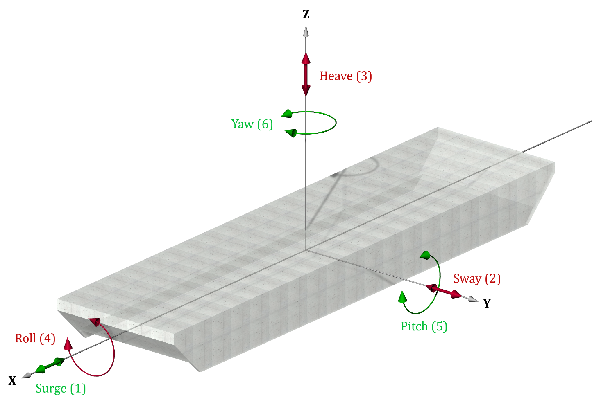{width="6.659410542432196in" height="4.461805555555555in"}

Assuming very long floating breakwaters, surge, pitch, and yaw are not that important and these can be neglected. In the present report, sway, heave, and roll are only considered.

The equations of motion representing a harmonic oscillation are as follows:

  -------------------------------------------------------------------------------------------------------------
  Sway (2)    $$y = y_{a} \bullet \cos\left( \omega \bullet t + \epsilon_{y\zeta} \right)$$             (4‑12)
  ----------- ---------------------------------------------------------------------------------------- --------
  Heave (3)   $$z = z_{a} \bullet \cos\left( \omega \bullet t + \epsilon_{z\zeta} \right)$$             (4‑13)

  Roll (4)    $$\phi = \phi_{a} \bullet \cos\left( \omega \bullet t + \epsilon_{\phi\zeta} \right)$$    (4‑14)
  -------------------------------------------------------------------------------------------------------------

With:

  ----------------------------------------------------------------------------------------
  $$\epsilon_{n\zeta}$$   ...   Phase angle
  ----------------------- ----- ----------------------------------------------------------
  $$\omega = 2\pi/T$$     ...   Circular wave frequency (rad/s)

  $$n_{a}$$               ...   Motion amplitude
  ----------------------------------------------------------------------------------------

There is an interaction of the FB with the surrounding water and additional conditions need to be defined to determine the interference of the FB with the water particles. Fousert \[21\] describes these conditions as follows:

- The *continuity or Laplace equation* hypothesizes the incompressibility of the fluid.

- The seabed boundary condition assumes that there is no exchange of vertical energy at the seabed, making the vertical velocity of water particles at the seabed zero. In deep-water conditions, waves are not affected by bottom friction.

- The *free surface dynamic boundary condition* assumes the pressure at the free water surface ($z = \zeta$) to be equal to the atmospheric pressure.

- The *free surface kinematic boundary condition* specifies the vertical velocity of a water particle at the free surface of the fluid to be identical to the vertical velocity of the fluid itself.

- The *kinematic boundary condition of the oscillating body surface* describes the velocity of a water particle at a point at the surface of the body to be equivalent to the velocity of this (watertight) body point itself.

- The *radiation condition* states that at the distance, *R*, from the oscillating body becomes large; the potential value tends to zero.

- The *symmetric or anti-symmetric condition* explains that the potential equations can be simplified when the FB has a symmetric centre line.

The FB cannot be considered as a mechanic mass-spring system, since the surrounding water affects the total mass, the spring stiffness, and the damping of the system.

The hydrodynamic added mass and damping parameters are not constant because they depend on the motion amplitude and the frequency.

The natural frequency of a hydrodynamic system can generally be described by the following equation:

  --------------------------------------------------------------------------------------------------
  $$\omega_{n} = \sqrt{\frac{k_{m} + c_{nn}}{m + a_{nn}}}$$       []{#_Ref129076687 .anchor}(4‑15)
  --------------------------------------------------------------- ----------------------------------

  --------------------------------------------------------------------------------------------------

With:

  -----------------------------------------------------------------------------------
  $$\omega_{n}$$   ...   Directional natural frequency (1/s)
  ---------------- ----- ------------------------------------------------------------
  $$k_{m}$$        ...   Spring stiffness of the mooring line (kg/s² or N/m)

  $$c_{nn}$$       ...   Hydrodynamic spring stiffness (kg/s² or N/m)

  $$m$$            ...   Structural mass (kg)

  $$a_{nn}$$       ...   Hydrodynamic added mass (kg)
  -----------------------------------------------------------------------------------

The FB in undamped conditions is subject to resonance when the exciting wave frequency is close to the natural frequency of the system.

The resonance peak can be changed by changing the mass or the spring stiffness of the system because these changes directly modify the natural frequency.

- The increased mass of the system 🡪 resonance peak shifts to lower frequencies

- Increased spring stiffness 🡪 resonance peak shifts to higher frequencies

### Sway motion

Sway is the horizontal motion due to incoming waves with horizontal components perpendicular to the longitudinal axis of the FB. Sway will generate a wave that is radiated to the leeward side as well as to the seawards \[21\].

The following parameters apply to sway motion equations:

  -----------------------------------------------------------------------------------------------------------------------
       $$\zeta_{a}$$      ...   Incoming wave amplitude at the seaside of the FB (m)
  ----------------------- ----- -----------------------------------------------------------------------------------------
         $$y_{a}$$        ...   Displacement in the y-direction (m)

           $$k$$          ...   Wave number (rad/m)

        $$\omega$$        ...   Circular wave frequency (rad/s)

           $$d$$          ...   Draft of FB including keels (m)

         $$d_{1}$$        ...   Draft of FB buoyancy body excluding keels (m)

        $$L_{FB}$$        ...   Length of the FB (m)

        $$W_{FB}$$        ...   Width of the FB (m)

           $$m$$          ...   Structural mass of FB (kg) 🡪 $m = \rho_{w} \bullet L_{FB} \bullet W_{FB} \bullet d_{1}$

         $$A_{s}$$        ...   Water plane area of FB section (m²) 🡪 $A_{s} = L_{FB} \bullet W_{FB}$

         $$A_{w}$$        ...   Water displacement area of the FB (m³) 🡪 $A_{w} = L_{FB} \bullet W_{FB} \bullet d_{1}$

        $$a_{22}$$        ...   Hydrodynamic added mass for sway motion (Ns²/m = kg)

        $$b_{22}$$        ...   Hydrodynamic sway damping (Ns/m = kg/s)

        $$c_{22}$$        ...   Hydrodynamic spring stiffness in horizontal direction (kg/s² or N/m)

        $$k_{my}$$        ...   Mooring spring stiffness in horizontal direction (kg/s² or N/m)

        $$d_{my}$$        ...   Mooring damping in the horizontal direction (Ns/m = kg/s)

        $$\alpha$$        ...   Mooring line angle

   $$\epsilon_{y\zeta}$$  ...   Phase shift of sway motion (deg.)

         $$\rho$$         ...   Density of water (kg/m³)
  -----------------------------------------------------------------------------------------------------------------------

#### Sway motion equations

Fosert gives the following equations for sway motion:

The ***amplitude of the horizontal wave force*** can be described as follows:

  -----------------------------------------------------------------------------------------------------------------------------------------------------------------------------
  $$F_{a,y} = \zeta_{a} \bullet \left( 1 - e^{- kd} \right) \bullet \sqrt{\left( a_{22} \bullet \omega^{2} \right)^{2} + \left( b_{22} \bullet \omega \right)^{2}}$$   (4‑16)
  -------------------------------------------------------------------------------------------------------------------------------------------------------------------- --------

  -----------------------------------------------------------------------------------------------------------------------------------------------------------------------------

The ***amplitude*** ***of the sway motion*** can be described as follows:

  -----------------------------------------------------------------------------------------------------------------------------------------------------------------------------------------------------------------------------------------------------------------------------------------------------------------------------------------------------
  $$y_{a} = \zeta_{a} \bullet \left( e^{- kd} \right) \bullet \sqrt{\frac{\left( a_{22} \bullet \omega^{2} \right)^{2} + \left( b_{22} \bullet \omega \right)^{2}}{\left\lbrack - k_{my} + \left( m + a_{22} \right) \bullet \omega^{2} \right\rbrack^{2} + \left\lbrack \left( d_{my} + b_{22} \right) \bullet \omega \right\rbrack^{2}}}$$   (4‑17)
  -------------------------------------------------------------------------------------------------------------------------------------------------------------------------------------------------------------------------------------------------------------------------------------------------------------------------------------------- --------

  -----------------------------------------------------------------------------------------------------------------------------------------------------------------------------------------------------------------------------------------------------------------------------------------------------------------------------------------------------

and depending on the point of time:

+-----------------------------------------------------------------------------------------------------------------------------------------------------------------------------------------------------------------------------------------------------------------------------------------------------------------------------------------------------------------------------------------------------+--------+
| $y(t) = - y_{a} \bullet \cos\left( \omega t + \epsilon_{y\zeta} \right)$                                                                                                                                                                                                                                                                                                                            | (4‑18) |
|                                                                                                                                                                                                                                                                                                                                                                                                     |        |
| $$y(t) = - \zeta_{a} \bullet \left( e^{- kd} \right) \bullet \sqrt{\frac{\left( a_{22} \bullet \omega^{2} \right)^{2} + \left( b_{22} \bullet \omega \right)^{2}}{\left\lbrack - k_{my} + \left( m + a_{22} \right) \bullet \omega^{2} \right\rbrack^{2} + \left\lbrack \left( d_{my} + b_{22} \right) \bullet \omega \right\rbrack^{2}}} \bullet \cos\left( \omega t + \epsilon_{y\zeta} \right)$$ |        |
+=====================================================================================================================================================================================================================================================================================================================================================================================================+========+

The ***phase shift*** can be determined with following equation:

  -----------------------------------------------------------------------------------------------------------------------------------------------------------------------------------------------------------------------------------------------------------------------------------------------------------
  $$\epsilon_{y\zeta} = \arctan\left( \frac{m \bullet b_{22} \bullet \omega^{3}}{\left( a_{22} \bullet \omega^{2} \right) \bullet \left\lbrack - k_{my} + \left( m + a_{22} \right) \bullet \omega^{2} + \left( \left( d_{my} + b_{22} \right) \bullet \omega \right)^{2} \right\rbrack} \right)$$   (4‑19)
  -------------------------------------------------------------------------------------------------------------------------------------------------------------------------------------------------------------------------------------------------------------------------------------------------- --------

  -----------------------------------------------------------------------------------------------------------------------------------------------------------------------------------------------------------------------------------------------------------------------------------------------------------

with $0 \leq \epsilon_{y\zeta} \leq 2\pi$

The ***sway natural frequency*** can be considered a two-dimensional problem with a breakwater length of $L_{FB} = 1\ m$. The natural frequency of a swaying system can be derived from the general term []{.mark}[(4‑15)](#_Ref129076687) with the following equation:

  ------------------------------------------------------------------------
  $$\omega_{n,2} = \sqrt{\frac{k_{my} + c_{22}}{m + a_{22}}}$$    (4‑20)
  --------------------------------------------------------------- --------

  ------------------------------------------------------------------------

The ***hydrodynamic spring coefficient*** (restoring force) is produced by the water pressure underneath the FB. Thus, it only applies to motions with vertical components \[21\] respectively the hydrodynamic spring coefficient for sway becomes zero ( $c_{22} = 0$.)

The mooring spring stiffness is mainly governed by the type of the mooring line. For a prestressed mooring line, the horizontal portion of the mooring force can be determined by the cosine of the mooring line angle α:

  ------------------------------------------------------------------------
  $$k_{my} = k_{m} \bullet \cos\alpha$$                           (4‑21)
  --------------------------------------------------------------- --------

  ------------------------------------------------------------------------

The ***hydrodynamic added*** **mass** is essentially the mass of the water that accelerates with the body, which is shown in principle in [Figure 47](#_Ref129786896).

![[]{#_Ref129786896 .anchor}Figure 47 - Hydrodynamic added mass for sway (22)](../images/2023-08-08_surewave_d3.2_floating_breakwater_design/image50.png)

Hydrodynamic added mass coefficient due to the sway motion was provided by Vugts \[23\] and Fousert's \[21\] for the two-dimensional rectangular structures with a width-draft-ratio of 2, 4, and 8 at various the wave frequency. The results are shown in [Figure 48](#_Ref129786915).

[]{#_Ref129786915 .anchor}Figure 48 -- Hydrodynamic added mass coefficient ${a’}_{22}$ for sway motion

Regression polynomials are ascertained based on Vugts \[23\] and Fousert's numerical modelling \[21\]:

  --------------------------------------------------------------------------------------------------------------------------------------------------------------
   $$\frac{\mathbf{W}_{\mathbf{FB}}}{\mathbf{d}}$$  ***Sway added mass polynomials***
  ------------------------------------------------- ------------------------------------------------------------------------------------------------------------
                         ≤ 2                        $$- 89.02\ x^{6} + 286.1\ x^{5} - 325.86\ x^{4} + 153.26{\ x}^{3} - 26.971\ x^{2} + 1.4943\ x + 1.2228$$

                          4                         $$- 15.656\ x^{6} + 60.148\ x^{5} - 83.506\ x^{4} + 49.757{\ x}^{3} - 12.39\ x^{2} + 1.4031\ x + 0.6184$$

                          8                         $$0.0681\ x^{6} \pm 0.6521\ x^{5} + 2.3022\ x^{4} - 3.5158{\ x}^{3} + 1.9143\ x^{2} - 0.0973\ x + 0.3487$$

                       ≥ 10.4                       $$0.0185\ x^{6} - 0.225\ x^{5} + 0.9861\ x^{4} - 1.836{\ x}^{3} + 1.1965\ x^{2} - 0.0534\ x + 0.2746$$
  --------------------------------------------------------------------------------------------------------------------------------------------------------------

With:

  --------------------------------------------------------------------------------------------------
  $$x = \omega \bullet \sqrt{\frac{W_{FB}}{2g}}$$                  []{#_Ref129673201 .anchor}(4‑22)
  --------------------------------------------------------------- ----------------------------------
  $${a'}_{22} = \frac{a_{22,d}}{\rho \bullet A_{w}}$$                           (4‑23)

  --------------------------------------------------------------------------------------------------

Intermediate values are linearly interpolated.

Vugts \[23\] made his measurements for a closed, rectangular shape floating body. Since the keels are arranged on both sides of the FB, the width-draft ratio also includes the keels. With this approach, the added mass on the outside of the breakwater is determined. In addition to these masses, there are also some masses in between the two keels. These additional masses can be determined according to Newmans' \[24\] terms for submerged thin screens:

  -----------------------------------------------------------------------------------------------------------------
  $$a_{22,keel} = \rho \bullet \pi \bullet L_{FB} \bullet \left( \frac{1}{2} \bullet d_{2} \right)^{2}$$   (4‑24)
  -------------------------------------------------------------------------------------------------------- --------

  -----------------------------------------------------------------------------------------------------------------

This yields to:

  ----------------------------------------------------------------------------------------------------------------------------------------------------------------------------
  $$a_{22} = a_{22,d} + a_{22,keel} = {a'}_{22} \bullet \rho \bullet A_{w} + \rho \bullet \pi \bullet L_{FB} \bullet \left( \frac{1}{2} \bullet d_{2} \right)^{2}$$   (4‑25)
  ------------------------------------------------------------------------------------------------------------------------------------------------------------------- --------

  ----------------------------------------------------------------------------------------------------------------------------------------------------------------------------

Furthermore, The ***hydrodynamic damping*** was also measured by Vugts \[23\] for a swaying, two-dimensional rectangular floating body with a width-draft ratio of 2, 4, and 8 as well as by Fousert with numerical modelling \[21\]. The results are shown in the following Figure:

Figure 49 - Hydrodynamic damping coefficient b\'~22~ for sway motion

Regression polynomials are ascertained based on Vugts \[23\] and Fousert's numerical modelling \[21\]:

  ------------------------------------------------------------------------------------------------------------------------------------------------------------
   $$\frac{\mathbf{W}_{\mathbf{FB}}}{\mathbf{d}}$$                                        ***Sway damping polynomials***
  ------------------------------------------------- ----------------------------------------------------------------------------------------------------------
                         ≤ 2                           $$0.3494\ x^{6} - 3.4946\ x^{5} + 13.292\ x^{4} - 23.5\ x^{3} + 18.238\ x^{2} - 3.9527\ x + 0.0945$$

                          4                           $$0.0445\ x^{6} - 0.6048\ x^{5} + 3.0095\ x^{4} - 6.7939\ x^{3} + 6.6105\ x^{2} - 1.7107\ x + 0.0518$$

                          8                          $$- 0.0284\ x^{6} + 0.2216\ x^{5} - 0.5294\ x^{4} + 0.175\ x^{3} + 0.6673\ x^{2} - 0.2632\ x + 0.0107$$

                        ≥10.4                        $$- 0.0202\ x^{6} + 0.1599\ x^{5} - 0.3907\ x^{4} + 0.1173\ x^{3} + 0.5922\ x^{2} - 0.2562\ x + 0.0118$$
  ------------------------------------------------------------------------------------------------------------------------------------------------------------

With *x* as per equation [(4‑22)](#_Ref129673201) and:

  -----------------------------------------------------------------------------------------------
  $${b'}_{22} = \frac{b_{22,d}}{\rho \bullet A_{w}} \bullet \sqrt{\frac{W_{FB}}{2g}}$$   (4‑26)
  -------------------------------------------------------------------------------------- --------

  -----------------------------------------------------------------------------------------------

Intermediate values are linearly interpolated.

The measurements of Vugts \[23\] are made for a closed, rectangular shape floating body. Since the keels are arranged on both sides of the FB, the width-draft ratio includes the keels. With this approach, the hydrodynamic damping of the outer walls including keels is determined. It is expected that the real damping will be a little higher because of the damping effect of the keels on the inside.

The ***radiated wave*** at the leeward side generated by sway motion yields the following equation \[22\]:

+--------------------------------------------------------------------------------------------------------------------------------------------------------------------------------------------------------------------------+----------------------------------+
| $$\zeta_{T,sway}(t) = \sqrt{\frac{b_{22} \bullet \omega^{3} \bullet y_{a}^{2}}{L_{FB} \bullet \rho \bullet g^{2}}} \bullet \sin\left( \omega \bullet t + \varepsilon_{y\zeta} + 0.5 \bullet k \bullet W_{FB} \right)$$   | []{#_Ref129788724 .anchor}(4‑27) |
|                                                                                                                                                                                                                          |                                  |
| $$\zeta_{T,sway} = \sqrt{\frac{b_{22} \bullet \omega^{3} \bullet y_{a}^{2}}{L_{FB} \bullet \rho \bullet g^{2}}} \bullet \sin\left( \varepsilon_{tot,max} + \varepsilon_{y\zeta} + 0.5 \bullet k \bullet W_{FB} \right)$$ |                                  |
+==========================================================================================================================================================================================================================+==================================+

With:

  ----------------------------------------------------------------------------------------------------------------------
  $$\varepsilon_{tot,max} = \omega \bullet t$$   ...   Point where the maximum total transmitted wave amplitude occurs
  ---------------------------------------------- ----- -----------------------------------------------------------------

  ----------------------------------------------------------------------------------------------------------------------

### Heave motion

Heave is the vertical motion due to incoming waves acting on the floating body. Heave will generate a wave that is radiated to the leeward side as well as to the seawards. The leeward-sided wave has a phase shift related to the incoming wave. This phase shift is subject to the structural dimensions, the wave frequency, and the mooring stiffness \[21\].

The following parameters apply to heave motion equations:

  ----------------------------------------------------------------------------------------------------------------------------------------------------
       $$\zeta_{a}$$      ...   Incoming wave amplitude at the seaside of the FB (m)
  ----------------------- ----- ----------------------------------------------------------------------------------------------------------------------
         $$z_{a}$$        ...   Displacement in the z-direction (m)

           $$k$$          ...   Wave number (rad/m)

        $$\omega$$        ...   Circular wave frequency (rad/s)

           $$d$$          ...   Draft of FB including keels (m)

         $$d_{1}$$        ...   Draft of FB buoyancy body excluding keels (m)

         $$d_{2}$$        ...   Depth of the keels below the buoyancy body (m)

        $$L_{FB}$$        ...   Length of the FB (m)

        $$W_{FB}$$        ...   Width of the FB (m)

           $$m$$          ...   Structural mass of FB (kg) 🡪 $m = \rho_{w} \bullet L_{FB} \bullet W_{FB} \bullet d_{1}$

         $$A_{s}$$        ...   Water plane area of FB section (m²) 🡪 $A_{s} = L_{FB} \bullet W_{FB}$

         $$A_{w}$$        ...   Water displacement area of the FB (m³) 🡪 $A_{w} = L_{FB} \bullet W_{FB} \bullet d_{1}$

        $$a_{33}$$        ...   Hydrodynamic added mass for heave motion (Ns²/m = kg)

        $$b_{33}$$        ...   Hydrodynamic heave damping (Ns/m = kg/s)

        $$c_{33}$$        ...   Hydrodynamic spring coefficient in vertical direction (kg/s² or N/m) 🡪 $c_{33} = \rho \bullet g \bullet A_{s}$

         $$C_{3}$$        ...   Vertical wave pressure distribution coefficient 🡪 $C_{3} = 1 - \left( \frac{k}{W_{FB}} \right) \bullet e^{- kd_{1}}$

        $$k_{mz}$$        ...   Mooring spring stiffness in vertical direction (kg/s² or N/m) 🡪 $k_{mz} = k_{m} \bullet \sin\alpha$

        $$d_{mz}$$        ...   Mooring damping in the vertical direction (Ns/m = kg/s) 🡪 $d_{mz} = d_{m} \bullet \sin\alpha$

        $$\alpha$$        ...   Mooring line angle

   $$\epsilon_{z\zeta}$$  ...   Phase shift of sway motion (deg.)
  ----------------------------------------------------------------------------------------------------------------------------------------------------

#### Heave motion equations

The following equation describes the ***amplitude of the vertical wave force***:

  -------------------------------------------------------------------------------------------------------------------------------------------------------------------------------------
  $$F_{a,z} = \zeta_{a} \bullet e^{- kd_{1}} \bullet \sqrt{\left( c_{33} \bullet C_{3} - a_{33} \bullet \omega^{2} \right)^{2} + \left( b_{33} \bullet \omega \right)^{2}}$$   (4‑28)
  ---------------------------------------------------------------------------------------------------------------------------------------------------------------------------- --------

  -------------------------------------------------------------------------------------------------------------------------------------------------------------------------------------

The ***amplitude*** ***of the heave motion*** can be described as follows:

  ---------------------------------------------------------------------------------------------------------------------------------------------------------------------------------------------------------------------------------------------------------------------------------------------------------------------------------------------------------------------------------------
  $$z_{a} = \zeta_{a} \bullet e^{- kd_{1}} \bullet \sqrt{\frac{\left( c_{33} \bullet C_{3} - a_{33} \bullet \omega^{2} \right)^{2} + \left( b_{33} \bullet \omega \right)^{2}}{\left\lbrack \left( k_{mz} + c_{33} \right) - \left( m + a_{33} \right) \bullet \omega^{2} \right\rbrack^{2} + \left\lbrack \left( d_{mz} + b_{33} \right) \bullet \omega \right\rbrack^{2}}}$$   (4‑29)
  ------------------------------------------------------------------------------------------------------------------------------------------------------------------------------------------------------------------------------------------------------------------------------------------------------------------------------------------------------------------------------ --------

  ---------------------------------------------------------------------------------------------------------------------------------------------------------------------------------------------------------------------------------------------------------------------------------------------------------------------------------------------------------------------------------------

and depending on the point of time:

+----------------------------------------------------------------------------------------------------------------------------------------------------------------------------------------------------------------------------------------------------------------------------------------------------------------------------------------------------------------------------------------------------------------------------------------------------+--------+
| $z(t) = z_{a} \bullet \sin\left( \omega t + \epsilon_{z\zeta} \right)$                                                                                                                                                                                                                                                                                                                                                                             | (4‑30) |
|                                                                                                                                                                                                                                                                                                                                                                                                                                                    |        |
| $$z(t) = \zeta_{a} \bullet \left( e^{- kd_{1}} \right) \bullet \sqrt{\frac{\left( c_{33} \bullet C_{3} - a_{33} \bullet \omega^{2} \right)^{2} + \left( b_{33} \bullet \omega \right)^{2}}{\left\lbrack \left( k_{mz} + c_{33} \right) - \left( m + a_{33} \right) \bullet \omega^{2} \right\rbrack^{2} + \left\lbrack \left( d_{mz} + b_{33} \right) \bullet \omega \right\rbrack^{2}}} \bullet \sin\left( \omega t + \epsilon_{z\zeta} \right)$$ |        |
+====================================================================================================================================================================================================================================================================================================================================================================================================================================================+========+

The ***phase shift*** can be determined with the following equation:

  ----------------------------------------------------------------------------------------------------------------------------------------------------------------------------------------------------------------------------------------------------------------------------------------------------------------------------------
  $$\epsilon_{z\zeta} = \arctan\left( \frac{- m \bullet b_{33} \bullet \omega^{3}}{\left( c_{33}C_{3} - a_{33}\omega^{2} \right) \bullet \left\lbrack \left( k_{mz} + c_{33} \right) - \left( m + a_{33} \right)\omega^{2} + \left\lbrack \left( d_{mz} + b_{33} \right)\omega \right\rbrack^{2} \right\rbrack} \right)$$   (4‑31)
  ------------------------------------------------------------------------------------------------------------------------------------------------------------------------------------------------------------------------------------------------------------------------------------------------------------------------- --------

  ----------------------------------------------------------------------------------------------------------------------------------------------------------------------------------------------------------------------------------------------------------------------------------------------------------------------------------

with $0 \leq \epsilon_{y\zeta} \leq 2\pi$

The ***heave natural frequency*** can be considered as a two-dimensional problem with a breakwater length of $L_{FB} = 1\ m$. The natural frequency of a heave system can be derived from the general term []{.mark}[(4‑15)](#_Ref129076687) with the following equation:

  ------------------------------------------------------------------------
  $$\omega_{n,3} = \sqrt{\frac{k_{mz} + c_{33}}{m + a_{33}}}$$    (4‑32)
  --------------------------------------------------------------- --------

  ------------------------------------------------------------------------

The ***hydrodynamic spring coefficient*** (restoring force) is produced by the water pressure underneath the FB. It only applies to motions with vertical components \[21\].

The mooring spring stiffness is mainly governed by the type of the mooring line. For a prestressed mooring line, the horizontal portion of the mooring force can be determined by the cosine of the mooring line angle α:

  ------------------------------------------------------------------------
  $$k_{mz} = k_{m} \bullet \sin\alpha$$                           (4‑33)
  --------------------------------------------------------------- --------

  ------------------------------------------------------------------------

For catenary moorings, the mooring spring stiffness is assumed to be negligible ($k_{mz} = 0$).

The ***hydrodynamic added*** **mass** is essentially the mass of the water that accelerates with the body, which is shown in [Figure 50](#_Ref129782377). It is simplified as the water mass trapped in between the keels and the water mass trapped in half of a circle of the radius equal to half of the FB width \[11\]. It is:

  --------------------------------------------------------------------------------------------------------------------------------------------------------------------------------------------------------------------------------------------------------
  $$a_{33} = \rho_{w} \bullet L_{FB} \bullet \left( W_{FB} \bullet d_{2} + \frac{\pi \bullet W_{FB}^{2}}{8} \right) = \rho_{w} \bullet L_{FB} \bullet W_{FB} \bullet d_{2} + \rho_{w} \bullet L_{FB} \bullet \frac{\pi \bullet W_{FB}^{2}}{8}$$   (4‑34)
  ----------------------------------------------------------------------------------------------------------------------------------------------------------------------------------------------------------------------------------------------- --------

  --------------------------------------------------------------------------------------------------------------------------------------------------------------------------------------------------------------------------------------------------------

  : 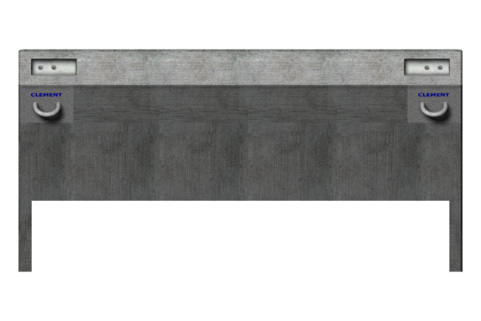

[]{#_Ref129782377 .anchor}Figure 50 - Hydrodynamic added mass for heave (33)

The ***hydrodynamic damping*** was measured by Vugts \[23\] for a heaving, two-dimensional rectangular floating body with a width-draft ratio of 2, 4, and 8 as well as by Fousert with numerical modelling \[21\]. The results are shown in the following Figure:

Figure 51 - Hydrodynamic damping coefficient b\'~33~ for heave motion

Regression polynomials are ascertained based on Vugts \[23\] and Fousert's numerical modelling \[21\]:

  ------------------------------------------------------------------------------------------------------------------------------------------------------------------------
   $$\frac{\mathbf{W}_{\mathbf{FB}}}{\mathbf{d}_{\mathbf{1}}}$$                                       ***Heave damping polynomials***
  -------------------------------------------------------------- ---------------------------------------------------------------------------------------------------------
                               ≤ 2                                                $$- 0.6402\ x^{4} + 3.1564\ x^{3} - 5.128\ x^{2} + 2.7476\ x - 0.0039$$

                                4                                                $$- 0.3121\ x^{4} + 2.2045\ x^{3} - 5.0934\ x^{2} + 3.8185\ x + 0.0689$$

                                8                                                 $$- 0.36\ x^{4} + 2.8995\ x^{3} - 7.9383\ x^{2} + 7.3908\ x + 0.1077$$

                              ≥ 10.4                              $$- 0.0237\ x^{6} + 0.3108\ x^{5} - 1.8936\ x^{4} + 6.7088\ x^{3} - 13.16\ x^{2} + 10.814\ x + 0.0435$$
  ------------------------------------------------------------------------------------------------------------------------------------------------------------------------

With *x* as per equation [(4‑22)](#_Ref129673201) and:

  ---------------------------------------------------------------------------------------------------
  $${b'}_{33} = \frac{b_{33,d_{1}}}{\rho \bullet A_{w}} \bullet \sqrt{\frac{W_{FB}}{2g}}$$   (4‑35)
  ------------------------------------------------------------------------------------------ --------

  ---------------------------------------------------------------------------------------------------

Intermediate values are linearly interpolated.

The ***radiated wave*** at the leeward side generated by heave motion yields to the following equation:

+---------------------------------------------------------------------------------------------------------------------------------------------------------------------------------------------------------------------------+----------------------------------+
| $$\zeta_{T,heave}(t) = \sqrt{\frac{b_{33} \bullet \omega^{3} \bullet z_{a}^{2}}{L_{FB} \bullet \rho \bullet g^{2}}} \bullet \cos\left( \omega \bullet t + \varepsilon_{z\zeta} + 0.5 \bullet k \bullet W_{FB} \right)$$   | []{#_Ref129788740 .anchor}(4‑36) |
|                                                                                                                                                                                                                           |                                  |
| $$\zeta_{T,heave} = \sqrt{\frac{b_{33} \bullet \omega^{3} \bullet z_{a}^{2}}{L_{FB} \bullet \rho \bullet g^{2}}} \bullet \cos\left( \varepsilon_{tot,max} + \varepsilon_{z\zeta} + 0.5 \bullet k \bullet W_{FB} \right)$$ |                                  |
+===========================================================================================================================================================================================================================+==================================+

With:

  ----------------------------------------------------------------------------------------------------------------------
  $$\varepsilon_{tot,max} = \omega \bullet t$$   ...   Point where the maximum total transmitted wave amplitude occurs
  ---------------------------------------------- ----- -----------------------------------------------------------------

  ----------------------------------------------------------------------------------------------------------------------

### Roll motion

Wave exciting moments are obtained by multiplying the horizontal and vertical wave exciting forces with their corresponding lever arms relative to the center of rotation. The roll motion generates a standing wave seaward with a phase difference compared to the incoming wave. This phase shift depends on structural dimensions, wave frequency, and mooring stiffness.

The following parameters apply to roll motion equations:

  -----------------------------------------------------------------------------------------------------------------------------------------------------------------------------------------------
          $$\zeta_{a}$$         ...   Incoming wave amplitude at the seaside of the FB (m)
  ----------------------------- ----- -----------------------------------------------------------------------------------------------------------------------------------------------------------
          $$\phi_{a}$$          ...   Rotation in the $\phi$-direction (rad)

              $$k$$             ...   Wave number (rad/m)

           $$\omega$$           ...   Circular wave frequency (rad/s)

              $$d$$             ...   Draft of FB including keels (m)

            $$d_{1}$$           ...   Draft of FB excluding keels (m)

           $$L_{FB}$$           ...   Length of the FB (m)

           $$W_{FB}$$           ...   Width of the FB (m)

              $$m$$             ...   Structural mass of FB (kg)

            $$A_{s}$$           ...   Water plane area of FB section (m²)

            $$y_{b}$$           ...   Horizontal lever arm, related to the rotation origin (m)

            $$z_{b}$$           ...   Vertical lever arm, related to the rotation origin (m)

           $$I_{xx}$$           ...   Mass moment of inertia about G per m 🡪 $I_{xx} = k_{xx}^{2} \bullet m = \left( 0.35 \bullet W_{FB} \right)^{2} \bullet m$

        $$\overline{GM}$$       ...   Transverse metacentric height (m) 🡪 $\overline{GM} = \overline{BM} - \overline{BG}$

        $$\overline{BM}$$       ...   Distance between centre of buoyancy and metacentre (m) 🡪 $\overline{BM} = \frac{\left( W_{FB}^{2} \bullet \rho \right)}{\left( 12 \bullet d_{1} \right)}$

        $$\overline{BG}$$       ...   Distance between the centres of gravity and buoyancy (m)

        $$\overline{OG}$$       ...   Distance of centre of gravity below the waterline (m)

           $$a_{22}$$           ...   Hydrodynamic added mass for sway motion (Ns²/m = kg)

           $$a_{33}$$           ...   Hydrodynamic added mass for heave motion (Ns²/m = kg)

           $$a_{44}$$           ...   Hydrodynamic added mass for roll motion

           $$b_{22}$$           ...   Hydrodynamic sway damping (Ns/m = kg/s)

           $$b_{33}$$           ...   Hydrodynamic heave damping (Ns/m = kg/s)

           $$b_{44}$$           ...   Hydrodynamic roll damping (Ns/m = kg/s)

           $$c_{33}$$           ...   Vertical restoring spring coefficient (N/m = kg/s²)

           $$c_{44}$$           ...   Water spring stiffness (N/rad) 🡪 $c_{44} = \rho \bullet g \bullet W_{FB} \bullet \overline{GM}$

            $$C_{3}$$           ...   Vertical wave pressure distribution coefficient 🡪 $C_{3} = 1 - \left( \frac{k}{W_{FB}} \right) \bullet e^{- kd_{1}}$

           $$k_{cy}$$           ...   Horizontal mooring spring stiffness (N/m = kg/s²)

           $$k_{cz}$$           ...   Vertical mooring spring stiffness (N/m = kg/s²)

           $$d_{by}$$           ...   Horizontal mooring damping (Ns/m = kg/s)

           $$d_{bz}$$           ...   Vertical mooring damping (Ns/m = kg/s)

   $$\varepsilon_{\phi\zeta}$$  ...   Phase shift of roll motion (deg.)
  -----------------------------------------------------------------------------------------------------------------------------------------------------------------------------------------------

#### Roll motion equations

The following equation describes the ***amplitude of the exciting wave force***:

+---------------------------------------------------------------------------------------------------------------------------------------------------------------------------------------------------------------------------------------------------------------------------------------------------------------------------------------------------------------------------------------------------------------------------------+
| $M_{a} = \zeta_{a} \bullet \sqrt{\left\lbrack e^{- kd} \bullet z_{b} \bullet \left( a_{22} \bullet \omega^{2} \right) + e^{- kd_{1}} \bullet y_{b} \bullet \left( b_{33} \bullet \omega \right) \right\rbrack^{2} + \left\lbrack e^{- kd} \bullet z_{b} \bullet \left( b_{22} \bullet \omega \right) - e^{kd_{1}} \bullet y_{b} \bullet \left( c_{33} \bullet C_{3} - a_{33} \bullet \omega^{2} \right) \right\rbrack^{2}}$     |
+:===============================================================================================================================================================================================================+:==============================================================================================================================================================================================================:+
|                                                                                                                                                                                                                | (4‑37)                                                                                                                                                                                                         |
+----------------------------------------------------------------------------------------------------------------------------------------------------------------------------------------------------------------+----------------------------------------------------------------------------------------------------------------------------------------------------------------------------------------------------------------+

The ***amplitude*** ***of the roll motion*** can be described as follows:

+---------------------------------------------------------------------------------------------------------------------------------------------------------------------------------------------------------------------------------------------------------------------------------------------------------------------------------------------------------------------------------------------------------------------------------------------------------------------------------------------------------------------------------------------------------------------------------------------------------------------------------------------------------------------------------------------------------------------------------------------------------------------------------------------+
| $\phi_{a} = \zeta_{a} \bullet \sqrt{\frac{\left\{ \left( e^{- kd} \bullet z_{b} \bullet a_{22} \bullet \omega^{2} \right) + \left( e^{- kd_{1}} \bullet y_{b} \bullet b_{33} \bullet \omega \right) \right\}^{2} + \left\{ \left( e^{- kd} \bullet z_{b} \bullet b_{22} \bullet \omega \right) - \left( y_{b} \bullet e^{- kd_{1}} \bullet \left( c_{33} \bullet C_{3} - a_{33} \bullet \omega^{2} \right) \right) \right\}^{2}}{\left\{ \left( I_{xx} + a_{44} \right) \bullet \omega^{2} - \left( ½ \bullet W_{FB}^{2} \bullet k_{cz} + 2 \bullet d_{1}^{2} \bullet k_{cy} + c_{44} + \overline{OG} \bullet m \bullet g \right) \right\}^{2} + \left\{ \left( ½ \bullet W_{FB}^{2} \bullet d_{bz} + 2 \bullet d_{1}^{2} \bullet d_{by} + b_{44} \right) \bullet \omega \right\}^{2}}}$    |
+:=============================================================================================================================================================================================================================================================================================================================================================================================+:============================================================================================================================================================================================================================================================================================================================================================================================:+
|                                                                                                                                                                                                                                                                                                                                                                                              | (4‑38)                                                                                                                                                                                                                                                                                                                                                                                       |
+----------------------------------------------------------------------------------------------------------------------------------------------------------------------------------------------------------------------------------------------------------------------------------------------------------------------------------------------------------------------------------------------+----------------------------------------------------------------------------------------------------------------------------------------------------------------------------------------------------------------------------------------------------------------------------------------------------------------------------------------------------------------------------------------------+

and depending on the point of time:

+-------------------------------------------------------------------------------------------------------------------------------------------------------------------------------------------------------------------------------------------------------------------------------------------------------------------------------------------------------------------------------------------------------------------------------------------------------------------------------------------------------------------------------------------------------------------------------------------------------------------------------------------------------------------------------------------------------------------------------------------------------------------------------------------------------------------------------------------------------+
| $$\phi(t) = {- \phi}_{a} \bullet \cos\left( \omega t + \epsilon_{\phi\zeta} \right)$$                                                                                                                                                                                                                                                                                                                                                                                                                                                                                                                                                                                                                                                                                                                                                                 |
|                                                                                                                                                                                                                                                                                                                                                                                                                                                                                                                                                                                                                                                                                                                                                                                                                                                       |
| $\phi(t) = \zeta_{a} \bullet \sqrt{\frac{\left\{ \left( e^{- kd} \bullet z_{b} \bullet a_{22} \bullet \omega^{2} \right) + \left( e^{- kd_{1}} \bullet y_{b} \bullet b_{33} \bullet \omega \right) \right\}^{2} + \left\{ \left( e^{- kd} \bullet z_{b} \bullet b_{22} \bullet \omega \right) - \left( y_{b} \bullet e^{- kd_{1}} \bullet \left( c_{33} \bullet C_{3} - a_{33} \bullet \omega^{2} \right) \right) \right\}^{2}}{\left\{ \left( I_{xx} + a_{44} \right) \bullet \omega^{2} - \left( ½ \bullet W_{FB}^{2} \bullet k_{cz} + 2 \bullet d_{1}^{2} \bullet k_{cy} + c_{44} + \overline{OG} \bullet m \bullet g \right) \right\}^{2} + \left\{ \left( ½ \bullet W_{FB}^{2} \bullet d_{bz} + 2 \bullet d_{1}^{2} \bullet d_{by} + b_{44} \right) \bullet \omega \right\}^{2}}} \bullet \cos\left( \omega t + \epsilon_{\phi\zeta} \right)$    |
+:==========================================================================================================================================================================================================================================================================================================================================================================================================================+:=========================================================================================================================================================================================================================================================================================================================================================================================================================:+
|                                                                                                                                                                                                                                                                                                                                                                                                                           | (4‑39)                                                                                                                                                                                                                                                                                                                                                                                                                    |
+---------------------------------------------------------------------------------------------------------------------------------------------------------------------------------------------------------------------------------------------------------------------------------------------------------------------------------------------------------------------------------------------------------------------------+---------------------------------------------------------------------------------------------------------------------------------------------------------------------------------------------------------------------------------------------------------------------------------------------------------------------------------------------------------------------------------------------------------------------------+

The ***phase shift*** can be determined with the following equations:

  -----------------------------------------------------------------------------------------------------------------------------------------------------------------------------------------------------------
  $$\epsilon_{\phi\zeta} = \arctan\left( \frac{A \bullet D - B \bullet C}{A \bullet C - B \bullet D} \right)$$                                                                                        (4‑40)
  -------------------------------------------------------------------------------------------------------------------------------------------------------------------------------------------------- --------
  $$A = \left( I_{xx} + a_{44} \right) \bullet \omega^{2} - \left( ½ \bullet W_{FB}^{2} \bullet k_{cz} + 2 \bullet d_{1}^{2} \bullet k_{cy} + c_{44} + \overline{OG} \bullet m \bullet g \right)$$    (4‑41)

  $$B = \left( ½ \bullet W_{FB}^{2} \bullet d_{bz} + 2 \bullet d_{1}^{2} \bullet d_{by} + b_{44} \right) \bullet \omega$$                                                                             (4‑42)

  $$C = \left( e^{- kd} \bullet z_{b} \bullet a_{22} \bullet \omega^{2} \right) + \left( e^{- kd_{1}} \bullet y_{b} \bullet b_{33} \bullet \omega \right)$$                                           (4‑43)

  $$D = \left( e^{- kd} \bullet z_{b} \bullet b_{22} \bullet \omega \right) - \left( y_{b} \bullet e^{- kd_{1}} \bullet \left( c_{33} \bullet C_{3} - a_{33} \bullet \omega^{2} \right) \right)$$     (4‑44)
  -----------------------------------------------------------------------------------------------------------------------------------------------------------------------------------------------------------

with $0 \leq \epsilon_{y\zeta} \leq 2\pi$

The wave force is acting with a ***lever arm*** related to the centre of gravity (G) for the vertical and horizontal portion, which yields to:

  ----------------------------------------------------------------------------------------------------------------
  $$y_{b} = \frac{\cos^{- 1}\left( \frac{1 + \frac{W_{FB}}{L} \bullet \pi}{2} \right)}{\pi} \bullet L$$    (4‑45)
  ------------------------------------------------------------------------------------------------------- --------
  $$z_{b} = \frac{\ln\left( \frac{1 + e^{- kd}}{2} \right)}{- k}$$                                         (4‑46)

  ----------------------------------------------------------------------------------------------------------------

The ***roll natural frequency*** of a rotational system can be derived from the general term []{.mark}[(4‑15)](#_Ref129076687) with the following equation:

  -----------------------------------------------------------------------------------------------------------------------------------
  $$\omega_{n,4} = \sqrt{\frac{\rho \bullet g \bullet A_{w} \bullet {\overline{GM}}_{T}}{m \bullet k_{44}^{2} + a_{44}}}$$   (4‑47)
  -------------------------------------------------------------------------------------------------------------------------- --------

  -----------------------------------------------------------------------------------------------------------------------------------

with $k_{44} = 0.35 \bullet W_{FB}$.

The ***hydrodynamic added*** **mass** is essentially the mass of the water that accelerates with the body, which is shown in principle in [Figure 52](#_Ref129873735).

![[]{#_Ref129873735 .anchor}Figure 52 - Hydrodynamic added mass for roll (44)](../images/2023-08-08_surewave_d3.2_floating_breakwater_design/image50.png)

Measurements of the roll-added mass was made by Vugts \[23\] for roll motion of two-dimensional rectangular structures with a width-draft-ratio of 2, 4, and 8 in relation to the wave frequency. The results are not applicable because VUTGS made his measurements with fixed roll angles. Therefore, polynomials are estimated using numerical results published by Fousert \[21\]. The results are shown in [Figure 53](#_Ref129874375).

[]{#_Ref129874375 .anchor}Figure 53 -- Hydrodynamic added mass coefficient ${a’}_{44}$ for roll motion

Regression polynomials are ascertained based on Fousert's numerical modelling \[21\]:

  ------------------------------------------------------------------------------------------------------------------------------------------
   $$\frac{\mathbf{W}_{\mathbf{FB}}}{\mathbf{d}}$$  ***Roll added mass polynomials***
  ------------------------------------------------- ----------------------------------------------------------------------------------------
                        ≤ 3.2                       $$0.0007{\ x}^{3} - 0.002\ x^{2} - 0.0021\ x + 0.05$$

                       ≥ 10.4                       $$- 0.1096x^{5} + 0.56\ x^{4} - 0.9411{\ x}^{3} + 0.5345\ x^{2} - 0.0601\ x + 0.1876$$
  ------------------------------------------------------------------------------------------------------------------------------------------

With *x* as per equation [(4‑22)](#_Ref129673201) and

  ---------------------------------------------------------------------------------
  $${a'}_{44} = \frac{a_{44,d}}{\rho \bullet A_{w} \bullet W_{FB}^{2}}$$   (4‑48)
  ------------------------------------------------------------------------ --------

  ---------------------------------------------------------------------------------

Intermediate values are linearly interpolated.

Fousert \[21\] made his numerical model for a closed, rectangular shape floating body. Since the keels are arranged on both sides of the FB, the width-draft ratio refers to the draft including the keels. With this approach, the added mass on the outside of the breakwater is determined. In addition to these masses, there are also some masses (vertical) in between the two keels. These additional masses can be determined according to Newmans' \[24\] terms for submerged thin screens:

  -------------------------------------------------------------------------------------------------------------------------------------
  $$a_{44,keel} = \frac{1}{8} \bullet \rho \bullet \pi \bullet L_{FB} \bullet \left( \frac{1}{2} \bullet d_{2} \right)^{4}$$   (4‑49)
  ---------------------------------------------------------------------------------------------------------------------------- --------

  -------------------------------------------------------------------------------------------------------------------------------------

This leads to:

  -------------------------------------------------------------------------------------------------------------------------------------------------------------------------------------------------------------------
  $$a_{44} = a_{44,d} + a_{44,keel} = {a'}_{44} \bullet \rho \bullet A_{w} \bullet W_{FB}^{2} + \frac{1}{8} \bullet \rho \bullet \pi \bullet L_{FB} \bullet \left( \frac{1}{2} \bullet d_{2} \right)^{4}$$   (4‑50)
  ---------------------------------------------------------------------------------------------------------------------------------------------------------------------------------------------------------- --------

  -------------------------------------------------------------------------------------------------------------------------------------------------------------------------------------------------------------------

The ***hydrodynamic damping*** was also determined by Fousert \[21\] for a rolling, two-dimensional rectangular floating body with a width-draft ratio of 3.2, and 10.4. The results are shown in the following Figure:

Figure 54 - Hydrodynamic damping coefficient b\'~44~ for roll motion

Regression polynomials are ascertained based on Fousert's numerical modelling \[21\]:

  --------------------------------------------------------------------------------------------------------------------------------------------------------------
   $$\frac{\mathbf{W}_{\mathbf{FB}}}{\mathbf{d}}$$                                         ***Roll damping polynomials***
  ------------------------------------------------- ------------------------------------------------------------------------------------------------------------
                        ≤ 3.2                        $$- 0.0009\ x^{6} - 0.0133\ x^{5} + 0.0568\ x^{4} - 0.0995{\ x}^{3} + 0.0708\ x^{2} - 0.0138\ x + 0.0003$$

                       ≥ 10.4                        $$- 0.0144\ x^{6} + 0.0999\ x^{5} - 0.208\ x^{4} + 0.0547{\ x}^{3} + 0.1922\ x^{2} \pm 0.0711\ x + 0.002$$
  --------------------------------------------------------------------------------------------------------------------------------------------------------------

With *x* as per equation [(4‑22)](#_Ref129673201) and:

  --------------------------------------------------------------------------------------------------------------
  $${b'}_{44} = \frac{b_{44,d}}{\rho \bullet A_{w} \bullet W_{FB}} \bullet \sqrt{\frac{W_{FB}}{2g}}$$   (4‑51)
  ----------------------------------------------------------------------------------------------------- --------

  --------------------------------------------------------------------------------------------------------------

Intermediate values are linearly interpolated.

It is expected that the real damping will be a little higher because of the damping effect of the keels to the inside, which is not yet considered in the polynomials above.

The ***radiated wave*** at the leeward side generated by roll motion yields to the following equation:

+--------------------------------------------------------------------------------------------------------------------------------------------------------------------------------------------------------------------------------+----------------------------------+
| $$\zeta_{T,roll}(t) = \sqrt{\frac{b_{44} \bullet \omega^{3} \bullet \phi_{a}^{2}}{L_{FB} \bullet \rho \bullet g^{2}}} \bullet \sin\left( \omega \bullet t + \varepsilon_{\phi\zeta} + 0.5 \bullet k \bullet W_{FB} \right)$$   | []{#_Ref129938489 .anchor}(4‑52) |
|                                                                                                                                                                                                                                |                                  |
| $$\zeta_{T,roll} = \sqrt{\frac{b_{44} \bullet \omega^{3} \bullet \phi_{a}^{2}}{L_{FB} \bullet \rho \bullet g^{2}}} \bullet \sin\left( \varepsilon_{tot,max} + \varepsilon_{\phi\zeta} + 0.5 \bullet k \bullet W_{FB} \right)$$ |                                  |
+================================================================================================================================================================================================================================+==================================+

With:

  ----------------------------------------------------------------------------------------------------------------------
  $$\varepsilon_{tot,max} = \omega \bullet t$$   ...   Point where the maximum total transmitted wave amplitude occurs
  ---------------------------------------------- ----- -----------------------------------------------------------------

  ----------------------------------------------------------------------------------------------------------------------

### Transmission below the floating breakwater

The wave energy below the FB keels is assumed to be unaffected by the FB and is therefore 100% transmitted leeward \[21\]. The energy which transmits below the keels yields:

  -------------------------------------------------------------------------------------------------------------------------------------------------
  $$E_{T,T} = \left( e^{- k \bullet \left( d - z_{a} \right)} \right) \bullet \frac{1}{2} \bullet \rho \bullet g \bullet \zeta_{a}^{2}$$   (4‑53)
  ---------------------------------------------------------------------------------------------------------------------------------------- --------

  -------------------------------------------------------------------------------------------------------------------------------------------------

The transmitted wave amplitude becomes to:

  ------------------------------------------------------------------------------------------------------------------------------------------------------------------------------------------------
  $$\zeta_{T,T} = \sqrt{e^{- k \bullet \left( d - z_{a} \right)} \bullet \zeta_{a}^{2}} = \zeta_{a} \bullet \sqrt{e^{- k \bullet \left( d - z_{a} \right)}}$$   []{#_Ref129789806 .anchor}(4‑54)
  ------------------------------------------------------------------------------------------------------------------------------------------------------------- ----------------------------------

  ------------------------------------------------------------------------------------------------------------------------------------------------------------------------------------------------

### Total wave transmission

The described mechanism produces in summary the maximum wave amplitude behind the FB. It is given by the following general equation:

  -----------------------------------------------------------------------------------------------------------------------------------
  $$\zeta_{T} = \left| \zeta_{T,sway} + \zeta_{T,heave} + \zeta_{T,roll} + \zeta_{T,T} \right|$$   []{#_Ref129330899 .anchor}(4‑55)
  ------------------------------------------------------------------------------------------------ ----------------------------------

  -----------------------------------------------------------------------------------------------------------------------------------

With:

  ----------------------------------------------------------------------------------------
  $$\zeta_{T}$$         ...   Transmitted wave amplitude portion
  --------------------- ----- ------------------------------------------------------------
  $$\zeta_{T,sway}$$    ...   Vertical transmitted wave due to sway motion

  $$\zeta_{T,heave}$$   ...   Wave amplitude due to heave motion

  $$\zeta_{T,roll}$$    ...   Wave amplitude due to roll motion

  $$\zeta_{T,T}$$       ...   Wave amplitude of transmitted part below the keels
  ----------------------------------------------------------------------------------------

The general equation of [(4‑55)](#_Ref129330899) is combined with equations [(4‑27)](#_Ref129788724), [(4‑36)](#_Ref129788740), [(4‑52)](#_Ref129938489), and []{.mark}[(4‑54)](#_Ref129789806) which lead to the following mathematical term:

+---------------------------------------------------------------------------------------------------------------------------------------------------------------------------------------------------------------------------------------------------------------------------------------------------------------------------------------------------------------------------------------------------------------------------------------------------------------------------------------------------------------------------------------------------------------------------------------------------------------------------------+--------+
| $$\zeta_{T} = \left| \sqrt{\frac{b_{22} \bullet \omega^{3} \bullet y_{a}^{2}}{L_{FB} \bullet \rho \bullet g^{2}}} \bullet \sin\left( \varepsilon_{tot,max} + \varepsilon_{y\zeta} \right) + \sqrt{\frac{b_{33} \bullet \omega^{3} \bullet z_{a}^{2}}{L_{FB} \bullet \rho \bullet g^{2}}} \bullet \cos\left( \varepsilon_{tot,max} + \varepsilon_{z\zeta} \right) + \sqrt{\frac{b_{44} \bullet \omega^{3} \bullet \phi_{a}^{2}}{L_{FB} \bullet \rho \bullet g^{2}}} \bullet \sin\left( \varepsilon_{tot,max} + \varepsilon_{\phi\zeta} \right) + \sqrt{e^{- k \bullet \left( d - z_{a} \right)} \bullet \zeta_{a}^{2}} \right|$$ | (4‑56) |
|                                                                                                                                                                                                                                                                                                                                                                                                                                                                                                                                                                                                                                 |        |
| $$\zeta_{T} = \left| y_{a} \bullet \sqrt{\frac{b_{22} \bullet \omega^{3}}{L_{FB} \bullet \rho \bullet g^{2}}} \bullet \sin\left( \varepsilon_{tot,max} + \varepsilon_{y\zeta} \right) + z_{a} \bullet \sqrt{\frac{b_{33} \bullet \omega^{3}}{L_{FB} \bullet \rho \bullet g^{2}}} \bullet \cos\left( \varepsilon_{tot,max} + \varepsilon_{z\zeta} \right) + \phi_{a} \bullet \sqrt{\frac{b_{44} \bullet \omega^{3}}{L_{FB} \bullet \rho \bullet g^{2}}} \bullet \sin\left( \varepsilon_{tot,max} + \varepsilon_{\phi\zeta} \right) + \sqrt{e^{- k \bullet \left( d - z_{a} \right)} \bullet \zeta_{a}^{2}} \right|$$             |        |
+=================================================================================================================================================================================================================================================================================================================================================================================================================================================================================================================================================================================================================================+========+

With:

  ----------------------------------------------------------------------------------------------------------------------
  $$\varepsilon_{tot,max} = \omega \bullet t$$   ...   Point where the maximum total transmitted wave amplitude occurs
  ---------------------------------------------- ----- -----------------------------------------------------------------

  ----------------------------------------------------------------------------------------------------------------------

### Results from Fousert \[21\]/ van Tol \[22\] model 

The phase shift significantly impacts the wave amplitudes behind the FB. Various movements of the FB are associated with different phase shifts. A theoretical uniform overlay of maximum amplitudes from all movements and their transmitted parts is possible with regular waves, but still, it remains highly unlikely. The likelihood decreases even further with irregular waves. The results are shown in [Figure 55](#_Ref141954802).

![[]{#_Ref141954802 .anchor}Figure 55 - Transmission coefficient according to Fousert \[21\]/ van Tol \[22\] compared to Macagno \[9\] and Ruol et. al \[11\] as well as with FLOW-3D results [without]{.underline} adjustment of phase shifts for Model No. 17](../images/2023-08-08_surewave_d3.2_floating_breakwater_design/image51.png){width="6.69375in" height="2.79375in"}

With small adjustments of the phase shifts for sway ($+ 0.1\pi$), heave ($+ 0.06\pi$), and roll ($- 0.05\pi$), the expected transmission coefficient is quite similar to the results of Macagno except for high-frequency waves. In the range of high-frequency waves, Fousert fits well to FLOW-3D simulations. The results are in [Figure 56](#_Ref141955380).

![[]{#_Ref141955380 .anchor}Figure 56 - Transmission coefficient according to Fousert \[21\]/ van Tol \[22\] compared to Macagno \[9\] and Ruol et. al \[11\] as well as with FLOW-3D results [with]{.underline} adjustment of phase shifts for Model No. 17](../images/2023-08-08_surewave_d3.2_floating_breakwater_design/image52.png){width="6.69375in" height="2.79375in"}

# Summary

This report investigated the efficiency of floating breakwaters in terms of wave transmission. This has been carried out for different types/cross sections of breakwaters and with different approaches. Theoretical approaches of existing publications by different authors were compared with the results of numerical simulations. Although there are variations between the results from the different approaches, they tend to show similar results.

The main conclusions of the investigations are as follows:

- There is no generally applicable approach to calculate the wave transmission of floating breakwaters. The existing approaches from the literature are always based, at least partially, on the results of numerical simulations or physical model tests. Differences between the approaches are mainly due to different assumptions regarding the consideration of input variables such as degrees of freedom of motion, dynamic behaviour, or natural frequencies.

- The most detailed formulation was carried out by Fousert \[21\], because he considers the most input variables or parameters. However, in the high-frequency range, Macagno \[9\] including adjustments from Ruol, Martinelli, and Pezzutto \[11\] also delivers good results with a less complex calculation approach.

- Results of numerical simulations show that there are effective and less effective FB cross sections. If we take into account the FB\'s producibility and transportability, all cross sections have minimal to no impact within a specific wave period range (between 5 and 7 seconds). During larger wave periods, the FB essentially follows the motion of the waves.

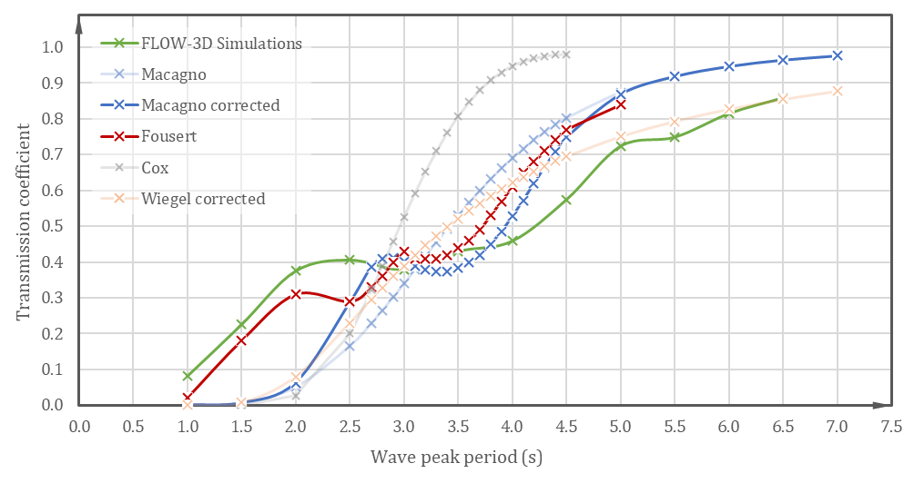{width="6.69375in" height="3.4608694225721783in"}

- **Critical wave periods for the PV-system are between 1 and 3 seconds. These waves are reduced by the FB to at least 40% of the incident wave height.**

- The chosen FB has the following properties:

  - Length: 20.00 m

  - Width: 5.00 m

  - Height: 2.50 m

  - Mass: 123.39 t

  - Volume: 170.83 m³

  - Draft: 2.03 m

  - Freeboard: 0.47 m

  - Centre of gravity: X=0 mm; Y=0 mm; Z=158.967 cm

  - Moment of inertia: X=718022.04 kg·m²; Y=4768923.11 kg·m²; Z=4754707.52 kg·m²

  - Radii of inertia: X=241.227 cm; Y=621.68 cm; Z=620.753 cm

  - Main moment and X-Y-Z direction around the centre of gravity:

  - I: 406202.95 kg·m² along X=1.0000; Y=0.0000; Z=0.0000

  - J: 4457104.03 kg·m² along X=0.0000; Y=1.0000; Z=0.0000

  - K: 4754707.52 kg·m² along X=0.0000; Y=0.0000; Z=1.0000

- The model is available for the project partners in various digital formats such as \*.dwg or \*.stl.

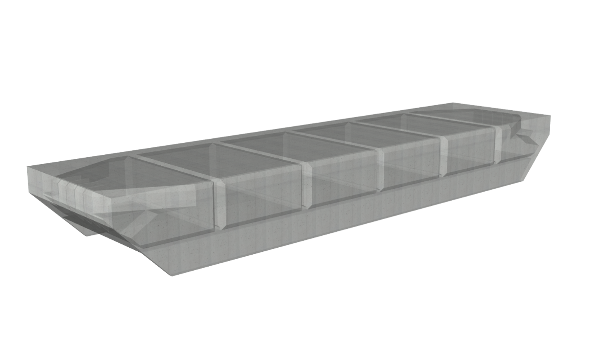{width="6.6768503937007875in" height="2.13043416447944in"}

- Other FLOW-3D Hydro output files with movements, surface elevation, forces, and moments are also available.

# Recommendation for upcoming tasks

The following aspects must be considered:

- Especially with large waves, large pressures also occur. To ensure that these do not act simultaneously on the entire system, a nearly circular layout with few straight sections is recommended so that waves and thus pressures act with a time delay. Accordingly, the resulting anchoring forces are also lower (for Task T3.3). The results of T3.2 and T3.3 are the input for T3.4 and T5.2.

- The new circular material was considered with interim results of Tasks T4.1 and T4.2. The model needs to be rechecked or confirmed after the final results are available.

- The connections for joining the breakwater elements are not yet investigated. Especially in the case of oblique or longitudinal wave action, the connections must be capable of absorbing or transmitting the forces caused by movements (for Task T5.3).

# Bibliography, References

The following list summarizes applicable rules and regulations, standards, recommendations, and other relevant references. Unless otherwise noted, standards and guidelines are applied in their latest revision/edition.

  -----------------------------------------------------------------------------------------------------------------------------------------------------------------------------------------------------------------------------------------------------------------------------------------------
  \[1\]    DNV, *DNV-RP-C205 - Environmental Conditions and Environmental Loads,* 2010.
  -------- --------------------------------------------------------------------------------------------------------------------------------------------------------------------------------------------------------------------------------------------------------------------------------------
  \[2\]    SUREWAVE Consortium, *Deliverable D2.1 - Use case scenario basis for typical, rough location,* 2023.

  \[3\]    Y. Goda, *Random Seas and Design of Maritime Structures,* World Scientific Publishing Co. Pte. Ltd., 2000.

  \[4\]    C. Bishop, M. Donelan und K. Kahma, *Shore Protection Manual\'s Wave Prediction Reviewed,* 1992.

  \[5\]    K. e. a. Hasselmann, *Measurements of Wind-Wave Growth and Swell Decay During the Joint North Sea Wave Project (JONSWAP),* 1973.

  \[6\]    Coastal Engineering Reserche Center, U.S. Army, Corps of Engineers, *CERC: Shore Protection Manual,* 1984.

  \[7\]    SUREWAVE Consortium, *Deliverable D2.2 - Requirements for surface mooring system between FPV array and breakwater,* 2023.

  \[8\]    Flow Science, Inc., „FLOW-3D," \[Online\]. Available: https://www.flow3d.com. \[Zugriff am 24 07 2023\].

  \[9\]    E. Macagno, „Houle dans un canal présentant un passage en charge," *La Houille Blanche,* Bd. 1, pp. 10-37, 1954.

  \[10\]   E. Bouwmeester und H. Van Der Breggen, *Floating Breakwaters - Literature Review,* Delft: Delft University of Technology, Department of Civil Engineering, Hydraulic Engineering Group, 1984.

  \[11\]   P. Ruol, L. Martinelli und P. Pezzutto, „Formula to Predict Transmission for ᴨ-Type Floating Breakwaters," Journal of Waterway, Port, Coastal, and Ocean Engineering, 2013.

  \[12\]   L. Martinelli, P. Ruol und B. Zanuttigh, „Wave basin experiments on floating breakwaters with different layouts," Elsevier Science, 2008.

  \[13\]   M. Gesraha, „Analysis of Π-type floating breakwater in obliques waves:: I. Impervious rigid wave boards," *Applied Ocean Res.,* pp. 327-338, 2006.

  \[14\]   E. V. Koutandos, P. E. Prinos und X. Gironella, „Floating breakwaters under regular and irregular wave forcing: reflection and transmission characteristics," Journal of Hydraulic Research, 2005.

  \[15\]   R. Cox, I. Coghlan und C. Kerry, „Floating breakwater performance in irregular waves with particular emphasis on wave transmission and reflection, energy dissipation, motion and restraining forces," Coastal Structures, 2007.

  \[16\]   E. Peña González, J. Ferreras und F. Sanchez-Tembleque, „Experimental study on wave transmission coefficient, mooring lines and module connector forces with different designs of floating breakwaters," Journal of Ocean Engineering / University of A Coruña, Coruña, Spain, 2011.

  \[17\]   R. Wiegel, *Transmission of waves past a rigid vertical thin barrier,* Journal of Waterways Harbour Division Proceedings, 1960.

  \[18\]   D. B. C. Kriebel, *Coastal Engineering Conference - Wave transmission past vertical wave barriers,* American Society of Civil Engineers, 1996.

  \[19\]   J. Cox, *Proceedings from Solutions to Coastal Disasters - Why are Manhole Covers Round? or Understanding Basic Coastal Design,* American Society of Civil Engineering, 2005.

  \[20\]   J. C. Cox und J. Stangland, *Designing floating wave attenuators for long period waves,* PIANC, 2014.

  \[21\]   M. W. Fousert, „Floating breakwater - a theoretical study of a dynamic wave attenuating system," Delft University of Technology, Delft, 2006.

  \[22\]   P. T. G. van Tol, „Floating breakwaters - A theoretical study and preliminary design of a dynamic wave attenuating system," Delft University of Technology, Delft, 2008.

  \[23\]   J. Vugts, *The Hydrodynamic Forces and Ship Motions in Waves,* Delft University of Technology, 1970.

  \[24\]   J. Newman, *Marine Hydrodynamics,* MIT Press, Cambridge, 1977.
  -----------------------------------------------------------------------------------------------------------------------------------------------------------------------------------------------------------------------------------------------------------------------------------------------

# Result plots

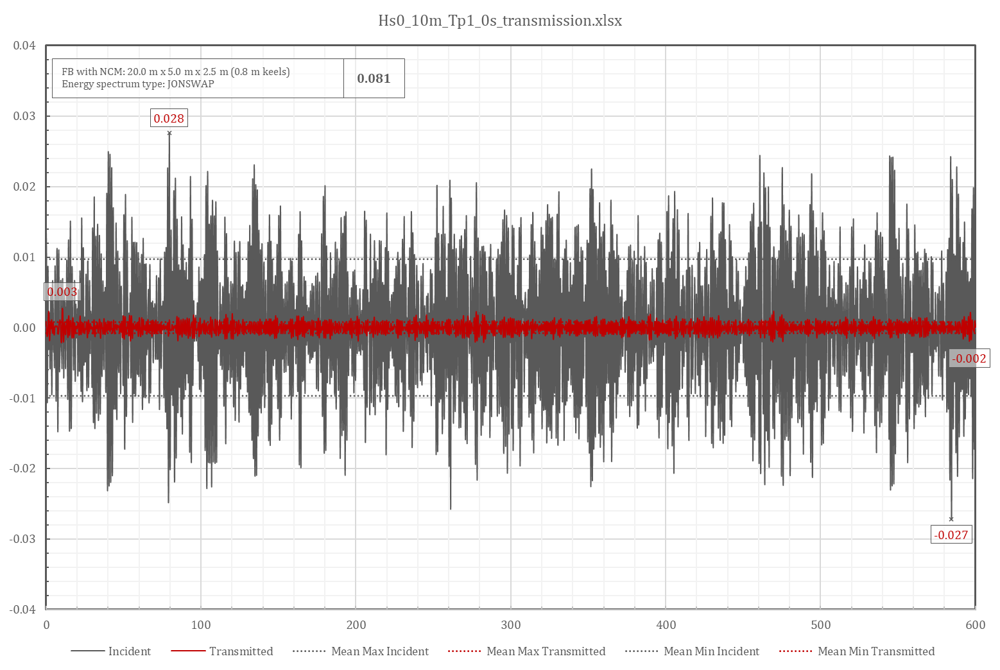{width="6.639273840769904in" height="4.448818897637795in"}

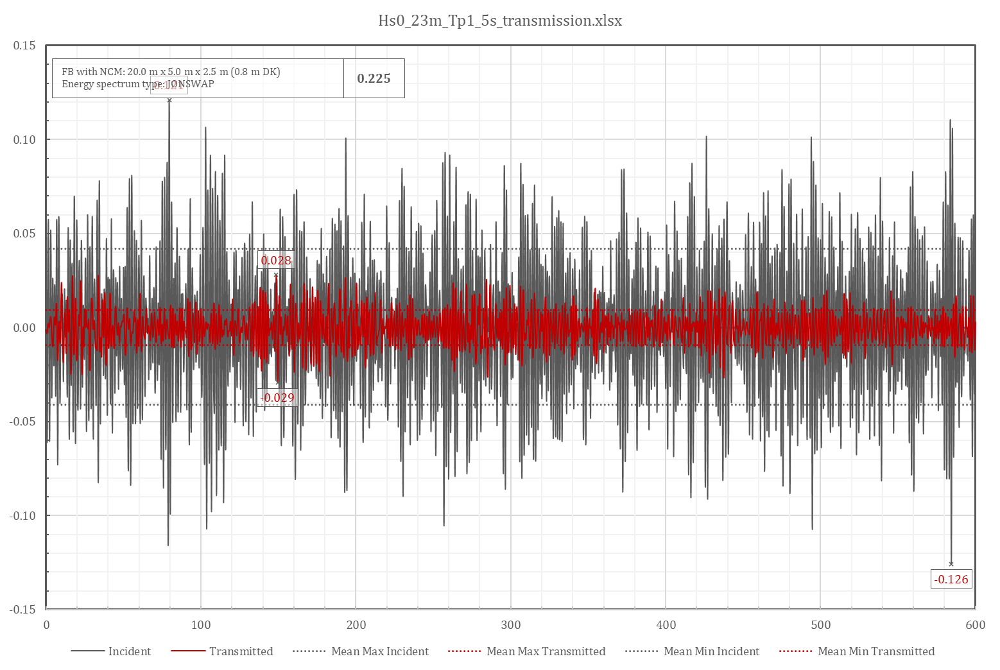{width="6.639273840769904in" height="4.448818897637795in"}

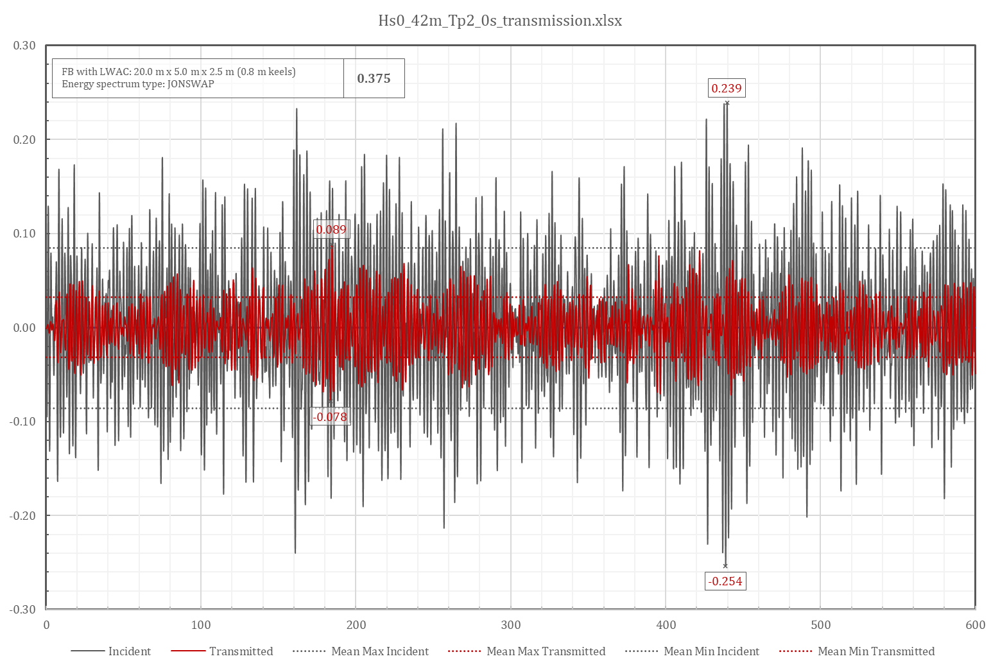{width="6.692913385826771in" height="4.484761592300963in"}

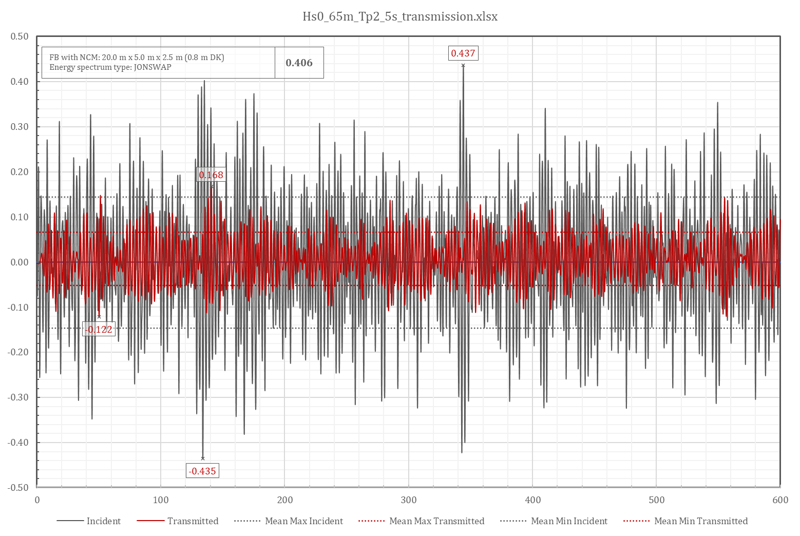{width="6.692913385826771in" height="4.484761592300963in"}

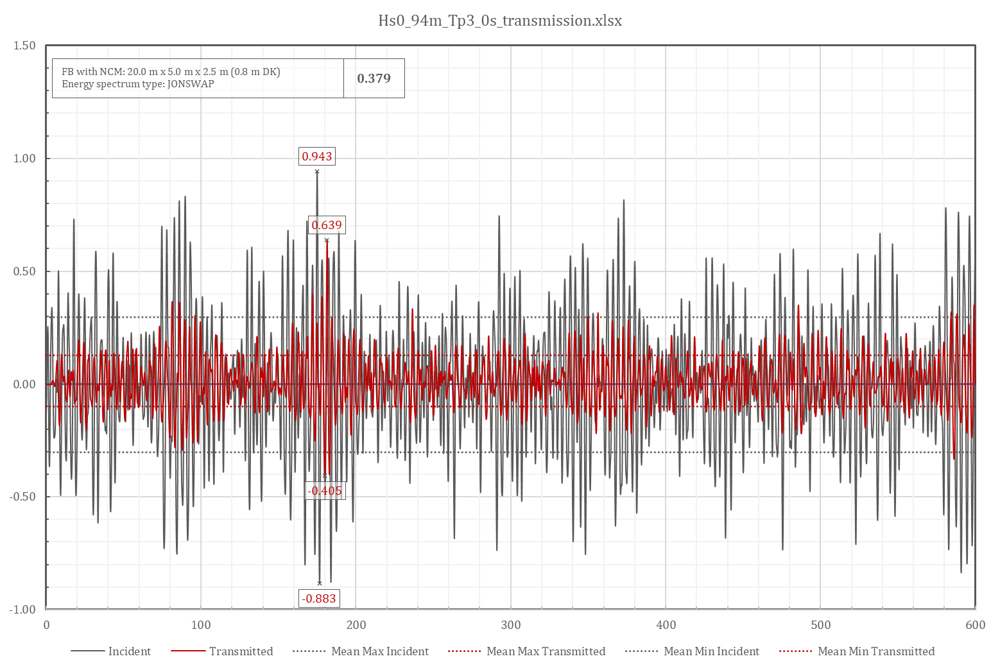{width="6.692913385826771in" height="4.484761592300963in"}

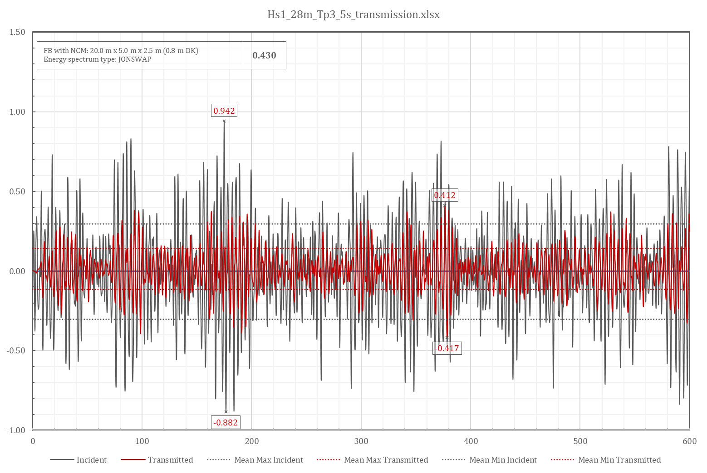{width="6.692913385826771in" height="4.484761592300963in"}

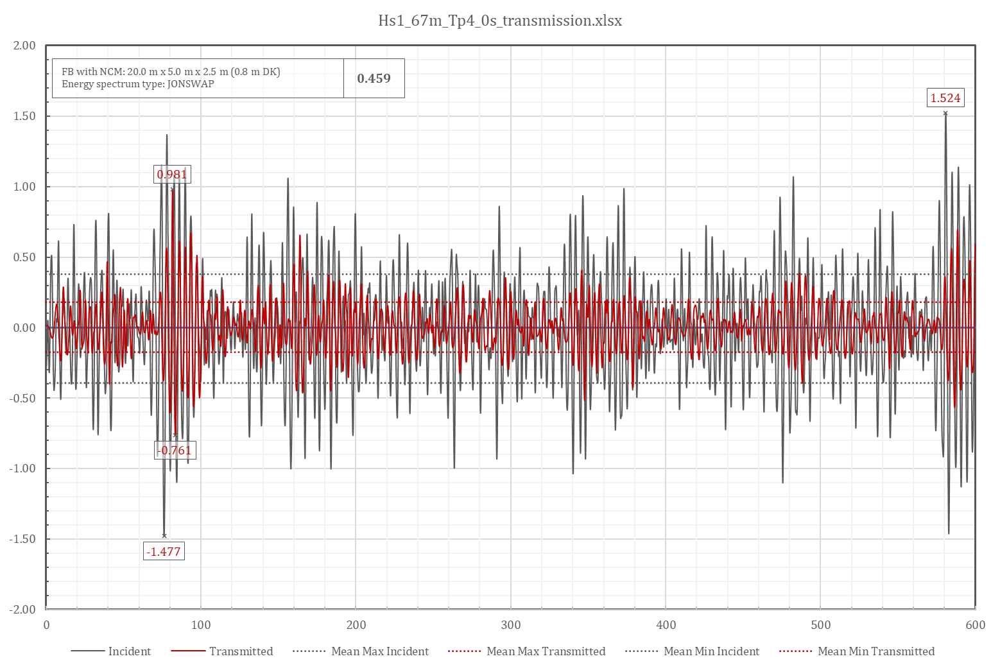{width="6.692913385826771in" height="4.484761592300963in"}

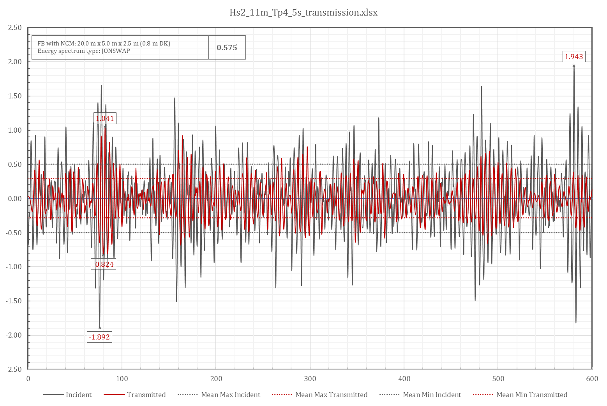{width="6.692913385826771in" height="4.484761592300963in"}

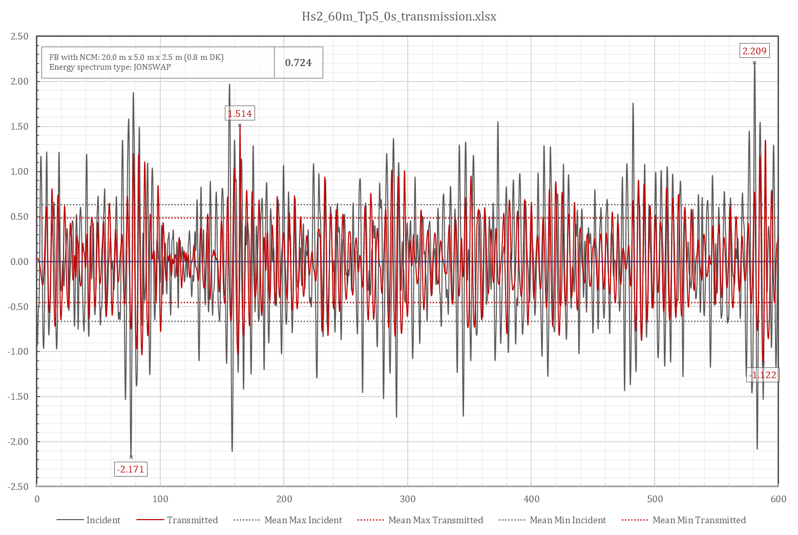{width="6.692913385826771in" height="4.484761592300963in"}

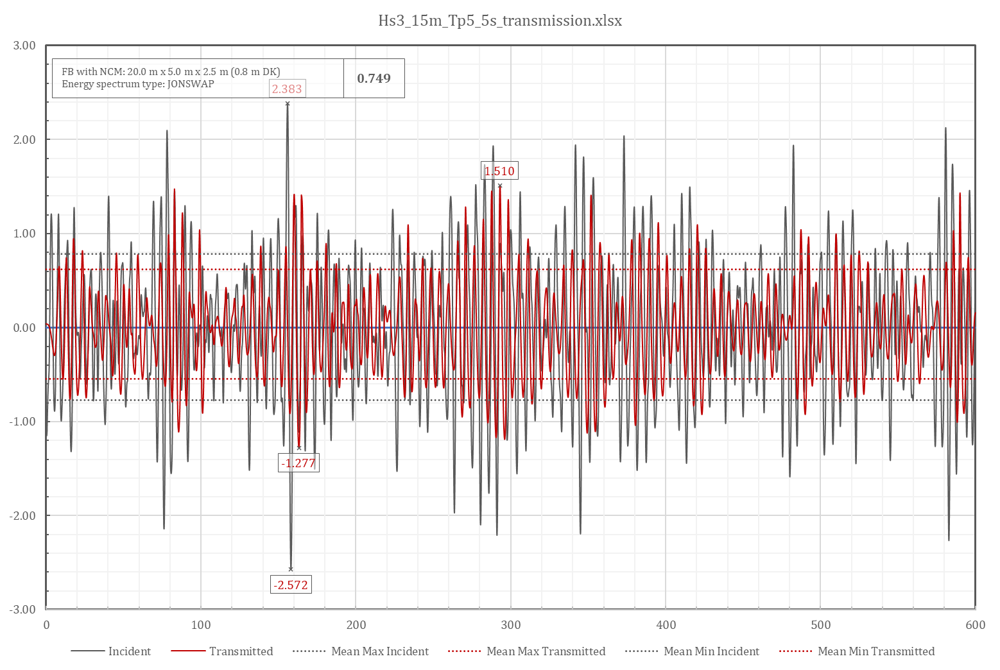{width="6.692913385826771in" height="4.484761592300963in"}

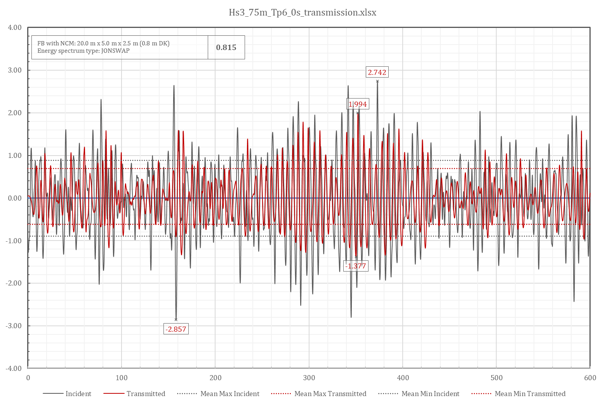{width="6.692913385826771in" height="4.484761592300963in"}

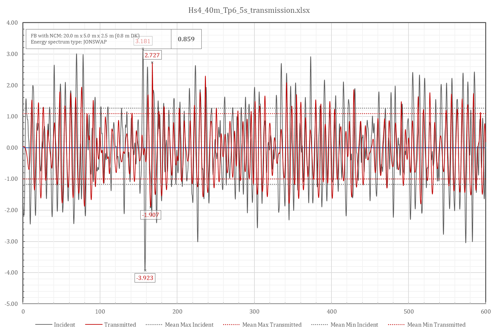{width="6.692913385826771in" height="4.484761592300963in"}

[^1]: Creation, modification, final version for evaluation, revised version following evaluation, final
