> Source: `2023-12-08 - SUREWAVE Deliverable 3.3_final.docx` — Document date: 2023-12-08 — Converted: 2026-09-28 via pandoc/pdftotext

---

##### 

+--------------------------------------------------------------------------------------------------------------------------------------------------------------------------------------------------------------------------------------------------------------------------------------------------------+
| Deliverable number: D3.3                                                                                                                                                                                                                                                                               |
+=============================================================================================================================================================+==========================================================================================================================================+
| #####                                                                                                                                                                                                                                                                                                  |
+--------------------------------------------------------------------------------------------------------------------------------------------------------------------------------------------------------------------------------------------------------------------------------------------------------+
| ##### {width="7.8701301399825025in" height="2.5902777777777777in"}                                                                                                                                                                                                                |
+--------------------------------------------------------------------------------------------------------------------------------------------------------------------------------------------------------------------------------------------------------------------------------------------------------+
| ##### SUREWAVE -- Structural Reliable Offshore Floating PV Solution Integrating Circular Concrete Floating Breakwater                                                                                                                                                                                  |
+--------------------------------------------------------------------------------------------------------------------------------------------------------------------------------------------------------------------------------------------------------------------------------------------------------+
| ##### **Anchoring and connections to PV system**                                                                                                                                                                                                                                                       |
+--------------------------------------------------------------------------------------------------------------------------------------------------------------------------------------------------------------------------------------------------------------------------------------------------------+
| ##### **Disclaimer:**                                                                                                                                                                                                                                                                                  |
|                                                                                                                                                                                                                                                                                                        |
| > The SUREWAVE project is funded by the European Union. Views and opinions expressed are however those of the author(s) only and do not necessarily reflect those of the European Union. Neither the European Union nor the granting authority can be held responsible for them.                       |
+--------------------------------------------------------------------------------------------------------------------------------------------------------------------------------------------------------------------------------------------------------------------------------------------------------+
| #####                                                                                                                                                                                                                                                                                                  |
+-------------------------------------------------------------------------------------------------------------------------------------------------------------+------------------------------------------------------------------------------------------------------------------------------------------+
| ##### The SUREWAVE project has received funding from the European Union\'s Horizon Europe Research and innovation funding programme under GA No. 101083342. | ##### {width="3.00255249343832in" height="0.6299212598425197in"}                                                    |
+-------------------------------------------------------------------------------------------------------------------------------------------------------------+------------------------------------------------------------------------------------------------------------------------------------------+

Deliverable details

  ----------------------------------------------------------------------------
  Work package:          WP3
  ---------------------- -----------------------------------------------------
  Task:                  3.3 and 3.4

  Document name:         D3.3 -- Anchoring and connections to PV system

  Lead beneficiary:      Clement Germany GmbH

  Dissemination level:   PU - Public

  Deliverable type:      R -- Document, report

  Due date:              30.11.2023

  Delivery date:         08.12.2023
  ----------------------------------------------------------------------------

  --------------------------------------------------------------------------------
   **Document version**      **Date**         **Author**       **Comments**[^1]
  ---------------------- ----------------- ----------------- ---------------------
           1.0              27.11.2023       Thomas Pehlke    First draft version

           1.1              30.11.2023       Thomas Pehlke    Final draft version

           2.0              04.12.2023      Balram Panjwani       Revision-1

           2.1              05.12.2023       Thomas Pehlke      Second version

           2.2              08.12.2023      Balram Panjwani       Revision-2

           3.0              08.12.2023       Thomas Pehlke       Final version
  --------------------------------------------------------------------------------

+--------------------------------------------------------------------------------------------------------------------------------------------------+
| **Dissemination level**                                                                                                                          |
+:===================================:+:==========================================================================================================:+
| PU                                  | > Public: fully open                                                                                       |
+-------------------------------------+------------------------------------------------------------------------------------------------------------+
| SEN                                 | > Sensitive: limited under the conditions of the Grant Agreement                                           |
+-------------------------------------+------------------------------------------------------------------------------------------------------------+
| EU classified                       | > EU classified: restraint -- UE/EU-restricted, confidential, secret-UE/EU, secret under Decision 2015/444 |
+-------------------------------------+------------------------------------------------------------------------------------------------------------+
| **Deliverable type**                                                                                                                             |
+-------------------------------------+------------------------------------------------------------------------------------------------------------+
| R                                   | > Document, report (excluding the periodic and final reports)                                              |
+-------------------------------------+------------------------------------------------------------------------------------------------------------+
| DEM                                 | > Demonstrator, pilot, prototype, plan designs                                                             |
+-------------------------------------+------------------------------------------------------------------------------------------------------------+
| DEC                                 | > Websites, patents filing, press & media actions, videos, etc.                                            |
+-------------------------------------+------------------------------------------------------------------------------------------------------------+
| OTHER                               | > Software, technical diagram, etc.                                                                        |
+-------------------------------------+------------------------------------------------------------------------------------------------------------+

Executive summary

This report starts by examining possible layouts of the surrounding floating breakwater (FB) and the associated internal floating PV-system (FPV). Criteria for evaluating advantages and disadvantages are elaborated and the layouts are compared accordingly.

For the preferred option, the required anchoring is then determined based on the results of the simulations from D3.2 for the three selected locations (see D2.1). The connection between the breakwater and the PV system is described in functional terms with an initial design.

Deliverable review

+----------------------------------------------------------------------------------+----------------+---------------------------------------+----------------+----------------+---------------------------------------+----------------+
|                                                                                  | **Reviewer #1: Balram Panjwani**                                        | **Reviewer #2: Virgile Delhaye**                                        |
|                                                                                  +----------------+---------------------------------------+----------------+----------------+---------------------------------------+----------------+
|                                                                                  | **Answer**     | **Comments**                          | **Type\***     | **Answer**     | **Comments**                          | **Type\***     |
+----------------------------------------------------------------------------------+----------------+---------------------------------------+----------------+----------------+---------------------------------------+----------------+
| 1.  Is the deliverable in accordance with                                                                                                                                                                                            |
+----------------------------------------------------------------------------------+----------------+---------------------------------------+----------------+----------------+---------------------------------------+----------------+
| (i) The Description of Work?                                                     | Yes            |                                       | M              | Yes            |                                       | M              |
|                                                                                  |                |                                       |                |                |                                       |                |
|                                                                                  | No             |                                       | m              | No             |                                       | m              |
|                                                                                  |                |                                       |                |                |                                       |                |
|                                                                                  |                |                                       | a              |                |                                       | a              |
+----------------------------------------------------------------------------------+----------------+---------------------------------------+----------------+----------------+---------------------------------------+----------------+
| (ii) The international State of the Art?                                         | Yes            | *Not applicable for this deliverable* | M              | Yes            | *Not applicable for this deliverable* | M              |
|                                                                                  |                |                                       |                |                |                                       |                |
|                                                                                  | No             |                                       | m              | No             |                                       | m              |
|                                                                                  |                |                                       |                |                |                                       |                |
|                                                                                  |                |                                       | a              |                |                                       | a              |
+----------------------------------------------------------------------------------+----------------+---------------------------------------+----------------+----------------+---------------------------------------+----------------+
| 2.  Is the quality of the deliverable in a status                                                                                                                                                                                    |
+----------------------------------------------------------------------------------+----------------+---------------------------------------+----------------+----------------+---------------------------------------+----------------+
| (i) That allows it to be sent to European Commission?                            | Yes            |                                       | M              | Yes            |                                       | M              |
|                                                                                  |                |                                       |                |                |                                       |                |
|                                                                                  | No             |                                       | m              | No             |                                       | m              |
|                                                                                  |                |                                       |                |                |                                       |                |
|                                                                                  |                |                                       | a              |                |                                       | a              |
+----------------------------------------------------------------------------------+----------------+---------------------------------------+----------------+----------------+---------------------------------------+----------------+
| (ii) That needs improvement of the writing by the originator of the deliverable? | Yes            |                                       | M              | Yes            |                                       | M              |
|                                                                                  |                |                                       |                |                |                                       |                |
|                                                                                  | No             |                                       | m              | No             |                                       | m              |
|                                                                                  |                |                                       |                |                |                                       |                |
|                                                                                  |                |                                       | a              |                |                                       | a              |
+----------------------------------------------------------------------------------+----------------+---------------------------------------+----------------+----------------+---------------------------------------+----------------+
| (iii) That need further work by the Partners responsible for the deliverable?    | Yes            |                                       | M              | Yes            |                                       | M              |
|                                                                                  |                |                                       |                |                |                                       |                |
|                                                                                  | No             |                                       | m              | No             |                                       | m              |
|                                                                                  |                |                                       |                |                |                                       |                |
|                                                                                  |                |                                       | a              |                |                                       | a              |
+----------------------------------------------------------------------------------+----------------+---------------------------------------+----------------+----------------+---------------------------------------+----------------+

Table of Content

1\. Introduction [5](#introduction)

1.1. General [5](#general)

1.2. Description of deliverable [5](#description-of-deliverable)

1.3. Description of related tasks [5](#description-of-related-tasks)

2\. Design Basis [6](#design-basis)

2.1. Environmental conditions [6](#environmental-conditions)

2.2. Results from CFD simulations [6](#results-from-cfd-simulations)

3\. Floating breakwater layout [17](#floating-breakwater-layout)

3.1. General [17](#general-2)

3.2. Rating criterion [18](#rating-criterion)

3.3. Preferred option -- circular layout [20](#preferred-option-circular-layout)

4\. Anchorage of the floating breakwater [23](#anchorage-of-the-floating-breakwater)

4.1. General [23](#general-3)

4.2. General catenary line equations [28](#general-catenary-line-equations)

4.3. Design [31](#design)

4.4. Anchor chains for mild conditions (e.g. Baltic Sea) [32](#anchor-chains-for-mild-conditions-e.g.-baltic-sea)

4.5. Anchor chains for mid conditions (e.g. Mediterranean Sea) [35](#anchor-chains-for-mid-conditions-e.g.-mediterranean-sea)

4.6. Anchor chains for harsh conditions (e.g. North Sea) [38](#anchor-chains-for-harsh-conditions-e.g.-north-sea)

4.7. Design of driven anchor piles [41](#design-of-driven-anchor-piles)

4.8. Functional considerations for FB to FPV connections [45](#functional-considerations-for-fb-to-fpv-connections)

5\. Summary, recommendations and next steps [51](#summary-recommendations-and-next-steps)

6\. Bibliography, References [52](#bibliography-references)

7\. Appendix A - Layout drawings [53](#appendix-a---layout-drawings)

7.1. Octagonal layout [53](#octagonal-layout)

7.2. Triangular layout [54](#triangular-layout)

7.3. Ellipse layout [55](#ellipse-layout)

7.4. Square layout [56](#square-layout)

# Introduction

## General

This deliverable is related to the technical *Objective O1 -- "Novel floating PV design for offshore extreme conditions"* and to *Challenge 1 -- "Dimensioning of the Floating breakwaters including connections and mooring to protect FPV system against severe load conditions"*.

## Description of deliverable

This report is related to tasks T3.3 and T3.4 and provides a summary of the analysis results indicating the advantages and disadvantages of different design options for FB layouts, anchoring types and connections between the FB and the FPV array. Based on the technical requirements from D2.2, the fulfilment of these criteria is evaluated in terms of material properties, anchoring type, cost effectiveness, compatibility with the layout of the power distribution cables and functionality of the connections to the FPV array.

## Description of related tasks

The task description taken from the SUREWAVE Annex 1 Part B is given here.

#### T3.3 -- Improved mooring line and anchoring system 

The floating breakwaters must be securely anchored to the offshore site. Environmental effects from wind, waves and currents acting on the floating breakwaters are transferred to the ground or seabed via the anchorage.

It is therefore necessary to examine how the anchorage must be designed, not only in terms of economic efficiency, but in terms of technical feasibility as well.

The anchoring will be either on chains, ropes, or other pre-stressed connections. On the seabed, the mooring can be designed as a single or multi point mooring. Appropriate advantages and disadvantages will be investigated. As water depth increases, but also as the size of the floating breakwater increases, therefore cost-effectiveness will be a limiting criterion. This limit will be determined within the task.

The mooring is also related to the power distribution cables, which are also routed across the seabed and must not be affected by environmental impacts.

#### T3.4 -- Development of connection system between breakwater and solar modules 

The floating breakwaters are planned as an outer enclosure of the floating PV system. Since they are not to be anchored separately and in order to control the interaction between breakwater and PV system, couplings need to be investigated.

These connections have the essential tasks of keeping the distance between breakwater and PV system constant, limiting a force transfer between both components and allowing a nearly uniform dynamic floating behaviour.

The basis for the investigations are the results of tasks T3.1 to T3.3.

# Design Basis

## Environmental conditions

The environmental conditions used in the SUREWAVE project are specified in deliverable "D2.1 -- Use case scenario basis for typical, rough location\" \[1\] for three locations with mild (Baltic Sea), mid (Mediterranean Sea), and harsh (North Sea) conditions. Additional assumptions on wave parameters have been made as input data in deliverable "D3.2 - Floating breakwater design" \[2\].

The water depths at the three selected locations were given in deliverable D2.1 \[1\] as follows:

  -----------------------------------------------------------------------------
  ***Water***           ***Location***     ***Condition***   ***Water depth***
  ------------------- ------------------- ----------------- -------------------
  Baltic Sea           54°12\'N 14°24\'E        Mild               16 m

  Mediterranean Sea    39°00\'N 00°00\'E         Mid               38 m

  North Sea            56°54\'N 05°00\'E        Harsh              49 m
  -----------------------------------------------------------------------------

  : Table 1 - Water depths at chosen locations \[1\]

## Results from CFD simulations

### General

The efficiency of different floating breakwater cross-sections in terms of transmission was investigated using the FLOW-3D simulation software. The results were presented in the deliverable "D3.2 -- Floating breakwater design" \[2\]. The setup is described in section 3 of D3.2 and the main points are summarized below:

- Wave conditions for JONSWAP spectrum using values from [Table 2](#_Ref150238756) were utilized for wave generation and applied as a boundary condition at boundary mesh X-Min

- Wave absorbing layer with damping coefficient from 0 to 1 and a layer length ≥ wave length was applied at boundary mesh X-Max

- The length of the boundary mesh in the X-direction was varied according to the wave lengths of the waves

- Width of boundary mesh in Y-direction is equal to length of FB with 20 m

- Height of boundary mesh in Z-direction was made a function of wave height

- FB was modelled as a moving object and for geometric representation STL-files were used

- Translational and rotational options (allowed movements) with coupled motion in X-translation, Z-translation, and Y-rotation

- Horizontal fixation (massless elastic rope) with two springs towards X-Min and two springs towards X-Max with a spring coefficient of 10.000 kg/s² and without damping effect

**X**

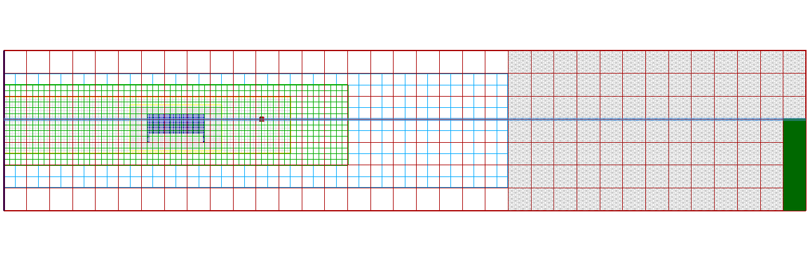{alt="Ein Bild, das Text, Reihe, Screenshot, Diagramm enthält. Automatisch generierte Beschreibung" width="6.6904286964129485in" height="2.156129702537183in"}

Figure 1 - FLOW-3D Hydro general set-up with view in Y-direction \[2\]

In these simulations, motions in the X-direction (Sway), Z-direction (Heave) and around the Y-axis of the FB (Roll) were considered. The other three motions were not considered as they had a limited impact due to a perpendicular wave attack. The individual element (FB) must be considered in the whole assembly.

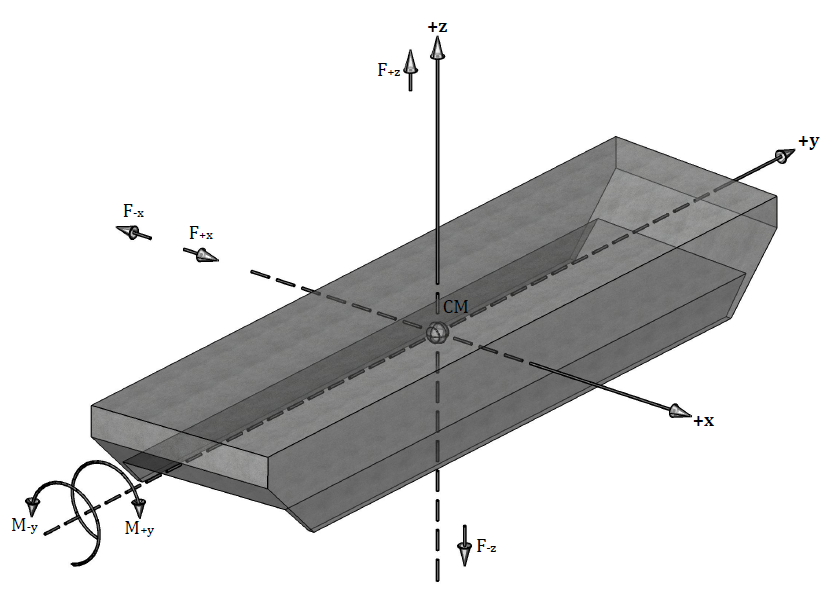{alt="Ein Bild, das Entwurf, Zeichnung, Reihe, Design enthält. Automatisch generierte Beschreibung" width="6.69375in" height="4.9222222222222225in"}

Simulations with steepness criteria or 50-year contour lines as limiting criteria are performed and for this, several combinations of wave peak period and wave height are evaluated. The following combinations are used to determine the breakwater motions and associated hydrodynamic forces to represent the conditions at the selected locations.

With reference to Deliverable D3.2 \[2\], this yields to the following wave parameters, also shown in [Figure 3](#_Ref149744563):

+-------+-------------------+-------+--------+------------------------+--------+
| T~p~  | S~P~              | H~s~  | U~10~  | x                      | L      |
+:=====:+:=======:+:=======:+:=====:+:======:+:==========:+:=========:+:======:+
| \(s\) | (-)     | (-)     | \(m\) | (m/s)  | \(m\)      | (km)      | \(m\)  |
+-------+---------+---------+-------+--------+------------+-----------+--------+
| 6.5   | 0.07    | 1/15    | 4.40  | 50.00  | 29,675.25  | 29.68     | 65.97  |
+-------+---------+---------+-------+--------+------------+-----------+--------+
| 9.1   | 0.06    | 1/17    | 7.00  | 50.00  | 75,107.81  | 75.11     | 129.29 |
+-------+---------+---------+-------+--------+------------+-----------+--------+
| 13.6  | 0.04    | 1/25    | 11.00 | 50.00  | 185,470.31 | 185.47    | 288.78 |
+-------+---------+---------+-------+--------+------------+-----------+--------+

: []{#_Ref150238756 .anchor}Table 2 - Wave parameters as input for simulations \[2\]

![[]{#_Ref149744563 .anchor}Figure 3 - Design wave parameters with reference to hindcast data, 50 years contour line and steepness criteria for Baltic Sea, Mediterranean Sea, and North Sea \[2\]](../images/2023-12-08_surewave_d3.3_final/image5.png){width="6.692361111111111in" height="4.072094269466317in"}

### Simulation results for mild conditions (e.g. Baltic Sea)

Figure 4 - XZ-Displacement of FB-CM in mild conditions ($H_{s} = 4.4\ m\ ;T_{p} = 6.5\ s$)

Figure 5 - Fluid forces on FB in X-direction including 33% quantile for mild conditions

Figure 6 - Fluid forces on FB in Z-direction including 33% quantile for mild conditions

[]{#_Ref151974960 .anchor}Figure 7 - Direction of CM motion at the point of maximum fluid forces

### Simulation results for mid conditions (e.g. Mediterranean Sea)

Figure 8 -- XZ-Displacement of FB-CM in mid conditions ($H_{s} = 7.0\ m\ ;T_{p} = 9.1\ s$)

Figure 9 - Fluid forces on FB in X-direction including 33% quantile for mid conditions

Figure 10 - Fluid forces on FB in Z-direction including 33% quantile for mid conditions

[]{#_Ref151982851 .anchor}Figure 11 - Direction of CM motion at the point of maximum fluid forces for mid conditions

### Simulation results for harsh conditions (e.g. North Sea)

Figure 12 - XZ-Displacement of FB-CM in harsh conditions $H_{s} = 11.0\ m\ ;T_{p} = 13.6\ s$

Figure 13 - Fluid forces on FB in X-direction including 33% quantile for harsh conditions

Figure 14 - Fluid forces on FB in Z-direction including 33% quantile for harsh conditions

[]{#_Ref149747055 .anchor}Figure 15 - Direction of CM motion at the point of maximum fluid forces for mid conditions

### Summary

The following tables summarize the output values of the FLOW-3D simulations as shown in the figures of sections [2.2.2](#simulation-results-for-mild-conditions-e.g.-baltic-sea) to [2.2.4](#simulation-results-for-harsh-conditions-e.g.-north-sea) for the related sea conditions for steepest wave height to peak period combinations:

Figure 16 -- Maximum fluid forces in X-direction

Figure 17 - Maximum fluid forces in Z-direction

It should be noted that the maximum forces in each direction do not occur simultaneously in terms of amplitude. The maximum resultants force therefore do not result directly from the respective maximum values of the individual directions.

The following nomenclature is to consider:

  ------------------------------------------------------------------------------------------------------------
  $$H_{s}$$                          ...   Significant wave height (m)
  ---------------------------------- ----- -------------------------------------------------------------------
  $$T_{p}$$                          ...   Wave peak period (s)

  $$\max{CM}_{+ X}$$                 ...   Maximum displacement of FB in pos. X-direction / sway motion (m)

  $$\max{CM}_{- X}$$                 ...   Maximum displacement of FB in neg. X-direction / sway motion (m)

  $$\max{CM}_{+ X;33\%}$$            ...   Mean value of the 33% highest values of ${CM}_{+ X}$ (m)

  $$\max{CM}_{- X;33\%}$$            ...   Mean value of the 33% highest values of ${CM}_{- X}$ (m)

  $$\max{CM}_{+ Z}$$                 ...   Maximum displacement of FB in pos. Z-direction / heave motion (m)

  $$\max{CM}_{- Z}$$                 ...   Maximum displacement of FB in neg. Z-direction / heave motion (m)

  $$\max{CM}_{+ Z;33\%}$$            ...   Mean values of the 33% highest values of ${CM}_{+ Z}$ (m)

  $$\max{CM}_{- Z;33\%}$$            ...   Mean values of the 33% highest values of ${CM}_{- Z}$ (m)

  $$\max\left| {CM}_{XZ} \right|$$   ...   Maximum displacement of FB in XZ-direction / resulting motion (m)

  $$\max F_{+ x}$$                   ...   Maximum fluid force on FB in pos. X-direction (kN)

  $$\max F_{- x}$$                   ...   Maximum fluid force on FB in neg. X-direction (kN)

  $$\max F_{+ x;33\%}$$              ...   Mean value of the 33% highest values of $F_{+ x}$ (kN)

  $$\max F_{- x;33\%}$$              ...   Mean value of the 33% highest values of $F_{- x}$ (kN)

  $$\max F_{+ Z}$$                   ...   Maximum fluid force on FB in pos. Z-direction (kN)

  $$\max F_{- Z}$$                   ...   Maximum fluid force on FB in neg. Z-direction (kN)

  $$\max F_{+ Z;33\%}$$              ...   Mean value of the 33% highest values of $F_{+ Z}$ (kN)

  $$\max F_{- Z;33\%}$$              ...   Mean value of the 33% highest values of $F_{- Z}$ (kN)

  $$\max\left| F_{XZ} \right|$$      ...   Maximum fluid force on FB in XZ-direction (kN) / resulting force
  ------------------------------------------------------------------------------------------------------------

# Floating breakwater layout

## General

Shape and size of a floating structure have a significant influence on the sizing of its anchorage. It is therefore necessary to assess the optimum breakwater layout for the SUREWAVE project in European seas. Layout in this context refers to the spatial arrangement and shape of the surrounding breakwater.

Various layouts (e.g. circular, rectangular, triangular) are examined or evaluated on the basis of rating criterion (chapter [3.2](#rating-criterion)). The best rated layout is then used as the basis for dimensioning the anchorage.

To ensure comparability of the different layouts in terms of effort and benefit, the layouts were uniformly sized to provide an equivalent solar area. With reference to the LCoE-calculations in the SUREWAVE project description, 10 MWp is set as the minimum plant size. The $P_{mpp}$ of each solar panels is given in the product specifications of Sunlit Sea \[3\] with 537 Wp. Therefore, a total of approx. 18,600 solar panels are required to meet the plant size requirements of the project description. In addition, an initial distance of 5m is chosen between the pontoons and the solar panels. This refers to the FB pontoons and the bridge pontoons.

It is also assumed that the specified waves can come from any direction, but the anchorage prevents the layout from rotating in the direction of the waves.

The following layouts are compared in this report. Detailed layout drawings are attached in Appendix A (chapter [7](#appendix-a---layout-drawings)).

+------------------------+-----------+---------------------------+------------+---------------------------+-----------+
|                        |           |                           |            |                           |           |
|                        +-----------+---------------------------+------------+---------------------------+-----------+
|                        | Circular  | Octagonal                 | Triangular | Ellipse                   | Square    |
+:=======================+:=========:+:=========================:+:==========:+:=========================:+:=========:+
| Outer dimensions       | D = 346 m | $$360\ m \bullet 360\ m$$ | a = 452 m  | $$493\ m \bullet 238\ m$$ | a = 309 m |
+------------------------+-----------+---------------------------+------------+---------------------------+-----------+
| Total area (m²)        | 94,025    | 107,245                   | 96,054     | 105,268                   | 95,119    |
+------------------------+-----------+---------------------------+------------+---------------------------+-----------+
| No. of FB pontoons     | 56 pcs.   | 64 pcs.                   | 72 pcs.    | 64 pcs.                   | 60 pcs.   |
+------------------------+-----------+---------------------------+------------+---------------------------+-----------+
| No. of bridge pontoons | 35 pcs.   | 69 pcs.                   | 21 pcs.    | 61 pcs.                   | 43 pcs.   |
+------------------------+-----------+---------------------------+------------+---------------------------+-----------+
| No. of pontoons total  | 91 pcs.   | 133 pcs.                  | 93 pcs.    | 125 pcs.                  | 103 pcs.  |
+------------------------+-----------+---------------------------+------------+---------------------------+-----------+
| No. of PV-panels       | 18,624    | 18,700                    | 18,723     | 18,828                    | 18,624    |
+------------------------+-----------+---------------------------+------------+---------------------------+-----------+

: Table 3 - Layout details

Each layout has advantages and disadvantages and the choice of the optimum layout for the SUREWAVE project must be made taking into account technical feasibility, and functionality in terms of wave attenuation and cost optimisation.

## Rating criterion

### Distribution of wave energy in terms of transmission and reflection

As already mentioned in the project description, the breakwater is intended to reduce the waves that are harmful to the PV modules and to withstand events with waves of large periods and 100% transmission without damage.

The performance of the breakwater is characterised by the transmission coefficient, which is the ratio of the transmitted wave height to the incident wave height. For waves with smaller periods or up to a transmission coefficient of 1.0, the reduction in wave height is due to the interaction between the breakwater and the incident wave. This interaction includes reflection, absorption, and dissipation of energy.

How these proportions are distributed is influenced by several factors. On the impact side, the wave parameters are decisive and, in general, the amount of reflection decreases, and the amount of transmission increases as the wave period increases.

The amount of reflection and absorption is also influenced by the geometry of the FB, its mechanical properties, and its anchorage. Considering the modular design of the FB pontoons, it is assumed that parameters such as draft, width, freeboard, mass, etc. remain unchanged for the different layouts. Given this context, the efficiency of these layouts can be assessed by considering impact directions, orientations of the FB concerning the wave impact direction, as well as the timing or phase shift during impact. Generally, when preparing for the anchorage design, the forces associated with the reflection should be kept as low as possible.

*This rating criterion is closely related to the design of the pontoon connections and anchoring and has a significant influence on the technical feasibility.*

### Concentration of forces with regards to pontoon connections

This category is related to the distribution of wave energy, as load transfer occurs through the connections between the pontoons. The aim is to achieve uniform load distribution and transfer to avoid load concentrations.

Wave forces act periodically arriving from different directions of impact. It is therefore advisable to avoid the simultaneous occurrence of similar effects over a large part of the overall system. For instance, when a linear system is aligned parallel to the wave front. As the sea is assumed to be open, waves can also approach from all directions. Consequently, the orientation parallel to the wave front cannot be excluded for straight/linear layouts. The distribution or concentration of forces in corners must also be considered.

*This rating criterion is essential, as technical feasibility depends fundamentally on the ability of the connections to absorb and distribute the forces acting on them.*

### Anchorage

Anchorage is related to the two previous categories of wave energy distribution and pontoon connections. The shape of the structure also determines the magnitude of the forces acting on it at any given time, and how they need to be transferred to the seabed via the anchorage.

Accordingly, the layout also influences the extent of the anchoring and its arrangement. Assuming that the waves can act from all directions and that the anchorage must be arranged equally in all directions, anchorage components can be designed identically for symmetrical arrangements.

Besides the wave conditions in a certain location, the anchorage also depends on other factors, such as water depths and soil conditions. But these factors are considered to be the same for all layouts.

*This rating criterion influences the technical feasibility and is a significant part of the total cost, especially for large water depths.*

### Design and production (pre-fabrication)

The project is based on the modular design of the FB pontoons, which applies to all layouts. In terms of cost optimisation, serial production is the objective. Minimising the number of different pontoon sizes and types reduces both design and production costs. The use of simple geometric shapes for the FB pontoons reduces formwork expenditures, while more complex structures increase them.

*This rating criterion is secondary, as it does not affect technical feasibility, but rather cost-effectiveness.*

### Transport and installation

What is common to all layouts is that the FBs are manufactured in a modular design and have same dimensions and weights. In this regard, the method of transport and installation is basically similar or varies only with the number of pontoons.

Additional work is required during installation if the square PV modules for rectangular layout have to be adapted to angled or round breakwater shapes.

*This rating criterion is secondary, as it does not affect technical feasibility, but rather cost-effectiveness.*

### Costs

The costs depend on the number of FB pontoons required and the additional formwork needed for different pontoon sizes and types. There are also additional costs for special or complex moulds.

The total costs should always be considered in relation to the total power generating area. However, as this has been chosen to be approximately the same for all layouts for the sake of comparability, a cost comparison can also be made using the number of FB pontoons and moorings.

*This rating criterion is secondary to technical feasibility, but holds importance in assessing the suitability of the overall project compared to other types of power generation.*

### Use of space

As the project is basically planned for offshore areas, the category of optimised space utilisation is of secondary importance for the time being. It would become interesting if several plants were planned in coastal bays or estuaries where space is limited.

Another aspect of systems in or on the water in terms of space utilization is the shaded area. However, since the total area of the PV modules is approximately the same for all layouts, the shaded area is also comparable.

*This rating criterion is therefore of minor significance.*

### Maintenance

For all layouts, gaps must be kept free at regular intervals to ensure accessibility to the PV modules. The arrangement of these gaps is less complex with straight layouts than with angled or round shapes.

*In principle, however, it is possible with all layouts, so that this is not an exclusion criterion.*

## Preferred option -- circular layout

The layouts were evaluated based on the criteria and ranked in direct comparison. The shape with lowest points is a better alternative.

  -------------------------------------------------------------------------------------
  ***Shape***                                                                 
  ----------------------------- ---------- ----------- ------------ --------- ---------
  ***Criteria***                 Circular   Octagonal   Triangular   Ellipse   Square

  Distribution of wave energy       1           3           4           2         5

  Concentration of forces           1           3           5           2         4

  Anchorage                         1           3           5           2         4

  Design and production             1           3           4           5         2

  Transport and installation        2           5           3           4         1

  Costs                             1           5           2           4         3

  Use of space                      1           5           3           4         2

  Maintenance                       3           2           5           4         1

  *Summary:*                       *11*       *29*         *31*       *27*      *22*

  ***Ranking**:*                  **1**       **4**       **5**       **3**     **2**
  -------------------------------------------------------------------------------------

  : Table 4 -- Ranking of layouts for the criteria

The circular layout was identified as the preferred option for the following main reasons:

#### Advantages

- The wave forces always act on the round shape with a time delay, resulting in less movements and forces.

- Waves with a shorter period are reflected in different directions, creating a diffuse wave pattern. This minimises the interaction between the incoming wave and the reflected wave.

- The concentration of forces is also minimised and reduced to the anchorage points. Due to the small angles between the pontoons, the force distribution in the connections between the pontoons is uniform.

- The anchorage can be scaled and adapted to local conditions.

- Compared to other layouts, the circular arrangement requires the fewest pontoons.

- The external breakwater pontoons are all of the same shape and size, which avoids the increased cost of changing formwork.

- Relative costs are low due to the small number of different pontoons and the small total number of pontoons.

#### Disadvantages

- The gables of the pontoons are not perpendicular to the sides. This makes the gables more difficult to form. However, as all FB pontoons can be the same, this disadvantage is almost negligible.

- The square PV-panels must be adapted to the round shape. This results in offsets for which the connection between the FB and FPV must be individually adjusted.

- In order to be able to carry out maintenance work and ensure accessibility to the PV-panels, corridors must be set up at regular intervals. Due to the round shape, setting up these corridors is also more complex than with straight layouts.

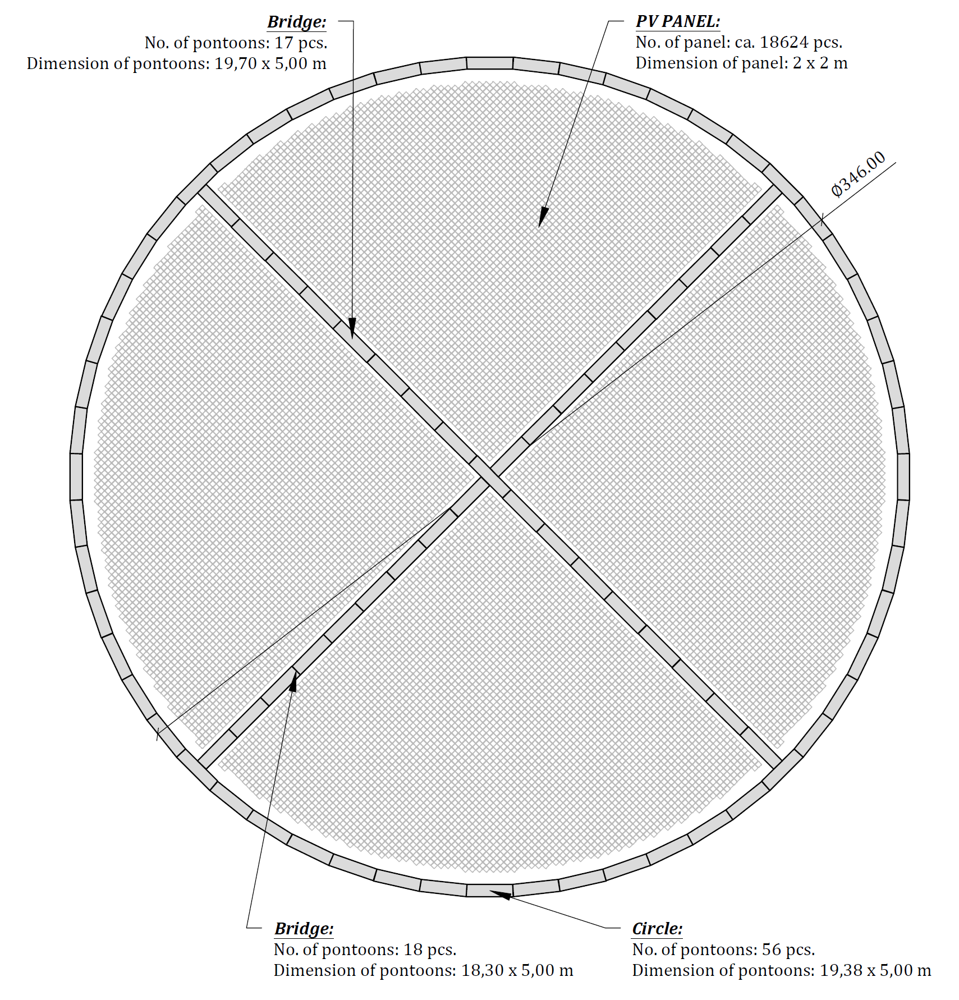{alt="Ein Bild, das Diagramm, Kreis, Text, Reihe enthält. Automatisch generierte Beschreibung" width="6.242739501312336in" height="6.509600831146106in"}

# Anchorage of the floating breakwater

## General

The main function of the anchoring system is to keep the floating breakwaters horizontally in position, while considering permissible displacements. The forces acting on the breakwaters are transferred to the seabed via anchor chains and/or anchor lines and the anchor points on the seabed.

Depending on the type of anchorage and especially in deep waters, it also has a damping effect on the FB.

Anchoring systems mainly consist of the typical components as shown in [Figure 19](#_Ref150180219). The components used for an anchorage depend on several factors such as water depth, ground conditions, size of the floating structure, wave parameters, service life, etc.

[]{#_Ref150180219 .anchor}Figure 19 - Typical components and configurations for the anchorage of floating structures

### Configuration

Within this report, multi-point anchoring with chains and driven anchor piles is planned due to the existing water depths at the reference locations.

#### Multi-point anchorage

Multi-point anchorage is required to hold a floating structure in a fixed position and prevent rotation. Depending on the shape and size of the structure, this can also result in greater anchoring forces than for single-point anchorages.

#### Single-point anchorage

Single-point anchorage is normally used for anchoring ships in open sea. The system allows the ship or floating structure to align itself with the direction of the waves to reduce anchoring forces. This type of anchorage is less suitable for permanent anchoring of floating structures.

#### Catenary line

When anchoring to chains, the connection between the FB and the anchor point is realised by chains. Because of its inherent weight, the chain forms a slack curve that follows a mathematical function known as the catenary. At low tensions, part of the chain rests on the sea bed to provide additional damping during dynamic loads. With large anchoring forces and great water depths, the weight of the chain becomes too high, leading to a reduced buoyancy reserve for the float.

#### Taut line

The taut line (taut leg anchoring system) is usually used when the weight of a chain would be too high at large water depths. A pre-tensioned polyester rope is usually used instead of the chain. The force absorption or damping of the floating structure is achieved via the elasticity of the rope which is an ability to expand and retract again in the elastic range. The ropes are tensioned at an angle of approx. 30° to 45° to the anchor point on the sea bed. This also requires that the anchor point is suitable for bearing vertical tensile (uplift) forces.

#### 

#### Combination

The system (semi taut leg anchoring system) is a combination of aforementioned chain and pre-tensioned rope. It is also suitable for very deep water.

### Anchor chains

#### Dimension

There are anchor chains available as stud link or studless chains. Although stud link chains are slightly heavier than studless chains, they also have a greater load-bearing capacity at equivalent diameter.

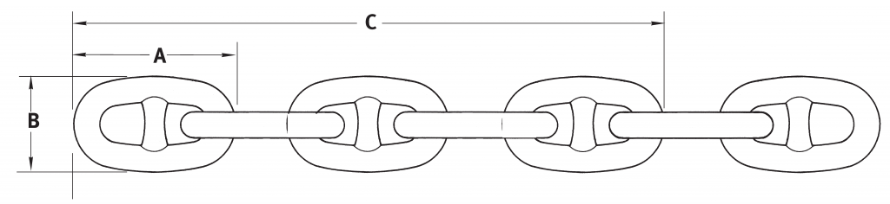{width="6.69375in" height="1.542361111111111in"}

![Figure 20 - Stud link chain geometrical parameters \[4\]](../images/2023-12-08_surewave_d3.3_final/image8.png){alt="Ein Bild, das Entwurf, Diagramm, Reihe, Zeichnung enthält. Automatisch generierte Beschreibung" width="6.69375in" height="1.9152777777777779in"}

The weight (*w*) can be calculated subject to link diameter (*D*) \[5\]:

  -----------------------------------------------------------------------
  $$w = 0.0219 \bullet D^{2}$$                                    (4‑1)
  --------------------------------------------------------------- -------

  -----------------------------------------------------------------------

#### Corrosion

Corrosion must be taken into account in the chain to ensure durability. Bureau Veritas \[6\] recommends decreasing the nominal chain diameter by 0.4 mm/year in the splash zone area and at the bottom area to determine the minimum breaking strength.

The breakwater pontoons are designed according to EUROCODE standards, which implements a design life of minimum 50 years. The PV-panels are intended for a design life of 20 years. Therefore, the breakwater pontoons could be used for two generations of PV-panels. Accordingly, the anchor chains should be considered for a minimum design life of 40 years. This results in a total diameter reduction of 16 mm due to the corrosion. The chains are initially chosen according to the required break / prove load (see chapters [4.4](#anchor-chains-for-mild-conditions-e.g.-baltic-sea) to [4.6](#anchor-chains-for-harsh-conditions-e.g.-north-sea)). The final selection considers the additional 16 mm to compensate for the corrosion, which are added to the nominal diameter from 54 mm 🡪 70 mm and from 95 mm to 111 mm with the properties of [Table 5](#_Ref151387346). The maximum dead load of the chain is considered non-corroded.

#### Proof and breaking loads

The proof and break loads of stud link chains can be calculated as a function of link diameter (*D*) by following equations \[7\]:

  -------------------------------------------------------------------------
  $$R_{proof} = 0.0216 \bullet D² \bullet (44 - 0.08 \bullet D)$$    (4‑2)
  ----------------------------------------------------------------- -------
  $$R_{break} = 0.0274 \bullet D² \bullet (44 - 0.08 \bullet D)$$    (4‑3)

  -------------------------------------------------------------------------

The results for chosen chains are summarized in [Table 5](#_Ref151387346).

#### Axial Stiffness

The axial stiffness for a stud link chain was calculated by the following equation subject to Young's modulus (*E*) and the cross section (*A*) \[5\]:

  ---------------------------------------------------------------------------------------------------------------------------------------------------------------------------
  $$E \bullet A = 6.4 \bullet 10^{7}\frac{kN}{m^{2}} \bullet 2\left( \frac{\pi \bullet D^{2}}{4} \right) \approx 1.0 \bullet 10^{8}\frac{kN}{m^{2}} \bullet D^{2}$$   (4‑4)
  ------------------------------------------------------------------------------------------------------------------------------------------------------------------- -------

  ---------------------------------------------------------------------------------------------------------------------------------------------------------------------------

  -------------------------------------------------------------------------------------------------
     A        B        C         D      Weight   Proof load   Break load       Axial Stiffness
  -------- -------- -------- --------- -------- ------------ ------------ -------------------------
   \(mm\)   \(mm\)   \(mm\)   \(mm\)    (kg/m)      (kN)         (kN)               (kN)

    324      194      1188    **54**      64       2,499        3,170      $$2.93 \bullet 10^{5}$$

    420      252      1540    **70**     107       4,064        5,156      $$4.93 \bullet 10^{5}$$

    570      342      2090    **95**     198       7,096        9,001      $$9.07 \bullet 10^{5}$$

    666      400      2442    **111**    270       9,347        11,856     $$1.24 \bullet 10^{6}$$
  -------------------------------------------------------------------------------------------------

  : []{#_Ref151387346 .anchor}Table 5 - Stud link chain geometrical parameters, weights, loads, and axial stiffnesses \[4\] \[5\]

Depending on the tensile strength of steels, chains are divided into different grades. In this design, grade R4 will be used.

#### Marine growth

Marine growth at the anchor chains will be considered as additional weight. Assumptions of Deliverable D2.1 \[1\] were considered with 60 mm thickness and a dry density of 1325 kg/m³.

  ------------------------------------------------------------------------------------
   Chain Ø    Weight    Under bouyancy   Surface area   Marine growth   Total weight
  --------- ---------- ---------------- -------------- --------------- ---------------
    70 mm    107 kg/m     0.94 kN/m       0.65 m²/m       0.12 kN/m     **1.06 kN/m**

   111 mm    270 kg/m     2.35 kN/m       1.03 m²/m       0.19 kN/m     **2.55 kN/m**
  ------------------------------------------------------------------------------------

  : Table 6 - Total chain weights including marine growth

### Upper attachment point

The upper attachment point on FB pontoons is designed as a steel component to which the anchor chain is connected with a shackle. For optimum load distribution between the outer and inner anchor chain, the upper attachment point should be arranged across the entire width of the pontoon. The exact dimensions can only be determined once the material specifications from work package WP4 have been finalised.

In the longitudinal direction, the attachment point has been chosen in the centre of the pontoon to minimise shear forces in the couplings.

The dead weight of the chains has to be absorbed by additional buoyancy in the pontoon. This is achieved by adjusting the ratio between the height of the buoyancy body and the height of the keels. The overall height of the pontoon remains constant.

The principle of the attachment point is shown in the following sketch.

Attachment point (outside)

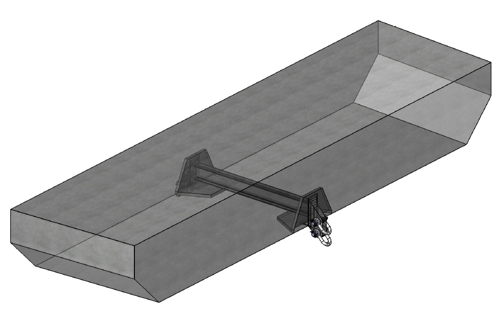{alt="Ein Bild, das Design enthält. Automatisch generierte Beschreibung mit geringer Zuverlässigkeit" width="6.69241469816273in" height="3.9391305774278216in"}

Figure 21 - Upper attachment point at FB pontoon

### Driven anchor pile

Driven piles usually consist of circular tubes or joined sheet pile sections that are driven or vibrated into the seabed. Horizontal forces are transmitted into the ground by soil pressure across the width of the pile in the direction of the force, and vertical forces by surface friction.

The piles have the advantage that only a small amount of material is required, installation can be carried out with relatively low effort and the impact on the environment is minimal.

The design of the driven anchor piles is included in chapter [4.7](#design-of-driven-anchor-piles), considering soil conditions for medium dense sand.

## General catenary line equations

### Nomenclature

  ----------------------------------------------------------------------------------------------------------------------------------------
  $$d$$                                  ...   Horizontal length of the undeformed catenary (m)
  -------------------------------------- ----- -------------------------------------------------------------------------------------------
  $$D_{eff}$$                            ...   Effective diameter of the chain (mm)

  $$h$$                                  ...   Water depth or vertical projection of the catenary (m)

  $$l$$                                  ...   Horizontally projected length of the suspended portion of the catenary (m)

  $$l'$$                                 ...   Horizontal distance between anchor and attachment points (m)

  $$l_{eff}$$                            ...   Length of the suspended catenary (m)

  $$l_{T}$$                              ...   Total length of the catenary (m)

  $$P$$                                  ...   Vertical force per unit catenary length (kN)

  $$s$$                                  ...   Arclength coordinate of the suspended portion of the catenary

  $$T(s)$$                               ...   Tension distribution of the catenary (kN)

  $$T_{O}$$                              ...   Horizontal tension of the catenary (kN)

  $$T_{V}$$                              ...   Vertical tension of the catenary (kN)

  $$\left( x(s),y(s) \right)$$           ...   Horizontal geometric distribution of catenary line for $0 \leq s \leq l_{eff}$

  $$(x,y,z)$$                            ...   Reference frame of catenary line at the point of contact with sea floor

  $$(X,Y,Z)$$                            ...   Rererence coordinate frame of the floating structure

  $$\left( x_{c},y_{c} \right)$$         ...   Horizontal geometric distribution of the catenary from $\left( x_{m},y_{m},z_{m} \right)$

  $$\left( x_{0},y_{0},z_{0} \right)$$   ...   Coordinates of zero slope of the catenary

  $$\left( x_{m},y_{m},z_{m} \right)$$   ...   Coordinates of the anchor point at the sea floor

  $$\left( x_{p},y_{p} \right)$$         ...   Body fixed coordinates of the its fairlead

  $$\left( x_{T},y_{T},z_{T} \right)$$   ...   Coordinates of the upper attachment point of the catenary

  $$z(s)$$                               ...   Vertical geometric distribution

  $$\theta(s)$$                          ...   Angle of the catenary with respect to the horizontal plane at point $s$ (°)

  $$\theta_{l}$$                         ...   Angle between upper endpoint of anchor line and horizontal plane (°)
  ----------------------------------------------------------------------------------------------------------------------------------------

### General \[8\]

The catenary line is the sum of an exponential function and its reciprocal (or its reflection on the y-axis). The y-axis passes through the lowest point of the chain.

  ------------------------------------------------------------------------------------------------------------------
  $$y = \frac{\left( e^{a \bullet x} + e^{- a \bullet x} \right)}{2 \bullet a}$$   []{#_Ref150498218 .anchor}(4‑5)
  -------------------------------------------------------------------------------- ---------------------------------

  ------------------------------------------------------------------------------------------------------------------

The equation [(4‑5)](#_Ref150498218) assumes that the lowest point of the curve lies on the y-axis and crosses it at $y = 1/a$, which is of course rarely the case with freely given coordinates. In addition to the parameter $a$, suitable offset parameters must therefore be found in order to calculate the curve based on a given length and given end points.

The general equation for the catenary line is given as:

  ------------------------------------------------------------------------------------------------------
  $$y = \frac{\left( e^{a \bullet (x - b)} + e^{a \bullet (b - x)} \right)}{2 \bullet a} + c$$   (4‑6)
  ---------------------------------------------------------------------------------------------- -------

  ------------------------------------------------------------------------------------------------------

The two constants b and c can be found by explicit equations using the given boundary conditions. Further details are explained in \[8\].

The shape of the curve depends on the position of the attachment points and the length of the chain, but not on its weight per unit length. However, the weight of the chain influences the tension forces in the attachment points.

### Catenary mooring lines according to GARZA-RIOS \[9\]

More detailed relations between parameters are given in GARZA-RIOS et. al. \[9\]. Here a brief description of the equation is given as follows:

The total length of the catenary is:

  -----------------------------------------------------------------------
  $$l_{T} = l_{eff} + d$$                                         (4‑7)
  --------------------------------------------------------------- -------

  -----------------------------------------------------------------------

and the total horizontally projected length of the catenary is:

  -----------------------------------------------------------------------
  $$l' = l + d$$                                                  (4‑8)
  --------------------------------------------------------------- -------

  -----------------------------------------------------------------------

The x-y-plane, the total horizontally projected length of the catenary can also be described as follows:

  ---------------------------------------------------------------------------------------------
  $$l' = \sqrt{\left( x_{m} - x_{T} \right)^{2} + \left( y_{m} - y_{T} \right)^{2}}$$   (4‑9)
  ------------------------------------------------------------------------------------- -------

  ---------------------------------------------------------------------------------------------

The relation between suspended length of the catenary $l_{eff}$ and the horizontal tension $T_{0}$ is described by:

  --------------------------------------------------------------------------------------
  $$l_{eff} = \sqrt{h \bullet \left( h + 2 \bullet \frac{T_{0}}{P} \right)}$$   (4‑10)
  ----------------------------------------------------------------------------- --------

  --------------------------------------------------------------------------------------

{alt="Ein Bild, das Text, Reihe, Diagramm, parallel enthält. Automatisch generierte Beschreibung" width="6.693436132983377in" height="4.4345713035870515in"}

As the horizontal tension and the suspended length of the catenary influence each other, the values can only be determined iteratively using one of the following equations:

  ------------------------------------------------------------------------------------------------------------------------------------------------------------------------------------------------------------
  $$\sinh\left( \alpha \bullet \left( \sqrt{h \bullet \left( h + \frac{2}{\alpha} \right)} + l' - l_{T} \right) \right) - \alpha \bullet \sqrt{h \bullet \left( h + \frac{2}{\alpha} \right)} = 0$$   (4‑11)
  --------------------------------------------------------------------------------------------------------------------------------------------------------------------------------------------------- --------

  ------------------------------------------------------------------------------------------------------------------------------------------------------------------------------------------------------------

or

  -------------------------------------------------------------------------------------------------------------------------------------------------------------------
  $$\cosh\left( \sqrt{(\alpha \bullet h)^{2} + 2 \bullet \alpha \bullet h} - \alpha \bullet \left( l_{T} - l' \right) \right) - \alpha \bullet h - 1 = 0$$   (4‑12)
  ---------------------------------------------------------------------------------------------------------------------------------------------------------- --------

  -------------------------------------------------------------------------------------------------------------------------------------------------------------------

The tension $T(s)$ along the catenary for $0 \leq s \leq l_{eff}$ can be determined in relation to the horizontal tension $T_{0}$ of the catenary line and the vertical tension $T_{V}$.

  ------------------------------------------------------------------------
  $$T_{V}(s) = P \bullet s$$                                       (4‑13)
  --------------------------------------------------------------- --------
  $$T(s) = \sqrt{T_{0}^{2} + T_{V}(s)^{2}}$$                       (4‑14)

  ------------------------------------------------------------------------

The vertical tenson in the upper end of the catenary $\left( s = l_{eff} \right)$ is:

  -----------------------------------------------------------------------------------------------------------------------------------------------------------------------------
  $$T_{V}\left( s = l_{eff} \right) = P \bullet \sqrt{h \bullet \left( h + 2\frac{T_{0}}{P} \right)} = T_{0} \bullet \sinh\left( \frac{P \bullet l}{T_{0}} \right)$$   (4‑15)
  -------------------------------------------------------------------------------------------------------------------------------------------------------------------- --------

  -----------------------------------------------------------------------------------------------------------------------------------------------------------------------------

The total tension at the upper attachment point of the catenary becomes to:

  --------------------------------------------------------------------------------------------------------------------------------------------------------------------------------------------------------------------
  $$T\left( s = l_{eff} \right) = \sqrt{T_{0}^{2} + P^{2} \bullet h \bullet \left( h + 2\frac{T_{0}}{P} \right)} = \sqrt{T_{0}^{2} + T_{0}^{2} \bullet \sinh^{2}\left( \frac{P \bullet l}{T_{0}} \right)}$$   (4‑16)
  ----------------------------------------------------------------------------------------------------------------------------------------------------------------------------------------------------------- --------

  --------------------------------------------------------------------------------------------------------------------------------------------------------------------------------------------------------------------

which can be reduced to:

  ------------------------------------------------------------------------------------------------------------------------------
  $$T\left( s = l_{eff} \right) = T_{0} + P \bullet h = T_{0} \bullet \cosh\left( \frac{P \bullet l}{T_{0}} \right)$$   (4‑17)
  --------------------------------------------------------------------------------------------------------------------- --------

  ------------------------------------------------------------------------------------------------------------------------------

The inclination at the upper end is given by:

  ----------------------------------------------------------------------------------------------------
  $$\phi\left( l_{eff} \right) = \tan^{- 1}\left( \frac{P \bullet l_{eff}}{T_{0}} \right)$$   (4‑18)
  ------------------------------------------------------------------------------------------- --------

  ----------------------------------------------------------------------------------------------------

## Design

### Design approach

The following assumptions are made when designing the anchorage:

- The shape of the system is a circular layout with a total diameter of 346 meters (see chapter [3.3](#preferred-option-circular-layout)).

- Anchor points outside the layout are selected in the required number according to structural requirements. A uniform spacing is maintained.

- Anchor chains are also arranged on the opposite side (inwards) to balance the tension of the chains from the outside.

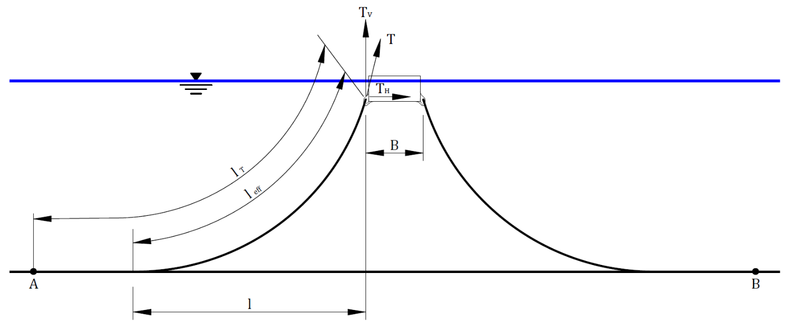{alt="Ein Bild, das Reihe, Diagramm, parallel enthält. Automatisch generierte Beschreibung" width="6.692557961504812in" height="2.765217629046369in"}

- The load capacity of the chains is always determined according to the maximum forces given in section [2.2](#results-from-cfd-simulations). The forces are applied in the direction of pull of the chains. To be on the safe side, the effective width of the circular layout for an anchorage point is assumed to be straight and the above forces are scaled up accordingly.

- The water depths from section [2.1](#environmental-conditions) are selected for the respective location. Because of variations in water depths at these sites, it demonstrates that the design approach can be extended or adapted to different locations as well.

- The displacements from section [2.2](#results-from-cfd-simulations) are used to determine the required chain length. It is assumed that the chains must be able to follow these displacements. As these displacements have been determined on the unanchored system, it is expected that they will be lower when an anchorage is taken into account. The approach is therefore on the safe side.

- The chain length is also selected in such a way that even with the greatest displacements at the anchor point, the catenary line only introduces horizontal forces.

## Anchor chains for mild conditions (e.g. Baltic Sea)

The forces $F_{+ X}$ and $F_{+ Z}$ (see [Figure 7](#_Ref151974960)) act in the tensile direction of the chains. With the respective force components, $F_{+ X}$ is the maximum resultant.

8 anchor points are selected. 9 pontoons are taken into account as the effective width.

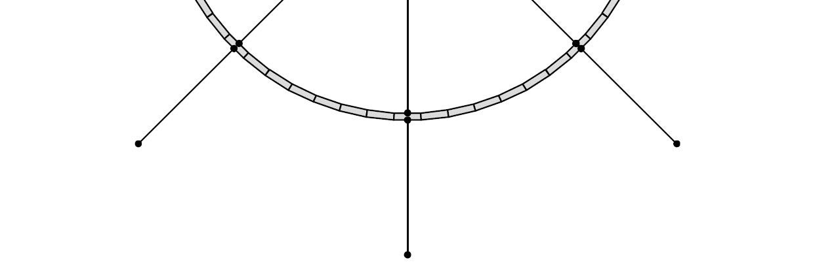{alt="Ein Bild, das Diagramm, Reihe enthält. Automatisch generierte Beschreibung" width="6.6930555555555555in" height="2.196346237970254in"}

Therefore, the force to be transferred is

+-----------------+-----------------+-----------------+-------------+-------------+
| $$T_{\max}$$    | No. pontoons    | Total force     | Chain Ø     | Proof load  |
+:===============:+:===============:+:===============:+:===========:+:===========:+
| 272 kN          | 9 pcs.          | 2448 kN         | 54 mm       | 2499 kN     |
+-----------------+-----------------+-----------------+-------------+-------------+
| Including allowance of 16 mm for corrosion:         | **70 mm**   | **4064 kN** |
+-----------------------------------------------------+-------------+-------------+

: Table 9 - Proof load of anchors chains for mild conditions (e.g. Baltic Sea - 54°12\'N 14°24\'E)

The catenary lines were determined numerically using an iterative procedure. The approaches of chapter [4.2.2](#general-8) and [4.2.3](#catenary-mooring-lines-according-to-garza-rios-9) were used for comparison. The following catenary lines were obtained for the assumed displacements.

  -------------------------------------------------------------------------
   Condition   $$l_{T}$$   $$l_{eff}$$     $$l$$      $$l'$$       $$d$$
  ----------- ----------- ------------- ----------- ----------- -----------
   Unloaded    101.00 m      30.26 m      24.26 m     95.00 m     70.74 m

    Loaded     101.00 m      94.01 m      92.05 m     99.04 m     6.99 m
  -------------------------------------------------------------------------

  : Table 10 - Catenary line values for mild conditions (e.g. Baltic Sea - 54°12\'N 14°24\'E)

Figure 23 - Catenary line for mild conditions (e.g. Baltic Sea - 54°12\'N 14°24\'E)

The following figures [Figure 24](#_Ref150508127), [Figure 25](#_Ref150508136), and [Figure 26](#_Ref150508143) represent the comparison between the two approach of determining the catenary lines.

[]{#_Ref150508127 .anchor}Figure 24 - Catenary line -- unloaded (luv+lee)

[]{#_Ref150508136 .anchor}Figure 25 - Catenary line - loaded (luv)

[]{#_Ref150508143 .anchor}Figure 26 - Catenary line - loaded (lee)

Considering the chain capacities of [4.4](#anchor-chains-for-mild-conditions-e.g.-baltic-sea) and the aforementioned catenary lines, this yields to the following layout:

{alt="Ein Bild, das Diagramm, Kreis, Reihe enthält. Automatisch generierte Beschreibung" width="6.692913385826771in" height="4.788788276465442in"}

## Anchor chains for mid conditions (e.g. Mediterranean Sea)

The forces $F_{+ X}$ and $F_{XZ}$ (see [Figure 11](#_Ref151982851)) act in the tensile direction of the chains. With the respective force components, $F_{+ X}$ is the maximum resultant.

8 anchor points are selected. 9 pontoons are taken into account as the effective width.

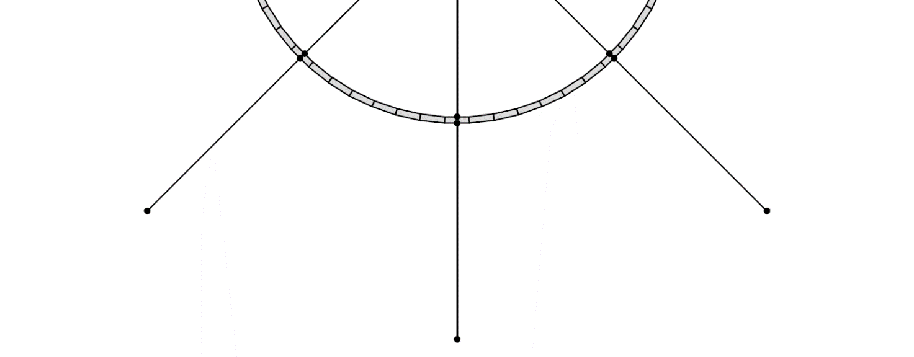{alt="Ein Bild, das Reihe, Diagramm, Kreis enthält. Automatisch generierte Beschreibung" width="6.692711067366579in" height="2.616123140857393in"}

Therefore, the force to be transferred is

+-----------------+-----------------+-----------------+-------------+-------------+
| $$T_{\max}$$    | No. pontoons    | Total force     | Chain Ø     | Proof load  |
+:===============:+:===============:+:===============:+:===========:+:===========:+
| 729 kN          | 9 pcs.          | 6561 kN         | 95 mm       | 7096 kN     |
+-----------------+-----------------+-----------------+-------------+-------------+
| Including allowance of 16 mm for corrosion:         | **111 mm**  | **9347 kN** |
+-----------------------------------------------------+-------------+-------------+

: Table 12 - Proof load of anchors chains for mid conditions (e.g. Mediterranean Sea - 39°00\'N 00°00\'E)

The catenary lines were determined numerically using an iterative procedure. The approaches of chapter [4.2.2](#general-8) and [4.2.3](#catenary-mooring-lines-according-to-garza-rios-9) were used for comparison. The following catenary lines were obtained for the assumed displacements.

  -------------------------------------------------------------------------
   Condition   $$l_{T}$$   $$l_{eff}$$     $$l$$      $$l'$$       $$d$$
  ----------- ----------- ------------- ----------- ----------- -----------
   Unloaded    184.40 m      63.68 m      47.28 m    168.00 m    120.72 m

    Loaded     184.40 m     182.19 m     176.37 m    178.58 m     2.21 m
  -------------------------------------------------------------------------

  : Table 13 - Catenary line values for mid conditions (e.g. Mediterranean Sea - 39°00\'N 00°00\'E)

Figure 28 - Catenary line for mid conditions (e.g. Mediterranean Sea - 39°00\'N 00°00\'E)

The following figures [Figure 29](#_Ref150508877), [Figure 30](#_Ref150508887), and [Figure 31](#_Ref150508895) represent the comparison between the two approach of determining the catenary lines.

[]{#_Ref150508877 .anchor}Figure 29 - Catenary line -- unloaded (luv+lee)

[]{#_Ref150508887 .anchor}Figure 30 - Catenary line - loaded (luv)

[]{#_Ref150508895 .anchor}Figure 31 - Catenary line - loaded (lee)

Considering the chain capacities of [4.4](#anchor-chains-for-mild-conditions-e.g.-baltic-sea) and the aforementioned catenary lines, this yields to the following layout:

{alt="Ein Bild, das Diagramm, Kreis, Reihe enthält. Automatisch generierte Beschreibung" width="6.692913385826771in" height="6.051952099737533in"}

## Anchor chains for harsh conditions (e.g. North Sea)

The forces $F_{+ X}$ and $F_{XZ}$ (see [Figure 15](#_Ref149747055)) act in the tensile direction of the chains. With the respective force components, $F_{+ X}$ is the maximum resultant.

14 anchor points are selected. 5 pontoons are taken into account as the effective width.

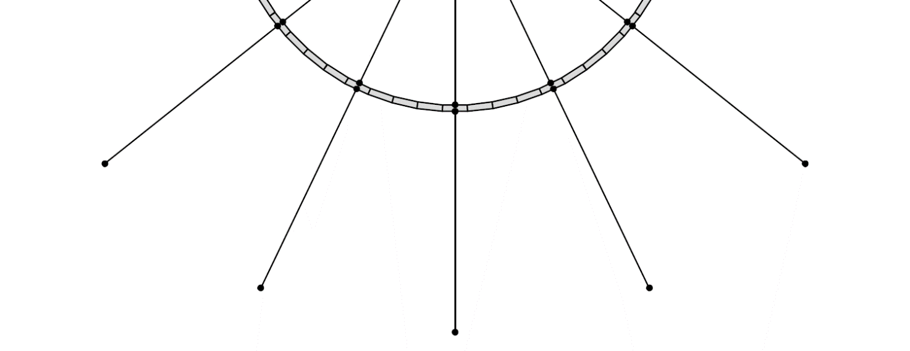{alt="Ein Bild, das Reihe, Kreis, Diagramm enthält. Automatisch generierte Beschreibung" width="6.6930555555555555in" height="2.5823370516185475in"}

Therefore, the force to be transferred is

+-----------------+-----------------+-----------------+-------------+-------------+
| $$T_{\max}$$    | No. pontoons    | Total force     | Chain Ø     | Proof load  |
+:===============:+:===============:+:===============:+:===========:+:===========:+
| 1313 kN         | 5 pcs.          | 6565 kN         | 95 mm       | 7096 kN     |
+-----------------+-----------------+-----------------+-------------+-------------+
| Including allowance of 16 mm for corrosion:         | **111 mm**  | **9347 kN** |
+-----------------------------------------------------+-------------+-------------+

: Table 15 - Proof load of anchors chains for harsh conditions (e.g. North Sea - 56°54\'N 05°00\'E)

The catenary lines were determined numerically using an iterative procedure. The approaches of chapter [4.2.2](#general-8) and [4.2.3](#catenary-mooring-lines-according-to-garza-rios-9) were used for comparison. The following catenary lines were obtained for the assumed displacements.

  -------------------------------------------------------------------------
   Condition   $$l_{T}$$   $$l_{eff}$$     $$l$$      $$l'$$       $$d$$
  ----------- ----------- ------------- ----------- ----------- -----------
   Unloaded    192.30 m      73.29 m      48.99 m    168.00 m    119.01 m

    Loaded     192.30 m     191.17 m     181.60 m    182.73 m     1.13 m
  -------------------------------------------------------------------------

  : Table 16 - Catenary line values for harsh conditions (e.g. North Sea - 56°54\'N 05°00\'E)

Figure 33 - Catenary line for harsh conditions (e.g. North Sea - 56°54\'N 05°00\'E)

The following figures [Figure 34](#_Ref150509717), [Figure 35](#_Ref150509726), and [Figure 36](#_Ref150509734) represent the comparison between the two approach of determining the catenary lines.

[]{#_Ref150509717 .anchor}Figure 34 - Catenary line - unloaded (luv+lee)

[]{#_Ref150509726 .anchor}Figure 35 - Catenary line - loaded (luv)

[]{#_Ref150509734 .anchor}Figure 36 - Catenary line - loaded (lee)

Considering the chain capacities of [4.4](#anchor-chains-for-mild-conditions-e.g.-baltic-sea) and the aforementioned catenary lines, this yields to the following layout:

{alt="Ein Bild, das Diagramm, Kreis, Reihe enthält. Automatisch generierte Beschreibung" width="6.574803149606299in" height="5.932194881889764in"}

## Design of driven anchor piles

The soil conditions are unknown and were therefore assumed to be normal medium-dense sand with the following soil parameters:

- Density of soil $\gamma_{k} = 18.0\frac{kN}{m³}$

- Density of soil under buoyancy ${\gamma'}_{k} = 10.5\frac{kN}{m³}$

- Angle of friction $\varphi_{k} = 32.5{^\circ}$

The design was executed with GGU-Software "LATPILE" by Civilserve GmbH.

Corrosion must be taken into account at the pile to ensure durability. Bureau Veritas \[6\] recommends for steel structures under the mudline a minimum corrosion margin of 0.1 mm/year per metal face exposed to the soil. With reference to chapter [4.1.2](#anchor-chains), a reduction of wall thicknesses is expected with 8 mm in total.

### Driven anchor pile for mild conditions (e.g. Baltic Sea)

  ---------------------------------------------------------------------------------
    Pile Ø     $$t_{wall}$$   $$t_{wall,red}$$     $$L$$       Grade       $$m$$
  ----------- -------------- ------------------ ----------- ----------- -----------
    2540 mm       35 mm            27 mm          11.2 m       S235       24.2 t

  ---------------------------------------------------------------------------------

  : Table 17 - Driven anchor pile parameters for mild conditions (e.g. Baltic Sea)

{width="6.6930555555555555in" height="4.641666666666667in"}

### Driven anchor pile for mid conditions (e.g. Mediterranean Sea)

  ---------------------------------------------------------------------------------
    Pile Ø     $$t_{wall}$$   $$t_{wall,red}$$     $$L$$       Grade       $$m$$
  ----------- -------------- ------------------ ----------- ----------- -----------
    3048 mm       50 mm            42 mm          15.8 m       S235       58.4 t

  ---------------------------------------------------------------------------------

  : Table 18 - Driven anchor pile parameters for mid conditions (e.g. Mediterranean Sea) -- outer piles

{width="6.6930555555555555in" height="4.635416666666667in"}

  ---------------------------------------------------------------------------------
    Pile Ø     $$t_{wall}$$   $$t_{wall,red}$$     $$L$$       Grade       $$m$$
  ----------- -------------- ------------------ ----------- ----------- -----------
    6096 mm       60 mm            52 mm          21.5 m       S235       192.0 t

  ---------------------------------------------------------------------------------

  : Table 19 - Driven anchor pile parameters for mid conditions (e.g. Mediterranean Sea) -- centre pile

#### Note:

Due to the high weight, the central pile must be divided into several individual piles. These have the same dimensions as the outer ones.

{width="6.6930555555555555in" height="4.632638888888889in"}

### Driven anchor pile for harsh conditions (e.g. North Sea)

  ---------------------------------------------------------------------------------
    Pile Ø     $$t_{wall}$$   $$t_{wall,red}$$     $$L$$       Grade       $$m$$
  ----------- -------------- ------------------ ----------- ----------- -----------
    3048 mm       50 mm            42 mm          15.8 m       S235       58.4 t

  ---------------------------------------------------------------------------------

  : Table 20 - Driven anchor pile parameters for harsh conditions (e.g. North Sea) -- outer piles

{width="6.6930555555555555in" height="4.636805555555555in"}

  ---------------------------------------------------------------------------------
    Pile Ø     $$t_{wall}$$   $$t_{wall,red}$$     $$L$$       Grade       $$m$$
  ----------- -------------- ------------------ ----------- ----------- -----------
    6096 mm       80 mm            72 mm          24.5 m       S235       290.8 t

  ---------------------------------------------------------------------------------

  : Table 21 - Driven anchor pile parameters for harsh conditions (e.g. North Sea) -- centre pile

#### Note:

Due to the high weight, the central pile must be divided into several individual piles. These have the same dimensions as the outer ones.

{width="6.6930555555555555in" height="4.669444444444444in"}

## Functional considerations for FB to FPV connections

Floating solar systems do not have a separate connection to the seabed. They therefore need to be anchored horizontally in some other way. In the SUREWAVE project, a connection is planned between the FB and the FPV, which transfers the forces from the FPV via the FB and its anchorage into the seabed.

Due to the difference in size and mass distribution between the FB and FPV, and the fact that wave loads act with a phase shift, different movement behaviours are expected. This means that different directions of movement are also possible, towards and away from each other. This approach has been confirmed by initial tests in the wave channel without the influence of an anchorage or connection.

In principle, two types of connections are possible:

- a compression and tension resistant connection (rigid and hinged) to enforce uniform movement behaviour in the horizontal direction

- an elastic connection which, due to its elasticity, allows a linear load transfer depending on the amount of movement

The first option inevitably results in large forces being transmitted, which should be excluded due to the limited mounting options on the FPV modules. In addition, a rigid connection adds a weight that may not be supported by the buoyancy of the outer FPV modules.

With an elastic connection, shear forces can occur in the PV connections due to uneven movements of the FB. A load distribution in the form of a transition element must therefore be arranged. This transition element should be floatable in order to avoid vertical force transmission. Accordingly, a round tube of the required diameter is suitable. The wall thickness must be selected according to static requirements in order to be able to attach rope connections.

Another advantage of the transition element is that rope connections to the breakwater can be arranged with a larger diameter and in smaller quantity, while smaller ropes in larger quantity are required for the PV modules. The surrounding breakwater and the surrounding transition element allow all ropes to be pre-tensioned.

The principle setup is shown in the following sketch:

Polypropylen Multifilament rope Ø30 mm with thimble

Floating PV

Polypropylen Multifilament rope Ø16 mm with thimble

Transition element

Pipe Ø219 mm

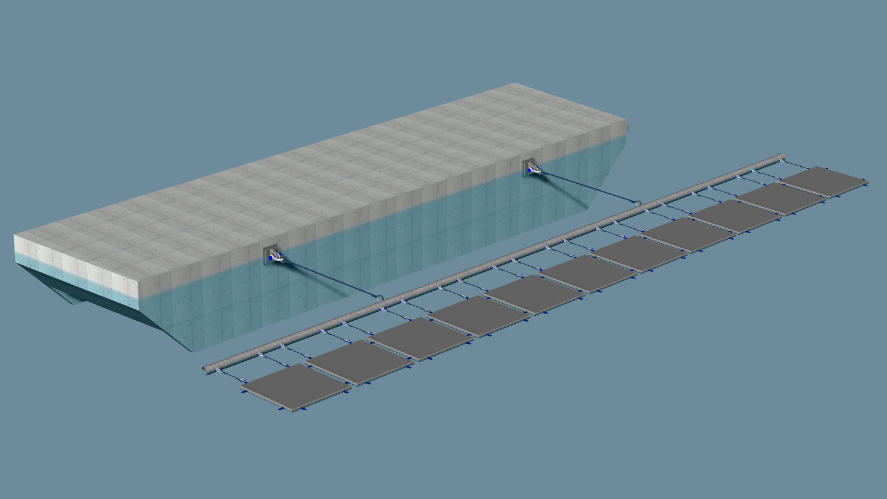{width="6.675308398950131in" height="3.754861111111111in"}

Figure 43 - Principle connection between FB and FPV

As described above, the PV arrays need to be subdivided to improve accessibility. As the forces in the connections between the individual PV modules also increase as the array size increases, this subdivision also helps to limit the forces.

For an initial sizing of the connections between FB and FPV, a PV array of 20 x 14 modules was selected, as 14 modules are standard in a string \[3\]. This PV array is completely surrounded by a closed transition element, which is then connected to the FB or the neighbouring PV array. The ropes between FB and transition element are pre-tensioned with $3\ kN \approx 300\ kg$.

{width="6.6930555555555555in" height="3.2180555555555554in"}

The following load assumptions have been simulated to check the behaviour of the rope connections and the required stiffness of the transition element:

- 5 kN applied on all outer PV panels in y-direction parallel to the string direction of 14 elements.

  {width="6.6930555555555555in" height="3.1840277777777777in"}

Figure 45 - 5 kN applied on all outer PV panels in y-direction parallel to the string direction of 14 elements (abstract from Dlubal RFEM 5.26.02)

- 5 kN applied on all outer PV panels in x-direction perpendicular to the string direction of 14 elements

{width="6.6930555555555555in" height="3.1840277777777777in"}

- Relative movement of the FB by 1 m away from the PV array in y-direction parallel to the string direction of 14 elements

{width="6.6930555555555555in" height="3.1840277777777777in"}

- Relative movement of the FB by 1 m away from the PV array in x-direction perpendicular to the string direction

{width="6.6930555555555555in" height="3.1840277777777777in"}

The stress analysis in the transition element is shown in following figure.

{width="6.6930555555555555in" height="3.3409722222222222in"}

The following maximum loads are determined in the simulations:

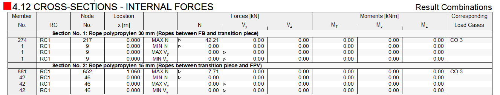{alt="Ein Bild, das Text, Screenshot, Zahl, Reihe enthält. Automatisch generierte Beschreibung" width="6.6930555555555555in" height="1.28125in"}

![Figure 51 - Abstract from supplier of typical polypropylen ropes \[10\]](../images/2023-12-08_surewave_d3.3_final/image31.png){alt="Ein Bild, das Text, Screenshot, Zahl, Schrift enthält. Automatisch generierte Beschreibung" width="6.6930555555555555in" height="2.7006944444444443in"}

  --------------------------------------------------------------------------------------------------------
   ***Description***   ***Simulation Ø***   ***Max. Tension***   ***BL in splice***   ***Safety factor***
  ------------------- -------------------- -------------------- -------------------- ---------------------
       FB to TE              30 mm               42,2 kN               136 kN                 3,2

       TE to FPV             15 mm                7,7 kN               34 kN                  4,4
  --------------------------------------------------------------------------------------------------------

  : Figure 52 - Comparison of max. tension against breaking loads as per supplier Gleistein \[10\]

# Summary, recommendations and next steps

The previous sections have shown that the SUREWAVE concept, including its anchoring in European waters, is feasible in principle. The design is based on previous simulation results and studies of individual components, which have been scaled up to the overall size.

For example, the FB pontoons were simulated individually and unanchored, resulting in larger movements and accelerations. It is therefore expected that these will be lower in the overall system. However, further investigations are necessary and will be carried out as part of Task 3.5. The following steps are particularly necessary to verify the results of this report:

- A comparison shall be made between FLOW-3D simulations and results of wave basin tests executed at MARIN, because the experimental and numerical setups are similar.

- Roll motion is almost completely prevented by the couplings in the circular layout. These couplings must be designed accordingly to accommodate forces. This should be done in conjunction with the results of Task 4.1 regarding the load-bearing capacities of the concrete.

- Smaller layouts should be compared in terms of environmental impact and cost-benefit analysis. Consideration should also be given to the effect on the anchorage.

- The anchorage of the overall system shall be simulated to confirm the calculated catenary line loads. Accordingly, a damping effect shall be added to the static approach.

- The overall system shall be checked in terms of relative movements to define the minimum distance between FB and FPV. The influence of the anchorage and the connections between the FB and the FPV shall be considered. If required, components need to be adjusted.

- The capacity of the transition element in the vertical direction must also be verified for behavior in seas with wavelengths corresponding to the length of the transition element. If the transition elements are too rigid, vertical joints may need to be added to reduce forces.

- The floatability and floating stability of the breakwater must be verified with final results of Tasks 4.1 and 4.2.

# Bibliography, References

The following list summarizes applicable rules and regulations, standards, recommendations, and other relevant references. Unless otherwise noted, standards and guidelines are applied in their latest revision/edition.

  -------------------------------------------------------------------------------------------------------------------------------------------------------------------------------------------------------------------------
  \[1\]    SUREWAVE Consortium, *Deliverable D2.1 - Use case scenario basis for typical, rough location,* 2023.
  -------- ----------------------------------------------------------------------------------------------------------------------------------------------------------------------------------------------------------------
  \[2\]    SUREWAVE Consortium, *Deliverable D3.2 - Floating breakwater design (Shape, size, and composition),* 2023.

  \[3\]    Sunlit Sea, *Product Specification for Floating Solar Panel,* 2023.

  \[4\]    Washington Chain & Supply, Inc. (WCS), „Homepage of Washington Chain & Supply, Inc. (WCS)," \[Online\]. Available: https://wachain.com/stud-link-anchor-chain/. \[Zugriff am 11 2023\].

  \[5\]    Orcina Ltd., „Home of the world\'s leading software package, for marine systems design and analysis," \[Online\]. Available: https://www.orcina.com. \[Zugriff am 20 11 2023\].

  \[6\]    Bureau Veritas - Marine & Offshore, *Classification of Mooring Systems for Permanent and Mobile Offshore Units - Rule Note NR 493 DT R04 E,* 2021.

  \[7\]    Pilotfits Engineering - Marine & Offshore Services, „Pilotfits Engineering - Marine & Offshore Services," \[Online\]. Available: https://pilotfits.com/. \[Zugriff am 11 2023\].

  \[8\]    A. Brünner, „Mathematik-Seiten von Arndt Brünner," 12 03 2004. \[Online\]. Available: https://www.arndt-bruenner.de/mathe/mathekurse.htm. \[Zugriff am 11 2023\].

  \[9\]    L. Garza-Rios, M. Bernitsas und K. Nishimoto, *Catenary Mooring Lines with Nonlinear Drag and Touchdown,* Michigan: The University of Michigan, Department of Naval Architecture and Marine Engineering, 1997.

  \[10\]   Gleistein GmbH, „Gleistein - More than Ropes.," \[Online\]. Available: https://gleistein.com. \[Zugriff am 11 2023\].
  -------------------------------------------------------------------------------------------------------------------------------------------------------------------------------------------------------------------------

# Appendix A - Layout drawings

## Octagonal layout

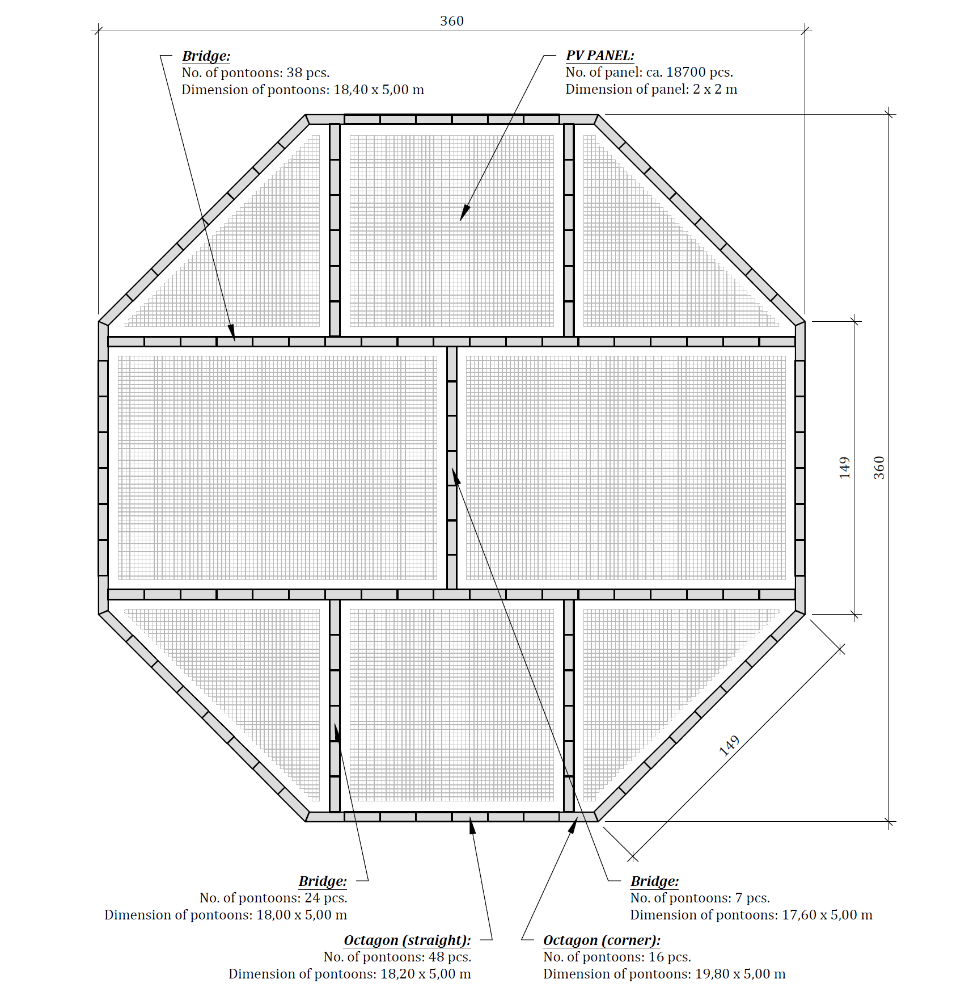{alt="Ein Bild, das Diagramm, technische Zeichnung, Text enthält. Automatisch generierte Beschreibung" width="6.6930555555555555in" height="6.9006944444444445in"}

## Triangular layout

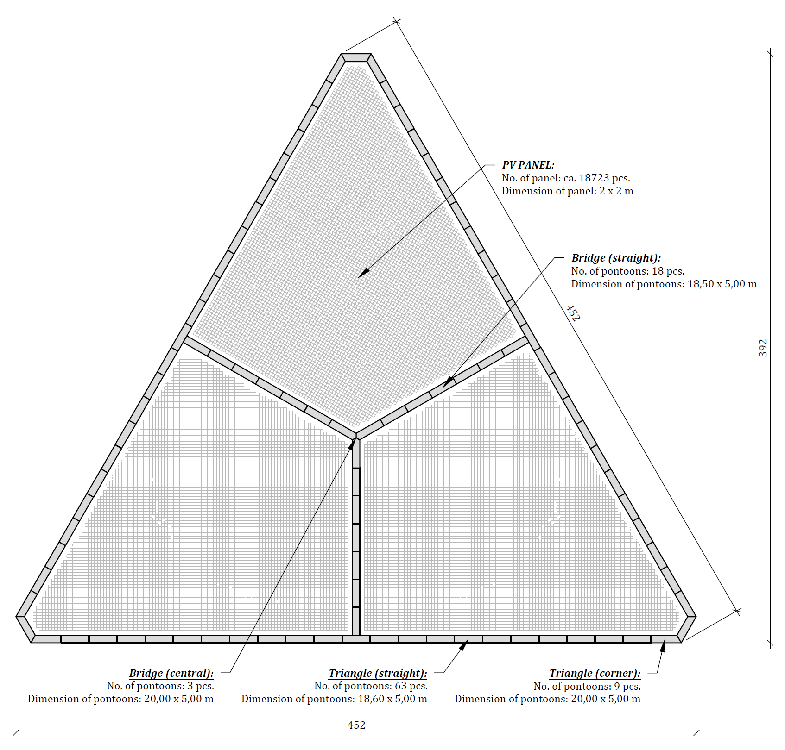{alt="Ein Bild, das Diagramm, Origami enthält. Automatisch generierte Beschreibung" width="6.6930555555555555in" height="6.4006944444444445in"}

## Ellipse layout

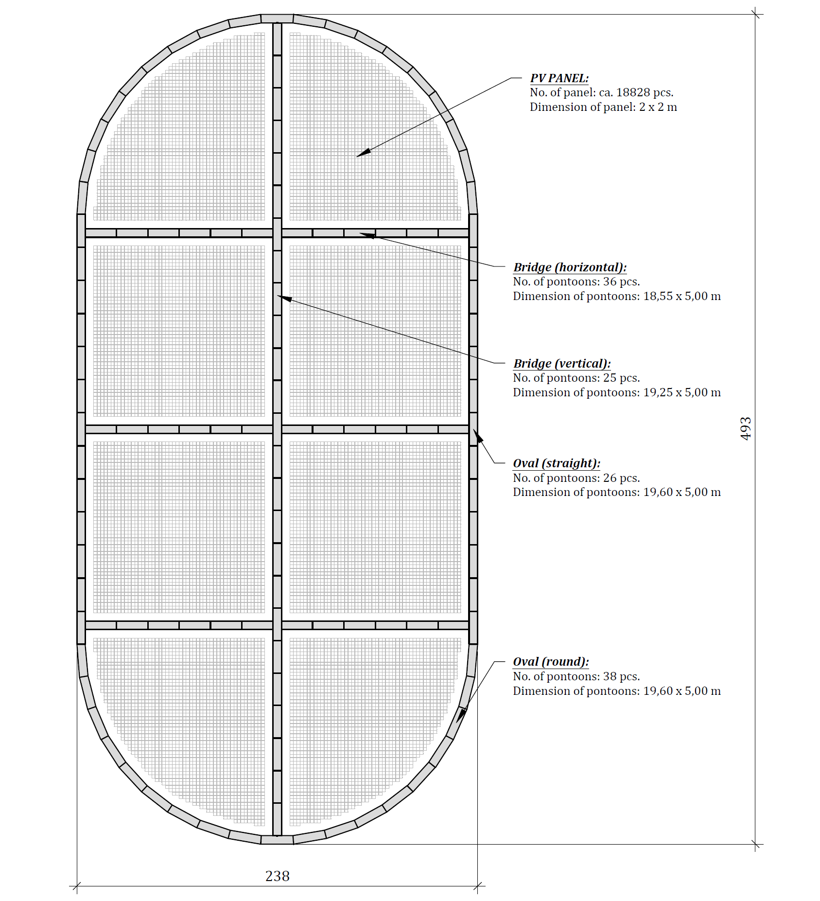{alt="Ein Bild, das nähen, Text, Diagramm, Muster enthält. Automatisch generierte Beschreibung" width="6.6930555555555555in" height="7.351388888888889in"}

## Square layout

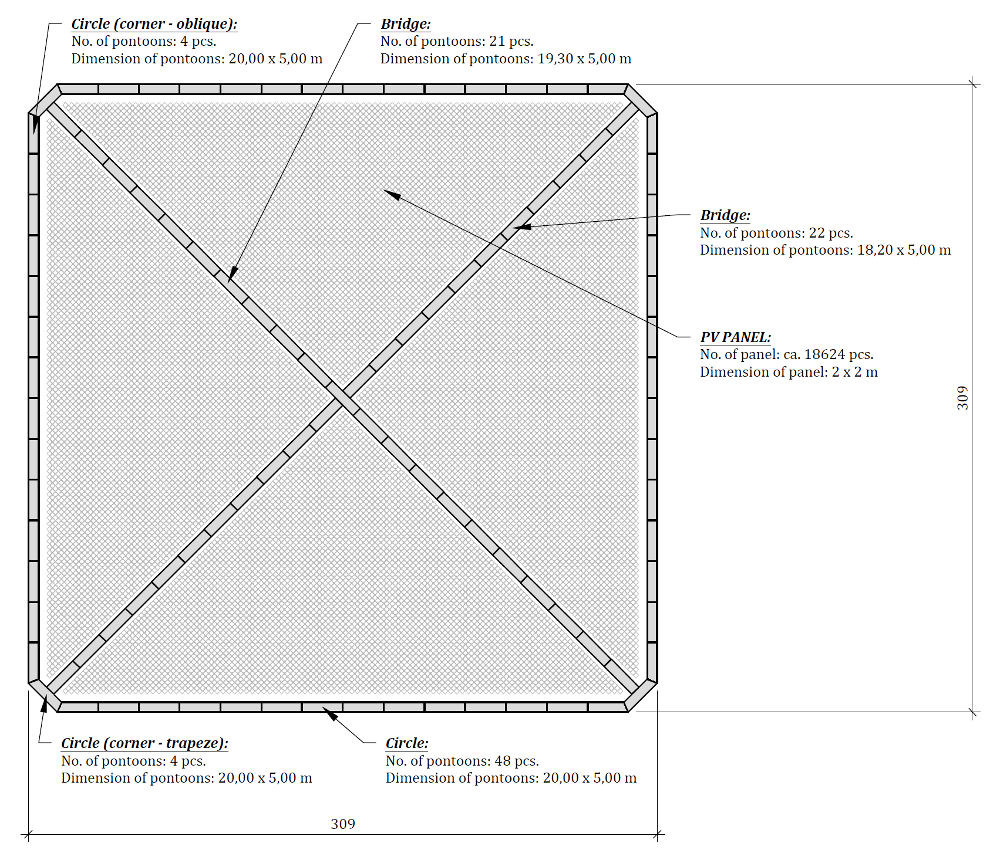{alt="Ein Bild, das Text, Reihe, Diagramm, Muster enthält. Automatisch generierte Beschreibung" width="6.6930555555555555in" height="5.714583333333334in"}

[^1]: Creation, modification, final version for evaluation, revised version following evaluation, final
