> Source: `D3.4 _Summary of global system design_final.docx` — Document date: 2024-03-19 — Converted: 2026-09-28 via pandoc/pdftotext

---

##### 

Deliverable No: 3.4

{width="8.245833333333334in" height="3.0701388888888888in"}

D3.4: Summary of Global Design

**Disclaimer:**

The SUREWAVE project is Funded by the European Union. Views and opinions expressed are however those of the author(s) only and do not necessarily reflect those of the European Union. Neither the European Union nor the granting authority can be held responsible for them\

**Deliverable details**

+:------------------------+:-----------+:-----------+:-----------+:-----------+:-------------+:-----------------+:-------------------+
| **WP**                               | 3                                                   |                                       |
+--------------------------------------+-----------------------------------------------------+---------------------------------------+
| **Task**                             | D3.4                                                | Summary of global system design       |
+-------------------------+------------+-------------------------+------------+--------------+------------------+--------------------+
| **Dissemination level** | Public                               |            | **Due delivery date**           | 31.01.2024         |
+-------------------------+--------------------------------------+------------+---------------------------------+--------------------+
| **Deliverable type**    | R --- Document, report               |            | **Actual delivery date**        | 19.03.2024         |
+-------------------------+-------------------------+------------+------------+---------------------------------+--------------------+
| **Lead beneficiary**                              | **SIS**                                                                        |
+---------------------------------------------------+--------------------------------------------------------------------------------+
| **Contributing beneficiaries**                    | SINTEF, CLEMENT, IFEU                                                          |
+---------------------------------------------------+--------------------------------------------------------------------------------+

  ---------------------- ----------- --------------------------------------------------------------------- -----------------------------------
  **Document Version**   **Date**    **Author**                                                            **Comments**

  1.0                    10/10/23    [[Christoffer Isdahl]{.underline}](mailto:christoffer@sunlitsea.no)   Draft version

  1.1                    08/03/24    Guillaume Kegelart                                                    Revision-1

  1.2                    12/03/24    Balram Panjwani                                                       Revision-2

  1.3                    18/03/24    Guillaume Kegelart                                                    Revision-3

  1.4                    18/03/24    Virgile Delhaye                                                       Revision-4

  1.5                    18/03/24    Balram Panjwani                                                       Revision-5

  1.6                    19/03/24    Guillaume Kegelart                                                    Revision-6

  1.7                    20/03/24    Virgile Delhaye                                                       Revision-7

  1.8                    20/03/24    Balram Panjwani                                                       Revision-8

  2.0                    21/03/24    Guillaume Kegelart                                                    Final

  3.0                    31/05/24    Balram Panjwani                                                       Revised version after PO feedback
  ---------------------- ----------- --------------------------------------------------------------------- -----------------------------------

+:------------------------------------+:----------------------------------------------------------------------------------------------------------+
| **Dissemination level**                                                                                                                         |
+-------------------------------------+-----------------------------------------------------------------------------------------------------------+
| PU                                  | Public- fully open                                                                                        |
+-------------------------------------+-----------------------------------------------------------------------------------------------------------+
| SEN                                 | SEN = Sensitive -- limited under the conditions of the Grant Agreement                                    |
+-------------------------------------+-----------------------------------------------------------------------------------------------------------+
| EU classified                       | EU classified -- restraint -- UE/EU-restricted, confidential, secret-UE/EU secret under Decision 2015/444 |
+-------------------------------------+-----------------------------------------------------------------------------------------------------------+
| **Deliverable type**                                                                                                                            |
+-------------------------------------+-----------------------------------------------------------------------------------------------------------+
| R:                                  | Document, report (excluding the periodic and final reports)                                               |
+-------------------------------------+-----------------------------------------------------------------------------------------------------------+
| DEM:                                | Demonstrator, pilot, prototype, plan designs                                                              |
+-------------------------------------+-----------------------------------------------------------------------------------------------------------+
| DEC:                                | Websites, patents filing, press & media actions, videos, etc.                                             |
+-------------------------------------+-----------------------------------------------------------------------------------------------------------+
| OTHER:                              | Software, technical diagram, etc.                                                                         |
+-------------------------------------+-----------------------------------------------------------------------------------------------------------+

**EXECUTIVE SUMMARY**

As described in the task 3.5 definition "Design of coupled breakwater & floating PV and global system design", The deliverable provides the global design description of the floating solar farm, and the methodology used to define it. The first part of the report is summarizing the methodology used to study and assess critical components. This includes tests such as: Wave tank testing, laboratory tensile tests, laboratory shear tests and basin model tests. The report also describes the methodology behind the design of the floating breakwater and the anchoring & mooring. Based on a set of criteria, configurations for the full installation are assessed. The analysis mentioned in this report are fully available in the deliverables 3.1 "SUREWAVE D3.1 Design description of internal floating PV components", 3.2 "SUREWAVE D3.2 Floating breakwater design" and 3.3 "2023-12-08 - SUREWAVE Deliverable 3.3 final" where the coupling of the external breakwater and internal FPV module is assessed and discussed in regard to movement of the array under certain weather condition.

The circular installation configuration is selected and fully described in a global system summary, main focus of this report, as described in the task 3.5 definition. Included are number of components (bill of material), 3D designs and assembly and deployment requirements. This report discusses the finalized designs for both the concrete breakwater and FPV, along with potential enhancements for critical components. Additionally, these components are engineered to withstand varying wind, wave, and current conditions in exposed locations.

The report allows for a holistic view of the system and gives the reader a possibility to estimate the cost of such installation at a Mega Watt size and at a smaller size (420kWp). In parallel of the cost being assessed, the component summary of this report will be available to the WP7 for setting the project solution scenario (mass-energy balance).

**Deliverable Review**

+------------------------------------------+------------------------------------------+--------------+--------------+---------------------------------------+--------------+--------------+---------------------------------------+--------------+
|                                          | **Reviewer #1:** Balram Panjwani                                                                                              | **Reviewer #2:** Eirik Larsen                                       |
|                                          +------------------------------------------------------------------------+---------------------------------------+--------------+--------------+---------------------------------------+--------------+
|                                          | **Answer**                                                             | **Comments**                          | **Type\***   | **Answer**   | **Comments**                          | **Type\***   |
+------------------------------------------+------------------------------------------------------------------------+---------------------------------------+--------------+--------------+---------------------------------------+--------------+
| 1.  Is the deliverable in accordance with                                                                                                                                                                                                      |
+------------------------------------------+------------------------------------------------------------------------+---------------------------------------+--------------+--------------+---------------------------------------+--------------+
| i.  The Description of Work?             | ☒ Yes                                                                  |                                       | ☐ M          | ☒Yes         |                                       | ☐ M          |
|                                          |                                                                        |                                       |              |              |                                       |              |
|                                          | ☐ No                                                                   |                                       | ☐ m          | ☐ No         |                                       | ☐ m          |
|                                          |                                                                        |                                       |              |              |                                       |              |
|                                          |                                                                        |                                       | ☐ a          |              |                                       | ☐ a          |
+------------------------------------------+------------------------------------------------------------------------+---------------------------------------+--------------+--------------+---------------------------------------+--------------+
| ii. The international State of the Art?  | ☐ Yes                                                                  | *Not applicable for this deliverable* | ☐ M          | ☐ Yes        | *Not applicable for this deliverable* | ☐ M          |
|                                          |                                                                        |                                       |              |              |                                       |              |
|                                          | ☐ No                                                                   |                                       | ☐ m          | ☐ No         |                                       | ☐ m          |
|                                          |                                                                        |                                       |              |              |                                       |              |
|                                          |                                                                        |                                       | ☐ a          |              |                                       | ☐ a          |
+------------------------------------------+------------------------------------------------------------------------+---------------------------------------+--------------+--------------+---------------------------------------+--------------+
| 2.  Is the quality of the deliverable in a status                                                                                                                                                                                              |
+-------------------------------------------------------------------------------------+--------------+------------------------------------------------------+--------------+--------------+---------------------------------------+--------------+
| iii. That allows it to be sent to European Commission?                              | ☒ Yes        |                                                      | ☐ M          | ☒ Yes        |                                       | ☐ M          |
|                                                                                     |              |                                                      |              |              |                                       |              |
|                                                                                     | ☐ No         |                                                      | ☐ m          | ☐ No         |                                       | ☐ m          |
|                                                                                     |              |                                                      |              |              |                                       |              |
|                                                                                     |              |                                                      | ☐ a          |              |                                       | ☐ a          |
+-------------------------------------------------------------------------------------+--------------+------------------------------------------------------+--------------+--------------+---------------------------------------+--------------+
| iv. That needs improvement of the writing by the originator of the deliverable?     | ☐ Yes        |                                                      | ☐ M          | ☐ Yes        |                                       | ☐ M          |
|                                                                                     |              |                                                      |              |              |                                       |              |
|                                                                                     | ☒ No         |                                                      | ☐ m          | ☒No          |                                       | ☐ m          |
|                                                                                     |              |                                                      |              |              |                                       |              |
|                                                                                     |              |                                                      | ☐ a          |              |                                       | ☐ a          |
+-------------------------------------------------------------------------------------+--------------+------------------------------------------------------+--------------+--------------+---------------------------------------+--------------+
| v.  That need further work by the Partners responsible for the deliverable?         | ☐ Yes        |                                                      | ☐ M          | ☐ Yes        |                                       | ☐ M          |
|                                                                                     |              |                                                      |              |              |                                       |              |
|                                                                                     | ☒ No         |                                                      | ☐ m          | ☒No          |                                       | ☐ m          |
|                                                                                     |              |                                                      |              |              |                                       |              |
|                                                                                     |              |                                                      | ☐ a          |              |                                       | ☐ a          |
+-------------------------------------------------------------------------------------+--------------+------------------------------------------------------+--------------+--------------+---------------------------------------+--------------+

\* Type of comments: M = Major comment; m = minor comment; a = advice

# Table of Contents {#table-of-contents .TOC-Heading}

[1. Introduction [7](#introduction)](#introduction)

[2. Methodology: Design methodology and approach [8](#methodology-design-methodology-and-approach)](#methodology-design-methodology-and-approach)

[2.1 Floating solar panel (FPV) [8](#floating-solar-panel-fpv)](#floating-solar-panel-fpv)

[2.2 Floating Breakwater (FB) [14](#floating-breakwater-fb)](#floating-breakwater-fb)

[2.3 Anchoring & Mooring [17](#anchoring-mooring)](#anchoring-mooring)

[2.4 Transition element: FB - FPV connector [20](#transition-element-fb---fpv-connector)](#transition-element-fb---fpv-connector)

[3. Global solution of SUREWAVE FPV [21](#global-solution-of-surewave-fpv)](#global-solution-of-surewave-fpv)

[3.1 Overall design [21](#overall-design)](#overall-design)

[3.2 3D design [24](#d-design)](#d-design)

[3.2.1 FPV (floating solar panel) [24](#fpv-floating-solar-panel)](#fpv-floating-solar-panel)

[3.2.2 Transition elements [35](#transition-elements)](#transition-elements)

[3.2.3 Floating breakwater [40](#floating-breakwater)](#floating-breakwater)

[3.2.4 Electrical Components [41](#electrical-components)](#electrical-components)

[3.3 Smaller scale 420kWp Pilot size installation [47](#smaller-scale-420kwp-pilot-size-installation)](#smaller-scale-420kwp-pilot-size-installation)

[4. Installation requirements [49](#installation-requirements)](#installation-requirements)

[4.1 Installation process and procedures [49](#installation-process-and-procedures)](#installation-process-and-procedures)

[4.2 FPV [49](#fpv)](#fpv)

[4.2.1Site Preparation and Integration Planning [49](#site-preparation-and-integration-planning)](#site-preparation-and-integration-planning)

[4.2.2 Deployment Ramp and On-Water Assembly Adjustments [50](#deployment-ramp-and-on-water-assembly-adjustments)](#deployment-ramp-and-on-water-assembly-adjustments)

[4.2.3 Integration with Floating Breakwaters and Transition Elements [50](#integration-with-floating-breakwaters-and-transition-elements)](#integration-with-floating-breakwaters-and-transition-elements)

[4.2.4 Mechanical Connections: [50](#mechanical-connections)](#mechanical-connections)

[4.2.5 Final Assembly, Inspection, and Commissioning [50](#final-assembly-inspection-and-commissioning)](#final-assembly-inspection-and-commissioning)

[4.3 Floating breakwater [51](#floating-breakwater-1)](#floating-breakwater-1)

[4.3.1 Design and Construction [51](#design-and-construction)](#design-and-construction)

[4.3.2 Pre-Deployment Checks [51](#pre-deployment-checks)](#pre-deployment-checks)

[4.3.3 Transportation to Deployment Site [51](#transportation-to-deployment-site)](#transportation-to-deployment-site)

[4.3.4 Deployment Preparation [52](#deployment-preparation)](#deployment-preparation)

[4.3.5 Post-Deployment Activities [52](#post-deployment-activities)](#post-deployment-activities)

[4.3.6 Maintenance [52](#maintenance)](#maintenance)

[4.4 Safety and compliance requirements [52](#safety-and-compliance-requirements)](#safety-and-compliance-requirements)

[4.4.1 Design and Construction [53](#design-and-construction-1)](#design-and-construction-1)

[4.4.2 Electrical Safety [53](#electrical-safety)](#electrical-safety)

[4.4.3 Environmental Compliance [53](#environmental-compliance)](#environmental-compliance)

[4.4.4 Operational Safety [53](#operational-safety)](#operational-safety)

[4.4.5 Decommissioning [54](#decommissioning)](#decommissioning)

[5. Bill-of-materials [54](#bill-of-materials)](#bill-of-materials)

[6. Conclusions [56](#conclusions)](#conclusions)

[Bibliography [57](#bibliography)](#bibliography)

# 

# Introduction

#### Background and context

This deliverable aims to describe the project\'s coupled solution. It is done through a use-case scenario, previously identified as part of deliverable 2.1 - Use-case scenario definition, covering mild, moderate and severe sea states. The global system design will be the main focus of this report and will address the severe sea state scenario, where wind, waves, and currents will vary. Furthermore, the description of connection systems between breakwater and solar modules, a critical part of the installation, is detailed in this deliverable.

#### Objectives of the global system design

In order to conduct a comprehensive evaluation of technological risks, barriers, sustainability and environmental challenges, as well as social impact, the defined use-cases will contribute to WP7, specifically focusing on Life Cycle Assessment. The approaches developed within SUREWAVE project facilitates precise estimations within the project, equipping researchers with essential performance indicators such as installation dimensions, power production sizing, and the quantity of components to deploy and maintain.

#### Relationship with other tasks and work packages

The development of the novel FPV concept is done iteratively with the breakwater design and prototyping covered in task 4.4. Previous work completed in deliverable 2.2:Requirements for surface mooring system between FPV array and breakwater, and 2.3 High level understanding of the system general loads is central to the recommendations and propositions made. Other associated tasks are:

3.1 : Overall design of the internal individual floating PV components\
3.2 : Overall design of the external breakwater\
3.3 : Improved mooring line and anchoring system

  ---------------------------------- ------------------------------------------------
  **Abbreviation**                   **Full name**

  FPV                                Floating solar panel unit

  FB                                 Floating breakwater

  TE                                 Transition element

  Wp, kWp, MWp                       Watt peak, kiloWatt peak, MegaWatt peak

  DIC                                Differential interference contrast microscopy

  ISO527                             Plastics - Determination of tensile properties

  SLS                                Sunlit Sea

  PU                                 Polyurethane
  ---------------------------------- ------------------------------------------------

Table of Abbreviations

# Methodology: Design methodology and approach

## 2.1 Floating solar panel (FPV)

Sunlit Sea is developing a technology solution for floating photovoltaic (FPV). The solution, denoted "SLS FPV", consists of a photovoltaic (PV) panel sealed to an aluminium float. This gives a fully built-in solution lying flat on the water surface. To obtain the required energy output several floats are connected together in a large matrix, see in [Figure 1](#_Ref161653574).

![[]{#_Ref161653574 .anchor}Figure 1 : 3D model of SLS's 14x14 105kWp installation in Haugaland](../images/2024-03-19_surewave_d3.4_summary_global_system_design/image3.png){alt="P361#yIS1" width="5.905511811023622in" height="3.087399387576553in"}

This is a product designed for prefabrication and intended for use in all major markets and geographical regions (worldwide). The concept has primarily been validated in landlocked systems or protected areas such as dams and nearshore environments. The SLS FPV solution isn\'t tailored to particular locations or extreme offshore conditions. Instead, it adheres to a set of general design criteria used to evaluate structural integrity. Consequently, specific Metocean criteria for each site must be evaluated and confirmed to align with the designated design criteria.

In the scope of the WP2, D2.1, a set of different offshore locations have been discussed. [Table 1](#_Ref161653717) provides an overview of those locations.

![[]{#_Ref161653717 .anchor}Table 1 : 3 locations proposed for the assessment of the SUREWAVE project.](../images/2024-03-19_surewave_d3.4_summary_global_system_design/image4.png){alt="P368#yIS1" width="5.905511811023622in" height="1.328740157480315in"}

As mentioned in the introduction, the site with the most severe condition will be considered which in this case is Greater North Sea which is shown in Figure 2. Figure 3 shows the Significant wave heights for this location, as well as the directional data. The graphs in the Figure 3 confirms the multidirectional aspect of the location selected and the severe sea state. The SUREWAVE project aims at developing a solution of floating breakwater sheltering the FPV matrix.

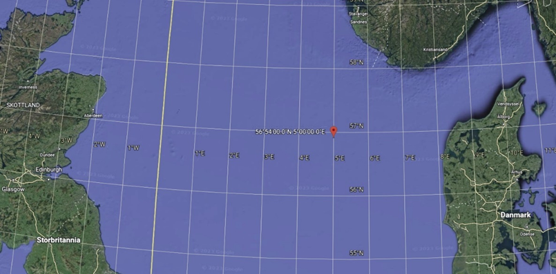{width="5.905511811023622in" height="2.8456266404199475in"}

Figure 2: Region Greater North Sea, location 56°54\'N 5°00\'E (red mark)

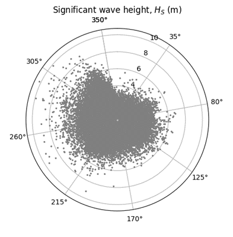{width="2.703034776902887in" height="2.7559055118110236in"}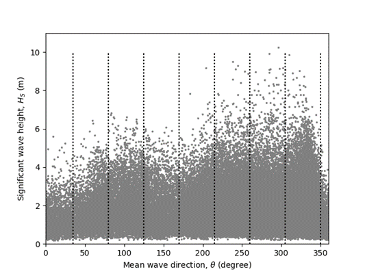{width="2.952755905511811in" height="2.7559055118110236in"}

Figure 3: Directional wave data for location 56°54\'N 5°00\'E, significant wave height HS (m) as a function of mean wave direction ϴ (°). European waters

In order to address those criteria, the D2.3 presented a high-level understanding of the general loads on the system and provided preliminary requirements for chosen critical components, and integration requirements between the breakwater and FPV system.

Most importantly, the general following analyses were discussed to estimate the loads:

- Aerodynamic analysis

- Hydrodynamics analysis

- Structural analyses (including connection- and mooring-point strength analysis)

- Connector strength analysis for connectors between individual FPV units.

In parallel to the theoretical explanation of the different loads applied on the FPV system, a set of field tests have been performed (in chronological order):

- Wave tank testing in Stadt towing tank (NO) \[1\]

- Lab tensile test of FPV-FPV connectors (hinges) in SINTEF (NO)

- Shear test of FPV-FPV connectors in SINTEF (NO)

- Basin test of a scaled model in MARIN Wageningen (NL)

Those tests originally planned to answer a set of other tasks within the scope of the SUREWAVE project. However, these tests have also influenced decisions in the design process of critical components, particularly the FPV -FPV connectors.

The wave tank tests in STT are described as a full scale testing of the SLS FPV solution \[1\]. Those tests have allowed us to set a first level of understanding of the behaviour of the FPV matrix under a set of sea states (waves). The different sea states performed during the experiments are listed in Table 2, and Figure *4* presents the sneak peak of the FPV during the tests.

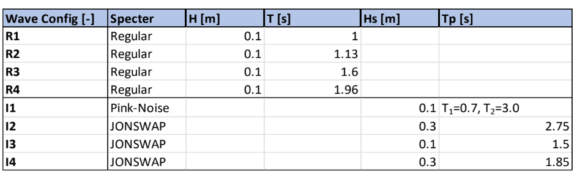{width="5.905511811023622in" height="1.809767060367454in"}

Table 2: description of the different waves used in testing at STT

The movements of sets of panels (1x1, 1x3, 1x6 and 1x9) were monitored and compared to simulations from Orcaflex \[1\]. The findings indicated that the performance of the FPV aligned with the simulation. This suggests that the predicted behaviour of the FPV, as modelled in the simulation, accurately reflects its actual performance in lab-scale environments. These tests not only are useful for validating the accuracy of numerical simulations of FPV assemblies but also serve as a benchmark for refining and improving future simulations in case of discrepancy between numerical models and experiments. By comparing the results of physical tests with those obtained through simulations, we can redefine the models to better predict the behaviour of FPV assemblies in various conditions. Overall, these tests play a crucial role in advancing both the theoretical understanding and practical application of FPV technology.

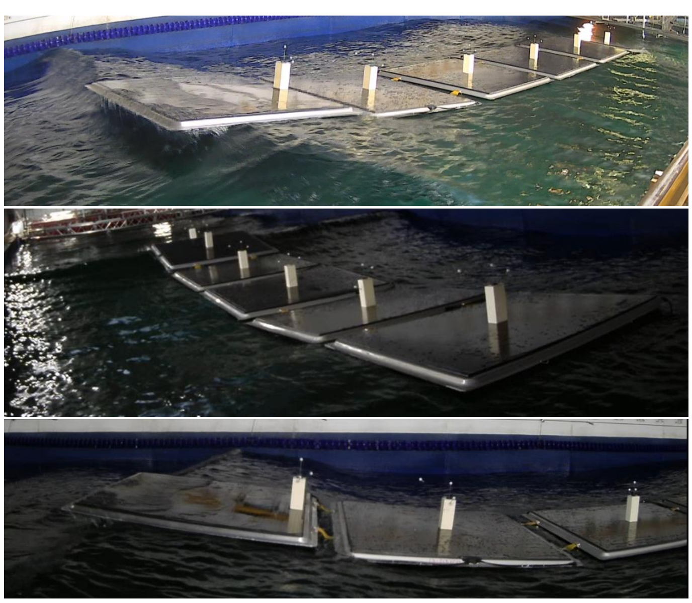{width="5.61980971128609in" height="4.8060236220472445in"}

Figure 4: wave tests H=0.3m Tp=2.75s

One of the most critical components of the fully assembled system was estimated to be the FPV - FPV connector, named "hinge". Indeed, the connections between the floats are of particular interest to this research project. Hinge loads between two or more floats will pose specific challenges that need to be addressed to ensure the stability and longevity of our floating structure. The hinge systems must be able to withstand extreme weather events, strong currents, and variable water depths, and ensure the integrity and stability of the floating structure under different conditions.

It was then obvious that a thorough evaluation of the component on a design level as well as on a material level had to be done. While the design is extensively described in D3.1 "Design description of internal floating PV components", the material used to construct the hinges had yet to be completely described in terms of mechanical characteristics: Stiffness, Young's modulus, Poisson's ratio.\
It was therefore thought that a set of mechanical tests, described in the table 3, at SINTEF would be relevant to pursue in the right direction.

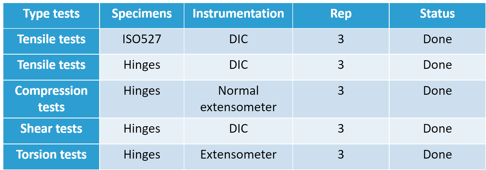{width="5.905511811023622in" height="2.070166229221347in"}

Table 3: Summary of tests done at SINTEF on the hinge material standard samples (ISO527) and full scale hinges. See table of abbreviations.

The results from those tests, illustrated in Figure 5 and table 4, led to different conclusions:

- The material has a highly non-linear behaviour

- The apparent Young modulus evolves with deformation

- The material behaves like an elastomer (Polymer that displays rubber-like elasticity \[7\].

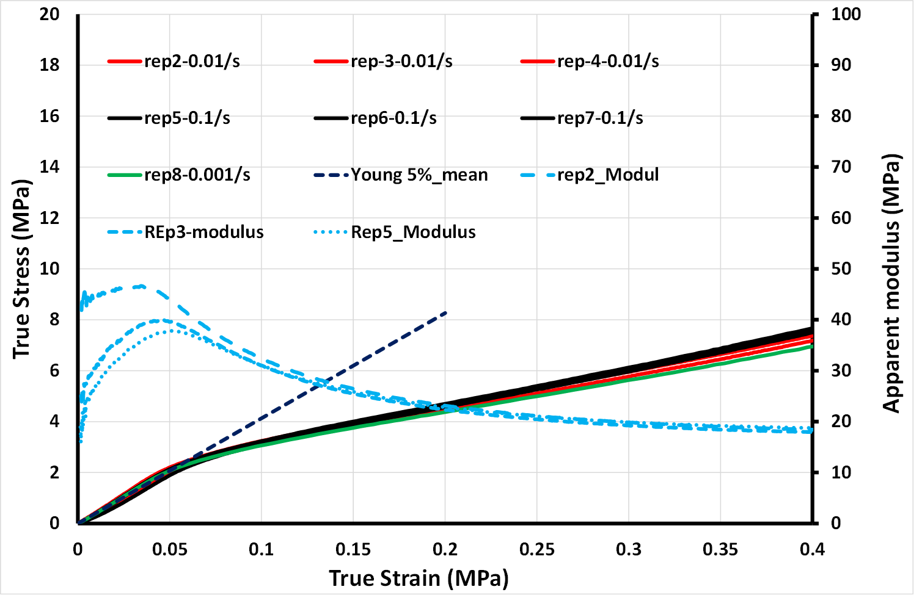{width="5.332597331583552in" height="3.280706474190726in"}

*Figure 5: Stress strain curve of Polyurethane material (PU)*

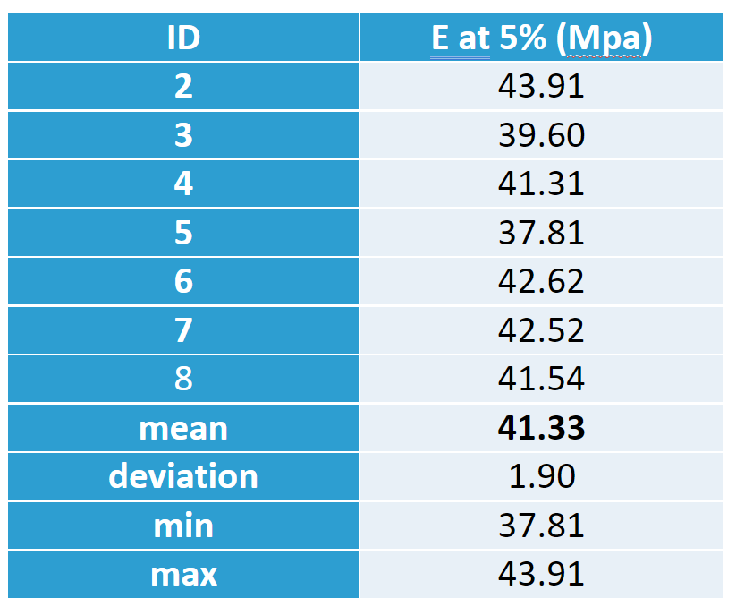{width="3.8891502624671914in" height="2.690239501312336in"}

Table 4: Estimation of the Young's modulus at the beginning of the curves (at 5% deformation)

Finally, the test results enabled us to characterise the material in order to select a suitable material for the scale model test planned in the scope of WP6.

With developers of floating photovoltaic systems (FPV) targeting coastal and offshore locations, reliable methods are required for assessing the hydrodynamic performance of FPV systems. Wave basin tests form an independent means to verify FPV designs and validate numerical models. The scale model experiments aimed at extending insights into the hydrodynamic behaviour of a Representative multi-body FPV system in mild and harsh wave conditions through basin tests at scale 1:10.The scale model composition is depicted in Figure 6. Particular effort was placed into correctly scaling the elasticity of the flexible hinges interconnecting the PV floats.

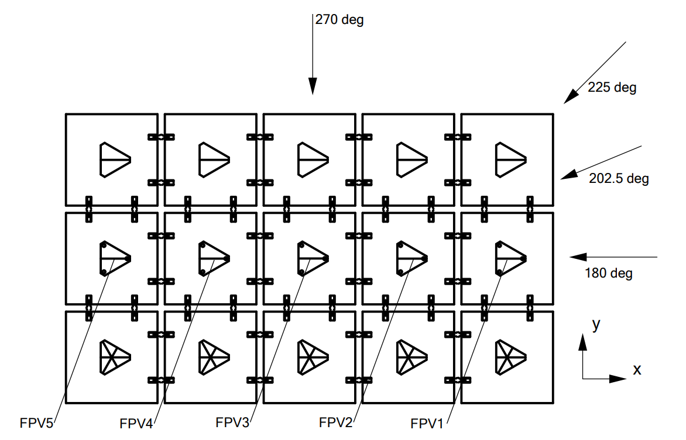{width="5.358779527559055in" height="3.0853576115485564in"}

Figure 6: scale model plan with wave incidence

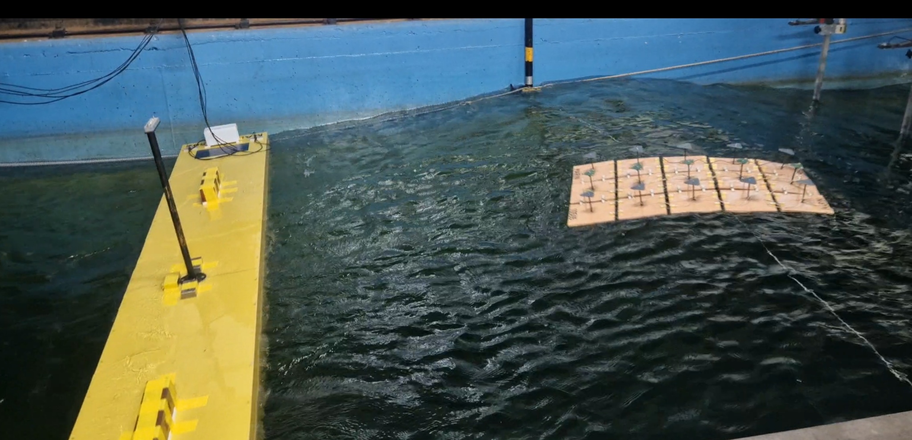{width="5.213153980752406in" height="2.225905511811024in"}

*Figure 7: Model during trials*

Tests of a 5x3 FPV matrix were performed as showed in Figure 7, with and without shelter of an external floating breakwater (FBW). Results showed that the PV floats move horizontally in the same phase when the wavelength exceeds the length of the FPV system, but shorter waves result in relative motions between floats and hinge buckling in harsh seas. Relative motions suggest that axial loads are highest for the hinges that connect the centre floats in the system and for normal wave incidence, while shear loads are highest on the outward hinges and for oblique incidence. The FBW reduces hinge loads as it attenuates the high-frequency wave energy that largely drives relative motions between PV floats. Details and full explanations are available in \[2\].

The different tests have helped move in the right direction, giving a lot of attention and resources into the design of the FPV-FPV connectors known as the hinges, while trying to keep the production process costs minimal for financial reasons.

## 2.2 Floating Breakwater (FB)

In the D2.2 a summary of the investigations of critical components have been formulated. This resulted in technical requirements that are expressed as basic design criteria regarding required force transmission, moveability, geometric boundary conditions, material properties, dynamic behaviour, and durability requirements.

Based on the same use case mentioned before, the proposed analysis process of PIANC \[3\] and the calculation process of Fousert \[4\], the design development of the FB is considered according to the following diagram, represented in Figure 8:

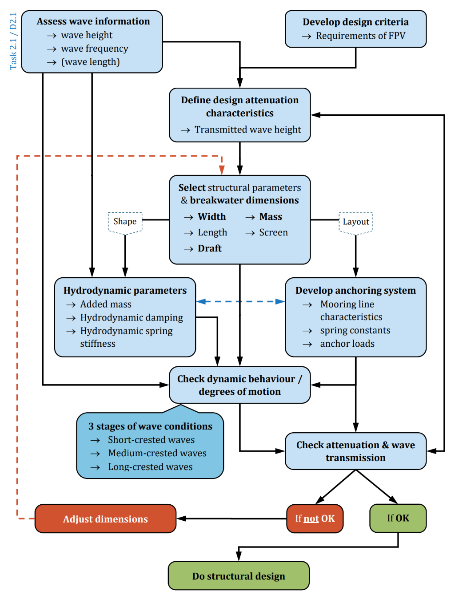{width="4.643395669291339in" height="5.386104549431321in"}

Figure 8: Methodology employed to design the Floating breakwater

The requirement specifications coming from the analysis of D2.2 concluded that the Floating breakwater had to respect 3 axis of development:

#### Force transmission: 

Globally, loads from wind, waves, and currents act on the assembly. These loads must be safely transferred into the seabed. It is intended that the connection between the anchor or anchors and the assembly will be made directly via FB, as this is also where the largest proportion of the actions occur. Nevertheless, forces still act within the system (FB & FPV), which then must be transferred to the anchoring via the FB.

The connection should not only have an anchoring effect but should also keep the distance between both components (FB and FPV) constant or at a minimum distance to be defined. Thus, there is the possibility of an opposing motion of FB and FPV when acted upon by waves and phase shifting of the incident wave to the transmitted wave occurs.

#### Moveability:

The connection between the Floating Breakwater (FB) and Floating Photovoltaic (FPV) systems should exclusively distribute design loads from the FPV uniformly to the FB and onward to the anchorage, without transmitting any additional moments. A rigid, unhinged connection could directly transfer roll movements, potentially diminishing or eliminating damping effects.

Consequently, further analysis is necessary to determine whether the connection should be configured as a tension, compression bar, or both, considering the independent movements of each component and their interactions. Additionally, damping or elastic properties may need to be incorporated if deemed necessary.

#### Geometric boundaries:

For small-period waves, the transmission must be reduced to a minimum. It must be investigated which wave spectrum is harmful to the FPV or up to which spectrum a wave attenuation must take place. Accordingly, the geometry of the FB can be defined, using the preliminary approach, mentioned earlier, which needs to be confirmed numerically and experimentally.

In addition, the dimensions of the individual wave breaker elements are basically not limited, but with increasing size, the total weight will be the limiting criterion. In this respect, the minimum size must be selected so that the required wave attenuation takes place, but at a maximum so that the total weight remains in a transportable and handleable condition. The catamaran type has the most effective characteristics in terms of wave attenuation. This type consists of two keels or floats that are firmly connected to each other at a defined distance as shown in Figure 9. Either the buoyancy is realized directly by the keels or floats or additionally also by the connections between them.

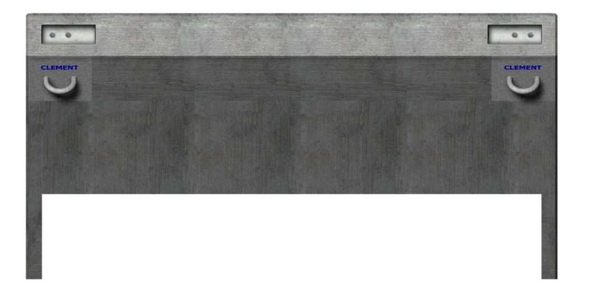{width="5.905511811023622in" height="2.8643799212598426in"}

Figure 9: Catamaran cross typical section

## 2.3 Anchoring & Mooring 

The floating breakwaters must be securely anchored to the offshore site. Environmental effects from wind, waves and currents acting on the floating breakwaters are transferred to the ground or seabed via the anchorage.

It is therefore necessary to examine how the anchorage must be designed, not only in terms of economic efficiency, but in terms of technical feasibility as well. The Anchoring and mooring being in direct relation of the general layout involving FB, a first task was to come up with a relevant layout of FB.

A methodology based on rating criterions was developed in D3.3. This involved considering a set of different FB disposition and their effect on:

- Distribution of wave energy in terms of transmission and reflection

- Concentration of forces with regards to pontoon connections

- Anchorage

- Design and production (pre-fabrication)

- Transport and installation

- Costs

- Use of space

- Maintenance

The more points score by a configuration, the less efficient the configuration is. Results were compiled in the table 5 hereunder:

  ---------------------------------------- ------------------------------------------------------------------------------------------------- ------------------------------------------------------------------------------------------------- -------------------------------------------------------------------------------------- -------------------------------------------------------------------------------------- -------------------------------------------------------------------------------------------------
    ***Various Breakwater Configuration***  {width="0.4479166666666667in" height="0.4479166666666667in"}   {width="0.4479166666666667in" height="0.4479166666666667in"}   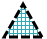{width="0.4895833333333333in" height="0.40625in"}   {width="0.6354166666666666in" height="0.28125in"}   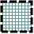{width="0.4479166666666667in" height="0.4479166666666667in"}

                            ***Criteria***                                             Circular                                                                                          Octagonal                                                                                   Triangular                                                                              Ellipse                                                                                      Square

               Distribution of wave energy                                                 1                                                                                                 3                                                                                           4                                                                                      2                                                                                            5

                   Concentration of forces                                                 1                                                                                                 3                                                                                           5                                                                                      2                                                                                            4

                                 Anchorage                                                 1                                                                                                 3                                                                                           5                                                                                      2                                                                                            4

                     Design and production                                                 1                                                                                                 3                                                                                           4                                                                                      5                                                                                            2

                Transport and installation                                                 2                                                                                                 5                                                                                           3                                                                                      4                                                                                            1

                                     Costs                                                 1                                                                                                 5                                                                                           2                                                                                      4                                                                                            3

                              Use of space                                                 1                                                                                                 5                                                                                           3                                                                                      4                                                                                            2

                               Maintenance                                                 3                                                                                                 2                                                                                           5                                                                                      4                                                                                            1

                                *Summary:*                                               *11*                                                                                              *29*                                                                                         *31*                                                                                   *27*                                                                                        *22*

                            ***Ranking**:*                                               **1**                                                                                             **4**                                                                                       **5**                                                                                  **3**                                                                                        **2**
  ---------------------------------------- ------------------------------------------------------------------------------------------------- ------------------------------------------------------------------------------------------------- -------------------------------------------------------------------------------------- -------------------------------------------------------------------------------------- -------------------------------------------------------------------------------------------------

Table 5: rating comparison of different FB layouts

The circular layout was identified as the preferred option for the following main reasons:

Advantages

- The wave forces always act on the round shape with a time delay, resulting in less movements and forces.

- Waves with a shorter period are reflected in different directions, creating a diffuse wave pattern. This minimises the interaction between the incoming wave and the reflected wave.

- The concentration of forces is also minimised and reduced to the anchorage points. Due to the small angles between the pontoons, the force distribution in the connections between the pontoons is uniform.

- The anchorage can be scaled and adapted to local conditions.

- Compared to other layouts, the circular arrangement requires the fewest pontoons.

- The external breakwater pontoons are all of the same shape and size, which avoids the increased cost of changing formwork.

- Relative costs are low due to the small number of different pontoons and the small total number of pontoons.

Disadvantages

- The gables of the pontoons are not perpendicular to the sides. This makes the gables more difficult to form. However, as all FB pontoons can be the same, this disadvantage is almost negligible.

- The square PV-panels must be adapted to the round shape. This results in offsets for which the connection between the FB and FPV must be individually adjusted.

- In order to be able to carry out maintenance work and ensure accessibility to the PV-panels, corridors must be set up at regular intervals. Due to the round shape, setting up these corridors is also more complex than with straight layouts.

Now for the anchoring, a system of catenary lines using chains was studied:\
The catenary lines were determined numerically using an iterative procedure. The following catenary lines, presented in Figure 10 and Table 6, were obtained for the assumed displacements.

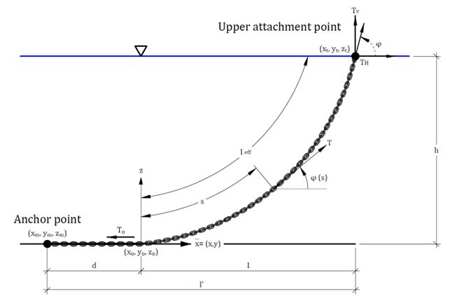{width="5.905511811023622in" height="3.918992782152231in"}

[Figure]{.mark} 10 [- Geometry of a catenary line]{.mark}

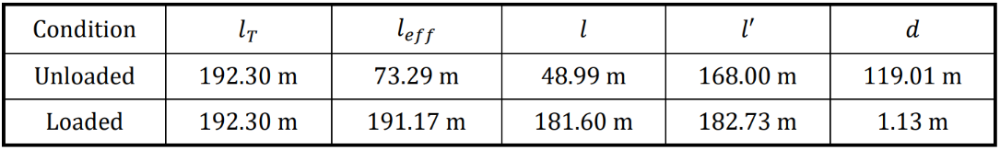{width="5.905511811023622in" height="0.8853543307086614in"}

[Table]{.mark} 6 [- Catenary line values for harsh conditions (e.g. North Sea - 56°54\'N 05°00\'E)]{.mark}

Considering the chain capacities and the aforementioned catenary lines, this yields to the following layout, shown in Figure 11:

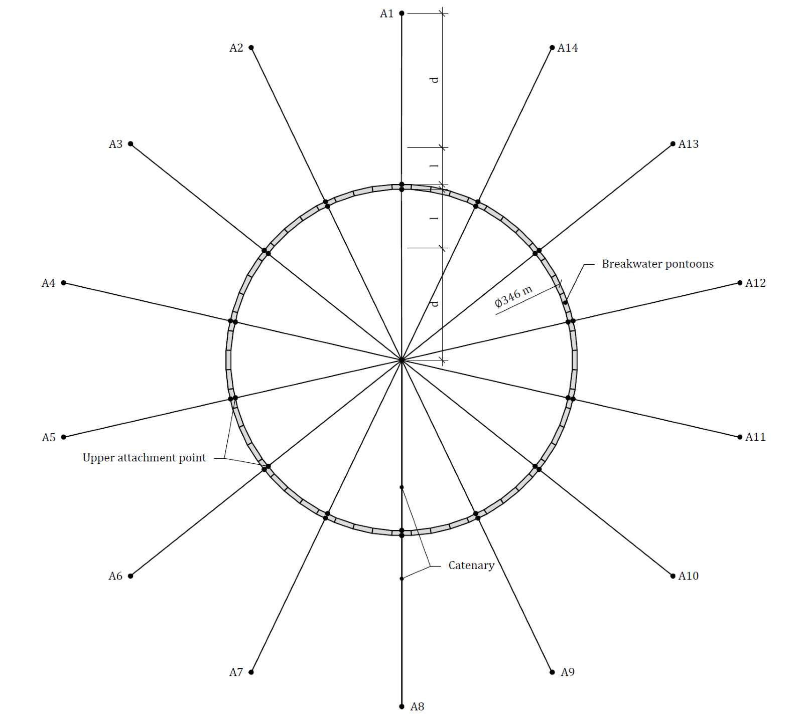{width="5.905511811023622in" height="5.338162729658793in"}

[Figure 11 - Layout for harsh conditions (e.g. North Sea - 56°54\'N 05°00\'E)]{.mark}

## 2.4 Transition element: FB - FPV connector

Floating solar systems do not have a separate connection to the seabed. They therefore need to be anchored horizontally in some other way. In the SUREWAVE project, a connection is planned between the FB and the FPV, which transfers the forces from the FPV via the FB and its anchorage into the seabed.

A transition element was proposed to be studied as a convenient solution respecting an elastic load distribution thanks to ropes and a floatability thanks to a closed round tube made of a light but solid material.

For an initial sizing of the connections between FB and FPV, a PV array of 20 x 14 modules was simulated on Dlubal RFEM 5.26.02, as 14 modules are standard in a string ​\[5\]​. This PV array is completely surrounded by a closed transition element, which is then connected to the FB or the neighbouring PV array as shown in Figure 12. The ropes between FB and transition element are pre-tensioned with 3 kN≈300 kg.

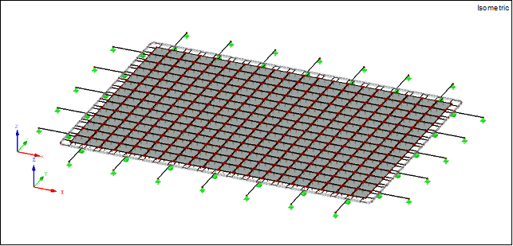{width="5.905511811023622in" height="2.825320428696413in"}

[Figure]{.mark} 12 [- PV array with surrounding transition element (abstract from Dlubal RFEM 5.26.02)]{.mark}

Results showed in D3.3 an acceptable level of resistance of the TE in the different connections: FB to TE and TE to FPV.

# Global solution of SUREWAVE FPV

## 3.1 Overall design

The SUREWAVE project aims to develop a comprehensive solution for offshore floating photovoltaic (FPV) systems integrated with breakwater structures. The global solution involved several tasks that are serving the overall design process of the assembly:

**Task 3.1:** Design of internal individual floating PV components, focusing on optimizing operation in offshore conditions. This includes designing flat, aluminum modules, analyzing global FPV farm design, improving corrosion behavior, maximizing cooling, and implementing smart sensing.

**Task 3.2:** Design of external breakwater structures to attenuate waves and withstand dynamic forces. The design considers wave breaking, dynamic behavior, load carrying capacity, and force transmission.

**Task 3.3:** Improvement of mooring line and anchoring systems to securely anchor floating breakwaters to offshore sites. This task considers economic efficiency and technical feasibility, investigating various anchorage methods and their advantages/disadvantages.

**Task 3.4:** Development of connection systems between breakwaters and solar modules, ensuring a constant distance between components and uniform dynamic behaviour.

**Task 3.5:** Design of the coupled breakwater and floating PV system and the global system design. This involves analysing the array\'s position and shape maintenance during varying weather conditions, considering compressive and snapping forces, as well as finalising the overall design including 3D modelling, bill-of-materials, assembly, and installation requirements.

While the methodology to address those tasks (Task 3.1 to Task 3.4) has been summarised in the previous part. Here, as a part of Task 3.5, we will focus on the description of the complete system by integrating all the previous activities performed as part of the Task 3.1 to Task 3.4.

The SUREWAVE project has focused on developing a global system suitable for rough sea conditions. The primary installation size is set at 10 MWp, with an alternative configuration option involving five smaller assemblies, each at 2 MWp. These smaller installations can be adapted from the current global system design by scaling down the number of components.

The Figure 13 presents the - originally intended - 10MWp installation. After assessing the configuration, the yield of the current configuration is lower: 7MWp. This decrease in power production can partially be offset by enhancing the power production of the FPV and by a more efficient use of the sheltered space inside the FB ring. The table 7 gathers the number of critical components.

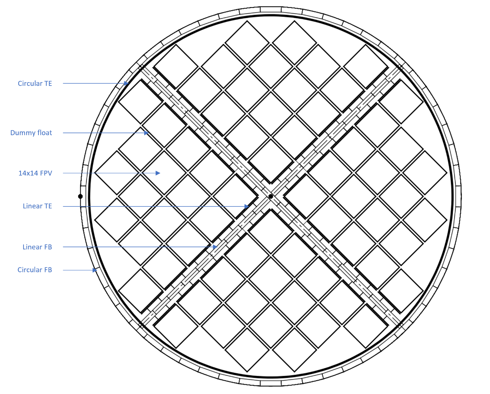{width="5.905511811023622in" height="4.761321084864392in"}

Figure 13: Global system drawing. 7MWp

  ----------------------------------- -----------------------------------
  Power capacity installed            7 157 13 Wp

  Circle Diameter                     346 meter

  14x14 Matrices                      68

  FPV                                 13 328

  Dummy floats                        1792

  Linear Transition element (TE)      40

  FB circle                           56

  FB Bridges, inline                  35
  ----------------------------------- -----------------------------------

Table 7: Overview of installation. 7MWp.

Each square represents a 14x14 FPV matrix. Each matrix is separated by a line of so-called "dummy floats". The matrices are linked to the FB thanks to two types of transition elements.

The linear Transition element is observable (see Figure 14) between the matrices and the straight FB positioned in a perpendicular cross "X" arrangement.

The circular transition element (CTE), observable on the outer perimeter of the matrices in figure 13, between the FB and the matrices.

Then comes the floating breakwaters FB, with a set of FB being deployed all around the circular perimeter to shelter the installation and two lines of FB being installed in the perpendicular "X" configuration inside the circle.

Finally we have the anchoring and mooring below the surface of water following the catenary chain concept exposed earlier. The Figure 14 presents a view of the mooring line from underwater. Each mooring line is located as described in the Figure 11.

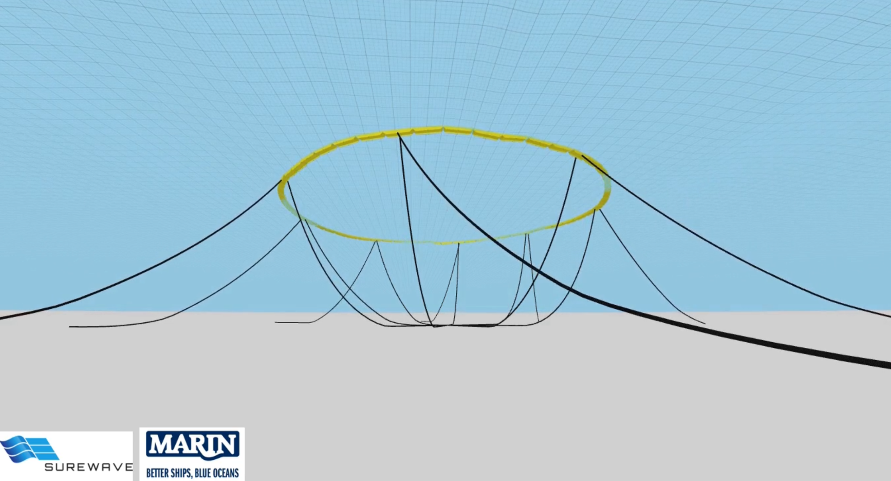{width="5.905511811023622in" height="3.1871019247594052in"}

Figure 14: breakwater ring simulation from MARIN.

## 3.2 3D design

In this section a complete 3D design is presented.

### 3.2.1 FPV (floating solar panel)

##### Aluminium float

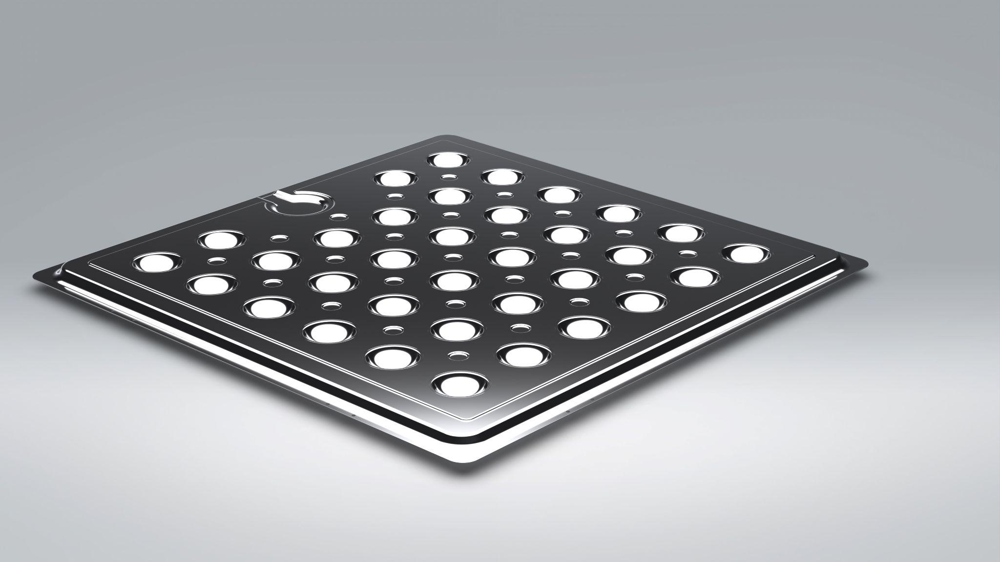{width="5.5705282152230975in" height="2.359355861767279in"}

Figure 15: Aluminium float assembled from 2 pressings

The aluminium float for floating solar installations is made from marine-grade possibly anodized aluminium, offering enhanced thermal conductivity and durability, and is illustrated in Figure 15. Its design ensures efficiency by keeping panels cool, thus boosting electricity production and reducing degradation. The structure is highly resistant to corrosion, impacts from waves, and ice, making it suitable for various water bodies. Panels are interconnected in a factory setting, streamlining on-site deployment. This approach not only simplifies installation but also supports the use of recycled aluminium, with low-carbon footprint. More precise drawing of the float is available in figure 16.

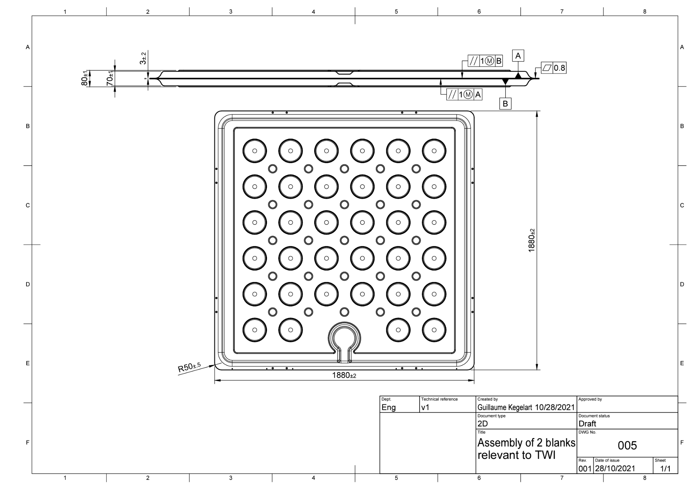{width="4.743602362204724in" height="3.3464566929133857in"}

Figure 16: Drawing with dimensions of the assembled float

##### Solar panel 

Sunlit Sea\'s solar panels are designed for marine applications, adjusted in size to ensure compatibility with the floating structure. These panels are part of a three-year research program (IPN_317808 Maritim Solkraft) aiming to optimize cost-efficiency and durability in marine environments. The goal is to utilize large, economically priced, and functionally optimized solar panels that are directly attached to aluminum floats. This attachment method aims to reduce potential-induced degradation, thereby lowering the overall cost of the panels by about 30% without compromising the ability to utilize the latest panel technologies available in the market. This approach ensures the panels benefit from the cooling and supportive advantages provided by the specially designed aluminium float.

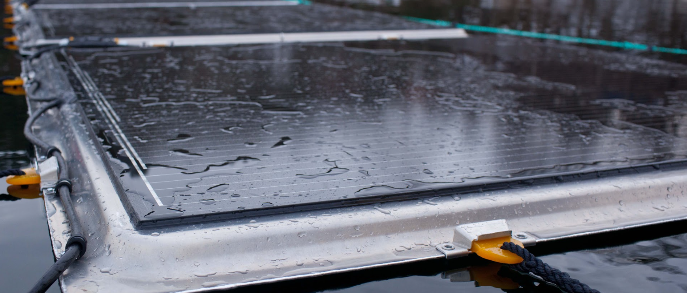{width="5.905511811023622in" height="2.5215594925634295in"}

Figure 17: PV panel close up.

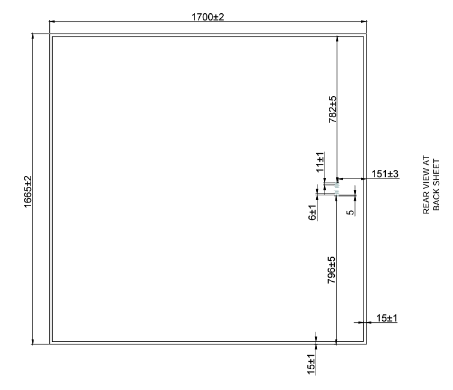{width="4.25044072615923in" height="3.543307086614173in"}

Figure 18: back drawing of PV

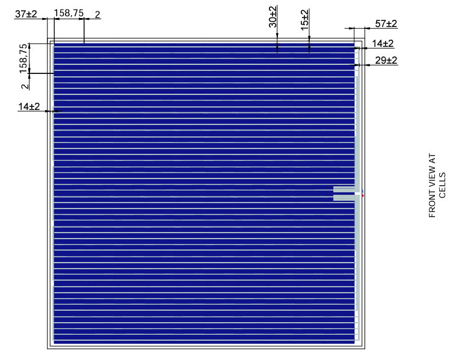{width="5.905511811023622in" height="4.532291119860018in"}

Figure 19: front drawing of PV

##### Double and triple sealing architecture

###### 1st and 2nd sealant

The sealant architecture used in Sunlit Sea Floating Photovoltaic (FPV) system employs a dual-sealant strategy to ensure high reliability and protection against moisture ingress. The design incorporates an outer layer of silicone sealant combined with an inner layer of butyl sealant, further protected by a glass frit layer to shield against UV degradation. This structure is meticulously engineered to prevent both liquid water and water vapour from penetrating the module package, safeguarding the electrical components within. The sealant\'s effectiveness is rigorously verified through damp heat and immersion testing, highlighting its superior moisture-blocking capabilities \[8\]. This sealant architecture is critical for maintaining the durability and performance of the FPV system, especially in challenging marine environments. The figure 20 shows the placement of the 1^st^ sealant (yellow), the 2^nd^ sealant (black) and the 3^rd^ sealant (green).

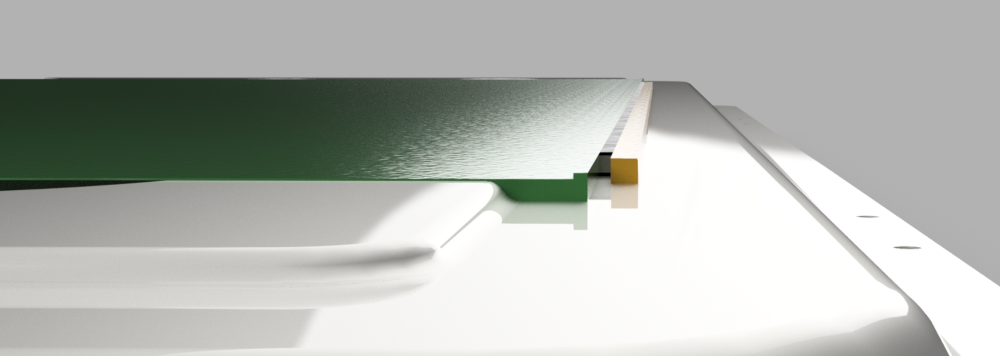{width="4.565203412073491in" height="1.5062259405074365in"}

Figure 20: Sealant placement view, no PV on top.

###### 3rd sealant 

The potting material in Sunlit Sea\'s floating solar panels serves several critical functions: it seals the cavity between the solar panel and the float to prevent water ingress, ensuring the system\'s durability in marine environments. By accommodating thermal expansion and mitigating bending stress, it maintains the structural integrity of the module. The potting material also protects electrical components from moisture and environmental damage, extending the lifespan of the solar panels.

In the two picture above (figure 21), two steps of the 3^rd^ sealant assembly are illustrated:

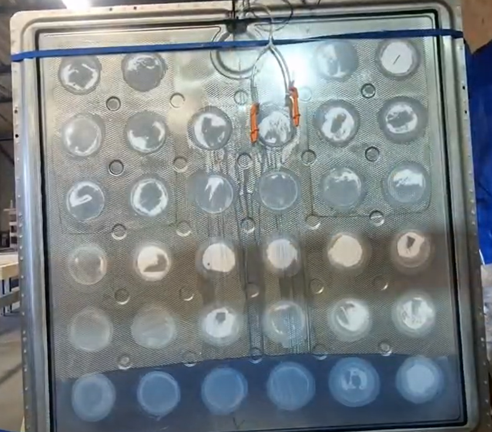{width="2.9153149606299213in" height="2.5393318022747158in"}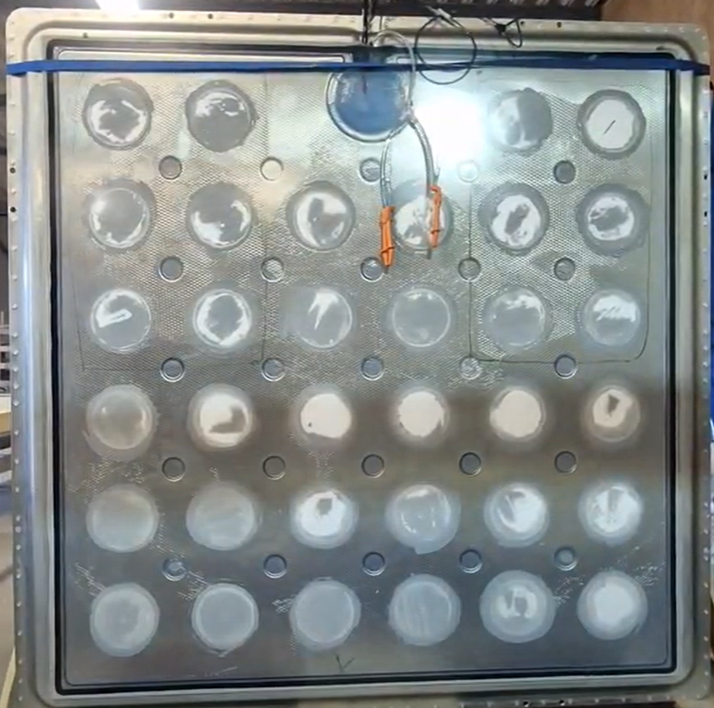{width="2.4193952318460195in" height="2.5293667979002623in"}

Figure 21: Test view of a 3rd sealant injection and lamination before and after lamination.

Before the lamination: the silicone 3rd sealant (PM) is pooled in the bottom of the cavity between the PV and the AL float.\
After lamination: the cavity is vacuumed through air pipes present on the entrance of the cavity (top of the above view) and the PM is therefore spread (laminated) across the cavity.

##### Bracket and hinge

The current hinge design for Sunlit Sea\'s product, shown in figure 22 and 23, involves a sophisticated approach aimed at enhancing durability, resistance, and ease of deployment. It is constructed from polyurethane rubber. Key design aspects include ensuring that the hinge does not snag during deployment, allowing for a specific distance between floats, and distributing load evenly across its length. The design incorporates geometric considerations to prevent slippage and to withstand environmental factors, with a focus on minimising the hinge\'s surface-to-cross-section area ratio to limit weathering effects.

However, after the testing of referred in 2.1 (Scaled midel testing from MARIN), it was noted that the hinges are the weakest component in the full design. Bringing the necessity to iterate efficiently on the design of those for the SUREWAVE project.

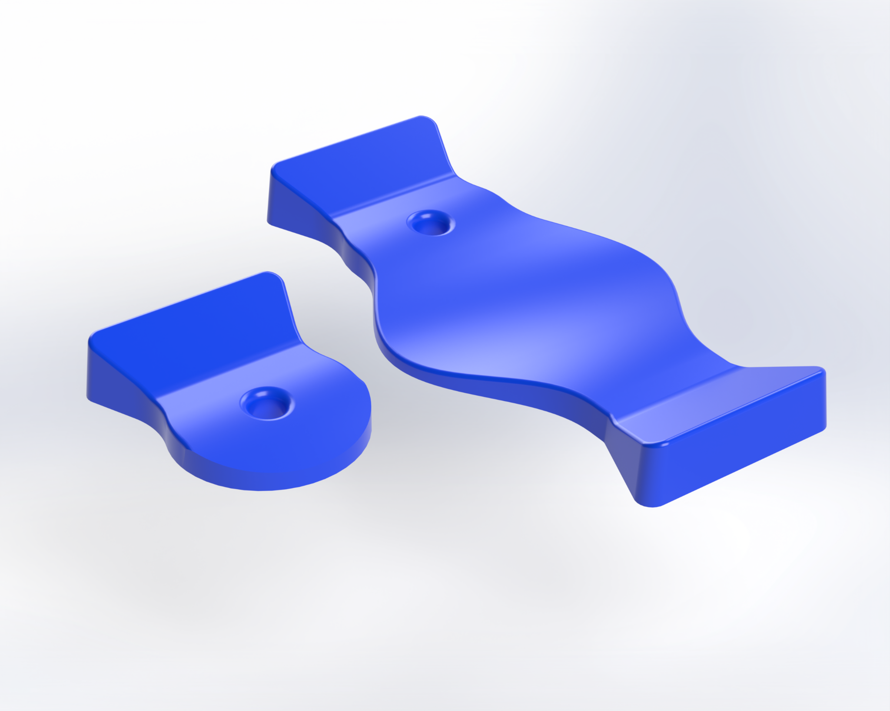{width="4.9397451881014875in" height="3.0482600612423445in"}

Figure 22: Hinge and half hinge

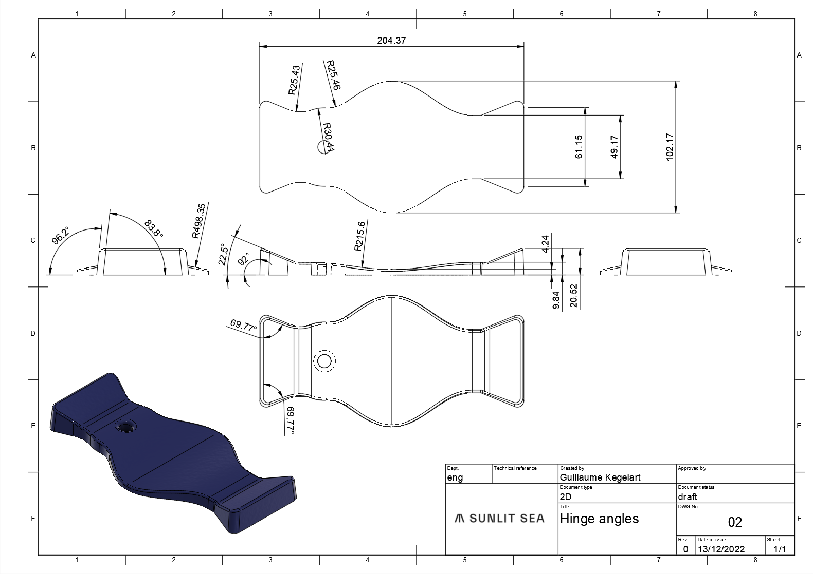{width="5.033623140857393in" height="3.557442038495188in"}

Figure 23: Hinge drawing

The current bracket design (presented in figure 24) is made with a focus on functionality, cost-effectiveness, and manufacturability. It is designed to lock at both the top and bottom of an aluminium float, facilitating a secure connection, and constructed from 1.5 mm 5083 aluminium H111 to match the rest of the float.

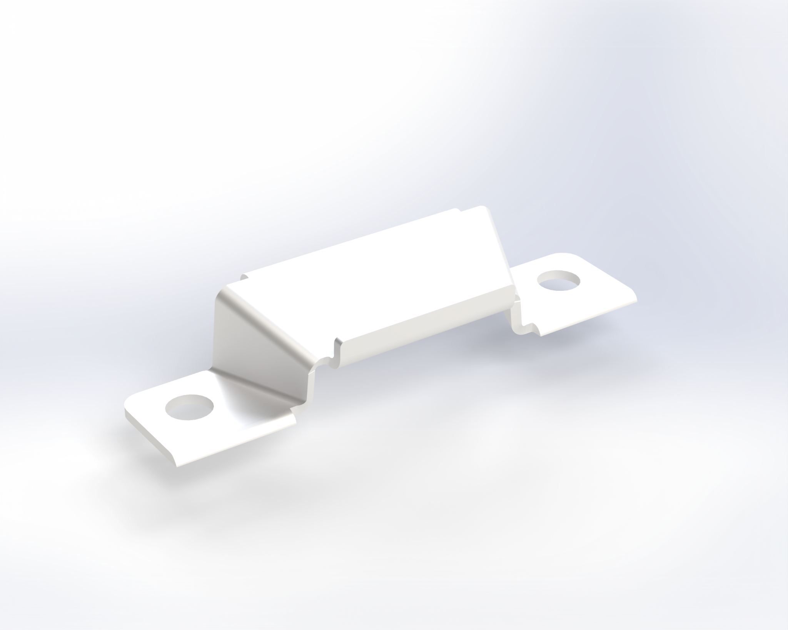{width="5.905511811023622in" height="3.5580708661417324in"}

Figure 24: Last model of the Bracket holding the hinge.

The bracket & hinge has been designed to resist the maximum loads experienced from the assembly with other FPV (2.5kN). For more information on the design loads, refer to the D2.3 "SUREWAVE_D2.3_general_loads_final".

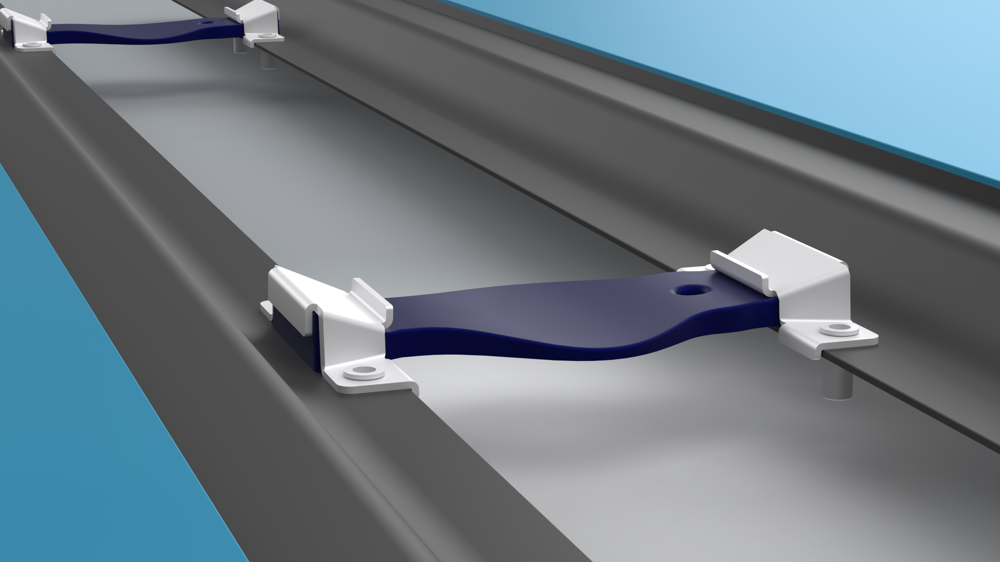{width="5.299784558180227in" height="2.66292104111986in"}

Figure 25: Assembled bracket and hinge on lip of float

##### 

##### String of 14 panels

The individual FPV are assembled during production in a serial string configuration. Figure 26, 27, and 28 illustrate the string in detail and when deployed on water respectively.

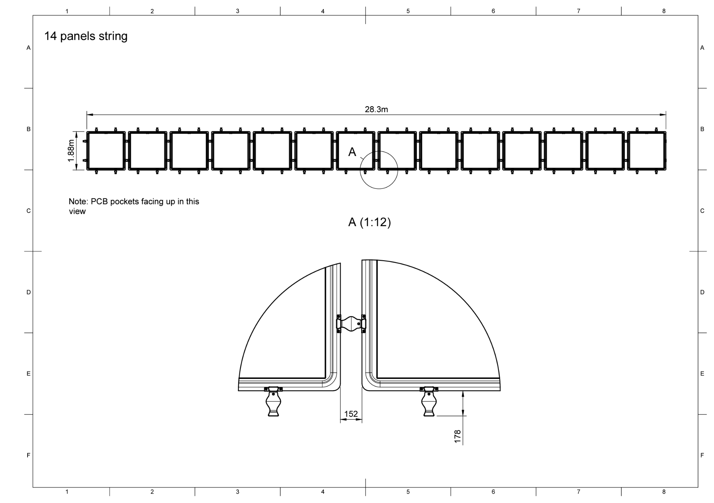{width="5.2932458442694665in" height="3.511464348206474in"}

Figure 26: String of 14 panels serially joined

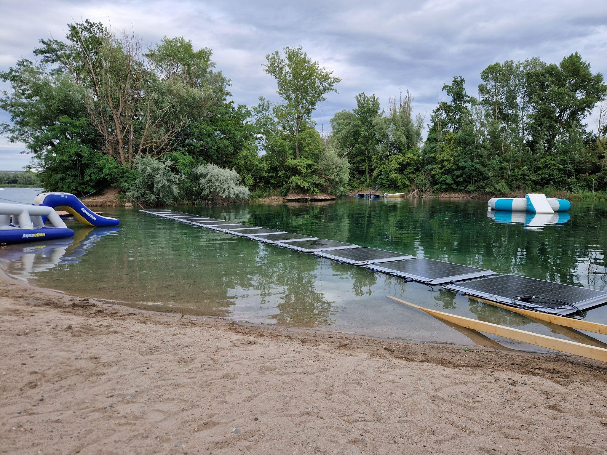{width="4.458824365704287in" height="3.3381725721784776in"}

Figure 27: String of 14 panels on water. SLS Installation of Mannheim project. 2023.

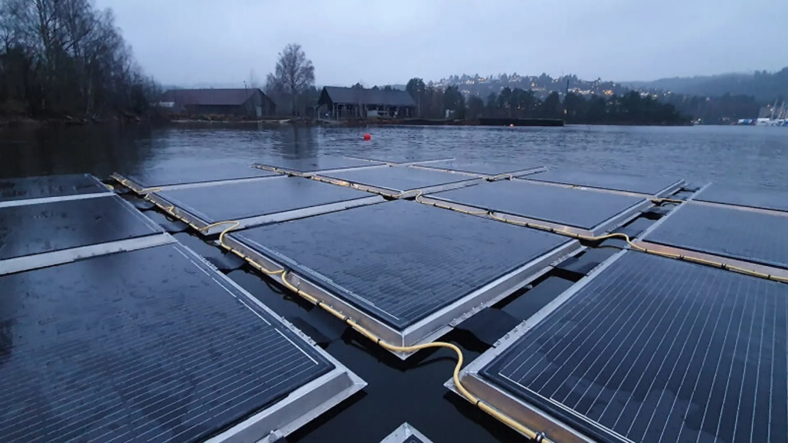{width="5.6in" height="3.1496062992125986in"}

Figure 28: close view of String of panels on water

##### Matrix of 14 x 14 panels

The strings of 14 panels are joined together on their sides using the same brackets + hinge joint as the FPV - FPV connections. They will be located inside the FB protection ring as follow:

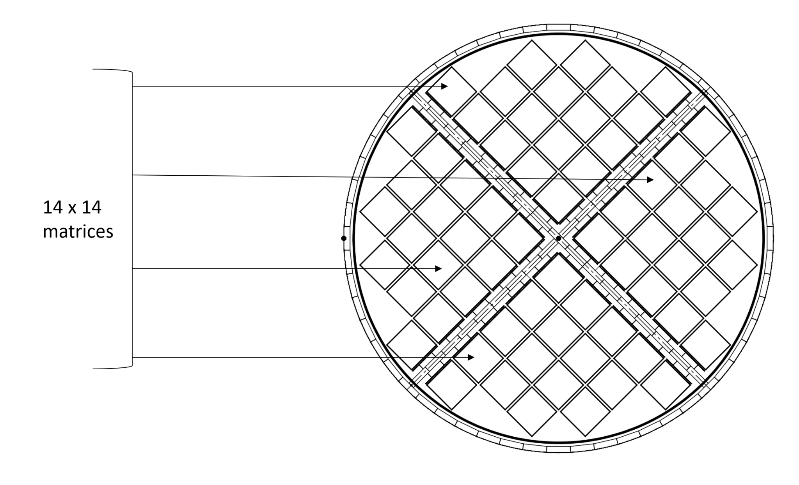{width="5.759381014873141in" height="3.2262073490813648in"}

Figure 29: 14x14 matrices inside the FB ring. Total matrices count = 68

Each square is a full matrix as shown in figure 29. Each matrix, illustrated in figure 32 and 33, is separated from another matrix by a line/string of "dummy float" (DF) as illustrated in figure 30 & 31, attached with hinge and bracket. A dummy float is simply a float without PV on top but a flat plate to enable walking on it.

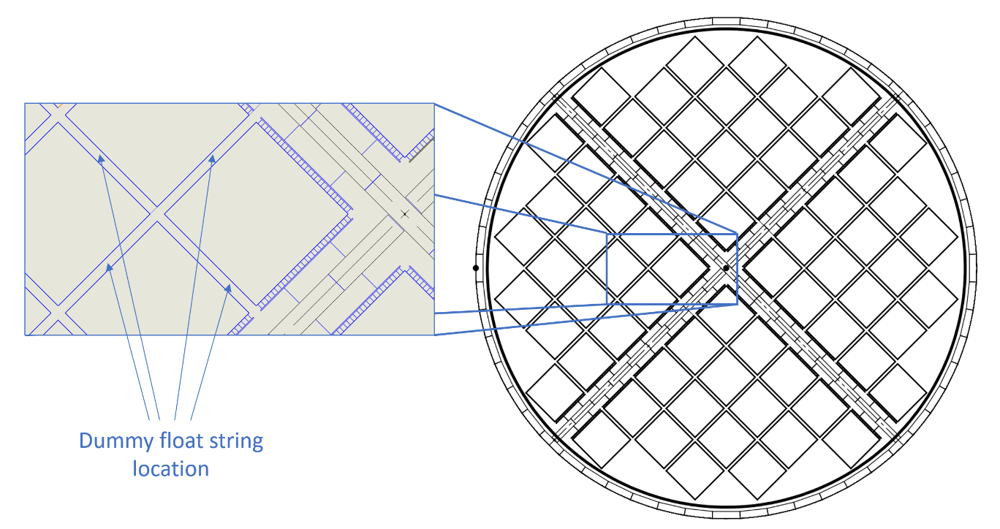{width="5.905511811023622in" height="3.125001093613298in"}

Figure 30: Dummy float location on the installation

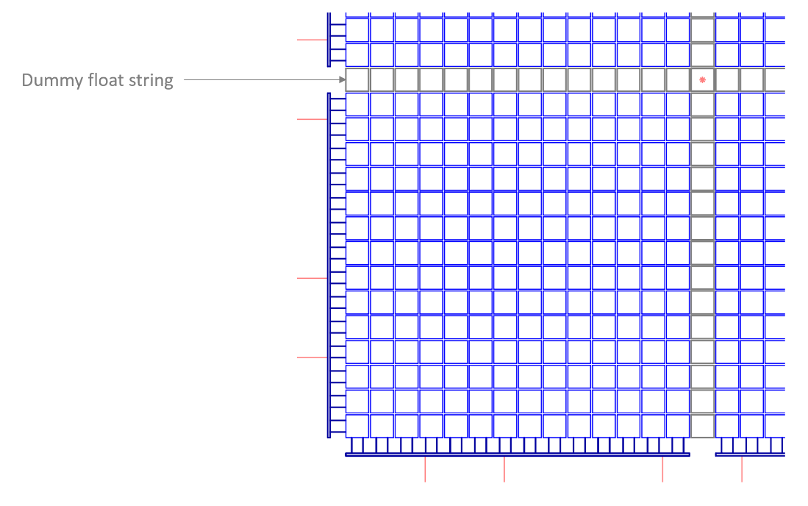{width="5.905511811023622in" height="3.690944881889764in"}

Figure 31: Dummy float string position illustration

The presence of such a regular line of dummy floats in between each matrix is of convenience for O&M steps. If deemed necessary, a more thorough assessment of the removal of some of them in order to yield more power production will be investigated.

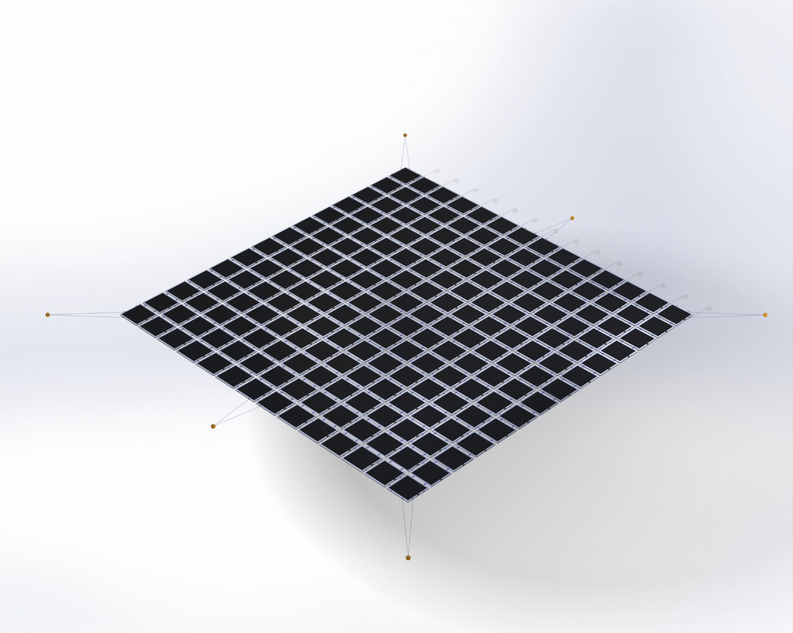{width="5.905511811023622in" height="3.3702952755905513in"}

Figure 32: Example of a 14x14 matrix. Haugaland project. 105kWp.

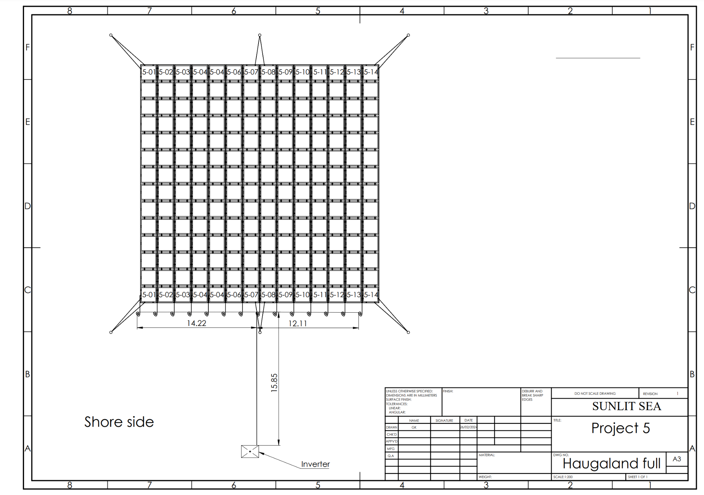{width="5.8794663167104115in" height="4.065978783902012in"}

Figure 33: Haugaland installation drawing. Disregard mooring line.

### 3.2.2 Transition elements

##### Linear transition element

Floating solar systems do not have a separate connection to the seabed. They therefore need to be anchored horizontally in some other way. In the SUREWAVE project, a connection is planned between the FB and the FPV, which transfers the forces from the FPV via the FB and its anchorage into the seabed.

With an elastic connection, shear forces can occur in the PV connections due to uneven movements of the FB. A load distribution in the form of a transition element must therefore be arranged. This transition element should be floatable in order to avoid vertical force transmission. Accordingly, a round tube of the required diameter is suitable. The wall thickness must be selected according to static requirements in order to be able to attach rope connections.

Another advantage of the transition element is that rope connections to the breakwater can be arranged with a larger diameter and in smaller quantity, while smaller ropes in larger quantities are required for the PV modules. The surrounding breakwater and the surrounding transition elements allow all ropes to be pre-tensioned. The figure 34 hereunder gives and explanation of the assembly:

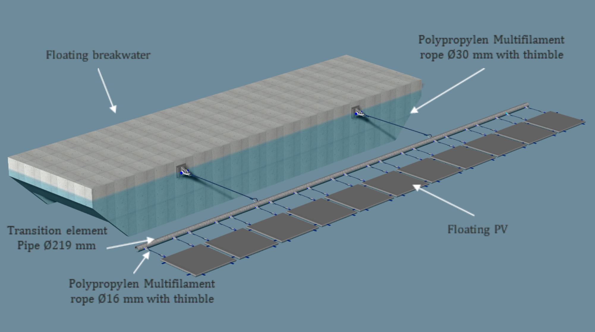{width="5.905511811023622in" height="3.307055993000875in"}

Figure 34: Transition element sketch

The matrices are positioned parallel to the inside FBs. Every matrix in close proximity to the inside linear FBs will be connected to a linear transition element as the ones pointed out in the figure 35 below. The figure 36 offers a close-up view of the linear transition element with attachment collars being featured.

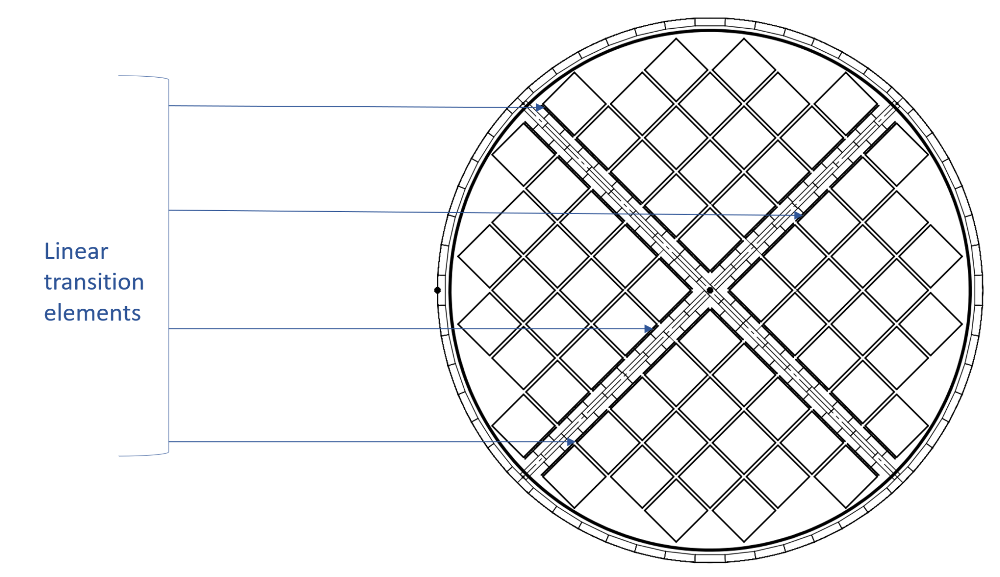{width="6.655813648293964in" height="3.9557141294838147in"}

Figure 35: linear TE locations on 7MW installation

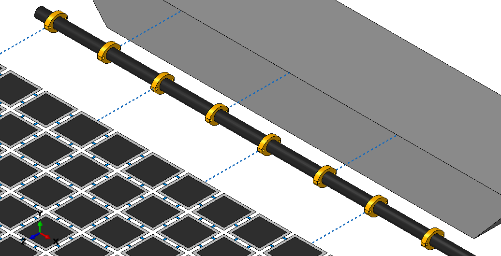{width="6.1552307524059495in" height="3.1496062992125986in"}

Figure 36 2: Arrangements of floating collars, brackets and ropes to connect Break water and module elements

##### Circular transition element

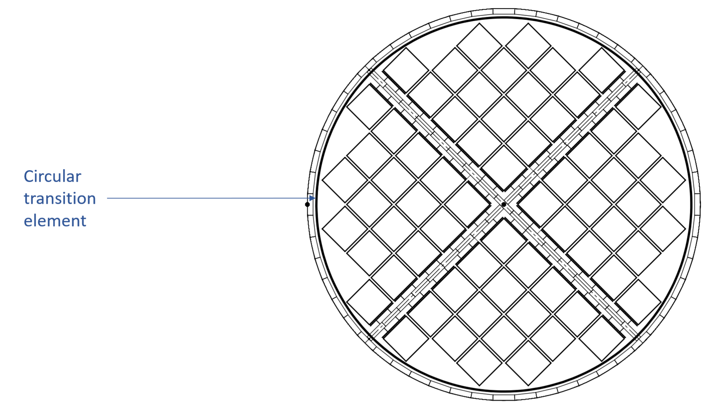{width="6.112204724409449in" height="3.543307086614173in"}

Figure 37: Circular TE location on 7MW installation

The connections between the breakwater elements and the modules are inspired by floating elements technology used in aquaculture industry, namely flexible floating collar made of HDPE and bracket elements and synthetic mooring lines or ropes. This type of connection would ensure that the modules area would stay in place inside the breakwater areas, and with sufficient flexibility between the breakwater and modules. Several manufacturers are producing such equipment: Morenot, ScaleAQ, EPD, Toford to name a few European manufacturers. An illustration of such technologies (Manufactured by ScaleAQ) is highlighted on the Figure 38 below:

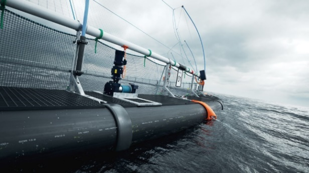{width="5.905511811023622in" height="3.321847112860892in"}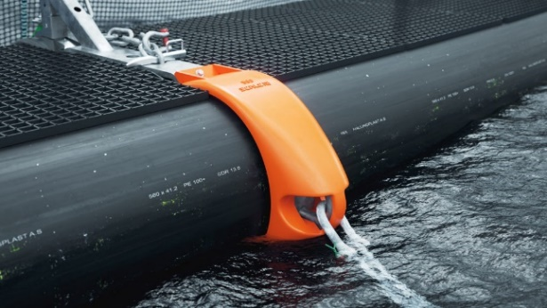{width="5.905511811023622in" height="3.3218482064741908in"}

Figure 38: Illustration of the floating elements that inspired the connection system between Breakwater and modules in SUREWAVE (Ref : [ScaleAQ](https://scaleaq.com/product/fr-pl-560/))

The connection systems design consists of a flexible collar pipe running in between the circular breakwater and modules. The flexible pipe is attached to the FB and the FPV by ropes. The overall position of the circular TE, running in parallel to the FB ring, is pointed in Figure 37.

The attachment of the circular transition element to the FPV is not yet fully designed. There will be a set of polypropylene multifilament ropes (illustrated in figure 39) of different length in the red areas shown in figure 40.

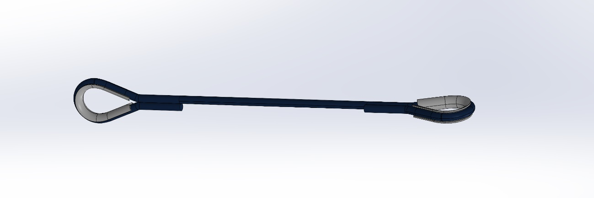{width="5.905511811023622in" height="1.968503937007874in"}

Figure 39: Multifilament polypropylene ropes from TE to FPV

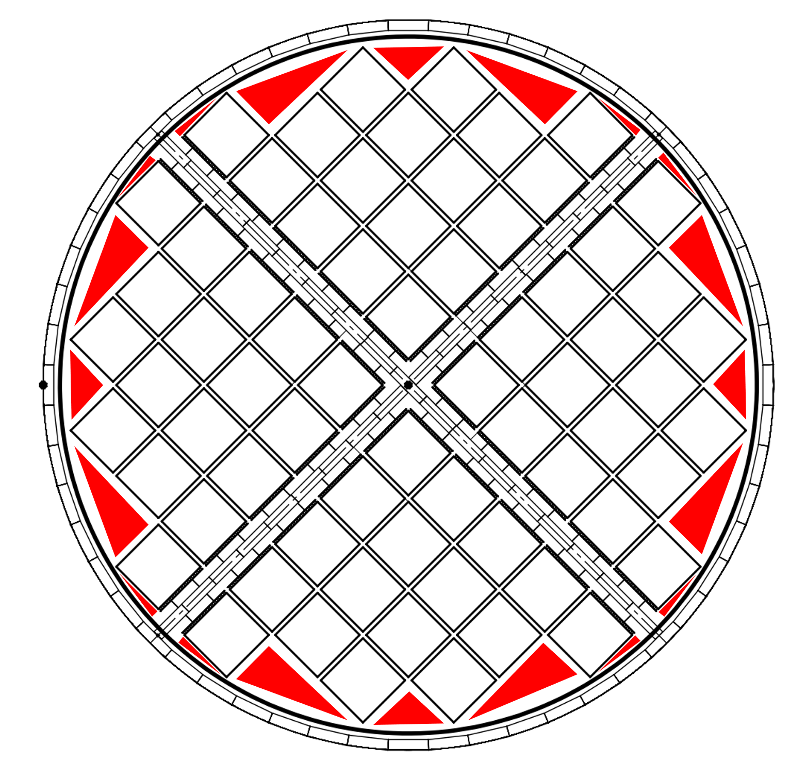{width="5.905511811023622in" height="5.702725284339458in"}

Figure 40: tensioning ropes area of deployment from TE to FPV

Moreover, the red areas are spaces available for more FPV. In those areas, the potential installed FPV module configuration is different from the 14 x 14 matrix shown in figure 32 and 33. The installation of FPV in those areas will increase the total yield of the installation but requires detailed study for the specific placement of strings, the number of FPV per string, their connection to the TE and FB, and their connection to electrical infrastructure.

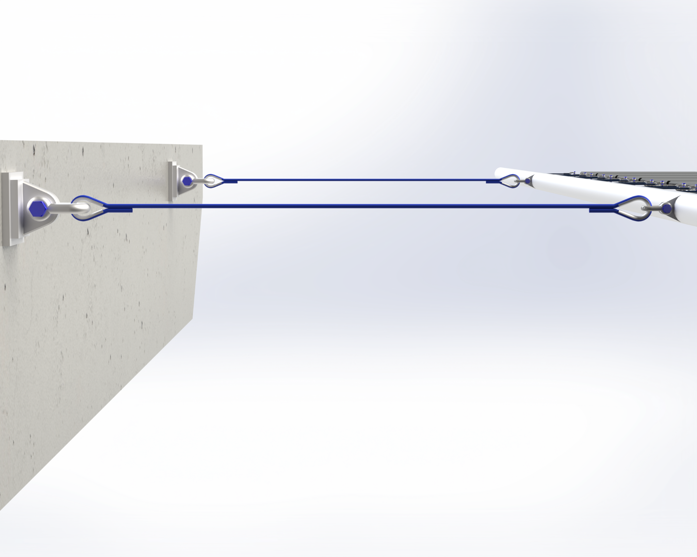{width="5.164780183727034in" height="0.4431496062992126in"}

Figure 41: polypropylene multifilament ropes from FB to TE

The circular TE is also connected to the FB with a set of thicker polypropylene multifilament ropes as shown in figure 41.

### 3.2.3 Floating breakwater

The floating breakwater in the SUREWAVE project plays a crucial role in protecting the floating photovoltaic (FPV) system from harsh offshore conditions. Designed to break or attenuate high-frequency wave energy, the breakwater ensures the structural integrity of the FPV units by reducing the impact of slamming loads and large overturning motions caused by wave breaking. This innovative offshore breakwater, conceived as a modular perimetral system made of multiple modules as the one illustrated in figure 42, is vital for the project\'s success in extreme conditions. It\'s designed not to dampen longer wave periods but to allow the high flexibility of the FPV system to adapt to such conditions, which are expected to occur infrequently. By mitigating critical wave energy and ensuring the FPV system\'s stability, the floating breakwater significantly contributes to the project\'s overall efficiency and safety.

#### 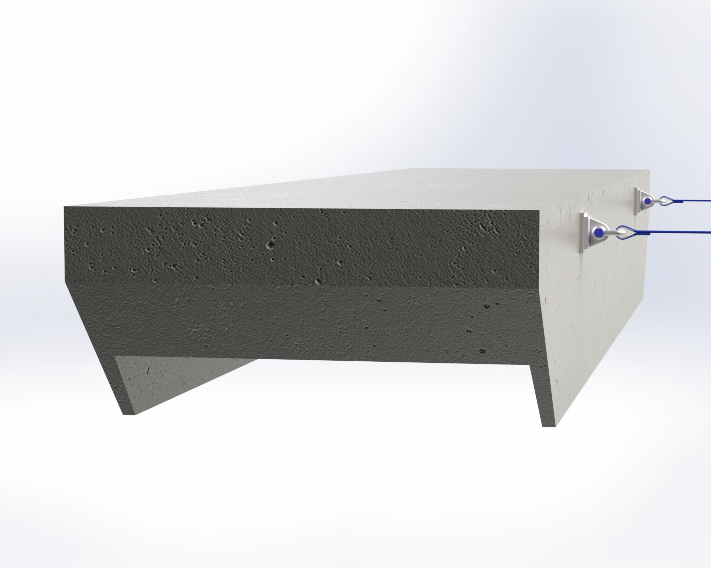{width="5.905509623797025in" height="2.1381660104986877in"}

Figure 42: floating breakwater design.

#### 

#### Floating Breakwater: Internal Floating Breakwater

The architecture presented for the installation; we have 2 types of breakwaters pattern identified. The first type is the peripheral FB, deployed in a circular shape around the installation as shown in figure 43. These FB are designed to protect against the wave arriving from all the directions.

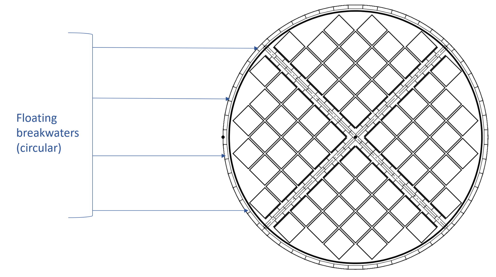{width="5.905511811023622in" height="3.292173009623797in"}

Figure 43: Exterior FB location. 7MW installation

#### Floating breakwater (bridges)

The second is the interior FB which are called bridges. They ensure structural integrity of the perimeter circle and offer a walking area for maintenance as well as an area where to install parts of the electrical infrastructure (Inverter, Transformer). See the figure 44 for reference.

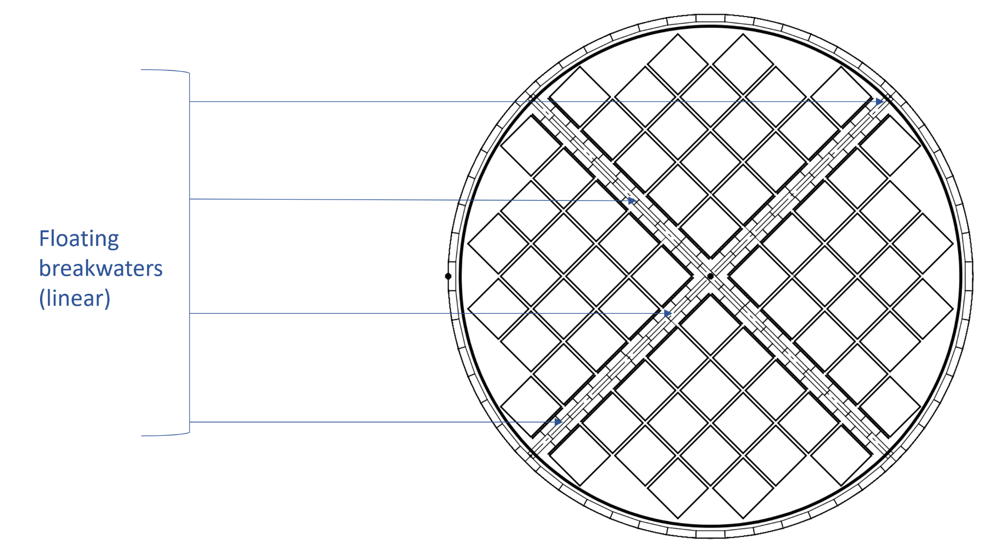{width="5.905511811023622in" height="3.22673665791776in"}

Figure 44: Interior FB location. 7MW installation

### 3.2.4 Electrical Components

The electrical infrastructure of the SUREWAVE installation, incorporating the inverter and transformer station, focuses on the efficient and safe conversion and transmission of electrical power from the floating photovoltaic (FPV) arrays to the grid. Here\'s an integrated overview including these components:

#### DC Electrical System Components:

**DC Distribution/combiner Boards** (figure 45): Include fuses and grounding cables for overcurrent protection and system grounding.

**DC Isolator Switch**: Located at the inverter\'s base for DC supply isolation, with cables neatly terminated and labelled.

**Surge Protection Devices (SPDs)**: Protect both DC and AC circuits from electrical surges, crucial for system integrity.

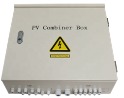{width="2.952755905511811in" height="2.1668799212598424in"}

Figure 45: Solar junction box.

Each string of solar panels consists of 14 solar floats. The home run from the cables is routed onto a dummy float string and once 14 strings have been pooled together, they are joined in a junction box illustrated in figure 46 and 47. An overview of all the junction boxes locations (red square) is given in figure 48.

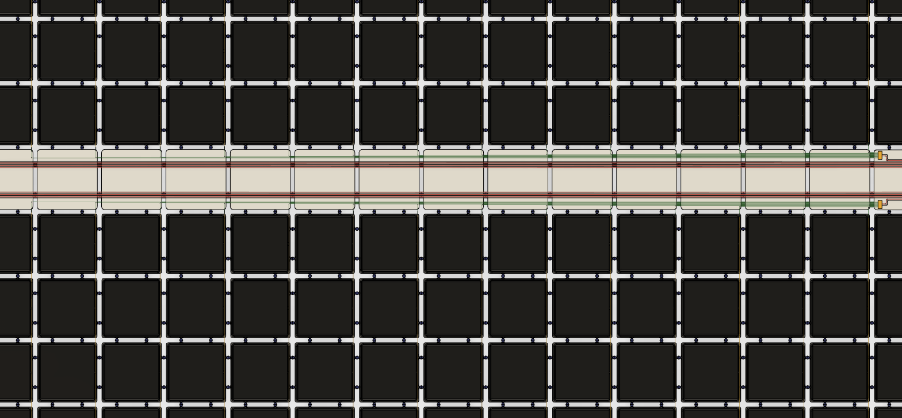{width="5.905511811023622in" height="2.748937007874016in"}

Figure 46: 14 parallel coupled strings combined in a junction box, far right in this illustration. The junction box is located on a dummy float.

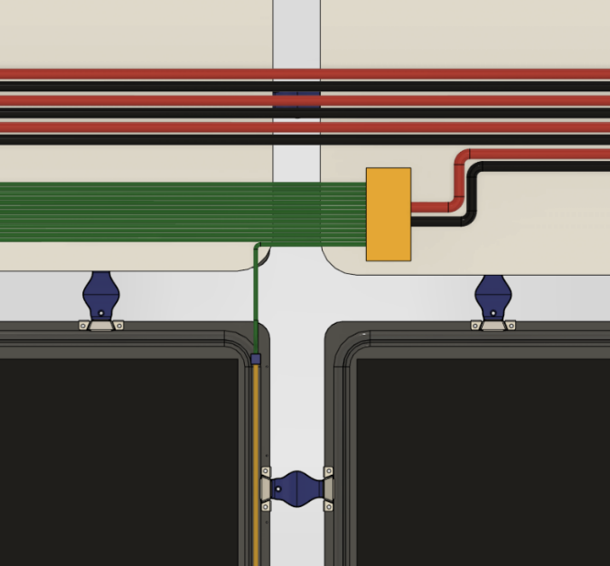{width="5.905511811023622in" height="5.501025809273841in"}

Figure 47: Close up of a junction box combining 14 strings into two home runs in a combiner box (orange box).

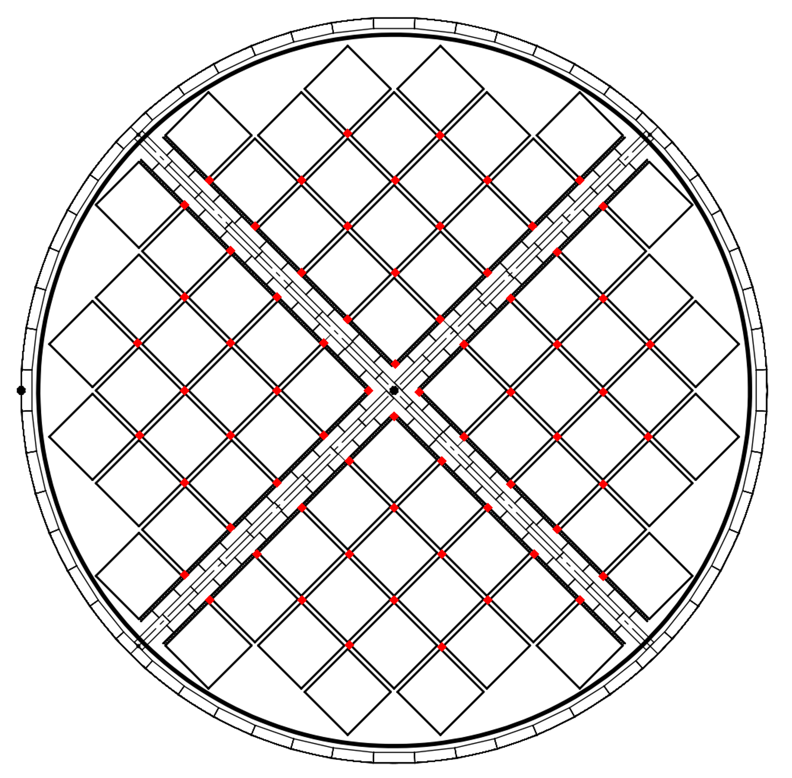{width="5.905511811023622in" height="5.5929768153980755in"}

Figure 48: location of 68 combiner elements (represented as red squares) of the DC part of the electrical installation. 7MW.

####  Inverter: 

Converting DC electricity generated by solar panels into AC electricity is a crucial step in harnessing solar power for various applications. This conversion process, typically performed by inverters, which converts DC electricity from the solar panels into AC electricity, equipped with overcurrent protection to ensure compatibility with grid requirements and enhance safety. The inverters are located on the linear FB situated inside the sheltered area of the installation (Blue square), as shown in figure 49.

#### AC Electrical System Components:

AC-side Surge Protection Devices: Protect AC circuits from surges, ensuring system resilience.

AC Isolators: Act as emergency shutoffs, allowing for immediate power disconnection.

LED Lamps: Indicate grid and FPV electricity supply, enhancing safety and monitoring.

In most cases, these AC Electrical System Components are located in the inverter locations (Blue square) as shown in figure 49.

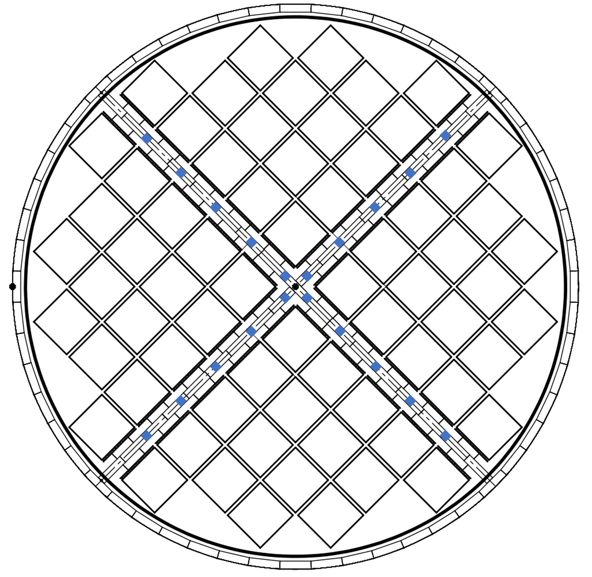{width="5.135542432195975in" height="5.367133639545057in"}

Figure 49: Inverters locations (Blue markers). 7MWp installation.

\
Transformer Station:

Steps up the voltage from the inverter to match the grid\'s voltage levels, essential for minimizing energy loss during transmission and ensuring grid compatibility. The transformation station plays an essential role in the power conversion from the FPV to the grid. It is therefore placed in the centre of the installation as illustrated in figure 50 (green square).

#### Safety and Grounding Components:

Equipotential Bonding Conductors: Ensure all conductive parts are bonded and grounded to minimize lightning damage risk.

Grounding to Reservoir Bed or Water Surface: Provides additional protection against electrical surges and lightning.

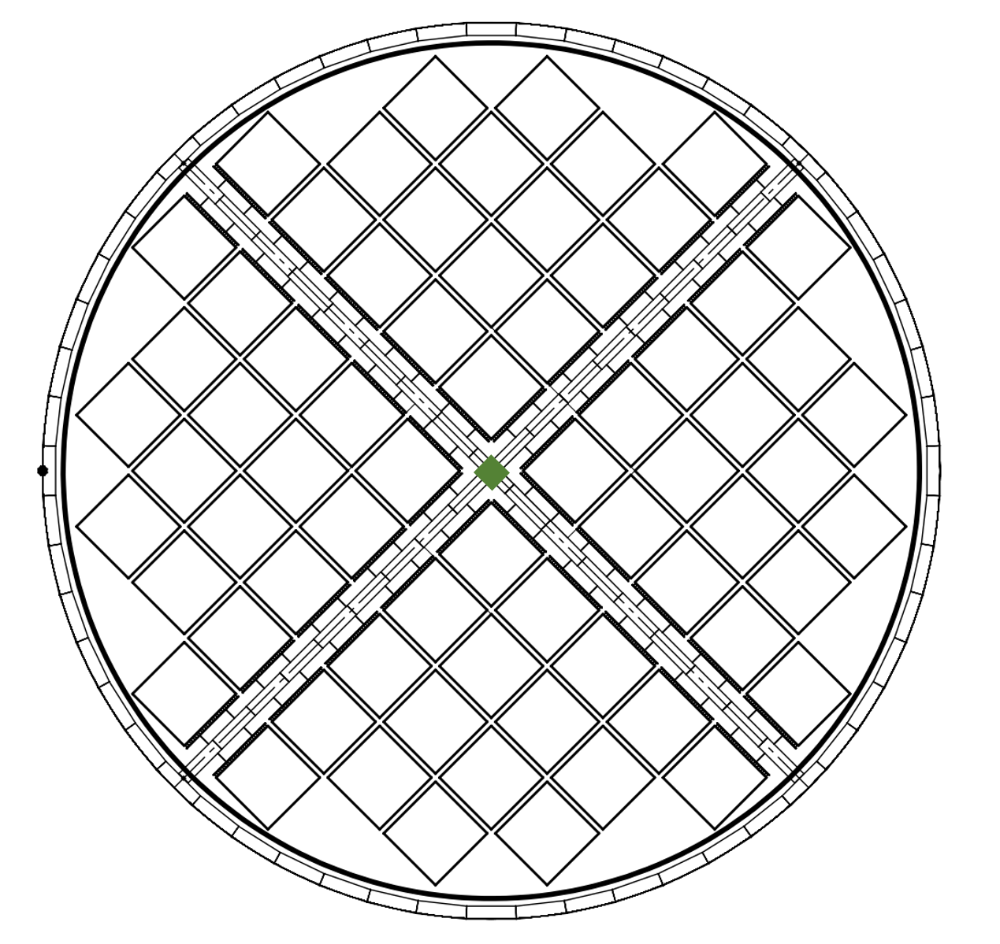{width="5.368766404199475in" height="5.329479440069991in"}

Figured 50: transformer station location 7MWp installation.

#### Safety and Grounding Components:

Equipotential Bonding Conductors: Ensure all conductive parts are bonded and grounded to minimize lightning damage risk.

Grounding to Reservoir Bed or Water Surface: Provides additional protection against electrical surges and lightning.

## 3.3 Smaller scale 420kWp Pilot size installation 

The 7MW installation detailed in section 3.1 represents a major objective within the SUREWAVE project, presenting the system\'s intended operation in offshore environments. However, due to its substantial scale, gaining a comprehensive understanding of FPV systems at smaller scales is extremely important. Thus, investigating the operation of such systems on a smaller scale, deployable within a shorter time span, becomes crucial. This section will focus into the description of a **smaller-scale system (420kWp)**, ideal for piloting phases. Figure 51 illustrates the layout of this installation.

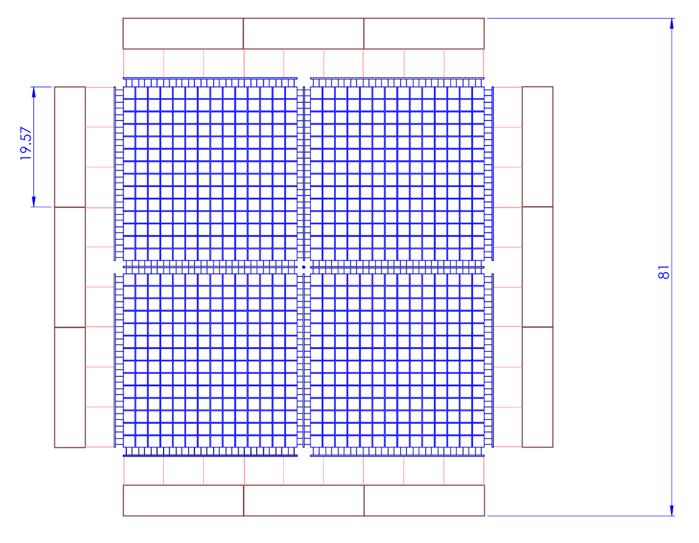{width="5.96924978127734in" height="4.638606736657918in"}

Figure 51: Plan of the 420kWp installation

  ----------------------------------- -----------------------------------
  Power capacity installed            420 kWp

  Square length                       81 meters

  14x14 Matrices                      4

  FPV                                 784

  Dummy floats                        1 (middle)

  Linear Transition element (TE)      12

  FB circle                           0

  FB Bridges, inline                  12
  ----------------------------------- -----------------------------------

Table 8: overview of installation. 420kWp

This installation summarized in the table 8 is based entirely on the components described in the 3.1 and 3.2 part of this report. The adjustments will be the configuration from a circular to a square and the number of components. Each FB is anchored with a chain and anchor to the seabed.

As this installation would be considered a pilot, the recommended location for such system, based on the location described in D2.1: "Use case scenario for typical rough location" would preferably be one of the mild location: Baltic sea (*54°12\'N 14°24\'E )* or Mediterranean sea (*39°00\'N 0°00\'E)*. The figure 52 and 53 give an idea of where those location are. In those locations, the significant wave heights are generally lower and the relative proximity to the shore offer more possibilities considering the cables to bring the power to the grid. The list of components forming this installation is presented in the section 5 of this report: bill of material.

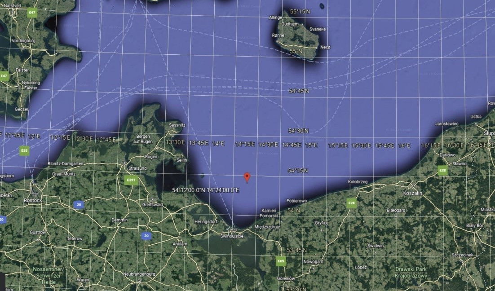{width="5.118110236220472in" height="3.0068897637795278in"}

Figure 52: Location 54°12\'N 14°24\'E, in region Baltic

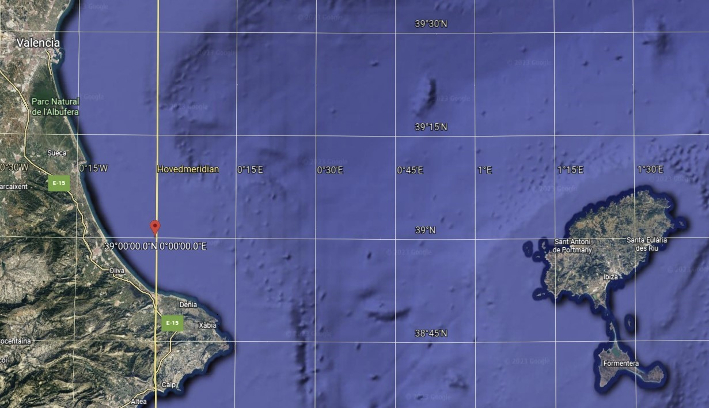{width="5.118110236220472in" height="2.9543569553805775in"}

Figure 53: Location 39°00\'N 0°00\'E, in region Western Mediterranean.

# Installation requirements

## 4.1 Installation process and procedures

Although the SUREWAVE installation will be quite different from the classic Sunlit Sea installation, the FPV deployment will capitalise on previous experiences and projects from the Sunlit Sea \[6\] and from its integrated prefabrication of floating solar units. Here is a brief overview of all the installation procedure is given both for FPV and also for FB.

## 4.2 FPV

### 4.2.1Site Preparation and Integration Planning

Adjust the site preparation steps to accommodate the SUREWAVE floating breakwater system, ensuring the FPV units can be integrated seamlessly. This includes layout adjustments for the transition elements that will connect the FPV system to the breakwaters. It also includes delimitation of the necessary area for deployment onshore.

#### Delivery and Preparation of FPV Units

Ensure the FPV units are prepared. Including marking and orienting crates (as described in figure 54) for streamlined deployment and assembly.

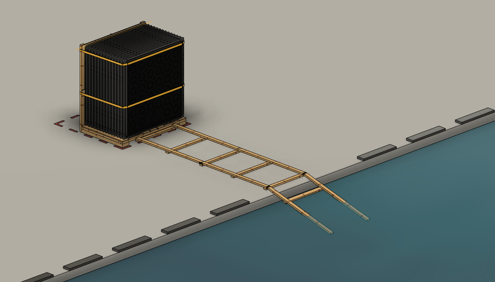{width="5.0in" height="2.8468208661417322in"}

Figure 54: FPV crate correctly placed and oriented for deployment

### 4.2.2 Deployment Ramp and On-Water Assembly Adjustments

Adapt the deployment ramp construction (see figure 44) to facilitate the integration of FPV units with the breakwaters, ensuring the assembly process on water is efficient and aligned with environmental protection requirements.

### 4.2.3 Integration with Floating Breakwaters and Transition Elements

Transition Element Integration: While ensuring the FPV units\' integration with the floating breakwaters, maintain a focus on the overall deployment process. The transition elements are crucial for connecting the FPV units to the breakwaters.

### 4.2.4 Mechanical Connections: 

Establish a process to assemble mechanical connections between the FPV units, transition elements, and floating breakwaters, ensuring the system\'s stability and durability against marine conditions.

#### Mooring and Positioning

Use the original Sunlit Sea mooring attachment points to align with the TE and FB system, focusing on stability and environmental considerations.

### 4.2.5 Final Assembly, Inspection, and Commissioning

#### Comprehensive System Check: 

Post-deployment inspections should cover the FPV units, their connections to the transition elements, and integration with the floating breakwaters. This includes ensuring that the entire assembly meets operational efficiency, safety standards, and environmental compliance.

#### Commissioning:

Proceed with the electrical and operational commissioning of the FPV system, ensuring it operates seamlessly with the SUREWAVE floating breakwater system and adheres to all relevant standards and regulations.

This adapted process emphasises a holistic approach to deploying the FPV system within the SUREWAVE architecture, ensuring efficient integration with floating breakwaters while balancing environmental, mechanical, and operational considerations.

## 4.3 Floating breakwater

The process for the deployment of the floating breakwaters involves incorporating specific details relevant to SUREWAVE \'S approach, materials, and environmental considerations. Here\'s how the process can be tailored to fit the project:

### 4.3.1 Design and Construction

**Construction:**

SUREWAVE floating breakwaters are constructed off-site, utilizing precast reinforced concrete modules. This approach facilitates transport and assembly at the deployment site. The use of Ultra-High-Performance Fibre-Reinforced Concrete (UHPFRC) and Light Weight Aggregate Concrete (LWAC) is explored for their advantages in durability and environmental impact. For more information on the design of the FB, refer to the D3.2:​Floating breakwater design from WP3.

### 4.3.2 Pre-Deployment Checks

**Quality Assurance:**

Emphasizing the importance of sustainable and durable construction, SUREWAVE \'S floating breakwaters undergo rigorous quality checks, focusing on their ability to withstand marine environments with minimal ecological footprint.

**Permits and Compliance:**

The project seeks all necessary permits, ensuring compliance with environmental regulations and emphasizing the development of environmentally sustainable breakwater solutions.

### 4.3.3 Transportation to Deployment Site

**Method Selection:**

The precast modules of SUREWAVE \'S breakwaters are transported to the deployment site, considering the most efficient and environmentally friendly methods based on their size and the distance

**Preparation for Transport:**

Special attention is given to securing the breakwaters for transport, ensuring they are protected against damage and ready for assembly upon arrival.

**Navigation Planning:**

A comprehensive route plan is carefully designed ted to prioritize environmental preservation and minimize any potential impact on marine life throughout the transportation process. This requires thorough consideration of factors such as avoiding sensitive ecosystems, adhering to designated marine routes, and implementing measures to mitigate noise pollution or disturbances that could affect marine habitats. By carefully planning the transportation route, the project aims to uphold ecological integrity and ensure the wellbeing of marine ecosystems along the journey.

### 4.3.4 Deployment Preparation

**Positioning:**

Utilizing maritime engineering expertise, the breakwaters are accurately placed at the designated location, ensuring they meet the protection requirements of the FPV systems. Through advanced techniques and specialized knowledge, including hydrodynamics and structural analysis, engineers ensure that the FB are well positioned to protect against the extreme loads.

**Anchoring:**

In addition to precise placement, anchoring plays a pivotal role in securing both the breakwaters and FPV systems in their designated locations. The anchoring system design in section 3.1 will be utilized to ensures stability and resilience against varying environmental conditions, including strong currents and turbulent waves. A thorough seabed investigation will be performed to determine a suitable anchoring solution.

**Connection:**

Both electrical and mechanical connections will be designed to ensure the connection system withstand offshore environments. An integration of solar panels, inverters, and electrical distribution systems will be performed. Similarly, a mechanical connection system will ensure both FB and FPV are secured and able to withstand the loads.

### 4.3.5 Post-Deployment Activities

**Inspection and Adjustment:**

Initial inspections confirm the proper function of the breakwaters, with adjustments made as necessary to optimize environmental compatibility and protection efficiency.

**Monitoring:**

Ongoing environmental monitoring assesses the impact on marine life and informs any needed adjustments or maintenance to ensure the breakwaters remain an effective and sustainable solution.

### 4.3.6 Maintenance

Maintenance practices emphasize sustainability, with inspections focused on ensuring the longevity and environmental performance of the breakwater structures.

This adapted procedure highlights the SUREWAVE project\'s focus on sustainability, environmental responsibility, and integration with offshore FPV systems, requiring close coordination among engineers, environmental scientists, and maritime logistics experts.

### 

## 4.4 Safety and compliance requirements

The safety and compliance requirements involve considering the unique aspects of integrating floating photovoltaic (FPV) systems with floating breakwaters. Here\'s how the general safety and compliance requirements can be adapted to the SUREWAVE installation:

### 4.4.1 Design and Construction

**Structural Integrity:**

Both the FPV units and the floating breakwaters must be designed to withstand the offshore environment\'s challenges, including significant wave action, wind, and potential loads from marine growth. The design of mechanical connections between the FPV units and the breakwater requires special attention to ensure load transfer without causing damage.

**Material Safety:**

The use of materials for both the FPV units and the breakwaters should prioritize durability, corrosion resistance, and minimal environmental impact. The Sunlit Sea FPV model 1, for example, uses an aluminium float for its robustness and longevity in marine conditions.

**Buoyancy and Stability:**

The integration of the FPV system with the floating breakwaters must maintain adequate buoyancy and stability, considering the added complexity of connections and the dynamic forces at play.

### 4.4.2 Electrical Safety

Electrical Codes: Compliance with relevant electrical codes (e.g., IEC standards) is crucial, especially given the unique challenges of combining electrical installations with maritime structures.

Waterproofing and Corrosion Protection: Extra care must be taken to waterproof all electrical components and protect against corrosion, a significant concern in marine environments.

Grounding and Lightning Protection: Given the increased exposure in offshore settings, robust grounding and lightning protection systems are even more critical to safeguard the installation and personnel

### 4.4.3 Environmental Compliance

**Environmental Impact Assessment (EIA):**

The EIA for SUREWAVE installations should cover the potential impacts of both the FPV system and the floating breakwaters on the marine environment.

Permitting and Biodiversity Protection:

Obtaining the necessary permits requires detailed plans for minimizing impacts on marine life, including considerations for how the floating structures might affect local ecosystems.

### 4.4.4 Operational Safety

**Access, Signage, and Lighting:**

Safe access for maintenance is crucial, with additional considerations for emergency response given the offshore context. Signage and lighting must be designed for visibility in maritime conditions.

**Monitoring and Maintenance:**

Regular monitoring should include structural integrity, electrical safety, and environmental impact, with maintenance plans addressing the unique challenges of offshore operations.

### 4.4.5 Decommissioning

**End-of-Life Plan:**

Plans for decommissioning must consider the removal of both the FPV system and the floating breakwaters, ensuring materials are disposed of or recycled in an environmentally responsible manner.

Incorporating these tailored safety and compliance requirements into the SUREWAVE project ensures that the integration of FPV systems with floating breakwaters addresses the specific risks and regulatory standards applicable to offshore installations.

# Bill-of-materials

The 7MWp installation bill of material is presented in the table 9 below.

+-----------------------------------+-----------------------+----------------------------------------------------+------------------------+
| Component name                    | Quantity              | Material                                           | Price estimation (EUR) |
+-----------------------------------+-----------------------+----------------------------------------------------+------------------------+
| FPV                               | 13328 modules         | Aluminium, glass, solar cells, silicone, butyl, PU | 8 M -- 10 M EUR        |
+-----------------------------------+-----------------------+----------------------------------------------------+                        |
| Dummy floats                      | 1792 units            | Aluminium, PU                                      |                        |
+-----------------------------------+-----------------------+----------------------------------------------------+                        |
| Linear TE                         | 40 units              | Aluminium / Plastic                                |                        |
+-----------------------------------+-----------------------+----------------------------------------------------+                        |
| Polypropylene multifilament ropes | 1200 m                | Polypropylene                                      |                        |
+-----------------------------------+-----------------------+----------------------------------------------------+                        |
| Circular TE                       | 1037 m                | HDPE (High density Polyethylene)                   |                        |
+-----------------------------------+-----------------------+----------------------------------------------------+                        |
| FB circular                       | 56 units              | Concrete, steel, EPS                               |                        |
+-----------------------------------+-----------------------+----------------------------------------------------+                        |
| FB bridge                         | 17 + 18 = 35 units    | Concrete, stee, EPS                                |                        |
+-----------------------------------+-----------------------+----------------------------------------------------+                        |
| Anchoring & mooring of the FB     | 14 chains and anchors | Marine grade steel                                 |                        |
+-----------------------------------+-----------------------+----------------------------------------------------+                        |
| Combiner boxes                    | 68 boxes              |                                                    |                        |
+-----------------------------------+-----------------------+----------------------------------------------------+                        |
| DC cable (estimate)               | 4080 m                | Double insulated DC AL cores                       |                        |
+-----------------------------------+-----------------------+----------------------------------------------------+                        |
| Inverter                          | 20 units              |                                                    |                        |
+-----------------------------------+-----------------------+----------------------------------------------------+                        |
| AC cable (estimate)               | 1750 m                | Double insulated DC AL cores                       |                        |
+-----------------------------------+-----------------------+----------------------------------------------------+                        |
| Transformer station               | 1 unit                |                                                    |                        |
+-----------------------------------+-----------------------+----------------------------------------------------+                        |
| AC power cable to shore           | TBD                   |                                                    |                        |
+-----------------------------------+-----------------------+----------------------------------------------------+------------------------+

Table 9: BOM global system.

The 420kWp installation bill of material is presented in the table 10 below.

+-----------------------------------+----------------------+----------------------------------------------------+------------------------+
| Component name                    | Quantity             | Material                                           | Price estimation (EUR) |
+-----------------------------------+----------------------+----------------------------------------------------+------------------------+
| FPV                               | 784 modules          | Aluminium, glass, solar cells, silicone, butyl, PU | 0.4 -- 0.6 M EUR       |
+-----------------------------------+----------------------+----------------------------------------------------+                        |
| Dummy floats                      | 1 unit               | Aluminium, PU                                      |                        |
+-----------------------------------+----------------------+----------------------------------------------------+                        |
| Linear TE                         | 12 units             | Aluminium / Plastic                                |                        |
+-----------------------------------+----------------------+----------------------------------------------------+                        |
| Polypropylene multifilament ropes | 700 m                | Polypropylene                                      |                        |
+-----------------------------------+----------------------+----------------------------------------------------+                        |
| Circular TE                       | 0 m                  | HDPE (High density Polyethylene)                   |                        |
+-----------------------------------+----------------------+----------------------------------------------------+                        |
| FB circular                       | 0 units              | Concrete, steel, EPS                               |                        |
+-----------------------------------+----------------------+----------------------------------------------------+                        |
| FB bridge                         | 9 units              | Concrete, stee, EPS                                |                        |
+-----------------------------------+----------------------+----------------------------------------------------+                        |
| Anchoring & mooring of the FB     | 9 chains and anchors | Marine grade steel                                 |                        |
+-----------------------------------+----------------------+----------------------------------------------------+                        |
| Combiner boxes                    | 4 boxes              |                                                    |                        |
+-----------------------------------+----------------------+----------------------------------------------------+                        |
| DC cable (estimate)               | \<10 m               | Double insulated DC AL cores                       |                        |
+-----------------------------------+----------------------+----------------------------------------------------+                        |
| Inverter                          | 4 units              |                                                    |                        |
+-----------------------------------+----------------------+----------------------------------------------------+                        |
| AC cable (estimate)               | \<10 m               | Double insulated DC AL cores                       |                        |
+-----------------------------------+----------------------+----------------------------------------------------+                        |
| Transformer station               | 1 unit               |                                                    |                        |
+-----------------------------------+----------------------+----------------------------------------------------+                        |
| AC power cable to shore           | TBD                  |                                                    |                        |
+-----------------------------------+----------------------+----------------------------------------------------+------------------------+

Table 10: Bill of material of a 420kWp installation for mild location

# Conclusions

This report summarised the global system that is investigated in the scope of the SUREWAVE project.

It aims to develop an integrated offshore floating photovoltaic (FPV) system with breakwater structures to optimize operation in offshore conditions. The design process encompasses several key tasks: designing internal FPV components to maximize cooling, corrosion resistance and endure nonfiltered waves from the FB. Designing of external breakwater structures to attenuate waves, improved mooring and anchoring systems, and connection systems between breakwaters and solar modules to ensure uniform dynamic behaviour.

The comprehensive design includes analysing the FPV array\'s positioning and shape maintenance during varying weather conditions, with a use case on the harsh sea state weather condition.

The project\'s global design approach reflects a holistic strategy to create a sustainable and resilient offshore FPV installation, adaptable to the challenges of harsh marine environments​​.

Global design in its current state allows for an in depth understanding of what the full installation is intended to be made of. The WP5 & 6 will focus on testing and validating the architecture proposed.\
As we advance on the development of the SUREWAVE project, many components from the global system design will be further tested and confirmed.

Furthermore, some critical components such as the hinges (FPV - FPV), the FPV - TE and FB - TE connectors are expected to be improved.

##  

## Bibliography

\[1\] Q470 Intermediate full scale test report january 2023 revised

\[2\] van der Zanden, J.; Bunnik, T.; Cortés, A.; Delhaye, V.; Kegelart, G.; Pehlke, T.; Panjwani, B. Wave basin tests of a multi-body floating PV system sheltered by a floating breakwater. Energies 2024, 1, 0. https://doi.org/

\[3\] PIANC MarCom, Floating Breakwaters - A Practical Guide for Design and Construction,

1994\.

\[4\] M. W. Fousert, Floating breakwater - a theoretical study of a dynamic wave attenuating

system, Delft University of Technology, Delft, 2006

\[5\] Sunlit Sea, Product Specification for Floating Solar Panel, 2023.

\[6\] Sunlit_Sea_deployment_and_commissioning_manual, 2022.

\[7\] PAC, 2007, 79, 1801. (Definitions of terms relating to the structure and processing of sols, gels, networks, and inorganic-organic hybrid materials (IUPAC Recommendations 2007)) on page 1810

\[8\] Evaluation of Edge Sealants for Floating PV Applications, Nathan Roosloot, Dag Lindholm, Mike Dallaway, Guillaume Kegelart, Bjørn Hervold Riise, Josefine Helene Selj,and Gaute Otnes, 2022
