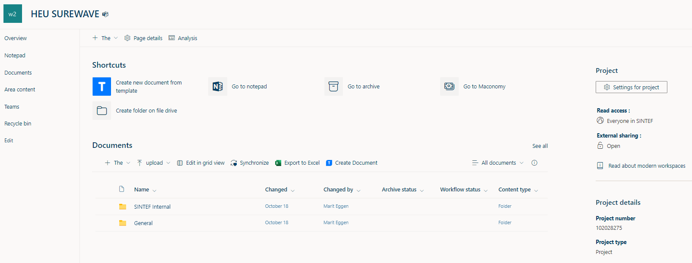

> Source: `SUREWAVE_D1.5_Quality_Management_Plan.docx` — Document date: 2024-04-05 — Converted: 2026-09-28 via pandoc/pdftotext

---

##### 

Deliverable number: D1.5

{width="8.245833333333334in" height="3.0701388888888888in"}

Title: Quality Management Plan: update version in M18

# **Disclaimer:**  {#disclaimer .TOC-Heading}

The SUREWAVE project is Funded by the European Union. Views and opinions expressed are however those of the author(s) only and do not necessarily reflect those of the European Union. Neither the European Union nor the granting authority can be held responsible for them

Deliverable details

  ---------- -------- ------------------------------------------------------
  **WP**     1        

  **Task**   D1.1     Quality Management plan
  ---------- -------- ------------------------------------------------------

  ------------------------- ------ -- -------------------------- ----------------------
  **Dissemination level**   SEN       **Due delivery date**      31/03/2024

  **Deliverable type**      R         **Actual delivery date**   05/04/2024
  ------------------------- ------ -- -------------------------- ----------------------

  -------------------------------- ---------------------------------------------
  **Lead beneficiary**             **SINTEF**

  **Contributing beneficiaries**   
  -------------------------------- ---------------------------------------------

  ---------------------- ------------ ------------------------ -------------------
  **Document Version**   **Date**     **Author**               **Comments**[^1]

  1.0                    15.03.2024   Balram Panjwani          Draft version

  1.1                    02.04.2024   Jon Samseth              Revision

  1.2                    05.04.2024   Kari Schei               Revision

  1.3                    10.04.2024   Marit Eggen              Revision

  1.4                    15.04.2024   Ainhoa Cortes Vidal      Revision

  2.0                    15.04.2024   Balram Panjwani          Final version

                                                               
  ---------------------- ------------ ------------------------ -------------------

+-------------------------------------------------------------------------------------------------------------------------------------------------+
| **Dissemination level**                                                                                                                         |
+:====================================+:==========================================================================================================+
| PU                                  | Public- fully open                                                                                        |
+-------------------------------------+-----------------------------------------------------------------------------------------------------------+
| SEN                                 | SEN = Sensitive -- limited under the conditions of the Grant Agreement                                    |
+-------------------------------------+-----------------------------------------------------------------------------------------------------------+
| EU classified                       | EU classified -- restraint -- UE/EU-restricted, confidential, secret-UE/EU secret under Decision 2015/444 |
+-------------------------------------+-----------------------------------------------------------------------------------------------------------+
| **Deliverable type**                                                                                                                            |
+-------------------------------------+-----------------------------------------------------------------------------------------------------------+
| R:                                  | Document, report (excluding the periodic and final reports)                                               |
+-------------------------------------+-----------------------------------------------------------------------------------------------------------+
| DEM:                                | Demonstrator, pilot, prototype, plan designs                                                              |
+-------------------------------------+-----------------------------------------------------------------------------------------------------------+
| DEC:                                | Websites, patent filing, press & media actions, videos, etc.                                              |
+-------------------------------------+-----------------------------------------------------------------------------------------------------------+
| OTHER:                              | Software, technical diagram, etc.                                                                         |
+-------------------------------------+-----------------------------------------------------------------------------------------------------------+

**EXECUTIVE SUMMARY**

This deliverable D1.5 is an updated version of D1.1 \"Quality Management Plan. This deliverable discusses the management methodology that has been effectively applied during the first 18 months of the SUREWAVE project. The review and assessment procedures outlined in the D1.1 report have been utilized to monitor the project's performance, identify any deviations, and implement corrective measures when necessary.

The procedures for preparing and submitting technical deliverables and periodic reports have been followed, resulting in the successful submission of 18 deliverables to date. The project's financial aspects have been managed efficiently, and communication channels have been effectively used for seamless coordination among the consortium partners.

Specific procedures and criteria to ensure quality levels have been implemented, contributing to the consistent quality of the project's outputs. Meeting plans have been adhered to, with regular monthly online meetings and biannual physical technical meetings conducted. The schedule for both technical reporting and European Commission reporting has been followed, ensuring timely submissions.

In addition to this, the project has successfully managed potential delays and ensured the prompt completion of tasks, deliverables, and milestones. The project's commitment to gender equality and effective data management has further contributed to its success.

Thus, this updated document \"D1.5\" serves as a verification of the project consortium's proper and efficient operations and quality management during the first 18 months of the SUREWAVE project.

**Deliverable Review**

+----------------------------------------------------------------------------------+-----------------+---------------------------------------+-----------------+-----------------+---------------------------------------+-----------------+
|                                                                                  | **Reviewer #1: Jon Samseth**                                              | **Reviewer #2: Kari Schei**                                               |
|                                                                                  +-----------------+---------------------------------------+-----------------+-----------------+---------------------------------------+-----------------+
|                                                                                  | **Answer**      | **Comments**                          | **Type\***      | **Answer**      | **Comments**                          | **Type\***      |
+----------------------------------------------------------------------------------+-----------------+---------------------------------------+-----------------+-----------------+---------------------------------------+-----------------+
| 1.  Is the deliverable in accordance with                                                                                                                                                                                                |
+----------------------------------------------------------------------------------+-----------------+---------------------------------------+-----------------+-----------------+---------------------------------------+-----------------+
| (i) The Description of Work?                                                     | Yes             |                                       | M               | Yes             |                                       | M               |
|                                                                                  |                 |                                       |                 |                 |                                       |                 |
|                                                                                  | No              |                                       | m               | No              |                                       | m               |
|                                                                                  |                 |                                       |                 |                 |                                       |                 |
|                                                                                  |                 |                                       | a               |                 |                                       | a               |
+----------------------------------------------------------------------------------+-----------------+---------------------------------------+-----------------+-----------------+---------------------------------------+-----------------+
| (ii) The international State of the Art?                                         | Yes             | *Not applicable for this deliverable* | M               | Yes             | *Not applicable for this deliverable* | M               |
|                                                                                  |                 |                                       |                 |                 |                                       |                 |
|                                                                                  | No              |                                       | m               | No              |                                       | m               |
|                                                                                  |                 |                                       |                 |                 |                                       |                 |
|                                                                                  |                 |                                       | a               |                 |                                       | a               |
+----------------------------------------------------------------------------------+-----------------+---------------------------------------+-----------------+-----------------+---------------------------------------+-----------------+
| 2.  Is the quality of the deliverable in a status                                                                                                                                                                                        |
+----------------------------------------------------------------------------------+-----------------+---------------------------------------+-----------------+-----------------+---------------------------------------+-----------------+
| (i) That allows it to be sent to European Commission?                            | Yes             |                                       | M               | Yes             |                                       | M               |
|                                                                                  |                 |                                       |                 |                 |                                       |                 |
|                                                                                  | No              |                                       | m               | No              |                                       | m               |
|                                                                                  |                 |                                       |                 |                 |                                       |                 |
|                                                                                  |                 |                                       | a               |                 |                                       | a               |
+----------------------------------------------------------------------------------+-----------------+---------------------------------------+-----------------+-----------------+---------------------------------------+-----------------+
| (ii) That needs improvement of the writing by the originator of the deliverable? | Yes             |                                       | M               | Yes             |                                       | M               |
|                                                                                  |                 |                                       |                 |                 |                                       |                 |
|                                                                                  | No              |                                       | m               | No              |                                       | m               |
|                                                                                  |                 |                                       |                 |                 |                                       |                 |
|                                                                                  |                 |                                       | a               |                 |                                       | a               |
+----------------------------------------------------------------------------------+-----------------+---------------------------------------+-----------------+-----------------+---------------------------------------+-----------------+
| (iii) That need further work by the Partners responsible for the deliverable?    | Yes             |                                       | M               | Yes             |                                       | M               |
|                                                                                  |                 |                                       |                 |                 |                                       |                 |
|                                                                                  | No              |                                       | m               | No              |                                       | m               |
|                                                                                  |                 |                                       |                 |                 |                                       |                 |
|                                                                                  |                 |                                       | a               |                 |                                       | a               |
+----------------------------------------------------------------------------------+-----------------+---------------------------------------+-----------------+-----------------+---------------------------------------+-----------------+

\* Type of comments: M = Major comment; m = minor comment; a = advice

# Table of Contents {#table-of-contents .TOC-Heading}

[1. Introduction [4](#introduction)](#introduction)

[2. Management structure [4](#management-structure)](#management-structure)

[General Assembly (GA) [4](#general-assembly-ga)](#general-assembly-ga)

[Executive Board [5](#executive-board)](#executive-board)

[The coordinator (SINTEF) [6](#the-coordinator-sintef)](#the-coordinator-sintef)

[WP-Leaders [6](#wp-leaders)](#wp-leaders)

[3. Procedures [7](#procedures)](#procedures)

[Decision making [7](#decision-making)](#decision-making)

[Conflict resolution [7](#conflict-resolution)](#conflict-resolution)

[Knowledge Management [7](#knowledge-management)](#knowledge-management)

[Quality Assurance [8](#quality-assurance)](#quality-assurance)

[Communication Flow [9](#communication-flow)](#communication-flow)

[Mid-Term Review [9](#mid-term-review)](#mid-term-review)

[4. Project Meeting Plans [10](#project-meeting-plans)](#project-meeting-plans)

[EB meetings [10](#eb-meetings)](#eb-meetings)

[Commission project review meetings. [10](#commission-project-review-meetings.)](#commission-project-review-meetings.)

[5. Monitoring and progress of the project [11](#monitoring-and-progress-of-the-project)](#monitoring-and-progress-of-the-project)

[Work package tasks and current status [11](#work-package-tasks-and-current-status)](#work-package-tasks-and-current-status)

[6. EC Reporting Procedures [18](#ec-reporting-procedures)](#ec-reporting-procedures)

[7. SUREWAVE project tool [19](#surewave-project-tool)](#surewave-project-tool)

[8. Gender action plan [21](#gender-action-plan)](#gender-action-plan)

[9. Conclusion. [22](#conclusion.)](#conclusion.)

# Introduction {#introduction .SUREWAVE}

The project has been progressing according to the schedule, budget, and expected quality standards. Regular online monthly meetings, three physical technical review meetings (M6, M12, and M18), and consistent WP meetings have been conducted to ensure the project's objectives are met.

The project management structure and associated procedures have proven to be effective and efficient, playing a key role in the successful implementation of the SUREWAVE project. The Project Coordinator (PC), in collaboration with all the project partners, has ensured the timely completion of the planned project tasks, resulting in deliverables and milestones meeting quality standards.

The expertise and best practices gained through working with many national and international projects, including Horizon Europe, have been utilized to manage the SUREWAVE project efficiently. The management structure, including the general assembly, executive board, WP leadership, and other essential components, have functioned effectively.

This revised deliverable aims to provide an updated overview of the project's management and progress, demonstrating the consortium's commitment to ensuring the successful implementation of the SUREWAVE project.

# Management structure {#management-structure .SUREWAVE}

We have the same management structure which was mentioned in the first version. It mainly consists of the General Assembly (GA), Executive Board (EB), Coordinator, and WP leaders.

## General Assembly (GA)

The General Assembly is the highest decision-making body in SUREWAVE, and the GA is responsible for the overall direction of the project. The GA consists of one representative from each partner and updated GA members are provided in [Table 1](#_Ref120005227). The composition of the (GA) members has undergone some changes from the original plan, as a few members have left their respective organizations.

  ----------------------------------------------------------------------------------------------------
  GA Member       Partner No   Main person                    Proxy                      Role
  --------------- ------------ ------------------------------ -------------------------- -------------
  SINTEF          1            Rannveig Kvande                Nina Dahl                  Chairperson

  Sunlit Sea As   2            Guillaume Kegelart             Per Lindberg               Member

  CEIT            3            Ainhoa Cortes                  Aritz Dorronsoro Larbide   Member

  MARIN           4            Joep Van der Zanden            Tim Bunnik                 Member

  ACC             5            Casado Barrasa, Aurora Maria   Jose Vera Agullo           Member

  CLEMENT         6            Sabine Clement Lange           Thomas Pehlke              Member

  IFEU            7            Heiko Keller                   Nils Rettenmaier           Member
  ----------------------------------------------------------------------------------------------------

  : []{#_Ref120005227 .anchor}Table 1 Updated General Assembly members

## 

The General Assembly (GA) is established as a key component of the management structure. Chaired by **Dr Rannveig Kvande (Female leader)** from SINTEF, the GA was tasked with several critical responsibilities, including the approval of the management structure and project direction, decision-making on strategic issues, conflict resolution, amendments to the Grant Agreement and the Consortium Agreement, and monitoring of the overall project progress against the initial objectives and milestones.

The GA was scheduled to meet every six months. However, due to the smooth progression of the project, there has been no need for a General Assembly meeting since the project's kick-off. This shows effective management and coordination among the project partners, as well as the successful implementation of the project's procedures and standards. The GA remains ready to convene should the need arise, ensuring the continued success and quality management of the SUREWAVE project.

## Executive Board

The Executive Board (EB) is the supervisory body for the execution of the SUREWAVE project, and it is accountable to the General Assembly. The EB is responsible for the implementation and execution of decisions made by the General Assembly. It monitors the execution and progress of the project and serves as the body for interaction and integration between the different WPs. The EB is responsible for collecting information and preparing reports. The EB is chaired by the coordinator and composed of the WP leaders. Some of the WP leaders will cover their particular management responsibilities in the EB. Members of the EB are named in [Table 2](#_Ref120005451). The composition of the (EB) members has undergone some changes from the original plan, as a few members have left their respective organizations.

  --------------------------------------------------------------------------------
  EB Member                     Partner No      WPs association   Other Role
  ----------------------------- --------------- ----------------- ----------------
  Balram Panjwani               SINTEF          WP1               Coordinator

  Guillaume Kegelart            Sunlit Sea As   WP2               WP2 leader

  Sabine Clement Lange          CLEMENT         WP3               WP3 leader

  Maria Aurora Casado Barrasa   ACC             WP4               WP4 leader

  Ainhoa Cortes                 CEIT            WP5               WP5 leader

  Virgile Delhaye               SINTEF          WP6               WP6 leader

  Heiko Keller                  IFEU            WP7               WP7 leader

  Eirik Larsen                  Sunlit Sea As   WP8               WP8 leader
  --------------------------------------------------------------------------------

  : []{#_Ref120005451 .anchor}Table 2 EB members/WP Leaders

Over the past 18 months, the Executive Board (EB) has been diligently fulfilling its responsibilities to ensure the successful progression of the SUREWAVE project. Regular monthly meetings and biannual technical meetings have been conducted to continuously manage the project and monitor its execution, progress, and achievements according to the implementation plan.

The EB has provided strategic guidance on the project activities, ensuring the relevance of the deliverables. It has approved the project implementation plan, budget, technical reports, and financial reports. Each Work Package's (WP) implementation plan and associated financial plan have been approved, along with the dissemination and exploitation plans and their deployment. The EB has also overseen the Gender action plan and managed the WPs to ensure their effective interfacing.

Every six months, the EB has gathered information from the partners regarding the technical progress and budget. Based on this, interim progress reports have been written, providing a comprehensive overview of the project's status. The EB has also identified and addressed any resource and functional issues, applying corrective measures when necessary.

Furthermore, the EB has ensured the implementation of agreements on joint releases and publications, innovation, knowledge management, and Intellectual Property Rights (IPR) protection strategy. It has also implemented the Quality Assurance Plan and assessed financial, legal, administrative, and technological risks, implementing related contingency plans as needed.

In summary, the EB has played a pivotal role in the successful management of the SUREWAVE project, demonstrating effective leadership and strategic decision-making.

## 

## The coordinator (SINTEF)

Over the past 18 months, the Project Coordinator has been diligently overseeing the coordination and management of the SUREWAVE project, including its technical and scientific aspects. The coordinator has been performing all tasks as described in the Grant Agreement and in the Consortium Agreement.

The coordinator has chaired Executive Board (EB) meetings, monitored the scientific and technical progress of the project, followed risks, and avoided any significant delays. The coordinator has reviewed and validated technical deliverables and milestones, planned the agendas of scientific meetings, and distributed the European Commission's funds among partners. We have kept the records and financial accounts, making it possible to determine at any time what portion of the Commission\'s financial contribution has been paid to each beneficiary of the SUREWAVE project.

We have regularly reviewed progress reports concerning results, deliverables, and milestones, and ensured effective internal project communication. We have reviewed and validated reports for their submission to the European Commission, liaised with the Commission (including submitting reports), coordinated any requests for amendments, and handled budgeting. Since there was no need for the amendment and therefore, we have not asked for any of the amendments. We have prepared and presented administrative and financial content to the partners.

The project has been progressing smoothly, and we are happy to say that all tasks have been carried out effectively and efficiently, demonstrating the successful implementation of the project's procedures and standards. The SUREWAVE project continues to benefit from the in-house project administrative support resources of SINTEF, including legal counsel deeply familiar with IPR and technology transfer topics, as well as a full-time Financial Department already knowledgeable in European Commission procedures concerning eligible costs, auditing, and distribution of funding. During the coordination process, the coordinator gets support from the SINTEF Management Support Team (MST) which includes **Ms. Kari Schei** and **Ms. Marit Eggen** who are responsible for coordinating support regarding administrative, legal, and financial aspects of the Grant Agreement.

## 

## WP-Leaders

Over the past 18 months, the Work Package Leaders (WP-Leaders) have been instrumental in the successful progression of the SUREWAVE project. They have effectively coordinated and made day-to-day decisions in their respective work packages, in collaboration with other partners and WP-Leaders. Their responsibilities have included the overall management and progress of their work packages, as well as the dissemination of their WP results.

The WP-Leaders have initiated, coordinated, and organized their work packages, ensuring the timely delivery of reports and WP results. They have collected information every six months on the progress of the project and examined that information to assess the project's compliance with the Description of Work. In the event of any major deviations from the plan, they will be prepared to inform the General Assembly (GA) and propose possible solutions.

The WP-Leaders have formulated implementation plans for the activities within the WP for the next period and decided upon any exchange of tasks and related budgets between the partners in a WP when such exchange has no impact beyond the scope of the WP. They have also supported the coordinator in preparing related data and deliverables.

The WP-Leaders have successfully executed the decisions of the EB and have been responsible for the high-quality preparation and execution of the project. Their diligent work and effective management have ensured that there have been no significant delays in any of the tasks, deliverables, and milestones. Their contributions have been vital to the project's progress and success.

# Procedures  {#procedures .SUREWAVE}

## Decision making

The consortium has been and continues to take decisions with the consent of all partners, after a discussion of the facts and possible paths to follow. The GA is the uppermost body in SUREWAVE and takes all major decisions about the project, such as:

- Major changes in the project implementation plan

- Major changes to the consortium budget (\> 20% of the original plan in a category) Acceptance/suspension of partners

- Review and/or amendment of the Consortium Agreement

- Take decisions about intellectual property rights (IPR).

Each partner in SUREWAVE will have one vote in the GA. Other voting procedures have been detailed in the Consortium Agreement. Decisions in the GA are in general taken with a two-thirds majority, except where the Consortium Agreement explicitly states otherwise. The WP leaders will make decisions on WP-related matters, involving the interaction between the WPs, and technical decisions on day-to-day matters in their respective WPs, in cooperation with the other partners in their WP, during regular online conferences. WP leaders are responsible for facilitating and stimulating solutions that fit all partners.

## Conflict resolution

Over the past 18 months, we have not observed any conflict within the consortium and among partners. In case there is a strong difference of opinion about the direction of the work, between a WP Leader and the majority of the other partners in the work package, the WP leader will ask the coordinator to organize a meeting with all representatives of the GA. The partners will then discuss this issue, and come up with proposals for solutions, looking for consensus. If necessary, the GA as the highest-ranking body will decide on the issue.

## Knowledge Management 

Over the past 18 months, the project documentation has been effectively stored and exchanged through a private, secure, and confidential platform administered by the Project Coordinator SINTEF. The project partners have continued to use SINTEF SharePoint for communicating the results, ensuring efficient knowledge management and data exchange between project members.

SINTEF has maintained registered access for all project partners for internal document exchanges. Draft documents have been edited and stored following the project's proposed quality chart, ensuring the high standard of the SUREWAVE project documentation. This platform has facilitated efficient knowledge management, ensuring seamless data and information exchanges between project members without unnecessary risk of external disclosure.

The use of this platform has proven to be effective in maintaining the confidentiality of our project while promoting efficient communication and collaboration among project partners. We will continue to utilize this platform for the remainder of the SUREWAVE project.

## Quality Assurance 

Over the past 18 months, SUREWAVE has successfully established and implemented a Quality Action Plan, detailing all the quality-related activities and methods necessary at Task, WP, and project levels. A number of project quality assurance procedures have been put into practice, including documentation control, reporting, validation, and assessment auditing. These procedures are based on the SINTEF internal quality management system and the experiences gleaned from previous and ongoing national and international projects. This is the front page of the review report to maintain the quality of the deliverable.

{width="6.3in" height="4.597916666666666in"}

Feedback from Commission reviews has been incorporated, ensuring that our project aligns with the highest standards of quality and compliance. The project consortium has diligently followed all EU and national regulations concerning the work.

Task 1.1 has adopted a quality management approach, effectively controlling reported resource usage, reviewing project documents and results, maintaining the project work plan, and monitoring the progress of all WPs in terms of project plans and quality measures. Project deliverables have been reviewed by specialists/expertise in the consortium, each of whom has sought to ensure a high-quality standard.

The successful implementation of these quality assurance procedures has significantly contributed to the progress and success of the SUREWAVE project, ensuring that all activities and outputs meet the highest standards of quality.

## Communication Flow

Over the past 18 months, the communication flow within the SUREWAVE project has been effectively managed and maintained. All internal project communication, including meeting minutes, financial and technical progress reports, a list of decisions taken, and a to-do list, have been consistently made available to all partners on the project SharePoint. The project website has also been updated as required. A project management tool (see section [7](#surewave-project-tool): SUREWAVE project tool) was created to manage the communication flow.

The internal SharePoint and email communication has served as a valuable platform for discussion groups on technical issues, fostering collaboration and knowledge sharing among project partners. In addition to the project meetings, monthly online meetings have been conducted for communication within or between the work packages. These meetings have supplemented the informal and formal communication taking place within the project, ensuring a steady flow of information and ideas. *The monthly online meetings are organised every 4^th^ Wednesday from 12:00-13:00*. In addition to this, depending on the requirements, special meetings are organised by partners to resolve the issue and to discuss the project results and sample deliveries.

The communication flow has been instrumental in the smooth progression of the project, enabling all partners to stay informed and engaged. As we move forward, we will continue to utilize these communication channels to ensure the successful completion of the SUREWAVE project.

## Mid-Term Review 

As we have now reached the 18-month mark of the SUREWAVE project, we have conducted an internal mid-term review. We, as the coordinator, along with the Work Package Leaders (WP-Leaders), have critically reviewed the progress of the project according to the milestones. Since the project is progressing as planned and there are no major deviations, therefore there are no specific recommendations to the GA based on our findings. Decisions regarding the continued work plan have been taken at the mid-term GA meeting. While there have been minor delays in the completion of a few deliverables, the majority of the tasks have been accomplished on schedule. All deliverables up to M18 will be successfully uploaded by April 20^th^, 2024. We can say that the project is progressing smoothly and is on track to meet its objectives. Therefore, there has been no need for a significant refocus of resources or adaptation of strategies. However, we remain prepared to make necessary adjustments should any challenges arise in the future. This mid-term review has reaffirmed our commitment to the successful completion of the SUREWAVE project.

# Project Meeting Plans {#project-meeting-plans .SUREWAVE}

## EB meetings 

As we are now in the 18th month of the project, the Project Coordinator and the host partner have successfully held regular EB meetings addressing both managerial and technical aspects. These meetings have been conducted at least biannually. There has not been any need for extraordinary meetings other than biannual and monthly online meetings. The responsibility of hosting these meetings has been effectively rotated among all partners.

To minimize travel expenses, the project's meetings have been strategically arranged so that the EB and GA could meet concurrently. This has been successfully implemented from the start of the project.

The leaders of each Work Package (WP) have been proactive in holding WP meetings to discuss their WP's technical matters. These meetings have been called as frequently as necessary by the WP Leader, ensuring efficient progress of work and providing a platform to discuss task-related and other pertinent issues.

As we move forward, we will continue to adhere to these practices to ensure the smooth operation and success of the project. An updated and tentative meeting plan is shown in [Table 3](#_Ref120012326).

  --------------------------------------------------------------------------------------
  Meeting     Tentative Date   Actual date               Location
  ----------- ---------------- ------------------------- -------------------------------
  Kick-Off    M1               07/11/2022-08/11/2022     Brussels, BE

  Meeting-1   M6               18/04/2023-19/04/2023     CEIT, San Sebastian, Spain

  Meeting-2   M12              14/11/2023-15/11/2023     Marin, Wageningen, Netherland

  Meeting-3   M18              09/04/2024-10/04/2024     Clement, Rostock, Germany

  Meeting-4   M24              September/October, 2024   SunLit Sea As, Oslo, Norway

  Meeting-5   M30              March/April, 2025         ACCIONA, Madrid, Spain

  Meeting-6   M36              September/October, 2025   SINTEF, Trondheim, Norway
  --------------------------------------------------------------------------------------

  : []{#_Ref120012326 .anchor}Table 3 Updated meeting plan

## 

## Commission project review meetings.

[Table 4](#_Ref120012059) shows the planned reviews of SUREWAVE by the Commission. The first project review meeting will take place on 04/06/2024. The meeting will be an online meeting. There is 1 periodic review in addition to the final review. The review periods are listed in the table along with the tentative review dates, which allows for the submission of the periodic reports within 60 days before the official review meetings take place.

  --------------------------------------------------------------------------
  Meeting                     Tentative Date   Actual Date   Location
  --------------------------- ---------------- ------------- ---------------
  Periodic review             M01-M18          04/06/2024    Online

  Final review                M19-M36          M19-M36       TBD
  --------------------------------------------------------------------------

  : []{#_Ref120012059 .anchor}Table 4 Project review meeting

# Monitoring and progress of the project {#monitoring-and-progress-of-the-project .SUREWAVE}

The Gannt chart for the SUREWAVE is shown in [Figure 2](#_Ref119939184). Where MS stands for milestones and D stands for the deliverable. This Gantt chart has served as a valuable tool for planning, scheduling, and monitoring the progress of the project. It allows us to understand the sequence of tasks, their dependencies, and the allocation of resources. By clearly illustrating the start and end dates of the individual tasks, as well as the overall project timeline, the Gantt chart helps to ensure that the SUREWAVE project stays on track and meets its objectives in a timely manner.

![[]{#_Ref119939184 .anchor}Figure 2 SUREWAVE Gannt chart](../images/2024-04-05_surewave_d1.5_quality_management_plan/image5.png){width="6.776423884514435in" height="4.568713910761155in"}

To enhance the monitoring and control of the project's progress, we have established a comprehensive task monitoring database, as shown below. This database provides a detailed overview of each task, including its start and end dates, along with the partner responsible for its execution.

The progress of each task is tracked and updated in the database. Any delays in task completion are promptly identified and recorded, along with a thorough explanation of the reasons behind the delay. This proactive approach to task monitoring ensures that all project stakeholders are kept informed about the status of each task and any potential issues that may impact the project timeline.

## Work package tasks and current status

WP1: PROJECT MANAGEMENT & CLUSTERING ACTIVITIES

  ----------------------------------------------------------------------------------------------------
  Task                                                      Responsible   Start   End    Status
  ------ -------------------------------------------------- ------------- ------- ------ -------------
  T1.1   Administrative, legal and financial coordination   SINTEF        M1      M36    In Progress

  T1.2   Technical Coordination                             SINTEF        M1      M36    In Progress

  T1.3   Data Management                                    SINTEF        M1      M36    In Progress

  T1.4   IPR Management                                     SINTEF        M1      M36    In Progress

  T1.5   Synergy-building and clustering activities         SINTEF        M1      M36    In Progress
  ----------------------------------------------------------------------------------------------------

WP2: GLOBAL FRAMEWORK DEFINITION & GENERAL SPECIFICATIONS OF THE FLOATING PV SOLUTION

  ------------------------------------------------------------------------------------------------------------------------------
  Task                                                                             Responsible   Start   End    Status
  ------ ------------------------------------------------------------------------- ------------- ------- ------ ----------------
  T2.1   Use-case scenario definition                                              SINTEF        M1      M3     Completed

  T2.2   Research, analysis, and preliminary requirements of critical components   CLEMENT       M1      M4     Completed

  T2.3   Integration requirements with breakwater and other critical components    SIS           M1      M4     Completed

  T2.4   Stakeholders Engagement                                                   SIS           M1      M36    Under progress
  ------------------------------------------------------------------------------------------------------------------------------

WP3: DEVELOPMENT OF THE FLOATING PV SOLUTION BASED ON THE BREAKWATER CONCEPT

  ----------------------------------------------------------------------------------------------------------------------
  Task                                                                           Responsible   Start   End   Status
  ------ ----------------------------------------------------------------------- ------------- ------- ----- -----------
  T3.1   Overall design of the internal individual floating PV components        SIS           M5      M8    Completed

  T3.2   Overall design of the external breakwater                               CLEMENT       M5      M10   Completed

  T3.3   Improved mooring line and anchoring system                              CLEMENT       M9      M12   Completed

  T3.4   Development of connection system between breakwater and solar modules   CLEMENT       M10     M12   Completed

  T3.5   Design of coupled breakwater & floating PV and global system design     SIS           M13     M16   Completed
  ----------------------------------------------------------------------------------------------------------------------

WP4: NEW CIRCULAR MATERIAL SOLUTIONS

+---------------+---------------------------------------------------------------------------------------------------+---------------+---------------+---------------+----------------+
| Task          |                                                                                                   | Responsible   | Start         | End           | Status         |
+:==============+:==================================================================================================+:==============+:==============+:==============+:===============+
| T4.1          | Research and design of new circular material solutions for the structural shell of the breakwater | ACC           | M5            | M15           | Completed      |
+---------------+---------------------------------------------------------------------------------------------------+---------------+---------------+---------------+----------------+
| T4.2          | Research and design of new circular material solutions for the inner core of the breakwater       | ACC           | M5            | M15           | Completed      |
+---------------+---------------------------------------------------------------------------------------------------+---------------+---------------+---------------+----------------+
| T4.3          | Durability assessment of the interface of shell & inner core                                      | SINTEF        | M12           | M18           | delayed        |
+---------------+---------------------------------------------------------------------------------------------------+---------------+---------------+---------------+----------------+
|                                                                                                                                                                                    |
+---------------+---------------------------------------------------------------------------------------------------+---------------+---------------+---------------+----------------+
| T4.4          | Floating concrete breakwater solution and prototyping                                             | ACC           | M18           | M20           | Under progress |
+---------------+---------------------------------------------------------------------------------------------------+---------------+---------------+---------------+----------------+

WP5: PREDICTIVE MODELLING AND SIMULATION TOOLS FOR MATERIAL PROPERTIES AND STRUCTURAL INTEGRITY MANAGEMENT

  ------------------------------------------------------------------------------------------------------------------
  Task                                                                  Responsible   Start   End   Status
  ------ -------------------------------------------------------------- ------------- ------- ----- ----------------
  T5.1   Concrete materials properties modelling                        SINTEF        M6      M24   Under progress

  T5.2   Coupled aero-hydrodynamic analysis and design optimization     MARIN         M6      M18   Completed

  T5.3   Structural integrity assessment                                CEIT          M12     M24   Under progress

  T5.4   Structural Health Management System                            CEIT          M6      M32   Under progress

  T5.5   Comparative validation of the predictive computational tools   CEIT          M30     M34   Under progress
  ------------------------------------------------------------------------------------------------------------------

WP6: TECHNICAL VALIDATION OF THE FLOATING PV SOLUTION

  ------------------------------------------------------------------------------------------------------------------------------------
  Task                                                                                    Responsible   Start   End   Status
  ------ -------------------------------------------------------------------------------- ------------- ------- ----- ----------------
  T6.1   Advanced sensing & monitoring solutions for basin tests and concrete component   CEIT          M15     M24   Under progress

  T6.2   Critical connections´ ultimate strength performances                             SINTEF        M16     M22   Under progress

  T6.3   Critical components Fatigue performance                                          SINTEF        M20     M28   Not started

  T6.4   Basin system validation                                                          MARIN         M13     M26   Under progress

  T6.5   Long-term degradation of the concrete component exposed in harbor                ACC           M20     M36   Not started
  ------------------------------------------------------------------------------------------------------------------------------------

WP7: INTEGRATED SUSTAINABILITY ASSESSMENT

  ------------------------------------------------------------------------------------------------------------------------------
  Task                                                                             Responsible   Start   End    Status
  ------ ------------------------------------------------------------------------- ------------- ------- ------ ----------------
  T7.1   Sustainability framework definition and mass & energy balances analysis   SINTEF        M1      M24    Under progress

  T7.2   Assessment of technological risks and barriers to sustainability          SINTEF        M19     M22    Not started

  T7.3   Environmental assessment                                                  IFEU          M13     M32    Under progress

  T7.4   Economic assessment                                                       SIS           M19     M32    Not started

  T7.4   Social assessment                                                         IFEU          M19     M32    Not started

  T7.5   Integrated assessment of sustainability                                   IFEU          M25     M36    Not started
  ------------------------------------------------------------------------------------------------------------------------------

WP8: DISSEMINATION, COMMUNICATION, EXPLOITATION & SOCIETAL ENGAGEMENT

  --------------------------------------------------------------------------------------------------------------------------------------------------
  Task                                                                                                  Responsible   Start   End   Status
  ------ ---------------------------------------------------------------------------------------------- ------------- ------- ----- ----------------
  T8.1   Societal Engagement                                                                            IFEU          M13     M36   Under progress

  T8.2   Dissemination, Exploitation and Communication Strategy, and Monitoring of its Implementation   SIS           M1      M36   Under progress

  T8.3   Dissemination Activities                                                                       SIS           M1      M36   Under progress

  T8.4   Exploitation pathways and Business Plan                                                        SIS           M19     M36   Not started

  T8.4   Communication activities                                                                       SIS           M1      M36   Under progress
  --------------------------------------------------------------------------------------------------------------------------------------------------

In addition to task monitoring, the project monitoring in SUREWAVE will also be comprised of internal actions for each deliverable produced. The reports/deliverables will be submitted to the Commission. So far, 18 deliverables have been uploaded. The project will be overall monitored through deliverables (see [Table 5](#_Ref120012240)) and the current status of each deliverable is provided in [Table 5](#_Ref120012240). We are also monitoring the milestone and the latest update on the milestones is provided in [Table 6](#_Ref120012249).

This task of monitoring system not only facilitates effective project management but also promotes transparency and accountability among project partners. It serves as a valuable tool for identifying potential bottlenecks, enabling timely intervention and corrective action to keep the project on track.

  ---------------------------------------------------------------------------------------------------------------------------------------------------------------------
  WP No   Deliv   Title                                                                                 Lead Beneficiary   Distribution   Delivery date   Status
  ------- ------- ------------------------------------------------------------------------------------- ------------------ -------------- --------------- -------------
  WP1     D1.1    Quality Management Plan                                                               SINTEF             R              31 Oct 2022     done

  WP1     D1.2    Interim progress reports                                                              SINTEF             R              31 Jul 2023     done

  WP1     D1.3    Data Management Plan                                                                  SINTEF             DMP            31 Mar 2023     done

  WP1     D1.4    IPR Management Plan                                                                   SINTEF             R              31 Mar 2023     done

  WP1     D1.5    Quality Management Plan (M18 revision)                                                SINTEF             R              31 Mar 2024     done

  WP1     D1.6    Interim progress reports (M25 second version)                                         SINTEF             R              31 Oct 2024     

  WP1     D1.7    Data Management Plan (M36 revision)                                                   SINTEF             DMP            30 Sep 2025     

  WP1     D1.8    IPR- Management plan (M36 revision)                                                   SINTEF             R              30 Sep 2025     

  WP2     D2.1    Use case scenario basis for typical, rough location                                   SINTEF             R              31 Jan 2023     done

  WP2     D2.2    Requirements for surface mooring system between FPV array and breakwater              Clement Germany    R              31 Jan 2023     done

  WP2     D2.3    High level understanding of the system general loads                                  Sunlit Sea         R              31 Jan 2023     done

  WP2     D2.4    Establishing a technical stakeholders advisory board                                  Sunlit Sea         R              31 Mar 2024     done

  WP3     D3.1    Design description of internal floating PV components                                 Sunlit Sea         R              31 May 2023     done

  WP3     D3.2    Floating breakwater design (shape, size, and composition)                             Clement Germany    OTHER          31 Jul 2023     done

  WP3     D3.3    Anchoring and connections to PV system                                                Clement Germany    R              31 Oct 2023     done

  WP3     D3.4    Summary of global system design                                                       Sunlit Sea         R              31 Jan 2024     done

  WP4     D4.1    Design and characterization of the new circular material solutions                    ACCIONA            R              31 Dec 2023     done

  WP4     D4.2    Development, validation and testing at laboratory level of the breakwater prototype   ACCIONA            R              31 May 2024     in progress

  WP4     D4.3    Breakwater prototype                                                                  ACCIONA            DEM            31 May 2024     in progress

  WP5     D5.1    Report on coupled aero-hydrodynamic analyses and design optimization                  MARIN              R              31 Mar 2024     done

  WP5     D5.2    Empirical-based concrete properties modelling tool                                    SINTEF             DEM            30 Sep 2024     in progress

  WP5     D5.3    Report on structural integrity assessment                                             Ceit               R              30 Sep 2024     in progress

  WP5     D5.4    Report on monitoring strategy                                                         Ceit               R              30 Sep 2024     in progress

  WP5     D5.5    Fatigue crack propagation algorithms                                                  Ceit               DEM            31 Mar 2025     

  WP5     D5.6    Integrated Structural Health Management System                                        Ceit               DEM            31 May 2025     

  WP5     D5.7    Modelling tools validation report                                                     Ceit               R              31 Jul 2025     

  WP6     D6.1    Report on ultimate strength capacity of each connection                               SINTEF             R              31 Jul 2024     in progress

  WP6     D6.2    Report on basin tests results                                                         MARIN              R              30 Nov 2024     

  WP6     D6.3    Report on fatigue performances                                                        SINTEF             R              31 Jan 2025     

  WP6     D6.4    Marine long-term degradation of concrete breakwater                                   ACCIONA            R              30 Sep 2025     

  WP7     D7.1    Interim report on sustainability definitions and settings                             IFEU               R              31 Oct 2023     done

  WP7     D7.2    Report on technological qualitative assessment                                        SINTEF             R              31 May 2025     

  WP7     D7.3    Report on environmental assessment                                                    IFEU               R              31 May 2025     

  WP7     D7.4    Report on economic assessment                                                         Sunlit Sea         R              31 May 2025     

  WP7     D7.5    Report on social assessment                                                           IFEU               R              31 May 2025     

  WP7     D7.6    Report on integrated sustainability assessment                                        IFEU               R              30 Sep 2025     

  WP8     D8.1    Dissemination, Exploitation & Communication Master Plan                               Sunlit Sea         DEC            31 Mar 2023     done

  WP8     D8.2    Report on societal needs and engagement                                               IFEU               R              31 Oct 2024     

  WP8     D8.3    Technical Brochure                                                                    Sunlit Sea         DEC            30 Sep 2025     

  WP8     D8.4    Exploitation Pathways & Definitive Business Plan                                      Sunlit Sea         DEC            30 Sep 2025     

  WP8     D8.5    Dissemination, Exploitation & Communication Master Plan (M18 revision)                Sunlit Sea         DEC            31 Mar 2024     done
  ---------------------------------------------------------------------------------------------------------------------------------------------------------------------

  : []{#_Ref120012240 .anchor}Table 5 List of deliverables

  -------------------------------------------------------------------------------------------------------------------------------------------------------------------------------------------------------------------------------------------
  No   WP    Name                                                                      Lead Beneficiary   Means of verification                                                                                      Delivery date   Status
  ---- ----- ------------------------------------------------------------------------- ------------------ ---------------------------------------------------------------------------------------------------------- --------------- --------
  1    WP2   Power production estimates, with wave corrected performance ratio         Sunlit Sea         Detailed calculation of power production scenarios in different use-case situations, verifiable in D2.1.   31 Jan 2023     done

  2    WP3   Floating Breakwater Design (shape, size, and composition)                 Clement            Results provided to participants for further action and as basis for tasks 3.3 and 3.4                     31 Jul 2023     done

  3    WP3   Anchoring and connections to PV system                                    Clement            Results provided to participants for further action and as basis for task 3.5                              31 Sep 2023     done

  4    WP7   Internal workshop for sustainability                                      IFEU               Sustainability definition and settings available                                                           31 Oct 2023     done

  5    WP2   SAB consolidated feedback                                                 Sunlit Sea         Diverse, complementary and complete value chain SAB with consolidated feedback, in D2.4                    31 Mar 2024     done

  6    WP4   Breakwater prototype validated                                            ACCIONA            Successful material test results verifiable in D4.2.                                                       31 May 2024     

  7    WP8   Successful societal engagement                                            Sunlit Sea         Key social actors bringing worthy inputs in T8.1                                                           31 Oct 2024     

  8    WP6   Basin system and critical connections compliance                          SINTEF             Successful results on basin-system validation (in task 6.4) and on critical connections (task 6.3).        31 Jan 2025     

  9    WP5   Structural Health Management System (SHMS)                                Ceit               SHMS platform with all the components implemented (D5.4, D5.5 and D5.6)                                    31 Mar 2025     

  10   WP5   Validation of the individual modelling tools and of the SHMS as a whole   Ceit               Modelling tools are satisfactorily validated by means of test campaigns (D5.1, D5.2, D5.3 & D5.7)          31 Jul 2025     

  11   WP6   Breakwater long-term degradation compliance                               SINTEF             Successful degradation behaviour in tests in harbour of the concrete prototype, verifiable in Task 6.5.    30 Sep 2025     
  -------------------------------------------------------------------------------------------------------------------------------------------------------------------------------------------------------------------------------------------

  : []{#_Ref120012249 .anchor}Table 6 List of milestones

Table 4 List of task and status

# EC Reporting Procedures  {#ec-reporting-procedures .SUREWAVE}

In addition to the technical progress and reporting as discussed, the periodic reports will be submitted. We have now reached the end of the first reporting period, and over the next two months (M19 and M20), we will be preparing our first periodic report.

This report will provide a comprehensive overview of the activities carried out during this period, detailing our progress towards the project objectives, milestones, and deliverables set for this period. It will also address any challenges encountered and the corrective actions taken. The report will include a justification of the costs incurred and the resources used by each partner, linking them to the activities planned in the work plan.

Work Package (WP) Leaders, in collaboration with the partners contributing to their respective work packages, will ensure that reporting procedures are followed, and timely information is provided. They will verify the work reported, prepare their respective summary work package report (integrating partner inputs), and communicate it to the Project Coordinator for approval.

Partners will be preparing Progress Reports on the work done in the various work packages they are contributing to, outlining the main objectives of their contributions, achievements, deviations, problems, etc. These reports will be used by the WP Leaders and the Project Coordinator to monitor the project work, discuss relevant issues, and take necessary actions.

In addition, WP Leaders will be aggregating inputs received from their WP partners and detailing the work done in the work package, main objectives and achievements, deviations, problems, etc. These reports will also be reviewed by the Project Coordinator and Executive Board, who will propose solutions for relevant issues if required.

In addition to the progress report, SUREWAVE has prepared interim reporting which is every 6 months. Each SUREWAVE partner has reported to the WP Leaders an overview of the work done with respect to the WP\'s respective duties. For internal reporting, anomalies concerning unexpected or over-utilisation of person months have been reported.

# SUREWAVE project tool {#surewave-project-tool .SUREWAVE}

Over the past 18 months, SINTEF's project tool in SharePoint has served as an effective platform for organizing and managing the SUREWAVE project. Each package has its own dedicated folder, facilitating easy access and navigation. The structure of the SharePoint folder, as depicted in the updated [Figure 3](#_Ref119939087), [Figure 4](#_Ref119939089), [Figure 5](#_Ref119939092), and [Figure 6](#_Ref119939093), has been maintained for consistency. In addition to the Work Package (WP) folders, there are designated folders for meetings, contracts, logos, and templates. The contract folder consists of the Grant Agreement (GA) and Consortium Agreement (CA) documents, ensuring that all partners have access to these crucial documents.

The meeting folder has been regularly updated with presentations from all the meetings, each clearly marked with the date and time. This has ensured that all project partners can revisit the discussions and decisions made during these meetings.

Furthermore, we have established a dedicated folder for the data management plan. This ensures that all data are organized with clear objectives and nomenclature, facilitating easy identification of relevant data for partner applications. This approach has also minimized the need for data communication via emails, streamlining our data sharing process and enhancing efficiency within the SUREWAVE project.

This structured approach to documentation and communication has been instrumental in the smooth progression of the SUREWAVE project over the past 18 months.

{width="5.049504593175853in" height="1.9225076552930884in"}

# 

# 

[]{#_Ref119939087 .anchor}

Figure 3 SUREWAVE Sharepoint project tool

![[]{#_Ref119939089 .anchor}](../images/2024-04-05_surewave_d1.5_quality_management_plan/image7.png){width="2.9555555555555557in" height="3.1368055555555556in"}

Figure 4 SUREWAVE Sharepoint project tool: WP folder

Over the past 18 months, each Work Package has continued to maintain its own sheet with deliverables and milestones. These have been regularly reviewed and followed up during the monthly Executive meetings (see [Figure 5](#_Ref119939092)). In addition, we have an Excel sheet for the project placed in the SharePoint room. Each partner has their own sheet within this Excel file, detailing their budget in Euros and person-months. A sample for WP3 is shown in [Figure 6](#_Ref119939093). This has facilitated efficient tracking and management of resources across the project. A sample for WP3, as shown in the updated Figure 6, illustrates the effective use of this system. As we move forward, we will continue to utilize these tools to ensure the successful progression of the SUREWAVE project.

![[]{#_Ref119939092 .anchor}Figure 5 SUREWAVE Sharepoint project tool: Action list](../images/2024-04-05_surewave_d1.5_quality_management_plan/image8.png){width="6.3in" height="2.9513615485564304in"}

![[]{#_Ref119939093 .anchor}Figure 6 SUREWAVE Sharepoint project tool: Budget tool](../images/2024-04-05_surewave_d1.5_quality_management_plan/image9.png){width="4.468937007874016in" height="3.1502252843394576in"}

# Gender action plan {#gender-action-plan .SUREWAVE}

Throughout the past 18 months, the SUREWAVE project has been mindful of the gender dimension in all its activities. The development of the SUREWAVE floating offshore PV solution (WP2 to WP6) has taken into account the diverse skills and perspectives offered by both genders at the R&D, development, and operation levels. This inclusive approach has the potential to increase job opportunities in a sector that traditionally has a significant gender imbalance. These considerations have been thoroughly analysed within the social assessment in WP7. Our communication and dissemination activities (in WP8) have consistently incorporated the gender dimension. We have used gender-neutral language and carefully selected visual materials that represent both women and men, challenging the traditional stereotype of the male-dominated tech industry. We have prioritized the participation of women in all dissemination, communication, and training actions of the project. We have defined indicators for our dissemination and communication actions and have monitored the gender aspects during project execution. This includes tracking workforce gender, audience reached by gender, and workers trained segmented by gender. Lastly, all consortium members remain committed to equality of opportunities in the project team's composition. The gender dimension has been, and will continue to be, a key consideration throughout the project's lifetime.

Here is a short summary of females involved in the project.

  --------------------------------------------------------------------------------------------------------------------------------------------------------------------------------------
  Partner        Female participant
  -------------- -----------------------------------------------------------------------------------------------------------------------------------------------------------------------
  SINTEF         Marit Eggen, Kari Schei (involved in WP1), Rannveig Kvande (GA Chairperson), Afaf Sai (Task leader)

  CEIT           Ainhoa Cortes (WP leader), Upeksha Chathurani Thibbotuwa (PhD Student)

  MARIN          Rowenna Reus-Das (WP1)

  CLEMENT        Sabine Clement-Lange (GA member, WP1)

  SIS            Nina Johansen (WP1), Johanne Strande (graphic design), Sigrid Bakås (usability), Esther Machlein (process control), Tasnime Ouchtar (technical design and simulation)

  IFEU           Elke Luksch (GA responsible), Veronika Koch (WP1), Taalke Sieckmann (involved in WP6)

  Acciona        Aurora Maria Casado Barrasa (WP leader), Valle Chozas Ligero (Task leader)
  --------------------------------------------------------------------------------------------------------------------------------------------------------------------------------------

# Conclusion.  {#conclusion. .SUREWAVE}

In conclusion, the SUREWAVE project has made good progress over the past 18 months. The project's management structure, including the General Assembly, Executive Board, Project Coordinator, and Work Package Leaders, have effectively fulfilled their roles and responsibilities. The project's communication flow, data management, and quality assurance procedures have been successfully implemented and maintained.

The project monitoring system, encompassing deliverables, milestones, and task progress, has ensured the project stays on track. Despite minor delays in a few deliverables, the majority of tasks have been completed on schedule. As of now, 18 deliverables have been successfully uploaded.

The project's commitment to gender equality and the effective use of the SharePoint platform have further contributed to the project's success. As we move forward, we remain committed to maintaining these high standards of project management and execution, ensuring the successful completion of the SUREWAVE project.

#  {#section-7 .SUREWAVE}

[^1]: Creation. modification. final version for evaluation. revised version following evaluation. final
