> Source: `SUREWAVE_D5.1.0_final.docx` — Document date: 2024-04-16 — Converted: 2026-09-28 via pandoc/pdftotext

---

##### 

##### 

Deliverable number: D5.1

{width="8.245833333333334in" height="3.0701388888888888in"}

Coupled aero-hydrodynamic analyses and design optimization.

Tim Bunnik, Joep van der Zanden, Naman Baderiya, Balram Panjwani

{alt="P16#y1" width="8.430555555555555in" height="0.7909722222222222in"}

Deliverable details

  ---------- -------- ------------------------------------------------------------
  **WP**     5        

  **Task**   D5.1     Coupled aero-hydrodynamic analysis and design optimization
  ---------- -------- ------------------------------------------------------------

  --------------------------------- ------ -- -------------------------- ----------------------
  **Dissemination level**0F0F[^1]   SEN       **Due delivery date**      31/03/2024

  Deliverable type                  R         **Actual delivery date**   16/04/2024
  --------------------------------- ------ -- -------------------------- ----------------------

  -------------------------------- ---------------------------------------------
  **Lead beneficiary**             **MARIN**

  **Contributing beneficiaries**   **SINTEF**
  -------------------------------- ---------------------------------------------

  ---------------------- ------------ -------------------------------- ----------------------------------------------------
  **Document Version**   **Date**     **Author**                       **Comments**1F1F[^2]

  1.0                    27.03.2024   Tim Bunnik                       Draft version

  1.1                    30.03.2024   Balram Panjwani                  Aerodynamic section was added

  1.2                    05.04.2023   Virgile Delhaye                  Revision

  1.3                    15.04.2023   Thomas Pehlke                    Revision

  2.0                    16.04.2024   Tim Bunnik/Balram Panjwani       Final version

  3.0                    05.06.2024   Tim Bunnik                       Comments from PO added

  4.0                    14.10.2024   Tim Bunnik/Joep van der Zanden   Added results on 2MW farm and mooring optimization
  ---------------------- ------------ -------------------------------- ----------------------------------------------------

+---------------------------------------------------------------------------------------------------------------------------+
| **Dissemination level**                                                                                                   |
+:====================================+:====================================================================================+
|                                     | PU = Public                                                                         |
+-------------------------------------+-------------------------------------------------------------------------------------+
| SEN                                 | SEN = Confidential/Sensitive, only for members of the consortium (including the EC) |
+-------------------------------------+-------------------------------------------------------------------------------------+
|                                     | Classified, information as referred to in Commission Decision 2001/844/EC.          |
+-------------------------------------+-------------------------------------------------------------------------------------+
| **Deliverable type**                                                                                                      |
+-------------------------------------+-------------------------------------------------------------------------------------+
| R                                   | R:           Document, report (excluding the periodic and final reports)            |
+-------------------------------------+-------------------------------------------------------------------------------------+
|                                     | DEM:    Demonstrator, pilot, prototype, plan designs                                |
+-------------------------------------+-------------------------------------------------------------------------------------+
|                                     | DEC:      Websites, patents filing, press & media actions, videos, etc.             |
+-------------------------------------+-------------------------------------------------------------------------------------+
|                                     | OTHER: Software, technical diagram, etc.                                            |
+-------------------------------------+-------------------------------------------------------------------------------------+

Disclaimer:\
The information in this document reflects the views only of the author, and the Commission cannot be held responsible for any use which may be made of the information contained therein.

**EXECUTIVE SUMMARY**

This deliverable, a result of Task 5.2, discusses the hydrodynamic and aerodynamic analysis of the SUREWAVE FPV, both with and without a breakwater.

Initially, 2D CFD simulations were conducted to understand the hydrodynamic behaviour. Additionally, the plan was to perform 3D CFD simulations in severe sea states, but 3D CFD proved to be computationally demanding. Therefore, for the hydrodynamic aspect, we employed low to mid-fidelity, efficient linear methods across all sea states. CFD simulations were conducted to obtain the viscous damping forces affecting sway, heave, and roll motions on a single breakwater, and these forces were subsequently integrated into our methodology. The study involved four stages: examining the numerical settings needed for calculating the motion response of coupled FPV modules in waves, validating these models with Stadt towing tank test results provided by project partner SIS, investigating connector loading in FPV system with increasing float size or number with the floating breakwater, and deriving mooring design loads to assess if the design could withstand extreme metocean conditions.

In parallel, mooring and interconnector loads for the breakwater ring are quantified using a combination of wave diffraction and time domain simulations. Designs are assessed for the 10MW and 2MW designs for three predefined field sites (Baltic, Mediterranean, and North Sea). Results showed that proof loads of the mooring lines were exceeded for the Baltic Sea, while maximum tensions for the Mediterranean and North Sea sites were well below proof loads (hence designs could be considered alternative). Following these insights, the mooring designs were optimized using a combination of time domain simulations, surrogate modelling and genetic algorithm based optimization techniques to reduce costs whilst ensuring structural integrity. This resulted in optimized mooring designs with up to 56% reduction in mooring weight.

The aerodynamic simulation of the FPV was conducted both with and without a breakwater. A correlation was developed to estimate lift and drag forces as a function of the number of PV modules. CFD simulations were used to understand how breakwaters can enhance FPV strength and performance under specific wind conditions. The impact of breakwater placement and angles of attack on lift and drag coefficients is presented. Additionally, the CFD simulations helped determine the required gap between the breakwater and the solar panel modules in worst-case scenarios. These comprehensive aerodynamic and hydrodynamic analyses will be used for design optimization. The data will be also used for structural integrity assessment and future design improvements.

**Deliverable Review**

+----------------------------------------------------------------------------------+-----------------+---------------------------------------+-----------------+-----------------+---------------------------------------+-----------------+
|                                                                                  | **Reviewer #1: Virgile Delhaye**                                          | **Reviewer #2: Thomas Pehlke**                                            |
|                                                                                  +-----------------+---------------------------------------+-----------------+-----------------+---------------------------------------+-----------------+
|                                                                                  | **Answer**      | **Comments**                          | **Type\***      | **Answer**      | **Comments**                          | **Type\***      |
+----------------------------------------------------------------------------------+-----------------+---------------------------------------+-----------------+-----------------+---------------------------------------+-----------------+
| 1.  Is the deliverable in accordance with                                                                                                                                                                                                |
+----------------------------------------------------------------------------------+-----------------+---------------------------------------+-----------------+-----------------+---------------------------------------+-----------------+
| (i) The Description of Work?                                                     | Yes             |                                       | M               | Yes             |                                       | M               |
|                                                                                  |                 |                                       |                 |                 |                                       |                 |
|                                                                                  | No              |                                       | m               | No              |                                       | m               |
|                                                                                  |                 |                                       |                 |                 |                                       |                 |
|                                                                                  |                 |                                       | a               |                 |                                       | a               |
+----------------------------------------------------------------------------------+-----------------+---------------------------------------+-----------------+-----------------+---------------------------------------+-----------------+
| (ii) The international State of the Art?                                         | Yes             | *Not applicable for this deliverable* | M               | Yes             | *Not applicable for this deliverable* | M               |
|                                                                                  |                 |                                       |                 |                 |                                       |                 |
|                                                                                  | No              |                                       | m               | No              |                                       | m               |
|                                                                                  |                 |                                       |                 |                 |                                       |                 |
|                                                                                  |                 |                                       | a               |                 |                                       | a               |
+----------------------------------------------------------------------------------+-----------------+---------------------------------------+-----------------+-----------------+---------------------------------------+-----------------+
| 2.  Is the quality of the deliverable in a status                                                                                                                                                                                        |
+----------------------------------------------------------------------------------+-----------------+---------------------------------------+-----------------+-----------------+---------------------------------------+-----------------+
| (i) That allows it to be sent to European Commission?                            | Yes             |                                       | M               | Yes             |                                       | M               |
|                                                                                  |                 |                                       |                 |                 |                                       |                 |
|                                                                                  | No              |                                       | m               | No              |                                       | m               |
|                                                                                  |                 |                                       |                 |                 |                                       |                 |
|                                                                                  |                 |                                       | a               |                 |                                       | a               |
+----------------------------------------------------------------------------------+-----------------+---------------------------------------+-----------------+-----------------+---------------------------------------+-----------------+
| (ii) That needs improvement of the writing by the originator of the deliverable? | Yes             |                                       | M               | Yes             |                                       | M               |
|                                                                                  |                 |                                       |                 |                 |                                       |                 |
|                                                                                  | No              |                                       | m               | No              |                                       | m               |
|                                                                                  |                 |                                       |                 |                 |                                       |                 |
|                                                                                  |                 |                                       | a               |                 |                                       | a               |
+----------------------------------------------------------------------------------+-----------------+---------------------------------------+-----------------+-----------------+---------------------------------------+-----------------+
| (iii) That need further work by the Partners responsible for the deliverable?    | Yes             |                                       | M               | Yes             |                                       | M               |
|                                                                                  |                 |                                       |                 |                 |                                       |                 |
|                                                                                  | No              |                                       | m               | No              |                                       | m               |
|                                                                                  |                 |                                       |                 |                 |                                       |                 |
|                                                                                  |                 |                                       | a               |                 |                                       | a               |
+----------------------------------------------------------------------------------+-----------------+---------------------------------------+-----------------+-----------------+---------------------------------------+-----------------+

\* Type of comments: M = Major comment; m = minor comment; a = advice

**\**

**CONTENTS** **Page**

[REVIEW OF TABLES AND FIGURES [7](#_Toc175921070)](#_Toc175921070)

[**1** Introduction [10](#introduction)](#introduction)

[**2** Linear diffraction analysis of coupled PV modules [11](#linear-diffraction-analysis-of-coupled-pv-modules)](#linear-diffraction-analysis-of-coupled-pv-modules)

[**2.1** One module [11](#one-module)](#one-module)

[**2.2** Two modules [13](#two-modules)](#two-modules)

[**2.3** Effect of marine growth [17](#effect-of-marine-growth)](#effect-of-marine-growth)

[**3** Validation with Stadt towing tank wave basin tests [19](#validation-with-stadt-towing-tank-wave-basin-tests)](#validation-with-stadt-towing-tank-wave-basin-tests)

[2.1 Basin tests [19](#_Toc164177988)](#_Toc164177988)

[**3.1** Numerical approach [20](#numerical-approach)](#numerical-approach)

[**3.2** Results [20](#results)](#results)

[**3.3** Discussion [22](#discussion)](#discussion)

[**4** CFD analysis of coupled PV modules [23](#cfd-analysis-of-coupled-pv-modules)](#cfd-analysis-of-coupled-pv-modules)

[**5** Motions and connector loads in large PV fields and floating breakwater presence [25](#motions-and-connector-loads-in-large-pv-fields-and-floating-breakwater-presence)](#motions-and-connector-loads-in-large-pv-fields-and-floating-breakwater-presence)

[**5.1** Objectives [25](#objectives)](#objectives)

[**5.2** Approach [25](#approach)](#approach)

[**5.2.1** DIFFRAC calculations [25](#diffrac-calculations)](#diffrac-calculations)

[**5.2.2** Post-processing [25](#post-processing)](#post-processing)

[**5.2.3** Effect of floating breakwater [26](#effect-of-floating-breakwater)](#effect-of-floating-breakwater)

[**5.3** Results 5 x 3 farm [26](#results-5-x-3-farm)](#results-5-x-3-farm)

[**5.3.1** Motions [27](#motions)](#motions)

[**5.3.2** Hinge loads [28](#hinge-loads)](#hinge-loads)

[**5.4** Upscaling to larger farms [32](#upscaling-to-larger-farms)](#upscaling-to-larger-farms)

[**5.4.1** Motions [33](#motions-1)](#motions-1)

[**5.4.2** Hinge loads [34](#hinge-loads-1)](#hinge-loads-1)

[**5.5** Effectiveness of floating breakwater [37](#effectiveness-of-floating-breakwater)](#effectiveness-of-floating-breakwater)

[**5.6** Discussion [38](#discussion-1)](#discussion-1)

[**6** Mooring loads of the 10MW design [39](#mooring-loads-of-the-10mw-design)](#mooring-loads-of-the-10mw-design)

[**6.1** Introduction [39](#introduction-1)](#introduction-1)

[**6.2** Setup of the numerical model [39](#setup-of-the-numerical-model)](#setup-of-the-numerical-model)

[**6.3** Simulation results [45](#simulation-results)](#simulation-results)

[**7** Mooring loads of the 2MW design [52](#mooring-loads-of-the-2mw-design)](#mooring-loads-of-the-2mw-design)

[**7.1** Setup of the numerical model [52](#setup-of-the-numerical-model-1)](#setup-of-the-numerical-model-1)

[**7.2** Simulation results [54](#simulation-results-1)](#simulation-results-1)

[**8** Mooring optimization [57](#mooring-optimization)](#mooring-optimization)

[**8.1** Introduction [57](#introduction-2)](#introduction-2)

[**8.2** Methods [57](#methods)](#methods)

[**8.2.1** Design parameters [57](#design-parameters)](#design-parameters)

[**8.2.2** Design of experiments [58](#design-of-experiments)](#design-of-experiments)

[**8.2.3** Surrogate modelling [59](#surrogate-modelling)](#surrogate-modelling)

[**8.2.4** Optimization [59](#optimization)](#optimization)

[**8.2.5** Verification of optimum [59](#verification-of-optimum)](#verification-of-optimum)

[**8.3** Results [59](#results-1)](#results-1)

[**8.3.1** 10 MW farm -- Baltic Sea [59](#mw-farm-baltic-sea)](#mw-farm-baltic-sea)

[**8.3.2** 10 MW farm -- Mediterranean Sea [61](#mw-farm-mediterranean-sea)](#mw-farm-mediterranean-sea)

[**8.3.3** 10 MW farm -- North Sea [61](#mw-farm-north-sea)](#mw-farm-north-sea)

[**8.3.4** 2 MW farm -- Baltic Sea [62](#mw-farm-baltic-sea-1)](#mw-farm-baltic-sea-1)

[**8.3.5** 2 MW farm -- Mediterranean Sea [63](#mw-farm-mediterranean-sea-1)](#mw-farm-mediterranean-sea-1)

[**8.3.6** 2 MW farm -- North Sea [64](#mw-farm-north-sea-1)](#mw-farm-north-sea-1)

[**8.3.7** Summary of optimization results [65](#summary-of-optimization-results)](#summary-of-optimization-results)

[**9** Aerodynamic loads [67](#aerodynamic-loads)](#aerodynamic-loads)

[**10** Conclusions [76](#conclusions)](#conclusions)

[**11** References [78](#references)](#references)

[APPENDIX A: Mooring line forces in 50-year wave conditions 10MW [0](#_Toc160547820)](#_Toc160547820)

[APPENDIX B: Mooring line forces in 50-year wave conditions 2MW [30](#_Toc175921124)](#_Toc175921124)

[APPENDIX C: CONNECTOR forces in 50-year wave conditions 10MW [55](#_Toc175921128)](#_Toc175921128)

[APPENDIX D: CONNECTOR forces in 50-year wave conditions 2MW [64](#_Toc175921129)](#_Toc175921129)

[APPENDIX E: LINEAR DIFFRACTIOn METHOD [72](#_Toc176267653)](#_Toc176267653)

[APPENDIX F: TIME DOMAIN SIMULATION METHOD (ANYSIM) [74](#_Toc176267654)](#_Toc176267654)

[]{#_Toc175921070 .anchor}REVIEW OF TABLES AND FIGURES

[Table 1: Main particulars and weight distribution of PV module [11](#_Toc176267435)](#_Toc176267435)

[Table 2: Main particulars and weight distribution of PV module and marine growth. [18](#_Ref127979658)](#_Ref127979658)

[Table 3: Hs-Tp relation for 50-y contour at the Mediterranean field site. Adopted from Table 14 in D2.1(Riise, 2023a). [26](#_Ref164168450)](#_Ref164168450)

[Table 4: Hinge stiffness and damping values [45](#_Ref160547846)](#_Ref160547846)

[Table 5: 50-year wave conditions for Baltic, Mediterranean and North Sea. [46](#_Ref160629238)](#_Ref160629238)

[Table 6: Conditions with largest line loads for the three locations. [48](#_Ref162274233)](#_Ref162274233)

[Table 7: Mooring properties 2MW design [54](#_Ref175055992)](#_Ref175055992)

[Table 8: Example of design parameter settings (10MW Mediterranean Sea) [58](#_Ref172030193)](#_Ref172030193)

[Table 9: Initial (reference) and optimized mooring configurations for different field sites and ring sizes. Presented mooring properties are chain diameter, mooring radius, single line length, dry mass of single mooring line (excluding marine growth), proof load, maximum tensions from hydrodynamic simulations, and normalized maximum tensions. [65](#_Ref176265147)](#_Ref176265147)

[Table 10: Simulation matrix [68](#_Ref162952392)](#_Ref162952392)

[Table 11: Aerodynamic coefficient at 0 degree AOA (A~ref~= 1m^2^ and U~ref~= 10 m/s) [69](#_Ref162952467)](#_Ref162952467)

[Table 12: Aerodynamic coefficient at 5 degree AOA (A~ref~= 1m^2^ and U~ref~= 10 m/s) [69](#_Toc176267446)](#_Toc176267446)

[Table 13: Aerodynamic coefficient at 10 degree AOA (A~ref~= 1m^2^ and U~ref~= 10 m/s) [70](#_Toc176267447)](#_Toc176267447)

[Table 14: Aerodynamic coefficient at 15 degree AOA (A~ref~= 1m^2^ and U~ref~= 10 m/s) [70](#_Toc176267448)](#_Toc176267448)

[Table 15: Aerodynamic coefficient at 20 degree AOA (A~ref~= 1m^2^ and U~ref~= 10 m/s) [70](#_Ref162952477)](#_Ref162952477)

[Table 16: Simulation matrix [72](#_Ref162952518)](#_Ref162952518)

[Table 17: Cd and Cl with and without breakwater for 8x8 matrix (Aref= 1m2 and Uref= 10 m/s) [72](#_Ref162952528)](#_Ref162952528)

[Table 18: Cd and Cl with and without breakwater for 14x14 matrix (Aref= 1m2 and Uref= 10 m/s) [75](#_Ref162952555)](#_Ref162952555)

[Figure 1: Mesh variation for convergence check. [12](#_Ref128055338)](#_Ref128055338)

[Figure 2: Added mass and damping coefficients for surge (m1m1), heave (m3m3), pitch (m5m5) and the effect of mesh size. [12](#_Ref127806776)](#_Ref127806776)

[Figure 3: Surge, heave, pitch motion in head waves and the effect of mesh size. [13](#_Ref127806831)](#_Ref127806831)

[Figure 4: Wave drift force in head waves and the effect of mesh size. [13](#_Ref127806844)](#_Ref127806844)

[Figure 5: Heave and pitch motion Response Amplitude Operator (RAO) for the two modules with 10x10 and 15x15 panels, not connected with hinges. [14](#_Ref128055913)](#_Ref128055913)

[Figure 6: Relative surge and heave motion RAO between two modules with 10x10 and 15x15 panels, not connected with hinges. [14](#_Ref127953747)](#_Ref127953747)

[Figure 7: Dynamic pressure on the free surface and on the two coupled modules in a regular wave with a frequency of 5.0 rad/s (DIFFRAC) [15](#_Ref128056019)](#_Ref128056019)

[Figure 8: Visualisation of the hinge and two modules in aNySIM. [16](#_Ref159843088)](#_Ref159843088)

[Figure 9: Hinge force variations in regular waves with 1m amplitude. [16](#_Ref127968257)](#_Ref127968257)

[Figure 10: Mean wave drift force on the two modules with the effect of the hinges included. [17](#_Ref127971443)](#_Ref127971443)

[Figure 11: Mesh of the two modules with 6cm marine growth. [18](#_Ref127979698)](#_Ref127979698)

[Figure 12: Relative motions between modules with 6cm marine growth, no hinges. [18](#_Ref127979810)](#_Ref127979810)

[Figure 13: Amplitude of hinge force variations in regular waves with 1.0m amplitude with and without marine growth. [19](#_Ref128054170)](#_Ref128054170)

[Figure 14: Setup of six PV floats in the Stadt Towing Tank. [20](#_Ref160696069)](#_Ref160696069)

[Figure 15: DIFFRAC panel mesh (1x6 array). [20](#_Ref160710113)](#_Ref160710113)

[Figure 16: Motion RAOs in surge (top), heave (middle) and pitch (bottom) direction, as function of the wave length, for the 1x3 array (left) and 1x6 array (right). Experimental (dashed lines) and numerical (solid lines) results. The horizontal axis is normalized with the length of the array (3 or 6 panels) for surge and with the length of a single module for heave and pitch. [21](#_Ref160713004)](#_Ref160713004)

[Figure 17: Wave overtopping event in CFD in 5-year return period wave using three connected PV modules. [23](#_Ref168321883)](#_Ref168321883)

[*Figure 18: Wave breaking event in CFD in 5-year return period wave using three connected PV modules.* [24](#_Ref168321884)](#_Ref168321884)

[Figure 19: Sign convention for the 5x3 PV farm. [26](#_Ref161054898)](#_Ref161054898)

[Figure 20: Motion RAOs 5x3 matrix (translations) [27](#_Ref161050719)](#_Ref161050719)

[Figure 21: Motion RAOs 5x3 matrix (rotations) [28](#_Ref161050721)](#_Ref161050721)

[Figure 22: RAOs of hinge loads for 5x3 matrix (horizontal direction). Top row: hinges at module fore and aft sides; bottom row: hinges at starboard and port sides (see also labelling in Figure 17). [29](#_Ref161054312)](#_Ref161054312)

[Figure 23: RAOs of hinge loads for 5x3 matrix (vertical direction). Top row: hinges at module fore and aft sides; bottom row: hinges at starboard and port sides (see also labelling in Figure 17). [29](#_Ref161054314)](#_Ref161054314)

[Figure 24: MPM hinge loads (horizontal direction) for 5x3 matrix as function of peak period, along the 50-y contour in the Mediterranean Sea. Top row: hinges at module fore and aft sides; bottom row: hinges at starboard and port sides. [30](#_Ref161056618)](#_Ref161056618)

[Figure 25: MPM hinge loads (vertical direction) for 5x3 matrix as function of peak period, along the 50-y contour in the Mediterranean Sea. Top row: hinges at module fore and aft sides; bottom row: hinges at starboard and port sides. [30](#_Ref161056619)](#_Ref161056619)

[Figure 26: Most probable maximum (MPM) horizontal hinge loads (Hs = 2.5 m, Tp = 4.5 s), for varying wave incidence as indicated by the right-hand side arrow: 180 deg (top), 225 deg (middle) and 270 deg (bottom). [31](#_Ref161059604)](#_Ref161059604)

[Figure 27: Most probable maximum (MPM) vertical hinge loads (Hs = 2.5 m, Tp = 4.5 s), for varying wave incidence as indicated by the right-hand side arrow: 180 deg (top), 225 deg (middle) and 270 deg (bottom). [32](#_Toc176267551)](#_Toc176267551)

[Figure 28: Motion RAOs 10x10 matrix: translations. [33](#_Ref161230472)](#_Ref161230472)

[Figure 29: Motion RAOs 10x10 matrix: rotations. [33](#_Toc176267553)](#_Toc176267553)

[Figure 30: Most probable maximum horizontal loads for a 10x10 farm (Hs = 2.5 m, Tp = 4.5 s), for varying wave incidence as indicated by the right-hand side arrow: 180 deg (top) and 225 deg (bottom). [35](#_Ref161231503)](#_Ref161231503)

[Figure 31: Most probable maximum horizontal loads for a 20x20 farm (Hs = 2.5 m, Tp = 4.5 s), for varying wave incidence as indicated by the right-hand side arrow: 180 deg (top) and 225 deg (bottom). [36](#_Ref161386416)](#_Ref161386416)

[Figure 32: Most probable maximum (MPM) hinge loads as function of peak period, along the 50-y contour in the Mediterranean Sea, for 180 deg. Top row: horizontal loads; bottom row: vertical loads. Distinction is made between loads without floating breakwater (gray) and with floating breakwater (red). Results shown for 5x3 (left), 10x10 (middle) and 20x20 (right) farms. [37](#_Ref161390354)](#_Ref161390354)

[Figure 33: Mooring layout in Baltic (left), Mediterranean (middle) and North Sea (right) as described in D3.2. [39](#_Ref162521330)](#_Ref162521330)

[Figure 34: Panel model of a single breakwater [40](#_Ref160467142)](#_Ref160467142)

[Figure 35: Top view of breakwater showing the tapering related to the circular layout [40](#_Ref160467164)](#_Ref160467164)

[Figure 36: Breakwater ring consisting of 56 breakwaters. [40](#_Ref160468998)](#_Ref160468998)

[Figure 37: Mesh around the 2D breakwater section [42](#_Ref160535580)](#_Ref160535580)

[Figure 38: Vortex strength generated by forced sway motion of 3D breakwater section. [43](#_Toc160547842)](#_Toc160547842)

[Figure 39: Mooring line shape for three locations.at equilibrium position. [44](#_Ref160540564)](#_Ref160540564)

[Figure 40: Preliminary design drawing of breakwater connection received from Clement. [44](#_Ref160544925)](#_Ref160544925)

[*Figure 41: North Sea model* [46](#_Ref161416204)](#_Ref161416204)

[*Figure 42: Mediterranean model* [47](#_Ref161416206)](#_Ref161416206)

[*Figure 43: Baltic model* [47](#_Ref161416207)](#_Ref161416207)

[*Figure 44: Maximum mooring line force variation in 50-year conditions. Mean of 8 seeds and standard deviation is shown.* [47](#_Ref161417933)](#_Ref161417933)

[*Figure 45: Event with largest mooring line load in North Sea and Baltic.* [48](#_Ref162275954)](#_Ref162275954)

[*Figure 46: Connector coordinate system.* [49](#_Ref164156507)](#_Ref164156507)

[*Figure 47: Connector with largest splitting load Fx (left) and largest bending moment Mz (right) in North Sea conditions.* [50](#_Ref175921536)](#_Ref175921536)

[*Figure 48: Connector with largest splitting load Fx (left) and largest bending moment Mz (right) in Mediterranean conditions.* [50](#_Ref175921538)](#_Ref175921538)

[*Figure 49: Connector with largest splitting load Fx (left) and largest bending moment Mz (right) in Baltic conditions.* [50](#_Ref175921540)](#_Ref175921540)

[*Figure 50: Event with largest connector bending moment Mz (North Sea Hs=11m): 4.5\*10E4 kNm* [51](#_Ref162428090)](#_Ref162428090)

[Figure 51: Breakwater ring consisting of 32 breakwaters. [52](#_Ref175054207)](#_Ref175054207)

[Figure 52: Mooring layout Baltic Sea [53](#_Ref175143290)](#_Ref175143290)

[*Figure 53: Maximum mooring line force variation in 50-year conditions for 2MW design. Mean of 8 seeds and standard deviation is shown.* [54](#_Ref175066817)](#_Ref175066817)

[*Figure 54: Connector with largest splitting load Fx (left) and largest bending moment Mz (right) in North Sea conditions.* [55](#_Toc176267578)](#_Toc176267578)

[*Figure 55: Connector with largest splitting load Fx (left) and largest bending moment Mz (right) in Mediterranean conditions.* [55](#_Toc176267579)](#_Toc176267579)

[*Figure 56: Connector with largest splitting load Fx (left) and largest bending moment Mz (right) in Baltic conditions.* [56](#_Toc176267580)](#_Toc176267580)

[*Figure 57: Illustration for design factor f~ml,length~* [57](#_Ref172029691)](#_Ref172029691)

[*Figure 58: Mooring mass and maximum fairlead tension for design evaluations in optimization based on quadratic fit surrogate model for 10MW Baltic Sea farm. Black star: reference design (as per D3.3); blue circles: acceptable evaluations (proof loads not exceeded); red circles: non-acceptable evaluations (proof loads exceeded); green dashed line and circles: estimated Pareto front of optimum solutions. Red stars: non-acceptable targeted optima; green star: verified acceptable optimum.* [60](#_Ref176252970)](#_Ref176252970)

[*Figure 59: Mooring mass and maximum fairlead tension for design evaluations in optimization based on quadratic fit surrogate model for 10MW Mediterranean Sea farm. Black star: reference design (as per D3.3); blue circles: acceptable evaluations (proof loads not exceeded); red circles: non-acceptable evaluations (proof loads exceeded); green dashed line and circles: estimated Pareto front of optimum solutions. White star: targeted optimum; green star: verified optimum.* [61](#_Ref176254616)](#_Ref176254616)

[*Figure 60: Mooring mass and maximum fairlead tension for design evaluations in optimization based on quadratic fit surrogate model for 10MW North Sea farm. White star: reference design (as per D3.3); blue circles: acceptable evaluations (proof loads not exceeded); red circles: non-acceptable evaluations (proof loads exceeded); green dashed line and circles: estimated Pareto front of optimum solutions. Green star: verified optimum.* [62](#_Ref176255817)](#_Ref176255817)

[*Figure 61: Mooring mass and maximum fairlead tension for design evaluations in optimization based on quadratic fit surrogate model for 2MW Baltic Sea farm. White star: reference design; blue circles: acceptable evaluations (proof loads not exceeded); red circles: non-acceptable evaluations (proof loads exceeded); green dashed line and circles: estimated Pareto front of optimum solutions. Green star: verified optimum.* [63](#_Toc176267585)](#_Toc176267585)

[*Figure 62: Mooring mass and maximum fairlead tension for design evaluations in optimization based on quadratic fit surrogate model for 2MW Mediterranean Sea farm. Black star: reference design; blue circles: acceptable evaluations (proof loads not exceeded); red circles: non-acceptable evaluations (proof loads exceeded); green dashed line and circles: estimated Pareto front of optimum solutions. Green star: verified optimum.* [64](#_Ref176256474)](#_Ref176256474)

[*Figure 63: Mooring mass and maximum fairlead tension for design evaluations in optimization based on quadratic fit surrogate model for 2MW Mediterranean Sea farm. Black star: reference design; blue circles: acceptable evaluations (proof loads not exceeded); red circles: non-acceptable evaluations (proof loads exceeded); green dashed line and circles: estimated Pareto front of optimum solutions. Green star: verified optimum.* [64](#_Ref176264454)](#_Ref176264454)

[Figure 64 : Variation of lift force with Number of Panels [69](#_Ref162948480)](#_Ref162948480)

[Figure 65: Variation of drag force with Number of Panels [69](#_Ref162948482)](#_Ref162948482)

[Figure 66 : Contour plots of pressure distribution in the mid-section of 8x8 configuration [71](#_Ref162948643)](#_Ref162948643)

[Figure 67: Contour plots of velocity distribution in the mid-section of 8x8 configuration [71](#_Ref162948665)](#_Ref162948665)

[Figure 68: Velocity distribution on floats for 8x8 configuration [71](#_Ref162949060)](#_Ref162949060)

[Figure 69: Velocity distribution on floats for 8x8 configuration with breakwater [73](#_Ref162949838)](#_Ref162949838)

[Figure 70: Pressure distribution on floats and breakwater for 8x8 configuration with breakwater [73](#_Ref162949845)](#_Ref162949845)

[Figure 71 : breakwater with FPV (FPV are not tilted) [74](#_Ref162949906)](#_Ref162949906)

[Figure 72 breakwater with FPV (FPV are tilted at 5 degree) [74](#_Ref162949915)](#_Ref162949915)

# Introduction

In the SUREWAVE project, an innovative concept of a Floating Photo-Voltaic (FPV) system protected by an external floating breakwater is developed. An initial design of a 10MW system has been prepared as part of WP3 (deliverable D3.2-floating breakwater design and D3.2-Anchoring and connections to PV system). The capability of this design to withstand the expected environmental conditions needs to be confirmed by means of numerical simulations, supported by model tests. This report describes the results of numerical simulations that are performed to:

1.  []{#_Ref160467093 .anchor}Investigate numerical settings that are needed for the calculation of the motion response of coupled PV modules in waves with low-fidelity linear diffraction models (chapter 2).

2.  Validate the results of low-fidelity linear diffraction models with model test results (response of 5 coupled PV modules in waves) from the Stadt towing tank that are kindly made available to the project (chapter 3).

3.  Investigate the connector loading in PV fields with increasing size/number of floats and in presence of a floating breakwater (chapter 4).

4.  Derive mooring design loads that can be used to assess if the design is capable of withstanding the metocean (wave) conditions that are described in D2.1-Use case scenario for typical, rough location (chapter 5).

5.  Quantify aerodynamic loads onto the floating PV system (chapter 6)

Conclusions and recommendations for further design steps are presented in chapter [7](#conclusions).

The numerical simulation setup has also been used as input to the first SUREWAVE wave basin tests to select suitable loading conditions of the PV modules and environmental conditions (D6.2-report on basin test results).

# Linear diffraction analysis of coupled PV modules

In this chapter suitable settings are investigated to obtain converged results for the loads and motions on multiple coupled PV modules using linear diffraction analysis (MARIN's DIFFRAC program, see appendix E). First a single panel is investigated (section [2.1](#one-module)). Then two panels are investigated since this introduces additional hydrodynamic complexity due to the gap between the floats (possible resonant water motions). Finally, the effect of marine growth on the motion response and hinge loads is investigated.

## One module

The dimensions and weight distribution of a single floating PV panel was set according to the following values after correspondence with Sunlit Sea:

  -----------------------------------------------------------------------------
  M       mass                                                kg       65.200
  ------- --------------------------------------------------- -------- --------
  B       width                                               m        1.880

  L       length                                              m        1.880

  H       height                                              m        0.080

  Ixx     Inertia around x-axis                               kgm\^2   19.238

  Iyy     Inertia around y-axis                               kgm\^2   19.238

  Izz     Inertia around z-axis                               kgm\^2   38.407

  Kxx     Radius of inertia around x-axis                     m        0.543

  Kyy     Radius of inertia around y-axis                     m        0.543

  Kzz     Radius of inertia around z-axis                     m        0.768

  kG      Height of center of mass above underside PV panel   m        0.040

  T       draft                                               m        0.018
  -----------------------------------------------------------------------------

  : []{#_Toc176267435 .anchor}Table 1: Main particulars and weight distribution of PV module

A linear diffraction analysis was done for the PV module. Such an analysis assumes a non-viscous rotation-less flow (potential flow) and small waves. This allows for linearization of the nonlinear equations describing water motions and floater motions and results in fast and efficient calculations. The downside of this approach is that the results should be treated with caution when applied to very high waves (such as the 1,5 and 50-year return period wave conditions described in D2.1).

The results of such an analysis are:

1.  Added mass and damping coefficients describing the reaction forces of the water when the floats are moving. These coefficients depend on the oscillation period/frequency.

2.  Wave forces due to incident (incoming) waves approaching the floats and wave reflections on the floats. These coefficients depend on the wave period/frequency and the incident wave angle. It should be noted that we distinguish linear loads and nonlinear loads (wave drift loads). The former cause motions of the floats at the periods of the incident waves. The latter are important for mooring loads and can induce large horizontal motions of and mooring forces in the assembled PV system.

3.  Motions of the floats. These also depend on the wave period/frequency and the incident wave angle.

For more details see Appendix E. In the simulations presented here no viscous damping was added.

The PV module is modelled as a rectangular box, although in reality there is some curvature in the structure on the edges. The effect of this on the dynamic response is expected to be small because these small details are much smaller than the length of the waves. Simulations were done for wave frequencies up to 6.0 rad/s with a step of 0.1 rad/s. This corresponds to a wave length of 1.7m.

First the amount of mesh elements was investigated which is needed to obtain converged results. The meshes consists of 5x5, 10x10 and 15x15 panels on the lower side and upper side of the panel. The four vertical sides have 1 panel in the vertical direction and 5,10 and 15 panels in the horizontal directions, see [Figure 1](#_Ref128055338). Only the wetted part of the PV module needs to be modelled.

![[]{#_Ref128055338 .anchor}Figure 1: Mesh variation for convergence check.](../images/2024-04-16_surewave_d5.1/image3.png){alt="P329#yIS1" width="6.6930555555555555in" height="2.025in"}

[Figure 2](#_Ref127806776) shows the added mass and damping coefficients, [Figure 3](#_Ref127806831) shows the motion Response Amplitude Operator (RAO) of the module. This shows how much the modules are moving in a regular wave (a wave with a single fixed period) with an amplitude of 1 meter. [Figure 4](#_Ref127806844) shows the wave drift force. It can be seen that the use of 10x10 elements is sufficient, only a small difference in wave drift force can be seen when compared with the 15x15 elements result. It also shows that the drift forces become relevant only for very short waves (frequencies \> 4.5 rad/s) since the module is following the waves for longer waves (smaller frequencies).

  -------------------------------------------------------------------------------------------------------------------------------------------------------------------------------------------------------------------------------------------------------------------------------------------------
  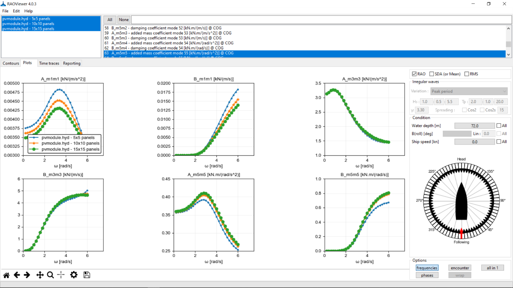{width="2.031496062992126in" height="3.6535433070866143in"}   {width="1.9724409448818898in" height="3.6535433070866143in"}   {width="1.8661417322834646in" height="3.6535433070866143in"}
  ----------------------------------------------------------------------------------------------- ------------------------------------------------------------------------------------------------ ------------------------------------------------------------------------------------------------

  -------------------------------------------------------------------------------------------------------------------------------------------------------------------------------------------------------------------------------------------------------------------------------------------------

  : []{#_Ref127806776 .anchor}Figure 2: Added mass and damping coefficients for surge (m1m1), heave (m3m3), pitch (m5m5) and the effect of mesh size.

![[]{#_Ref127806831 .anchor}Figure 3: Surge, heave, pitch motion in head waves and the effect of mesh size.](../images/2024-04-16_surewave_d5.1/image5.png){alt="P337#yIS1" width="6.566666666666666in" height="3.071505905511811in"}

![[]{#_Ref127806844 .anchor}Figure 4: Wave drift force in head waves and the effect of mesh size.](../images/2024-04-16_surewave_d5.1/image6.png){alt="P339#yIS1" width="5.3264599737532805in" height="2.5in"}

As a next step multiple modules were modelled with a gap of 15cm in between. Simulations were done with and without hinges in between the modules. The simulations without hinges indicate for which wave conditions the relative motions between modules are largest. In the simulation with hinges the relative motions are restrained but that leads to load variations in the hinges because the inertia loads of the moving modules are transferred to the hinge. Simulations were done with two modules. In all cases the waves are head on (180 degrees wave direction), only exciting surge, heave and pitch motions.

## Two modules

For the single module, it was concluded that the use of 10x10 panels on the horizontal surface of the modules is sufficient for converged hydrodynamic forces. The situation with two modules is slightly different because there is interaction of the modules which are in close proximity. Therefore, the number of mesh elements was also varied for this configuration. [Figure 5](#_Ref128055913) shows the motion response of the two modules. It can be seen that the difference between the two simulations with different meshes is very small.

![[]{#_Ref128055913 .anchor}Figure 5: Heave and pitch motion Response Amplitude Operator (RAO) for the two modules with 10x10 and 15x15 panels, not connected with hinges.](../images/2024-04-16_surewave_d5.1/image7.png){alt="P348#yIS1" width="6.715661636045494in" height="3.3473042432195976in"}

[Figure 6](#_Ref127953747) shows the Response Amplitude Operator of the relative surge and heave motion between the modules (the difference between the heave and surge motion of the two modules at the gap location). This shows how much the modules are separated in a regular wave with an amplitude of 1m, for a range of wave frequencies.

![[]{#_Ref127953747 .anchor}Figure 6: Relative surge and heave motion RAO between two modules with 10x10 and 15x15 panels, not connected with hinges.](../images/2024-04-16_surewave_d5.1/image8.png){alt="P353#yIS1" width="4.3in" height="3.0416666666666665in"}

It can be seen that the difference between the two simulations with different meshes is very small. It can be concluded that also for the situation with multiple PV modules it is sufficient to use 10x10 panels. Therefore, in all the results presented in this document, the mesh with 10x10 panels was used.

For floating bodies in close proximity, often resonant water motions occur related to the pumping of water and sloshing of water in the gap separating the floaters. In a linear analysis without viscous damping, these resonant water motions are grossly exaggerated, but these can be reduced by adding damping to the water motions in the gap. In these simulations that was not observed in the wave frequency range that was analysed, probably due to the limited draft of the floats.

The relative motion RAO ([Figure 6](#_Ref127953747)) shows that the largest horizontal relative motions are expected to occur for a wave frequency of 3.2 rad/s (wave period 1.96s) and the largest vertical relative motions for a wave frequency of 5.2 rad/s (1.21 s). These motions will be (partially) restrained when the modules are connected with hinges and therefore the largest hinge forces can also be expected in this range of frequencies. [Figure 7](#_Ref128056019) shows a visualisation of the dynamic pressure on the free surface and the PV modules in a short wave (wave frequency 5.0 rad/s) where relative heave motions are largest. It should be noted that the breakwater is expected to have a high effectiveness in this wave period range and a large part of the wave energy will be blocked.

![[]{#_Ref128056019 .anchor}Figure 7: Dynamic pressure on the free surface and on the two coupled modules in a regular wave with a frequency of 5.0 rad/s (DIFFRAC)](../images/2024-04-16_surewave_d5.1/image9.png){alt="P360#yIS1" width="6.6930555555555555in" height="3.1in"}

Because of the linearity assumption, the hinges between the modules can only be modelled as linear springs in six degrees of freedom. These springs restrict the relative surge, sway, heave, roll, pitch and yaw motions. Any hinge non-linearities can be modelled in semi nonlinear time-domain models such as aNySIM, which is used for the breakwater mooring simulations in chapter [5](#mooring-loads-of-the-10mw-design) (for more details, see Appendix D). Initial hinge stiffness parameters were provided by Sunlit Sea. At a later stage detailed (nonlinear) hinge parameters became available from tensile tests by SINTEF, but these were not yet available for the simulations reported in this document. The hinge horizontal stiffness is 85,000 N/m and the hinge rotational stiffness is 1.375 Nm/rad. Two of these hinges are located between the modules, see [Figure 8](#_Ref159843088).

Simulations were performed with these hinge stiffnesses with the following procedure:

- The stiffness values of the hinge are transformed to hinge stiffness matrices at the centre of mass of the floats.

- The hinge stiffness matrices are added to the equation of motion of the floats which is solved at the centre of mass of the body.

- The motions at the centre of mass of the floats are transformed to the motions at the hinge locations (due to rotations the translations surge-sway-heave at the hinge are different than those at the centre of mass)

- The relative motion of the two floats at the hinge location is determined in all 6 degrees of freedom by subtracting the motions of the floats.

- The relative motion is multiplied with the hinge stiffness which results in the loads in the hinge.

![[]{#_Ref159843088 .anchor}Figure 8: Visualisation of the hinge and two modules in aNySIM.](../images/2024-04-16_surewave_d5.1/image10.png){alt="P372#yIS1" width="5.509722222222222in" height="2.2083333333333335in"}

The amplitude of the hinge force variations as a function of wave frequency is shown in [Figure 9](#_Ref127968257). It can be seen that the force variations are largest for waves with a frequency around 4.0 rad/s (1.6s). This frequency is slightly higher than the frequency at which the relative horizontal motion peaks ([Figure 6](#_Ref127953747)).

![[]{#_Ref127968257 .anchor}Figure 9: Hinge force variations in regular waves with 1m amplitude.](../images/2024-04-16_surewave_d5.1/image11.png){alt="P377#yIS1" width="4.275in" height="3.2583333333333333in"}

The hinges affect the motion response of the modules. The nonlinear wave drift forces depend on the motion response and therefore these forces will be affected by the presence of the hinges.

[Figure 10](#_Ref127971443) shows the mean wave drift force on the two modules. It can be seen that the drift force on the exposed module (BODY 2) is much larger in magnitude, and that the wave drift forces start to become significant only for short waves (frequencies higher than 3.0 rad/s). Due to the wave shielding effect it can be expected that for a longer row of modules the wave drift force is negligible for modules further down the row. The total drift force on the two modules combined is negative, meaning that the modules are pushed backwards in their mooring in the direction of wave propagation, as expected.

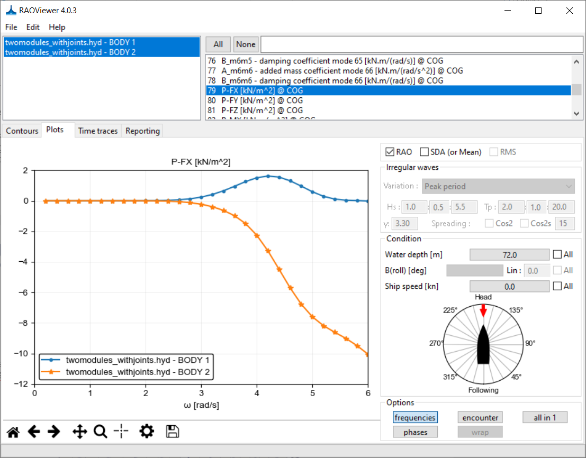{width="4.15in" height="3.125in"}

[]{#_Ref127971443 .anchor}Figure 10: Mean wave drift force on the two modules with the effect of the hinges included.

## Effect of marine growth

In SUREWAVE report D2.1 "Use case scenario basis for typical, rough location" is described how the effect of marine growth has to be taken into account. Marine growth with a thickness of up to 60mm should be considered. Since this more or less increases the mass of a PV module with a factor 5 it can be expected that it influences the dynamic behaviour of the modules considerably. It is therefore worthwhile to check if this scenario is expected to result in higher loads in the hinges.

Simulations have been repeated for the configuration with two modules. Marine growth of 60mm with a density of 1325 kg/m3 is considered on the underside of the PV module. The additional underwater weight (weight in air minus buoyancy) increases the draft to 0.096m. The module is now modelled as two rectangular blocks on top of each other (marine growth block below and the PV module on top). The main particulars and weight distribution is shown in [Table 2](#_Ref127979658). The mesh distribution for the linear diffraction analysis is shown in [Figure 11](#_Ref127979698).

+--------------------------------------------+-----------------------------------------+
| PV module                                  | Marine growth                           |
+:=============+:=============+:=============+:============+:============+:============+
| mass         | kg           | 65.200       | mass        | kg          | 280.980     |
+--------------+--------------+--------------+-------------+-------------+-------------+
| B            | m            | 1.880        | B           | m           | 1.880       |
+--------------+--------------+--------------+-------------+-------------+-------------+
| L            | m            | 1.880        | L           | m           | 1.880       |
+--------------+--------------+--------------+-------------+-------------+-------------+
| H            | m            | 0.080        | H           | m           | 0.060       |
+--------------+--------------+--------------+-------------+-------------+-------------+
| Ixx          | kgm\^2       | 19.238       | Ixx         | kgm\^2      | 82.842      |
+--------------+--------------+--------------+-------------+-------------+-------------+
| Iyy          | kgm\^2       | 19.238       | Iyy         | kgm\^2      | 82.842      |
+--------------+--------------+--------------+-------------+-------------+-------------+
| Izz          | kgm\^2       | 38.407       | Izz         | kgm\^2      | 165.516     |
+--------------+--------------+--------------+-------------+-------------+-------------+
| kxx          | m            | 0.543        | kxx         | m           | 0.543       |
+--------------+--------------+--------------+-------------+-------------+-------------+
| kyy          | m            | 0.543        | kyy         | m           | 0.543       |
+--------------+--------------+--------------+-------------+-------------+-------------+
| kzz          | m            | 0.768        | kzz         | m           | 0.768       |
+--------------+--------------+--------------+-------------+-------------+-------------+
| kG           | m            | 0.1          | kG          | m           | 0.030       |
+--------------+--------------+--------------+-------------+-------------+-------------+

: []{#_Ref127979658 .anchor}Table 2: Main particulars and weight distribution of PV module and marine growth.

![[]{#_Ref127979698 .anchor}Figure 11: Mesh of the two modules with 6cm marine growth.](../images/2024-04-16_surewave_d5.1/image13.png){alt="P475#yIS1" width="5.276388888888889in" height="2.2916666666666665in"}

The relative motion Response Amplitude Operator (RAO) between the modules (no hinges included) is shown in [Figure 12](#_Ref127979810) and compared with the situation without marine growth. The RAO is defined for a wave with an amplitude of 1m. It can be seen that the relative horizontal motion becomes smaller with marine growth but that the relative vertical motion increases.

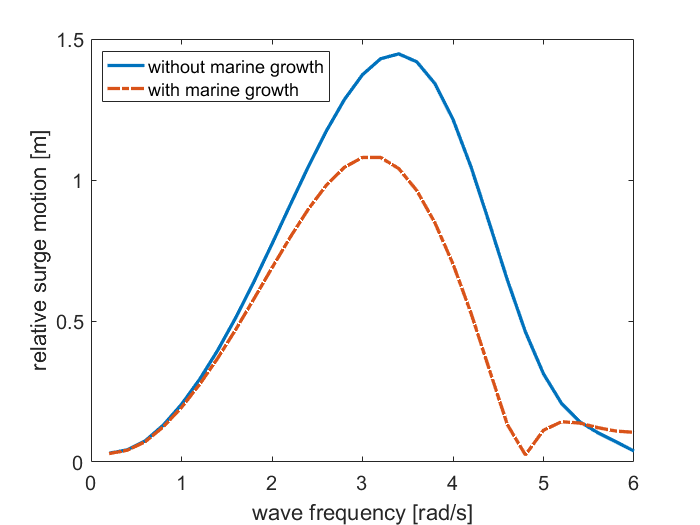{width="3.2755905511811023in" height="2.456692913385827in"}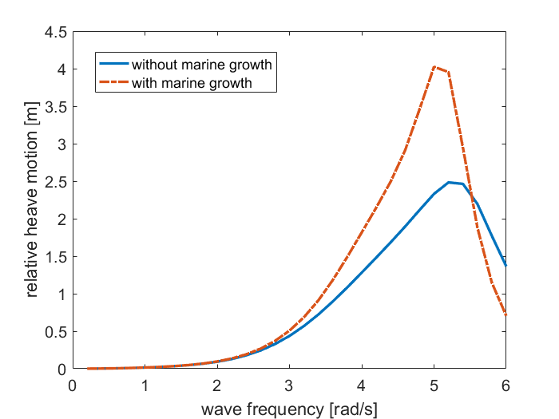{width="3.2755905511811023in" height="2.456692913385827in"}

[]{#_Ref127979810 .anchor}Figure 12: Relative motions between modules with 6cm marine growth, no hinges.

To check the effect on the hinge forces the simulations were repeated with hinges according to the procedure outlines in section [2.2](#two-modules). The hinge force variations with and without marine growth are shown in [Figure 13](#_Ref128054170). It can be seen that the hinge force variation with marine growth is much larger than without marine growth. The difference is approximately a factor 4-5 which is similar to the relative increase in mass of the module. So a heavier module with a larger draft results in higher hinge loads.

![[]{#_Ref128054170 .anchor}Figure 13: Amplitude of hinge force variations in regular waves with 1.0m amplitude with and without marine growth.](../images/2024-04-16_surewave_d5.1/image16.png){alt="P486#yIS1" width="5.558132108486439in" height="4.027208005249344in"}

# Validation with Stadt towing tank wave basin tests

[]{#_Toc164177988 .anchor}2.1 Basin tests

Wave basin tests of Sunlit Sea's floating PV system were performed in the Stadt Towing Tank, Norway. These tests were not part of the SUREWAVE project, but the results were made available by Sunlit Sea for the numerical model validation presented herein.

The basin tests were performed at prototype scale for arrays of 1x3, 1x6 and 1x9 interconnected PV modules. The water depth in the basin was 4.0 m. Several irregular and regular wave conditions were tested, all at normal incidence. The model was kept in place through soft springs connected at fore side of the array. During the tests, motions were measured using an optical measurement system (see [Figure 14](#_Ref160696069)) and were translated to CoG. Besides, the wave height was logged at two or three locations in the basin.

![[]{#_Ref160696069 .anchor}Figure 14: Setup of six PV floats in the Stadt Towing Tank.](../images/2024-04-16_surewave_d5.1/image17.emf){alt="P495#yIS1" width="6.6930555555555555in" height="2.248611111111111in"}

Data were provided to MARIN as raw time traces. Motion RAOs were computed using the measured wave height as lead signal. Not all tests resulted in reliable RAOs (e.g., heave RAOs \> 1 in the regime of low-frequency waves). Therefore, the comparison against model tests is performed for two selected basin tests:

- For the 1x3 array: Log 21; Pink Noise, Hs = 0.1 m, Tp = 0.7-3.0 s

- For the 1x6 array: Log 11; JONSWAP, Hs = 0.3 m, Tp = 2.75 s

## Numerical approach

DIFFRAC calculations (see Appendix C) were performed for the 1x3 and 1x6 arrays at the same water depth as in the basin (4.0 m). The panel mesh for the 1x6 array is presented in [Figure 15](#_Ref160710113). Damping lids (ε = 0.05) were applied between panels. The hinge joints were implemented as linearized stiffness matrices using values provided by Sunlit Sea (see Section [2](#linear-diffraction-analysis-of-coupled-pv-modules)).

![[]{#_Ref160710113 .anchor}Figure 15: DIFFRAC panel mesh (1x6 array).](../images/2024-04-16_surewave_d5.1/image18.png){alt="P507#yIS1" width="4.083781714785652in" height="2.093584864391951in"}

## Results

[Figure 16](#_Ref160713004) presents a comparison between DIFFRAC and experimental RAOs as function of normalized wave length λ for the 1x3 (left) and 1x6 (right) array. Floater 1 is the most upwave module. The pitch RAOs were normalized with the wave number *k*. The horizontal axis is normalized with the length of the array (3 or 6 panels) for surge and with the length of a single module for heave and pitch.

The numerical and experimental results are generally similar. Most notably, the experimental surge RAOs seem shifted along the horizontal axis towards shorter wave lengths compared to the numerical results. The DIFFRAC calculations show a depression of the surge RAO at λ/Larray ≈ 1, i.e., when the wave length is approximately equal to the length of the array, which is as expected. It is not clear why the experimental results have this depression at a slightly shorter wave length (λ/L~float~ ≈ 0.9). The numerical results show a slightly lower surge response for the mid floater (#2 in the left hand plots), which is not seen in the experimental results.

The numerical heave and pitch RAOs approach a normalized amplitude of 1 in the limit of long waves, corresponding to the PV modules following the water surface (as expected). The experimental pitch RAOs approach a slightly lower amplitude of about 0.8 -- 0.9 in the limit of long waves; these values below 1 may relate to uncertainties in measurements and data processing. For λ \< 2\*L~float~, heave and pitch amplitudes drop below 1. In the range of short waves (λ \< 2\*L~float~), the heave and pitch RAOs reduce from the fore (#1) towards the aft (#3, #6) floaters due to shielding effects.

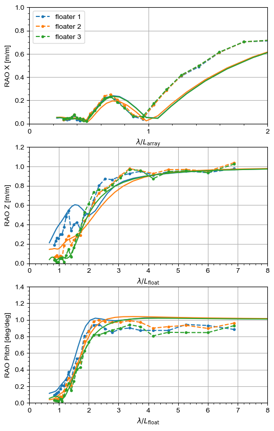{width="3.1496062992125986in" height="4.941199693788277in"} 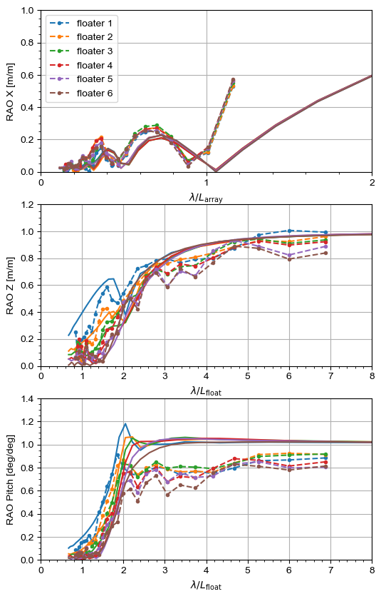{width="3.1496062992125986in" height="4.941201881014873in"}

[]{#_Ref160713004 .anchor}Figure 16: Motion RAOs in surge (top), heave (middle) and pitch (bottom) direction, as function of the wave length, for the 1x3 array (left) and 1x6 array (right). Experimental (dashed lines) and numerical (solid lines) results. The horizontal axis is normalized with the length of the array (3 or 6 panels) for surge and with the length of a single module for heave and pitch.

Comparison between the 1x3 and 1x6 array show that the surge RAOs scale well to the wave length normalized by the length of the array, while the heave and pitch RAOs scale to the wave length normalized by the length of a single module.

Numerical results for heave and pitch motions are generally similar to the basin test results, although some differences are notable. For instance, the heave RAOs seem slightly overpredicted for short waves (λ \< 2\*L~float~) while the pitch RAOs are overestimated for long waves (possibly related to measurement uncertainties). The reduction in motion amplitudes from fore to aft floaters is qualitatively reproduced by DIFFRAC.

## Discussion

The comparison against experimental results shows that DIFFRAC can reproduce the general motion behaviour, including shielding by the fore floaters. This provides confidence that the tool can be used for a more explorative study into, e.g., effects of marine growth (Section [2.3](#effect-of-marine-growth)) and different configurations (next Chapter). However, it should be noted that the DIFFRAC calculations have not been validated in terms of hinge loads, and it is expected that the nonlinear stiffness characteristics of the hinges (not captured by DIFFRAC) have a strong effect on the maximum hinge loads.

In addition, it is noted that the motion behaviour of the FPV system is only validated for a relatively small farm (1 x 6 at max). For much larger farms, physical processes that are not considered in the present linear first-order potential flow approach may become important, such as second order excitation and dissipation of wave energy throughout the farm. These processes are not represented in the present diffraction approach but may be considered through higher fidelity tools (time domain simulations, CFD, basin tests) at later stage.

In conclusion, DIFFRAC can reproduce the general motion behaviour, but the computed hinge loads and the motions in large fields come with high uncertainty due to the inherent limitations of this low-fidelity tool.

# CFD analysis of coupled PV modules

The linear low-fidelity analysis is performing satisfactory in mild and moderate wave conditions. It is expected that for higher waves such an analysis has its shortcomings because of effects such as wave breaking, wave overtopping and large motions of the PV modules. Therefore, some initial investigations were performed to investigate the suitability of CFD calculations for the coupled analysis of the modules in high waves. The simulations were made using MARIN's in-house CFD code ReFRESCO (<https://www.marin.nl/en/about/facilities-and-tools/software/refresco>). The following simulation setup was chosen:

- Three coupled modules in a 2D setup (1 computational cell in transverse, y-direction)

- Irregular waves typical for the Baltic sea with a return period of 5 years (Height=4.0m, peak period=9.1s)

- Hinges with a linear stiffness between the modules according to the values specified by partner Sunlit Sea

The irregular waves were first generated using the open-source wave model REEF3D-FNPF (https://reef3d.wordpress.com/) with a 3-hour storm duration. This model does not consider the PV modules; it only generates the CFD initial and boundary condition. For the CFD simulation a wave group was selected from this three-hour storm that includes the highest wave crest. The velocities, pressures and wave elevation were transferred from the REEF3D model to the CFD model. The CFD simulations do include the PV modules and hinges.

The first wave crest in this wave group causes overtopping of the PV modules as shown in [Figure 17](#_Ref168321883). The CFD calculation successfully continues after this event has passed.

![[]{#_Ref168321883 .anchor}Figure 17: Wave overtopping event in CFD in 5-year return period wave using three connected PV modules.](../images/2024-04-16_surewave_d5.1/image21.png){alt="A screen shot of a computer screen Description automatically generated" width="4.747222222222222in" height="1.4916666666666667in"}

The second wave crest in this wave group is a steep and breaking wave. Unfortunately, the CFD code diverges when this wave breaks on the PV modules. A solution snapshot shortly before divergence is shown in [*Figure 18*](#_Ref168321884). By changing numerical this divergence could not be avoided unfortunately.

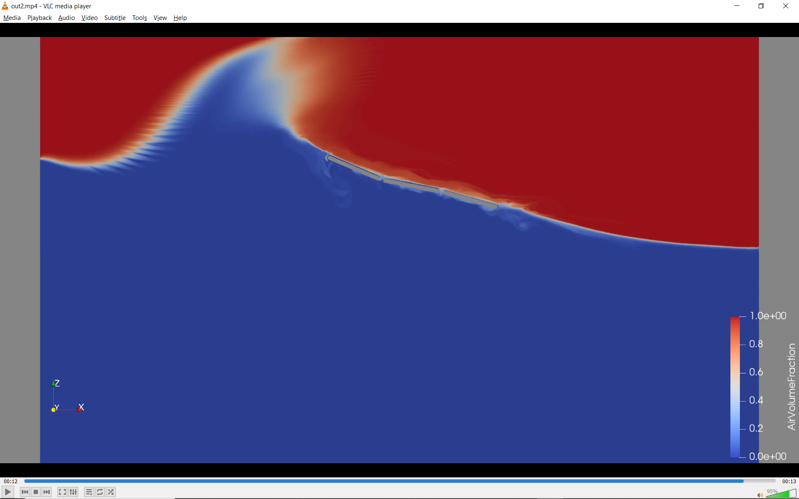{width="5.65in" height="2.1083333333333334in"}

[]{#_Ref168321884 .anchor}*Figure 18: Wave breaking event in CFD in 5-year return period wave using three connected PV modules.*

Other interesting facts that were observed were:

- The CFD solver convergences slowly due to large mass versus added mass ratio of the vertical PV module motions

- The cpu costs for these simulations are high because a large number of computational cells (\~900,000) has to be used near the pv modules and around the free surface, in combination with a small time step.

The decision to switch from high-fidelity (CFD) simulations to low-fidelity models is driven by several factors. Firstly, the high-fidelity CFD method lacks robustness when simulating the response of photovoltaic (PV) modules under steep and breaking wave conditions. Secondly, cost constraints make implementing a three-dimensional setup using high-fidelity models unrealistic. Lastly, low-fidelity simulations, despite their model inaccuracies, can be adjusted with safety factors to provide a more practical and reliable assessment of PV module performance

# Motions and connector loads in large PV fields and floating breakwater presence

## Objectives

The objectives of the present Chapter are to shed insights into:

- The motions of the floating PV modules for different size PV farms;

- The maximum expected hinge loads for different size PV farms;

- The effectiveness of the floating breakwater for varying wave conditions and PV farm sizes.

## Approach

## DIFFRAC calculations

To investigate the effect of farm sizing on connector loads, DIFFRAC calculations were performed for fields of 5x3, 10x10 and 20x20 PV modules. The same DIFFRAC modelling approach as in the previous Chapters was followed. A marine growth of 0.06 m was assumed for all calculations presented in this Chapter. Although the present section focuses on hinge loads, it is noted that the DIFFRAC-computed loads have not been validated and come with considerable uncertainty (see Section [3.3](#discussion)). It is not evident whether the DIFFRAC results are conservative.

## Post-processing

The RAOs provide the response in regular waves. In reality, waves are irregular and the response depends also on the energy content and distribution of the wave field. To convert the RAOs to expected values in irregular sea states, the most probable maximum (MPM) is a commonly used variable. The MPM of a linear parameter in a 3-h sea state was calculated based on the linear response amplitude operator (RAO) and the input wave spectrum (S~w­~) as follows:

+-----------------------------------------------------------------------+
| > $$m_{0} = \int_{}^{}{S_{w}(\omega)*RA{O(\omega)}^{2}*d\omega}\ $$   |
+=======================================================================+

> $$RMS = \ \sqrt{m_{0}}$$
>
> $$MPM = \ \sqrt{2.\ln N}.RMS$$
>
> $$SDA = \ 4*RMS$$
>
> Where:
>
> S~w~(ω) is the wave spectrum
>
> m~0~ is the zero-order spectral moment of the response spectrum
>
> RMS Root Mean Square, is the square root of the zeroth moment.
>
> N represents the number of wave cycles in a 3-h sea state (N = 10,800/T~z~),\
> where T~z~ is the zero up-crossing period.

Several load cases were defined in Deliverable 2.3 (Riise, 2023b). The focus here is on the ULS load case for connector loads in extreme waves. The 50-y contour is to be followed for this load case. For the three selected field sites, the significant wave height (Hs) and peak period (Tp) for the 50-y contour were adopted from Table 8 (Baltic Sea), Table 14 (Mediterranean) and Table 20 (North Sea) in D2.1 (Riise, 2023a). A JONSWAP peak enhancement factor (γ) of 1 was assumed. The environments were used to calculate the wave spectra (S~w~) and MPM hinge loads following the equations listed above.

  --------------------------------------------------------------------------------------------
  Hs \[m\]     0.5   1.0   1.5   2.0   2.5   3.0   3.5   4.0   4.5   5.0   5.5   6.0    6.5
  ------------ ----- ----- ----- ----- ----- ----- ----- ----- ----- ----- ----- ------ ------
  Tp \[s\]     1.2   1.9   2.7   3.6   4.5   5.4   6.2   7.0   7.8   8.6   9.3   10.0   10.8

  --------------------------------------------------------------------------------------------

  : []{#_Ref164168450 .anchor}Table 3: Hs-Tp relation for 50-y contour at the Mediterranean field site. Adopted from Table 14 in D2.1(Riise, 2023a).

## Effect of floating breakwater

The floating breakwater (FBW) aims to reduce the amplitude of the wave experienced by the PV modules. In order to consider the attenuation by the FBW, the linear Macagno formulation was used (see equation 3-12 in SUREWAVE D2.2 (Pehlke, 2023a)):

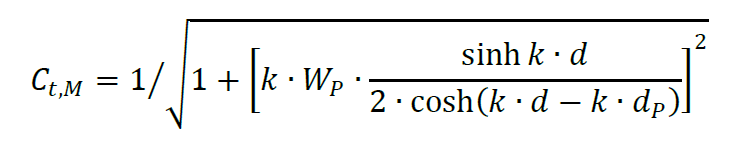{width="2.436053149606299in" height="0.48247265966754155in"}

The transmission coefficient C~t,M~ is defined as the ratio between transmitted and incident wave height (C~t,M~ = H~t~/H~i~). Since the relation is linear, it can be combined with the RAOs of motions and forces to obtain RAOs in presence of the breakwater:

> $${RAO}_{att}(\omega) = \ {C_{t,M}(\omega)RAO}_{os}(\omega)$$

Here, subscripts "att" and "os" are used to indicate situations with the wave field attenuated by FBW presence and open seas, respectively. In the calculations, a breakwater width W~p~ = 5.0 m and a draft D~p~ = 2.03 m are assumed, consistent with D3.2 (Pehlke, 2023b)

## Results 5 x 3 farm

![[]{#_Ref161054898 .anchor}Figure 19: Sign convention for the 5x3 PV farm.](../images/2024-04-16_surewave_d5.1/image24.png){alt="P606#yIS1" width="4.521738845144357in" height="2.549905949256343in"}

## Motions

Motion RAOs of the 5x3 floaters are presented in [Figure 18](#_Ref161050719) and [Figure 19](#_Ref161050721). It follows that the motions of the individual floats are largely similar. Towards high frequencies, the heave, roll and pitch RAOs are higher for the fore floats than for the (shielded) aft floats.

Compared to the 2x1 matrix presented in Section [2.2](#two-modules), especially the surge and sway RAOs are notably different. This is explained because the surge and sway response depend strongly on the size of the full FPV matrix, and not solely on the particulars of a single float. For instance, the surge RAO in 180 deg ([Figure 18](#_Ref161050719), top left) shows a local depression at around 2.4 rad/s, which corresponds to a wave length λ that is close to the length of the assembled system (five floats plus spacing, length = 10.0 m). Similarly, the sway response in 270 deg ([Figure 18](#_Ref161050719), mid right) shows a response of ≈ 0 at ω = 3.2 rad/s. This again corresponds to a wave length that equates the assembled system's length (three floats plus spacing, length = 6.0 m).

![[]{#_Ref161050719 .anchor}Figure 20: Motion RAOs 5x3 matrix (translations)](../images/2024-04-16_surewave_d5.1/image25.png){alt="P615#yIS1" width="6.6930555555555555in" height="3.7736111111111112in"}

![[]{#_Ref161050721 .anchor}Figure 21: Motion RAOs 5x3 matrix (rotations)](../images/2024-04-16_surewave_d5.1/image26.png){alt="P618#yIS1" width="6.6930555555555555in" height="3.78125in"}

## Hinge loads

RAOs of hinge loads are presented in [Figure 20](#_Ref161054312) (horizontal directions x,y) and [Figure 21](#_Ref161054314) (vertical direction, z). For both horizontal and vertical directions, the load RAOs are greatest between roughly 2 to 5 rad/s. It further follows that for this farm size, hinge load RAOs in horizontal and vertical direction are of similar magnitude.

Note that the maximum RAOs for the fore/aft hinges in 180 deg ([Figure 20](#_Ref161054312) top left) exceed the maximum RAOs for the starboard/portside hinges in 270 deg (bottom right). This indicates that higher loads are expected when five floaters are aligned in wave direction than when three floaters are aligned.

![[]{#_Ref161054312 .anchor}Figure 22: RAOs of hinge loads for 5x3 matrix (horizontal direction). Top row: hinges at module fore and aft sides; bottom row: hinges at starboard and port sides (see also labelling in [Figure 17](#_Ref161054898)).](../images/2024-04-16_surewave_d5.1/image27.png){alt="P627#yIS1" width="6.6930555555555555in" height="2.959722222222222in"}

![[]{#_Ref161054314 .anchor}Figure 23: RAOs of hinge loads for 5x3 matrix (vertical direction). Top row: hinges at module fore and aft sides; bottom row: hinges at starboard and port sides (see also labelling in [Figure 17](#_Ref161054898)).](../images/2024-04-16_surewave_d5.1/image28.png){alt="P629#yIS1" width="6.686805555555556in" height="2.95625in"}

The RAOs shed insight into the response for different frequencies and constant wave amplitude (A = 1 m). In reality, seas are irregular and wave height and period are correlated. To study the response in irregular seas, the most probable maximum (MPM) loads are presented in [Figure 22](#_Ref161056618) (horizontal loads) and [Figure 23](#_Ref161056619) (vertical loads). Results are plotted as function of the peak period Tp, assuming the relation between Hs and Tp for the 50-y contour in the Mediterranean field site (see [Table 3](#_Ref164168450)). This means that the plotted values have a similar probability of occurrence (once every 50 years). It follows that for the present farm size, the highest horizontal and vertical hinge loads are computed for relatively short-period seas (Tp = 3 -- 5s). This occurs despite the longer-period waves having a considerably higher Hs (see [Table 3](#_Ref164168450)) and is explained by the high response amplitudes for the shorter waves (= higher frequencies).

Maximum horizontal loads up to 2.5 kN are computed, which approaches the axial break load of about 3.0 kN as established through tensile tests in WP6. Note that the uncertainty in these maximum loads is stressed, and that the presented values exclude the effect of the floating breakwater. Similar to the hinge load RAOs, it again follows that the fore/aft side hinges in 180 deg ([Figure 22](#_Ref161056618) top left) experience greater horizontal loads than the portside/starboard side hinges in 270 deg (bottom right).

![[]{#_Ref161056618 .anchor}Figure 24: MPM hinge loads (horizontal direction) for 5x3 matrix as function of peak period, along the 50-y contour in the Mediterranean Sea. Top row: hinges at module fore and aft sides; bottom row: hinges at starboard and port sides.](../images/2024-04-16_surewave_d5.1/image29.png){alt="P633#yIS1" width="6.15625in" height="2.7216896325459317in"}

For the vertical loads, it follows that slightly greater loads occur for oblique incident waves (202.5 to 247.5 deg) than for normal incident waves (180 and 270 deg) (see [Figure 23](#_Ref161056619)).

![[]{#_Ref161056619 .anchor}Figure 25: MPM hinge loads (vertical direction) for 5x3 matrix as function of peak period, along the 50-y contour in the Mediterranean Sea. Top row: hinges at module fore and aft sides; bottom row: hinges at starboard and port sides.](../images/2024-04-16_surewave_d5.1/image30.png){alt="P636#yIS1" width="6.354166666666667in" height="2.8422714348206473in"}

The previous graphs show the variation of maximum loads depending on peak period. The representation sheds limited insights into the distribution of loads over the field. Therefore, [Figure 24](#_Ref161059604) presents a spatial view of the MPM horizontal loads for different incidence headings and for one selected sea state (Hs = 2.5 m, Tp = 4.5 s). The loads are presented by the colour coding. For headings 180 and 225 deg, the highest axial loads occur for the hinges that connect the center modules. The loads on the hinges that connect the outward modules are clearly lower.

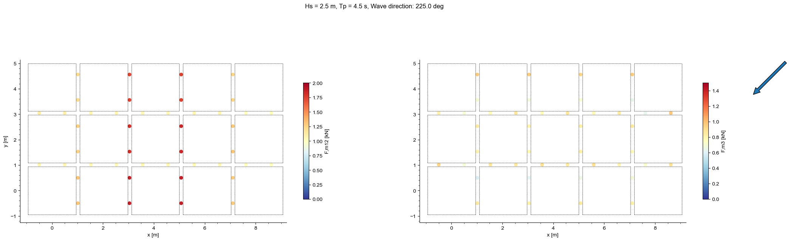{width="0.5819444444444445in" height="0.5645833333333333in"}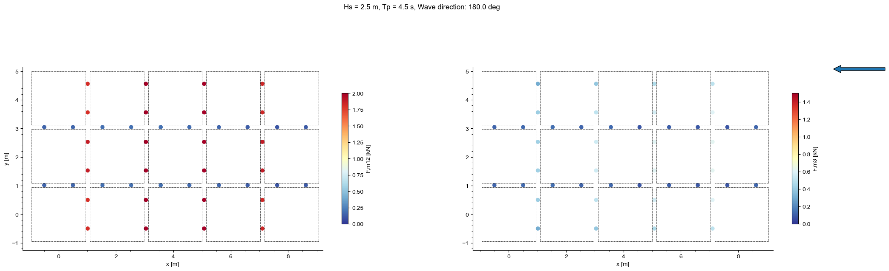{width="1.0951388888888889in" height="0.3909722222222222in"} 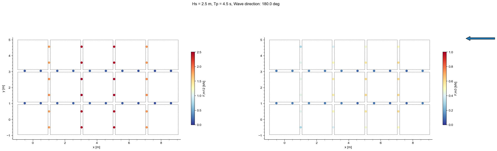{width="4.55511811023622in" height="2.5039370078740157in"} 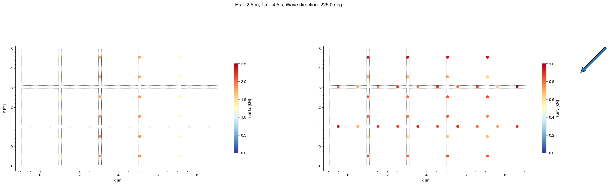{width="4.539370078740157in" height="2.5196850393700787in"}

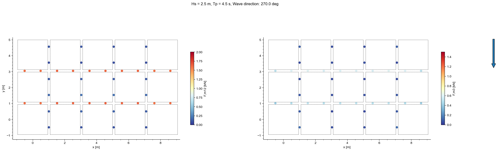{width="0.35625in" height="0.8777777777777778in"} 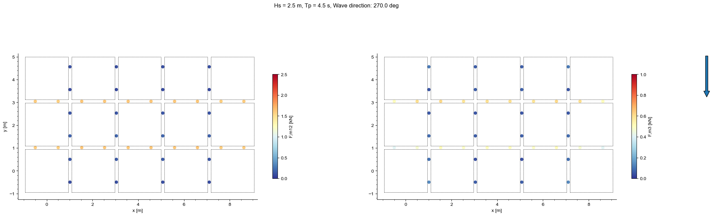{width="4.413385826771654in" height="2.437007874015748in"}

[]{#_Ref161059604 .anchor}Figure 26: Most probable maximum (MPM) horizontal hinge loads (Hs = 2.5 m, Tp = 4.5 s), for varying wave incidence as indicated by the right-hand side arrow: 180 deg (top), 225 deg (middle) and 270 deg (bottom).

[Figure 23](#_Ref161056619) presents the same representation of loads, but this time in vertical direction. Here it follows that the overall highest loads occur for oblique incidence (225 deg). The different connectors receive similar-magnitude loads, although slightly higher loads are observed for the more outward modules. In 180 and 270 deg, the highest loads occur for the hinges connecting the most upwave modules. The loads on the hinges connecting the downwave modules are lower, probably due to shielding effects.

{width="0.5819444444444445in" height="0.5645833333333333in"}{width="1.0951388888888889in" height="0.3909722222222222in"} 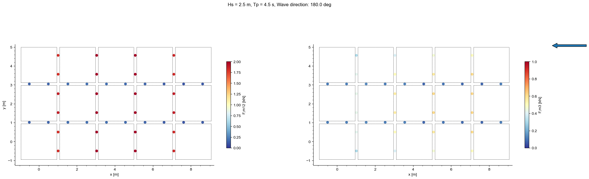{width="4.456692913385827in" height="2.531496062992126in"}

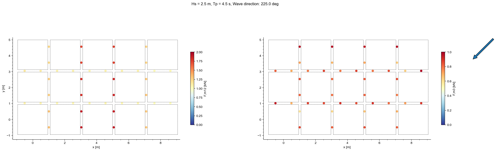{width="4.460629921259843in" height="2.6141732283464565in"}

{width="0.35625in" height="0.8777777777777778in"} 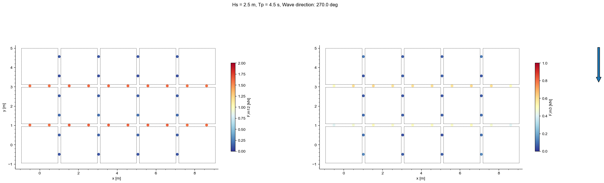{width="4.452755905511811in" height="2.3976377952755907in"}

[]{#_Toc176267551 .anchor}Figure 27: Most probable maximum (MPM) vertical hinge loads (Hs = 2.5 m, Tp = 4.5 s), for varying wave incidence as indicated by the right-hand side arrow: 180 deg (top), 225 deg (middle) and 270 deg (bottom).

## Upscaling to larger farms

## Motions

Motion RAOs for the 10x10 farm are presented in [Figure 26](#_Ref161230472) (translations) and [Figure 19](#_Ref161050721) (rotations). Comparison to the motion RAOs for the 5x3 farm shows that the surge and sway motions decrease, in particular for high frequencies. Heave, roll and pitch RAOs are of similar magnitude, so are largely independent of farm size. The yaw motions tend to increase with larger farm size.

![[]{#_Ref161230472 .anchor}Figure 28: Motion RAOs 10x10 matrix: translations.](../images/2024-04-16_surewave_d5.1/image40.png){alt="P652#yIS1" width="6.686805555555556in" height="3.765277777777778in"}

![[]{#_Toc176267553 .anchor}Figure 29: Motion RAOs 10x10 matrix: rotations.](../images/2024-04-16_surewave_d5.1/image41.png){alt="P655#yIS1" width="6.33128937007874in" height="3.5766994750656167in"}

## Hinge loads

A colour contour plot of the most probable maximum hinge loads for a selected sea state for the 10x10 field is presented in [Figure 28](#_Ref161231503) (horizontal loads). Similar to the 5x3 field, the highest horizontal hinge loads are observed in the centre of the farm and for normal incidence waves (180 deg). Note that MPM values up to 4 kN are computed, which is considerably higher than the MPM loads of \~1 kN for the 5x3 farm (see [Figure 24](#_Ref161059604)).

{width="0.5819444444444445in" height="0.5645833333333333in"}{width="1.0951388888888889in" height="0.3909722222222222in"}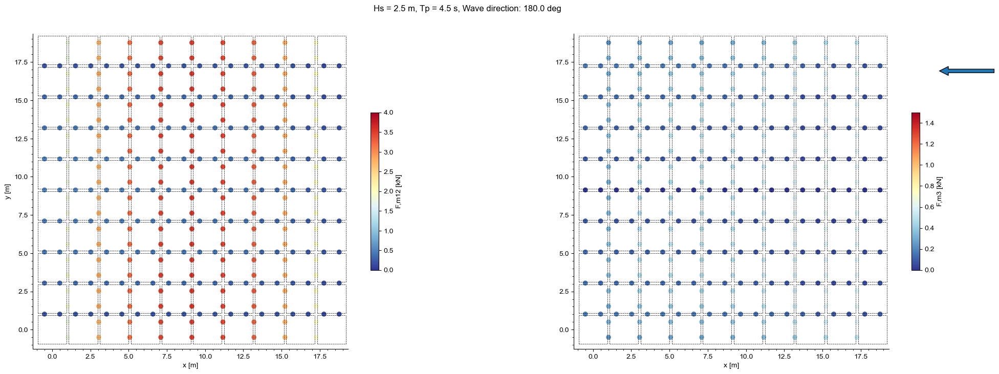{width="5.283464566929134in" height="4.452755905511811in"}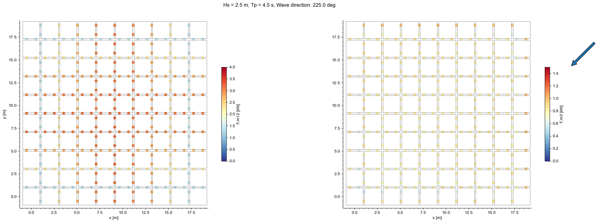{width="5.271653543307087in" height="4.460629921259843in"}

[]{#_Ref161231503 .anchor}Figure 30: Most probable maximum horizontal loads for a 10x10 farm (Hs = 2.5 m, Tp = 4.5 s), for varying wave incidence as indicated by the right-hand side arrow: 180 deg (top) and 225 deg (bottom).

MPM horizontal loads for a 20x20 farm are presented in [Figure 29](#_Ref161386416). Highest loads are again observed for the center panels. For 225 deg waves, relatively high loads are also observed for the hinges at the outward, downwave panels. The maximum loads increase further from 10x10 to 20x20.

{width="1.0951388888888889in" height="0.3909722222222222in"}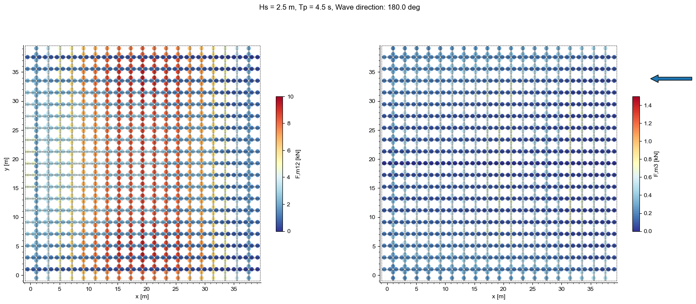{width="4.673228346456693in" height="3.984251968503937in"}

{width="0.5819444444444445in" height="0.5645833333333333in"}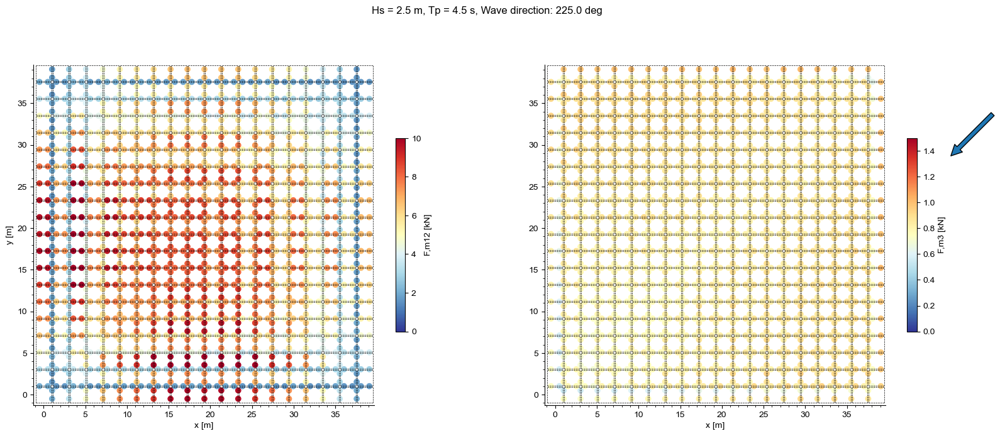{width="4.559055118110236in" height="4.031496062992126in"}

[]{#_Ref161386416 .anchor}Figure 31: Most probable maximum horizontal loads for a 20x20 farm (Hs = 2.5 m, Tp = 4.5 s), for varying wave incidence as indicated by the right-hand side arrow: 180 deg (top) and 225 deg (bottom).

## Effectiveness of floating breakwater

The effectiveness of the floating breakwater (FBW) is explored through the methodology described in Section [4.2.3](#effect-of-floating-breakwater). The approach does not account for the full hydrodynamic coupling between floating breakwater and floating PV panels but is nevertheless expected to give a high-level insight into the effectiveness of the FBW.

[Figure 30](#_Ref161390354) presents MPM horizontal and vertical hinge loads for varying PV farm sizes at 180 deg incidence. The different figure panels (left to right) correspond to increasing farm size. In this representation it follows that without floating breakwater (gray lines), the maximum horizontal loads depend strongly on the size of the PV farms (top row; note the varying y axes). MPM loads for the 5x3 matrix reach up to 2.5 kN, increase to 3.5 kN for the 10x10 field and 12.5 kN for the 20x20 field. This increase is not fully linear. The reason for the increase in loads with farm size is that more mode shapes arise and the total inertia of the system increases.

In contrast to the horizontal loads, the maximum vertical loads (bottom row) are almost independent from farm size and show only a mild increase from the 5x3 to the 20x20 farm.

![[]{#_Ref161390354 .anchor}Figure 32: Most probable maximum (MPM) hinge loads as function of peak period, along the 50-y contour in the Mediterranean Sea, for 180 deg. Top row: horizontal loads; bottom row: vertical loads. Distinction is made between loads without floating breakwater (gray) and with floating breakwater (red). Results shown for 5x3 (left), 10x10 (middle) and 20x20 (right) farms.](../images/2024-04-16_surewave_d5.1/image46.png){alt="P676#yIS1" width="6.633333333333334in" height="4.344734251968504in"}

The floating breakwater is especially effective in the high-frequency regime (T~p~ \< 5 s, see SUREWAVE D3.2). This is also reflected in [Figure 30](#_Ref161390354), which shows the largest relative reduction for the short-period sea states. It is further shown that the breakwater is highly effective in reducing the vertical hinge loads (bottom row). For the horizontal loads, hinge loads are reduced by a factor \~3 around Tp = 4 s, but for the largest farm and highest sea states, the reduction amounts to less than 50%.

## Discussion

As mentioned earlier, the high-fidelity CFD method is not robust enough to simulate the response of PV modules accurately under steep and breaking wave conditions, which are critical for estimating hinge loads. To model hinge forces, a computationally demanding Fluid-Structure Interaction (FSI) approach is required. However, this FSI model is even more computationally intensive and necessitates rigorous validation before it can be trusted Additionally, hinge loads depend on the number of PV panels, and performing high-fidelity simulations for large arrays is computationally demanding. Consequently, we opted for a low-fidelity model.

The results presented in this Chapter are obtained with a low-fidelity numerical tool that was validated in terms of motions (not in terms of hinge loads) and for small arrays only (see also discussion in Section [3.3](#discussion)). The linear diffraction analysis does not include nonlinear physics related to wave overwash, (breaking) wave impacts, and nonlinear stiffness of the hinges.

Based on results in Section 3, as well as studies on similar multi-body systems, it is expected that the linear diffraction analysis (low fidelity models) adequately captures the motion behaviour, also for higher sea states. In terms of hinge loads, it is expected that the present linear approach yields non-conservative estimates of the maximum hinge loads. As observed during wave basin tests (Task 6.4), the low compressive stiffness of the hinges leads to buckling and snap loading. Because such buckling and snap loads are not considered in the present analysis, the maximum hinge loads are likely underestimated. To better assess the hinge loads, more detailed time domain simulations that include the nonlinear hinge stiffness characteristics are recommended. For our project partner, SIS, understanding the hinge load is crucial for the commercial exploitation of their products. In the next phase of the project, we will collaborate to analyze the hinge loads using data from wave tank experiments, SINTEF\'s ultimate strength lab tests, and time-domain simulations incorporating nonlinear hinge stiffness.

Despite the assumptions in the linear diffraction approach, the results shed relevant qualitative insights into the effects of wave incidence, sea state, and farm size. The results show that maximum hinge loads depend strongly on wave incidence, peak period, and farm size. The maximum horizontal hinge loads increase strongly with increasing farm size. The floating breakwater reduces these horizontal loads only to certain extent. A different approach to mitigating high hinge loads could be to split a large PV farm into different subfarms that are moored separately. Also, a surface mooring that pretensions the FPV system may help reducing the PV loads. This is to be explored further through time domain simulations in which a surface mooring, as well as the nonlinear stiffness behaviour of the hinges, can be taken into account.

# Mooring loads of the 10MW design

## Introduction

The design of the 10MW floating breakwater configuration and seabed mooring is described in deliverable report D3.2. It consists of 56 breakwater pontoons, arranged in a circular layout with seabed mooring lines between seabed and the breakwater ring. The mooring configuration is different for the three target locations studied in this project (Baltic sea, Mediterranean sea, North sea) because of the difference in water depth and the difference in expected environmental loads. The objective of this study was to derive the maximum loads in the mooring lines and breakwater connections that can be expected in the harsh conditions to which the breakwater is exposed (i.e. the 50-year return period conditions described in D2.1). The mooring layouts for these three locations are shown in [Figure 31](#_Ref162521330) (pictures taken from D3.2). The North Sea layout has 28 mooring lines (14 outward, 14 inward). The other locations have 16 mooring lines (8 outward, 8 inward). In the simulations presented here the floating PV modules are not modelled since their effect on the mooring line loads will be limited.

  ----------------------------------------------------------------------------------------------------------------------------------------------------------------------------------------------------------------------------------------------------------------------------------------------------
  {width="2.1653543307086616in" height="2.074803149606299in"}   {width="2.1653543307086616in" height="2.074803149606299in"}   {width="2.1653543307086616in" height="2.12992125984252in"}
  ------------------------------------------------------------------------------------------------- ------------------------------------------------------------------------------------------------- ------------------------------------------------------------------------------------------------

  ----------------------------------------------------------------------------------------------------------------------------------------------------------------------------------------------------------------------------------------------------------------------------------------------------

  : []{#_Ref162521330 .anchor}Figure 33: Mooring layout in Baltic (left), Mediterranean (middle) and North Sea (right) as described in D3.2.

Water depths were 16, 38, and 49 m, for Baltic, Mediterranean and North Sea field sites, respectively (as per D3.3).

## Setup of the numerical model

The simulations are performed using the aNySIM-xmf semi-nonlinear Time Domain Simulation (TDS) model. It can solve the equation of motion (Newton's 2^nd^ law) of any number of bodies due to arbitrary external excitation forces. For the circular breakwater the following force components were modelled:

- Wave loads due to incident and diffracted (reflected) waves

- Hydrodynamic reaction forces of the water due to motions (hydrostatic forces, added mass, damping)

- Viscous damping forces

- Forces in connectors between breakwaters

- Forces in mooring lines

- Forced due to wind and current

In the following sections each of these components is discussed in more detail.

Wave loads and hydrodynamic reaction forces

The wave loads and hydrodynamic reaction forces are again calculated using linear diffraction theory (see also Chapter [1](#_Ref160467093) and appendix C). For that purpose the underwater part of the breakwater is divided into panel elements as shown in [Figure 32](#_Ref160467142). A total of 1500 elements was used which was found to be sufficient to have converged results for the range of wave frequencies of interest in this study. A tapered shape is used (see [Figure 33](#_Ref160467164)) such that no gaps exists between the breakwaters in the circular layout. It can be seen that the area of the breakwater that connects to other breakwaters (the short side just below the waterline) has no panels since water cannot flow there in the linear analysis.

![[]{#_Ref160467142 .anchor}Figure 34: Panel model of a single breakwater](../images/2024-04-16_surewave_d5.1/image50.png){alt="P722#yIS1" width="4.625in" height="2.3125in"}

![[]{#_Ref160467164 .anchor}Figure 35: Top view of breakwater showing the tapering related to the circular layout](../images/2024-04-16_surewave_d5.1/image51.png){alt="P724#yIS1" width="4.402024278215223in" height="1.2890409011373578in"}

![[]{#_Ref160468998 .anchor}Figure 36: Breakwater ring consisting of 56 breakwaters.](../images/2024-04-16_surewave_d5.1/image52.png){alt="P726#yIS1" width="6.6930555555555555in" height="2.786111111111111in"}

The circular layout is shown in [Figure 34](#_Ref160468998). The 56 breakwaters have a total of 84,000 panels. Inside the circular breakwater standing waves between the breakwaters will develop. In a linear potential flow analysis these standing waves are undamped and can become unrealistically high. The method to suppress these standing waves is to add damping to the waves propagating inside the circle. The non-dimensional damping parameter that was used in this study was ε=0.025 which is a value commonly used in linear diffraction theory for floating bodies in close proximity.

Similar to the floating PV panels the linear diffraction analysis results in wave load coefficients and reaction forces that depend on wave period/frequency. (wave load coefficients also depend on wave direction). These are stored in a database that can be read and used in the time domain simulation in site-specific wave conditions (wave spectra).

Damping values from CFD simulations

The wave load simulations are done using potential flow theory (see appendix C) in which viscous effects are not accounted for. Viscous effects can have a significant effect on the damping of breakwater motions near resonance. Resonance occurs when restoring/stiffness forces (mooring, hydrostatics) and inertia forces (acceleration of mass and added mass) cancel each other. In that case the response is proportional to the excitation force divided by the damping coefficient and therefore the response can be large in case of low damping values. It is therefore important to take into account all possible damping values.

CFD simulations were done to obtain the viscous damping forces on a single breakwater for sway, heave and roll motions. Because the breakwater shape is rather constant over its length, 2D simulations of a cross-section were made and the end effects were neglected. The simulations were made using MARIN's in-house CFD code ReFRESCO (https://www.marin.nl/en/about/facilities-and-tools/software/refresco) by imposing a forced motion to the breakwater at the (expected) natural periods of the various motions at a draft of 2.02m. The following motions were imposed in three separate simulations:

  -----------------------------------
  motion   period \[s\]   amplitude
  -------- -------------- -----------
  Sway     50.0           1.0 m

  Heave    3.57           0.02 m

  Roll     3.75           0.02 rad
  -----------------------------------

The 50s is an estimate of the natural period of the ring in its mooring system.

[Figure 35](#_Ref160535580) shows the CFD mesh in the vicinity of the breakwater. A very fine mesh was used near the breakwater to accurately capture pressures and shear stresses. Grid coarsening was applied away from the breakwater. In the free-surface area a fine mesh was kept to resolve the waves generated by the breakwater accurately.

![[]{#_Ref160535580 .anchor}Figure 37: Mesh around the 2D breakwater section](../images/2024-04-16_surewave_d5.1/image53.png){alt="P757#yIS1" width="4.6790485564304465in" height="2.4006944444444445in"}

The reaction forces of the water on the breakwater were calculated and stored for further analysis. The reaction forces can be written as:

> $$F_{r} = - A\ddot{x} - b^{(1)}\dot{x} - b^{(2)}\dot{x}\left| \dot{x} \right| - cx$$

Where

$F_{r}$ = reaction force/moment

$x,\ \dot{x},\ \ddot{x}$ = motion, velocity and acceleration of motion mode (sway, heave, roll)

$A$ = added mass coefficient

$b^{(1)}$ = linear damping coefficient

$b^{(2)}$ = quadratic damping coefficient

$c$ = hydrostatic spring coefficient

The damping coefficients $b^{(1)}$ and $b^{(2)}$were found by least-squares fitting of these coefficients to the computed force time trace. The 3D damping values were subsequently obtained by multiplying the 2D damping coefficients with the ration of the breakwater length and the width of the 3D section. This results in the following damping values:

  --------------------------------------------
  motion   $$b^{(1)}$$     $$b^{(2)}$$
  -------- --------------- -------------------
  Sway     29600 Ns/m      60400 Ns^2^/m^2^

  Heave    171000 Ns/m     57600 Ns^2^/m^2^

  Roll     44700 Nms/rad   0.0 Nms^2^/rad^2^
  --------------------------------------------

These damping values were subsequently used in the time-domain simulations for each of the 56 breakwaters.

![[]{#_Toc160547842 .anchor}Figure 38: Vortex strength generated by forced sway motion of 3D breakwater section.](../images/2024-04-16_surewave_d5.1/image54.png){alt="P792#yIS1" width="3.2583333333333333in" height="2.1083333333333334in"}

Mooring lines

The mooring line specifications were provided by Clement and taken from report D3.2. A different mooring layout was used for each of the three locations as indicated previously in section [5.1](#introduction-1). The mooring lines consists entirely of chain with a portion of chain on the seabed. Based on the specified line weight, line stiffness, water depth and anchor locations the nonlinear load excursion curves of each mooring line was calculated. This describes the relation between motions of the fairlead (the point where the mooring line is connected at the breakwater) and the forces in the mooring line at the fairlead. When the breakwater ring is moving (due to wave action) the changes in mooring line forces can be calculated and fed back into the equation of motion of the breakwater ring. The dynamic effects in the mooring line loads are neglected in this study (drag, inertia loads).

The shape of the mooring line in the equilibrium position of the breakwater ring is shown in [Figure 37](#_Ref160540564) for each location (North Sea, Mediterranean, Baltic). It can be seen that a significant amount of chain is on the seabed. Also the different water depths can be observed. The pretension at the fairlead in the equilibrium position (no external loading from waves) is as follows:

North Sea: 187 kN

Mediterranean 165 kN

Baltic: 29.0 kN

![[]{#_Ref160540564 .anchor}Figure 39: Mooring line shape for three locations.at equilibrium position.](../images/2024-04-16_surewave_d5.1/image55.png){alt="P803#yIS1" width="6.6930555555555555in" height="5.020138888888889in"}

Connectors between breakwaters

At the time of writing of this report the details of the connectors were not known yet. The connectors will be designed such that they restrict relative motions between the breakwaters, allowing only for relative rotational (pitch) motions, see [Figure 38](#_Ref160544925).

![[]{#_Ref160544925 .anchor}Figure 40: Preliminary design drawing of breakwater connection received from Clement.](../images/2024-04-16_surewave_d5.1/image56.png){alt="P809#yIS1" width="6.6930555555555555in" height="2.5527777777777776in"}

Therefore an estimate of the connector stiffness and damping was made such that the relative motions between the breakwater remains small (except the relative pitch) but not such stiff that it leads to very small time steps in the simulations. This was done by choosing the stiffness such that the natural frequency (in air) of a single breakwater connected with the hinge to a fixed point is 10 rad/s for all degrees of freedom (except pitch). The connector was modelled as a single hinge with stiffness and damping in 6 degrees of freedom (being zero for pitch), so there is one single connector between a pair of breakwaters representative for the total loads between the breakwaters. The stiffness and damping values are presented in [Table 4](#_Ref160547846). The damping value was taken as 15% of the critical damping value related to the mass or rotational inertia of a single breakwater:

$$b_{cr} = 2\sqrt{mc}$$

The damping is assumed to be introduced by the friction in the hinge structure and the water that is pushed out of the narrow slit between the breakwaters.

  -----------------------------------------------------------------------
  Mode                    Stiffness               Damping
  ----------------------- ----------------------- -----------------------
  Surge                   11643 kN/m              349 kNs/m

  Sway                    11643 kN/m              349 kNs/m

  Heave                   11643 kN/m              349 kNs/m

  Roll                    3.8228e+04 kNm/rad      1.1468e+03 kNms/rad

  Pitch                   0.0 kNm/rad             0.0 kNms/rad

  Yaw                     4.1012e+05 kNm/rad      1.2303e+04 kNms/rad
  -----------------------------------------------------------------------

  : []{#_Ref160547846 .anchor}Table 4: Hinge stiffness and damping values

## Simulation results

Simulations were done in wave conditions corresponding to the 50-year return condition waves specified in deliverable D2.1. These conditions are summarised below in [Table 5](#_Ref160629238):

+----------+-----------------------------------------+
| Hs \[m\] | Tp \[s\] 50-year return period          |
+:=========+:===========+:==============+:===========+
|          | Baltic     | Mediterranean | North Sea  |
+----------+------------+---------------+------------+
| 0.5      | 1.3        | 1.2           |            |
+----------+------------+---------------+------------+
| 1        | 1.9        | 1.9           | 1.6        |
+----------+------------+---------------+------------+
| 1.5      | 2.6        | 2.7           | 2.2        |
+----------+------------+---------------+------------+
| 2        | 3.4        | 3.6           | 2.9        |
+----------+------------+---------------+------------+
| 2.5      | 4.3        | 4.5           | 3.7        |
+----------+------------+---------------+------------+
| 3        | 5.4        | 5.4           | 4.4        |
+----------+------------+---------------+------------+
| 3.5      | 6.7        | 6.2           | 5.2        |
+----------+------------+---------------+------------+
| 4        | 8.3        | 7             | 5.9        |
+----------+------------+---------------+------------+
| 4.5      |            | 7.8           | 6.5        |
+----------+------------+---------------+------------+
| 5        |            | 8.6           | 7.1        |
+----------+------------+---------------+------------+
| 5.5      |            | 9.3           | 7.6        |
+----------+------------+---------------+------------+
| 6        |            | 10            | 8.2        |
+----------+------------+---------------+------------+
| 6.5      |            | 10.8          | 8.7        |
+----------+------------+---------------+------------+
| 7        |            |               | 9.1        |
+----------+------------+---------------+------------+
| 7.5      |            |               | 9.6        |
+----------+------------+---------------+------------+
| 8        |            |               | 10.1       |
+----------+------------+---------------+------------+
| 8.5      |            |               | 10.6       |
+----------+------------+---------------+------------+
| 9        |            |               | 11         |
+----------+------------+---------------+------------+
| 9.5      |            |               | 11.5       |
+----------+------------+---------------+------------+
| 10       |            |               | 12.1       |
+----------+------------+---------------+------------+
| 10.5     |            |               | 12.7       |
+----------+------------+---------------+------------+
| 11       |            |               | 13.6       |
+----------+------------+---------------+------------+

: []{#_Ref160629238 .anchor}Table 5: 50-year wave conditions for Baltic, Mediterranean and North Sea.

Simulations were performed to find the maximum loads in the mooring lines and connectors that can be expected in these 50-year wave conditions. It is important to realize that the maximum load in a 3-hour sea state (with identical spectra) is a random variable because the actual encountered wave signal is a random realization from that spectrum. The maximum 3-hour load is therefore not a useful statistical quantity. Instead it is better to look at the distribution of the maximum 3-hour load by running a series of 3-hour realizations from the same wave spectrum, see for example (Haver & Winterstein, 2008). In this study eight (8) different random realizations from each spectrum along the 50-year contour were taken to gain an understanding on the variability of the maximum 3-hour loads. The wave spectrum that was used is a JONSWAP spectrum with a peak enhancement factor of 3.3.

[*Figure 39*](#_Ref161416204), [*Figure 40*](#_Ref161416206) and [*Figure 41*](#_Ref161416207) show the simulation layout for the North Sea, Mediterranean and Baltic. The wave direction is taken as zero degrees. This means that the angle of attack of the waves is approximately in the direction of:

- Outside mooring line 7 and Inside mooring line 3 in Baltic and Mediterranean condition

- Outside mooring line 11 and inside mooring line 4 in North Sea condition

These lines can be expected to receive the heaviest loads.

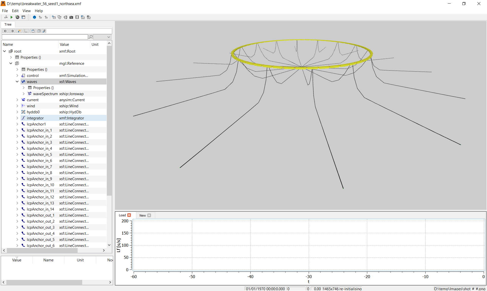{width="5.059055118110236in" height="2.559055118110236in"}

[]{#_Ref161416204 .anchor}*Figure 41: North Sea model*

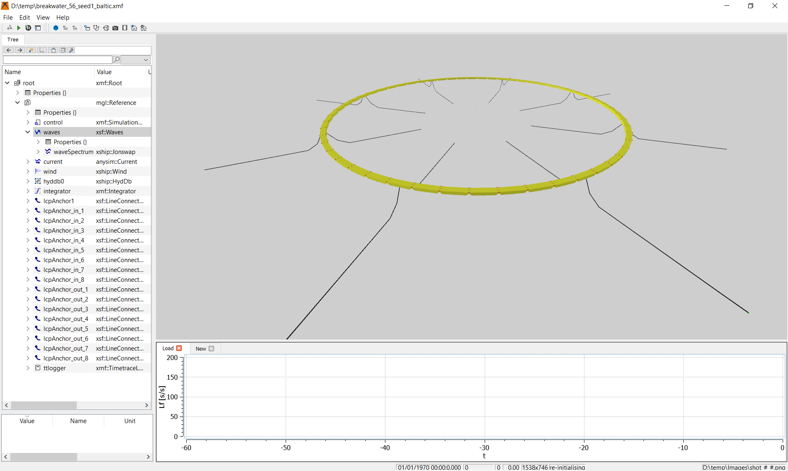{width="5.059055118110236in" height="2.4803149606299213in"}

[]{#_Ref161416206 .anchor}*Figure 42: Mediterranean model*

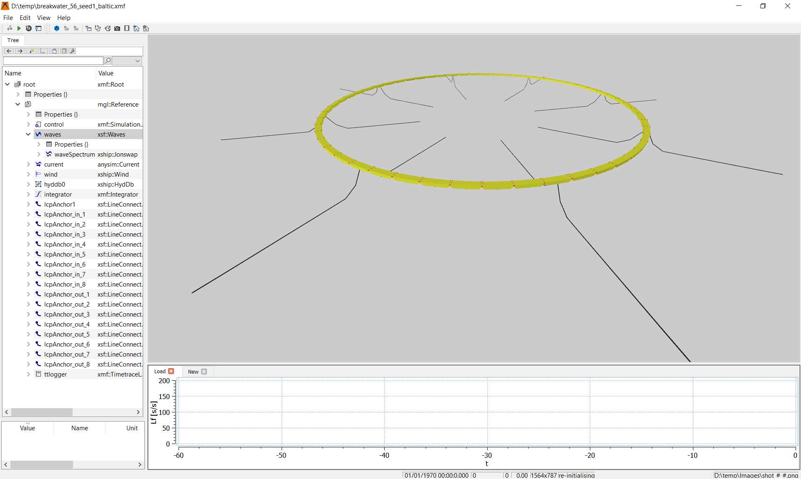{width="5.059055118110236in" height="2.5039370078740157in"}

[]{#_Ref161416207 .anchor}*Figure 43: Baltic model*

For each 3-hour simulation the maximum load in each line was calculated. From the 8 seed variations the mean maximum line load and the standard deviation of the maximum line load was determined. These were plotted as a function of the significant wave height Hs along the 50-year contour. [*Figure 42*](#_Ref161417933) shows the maximum loaded line for all three locations. The markers show the mean value of the 8 seeds, the bars show the standard deviation and are an indication for the variation in maximum line loads between 3-hour storms from the same sea state. The result for all lines, all conditions and all locations can be found in appendix A.

  ------------------------------------------------------------------------------------------------------------------------------------------------------------------------------------------------------------------------------------------------------------------------------------------------------
  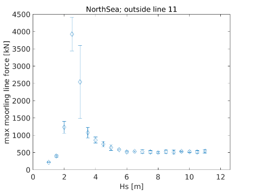{width="2.1141732283464565in" height="1.7244094488188977in"}   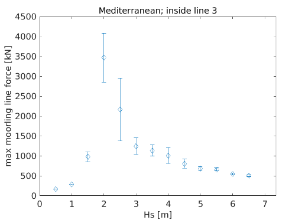{width="2.141732283464567in" height="1.6929133858267718in"}   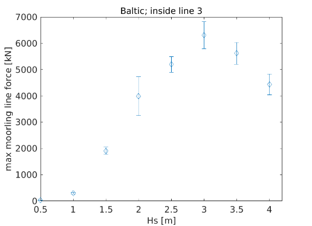{width="2.141732283464567in" height="1.6929133858267718in"}
  -------------------------------------------------------------------------------------------------- ------------------------------------------------------------------------------------------------- -------------------------------------------------------------------------------------------------

  ------------------------------------------------------------------------------------------------------------------------------------------------------------------------------------------------------------------------------------------------------------------------------------------------------

[]{#_Ref161417933 .anchor}*Figure 44: Maximum mooring line force variation in 50-year conditions. Mean of 8 seeds and standard deviation is shown.*

[Table 6](#_Ref162274233) shows the largest mean maximum line loads and the conditions at which they occur. It can be noticed that the largest line loads do not occur for the largest wave heights but for smaller waves at shorter wave periods. The variation in the maximum line load between seeds is also largest in this period range. The reason for this is that the wave loads on and response of the breakwaters is very much dependent on the wave period. The breakwater rolls in short waves (natural roll period). Furthermore the wave drift loads increase in short waves because there is more wave diffraction/reflection in short waves. The result is that the mooring line loads are highest in relatively short waves. It is also noticeable that the largest line loads occur in the Baltic Sea. This is probably an effect of the small water depth at that location (the wave conditions itself are quite comparable to the Mediterranean). The line loads in North Sea conditions are also smaller than in the Baltic Sea which is influenced by the fact that the mooring configuration has almost twice the number of mooring lines. For the Baltic Sea, the maximum line load exceeds the proof load of 2,499 kN (including 16 mm degradation, see D3.3). For the Mediterranean and North Sea, the maximum tensions are well below the proof load (7,096 kN).

  -----------------------------------------------------------------------------------------------
  Location          Hs \[m\]          Tp\[s\]           mean maximum line load (8 seeds) \[kN\]
  ----------------- ----------------- ----------------- -----------------------------------------
  North Sea         2.5               3.7               3931

  Baltic            3.0               5.4               6305

  Mediterranean     2.0               3.6               3467
  -----------------------------------------------------------------------------------------------

  : []{#_Ref162274233 .anchor}Table 6: Conditions with largest line loads for the three locations.

[*Figure 43*](#_Ref162275954) shows the event with the largest line load (North Sea location and Baltic location). It can be seen that:

- At location North Sea there is a slow increase in the line load (the effect of wave drift forces) and on top of that line load variations due to the short waves.

- At location Baltic the line loses its pretension (slack) and higher snap loads seem to occur

  ------------------------------------------------------------------------------------------------------------------------------------------------------------------------------------------------------
  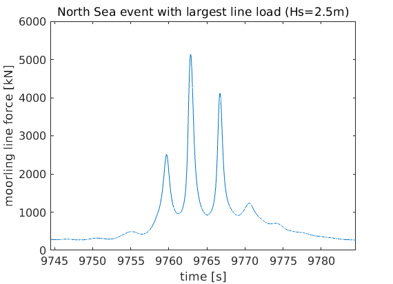{width="3.1811023622047245in" height="2.5196850393700787in"}   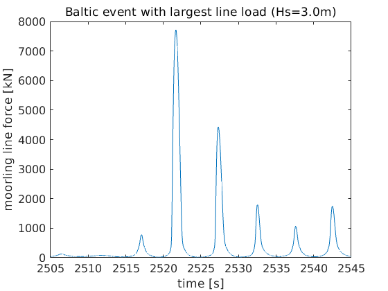{width="3.220472440944882in" height="2.5669291338582676in"}
  --------------------------------------------------------------------------------------------------- --------------------------------------------------------------------------------------------------

  ------------------------------------------------------------------------------------------------------------------------------------------------------------------------------------------------------

[]{#_Ref162275954 .anchor}*Figure 45: Event with largest mooring line load in North Sea and Baltic.*

Also the variation in maximum breakwater connector loads is investigated. Because of the large number of connectors (56) not all connector loads are presented but only the connector receiving the largest load. Because the connector provides no stiffness for relative pitch motions of adjacent breakwaters, only the loads for the other 5 modes (relative surge, sway, heave, roll, yaw) are presented. All figures (3 locations, 5 modes) can be found in Appendix B. Splitting forces and bending moments are computed in the local coordinate system of the connector as shown in [*Figure 44*](#_Ref164156507).

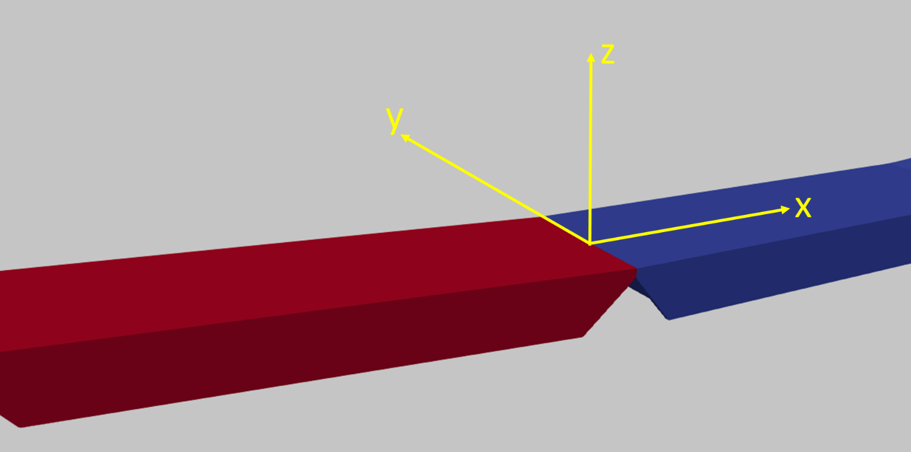{width="6.6875in" height="3.3125in"}

[]{#_Ref164156507 .anchor}*Figure 46: Connector coordinate system.*

Below the largest splitting force (Fx) and bending moment (Mz) at all locations is shown. It can be seen that:

- These loads are mostly highest for the largest wave heights.

- The loads do not significantly increase beyond Hs=4m.

- The variation in these loads between seeds is much smaller than what was found for the mooring line loads.

- The largest loads occur at the location North Sea (\~4500 kN splitting load Fx and \~55000 kNm bending moment Mz)

  ----------------------------------------------------------------------------------------------------------------------------------------------------------------------------------------------------
  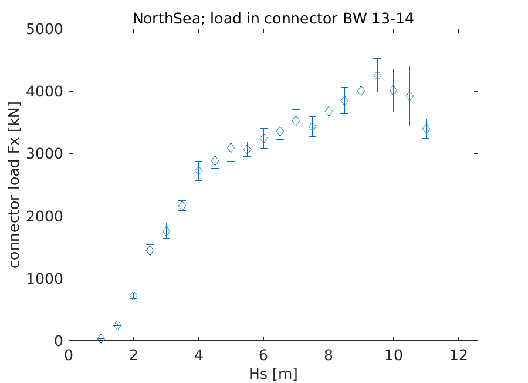{width="3.311023622047244in" height="2.606299212598425in"}   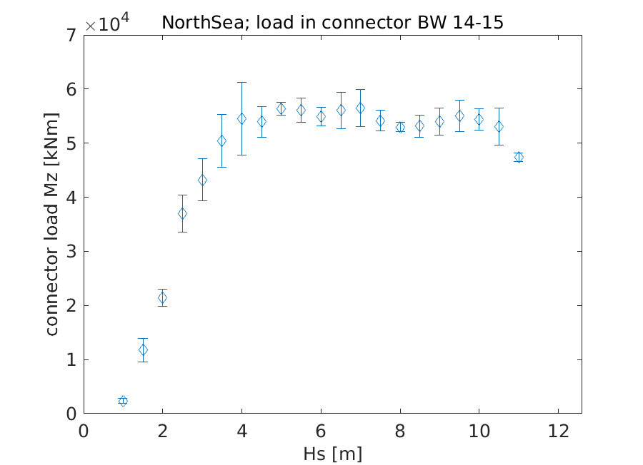{width="3.1141732283464565in" height="2.606299212598425in"}
  ------------------------------------------------------------------------------------------------- --------------------------------------------------------------------------------------------------

  ----------------------------------------------------------------------------------------------------------------------------------------------------------------------------------------------------

[]{#_Ref175921536 .anchor}*Figure 47: Connector with largest splitting load Fx (left) and largest bending moment Mz (right) in North Sea conditions.*

  ------------------------------------------------------------------------------------------------------------------------------------------------------------------------------------------------------
  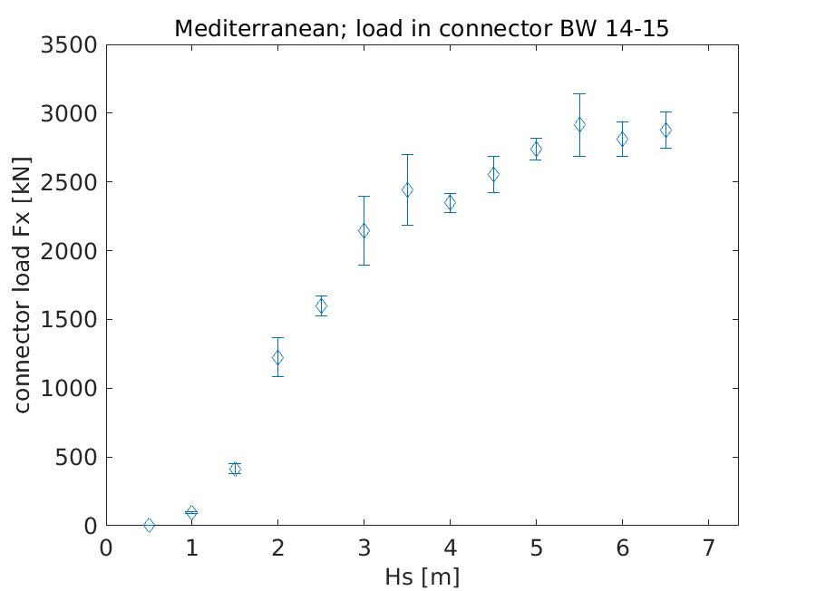{width="3.173228346456693in" height="2.5196850393700787in"}   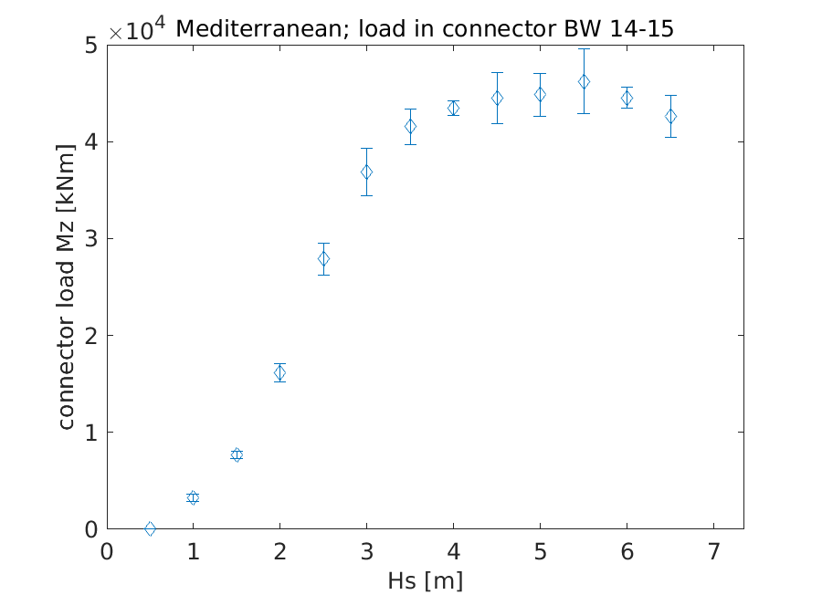{width="3.1692913385826773in" height="2.5196850393700787in"}
  -------------------------------------------------------------------------------------------------- ---------------------------------------------------------------------------------------------------

  ------------------------------------------------------------------------------------------------------------------------------------------------------------------------------------------------------

[]{#_Ref175921538 .anchor}*Figure 48: Connector with largest splitting load Fx (left) and largest bending moment Mz (right) in Mediterranean conditions.*

  ------------------------------------------------------------------------------------------------------------------------------------------------------------------------------------------------------
  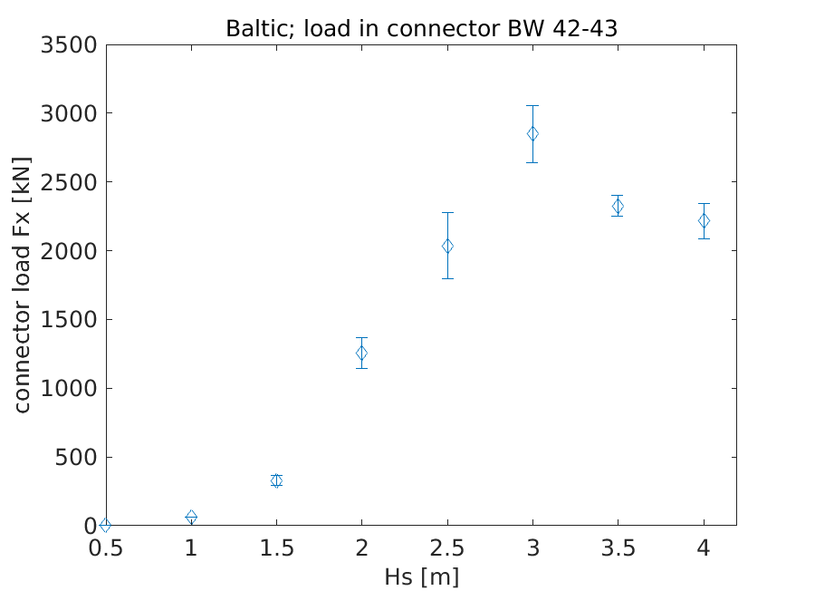{width="3.1811023622047245in" height="2.5196850393700787in"}   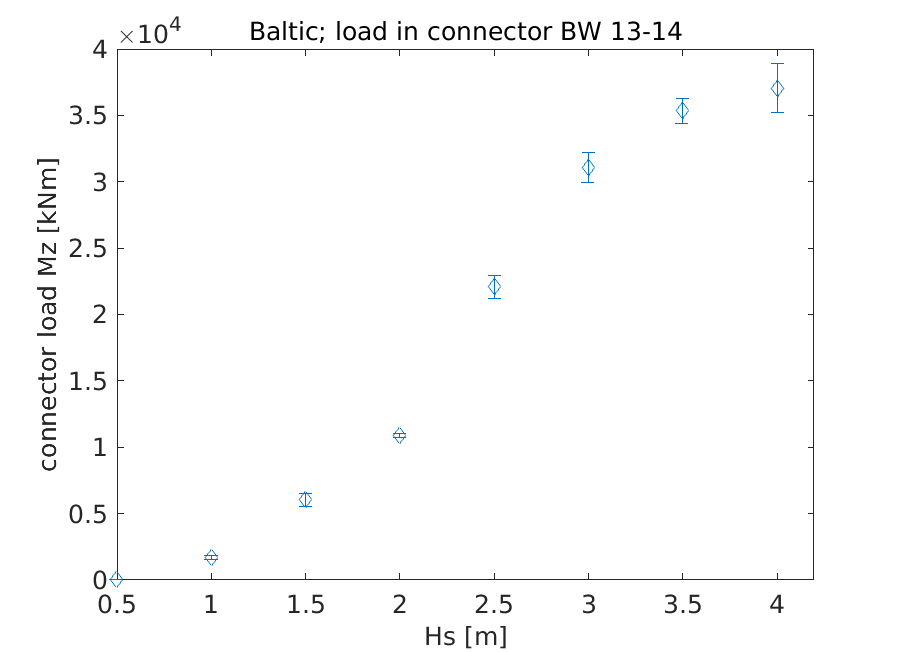{width="3.204724409448819in" height="2.5196850393700787in"}
  --------------------------------------------------------------------------------------------------- --------------------------------------------------------------------------------------------------

  ------------------------------------------------------------------------------------------------------------------------------------------------------------------------------------------------------

[]{#_Ref175921540 .anchor}*Figure 49: Connector with largest splitting load Fx (left) and largest bending moment Mz (right) in Baltic conditions.*

A typical variation in time of the breakwater splitting load Fx is shown in [*Figure 48*](#_Ref162428090). It can be seen that the connector loads mostly vary with the period of the waves to which the breakwater ring is exposed.

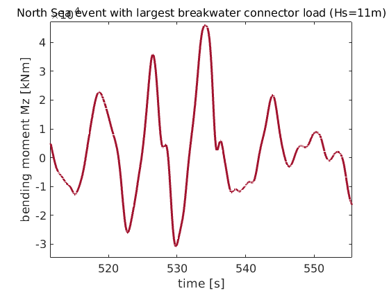{width="3.0511220472440943in" height="2.288343175853018in"}

[]{#_Ref162428090 .anchor}*Figure 50: Event with largest connector bending moment Mz (North Sea Hs=11m): 4.5\*10E4 kNm*

The expected connector loads can be used in the remainder of the Surewave project for further detailed design of the connectors.

# Mooring loads of the 2MW design

A 2MW design was also prepared by the SUREWAVE consortium to investigate the expected reduction in mooring and connector loads for this smaller layout. The simulations were setup similar to the 10MW simulations with the following changes:

- The number of breakwaters was reduced from 56 to 32

- The length of a single breakwater was reduced from 18.8m to 17.0m

- The mooring configuration was changed (see [Table 7](#_Ref175055992) and Pehlke, 2024)

The wave conditions that were applied to the 2MW system were identical to the ones used for the 10MW design.

## Setup of the numerical model

Wave loads and hydrodynamic reaction forces

The wave loads and hydrodynamic reaction forces are again calculated using linear diffraction theory. The configuration with 32 breakwaters is shown in [Figure 51](#_Ref175054207). The results of this analysis are used in a time-domain dynamic mooring analysis to find the mooring loads and connector loads in the 50-year sea states.

![[]{#_Ref175054207 .anchor}Figure 51: Breakwater ring consisting of 32 breakwaters.](../images/2024-04-16_surewave_d5.1/image73.png){alt="A computer screen shot of a circular object Description automatically generated" width="5.466666666666667in" height="3.1083333333333334in"}

Damping values from CFD simulations

The same 2D sectional damping values were used for the breakwater. Because the breakwater is slightly shorter the combined 3Ddamping coefficients are slightly smaller. The following linear and quadratic damping coefficients were used:

  ------------------------------------------------------------------------------------
  Mode                    Linear damping coefficient   Quadratic damping coefficient
  ----------------------- ---------------------------- -------------------------------
  Sway                    26732 Ns/m                   54585 Ns\^2/m\^2

  Heave                   72842 Ns/m                   52091 Ns\^2/m\^2

  Roll                    32534 Nms/rad                0.0 Nms\^2/rad\^2

  Yaw                     1931426 Nms/rad              3943818 Nms\^2/rad\^2
  ------------------------------------------------------------------------------------

Mooring lines

The 2MW design mooring system consists of 8 outside and 8 inside mooring lines for all locations. The chain diameter is largest for the North Sea location ,smallest for Baltic, see [Table 7](#_Ref175055992).

![[]{#_Ref175143290 .anchor}Figure 52: Mooring layout Baltic Sea](../images/2024-04-16_surewave_d5.1/image74.emf){width="5.9in" height="5.773895450568679in"}

  ---------------------------------- ---------------- ------------------- ----------------
                                     Baltic Sea       Mediterranean Sea   North sea

  Total length                       101.00 m         184.40 m            192.30 m

  Diameter D                         54 mm            78 mm               100 mm

  Dry weight                         64 kg/m          133 kg/m            219 kg/m

  Under buoyancy                     0.56 kN/m        1.16 kN/m           1.91 kN/m

  Marine growth weight (submerged)   0.09 kN/m        0.13 kN/m           0.17 kN/m

  Total weight under buoyancy        0.65 kN/m        1.30 kN/m           2.08 kN/m

  Number of chains to the outside    8 pcs.           8 pcs.              8 pcs.

  Number of chains to the inside     8 pcs.           8 pcs.              8 pcs.

  Young\'s modulus E                 6.40E+07 kN/m²   6.40E+07 kN/m²      6.40E+07 kN/m²

  Sectional area A                   4.58E-03 m²      9.56E-03 m²         1.57E-02 m²

  Axial stiffness E∙A                2.93E+05 kN      6.12E+05 kN         1.01E+06 kN
  ---------------------------------- ---------------- ------------------- ----------------

  : []{#_Ref175055992 .anchor}Table 7: Mooring properties 2MW design

Connectors between breakwaters

Connectors were modelled identical to the connectors in the 10MW design.

## Simulation results

Simulations were done in wave conditions corresponding to the 50-year return condition waves specified in deliverable D2.1. These conditions are summarised in [Table 5](#_Ref160629238).

Again, eight (8) different random realizations from each spectrum along the 50-year contour were taken to gain an understanding on the variability of the maximum 3-hour loads. The results are again presented as the mean and standard deviation of the maximum 3-hour mooring line load, see [*Figure 53*](#_Ref175066817) (top panels).

  ----------------------------------------------------------------------------------------------------------------------------------------------------------------------------------------------------------------------------------------------------------------------------
  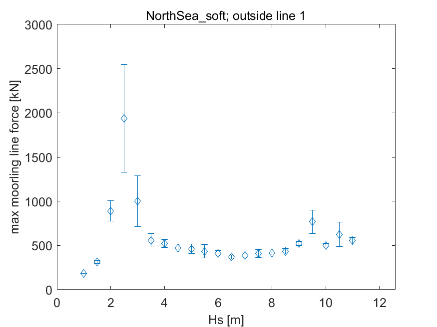{width="2.1in" height="1.575in"}                                             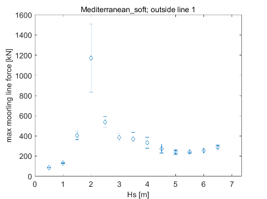{width="2.1in" height="1.575in"}                               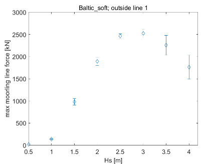{width="2.1043482064741905in" height="1.5782611548556431in"}
  -------------------------------------------------------------------------------------------------- ------------------------------------------------------------------------------------ ------------------------------------------------------------------------------------
                                                                                                                                                                                          

  {width="2.1130435258092737in" height="1.7234886264216973in"}   {width="2.15in" height="1.6994488188976378in"}   {width="2.15in" height="1.6994488188976378in"}
  ----------------------------------------------------------------------------------------------------------------------------------------------------------------------------------------------------------------------------------------------------------------------------

[]{#_Ref175066817 .anchor}*Figure 53: Maximum mooring line force variation in 50-year conditions for 2MW design (top) and 10 MW design (bottom, for reference). Mean of 8 seeds and standard deviation is shown.*

When comparing these results to the mooring line loads in the 10MW design (bottom panels) it can be seen that the loads are approximately a factor 2 (North Sea), 2.5 (Baltic) and 3 (Mediterranean) lower. Proof loads for North Sea, Mediterranean Sea and Baltic Sea are 5682, 3242 and 1278 kN, respectively. It follows that maximum mooring loads for the North and Mediterranean Seas are well below the line proof load while the mooring loads for the Baltic Sea are exceeded by about a factor 2.

Because of the large number of connectors (32) not all connector loads are presented but only the connector receiving the largest load. Because the connector provides no stiffness for relative pitch motions of adjacent breakwaters, only the loads for the other 5 modes (relative surge, sway, heave, roll, yaw) are presented. All figures (3 locations, 5 modes) can be found in Appendix D. The splitting force Fx and bending moment Mz are found to be dominant.

  ----------------------------------------------------------------------------------------------------------------------------------------------------------------------------------------------------------------------------------------------------------------------------------------------
  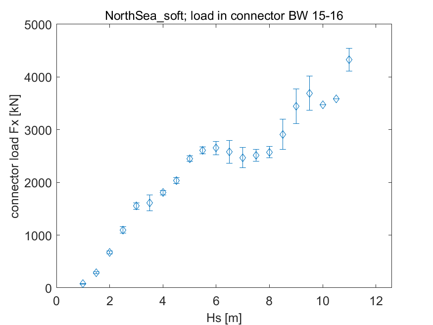{width="3.216535433070866in" height="2.622047244094488in"}   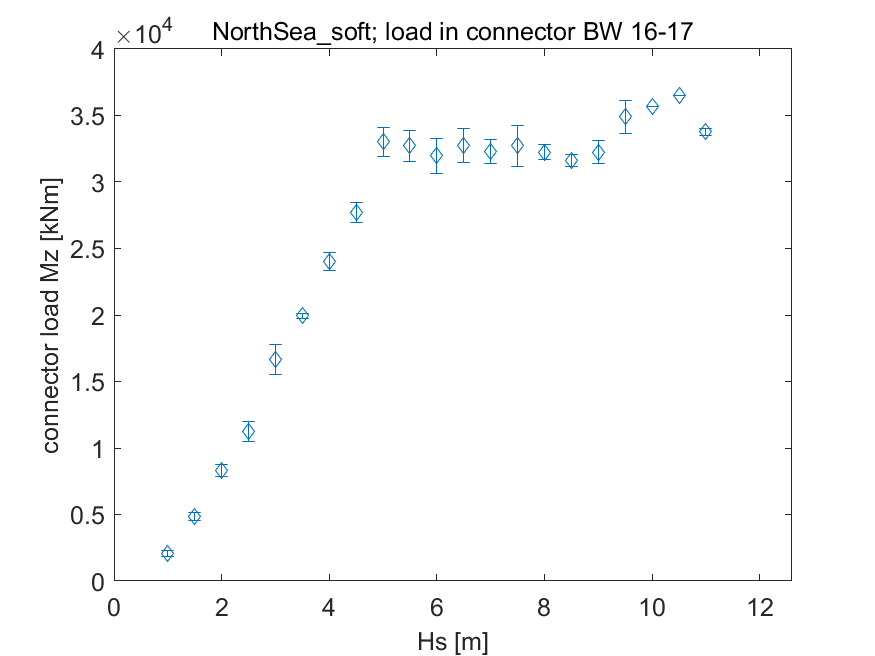{width="3.1929133858267718in" height="2.622047244094488in"}
  ---------------------------------------------------------------------------------------------------------------------------------------- -----------------------------------------------------------------------------------------------------------------------------------------------------

  ----------------------------------------------------------------------------------------------------------------------------------------------------------------------------------------------------------------------------------------------------------------------------------------------

[]{#_Toc176267578 .anchor}*Figure 54: Connector with largest splitting load Fx (left) and largest bending moment Mz (right) in North Sea conditions.*

  -----------------------------------------------------------------------------------------------------------------------------------------------------------------------------------------------------------------------------------------------------------------------------------------------------------------------
  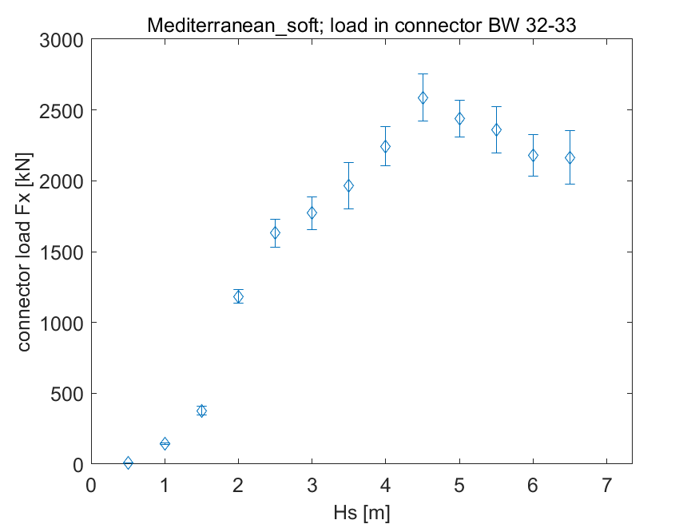{width="3.1944444444444446in" height="2.6215277777777777in"}   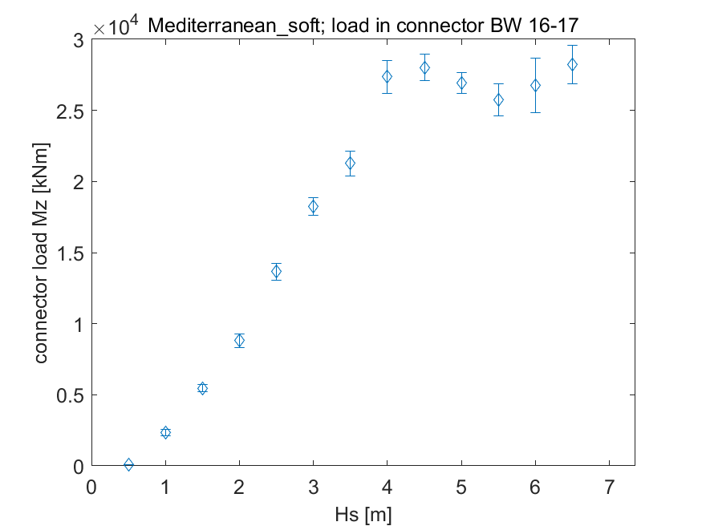{width="3.1875in" height="2.6215277777777777in"}
  ----------------------------------------------------------------------------------------------------------------------------------------------------------------- -----------------------------------------------------------------------------------------------------------------------------------------------------

  -----------------------------------------------------------------------------------------------------------------------------------------------------------------------------------------------------------------------------------------------------------------------------------------------------------------------

[]{#_Toc176267579 .anchor}*Figure 55: Connector with largest splitting load Fx (left) and largest bending moment Mz (right) in Mediterranean conditions.*

  --------------------------------------------------------------------------------------------------------------------------------------------------------------------------------------------------------------------------------------------------------------------------------------------------
  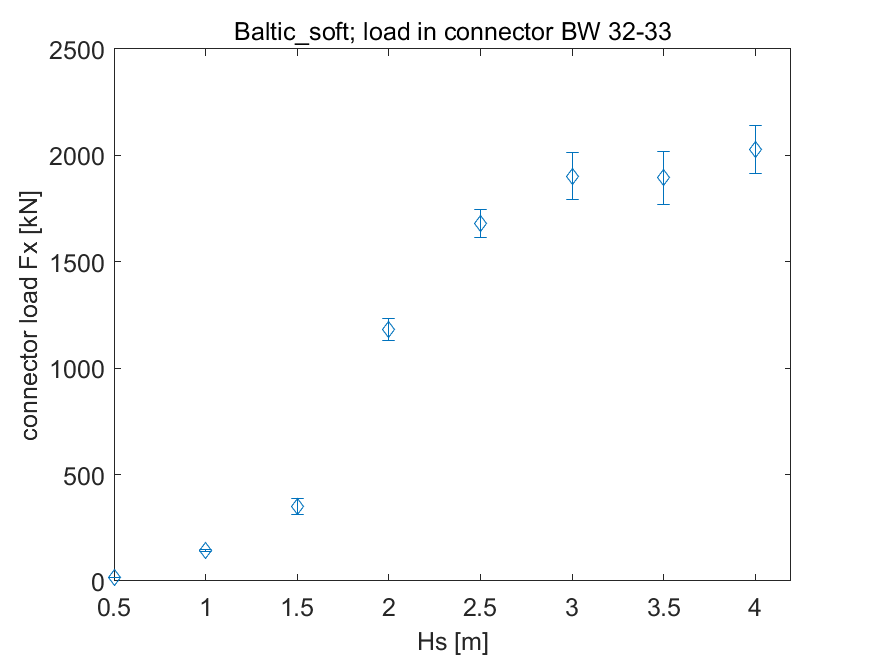{width="3.2083333333333335in" height="2.6215277777777777in"}   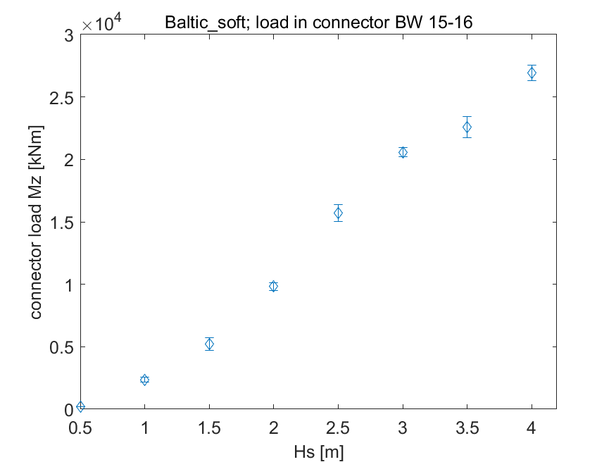{width="3.1944444444444446in" height="2.6215277777777777in"}
  ----------------------------------------------------------------------------------------------------------------------------------------- --------------------------------------------------------------------------------------------------------------------------------------------------------

  --------------------------------------------------------------------------------------------------------------------------------------------------------------------------------------------------------------------------------------------------------------------------------------------------

[]{#_Toc176267580 .anchor}*Figure 56: Connector with largest splitting load Fx (left) and largest bending moment Mz (right) in Baltic conditions.*

When comparing these loads to the loads in the 10MW design ([*Figure 47*](#_Ref175921536), [*Figure 48*](#_Ref175921538), [*Figure 49*](#_Ref175921540)) it can be seen that the loads are reduced, but to a lesser extent than the mooring line loads. A typical reduction of 25% to 35% is seen. This is probably because the connector loads are driven by the primary short waves and relative motions between adjacent breakwaters. Since the individual breakwaters are nearly the same in the 10MW and 2MW design not much change in connector loads is expected. The mooring loads are driven by second-order wave drift loads (induced by wave groups) as well. The wave drift load on the total breakwater ring is reduced because of the reduction in size.

# Mooring optimization

## Introduction

Sections [6](#mooring-loads-of-the-10mw-design) and [7](#mooring-loads-of-the-2mw-design) showed the hydrodynamic assessment of the mooring configuration in D3.3 through time domain simulations along the 50-y return period storm contour. Results were analysed in terms of maximum mooring loads, and were compared to the proof load that may not be exceeded to ensure structural integrity of the lines. The analysis showed that for both the 10 and the 2MW farms, the proof loads were exceeded for the Baltic Sea, while maximum line loads for the Mediterranean and North Sea were well below the proof loads. This means that for the Baltic Sea, the mooring should be improved to ensure structural integrity; while for the other field sites, the mooring is conservative and a reduction in mooring line mass can reduce the mooring costs.

Therefore, the present section presents an optimization of the mooring layout. The main aim is to reduce the costs of mooring, whilst (still) ensuring structural integrity. It is assumed that the costs of mooring correlate strongly with the total steel weight of the mooring lines. Therefore, the analysis focuses on minimizing the mooring mass.

## Methods

The mooring optimization consists of the following steps, which are explained in the subsections below:

1.  Selection of design parameters, objectives, and constraints

2.  Hydrodynamic simulations within predefined design space (design of experiments approach)

3.  Surrogate modelling based on hydrodynamic simulations

4.  Optimization by means of Pareto front

5.  Verification of targeted design optimum

## Design parameters

The simulation approach described in Section [6](#mooring-loads-of-the-10mw-design) is the base for the analysis. The model structure was embedded into MARIN's optimization framework HYDRA. This framework combines the time domain software aNySIM-XMF (MARIN, in-house) with the optimization program Dakota[^3].

Three design parameters were varied in the optimization:

- Mooring radius

- Chain diameter

- Mooring line length

The latter parameter (line length) was varied by introducing a dimensionless factor, f~ml_length~, defined as

f~ml~,~length~ = L~ml~ / (mooring_radius^2^ + waterdepth^2^)^0.5^

The denominator corresponds to the diagonal between anchor point and fairlead in still water equilibrium, as illustrated in [*Figure 57*](#_Ref172029691). This means that f~ml~,~length~ = 1 corresponds to a line length equal to the diagonal. By introducing this parameter, the dimensional line length scales automatically with water depth and mooring radius. The mooring radius is defined as the horizontal distance between hang-off point (fairlead) at the breakwater and the anchor position.

For sake of simplicity, the mooring material (steel) was kept constant and a single-type segment was assumed. Further optimization on material properties and multiple segments may help to further reduce costs, but is beyond the scope of the present work.

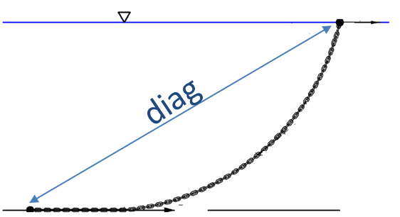{width="3.7472222222222222in" height="2.040277777777778in"}

[]{#_Ref172029691 .anchor}*Figure 57: Illustration for design factor f~ml,length~*

Chain mass (per unit length) and proof loads were for each design calculated using the formulations in D3.3. In the approach only steel chains with a single segment are considered.

## Design of experiments

As a first step in the optimization, simulations were performed for a predefined design space (design of experiments approach). Settings for simulation runs (i.e., values for the 3 design factors) were generated using the program DesignExpert. To allow a quadratic fit in the analysis is assumed, a total of 17 design runs were required. An example of the values for the different design runs is presented in [Table 8](#_Ref172030193).

+------------+-----------------------+----------------+-------------+
| Design run | Chain diameter \[mm\] | Mooring radius | f_ml_length |
|            |                       |                |             |
|            |                       | \[m\]          |             |
+:==========:+:=====================:+:==============:+:===========:+
| 1          | 103.8                 | 200.0          | 1.070       |
+------------+-----------------------+----------------+-------------+
| 2          | 138.4                 | 114.5          | 1.115       |
+------------+-----------------------+----------------+-------------+
| 3          | 96.0                  | 114.5          | 1.013       |
+------------+-----------------------+----------------+-------------+
| 4          | 136.0                 | 105.0          | 1.019       |
+------------+-----------------------+----------------+-------------+
| 5          | 95.2                  | 116.0          | 1.145       |
+------------+-----------------------+----------------+-------------+
| 6          | 60.0                  | 79.4           | 1.200       |
+------------+-----------------------+----------------+-------------+
| 7          | 60.0                  | 88.9           | 1.083       |
+------------+-----------------------+----------------+-------------+
| 8          | 140.0                 | 200.0          | 1.010       |
+------------+-----------------------+----------------+-------------+
| 9          | 96.0                  | 13.8           | 1.115       |
+------------+-----------------------+----------------+-------------+
| 10         | 110.3                 | 200.0          | 1.200       |
+------------+-----------------------+----------------+-------------+
| 11         | 140.0                 | 10.0           | 1.010       |
+------------+-----------------------+----------------+-------------+
| 12         | 60.0                  | 200.0          | 1.080       |
+------------+-----------------------+----------------+-------------+
| 13         | 60.0                  | 199.1          | 1.200       |
+------------+-----------------------+----------------+-------------+
| 14         | 60.0                  | 10.0           | 1.010       |
+------------+-----------------------+----------------+-------------+
| 15         | 140.0                 | 10.0           | 1.200       |
+------------+-----------------------+----------------+-------------+
| 16         | 85.4                  | 178.7          | 1.148       |
+------------+-----------------------+----------------+-------------+
| 17         | 111.0                 | 168.0          | 1.071       |
+------------+-----------------------+----------------+-------------+

: []{#_Ref172030193 .anchor}Table 8: Example of design parameter settings (10MW Mediterranean Sea)

The design space was based on the values of the initial mooring and different design spaces were used for each field site.

Next, hydrodynamic simulations were performed for each design run. Similar to the approach described in Section [6](#mooring-loads-of-the-10mw-design), simulations were performed along the 50-y contour and for multiple seeds. However, to speed up the process, the simulations were limited to 8 sea states and 3 seeds per sea state. In addition, the simulation time was reduced to 1.5h. This resulted in 17 design runs x 24 hydrodynamic simulations for each of the 6 combinations of field sites and farm size (2MW and 10MW). The typical wall time of a single simulation was 24h. The simulations were performed on MARIN's computational cluster (Marclus).

In the post-processing, first the median of maximum loads over the 3 seeds for each sea state was computed, and next, the maximum value over the 8 simulated sea states was taken as the governing maximum line tension.

## Surrogate modelling

The design runs were evaluated in terms of three responses:

- Total mooring mass of a single line (design objective #1)

- Maximum line tension at fairlead (design objective #2)

- Maximum line tension at fairlead, normalized by proof load (design constraint)

To relate the input (three design factors) to each response variable, surrogate models were built based on the 17 simulation results. Different types of surrogate models were tested (Kriging, polynomial fits). Quadratic models led to reasonably good to good fits (coefficients of determination r^2^ \> 0.85) and were used in the remainder analysis.

## Optimization

Next, a design optimization was run on the surrogate models. While the main aim of the analysis is to minimize mooring mass (as measure for costs), it was decided that also maximum line tensions at the fairlead should be considered. The reason is that an initial analysis showed that designs with minimum mooring mass were typically those with heavy but short lines (small radius), which led to high instantaneous tensions at the fairlead. These designs can be considered unfavourable from the point of view of the structural integrity of the breakwater connection and because of the high vertical pretension that leads to submergence of the breakwater ring.

In addition to the two design objectives (minimize mooring mass and minimize line tensions at fairlead), one constraint was imposed: maximum line tensions shall not exceed proof loads. For the 10MW farms, the design limit of the maximum mooring radius was set to the radius of the breakwater ring (168 m) to prevent collisions between the inward lines (ref. [Figure 52](#_Ref175143290)). For the 2MW farms, this constraint was released because the inward lines are deployed from under a slight horizontal angle (see Pehlke, 2024).

To find the optimum designs, a multi-objective genetic algorithm (MOGA) approach was adopted, using the open-source software Dakota to run the optimization. Because the surrogate models are computationally highly efficient, a large number of evaluations (up to a few thousand) could be realized to approach the optimum solutions. The optimum solutions are found in the form of a Pareto front.

## Verification of optimum

Based on the Pareto front, the optimum solution is selected. To verify the solution, a new hydrodynamic simulation is ran using the obtained optimum values for the design factors. In this verification step, the hydrodynamic simulations are again performed for 8 sea states x 3 seeds. The results are evaluated in terms of maximum loads in relation to proof loads. For some design cases it followed that the obtained optimum resulted in proof load exceedance; for these cases, simulations for additional design variations close to the optimum were performed until an acceptable design was found.

## Results

## 10 MW farm -- Baltic Sea

Results for the Baltic Sea are presented in [*Figure 58*](#_Ref176252970). The figure presents the two design objectives (mooring mass and maximum tensions) for different design evaluations. The mooring mass corresponds to the dry mass without marine growth of a single line.

The white star symbol marks the values for the reference mooring design, previously assessed in Section [6.3](#simulation-results).

The circles mark evaluations of the surrogate model. Blue dots are evaluations that are considered acceptable, i.e., the single constraint (proof loads shall not be exceeded) is satisfied. Red dots are evaluations that do not satisfy this constraint. The acceptable designs clustered in the top left corner are typically those with high chain diameter and (very) small mooring radius. Lines are short, leading to low mooring mass, but instantaneous line tensions are high. Because of the large chain diameter, the designs have high proof loads, so the high line tensions do not necessarily mean that lines would fail. The acceptable designs clustered towards the (bottom) right are mooring designs with longer radius and line length but with low diameter.

The green dashed line and dots mark the obtained optimum designs based on the surrogate model, considering the two design objectives (mooring mass and maximum fairlead tension) and the constraint (proof loads shall not be exceeded). It follows that there is a trade-off in terms of designs that can be considered optimum: along the Pareto front, a reduction of the mooring mass comes with the downside of increased maximum tensions (and vice versa). In the present analysis both objectives are considered relevant and no quantitative weighing between these objectives could be made. Hence, it is not possible to define a single optimum solution; instead, multiple optimum solutions can be found and these solutions can be expected along the Pareto front. In the present study the targeted optima were located in the bottom left corner of the figure.

In the final verification step, different optimum designs (at the Pareto front, based on the surrogate model) were assessed. In [*Figure 58*](#_Ref176252970), the red star symbols indicate design evaluations that in the verification step turned out not to satisfy the constraint. The reason that these proposed optimum designs are not within the range of acceptable designs is due to the uncertainty in the surrogate model. The green star symbol is a final solution that was verified and was found to be acceptable. Comparison to the reference case shows that the mooring mass was increased by a factor \~3 while maximum line tensions are roughly the same. The design parameters of the verified mooring are presented and discussed in the concluding Section [8.3.7](#summary-of-optimization-results).

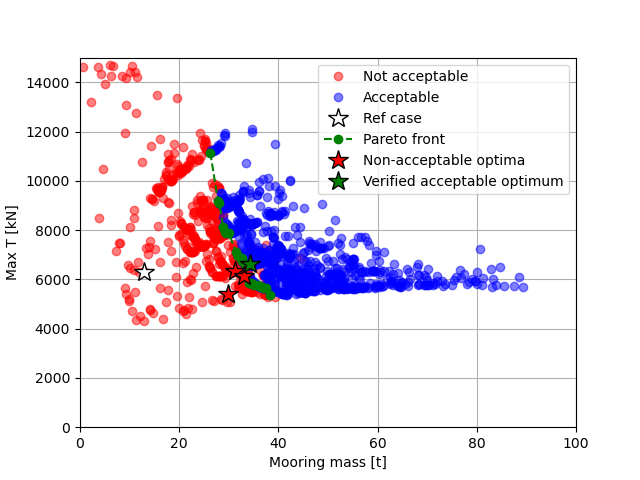{width="4.7192858705161855in" height="3.543307086614173in"}

[]{#_Ref176252970 .anchor}*Figure 58: Mooring mass and maximum fairlead tension for design evaluations in optimization based on quadratic fit surrogate model for 10MW Baltic Sea farm. Black star: reference design (as per D3.3); blue circles: acceptable evaluations (proof loads not exceeded); red circles: non-acceptable evaluations (proof loads exceeded); green dashed line and circles: estimated Pareto front of optimum solutions. Red stars: non-acceptable targeted optima; green star: verified acceptable optimum.*

## 10 MW farm -- Mediterranean Sea

In the present section and in what follows, a similar analysis to Section [8.3.1](#mw-farm-baltic-sea) was followed. Descriptions are therefore more concise.

[Figure 59](#_Ref176254616) presents results for the Mediterranean Sea. The Pareto front shows a clear break in trend in the bottom left corner. This makes the choice for desired designs more straightforward, since the Pareto front suggests that mooring mass or line tensions will increase rapidly when moving away from the bottom left optimum. Note that this form of the Pareto front differs slightly from the Baltic Sea results presented in the previous section, possibly due to the uncertainties in the surrogate models.

The white star symbol indicates the targeted optimum. For verification, simulations were performed with the design parameter settings corresponding to this optimum. The green star symbol indicates the mooring mass and maximum line tension obtained from this verification simulation. It turns out that mooring tensions are somewhat higher than predicted based on the surrogate model, but proof loads were not exceeded. Compared to the reference case, the mooring mass is reduced by 34% whilst maximum tensions are increased by 40%.

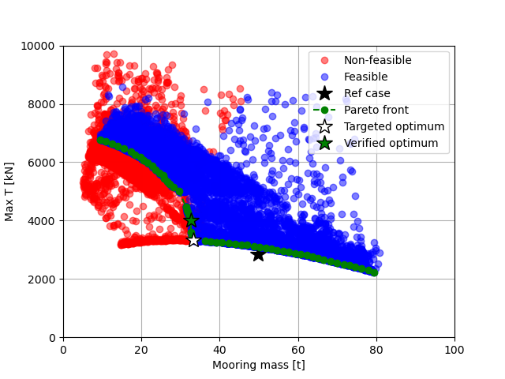{width="4.724409448818897in" height="3.543307086614173in"}

[]{#_Ref176254616 .anchor}*Figure 59: Mooring mass and maximum fairlead tension for design evaluations in optimization based on quadratic fit surrogate model for 10MW Mediterranean Sea farm. Black star: reference design (as per D3.3); blue circles: acceptable evaluations (proof loads not exceeded); red circles: non-acceptable evaluations (proof loads exceeded); green dashed line and circles: estimated Pareto front of optimum solutions. White star: targeted optimum; green star: verified optimum.*

## 10 MW farm -- North Sea

Results for the 10MW North Sea farm are presented in [*Figure 60*](#_Ref176255817). Qualitatively similar results to the preceding sections are found. The green star symbol marks the mooring tensions and mooring mass of the verified optimum. Compared to the reference mooring design, maximum tensions are roughly the same while the mooring mass is reduced by over 40%.

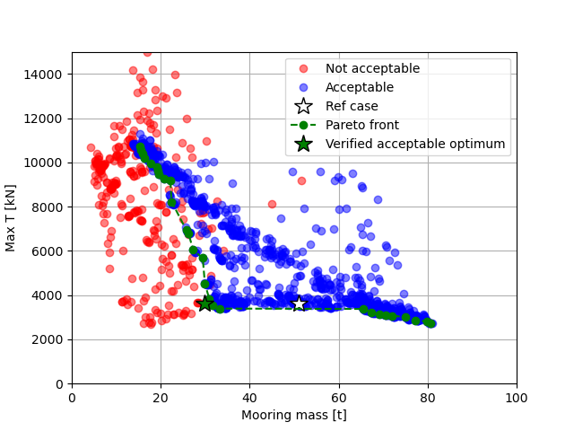{width="4.724409448818897in" height="3.543307086614173in"}

[]{#_Ref176255817 .anchor}*Figure 60: Mooring mass and maximum fairlead tension for design evaluations in optimization based on quadratic fit surrogate model for 10MW North Sea farm. White star: reference design (as per D3.3); blue circles: acceptable evaluations (proof loads not exceeded); red circles: non-acceptable evaluations (proof loads exceeded); green dashed line and circles: estimated Pareto front of optimum solutions. Green star: verified optimum.*

## 2 MW farm -- Baltic Sea

Below figure presents the results for the 2MW Baltic Sea farm. The reference design (white start) resulted in an exceedance of proof loads. The obtained optimum has an increased mooring mass (factor \~2) and slightly lower (\~17%) maximum line tensions.

{width="4.724409448818897in" height="3.543307086614173in"}

[]{#_Toc176267585 .anchor}*Figure 61: Mooring mass and maximum fairlead tension for design evaluations in optimization based on quadratic fit surrogate model for 2MW Baltic Sea farm. White star: reference design; blue circles: acceptable evaluations (proof loads not exceeded); red circles: non-acceptable evaluations (proof loads exceeded); green dashed line and circles: estimated Pareto front of optimum solutions. Green star: verified optimum.*

## 2 MW farm -- Mediterranean Sea

[*Figure 62*](#_Ref176256474) presents results for the 2MW Mediterranean Sea farm. Note that the surrogate model runs (blue and red dots) occasionally result in maximum line tensions and (not shown) even values below 0. Such values are physically impossible and are the result of the uncertainty in the surrogate modelling approach.

The optimum was again targeted in the bottom left corner graph. The verification simulation resulted in considerably higher loads than targeted, which is another indication of the modelling uncertainty. Because maximum tensions were below proof loads and a considerable (\>50%) mass reduction was obtained, no further investigation into other designs was pursued.

{width="4.724409448818897in" height="3.543307086614173in"}

[]{#_Ref176256474 .anchor}*Figure 62: Mooring mass and maximum fairlead tension for design evaluations in optimization based on quadratic fit surrogate model for 2MW Mediterranean Sea farm. Black star: reference design; blue circles: acceptable evaluations (proof loads not exceeded); red circles: non-acceptable evaluations (proof loads exceeded); green dashed line and circles: estimated Pareto front of optimum solutions. Green star: verified optimum.*

## 2 MW farm -- North Sea

Finally, results for the 2MW North Sea farm are presented in [*Figure 63*](#_Ref176264454). The verified optimum has nearly 60% lower mooring mass, but maximum line tensions are raised by over a factor 2.

{width="4.724409448818897in" height="3.543307086614173in"}

[]{#_Ref176264454 .anchor}*Figure 63: Mooring mass and maximum fairlead tension for design evaluations in optimization based on quadratic fit surrogate model for 2MW Mediterranean Sea farm. Black star: reference design; blue circles: acceptable evaluations (proof loads not exceeded); red circles: non-acceptable evaluations (proof loads exceeded); green dashed line and circles: estimated Pareto front of optimum solutions. Green star: verified optimum.*

## Summary of optimization results

The reference and optimized mooring configurations are summarized in [Table 9](#_Ref176265147). The table also presents the mooring mass and proof loads of the mooring lines, as well as the maximum line tension (from time domain simulations) as absolute and non-dimensional (normalized by proof loads) values.

For the Baltic sea (both farm sizes), the reference design resulted in an exceedance of the proof loads. The optimized cases have higher diameter (and therefore higher proof loads) and higher mooring radius and line length. This together results in an increase in mooring mass by a factor 2-3, but it ensures that proof loads are not exceeded.

+---------------+-----------+-------------+----------------+-------------+----------+----------+----------+----------+
| Location      | Case      | Chain diam. | Mooring radius | Line length | Mass     | Tproof   | Tmax     | Tmax/    |
|               |           |             |                |             |          |          |          |          |
|               |           | \[mm\]      | \[m\]          | \[m\]       | \[t\]    | \[kN\]   | \[kN\]   | Tproof   |
+===============+:=========:+:===========:+:==============:+:===========:+:========:+:========:+:========:+:========:+
| Baltic 10MW   | Ref.      | 70          | 95             | 101.0       | 10.8     | 2499     | 6527     | 2.61     |
|               +-----------+-------------+----------------+-------------+----------+----------+----------+----------+
|               | **Opt.**  | **108.4**   | **119.7**      | **132.8**   | **34.2** | **6754** | **6620** | **0.98** |
|               +-----------+-------------+----------------+-------------+----------+----------+----------+----------+
|               | *Opt/Ref* | *1.55*      | *1.26*         | *1.31*      | *3.16*   |          | *1.01*   |          |
+---------------+-----------+-------------+----------------+-------------+----------+----------+----------+----------+
| Mediterranean | Ref.      | 111         | 168            | 184.4       | 49.8     | 7096     | 2846     | 0.40     |
|               |           |             |                |             |          |          |          |          |
| 10MW          |           |             |                |             |          |          |          |          |
|               +-----------+-------------+----------------+-------------+----------+----------+----------+----------+
|               | **Opt.**  | **88.1**    | **166.1**      | **192.6**   | **32.7** | **4553** | **3997** | **0.88** |
|               +-----------+-------------+----------------+-------------+----------+----------+----------+----------+
|               | *Opt/Ref* | *0.79*      | *0.99*         | *1.04*      | *0.66*   |          | *1.40*   |          |
+---------------+-----------+-------------+----------------+-------------+----------+----------+----------+----------+
| North Sea     | Ref.      | 111         | 168            | 192.3       | 51.1     | 7096     | 3625     | 0.51     |
|               |           |             |                |             |          |          |          |          |
| 10MW          |           |             |                |             |          |          |          |          |
|               +-----------+-------------+----------------+-------------+----------+----------+----------+----------+
|               | **Opt.**  | **82.1**    | **166.5**      | **198.7**   | **29.8** | **3643** | **3607** | **0.99** |
|               +-----------+-------------+----------------+-------------+----------+----------+----------+----------+
|               | *Opt/Ref* | *0.74*      | *0.99*         | *1.03*      | *0.58*   |          | *1.00*   |          |
+---------------+-----------+-------------+----------------+-------------+----------+----------+----------+----------+
| Baltic 2MW    | Ref.      | 54          | 95             | 101.0       | 6.4      | 1278     | 2208     | 1.73     |
|               +-----------+-------------+----------------+-------------+----------+----------+----------+----------+
|               | **Opt.**  | **62**      | **135**        | **157.1**   | **13.2** | **1841** | **1828** | **0.99** |
|               +-----------+-------------+----------------+-------------+----------+----------+----------+----------+
|               | *Opt/Ref* | *1.15*      | *1.42*         | *1.56*      | *2.05*   |          | *0.83*   |          |
+---------------+-----------+-------------+----------------+-------------+----------+----------+----------+----------+
| Mediterranean | Ref.      | 78          | 168            | 184.4       | 24.6     | 3242     | 504      | 0.16     |
|               |           |             |                |             |          |          |          |          |
| 2MW           |           |             |                |             |          |          |          |          |
|               +-----------+-------------+----------------+-------------+----------+----------+----------+----------+
|               | **Opt.**  | **53**      | **147**        | **173.0**   | **10.8** | **1238** | **1239** | **1.00** |
|               +-----------+-------------+----------------+-------------+----------+----------+----------+----------+
|               | *Opt/Ref* | *0.68*      | *0.87*         | *0.94*      | *0.44*   |          | *2.46*   |          |
+---------------+-----------+-------------+----------------+-------------+----------+----------+----------+----------+
| North Sea     | Ref.      | 100         | 168            | 192.3       | 42.1     | 5682     | 689      | 0.12     |
|               |           |             |                |             |          |          |          |          |
| 2MW           |           |             |                |             |          |          |          |          |
|               +-----------+-------------+----------------+-------------+----------+----------+----------+----------+
|               | **Opt.**  | **60.9**    | **182.0**      | **214.3**   | **17.4** | **1758** | **1483** | **0.84** |
|               +-----------+-------------+----------------+-------------+----------+----------+----------+----------+
|               | *Opt/Ref* | *0.61*      | *1.08*         | *1.11*      | *0.41*   |          | *2.15*   |          |
+---------------+-----------+-------------+----------------+-------------+----------+----------+----------+----------+

: []{#_Ref176265147 .anchor}Table 9: Initial (reference) and optimized mooring configurations for different field sites and ring sizes. Presented mooring properties are chain diameter, mooring radius, single line length, dry mass of single mooring line (excluding marine growth), proof load, maximum tensions from hydrodynamic simulations, and normalized maximum tensions.

For the Mediterranean and North Sea cases, on the other hand, the reference designs were too conservative. This is reflected in a low ratio between maximum line tensions and proof loads (0.1 -- 0.5). All optimized designs are characterized by a reduced diameter compared to the reference design, while the radius and line length are either lower or higher than the reference design. Normalized proof loads are close to 1.00, which is as expected because the optimized designs target the Pareto front that is at the intersect between acceptable and non-acceptable designs. Note that designs for the 10MW Mediterranean case and the 2MW North Sea case result in normalized proof loads \<0.9, which means that there is still some room for further design improvement. It is also noted that the optimized design for the 2MW farm results in maximum tensions that exceed the proof load by 1 kN (0.1%). Because this difference is well within the uncertainty of the analysis (see also error margins in Section [6.3](#simulation-results)), the optimized design was accepted nonetheless.

It is noted that for most designs on the Pareto front, a mooring mass reduction comes with the cost of increased maximum tensions at the fairlead. At this moment, also following consultation with CLEMENT, it is not evident what weighting factors or cost function should be applied to these two design objectives. The above table presents *possible* and somewhat subjective optimum design solutions, and it is important to realize that more optimum designs co-exist. For such other optimum designs, the mooring mass can be reduced at the cost of higher fairlead tensions, or vice versa (as illustrated in [*Figure 58*](#_Ref176252970) through [*Figure 63*](#_Ref176264454)).

# Aerodynamic loads

FPV system face significant challenges from external forces, especially wind gusts, which have the potential to cause substantial damage to the entire floating structure. Accurately estimating the forces exerted by these wind gusts is crucial for ensuring the stability and resilience of FPV installations. Conducting physical measurements on these systems can be both time-consuming and expensive. Several wind tunnel studies have attempted to estimate the aerodynamic forces on PV panels. For instance, Ogedengbe (2013) (Abiola-Ogedengbe et al., 2015) conducted wind tunnel experiments using scaled aluminium models to calculate pressure coefficients across panel surfaces. While some studies, such as those by Bogdan and Cretu, 2019 (Bogdan & Creţu, 2019); Sheikh, 2019 (Sheikh, n.d.), have utilized scaled models in wind tunnels, these experiments are expensive and limited in scope to only a few PV modules. An alternative approach to estimating the forces acting on these structures is through the use of numerical models. The numerical approaches allow for the simulation of various environmental conditions and can provide valuable insights into the behaviour of floating solar panels under different scenarios. Computational Fluid Dynamics (CFD) is a powerful tool for predicting and analyzing fluid flow phenomena. Numerous studies have been carried out to understand the behavior of the FPV structures, focusing particularly on the aerodynamic forces acting on the PV arrays. Many previous studies have been conducted on the fixed PV systems and these studies can be broadly categorized into three groups: ground-mounted, commercial roof-mounted, and residential roof-mounted systems. Some studies focus solely on investigating wind effects on ground-mounted systems (Aly, 2013, 2016; Aly & Bitsuamlak, 2014), while others examine both ground-mounted and roof-mounted systems, providing comparative data on wind load effects between the two(Kopp, 2012; Stathopoulos et al., 2014). The majority of previous experimental studies on roof-mounted systems have primarily focused on commercial buildings. Several studies have investigated wind loads on solar panels using various methods. Bitsumalik (Bitsuamlak et al., 2010) employed CFD to evaluate wind loads on ground-mounted solar panels across four different scenarios, demonstrating strong agreement between numerical simulations and experimental data. Jubayer and Hagen (2012) (Jubayer & Hangan, 2012) conducted both numerical and experimental analyses, examining wind angles ranging from 0 to 180 degrees to determine coefficients of drag, lift, and overturning moment. Warsido (2014) (Warsido et al., 2014) investigated the sheltering effect of consecutively placed solar panels through wind tunnel experiments, exploring a larger number of panels and different spacing factors compared to previous studies. Radu et al.(Radu et al., 1986) highlighted that the first row of solar panels can reduce wind load on subsequent rows due to a sheltering effect. Similar to the SUREWAVE concept, Garcia et al. (Torres García et al., 2014) introduced the concept of wind breaks to mitigate wind loads on solar troughs for optimized structures.

The majority of existing studies have predominantly focused on analyzing wind loads on solar panels in ground-based installations. However, the challenges encountered by floating PV systems deployed on water bodies are different. Unlike ground-mounted systems where the forces are managed by fixed support structures and panels are firmly anchored to the ground, floating PV systems face inherent flexibility and buoyancy issues. Simply increasing the weight of materials to strengthen them may not be adequate, as an overweight system could lead to sinking to the bottom. Given the need to balance buoyancy and weight for stability, and the inability to increase system weight to withstand wind loads, it is necessary to conduct a comprehensive assessment of drag and lift coefficients at varying inlet angles. Such analyses are crucial for designing structurally robust systems including mooring and anchoring system capable of withstanding fluctuating wind conditions. There have been some studies on the aerodynamic assessment of floating PV system. Choi et al (Choi et al., 2022) investigated wind load effects on a solar panel array for floating photovoltaic systems. Their studies revealed higher drag and lift coefficients for the first and last rows of panels due to direct wind exposure, with subsequent rows experiencing reduced forces due to a sheltering effect.

The main purpose of this study is to evaluate breakwater efficiency for reducing aerodynamic forces on floating photovoltaic (PV) panels through CFD simulations. By strategically positioning a breakwater ahead of an 8x8 matrix of PV panels and varying angles of attack, this study assesses the impact of breakwater placement on lift and drag coefficients. Unlike previous studies that primarily focused on ground-based installations, this study addresses the unique challenges faced by floating PV systems deployed on water bodies. The findings highlight the potential of breakwaters in mitigating aerodynamic forces under specific wind conditions, offering valuable insights for optimizing breakwater design and placement to enhance the resilience and performance of floating PV systems in various environmental contexts.

1.  Methods

For this study, CFD simulations were conducted using OpenFOAM, an open-source CFD software package. The SimpleFoam solver was employed to solve the steady-state Reynolds-averaged Navier-Stokes (RANS) equations. The turbulence model chosen for this study was the Spalart-Allmaras model, which is widely used for simulating turbulent flows for aerodynamic application with moderate computational cost.  Boundary conditions were specified to model the flow around the PV modules realistically. At the inlet boundary, a fixedValue condition was applied to specify the velocity profile based on the desired angle of attack. At the outlet boundary, a zeroGradient condition was used. For the remaining boundaries, slip conditions were assumed to simulate the flow behavior. However, for the surfaces of the PV modules and for the water body, a noSlip boundary condition was applied to represent the physical interaction between the water and the solid surfaces. 

2.   Aerodynamic Results

CFD simulations were conducted for four different configurations of the PV module matrix: 4x8, 8x8, 12x8, and 16x8. Within each configuration, simulations were performed at various angle of attack values ranging from 0 to 20 degrees. In these simulations, we accounted for rigid hinges and assumed that the PV matrix remains fixed, with no relative motions of the floats. The simulations matrix is shown in [Table 7](#_Ref162952392).

  ----------------------------------------------------------
  Simulation setup        Angles of Attack (AOA) in degree
  ----------------------- ----------------------------------
  4X8                     0, 5, 10, 15, 20

  8x8                     0, 5, 10, 15, 20

  12x8                    0, 5, 10, 15, 20

  16x8                    0, 5, 10, 15, 20
  ----------------------------------------------------------

  : []{#_Ref162952392 .anchor}Table 10: Simulation matrix

The lift and drag forces were computed for each configuration and angle of attack. These forces were then plotted as functions of the number of panels in the first row (4, 8, 12, and 16) for each angle of attack and shown in [Figure 49](#_Ref162948480) and [Figure 50](#_Ref162948482). ***[In all the lift and drag calculation, the references areas of 1 m^2^ and U of 10 m/s has been utilized. This reference area was chosen for ease of comparison.]{.underline}***

The study showed that both lift and drag forces were affected by the number of panels in the first row and the angle of attack. Generally, an increase in the number of panels in the first row led to higher lift and drag forces, as expected. Additionally, the angle of attack influenced the magnitudes of these forces, with higher angles typically resulting in increased forces due to changes in flow patterns and pressure distributions around the PV modules.

3.  Aerodynamic coefficients of the panels

The focus was on analyzing the variations in lift and drag coefficients with changes in the number of panels. [Figure 49](#_Ref162948480) and [Figure 50](#_Ref162948482) show the variations of lift and drag coefficients, respectively, as a function of the number of panels. Besides, the results for all the configurations for 0 to 20 degree angle of attack is given in [Table 8](#_Ref162952467) to [Table 12](#_Ref162952477).

![[]{#_Ref162948480 .anchor}Figure 64 : Variation of lift force with Number of Panels](../images/2024-04-16_surewave_d5.1/image91.png){alt="P1073#yIS1" width="4.851485126859143in" height="2.745676946631671in"}

![[]{#_Ref162948482 .anchor}Figure 65: Variation of drag force with Number of Panels](../images/2024-04-16_surewave_d5.1/image92.png){alt="P1075#yIS1" width="5.099009186351706in" height="2.9634044181977255in"}

+--------+------+------+--------+------------------+-----------------------------------------------+
| Matrix | AOA  | Cl   | Cd     | Lift correlation | Lift correlation                              |
+:=======+:=====+:=====+:=======+:=================+:==============================================+
| 4X8    | 0    | 0    | 1.6875 | 0                | Cl = 0.4022\*N+0.112                          |
|        |      |      |        |                  |                                               |
|        |      |      |        |                  | Where; N is the number of plates in front row |
+--------+------+------+--------+                  |                                               |
| 8x8    | 0    | 0    | 3.375  |                  |                                               |
+--------+------+------+--------+                  |                                               |
| 12x8   | 0    | 0    | 4.95   |                  |                                               |
+--------+------+------+--------+                  |                                               |
| 16x8   | 0    | 0    | 6.525  |                  |                                               |
+--------+------+------+--------+------------------+-----------------------------------------------+

: []{#_Ref162952467 .anchor}Table 11: Aerodynamic coefficient at 0 degree AOA (A~ref~= 1m^2^ and U~ref~= 10 m/s)

+--------+------+---------+--------+-----------------------------------------------+-----------------------------------------------+
| Matrix | AOA  | Cl      | Cd     | Lift correlation                              | Lift correlation                              |
+:=======+:=====+:========+:=======+:==============================================+:==============================================+
| 4X8    | 5    | 14.625  | 4.725  | Cl = 10.873\*N-32.51                          | Cl = 2.09\*N-4.162                            |
|        |      |         |        |                                               |                                               |
|        |      |         |        | Where, N is the number of plates in front row | Where, N is the number of plates in front row |
+--------+------+---------+--------+                                               |                                               |
| 8x8    | 5    | 49.95   | 11.925 |                                               |                                               |
+--------+------+---------+--------+                                               |                                               |
| 12x8   | 5    | 96.075  | 20.7   |                                               |                                               |
+--------+------+---------+--------+                                               |                                               |
| 16x8   | 5    | 144.225 | 29.7   |                                               |                                               |
+--------+------+---------+--------+-----------------------------------------------+-----------------------------------------------+

: []{#_Toc176267446 .anchor}Table 12: Aerodynamic coefficient at 5 degree AOA (A~ref~= 1m^2^ and U~ref~= 10 m/s)

+--------+------+---------+--------+-----------------------------------------------+-----------------------------------------------+
| Matrix | AOA  | Cl      | Cd     | Lift correlation                              | Lift correlation                              |
+:=======+:=====+:========+:=======+:==============================================+:==============================================+
| 4X8    | 10   | 39.375  | 11.7   | Cl = 25.74\*N-69.64                           | Cl = 6.2\*N-14.1                              |
|        |      |         |        |                                               |                                               |
|        |      |         |        | Where, N is the number of plates in front row | Where, N is the number of plates in front row |
+--------+------+---------+--------+                                               |                                               |
| 8x8    | 10   | 127.35  | 33.975 |                                               |                                               |
+--------+------+---------+--------+                                               |                                               |
| 12x8   | 10   | 238.95  | 60.3   |                                               |                                               |
+--------+------+---------+--------+                                               |                                               |
| 16x8   | 10   | 345.375 | 85.5   |                                               |                                               |
+--------+------+---------+--------+-----------------------------------------------+-----------------------------------------------+

: []{#_Toc176267447 .anchor}Table 13: Aerodynamic coefficient at 10 degree AOA (A~ref~= 1m^2^ and U~ref~= 10 m/s)

+--------+------+--------+---------+-----------------------------------------------+-----------------------------------------------+
| Matrix | AOA  | Cl     | Cd      | Lift correlation                              | Lift correlation                              |
+:=======+:=====+:=======+:========+:==============================================+:==============================================+
| 4X8    | 15   | 61.2   | 22.05   | Cl = 41.4\*N-108.23                           | Cl = 12.61\*N-30.15                           |
|        |      |        |         |                                               |                                               |
|        |      |        |         | Where, N is the number of plates in front row | Where, N is the number of plates in front row |
+--------+------+--------+---------+                                               |                                               |
| 8x8    | 15   | 214.65 | 67.5    |                                               |                                               |
+--------+------+--------+---------+                                               |                                               |
| 12x8   | 15   | 393.75 | 122.625 |                                               |                                               |
+--------+------+--------+---------+                                               |                                               |
| 16x8   | 15   | 553.5  | 171.9   |                                               |                                               |
+--------+------+--------+---------+-----------------------------------------------+-----------------------------------------------+

: []{#_Toc176267448 .anchor}Table 14: Aerodynamic coefficient at 15 degree AOA (A~ref~= 1m^2^ and U~ref~= 10 m/s)

+--------+------+---------+--------+-----------------------------------------------+-----------------------------------------------+
| Matrix | AOA  | Cl      | Cd     | Lift correlation                              | Lift correlation                              |
+:=======+:=====+:========+:=======+:==============================================+:==============================================+
| 4X8    | 20   | 90      | 36     | Cl = 49.489\*N-86.05                          | Cl = 19N-40.28                                |
|        |      |         |        |                                               |                                               |
|        |      |         |        | Where, N is the number of plates in front row | Where, N is the number of plates in front row |
+--------+------+---------+--------+                                               |                                               |
| 8x8    | 20   | 322.875 | 119.25 |                                               |                                               |
+--------+------+---------+--------+                                               |                                               |
| 12x8   | 20   | 553.5   | 171.9  |                                               |                                               |
+--------+------+---------+--------+                                               |                                               |
| 16x8   | 20   | 672.975 | 271.8  |                                               |                                               |
+--------+------+---------+--------+-----------------------------------------------+-----------------------------------------------+

: []{#_Ref162952477 .anchor}Table 15: Aerodynamic coefficient at 20 degree AOA (A~ref~= 1m^2^ and U~ref~= 10 m/s)

As the number of panels increased from 4x8 to 16x8 configurations, there was a noticeable increase in the lift coefficient. Both the lift and drag coefficients showed a linear relationship with the number of panels across all angles of attack up to 15°. A curve fitting was performed to obtain the relationship between the lift and drag coefficients with the number of panels. A linear relationship was observed between aerodynamic coefficients (lift and drag) with number of panels and these correlations are provided in [Table 8](#_Ref162952467) to [Table 12](#_Ref162952477). However, beyond 15° angle of attack, the correlation deviated from linearity, suggesting a change in aerodynamic behavior. This deviation could be attributed to flow separation occurring at higher angles of attack, leading to nonlinear variations in lift coefficient as the airflow becomes detached from the panel surfaces. Overall, the findings highlight the significant influence of the number of panels on the aerodynamic performance of PV arrays.

The contour plots depicting the pressure distribution (see [Figure 51](#_Ref162948643)) and velocity distribution (see [Figure 52](#_Ref162948665) and [Figure 53](#_Ref162949060)) over the PV panel arrays provide detailed information about the aerodynamic characteristics of the system. A region of higher pressure on the windward side and a region of lower pressure on the lee side is clearly visible (see [Figure 51](#_Ref162948643) ) and this pressure differences results in the lift and drag forces. A region of lower velocities on the lee side of the PV panels are also clearly visible (see [Figure 52](#_Ref162948665) and [Figure 53](#_Ref162949060)). These contour plots facilitate the identification of flow separation points, offering deeper insights into the aerodynamic performance of the FPV system.

![[]{#_Ref162948643 .anchor}Figure 66 : Contour plots of pressure distribution in the mid-section of 8x8 configuration](../images/2024-04-16_surewave_d5.1/image93.png){alt="P1271#yIS1" width="4.393588145231846in" height="2.5668011811023623in"}

![[]{#_Ref162948665 .anchor}Figure 67: Contour plots of velocity distribution in the mid-section of 8x8 configuration](../images/2024-04-16_surewave_d5.1/image94.png){alt="P1273#yIS1" width="4.376846019247594in" height="2.538685476815398in"}

![[]{#_Ref162949060 .anchor}Figure 68: Velocity distribution on floats for 8x8 configuration](../images/2024-04-16_surewave_d5.1/image95.png){alt="P1276#yIS1" width="5.365224190726159in" height="3.042777777777778in"}

4.  Validation of lift and drag relationships:

In the previous CFD simulations, varying front panel numbers: 4x8, 8x8, 12x8, and 16x8 configurations were utilized and a correlation was developed to establish the relationship between the number of front panels and the corresponding lift and drag coefficients. To validate the reliability and applicability of this correlation, additional simulations were performed at 10-degree angle of attack, focusing on a 32x8 panel configuration. The purpose was to examine the predictive capability of the correlation when applied to an array size beyond those originally considered. For comparison, an independent CFD simulation of the 32x8 panel configuration were conducted and the lift and drag obtained from these CFD simulations were compared with the developed correlation. A discrepancy of approximately 10% and 7% in lift and drag respectively was observed between the correlation and this CFD simulations.

5.  Effect of breakwater on the aerodynamic coefficients:

Introducing a breakwater not only attenuate high-frequency waves but it acts as a barrier against wind which offers a promising solution to minimize aerodynamic forces on floating photovoltaic (PV) panels. In aerodynamic simulations without breakwater, it was observed that the lift and drag forces increased with the angle of attack, indicating a potential challenge for floating PV systems exposed to wind. By strategically placing breakwaters around the floating PV array, several benefits can be realized. Firstly, the breakwater serves as a physical barrier and placing the panels in the sheltered zone behind the breakwater ensures that they experience reduced wind speeds and smoother airflow, minimizing the aerodynamic forces acting upon them. This attenuation of wind speed due to break water effectively mitigates the aerodynamic forces experienced by the panels. Moreover, the breakwater helps to create a calmer microenvironment within its sheltered area, further reducing the impact of turbulent wind conditions on the panels.

To assess the effectiveness of the breakwater in reducing aerodynamic forces on the floating PV panels, a series of CFD simulations were conducted. In these simulations, a single breakwater of dimensions 20x5x2 (LxWxH) was positioned ahead of an 8x8 matrix of PV panels, maintaining a distance of 2 and 7 meters between the breakwater and the panels. The PV panels were subjected to two angles of attack ( 5 and 10 degrees) to represent different wind conditions. [Table 13](#_Ref162952518) shows the simulation matrix performed with the breakwater.

  ---------------------------------------------------------------------
  Simulation setup   Panels        AOA      Distance from Ponton (FB)
  ------------------ ------------- -------- ---------------------------
  Case-1             8x8           5        2

  Case-2             8x8           5        7

  Case-3             8x8           10       7
  ---------------------------------------------------------------------

  : []{#_Ref162952518 .anchor}Table 16: Simulation matrix

A few CFD simulations were performed for each angle of attack, comparing the lift and drag coefficients of the PV panels with and without the presence of the breakwater. The results of these simulations, summarized in [Table 14](#_Ref162952528), provided valuable insights into the impact of the breakwater on aerodynamic forces experienced by the PV panels.

+-------------------------------+-------------------------+---------------------+
| Simulation setup              | Without break water     | With breakwater     |
|                               +------------+------------+----------+----------+
|                               | Cd         | Cl         | Cd       | Cl       |
+:==============================+:===========+:===========+:=========+:=========+
| Case-1 (AOA 5, distance=2 m)  | 86         | 550        | 1        | 65       |
+-------------------------------+------------+------------+----------+----------+
| Case-2 (AOA 5, distance=5 m)  | 86         | 550        | 27       | 237      |
+-------------------------------+------------+------------+----------+----------+
| Case-3 (AOA 10, distance=5 m) | 206        | 940        | 48       | 227      |
+-------------------------------+------------+------------+----------+----------+

: []{#_Ref162952528 .anchor}Table 17: Cd and Cl with and without breakwater for 8x8 matrix (Aref= 1m2 and Uref= 10 m/s)

The study showed a significant reduction in both lift and drag forces when the breakwater was introduced, particularly for angles of attack up to 10 degrees. The breakwater successfully dampened wind speeds and altered airflow pattern (see [Figure 54](#_Ref162949838) and [Figure 55](#_Ref162949845)), leading to reduced aerodynamic loads on the PV panels within its sheltered area. Velocity and pressure contour plots with breakwater are shown in [Figure 69](#_Ref162949838) and [Figure 70](#_Ref162949845). Nonetheless, as the distance between the breakwater and FPV increases, the efficiency of the breakwater reduces. We have also observed, beyond 10 degrees of angle of attack, the PV panels will be exposed to wind forces beyond the protective reach of the breakwater. At these higher angles, the effectiveness of the breakwater in mitigating aerodynamic forces reduces, and the panels experienced increased lift and drag coefficients compared to the sheltered conditions provided by the breakwater. These findings emphasize the importance of strategically positioning the breakwater and understanding its limitations in mitigating aerodynamic forces under varying wind conditions. While the breakwater proves to be highly effective in reducing aerodynamic forces at lower angles of attack. It is not that effective at higher angles of attack.

![[]{#_Ref162949838 .anchor}Figure 69: Velocity distribution on floats for 8x8 configuration with breakwater](../images/2024-04-16_surewave_d5.1/image96.png){alt="P1340#yIS1" width="5.260285433070866in" height="3.268543307086614in"}

![[]{#_Ref162949845 .anchor}Figure 70: Pressure distribution on floats and breakwater for 8x8 configuration with breakwater](../images/2024-04-16_surewave_d5.1/image97.png){alt="P1342#yIS1" width="5.697726377952756in" height="2.007538276465442in"}

6.  Aerodynamic assessment of a Sunlit Sea existing design

In this study, CFD simulations were conducted to investigate the aerodynamic behaviour of a 14x14 floating photovoltaic (PV) matrix, with and without the presence of a breakwater. A configuration with a breakwater and FPV with 0 degree and 5-degree FPV inclination is shown in [Figure 71](#_Ref162949906) and [Figure 72](#_Ref162949915) respectively. The 14x14 matrix configuration resemblance to the Sunlit Sea concept, consisting of a grid layout comprising 14 strings, with each string consisting of 14 PV modules, resulting in a total capacity of 105 kWp. The 14x14 matrix configuration serves as a representative model for real-world applications, facilitating a thorough examination of the aerodynamic forces of floating PV arrays. One of the key aspects analyzed in this study was the estimation of lift and drag coefficients to assess the forces acting on the floating PV system. By employing CFD techniques, the lift and drag coefficients were calculated for both scenarios. The results were then compared between the configurations with and without the breakwater to determine the influence of the breakwater on the aerodynamic performance of the system.

The simulation results from [Table 18](#_Ref162952555) indicate notable differences in the aerodynamic performance between the configurations with and without the breakwater at a 5-degree angle of attack (AOA) and a distance of 2 meters. Specifically, for the configuration without the breakwater, the drag coefficient (Cd) is 372 and the lift coefficient (Cl) is 2350, while with the breakwater, the Cd is significantly reduced to 10 and the Cl to 300. These findings highlight the effectiveness of the breakwater in mitigating aerodynamic forces acting on the floating PV system, thereby enhancing its overall stability and performance in offshore environments.

![[]{#_Ref162949906 .anchor}Figure 71 : breakwater with FPV (FPV are not tilted)](../images/2024-04-16_surewave_d5.1/image98.png){alt="P1349#yIS1" width="6.3in" height="2.8256944444444443in"}

![[]{#_Ref162949915 .anchor}Figure 72 breakwater with FPV (FPV are tilted at 5 degree)](../images/2024-04-16_surewave_d5.1/image99.png){alt="P1352#yIS1" width="6.144152449693788in" height="1.6840726159230097in"}

+------------------------------+-------------------------+---------------------+
| Simulation setup             | Without break water     | With breakwater     |
|                              +------------+------------+----------+----------+
|                              | Cd         | Cl         | Cd       | Cl       |
+:=============================+:===========+:===========+:=========+:=========+
| Case-1 (AOA 5, distance=2 m) | 372        | 2350       | 10       | 300      |
+------------------------------+------------+------------+----------+----------+

: []{#_Ref162952555 .anchor}Table 18: Cd and Cl with and without breakwater for 14x14 matrix (Aref= 1m2 and Uref= 10 m/s)

#  Conclusions

Simulations were performed with low-fidelity models for wave loads and motion response of several floating PV/breakwater configurations:

1.  An array of five PV panels as tested in the Stadt towing tank for validation of the numerical model

2.  A matrix of up to 20x20 panels to investigate the connector loads when the size of the PV field increases. The effect of the breakwater is included by means of wave attenuation coefficients.

3.  The moored breakwater ring was designed to protect the 10MW PV field from short waves. 50-year wave conditions from Baltic, North Sea and Mediterranean were simulated to calculate the loads in breakwater connectors and mooring lines.

The conclusions are as follows:

- A good agreement is found between the measured motions of the PV panels in the Stadt towing tank model tests and the linear simulation model. Since hinge loads were not measured these could not be validated. It is expected that the nonlinear characteristics of the hinges pose challenges for these computations.

- The results show that maximum hinge loads depend strongly on wave incidence, peak period, and farm size. The maximum horizontal hinge loads increase strongly with increasing farm size. The floating breakwater reduces these horizontal loads only to certain extent. A different approach to mitigating high hinge loads could be to split a large PV farm into different subfarms that are moored separately. Also, a surface mooring that pretensions the FPV system may help reducing the PV loads. This is to be explored further through time domain simulations in which a surface mooring, as well as the nonlinear stiffness behaviour of the hinges, can be taken into account.

<!-- -->

- Marine growth on the underside of the PV module increases the mass by a factor of (almost) 5. This also results in a similar increase in hinge loads.

- The floating breakwater is effective in reducing the hinge loads in vertical direction (by \~factor 5-10), but its effectiveness in reducing horizontal loads is much lower, especially for long-period sea states and larger PV farms.

- The simulations with the breakwater ring in 50-year wave conditions contain a number of uncertainties:

  - The wave forces are based on a linear analysis which may become less accurate for extreme conditions (i.e. 50-year wave conditions).

  - The mooring lines are modelled with their nonlinear load-excursion curve. Dynamic line effects were not taken into account.

  - The connectors between breakwaters were modelled as a stiff spring/damper system with estimated stiffness/damping values (design values were not yet available). Differences with the actual design values may lead to differences in the connector loads.

  - The resonant water motions inside the breakwater ring were suppressed by damping the water motions. The sensitivity of the breakwater response with respect to the applied damping value was not investigated.

- The largest loads in the mooring lines were found at the Baltic Sea location and amounts to \~6300 kN. In all cases the loads are well below the breaking load of the line (11,856 kN as presented in D3.3)

- The largest loads in the breakwater connectors were found at the North Sea location and amounts to 4500 kN (splitting load Fx) and 55,000 kNm (bending moment Mz). These loads can be used for detailed design of the connectors.

- Simulations were repeated for a 2MW design consisting of 32 breakwaters. Maximum mooring line loads are more than 50% lower than for the 10MW design. Maximum mooring loads for the North and Mediterranean Seas are well below the line proof load while the mooring loads for the Baltic Sea are exceeded by about a factor 2. Loads in connectors between breakwaters are reduced by 25 to 35%.

- Following the assessment of the reference mooring design, it was attempted to optimize the mooring configuration for each field site and farm size using a combination of time domain simulations, surrogate modelling, and genetic algorithm based optimization techniques. This approach resulted in optimized designs that ensured structural integrity and led for Mediterranean and North Sea field sites to a 34-56% reduction of the total weight (and costs) of mooring lines.

- It is recommended to perform model tests to investigate the breakwater response in these wave conditions so the numerical model can be validated.

**[Aerodynamic assessment]{.underline}**

- The present study has shown the importance of analyzing wind load effects on PV arrays, especially in the context of floating photovoltaic (PV) systems. Through comprehensive CFD simulations, we have gained valuable insights into the factors influencing drag and lift coefficients. Our findings emphasize the importance of accurately estimating both drag and lift forces during the design phase of floating PV systems to address safety concerns such as overturning.

- The aerodynamic coefficients (lift and drag) are linear function of number of PV panels at lower angles of attack (\< 15 degree).

- The study highlights the efficiency of employing a breakwater as a protective measure against wind forces. By strategically placing the breakwater, particularly at lower angles of attack, we observed a substantial reduction in the impact of wind forces on the solar panel array, thereby enhancing the overall stability and resilience of the floating PV system.

#  References 

Abiola-Ogedengbe, A., Hangan, H., & Siddiqui, K. (2015). Experimental investigation of wind effects on a standalone photovoltaic (PV) module. *Renewable Energy*, *78*, 657--665. https://doi.org/10.1016/j.renene.2015.01.037

Aly, A. M. (2013). Aerodynamics of ground-mounted solar panels\_ Test model scale effects. *J. Wind Eng. Ind. Aerodyn.*

Aly, A. M. (2016). On the evaluation of wind loads on solar panels: The scale issue. *Solar Energy*, *135*, 423--434. https://doi.org/10.1016/j.solener.2016.06.018

Aly, A. M., & Bitsuamlak, G. (2014). Wind-Induced Pressures on Solar Panels Mounted on Residential Homes. *Journal of Architectural Engineering*, *20*(1), 04013003. https://doi.org/10.1061/(ASCE)AE.1943-5568.0000132

Bitsuamlak, G. T., Dagnew, A. K., & Erwin, J. (2010). *Evaluation of wind loads on solar panel modules using CFD*.

Bogdan, O., & Creţu, D. (2019). Wind Load Design of Photovoltaic Power Plants by Comparison of Design Codes and Wind Tunnel Tests. *Mathematical Modelling in Civil Engineering*, *15*(3), 13--27. https://doi.org/10.2478/mmce-2019-0008

Choi, S. M., Park, C.-D., Cho, S.-H., & Lim, B.-J. (2022). Effects of wind loads on the solar panel array of a floating photovoltaic system -- Experimental study and economic analysis. *Energy*, *256*, 124649. https://doi.org/10.1016/j.energy.2022.124649

Haver, S., & Winterstein, S. R. (2008). Environmental Contour Lines: A Method for Estimating Long Term Extremes by a Short Term Analysis. *Transactions - Society of Naval Architects and Marine Engineers*, *116*.

Jubayer, C. M., & Hangan, H. (2012). Numerical Simulation of Wind Loading on Photovoltaic Panels. *Structures Congress 2012*, 1180--1189. https://doi.org/10.1061/9780784412367.106

Kopp, G. A. (2012). Aerodynamic mechanisms for wind loads on tilted, roof-mounted, solar arrays. *J. Wind Eng. Ind. Aerodyn.*

Pehlke, T. (2023a). *SUREWAVE D2.2: Requirements for surface mooring system between FPV array and breakwater*.

Pehlke, T. (2023b). *SUREWAVE D3.2---Floating breakwater design (shape, size, and composition)*.

Pehlke, T. (2024). SUREWAVE - Anchoring of 2 MWp Layout

Radu, A., Axinte, E., & Theohari, C. (1986). Steady wind pressures on solar collectors on flat-roofed buildings. *Journal of Wind Engineering and Industrial Aerodynamics*, *23*, 249--258. https://doi.org/10.1016/0167-6105(86)90046-2

Riise, B. (2023a). *SUREWAVE D2.1---Use case scenario basis for typical rough location*.

Riise, B. (2023b). *SUREWAVE D2.3---High level understanding of the system's general loads*.

Sheikh, I. I. (n.d.). *Numerical Investigation of Drag and Lift Coefficient on a Fixed Tilt Ground Mounted Photovoltaic Module System over Inclined Terrain*.

Stathopoulos, T., Zisis, I., & Xypnitou, E. (2014). Local and overall wind pressure and force coefficients for solar panels. *Journal of Wind Engineering and Industrial Aerodynamics*, *125*, 195--206. https://doi.org/10.1016/j.jweia.2013.12.007

Torres García, E., Ogueta-Gutiérrez, M., Ávila, S., Franchini, S., Herrera, E., & Meseguer, J. (2014). On the effects of windbreaks on the aerodynamic loads over parabolic solar troughs. *Applied Energy*, *115*, 293--300. https://doi.org/10.1016/j.apenergy.2013.11.013

Warsido, W. P., Bitsuamlak, G. T., Barata, J., & Gan Chowdhury, A. (2014). Influence of spacing parameters on the wind loading of solar array. *Journal of Fluids and Structures*, *48*, 295--315. https://doi.org/10.1016/j.jfluidstructs.2014.03.005

[]{#_Toc160547820 .anchor}APPENDIX A: Mooring line forces in 50-year wave conditions 10MW

{width="5.999503499562555in" height="4.3463068678915135in"}{width="5.892845581802275in" height="4.419634733158356in"}{width="5.999503499562555in" height="4.3463068678915135in"}{width="5.999503499562555in" height="4.3463068678915135in"}{width="5.999503499562555in" height="4.3463068678915135in"}{width="5.892845581802275in" height="4.419634733158356in"}{width="5.999503499562555in" height="4.3463068678915135in"}{width="5.892845581802275in" height="4.419634733158356in"}{width="5.999503499562555in" height="4.3463068678915135in"}{width="5.999503499562555in" height="4.3463068678915135in"}{width="5.999503499562555in" height="4.3463068678915135in"}{width="5.892845581802275in" height="4.419634733158356in"}{width="5.999503499562555in" height="4.3463068678915135in"}{width="5.999503499562555in" height="4.3463068678915135in"}{width="5.999503499562555in" height="4.3463068678915135in"}{width="5.999503499562555in" height="4.3463068678915135in"}{width="5.999503499562555in" height="4.3463068678915135in"}{width="5.999503499562555in" height="4.3463068678915135in"}{width="5.892845581802275in" height="4.419634733158356in"}{width="5.999503499562555in" height="4.3463068678915135in"}{width="5.999503499562555in" height="4.3463068678915135in"}{width="5.892845581802275in" height="4.419634733158356in"}{width="5.999503499562555in" height="4.3463068678915135in"}{width="5.892845581802275in" height="4.419634733158356in"}{width="5.892845581802275in" height="4.419634733158356in"}{width="5.999503499562555in" height="4.3463068678915135in"}{width="5.999503499562555in" height="4.3463068678915135in"}{width="5.999503499562555in" height="4.3463068678915135in"}

{width="5.999503499562555in" height="4.3463068678915135in"}{width="5.999503499562555in" height="4.3463068678915135in"}{width="5.999503499562555in" height="4.3463068678915135in"}{width="5.999503499562555in" height="4.3463068678915135in"}{width="5.999503499562555in" height="4.3463068678915135in"}{width="5.999503499562555in" height="4.3463068678915135in"}{width="5.999503499562555in" height="4.3463068678915135in"}{width="5.892845581802275in" height="4.419634733158356in"}{width="5.999503499562555in" height="4.3463068678915135in"}{width="5.999503499562555in" height="4.3463068678915135in"}{width="5.999503499562555in" height="4.3463068678915135in"}{width="5.999503499562555in" height="4.3463068678915135in"}{width="5.999503499562555in" height="4.3463068678915135in"}{width="5.999503499562555in" height="4.3463068678915135in"}{width="5.999503499562555in" height="4.3463068678915135in"}{width="5.999503499562555in" height="4.3463068678915135in"}

{width="5.892845581802275in" height="4.419634733158356in"}{width="5.999503499562555in" height="4.3463068678915135in"}{width="5.999503499562555in" height="4.3463068678915135in"}{width="5.999503499562555in" height="4.3463068678915135in"}{width="5.999503499562555in" height="4.3463068678915135in"}{width="5.999503499562555in" height="4.3463068678915135in"}{width="5.999503499562555in" height="4.3463068678915135in"}{width="5.892845581802275in" height="4.419634733158356in"}{width="5.999503499562555in" height="4.3463068678915135in"}{width="5.999503499562555in" height="4.3463068678915135in"}{width="5.999503499562555in" height="4.3463068678915135in"}{width="5.999503499562555in" height="4.3463068678915135in"}{width="5.999503499562555in" height="4.3463068678915135in"}{width="5.999503499562555in" height="4.3463068678915135in"}{width="5.999503499562555in" height="4.3463068678915135in"}{width="5.999503499562555in" height="4.3463068678915135in"}

[]{#_Toc175921124 .anchor}APPENDIX B: Mooring line forces in 50-year wave conditions 2MW

{width="5.832851049868767in" height="4.372971347331584in"}{width="5.832851049868767in" height="4.372971347331584in"}{width="5.832851049868767in" height="4.372971347331584in"}{width="5.832851049868767in" height="4.372971347331584in"}{width="5.832851049868767in" height="4.372971347331584in"}{width="5.832851049868767in" height="4.372971347331584in"}{width="5.832851049868767in" height="4.372971347331584in"}{width="5.832851049868767in" height="4.372971347331584in"}{width="5.832851049868767in" height="4.372971347331584in"}{width="5.832851049868767in" height="4.372971347331584in"}{width="5.832851049868767in" height="4.372971347331584in"}{width="5.832851049868767in" height="4.372971347331584in"}{width="5.832851049868767in" height="4.372971347331584in"}{width="5.832851049868767in" height="4.372971347331584in"}{width="5.832851049868767in" height="4.372971347331584in"}{width="5.832851049868767in" height="4.372971347331584in"}

{width="5.832851049868767in" height="4.372971347331584in"}{width="5.832851049868767in" height="4.372971347331584in"}{width="5.832851049868767in" height="4.372971347331584in"}{width="5.832851049868767in" height="4.372971347331584in"}{width="5.832851049868767in" height="4.372971347331584in"}{width="5.832851049868767in" height="4.372971347331584in"}{width="5.832851049868767in" height="4.372971347331584in"}{width="5.832851049868767in" height="4.372971347331584in"}{width="5.832851049868767in" height="4.372971347331584in"}{width="5.832851049868767in" height="4.372971347331584in"}{width="5.832851049868767in" height="4.372971347331584in"}{width="5.832851049868767in" height="4.372971347331584in"}{width="5.832851049868767in" height="4.372971347331584in"}{width="5.832851049868767in" height="4.372971347331584in"}{width="5.832851049868767in" height="4.372971347331584in"}

{width="5.832851049868767in" height="4.372971347331584in"}{width="5.832851049868767in" height="4.372971347331584in"}{width="5.832851049868767in" height="4.372971347331584in"}{width="5.832851049868767in" height="4.372971347331584in"}{width="5.832851049868767in" height="4.372971347331584in"}{width="5.832851049868767in" height="4.372971347331584in"}{width="5.832851049868767in" height="4.372971347331584in"}{width="5.832851049868767in" height="4.372971347331584in"}{width="5.832851049868767in" height="4.372971347331584in"}{width="5.832851049868767in" height="4.372971347331584in"}{width="5.832851049868767in" height="4.372971347331584in"}{width="5.832851049868767in" height="4.372971347331584in"}{width="5.832851049868767in" height="4.372971347331584in"}{width="5.832851049868767in" height="4.372971347331584in"}{width="5.832851049868767in" height="4.372971347331584in"}{width="5.832851049868767in" height="4.372971347331584in"}{width="5.832851049868767in" height="4.372971347331584in"}

[]{#_Toc175921128 .anchor}APPENDIX C: CONNECTOR forces in 50-year wave conditions 10MW

{width="5.999503499562555in" height="4.3463068678915135in"}{width="5.999503499562555in" height="4.3463068678915135in"}{width="5.999503499562555in" height="4.3463068678915135in"}{width="5.999503499562555in" height="4.3463068678915135in"}{width="5.999503499562555in" height="4.3463068678915135in"}

{width="5.999503499562555in" height="4.3463068678915135in"}{width="5.999503499562555in" height="4.3463068678915135in"}{width="5.999503499562555in" height="4.3463068678915135in"}{width="5.999503499562555in" height="4.3463068678915135in"}{width="5.999503499562555in" height="4.3463068678915135in"}

{width="5.999503499562555in" height="4.3463068678915135in"}{width="5.999503499562555in" height="4.3463068678915135in"}{width="5.999503499562555in" height="4.3463068678915135in"}{width="5.999503499562555in" height="4.3463068678915135in"}{width="5.999503499562555in" height="4.3463068678915135in"}

[]{#_Toc175921129 .anchor}APPENDIX D: CONNECTOR forces in 50-year wave conditions 2MW

{width="5.832851049868767in" height="4.372971347331584in"}{width="5.832851049868767in" height="4.372971347331584in"}{width="5.832851049868767in" height="4.372971347331584in"}{width="5.832851049868767in" height="4.372971347331584in"}{width="5.832851049868767in" height="4.372971347331584in"}{width="5.832851049868767in" height="4.372971347331584in"}{width="5.832851049868767in" height="4.372971347331584in"}{width="5.832851049868767in" height="4.372971347331584in"}{width="5.832851049868767in" height="4.372971347331584in"}{width="5.832851049868767in" height="4.372971347331584in"}{width="5.832851049868767in" height="4.372971347331584in"}{width="5.832851049868767in" height="4.372971347331584in"}{width="5.832851049868767in" height="4.372971347331584in"}{width="5.832851049868767in" height="4.372971347331584in"}{width="5.832851049868767in" height="4.372971347331584in"}

[]{#_Toc176267653 .anchor}APPENDIX E: LINEAR DIFFRACTIOn METHOD

- {width="8.333333333333333e-3in" height="8.333333333333333e-3in"}{width="8.333333333333333e-3in" height="8.333333333333333e-3in"}{width="8.333333333333333e-3in" height="8.333333333333333e-3in"}{width="6.6930555555555555in" height="7.0625in"}

{width="6.6930555555555555in" height="9.003804680664917in"}

<https://www.marin.nl/en/facilities-and-tools/software/diffrac>

[]{#_Toc176267654 .anchor}APPENDIX F: TIME DOMAIN SIMULATION METHOD (ANYSIM)

 {width="6.3in" height="6.370833333333334in"} 

 

 

{width="6.3in" height="8.196527777777778in"} 

[[https://www.marin.nl/en/facilities-and-tools/software/anysim]{.underline}](https://www.marin.nl/en/facilities-and-tools/software/anysim) 

 

[^1]: Dissemination level: **PU** = Public. **PP** = Restricted to other programme participants (including the JU). **RE** = Restricted to a group specified by the consortium (including the JU). **CO** = Confidential. only for members of the consortium (including the JU)

[^2]: Creation. modification. final version for evaluation. revised version following evaluation. final

[^3]: <https://dakota.sandia.gov/>
