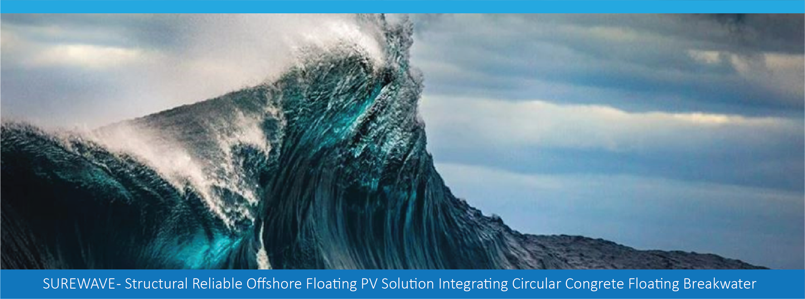

> Source: `SUREWAVE_D2.4_stakeholder_advisory_board.docx` — Document date: 2024-04-22 — Converted: 2026-09-28 via pandoc/pdftotext

---

##### 

##### 

**Deliverable number: D2.4**

{width="8.245833333333334in" height="3.0701388888888888in"}

**Title: Establishing a Technical Stakeholders Advisory Board (SAB)**

**Disclaimer:**

The SUREWAVE project is Funded by the European Union. Views and opinions expressed are however those of the author(s) only and do not necessarily reflect those of the European Union. Neither the European Union nor the granting authority can be held responsible for them

**Deliverable details**

  ---------- -------- ------------------------------------------------------------
  **WP**     2        

  **Task**   D2.4     Establishing a Technical Stakeholders Advisory Board (SAB)
  ---------- -------- ------------------------------------------------------------

  ------------------------- ------ -- -------------------------- ----------------------
  **Dissemination level**   PU        **Due delivery date**      31.03.2024

  **Deliverable type**      R         **Actual delivery date**   22.04.2024
  ------------------------- ------ -- -------------------------- ----------------------

  -------------------------------- ---------------------------------------------
  **Lead beneficiary**             **SIS**

  **Contributing beneficiaries**   ALL
  -------------------------------- ---------------------------------------------

  ---------------------- ------------ ------------------------ -------------------
  **Document Version**   **Date**     **Author**               **Comments**[^1]

  1.0                    28.03.2024   Eirik Larsen             Draft version

  1.1                    05.04.2024   Balram Panjwani          Revision

  2                      20.04.2024   Eirik Larsen             Final

                                                               

                                                               

                                                               

                                                               
  ---------------------- ------------ ------------------------ -------------------

+:------------------------------------+:----------------------------------------------------------------------------------------------------------+
| **Dissemination level**                                                                                                                         |
+-------------------------------------+-----------------------------------------------------------------------------------------------------------+
| PU                                  | Public- fully open                                                                                        |
+-------------------------------------+-----------------------------------------------------------------------------------------------------------+
| SEN                                 | SEN = Sensitive -- limited under the conditions of the Grant Agreement                                    |
+-------------------------------------+-----------------------------------------------------------------------------------------------------------+
| EU classified                       | EU classified -- restraint -- UE/EU-restricted, confidential, secret-UE/EU secret under Decision 2015/444 |
+-------------------------------------+-----------------------------------------------------------------------------------------------------------+
| **Deliverable type**                                                                                                                            |
+-------------------------------------+-----------------------------------------------------------------------------------------------------------+
| R:                                  | Document, report (excluding the periodic and final reports)                                               |
+-------------------------------------+-----------------------------------------------------------------------------------------------------------+
| DEM:                                | Demonstrator, pilot, prototype, plan designs                                                              |
+-------------------------------------+-----------------------------------------------------------------------------------------------------------+
| DEC:                                | Websites, patents filing, press & media actions, videos, etc.                                             |
+-------------------------------------+-----------------------------------------------------------------------------------------------------------+
| OTHER:                              | Software, technical diagram, etc.                                                                         |
+-------------------------------------+-----------------------------------------------------------------------------------------------------------+

**EXECUTIVE SUMMARY**

The SUREWAVE Stakeholder Advisory Board (SAB) report highlights the establishment and contributions of a diverse board guiding the development of offshore Floating Photovoltaic (FPV) solutions. Comprising stakeholders from across the FPV industry, including project developers, technology providers, regulatory bodies, and financial institutions, the SAB has been pivotal in addressing non-technical barriers and ensuring a holistic development approach. Achievements include the formation of a board rich in expertise, successful workshops to define its mission, and ongoing efforts to solidify its foundation. Looking ahead, the SAB will continue to provide critical insights, fostering collaborations and exploring opportunities to scale the FPV solution. This collaborative effort underscores a shared commitment to advancing sustainable and innovative FPV solutions for marine environments.

**Deliverable Review**

+----------------------------------------------------------------------------------+-----------------+---------------------------------------+-----------------+-----------------+---------------------------------------+-----------------+
|                                                                                  | **Reviewer #1:** Balram Panjwani                                          | **Reviewer #2:**                                                          |
|                                                                                  +-----------------+---------------------------------------+-----------------+-----------------+---------------------------------------+-----------------+
|                                                                                  | **Answer**      | **Comments**                          | **Type\***      | **Answer**      | **Comments**                          | **Type\***      |
+----------------------------------------------------------------------------------+-----------------+---------------------------------------+-----------------+-----------------+---------------------------------------+-----------------+
| 1.  Is the deliverable in accordance with                                                                                                                                                                                                |
+----------------------------------------------------------------------------------+-----------------+---------------------------------------+-----------------+-----------------+---------------------------------------+-----------------+
| (i) The Description of Work?                                                     | ☒ Yes           |                                       | ☐ M             | ☒Yes            |                                       | ☐ M             |
|                                                                                  |                 |                                       |                 |                 |                                       |                 |
|                                                                                  | ☐ No            |                                       | ☐ m             | ☐ No            |                                       | ☐ m             |
|                                                                                  |                 |                                       |                 |                 |                                       |                 |
|                                                                                  |                 |                                       | ☐ a             |                 |                                       | ☐ a             |
+----------------------------------------------------------------------------------+-----------------+---------------------------------------+-----------------+-----------------+---------------------------------------+-----------------+
| (ii) The international State of the Art?                                         | ☐ Yes           | *Not applicable for this deliverable* | ☐ M             | ☐ Yes           | *Not applicable for this deliverable* | ☐ M             |
|                                                                                  |                 |                                       |                 |                 |                                       |                 |
|                                                                                  | ☐ No            |                                       | ☐ m             | ☐ No            |                                       | ☐ m             |
|                                                                                  |                 |                                       |                 |                 |                                       |                 |
|                                                                                  |                 |                                       | ☐ a             |                 |                                       | ☐ a             |
+----------------------------------------------------------------------------------+-----------------+---------------------------------------+-----------------+-----------------+---------------------------------------+-----------------+
| 2.  Is the quality of the deliverable in a status                                                                                                                                                                                        |
+----------------------------------------------------------------------------------+-----------------+---------------------------------------+-----------------+-----------------+---------------------------------------+-----------------+
| (i) That allows it to be sent to European Commission?                            | ☒ Yes           |                                       | ☐ M             | ☒ Yes           |                                       | ☐ M             |
|                                                                                  |                 |                                       |                 |                 |                                       |                 |
|                                                                                  | ☐ No            |                                       | ☐ m             | ☐ No            |                                       | ☐ m             |
|                                                                                  |                 |                                       |                 |                 |                                       |                 |
|                                                                                  |                 |                                       | ☐ a             |                 |                                       | ☐ a             |
+----------------------------------------------------------------------------------+-----------------+---------------------------------------+-----------------+-----------------+---------------------------------------+-----------------+
| (ii) That needs improvement of the writing by the originator of the deliverable? | ☐ Yes           |                                       | ☐ M             | ☐ Yes           |                                       | ☐ M             |
|                                                                                  |                 |                                       |                 |                 |                                       |                 |
|                                                                                  | ☒ No            |                                       | ☐ m             | ☒No             |                                       | ☐ m             |
|                                                                                  |                 |                                       |                 |                 |                                       |                 |
|                                                                                  |                 |                                       | ☐ a             |                 |                                       | ☐ a             |
+----------------------------------------------------------------------------------+-----------------+---------------------------------------+-----------------+-----------------+---------------------------------------+-----------------+
| (iii) That need further work by the Partners responsible for the deliverable?    | ☐ Yes           |                                       | ☐ M             | ☐ Yes           |                                       | ☐ M             |
|                                                                                  |                 |                                       |                 |                 |                                       |                 |
|                                                                                  | ☒ No            |                                       | ☐ m             | ☒No             |                                       | ☐ m             |
|                                                                                  |                 |                                       |                 |                 |                                       |                 |
|                                                                                  |                 |                                       | ☐ a             |                 |                                       | ☐ a             |
+----------------------------------------------------------------------------------+-----------------+---------------------------------------+-----------------+-----------------+---------------------------------------+-----------------+

\* Type of comments: M = Major comment; m = minor comment; a = advice

# Table of Contents {#table-of-contents .TOC-Heading}

[1. Introduction [4](#introduction)](#introduction)

[2. Stakeholder Engagement and Advisory Board Formation [4](#stakeholder-engagement-and-advisory-board-formation)](#stakeholder-engagement-and-advisory-board-formation)

[3. Selection and Composition of the SAB [5](#selection-and-composition-of-the-sab)](#selection-and-composition-of-the-sab)

[4. Advisory Board Milestones [7](#advisory-board-milestones)](#advisory-board-milestones)

[5. Integration of Stakeholder Insights [7](#integration-of-stakeholder-insights)](#integration-of-stakeholder-insights)

[6. Future Contributions of the SAB [9](#future-contributions-of-the-sab)](#future-contributions-of-the-sab)

[7. Conclusion [11](#conclusion)](#conclusion)

# 1. Introduction

The SUREWAVE project, focusing on advancing offshore Floating Photovoltaic (FPV) solutions, acknowledges the complexity and interdisciplinary nature of its goals. As part of Work Package 2 (WP2), specifically Task 2.4, this report outlines the successful establishment of a Stakeholders Advisory Board (SAB). The creation and integration of the SAB are pivotal for addressing non-technical barriers, ensuring a holistic approach to the development of offshore FPV solutions. This document details the processes involved in establishing the SAB, including stakeholder engagement strategies, milestones achieved, and future plans for SAB\'s contribution towards the project\'s objectives.

# 2. Stakeholder Engagement and Advisory Board Formation

The formation of the SAB benefited greatly from the diverse and extensive networks of the project participants. By tapping into the professional contacts of each participant, the project was able to identify and engage a wide range of stakeholders from across the offshore FPV ecosystem. This approach ensured that the board comprised individuals with a deep understanding of the challenges and opportunities within the sector.

- Industry Partnerships: Participants used their existing industry partnerships to reach out to potential stakeholders, including technology providers, end-users, and regulatory authorities. These partnerships provided a ready-made list of contacts that are already engaged in or supportive of renewable energy initiatives.

- Professional Associations: Membership in professional associations and industry groups offered another avenue for stakeholder engagement. These associations often have committees or special interest groups focused on renewable energy, providing a pool of potential SAB members passionate about advancing offshore FPV solutions.

- Client and Supplier Networks: The business relationships between project participants and their clients or suppliers were also leveraged. These networks provided access to a broad spectrum of stakeholders, from financial institutions to installers and O&M entities, all of whom have a vested interest in the success of renewable energy projects.

The involvement of project participants in other research projects presented additional opportunities for stakeholder engagement. These collaborations are rich sources of expertise and innovation, offering access to cutting-edge research and thought leaders in the field.

- Academic and Research Institutions: Collaborations with academic and research institutions brought scientific rigor and innovative thinking to the SAB. Researchers and academics could share the latest findings and theories related to FPV technologies and environmental impact assessments, enriching the board\'s collective knowledge.

- Interdisciplinary Projects: Participation in interdisciplinary research projects, especially those focusing on renewable energy, sustainability, or maritime engineering, provided a cross-pollination of ideas and perspectives. Stakeholders from these projects, including policy-makers and influencers, were identified and invited to join the SAB, ensuring a broad and informed advisory base.

- International Projects: The global nature of many research projects expanded the search for potential SAB members beyond local or national borders. This international outlook is crucial for a project like SUREWAVE, which has implications and potential applications worldwide. Stakeholders from these projects brought global insights and experiences, enhancing the board\'s diversity and breadth of knowledge.

By strategically leveraging the networks and resources available through the regular business of project participants and their involvement in other research projects, the SUREWAVE project was able to assemble a Stakeholder Advisory Board that is both diverse and rich in expertise. This approach not only facilitated the efficient identification and engagement of key stakeholders but also ensured that the SAB is equipped to provide comprehensive advice and insights, driving the project toward success.

# 3. Selection and Composition of the SAB

In developing the SUREWAVE project, a technical Stakeholder Advisory Board (SAB) has been meticulously formed to guide the project with insights from across the offshore Floating Photovoltaic (FPV) industry. This diverse board includes stakeholders such as project developers, FPV technology providers, regulatory authorities, financial institutions, insurance companies, end-users (energy utilities), installers, O&M entities, and policymakers. Their collective expertise is critical for addressing the interdisciplinary challenges within the FPV sector, offering invaluable perspectives on technical, regulatory, financial, and operational aspects. By engaging these stakeholders, the SAB plays a pivotal role in identifying potential challenges and suggesting viable countermeasures, ensuring the project's alignment with industry needs and fostering a comprehensive approach to the development and implementation of offshore FPV solutions.

**Project Developers**

Project developers are instrumental in turning conceptual designs into tangible renewable energy projects. They bring invaluable insights into site selection, project management, and the logistical intricacies of deploying large-scale installations. Their experience ensures that the project\'s developmental phases are realistic and grounded in practical feasibility.

**FPV Technology Providers**

Technology providers are the backbone of innovation within the project, offering the latest advancements in FPV systems. Their knowledge in system design, efficiency, and technological advancements ensures that the project utilizes state-of-the-art solutions, maximizing performance and sustainability. Sunlit Sea is the core FPV Provider in SUREWAVE, and while the amount of change that is viable to perform on Sunlit Sea's solution throughout this project is limited, the input from other actors in the field can be very valuable to assess features of an FPV system beneficial for offshore operations.

**Regulatory Authorities**

Navigating the regulatory landscape is crucial for the success and legality of offshore FPV projects. Regulatory authorities provide essential guidance on compliance, environmental standards, and the permitting process, ensuring the project aligns with local and international regulations.

**Environmental Agencies**

The SUREWAVE project places a strong emphasis on environmental research to assess and minimize the ecological impacts of offshore Floating Photovoltaic (FPV) systems. This includes evaluating the sustainability of materials, studying potential disruptions to marine life, and ensuring compliance with environmental standards. The Stakeholder Advisory Board (SAB) enhances this effort by integrating expert insights and facilitating collaborations with research institutions. These studies are crucial for refining FPV designs to be both ecologically responsible and efficient, affirming the project\'s commitment to pioneering sustainable renewable energy solutions.

**Financial Institutions**

The financial viability of renewable energy projects is paramount. Financial institutions bring expertise in investment strategies, risk management, and economic modelling, which is critical for securing funding, attracting investors, and ensuring the project\'s long-term financial health.

**Insurance**

Insurance representatives play a key role in risk management, offering strategies and products to mitigate operational, environmental, and financial risks. Their involvement is vital for safeguarding the project against unforeseen challenges, ensuring stability and reliability.

**End-users (Energy Utilities)**

As the primary consumers of the generated power, end-users ensure the project\'s output aligns with market demands and grid integration requirements. Their perspective is crucial for understanding the energy landscape, demand forecasts, and ensuring the project contributes effectively to the energy mix.

**Installers and O&M Entities**

The practical aspects of installation, maintenance, and operation are covered by installers and O&M entities. Their hands-on experience is invaluable for addressing installation challenges, ensuring efficient operation, and maintaining the system\'s performance over its lifespan.

**Policy-makers or Influencers**

Policy-makers and influencers bridge the gap between renewable energy projects and governmental policies. They ensure the project is aligned with national and international renewable energy goals, benefiting from supportive policy frameworks and contributing to the broader agenda of sustainable energy transition.

In essence, each type of representative within the SAB contributes unique insights and expertise, facilitating a comprehensive approach to the development, deployment, and operation of the SUREWAVE project. This multidisciplinary collaboration is crucial for overcoming challenges, leveraging opportunities, and ensuring the project\'s success and sustainability in the dynamic field of offshore renewable energy.

These are the representatives of the Stakeholder Advisory Board for the SUREWAVE project. Note that most of the 7 representatives fulfil multiple roles within the board.

- Chairperson: [[Greenlight]{.underline}](https://greenlightgroup.io) - Rolf Wikborg - [[rwikborg@gmail.com]{.underline}](mailto:rwikborg@gmail.com)

- Project developers

  1.  [[Scandinavian Solar Parks]{.underline}](https://scandinaviansolarparks.com) - Håkan Henriksson - [[hakan.henriksson@scandinaviansolarparks.com]{.underline}](mailto:hakan.henriksson@scandinaviansolarparks.com)

  2.  [[Innovex]{.underline}](https://www.innovex.cl) - Jaime Prieto - [[jaime.prieto@innovex.cl]{.underline}](mailto:jaime.prieto@innovex.cl)

- FPV technology providers

  1.  [[BayWa r.e.]{.underline}](https://www.baywa-re.com) - Christoph Kutter - [[christoph.kutter@baywa-re.com]{.underline}](mailto:christoph.kutter@baywa-re.com)

- Regulatory authorities

  1.  [[Norwegian Coastal Administration]{.underline}](https://www.kystverket.no) - Tommy Fleines Kristoffersen - [[tommy.fleines.kristoffersen@kystverket.no]{.underline}](mailto:tommy.fleines.kristoffersen@kystverket.no)

- Environmental agencies

  1.  [[Wageningen University and Research]{.underline}](https://wur.nl) - Ninon Mavraki - ninon.mavraki@wur.nl

- Financial institutions

  1.  Greenlight

  2.  Scandinavian Solar Parks

- Insurance

  1.  Scandinavian Solar Parks

  2.  Greenlight

- End-users (energy utilities)

  1.  Scandinavian Solar Parks

  2.  Greenlight

- Installers

  1.  Innovex

- O&M entities

  1.  Innovex

  2.  Scandinavian Solar Parks

- Policy-makers.

  1.  [[Solenergiklyngen]{.underline}](https://solenergiklyngen.no) - Katja Kerschke - [[katja@solenergiklyngen.no]{.underline}](mailto:katja@solenergiklyngen.no)

# 4. Advisory Board Milestones

The establishment of the SAB followed a structured timeline, achieving several key milestones:

- **M2**: Finalization of the SAB composition, with consortium suggestions for suitable members and chairperson, ensuring a diverse and expert-driven board.

- **M7**: Development and dissemination of a digital flyer for SAB member recruitment, following the Dissemination, Exploitation, & Communication Master Plan.

- **M13**: Outreach to potential SAB members, leveraging established connections to solidify the board\'s foundation.

- **M18**: Formal establishment of the SAB.

# 5. Integration of Stakeholder Insights

The SAB\'s insights have been instrumental in identifying potential barriers and opportunities within the offshore FPV sector. Through qualitative questionnaires and interviews, the SAB provided critical feedback on project development requirements, technological advancements, regulatory challenges, and market acceptance. This feedback is directly influencing the project\'s strategic direction, ensuring relevance and applicability of the SUREWAVE solution.

In order to harness the unique insights from each category of SAB representatives, we have extracted information through a series of interviews and questionnaires tailored to each type of representative, focusing on answering the following:

**Project Developers**

- What are the primary challenges you face in extreme offshore (25 m/s wind, max wave height 14m, wave current 1.2 m/s) FPV project development, and how can they be addressed?

- Based on your experience, what are the key factors for successful site selection and project management in offshore FPV projects?

- How do you assess the integration of new FPV technologies into existing energy systems such as offshore wind parks or oil platforms?

**FPV Technology Providers**

- What are the latest advancements in FPV technology that can significantly impact the durability, efficiency and sustainability of offshore FPV systems?

- Can you identify technological barriers to the adoption of FPV solutions in offshore settings?

- How can the project leverage emerging technologies to maximize FPV system performance?

**Environmental agencies**

- What are the current compliance standards specific to offshore FPV installations, and are there any anticipated changes in environmental regulations that could impact the project?

- What specific environmental impacts should be studied in detail for offshore FPV systems? How should these assessments be structured to meet regulatory approval?

- What are the recommended strategies for mitigating potential environmental impacts identified during the EIA, such as marine habitat disruption or shadow effects on aquatic life?

- What ongoing environmental monitoring and reporting will be required post-installation? How can these be effectively integrated into the project's operational plans?

- Are there emerging best practices or new technologies that the project should consider incorporating to enhance its environmental performance?

**Regulatory Authorities**

- What are the most significant regulatory challenges for offshore FPV projects, and how can they be navigated?

- How can projects ensure compliance with both local and international environmental and maritime regulations?

- What advice would you give to streamline the permitting process for offshore FPV installations?

**Financial Institutions**

- What are the key financial metrics that make offshore FPV projects attractive to investors?

- How can projects effectively mitigate financial risks associated with offshore FPV installations?

- From a financial perspective, what are the critical components of a successful offshore FPV project?

**Insurance**

- What types of risks are unique to offshore FPV projects, and how can they be effectively mitigated?

- Can you provide insights into risk assessment strategies for large-scale offshore FPV installations?

- What insurance products do you believe are essential for protecting against potential operational and environmental risks?

**End-users (Energy Utilities)**

- How does offshore FPV fit into your current and future energy mix?

- What are your main concerns regarding the integration of offshore FPV systems into the grid?

- How can offshore FPV systems be optimized to meet the energy demands and grid integration requirements of utilities?

**Installers and O&M Entities**

- Based on your experience, what are the most significant installation and maintenance challenges for offshore FPV systems?

- How can the design of offshore FPV systems be improved to facilitate easier installation and reduce O&M costs?

- What are the best practices for ensuring the long-term operational efficiency of offshore FPV systems using wavebreakers in conjunctions with floating solar installations?

**Policy-makers or Influencers**

- How do you see offshore FPV contributing to national and international renewable energy goals?

- What policies or incentives could significantly boost the adoption of offshore FPV technologies?

- How can projects like SUREWAVE influence future policy developments related to offshore renewable energy?

These questionnaire items are designed to elicit detailed and actionable insights from each type of representative on the SAB, aiding the SUREWAVE project in overcoming challenges, leveraging opportunities, and guiding the project towards successful implementation and scalability.

# 6. Future Contributions of the SAB

Looking forward, the SAB will continue to play a crucial role in the SUREWAVE project. The board will provide ongoing advice, insights, and validation of the project\'s outcomes. Additionally, the project plans to leverage the SAB\'s network and expertise to foster collaborations, enhance dissemination efforts, and explore opportunities for scaling the FPV solution beyond the project\'s scope.

The involvement of the SAB will be pivotal in refining strategies, addressing challenges, and leveraging opportunities across the spectrum of the project\'s development and implementation phases. We estimate that each type of SAB representative will contribute to the project in the following ways:

**Project Developers**

Project Developers can share key insights and lessons learned through concise best practice guides or checklists, offering valuable information derived from their extensive experience in offshore FPV projects.

**FPV Technology Providers**

Technology Providers can keep the project informed of the latest technological advancements by keeping the project team up to date on relevant validations of the SUREWAVE concept. This ensures that the SUREWAVE project remains at the forefront of FPV technology without requiring detailed reports.

**Environmental Agencies**

Environmental Agencies will enhance the project's adherence to regulatory compliance and environmental stewardship. They will provide critical regulatory guidance, share sustainable management practices, collaborate on environmental impact assessments, and help establish ongoing monitoring programs. This comprehensive involvement will ensure the project maintains high standards of environmental responsibility and regulatory compliance as it progresses.

**Regulatory Authorities**

Regulatory Authorities can provide essential regulatory updates and compliance guidelines in a summarized format. This streamlined communication ensures that the project adheres to current regulations and standards.

**Financial Institutions**

Financial Institutions can offer strategic financial advice through briefs on funding strategies and risk management. This high-level guidance supports the project\'s financial planning and investment attraction efforts.

**Insurance**

Insurance representatives can outline common risks and potential mitigation strategies in a simple format, helping the project to navigate the complexities of risk management efficiently.

**End-users (Energy Utilities)**

End-users, such as energy utilities, can offer feedback on the project\'s alignment with market demands and grid integration requirements through surveys. This direct feedback is crucial for ensuring that the project meets the needs of its primary consumers.

**Installers and O&M Entities**

Installers and O&M entities can provide practical insights into installation and maintenance challenges and solutions. This information is essential for optimizing the design and operation of offshore FPV systems.

**Policy-makers or Influencers**

Policy-makers and Influencers can share updates on policies, incentives, and renewable energy trends that may impact the project. Their insights help ensure that the SUREWAVE project aligns with broader energy goals and benefits from supportive policies.

By leveraging these efficient methods of contribution, each stakeholder can offer valuable expertise and insights to the SUREWAVE project, enhancing its development and implementation with a focused and strategic approach.

By adopting these streamlined approaches, the SUREWAVE project can ensure the valuable participation of all SAB members without imposing a significant workload, enabling each type of stakeholder to contribute effectively within a limited time frame. This strategy allows for the integration of diverse insights and expertise in a manner that respects the busy schedules and resource constraints of all participants.

# 7. Conclusion

As the SUREWAVE project transitions into its next phase, the pivotal role of the Stakeholder Advisory Board (SAB) comes into sharper focus. Over the initial 18 months, we\'ve laid the groundwork for developing an innovative Floating Photovoltaic (FPV) system designed to withstand severe wave loads, thereby optimizing operational reliability and energy production. While the formation and early engagement with the SAB have set a solid foundation, the true value of this collaboration is poised to unfold in the project\'s forthcoming stages.

The diverse composition of the SAB, representing a broad spectrum of the FPV industry, positions it as an indispensable resource for navigating future challenges. The unique expertise and perspectives of the board members will be instrumental in refining our strategies, addressing unforeseen hurdles, and capitalizing on emerging opportunities. As we advance, their insights will be critical in ensuring that the SUREWAVE project not only aligns with but also anticipates and shapes industry trends and needs.

The next steps of the project will greatly benefit from the SAB's proactive engagement. Through continued workshops and open communication, the SAB will contribute to the dynamic evolution of the FPV system, suggesting innovative approaches and solutions tailored for deep offshore conditions. This collaborative effort will not only aid in overcoming technical and operational challenges but will also enhance the project's potential for market impact and scalability.

Acknowledging the significant groundwork laid thus far, we look forward to deepening our collaboration with the SAB. Their ongoing engagement will be a driving force behind the SUREWAVE project, guiding it toward its objectives with a clear vision and a strategic approach. The collective wisdom and expertise of the SAB will undoubtedly play a central role in propelling the project through its next phases, maximizing its contributions to the FPV industry and renewable energy landscape.

[^1]: Creation. modification. final version for evaluation. revised version following evaluation. final
