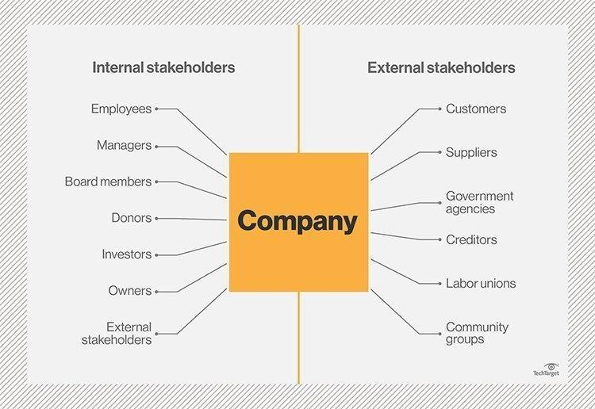

> Source: `D8.5_Dissemination,Exploitation&Communication_Master_Plan_Final.docx` — Document date: 2024-04-29 — Converted: 2026-09-28 via pandoc/pdftotext

---

##### 

Deliverable number: D8.5

{width="8.245833333333334in" height="3.0701388888888888in"}

Title: Dissemination, Exploitation, and Communication Master Plan: updated version in M18

# **Disclaimer:**  {#disclaimer .TOC-Heading}

The SUREWAVE project is Funded by the European Union. Views and opinions expressed are however those of the author(s) only and do not necessarily reflect those of the European Union. Neither the European Union nor the granting authority can be held responsible for them

Deliverable details

  ---------- -------- ------------------------------------------------------------
  **WP**     8        

  **Task**   D8.5     Dissemination, Exploitation, and Communication Master Plan
  ---------- -------- ------------------------------------------------------------

  ------------------------- ------ -- -------------------------- ----------------------
  **Dissemination level**   SEN       **Due delivery date**      31/03/2024

  **Deliverable type**      R         **Actual delivery date**   29/04/2024
  ------------------------- ------ -- -------------------------- ----------------------

  -------------------------------- ---------------------------------------------
  **Lead beneficiary**             **SIS**

  **Contributing beneficiaries**   All
  -------------------------------- ---------------------------------------------

  ---------------------- ------------- ------------------------------- -----------------------------------
  **Document Version**   **Date**      **Author**                      **Comments**[^1]

  1.0                    02.01.2024    Christoffer Isdahl              Draft version 

  1.1                    27.03.2024    Eirik Larsen                    Revision-1 

  1.2                    05.04.2024    Balram Panjwani                 Revision-2  

  1.3                    20.04.2024    Jon Samseth                     Revision-3 

  2.0                    29.04.2024    Eirik Larsen/ Balram Panjwani   Final version

  3.0                    15/08/2024    Eirik Larsen/ Balram Panjwani   Revised version after PO comments
  ---------------------- ------------- ------------------------------- -----------------------------------

+-------------------------------------------------------------------------------------------------------------------------------------------------+
| **Dissemination level**                                                                                                                         |
+:====================================+:==========================================================================================================+
| PU                                  | Public- fully open                                                                                        |
+-------------------------------------+-----------------------------------------------------------------------------------------------------------+
| SEN                                 | SEN = Sensitive -- limited under the conditions of the Grant Agreement                                    |
+-------------------------------------+-----------------------------------------------------------------------------------------------------------+
| EU classified                       | EU classified -- restraint -- UE/EU-restricted, confidential, secret-UE/EU secret under Decision 2015/444 |
+-------------------------------------+-----------------------------------------------------------------------------------------------------------+
| **Deliverable type**                                                                                                                            |
+-------------------------------------+-----------------------------------------------------------------------------------------------------------+
| R:                                  | Document, report (excluding the periodic and final reports)                                               |
+-------------------------------------+-----------------------------------------------------------------------------------------------------------+
| DEM:                                | Demonstrator, pilot, prototype, plan designs                                                              |
+-------------------------------------+-----------------------------------------------------------------------------------------------------------+
| DEC:                                | Websites, patent filing, press & media actions, videos, etc.                                              |
+-------------------------------------+-----------------------------------------------------------------------------------------------------------+
| OTHER:                              | Software, technical diagram, etc.                                                                         |
+-------------------------------------+-----------------------------------------------------------------------------------------------------------+

**EXECUTIVE SUMMARY**

The SUREWAVE project, supported by the European Union, integrates Floating Photovoltaic (FPV) systems with wave breakers to innovate offshore renewable energy technologies. This Dissemination, Exploitation, and Communication Master Plan (DECMP) details strategic communication, stakeholder engagement, and dissemination activities, aligning with the FAIR principles for data management---ensuring data is Findable, Accessible, Interoperable, and Reusable.

Key Performance Indicators (KPIs) assess progress in outreach and impact, highlighting advancements in video production and social media engagement by Month 18. Challenges in peer-reviewed publications and website traffic are noted, with expectations of improvement as research results escalate.

The DECMP addresses data security compliance with EU standards and outlines adaptive strategies to optimize communication and enhance project impact. This plan serves as a dynamic framework to guide the SUREWAVE project towards its goals, adjusting based on ongoing feedback and developments.

**Deliverable Review**

+----------------------------------------------------------------------------------+-----------------+---------------------------------------+-----------------+-----------------+---------------------------------------+-----------------+
|                                                                                  | **Reviewer #1: Jon Samseth**                                              | **Reviewer #2: Balram Panjwani**                                          |
|                                                                                  +-----------------+---------------------------------------+-----------------+-----------------+---------------------------------------+-----------------+
|                                                                                  | **Answer**      | **Comments**                          | **Type\***      | **Answer**      | **Comments**                          | **Type\***      |
+----------------------------------------------------------------------------------+-----------------+---------------------------------------+-----------------+-----------------+---------------------------------------+-----------------+
| 1.  Is the deliverable in accordance with                                                                                                                                                                                                |
+----------------------------------------------------------------------------------+-----------------+---------------------------------------+-----------------+-----------------+---------------------------------------+-----------------+
| (i) The Description of Work?                                                     | Yes             |                                       | M               | Yes             |                                       | M               |
|                                                                                  |                 |                                       |                 |                 |                                       |                 |
|                                                                                  | No              |                                       | m               | No              |                                       | m               |
|                                                                                  |                 |                                       |                 |                 |                                       |                 |
|                                                                                  |                 |                                       | a               |                 |                                       | a               |
+----------------------------------------------------------------------------------+-----------------+---------------------------------------+-----------------+-----------------+---------------------------------------+-----------------+
| (ii) The international State of the Art?                                         | Yes             | *Not applicable for this deliverable* | M               | Yes             | *Not applicable for this deliverable* | M               |
|                                                                                  |                 |                                       |                 |                 |                                       |                 |
|                                                                                  | No              |                                       | m               | No              |                                       | m               |
|                                                                                  |                 |                                       |                 |                 |                                       |                 |
|                                                                                  |                 |                                       | a               |                 |                                       | a               |
+----------------------------------------------------------------------------------+-----------------+---------------------------------------+-----------------+-----------------+---------------------------------------+-----------------+
| 2.  Is the quality of the deliverable in a status                                                                                                                                                                                        |
+----------------------------------------------------------------------------------+-----------------+---------------------------------------+-----------------+-----------------+---------------------------------------+-----------------+
| (i) That allows it to be sent to European Commission?                            | Yes             |                                       | M               | Yes             |                                       | M               |
|                                                                                  |                 |                                       |                 |                 |                                       |                 |
|                                                                                  | No              |                                       | m               | No              |                                       | m               |
|                                                                                  |                 |                                       |                 |                 |                                       |                 |
|                                                                                  |                 |                                       | a               |                 |                                       | a               |
+----------------------------------------------------------------------------------+-----------------+---------------------------------------+-----------------+-----------------+---------------------------------------+-----------------+
| (ii) That needs improvement of the writing by the originator of the deliverable? | Yes             |                                       | M               | Yes             |                                       | M               |
|                                                                                  |                 |                                       |                 |                 |                                       |                 |
|                                                                                  | No              |                                       | m               | No              |                                       | m               |
|                                                                                  |                 |                                       |                 |                 |                                       |                 |
|                                                                                  |                 |                                       | a               |                 |                                       | a               |
+----------------------------------------------------------------------------------+-----------------+---------------------------------------+-----------------+-----------------+---------------------------------------+-----------------+
| (iii) That need further work by the Partners responsible for the deliverable?    | Yes             |                                       | M               | Yes             |                                       | M               |
|                                                                                  |                 |                                       |                 |                 |                                       |                 |
|                                                                                  | No              |                                       | m               | No              |                                       | m               |
|                                                                                  |                 |                                       |                 |                 |                                       |                 |
|                                                                                  |                 |                                       | a               |                 |                                       | a               |
+----------------------------------------------------------------------------------+-----------------+---------------------------------------+-----------------+-----------------+---------------------------------------+-----------------+

\* Type of comments: M = Major comment; m = minor comment; a = advice

**Abbreviations**

EU - European Union\
CINEA - Climate, Infrastructure and Environment Executive Agency\
BRIDGE - Cooperation between Horizon 2020 projects in the fields of smart grid, energy storage, islands, and digitalisation.**\**
DECMP -- Dissemination, Exploitation, and Communication Master Plan\
FPV - Floating Photovoltaics\
DMP -- Data Management Plan\
FAIR - Findable, Accessible, Interoperable, Reusable\
WP -- Work Package\
M(X) - Month\
D -- Deliverable\
SLS - Sunlit Sea\
NGO - Non-Governmental Organization\
GDPR - General Data Protection Regulations\
KPI - Key Performance Indicator\
LCA - Life-Cycle Assessment\
i.e., - 'That is'\
e.g., - 'For example'\
SEO -- Search Engine Optimalization\
O&M - Operation and Maintenance\
R&D - Research and Development\
SDG - Sustainable Development Goals\
DOI - Digital Object Identifier

# Table of Contents {#table-of-contents .TOC-Heading}

[1. Introduction [5](#introduction)](#introduction)

[1.1. Purpose and scope [5](#purpose-and-scope)](#purpose-and-scope)

[1.2 WP8.1 Tasks according to the Description of Action [5](#wp8.1-tasks-according-to-the-description-of-action)](#wp8.1-tasks-according-to-the-description-of-action)

[Main Objective [5](#main-objective)](#main-objective)

[1.3 Target audience and stakeholders [6](#target-audience-and-stakeholders)](#target-audience-and-stakeholders)

[Internal Stakeholders [7](#internal-stakeholders)](#internal-stakeholders)

[External Stakeholders [9](#external-stakeholders)](#external-stakeholders)

[2. Work Done By Month 18 [12](#work-done-by-month-18)](#work-done-by-month-18)

[3. Dissemination, Exploitation & Communication Plan [13](#dissemination-exploitation-communication-plan)](#dissemination-exploitation-communication-plan)

[3.1. Strategic implementation [13](#strategic-implementation)](#strategic-implementation)

[3.1.1. Steps for Strategic Implementation [13](#steps-for-strategic-implementation)](#steps-for-strategic-implementation)

[3.1.2. Integration of Internal Communication Training [14](#integration-of-internal-communication-training)](#integration-of-internal-communication-training)

[3.2 Dissemination, Exploitation & Communication routes [14](#dissemination-exploitation-communication-routes)](#dissemination-exploitation-communication-routes)

[3.2.1 Online Presence: Project Website & Social Media [15](#online-presence-project-website-social-media)](#online-presence-project-website-social-media)

[3.2.2 Publication of Journal Articles [16](#publication-of-journal-articles)](#publication-of-journal-articles)

[3.2.3 Scientific Conferences [19](#scientific-conferences)](#scientific-conferences)

[3.2.4 Workshops [20](#workshops)](#workshops)

[3.2.5 Interactions with other EC-funded Projects/Clusters [21](#interactions-with-other-ec-funded-projectsclusters)](#interactions-with-other-ec-funded-projectsclusters)

[3.2.6 Media coverage [23](#media-coverage)](#media-coverage)

[3.3 Communication types [24](#communication-types)](#communication-types)

[3.3.1 Films, Videos [24](#films-videos)](#films-videos)

[3.3.2 Print [25](#print)](#print)

[3.3.3 Newsletters & press releases [26](#newsletters-press-releases)](#newsletters-press-releases)

[3.3.4 Articles [27](#articles)](#articles)

[3.3.5 Progress Reports [27](#progress-reports)](#progress-reports)

[3.3.6 Presentations [27](#presentations)](#presentations)

[3.4 Key Messages for different stakeholder groups [28](#key-messages-for-different-stakeholder-groups)](#key-messages-for-different-stakeholder-groups)

[4. Targetd KPIs [30](#targetd-kpis)](#targetd-kpis)

[5. Work planned for M19 - M36 [31](#work-planned-for-m19---m36)](#work-planned-for-m19---m36)

[6. Data Security [33](#data-security)](#data-security)

[7. Conclusions [34](#conclusions)](#conclusions)

[8. Limitations [35](#limitations)](#limitations)

[9. Exploitable Results and Future Work [36](#exploitable-results-and-future-work)](#exploitable-results-and-future-work)

[Additional Exploitation Opportunities [40](#additional-exploitation-opportunities)](#additional-exploitation-opportunities)

[Bibliography, References [41](#bibliography-references)](#bibliography-references)

# 1. Introduction 

## 1.1. Purpose and scope

The Dissemination, Exploitation, and Communication Master Plan (DECMP) for the SUREWAVE project is designed to effectively engage stakeholders throughout the project lifecycle. Our objectives, as detailed in the Grant Agreement, focus on enhancing the project\'s impact both during its execution and after its conclusion. This document serves as a practical guide for strategic and tactical decision-making, ensuring cohesive actions across the consortium.

The first part of this report outlines the plan\'s scope, highlighting our progress in the first 18 months and our strategy for the remaining 18 months. Initially, we focused on setting up reliable communication channels and frameworks to ensure effective stakeholder engagement, alongside establishing a solid base of tools and processes. With these elements in place, we are now poised to expand our reach and further refine our approach based on the insights and feedback received.

A key aspect of our plan is the clear distinction between different target groups and stakeholders, enabling us to tailor communication strategies that meet specific needs and enhance engagement. We have monitored predefined key performance indicators (KPIs) to assess the effectiveness of our dissemination activities, leading to a comprehensive review at Month 18, which has informed the adjustments in our strategies.

Looking ahead, we will continue to leverage analytics and maintain a flexible engagement strategy, adapting our methods to further improve the project's impact. This approach ensures that the SUREWAVE project not only shares knowledge effectively but also capitalizes on the potential of its outcomes.

## 

## 1.2 WP8.1 Tasks according to the Description of Action

At the start of the project, the following tasks were outlined.

### Main Objective

Develop and implement a robust strategy for dissemination, communication, and stakeholder engagement to maximize the impact of the project outcomes and ensure its lasting legacy.

**Goal 1**: Enhance Awareness and Information Dissemination

- **Objective:** To increase awareness and inform stakeholders, including technology providers and early adopters in the offshore energy sector, about the project results and innovative approaches.

- **KPIs:**

  - Reach over 500 stakeholders through digital campaigns.

  - Conduct at least 10 webinars and workshops targeted at technology providers and early adopters.

**Goal 2**: Foster Active Engagement and Dialogue

- **Objective:** Engage with a broad spectrum of stakeholders to create opportunities for commercialization and further research, enhancing the exploitation of SUREWAVE solutions.

- **KPIs:**

  - Host bi-annual stakeholder forums and roundtables.

  - Develop and maintain a feedback loop with at least 3 industry partnerships for continuous engagement.

**Goal 3**: Knowledge Transfer and Capacity Building

- **Objective:** Transfer critical knowledge and insights to partners and external stakeholders to facilitate informed decision-making and capacity building.

- **KPIs:**

  - Publish at least 10 peer-reviewed articles in scientific journals.

  - Organize quarterly training sessions for project partners and stakeholders.

**Goal 4**: Increase Acceptance of Technological Innovations

- **Objective:** Promote and increase the acceptance of the project's technical solutions, highlighting their environmental benefits and cost-effectiveness.

- **KPIs:**

  - Achieve media mentions in over 20 publications.

  - Conduct impact assessments and publish the results demonstrating environmental and economic benefits.

**Goal 5**: Sustain and Expand Impact

- **Objective:** Ensure the sustainability and replication of SUREWAVE solutions beyond the project's lifetime, utilizing effective business models and exploitation pathways.

- **KPIs:**

  - Establish at least 2 new commercial agreements or partnerships for adopting the developed solutions.

  - Develop a comprehensive sustainability and replication guide distributed to all stakeholders.

Working with the goals and objectives, the team established a more concrete and measurable set of KPIs:

- LinkedIn Followers: Target of 500 followers to gauge our social media engagement and outreach.

- Webpage Visits: Goal of 36,000 visits to ensure broad dissemination of project information.

- Infographics Produced: 6 infographics aimed to visually communicate key project data and insights.

- Factsheets Developed: 3 factsheets to provide concise and relevant project information.

- Videos Produced: 2 videos intended to visually showcase project progress and highlights.

- Peer-reviewed Research Papers: 10 papers to contribute significant scientific knowledge to the field.

- Presentations at Conferences: 10 presentations to disseminate findings and engage with the academic community.

- Conference Workshops: 3 workshops to facilitate in-depth discussions and networking.

- SAB Workshops: 2 workshops with the Stakeholder Advisory Board for strategic guidance.

- Joint Events: Participation in 2 joint events with other EU-funded projects to foster synergies.

- Newsletters Published: 5 newsletters to regularly update stakeholders on project progress.

In chapter [KPIs](#targetd-kpis) we discuss results and revisions of these KPIs per month 18.

## 1.3 Target audience and stakeholders

The SUREWAVE project engages with a wide range of target audiences and essential stakeholders, playing a pivotal role in shaping its dissemination, exploitation, and communication strategies. This distinction tailors our approach to effectively reach and influence each group involved directly or indirectly with the project.

Target groups are defined as the specific individuals, entities, or communities that a particular policy, project, or campaign actively seeks to influence or impact. Stakeholders, on the other hand, include any individual, group, or organization that affects or can be affected by the project's actions and outcomes. Stakeholders may have a vested interest in the project\'s performance and results, encompassing a broader spectrum than target groups.

While every target group is a stakeholder, not all stakeholders are part of the immediate target groups. This broader view helps in developing a proactive communication strategy that anticipates and addresses the needs and expectations of each stakeholder type, rather than merely reacting to them.

The project categorizes stakeholders into internal and external groups, each with distinct roles and expectations:

{width="6.299660979877515in" height="3.263888888888889in"}\
Picture: [Stakeholders are often divided into two groups, internal and external stakeholders.]{.mark}[^2]

### Internal Stakeholders

**Consortium Members**

The consortium members, including organizations like SINTEF, IFEU, MARIN, Clement Germany, Sunlit Sea, Ceit, and ACCIONA, form the core team responsible for driving the project\'s strategic direction and implementation. Each member brings unique expertise and resources:

- SINTEF contributes with its extensive research capabilities in renewable energy technologies.

- IFEU offers insights into environmental impact assessments needed for understanding and mitigating the ecological footprint of the project.

- MARIN provides maritime engineering expertise, essential for the offshore aspects of the FPV systems.

- Clement Germany and Sunlit Sea are instrumental in the design and deployment of the floating structures that support photovoltaic panels.

- Ceit and ACCIONA help integrate these technologies within existing energy infrastructures and work on scaling these solutions commercially.

Regular project meetings, workshops, and shared platforms for data and resource exchange facilitate coordination among these entities, ensuring that project milestones are met and that outcomes align with the agreed objectives.

+:------------------------------------------------------------------------------------------------------------------------------------------------------------------------------------------------------------------------------------------------------------------------------------------------------------------------------------------------------------------------------------------------------------------------------------------------------------------------------------------------------------------------------------------------------------+:-----------+:------------------------------------------+
| **Project Management Team**                                                                                                                                                                                                                                                                                                                                                                                                                                                                                                                                 | SINTEF     | Coordinator: Balram Panjwani, Sintef      |
|                                                                                                                                                                                                                                                                                                                                                                                                                                                                                                                                                             |            |                                           |
| This team is tasked with the day-to-day management of the project, ensuring that all activities are aligned with the project\'s timeline and budget. Their responsibilities include scheduling, resource allocation, risk management, and reporting to funding bodies. They act as the central hub for communication, coordinating between different consortium members and ensuring that all parts of the project are harmoniously integrated.                                                                                                             |            |                                           |
+-------------------------------------------------------------------------------------------------------------------------------------------------------------------------------------------------------------------------------------------------------------------------------------------------------------------------------------------------------------------------------------------------------------------------------------------------------------------------------------------------------------------------------------------------------------+------------+-------------------------------------------+
| **Technical Teams**                                                                                                                                                                                                                                                                                                                                                                                                                                                                                                                                         | SINTEF\    | WP2: Guillaume Kegelart, Sunlit Sea       |
|                                                                                                                                                                                                                                                                                                                                                                                                                                                                                                                                                             | IFEU       |                                           |
| Comprising engineers, scientists, and technical specialists from the consortium, these teams are responsible for the research, development, and deployment of the technologies involved in the project. They work on the ground, tackling the technical challenges associated with offshore FPV systems, developing prototypes, and testing the technology in real-world conditions.                                                                                                                                                                        |            | WP3: Thomas Pehlke, Clement               |
|                                                                                                                                                                                                                                                                                                                                                                                                                                                                                                                                                             | MARIN      |                                           |
|                                                                                                                                                                                                                                                                                                                                                                                                                                                                                                                                                             |            | WP4: Maria Aurora Casado Barrasa, ACCIONA |
|                                                                                                                                                                                                                                                                                                                                                                                                                                                                                                                                                             | Ceit       |                                           |
|                                                                                                                                                                                                                                                                                                                                                                                                                                                                                                                                                             |            | WP5: Ainhoa Cortes, Ceit                  |
|                                                                                                                                                                                                                                                                                                                                                                                                                                                                                                                                                             | ACCIONA    |                                           |
|                                                                                                                                                                                                                                                                                                                                                                                                                                                                                                                                                             |            | WP6: Virgile Delhaye, Sintef              |
|                                                                                                                                                                                                                                                                                                                                                                                                                                                                                                                                                             | Clement    |                                           |
|                                                                                                                                                                                                                                                                                                                                                                                                                                                                                                                                                             |            | WP7: Heiko Keller, Ifeu                   |
+-------------------------------------------------------------------------------------------------------------------------------------------------------------------------------------------------------------------------------------------------------------------------------------------------------------------------------------------------------------------------------------------------------------------------------------------------------------------------------------------------------------------------------------------------------------+------------+-------------------------------------------+
| **Support Staff**                                                                                                                                                                                                                                                                                                                                                                                                                                                                                                                                           | SINTEF     | Kari Schei, Sintef                        |
|                                                                                                                                                                                                                                                                                                                                                                                                                                                                                                                                                             |            |                                           |
| This group includes administrative, financial, and operational staff who provide essential support services to the project. Their roles involve procurement, financial accounting, legal support, and general administration. They ensure that the project complies with regulatory requirements, manage expenditures, and maintain the organizational efficiency necessary for the success of such a complex undertaking.                                                                                                                                  |            | Marit Eggen, Sintef                       |
+-------------------------------------------------------------------------------------------------------------------------------------------------------------------------------------------------------------------------------------------------------------------------------------------------------------------------------------------------------------------------------------------------------------------------------------------------------------------------------------------------------------------------------------------------------------+------------+-------------------------------------------+
| **Communication and Dissemination Team**                                                                                                                                                                                                                                                                                                                                                                                                                                                                                                                    | Sunlit Sea | WP8: Eirik Larsen, Sunlit Sea             |
|                                                                                                                                                                                                                                                                                                                                                                                                                                                                                                                                                             |            |                                           |
| Dedicated to managing the internal and external communication of the project, this team shapes the public image and outreach of SUREWAVE. They prepare press releases, manage the project\'s online presence, organize conferences and public engagement events, and produce materials that highlight the project's progress and successes.                                                                                                                                                                                                                 |            | Benjamin Mortensen, Wideangle             |
+-------------------------------------------------------------------------------------------------------------------------------------------------------------------------------------------------------------------------------------------------------------------------------------------------------------------------------------------------------------------------------------------------------------------------------------------------------------------------------------------------------------------------------------------------------------+------------+-------------------------------------------+
| **Human Resources**                                                                                                                                                                                                                                                                                                                                                                                                                                                                                                                                         | SINTEF     | Balram Panjwani, Sintef                   |
|                                                                                                                                                                                                                                                                                                                                                                                                                                                                                                                                                             |            |                                           |
| Human Resources (HR) supports the project by managing personnel issues, facilitating effective team collaborations, and ensuring that the project environment is conducive to high productivity and employee satisfaction. They are involved in recruiting new talents required for the project and in developing programs for professional development and staff retention.                                                                                                                                                                                |            | Marit Eggen, Sintef                       |
|                                                                                                                                                                                                                                                                                                                                                                                                                                                                                                                                                             |            |                                           |
| Each group within the internal stakeholders has distinct but interrelated responsibilities that contribute to the holistic success of the SUREWAVE project. Effective management of these internal relationships maintains project momentum and for achieving the innovative and impactful outcomes envisioned in the project\'s objectives. Regular training, team-building activities, and feedback mechanisms are also employed to enhance collaboration and to ensure that all team members are engaged and motivated throughout the project lifecycle. |            |                                           |
+-------------------------------------------------------------------------------------------------------------------------------------------------------------------------------------------------------------------------------------------------------------------------------------------------------------------------------------------------------------------------------------------------------------------------------------------------------------------------------------------------------------------------------------------------------------+------------+-------------------------------------------+

### External Stakeholders

+:-------------------------------------------------------------------------------------------------------------------------------------------------------------------------------------------------------------------------------------------------------------------------------------------------------------------------------------------------------------------------------------------------------------------------------------------------------------------------------------------------------------------------------------------------------------------------------------------------------------------------------------------------+:------------------------------------------------------------------------------------------------------------------------------------------------------------------+
| **Category**                                                                                                                                                                                                                                                                                                                                                                                                                                                                                                                                                                                                                                     | **Example "ideal" stakeholder**                                                                                                                                   |
+--------------------------------------------------------------------------------------------------------------------------------------------------------------------------------------------------------------------------------------------------------------------------------------------------------------------------------------------------------------------------------------------------------------------------------------------------------------------------------------------------------------------------------------------------------------------------------------------------------------------------------------------------+-------------------------------------------------------------------------------------------------------------------------------------------------------------------+
| **Industry Partners**                                                                                                                                                                                                                                                                                                                                                                                                                                                                                                                                                                                                                            | Siemens Gamesa Renewable Energy: A technology provider that could collaborate on integrating turbine technology with FPV systems.                                 |
|                                                                                                                                                                                                                                                                                                                                                                                                                                                                                                                                                                                                                                                  |                                                                                                                                                                   |
| Industry partners include technology providers and project developers integral to translating research into operational, market-ready solutions. These partners leverage the project's innovations to improve the efficiency and feasibility of offshore Floating Photovoltaic (FPV) technologies. Their real-world feedback is vital for iterative design improvements and for addressing practical implementation challenges. Engaging with these partners through collaborative pilot projects and innovation workshops ensures that the project remains at the cutting edge of technology while being directly applicable to industry needs. | Vestas Wind Systems: As a project developer, Vestas could help in the practical application and scaling of offshore FPV technologies derived from the project.    |
|                                                                                                                                                                                                                                                                                                                                                                                                                                                                                                                                                                                                                                                  |                                                                                                                                                                   |
|                                                                                                                                                                                                                                                                                                                                                                                                                                                                                                                                                                                                                                                  | Bosch Solar Energy: Could serve as both a technology provider and feedback source for improving photovoltaic technologies used in the project.                    |
+--------------------------------------------------------------------------------------------------------------------------------------------------------------------------------------------------------------------------------------------------------------------------------------------------------------------------------------------------------------------------------------------------------------------------------------------------------------------------------------------------------------------------------------------------------------------------------------------------------------------------------------------------+-------------------------------------------------------------------------------------------------------------------------------------------------------------------+
| **Academic and Research Institutions**                                                                                                                                                                                                                                                                                                                                                                                                                                                                                                                                                                                                           | Massachusetts Institute of Technology (MIT): Known for cutting-edge research in photovoltaics and sustainable energy solutions.                                   |
|                                                                                                                                                                                                                                                                                                                                                                                                                                                                                                                                                                                                                                                  |                                                                                                                                                                   |
| Academic institutions and research bodies play a pivotal role in advancing the scientific foundations of the SUREWAVE project. They contribute through rigorous testing, validation of technology, and the exploration of new materials and methods that could enhance the durability and efficiency of FPV systems. Collaborations with universities and research institutions also help in accessing state-of-the-art facilities and in fostering an environment of academic scrutiny that is vital for holistic and unbiased research outcomes.                                                                                               | Delft University of Technology: Could partner for advanced material research and durability testing of FPV systems.                                               |
|                                                                                                                                                                                                                                                                                                                                                                                                                                                                                                                                                                                                                                                  |                                                                                                                                                                   |
|                                                                                                                                                                                                                                                                                                                                                                                                                                                                                                                                                                                                                                                  | National Renewable Energy Laboratory (NREL), USA: Could collaborate on technology validation and performance analysis.                                            |
+--------------------------------------------------------------------------------------------------------------------------------------------------------------------------------------------------------------------------------------------------------------------------------------------------------------------------------------------------------------------------------------------------------------------------------------------------------------------------------------------------------------------------------------------------------------------------------------------------------------------------------------------------+-------------------------------------------------------------------------------------------------------------------------------------------------------------------+
| **Policy Makers and Regulatory Bodies**                                                                                                                                                                                                                                                                                                                                                                                                                                                                                                                                                                                                          | European Commission's Directorate-General for Energy: Involved in setting renewable energy policies and standards within the EU.                                  |
|                                                                                                                                                                                                                                                                                                                                                                                                                                                                                                                                                                                                                                                  |                                                                                                                                                                   |
| Policy makers and regulatory bodies are essential for navigating the complex regulatory environments that impact the deployment of offshore FPV installations. Their involvement ensures that the project adheres to international standards and practices, and helps in influencing policy decisions that could benefit the wider adoption of FPV technology. Regular dialogues, policy briefings, and participation in legislative workshops are methods used to keep this group engaged and informed, ensuring that the project\'s outputs are aligned with current and future regulatory frameworks.                                         | International Renewable Energy Agency (IRENA): Could influence international standards and promote FPV technology adoption globally.                              |
|                                                                                                                                                                                                                                                                                                                                                                                                                                                                                                                                                                                                                                                  |                                                                                                                                                                   |
|                                                                                                                                                                                                                                                                                                                                                                                                                                                                                                                                                                                                                                                  | Norwegian Water Resources and Energy Directorate (NVE): A national body that could facilitate regulatory approvals for deploying FPV systems in Norwegian waters. |
+--------------------------------------------------------------------------------------------------------------------------------------------------------------------------------------------------------------------------------------------------------------------------------------------------------------------------------------------------------------------------------------------------------------------------------------------------------------------------------------------------------------------------------------------------------------------------------------------------------------------------------------------------+-------------------------------------------------------------------------------------------------------------------------------------------------------------------+
| **Financial Institutions and Insurers**                                                                                                                                                                                                                                                                                                                                                                                                                                                                                                                                                                                                          | Goldman Sachs Renewable Power Group: Provides investment and financial support for renewable energy projects.                                                     |
|                                                                                                                                                                                                                                                                                                                                                                                                                                                                                                                                                                                                                                                  |                                                                                                                                                                   |
| Financial institutions and insurers assess the economic viability and risk profiles of innovative energy projects like SUREWAVE. They provide the necessary financial frameworks that can attract further investment, ensuring the project\'s long-term sustainability. Engagements with this group focus on showcasing the project's potential for high returns on investment, its scalability, and risk mitigation strategies that reduce financial exposure. Workshops and seminars tailored to financial stakeholders help clarify the technological aspects of the project, focusing instead on financial benefits and risk management.     | Munich Re: An insurer that could develop risk assessment models and insurance products for offshore FPV installations.                                            |
|                                                                                                                                                                                                                                                                                                                                                                                                                                                                                                                                                                                                                                                  |                                                                                                                                                                   |
|                                                                                                                                                                                                                                                                                                                                                                                                                                                                                                                                                                                                                                                  | Green Investment Group: Focuses on financing green infrastructure and could fund scaling of FPV technologies.                                                     |
+--------------------------------------------------------------------------------------------------------------------------------------------------------------------------------------------------------------------------------------------------------------------------------------------------------------------------------------------------------------------------------------------------------------------------------------------------------------------------------------------------------------------------------------------------------------------------------------------------------------------------------------------------+-------------------------------------------------------------------------------------------------------------------------------------------------------------------+
| **Non-Governmental Organizations (NGOs)**                                                                                                                                                                                                                                                                                                                                                                                                                                                                                                                                                                                                        | World Wide Fund for Nature (WWF): Engage on environmental impact assessments and advocate for sustainable project practices.                                      |
|                                                                                                                                                                                                                                                                                                                                                                                                                                                                                                                                                                                                                                                  |                                                                                                                                                                   |
| NGOs concerned with environmental impact, sustainability, and community rights are key stakeholders in projects that have significant environmental interfacing. Their insights and advocacy ensures that the project maintains high environmental and ethical standards. Collaborative environmental impact assessments and community engagement programs are some of the ways the project works with NGOs to ensure that all operations are sustainable and socially responsible.                                                                                                                                                              | Greenpeace: Could be involved in ensuring that FPV installations do not adversely affect marine ecosystems.                                                       |
|                                                                                                                                                                                                                                                                                                                                                                                                                                                                                                                                                                                                                                                  |                                                                                                                                                                   |
|                                                                                                                                                                                                                                                                                                                                                                                                                                                                                                                                                                                                                                                  | The Ocean Cleanup: Partnerships to study and mitigate any potential impacts on marine environments from FPV systems.                                              |
+--------------------------------------------------------------------------------------------------------------------------------------------------------------------------------------------------------------------------------------------------------------------------------------------------------------------------------------------------------------------------------------------------------------------------------------------------------------------------------------------------------------------------------------------------------------------------------------------------------------------------------------------------+-------------------------------------------------------------------------------------------------------------------------------------------------------------------+
| **General Public and Community Groups**                                                                                                                                                                                                                                                                                                                                                                                                                                                                                                                                                                                                          | Local Coastal Community Groups: Particularly in regions where FPV installations are planned, to gain support and address any environmental concerns.              |
|                                                                                                                                                                                                                                                                                                                                                                                                                                                                                                                                                                                                                                                  |                                                                                                                                                                   |
| The general public and local communities are often the most affected by large-scale environmental projects. As such, their support and understanding are critical for the project's social license to operate. Public workshops, open days, and informational campaigns are conducted to educate the public about the benefits of the project, addressing any concerns related to environmental and social impacts. Regular updates via social media and community newsletters also help maintain an open line of communication.                                                                                                                 | Educational Outreach Programs: Conducted in schools and communities to educate about renewable energy and the specific benefits of the SUREWAVE project.          |
|                                                                                                                                                                                                                                                                                                                                                                                                                                                                                                                                                                                                                                                  |                                                                                                                                                                   |
|                                                                                                                                                                                                                                                                                                                                                                                                                                                                                                                                                                                                                                                  | Environmental Advocacy Groups: Local groups interested in preserving their marine and coastal environments.                                                       |
+--------------------------------------------------------------------------------------------------------------------------------------------------------------------------------------------------------------------------------------------------------------------------------------------------------------------------------------------------------------------------------------------------------------------------------------------------------------------------------------------------------------------------------------------------------------------------------------------------------------------------------------------------+-------------------------------------------------------------------------------------------------------------------------------------------------------------------+
| **Media Outlets**                                                                                                                                                                                                                                                                                                                                                                                                                                                                                                                                                                                                                                | BBC Science and Environment: For broader coverage and to attract public interest in renewable energy innovations.                                                 |
|                                                                                                                                                                                                                                                                                                                                                                                                                                                                                                                                                                                                                                                  |                                                                                                                                                                   |
| Media outlets are instrumental in shaping public perception and awareness of the project. Active engagement with journalists, press releases, and media tours of project sites help ensure accurate and positive coverage. This relationship is managed through a dedicated media relations team that works to provide clear, accessible information on the project's goals, progress, and achievements, helping to foster a positive public narrative and enhance the project's visibility.                                                                                                                                                     | Financial Times Energy Sector: Could focus on the economic impacts and potential of the FPV market.                                                               |
|                                                                                                                                                                                                                                                                                                                                                                                                                                                                                                                                                                                                                                                  |                                                                                                                                                                   |
|                                                                                                                                                                                                                                                                                                                                                                                                                                                                                                                                                                                                                                                  | National Geographic: To document and visually present the innovative aspects of the project, reaching a global audience interested in science and technology.     |
+--------------------------------------------------------------------------------------------------------------------------------------------------------------------------------------------------------------------------------------------------------------------------------------------------------------------------------------------------------------------------------------------------------------------------------------------------------------------------------------------------------------------------------------------------------------------------------------------------------------------------------------------------+-------------------------------------------------------------------------------------------------------------------------------------------------------------------+

Each of these external stakeholder groups is engaged through tailored strategies that respect their unique perspectives and needs, ensuring that all external communications and engagements are strategic, targeted, and effective. This approach not only facilitates successful project implementation but also ensures broad-based support and acceptance, contributing significantly to the project's overall success and sustainability. The examples in the right column highlight potential stakeholders we hope to engage with our dissemination, exploitation and communication strategy.

The formation of the Stakeholder Advisory Board (SAB) under Task 2.4 has significantly enriched our approach to stakeholder engagement. The SAB, comprising industry experts, regulatory members, financial advisors, and environmental specialists, provides strategic insights that help navigate non-technical barriers and enhance the project's holistic development. Activities and insights from the SAB include regular workshops and meetings to gather and integrate diverse perspectives directly into the project's strategic framework, applying SAB insights to refine project methodologies and outputs, and leveraging the SAB's expertise to forecast and prepare for future challenges and opportunities.

As a project funded by the European Union, SUREWAVE adheres to high ethical standards and corporate responsibilities. Our actions significantly impact EU citizens\' lives, not only in terms of technological advancements but also in economic, environmental, and social aspects. Communicating these impacts transparently and responsibly is paramount. The distinction between target groups and stakeholders and the integration of the SAB are foundational to our strategic communication and dissemination efforts. By understanding and engaging each group effectively, the SUREWAVE project ensures that all communications are strategic, tailored, and effective, maximizing the project's impact and legacy. This comprehensive stakeholder engagement strategy not only facilitates the successful implementation of the project but also ensures its outcomes are sustainable and widely accepted across different sectors and communities.

# 2. Work Done By Month 18

As of Month 18, the SUREWAVE project has initiated its dissemination and exploitation activities, in line with our Communication Plan. We\'ve established a timeline and clear roles within our team to ensure the smooth execution of our communication strategy. To improve our team\'s effectiveness, we have also integrated training focused on digital literacy and social media engagement.

Our dissemination efforts are progressing, with a growing online presence. The project website is regularly updated, and our social media channels are beginning to engage a broader audience. We\'ve started to publish articles that detail our initial findings and presented these insights at several academic conferences, thereby starting to build our presence in the academic community. Workshop sessions with industry stakeholders are in the early stages, aiming to gather feedback and encourage collaboration.

In our communication efforts, we are utilizing a blend of traditional and digital media. We have produced initial documentary-style videos to visually share our progress and goals, supplemented by printed materials for distribution at events. We are maintaining regular communication with our stakeholders through newsletters and press releases. Feature articles in industry publications are planned to highlight our project's innovations as more results become available. Regular progress reports are being prepared for the European Commission, and we continue to share our findings through presentations at various forums.

We have developed key messages tailored for different stakeholder groups, focusing on the project\'s potential contributions to sustainable energy solutions. Currently, we are preparing to assess the project against the established key performance indicators (KPIs), with results anticipated in upcoming reports.

While we have made initial strides in our dissemination and communication efforts, there is a recognition that as more substantive results from the technical teams become available, our efforts will intensify in the latter half of the project. This phased approach will ensure that we are sharing mature, impactful findings. We plan to address any existing limitations in our outreach and engagement strategies to enhance the overall impact as the project advances. This ongoing effort underscores our commitment to a robust dissemination strategy that will evolve and expand with the project\'s progress.

In chapters 1, 3 and 4 we lay out the work done as per Month 18. In chapter 5 we discuss the work planned for month 19 - 36.

# 3. Dissemination, Exploitation & Communication Plan

In alignment with the Grant Agreements under point 1.2.8 regarding Data Management and Management of other Research Outputs, the SUREWAVE project is committed to adhering to the principles of Findability, Accessibility, Interoperability, and Reusability (FAIR). These principles ensure that all research data generated throughout the course of the project is managed in a manner that maximizes accessibility and utility across the scientific community and beyond, as detailed in our Data Management Plan (DMP) referenced as D1.3.

Further ensuring compliance with Horizon Europe's Open Science requirements, the SUREWAVE project utilizes Zenodo, an EC-funded initiative that champions the Open Access policy. This platform facilitates the storage of data in CERN's Data Centre, integrating seamlessly with OpenAIRE to enhance the discoverability and accessibility of research findings. Each piece of research is assigned a Digital Object Identifier (DOI), which simplifies the process of citation and retrieval, thus broadening the impact and dissemination of our findings. Additionally, the project\'s outputs are organized within Zenodo under newly created community categories specifically designed for the SUREWAVE project under the Horizon Europe framework.

## 3.1. Strategic implementation

Strategic implementation serves as the cornerstone of the Dissemination, Exploitation, and Communication Master Plan (DECMP) for the SUREWAVE project. Effective execution of strategies ensures that the theoretical strengths of the plan translate into tangible outcomes that advance the project\'s objectives. This subsection outlines the critical steps necessary to ensure that our strategic plans are not only well-crafted but also effectively realized.

### 3.1.1. Steps for Strategic Implementation

1.  **Defining the Goals**: Clearly articulate the specific objectives of dissemination, exploitation, and communication. Goals should be SMART: Specific, Measurable, Achievable, Relevant, and Time-bound. This clarity will guide the subsequent planning and execution phases.

2.  **Determining Roles and Responsibilities**: Assign clear responsibilities to team members within the consortium. This involves identifying the skills and resources of each member and aligning them with the needs of the project to ensure efficient task allocation.

3.  **Delegating the Work**: Once roles are assigned, delegate tasks according to each team member\'s expertise and capacity. Effective delegation ensures high levels of engagement and productivity throughout the project lifecycle.

4.  **Executing the Plan**: Implement the strategies as designed. This includes managing the logistics of dissemination activities, overseeing the development and distribution of communication materials, and engaging with stakeholders as planned.

5.  **Measure and Evaluate**: Regularly assess the performance of the dissemination and communication strategies against the predefined KPIs. This evaluation should include collecting feedback from stakeholders and consortium members to gauge the impact and effectiveness of the strategies employed.

6.  **Making Adjustments**: Based on the evaluations, make necessary adjustments to strategies and plans. Adaptability is key to responding to challenges and opportunities that arise during the project's execution.

7.  **Getting Closure on the Project**: As the project concludes, ensure that all activities are finalized, outcomes are documented, and results are disseminated to all stakeholders. Proper closure involves summarizing the achievements and learning points, which can be valuable for future projects.

8.  **Reviewing End-Results**: After project completion, conduct a thorough review of the project's outcomes versus the initial goals. This review should contribute to the knowledge base of best practices and lessons learned for future dissemination and communication efforts.

### 3.1.2. Integration of Internal Communication Training

To support the strategic implementation steps, Subtask 8.2.1, titled \"Internal Communication Training,\" plays a vital role. It ensures that all consortium members are well-informed about the project\'s objectives and understand their specific roles and responsibilities. Instead of a single meeting, we have implemented a series of videocall interactions via platforms like Google Meet and Microsoft Teams. These sessions function as strategic DECMP implementation discussions, where ongoing revisions to the DEC master plan are deliberated. These interactions keep all members aligned and provide a platform to gather and integrate feedback from those involved in the project\'s daily activities. The feedback mechanism is designed to be continuous, fostering real-time adjustments and enhancements to our strategy as the project evolves.

##  3.2 Dissemination, Exploitation & Communication routes

The SUREWAVE project is committed to a dynamic and multifaceted approach to engaging with stakeholders across various sectors and disciplines. This section outlines the diverse dissemination, exploitation, and communication routes that have been and will be employed to ensure that the project's outputs reach and influence the appropriate audiences effectively.

The project leverages an integrated mix of communication channels and platforms to cater to the needs of different stakeholder groups, including:

- **Digital Channels:** These encompass the project's official website, social media profiles, and digital newsletters that provide regular updates on the project\'s progress, findings, and milestones.

- **Printed Documents:** Essential for reaching stakeholders who prefer traditional media, these include brochures, flyers, and detailed reports that summarize the project's activities and achievements.

- **Physical Conferences, Events, and Meetings:** Vital for networking and direct engagement, these forums allow for face-to-face interactions with peers, industry leaders, and potential collaborators, facilitating the exchange of ideas and fostering partnerships.

- **Webinars and Online Meetings:** To reach a broader audience without geographical constraints, these sessions are designed to engage stakeholders remotely, offering interactive presentations, Q&A sessions, and live discussions.

- **General Collaborations with Relevant Projects:** By collaborating with other EU-funded and international projects, SUREWAVE can share insights, leverage mutual strengths, and increase the overall impact of its research activities.

- **Dialogue with the EU Community:** Engaging directly with EU institutions and related entities ensures that the project aligns with broader EU policies and contributes to the EU's goals in renewable energy and sustainability.

The effectiveness of these dissemination routes has been actively tracked and evaluated to optimize impact. Our strategies and outcomes are continuously shaped by the feedback and data gathered during the initial phase of the project.

- **Timeline for Activities**: We have undertaken dissemination activities through multiple channels from Month 6 (M6) through Month 18 (M18), assessing their initial impact and using the insights gained to refine our approaches. The results of these activities have directly influenced our plans for continued dissemination work in the latter half of the project, ensuring that we build on successful tactics and adjust those less effective. We aim to increase the dissemination efforts from Month 19 through Month 36.

- **Continuous Monitoring**: The performance of our dissemination activities has been monitored consistently, focusing on digital engagement metrics such as likes on LinkedIn posts, click-through rates, and subscriber growth---all of which have shown promising success. However, monitoring through Matomo has indicated that our website traffic has been lower than anticipated. In response, we plan to enhance our website with more targeted content and varied media formats that better cater to the interests of our external stakeholders. Coupled with the upcoming dissemination of more compelling research results, we anticipate much-improved engagement metrics in the project\'s second phase.

- **Feedback and Adjustments**: Stakeholder feedback has been systematically collected, both internally at project workshops and meetings, and externally through interactions on LinkedIn and during out-of-project contexts such as seminars and business meetings. This feedback is crucial for making informed adjustments to our dissemination strategies. It ensures that our efforts are not only comprehensive but also finely tuned to meet stakeholder needs and expectations.

- **Monthly Reporting**: Detailed monthly reports, focusing on webpage performance and social media engagement, have been compiled. These reports, included in the attachments, track the reach and engagement levels, providing a clear view of trends that inform our content creation and strategic planning. This continuous documentation helps us remain agile, allowing for timely enhancements to our dissemination and communication efforts.

To quantify the success of the dissemination efforts, specific [[KPIs]{.underline}](#targetd-kpis) have been set for each communication route. These indicators will include metrics such as website traffic, social media engagement rates, webinar attendance, and feedback scores from physical events. Measurement tools and software, including web analytics and social media monitoring tools, will be utilized to provide accurate and actionable data.

### 3.2.1 Online Presence: Project Website & Social Media

The SUREWAVE project leverages a robust online presence to disseminate information, engage stakeholders, and promote its research findings. The central component of this strategy is the project\'s official website, surewave.eu (https://surewave.eu/), complemented by active engagement across various social media platforms.

**Website**

The website [[https://surewave.eu]{.underline}](https://surewave.eu/) serves as the foundational communication platform for the SUREWAVE project. Developed on GitHub and administered by Sunlit Sea (SLS), it functions as the \'tree trunk\' of our communication strategy, supporting various \'branches\' that extend to other digital platforms and dissemination routes. The website is designed to be a comprehensive resource for all stakeholders, providing up-to-date information on project goals, progress, and outcomes.

Objectives of the website:

- **Generate Traffic**: Aim to attract over 36,000 visits annually through strategic SEO and cross-linking with relevant sites to enhance visibility and accessibility.

- **Inform and Educate**: Regularly update the site with information about the project's scope, latest developments, and its broader impact on society and industry.

- **Content Dissemination**: Publish at least 6 journalistic articles and conduct 9+ interviews with scientists involved in the project, providing deep insights into the research and its implications.

- **Engagement through Newsletters**: Release newsletters as milestones are reached, with notifications pushed to subscribers to keep them informed of the latest updates.

- **Integration with Zenodo**: Direct users to Zenodo for in-depth access to project results and research papers, ensuring that all data shared is in line with the Open Access policies mandated by Horizon Europe.

The site's performance is monitored using MATOMO, a GDPR-compliant analytics tool. Key performance indicators include user engagement metrics such as page views, download rates, and the geographical distribution of visitors. This data helps refine SEO strategies and tailor content to the interests of the audience.

**Social Media**

SUREWAVE maintains a proactive presence on LinkedIn and YouTube (primary), and secondarily, mostly for cross-linking content, Twitter, Instagram, Facebook. These are platforms that are pivotal in reaching and engaging with the research community, industry stakeholders, and the general public.

Objectives of social media activities:

- **Community Building**: Grow each platform to reach at least 500 followers, fostering an active community engaged in discussions about renewable energy and technological innovations.

- **Content Sharing**: Regular posting of infographics and factsheets, designed to inform and visually engage the audience. Social media serves as a dynamic interface for real-time communication and feedback.

- **Video Content**: Utilize YouTube to share video content that summarizes key project results. Videos from project meetings and significant milestones provide a visual and engaging method to communicate complex information. The production of introductory and conclusive videos is scheduled around major consortium meetings.

Engagement and reach on social media are tracked using each platform's internal analytics tools (such as Twitter Analytics, Facebook Insights, and YouTube Analytics). These tools provide detailed data on how content performs in terms of viewer engagement, shareability, and overall impact. This approach allows for direct access to metrics such as likes, shares, comments, and views, which are instrumental in adjusting content strategies to maximize visibility and interaction.

### 3.2.2 Publication of Journal Articles

The dissemination of research findings through scholarly journal articles represents a fundamental component of the SUREWAVE project\'s communication strategy. This route not only ensures the academic rigour of the research but also extends its reach within the scientific community, enhancing the project\'s impact and credibility.

**Strategy for Journal Publication**

Consistent with our commitment to the principles of open science, all journal articles derived from the SUREWAVE project will be published on open-access platforms. This ensures that our findings are accessible to a wide audience without the barrier of subscription fees, thereby accelerating the dissemination and application of our research. Key platforms for these publications include Zenodo, which integrates with CERN's data management infrastructure to offer enhanced discoverability and citation tracking through Digital Object Identifiers (DOIs).

The main recipients of our published articles are researchers and academics in the fields related to marine energy, renewable technologies, and environmental impacts. By engaging this critical audience, we aim to contribute to and stimulate further research in these areas.

Content creation and goals:

- We aim to produce and publish over 10 peer-reviewed research papers that detail the findings and innovations developed during the project. These papers will undergo rigorous review processes to ensure their quality and relevance to the field.

- The goal is to reach at least 300 academics through these publications and achieve a minimum of 140 citations, demonstrating the impact and utility of our research within the scientific community.

- In addition to academic papers, a comprehensive technical brochure summarizing the project results will be produced by SINTEF and SIS. This document, targeted at industry stakeholders, will encapsulate the practical applications and benefits of the project outcomes, enhanced with graphics and photographs for clarity.

Leveraging social media channels, particularly those related to scientific sharing such as Zenodo's Twitter, which boasts over 8,700 followers, will help amplify our research outputs. This approach ensures that our findings engage with the broader scientific community and stakeholders interested in renewable energy and sustainability.

**Target Journals**

To maximize the visibility and impact of our research, we have identified several high-impact journals that align with our project\'s focus areas. These journals are renowned for their rigorous peer-review processes and wide readership. Target journals include:

- Frontiers in Marine Science (Impact Factor: 4.435) -- Covers the latest advances in marine science, including marine energy innovations.

- Journal of Marine Science & Engineering (Impact Factor: 2.458) -- Focuses on marine engineering and technological advancements.

- Mechanics of Advanced Materials and Structures (Impact Factor: 4.03) -- Deals with the structural aspects of advanced materials, relevant to the construction of marine structures.

- Ocean Engineering (Impact Factor: 3.795) -- Includes research on engineering challenges in the oceanic environment.

- Applied Ocean Research (Impact Factor: 2.979) -- Focuses on applied research in oceanography, fitting for studies on FPV systems.

- Applied Sciences (Impact Factor: 2.679) -- A broad-spectrum journal that covers all aspects of applied scientific research.

- Renewable and Sustainable Energy Reviews (Impact Factor: 14.982) -- Provides comprehensive reviews on all aspects of renewable energy.

- International Journal of Concrete Structure and Materials (Impact Factor: 3.2) -- Relevant for publishing research on durable materials used in marine settings.

- Engineering Applications of Computational Fluid Mechanics -- Engages with the computational aspects of fluid dynamics in marine settings.

Through these targeted publications, the SUREWAVE project aims to contribute significantly to the body of knowledge in renewable energy and marine engineering, while ensuring that the research findings are accessible to all stakeholders involved in and impacted by the project.

**Planned Publications**

The SUREWAVE project is poised to contribute significantly to the scientific community through a series of well-targeted research articles. Each publication is designed to explore key aspects of the project\'s focus on renewable energy technologies, particularly related to offshore Floating Photovoltaic (FPV) systems and wavebreakers. Below is an outline of the planned scientific articles, including the content focus, keywords, and projected timelines for submission:

1.  **Basin Tests**

    - Content Keywords: Performance evaluation, model testing, wave interaction

    - Timeline: June 2024

    - Objective: This paper will present the results from basin tests already reviewed, detailing the interaction between wave energy and the FPV structures. It will provide data on the stability and efficacy of the designs under simulated ocean conditions.

    - 

2.  **Instrumentation**

    - Content Keywords: Sensor deployment, data accuracy, environmental monitoring

    - Timeline: July 2024

    - Objective: Focuses on the instrumentation techniques used in the project to monitor various parameters. The paper will discuss the selection, installation, and calibration of sensors, as well as the preliminary data insights gathered.

3.  **Corrosion**

    - Content Keywords: Material degradation, saltwater effects, protective measures

    - Timeline: 2024

    - Objective: Analyzes the corrosion behavior of materials used in marine FPV systems. This research will help in understanding the long-term impacts of seawater exposure on structural integrity.

4.  **Hydrodynamic Simulations of Wavebreakers**

    - Content Keywords: Fluid-structure interaction, simulation models, wave damping

    - Timeline: Spring 2025

    - Objective: This paper will detail the computational hydrodynamic simulations performed to assess the performance of wavebreakers that protect the FPV installations.

5.  **Hydrodynamic Simulations of FPV**

    - Content Keywo8rds: FPV efficiency, wave impact, energy absorption

    - Timeline: Summer 2025

    - Objective: Explores the hydrodynamic behavior of FPV systems using advanced simulation tools to predict their performance in real sea conditions.

6.  **Neural Networks**

    - Content Keywords: Machine learning, predictive analytics, operational optimization

    - Timeline: 2024

    - Objective: Applies neural network technology to analyze and predict the performance of FPV systems, aiming to enhance decision-making processes and maintenance schedules.

7.  **Structural Analysis of Concrete Beams**

    - Content Keywords: Load bearing, stress analysis, durability

    - Timeline: 2025

    - Objective: Investigates the structural integrity of concrete beams used in the construction of marine FPV platforms, focusing on their ability to withstand various stressors.

8.  **Aerodynamics**

    - Content Keywords: Wind load, design optimization, environmental impact

    - Timeline: 2024

    - Objective: This study will assess the aerodynamic properties of FPV structures, for better understanding how wind forces impact stability and efficiency.

9.  **Stress Analysis**

    - Content Keywords: Mechanical stress, structural health, safety margins

    - Timeline: 2025

    - Objective: Focuses on the stress analysis of FPV systems under operational conditions, identifying potential failure points and recommending design improvements.

## 3.2.3 Scientific Conferences

The SUREWAVE project recognizes the role that scientific conferences and fairs play in the dissemination and exploitation of its research findings. These events serve as pivotal platforms for engaging directly with the global academic community, industry professionals, and other key stakeholders in fields related to marine engineering, renewable energy, and environmental technology.

**Participation in External Events**

Throughout the project lifecycle, SUREWAVE aims to actively participate in a variety of prestigious international conferences and fairs. These venues are not only opportunities to showcase the latest advancements and results from the project but also act as forums for fostering collaborations and strengthening networks within the scientific and industrial communities.

Conference Activities Include:

- **Oral Presentations**: Team members will present the project\'s findings, discussing innovative aspects and scientific breakthroughs. Each presentation is designed to highlight different facets of the research, from material science to hydrodynamic/aerodynamic simulations.

- **Exhibits and Stands**: The project will have dedicated spaces at these events, equipped with informative posters, leaflets, and brochures. These materials will provide comprehensive insights into the project's scope, progress, and outcomes.

- **Workshops**: SUREWAVE will host and facilitate workshops at these conferences, aimed at delving deeper into specific research areas, fostering discussion, and gathering feedback from peers.

Key Performance Indicators

- **Presentations**: The goal is to produce and deliver at least 10 high-quality presentations across various conferences, ensuring broad exposure of the project's findings.

- **Workshops**: Organize and conduct three specialized workshops, aiming to engage directly with at least 250 experts, facilitating in-depth knowledge exchange and collaborative opportunities.

**Targeted Conferences**

SUREWAVE plans to participate in several key events that are highly regarded within the offshore energy and marine engineering communities. These include:

- **International Ocean and Polar Engineering Conference (ISOPE)**: This conference brings together experts in ocean, polar, and arctic engineering, making it an ideal venue for presenting research on offshore structures and environmental interactions.

- **International Conference on Ocean, Offshore & Arctic Engineering (OMAE)**: Focused on the technical, research, and business aspects of these fields, OMAE is perfect for showcasing innovative engineering solutions and gathering insights from leading experts.

- **Solar Energy Expo**: This event focuses on the latest solar technologies, including floating photovoltaic systems, making it a relevant conference for reaching stakeholders in the solar energy sector.

- **Floating Solar PV Forum**: Specifically targeted at floating PV technologies, this forum provides a focused audience interested in the integration of photovoltaic systems in marine environments.

- **Marine Energy Week**: This conference covers all aspects of marine energy, from wave and tidal energy to offshore wind, and is an excellent platform for interdisciplinary sharing of ideas and technologies.

- **The SUREWAVE Conference**: Toward the end of the project, the SUREWAVE Conference will be organized to present the comprehensive results and impacts of the research undertaken. This event is expected to attract over 100 stakeholders, including industry leaders, policymakers, and researchers, providing a culminating forum for discussing the project's contributions to renewable energy and sustainable marine structures.

Through these strategic engagements at scientific conferences, the SUREWAVE project not only disseminates its findings but also establishes its position at the forefront of the renewable energy research community. This approach ensures that the project\'s innovations are communicated effectively to those who can further their application and impact.

## 3.2.4 Workshops

The SUREWAVE project incorporates targeted workshops as a core component of its dissemination, exploitation, and communication strategy, as outlined in the Grand Agreement under task 2.4. These workshops are designed to facilitate in-depth interaction with key stakeholders, fostering an environment of open dialogue and collaborative problem-solving.

The workshops are an integral part of the project's approach to stakeholder engagement, providing platforms for:

- **Opening Dialogue:** Facilitate direct communication channels between the project team and stakeholders, allowing for the exchange of ideas, feedback, and expectations.

- **Creating Mutual Understanding:** Help all participants gain a clearer understanding of the project's objectives, technologies, and the potential impact on various industries and sectors.

- **Active Listening and Engagement:** Encourage stakeholders to share their insights, concerns, and suggestions, which are vital for aligning the project's direction with industry needs and societal expectations.

- **Building Awareness and Knowledge:** Educate stakeholders about the technological innovations and research outcomes of the SUREWAVE project, enhancing their understanding and support of the project's goals.

- **Fostering Transparency and Trust**: By interacting directly with stakeholders, the project aims to build trust and transparency, critical elements in successful collaborative ventures.

**Structure and Content**

Two main workshops are planned:

1.  **Initial Workshop:** Scheduled to coincide with the second revision of the Dissemination, Exploitation, and Communication Master Plan (DECMP) at Month 18 (M18). This workshop presents preliminary results and gathers initial feedback, usable for applying any needed mid-project adjustments.

2.  **Follow-Up Workshop:** This session will occur later in the project timeline, focusing on discussing the refined results and long-term strategies based on ongoing feedback and the evolving project dynamics.

Each workshop will include:

- **Presentations**: Brief the attendees on the current progress, future plans, and key findings from the life-cycle assessment (LCA) of the technology.

- **Discussion Sessions**: Breakout groups and roundtable discussions to delve deeper into specific issues, gather detailed feedback, and explore potential collaborations.

- **Feedback Mechanisms**: Structured feedback sessions and surveys to quantify the attendees\' perceptions, gather constructive criticism, and identify gaps in understanding or expectations.

**Stakeholder Identification and Engagement**

Success in these workshops hinges on the careful identification and involvement of meaningful stakeholders. These include:

- **Industry Representatives:** From sectors directly impacted by the project's technology, such as renewable energy, marine construction, and environmental management.

- **Academic and Research Institutions**: Scholars and researchers who can provide theoretical insights and critique the scientific underpinnings of the project.

- **Regulatory and Policy Makers:** Officials whose regulations and policies will influence the deployment and scalability of the technologies developed.

- **End Users and Community Representatives**: Individuals and groups who will be directly affected by or can benefit from the project outcomes.

**Measurement of Success**

The effectiveness of the workshops will be measured through:

- **Participant Satisfaction**: Via post-workshop surveys assessing the clarity of information presented and the overall satisfaction with the event.

- **Knowledge Enhancement**: Pre- and post-workshop assessments to gauge the increase in knowledge among participants.

- **Engagement Levels**: Monitoring the level of active participation during discussions and feedback sessions.

By integrating these workshops into the broader communication and dissemination strategy, the SUREWAVE project ensures that it remains aligned with stakeholder needs and expectations, thereby enhancing the project's relevance and impact.

## 3.2.5 Interactions with other EC-funded Projects/Clusters

The SUREWAVE project recognizes the significant value in interacting with other European Commission-funded projects and clusters. These interactions are strategic and focus on exchanging insights, aligning efforts, and amplifying the impact through synergistic collaborations. Such exchanges are instrumental in enhancing the effectiveness of the research and its applicability across different sectors.

Objectives and Benefits of Cross-Project Interaction:

- **Knowledge Sharing**: Collaborating with other projects allows for the exchange of valuable insights and best practices, which can improve project outcomes and avoid duplication of efforts.

- **Synergy Creation**: By aligning with projects that have similar goals or complementary technologies, SUREWAVE can create synergies that enhance the scope and scale of impact beyond what could be achieved individually.

- **Resource Optimization**: Collaboration enables more efficient use of resources, such as shared tools, methodologies, or data sets, which can lead to cost savings and more robust findings.

- **Policy Influence**: Joint efforts can amplify the voice of related projects in discussions with policymakers, potentially influencing regulations and standards that benefit all involved projects.

**Strategies for Engagement**

SUREWAVE actively engages with other EC-funded projects and initiatives through various channels:

- **Joint Workshops and Events**: Participating in and co-hosting workshops and events with projects like Natursea-PV, which focus on similar themes or technologies. For instance, participation in the Natursea-PV Public Kick-Off Workshop was a pivotal moment for knowledge exchange and networking.

- **Cluster Activities**: Engaging in cluster groups such as BRIDGE, Solar Power Europe, and Ocean Energy Europe, which bring together multiple projects under thematic umbrellas. These clusters facilitate regular interactions and are platforms for discussing challenges and advancements in the renewable energy sector.

- **Common Dissemination Activities**: Coordinated by entities like the Climate, Infrastructure, and Environment Executive Agency (CINEA), these activities aim to enhance the visibility and outreach of Horizon Europe-supported actions. SUREWAVE contributes to and benefits from such collective dissemination efforts.

**Key Performance Indicators**

To measure the effectiveness of these interactions, SUREWAVE has set specific KPIs:

- **Hosting/Interacting at Joint Events**: The goal is to host or interact at a minimum of two significant joint events, which should lead to making at least 100 new contacts within the scientific community and related industries, particularly focusing on sectors like floating PV and offshore structures.

- **Impact of Collaborations**: Evaluate the qualitative and quantitative impacts of these collaborations, including joint publications, shared research outcomes, or co-developed technologies.

- **Stakeholder Engagement**: Monitor the breadth and depth of stakeholder engagement resulting from these interactions, assessing how these relationships benefit the project\'s objectives and dissemination goals.

**Follow-Up and Evaluation**

Following each collaborative activity or event, SUREWAVE will conduct reviews to assess the success of the engagement and identify areas for improvement. Feedback from participants and partners will be critical in refining future strategies for interaction. Regular updates on these activities will be provided to the consortium and stakeholders to ensure transparency and ongoing support.

By fostering these strategic interactions with other EC-funded projects and clusters, SUREWAVE not only maximizes its research impact but also contributes to a more integrated and collaborative European research landscape.

## 3.2.6 Media coverage

Media coverage is a pivotal communication route for the SUREWAVE project, ensuring that significant milestones and breakthroughs reach a broader audience beyond the immediate scientific and technical communities. This strategy not only enhances public understanding and support of the project but also fosters transparency and broad dissemination of its impacts and successes.

**Strategies for Effective Media Engagement**

- **Press Release Production**: The production and distribution of press releases are central to the media coverage strategy. These releases provide concise, authoritative updates on the project's progress and are timed to coincide with major milestones or noteworthy events. As detailed in section 2.3.3, the process involves crafting targeted messages that highlight the project\'s innovations and benefits.

- **Proactive Media Outreach**: The Work Package (WP) leader reaches out to media clusters---groups of media outlets focused on specific themes or industries. This proactive approach ensures that the media is well-informed about the project's developments and upcoming events that might interest a broader audience.

- **Compliance with Grant Agreement Requirements**: In line with Grant Agreement point 17.1, the project commits to promoting its actions towards the media unless stipulated otherwise. This includes notifying the granting authority about potential media activities that are expected to have a significant impact, and ensuring all parties are aligned and supportive of the outreach efforts.

**Owned and Earned Media Strategies**

- **Owned Media**: These are channels controlled by the consortium, such as the project's official website, newsletters, and social media accounts. Owned media allow for direct, unfiltered communication with the public and stakeholders, providing regular updates and in-depth information about the project's activities and findings.

- **Earned Media**: This includes coverage in external media outlets not directly controlled by the project. Earned media is particularly valuable as it represents organic recognition of the project's newsworthiness by independent journalists and editors. Efforts here focus on earning media attention through compelling story angles, significant research findings, and the project\'s broader impacts on society and industry.

**Guidelines for Media Interactions**

- **Open Access Policy**: Aligning with the project\'s commitment to openness and accessibility, any content provided to the media should be freely accessible. This ensures that no financial barriers prevent the dissemination of information, supporting the project's goals of transparency and public engagement.

- **No Paid Promotions**: In keeping with ethical standards and to maintain the integrity of the information disseminated, the project avoids paid promotional content. Media coverage should be merit-based and driven by the inherent interest and relevance of the project's developments.

**Measurement of Media Impact**

The effectiveness of media coverage will be assessed through several key performance indicators (KPIs):

- **Reach and Engagement**: Tracking the extent to which media articles are read and shared, gauging the public and sector-specific impact.

- **Quality of Coverage**: Analyzing the accuracy and depth of the media reports to ensure that the project is represented correctly and comprehensively.

- **Feedback from Media Engagements**: Collecting feedback from journalists and media outlets to refine future press releases and improve communication strategies.

In summary, media coverage for the SUREWAVE project is a carefully planned endeavor that seeks to bridge the gap between complex scientific research and public discourse, enhancing the visibility and societal relevance of the project's outcomes. This approach not only supports the project's objectives but also contributes to an informed and engaged public.

## 3.3 Communication types

Effective communication is pivotal to the SUREWAVE project\'s success, ensuring that our findings reach and engage diverse audiences. Films and videos simplify complex information, enhancing understanding of the project\'s innovations. Traditional print media, including brochures and flyers, ensure that essential information reaches both digital and non-digital audiences reliably.

Regular newsletters and press releases keep stakeholders informed about ongoing activities and achievements, maintaining engagement throughout the project lifecycle. In-depth articles provide detailed discussions on specific aspects of the research, broadening the scope of information dissemination.

Progress reports serve as an official record of the project's advancements, informing stakeholders and regulatory bodies, while presentations allow for direct interaction, fostering deeper understanding and community support.

Together, these strategies ensure that the SUREWAVE project communicates effectively across various platforms, building a supportive community around our goals.

### 3.3.1 Films, Videos

In the SUREWAVE project, video content serves as an important medium for conveying complex research findings and project developments to a broad audience. Recognizing the power of visual storytelling, the project utilizes films and videos across multiple communication routes to enhance understanding and engagement.

At the outset of the project, a promotional video is crafted to provide a comprehensive visual introduction to the project\'s scope, objectives, and potential impacts. This initial video serves to engage and inform stakeholders, setting the stage for ongoing communication and support.

Towards the conclusion of the project, a summary video is produced to encapsulate the technical results and key achievements. This final piece aims to demonstrate the tangible outcomes and long-term benefits of the project, highlighting its success and the potential for future applications.

Our latest LinkedIn and YouTube post features an animated video that showcases the innovative benefits of offshore floating solar systems integrated with wavebreakers. This engaging content vividly illustrates how these technologies work together to harness solar energy while mitigating the impact of waves, enhancing the stability and efficiency of the installations. The animation helps make complex concepts more accessible and engaging, demonstrating the practical applications and environmental advantages of this cutting-edge solution.

The strategic use of video content allows for a clearer presentation of data-heavy, quantitative research by transforming complex information into digestible, engaging formats. Videos are particularly effective in bridging the gap between detailed scientific data and general comprehension. By employing visual elements such as graphics, animations, and real-world footage, these videos make the abstract and intricate themes of the project accessible and relatable to a diverse audience.

### 3.3.2 Print

In the SUREWAVE project, printed materials play a vital role in ensuring that our research findings and technological advancements are effectively communicated in both digital and physical spaces. Print media remains a critical tool, especially useful at conferences, fairs, and meetings where digital access may not suffice or where tangible materials can make a stronger impact.

**Types of Printed Materials:**

- Posters and Roll-Ups: These are designed to capture attention quickly and summarize key points of the project visually. They are ideal for use in conference settings or public displays, where attendees can view project highlights at a glance.

- Flyers: Compact and designed for wide distribution, flyers provide concise information about the project, ideal for quick reads or takeaways at events and meetings.

- Technical Brochure: A more comprehensive printed piece, the technical brochure is developed through a collaboration between Sunlit Sea (SLS) and SINTEF. Spanning 20 pages, this brochure is meticulously designed to cater to industry stakeholders by summarizing the technical results and methodologies of the SUREWAVE project.

**Purpose and Distribution:**

- The primary aim of these printed materials is to inform and educate stakeholders about the project's scope, advancements, and potential applications. The technical brochure, in particular, serves as an in-depth resource for understanding the full breadth of research and development undertaken in the SUREWAVE project.

- These materials are primarily distributed at industry conferences, academic fairs, and other events where stakeholders can engage directly with the project team and receive physical copies of the information.

**Strategic Goals and KPIs:**

A key performance indicator for the technical brochure is to reach at least 2,000 industry stakeholders and potential adopters by the end of Month 36 (M36). This metric ensures that the brochure effectively contributes to raising awareness and fostering interest among those who can directly benefit from or influence the adoption of SUREWAVE technologies.

Overall, the use of printed materials in the SUREWAVE project supports a diverse communication strategy, complementing digital efforts and ensuring that important information reaches all segments of our audience in the most effective format. The integration of visually engaging and informative print media helps to solidify the project\'s presence and impact within the scientific and industrial communities.

## 

### 3.3.3 Newsletters & press releases

In the SUREWAVE project, newsletters and press releases are key components of our communication strategy, designed to keep stakeholders informed and engaged throughout the project\'s duration. These tools provide regular updates on progress, insights into ongoing activities, and highlight significant milestones achieved.

**Newsletters:**

- **Frequency and Content:** Newsletters are issued every six months, with a total of five planned throughout the project\'s lifecycle. Each edition is timed to follow significant project meetings or phases, such as the consortium\'s six-month meeting in San Sebastian, ensuring that the content is current and relevant.

- **Involvement:** The production of the newsletters is a collaborative effort involving various consortium members. Contributions might include updates from different working groups, highlights of recent findings, upcoming events, and key project milestones. Members are encouraged to share content through status meetings, direct contributions, or interviews, making each newsletter a rich source of diverse perspectives within the project.

- **Distribution:** Newsletters are distributed via email to a curated list of subscribers, which includes project stakeholders, industry partners, academic peers, and other interested parties. They are also made available on the project\'s website and through social media channels to reach a broader audience.

**Press Releases:**

- **Strategic Releases**: Press releases are issued to coincide with major achievements or important announcements within the project. Unlike newsletters, press releases may be more frequent and are timed to maximize impact and media coverage.

- **Content Focus:** Each press release is crafted to highlight significant developments such as technological breakthroughs, major milestones, or newsworthy events. The objective is to draw media attention and public interest, further disseminating the project\'s successes and advancements.

- **Media Engagement:** Press releases are distributed through established media channels to ensure wide coverage. This includes sending them out to industry-specific news outlets, relevant journalistic contacts, and through press release distribution services that target appropriate sectors.

**Interactive Elements:**

In addition to the standard informational content, the newsletters and press releases may feature interactive elements such as links to new publications, project videos, upcoming events, and interviews with key project members. These elements are designed to engage readers more deeply, encouraging them to explore the project\'s outputs in greater detail.

Together, newsletters and press releases serve not just as tools for information dissemination but also as mechanisms for stakeholder engagement and community building. They ensure the maintenance of transparent communication with all project participants and the wider community, ensuring sustained interest and support for the project's goals and achievements.

### 3.3.4 Articles

For a detailed discussion on the publication of scholarly articles, please refer to section 2.2.2 Publication of Journal Articles. This section outlines our comprehensive strategy for sharing the SUREWAVE project\'s research findings through peer-reviewed journal articles and technical brochures. It highlights our targeted dissemination to the academic community and industry stakeholders, ensuring that our innovative research reaches and impacts the appropriate audiences effectively.

### 3.3.5 Progress Reports

Progress reports are an essential element of the SUREWAVE project\'s communication strategy, serving to systematically document and share the progress of the project with internal stakeholders and funding bodies. SINTEF, as the lead beneficiary, is responsible for the preparation and delivery of these reports under the Grand Agreements Deliverable 1.2.

**Frequency and Timing of Reports:**

- The project timeline includes the submission of two intermediate progress reports, which are positioned between the official periodic reports. These reports provide a continuous update on the project's advancements, challenges, and next steps.

- The first report is scheduled early in the project lifecycle, with a second follow-up report due in Month 25. This timing allows for a detailed review and assessment of the project halfway through its duration, enabling timely adjustments and strategic realignments.

**Content and Purpose:**

- Documentation of Progress: These reports detail the progress achieved in all major areas of the project, including research developments, technological advancements, and any changes or updates to the project scope.

- DEC Initiatives: Special emphasis is placed on the Dissemination, Exploitation, and Communication (DEC) initiatives. Progress in these areas is carefully documented to ensure that all dissemination and communication strategies are effectively reaching their targets and achieving desired impacts.

- Internal Communication: The primary audience for these progress reports includes the project consortium members and the European Commission. These reports serve as official records that help maintain transparency, foster trust among project partners, and ensure compliance with funding requirements.

**Integration with External Communications:**

While the progress reports are primarily aimed at internal stakeholders, key highlights and achievements are often shared with external audiences through newsletters. This helps to keep the broader stakeholder community informed about the project's status and successes, thus extending the impact and visibility of the SUREWAVE project.

These progress reports are vital for the management and coordination of the project, ensuring that all participants are aligned and informed about the project's status and future direction. They provide a formal mechanism to review accomplishments and plan for the remaining phases of the project.

### 3.3.6 Presentations

Presentations are a fundamental component of the SUREWAVE project's communication strategy, serving as a dynamic platform for disseminating project results and engaging with a diverse audience. These presentations are designed to address various stakeholders through both digital and physical formats, ensuring widespread accessibility and impact.

**Purpose and Formats:**

- **Multiple Purposes:** Presentations are crafted to fulfill various objectives, including educating stakeholders, presenting research findings, discussing project progress, and soliciting feedback. They are vital for conferences, workshops, internal meetings, and public outreach events.

- **Digital and Physical Settings**: Depending on the audience and the nature of the information, presentations are adapted for different settings. Digital presentations allow for remote participation, broadening the reach, especially in global forums or when travel is constrained. Physical presentations, on the other hand, provide a more personal touch and are particularly effective in engaging local audiences and during detailed technical discussions.

**Compliance and Branding:**

- **EU Visibility Requirements**: As stipulated in the visibility guidelines of the European Union (covered in section 17.2 of the project documentation), all presentations must prominently display the European flag and include an appropriate funding statement. This ensures acknowledgment of the EU's support in all disseminated materials and maintains compliance with the grant conditions.

- **Consistent Branding:** To ensure consistency and professionalism across all presentations, templates that comply with the EU\'s visual identity guidelines are used. These templates are centrally located on SINTEF's SharePoint for easy access by all consortium members. This centralized approach helps maintain a uniform appearance and branding across various communications.

**Strategic Implementation:**

- **Preparation and Delivery:** Each presentation is meticulously prepared to ensure clarity, accuracy, and engagement. Speakers are often briefed on the key points to emphasize, the target audience's background, and the strategic goals of the presentation.

- **Feedback and Adjustments:** Post-presentation feedback is sought to gauge the effectiveness of the communication and to identify areas for improvement. This feedback informs future presentations, allowing the project to adapt its communication strategies to better meet the audience\'s needs.

Through these presentations, the SUREWAVE project effectively communicates complex scientific data and project updates in an engaging and accessible manner. This strategy not only helps to disseminate important information but also fosters dialogue and collaboration among stakeholders, enhancing the overall impact of the project.

## 3.4 Key Messages for different stakeholder groups

The SUREWAVE project has crafted tailored key messages for each stakeholder group to ensure that communication is effective and elicits the desired responses. These messages are designed not just to inform but also to engage and influence the stakeholders' perceptions and actions in favor of the project\'s objectives.

  -------------------------------- ------------------------------------------------------------------------------------------------------------------------------------------------------------------------------------------------------------------------------------------------------------------------------------------------------------------------------------------------------------------------------------------------------------------------------------------------------------------------------------------------------------ --------------------------------------------------------------------------------------------------------------------------------------------------------------------------------------------------------------------------------------------------------------------------------------------
  **Primary stakeholder groups**   **Key message**                                                                                                                                                                                                                                                                                                                                                                                                                                                                                              **Intended impact**

  Industry                         EU seas have enormous potential, and floating PV is a reliable and efficient source of energy, ideal to benefit from it. The breakwater development makes it possible to utilize vast areas which would otherwise be difficult to utilize.                                                                                                                                                                                                                                                                   We hope this message underscores the innovative integration of floating PV with breakwaters to maximize the use of maritime space. The industry\'s response should be an increased interest in adopting these technologies, fostering investment and collaboration in further development.

  Research / academics             Ground-breaking R&D has been funded by the EU Commission, diversifying the renewable energy portfolio. Publish research papers under the framework of globally recognized scientific journals and conferences that count with a high impact index.                                                                                                                                                                                                                                                           This message is intended to highlight the project\'s contribution to advancing knowledge in renewable energy. We aim to inspire academic engagement, encouraging researchers to explore and expand upon our findings, thereby fostering a cycle of innovation and scholarly discussion.

  Citizenship                      Estimated energy savings and greenhouse gas reductions. Floating PV and breakwater structures are safe and sustainable solutions.                                                                                                                                                                                                                                                                                                                                                                            By conveying the environmental benefits and safety of the project's technologies, we aim to build public support and acceptance. The desired reaction is community advocacy for renewable solutions, influencing policy decisions and market acceptance.

  Investors                        Experts have estimated that the total worldwide capacity of FPV could reach 62 GW by 2030, making this a potentially booming industry for the future.                                                                                                                                                                                                                                                                                                                                                        The message targets potential investors by highlighting the significant growth potential of the FPV industry. We expect this to result in increased financial backing, which is critical for scaling up technologies and bringing them to the market.

  Policy makers                    SUREWAVE will engage (through Task 2.4) policymakers and financial institutions to increase awareness of FPV systems that can lead to increased support for investing in R&D and deployment projects and that will raise sufficient background, in FPV and its benefits to allow policymakers to design effective policies and regulations.                                                                                                                                                                  The goal is to influence policy frameworks to be more favorable towards renewable technologies like FPV. We aim to foster regulatory support, ensuring that policies facilitate rather than hinder the deployment of sustainable technologies.

  EU commission / EU network       The consortium is actively collaborating with the EU community and engaging in sister projects and organizations to amplify the visibility and impact of the project.                                                                                                                                                                                                                                                                                                                                        This message reinforces the project's alignment with EU objectives, aiming to secure ongoing support and potentially influence future funding directions.

  NGOs                             The project will prioritize the use of low carbon materials for the FPV and will ensure not to substantially affect marine ecosystems. In addition, the solution is aimed at generating renewable electricity contributing to climate change mitigation and to reduction of pollution in coastal areas.                                                                                                                                                                                                      We seek to assure NGOs of the project's environmental integrity, spurring advocacy and support from environmental groups, which can further influence public opinion and policy.

  Media                            SUREWAVE aims to unlock massive deployment of offshore FPV. It is not only contributing to the scientific impact but also to the economic and societal impact, addressing the 9 Key Impact Pathways (KIPs) defined by HORIZON EUROPE and contributing to the following Sustainable Development Goals: SDG-7. Affordable and Clean Energy, SDG-8. Decent Work and Economic Growth, SDG-9. Industry, Innovation & Infrastructure, SDG-12. Responsible Consumption and Production and SDG-13. Climate Action.   By emphasizing the project\'s alignment with broader sustainable development goals, the message aims to generate media interest and coverage that can educate the public and influence broader societal and economic discourse.
  -------------------------------- ------------------------------------------------------------------------------------------------------------------------------------------------------------------------------------------------------------------------------------------------------------------------------------------------------------------------------------------------------------------------------------------------------------------------------------------------------------------------------------------------------------ --------------------------------------------------------------------------------------------------------------------------------------------------------------------------------------------------------------------------------------------------------------------------------------------

Through these carefully crafted messages, the SUREWAVE project seeks to effectively communicate with and impact its diverse stakeholder groups, driving forward its objectives and maximizing the project\'s overall success.

# 4. Targetd KPIs

As we reach Month 18 of the SUREWAVE project, we evaluate our progress against the predefined Key Performance Indicators (KPIs). These KPIs were established to guide and measure the success of the project's dissemination, exploitation, and communication efforts. While our achievements vary across different metrics, the emergence of significant research results at this phase indicates a potential acceleration in meeting our targets in the upcoming months.

**Overview of KPIs:**

- LinkedIn Followers: Target of 500 followers to gauge our social media engagement and outreach.

- Webpage Visits: Goal of 36,000 visits to ensure broad dissemination of project information.

- Infographics Produced: 6 infographics aimed to visually communicate key project data and insights.

- Factsheets Developed: 3 factsheets to provide concise and relevant project information.

- Videos Produced: 2 videos intended to visually showcase project progress and highlights.

- Peer-reviewed Research Papers: 10 papers to contribute significant scientific knowledge to the field.

- Presentations at Conferences: 10 presentations to disseminate findings and engage with the academic community.

- Conference Workshops: 3 workshops to facilitate in-depth discussions and networking.

- SAB Workshops: 2 workshops with the Stakeholder Advisory Board for strategic guidance.

- Joint Events: Participation in 2 joint events with other EU-funded projects to foster synergies.

- Newsletters Published: 5 newsletters to regularly update stakeholders on project progress.

**Achievements by Month 18:**

- LinkedIn Followers: Achieved 371 followers, which is 74.2% of our target.

- Webpage Visits: Attained approximately 800 visits, only about 2.2% of our target, indicating a need for enhanced SEO and marketing strategies.

- Infographics Produced: Completed 2 out of 6 infographics, achieving 33% of our goal.

- Factsheets Developed: Developed 1 out of 3 factsheets, also at 33% of the target.

- Videos Produced: Exceeded the goal with 3 videos produced, achieving 150% of the target.

- Peer-reviewed Research Papers: No papers published yet, highlighting a significant area for catch-up in academic output.

- Presentations at Conferences: Conducted 2 presentations, reaching 20% of our planned output.

- Conference Workshops: Held 1 workshop, constituting 33% of the target.

- SAB Workshops: No workshops conducted yet with the SAB, indicating a delay in this area.

- Joint Events: Participated in 1 event, achieving 50% of the goal.

- Newsletters Published: Issued 2 newsletters, which is 40% of the planned frequency.

Despite some areas where our progress has not yet met expectations, one should recognize the context in which these KPIs were set and the timing of research results. Now that we are beginning to see more substantial outcomes from our research activities, we anticipate a rapid improvement in reaching and potentially surpassing our KPIs in the coming months. This expectation is based on the assumption that increased research outputs will naturally boost our engagement across all platforms and activities.

We will continue to implement targeted strategies to enhance our performance, especially in areas such as webpage visits and peer-reviewed publications. By leveraging our recent research breakthroughs and refining our communication tactics, we aim to accelerate progress towards all remaining KPIs, ensuring the project\'s success and impactful dissemination of its results.

# 5. Work planned for M19 - M36

As the SUREWAVE project moves into the second half of its duration, from Month 19 to Month 36, we are in a good position to enhance and expand our dissemination, exploitation, and communication activities. The strategies and activities planned are based on the solid foundation laid in the first 18 months, informed by significant learnings and backed by a robust strategic plan. The current plan for the second half is:

- **Enhanced Video and Social Media Content:** We have partnered with Wideangle, a company renowned for its expertise in creating engaging video content and 3D animations. Their skills in generating social media buzz will be crucial as we aim to significantly boost our online presence. The increased technical content and upcoming events in the project will provide rich material for dynamic presentations and detailed explorations of our progress and innovations.

- **Leveraging Past Learnings**: The experiences and insights gained from our dissemination activities in the first half of the project will guide our strategies moving forward. These learnings have highlighted the effectiveness of interactive and visually appealing content in engaging our audience, which will shape our future content creation and distribution efforts.

- **Targeted Web Improvements**: Although our website has experienced lower traffic than anticipated, we are optimistic about turning this around by implementing more targeted content strategies and diversifying media formats. With Wideangle's expertise, we will enhance the website's appeal to better serve and expand our external stakeholder base. Coupled with more compelling research results expected in the upcoming months, we anticipate a significant increase in web traffic and engagement.

- **Continued and Expanded Events**: Building on the success of past workshops and conferences, we plan to host more such events, providing platforms for live interaction, feedback, and collaboration. These will include international conferences where project updates and findings can be presented to global audiences, further establishing the project\'s presence in the renewable energy sector.

- **Stakeholder Engagement**: We will continue to collect and integrate feedback from all stakeholders through various channels including project workshops, LinkedIn interactions, and direct engagements at seminars and business meetings. This ongoing dialogue will help refine our approaches and ensure that our communication strategies are aligned with stakeholder needs and expectations.

- **Regular Monitoring and Reporting**: Our commitment to continuous improvement will be supported by regular monitoring of all communication activities. Monthly reports will assess the effectiveness of these efforts, with special attention to digital engagement metrics such as post likes, click-through rates, and subscriber counts. This data will inform ongoing adjustments to our strategies, ensuring they remain effective and responsive to audience dynamics.

- **Innovative Use of Video Content**: Leveraging Wideangle\'s expertise, we will significantly enhance our use of video to explain complex technical concepts through engaging animations. Additionally, we will employ video interviews, sometimes interspersed with technical 3D animations, to provide clear, engaging explanations of the project\'s technologies and innovations. This approach will help demystify sophisticated scientific concepts for a broader audience, making the information more accessible and easier to understand.

- **Active Engagement with the Stakeholder Advisory Board (SAB)**: The SAB has been established and is playing a crucial role in refining our dissemination strategies. We will continue to gather valuable input through video meetings, questionnaires, and workshops organized with the SAB. The feedback obtained will not only help in disseminating information effectively but also in enhancing our communication strategies to ensure they are as effective as possible.

- **Continuous Focus on Key Performance Indicators (KPIs)**: Our KPIs remain a central focus area, and we are on a good track to meet our established goals. Over the next 18 months, we aim to increase the number of published scientific papers, leveraging the ongoing research outputs. Additionally, we plan to actively participate in and host workshops specifically focused on SUREWAVE technology, further solidifying our presence and leadership in the field. Participation in relevant conferences will continue to be a key activity, alongside regular dissemination through newsletters and other communications.

- **Enhanced Stakeholder Engagement and Workshops**: The forthcoming period will see an increase in workshops and interactive sessions, both online and in person. These events will serve as crucial platforms for direct engagement with various stakeholders, from industry experts to academic researchers, ensuring that the project\'s findings and technologies are communicated effectively and feedback is integrated into ongoing project activities.

- **Strategic Dissemination via Newsletters and Conferences**: We will maintain a steady flow of newsletters, providing updates on project progress, upcoming events, and recent achievements. Our participation in conferences will be strategically planned to ensure maximum impact, with presentations and papers tailored to highlight the innovative aspects of our research and its practical applications.

- **Conclusion**: With the strategic integration of Wideangle\'s expertise in video content and animation, alongside enhanced engagement through the Stakeholder Advisory Board (SAB), the SUREWAVE project is poised for significant advancement in its dissemination and communication efforts. By leveraging these resources and the wealth of technical content on the horizon, we aim to ensure the project\'s outcomes are not only widely recognized but also thoroughly understood and utilized across various sectors. This approach is set to expand our impact in the renewable energy sector dramatically. Building on the solid foundation established in the first 18 months and continuously applying the lessons learned, the project is well-prepared to not only meet but exceed its dissemination and communication objectives, driving towards successful completion and ensuring a lasting impact on sustainable energy solutions.

# 6. Data Security

Data security is a critical component of the SUREWAVE project, ensuring the integrity and confidentiality of the research data throughout its lifecycle. The project adheres strictly to the guidelines set forth in the Data Management Plan (DMP, Deliverable D1.3), which provides a comprehensive framework for handling the data collected and generated during the project.

**Overview of Data Management Plan (DMP):**

The DMP outlines specific strategies and practices for managing data to comply with the FAIR principles, which emphasize that data should be:

- **Findable**: Data should be easy to locate by both humans and computers. Metadata and data should be clearly labeled, indexed, and stored in recognized repositories whenever possible.

- **Accessible**: Once found, data must be accessible with well-defined access conditions, whether open or restricted under certain terms.

- **Interoperable**: Data should be stored in formats and using vocabularies that enable interoperability with other datasets, tools, and applications.

- **Reusable**: Data should be well-documented, richly described, and stored using standardized formats to enable reuse in different contexts, maximizing the research value.

**Implementation of Data Security Measures:**

- **Access Controls**: Strict access controls are implemented to ensure that only authorized personnel have access to sensitive data. This includes using secure authentication methods and maintaining detailed access logs.

- **Encryption**: Data in transit and at rest is encrypted using strong encryption protocols to protect against unauthorized access and data breaches.

- **Regular Audits**: The project conducts regular security audits to identify and remediate potential vulnerabilities in the data management and security processes.

- **Compliance with Regulations**: All data management practices comply with relevant EU data protection laws, including the General Data Protection Regulation (GDPR), ensuring that personal data is handled in a lawful, fair, and transparent manner.

**Training and Awareness:**

Project members receive regular training on data security best practices and the specific requirements of the DMP. This ensures that all team members are aware of their responsibilities regarding data security and are equipped to handle data appropriately.

**Responding to Data Breaches:**

A detailed incident response plan is in place to address potential data breaches. This plan includes procedures for containment, assessment, notification, and remediation. It ensures a swift response to security incidents to minimize any potential harm and address vulnerabilities.

**Review and Updates:**

The DMP is reviewed and updated regularly to reflect new technological developments and changes in data protection laws. This ensures that the project\'s data management practices remain current and effective.

Referencing the DMP provides stakeholders with assurance that the SUREWAVE project is committed to maintaining the highest standards of data security and integrity. By implementing these robust data security measures, the project safeguards the confidentiality, availability, and integrity of its data, thereby supporting the research objectives and ensuring compliance with legal and ethical standards.

# 7. Conclusions

The strategic implementation of the Dissemination, Exploitation, and Communication Master Plan (DECMP) and its associated tactical measures are central to realizing the full benefits of the SUREWAVE project. To optimize impact, the project incorporates structured workshops and online sessions designed to foster awareness and ownership within the consortium. Meticulous planning ensures that activities are relevant to each consortium member, aligning with their specific deliverables and focus areas. This approach minimizes distractions and enhances the efficiency of communication efforts.

Effective internal communication channels and the ability to collaborate across different projects participate in maximizing the project's exploitability. Leveraging the established EU network and promoting knowledge exchange are anticipated to generate positive synergies, significantly boosting the project's reach and impact.

Evaluating the effectiveness of the DECMP involves revisiting the strategic goals outlined in the Grand Agreement. These goals are not only targeted but also indicative of the primary stakeholder groups that the project aims to influence:

- **Goal 1**: Raising Awareness and Informing - Focuses primarily on external stakeholders such as researchers, academics, industry professionals, policymakers, NGOs, and the general public. Although the media serves as a secondary stakeholder, it amplifies the project's message to these groups. Effective media engagement is essential to cultivate broad-based support and understanding among the general populace.

- **Goal 2**: Engaging in Dialogue - Achieving meaningful dialogue requires fostering strong internal synergies and utilizing the consortium's collective knowledge and existing stakeholder relationships. Regular interaction through digital platforms like Microsoft Teams, emails, and physical workshops ensures ongoing engagement and facilitates the refinement of project strategies based on stakeholder feedback.

- **Goal 3**: Transferring Knowledge - This goal extends the directive of the first goal by ensuring that stakeholders not only become aware of the project but also understand and can utilize the knowledge generated. This involves disseminating information through recognized, credible channels and engaging with local public authorities who play a pivotal role in adopting and implementing new technologies.

- **Goal 4**: Increasing Acceptance - Focuses on mitigating uncertainties around the project's technological solutions and their environmental and cost benefits. This goal is to build trust and credibility among stakeholders, particularly those concerned with environmental impacts and policy compliance.

- **Goal 5:** Replicating the SUREWAVE Solutions - Ensures that the project's outcomes are not just theoretical but are practically applicable in real-world scenarios. This involves detailed documentation and transparent processes that encourage replication and adaptation of the project's solutions.

In conclusion, the SUREWAVE project\'s DECMP is not just a framework for communication but a dynamic tool that adapts and evolves based on stakeholder feedback and project developments. It serves as a critical mechanism for ensuring that all project activities are aligned with broader strategic goals, ultimately enhancing the project\'s overall success and sustainability.

# 8. Limitations 

The ongoing interaction with the Stakeholder Advisory Board (SAB) and the refinement of stakeholder engagement strategies underscore a critical evolution in the SUREWAVE project\'s approach to dissemination, exploitation, and communication. While the initial iteration of the Dissemination, Exploitation, and Communication Master Plan (DECMP) provided a broad overview and general screening of stakeholder groups, the current phase emphasizes deeper, more strategic interactions with these groups, aligning with clearer expectations of their roles and contributions.

**Refined Stakeholder Engagement:**

- **Enhanced SAB Interactions**: Increased interactions with the SAB have enriched our understanding of each stakeholder\'s unique needs and potential impact on the project. These interactions facilitate precise adjustments in our communication strategies, ensuring that we address the concerns and leverage the strengths of each group effectively.

- **Defined Expectations:** Clear expectations for each stakeholder group have been established, detailing how they can contribute to and benefit from the project. This clarity helps in allocating resources more effectively, ensuring that efforts are focused where they can generate the most significant impact.

**Resource Allocation and Prioritization:**

- **Critical Groups Focus**: Recognizing that some stakeholder groups are more critical than others, the project now prioritizes these groups in terms of resource allocation and engagement efforts. This strategic focus helps in maximizing the influence and effectiveness of the project\'s outputs.

- **Dynamic Resource Management**: While this targeted approach enhances efficiency, it also introduces limitations in breadth. The project must continuously balance between depth of engagement with key stakeholders and the breadth of outreach to encompass all relevant groups.

**Inherent Uncertainties:**

- **Adaptive Strategies**: The project\'s communication strategy is adaptive, acknowledging that stakeholder dynamics can shift over the project's lifespan. This flexibility is needed for responding to new information, changing stakeholder needs, and external factors that could influence project outcomes.

- **Uncertainty in Stakeholder Dynamics**: Despite more structured interactions, uncertainties remain due to the evolving nature of stakeholder interests and external socio-economic factors. These uncertainties can affect the predictability of stakeholder responses and the overall impact of communication efforts.

**Media and Public Communication:**

- **Media Strategy:** In terms of public communication, particularly through media, the project continues to focus on deserved media coverage that complies with the project's FAIR principles. This approach ensures that all disseminated information is open and accessible, aligning with broader transparency and inclusivity objectives.

- **Balancing Media Coverage:** Balancing detailed technical information with general interest content to ensure media coverage appeals to both specialized and general audiences remains a challenge. The project strives to communicate complex scientific data in a manner that is engaging and understandable to the broader public.

In conclusion, while the SUREWAVE project has made significant strides in defining and enhancing stakeholder engagement, limitations related to resource allocation, inherent uncertainties, and media strategy need ongoing attention. The project\'s ability to adapt its strategies in response to these challenges gives potential for more effective dissemination and communication efforts.

# 9. Exploitable Results and Future Work  

As the SUREWAVE project reaches its midterm, several findings and developments have emerged that hold significant potential for exploitation. The consortium is committed to ensuring that these key exploitable results are effectively leveraged to maximize their impact on the market and contribute to the advancement of floating solar technology. These are the list of Key Exploitable results (KER) and the mid-term status and exploitation plan as proposed in the grant agreement.

  -----------------------------------------------------------------------------------------------------------------------------------------------------------------------------------------------------------------------------------------------------------------------------------------------------------
  Expected result                         Floating breakwater for in harsh wind and wave conditions with protective effect for the floating PV-system
  --------------------------------------- -------------------------------------------------------------------------------------------------------------------------------------------------------------------------------------------------------------------------------------------------------------------
  Type                                    Product -- floating breakwater

  Owner                                   CLEMENT

  Business strategy                       Direct sales providing turnkey customized offshore breakwater

  Target market                           FPV plant builders / Protection for shore/port projects)

  Mid-term status and exploitation plan   The design of the floating breakwater for offshore FPV has been successfully completed. Currently, Clement and SiS are in discussions to develop a demonstration project of the SUREWAVE at TRL 6-7, with potential testing locations in either Germany or Norway
  -----------------------------------------------------------------------------------------------------------------------------------------------------------------------------------------------------------------------------------------------------------------------------------------------------------

  : Preliminary key exploitable results of SUREWAVE as provided in the Grant Agreement

+---------------------------------------+---------------------------------------------------------------------------------------------------------------------------------------------------------------------------------------------------------------------------------------------------------------------------------------------------------------------------------------------------------------------------------------------------------------------------------------------------------------------------------------------------------------------------------------------------------------------------------------------------------------------------------------------------------------------------------------------------------------------------------------------------------------------------------------------------------------------------------------------------------------------------------------------------------------------------------------------------------------------+
| Expected result                       | 1.  Low-cost & low-carbon UHPFRC for structural solutions and for non-structural parts                                                                                                                                                                                                                                                                                                                                                                                                                                                                                                                                                                                                                                                                                                                                                                                                                                                                              |
|                                       |                                                                                                                                                                                                                                                                                                                                                                                                                                                                                                                                                                                                                                                                                                                                                                                                                                                                                                                                                                     |
|                                       | 2.  Low-cost & Low-carbon cellular LW concrete for non-structural parts                                                                                                                                                                                                                                                                                                                                                                                                                                                                                                                                                                                                                                                                                                                                                                                                                                                                                             |
+=======================================+=====================================================================================================================================================================================================================================================================================================================================================================================================================================================================================================================================================================================================================================================================================================================================================================================================================================================================================================================================================================+
| Type                                  | Material mix                                                                                                                                                                                                                                                                                                                                                                                                                                                                                                                                                                                                                                                                                                                                                                                                                                                                                                                                                        |
+---------------------------------------+---------------------------------------------------------------------------------------------------------------------------------------------------------------------------------------------------------------------------------------------------------------------------------------------------------------------------------------------------------------------------------------------------------------------------------------------------------------------------------------------------------------------------------------------------------------------------------------------------------------------------------------------------------------------------------------------------------------------------------------------------------------------------------------------------------------------------------------------------------------------------------------------------------------------------------------------------------------------+
| Owner                                 | ACC                                                                                                                                                                                                                                                                                                                                                                                                                                                                                                                                                                                                                                                                                                                                                                                                                                                                                                                                                                 |
+---------------------------------------+---------------------------------------------------------------------------------------------------------------------------------------------------------------------------------------------------------------------------------------------------------------------------------------------------------------------------------------------------------------------------------------------------------------------------------------------------------------------------------------------------------------------------------------------------------------------------------------------------------------------------------------------------------------------------------------------------------------------------------------------------------------------------------------------------------------------------------------------------------------------------------------------------------------------------------------------------------------------+
| Business strategy                     | Direct use in ACCIONA's infrastructure projects                                                                                                                                                                                                                                                                                                                                                                                                                                                                                                                                                                                                                                                                                                                                                                                                                                                                                                                     |
+---------------------------------------+---------------------------------------------------------------------------------------------------------------------------------------------------------------------------------------------------------------------------------------------------------------------------------------------------------------------------------------------------------------------------------------------------------------------------------------------------------------------------------------------------------------------------------------------------------------------------------------------------------------------------------------------------------------------------------------------------------------------------------------------------------------------------------------------------------------------------------------------------------------------------------------------------------------------------------------------------------------------+
| Target market                         | International contractor of large infrastructure projects                                                                                                                                                                                                                                                                                                                                                                                                                                                                                                                                                                                                                                                                                                                                                                                                                                                                                                           |
+---------------------------------------+---------------------------------------------------------------------------------------------------------------------------------------------------------------------------------------------------------------------------------------------------------------------------------------------------------------------------------------------------------------------------------------------------------------------------------------------------------------------------------------------------------------------------------------------------------------------------------------------------------------------------------------------------------------------------------------------------------------------------------------------------------------------------------------------------------------------------------------------------------------------------------------------------------------------------------------------------------------------+
| Mid-term status and exploitation plan | The formulation of the matrix mixes has been completed, and we are now preparing for the testing and validation phases. These tests will assess the mechanical properties, durability, and environmental impact, ensuring that the UHPFRC and other materials mixes meet the required standards for both structural and non-structural applications. Firstly, we will seek relevant certifications for our materials to ensure compliance with international sustainability standards. ACC will be the main user of these mixes, and we are planning to use these mixes in our sustainable products. In addition to this, we will engage with industry partners in the marine, offshore, and civil engineering sectors to introduce this sustainable concrete as a cost-effective and environmentally friendly alternative to traditional concrete. These will be promoted for use in both new infrastructure projects and the retrofitting of existing structures. |
+---------------------------------------+---------------------------------------------------------------------------------------------------------------------------------------------------------------------------------------------------------------------------------------------------------------------------------------------------------------------------------------------------------------------------------------------------------------------------------------------------------------------------------------------------------------------------------------------------------------------------------------------------------------------------------------------------------------------------------------------------------------------------------------------------------------------------------------------------------------------------------------------------------------------------------------------------------------------------------------------------------------------+

  ----------------------------------------------------------------------------------------------------------------------------------------------------------------------------------------------------------------------------------------------------------------------------------------------------------------------------------------------------------------------------------------------------------------------------------------------------------------------------------------------------------
  Expected result                         Improved modelling of combined current-wave-wind effects in the open-usage CFD model ReFRESCO
  --------------------------------------- ------------------------------------------------------------------------------------------------------------------------------------------------------------------------------------------------------------------------------------------------------------------------------------------------------------------------------------------------------------------------------------------------------------------------------------------------------------------
  Type                                    SW modelling tool

  Owner                                   MARIN & SINTEF

  Business strategy                       Calculation services of wave-wind effects in structures/vessels

  Target market                           Offshore energies (incl. installation and O&M vessels)

  Mid-term status and exploitation plan   Some progress has been made in enhancing the ReFRESCO CFD model to better simulate the combined effects of current, wave, and wind forces. We plan to exploit these enhanced ReFRESCO capabilities by validating them against real-world data and use cases. This will involve close collaboration with industry partners (SiS and Clement) to apply the improved ReFRESCO model to various scenarios, including the design and optimization of pontoon and FPV.
  ----------------------------------------------------------------------------------------------------------------------------------------------------------------------------------------------------------------------------------------------------------------------------------------------------------------------------------------------------------------------------------------------------------------------------------------------------------------------------------------------------------

  --------------------------------------------------------------------------------------------------------------------------------------------
  Expected result                         Coupling between optimisation toolkit and linearized simulation methods for wave-induced response.
  --------------------------------------- ----------------------------------------------------------------------------------------------------
  Type                                    SW modelling tool

  Owner                                   MARIN

  Business strategy                       Calculation services of moored multi-body offshore structures

  Target market                           Floating PV/Wind and Floating Islands

  Mid-term status and exploitation plan   This work is still under progress
  --------------------------------------------------------------------------------------------------------------------------------------------

  ----------------------------------------------------------------------------------------------------------------------------------------------------------------------------------------------------------------------------------------------------------------------------------------------------------------------------------------------------------------------------------------------------------------------------------------------------------------------------------------------------------------------------------------------------------------------------------------------------------------------------------------------------------------------------------------------------------------------------------------------------------------------------------------------------------------------------------------------------------------------------------------------------------
  Expected result                         Regression ANN based-model to predict the mechanical properties of LWA concrete for diverse aggregates
  --------------------------------------- ------------------------------------------------------------------------------------------------------------------------------------------------------------------------------------------------------------------------------------------------------------------------------------------------------------------------------------------------------------------------------------------------------------------------------------------------------------------------------------------------------------------------------------------------------------------------------------------------------------------------------------------------------------------------------------------------------------------------------------------------------------------------------------------------------------------------------------------------------------------
  Type                                    SW modelling tool

  Owner                                   SINTEF

  Business strategy                       Mechanical properties calculation services

  Target market                           Concrete component manufacturers (civil, energy infrastruct.)

  Mid-term status and exploitation plan   We have successfully developed a regression Artificial Neural Network (ANN) model that predicts the mechanical properties of Lightweight Aggregate (LWA) concrete using diverse aggregates. This model has been integrated into a web-based application. The web-based application has been completed and is currently undergoing internal testing to ensure its accuracy, user-friendliness, and robustness. This application will allow end users to input various aggregate parameters and receive predictions on the mechanical properties of LWA concrete, significantly aiding in the design and optimization process. Once it is fully tested and verified we will work on the licensing framework, which will enable commercial end users, such as concrete manufacturers, construction companies, and research institutions, to access the application.
  ----------------------------------------------------------------------------------------------------------------------------------------------------------------------------------------------------------------------------------------------------------------------------------------------------------------------------------------------------------------------------------------------------------------------------------------------------------------------------------------------------------------------------------------------------------------------------------------------------------------------------------------------------------------------------------------------------------------------------------------------------------------------------------------------------------------------------------------------------------------------------------------------------------

+---------------------------------------+------------------------------------------------------------------------------------------------------------------------------------------------------------------------------------------------------+
| Expected result                       | 1.  Structural integrity modelling tool to assess the structural integrity of the most critical parts of the FPV                                                                                     |
|                                       |                                                                                                                                                                                                      |
|                                       | 2.  Fatigue crack propagation simulation tool to predict the fatigue life and to evaluate reliability and durability.                                                                                |
|                                       |                                                                                                                                                                                                      |
|                                       | 3.  SHMS for project design & for SH evaluation during operation                                                                                                                                     |
+=======================================+======================================================================================================================================================================================================+
| Type                                  | SW modelling tool                                                                                                                                                                                    |
+---------------------------------------+------------------------------------------------------------------------------------------------------------------------------------------------------------------------------------------------------+
| Owner                                 | CEIT                                                                                                                                                                                                 |
+---------------------------------------+------------------------------------------------------------------------------------------------------------------------------------------------------------------------------------------------------+
| Business strategy                     | Consultancy services                                                                                                                                                                                 |
+---------------------------------------+------------------------------------------------------------------------------------------------------------------------------------------------------------------------------------------------------+
| Target market                         | EU FPV Plant Operators, Project developers and component manufacturers                                                                                                                               |
+---------------------------------------+------------------------------------------------------------------------------------------------------------------------------------------------------------------------------------------------------+
| Mid-term status and exploitation plan | Most of these activities have started recently but most important is the validation of these software models. After validation, we will be able to license these tools to the relevant stakeholders. |
+---------------------------------------+------------------------------------------------------------------------------------------------------------------------------------------------------------------------------------------------------+

Another major exploitation was written in the grant agreement:

**[SUREWAVE Global Solution]{.underline}**: **A complete offshore FPV system** to better operate in deep and high-demanding waters, enabling the solar PV sector to maximize affordable solar energy in the oceans under a feasible, durable, reliable and cost-effective solution. This solution **will be marketed through SIS.** Other partners will be compensated with the payment of licenses/ royalties for the results that contribute to the solution. The **large-scale product** is expected to be a **plant about** **50MWp**, with a power peak of **150W/m^2^** (e.g. **578m square** or **652m diameter**).

A **preliminary product evolution strategy** is defined: 1) SUREWAVE R&D (mid-2022 to mid-2025); 2) 25MW pilot demonstration offshore, hopefully under umbrella of HORIZON EUROPE (From 2025 to 2027); 3) Commercialization & contracts´ awards (from 2026 and beyond); 4) 1^st^ commercial products deployment (from 2028 to 2030); 5) Multiple SUREWAVE solution operating (from 2032 and beyond).

Currently, we are in the first phase of the **product evolution strategy:** R&D on floating breakwater concepts for FPV (mid-2022 to mid-2025);

In addition to the proposed KER, below is a detailed list of the most promising exploitable results identified to date:

#### **1. Hinge and Float Design Improvements**

- **Key Finding:** Through extensive testing and analysis, it was determined that the hinges of the floating solar solution are exposed to \"snapping\" loads due to wave-induced compression and subsequent stretching. This effect is analogous to the sudden tension experienced in a seatbelt during a rapid deceleration.

- **Exploitation Plan:** The consortium plans to develop and patent a new hinge and float design that mitigates the risk of snapping loads. This will involve reengineering the hinge mechanism to prevent compression and reduce stress on the system, ensuring long-term durability even in challenging wave conditions. This innovation could be commercialized as a critical component for enhancing the reliability of floating solar installations, particularly in rough or offshore environments.

#### **2. Material Optimization and Cost Reduction**

- **Key Finding:** The project has identified that reducing the weight of the floats can minimize snapping loads and potentially lower material costs. The current floats utilize a significant amount of aluminum, which contributes to both weight and cost.

- **Exploitation Plan:** The team will explore ways to optimize the float design by minimizing aluminum usage while maintaining structural integrity. This could involve using alternative materials or innovative engineering approaches. The reduction in material usage not only has the potential to decrease production costs but also to lower the overall environmental footprint of the floating solar panels. This optimized float design can be marketed to developers looking for cost-effective and sustainable floating solar solutions.

#### **3. Cost-Effective Wavebreaker Configurations**

- **Key Finding:** A significant portion of the system\'s cost is associated with the wavebreakers, particularly due to their mass and the need to protect the installation from wave and wind loads in all directions. A ring configuration has been proposed for comprehensive protection, but this may not be necessary for nearshore applications.

- **Exploitation Plan:** Future work will involve investigating the feasibility of partial wavebreaker protection, where only the sides of the installation facing the most severe wave and wind conditions are shielded. This approach could drastically reduce the cost of wavebreakers by leveraging natural land formations for protection. The exploitation of this finding could involve developing and selling modular wavebreaker systems tailored to specific site conditions, offering a scalable and cost-effective solution for both offshore and nearshore floating solar installations.

#### **4. Utilization of Commercial Solar Panels**

- **Key Finding:** The current floating solar solution relies on custom-made solar panels that integrate with the float design. These panels are significantly more expensive than commercially available alternatives, nearly four times the market price.

- **Exploitation Plan:** The consortium will explore the possibility of using off-the-shelf commercial solar panels, which would require research into waterproofing and enhancing their structural integrity to withstand wave forces. By integrating commercially available panels with slight modifications, the overall cost of the floating solar system could be significantly reduced. This approach could open new market opportunities by making floating solar technology more accessible and affordable to a wider range of developers and end-users.

#### **5. Aluminum Frame Integration for Robustness**

- **Key Finding:** Commercial solar panels often come with an existing aluminum frame, which could potentially be utilized to enhance the structural robustness of the floating solar panels.

- **Exploitation Plan:** The project will investigate how to integrate these frames into the overall design, potentially replacing the current frameless panels. This could lead to a more robust and cost-effective solution, leveraging the inherent strength of the frames to improve durability in marine environments. The commercialization of this design could appeal to markets where both cost and durability are critical factors, such as in coastal or offshore solar installations.

#### **6. Sustainable materials for offshore construction**

- **Key Finding:** SUREWAVE project has successfully developed sustainable materials for both the inner core and the outer shell of the offshore concrete structures (pontoon, breakwater, etc). These materials not only meet the required structural and durability standards but also contribute to a reduced environmental impact.

- **Exploitation Plan:** Firstly, we will seek relevant certifications for our materials to ensure compliance with international sustainability standards. We will engage with industry partners in the marine, offshore, and civil engineering sectors to introduce this sustainable concrete as a cost-effective and environmentally friendly alternative to traditional concrete. These will be promoted for use in both new pontoon designs and the retrofitting of existing structures.

### Additional Exploitation Opportunities

In addition to the specific exploitable results mentioned above, the SuRE project has several broader innovation areas that could be further developed and commercialized:

- **Integrated Monitoring and Maintenance Systems:** Developing advanced monitoring and predictive maintenance systems that can optimize the performance and longevity of floating solar installations. These systems could be commercialized as part of a service offering or as standalone solutions for existing installations.

- **Sustainability and Circular Economy Practices:** Enhancing the use of recyclable materials and exploring circular economy models for floating solar components. This could involve developing end-of-life recycling services or partnerships with recycling companies to create a closed-loop system for floating solar installations.

- **Energy Storage Integration:** Exploring the integration of floating solar with energy storage solutions to provide stable and reliable power, especially in regions with variable weather conditions. This could be a key selling point for markets seeking to increase renewable energy penetration while maintaining grid stability.

# Bibliography, References 

The following list summarizes applicable rules and regulations, standards, recommendations, and other relevant references. Unless otherwise noted, standards and guidelines are applied in their latest revision/edition.  

 

1.  Barney, Nick. "What is a stakeholder?." Techtarget.com. Last modified January 2023. <https://www.techtarget.com/searchcio/definition/stakeholder>.

2.  European Commission. "Corporate social responsibility & Responsible business conduct." Commission.europa.eu. Last modified March 2023. <https://single-market-economy.ec.europa.eu/industry/sustainability/corporate-social-responsibility-responsible-business-conduct_en>.

3.  IEA. "20 Renewable Energy Policy Recommendations." IEA. Published October 2018. https://www.iea.org/reports/20-renewable-energy-policy-recommendations.

4.  Miller, Kelsey. "A MANAGER'S GUIDE TO SUCCESSFUL STRATEGY IMPLEMENTATION." Harvard Business School Online. Published February 2020. <https://online.hbs.edu/blog/post/strategy-implementation-for-managers>.

5.  Matomo. "What data does Matomo track?." Matomo.org. Last modified March 2023. <https://matomo.org/faq/general/faq_18254/>.

6.  EU Commission. "STRUCTURAL RELIABLE OFFSHORE FLOATING PV SOLUTION INTEGRATING CIRCULAR CONCRETE FLOATING BREAKWATER." GRANT AGREEMENT Project 101083342, SUREWAVE. Last accessed March 2023.

7.  United States Environmental Protection Agency. "Engaging Stakeholders in Climate and Clean Energy Policy." EPA.gov. Last modified March 2023. <https://19january2017snapshot.epa.gov/statelocalclimate/engaging-stakeholders-climate-and-clean-energy-policy_.html>.

8.  Leadvent Group. "The State of Floating PV in Europe and Asia." Leadventgrp.com. Last modified March 2023. https://www.leadventgrp.com/blog/the-state-of-floating-pv-in-europe-and-asia.

9.  EU Commission. "Structural reliable offshore floating PV solution integrating circular concrete floating breakwater." Proposal Project 101083342, SUREWAVE. Last accessed March 2023. [\*HE_SUREWAVE_Proposal_v5.pdf](about:blank).

10. European Commission. "An EU Strategy to harness the potential of offshore renewable energy for a climate neutral future." Energy.ec.europa.eu. Last modified. [[https://energy.ec.europa.eu/system/files/2020-11/offshore_renewable_energy_strategy_0.pdf]{.underline}](https://energy.ec.europa.eu/system/files/2020-11/offshore_renewable_energy_strategy_0.pdf).

11. Collins English Dictionary. "Definition of \'target group\'." Collinsdictionary.com. Last modified March 2023. [[https://www.collinsdictionary.com/dictionary/english/target-group]{.underline}](https://www.collinsdictionary.com/dictionary/english/target-group).

12. European Commission. "European Commission Visual Identity." Commission.europa.eu. Last accessed March 2023. https://commission.europa.eu/resources-partners/european-commission-visual-identity_en.

[^1]: Creation. modification. final version for evaluation. revised version following evaluation. final

[^2]: Nick Barnley, "Stakeholders are often divided into two groups, internal and external stakeholders," Techtarget.com, Last modified January 2023, <https://www.techtarget.com/searchcio/definition/stakeholder>.
