> Source: `SUREWAVE_D6.1_Ultimate strength capacity.docx` — Document date: 2024-09-12 — Converted: 2026-09-28 via pandoc/pdftotext

---

##### 

Deliverable number: D6.1

+------------------------------------------------------------------------------------------------------------------------------------------------------+
| ##### {width="7.8701301399825025in" height="2.5902777777777777in"} |
+======================================================================================================================================================+
| ##### SUREWAVE -- Structural Reliable Offshore Floating PV Solution Integrating Circular Concrete Floating Breakwater                                |
+------------------------------------------------------------------------------------------------------------------------------------------------------+

Title: Ultimate strength capacity of critical connections

# **Disclaimer:**  {#disclaimer .TOC-Heading}

The SUREWAVE project is Funded by the European Union. Views and opinions expressed are however those of the author(s) only and do not necessarily reflect those of the European Union. Neither the European Union nor European Climate, Infrastructure and Environment Executive Agency (CINEA) can be held responsible for them

Deliverable details

+--------------------------------------+-------------------------------------------------------+-----------------------------------------------------------------------+
| **WP**                               | 6                                                     |                                                                       |
+:========================+:===========+:===========+:============+:============+:=============+:==================================+:==================================+
| **Task**                             | T6.2                                                  | Design and characterization of the new circular material solutions    |
+-------------------------+------------+--------------------------+-------------+--------------+-----------------------------------+-----------------------------------+
| **Dissemination level** | PU classified                         |             | **Due delivery date**                            | 31.07.2024                        |
+-------------------------+---------------------------------------+-------------+--------------------------------------------------+-----------------------------------+
| **Deliverable type**    | R --- Document, report                |             | **Actual delivery date**                         | 12.09.2024                        |
+-------------------------+-------------------------+-------------+-------------+--------------------------------------------------+-----------------------------------+
| **Lead beneficiary**                              | **SINTEF**                                                                                                       |
+---------------------------------------------------+------------------------------------------------------------------------------------------------------------------+
| **Contributing beneficiaries**                    |                                                                                                                  |
+---------------------------------------------------+------------------------------------------------------------------------------------------------------------------+

  ---------------------- ------------ ------------------------ -----------------------------
  **Document Version**   **Date**     **Author**               **Comments**

  1.0                    10/07/2024   Virgile Delhaye          Draft version for reviewing

  1.1                    12/08/2024   Balram Panjwani          Revision-1

  1.2                    14/08/2024   Stephane Dumoulin        Revision-2

  1.3                    11/09/2024   Balram Panjwani          Revision-3

  2.0                    12/09/2024   Virgile Delhaye          Final

                                                               
  ---------------------- ------------ ------------------------ -----------------------------

+-------------------------------------------------------------------------------------------------------------------------------------------------+
| **Dissemination level**                                                                                                                         |
+:====================================+:==========================================================================================================+
| PU                                  | Public- fully open                                                                                        |
+-------------------------------------+-----------------------------------------------------------------------------------------------------------+
| SEN                                 | SEN = Sensitive -- limited under the conditions of the Grant Agreement                                    |
+-------------------------------------+-----------------------------------------------------------------------------------------------------------+
| EU classified                       | EU classified -- restraint -- UE/EU-restricted, confidential, secret-UE/EU secret under Decision 2015/444 |
+-------------------------------------+-----------------------------------------------------------------------------------------------------------+
| **Deliverable type**                                                                                                                            |
+-------------------------------------+-----------------------------------------------------------------------------------------------------------+
| R:                                  | Document, report (excluding the periodic and final reports)                                               |
+-------------------------------------+-----------------------------------------------------------------------------------------------------------+
| DEM:                                | Demonstrator, pilot, prototype, plan designs                                                              |
+-------------------------------------+-----------------------------------------------------------------------------------------------------------+
| DEC:                                | Websites, patent filing, press & media actions, videos, etc.                                              |
+-------------------------------------+-----------------------------------------------------------------------------------------------------------+
| OTHER:                              | Software, technical diagram, etc.                                                                         |
+-------------------------------------+-----------------------------------------------------------------------------------------------------------+

**EXECUTIVE SUMMARY**

The document herein reports the activities carried out in Task 6.2 concerning tests performed in SINTEF laboratories to characterise the failure modes and strength capacities of three critical connection systems developed and used in the FPV concept developed in the SUREWAVE project: The Poly Urethane (PU) hinges between solar modules, the cable systems between the breakwaters and the newly developed connections system between the breakwater and the solar modules.

Section 1 covers the deliverable with an introduction and outline of the objectives of the deliverable.

Section 2 focuses on the evaluation of the mechanical properties and strength of the PU hinges.

Section 3 focuses on the evaluation of the strength of the steel wire systems between the breakwaters.

Section 4 focuses on the evaluation of the strength of the connection systems between the breakwaters and modules.

The report ends with conclusions in section 5.

**Deliverable Review**

+---------------------------------------------------------------------------------+---------------------------------------------------------------------------+---------------------------------------------------------------------------+
|                                                                                 | **Reviewer #1: Stephane Dumoulin**                                        | **Reviewer #2: Balram Panjwani**                                          |
|                                                                                 +-----------------+---------------------------------------+-----------------+-----------------+---------------------------------------+-----------------+
|                                                                                 | **Answer**      | **Comments**                          | **Type\***      | **Answer**      | **Comments**                          | **Type\***      |
+=================================================================================+=================+=======================================+=================+=================+=======================================+=================+
| 1.  Is the deliverable in accordance with                                                                                                                                                                                               |
+---------------------------------------------------------------------------------+-----------------+---------------------------------------+-----------------+-----------------+---------------------------------------+-----------------+
| i.  The Description of Work?                                                    | ☒ Yes           |                                       | ☐ M             | ☒Yes            |                                       | ☐ M             |
|                                                                                 |                 |                                       |                 |                 |                                       |                 |
|                                                                                 | ☐ No            |                                       | ☐ m             | ☐ No            |                                       | ☐ m             |
|                                                                                 |                 |                                       |                 |                 |                                       |                 |
|                                                                                 |                 |                                       | ☐ a             |                 |                                       | ☐ a             |
+---------------------------------------------------------------------------------+-----------------+---------------------------------------+-----------------+-----------------+---------------------------------------+-----------------+
| ii. The international State of the Art?                                         | ☐ Yes           | *Not applicable for this deliverable* | ☐ M             | ☐ Yes           | *Not applicable for this deliverable* | ☐ M             |
|                                                                                 |                 |                                       |                 |                 |                                       |                 |
|                                                                                 | ☐ No            |                                       | ☐ m             | ☐ No            |                                       | ☐ m             |
|                                                                                 |                 |                                       |                 |                 |                                       |                 |
|                                                                                 |                 |                                       | ☐ a             |                 |                                       | ☐ a             |
+---------------------------------------------------------------------------------+-----------------+---------------------------------------+-----------------+-----------------+---------------------------------------+-----------------+
| 2.  Is the quality of the deliverable in a status                                                                                                                                                                                       |
+---------------------------------------------------------------------------------+-----------------+---------------------------------------+-----------------+-----------------+---------------------------------------+-----------------+
| iii. That allows it to be sent to European Commission?                          | ☒ Yes           |                                       | ☐ M             | ☒ Yes           |                                       | ☐ M             |
|                                                                                 |                 |                                       |                 |                 |                                       |                 |
|                                                                                 | ☐ No            |                                       | ☐ m             | ☐ No            |                                       | ☐ m             |
|                                                                                 |                 |                                       |                 |                 |                                       |                 |
|                                                                                 |                 |                                       | ☐ a             |                 |                                       | ☐ a             |
+---------------------------------------------------------------------------------+-----------------+---------------------------------------+-----------------+-----------------+---------------------------------------+-----------------+
| iv. That needs improvement of the writing by the originator of the deliverable? | ☐ Yes           |                                       | ☐ M             | ☐ Yes           |                                       | ☐ M             |
|                                                                                 |                 |                                       |                 |                 |                                       |                 |
|                                                                                 | ☒ No            |                                       | ☐ m             | ☒No             |                                       | ☐ m             |
|                                                                                 |                 |                                       |                 |                 |                                       |                 |
|                                                                                 |                 |                                       | ☐ a             |                 |                                       | ☐ a             |
+---------------------------------------------------------------------------------+-----------------+---------------------------------------+-----------------+-----------------+---------------------------------------+-----------------+
| v.  That need further work by the Partners responsible for the deliverable?     | ☐ Yes           |                                       | ☐ M             | ☐ Yes           |                                       | ☐ M             |
|                                                                                 |                 |                                       |                 |                 |                                       |                 |
|                                                                                 | ☒ No            |                                       | ☐ m             | ☒No             |                                       | ☐ m             |
|                                                                                 |                 |                                       |                 |                 |                                       |                 |
|                                                                                 |                 |                                       | ☐ a             |                 |                                       | ☐ a             |
+---------------------------------------------------------------------------------+-----------------+---------------------------------------+-----------------+-----------------+---------------------------------------+-----------------+

\* Type of comments: M = Major comment; m = minor comment; a = advice

# Table of Contents {#table-of-contents .TOC-Heading}

[1 Introduction [7](#introduction)](#introduction)

[2 Mechanical behaviour and strength of PU hinges between modules [8](#mechanical-behaviour-and-strength-of-pu-hinges-between-modules)](#mechanical-behaviour-and-strength-of-pu-hinges-between-modules)

[2.1 Experimental matrix [8](#experimental-matrix)](#experimental-matrix)

[2.2 Tensile tests on ISO527b specimens [9](#tensile-tests-on-iso527b-specimens)](#tensile-tests-on-iso527b-specimens)

[2.2.1 Test Setup [9](#test-setup)](#test-setup)

[2.2.2 Iso527b tensile tests results [11](#iso527b-tensile-tests-results)](#iso527b-tensile-tests-results)

[2.3 Tensile tests on the PU hinges [13](#tensile-tests-on-the-pu-hinges)](#tensile-tests-on-the-pu-hinges)

[2.3.1 Experimental setup [13](#experimental-setup)](#experimental-setup)

[2.3.2 Results [14](#results)](#results)

[2.4 Compression tests on the PU hinges [16](#compression-tests-on-the-pu-hinges)](#compression-tests-on-the-pu-hinges)

[2.4.1 Compression tests setup [16](#compression-tests-setup)](#compression-tests-setup)

[2.4.2 Compression results [16](#compression-results)](#compression-results)

[2.5 Shear tests on the PU hinges [18](#shear-tests-on-the-pu-hinges)](#shear-tests-on-the-pu-hinges)

[2.5.1 Shear tests setup [18](#shear-tests-setup)](#shear-tests-setup)

[2.5.2 Shear tests results [18](#shear-tests-results)](#shear-tests-results)

[2.6 Torsion tests on the PU hinges [20](#torsion-tests-on-the-pu-hinge)](#torsion-tests-on-the-pu-hinge)

[2.6.1 Torsion test setup [20](#torsion-test-setup)](#torsion-test-setup)

[2.6.2 Torsion tests results [20](#torsion-tests-results)](#torsion-tests-results)

[3 Ultimate strength of steel ropes used to connect the breakwaters [22](#ultimate-strength-of-steel-ropes-used-to-connect-the-breakwaters)](#ultimate-strength-of-steel-ropes-used-to-connect-the-breakwaters)

[3.1 Experimental setup [22](#experimental-setup-1)](#experimental-setup-1)

[3.2 Results [23](#results-1)](#results-1)

[4 Ultimate strength of connections between breakwater-solar modules [26](#the-ultimate-strength-of-connections-between-breakwater-solar-modules)](#the-ultimate-strength-of-connections-between-breakwater-solar-modules)

[4.1 Experimental setup [26](#experimental-setup-2)](#experimental-setup-2)

[4.2 Results [27](#results-2)](#results-2)

[5 Conclusions [30](#conclusions)](#conclusions)

#  {#section-1 .TOC-Heading}

#  Table of Figures {#table-of-figures .TOC-Heading}

[Figure 1 : Illustration of the hinges connections between the modules (right) and focus on the PU hinges geometry that was tested in task 6.2 (left). [8](#_Ref170808604)](#_Ref170808604)

[Figure 2: Illustration of the tensile test setup during a test (left), of the ISO527b specimens machined from the PU hinges (middle), and of the speckle pattern applied on the specimen (right), for DIC analyses. [9](#_Ref170815862)](#_Ref170815862)

[Figure 3: Digital grid applied during post processing of the DIC results (left), and virtual extensometer (blue lines) used for the evaluation of strain and displacements during a test (right). [11](#_Ref170816332)](#_Ref170816332)

[Figure 4: Strain field in the ISO527b specimen rep2 at different stages of the tensile tests: a. right at the beginning, b. in the middle of the tests, and c. right before failure. [11](#_Ref170894591)](#_Ref170894591)

[Figure 5: Tensile tests curves of the ISO527b specimens for different strain rates, in force-elongation (left) and in true stress vs true strain (left) plots. The graph on the right also depicts the apparent elastic modulus evolution for a few repetitions during the tests, in blue. [12](#_Ref170896434)](#_Ref170896434)

[Figure 6: Focus on the small strain domain of the stress vs strain curves in tension (left), and Poisson ratio evolution during the tests (right). [12](#_Ref170898201)](#_Ref170898201)

[Figure 7: Experimental setup (left), focus on the specimen (middle) and clamping device used to clamp the hinges in the machine (right). [13](#_Ref170981567)](#_Ref170981567)

[Figure 8: Longitudinal strain field evolution at different stages of the tensile tests, and failure facies of the specimens after the tests. [14](#_Ref170983095)](#_Ref170983095)

[Figure 9: Force displacement (left) and Force-elongation (right) curves of the PU hinges in tension. [14](#_Ref170984203)](#_Ref170984203)

[Figure 10: Stiffness evolution during the tensile tests of the hinges. (left) stiffness vs displacement and (right) stiffness vs elongation. [15](#_Ref170986862)](#_Ref170986862)

[Figure 11: Details of the clamping system used for the hinges tests. [16](#_Ref170994192)](#_Ref170994192)

[Figure 12: Force vs displacement curves in compression (middle), picture of specimen buckling (right) and comparison with tensile tests results. [17](#_Ref171070506)](#_Ref171070506)

[Figure 13: Evolution of the stiffness during the compression tests of the hinges. [17](#_Ref171070741)](#_Ref171070741)

[Figure 14: Illustration of the shear test setup. [18](#_Ref171072279)](#_Ref171072279)

[Figure 15: Longitudinal and shear strain field evolution during the S1 shear test. [18](#_Ref171073913)](#_Ref171073913)

[Figure 16: Force displacement curves during the shear tests, and shear stiffness evolution. [19](#_Ref171074216)](#_Ref171074216)

[Figure 17: Torsion test setup. [20](#_Ref171328067)](#_Ref171328067)

[Figure 18: Evolution of the torque and rotational stiffness (left) and Axial force (right). [20](#_Ref171328705)](#_Ref171328705)

[Figure 19 : Illustration of the steel wire connections used to connect two breakwaters [22](#_Ref171416360)](#_Ref171416360)

[Figure 20 : Picture of the 5 steel wires tested [22](#_Ref171417829)](#_Ref171417829)

[Figure 21 : Picture of the experimental setup used for testing, with security grids positioned around the machine. Left, full setup, with wire clamped in the machine. Middle, zoom on the upper fixation, where the wire is inserted in a particular clamping device. Right, bottom extremity, clamped in the servo-hydraulic fixture of the machine. [23](#_Ref171418600)](#_Ref171418600)

[Figure 22 : Force-displacement response of the wires during tensile tests. [24](#_Ref171426055)](#_Ref171426055)

[Figure 23 : Illustration of the rope twisting during the Wire3 test, at different displacements: 0,7,11,24,33mm. [24](#_Ref171426298)](#_Ref171426298)

[Figure 24 : Failure modes of the different wires tested. [25](#_Ref171426621)](#_Ref171426621)

[Figure 25 : Representation of the connection system between the breakwaters and modules. [26](#_Ref176770038)](#_Ref176770038)

[Figure 26 : Illustration of each component of the connection systems: Polyester rope (left), HDPE pipe (Center) and steel bracket (Right). [27](#_Ref176772272)](#_Ref176772272)

[Figure 27 : Illustration of the experimental setup used to test the connection [27](#_Ref176771035)](#_Ref176771035)

[Figure 28 : Force displacement of the connection breakwater-solar module [28](#_Ref177044624)](#_Ref177044624)

[Figure 29 : Picture of the failure facies of each rope tested [29](#_Ref176774189)](#_Ref176774189)

# Table of Tables  {#table-of-tables .TOC-Heading}

[Table 1: Test matrix summarising the tests performed on the PU hinges. [8](#_Ref170814787)](#_Ref170814787)

[Table 2: ISO527b specimen dimensions and strain rates tested. [9](#_Ref170895963)](#_Ref170895963)

[Table 3: Summary of the different results obtained during the tensile tests of the ISO527b PU specimens. [13](#_Ref170898683)](#_Ref170898683)

[Table 4: Summary of the tensile tests (ultimate strength, displacement at break, elongation at break). [15](#_Ref170985059)](#_Ref170985059)

[Table 5: Summary of the stiffness measurements at different elongations during tensile tests for the different hinges. [15](#_Ref170989647)](#_Ref170989647)

[Table 6 . Summary results of the compression tests [17](#_Ref171071107)](#_Ref171071107)

[Table 7: Stiffness evolution during the shear tests. [19](#_Ref171074694)](#_Ref171074694)

[Table 8: Summary of the Stiffness and Torque measured at different angles. [21](#_Ref171329806)](#_Ref171329806)

[Table 9: Dimensions of the steel wires tested. [23](#_Ref171418035)](#_Ref171418035)

[Table 10 : Summary of the tensile tests on steel wires connections. [25](#_Ref171500106)](#_Ref171500106)

[Table 12 : Summary of the results during the tests of the breakwater-modules connections. [28](#_Ref176772984)](#_Ref176772984)

#  Introduction

The report summarises the work done in task 6.2 of the SUREWAVE project. The aim of the task was to assess the ultimate strength of the critical components of the floating PV system defined in WP3, to check the survivability of the connection systems present in the FPV farm during extreme scenarios (storm conditions). These are the weak points of the system with highest failure rate probability. The task has thus focused on assessing the ultimate strength of the following components (see [Figure 1](#_Ref170808604) [Figure 19](#_Ref171416360) and [Figure 25](#_Ref176770038)):

- The steel cable connections between two breakwater components and used by Clement (made of steel rope and rubber hinge),

- The special connections between breakwater and solar modules that were designed in the project,

- The connections between solar modules: PU hinges.

For each connection, the main failure modes have been identified. To assess ultimate strength, the connections were tested until failure to determine the maximum load. Specifically, for the PU hinges, additional tests were conducted to evaluate the stiffness of the components in each direction, which was crucial for the assessments in WP5, and the lab basin tests in task 6.4.

Given that two of the mechanical connections in this project are custom-designed (combining materials and joint technology), SINTEF utilized both standard and in-house test methods, allowing for setup adaptations to meet specific requirements. Custom test setups were also machined to fit the specimens in the lab equipment. Advanced strain measurement techniques (DIC) and cameras were employed during some tests, providing detailed information on localized deformation in the joints.

# Mechanical behaviour and strength of PU hinges between modules

## Experimental matrix 

The first component assessed in the task 6.2 is the PU hinges developed by SUNLIT Sea to connect the solar modules together. Two hinges are used per module sides, for a total of 8 connection points per module, see [Figure 1](#_Ref170808604).

![[]{#_Ref170808604 .anchor}Figure 1 : Illustration of the hinges connections between the modules (right) and focus on the PU hinges geometry that was tested in task 6.2 (left).](../images/2024-09-12_surewave_d6.1_ultimate_strength_capacity/image60.png)

The PU hinges are approximately 20 cm long, 10 cm wide and 5 mm thick in their centre area.

The campaign to characterize the mechanical behaviour of the PU hinges is summarised in [Table 1](#_Ref170814787) below. The campaign was extended from the original scope to quantify the stiffness of the hinges in different loading directions in order to give input to the modelling work done in WP5 and for the design of the reduced scale basin tests. First, tensile tests, using standard ISO 527b specimens, were used to determine the Young modulus and stress vs strain curves of the PU materials constituting the hinges. Then the hinges were tested in tension, compression, shear and torsion. 7 repetitions were done on the standard tensile tests (3 repetitions at 10^-2^s^-1^, 3 repetitions at 10^-1^ s^-1^ and the last one at 10^-3^s-^1^); however, for the rest of the tests, due to extended scope and limited number of hinges available for testing, 3 repetitions were done, in order to get a correct statistical distribution, for a total of 22 tests.

  -----------------------------------------------------------------------------------------
      **Type tests**       **Specimens**   **Instrumentation**    **Rep.**     **Status**
  ----------------------- --------------- --------------------- ------------ --------------
     **Tensile tests**        ISO527               DIC           (7=2\*3+1)       Done

     **Tensile tests**        Hinges               DIC               3            Done

   **Compression tests**      Hinges          Extensometer           3            Done

      **Shear tests**         Hinges               DIC               3            Done

     **Torsion tests**        Hinges          Extensometer           3            Done
  -----------------------------------------------------------------------------------------

  : []{#_Ref170814787 .anchor}Table 1: Test matrix summarising the tests performed on the PU hinges.

The remainder of the section will describe each of the tests done, and present the results obtained.

## Tensile tests on ISO527b specimens

### Test Setup

The tensile tests were performed using a Zwick Z030 machine, with a max load of 50kN. ISO527b specimens were machined from the centre of the hinges, to characterise the material behaviour. The ISO527 is a standard that defines the specimen shape and machining procedure recommended for testing of polymeric and plastics materials[^1]. An illustration of the tensile specimens and machine setup is given in [Figure 2](#_Ref170815862).

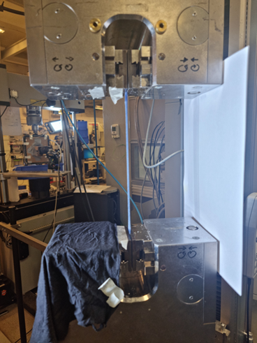{width="1.6936056430446194in" height="2.259739720034996in"} 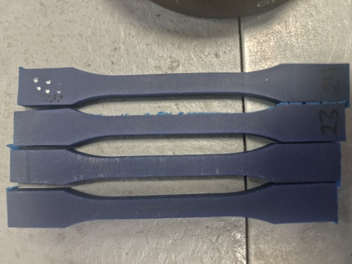{width="2.297302055993001in" height="1.7229768153980753in"} 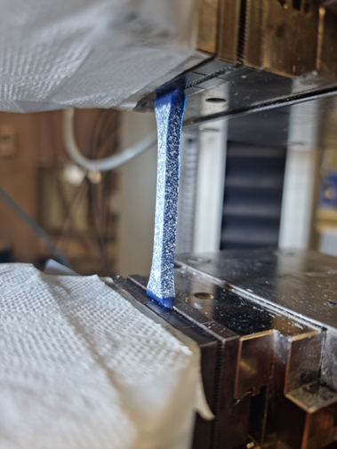{width="1.7207786526684163in" height="2.29248031496063in"}

[]{#_Ref170815862 .anchor}Figure 2: Illustration of the tensile test setup during a test (left), of the ISO527b specimens machined from the PU hinges (middle), and of the speckle pattern applied on the specimen (right), for DIC analyses.

The tensile tests were performed at strain rates 10^-3^, 10^-2^ and 10^-1^ s^-1^ to quantify the effect of the loading rate on the mechanical behaviour of the PU material constituting the hinges. An overview of the specimen's geometry used, and test conditions is given in [Table 2](#_Ref170895963). In the table, a~0~ is the original thickness, b~0~ the original width of an S~0~ the section (Thus the product of a~0~ and b~0~) of the gauge area of the specimens.

  -----------------------------------------------------------------------------
  Specimen ID       a~0~      b~0~       S~0~     Strain rate      Velocity
  --------------- --------- --------- ---------- ------------- ----------------
                     mm        mm        mm²         s^-1^           mm/s

  Rep1              4.333     5.01     21.70833      0.01         Dummy spec

  Rep2              4.33      5.193    22.48569      0.01            0.25

  Rep3              4.303     5.196    22.35839      0.01            0.25

  Rep4               4.2      5.13      21.546       0.01            0.25

  Rep5              4.336     5.16     22.37376       0.1            2.5

  Rep6              4.513     5.013    22.62367       0.1            2.5

  Rep7              4.21       5.2      21.892        0.1            2.5

  Rep8              4.413     5.226    23.06234      0.001          0.025
  -----------------------------------------------------------------------------

  : []{#_Ref170895963 .anchor}Table 2: ISO527b specimen dimensions and strain rates tested.

During the tests, the strain and displacements in the specimens were monitored using the DIC technique. To this end, a speckle pattern was painted on each of the specimens, and its evolution was followed by a Basler camera, see [Figure 2](#_Ref170815862). The acquisition system recorded images at a 2 Hz frequency with an average resolution of 900×2980. The acquisition system of the camera was synchronized with the tensile machine data acquisition system. All recorded images were post-processed using the eCorr software[^2]. The objective of the DIC is to provide full-field strain measurement during the test, using a digital grid, see [Figure 3](#_Ref170816332), left. To compare the results on the different specimens, the strain was calculated using the same virtual extensometers, that are defined along the full gauge length of the specimens (see [Figure 3](#_Ref170816332), right).

This enables to have access to local strain field measurements. Note that the curves presented in the results sections have been post-processed and retreated to account for the offsets that can occur during the initial positioning of the machine.

From the extensometer, the displacements, elongation and strain can be computed.

$$\frac{l - l_{0}}{l_{0}}$$

- [Elongation]{.underline}:

with *l~0~* the original length of the virtual extensometer and *l* the actual length of the extensometer.

$$\sigma = \frac{F}{A}$$

- [The true stress can also be defined as]{.underline}:

with *F the actual force and A the actual area, calculated using DIC virtual extensometers.*

$$\varepsilon_{l} = \ln\frac{l}{l_{0}}$$

- [The longitudinal true strain can also be computed and reads]{.underline}:

- [An extensometer parallel to the width direction was mounted onto the specimen to measure the width *w* thus allowing to compute the transversal strain, which reads]{.underline}:

$$\varepsilon_{t} = \ln\frac{w}{w_{0}}$$

- Finally the Poisson's ratio can be defined as: $\nu = - \frac{\varepsilon_{t}}{\varepsilon_{l}}$

These definitions will be used in the results representation later in the document.

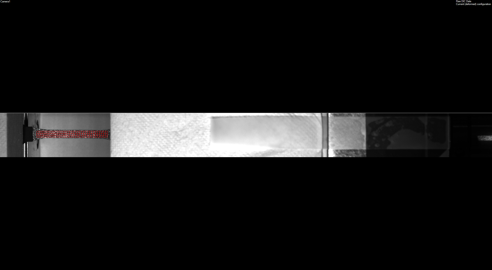{width="3.7578871391076114in" height="0.918225065616798in"} 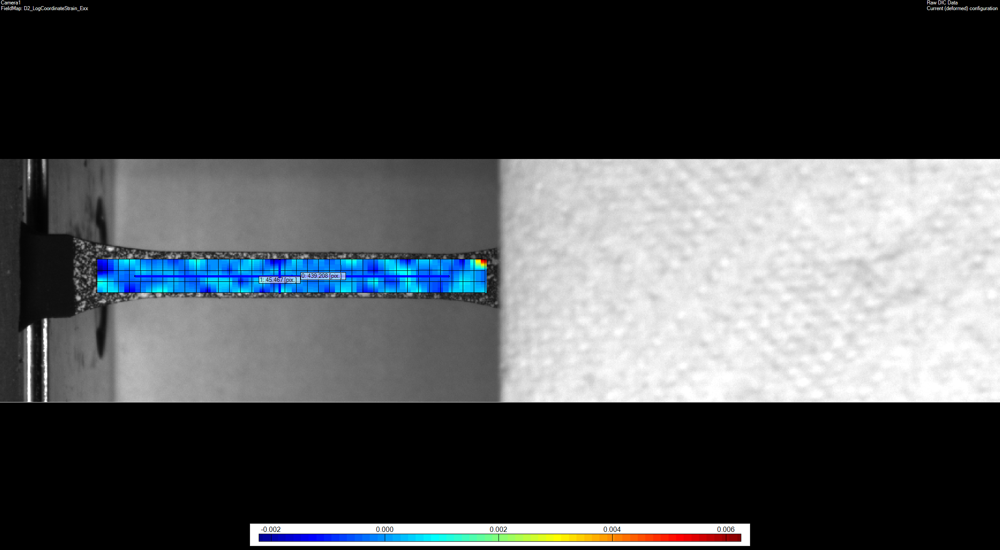{width="3.7464851268591426in" height="0.8858847331583553in"}

[]{#_Ref170816332 .anchor}Figure 3: Digital grid applied during post processing of the DIC results (left), and virtual extensometer (blue lines) used for the evaluation of strain and displacements during a test (right).

An illustration of the longitudinal strain field evolution during a tensile test of an ISO527b is given in [Figure 4](#_Ref170894591) for specimen r*ep2*. Clearly, the strain field remains very homogeneous during the tests, as depicted by the homogenous colour distribution in [Figure 4](#_Ref170894591) and no local necking or instabilities are observed in the specimens.

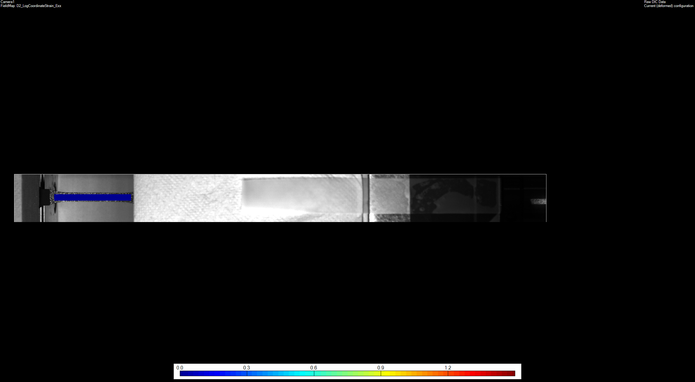{width="1.8383027121609798in" height="0.6295319335083115in"} a.

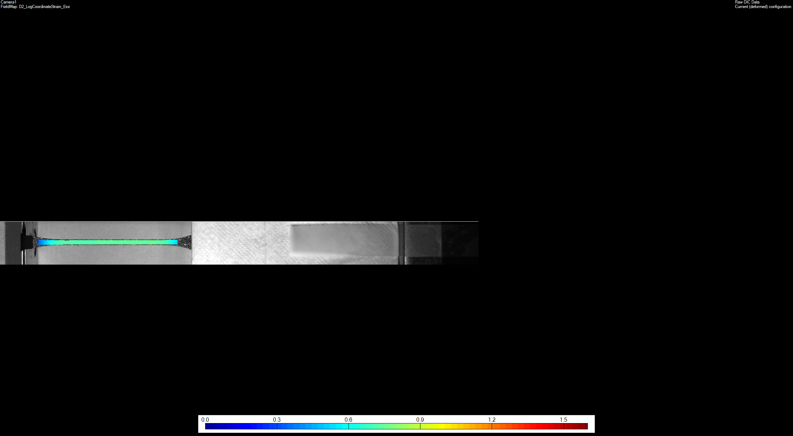{width="3.005656167979003in" height="0.7543143044619423in"} b.

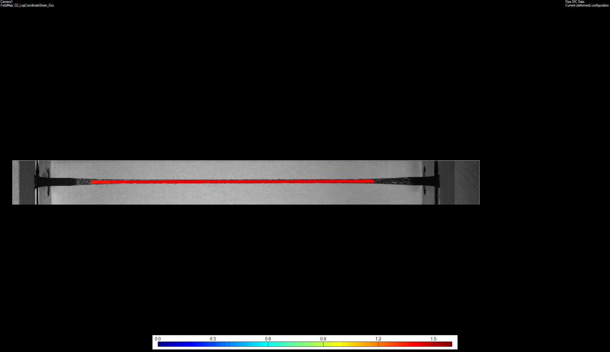{alt="A screen shot of a computer Description automatically generated" width="6.005780839895013in" height="0.6201279527559055in"}

[]{#_Ref170894591 .anchor}Figure 4: Strain field in the ISO527b specimen rep2 at different stages of the tensile tests: a. right at the beginning, b. in the middle of the tests, and c. right before failure.

c\.

### Iso527b tensile tests results 

The results of the tensile tests are given in [Figure 5](#_Ref170896434). The material exhibits typical elastomeric highly nonlinear behaviour, with a very high elongation (or strain to failure), around 300-350%, and a strong strain hardening behaviour until failure. This is even more visible on the stress vs strain curves depicted on the right side of [Figure 5](#_Ref170896434). Finally, the rate effects on this material are found to be minimal within the tested strain rate range, as the curves at different strain rates show very similar behaviour.

The apparent modulus, defined as $E = \frac{\sigma}{\varepsilon}$, evolves with deformation as depicted by the blue curves in [Figure 5](#_Ref170896434) (right), and on the left picture in [Figure 6](#_Ref170898201), from around 20 to 70 MPa: it first increases until a strain of about 0.05, then decreases to reach a plateau until a strain of about 0.7 and increases again until final failure.

{width="3.15291447944007in" height="2.057804024496938in"} {width="3.0706102362204724in" height="2.0057797462817146in"}

[]{#_Ref170896434 .anchor}Figure 5: Tensile tests curves of the ISO527b specimens for different strain rates, in force-elongation (left) and in true stress vs true strain (left) plots. The graph on the right also depicts the apparent elastic modulus evolution for a few repetitions during the tests, in blue.

[Figure 6](#_Ref170898201), right, depicts the Poisson ratio evolution during the tests. It appears to be very constant throughout the tests, with a plateau at a value of around 0.5. This indicates that the material is incompressible, which is once again a typical behaviour for an elastomer material.

{width="3.1387292213473317in" height="2.0502766841644795in"}{width="3.0751443569553807in" height="2.008741251093613in"}

[]{#_Ref170898201 .anchor}Figure 6: Focus on the small strain domain of the stress vs strain curves in tension (left), and Poisson ratio evolution during the tests (right).

Finally, [Table 3](#_Ref170898683) gives a summary of the most interesting different results obtained during the tests. The average elastic modulus at 5% deformation is 41.3MPa, with a low standard deviation of 1.9 MPa, and an ultimate strength of 75.45 MPa, which is high for an elastomer. The strain to failure, or elongation to failure are very high, with an average of 1.36 strain, or 297% elongation, at break, although with a relatively high dispersion (0.11 strain or 41% elongation), probably due to some default triggered during the machining of the hinges. It can however be noticed that the minimum is still 1.18 breaking strain or 226% breaking elongation which still remains very high.

  ------------------------------------------------------------------------------------------------------------------------
     ID      E at 5% (MPa)   Force at break (N)   elongation at break   true strain at break   true stress at break (MPa)
  --------- --------------- -------------------- --------------------- ---------------------- ----------------------------
    Rep2         43.91             465.00                3.15                   1.42                     81.30

    Rep3         39.60             519.00                3.23                   1.44                     100.90

    Rep4         41.31             427.00                3.12                   1.42                     82.80

    Rep5         37.81             531.00                3.34                   1.47                     104.60

    Rep6         42.62             251.00                2.26                   1.18                     36.43

    Rep7         42.52             269.00                2.41                   1.23                     41.40

    Rep8         41.54             440.00                3.26                   1,44                     80.70

    mean       **41.33**         **414.57**            **2.97**               **1.36**                 **75.45**

   std dev       1.90              104.03                0.41                   0.11                     24.77

     min         37.81             251.00                2.26                   1.18                     36.43

     max         43.91             531.00                3.34                   1.47                     104.60
  ------------------------------------------------------------------------------------------------------------------------

  : []{#_Ref170898683 .anchor}Table 3: Summary of the different results obtained during the tensile tests of the ISO527b PU specimens.

## Tensile tests on the PU hinges

### Experimental setup

In this section the testing of the PU hinges components is described and discussed. The hinges were first tested in tension at a velocity of 1.44 mm.s^-1^. An Instron machine with a 250 kN capacity was used to perform the tensile tests on the PU hinges, see [Figure 7](#_Ref170981567) (left).

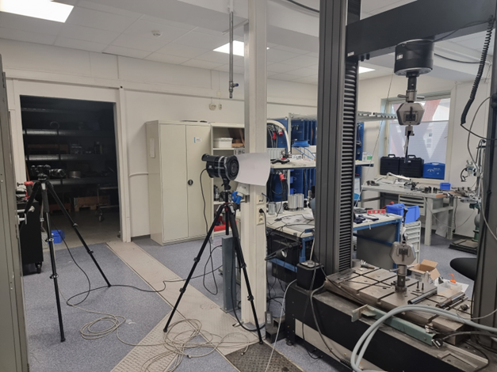{width="2.297782152230971in" height="2.4956528871391077in"} 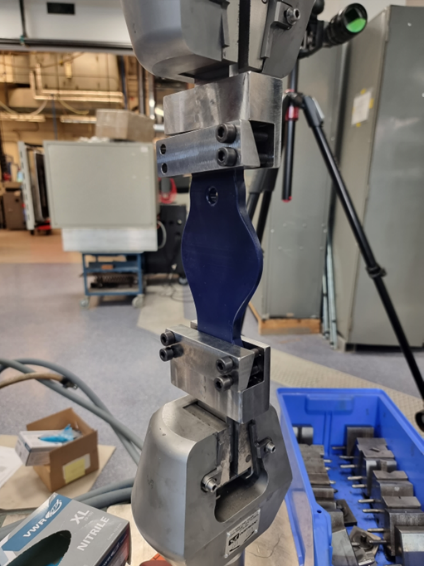{width="1.8763451443569554in" height="2.504348206474191in"} 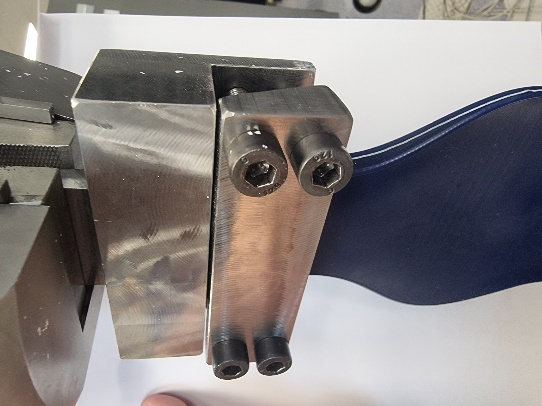{width="2.4531485126859143in" height="1.8401323272090988in"}

[]{#_Ref170981567 .anchor}Figure 7: Experimental setup (left), focus on the specimen (middle) and clamping device used to clamp the hinges in the machine (right).

Given the special geometry of the hinges, whose thickness and width vary at the extremities, it was necessary to machine a special clamping device in order to set the specimens into the Instron machine; the device is shown in [Figure 7](#_Ref170981567) (right).

In addition, and similarly to the tension tests performed on the ISO527b specimens, a DIC setup was used to record the strain field and displacements during the tests. The description of the DIC setup is given in section [2.2.1](#test-setup).

### Results

[Figure 8](#_Ref170983095) shows the evolution of the strain field during the tensile tests of the hinges. The strain field is not homogeneous during the deformation of the specimens due to their shape. The specimens deform significantly before failure, as expected due to the elastomeric behaviour of the PU materials used. The failure always occurs at the same locations in the specimens, i.e., at the section with the smallest width, where the stress concentrations are likely to occur, as expected.

![[]{#_Ref170983095 .anchor}Figure 8: Longitudinal strain field evolution at different stages of the tensile tests, and failure facies of the specimens after the tests.](../images/2024-09-12_surewave_d6.1_ultimate_strength_capacity/image28.png)

[Figure 9](#_Ref170984203) depicts the force vs displacement and force vs elongation curves obtained from tensile tests on the PU hinges. Overall, all the hinges exhibit the same behaviour: a nonlinear shape with a first steep slope until around 7 mm displacement (5% elongation) corresponding to a force of around 1 KN. Then a transition phase occurs between 5% and 100% elongation and finally the force continues to increase but at much smaller rate until failure occurs. There is very low dispersion between the curves in the first part of the curves, but it tends to increase at the end of the tests.

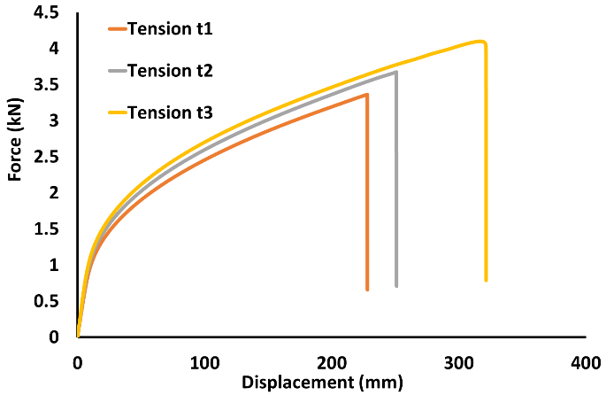{width="3.095652887139108in" height="2.0163451443569556in"}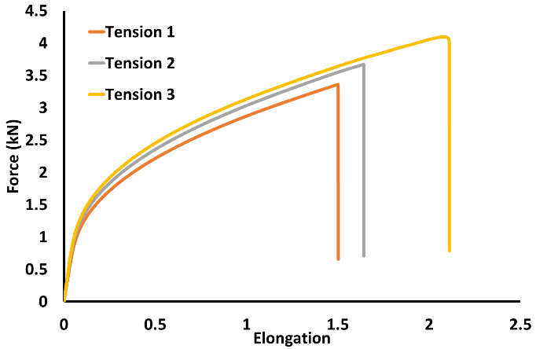{width="3.083908573928259in" height="2.008695319335083in"}

[]{#_Ref170984203 .anchor}Figure 9: Force displacement (left) and Force-elongation (right) curves of the PU hinges in tension.

[Table 4](#_Ref170985059) provides the metrics from the tensile tests performed. An average maximum force of 3.69 kN is calculated, but with a high dispersion of 0.36 kN. However, the minimum force is 3.36 kN. Fracture elongation is high with an elongation of 174%.

  -------------------------------------------------------------------------------------
                   Ultimate strength (KN)   Displ. at break (mm)   Elongation at break
  --------------- ------------------------ ---------------------- ---------------------
       Ten1                 3.36                   227.00                 1.49

       Ten2                 3.64                   250.90                 1.64

       Ten3                 4.08                   320.00                 2.09

       Mean               **3.69**               **265.97**             **1.74**

      std dev               0.36                   48.30                  0.31
  -------------------------------------------------------------------------------------

  : []{#_Ref170985059 .anchor}Table 4: Summary of the tensile tests (ultimate strength, displacement at break, elongation at break).

[Figure 10](#_Ref170986862) represents the stiffness evolution during the tensile tests of the hinges. The stiffness is defined as the force divided by the displacement, i.e. $F \slash u$ . This is an important parameter that is used as input for modelling the hinges in the analyses performed in WP5. Clearly, the stiffness curves exhibit three regimes, which reflect the three regimes shown in [Figure 9](#_Ref170984203). The first regime is at the beginning of the curves, until 5% elongation (or 7mm displacement) where the stiffness drops quickly, then a transition regime between 5% and 100% and finally the third regime with a much gentle stiffness decrease until final break.

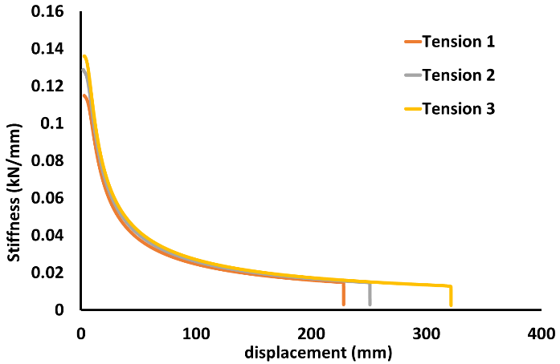{width="3.150942694663167in" height="2.052356736657918in"}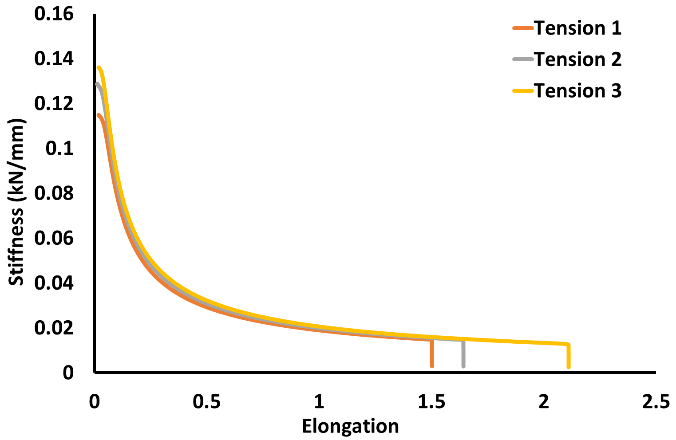{width="3.047169728783902in" height="1.9847659667541557in"}

[]{#_Ref170986862 .anchor}Figure 10: Stiffness evolution during the tensile tests of the hinges. (left) stiffness vs displacement and (right) stiffness vs elongation.

[Table 5](#_Ref170989647) summarizes the stiffness values calculated for the different tests and at different elongation levels. The deviation is very low, indicating that the stiffness values are very repeatable across tests, especially at low elongation. The value is also low, approximately 0.11 kN/mm, which is also expected due to the PU material used.

+---------+--------------+---------------+---------------+--------------------+
|         | Stiffness    | Stiffness     | Stiffness     | Stiffness          |
|         |              |               |               |                    |
|         | 5% elong     | 10% elong     | 50% elong     | 100% elong (kN/mm) |
|         |              |               |               |                    |
|         | (kN/mm)      | (kN/mm)       | (kN/mm)       |                    |
+:=======:+:============:+:=============:+:=============:+:==================:+
| Ten1    | 0.1063       | 0.0790        | 0.0292        | 0.0189             |
+---------+--------------+---------------+---------------+--------------------+
| Ten2    | 0.1156       | 0.0843        | 0.0308        | 0.0199             |
+---------+--------------+---------------+---------------+--------------------+
| Ten3    | 0.1224       | 0.0886        | 0.0322        | 0.0206             |
+---------+--------------+---------------+---------------+--------------------+
| Mean    | **0.1148**   | **0.0839**    | **0.0307**    | **0.0198**         |
+---------+--------------+---------------+---------------+--------------------+
| std dev | 0.0081       | 0.0048        | 0.0015        | 0.0008             |
+---------+--------------+---------------+---------------+--------------------+

: []{#_Ref170989647 .anchor}Table 5: Summary of the stiffness measurements at different elongations during tensile tests for the different hinges.

## Compression tests on the PU hinges

### Compression tests setup

This section introduces the compression tests performed on the hinges. A similar setup as the one used for the tension was employed for the compression tests, with the use of an Instron machine with a 250 kN capacity. The machine and the clamping system are shown in [Figure 7](#_Ref170981567) in section [2.3.1](#experimental-setup), and in [Figure 11](#_Ref170994192). Displacement was recorded from the machine during the compression tests. The displacement rate was 15 mm/min (0.25 mm/s).

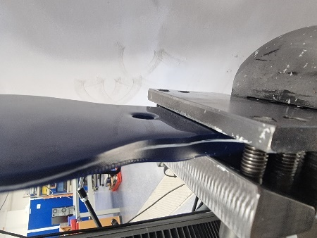{width="2.0243307086614175in" height="1.5184711286089239in"} 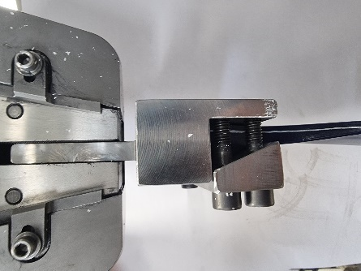{width="2.0066732283464566in" height="1.505226377952756in"} 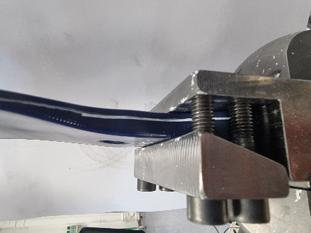{width="1.9824420384951882in" height="1.486496062992126in"}

[]{#_Ref170994192 .anchor}Figure 11: Details of the clamping system used for the hinges tests.

### Compression results

The force vs displacement curves in compression are given in [Figure 12](#_Ref171070506), and are compared to the force displacement curves obtained in tension. It is clearly visible that the compression strength is much lower than the values obtained in tension. This is because the specimen buckles very early in compression, after about 2 mm displacement, see [Figure 12](#_Ref171070506) (middle), which leads to a complete loss of structural properties. The buckling pattern is illustrated in [Figure 12](#_Ref171070506) (right).

![[]{#_Ref171070506 .anchor}Figure 12: Force vs displacement curves in compression (middle), picture of specimen buckling (right) and comparison with tensile tests results.](../images/2024-09-12_surewave_d6.1_ultimate_strength_capacity/image47.png)

The evolution of the stiffness in compression is given in [Figure 13](#_Ref171070741). The initial stiffness is around 0.12 kN.mm^-1^, which is very comparable to the values obtained in tension (0.1148 kN.mm^-1^). The stiffness progressively decreases during the test down to 0.02 kN.mm^-1^, due to the early loss of structural properties of the buckled hinges.

![[]{#_Ref171070741 .anchor}Figure 13: Evolution of the stiffness during the compression tests of the hinges.](../images/2024-09-12_surewave_d6.1_ultimate_strength_capacity/image42.png){width="3.443477690288714in" height="2.240544619422572in"}

Finally, [Table 6](#_Ref171071107) summarizes the results obtained in compression. The average value of the maximum force is 0.171 kN.mm^-1^, while stiffness at 1% and 4% elongation is 0.08 and 0.029 kN.mm^-1^, respectively. The dispersion of the results is limited, and good repeatability of the tests is observed.

  ------------------------------------------------------------------------------------------------------------
   compression   Max force (kN)   Max displ (mm)   Max elongation   Stiff at 1% (kN/mm)   Stiff at 4% (kN/mm)
  ------------- ---------------- ---------------- ---------------- --------------------- ---------------------
       C1            0.157            7.103            0.049               0.075                 0.027

       C2            0.188            7.516            0.052               0.085                 0.032

       C3            0.169            7.362            0.051               0.079                 0.029

      Mean           0.171            7.327            0.051               0.080                 0.029

     std dev         0.016            0.209            0.001               0.005                 0.002
  ------------------------------------------------------------------------------------------------------------

  : []{#_Ref171071107 .anchor}Table 6 . Summary results of the compression tests

## Shear tests on the PU hinges

### Shear tests setup

The setup used for the shear tests is depicted in [Figure 14](#_Ref171072279). A special clamping device was machined in order to prevent any displacement of the hinge\'s extremities during shear motion. An Instron machine with a 250 kN capacity was used for the tests. The shear rate was 30 mm/min, which is comparable to the deformation rate in compression, to reach an approximate nominal shear strain rate of 10^-3^ s^-1^ at the centre of the specimen. The shear test was monitored with a camera and a speckle pattern was painted onto the specimens to allow DIC strain measurements.

![[]{#_Ref171072279 .anchor}Figure 14: Illustration of the shear test setup.](../images/2024-09-12_surewave_d6.1_ultimate_strength_capacity/image46.jpeg)

### Shear tests results

The evolution of the shear strain during the test is illustrated in [Figure 15](#_Ref171073913). At the beginning of the tests, only shear strain is triggered in the specimens, but as the test progresses, the specimens rotate and a combination of shear strain and tensile strain is present, specifically in the area close to the grips.

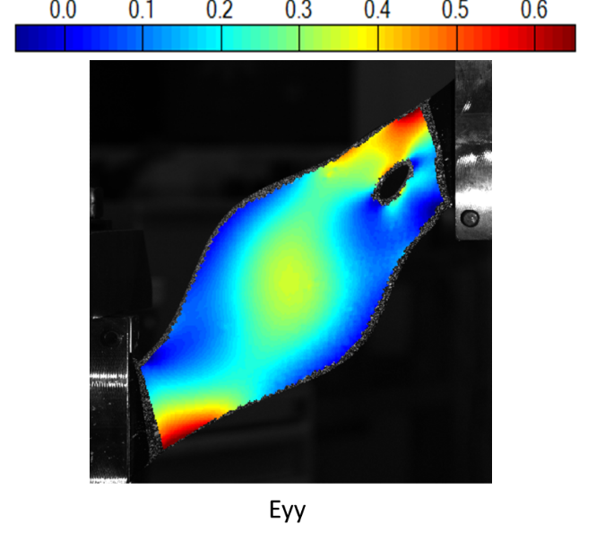{width="2.991304680664917in" height="2.7156277340332458in"}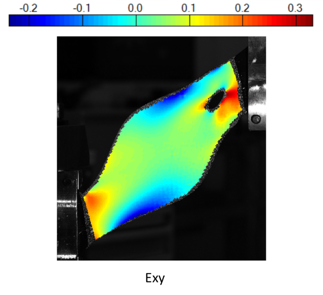{width="2.991304680664917in" height="2.7291535433070866in"}

[]{#_Ref171073913 .anchor}Figure 15: Longitudinal and shear strain field evolution during the S1 shear test.

The force vs displacement curves during the shear test are represented in [Figure 16](#_Ref171074216). The evolution is linear for the range investigated. Note that the tests were stopped before reaching failure in the specimens. The linear evolution is also confirmed by the evolution of the stiffness, which is almost like a plateau throughout the tests, at around 0.01 kN/mm.

![[]{#_Ref171074216 .anchor}Figure 16: Force displacement curves during the shear tests, and shear stiffness evolution.](../images/2024-09-12_surewave_d6.1_ultimate_strength_capacity/image52.png){width="5.6948053368328955in" height="3.7067618110236222in"}

The stiffness evolution during the shear tests is given in [Table 7](#_Ref171074694). The mean stiffness is 0.00894 kN/mm, which is much lower than the one obtained in tension and compression. Also, the deviation is very low, which shows a good repeatability of the tests conducted.

  ---------------------------------------
     shear     Average stiffness (kN/mm)
  ----------- ---------------------------
      S1                0.00857

      S2                0.00954

      S3                0.00869

     mean               0.00894

      dev               0.00053
  ---------------------------------------

  : []{#_Ref171074694 .anchor}Table 7: Stiffness evolution during the shear tests.

## Torsion tests on the PU hinge

### Torsion test setup

The torsion tests were carried out using an INSTRON biaxial test machine. The machine is limited to an angle of 150 degrees in torsion, which is more than enough for the tests, as it is not expected to get so high in real conditions. During the tests, the displacements of the torsion planes were prescribed in the axial direction, which triggers tensile axial force during the tests. An illustration of the torsion tests is given in [Figure 17](#_Ref171328067). The grips used to clamp the specimens in the machine are the same as the ones used in tension and compression, see [Figure 11](#_Ref170994192). The torsion rate during the tests was 50 deg/min.

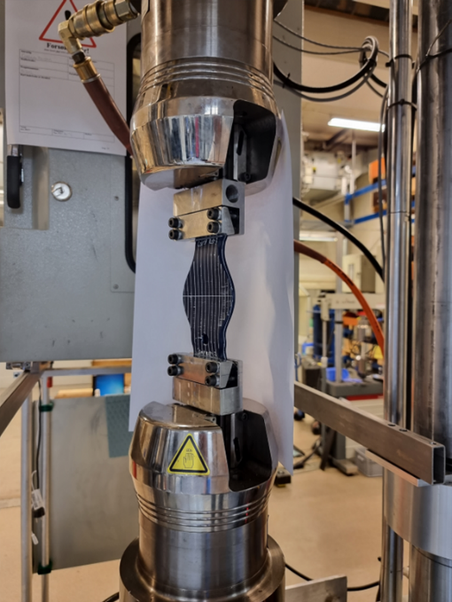{width="2.306563867016623in" height="3.071428258967629in"} 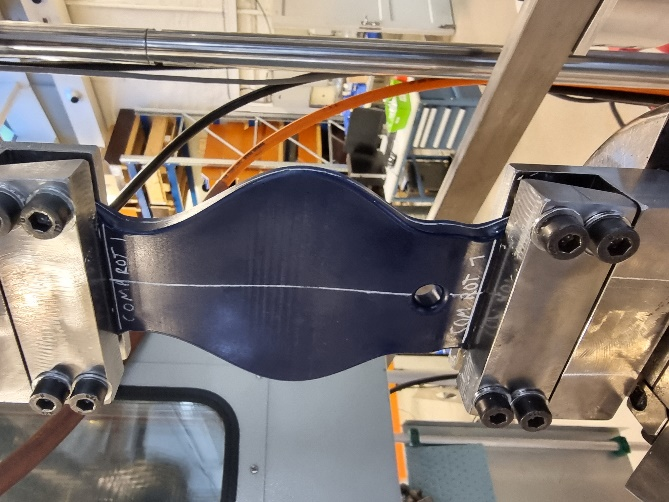{width="3.0388888888888888in" height="2.279166666666667in"}

[]{#_Ref171328067 .anchor}Figure 17: Torsion test setup.

### Torsion tests results

[Figure 18](#_Ref171328705) illustrates the evolution of the torque and axial force during the torsion tests of the hinges. The response is almost linear in the range of angles considered (from 0 to 150 degrees). No failure was observed during the tests, which indicates that the material has high deformability also in torsion.

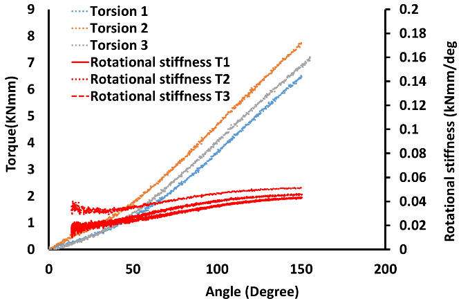{width="3.0107425634295715in" height="1.9610389326334208in"}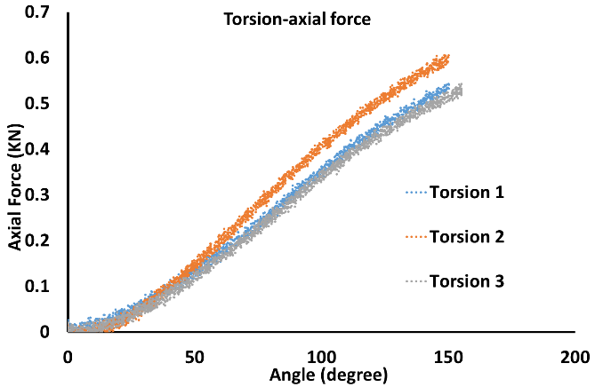{width="2.9956944444444447in" height="1.9499037620297464in"}

[]{#_Ref171328705 .anchor}Figure 18: Evolution of the torque and rotational stiffness (left) and Axial force (right).

The torque and rotational stiffness for two angles, 50 and 150 degrees, are given in [Table 8](#_Ref171329806) for the three hinges tested. The average rotational stiffness at 50 and 150 degrees is 0.029 kN.mm/deg and 0.047 kN.mm/deg, respectively, which is low, while the average torque at the same angles is 1.437 and 6.994 kN.mm, respectively. The dispersion of the tests is low as indicated by the low standard deviation.

+----------+--------------------------------+--------------------------------+
| Torsion  | Stiffness (kN.mm/deg)          | Torque (kN.mm)                 |
+:========:+:=============:+:==============:+:=============:+:==============:+
|          | **At 50 deg** | **At 150 deg** | **At 50 deg** | **At 150 deg** |
+----------+---------------+----------------+---------------+----------------+
| T1       | 0.024         | 0.043          | 1.210         | 6.437          |
+----------+---------------+----------------+---------------+----------------+
| T2       | 0.036         | 0.051          | 1.783         | 7.635          |
+----------+---------------+----------------+---------------+----------------+
| T3       | 0.026         | 0.046          | 1.319         | 6.911          |
+----------+---------------+----------------+---------------+----------------+
| mean     | 0.029         | 0.047          | 1.437         | 6.994          |
+----------+---------------+----------------+---------------+----------------+
| std dev  | 0.006         | 0.004          | 0.304         | 0.604          |
+----------+---------------+----------------+---------------+----------------+

: []{#_Ref171329806 .anchor}Table 8: Summary of the Stiffness and Torque measured at different angles.

# Ultimate strength of steel ropes used to connect the breakwaters

## Experimental setup

The steel wires tested in that section are used to connect two breakwaters. There are 8 steel wires per breakwater side, as depicted in [Figure 19](#_Ref171416360) below. Rubber pads are also placed between the breakwater to maintain the distance and avoid any collisions. The rubber tabs are not at risk of failure; thus the following section focuses on checking the strength of the steel wires.

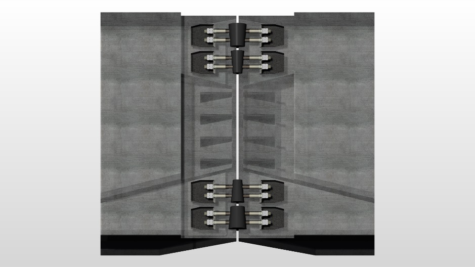{width="2.468918416447944in" height="2.2916666666666665in"} 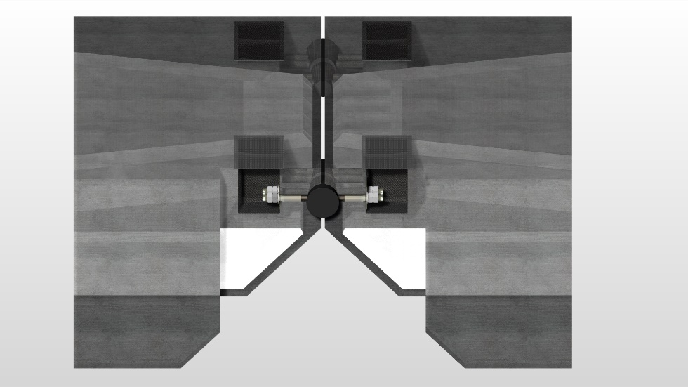{width="3.326388888888889in" height="2.300589457567804in"}

[]{#_Ref171416360 .anchor}Figure 19 : Illustration of the steel wire connections used to connect two breakwaters

The wires are supposed to have a high strength. Thus, a special setup and machine were used to avoid any risk impeded to testing. A picture of the 5 steel wires tested is given in [Figure 20](#_Ref171417829). The steel wire consists of a main steel rope made of 6 twins intertwined together. On Each extremity, a special system made of bolts and inserts is used to fasten it to the breakwaters.

![[]{#_Ref171417829 .anchor}Figure 20 : Picture of the 5 steel wires tested](../images/2024-09-12_surewave_d6.1_ultimate_strength_capacity/image59.png){alt="A group of metal cables and nuts on a wooden pallet Description automatically generated" width="5.780555555555556in" height="1.5833333333333333in"}

During the tests, the full system was tested. A summary of the main dimensions of the steel wires is given in [Table 9](#_Ref171418035).

+-------------------+---------------+---------------+-------------+-------------+-----------------+
| Specimen ID       | D 1 (mm)      | D 2 (mm)      | D 3 (mm)    | Length (mm) | section (mm^2^) |
+:=================:+:=============:+:=============:+:===========:+:===========:+:===============:+
| Wire-1            | 27.4          | 27.58         | 26.95       | 441.00      | 585.48          |
+-------------------+---------------+---------------+-------------+-------------+-----------------+
| Wire-2            | 27.45         | 27.32         | 27.26       | 443.00      | 586.91          |
+-------------------+---------------+---------------+-------------+-------------+-----------------+
| Wire-3            | 27.84         | 27.39         | 27.20       | 452.00      | 592.65          |
+-------------------+---------------+---------------+-------------+-------------+-----------------+
| Wire-4            | 27.32         | 27.32         | 27.58       | 451.00      | 589.63          |
+-------------------+---------------+---------------+-------------+-------------+-----------------+
| Wire-5            | 27.10         | 27.35         | 26.98       | 455.00      | 578.36          |
+-------------------+---------------+---------------+-------------+-------------+-----------------+
|                                                   | **mean**    | 448.4       | 586.9           |
|                                                   +-------------+-------------+-----------------+
|                                                   | **std dev** | 5.4         | 4.8             |
+---------------------------------------------------+-------------+-------------+-----------------+

: []{#_Ref171418035 .anchor}Table 9: Dimensions of the steel wires tested.

The wires were tested at a static speed of 2mm/min to avoid any risks related to the dynamic failure of the wires. An INSTRON servo-hydraulic machine with 500kN capacity was used to test. A special setup was designed to clamp the wires to the top grip of the machine, see [Figure 21](#_Ref171418600) (Left). It consists of two steel plates, connected to the machine, where an insert was machined to fit one of the wire extremities see [Figure 21](#_Ref171418600) (Middle). On the other side, the bolt was removed, and the wire was directly clamped into the machine fixture, see [Figure 21](#_Ref171418600) (Right).

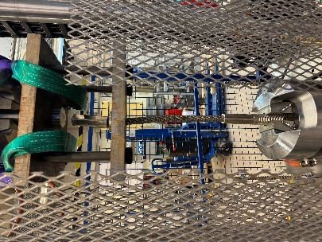{width="1.8258048993875766in" height="1.3693536745406825in"} 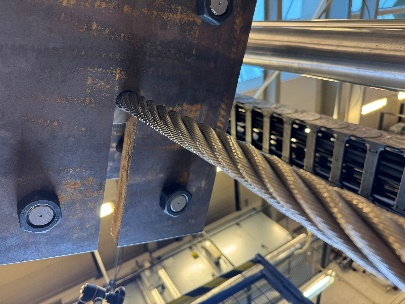{width="1.8341185476815398in" height="1.375589457567804in"}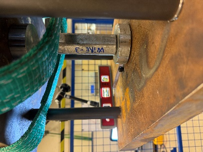{width="1.8239435695538058in" height="1.3679571303587053in"} 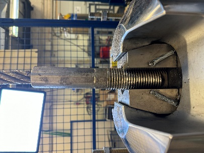{width="1.8316305774278214in" height="1.3737226596675416in"}

[]{#_Ref171418600 .anchor}Figure 21 : Picture of the experimental setup used for testing, with security grids positioned around the machine. Left, full setup, with wire clamped in the machine. Middle, zoom on the upper fixation, where the wire is inserted in a particular clamping device. Right, bottom extremity, clamped in the servo-hydraulic fixture of the machine.

## Results

[Figure 22](#_Ref171426055) shows the force-displacement results for the different steel wires tested. The behaviour is the same for all wires tested, a first stiff increase, from 0 to 8 mm displacement, then a more pronounced one until failure. It can be noticed that between 8 and 30 mm, there are some frequent drops on the force-displacement curves, which is due to the release of torsional forces present in the wires and twisting of the wires during the tests. The twisting of the wires during the tests is illustrated in [Figure 23](#_Ref171426298) for the case of Wire 3. This effect however doesn't influence the ultimate strength measured during the tests, which is the main purpose of this campaign.

![[]{#_Ref171426055 .anchor}Figure 22 : Force-displacement response of the wires during tensile tests.](../images/2024-09-12_surewave_d6.1_ultimate_strength_capacity/image64.emf){width="4.143564085739283in" height="2.698888888888889in"}

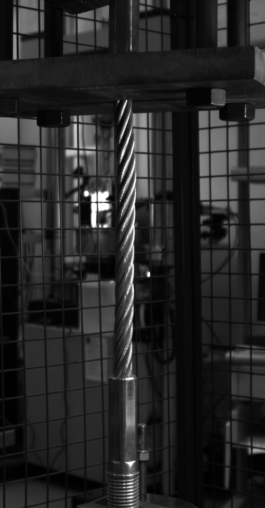{width="1.1929647856517935in" height="2.2857141294838144in"} 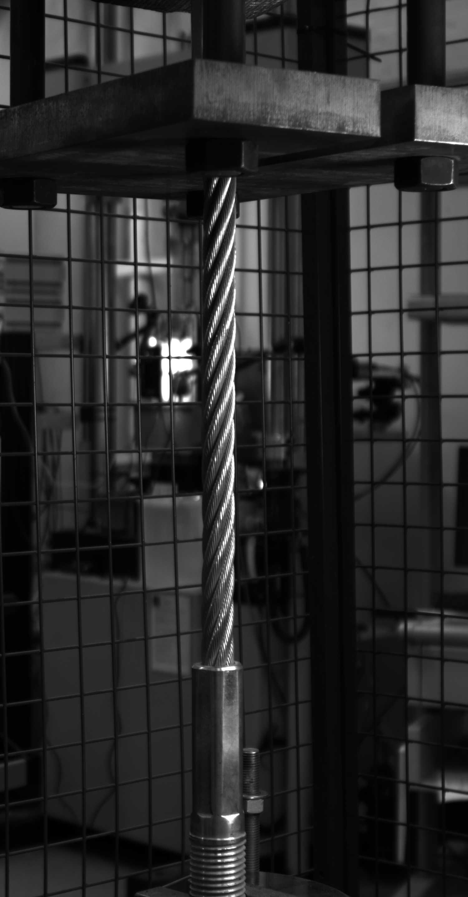{width="1.1895756780402449in" height="2.279220253718285in"} 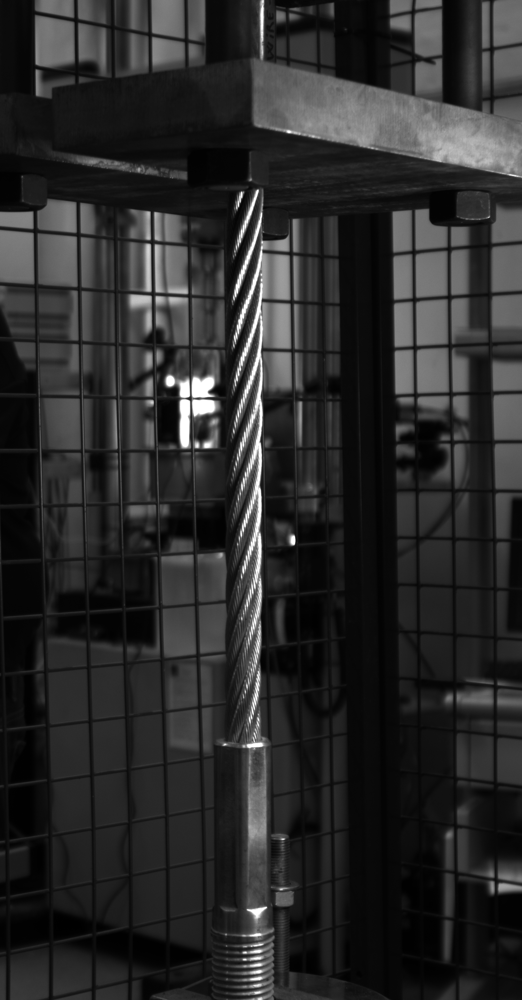{width="1.1895778652668416in" height="2.279220253718285in"} 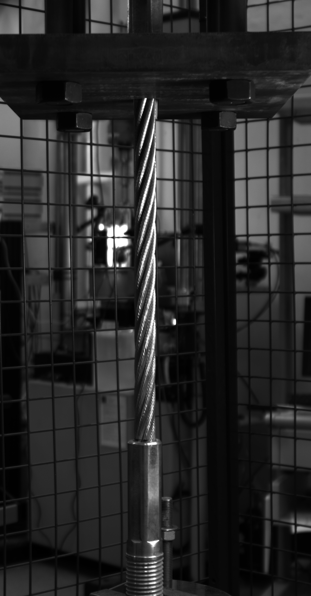{width="1.192965879265092in" height="2.2857141294838144in"} 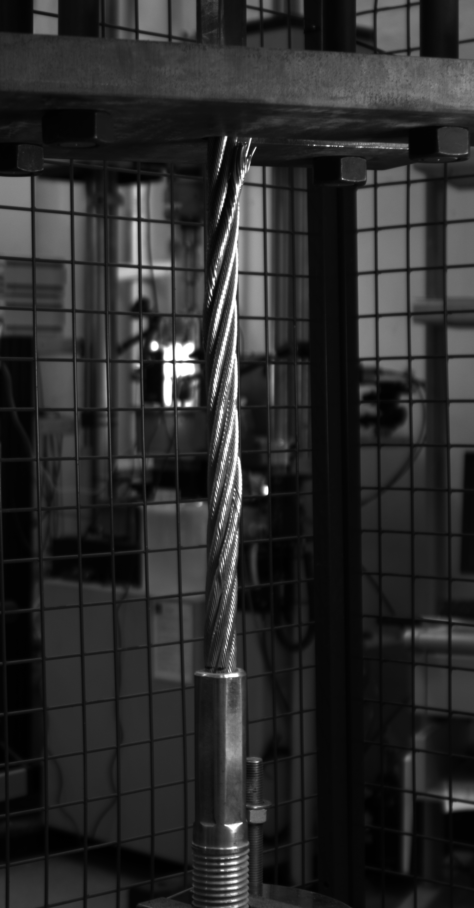{width="1.194805336832896in" height="2.2892377515310587in"}

[]{#_Ref171426298 .anchor}Figure 23 : Illustration of the rope twisting during the Wire3 test, at different displacements: 0,7,11,24,33mm.

Two failure mechanisms are observed during the tests. Either a loss of the wire in the fixation socket (Wire 1,2,4,5) or a failure in the middle of the wire itself (Wire 3). These failure modes are illustrated in [Figure 24](#_Ref171426621).

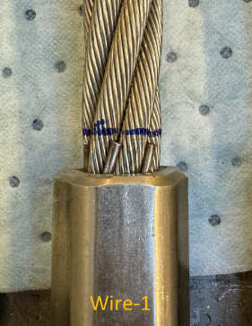{width="0.9446544181977253in" height="1.6386132983377077in"} 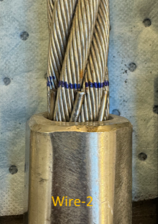{width="1.0119346019247595in" height="1.6485148731408574in"} 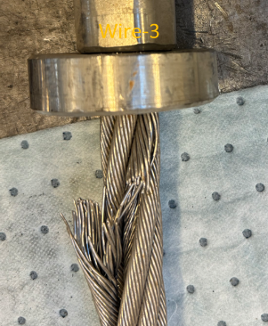{width="1.0128740157480316in" height="1.6435640857392826in"} 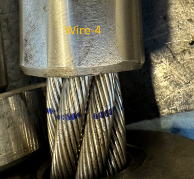{width="1.2568646106736658in" height="1.6485148731408574in"} 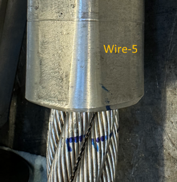{width="1.173267716535433in" height="1.649242125984252in"}

[]{#_Ref171426621 .anchor}Figure 24: Failure modes of the different wires tested.

Finally, [Table 10](#_Ref171500106) summarizes the results obtained for each wire. An average value of 402 kN is calculated which is slightly lower than the rated capacity of 450 kN. The stress at break is 686 MPa, which seems reasonable for a steel wire, and an Elongation at break of 7%.

+---------+------------------------+-----------------------+----------------------------+-------------------------+-------------------------+----------------------------+------------------------------+
|         | Ultimate strength (kN) | Stress at break (Mpa) | Displacement at break (mm) | Elongation at break (%) | Stiffness at 6.5mm disp | Stiffness at break (kN/mm) | Main failure mode            |
|         |                        |                       |                            |                         |                         |                            |                              |
|         |                        |                       |                            |                         | (kN/mm)                 |                            |                              |
+=========+:======================:+:=====================:+:==========================:+:=======================:+:=======================:+:==========================:+:============================:+
| W1      | 414.6                  | 707.5                 | 21.9                       | 4.9                     | 29.4                    | 18.9                       | Loosened in the lower socket |
+---------+------------------------+-----------------------+----------------------------+-------------------------+-------------------------+----------------------------+------------------------------+
| W2      | 402.6                  | 687.1                 | 35.9                       | 8.0                     | 23.7                    | 11.2                       | Loosened in the lower socket |
+---------+------------------------+-----------------------+----------------------------+-------------------------+-------------------------+----------------------------+------------------------------+
| W3      | 409.2                  | 698.3                 | 32.5                       | 7.2                     | 23.5                    | 12.6                       | Fracture on the Wire         |
+---------+------------------------+-----------------------+----------------------------+-------------------------+-------------------------+----------------------------+------------------------------+
| W4      | 415.4                  | 708.9                 | 38.3                       | 8.5                     | 23.4                    | 10.8                       | Loosened in the upper socket |
+---------+------------------------+-----------------------+----------------------------+-------------------------+-------------------------+----------------------------+------------------------------+
| W5      | 368.1                  | 628.1                 | 32                         | 7.1                     | 21.8                    | 11.5                       | Loosened in the upper socket |
+---------+------------------------+-----------------------+----------------------------+-------------------------+-------------------------+----------------------------+------------------------------+
| mean    | **402.0**              | **686.0**             | **32.1**                   | **7.2**                 | **24.4**                | **13.0**                   |                              |
+---------+------------------------+-----------------------+----------------------------+-------------------------+-------------------------+----------------------------+------------------------------+
| std dev | **16.0**               | **27.3**              | **5.1**                    | **1.1**                 | **2.4**                 | **2.8**                    |                              |
+---------+------------------------+-----------------------+----------------------------+-------------------------+-------------------------+----------------------------+------------------------------+

: []{#_Ref171500106 .anchor}Table 10: Summary of the tensile tests on steel wire connections.

# The ultimate strength of connections between breakwater-solar modules

## Experimental setup

The third component assessed in Task 6.2 is a tailored designed system whose role is to connect the outer barrier of breakwaters to the solar panel modules. An illustration of the connection system is given in [Figure 25](#_Ref176770038)

![[]{#_Ref176770038 .anchor}](../images/2024-09-12_surewave_d6.1_ultimate_strength_capacity/image75.png){width="6.289919072615923in" height="2.443038057742782in"}

Figure 25 : Representation of the connection system between the breakwaters and modules.

The connection system consists of a polymer pipe placed between the breakwaters and the modules. Some brackets are placed along the pipe, which serves as connection points for mooring lines that go from the pipe to the breakwaters, or from the pipe to the modules, see [Figure 25](#_Ref176770038). The geometries and capacities of each component defining the connection are given in D3.3[^3]. The connection system tested in the laboratory is a portion of the full system and consists of an HDPE pipe of 225mm diameter and thickness of 20.5 mm obtained from Freberg[^4], a polyester mooring line of 18mm diameter obtained from Biltema [^5] and a steel bracket designed by SunLit Sea. A picture of each of these elements is given in [Figure 26](#_Ref176772272).

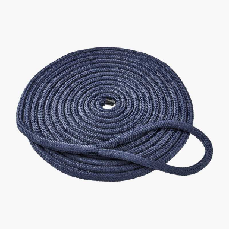{width="1.5838156167979003in" height="1.1759984689413823in"} 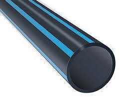{width="1.6416185476815397in" height="1.229628171478565in"} 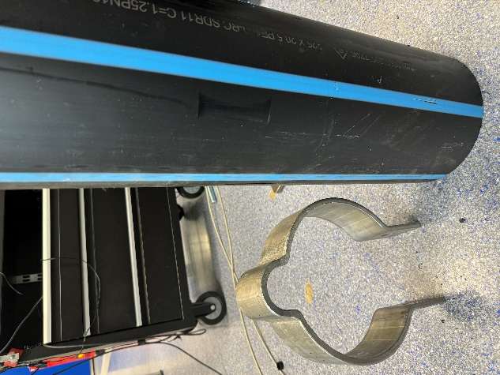{width="1.2385892388451443in" height="1.0235772090988626in"}

[]{#_Ref176772272 .anchor}Figure 26 : Illustration of each component of the connection systems: Polyester rope (left), HDPE pipe (Center) and steel bracket (Right).

The full connection system tested is given in [Figure 27](#_Ref176771035). The connection is fixed to the bottom of the tensile machine using a tailor-made clamping system to maintain the extremities of the pipe. The distance between the two clamps is 50 cm. The mooring line is attached to the machine traverse, using another tailor-made system, allowing some rotation during testing. A speed of 50mm/min was used. The displacements during the tests were monitored using the machine traverse. To avoid early wear at the interface between the bracket and the mooring line, a soft insert was positioned (Circled red) from test 4 to test 6, as highlighted by the red circle in [Figure 27](#_Ref176771035).

![[]{#_Ref176771035 .anchor}Figure 27 : Illustration of the experimental setup used to test the connection](../images/2024-09-12_surewave_d6.1_ultimate_strength_capacity/image79.jpeg){alt="A close-up of a machine Description automatically generated" width="3.8652777777777776in" height="2.8989588801399826in"}

## Results

The results from the tests are given in [Figure 28](#_Ref177044624) below. Six tests were conducted during the campaign; however, connection 3 failed prematurely due to early wear and is excluded from the statistics presented below. The displacement at failure is relatively large, approximately 400 mm, primarily due to the deformation of the rope, as the pipe and brackets are much stiffer. The initial sections of the curves, up to 50-80 mm, are quite flat, reflecting the tensioning of the assembly. Beyond this point, a linear increase is observed until failure, which occurs at around 41 kN.

![ []{#_Ref177044624 .anchor}Figure 28 : Force displacement of the connection breakwater-solar module](../images/2024-09-12_surewave_d6.1_ultimate_strength_capacity/image80.png){width="5.284722222222222in" height="3.4526891951006125in"}

[Table 11](#_Ref176772984) summarises the results obtained from the tests. A mean value of 41 kN is measured at failure, with a very low standard deviation of 2.2 kN, showing that the tests are very reproducible. This is aligned with the requirements on the strength of these connections (42 kN) defined in [^6].

+----------------+------------+------------+---------------+---------------+-----------------------+-------------------+
| Specimen ID    | Length     | Diameter   | Thickness     | Load (kN) max | displ at failure (mm) | Stiffness (kN/mm) |
+:==============:+:==========:+:==========:+:=============:+:=============:+:=====================:+:=================:+
| Connection - 1 | 85 cm      | 225 mm     | 20.5 mm       | 38.50         | 402.00                | 0.10              |
+----------------+------------+------------+---------------+---------------+-----------------------+-------------------+
| Connection - 2 | 85 cm      | 225 mm     | 20.5 mm       | 38.20         | 362.00                | 0.11              |
+----------------+------------+------------+---------------+---------------+-----------------------+-------------------+
| Connection - 4 | 85 cm      | 225 mm     | 20.5 mm       | 41.10         | 398.00                | 0.10              |
+----------------+------------+------------+---------------+---------------+-----------------------+-------------------+
| Connection - 5 | 85 cm      | 225 mm     | 20.5 mm       | 43.70         | 375.00                | 0.12              |
+----------------+------------+------------+---------------+---------------+-----------------------+-------------------+
| Connection - 6 | 85 cm      | 225 mm     | 20.5 mm       | 42.90         | 394.00                | 0.11              |
+----------------+------------+------------+---------------+---------------+-----------------------+-------------------+
|                                          | **mean**      | **40.88**     | **386.20**            | **0.11**          |
|                                          |               |               |                       |                   |
|                                          |               |               |                       |                   |
|                                          +---------------+---------------+-----------------------+-------------------+
|                                          | **deviation** | **2.23**      | **15.24**             | **0.01**          |
+------------------------------------------+---------------+---------------+-----------------------+-------------------+

: []{#_Ref176772984 .anchor}Table 11 : Summary of the results during the tests of the breakwater-modules connections.

During the tests, the connection always failed in the ropes, which are the weak point of the assembly, and which is expected. [Figure 29](#_Ref176774189) illustrates the failure facies of each rope during the tests.

![[]{#_Ref176774189 .anchor}Figure 29 : Picture of the failure facies of each rope tested](../images/2024-09-12_surewave_d6.1_ultimate_strength_capacity/image86.jpeg)

The two first tests failed at the interface between the rope and the bracket, because of the huge tearing amount at these locations. This explains why the strength of these two tests is lower than the remaining tests (Around 38 kN). From test 4, a soft fabric band was placed at the interface as a protection to avoid tearing (See [Figure 27](#_Ref176771035)). Thus, the failure occurred in the main body of the rope, and not at the interface, which also increased the strength to around 42 kN.

# Conclusions

The deliverable focused on reporting the results obtained from the experimental campaign performed in task 6.2 to assess the ultimate strength of three critical connections present in the FPV solar system developed in the SUREWAVE project. From the results, the following conclusions can be made:

[For the Poly Urethane (PU) hinges connecting the solar modules together, there are a few critical points that requires attention:]{.underline}

- The Hinges were found **very deformable**, due to the Polyurethane elastomer used. This can potentially lead to **hinges loosen up from the module** fixtures during high wave motions.

- They have a **Relatively low ultimate strength (Average 3.5 kN**), while a load of around 8-10kN are expected from the work carried out in WP5[^7].

- They have a **very low compressive strength**, due to buckling, which may lead to **collision between modules in operation** and high snap loads.

- They exhibit very high shear and torsion deformation indicating that tension is the only failure mode to consider during operation.

Following the points highlighted during the testing of the PU hinges, it is highly **recommended to redesign these hinges, to at least meet the requirements in terms of ultimate** **strength**. A full redesign could also be made in order to avoid the problem of collision that can arise from the low compressive strength.

[In the case of the steel wires connecting the breakwater]{.underline}:

- The ultimate strength was found to be 402kN, **in agreement with the rated strength of 450kN**

- Two failure modes were observed: Failure of the steel twins in main rope or loosen of the steel wire from its fixation socket

Overall, the steel wire system meets the expectations in terms of mechanical performances, and **the system seems to be robust and reliable** for its function.

[For the tailored designed connection between the modules and the breakwater :]{.underline}

- The ultimate strength was found to be 41 kN, **in agreement with the requirements from D3.3**

- The failure is always observed in the ropes, at the contact area with the steel bracket, due to tearing, or in the main rope body.

Overall, the new connection **is very robust and operates at the desired load levels.** It is also very easy to increase the connection strength by choosing a stronger rope if needed. Finally, some improvement could be made to the bracket's geometry, to smooth the sharp edges and avoid tearing during contact with the rope. This will also increase the ultimate strength capacity of the connection system.

[^1]: ISO 527-1:2019 Plastics --- Determination of tensile properties

[^2]: DIC Software eCorr v4.0, Copyright 2017, NTNU, Egil Fagerholt.

[^3]: SUREWAVE Deliverable 3.3 : "Anchoring and connections to PV system" 2023

[^4]: <https://www.freberg.no/pe100-roer-225mm-sdr11.6262743-488486.html>

[^5]: <https://www.biltema.no/en-no/boat/ropes/mooring-lines/mooring-line-18-mm-x-10-m-2000049876>

[^6]: SUREWAVE Deliverable 3.3 : "Anchoring and connections to PV system" 2023

[^7]: SUREWAVE D5.1: Bunnik et al. "Coupled aero-hydrodynamic analyses and design optimization" 2024
