> Source: `SUREWAVE_D5.4_Report on monitoring strategy_final.docx` — Document date: 2024-09-30 — Converted: 2026-09-28 via pandoc/pdftotext

---

##### 

Deliverable number: D5.4

+-----------------------------------------------------------------------------------------------------------------------+
| ##### {width="7.8701301399825025in" height="2.5902777777777777in"}                   |
+=======================================================================================================================+
| ##### SUREWAVE -- Structural Reliable Offshore Floating PV Solution Integrating Circular Concrete Floating Breakwater |
+-----------------------------------------------------------------------------------------------------------------------+

Title: Report on monitoring strategy

# **Disclaimer:**  {#disclaimer .TOC-Heading}

The SUREWAVE project is Funded by the European Union. Views and opinions expressed are however those of the author(s) only and do not necessarily reflect those of the European Union. Neither the European Union nor the granting authority can be held responsible for them

Deliverable details

+--------------------------------------+-----------------------------------------------------+--------------------------------------+
| **WP**                               | 5                                                   |                                      |
+:========================+:===========+:===========+:===========+:===========+:=============+:================+:===================+
| **Task**                             | D5.4                                                | Report on monitoring strategy        |
+-------------------------+------------+-------------------------+------------+--------------+-----------------+--------------------+
| **Dissemination level** | SEN                                  |            | **Due delivery date**          | 30.09.2024         |
+-------------------------+--------------------------------------+------------+--------------------------------+--------------------+
| **Deliverable type**    | R --- Document, report               |            | **Actual delivery date**       | 30.09.2024         |
+-------------------------+-------------------------+------------+------------+--------------------------------+--------------------+
| **Lead beneficiary**                              | **CEIT**                                                                      |
+---------------------------------------------------+-------------------------------------------------------------------------------+
| **Contributing beneficiaries**                    |                                                                               |
+---------------------------------------------------+-------------------------------------------------------------------------------+

+:---------------------+:-----------+:-------------------------------+:------------------+
| **Document Version** | **Date**   | **Author**                     | **Comments**      |
+----------------------+------------+--------------------------------+-------------------+
| 0.0                  | 19/07/2024 | Ainhoa Cortés                  | Draft version     |
+----------------------+------------+--------------------------------+-------------------+
| 0.1                  | 12/09/2024 | Ainhoa Cortés                  | Revision -1       |
|                      |            |                                |                   |
|                      |            | Aritz Dorronsoro               |                   |
+----------------------+------------+--------------------------------+-------------------+
| 0.2                  | 18/09/2024 | Balram Panjwani                | Revision -2       |
+----------------------+------------+--------------------------------+-------------------+
| 0.3                  | 24/09/2024 | Ainhoa Cortés                  | Revision-3        |
|                      |            |                                |                   |
|                      |            | Aritz Dorronsoro               |                   |
|                      |            |                                |                   |
|                      |            | Upeksha Chathurani             |                   |
+----------------------+------------+--------------------------------+-------------------+
| 0.4                  | 26/09/2024 | Juan-Manuel Galán              | Revision-4        |
+----------------------+------------+--------------------------------+-------------------+
| 0.5                  | 27/09/2024 | Jon Samseth                    | Revision-5        |
+----------------------+------------+--------------------------------+-------------------+
| 2                    | 30/09/2024 | Ainhoa Cortés, Balram Panjwani | Final             |
+----------------------+------------+--------------------------------+-------------------+

+-------------------------------------------------------------------------------------------------------------------------------------------------+
| **Dissemination level**                                                                                                                         |
+:====================================+:==========================================================================================================+
| PU                                  | Public- fully open                                                                                        |
+-------------------------------------+-----------------------------------------------------------------------------------------------------------+
| SEN                                 | SEN = Sensitive -- limited under the conditions of the Grant Agreement                                    |
+-------------------------------------+-----------------------------------------------------------------------------------------------------------+
| EU classified                       | EU classified -- restraint -- UE/EU-restricted, confidential, secret-UE/EU secret under Decision 2015/444 |
+-------------------------------------+-----------------------------------------------------------------------------------------------------------+
| **Deliverable type**                                                                                                                            |
+-------------------------------------+-----------------------------------------------------------------------------------------------------------+
| R:                                  | Document, report (excluding the periodic and final reports)                                               |
+-------------------------------------+-----------------------------------------------------------------------------------------------------------+
| DEM:                                | Demonstrator, pilot, prototype, plan designs                                                              |
+-------------------------------------+-----------------------------------------------------------------------------------------------------------+
| DEC:                                | Websites, patents filing, press & media actions, videos, etc.                                             |
+-------------------------------------+-----------------------------------------------------------------------------------------------------------+
| OTHER:                              | Software, technical diagram, etc.                                                                         |
+-------------------------------------+-----------------------------------------------------------------------------------------------------------+

**EXECUTIVE SUMMARY**

The document herein reports the activities carried out in Task 6.1 in collaboration with Task 5.3 and Task 5.4. These activities were focused on the development and characterization of a novel corrosion sensor based on eddy current technique. The main aim was to provide changes in section due to corrosion of the embedded re-bars in reinforced concrete to validate the crack propagation models developed in WP5. Thus, the final objective is to achieve a solution capable of estimating and predicting precisely the propagation of cracks produced by corrosion phenomena.

Chapter 1 covers the deliverable with an introduction and outlining the objectives of the deliverable.

Chapter 2 describes the basis of Eddy Current technique and the related state of the art.

Chapter 3 is focused on the design of novel eddy current sensors and the required calibration for our specific use case.

Chapter 4 presents the corrosion experiment done at lab-scale and the obtained results.

Chapter 5 shows the electronics design of the corrosion sensor node which will be used in the final demonstrator.

The results presented in Chapter 4, and the concluding remarks in Chapter 5 show that a novel corrosion sensor node prepared to be deployed for in-service monitoring of the reinforced concrete has been developed. Furthermore, a complete methodology for the characterization of this sensor has been defined and will be used to calibrate the system for the final demonstrator.

**Deliverable Review**

+---------------------------------------------------------------------------------+---------------------------------------------------------------------------+---------------------------------------------------------------------------+---------------------------------------------------------------------------+
|                                                                                 | **Reviewer #1: Balram Panjwani**                                          | **Reviewer #2: Jon Samseth**                                              | **Reviewer #3: Juan-Manuel Galán**                                        |
|                                                                                 +-----------------+---------------------------------------+-----------------+-----------------+---------------------------------------+-----------------+-----------------+---------------------------------------+-----------------+
|                                                                                 | **Answer**      | **Comments**                          | **Type\***      | **Answer**      | **Comments**                          | **Type\***      | **Answer**      | **Comments**                          | **Type\***      |
+=================================================================================+=================+=======================================+=================+=================+=======================================+=================+=================+=======================================+=================+
| 1.  Is the deliverable in accordance with                                                                                                                                                                                                                                                                           |
+---------------------------------------------------------------------------------+-----------------+---------------------------------------+-----------------+-----------------+---------------------------------------+-----------------+-----------------+---------------------------------------+-----------------+
| i.  The Description of Work?                                                    | ☒ Yes           |                                       | ☐ M             | ☒Yes            |                                       | ☐ M             | ☒ Yes           |                                       | ☐ M             |
|                                                                                 |                 |                                       |                 |                 |                                       |                 |                 |                                       |                 |
|                                                                                 | ☐ No            |                                       | ☐ m             | ☐ No            |                                       | ☐ m             | ☐ No            |                                       | ☐ m             |
|                                                                                 |                 |                                       |                 |                 |                                       |                 |                 |                                       |                 |
|                                                                                 |                 |                                       | ☐ a             |                 |                                       | ☐ a             |                 |                                       | ☐ a             |
+---------------------------------------------------------------------------------+-----------------+---------------------------------------+-----------------+-----------------+---------------------------------------+-----------------+-----------------+---------------------------------------+-----------------+
| ii. The international State of the Art?                                         | ☐ Yes           | *Not applicable for this deliverable* | ☐ M             | ☐ Yes           | *Not applicable for this deliverable* | ☐ M             | ☐ Yes           | *Not applicable for this deliverable* | ☐ M             |
|                                                                                 |                 |                                       |                 |                 |                                       |                 |                 |                                       |                 |
|                                                                                 | ☐ No            |                                       | ☐ m             | ☐ No            |                                       | ☐ m             | ☐ No            |                                       | ☐ m             |
|                                                                                 |                 |                                       |                 |                 |                                       |                 |                 |                                       |                 |
|                                                                                 |                 |                                       | ☐ a             |                 |                                       | ☐ a             |                 |                                       | ☐ a             |
+---------------------------------------------------------------------------------+-----------------+---------------------------------------+-----------------+-----------------+---------------------------------------+-----------------+-----------------+---------------------------------------+-----------------+
| 2.  Is the quality of the deliverable in a status                                                                                                                                                                                                                                                                   |
+---------------------------------------------------------------------------------+-----------------+---------------------------------------+-----------------+-----------------+---------------------------------------+-----------------+-----------------+---------------------------------------+-----------------+
| iii. That allows it to be sent to European Commission?                          | ☒ Yes           |                                       | ☐ M             | ☒ Yes           |                                       | ☐ M             | ☒ Yes           |                                       | ☐ M             |
|                                                                                 |                 |                                       |                 |                 |                                       |                 |                 |                                       |                 |
|                                                                                 | ☐ No            |                                       | ☐ m             | ☐ No            |                                       | ☐ m             | ☐ No            |                                       | ☐ m             |
|                                                                                 |                 |                                       |                 |                 |                                       |                 |                 |                                       |                 |
|                                                                                 |                 |                                       | ☐ a             |                 |                                       | ☐ a             |                 |                                       | ☐ a             |
+---------------------------------------------------------------------------------+-----------------+---------------------------------------+-----------------+-----------------+---------------------------------------+-----------------+-----------------+---------------------------------------+-----------------+
| iv. That needs improvement of the writing by the originator of the deliverable? | ☐ Yes           |                                       | ☐ M             | ☐ Yes           |                                       | ☐ M             | ☐ Yes           |                                       | ☐ M             |
|                                                                                 |                 |                                       |                 |                 |                                       |                 |                 |                                       |                 |
|                                                                                 | ☒ No            |                                       | ☐ m             | ☒No             |                                       | ☐ m             | ☒ No            |                                       | ☐ m             |
|                                                                                 |                 |                                       |                 |                 |                                       |                 |                 |                                       |                 |
|                                                                                 |                 |                                       | ☐ a             |                 |                                       | ☐ a             |                 |                                       | ☐ a             |
+---------------------------------------------------------------------------------+-----------------+---------------------------------------+-----------------+-----------------+---------------------------------------+-----------------+-----------------+---------------------------------------+-----------------+
| v.  That need further work by the Partners responsible for the deliverable?     | ☐ Yes           |                                       | ☐ M             | ☐ Yes           |                                       | ☐ M             | ☐ Yes           |                                       | ☐ M             |
|                                                                                 |                 |                                       |                 |                 |                                       |                 |                 |                                       |                 |
|                                                                                 | ☒ No            |                                       | ☐ m             | ☒No             |                                       | ☐ m             | ☒ No            |                                       | ☐ m             |
|                                                                                 |                 |                                       |                 |                 |                                       |                 |                 |                                       |                 |
|                                                                                 |                 |                                       | ☐ a             |                 |                                       | ☐ a             |                 |                                       | ☐ a             |
+---------------------------------------------------------------------------------+-----------------+---------------------------------------+-----------------+-----------------+---------------------------------------+-----------------+-----------------+---------------------------------------+-----------------+

\* Type of comments: M = Major comment; m = minor comment; a = advice

# Table of Contents {#table-of-contents .TOC-Heading}

[1 Introduction [6](#introduction)](#introduction)

[2 Eddy Current Technique [7](#eddy-current-technique)](#eddy-current-technique)

[2.1 Eddy Current Testing Principle [7](#eddy-current-testing-principle)](#eddy-current-testing-principle)

[2.2 Eddy Current State of the Art [7](#eddy-current-state-of-the-art)](#eddy-current-state-of-the-art)

[3 Eddy Current Sensor [9](#eddy-current-sensor)](#eddy-current-sensor)

[3.1 Design methodology [9](#design-methodology)](#design-methodology)

[3.2 Characterization of Eddy Current Sensor [10](#characterization-of-eddy-current-sensor)](#characterization-of-eddy-current-sensor)

[4 Results [17](#results)](#results)

[4.1 Corrosion sensor: electronics design [17](#corrosion-sensor-electronics-design)](#corrosion-sensor-electronics-design)

[4.2 Corrosion experiment: testing at lab-scale [19](#corrosion-experiment-testing-at-lab-scale)](#corrosion-experiment-testing-at-lab-scale)

[4.3 Monitoring Strategy: Location of Corrosion Sensor [21](#monitoring-strategy-location-of-corrosion-sensor)](#monitoring-strategy-location-of-corrosion-sensor)

[5 Conclusions [23](#conclusions)](#conclusions)

[Bibliography [24](#bibliography)](#bibliography)

# Table of Figures  {#table-of-figures .TOC-Heading}

[Figure 1: Steps in sensor design methodology [9](#_Toc178600716)](#_Toc178600716)

[Figure 2. inductive sensor [11](#_Ref142053053)](#_Ref142053053)

[Figure 3: Impedance Analyzer (Hioki) [11](#_Ref142053101)](#_Ref142053101)

[Figure 4. Evaluation kit (LDC1000EVM) [12](#_Ref142053118)](#_Ref142053118)

[Figure 5. Rp values (the inductor with inductance is 16mH) [13](#_Ref142053156)](#_Ref142053156)

[Figure 6: Rp range testing with LC probe (ad-hoc inductor with 2.2nF) [14](#_Ref177992570)](#_Ref177992570)

[Figure 7:EC sensor with final LC probe and LDC1000EVM placed on the test setup [14](#_Ref178002300)](#_Ref178002300)

[Figure 8: Effect of distance variation on Rp under with object condition (results from final sensor setup) [15](#_Ref178000044)](#_Ref178000044)

[Figure 9: Effect of distance variation on Rp value under without object condition (results are from final sensor setup) [15](#_Ref178001665)](#_Ref178001665)

[Figure 10. Temperature experiment from 0ºC to 45ºC for 5.0 cm between the metallic rebar and the inductive sensor [16](#_Ref167708872)](#_Ref167708872)

[Figure 11. Temperature experiment from 45ºC to 0ºC for 5.0 cm between the metallic rebar and the inductive sensor [16](#_Ref167708874)](#_Ref167708874)

[Figure 12. Temperature experiment from 0ºC to 45ºC for 4.3 cm between the metallic rebar and the inductive sensor [17](#_Ref167708875)](#_Ref167708875)

[Figure 13. Electronics board for the corrosion sensor [17](#_Ref142053008)](#_Ref142053008)

[Figure 14. Sensor Node architecture [18](#_Ref172214291)](#_Ref172214291)

[Figure 15. Inductive sensor by using the concrete block designed by ACCIONA [19](#_Ref167708948)](#_Ref167708948)

[Figure 16. Rebar measurements with EC sensor: Before any material degradation [20](#_Ref167709157)](#_Ref167709157)

[Figure 17. Rebar HPC-REBAR1: After first material degradation [20](#_Ref167709158)](#_Ref167709158)

[Figure 18. Relationship between weight degradation and Rp value [20](#_Ref167709202)](#_Ref167709202)

[Figure 19. Example of stress concentration in steel reinforcement near the load application points. [21](#_Ref177041521)](#_Ref177041521)

[Figure 20. Example of stress concentration in steel reinforcement for a region close to the connector load application point, where a geometrical stress concentrator is present. [22](#_Ref177049930)](#_Ref177049930)

# Table of Tables  {#table-of-tables .TOC-Heading}

[Table 1: Ad-hoc Inductor characteristics [13](#_Ref177988936)](#_Ref177988936)

[Table 2. Details of the Blocks used in the experiments. [19](#_Ref167709039)](#_Ref167709039)

[Table 3. Degradation of the rebars [20](#_Ref167709121)](#_Ref167709121)

#  Introduction

This report deals with the non-conventional monitoring techniques to monitor the structural health mainly degradation due to the corrosion of the metallic rebars of the wave breaker designed in the scope of the SUREWAVE Project. This rebar structure has been selected since the integrity of this metallic structure is considered very relevant in estimating and predicting the remaining useful lifetime of the overall structure installed in the marine environment. We focused on designing the corrosion sensor as an innovative solution to monitor the cross-sectional area of the metallic structure embedded in the concrete (wave breaker). This cross-sectional area will be used as an input to the crack propagation model developed in Tasks 5.3 and 5.4, allowing for more accurate predictions of crack growth.

Detecting corrosion in concrete structures, particularly in offshore environments, is important due to the severe consequences it can entail. Offshore structures are exposed to harsh marine conditions, including saltwater and aggressive weather, making them susceptible to corrosion-induced damage.

Failing to detect and address corrosion early can compromise the structural integrity of these installations, leading to safety hazards, costly repairs, environmental pollution, and operational disruptions.

Therefore, proactive corrosion detection and management are essential to maintain safety, sustainability, and the long-term viability of offshore operations.

The function of steel reinforcement bars (re-bars) is to improve the mechanical properties of the structure. Corrosion in these re-bars can weaken the structural integrity of concrete structures, potentially leading to structural failures. The corrosion of steel in concrete is essentially an electrochemical process that occurs through a series of chemical reactions involving the steel (i.e., reinforcing steel), moisture, and oxygen present in the concrete

environment (i.e., concrete pore solution). Once the corrosion of reinforcement steel in a reinforced concrete structure begins, it tends to advance at a relatively constant rate0F0F[^1] and with time, the corrosion products (iron oxides and hydroxides) get deposited in the limited space of the concrete surrounding the steel. This will cause expansive stresses leading to cracks and spalling the concrete cover.

Reinforced concrete (RC) structures can experience both uniform and non-uniform corrosion, depending on various factors and the specific conditions to which they are exposed. Uniform corrosion is often associated with relatively favourable environmental conditions where the concrete structure is exposed to a uniform and relatively mild corrosive environment and is usually not the primary mode of deterioration in RC structures. However, it still contributes to the overall degradation of the structure over time. Uniform corrosion in atmospherically exposed RC structures is influenced primarily by the availability of water and the pore structure at the steel-concrete interface. On the other hand, non-uniform corrosion is characterized by uneven or localized corrosion (such as pitting) of the steel reinforcement. This type of corrosion is often more concerning and damaging than uniform corrosion. Non-uniform corrosion can result from various factors, including localized exposure, the presence of chlorides, the quality of the concrete mix (concrete properties), dissimilar metals, and local environmental factors such as micro-climatic conditions: areas with standing water or exposure to pollutants, can contribute to localized corrosion 1F1F[^2]. Additionally, temperature and humidity can affect both uniform and nonuniform corrosion in reinforced concrete (RC) structures, primarily through their influence on the moisture content within the concrete and the mean temperature of the concrete structure2F2F[^3].

# Eddy Current Technique

## Eddy Current Testing Principle

Eddy current testing (ECT) for corrosion detection in rebars operates on the principle of electromagnetic induction. When an alternating current is passed through a coil or probe, it generates an alternating magnetic field around it. If an electrically conductive material is in the vicinity of this electromagnetic field, surface currents known as eddy currents are induced within the material, according to Faraday's law of electromagnetic induction. The magnitude and distribution of the eddy currents are influenced by the distance, size, and composition of the conductor. These induced eddy currents, in turn, create an electromagnetic field opposing the primary magnetic field produced by the coil. The interaction between these fields induces a back electromotive force (EMF) in the coil, causing a measurable change in the coil's impedance.

When corrosion or defects are present within the rebar, they lead to variations in its material properties, particularly its magnetic permeability and electrical conductivity.

These variations lead to inconsistencies in the eddy current patterns during the ECT process. Corrosion typically results in lower electrical conductivity because it changes the metal into non-conductive corrosion products. This change is reflected as an alteration in the impedance of the eddy currents. In addition, the magnetic permeability of the rebar is influenced by the presence of corrosion. The development of corrosion products or the introduction of cracks can disrupt the uniform magnetic properties of the steel. As a result, the interaction of the probe's magnetic field with the rebar is changed, which in turn affects the secondary magnetic field produced by the eddy currents. By measuring and analysing these disturbances, ECT can assess the condition of the rebar, detecting variations such as corrosion-induced pitting or thinning.

One major advantage of this technique is its ability to function without requiring direct contact with the test object, making it appropriate for online and in-service applications. However, for a long-term, reliable EC sensor, further studies are necessary to address challenges such as calibration complexities, the accurate quantification of corrosion, robust measurements, and the mitigation of environmental factors that affect the measurement accuracy.

## Eddy Current State of the Art

The eddy current probe is a very important element in the eddy current testing. There are different types of available eddy current probes such as single coil probes, eddy current array probes, rotating probes, flexible probes, etc. A review of eddy current testing probes for carbon steel pipeline assessment inspection is presented in 3F3F[^4]. Depending on the probe design, eddy current testing can be performed using either single-frequency or multiple-frequencies. Single-frequency eddy current probes are designed to operate at a fixed, predetermined frequency during the inspection process. These probes are particularly quick to identify the presence or absence of defects without the need for complex frequency analysis. A sensor system including an eddy current sensor for reinforced concrete is presented in 4F4F[^5]. The eddy current sensor is designed to detect the geometrical variation, generating an output voltage that is proportional to the rate of change of flux and inductance of the coil.

It has been observed that the voltage variation of the eddy current sensor changes linearly with its cross-sectional variation of material, which decreases due to corrosion. In 5F5F[^6], presents the potential of an anisotropic magneto resistive (AMR) sensor-based eddy current to measure the extent of corrosion in reinforced steel bars. The sensor detects changes in magnetic field strength due to corrosion which is proportional to the surface conductivity of the re-bar. To validate its performance, it has been tested by placing it on a mild steel re-bar with three different regions of visible corrosion levels. However, an assessment of the sensor's effectiveness is required in a real-world scenario, specifically in the context of inspecting concrete columns.

LC probe-based eddy current corrosion detection system is a cutting-edge technology that employs an LC (inductance-capacitance) resonator as its measurement probe. In eddy current NDT-based applications, an LC resonator has been adapted to serve as a single-frequency probe in eddy current testing. In general, an LC resonator is designed to resonate at a pre-defined frequency, and this fixed resonance frequency is utilized as the probing frequency during the inspection.

The basic working principle involves characterizing the conductivity of the material under inspection by leveraging the physics of the LC resonator. The LC probe, which comprises an inductor (L) and a capacitor (C), forms a resonant circuit. When this system is brought into contact with a material, such as metal, eddy currents are induced within the material due to the alternating magnetic field generated by the LC probe. The behaviour of these eddy currents is influenced by the electrical conductivity of the material. By measuring the resonance frequency and other parameters of the LC probe in contact with the material, the system can deduce information about the material's conductivity. Since corrosion can alter the conductivity of a material, the LC probe-based eddy current system can effectively detect and assess corrosion in the material.

In the literature, there are several research works found based on ECT with LC resonators in different scopes. A prototype of a sensor with an LC resonator developed for reinforced concrete is discussed in 6F6F[^7]. The sensor consists of a reader and LC resonator circuit which are magnetically coupled. The LC resonator circuit is well-insulated and embedded in the concrete. A bare steel wire is connected to the LC resonator circuit to act as a transducer by exposing it to the same concrete environment as reinforced steel. The phase response of the capacitor of the resonator circuit is measured to read the corrosion activity of this bare steel wire. In this study, instead of directly measuring the corrosion condition of re-bars, assess it indirectly by subjecting a bare steel wire to the concrete environment.

7F7F[^8]Wenxiong Chen proposes a method to characterize the conductivity measurement of non-ferromagnetic metallic materials using an LC probe. The measurement parameters: resonant frequency and series resonant resistance of the coil have been modelled as a function of conductivity and the lift-off effect, where an experiment has been carried out to test samples with different electrical conductivity. A self-frequency conversion measurement system is presented in 8F8F[^9] based on an LC resonator for fibre-reinforced plastics in its conventional frequency range of operation 1 kHz to 1MHz. The measurement system is designed as the resonant frequency not to be fixed and allowing to change yet keeping it always at resonance. A controlled oscillator with a feedback loop has been used to detect the change in the resonant state. In 9F9F[^10], a three-point capacitive resonance circuit is presented for defects inspection in carbon fibre-reinforced polymer testing based on the change in resonance frequency of the output signal. A series of experimental investigations have been conducted to assess the defect detection performance of multiple inductor coils in different inductance ranges.

Developing a reliable eddy current sensor comes with its set of challenges, and one significant issue is

the lift-off effect. The lift-off effect in eddy current testing refers to the variation in the distance between the inspection coil probe and the test piece being examined. When the lift-off distance changes, it significantly impacts the impedance, signal amplitude, and data obtained during eddy current testing.

Essentially, moving the probe closer to or further away from the material's surface affects the eddy current signal. The lift-off effect can potentially affect LC probe-based eddy current systems as well, as the distance between the inspection coil probe and the test piece varies. Various methods and compensation techniques have been developed to mitigate the impact of the lift-off effect and ensure the accuracy of conductivity measurements in eddy current systems 10F10F[^11]. These techniques could also be used in LC probe-based systems, depending on the specific design and requirements of the system. However, challenges related to calibration complexities, quantifying the corrosion condition and robust measurements and the influence of environmental factors on measurement accuracy need to be addressed further.

# Eddy Current Sensor 

## Design methodology

A systematic approach was followed in designing an EC sensor to meet the specific specifications and performance criteria required for our application, which primarily focused on detecting corrosion in the reinforcement bars of an offshore breakwater structure.

Accordingly, a resonant EC approach utilizing a single frequency was designed. The detection probe, referred to as the LC probe, is an LC resonator consisting of an eddy current coil and a capacitor connected in parallel. The sensor's development has been focused on two main objectives.

1.  The sensor must evaluate the rebar condition from outside the concrete. Thus, the primary magnetic field generated should be strong enough to penetrate up to 5--6 cm (assuming that the concrete column thickness falls within this range).

2.  The sensor should give meaningful information about the different levels of corrosion in the rebar.

Focusing on these main objectives, the approach to designing and implementing the sensing component (LC probe) is outlined through a series of pivotal steps as given below. The steps involved selecting suitable characteristics for the eddy current coil, followed by the selection of an appropriate capacitor to create the LC probe and subsequently testing the LC probe.

![[]{#_Toc178600716 .anchor}**Figure 1: Steps in sensor design methodology**](../images/2024-09-30_surewave_d5.4_monitoring_strategy/image3.png){alt="P372#yIS1" width="3.7980774278215224in" height="2.7917311898512684in"}

[Step 1]{.underline}: Study the characteristics of the inductor/eddy current coil for the LC probe under predefined application requirements, considering the following.

- Self-resonance frequency: designing a probe to operate near its self-resonance frequency (SRF) can enhance its responsiveness and can be advantageous for certain applications, potentially leading to improved performance. However, beyond the SRF, the probe's inductive reactance diminishes, and it begins to exhibit capacitive characteristics, which affects its performance. Knowledge of the SRF is, therefore, important in designing LC probes that are effective and reliable across different operational scenarios.

- Physical size of inductor: the physical dimensions of an inductor contribute to its overall inductance, which in turn determines the intensity of the magnetic field that it can generate. Additionally, it is a consideration with regard to managing the weight and physical profile of the sensor system, particularly for applications where the sensor needs to be compact and easily deployable.

- Inductance value: the inductance (L) of an inductor is affected by its physical dimensions, including the number of turns in the coil, the cross-sectional area of the coil, and the core material. A larger inductor can have higher inductance, which can be advantageous in creating a stronger magnetic field or when working at lower frequencies, both of which can be beneficial for long-range sensing applications.

- Inductor shape: the shape of the inductor in an LC sensor determines the geometry of the electromagnetic field that it generates. A circular spiral shape is ideal for proximity applications where the target moves orthogonally to the sensor plane because it generates a more symmetrical magnetic field compared to other shapes 11F11F[^12].

[Step 2]{.underline}: Choose the most suitable parameters for the interpretation of corrosion conditions. This involves testing inductors to study the variations in parameters such as the parallel resistance (Rp), series resistance (Rs), inductance (Ls), and impedance (Z) during a frequency sweep. The selection is based on each parameter's sensitivity to detect a conductive object (rebar) from a distance of 5 cm.

[Step 3]{.underline}: Determine the operating frequency for the LC probe oscillation. This was determined by analysing the frequency range that maximized the variation in the selected inductor's parameters (from Step 1) to optimally reflect the corrosion condition under predefined test conditions.

[Step 4]{.underline}: Once the frequency of operation and inductance are chosen, select a suitable capacitor value for the LC probe. This is done by substituting the inductor's inductance value at the selected operating frequency range from Step 3 and calculating the capacitor value so that the LC resonator's resonance falls within the same frequency range.

[Step 5]{.underline}: Integrate the LC probe with an inductance-to-digital converter to test the digital output of the final sensor design.

Theoretically, for an EC sensor, a lower resonance frequency in the LC resonator circuit is preferable when deeper inspection depths are required. To facilitate this, a higher inductance value for the inductor is desirable, as per the fundamental resonance equation of an LC circuit.

A test setup was designed to allow adjustments to the height between the inductor and the non-corroded rebar for testing at various elevations, while simultaneously maintaining a constant distance between the sensor and the non-corroded rebar during measurements. This test setup was employed to evaluate the performance of the inductors under two conditions.

Condition 1: WO condition---with object condition, where a non-corroded rebar was positioned at a 5 cm distance within the vicinity of the inductor;

Condition 2: NO condition---no object condition, where the rebar was removed from the inductor's vicinity.

Based on our application, we assume that the WO condition with a non-corroded rebar represents 0% corrosion, and the NO condition in the absence of a rebar represents 100% corrosion.

## Characterization of Eddy Current Sensor

As mentioned in the previous Section, we have been defining our own methodology to calibrate our inductive sensor (see [Figure 2](#_Ref142053053)) based on the following preliminary setup using a reinforced steel bar without oxidation. Let's name this rebar sample as S000 in the purpose of identification.

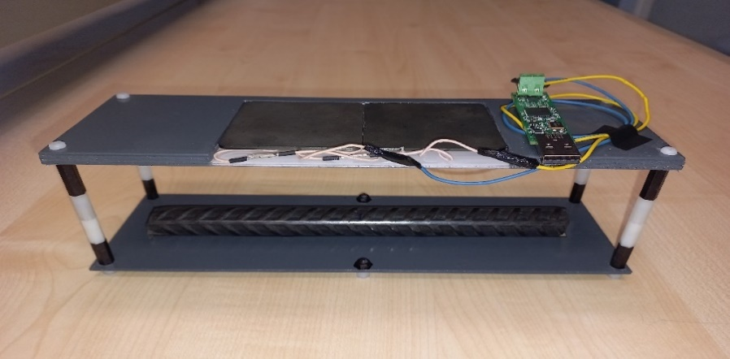{width="4.083333333333333in" height="1.5520833333333333in"}

[]{#_Ref142053053 .anchor}**Figure 2. inductive sensor**

Different tests have been carried out with different inductors (commercial inductors and an inductor designed by Ceit):

- Using an Impedance Analyzer (Hioki) (see []{.mark}[Figure 3](#_Ref142053101))

  - Different inductors were tested by doing a frequency sweep for different adjusted distances.

  - To identify if we can have different significant Rp (parallel resistance) values in without Object and with Object conditions.

> 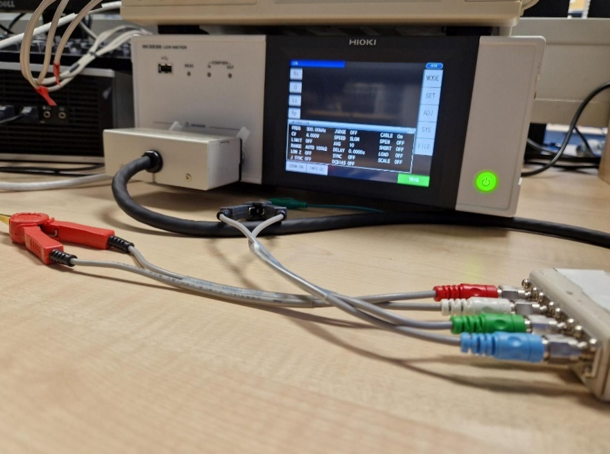{width="3.9791666666666665in" height="2.5104166666666665in"}

[]{#_Ref142053101 .anchor}**Figure 3: Impedance Analyzer (Hioki)**

- Using an evaluation kit (LDC1000EVM) (see [Figure 4](#_Ref142053118))

  - The capacitor value for LC probe was selected based on the chosen frequencies in which we could obtain different significant Rp values for without Object and with Object conditions.

  - Repeat several experiments using LDC1000EVM and analyse the data.

> Before the measurements with LDC1000EVM, a Rp range (Rp~min~ and Rp~max~) has to be defined. This is because, LDC1000 supports measuring broad range of Rp, including values ranging from 798Ω to 3.93MΩ. Typically, the Rp range is considerably narrower than the maximum input range supported by the LDC1000EVM. To improve resolution within the specified sensing range, the LDC1000 offers a programmable input range. This feature allows the user to set minimum and maximum Rp limits, effectively scaling the Rp range during the measurements.

- **LDC1000-Experiment 01:** To select the optimal Rp range for the application scenario

> An experiment was conducted by testing LC probe across several selected Rp limits. Selecting the most suitable Rp range is important to select the range where the sensor operates with both sensitivity and stability, improving measurement precision while minimizing outliers. The Rp ranges were tested across a distance range of 5cm-7cm before selecting the final Rp range.

- **LDC1000-Experiment 02:** Use of a ferrite plate

> The use of a ferrite plate to direct the magnetic field lines downward was tested. For this, initially, we experimented with a ferrite anti-magnetic sticker (120 x 120, 0.2mm thick) and a ferrite plate (100 x 150, 8mm thick). The objective was to evaluate the improvement of the Rp range between with object and without object condition.

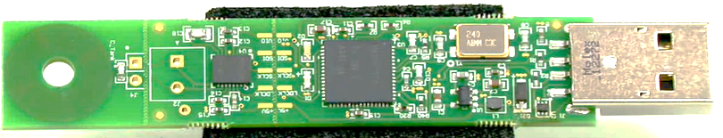

[]{#_Ref142053118 .anchor}

**Figure 4. Evaluation kit (LDC1000EVM)**

Based on the experiment results from the LCR meter (inductance, capacitance and resistance meter), the parameters that can differentiate the corrosion level are Rp (parallel resistance), Rs (serial resistance).

According to the results from tested inductors (in mH and µH range), lower frequencies (in kHz range) would be more suitable (see [Figure 5](#_Ref142053156)). In [Figure 5](#_Ref142053156), the Rp values (the output) from LDC1000EVM are plotted on the left side. For each case, with and without an object, 5 consecutive measures were performed which are plotted in the same graph. The graph on the right in [Figure 5](#_Ref142053156), shows the final Rp value calculated as the median of the data points from each performed measurement, along with the corresponding standard deviation for each set of measurement data. The standard deviation was calculated after replacing the outliers using interpolation.

Lower inductance (in µH range) gives low Rp difference between these two conditions (around 100Ω). The inductors with higher inductance (in mH range) give comparably higher Rp difference. The higher the difference in Rp, the more effectively it allows for the differentiation of various levels of corrosion.

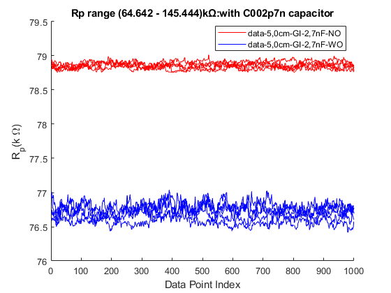

[]{#_Ref142053156 .anchor}**Figure 5. Rp values (the inductor with inductance is 16mH)**

Based on the results, we have designed our own inductor with inductance in the mH range that is also lightweight (refer inductor characteristics in [Table 1](#_Ref177988936)), making it suitable for our approach.

  -----------------------------------------------------------------------------
  Characteristics                                                   Value
  ----------------------------------------------------------------- -----------
  Inductor diameter                                                 10cm

  Wire diameter                                                     0.3mm

  Number of turns                                                   110

  Self-resonance frequency (tested using LCR meter)                 350kHz

  Inductance in 35-65kHz frequency range (tested using LCR meter)   3mH
  -----------------------------------------------------------------------------

  : []{#_Ref177988936 .anchor}**Table 1: Ad-hoc Inductor characteristics**

After testing the new inductor using an LCR meter, the suitable frequency range for the LC probe\'s operation was determined as 35-65kHz. Three LC probes were tested, each with a different capacitor (6.2nF, 3.6nF, and 2.2nF), as the resonance frequency of each LC probe falls within this range. The results obtained with the LDC1000EVM indicated that the best combination was achieved using the 2.2nF capacitor.

After finalizing the LC probe with the new ad-hoc inductor and the 2.2nF capacitor, the next experiment focused on selecting the optimal Rp range for the measurements. Several Rp ranges were tested under the two defined conditions: with and without an object while the with object setup was fixed at a 5cm distance from the inductor (see [Figure 6](#_Ref177992570)).

As [Figure 6](#_Ref177992570) indicates, the deviation of Rp values varies across each range, with some ranges exhibiting changes of just a few ohms, while others show variations in the hundreds of ohms. To achieve a stable Rp value, it is essential to select the Rp range where the LC probe output demonstrates the least variation. 48.481-109.083kΩ was chosen as the Rp range for the measurements.

![[]{#_Ref177992570 .anchor}**Figure 6: Rp range testing with LC probe (ad-hoc inductor with 2.2nF)**](../images/2024-09-30_surewave_d5.4_monitoring_strategy/image10.png){alt="P450#yIS1" width="6.3in" height="3.694058398950131in"}

After the modifications and improvements, the final EC sensor consists of an LC resonator with the ad-hoc inductor and parallel 2.2nF capacitor, and 5mm-thick ferrite plate placed on top of the inductor to direct magnetic field lines downward (see [Figure 7](#_Ref178002300)). In the use of a ferrite plate, as we mentioned before, we obtained good results with the 120 x 120 x 8mm thick ferrite plate from the two ferrite plates tested. However, this plate was quite heavy. To optimize the overall size and weight, we replaced it with a 150 x 100 x 5mm thick ferrite plate.

![[]{#_Ref178002300 .anchor}**Figure 7:EC sensor with final LC probe and LDC1000EVM placed on the test setup**](../images/2024-09-30_surewave_d5.4_monitoring_strategy/image11.jpeg){alt="P454#yIS1" width="4.567308617672791in" height="3.423592519685039in"}

The target distance from the measuring setup could vary between 2cm -10cm. Therefore, it has been demonstrated that the magnetic field from LC resonator could reach the target distance with enough resolution. The effect of distance variation between the sensor and the conductive object in Rp is shown in [Figure 8](#_Ref178000044) and Figure 9. Note that the results plotted in [Figure 8](#_Ref178000044) and Figure 9 were obtained from the final sensor setup (LC resonator with 5mm ferrite plate placed on top of the inductor). We have concluded that to reach for higher distance measuring, the inductance and the capacitor for the resonator circuit have to be well-selected. Temperature experiments (varying the temperature of the object and the coil) have been done to analyse how the temperature affects the measurements, see [Figure 10](#_Ref167708872), [Figure 11](#_Ref167708874) and [Figure 12](#_Ref167708875).

![[]{#_Ref178000044 .anchor}**Figure 8: Effect of distance variation on Rp under with object condition (results from final sensor setup)**](../images/2024-09-30_surewave_d5.4_monitoring_strategy/image13.png){alt="P459#yIS1" width="3.683036964129484in" height="2.6041666666666665in"}

In the same way, measuring the Rp value in the without object condition under the same distance variation in the setup gave us very similar results, regardless of the distance as expected (see [Figure 9](#_Ref178001665)).

![[]{#_Ref178001665 .anchor}**Figure 9: Effect of distance variation on Rp value under without object condition (results are from final sensor setup)**](../images/2024-09-30_surewave_d5.4_monitoring_strategy/image14.png){alt="P462#yIS1" width="4.317308617672791in" height="3.055715223097113in"}

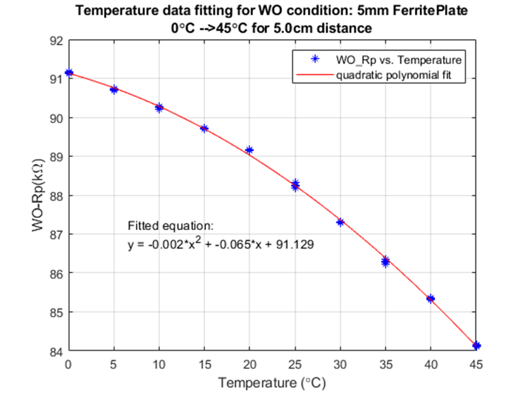{width="4.4270275590551185in" height="3.319005905511811in"}

[]{#_Ref167708872 .anchor}**Figure 10. Temperature experiment from 0ºC to 45ºC for 5.0 cm between the metallic rebar and the inductive sensor**

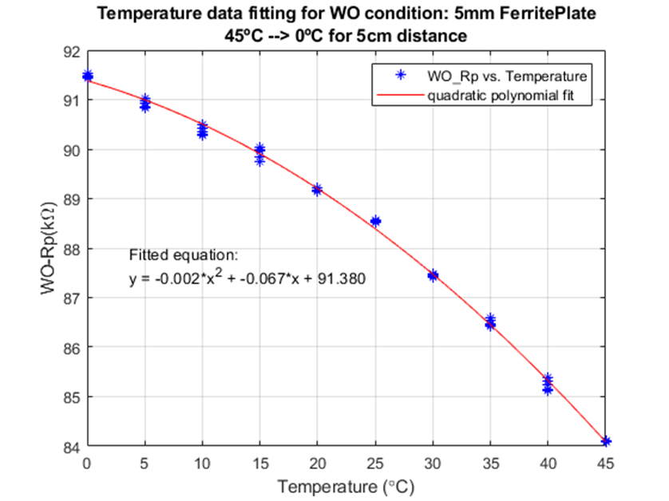{width="4.611620734908136in" height="3.4559645669291337in"}

[]{#_Ref167708874 .anchor}**Figure 11. Temperature experiment from 45ºC to 0ºC for 5.0 cm between the metallic rebar and the inductive sensor**

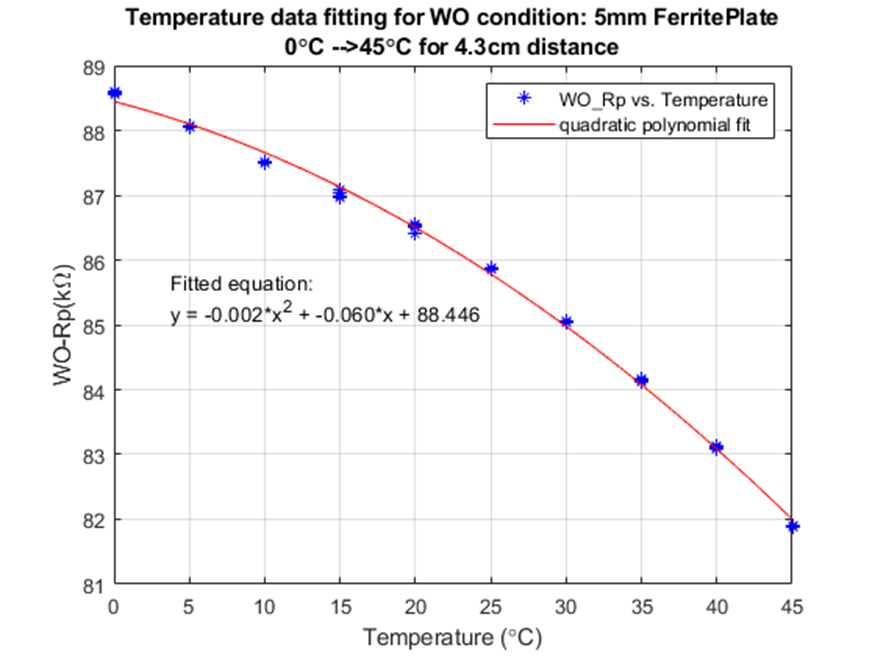{width="4.59202646544182in" height="3.442707786526684in"}

[]{#_Ref167708875 .anchor}**Figure 12. Temperature experiment from 0ºC to 45ºC for 4.3 cm between the metallic rebar and the inductive sensor**

We can conclude that the system can easily compensate for the temperature variations with a quadratic fitting by applying fixed coefficients although the distance between the metallic rebar and the inductive sensor changes.

The followed methodology to calibrate our solution is explained in detail in our recently published scientific paper 12F12F[^13].

# Results

## Corrosion sensor: electronics design

In the scope of the SUREWAVE Project, we have designed our own ad-hoc electronics (see [Figure 13](#_Ref142053008)) for the corrosion sensor based on Eddy Current with wireless communications such as LoRa and UWB. This Hardware has been designed and tested.

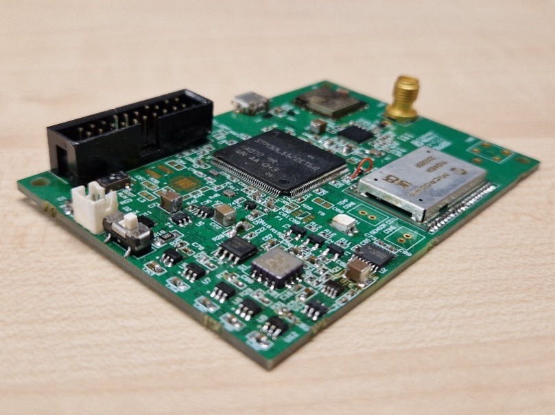{width="3.6770833333333335in" height="2.0729166666666665in"}

[]{#_Ref142053008 .anchor}**Figure 13. Electronics board for the corrosion sensor**

Our sensor node employs the architecture shown in [Figure 14](#_Ref172214291). The device incorporates, in addition to the digital inductance converter, a Long Range (LoRA) transceiver, which allows for the processed information to be sent wirelessly over long distances. It also incorporates Impulse Radio Ultra Wide Band (IR-UWB) (802-15.4a) transceiver for accessing the configuration and raw data of the sensor node. This sensor node sends wirelessly the measurement of the loss of cross-section of the reinforced concrete through the parallel resistance, temperature, and the time at which these measurements have been made. For this purpose, the sensor node incorporates an accelerometer and a thermistor, which is connected to an external Analog Digital Converter (ADC) to the microcontroller. Finally, the sensor node is equipped with a reset button and an RGB LED to interact directly with the user.

The sensor node bases its operation on two modes, the low-power mode and the active mode. The sensor node will take a measurement at certain intervals being awakened by the internal Real Time Clock (RTC), in such a way that it will remain in an ultra-low power state as long as it does not have to take a measurement or send information or a beacon through wireless communications. In active mode, the system manages the switching off or on of the power sources that supply the devices necessary for performing measurement operations, saving in memory, or wireless communications. In the ultra-low power mode, all system devices remain off except for the microcontroller.

The designed sensor node is powered by a battery of up to 4.2V. It has a protection circuit to prevent damage by reversing the battery polarity and a switch to turn the system off or on. The node has a battery voltage monitoring system, which allows its status to be known. In addition, the sensor node incorporates a circuit to manage the energy that can be harvested provided by a photovoltaic cell.

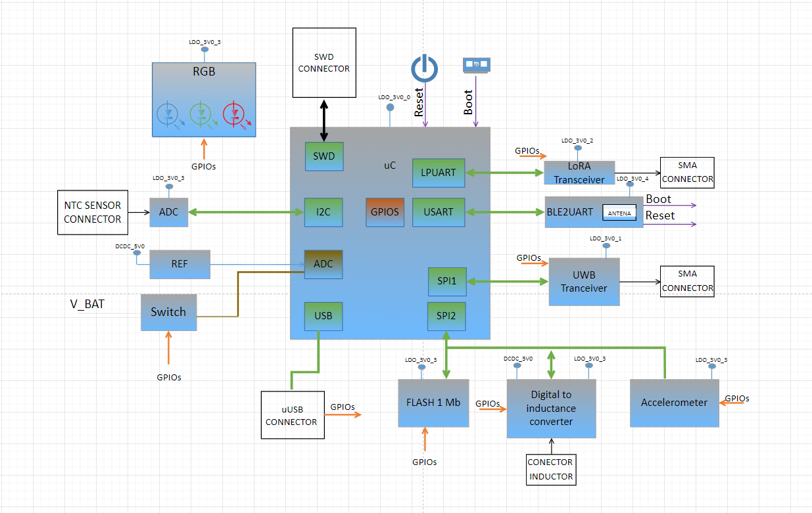{width="6.3in" height="3.984027777777778in"}

[]{#_Ref172214291 .anchor}**Figure 14. Sensor Node architecture**

This sensor node designed by CEIT will be installed in the final demonstrator in the Port of Gijon with the aim of performing a long-term study of the degradation of the reinforced re-bars in the concrete prototype of the wave breaker designed by ACCIONA.

## Corrosion experiment: testing at lab-scale

We have performed a first corrosion experiment using four concrete blocks produced by ACCIONA, two High Performance Concrete (HPC) blocks and two Light Weight Aggregate Concrete (LWAC) blocks, see [Figure 15](#_Ref167708948).

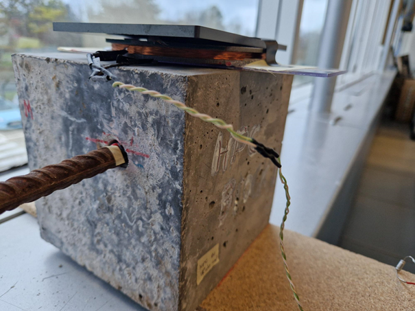{width="4.033683289588802in" height="3.020262467191601in"}

[]{#_Ref167708948 .anchor}**Figure 15. Inductive sensor by using the concrete block designed by ACCIONA**

In the following [Table 2](#_Ref167709039), the height of the block, the height to the rebar from the top surface and the weight of the rebars are shown:

[]{#_Ref167709039 .anchor}**Table 2. Details of the Blocks used in the experiments.**

  ---------------------------------------------------------------------------------------------------------------------------------------------------------------------------
  **Sample**           **Block height in cm** (into measuring direction)   **Height to the rebar from top Surface in cm**   **Weight of the rebar (at No-degradation) in g**
  ------------------- --------------------------------------------------- ------------------------------------------------ --------------------------------------------------
  HPC_B1-REBAR 1                              15                                                4.3                                Avg(437.0,437.0,437.1)=**437.03**

  HPC_B1-REBAR 2                              15                                                4.3                                Avg(435.0,434.9,434.9)=**434.93**

  LWAC_B1 (REBAR 1)                           15                                                 5                                 Avg(437.2,437.2,437.1)=**437.16**

  LWAC_B2 (REBAR 2)                           15                                                 5                                 Avg(440.2,440.2,440.1)=**440.16**
  ---------------------------------------------------------------------------------------------------------------------------------------------------------------------------

The metallic rebar is 50cm long and with a diameter of approximately 11.5mm. Each concrete block has a hole at 5cm of the top surface with the aim of having the possibility of inserting and taking out a metallic rebar. Then, CEIT can degrade the rebar mechanically at different stages to analyse if the corrosion sensor is capable of detecting the different degradation levels.

CEIT produced the first degradation of one of the rebars as is shown in the following [Table 3](#_Ref167709121), and illustrated in [Figure 16](#_Ref167709157) and [Figure 17](#_Ref167709158). After performing the corresponding measures and analysis, CEIT produced a second degradation stage.

[]{#_Ref167709121 .anchor}**Table 3. Degradation of the rebars**

+----------------+---------------------------------------------------------------------+
| **Sample**     | **Weight of the rebar in g**                                        |
+================+:====================:+:====================:+:=====================:+
|                | at No-degradation    | at First degradation | at Second degradation |
+----------------+----------------------+----------------------+-----------------------+
| HPC_B1-REBAR 1 | **437.03**           | **389.58**           | **380**               |
+----------------+----------------------+----------------------+-----------------------+

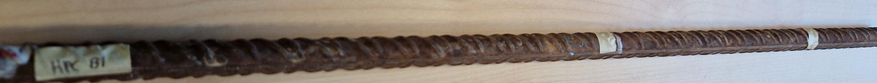{width="5.847175196850394in" height="0.5533814523184601in"}

[]{#_Ref167709157 .anchor}**Figure 16. Rebar measurements with EC sensor: Before any material degradation**

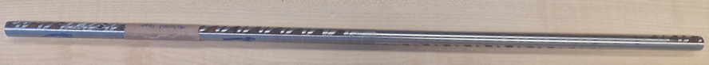{width="5.920515091863517in" height="0.5467136920384952in"}

[]{#_Ref167709158 .anchor}**Figure 17. Rebar HPC-REBAR1: After first material degradation**

With the first degradation of HPC-REBAR 1, we have produced a loss of weight of 47.45g. This is around 11% of the initial weight. Regarding Rp, we have observed 1.23kΩ difference between No-degradation and First degradation of the rebar see [Figure 18](#_Ref167709202). Since the difference is quite large, there is potential to detect lower percentages of degradation than the observed 11%. In the case of the second degradation stage, we have achieved a loss of weight of around 9 grams with respect to the previous stage, that is, 3% of the material which means a reduction of around 0.1mm in the rebar's diameter. With this second stage, it is demonstrated how our solution can detect lower percentages.

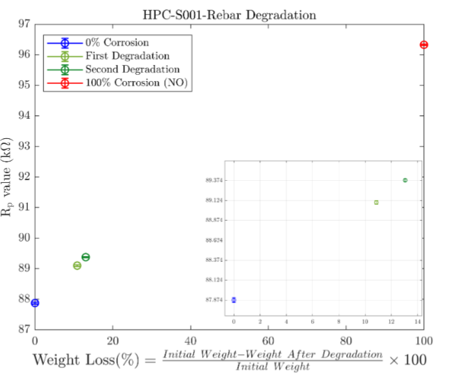{width="4.01992125984252in" height="3.3159722222222223in"}

[]{#_Ref167709202 .anchor}**Figure 18. Relationship between weight degradation and Rp value**

## Monitoring Strategy: Location of Corrosion Sensor

An important point to be addressed is the position of the corrosion sensor. For the obtained information to be as useful as possible, the sensor should be located in a region where the consequences of corrosion will be most critical. In other words, the regions where the reinforcement must withstand the highest loads should be monitored with most care. Hoseini *et al* 13F13F[^14] compiled a review paper relating stress and permeability in concrete, showing that there is a clear connection between them. For compressive loads, the permeability of the concrete initially decreases (crack closure), and it increases after a critical load. Study of tensile loads was not conducted as thoroughly, since concrete is not designed to operate under tension due to its poor performance, and experimental work in that area is both more challenging and of less interest. It was also shown that experimental variability was large, as expected from a complex system such as concrete. The review paper included results from both water permeability and gas permeability tests. Lawler *et al* 14F14F[^15] show results of permeability on a uniaxial tensile test. They show that flow rate increases rapidly for high engineering strains (proportional to the cube), related to the crack opening effect of tensile stresses. This happens for strains considerably higher than those necessary to cause tensile cracking, not because the effect is not important, but due to the low mechanical resistance of concrete under tension.

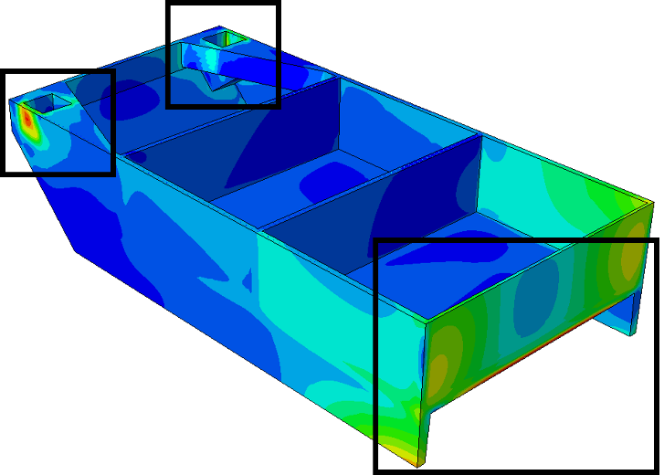{width="3.305544619422572in" height="2.3622047244094486in"}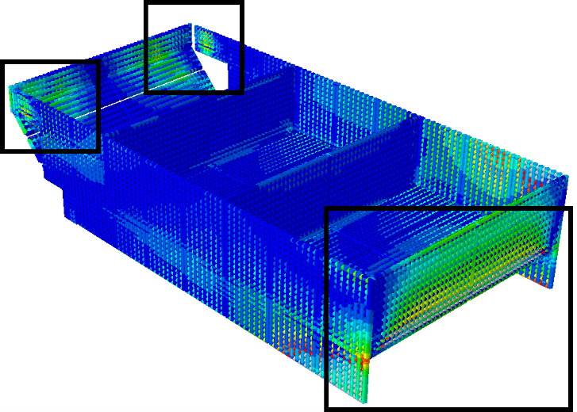{width="3.305544619422572in" height="2.3622047244094486in"}

[]{#_Ref177041521 .anchor}**Figure 19. Example of stress concentration in steel reinforcement near the load application points.**

From the finite element simulations carried out to perform the structural health assessment of the floating breakwater system, two main conclusions about the ideal probing position have been drawn.

Firstly, it has been observed that stresses are maximal near the load application points. [Figure 19](#_Ref177041521) shows a clear example of this effect, where the stress values located at the vicinity of the point of application of the mooring (large rectangle) and connector (small rectangles) forces presents higher levels of stress than the rest of the volume. The top image shows the stress distributions in the concrete, and the bottom image corresponds to the reinforcement. This behaviour is not surprising: large loads are applied in a relatively small volume, and then transmitted to the rest of the sample. Load application points are natural critical regions.

The second situation in which high stress values have been recorded in the simulations have been geometrical stress concentrators: points where the thickness of the material suddenly changes, or where discontinuities such as sharp edges are present. [Figure 20](#_Ref177049930) shows an example of such a stress concentrator. In this case, the region where the connector system is housed merges with the walls of the breakwater. It is a critical region, since it is located close to a load application point, and it presents a region where the cross section diminishes, so that stresses are concentrated. The same holds true for the region near the housing of the connector system (same geometrical stress concentration), but for this specific load case the other region withstood higher loads. Geometrical stress concentration is a secondary critical region, meaning that the effect will be noticeable for those near load application points.

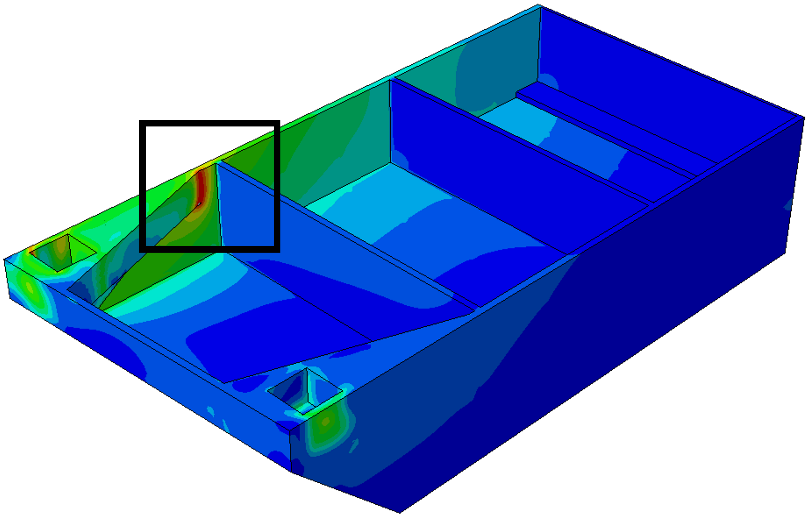{width="3.6865813648293964in" height="2.3622047244094486in"}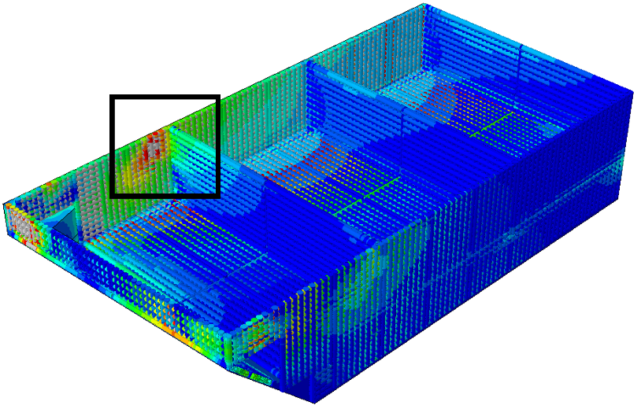{width="3.6979866579177605in" height="2.3622047244094486in"}

[]{#_Ref177049930 .anchor}**Figure 20. Example of stress concentration in steel reinforcement for a region close to the connector load application point, where a geometrical stress concentrator is present.**

# Conclusions

Deliverable 5.4 summarises the results obtained by the SUREWAVE team involved in Task 5.3: Structural integrity assessment (Leader: CEIT; Participants: MARIN, SINTEF, ACC; Duration: M12-M24), specifically subtask 5.3.3 with the definition of the structural health monitoring strategy, Task 5.4: Structural Health Management System (L: CEIT; Participants: MARIN, SIS; Duration: M6-M32), specifically subtask 5.4.3 with the development and implementation of SHMS taking data for WP4 and WP6 to feed fatigue propagation analyses and to manage corrosion, and Task 6.1 --Advanced sensing & monitoring solutions for basin tests and concrete component (L: CEIT; P: SINTEF, SIS, ACC, MARIN), where the corrosion sensor and experiments have been developed.

We have worked on the development and application of a single-frequency eddy current (EC) sensor employing an LC resonator for the non-destructive evaluation of corrosion levels within concrete-embedded reinforcing bars. The sensor's design and experimental validation process utilized a comprehensive methodology to study the optimal LC resonator characteristics, aiming to develop a system capable of detecting changes in the rebar condition from a distance of 5--6cm outside the concrete structure, as per the application requirements. Following the experimental methodology, the EC sensing design integrates an LC probe with a circular air-cored inductor of approximately 3mH inductance and a 2.2nF capacitor connected in parallel, along with a 5[mm]{.underline} ferrite plate placed on top of the inductor.

The temperature effect on the sensor's output (Rp, parallel resistance) was evaluated using a temperature experiment under conditions in which the eddy current coil was positioned facing the S000 metallic rebar (the rebar sample used in sensor design methodology) at a 5cm distance. The change in Rp was measured as 155Ω for every 1°C increase within the temperature range of 20--25°C. The temperature study results showed that the sensor--rebar distance was not a significant factor affecting the thermal relationship with Rp.

Through the systematic simulation of uniform corrosion via mechanical degradation cycles, we have demonstrated the sensor's capability to accurately quantify material loss with a resolution of approximately 0.17mm. While the results are promising under laboratory conditions, it is acknowledged that the mechanical degradation approach employed does not fully replicate the complex nature of real-world corrosion. Therefore, further research is required to incorporate environmental factors to enhance the sensor's practicality under real offshore operating conditions.

In future work, we aim to enhance the validity of our findings by testing the sensor's performance under conditions that more accurately reflect real-world applications. To achieve this, the sensor will be integrated into a concrete block with real rebar conditioning (a real reinforced structure block) and tested under offshore environmental conditions. The next step will help us to identify any potential performance differences between laboratory and field conditions and refine the sensor design accordingly.

Regarding the ideal location for the corrosion systems the main conclusions are the following: monitoring the breakwaters that withstand the highest loads (those connected to the mooring lines) should be prioritised, since they will naturally be more solicitated than those that do not have to directly withstand mooring forces, and the effect of corrosion will be most noticeable for those. The second guideline would be to place the sensors near the regions where loads are applied: near the mooring lines, near the breakwater connectors and near the connectors from breakwater to FPV. Lastly, attention should be paid to regions where geometrical stress concentrators (reductions in effective area, sharp edges) are present.

These ideal locations are based on the analysis of mechanical loads. However, to decide the definitive location of the sensor, the effect of the waves, tides and currents on the degradation rate of the structure should be also considered.

# Bibliography

[^1]: Guofu Qiao and Jinping Ou. Corrosion monitoring of reinforcing steel in cement mortar by eis and ena. Electrochimica Acta, 52(28):8008--8019, 2007.

[^2]: Romain Rodrigues, St´ephane Gaboreau, Julien Gance, Ioannis Ignatiadis, and St´ephanie Betelu. Reinforced concrete structures: A review of corrosion mechanisms and advances in electrical methods for corrosion monitoring. Construction and Building Materials, 269:121240, 2021.

[^3]: Ganesh Naidu Gopu and Sofi Androse Joseph. Corrosion behavior of fiber-reinforced concrete--- a review. Fibers, 10(5):38, 2022.

[^4]: Ahmed N AbdAlla, Moneer A Faraj, Fahmi Samsuri, Damhuji Rifai, Kharudin Ali, and Yarub Al-Douri. Challenges in improving the performance of eddy current testing. Measurement and Control, 52(1-2):46--64, 2019.

[^5]: K Kumar, S Muralidharan, T Manjula, MS Karthikeyan, and N Palaniswamy. Sensor systems for

    corrosion monitoring in concrete structures. Sensors & Transducers, 67:553--560, 2006.

[^6]: AbdAlla, A.N.; Faraj, M.A.; Samsuri, F.; Rifai, D.; Ali, K.; Al-Douri, Y. Challenges in improving the performance of eddy current testing. Meas. Control 2019, 52, 46--64.

[^7]: Matthew M Andringa, Dean P Neikirk, Nathan P Dickerson, and Sharon L Wood. Unpowered wireless corrosion sensor for steel reinforced concrete. In SENSORS, 2005 IEEE, pages 4--pp. IEEE, 2005.

[^8]: Wenxiong Chen and Dehui Wu. Resistance-frequency eddy current method for electrical conductivity

    measurement. Measurement, 209:112501, 2023.

[^9]: Wenxiong Chen, Dehui Wu, Xiaohong Wang, and Teng Wang. A self-frequency-conversion eddy current testing method. Measurement, 195:111129, 2022.

[^10]: Guo-cai Zhang, Yan-qing Feng, Shuai Xue, and Jing Zhang. Experimental research of eddy current testing technology based on resonant circuit in carbon fiber reinforced polymer testing. In 2021 IEEE 12th International Conference on Mechanical and Intelligent Manufacturing Technologies (ICMIMT), pages 230--238. IEEE, 2021.

[^11]: Mengbao Fan, Binghua Cao, Panpan Yang, Wei Li, and Guiyun Tian. Elimination of liftoff effect using a model-based method for eddy current characterization of a plate. NDT & E International, 74:66--71, 2015.

[^12]: Texas Instruments. Application Report: Sensor Design for Inductive Sensing Applications Using LDC. Available online: https://www.ti.com/lit/an/snoa930c/snoa930c.pdf?ts=1718350012469 (accessed on 23 May 2024).

[^13]: Thibbotuwa, U.C.; Cortés, A.; Casado, A.M.; Irizar, A. Resonant Eddy Current Sensor Design for Corrosion Detection of Reinforcing Steel. *Sensors* 2024, *24*, 4211. https://doi.org/10.3390/s24134211

[^14]: M. Hoseini, V. Bindiganavile, and N. Banthia, "The effect of mechanical stress on permeability of concrete: A review," Cement and Concrete Composites, vol. 31, no. 4, pp. 213--220, 2009

[^15]: J. S. Lawler, D. Zampini, and S. P. Shah, "Microfiber and macrofiber hybrid fiber-reinforced concrete," Journal of Materials in Civil Engineering, vol. 17, no. 5, pp. 595--604, 2005.
