> Source: `SUREWAVE_D5.3_Report on structural integrity assessment_v2.0_SD.docx` — Document date: 2024-11-07 — Converted: 2026-09-28 via pandoc/pdftotext

---

##### 

Deliverable number: D5.3

+-----------------------------------------------------------------------------------------------------------------------+
| ##### {width="7.8701301399825025in" height="2.5902777777777777in"}                   |
+=======================================================================================================================+
| ##### SUREWAVE -- Structural Reliable Offshore Floating PV Solution Integrating Circular Concrete Floating Breakwater |
+-----------------------------------------------------------------------------------------------------------------------+

Title: Report on structural integrity assessment

# **Disclaimer:**  {#disclaimer .TOC-Heading}

The SUREWAVE project is Funded by the European Union. Views and opinions expressed are however those of the author(s) only and do not necessarily reflect those of the European Union. Neither the European Union nor The European Climate, Infrastructure and Environment Executive Agency (CINEA) can be held responsible for them.

Deliverable details

+--------------------------------------+-----------------------------------------------------+-----------------------------------------------+
| **WP**                               | 5                                                   |                                               |
+:========================+:===========+:===========+:===========+:===========+:=============+:======================+:======================+
| **Task**                             | D5.3                                                | Report on structural integrity assessment     |
+-------------------------+------------+-------------------------+------------+--------------+-----------------------+-----------------------+
| **Dissemination level** | EU classified                        |            | **Due delivery date**                | 30.09.2024            |
+-------------------------+--------------------------------------+------------+--------------------------------------+-----------------------+
| **Deliverable type**    | R Document, report                   |            | **Actual delivery date**             | 07.11.2024            |
+-------------------------+-------------------------+------------+------------+--------------------------------------+-----------------------+
| **Lead beneficiary**                              | **CEIT**                                                                               |
+---------------------------------------------------+----------------------------------------------------------------------------------------+
| **Contributing beneficiaries**                    |                                                                                        |
+---------------------------------------------------+----------------------------------------------------------------------------------------+

+:---------------------+:-----------+:----------------------+:--------------------------------------------------------+
| **Document Version** | **Date**   | **Author**            | **Comments**                                            |
+----------------------+------------+-----------------------+---------------------------------------------------------+
| 0.0                  | 22/10/2024 | Unai Eibar            | Draft version                                           |
|                      |            |                       |                                                         |
|                      |            | Aritz Dorronsoro      |                                                         |
+----------------------+------------+-----------------------+---------------------------------------------------------+
| 0.1                  | 30/10/2024 | Unai Eibar            | Draft - 2                                               |
|                      |            |                       |                                                         |
|                      |            | Aritz Dorronsoro      |                                                         |
+----------------------+------------+-----------------------+---------------------------------------------------------+
| 1.1                  | 05/11/2024 | Stéphane Dumoulin     | Revision -1                                             |
+----------------------+------------+-----------------------+---------------------------------------------------------+
| 1.2                  | 05/11/2024 | Unai Eibar            | Comments included from the revision-1                   |
|                      |            |                       |                                                         |
|                      |            | Aritz Dorronsoro      |                                                         |
+----------------------+------------+-----------------------+---------------------------------------------------------+
| 1.3                  | 06/11/2024 | Stéphane Dumoulin     | Revision -2                                             |
+----------------------+------------+-----------------------+---------------------------------------------------------+
| 1.4                  | 06/11/2024 | Virgile Delhaye       | Revision -3                                             |
+----------------------+------------+-----------------------+---------------------------------------------------------+
| 2.0                  | 06/11/2024 | Unai Eibar            | Final: Comments included from the revision-2 revision-3 |
|                      |            |                       |                                                         |
|                      |            | Aritz Dorronsoro      |                                                         |
+----------------------+------------+-----------------------+---------------------------------------------------------+

+-------------------------------------------------------------------------------------------------------------------------------------------------+
| **Dissemination level**                                                                                                                         |
+:====================================+:==========================================================================================================+
| PU                                  | Public- fully open                                                                                        |
+-------------------------------------+-----------------------------------------------------------------------------------------------------------+
| SEN                                 | SEN = Sensitive -- limited under the conditions of the Grant Agreement                                    |
+-------------------------------------+-----------------------------------------------------------------------------------------------------------+
| EU classified                       | EU classified -- restraint -- UE/EU-restricted, confidential, secret-UE/EU secret under Decision 2015/444 |
+-------------------------------------+-----------------------------------------------------------------------------------------------------------+
| **Deliverable type**                                                                                                                            |
+-------------------------------------+-----------------------------------------------------------------------------------------------------------+
| R:                                  | Document, report (excluding the periodic and final reports)                                               |
+-------------------------------------+-----------------------------------------------------------------------------------------------------------+
| DEM:                                | Demonstrator, pilot, prototype, plan designs                                                              |
+-------------------------------------+-----------------------------------------------------------------------------------------------------------+
| DEC:                                | Websites, patents filing, press & media actions, videos, etc.                                             |
+-------------------------------------+-----------------------------------------------------------------------------------------------------------+
| OTHER:                              | Software, technical diagram, etc.                                                                         |
+-------------------------------------+-----------------------------------------------------------------------------------------------------------+

**EXECUTIVE SUMMARY**

The following document outlines the activities conducted in Task 5.3, in collaboration with Task 5.1 and Task 5.2, and as a precursor to Task 5.4 and Task 5.5. These activities are focused on the assessment of the structural integrity of critical parts of the structure using the Finite Element (FE) method and advanced techniques, such as submodelling or mesh superposition method. The main purpose of this analysis was to ensure that the critical parts are able to withstand extreme loads. These analyses used the geometries, boundary conditions, and loading conditions from Task 5.2, along with the material properties predicted in Task 5.1. Based on these analyses, critical components (breakwater with mooring attached) were selected for a more rigorous structural integrity assessment. The primary objectives include identifying the most critical parts of the structure and generating new inputs for subsequent tasks related to crack propagation in rebars and Structural Health Management Systems.

Chapter 1 introduces the deliverable and outlines its objectives.

Chapter 2 details the inputs generated in Task 5.1 and Task 5.2, as well as their interpretation.

Chapter 3 focuses on adapting the inputs (loads, boundary conditions and material properties) to the global FE model.

Chapter 4 introduces the advanced submodel technique, which enables a focused analysis of the most critical areas.

Chapter 5 shows the criteria used to ensure the lifetime of the floating structure.

The results presented in Chapter 4 and the concluding remarks in Chapter 5 show that the breakwater is designed correctly and the loads it is subjected to are appropriate for infinite life (design) hypotheses. However, additional data is generated to feed the Structural Health Management System, providing extra information about predictive maintenance.

**Deliverable Review**

+---------------------------------------------------------------------------------+---------------------------------------------------------------------------+---------------------------------------------------------------------------+
|                                                                                 | **Reviewer #1: Stéphane Dumoulin**                                        | **Reviewer #2: Virgile Delhaye**                                          |
|                                                                                 +-----------------+---------------------------------------+-----------------+-----------------+---------------------------------------+-----------------+
|                                                                                 | **Answer**      | **Comments**                          | **Type\***      | **Answer**      | **Comments**                          | **Type\***      |
+=================================================================================+=================+=======================================+=================+=================+=======================================+=================+
| 1.  Is the deliverable in accordance with                                                                                                                                                                                               |
+---------------------------------------------------------------------------------+-----------------+---------------------------------------+-----------------+-----------------+---------------------------------------+-----------------+
| i.  The Description of Work?                                                    | ☒ Yes           |                                       | ☐ M             | ☒Yes            |                                       | ☐ M             |
|                                                                                 |                 |                                       |                 |                 |                                       |                 |
|                                                                                 | ☐ No            |                                       | ☐ m             | ☐ No            |                                       | ☐ m             |
|                                                                                 |                 |                                       |                 |                 |                                       |                 |
|                                                                                 |                 |                                       | ☐ a             |                 |                                       | ☐ a             |
+---------------------------------------------------------------------------------+-----------------+---------------------------------------+-----------------+-----------------+---------------------------------------+-----------------+
| ii. The international State of the Art?                                         | ☐ Yes           | *Not applicable for this deliverable* | ☐ M             | ☐ Yes           | *Not applicable for this deliverable* | ☐ M             |
|                                                                                 |                 |                                       |                 |                 |                                       |                 |
|                                                                                 | ☐ No            |                                       | ☐ m             | ☐ No            |                                       | ☐ m             |
|                                                                                 |                 |                                       |                 |                 |                                       |                 |
|                                                                                 |                 |                                       | ☐ a             |                 |                                       | ☐ a             |
+---------------------------------------------------------------------------------+-----------------+---------------------------------------+-----------------+-----------------+---------------------------------------+-----------------+
| 2.  Is the quality of the deliverable in a status                                                                                                                                                                                       |
+---------------------------------------------------------------------------------+-----------------+---------------------------------------+-----------------+-----------------+---------------------------------------+-----------------+
| iii. That allows it to be sent to European Commission?                          | ☒ Yes           |                                       | ☐ M             | ☒ Yes           |                                       | ☐ M             |
|                                                                                 |                 |                                       |                 |                 |                                       |                 |
|                                                                                 | ☐ No            |                                       | ☐ m             | ☐ No            |                                       | ☐ m             |
|                                                                                 |                 |                                       |                 |                 |                                       |                 |
|                                                                                 |                 |                                       | ☐ a             |                 |                                       | ☐ a             |
+---------------------------------------------------------------------------------+-----------------+---------------------------------------+-----------------+-----------------+---------------------------------------+-----------------+
| iv. That needs improvement of the writing by the originator of the deliverable? | ☐ Yes           |                                       | ☐ M             | ☐ Yes           |                                       | ☐ M             |
|                                                                                 |                 |                                       |                 |                 |                                       |                 |
|                                                                                 | ☒ No            |                                       | ☐ m             | ☒No             |                                       | ☐ m             |
|                                                                                 |                 |                                       |                 |                 |                                       |                 |
|                                                                                 |                 |                                       | ☐ a             |                 |                                       | ☐ a             |
+---------------------------------------------------------------------------------+-----------------+---------------------------------------+-----------------+-----------------+---------------------------------------+-----------------+
| v.  That need further work by the Partners responsible for the deliverable?     | ☐ Yes           |                                       | ☐ M             | ☐ Yes           |                                       | ☐ M             |
|                                                                                 |                 |                                       |                 |                 |                                       |                 |
|                                                                                 | ☒ No            |                                       | ☐ m             | ☒No             |                                       | ☐ m             |
|                                                                                 |                 |                                       |                 |                 |                                       |                 |
|                                                                                 |                 |                                       | ☐ a             |                 |                                       | ☐ a             |
+---------------------------------------------------------------------------------+-----------------+---------------------------------------+-----------------+-----------------+---------------------------------------+-----------------+

\* Type of comments: M = Major comment; m = minor comment; a = advice

# **Contents** {#contents .TOC-Heading}

[1 Introduction [8](#introduction)](#introduction)

[2 Adapting Input Data to the Breakwater FE Model [9](#adapting-input-data-to-the-breakwater-fe-model)](#adapting-input-data-to-the-breakwater-fe-model)

[2.1 Geometry of the Breakwater [9](#geometry-of-the-breakwater)](#geometry-of-the-breakwater)

[2.2 Connector and Mooring Loads [10](#connector-and-mooring-loads)](#connector-and-mooring-loads)

[2.3 Materials [18](#materials)](#materials)

[3 Global FE Model [22](#global-fe-model)](#global-fe-model)

[3.1 Reinforcement and Meshing [22](#reinforcement-and-meshing)](#reinforcement-and-meshing)

[3.2 Loads and Boundary Conditions [24](#loads-and-boundary-conditions)](#loads-and-boundary-conditions)

[3.3 Critical Areas [28](#critical-areas)](#critical-areas)

[4 Submodelling [34](#submodelling)](#submodelling)

[4.1 Submodel in Fatigue Analysis [34](#submodel-in-fatigue-analysis)](#submodel-in-fatigue-analysis)

[4.2 Submodel in Extreme Event Analysis [37](#submodel-in-extreme-event-analysis)](#submodel-in-extreme-event-analysis)

[5 Structural Analysis/Lifetime Assessment [41](#structural-analysislifetime-assessment)](#structural-analysislifetime-assessment)

[5.1 Structural Integrity of Concrete Structure: Analysis of Maximum Loads [41](#structural-integrity-of-concrete-structure-analysis-of-maximum-loads)](#structural-integrity-of-concrete-structure-analysis-of-maximum-loads)

[5.2 Infinite Fatigue Life of Steel Rebar: Goodman and Soderberg Criteria [42](#infinite-fatigue-life-of-steel-rebar-goodman-and-soderberg-criteria)](#infinite-fatigue-life-of-steel-rebar-goodman-and-soderberg-criteria)

[6 Conclusions and Future Work [45](#conclusions-and-future-work)](#conclusions-and-future-work)

[7 References [46](#references)](#references)

**List of Tables:**

[Table 1: Load case for the fatigue calculation case study. Baltic Sea condition. FE coordinate system used. [16](#_Ref178324874)](#_Ref178324874)

[Table 2: Load case for the fatigue calculation case study. Mediterranean Sea condition. FE coordinate system used. [16](#_Ref179516341)](#_Ref179516341)

[Table 3: Load case for the fatigue calculation case study. North Sea condition. FE coordinate system used. [16](#_Ref179516346)](#_Ref179516346)

[Table 4: Maximum and minimum values for each load component (highlighted in blue), and the rest of the loads corresponding to the same time instant. Baltic Sea condition. FE coordinate system used. [17](#_Ref176786684)](#_Ref176786684)

[Table 5: Maximum and minimum values for each load component (highlighted in blue), and the rest of the loads corresponding to the same time instant. Mediterranean Sea condition. FE coordinate system used. [17](#_Ref179679999)](#_Ref179679999)

[Table 6: Maximum and minimum values for each load component (highlighted in blue), and the rest of the loads corresponding to the same time instant. North Sea condition. FE coordinate system used. Events 1 and 11 correspond to the same instant. [18](#_Ref179680000)](#_Ref179680000)

[Table 7: Material properties corresponding to the calibrated model. [21](#_Ref179545386)](#_Ref179545386)

[Table 8: Needed variables for load conversion from MARIN input to FE model. [25](#_Ref179488975)](#_Ref179488975)

[Table 9: Plastic deformation values (normalised with cracking/crushing limit) in the global simulations of extreme events. [41](#_Ref180427666)](#_Ref180427666)

[Table 10: Material properties of B500A steel according to DIN 488:2009-08 standard, and correction factors for endurance limit. [43](#_Ref179944110)](#_Ref179944110)

[Table 11: Identification of worst performing element in fatigue analysis: maximum and minimum stress, equivalent mean and alternating stress, and FSCs following Soderberg and Goodman criteria. Submodel 1. [43](#_Ref179944241)](#_Ref179944241)

[Table 12: Identification of worst performing element in fatigue analysis: maximum and minimum stress, equivalent mean and alternating stress, and FSCs following Soderberg and Goodman criteria. Submodel 2. [43](#_Ref180115132)](#_Ref180115132)

[Table 13: Volumetric force values of connector and mooring loads. Baltic Sea condition. [66](#_Ref179548705)](#_Ref179548705)

[Table 14: Volumetric force values of connector and mooring loads. Mediterranean Sea condition. [67](#_Ref179680293)](#_Ref179680293)

[Table 15: Volumetric force values of connector and mooring loads. North Sea condition. [68](#_Ref179680298)](#_Ref179680298)

**List of Figures:**

[Figure 1: Original breakwater geometry. [9](#_Ref175306211)](#_Ref175306211)

[Figure 2: Simplified breakwater geometry. [10](#_Ref175308334)](#_Ref175308334)

[Figure 3: Q636 rebar mesh. Figure from Baustahlgewebe. [10](#_Ref175309770)](#_Ref175309770)

[Figure 4: Calculation point of connector forces between breakwaters. [11](#_Ref175570922)](#_Ref175570922)

[Figure 5: Connector and mooring loads on a representative breakwater connector and mooring system. Baltic Sea conditions. [11](#_Ref178321210)](#_Ref178321210)

[Figure 6: Connector and mooring loads on a representative breakwater connector and mooring system. Mediterranean Sea conditions. [12](#_Ref179503576)](#_Ref179503576)

[Figure 7: Connector and mooring loads on a representative breakwater connector and mooring system. North Sea conditions. [12](#_Ref179503583)](#_Ref179503583)

[Figure 8: Rainflow cycle counting of the F~x~ load for Baltic Sea condition, before filtering low amplitude cycles. [13](#_Ref179514664)](#_Ref179514664)

[Figure 9: Rainflow cycle counting of the F~x~ loads for Baltic Sea condition, after filtering low amplitude cycles. [14](#_Ref179515872)](#_Ref179515872)

[Figure 10: Rainflow cycle counting of the F~m~ loads for Baltic Sea condition. No cycles were filtered. [15](#_Ref179515616)](#_Ref179515616)

[Figure 11: Concrete Damaged Plasticity (CDP) model. [19](#_Ref175655499)](#_Ref175655499)

[Figure 12: Schematic representation of the parametric constitutive model from \[5\]. [19](#_Ref179542020)](#_Ref179542020)

[Figure 13: 3PB simulations carried out for the calibration of the mechanical model. [20](#_Ref179545349)](#_Ref179545349)

[Figure 14: Calibration results. Left: displacements at maximum force. Right: maximum force values. [21](#_Ref179545665)](#_Ref179545665)

[Figure 15: Tension (red) and compression (blue) curves of the calibrated material model. [21](#_Ref179545483)](#_Ref179545483)

[Figure 16: Comparison between the direct approach (right) and the embedded element technique (left) to model reinforcement in the concrete matrix. This system does not include transition elements, as its aim is to highlight difference of mesh complexity. [22](#_Ref179716390)](#_Ref179716390)

[Figure 17: Reinforcement in the global FE model. [23](#_Ref176780277)](#_Ref176780277)

[Figure 18: Zoom of the breakwater mesh. [24](#_Ref176785307)](#_Ref176785307)

[Figure 19: Connection system between breakwaters. [24](#_Ref175311840)](#_Ref175311840)

[Figure 20: Load conversion from the calculation point (top) to the connection system volume (bottom). [25](#_Ref175312894)](#_Ref175312894)

[Figure 21: Mooring system in the breakwater. Figure 21 from D3.3. [25](#_Ref178506802)](#_Ref178506802)

[Figure 22: Projection angle of the mooring force. Left: Image from Table 8 in. D3.3. Right: Figure 39 from D5.1. [26](#_Ref178321310)](#_Ref178321310)

[Figure 23: Application of mooring forces in the FE model. [26](#_Ref179855575)](#_Ref179855575)

[Figure 24: Effect of the boundary conditions on the stress fields. [27](#_Ref179489641)](#_Ref179489641)

[Figure 25: Differences between both boundary conditions. [28](#_Ref179489799)](#_Ref179489799)

[Figure 26: Loads and boundary conditions in the global FE model. [28](#_Ref176789170)](#_Ref176789170)

[Figure 27: Stress fields on concrete for the 11 extreme events in Table 4 (Baltic Sea). [29](#_Ref179534724)](#_Ref179534724)

[Figure 28: Stress fields on the reinforcement for the 11 extreme events in Table 4 (Baltic Sea). [29](#_Ref179534726)](#_Ref179534726)

[Figure 29: Stress fields on concrete for the 11 extreme events in Table 5 (Mediterranean Sea). [30](#_Ref180153476)](#_Ref180153476)

[Figure 30: Stress fields on the reinforcement for the 11 extreme events in Table 5 (Mediterranean Sea). [30](#_Ref180153482)](#_Ref180153482)

[Figure 31: Stress fields on concrete for the 11 extreme events in Table 6 (North Sea). [31](#_Ref180153478)](#_Ref180153478)

[Figure 32: Stress fields on the reinforcement for the 11 extreme events in Table 6 (North Sea). [31](#_Ref180153484)](#_Ref180153484)

[Figure 33: Stress concentrations around connector force application regions and due to geometric reasons. [32](#_Ref179491111)](#_Ref179491111)

[Figure 34: Critical regions in the fatigue equivalent cycle. Stress field on concrete and reinforcement. [33](#_Ref179492206)](#_Ref179492206)

[Figure 35: Mesh difference between global model and submodels. [34](#_Toc179548542)](#_Toc179548542)

[Figure 36: Boundary conditions and loads on the corner submodel (a) and the central submodel (b). [35](#_Ref178158246)](#_Ref178158246)

[Figure 37: Displacement (c) and stress (d) fields in model and submodels. [35](#_Ref178159405)](#_Ref178159405)

[Figure 38: Stress distribution difference between the global model (a) and the submodels (b). [36](#_Ref179492502)](#_Ref179492502)

[Figure 39: Solid 3D rebars introduced in the system by the submodels. [36](#_Ref179492696)](#_Ref179492696)

[Figure 40: Critical section on the corner submodel. [37](#_Ref179536449)](#_Ref179536449)

[Figure 41: Critical section on the central submodel. [37](#_Ref179536451)](#_Ref179536451)

[Figure 42: Boundary of the submodel to analyse the impact of sharp edges during the most critical event (North Sea- Event 8). [38](#_Ref181100940)](#_Ref181100940)

[Figure 43: Mesh difference between the global model and the submodel for the most critical event (North Sea - Event 8). [38](#_Ref181098057)](#_Ref181098057)

[Figure 44: Geometrical details and mesh of the 1^st^ highlighted area in Figure 43. [39](#_Ref181101532)](#_Ref181101532)

[Figure 45: Geometrical details and mesh of the 2^nd^ highlighted area in Figure 43. [39](#_Ref181101534)](#_Ref181101534)

[Figure 46: PEEQT, tensile equivalent plastic strain (North Sea - Event 8). [40](#_Ref181105502)](#_Ref181105502)

[Figure 47: Cumulative Density Functions (CDFs) showing fatigue security coefficients following Soderberg's and Goodman's criteria, for all sea conditions and two analysed regions. Vertical black lines represent the median value, above the plot limit in two cases. [44](#_Ref180115599)](#_Ref180115599)

[Figure 48: Rainflow cycle counting of the F~x~ loads for Baltic Sea condition, after filtering low amplitude cycles. [48](#_Toc179548549)](#_Toc179548549)

[Figure 49: Rainflow cycle counting of the F~y~ loads for Baltic Sea condition, after filtering low amplitude cycles. [49](#_Toc179548550)](#_Toc179548550)

[Figure 50: Rainflow cycle counting of the F~z~ loads for Baltic Sea condition, after filtering low amplitude cycles. [50](#_Toc179548551)](#_Toc179548551)

[Figure 51: Rainflow cycle counting of the M~x~ loads for Baltic Sea condition, after filtering low amplitude cycles. [51](#_Toc179548552)](#_Toc179548552)

[Figure 52: Rainflow cycle counting of the M~z~ loads for Baltic Sea condition, after filtering low amplitude cycles. [52](#_Toc179548553)](#_Toc179548553)

[Figure 53: Rainflow cycle counting of the F~m~ loads for Baltic Sea condition. No cycles were filtered. [53](#_Toc179548554)](#_Toc179548554)

[Figure 54: Rainflow cycle counting of the F~x~ loads for Mediterranean Sea condition, after filtering low amplitude cycles. [54](#_Toc179548555)](#_Toc179548555)

[Figure 55: Rainflow cycle counting of the F~y~ loads for Mediterranean Sea condition, after filtering low amplitude cycles. [55](#_Toc179548556)](#_Toc179548556)

[Figure 56: Rainflow cycle counting of the F~z~ loads for Mediterranean Sea condition, after filtering low amplitude cycles. [56](#_Toc179548557)](#_Toc179548557)

[Figure 57: Rainflow cycle counting of the M~x~ loads for Mediterranean Sea condition, after filtering low amplitude cycles. [57](#_Toc179548558)](#_Toc179548558)

[Figure 58: Rainflow cycle counting of the M~z~ loads for Mediterranean Sea condition, after filtering low amplitude cycles. [58](#_Toc179548559)](#_Toc179548559)

[Figure 59: Rainflow cycle counting of the F~m~ loads for Mediterranean Sea condition. No cycles were filtered. [59](#_Toc179548560)](#_Toc179548560)

[Figure 60: Rainflow cycle counting of the F~x~ loads for North Sea condition, after filtering low amplitude cycles. [60](#_Toc179548561)](#_Toc179548561)

[Figure 61: Rainflow cycle counting of the F~y~ loads for North Sea condition, after filtering low amplitude cycles. [61](#_Toc179548562)](#_Toc179548562)

[Figure 62: Rainflow cycle counting of the F~z~ loads for North Sea condition, after filtering low amplitude cycles. [62](#_Toc179548563)](#_Toc179548563)

[Figure 63: Rainflow cycle counting of the M~x~ loads for North Sea condition, after filtering low amplitude cycles. [63](#_Toc179548564)](#_Toc179548564)

[Figure 64: Rainflow cycle counting of the M~z~ loads for North Sea condition, after filtering low amplitude cycles. [64](#_Toc179548565)](#_Toc179548565)

[Figure 65: Rainflow cycle counting of the F~m~ loads for North Sea condition. No cycles were filtered. [65](#_Toc179548566)](#_Toc179548566)

# Introduction

In the SUREWAVE project, an innovative concept of a Floating Photo-Voltaic (FPV) system protected by an external floating breakwater line is developed. The goal of the WP5 is to generate predictive modelling and simulation tools for material properties and structural integrity management of the different structural components and parts. Within this work package this deliverable (D5.3) can be found, which focuses on the structural integrity assessment of the breakwater. For thorough analysis and assessment, the work has been divided into two subtasks:

1.  Subtask 5.3.1. Critical parts and/or components of the structure surrounding the FPV system are identified after performing a coarse Finite Element (FE) analysis of the breakwater to ensure the structural integrity of the entire structure and to determine its most critical regions taking as input the geometry of the breakwater, boundary conditions (mooring to the seabed and the other breakwaters) and loading conditions of Task 5.2, as well as the material properties measured in WP4 and WP6. Based on these analyses, some critical areas are selected for a stricter structural integrity assessment (Subtask 5.3.2).​

2.  Subtask 5.3.2. The structural integrity of the critical components selected in Subtask 5.3.1 is assessed by a combination of analytical methods and advanced finite element techniques. For this purpose, the submodelling technique and mesh superposition methods are used in the FE model in the first instance. ​The mesh superposition method allows for efficient simulation of reinforcement with high accuracy, while submodelling enables the study of critical parts of the breakwater in detail within a reduced simulation, using outputs from the coarse breakwater FE analysis. Secondly, the most critical rebars and their most critical sections are selected to study the life assessment thanks to the detailed stress distributions obtained from the submodelling. Following the application of fatigue criteria such as Goodman or Soderberg, an estimation of the remaining life can be made.

As mentioned above, this report will include inputs from different reports and two subtasks, which are organised as follows:

1.  Interpreting and adjusting the breakwater geometry, boundary conditions, loads, and material models for the global FE model (chapter 2).

2.  Description of the coarse global FE model including information about reinforcement modelling, symmetry conditions, boundary conditions, load applications and critical parts of the breakwater (chapter 3).

3.  Explanation of the advanced submodelling technique, highlighting its advantages and the needed inputs for its implementation (chapter 4).

4.  Structural analysis and life assessment of the breakwater after obtaining the stress and displacement fields (chapter 5).

Conclusions and future steps for research are presented in chapter 6.

# Adapting Input Data to the Breakwater FE Model

In this chapter the description of the global FE model is made. First of all, the import and simplification of the breakwater's 3D model for the FE software is described. Secondly, time series of various loads are analysed, and a rainflow-type algorithm is applied to calculate the loads of fatigue cycles equivalent to the loading history. This part details how the loads obtained from CFD calculations are processed. From this processing, the loads to be used in the global and local FE simulations (sections [3 Global FE Model](#global-fe-model) and [4 Submodelling](#submodelling), respectively) are defined. Chapter 3.2 describes how these inputs are incorporated to the finite element analysis. Finally, the information received about the materials (concrete, rebar) is used to formulate and calibrate a material model, and it is adapted to the formulation available for simulations using concrete in the FE software. ABAQUS/CAE 2021 was used for the creation of the 3D model (geometry, partitioning, meshing, boundary condition definition, etc.), and ABAQUS/Standard 2021 as the FE solver.

## 2.1 Geometry of the Breakwater

The geometry of the breakwater, including the reinforcement, was contributed by CLEMENT. As shown in [Figure 1](#_Ref175306211), the delivered geometry is fully detailed, including ribs and edges. The CAD file containing the breakwater geometry is a .stl file, that is, a surface mesh consisting of triangles. 3D geometry (volume) is necessary for proper partitioning and 3D meshing. Although tools exist to import surface meshes and to generate closed volumes from them, neither their ease of use nor the results are excellent. Instead, a .step file is created from the original CAD file using Creo Parametric 10.0.0.0, to adapt the geometry if necessary.

![[]{#_Ref175306211 .anchor}Figure 1: Original breakwater geometry.](../images/2024-11-07_surewave_d5.3_structural_integrity_assessment/image3.png){alt="P348#yIS1" width="6.644172134733158in" height="2.520203412073491in"}

The breakwater system will contain two types of concrete: an outer shell consisting of high-performance concrete (HPC), designed to maintain structural integrity and withstand loads; and an inner core made from a filler material (cellular concrete). This inner core serves no structural purpose and will not be included in the FE analysis. Excluding the filler material reduces the number of elements to consider in the FE simulations, thus decreasing the needed computation time. The results of the simulations are not expected to vary by any significant amount, owing to the extremely low load bearing capacity of the material. Additionally, if a realistic model of the filler material was to be included in the analysis, the softening behaviour resulting from its mechanical failure would predictably hinder the progress of the simulations, either by forcing small time increments to accurately reproduce the loss of (the already lacking) mechanical properties, or by causing numerical instabilities.

Some of the geometrical details from the provided 3D model were not included. The ribs and some of the internal edges help with the cohesion between high-performance concrete (HPC) and cellular concrete. However, their purpose is limited to that, they are not designed to contribute to the structural integrity of the system. Their effect on the stiffness and structural integrity of the overall structure is negligible.

By removing these features, a simpler mesh can be created, without compromising the structural outcome. The edge of the central wall was retained because it contains the embedded mooring system. The detailed drawings of the 3D model used in the analysis are available in Appendix A. The rest of modifications to the original design necessary to define boundary conditions and to apply loads are explained In Chapter [3 Global FE](#global-fe-model) . Among those implementations, the use of a symmetry plane is highlighted, which halves the number of elements in the analysis. [Figure 2](#_Ref175308334) shows the exact geometry implemented in the FEM model.

![[]{#_Ref175308334 .anchor}Figure 2: Simplified breakwater geometry.](../images/2024-11-07_surewave_d5.3_structural_integrity_assessment/image4.png){alt="P355#yIS1" width="5.937325021872266in" height="2.3110586176727907in"}

Regarding the reinforcement, Q636 A/B rebar meshes are used in general, according to the input from CLEMENT. Additional rebars are positioned in the most critical areas of the breakwater, but no specific indication about commonly used complementary bars (typical diameters, lengths, number of bars) has been given. For exterior walls, the reinforcement meshes are placed with a coverage of 50 mm from the surface, as per the design specifications. Walls have a thickness of 100 mm, so that most of them contain reinforcement at their centres. For walls that are not in contact with the surface, i.e. inner walls, two meshes are positioned 33 mm apart. [Figure 3](#_Ref175309770) describes the spacing and diameters of the rebars that constitute a Q636 mesh. This figure has been obtained from [Baustahlgewebe](https://www.baustahlgewebe.com/en/products/reinforcement-mesh/standard-reinforcement-mesh) provider's website.

![[]{#_Ref175309770 .anchor}Figure 3: Q636 rebar mesh. Figure from [Baustahlgewebe](https://www.baustahlgewebe.com/en/products/reinforcement-mesh/standard-reinforcement-mesh).](../images/2024-11-07_surewave_d5.3_structural_integrity_assessment/image5.png){alt="P358#yIS1" width="2.3014260717410324in" height="4.878543307086614in"}

## 2.2 Connector and Mooring Loads

The breakwater line that protects the FPV farm withstands loads from different sources, including the mooring to the seabed and the connection between contiguous breakwaters. MARIN provided a study of these two forces in three sea conditions: Baltic Sea, Mediterranean Sea and North Sea. It consisted of a full definition of the loads absorbed by the connection system between the breakwaters and the modulus of the force from the mooring system to the seabed. The number of mooring lines and other parameters were different for each sea condition, and the Baltic Sea presented very high mooring forces.

![[]{#_Ref175570922 .anchor}Figure 4: Calculation point of connector forces between breakwaters.](../images/2024-11-07_surewave_d5.3_structural_integrity_assessment/image6.png){alt="P362#yIS1" width="6.704621609798775in" height="2.392603893263342in"}

In the reference system shown in [Figure 4](#_Ref175570922) (left), 3 forces (F~x~, F~y~ and F~z~) and 2 moments (M~x~ and M~z~) were calculated by MARIN. The connector system used in their simulations allowed free rotation around the $y$ axis, so that the remaining component M~y~ is null. The time series of all the components, as well as the mooring force F~m~, can be seen in detail in [Figure 5](#_Ref178321210), [Figure 6](#_Ref179503576) and [Figure 7](#_Ref179503583). For the mooring load only the modulus was provided, so its initial direction was calculated from the geometry of the catenary calculation of the mooring lines (shown in [Figure 22](#_Ref178321310)) and assumed to be constant at all instants. Note that the reference systems in the simulations from MARIN (left) and in the FE simulations (right) do not coincide. When information about the data received from MARIN is described, the reference system on the left will be used.

The loads calculated in the CFD simulations in MARIN correspond to a single connection point. Each breakwater is connected to two other breakwaters, so connector forces are present on both ends. This makes the forces, as well as the geometry, symmetric in the longitudinal direction ($x$ on the left, $z$ on the right). There is no geometrical symmetry in the lateral direction ($y$ on the left, $x$ on the right), due to the small taper of the breakwater for the distribution in a ring shape. The symmetry on lateral direction is also broken by the application of mooring force at an angle.

![[]{#_Ref178321210 .anchor}Figure 5: Connector and mooring loads on a representative breakwater connector and mooring system. Baltic Sea conditions.](../images/2024-11-07_surewave_d5.3_structural_integrity_assessment/image7.png){alt="P368#yIS1" width="5.984249781277341in" height="3.463412073490814in"}

![[]{#_Ref179503576 .anchor}Figure 6: Connector and mooring loads on a representative breakwater connector and mooring system. Mediterranean Sea conditions.](../images/2024-11-07_surewave_d5.3_structural_integrity_assessment/image8.png){alt="P370#yIS1" width="5.984247594050744in" height="3.4634109798775152in"}

![[]{#_Ref179503583 .anchor}Figure 7: Connector and mooring loads on a representative breakwater connector and mooring system. North Sea conditions.](../images/2024-11-07_surewave_d5.3_structural_integrity_assessment/image9.png){alt="P373#yIS1" width="5.984247594050744in" height="3.463409886264217in"}

As shown in [Figure 5](#_Ref178321210), [Figure 6](#_Ref179503576) and [Figure 7](#_Ref179503583) (where W=Width=2.5 m, L=Length=20 m), the forces vary strongly over time. Two types of structural health evaluation will be performed from these time series: infinite fatigue life assessment and resistance analysis of extreme events. For the former, load registers are simplified by defining equivalent representative loading conditions. A standard procedure for definition of equivalent fatigue cycles (used for varying stress histories in uniaxial stress states) is the rainflow algorithm, included in ASTM E1049-85(2017) standard. For our study, where the loading is not uniaxial, an analogous method was used, where equivalent loading cycles were derived for each component, and a global representative cycle was used for evaluation of infinite life.

In essence, the rainflow algorithm identifies the reversal events (local maxima and minima) in a stress-time series (in our case, load-time). Cycles are then defined by comparing the reversal point (time, value) of each event with the following events. Main cycles (envelope cycles) are defined as those with largest range, and sub-cycles have amplitudes contained within that range. From each reversal event, cycles are calculated by defining a main cycle (cycle with largest range until an event that envelopes the current one occurs) and registering the sub-cycles within it. Cycles are then grouped by their range and mean value, and usually represented by a histogram. It is assumed that cycles that share range and mean values have identical contribution to the fatigue damage accumulation, that is, the effect of time span is disregarded. The rainflow analysis of one of the time series (F~x~ component for Baltic Sea condition) is shown in [Figure 8](#_Ref179514664).

![[]{#_Ref179514664 .anchor}Figure 8: Rainflow cycle counting of the F~x~ load for Baltic Sea condition, before filtering low amplitude cycles.](../images/2024-11-07_surewave_d5.3_structural_integrity_assessment/image10.png){alt="P379#yIS1" width="5.613194444444445in" height="5.052239720034995in"}

The dataset shows that there are two main types of cycles that occur more often than the rest. First, there are very low amplitude and very low mean cycles. These cycles do not contribute to damage accumulation at all and were discarded. The other cycles that occur with high frequency have moderate range and small mean value. This is common for the rest of the connector loads. [Figure 9](#_Ref179515872) shows the histogram of cycles within the time series, and a red rectangle indicating the values to be discarded. The filtering value was manually picked for each of the components at each sea condition. Additional view angles of the same dataset were provided for easier interpretation.

![[]{#_Ref179515872 .anchor}Figure 9: Rainflow cycle counting of the F~x~ loads for Baltic Sea condition, after filtering low amplitude cycles.](../images/2024-11-07_surewave_d5.3_structural_integrity_assessment/image11.png){alt="P383#yIS1" width="5.196842738407699in" height="7.060442913385827in"}

Mooring forces do not present the same tendency as the rest of the loads, so no value has been filtered for their fatigue analysis, and only the most frequent cycle has been considered. These cycles are characterised by a small range and mean value, as shown in [Figure 10](#_Ref179515616). This is common for all three sea conditions. The rest of the components for all three sea conditions were analysed following the same procedure. Their rainflow analysis results can be found in Appendix B.

![[]{#_Ref179515616 .anchor}Figure 10: Rainflow cycle counting of the F~m~ loads for Baltic Sea condition. No cycles were filtered.](../images/2024-11-07_surewave_d5.3_structural_integrity_assessment/image12.png){alt="P387#yIS1" width="5.196849300087489in" height="7.0604516622922135in"}

[Table 1](#_Ref178324874), [Table 2](#_Ref179516341) and [Table 3](#_Ref179516346) show the most repeated loading cases for each sea condition, which were included in each simulation of equivalent fatigue cycle. To summarise how the final values were selected for the FE simulation of equivalent fatigue cycle, the steps below were followed:

1.  Filter the noise (cycles with small range and mean value) where possible. That is to say, values smaller than a threshold were discarded for each component: $|F,M| < \left| F_{th},M_{th} \right|$.

2.  Run the rainflow algorithm and register the most repeated force cycles (mean and range).

3.  Run simulations for the maximum and minimum loads of the most conservative fatigue cycle, that is, the maximum of the mean value window, plus and minus the maximum amplitude (half of the range): $F_{\pm} = \max_{}\left\lbrack \left\langle F \right\rangle \right\rbrack \pm \frac{range\lbrack F\rbrack}{2}$ . This way, the most harmful part of the most common case is considered, for a conservative estimate of fatigue load.

+-----------------------------------------------------------+--------------------------------------------------------------------------------------+
|                                                           | **Baltic Sea**                                                                       |
+:=========================================================:+:===============:+:================:+:======================:+:======================:+
|                                                           | **Cycle Mean**  | **Cycle Range**  | **FE value - Maximum** | **FE value - Minimum** |
+-----------------------------------------------------------+-----------------+------------------+------------------------+------------------------+
| $\mathbf{F}_{\mathbf{x}}$ **(kN)**                        | \[40, 60\]      | \[500, 550\]     | 335                    | -215                   |
+-----------------------------------------------------------+-----------------+------------------+------------------------+------------------------+
| $\mathbf{F}_{\mathbf{y}}$ **(kN)**                        | \[15, 20\]      | \[140, 160\]     | 100                    | -60                    |
+-----------------------------------------------------------+-----------------+------------------+------------------------+------------------------+
| $\mathbf{F}_{\mathbf{z}}$ **(kN)**                        | \[0, 30\]       | \[700, 800\]     | 430                    | -370                   |
+-----------------------------------------------------------+-----------------+------------------+------------------------+------------------------+
| $\mathbf{M}_{\mathbf{y}}$ **(kN**$\mathbf{\bullet}$**m)** | \[300, 450\]    | \[11000, 11500\] | 6200                   | -5300                  |
+-----------------------------------------------------------+-----------------+------------------+------------------------+------------------------+
| $\mathbf{M}_{\mathbf{z}}$ **(kN**$\mathbf{\bullet}$**m)** | \[100, 150\]    | \[600, 700\]     | 500                    | -200                   |
+-----------------------------------------------------------+-----------------+------------------+------------------------+------------------------+
| $\mathbf{F}_{\mathbf{m}}$ **(kN)**                        | \[150, 200\]    | \[100, 200\]     | 300                    | 100                    |
+-----------------------------------------------------------+-----------------+------------------+------------------------+------------------------+

: []{#_Ref178324874 .anchor}Table 1: Load case for the fatigue calculation case study. Baltic Sea condition. FE coordinate system used.

+-----------------------------------------------------------+-------------------------------------------------------------------------------------+
|                                                           | **Mediterranean Sea**                                                               |
+:=========================================================:+:===============:+:===============:+:======================:+:======================:+
|                                                           | **Cycle Mean**  | **Cycle Range** | **FE value - Maximum** | **FE value - Minimum** |
+-----------------------------------------------------------+-----------------+-----------------+------------------------+------------------------+
| $\mathbf{F}_{\mathbf{x}}$ **(kN)**                        | \[60, 70\]      | \[400, 450\]    | 295                    | -155                   |
+-----------------------------------------------------------+-----------------+-----------------+------------------------+------------------------+
| $\mathbf{F}_{\mathbf{y}}$ **(kN)**                        | \[15, 20\]      | \[10, 15\]      | 30                     | 15                     |
+-----------------------------------------------------------+-----------------+-----------------+------------------------+------------------------+
| $\mathbf{F}_{\mathbf{z}}$ **(kN)**                        | \[-40, -30\]    | \[350, 400\]    | 170                    | -230                   |
+-----------------------------------------------------------+-----------------+-----------------+------------------------+------------------------+
| $\mathbf{M}_{\mathbf{y}}$ **(kN**$\mathbf{\bullet}$**m)** | \[-300, -150\]  | \[3500, 4000\]  | 1850                   | -2150                  |
+-----------------------------------------------------------+-----------------+-----------------+------------------------+------------------------+
| $\mathbf{M}_{\mathbf{z}}$ **(kN**$\mathbf{\bullet}$**m)** | \[60, 80\]      | \[300, 400\]    | 280                    | -120                   |
+-----------------------------------------------------------+-----------------+-----------------+------------------------+------------------------+
| $\mathbf{F}_{\mathbf{m}}$ **(kN)**                        | \[270, 300\]    | \[0, 30\]       | 315                    | 285                    |
+-----------------------------------------------------------+-----------------+-----------------+------------------------+------------------------+

: []{#_Ref179516341 .anchor}Table 2: Load case for the fatigue calculation case study. Mediterranean Sea condition. FE coordinate system used.

+-----------------------------------------------------------+-------------------------------------------------------------------------------------+
|                                                           | **North Sea**                                                                       |
+:=========================================================:+:===============:+:===============:+:======================:+:======================:+
|                                                           | **Cycle Mean**  | **Cycle Range** | **FE value - Maximum** | **FE value - Minimum** |
+-----------------------------------------------------------+-----------------+-----------------+------------------------+------------------------+
| $\mathbf{F}_{\mathbf{x}}$ **(kN)**                        | \[15, 20\]      | \[30, 35\]      | 40                     | 5                      |
+-----------------------------------------------------------+-----------------+-----------------+------------------------+------------------------+
| $\mathbf{F}_{\mathbf{y}}$ **(kN)**                        | \[-25, -20\]    | \[5, 10\]       | -15                    | -25                    |
+-----------------------------------------------------------+-----------------+-----------------+------------------------+------------------------+
| $\mathbf{F}_{\mathbf{z}}$ **(kN)**                        | \[-40, -20\]    | \[700, 800\]    | 380                    | -420                   |
+-----------------------------------------------------------+-----------------+-----------------+------------------------+------------------------+
| $\mathbf{M}_{\mathbf{y}}$ **(kN**$\mathbf{\bullet}$**m)** | \[0, 500\]      | \[9000, 10000\] | 5500                   | -4500                  |
+-----------------------------------------------------------+-----------------+-----------------+------------------------+------------------------+
| $\mathbf{M}_{\mathbf{z}}$ **(kN**$\mathbf{\bullet}$**m)** | \[-40, -20\]    | \[250, 300\]    | 130                    | -170                   |
+-----------------------------------------------------------+-----------------+-----------------+------------------------+------------------------+
| $\mathbf{F}_{\mathbf{m}}$ **(kN)**                        | \[270, 300\]    | \[0, 30\]       | 315                    | 285                    |
+-----------------------------------------------------------+-----------------+-----------------+------------------------+------------------------+

: []{#_Ref179516346 .anchor}Table 3: Load case for the fatigue calculation case study. North Sea condition. FE coordinate system used.

To identify the most critical parts, instants when the maximum absolute values (positive and negative) of each force or torque occur were selected. The connector loads consist of 3 forces and 2 moments, and only the modulus of mooring force is available, 11 simulations for each sea condition have been made to detect the most critical areas. The maximum values for each component are shown in blue in tables [Table 4](#_Ref176786684), [Table 5](#_Ref179679999) and [Table 6](#_Ref179680000) below. The rest of the loads at the corresponding instants have also been included in the simulations, all 3 connector forces, 2 connector moments and mooring force.

+-------------------------------------------------------------------------------------------------------------------------------------------------------------------------------------------------------------------------------------------------------------------------------------------+
| **Baltic Sea**                                                                                                                                                                                                                                                                            |
+:=============:+:==================================:+:==================================:+:==================================:+:=========================================================:+:=========================================================:+:==================================:+
| **Event**     | $\mathbf{F}_{\mathbf{x}}$ **(kN)** | $\mathbf{F}_{\mathbf{y}}$ **(kN)** | $\mathbf{F}_{\mathbf{z}}$ **(kN)** | $\mathbf{M}_{\mathbf{y}}$ **(kN**$\mathbf{\bullet}$**m)** | $\mathbf{M}_{\mathbf{z}}$ **(kN**$\mathbf{\bullet}$**m)** | $\mathbf{F}_{\mathbf{m}}$ **(kN)** |
+---------------+------------------------------------+------------------------------------+------------------------------------+-----------------------------------------------------------+-----------------------------------------------------------+------------------------------------+
| 1             | 741.32                             | -62.78                             | 870.66                             | 2198.03                                                   | 1888.60                                                   | 375.33                             |
+---------------+------------------------------------+------------------------------------+------------------------------------+-----------------------------------------------------------+-----------------------------------------------------------+------------------------------------+
| 2             | -762.12                            | -54.21                             | -467.15                            | 1282.45                                                   | 645.11                                                    | 466.79                             |
+---------------+------------------------------------+------------------------------------+------------------------------------+-----------------------------------------------------------+-----------------------------------------------------------+------------------------------------+
| 3             | 161.62                             | 475.63                             | -1498.42                           | -5395.91                                                  | -391.37                                                   | 47.02                              |
+---------------+------------------------------------+------------------------------------+------------------------------------+-----------------------------------------------------------+-----------------------------------------------------------+------------------------------------+
| 4             | -170.44                            | -502.94                            | -1970.51                           | 5883.05                                                   | -343.37                                                   | 30.76                              |
+---------------+------------------------------------+------------------------------------+------------------------------------+-----------------------------------------------------------+-----------------------------------------------------------+------------------------------------+
| 5             | -32.26                             | 247.32                             | 2224.54                            | 9025.45                                                   | -579.66                                                   | 54.99                              |
+---------------+------------------------------------+------------------------------------+------------------------------------+-----------------------------------------------------------+-----------------------------------------------------------+------------------------------------+
| 6             | -176.71                            | -502.26                            | -1998.3                            | 5491.16                                                   | -321.06                                                   | 31.03                              |
+---------------+------------------------------------+------------------------------------+------------------------------------+-----------------------------------------------------------+-----------------------------------------------------------+------------------------------------+
| 7             | -324.00                            | 46.98                              | -278.46                            | 15882.61                                                  | -248.75                                                   | 126.34                             |
+---------------+------------------------------------+------------------------------------+------------------------------------+-----------------------------------------------------------+-----------------------------------------------------------+------------------------------------+
| 8             | -67.78                             | 17.71                              | 4.66                               | -11770.76                                                 | 2368.30                                                   | 69.40                              |
+---------------+------------------------------------+------------------------------------+------------------------------------+-----------------------------------------------------------+-----------------------------------------------------------+------------------------------------+
| 9             | 652.03                             | -266.78                            | 327.09                             | 6458.76                                                   | 6251.64                                                   | 47.01                              |
+---------------+------------------------------------+------------------------------------+------------------------------------+-----------------------------------------------------------+-----------------------------------------------------------+------------------------------------+
| 10            | 153.09                             | 39.07                              | -363.64                            | 5417.56                                                   | -2544.31                                                  | 62.23                              |
+---------------+------------------------------------+------------------------------------+------------------------------------+-----------------------------------------------------------+-----------------------------------------------------------+------------------------------------+
| 11            | 163.10                             | -107.7                             | -243.16                            | 5492.31                                                   | -896.84                                                   | 7708.65                            |
+---------------+------------------------------------+------------------------------------+------------------------------------+-----------------------------------------------------------+-----------------------------------------------------------+------------------------------------+

: []{#_Ref176786684 .anchor}Table 4: Maximum and minimum values for each load component (highlighted in blue), and the rest of the loads corresponding to the same time instant. Baltic Sea condition. FE coordinate system used.

+---------------------------------------------------------------------------------------------------------------------------------------------------------------------------------------------------------------------------------------------------------------------------------------+
| **Mediterranean Sea**                                                                                                                                                                                                                                                                 |
+:=========:+:==================================:+:==================================:+:==================================:+:=========================================================:+:=========================================================:+:==================================:+
| **Event** | $\mathbf{F}_{\mathbf{x}}$ **(kN)** | $\mathbf{F}_{\mathbf{y}}$ **(kN)** | $\mathbf{F}_{\mathbf{z}}$ **(kN)** | $\mathbf{M}_{\mathbf{y}}$ **(kN**$\mathbf{\bullet}$**m)** | $\mathbf{M}_{\mathbf{z}}$ **(kN**$\mathbf{\bullet}$**m)** | $\mathbf{F}_{\mathbf{m}}$ **(kN)** |
+-----------+------------------------------------+------------------------------------+------------------------------------+-----------------------------------------------------------+-----------------------------------------------------------+------------------------------------+
| 1         | 1208.95                            | 128.24                             | -46.17                             | -7766.01                                                  | 1877.70                                                   | 899.57                             |
+-----------+------------------------------------+------------------------------------+------------------------------------+-----------------------------------------------------------+-----------------------------------------------------------+------------------------------------+
| 2         | -709.73                            | 8.49                               | 90.28                              | 9911.68                                                   | -905.87                                                   | 987.34                             |
+-----------+------------------------------------+------------------------------------+------------------------------------+-----------------------------------------------------------+-----------------------------------------------------------+------------------------------------+
| 3         | 419.90                             | 139.17                             | 316.62                             | 329.90                                                    | 487.83                                                    | 1760.64                            |
+-----------+------------------------------------+------------------------------------+------------------------------------+-----------------------------------------------------------+-----------------------------------------------------------+------------------------------------+
| 4         | 366.80                             | -37.47                             | 123.25                             | 12724.5                                                   | 2233.93                                                   | 2423.03                            |
+-----------+------------------------------------+------------------------------------+------------------------------------+-----------------------------------------------------------+-----------------------------------------------------------+------------------------------------+
| 5         | 192.50                             | 19.90                              | 1341.99                            | -3293.77                                                  | 15.69                                                     | 368.95                             |
+-----------+------------------------------------+------------------------------------+------------------------------------+-----------------------------------------------------------+-----------------------------------------------------------+------------------------------------+
| 6         | -184.49                            | 31.96                              | -982.95                            | -5439.97                                                  | -341.15                                                   | 291.37                             |
+-----------+------------------------------------+------------------------------------+------------------------------------+-----------------------------------------------------------+-----------------------------------------------------------+------------------------------------+
| 7         | 30.66                              | 24.97                              | 147.33                             | 20815.10                                                  | 54.21                                                     | 4679.46                            |
+-----------+------------------------------------+------------------------------------+------------------------------------+-----------------------------------------------------------+-----------------------------------------------------------+------------------------------------+
| 8         | 506.24                             | 15.70                              | 305.00                             | -11262.80                                                 | 446.77                                                    | 261.40                             |
+-----------+------------------------------------+------------------------------------+------------------------------------+-----------------------------------------------------------+-----------------------------------------------------------+------------------------------------+
| 9         | 537.19                             | 46.88                              | -333.34                            | 6782.54                                                   | 3885.70                                                   | 1355.18                            |
+-----------+------------------------------------+------------------------------------+------------------------------------+-----------------------------------------------------------+-----------------------------------------------------------+------------------------------------+
| 10        | 458.74                             | 74.18                              | 203.27                             | 9235.10                                                   | -1717.20                                                  | 4747.56                            |
+-----------+------------------------------------+------------------------------------+------------------------------------+-----------------------------------------------------------+-----------------------------------------------------------+------------------------------------+
| 11        | 172.32                             | 81.66                              | 183.73                             | 16198.25                                                  | -1003.25                                                  | 5516.55                            |
+-----------+------------------------------------+------------------------------------+------------------------------------+-----------------------------------------------------------+-----------------------------------------------------------+------------------------------------+

: []{#_Ref179679999 .anchor}Table 5: Maximum and minimum values for each load component (highlighted in blue), and the rest of the loads corresponding to the same time instant. Mediterranean Sea condition. FE coordinate system used.

+---------------------------------------------------------------------------------------------------------------------------------------------------------------------------------------------------------------------------------------------------------------------------------------+
| **North Sea**                                                                                                                                                                                                                                                                         |
+:=========:+:==================================:+:==================================:+:==================================:+:=========================================================:+:=========================================================:+:==================================:+
| **Event** | $\mathbf{F}_{\mathbf{x}}$ **(kN)** | $\mathbf{F}_{\mathbf{y}}$ **(kN)** | $\mathbf{F}_{\mathbf{z}}$ **(kN)** | $\mathbf{M}_{\mathbf{y}}$ **(kN**$\mathbf{\bullet}$**m)** | $\mathbf{M}_{\mathbf{z}}$ **(kN**$\mathbf{\bullet}$**m)** | $\mathbf{F}_{\mathbf{m}}$ **(kN)** |
+-----------+------------------------------------+------------------------------------+------------------------------------+-----------------------------------------------------------+-----------------------------------------------------------+------------------------------------+
| 1         | 1164.55                            | -135.67                            | 205.83                             | -19978.24                                                 | 122.58                                                    | 5136.36                            |
+-----------+------------------------------------+------------------------------------+------------------------------------+-----------------------------------------------------------+-----------------------------------------------------------+------------------------------------+
| 2         | -59.71                             | -44.49                             | -1341.73                           | -1165.22                                                  | -4.13                                                     | 381.54                             |
+-----------+------------------------------------+------------------------------------+------------------------------------+-----------------------------------------------------------+-----------------------------------------------------------+------------------------------------+
| 3         | -4.60                              | 100.96                             | -1031.93                           | -408.37                                                   | 84.88                                                     | 479.89                             |
+-----------+------------------------------------+------------------------------------+------------------------------------+-----------------------------------------------------------+-----------------------------------------------------------+------------------------------------+
| 4         | 792.48                             | -201.61                            | 524.58                             | -22853.25                                                 | -1203.33                                                  | 1712.02                            |
+-----------+------------------------------------+------------------------------------+------------------------------------+-----------------------------------------------------------+-----------------------------------------------------------+------------------------------------+
| 5         | 159.31                             | -34.47                             | 1812.17                            | -1325.31                                                  | 344.34                                                    | 540.40                             |
+-----------+------------------------------------+------------------------------------+------------------------------------+-----------------------------------------------------------+-----------------------------------------------------------+------------------------------------+
| 6         | -11.30                             | 65.10                              | -1773.69                           | -3257.76                                                  | 73.53                                                     | 522.60                             |
+-----------+------------------------------------+------------------------------------+------------------------------------+-----------------------------------------------------------+-----------------------------------------------------------+------------------------------------+
| 7         | -4.67                              | -17.97                             | -209.03                            | 6877.09                                                   | 267.13                                                    | 256.96                             |
+-----------+------------------------------------+------------------------------------+------------------------------------+-----------------------------------------------------------+-----------------------------------------------------------+------------------------------------+
| 8         | 640.79                             | -161.42                            | 58.81                              | -31112.55                                                 | -1055.14                                                  | 1251.88                            |
+-----------+------------------------------------+------------------------------------+------------------------------------+-----------------------------------------------------------+-----------------------------------------------------------+------------------------------------+
| 9         | 304.99                             | -30.01                             | -400.22                            | -12285.64                                                 | 1263.17                                                   | 1420.27                            |
+-----------+------------------------------------+------------------------------------+------------------------------------+-----------------------------------------------------------+-----------------------------------------------------------+------------------------------------+
| 10        | 359.90                             | -118.54                            | -444.51                            | -25249.48                                                 | -2234.19                                                  | 1111.87                            |
+-----------+------------------------------------+------------------------------------+------------------------------------+-----------------------------------------------------------+-----------------------------------------------------------+------------------------------------+
| 11        | 1164.55                            | -135.67                            | 205.83                             | -19987.24                                                 | 122.58                                                    | 5136.36                            |
+-----------+------------------------------------+------------------------------------+------------------------------------+-----------------------------------------------------------+-----------------------------------------------------------+------------------------------------+

: []{#_Ref179680000 .anchor}Table 6: Maximum and minimum values for each load component (highlighted in blue), and the rest of the loads corresponding to the same time instant. North Sea condition. FE coordinate system used. Events 1 and 11 correspond to the same instant.

## 2.3 Materials

As mentioned in section [2.1 Geometry of the Breakwater](#geometry-of-the-breakwater), the outer shell of the breakwater and its reinforcement will be simulated. Q636 mesh will be used as the reinforcement of the breakwater. This mesh is constructed with steel grade B500A, which complies with standard DIN 488:2009-08 \[1\]. As its name and the standard suggest, it has a yield stress of 500 MPa. It has been modelled as a perfect elastic material, as the loads that will be withstood will be far below this yield value. Regarding the mechanical properties, DIN 488:2009-08 contains the relevant data necessary for the lifetime assessment (yield stress, uniaxial tensile stress, tensile test endurance limit). It does not include elastic properties, so the standard values for steel, i.e., Young's modulus of $E = 210$ GPa and a Poisson ratio of $\nu = 0.3$ were used. This is consistent with the information seen in Structural Steel (steel product supplier) company's [website](https://structural-steels.com/din-488-1-grade-b500a-c3d8x3.html) of $E \in \lbrack 200 - 215\rbrack$ GPa and $\nu \approx 0.29$. When it comes to modelling the concrete, only the mechanical behaviour of HPC was considered, the contribution of cellular concrete was not included. The Concrete Damaged Plasticity (CDP) continuum model from ABAQUS' library \[2\] was used to model the mechanical behaviour. It assumes that the two main failure mechanisms of concrete are tensile cracking and compressive crushing. The evolution of the yield (or failure) surface is controlled by two hardening variables, linked to failure mechanisms under tension and compression loading, respectively: tensile and compressive equivalent plastic strains, respectively.

Under uniaxial tension, the stress-strain response follows a linear elastic relationship until the value of the failure stress is reached. The failure stress corresponds to the onset of micro-cracking in the concrete material. Beyond the failure stress the formation of micro-cracks is represented macroscopically with a softening stress-strain response, which induces strain localisation in the concrete structure. Under uniaxial compression the response is linear until the value of initial yield. In the plastic regime the response is typically characterised by stress hardening followed by strain softening beyond the ultimate stress. This is represented in [Figure 11](#_Ref175655499). The CDP model allows the user to define the hardening and softening paths (the plasticity curve) for both tension and compression. The CDP model does not consider anisotropic behaviour. The CDP model has a set of parameters that needs to be defined, whose names can be found in the ABAQUS user guide manual (default values were used for the analysis) \[2\]. Their physical meaning (for those that do have one) is explained in the work by Lubliner *et. al.* \[3\].

+------------------------------------------------------------------------------------------------+------------------------------------------------------------------------------------------------+
| 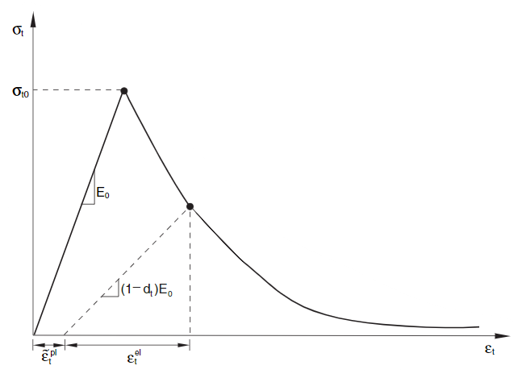{width="3.154600831146107in" height="2.322834645669291in"} | 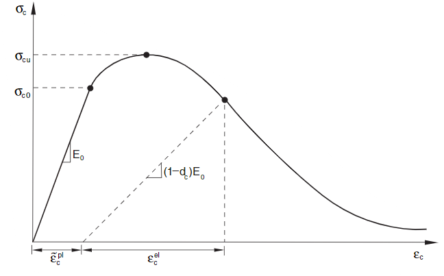{width="3.473596894138233in" height="2.322834645669291in"} |
+================================================================================================+================================================================================================+
| (a) Concrete Damaged Plasticity in tension.                                                    | (b) Concrete Damaged Plasticity in compresion.                                                 |
+------------------------------------------------------------------------------------------------+------------------------------------------------------------------------------------------------+

: []{#_Ref175655499 .anchor}Figure 11: Concrete Damaged Plasticity (CDP) model.

The concrete material used in the SUREWAVE project was designed to have excellent mechanical properties. More specifically, a compression cracking strength of $128$ MPa was obtained (see D4.1 for more info). Standardised models to describe their stress-strain behaviour exist in codes such as the Eurocode 2 \[4\]. However, this standard only envelopes concretes with strengths up to $98$ MPa. Instead, a parametric expression for a constitutive model for high-performance concrete was adapted from \[5\]. [Figure 12](#_Ref179542020) shows the general shape of the tensile and compressive behaviour.

![[]{#_Ref179542020 .anchor}Figure 12: Schematic representation of the parametric constitutive model from \[5\].](../images/2024-11-07_surewave_d5.3_structural_integrity_assessment/image15.png){alt="P849#yIS1" width="2.976619641294838in" height="2.1653543307086616in"}

The tensile part is formed by multiple segments, whereas the compressive region follows the expression in equation (1) before the softening stages:

  ------------------------------------------------------------------------------------------------------------------------------------------------------------------------------------------------------------------
  $$\sigma_{c} = E_{c0}\ \varepsilon\ \left( 1 - \ \frac{1}{n + 1}\frac{\varepsilon^{n}}{\varepsilon_{0}^{n}} \right)$$      , where      $$E_{c0} = \frac{n + 1}{n}\frac{f_{c}}{\varepsilon_{0}}$$   ,      \(1\)
  ----------------------------------------------------------------------------------------------------------------------- -- --------- -- ----------------------------------------------------------- --- -- -------

  ------------------------------------------------------------------------------------------------------------------------------------------------------------------------------------------------------------------

where $n$ is a fitting parameter and $\varepsilon_{0}$ is a strain that is completely defined by fitting/experimental parameters $f_{c}$, n and $E_{c0}$. For the tensile part, strains $\varepsilon_{1}$ and $\varepsilon_{2}$ are described by equation (2):

  ------------------------------------------------------------------------------------------------------------------------------------------------------------------------------
  $$\varepsilon_{1} = 0.8\ \frac{f_{t}}{E_{c0}}$$      and      $$\varepsilon_{2} = \varepsilon_{1} + \ 0.4\ \left( \varepsilon_{t} - \varepsilon_{1} \right)$$   .      \(2\)
  ------------------------------------------------- -- ----- -- ------------------------------------------------------------------------------------------------- --- -- -------

  ------------------------------------------------------------------------------------------------------------------------------------------------------------------------------

In this formulation, the softening behaviour of both the tensile and compressive region are modelled as linear. For this work, the unloading was generalised to be exponential, with a $\alpha_{i}\ ,\ \ i \in \left\{ c,t \right\}$ parameter to determine the softening rate, as per equation (3):

  -------------------------------------------------------------------------------------------------------------------------------------------------------------------------------------------------------------------------------------------------------------------------------------------------------------
  $$\sigma_{i}\left( \varepsilon > \varepsilon_{i} \right) = f_{i} - \beta_{i}\left( 1 - e^{- \alpha_{i}\left( \varepsilon - \varepsilon_{i} \right)} \right)$$      , where      $$\beta_{i} = \frac{f_{i} - f_{iu}}{1 - e^{- \alpha_{i}\left( \varepsilon_{iu} - \varepsilon_{i} \right)}}$$   .      \(3\)
  --------------------------------------------------------------------------------------------------------------------------------------------------------------- -- --------- -- -------------------------------------------------------------------------------------------------------------- --- -- -------

  -------------------------------------------------------------------------------------------------------------------------------------------------------------------------------------------------------------------------------------------------------------------------------------------------------------

A unified ($\varepsilon_{c},f_{c}$), ($\varepsilon_{t},f_{t}$) and ($\varepsilon_{cu},f_{cu}$), ($\varepsilon_{tu},f_{tu}$) notation was used to refer to peak and ultimate stress-strain pairs. $\varepsilon_{cu}$ corresponds to $\varepsilon_{c0}$ in [Figure 12](#_Ref179542020). This model was calibrated using data from the experimental testing campaign that SINTEF carried out on the beams that ACCIONA provided. The available experimental data was the following: results from 10 three-point bending (3PB) experiments on beams with nominal size $600 \times 150 \times 100$ mm^3^. 6 of them were tested in the *strong* configuration (deformation occurred along the side that was $150$ mm long) and 4 in the *weak* configuration (deformation along the side that was $100$ mm long). The beams had a nominal outer shell of $20$ mm made from HPC, and an inner core of cellular concrete. It was observed after the bending tests, that the actual wall thicknesses of the obtained samples did not exactly match the nominal value. All 4 wall thicknesses in the fractured cross-section were measured, and FE simulations using those geometries were carried out for the calibration. Deformation was applied by supporting the samples between two rectangular pins ($50$ mm side, $11$ mm fillet radius, modelled as rigid) separated by $470$ mm, and indenting it with another identical pin in the centre. Due to the symmetry of the system, only half of the geometry was modelled. The goal was to obtain the parameter set that would capture two effects: the maximum force of the various 3PB tests, and their corresponding pin displacements. An automatised Python script was written to carry out the computations, where simulations for each geometry were run and then evaluated for the selected material model properties. [Figure 13](#_Ref179545349) shows an example of the mesh of one of the beams simulated (left), and the accumulated plastic equivalent tensile strain during a 3PB simulation (right).

+-------------------------------------------------------------------------------------------------+-------------------------------------------------------------------------------------------------+
| 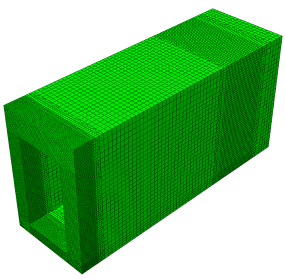{width="2.5827384076990376in" height="2.497141294838145in"} | 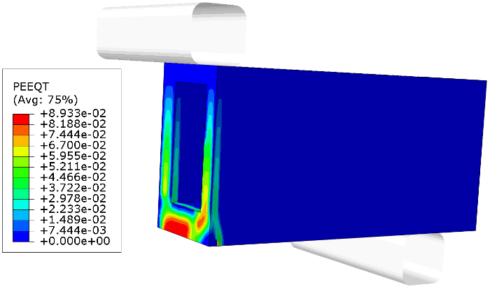{width="3.194166666666667in" height="1.9684405074365705in"} |
+=================================================================================================+=================================================================================================+
| (a) Mesh of one of the geometries.                                                              | (b) Example of a 3PB simulation.                                                                |
+-------------------------------------------------------------------------------------------------+-------------------------------------------------------------------------------------------------+

: []{#_Ref179545349 .anchor}Figure 13: 3PB simulations carried out for the calibration of the mechanical model.

The results of the calibration procedure are shown in [Figure 14](#_Ref179545665). It can be seen that the agreement of the results is excellent for the forces (right), even the differences between loading along the *strong* vs the *weak* direction. The displacements have not been captured as accurately, especially the large differences between both loading schemes. It is hypothesised to be a natural limitation of the CDP model, due to its isotropic nature. Given the global difficulties in modelling concrete due to its complicated internal composition, these results are deemed satisfactory. An orthotropic extension of the CDP model will be explored. The simulations for the structural health evaluation will be carried out using the isotropic CDP model.

![[]{#_Ref179545665 .anchor}Figure 14: Calibration results. Left: displacements at maximum force. Right: maximum force values.](../images/2024-11-07_surewave_d5.3_structural_integrity_assessment/image18.png){alt="P900#yIS1" width="6.062992125984252in" height="2.8607895888013997in"}

[Table 7](#_Ref179545386) contains the final parameters selected after the calibration. These are the parameters used for the FE simulations of the breakwater system. Their corresponding tensile and compressive constitutive curves are shown in [Figure 15](#_Ref179545483). The red curve corresponds to the tensile behaviour, and the blue one to the behaviour under compression. Note that the axes have different limits for both curves.

+-----------------------------------------------------------------------------------------------------------------------------------------------------------------------------------------------------------------------------------------------------------+
| **HPC Model Properties**                                                                                                                                                                                                                                  |
+:======================:+:============:+:=================================================================================:+:===============:+:====================================:+:============:+:======================================:+:============:+
| **Elastic**                           | **CDP**                                                                                             | **Compression**                                     | **Tension**                                           |
+------------------------+--------------+-----------------------------------------------------------------------------------+-----------------+--------------------------------------+--------------+----------------------------------------+--------------+
| $\mathbf{E}$ **(GPa)** | $$44$$       | $$\mathbf{\psi}$$                                                                 | $$40$$          | $\mathbf{f}_{\mathbf{c}}$ **(MPa)**  | $$128$$      | $\mathbf{f}_{\mathbf{t}}$ **(MPa)**    | $$11$$       |
+------------------------+--------------+-----------------------------------------------------------------------------------+-----------------+--------------------------------------+--------------+----------------------------------------+--------------+
| $$\mathbf{\nu}$$       | $$0.15$$     | $$\mathbf{\varepsilon}$$                                                          | $$0.1$$         | $\mathbf{f}_{\mathbf{cu}}$ **(MPa)** | $$12.3$$     | $$\mathbf{\varepsilon}_{\mathbf{t}}$$  | $$0.0015$$   |
+------------------------+--------------+-----------------------------------------------------------------------------------+-----------------+--------------------------------------+--------------+----------------------------------------+--------------+
|                        |              | $$\mathbf{\sigma}_{\mathbf{b0}}\textit{\textbf{/}}\mathbf{\sigma}_{\mathbf{c0}}$$ | $$1.16$$        | $\mathbf{\varepsilon}_{\mathbf{cu}}$ | $$0.012$$    | $\mathbf{f}_{\mathbf{tu}}$ **(MPa)**   | $$1.1$$      |
+------------------------+--------------+-----------------------------------------------------------------------------------+-----------------+--------------------------------------+--------------+----------------------------------------+--------------+
|                        |              | $$\mathbf{K}_{\mathbf{c}}$$                                                       | $$\frac{2}{3}$$ | $$\mathbf{\alpha}_{\mathbf{c}}$$     | $$350$$      | $$\mathbf{\varepsilon}_{\mathbf{tu}}$$ | $$0.004$$    |
+------------------------+--------------+-----------------------------------------------------------------------------------+-----------------+--------------------------------------+--------------+----------------------------------------+--------------+
|                        |              | $$\mathbf{\mu}$$                                                                  | $$0.0001$$      | $$\mathbf{n}$$                       | $$1.1$$      | $$\mathbf{\alpha}_{\mathbf{t}}$$       | $$550$$      |
+------------------------+--------------+-----------------------------------------------------------------------------------+-----------------+--------------------------------------+--------------+----------------------------------------+--------------+

: []{#_Ref179545386 .anchor}Table 7: Material properties corresponding to the calibrated model.

![[]{#_Ref179545483 .anchor}Figure 15: Tension (red) and compression (blue) curves of the calibrated material model.](../images/2024-11-07_surewave_d5.3_structural_integrity_assessment/image19.png){alt="P957#yIS1" width="3.6890485564304463in" height="2.9338232720909887in"}

# 3 Global FE Model

In this chapter, a description of the global FE model is given, including detailed information about reinforcement, application of boundary conditions and loads, meshing of the model and evaluation of the location of critical areas within the breakwater.

## 3.1 Reinforcement and Meshing

Reinforcement bars occupy approximately $5\%$ of the volume of the whole system. Modelling the hybrid concrete-reinforcement system directly would require including the geometry for the holes to fit the reinforcement bars, as well as characterising the interface between both materials (using cohesive boundaries or similar transition elements). Moreover, the mesh around the interface would need to be dense to avoid numerical errors. For systems with a large number of reinforcement bars such as this one, the computational effort needed to include that degree of detail would be very large. Instead, a typical solution is to use the embedded element technique. This is a perturbational technique, which consists of meshing the matrix (concrete) and reinforcement as two independent features, and to account for the effect of reinforcement as a correction to the stiffness tensor of the matrix material \[6-8\]. [Figure 16](#_Ref179716390) shows the difference between using embedded elements (left) and the direct detailed approach (right) for a small system. Including this level of detail for the whole breakwater with $> 2000$ bars would not be efficient at all.

![[]{#_Ref179716390 .anchor}Figure 16: Comparison between the direct approach (right) and the embedded element technique (left) to model reinforcement in the concrete matrix. This system does not include transition elements, as its aim is to highlight difference of mesh complexity.](../images/2024-11-07_surewave_d5.3_structural_integrity_assessment/image20.png){alt="P965#yIS1" width="4.568965441819772in" height="1.3774682852143483in"}

Due to the large number of reinforcement bars, detailed modelling of the whole mesh would imply the need for long calculation times. The purpose of the reinforcement bars is to absorb tensile stresses, to avoid splitting of the concrete structure. That is, they are designed to work mainly under uniaxial tension/compression loading conditions. With the aim to simplify the system for the global FE model, in a way that captures their tensile stiffening appropriately, a study was conducted, as described in reference \[9\] (in Basque). This study consisted of comparing the mechanical response of a reinforced concrete system where the full 3D geometrical representation of rebars was considered, versus element types with fewer degrees of freedom. All the simulations used the embedded element technique to simulate reinforcement. The considered systems were:

- Solid 3D rebars meshed with hexahedral elements, reduced integration (C3D8R).

- 2D rebar layers meshed with membrane elements, reduced integration (M3D4R).

- 1D rebars meshed with truss/beam elements (T3D2/B31).

Two mechanical tests were simulated in ABAQUS: a three-point bending test (stress state close to uniaxial) and a punch test (two-dimensional, 2D, stress state). The main difference between the hexahedral (3D), membrane (2D) and truss and beam (1D) elements is the effect that the presence of reinforcing material has on the stiffness matrix \[10-12\]. For 3D elements, elements where matrix and reinforcement meshes coincide in space are stiffened following the formulation in \[2\]. 2D and 1D elements have no volume, so they each consider mesh intersection in a different manner.

For 2D elements, all in-plane elements of the matrix are in contact with the reinforcement. The total number of reinforcement bars in both in-plane directions and their section area is then specified for the volume stiffening. For 1D elements, bars need to be included individually, and each bar's diameter must be specified. The description of 1D elements resembles the incorporation of 3D bars more closely, since the use of a 2D membrane implies coverage of a large effective surface, and it does not allow control over the positioning of individual reinforcement bars.

From the results obtained from the simulations, it was observed that 2D elements caused over-stiffening of the matrix, especially in the 3PB test, where the stress state was close to uniaxial. This is likely due to the larger total surface of the 2D layer, which covers the entire section of the sample. 1D elements (truss and beam) produced nearly identical displacement results to the 3D case. The whole stress field was not captured, due to the uniaxial nature of 1D elements. Simulation times were greatly reduced from both lower dimension reinforcements. The formulation of truss elements (mainly designed to work in tension/compression, not in shear/bending conditions) was favoured between both types of 1D elements. In the global model, 1D elements were used to represent the reinforcement, capturing strains with high fidelity. To obtain a detailed description of the stress state of the rebars for the fatigue life analysis, the displacements of the global model will be used as boundary conditions for the submodelling analysis, where the full 3D representation of rebars will be included. This way, reasonable simulation times are possible thanks to the simplified 1D representation of reinforcement, and the detailed stress field necessary for fatigue life assessment will be available thanks to the subsequent submodelling simulation, without sacrificing accuracy.

[Figure 17](#_Ref176780277) shows the spatial distribution of rebars in the breakwater:

![[]{#_Ref176780277 .anchor}Figure 17: Reinforcement in the global FE model.](../images/2024-11-07_surewave_d5.3_structural_integrity_assessment/image21.png){alt="P981#yIS1" width="6.665051399825022in" height="3.277571084864392in"}

Concerning the mesh, 167080 C3D8R (hexahedral elements, reduced integration) and 1583 C3D6 (wedge) elements were used to build the breakwater, while 707181 T3D2 (truss) elements were used to mesh the 2303 rebars in the model. Regarding the 3D elements, [Figure 18](#_Ref176785307) shows the size of the hexahedral and wedge elements constituting the concrete part of the breakwater in the most complex part of the geometry.

![[]{#_Ref176785307 .anchor}Figure 18: Zoom of the breakwater mesh.](../images/2024-11-07_surewave_d5.3_structural_integrity_assessment/image22.png){alt="P984#yIS1" width="5.770284339457568in" height="3.4485290901137358in"}

## 3.2 Loads and Boundary Conditions 

The focus of this section is to discuss the application of loads described in section [2.2 Connector and Mooring Loads](#connector-and-mooring-loads) and how boundary conditions were defined in the model. In reality, the connection between the breakwaters is made by using metallic cables in two points of the head, as shown in [Figure 19](#_Ref175311840). The load values provided by MARIN were calculated at a single point in the middle of the connection system. For the FE simulations, two load application regions within the breakwater were used for the connector load.

![[]{#_Ref175311840 .anchor}Figure 19: Connection system between breakwaters.](../images/2024-11-07_surewave_d5.3_structural_integrity_assessment/image24.svg){alt="P989#yIS1" width="6.299212598425197in" height="2.5056594488188977in"}

The connection system is represented by two rubber boxes positioned as shown in [Figure 20](#_Ref175312894). Rubber has been included as a linear elastic material with $E = 27$ GPa and $\nu = 0.4$. Contact between the rubber and the concrete is modelled as a tie constraint to avoid relative movement between the connection system and the breakwater. Volume forces are then applied to these boxes, with their values determined through a static equilibrium calculation. Point forces are avoided because artificial stress concentrations can be caused, giving rise to numerical issues.

![[]{#_Ref175312894 .anchor}Figure 20: Load conversion from the calculation point (top) to the connection system volume (bottom).](../images/2024-11-07_surewave_d5.3_structural_integrity_assessment/image25.png){alt="P993#yIS1" width="6.686142825896763in" height="3.306298118985127in"}

In [Figure 20](#_Ref175312894), the images above indicate the point where MARIN calculated the forces and moments of the connection system. The images below depict the equivalent system used in the FE simulations, considering the rubber boxes as the points of load application. To perform the transformation from loads at a single point to two points, the dimensions from [Table 8](#_Ref179488975) are required.

  ---------------------------------------------------------------------------------------------------------------------------------------------------------------------------------------------------------------------------------------------------------------------------------------------------------------------------------------------------------------------------------------
   $$\mathbf{d}_{\mathbf{1}}\mathbf{\ }\left( \mathbf{m} \right)$$   $$\mathbf{d}_{\mathbf{2}}\mathbf{\ }\left( \mathbf{m} \right)$$   $$\mathbf{d}_{\mathbf{3}}\mathbf{\ }\left( \mathbf{m} \right)$$   **α (rad)**   **β (rad)**   $$\mathbf{v}_{\mathbf{Connector}}\left( \mathbf{m}^{\mathbf{3}} \right)$$   $$\mathbf{v}_{\mathbf{Mooring}}\left( \mathbf{m}^{\mathbf{3}} \right)$$
  ----------------------------------------------------------------- ----------------------------------------------------------------- ----------------------------------------------------------------- ------------- ------------- --------------------------------------------------------------------------- -------------------------------------------------------------------------
                              $$2.098$$                                                         $$2.161$$                                                         $$2.05$$                                $$0.211$$     $$1.886$$                                    $$0.21$$                                                                   $$0.117$$

  ---------------------------------------------------------------------------------------------------------------------------------------------------------------------------------------------------------------------------------------------------------------------------------------------------------------------------------------------------------------------------------------

  : []{#_Ref179488975 .anchor}Table 8: Needed variables for load conversion from MARIN input to FE model.

The mooring system, shown in [Figure 21](#_Ref178506802) (extracted from deliverable D3.3, coincidentally Figure 21 in that document too), consists of a steel beam that goes through the thickness of the breakwater, near its centre. For this load application system, no geometrical simplification was required. The general geometry was included as shown in the design (no dimensions were provided), and application of volume forces was direct, without the need to distribute mooring force data. The embedded element technique was utilised, similar to the consideration of reinforcement.

![[]{#_Ref178506802 .anchor}Figure 21: Mooring system in the breakwater. Figure 21 from D3.3.](../images/2024-11-07_surewave_d5.3_structural_integrity_assessment/image26.png){alt="P1016#yIS1" width="4.566929133858268in" height="2.726382327209099in"}

As mentioned in previous chapters, only the modulus of the mooring forces was provided for each sea condition. The direction of application was assumed to be constant at all instants. [Figure 22](#_Ref178321310) shows the information from other deliverables used to calculate the initial angle of the mooring line from catenary calculations. Angles were $\gamma = 0.613$ rad $\approx 35{^\circ}$, $\gamma = 0.484$ rad $\approx 28{^\circ}$ and $\gamma = 0.383$ rad $\approx 22{^\circ}$ for the Baltic, Mediterranean and North Sea configurations, respectively.

+--------------------------------------------------------------------------------------------------+------------------------------------------------------------------------------------------------+
| 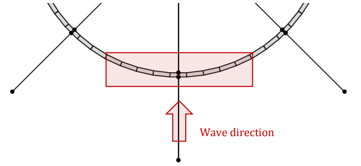{width="3.070009842519685in" height="1.4179101049868765in"} | 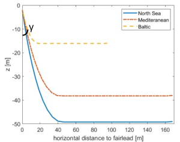{width="3.15669728783902in" height="2.483267716535433in"} |
+==================================================================================================+================================================================================================+
| (a) Wave direction.                                                                              | (b) Catenary position in equilibrium.                                                          |
+--------------------------------------------------------------------------------------------------+------------------------------------------------------------------------------------------------+

: []{#_Ref178321310 .anchor}Figure 22: Projection angle of the mooring force. Left: Image from Table 8 in. D3.3. Right: Figure 39 from D5.1.

The mooring system is then included in the finite element model. [Figure 23](#_Ref179855575) illustrates how the load is applied (as a volume force, see below) and the location of the system within the model. It is important to note that only half of the mooring force is applied, due to the symmetry condition.

![[]{#_Ref179855575 .anchor}Figure 23: Application of mooring forces in the FE model.](../images/2024-11-07_surewave_d5.3_structural_integrity_assessment/image30.png){alt="P1028#yIS1" width="5.0184251968503935in" height="3.7720581802274715in"}

Applying forces in a FE model as volumetric forces rather than as point loads on a single node is advantageous. Point loads can cause singularities and unrealistic stress concentrations, leading to inaccurate results and potentially non-converging solutions. Volumetric forces, however, distribute the load evenly across the mesh, reflecting the actual physical behaviour of materials under load and resulting in smoother, more accurate stress fields and improved convergence of the numerical solution. The loads presented in [Table 4](#_Ref176786684), [Table 5](#_Ref179679999) and [Table 6](#_Ref179680000) were adapted to volumetric forces, and their numerical values were included in [Table 13](#_Ref179548705), [Table 14](#_Ref179680293) and [Table 15](#_Ref179680298) (appendix C). In order to calculate these forces, it is necessary to utilise the volumes specified in [Table 8](#_Ref179488975). [Figure 26](#_Ref176789170) contains the diagrams describing load application in the global FE model, as well as the boundary conditions.

In addition to applying loads, it is crucial to impose boundary conditions that prevent rigid body movements of the breakwater. In addition to the symmetry in the plane perpendicular to the $z$ axis, which limits translation in the $z$ direction and rotations in the $x$ and $y$ directions of that plane, it is also necessary to restrict translations and rotations of the whole part within the $0xy$ plane. The central face of the breakwater is naturally restricted (displacements in the $z$ direction, twisting in $x$ and $y$ axes) due to the symmetry boundary. The whole face's displacement was also pinned in the remaining two directions. Less restrictive boundary conditions led to numerical convergence issues. For instance, pinning a single node (to avoid rigid body movement) and limiting the displacement of another node in either the $x$ or $y$ direction (to prevent rotation around the pinned node) caused great stress concentration around the pinned node. Since the material model includes softening behaviour once a certain threshold has been exceeded, this led to numerical issues. High artificial damping (viscosity) factors were needed for these simulations to converge. Moreover, stress fields for both boundary conditions were compared for low loads, and it was observed that the mechanical response for the region of most interest (critical areas, as described below in the text) was similar.

+-----------------------------------------------------------------------------------------------------+
| 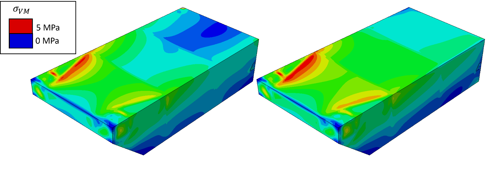{width="6.198530183727034in" height="2.037095363079615in"}     |
+:================================================:+:================================================:+
| \(a\) Two vertices fixed.                        | \(b\) Whole symmetry plane pinned.               |
+--------------------------------------------------+--------------------------------------------------+

: []{#_Ref179489641 .anchor}Figure 24: Effect of the boundary conditions on the stress fields.

The stress fields for the same system with both boundary conditions are depicted in [Figure 24](#_Ref179489641), showing good agreement between both simulations near the connector load application points. [Figure 25](#_Ref179489799) further illustrates the difference between the two situations. The difference in stress values was significant near the vertices (due to stress concentration and concrete softening), and negligible at the regions far from the boundary conditions. Fixing the entire face leads to greater stress, making the structure more stressed and the lifetime prediction more conservative. It should be noted that the origin of these differences may be related to energy dissipation due to artificial damping, which accounted for a significant portion of the total strain energy for the fixed vertices case. Finally, as described in subsequent chapters, it was observed that the most critical parts of the breakwater are mostly located close to the connection system, where the difference in stress is negligible, and not close to the symmetry plane.

![[]{#_Ref179489799 .anchor}Figure 25: Differences between both boundary conditions.](../images/2024-11-07_surewave_d5.3_structural_integrity_assessment/image32.png){alt="P1041#yIS1" width="4.941176727909012in" height="2.8028805774278216in"}

Both scenarios lead to the identification of the same critical areas, enabling the determination of sensor placement for crack and corrosion detection. Therefore, pinning the whole symmetry plane was chosen as the main boundary condition, which does not require high damping (small dissipation of plastic strain), does not generate numerical problems and can lead to a more conservative prediction in the worst-case scenario. The global model, including all boundary conditions and loads, is available in [Figure 26](#_Ref176789170).

![[]{#_Ref176789170 .anchor}Figure 26: Loads and boundary conditions in the global FE model.](../images/2024-11-07_surewave_d5.3_structural_integrity_assessment/image33.png){alt="P1045#yIS1" width="4.457829177602799in" height="2.875in"}

## 3.3 Critical Areas

After the simulation of the 11 extreme events and the 2 fatigue cases for each sea condition (see [Table 4](#_Ref176786684), [Table 5](#_Ref179679999) and [Table 6](#_Ref179680000)), the stress fields of both the reinforcement system and concrete were analysed to detect the most loaded regions of the breakwater. [Figure 27](#_Ref179534724), [Figure 29](#_Ref180153476) and [Figure 31](#_Ref180153478) display the stress fields of the concrete and [Figure 28](#_Ref179534726), [Figure 30](#_Ref180153482) and [Figure 32](#_Ref180153484) display the stress fields of the reinforcement; for the Baltic Sea, Mediterranean Sea and North Sea conditions, respectively. The stress distributions highlight some regions of stress concentration.

![[]{#_Ref179534724 .anchor}Figure 27: Stress fields on concrete for the 11 extreme events in [Table 4](#_Ref176786684) (Baltic Sea).](../images/2024-11-07_surewave_d5.3_structural_integrity_assessment/image34.png){alt="P1052#yIS1" width="5.969119641294838in" height="4.233766404199475in"}

![[]{#_Ref179534726 .anchor}Figure 28: Stress fields on the reinforcement for the 11 extreme events in [Table 4](#_Ref176786684) (Baltic Sea).](../images/2024-11-07_surewave_d5.3_structural_integrity_assessment/image35.png){alt="P1055#yIS1" width="6.083991688538933in" height="4.2721784776902885in"}

![[]{#_Ref180153476 .anchor}Figure 29: Stress fields on concrete for the 11 extreme events in [Table 5](#_Ref179679999) (Mediterranean Sea).](../images/2024-11-07_surewave_d5.3_structural_integrity_assessment/image36.png){alt="P1058#yIS1" width="6.113888888888889in" height="4.334027777777778in"}

![[]{#_Ref180153482 .anchor}Figure 30: Stress fields on the reinforcement for the 11 extreme events in [Table 5](#_Ref179679999) (Mediterranean Sea).](../images/2024-11-07_surewave_d5.3_structural_integrity_assessment/image37.png){alt="P1062#yIS1" width="5.948052274715661in" height="4.2371237970253715in"}

![[]{#_Ref180153478 .anchor}Figure 31: Stress fields on concrete for the 11 extreme events in [Table 6](#_Ref179680000) (North Sea).](../images/2024-11-07_surewave_d5.3_structural_integrity_assessment/image38.png){alt="P1065#yIS1" width="6.0665923009623794in" height="4.1948053368328955in"}

![[]{#_Ref180153484 .anchor}Figure 32: Stress fields on the reinforcement for the 11 extreme events in [Table 6](#_Ref179680000) (North Sea).](../images/2024-11-07_surewave_d5.3_structural_integrity_assessment/image39.png){alt="P1068#yIS1" width="6.254451006124235in" height="4.409090113735783in"}

Static calculations of the global FE model show the ability of the system of withstand the highest loads from the received time series. For most of the simulations, simulations converged without any issue. Even in those calculations, regions with higher stresses (stress concentrators) were present. These stress concentrators are associated with sudden changes in cross section and the presence of sharp edges. Some of these sharp edges arise from the construction of the 3D model: a compromise had to be reached between adding complexity to the system (the material model, the spatial distribution of reinforcement) and reducing computation time (limiting mesh density). Adding fine geometrical details such as rounding to the edges was not possible. For some of the North Sea and Mediterranean condition simulations, where the torque around the vertical axis M~y~ (in the FE coordinate system) was the highest load component, these analyses had difficulties with convergence. This was a direct consequence of the severe deformations originated from the softening of concrete in stress concentrating regions. To overcome these instabilities, additional submodelling simulations for those events were carried out, as described in section [4 Submodelling](#submodelling).

[Figure 33](#_Ref179491111) is used to better observe the most critical regions identified in the static global simulations. The highlighted areas in the model indicate the different zones where stress concentrations have occurred for multiple extreme events. Two regions have stood out from the rest: load application points (especially connector loads), and geometrical stress concentrator near those points.

![[]{#_Ref179491111 .anchor}Figure 33: Stress concentrations around connector force application regions and due to geometric reasons.](../images/2024-11-07_surewave_d5.3_structural_integrity_assessment/image40.png){alt="P1072#yIS1" width="5.3665573053368325in" height="4.205882545931758in"}

Stress concentrations in the equivalent fatigue cycle's simulation have been identified in [Figure 34](#_Ref179492206). Even if the stresses are not as high as in extreme events, as expected, a detailed description of the stress distribution is needed to evaluate the system\'s infinite fatigue life as accurately as possible. Similar to extreme events, stress concentrations occur near one of the connectors' load application regions. Two critical locations have been identified: directly next to the force application system (referred to as region Submodel 1 in subsequent analyses) and at a geometrical stress concentrator due to a cross section change near this region (referred to as region Submodel 2 in subsequent analyses).

+------------------------------------------------------------------------------------------------------------------+
| 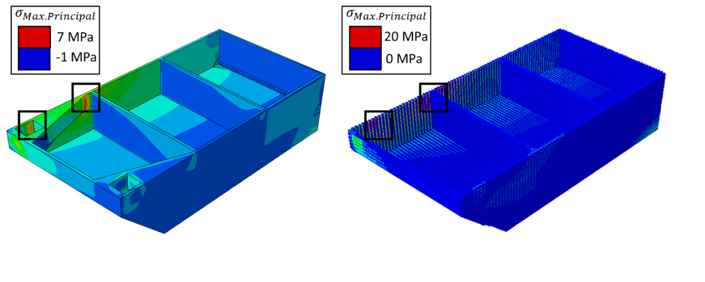{width="5.708333333333333in" height="1.9144903762029746in"}                 |
+:====================================================:+:=========================================================:+
| \(a\) Stress field on concrete for fatigue analysis. | \(b\) Stress field on reinforcement for fatigue analysis. |
+------------------------------------------------------+-----------------------------------------------------------+

: []{#_Ref179492206 .anchor}Figure 34: Critical regions in the fatigue equivalent cycle. Stress field on concrete and reinforcement.

# 4 Submodelling

The advanced submodelling technique in ABAQUS makes use of Saint-Venant's principle of \[13\], which holds that the precise distribution of load application has negligible influence on the stress and strain at sufficiently large distances from the loading zone. Besides loads, this principle can also be applied to stress concentration zones or model details, far from the region where the loads are applied. In practice, this means that either stresses or displacements from the global model can be used to drive the local submodel, ensuring that localised phenomena are accurately represented without necessitating an excessively fine mesh across the entire structure. The advantages of this approach include significant computational efficiency, as it allows for a focused refinement in regions of interest, and enhanced accuracy in critical areas, all while avoiding the prohibitive computational cost associated with a fully detailed global analysis.

## 4.1 Submodel in Fatigue Analysis

As mentioned above, the submodelling technique permits applying a relatively coarse mesh to the global simulation of a system, to calculate an initial estimate of the mechanical response, to then use the submodelling methodology to obtain more detailed information in areas of special interest. In this study, the additional detail included in the submodel of the fatigue analyses is the inclusion of 3D rebars in critical areas, which allows obtaining fully detailed information about the stress fields along the rebar. To do so, firstly, a global model is simulated using 1D truss elements as rebars. This helps to reduce the computational cost severely, while still achieving a sufficient description of displacements and stresses throughout the breakwater, and identification of the most stressed reinforcement rebars and the most critical areas of the structure ([Figure 34](#_Ref179492206)). After completing the global simulation, the 3D rebars are included in the submodel, the mesh is refined, and the boundaries of the submodel are defined near the critical areas, taking into consideration the principle of Saint-Venant. Regarding load cases, only the case study linked to the life prediction and fatigue analysis is considered for the inclusion of 3D rebars. For further crack propagation calculations, it is necessary to know the complete stress field of the rebar, which is why the submodel technique is required.

![[]{#_Toc179548542 .anchor}Figure 35: Mesh difference between global model and submodels.](../images/2024-11-07_surewave_d5.3_structural_integrity_assessment/image42.png){alt="P1091#yIS1" width="3.5039370078740157in" height="2.4230030621172354in"}

While the global model had 168663 3D elements and 707181 truss elements, the submodel of the corner (Submodel 1) requires 394932 3D elements and 76625 truss elements, and the submodel at the centre (Submodel 2) requires 1516548 3D elements and 73952 truss elements. To perform the simulation, displacements were used as boundary conditions instead of stresses. The boundaries of the two submodels and the defined boundary conditions are shown in [Figure 36](#_Ref178158246).

+---------------------------------------------------------------------------------------------------+---------------------------------------------------------------------------------------------------+
| 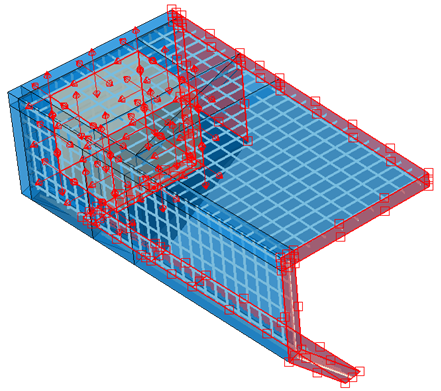{width="2.9187040682414698in" height="2.5984251968503935in"} | 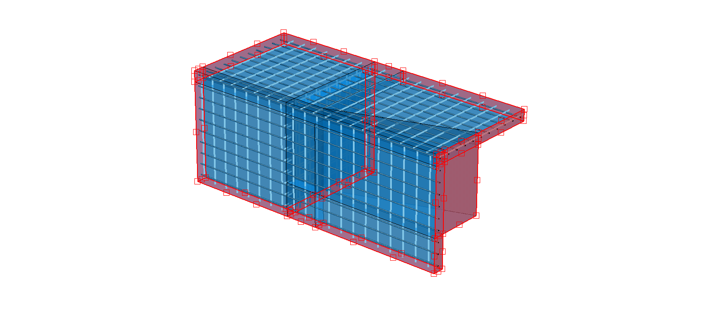{width="3.5067891513560805in" height="2.5984251968503935in"} |
+===================================================================================================+===================================================================================================+
| (a) Corner submodel. Submodel 1.                                                                  | (b) Central submodel. Submodel 2.                                                                 |
+---------------------------------------------------------------------------------------------------+---------------------------------------------------------------------------------------------------+

: []{#_Ref178158246 .anchor}Figure 36: Boundary conditions and loads on the corner submodel (a) and the central submodel (b).

To confirm the accuracy of the results, the initial step is to make sure that stresses and strains are consistent at the boundaries of both models. As shown in [Figure 37](#_Ref178159405), both criteria are satisfied, thus validating the results of the submodels and justifying further investigation.

+--------------------------------------------------------------------------------------------------+--------------------------------------------------------------------------------------------------+
| 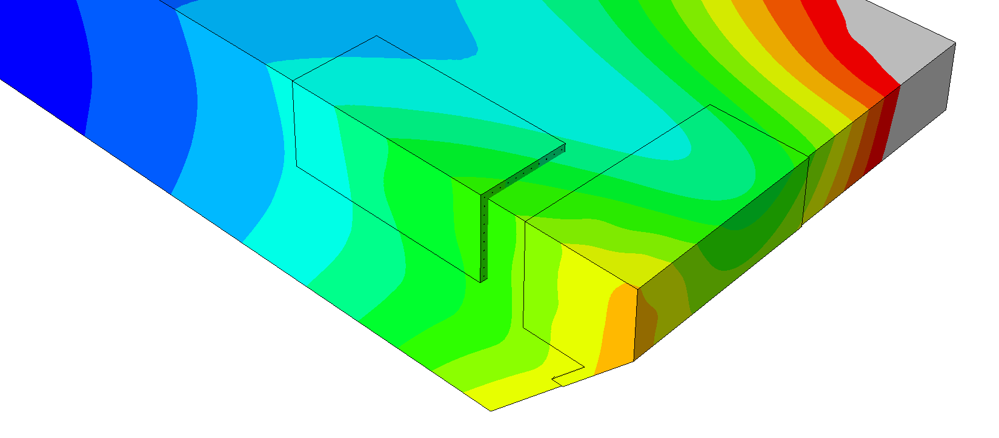{width="3.196846019247594in" height="2.5196850393700787in"} | 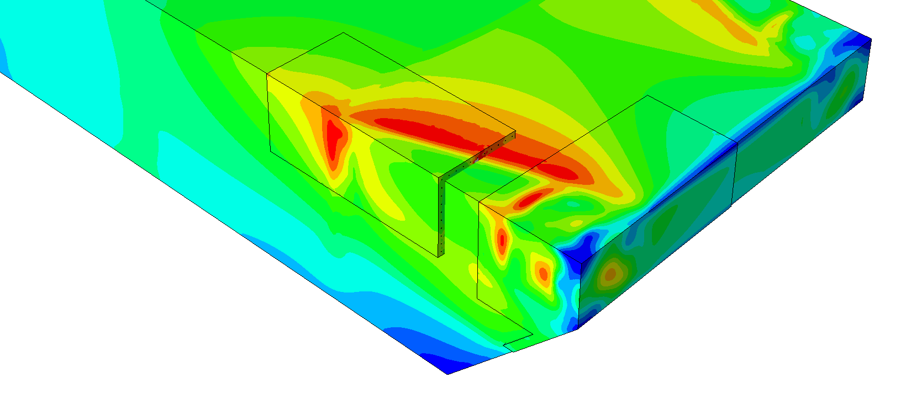{width="3.196846019247594in" height="2.5196850393700787in"} |
+==================================================================================================+==================================================================================================+
| (c) Displacement field.                                                                          | (d) Stress field.                                                                                |
+--------------------------------------------------------------------------------------------------+--------------------------------------------------------------------------------------------------+

: []{#_Ref178159405 .anchor}Figure 37: Displacement (c) and stress (d) fields in model and submodels.

One advantage of using the submodel is that it provides a more detailed stress field in the studied area due to the refinement. As shown in [Figure 38](#_Ref179492502), this difference can be difficult to detect and is not always very significant.

+--------------------------------------------------------------------------------------------------+--------------------------------------------------------------------------------------------------+
| 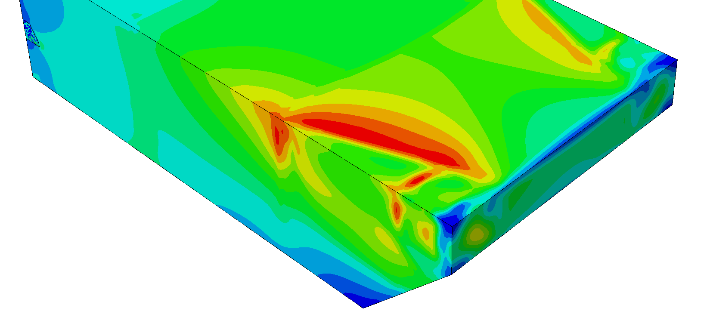{width="3.196846019247594in" height="2.5196850393700787in"} | {width="3.196846019247594in" height="2.5196850393700787in"} |
+==================================================================================================+==================================================================================================+
| (a) Global model.                                                                                | (b) Submodel.                                                                                    |
+--------------------------------------------------------------------------------------------------+--------------------------------------------------------------------------------------------------+

: []{#_Ref179492502 .anchor}Figure 38: Stress distribution difference between the global model (a) and the submodels (b).

The primary objective of the submodel in the study of the breakwater is to take the advantage of replacing rebars without altering the overall behaviour of the system. In [Figure 39](#_Ref179492696), while the included reinforcement may not appear different (with 1D truss elements and solid elements looking very similar), 3D rebars which give a significantly more detailed description of stress state than 1D truss elements were included in the analysis.

+---------------------------------------------------------------------------------------------------+---------------------------------------------------------------------------------------------------+
| 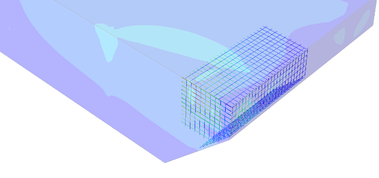{width="3.1346227034120733in" height="1.9678772965879265in"} | 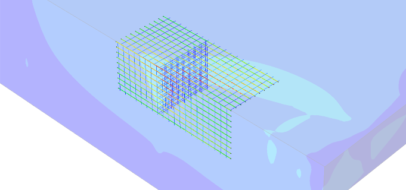{width="3.0436504811898515in" height="1.9680555555555554in"} |
+===================================================================================================+===================================================================================================+
| (a) Reinforcement in Submodel 1.                                                                  | (b) Reinforcement in Submodel 2.                                                                  |
+---------------------------------------------------------------------------------------------------+---------------------------------------------------------------------------------------------------+

: []{#_Ref179492696 .anchor}Figure 39: Solid 3D rebars introduced in the system by the submodels.

The difference is noticeable when observing the rebar from the side. As depicted in [Figure 40](#_Ref179536449) and [Figure 41](#_Ref179536451), the rebar\'s cross section is available to acquire the necessary stress fields for predicting its lifetime. This information is essential for conducting the lifetime prediction in the following chapter. Furthermore, while standard rebars solely calculate axial stress, the use of 3D rebars enables the acquisition of the complete stress tensor of all reinforcement bar elements included in the analysis.

+---------------------------------------------------------------------------------------------------+--------------------------------------------------------------------------------------------------+
| 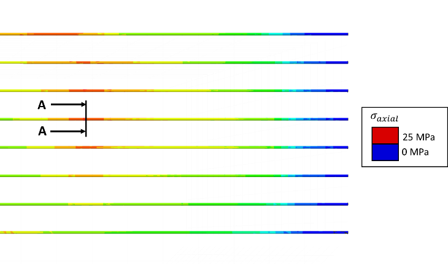{width="3.4645669291338583in" height="1.6221883202099738in"} | 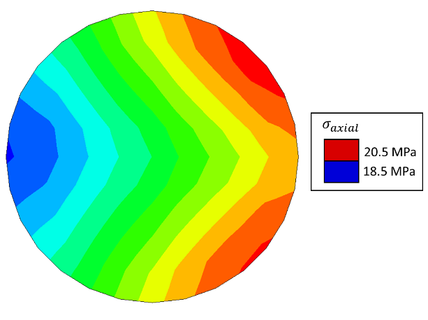{width="2.9921259842519685in" height="2.240168416447944in"} |
+===================================================================================================+==================================================================================================+
| (a) Reinforcement in Submodel 1.                                                                  | (b) Section A-A.                                                                                 |
+---------------------------------------------------------------------------------------------------+--------------------------------------------------------------------------------------------------+

: []{#_Ref179536449 .anchor}Figure 40: Critical section on the corner submodel.

+-------------------------------------------------------------------------------------------------+---------------------------------------------------------------------------------------------------+
| 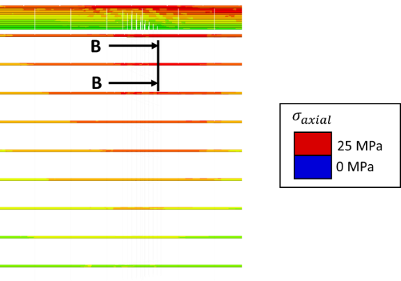{width="2.716535433070866in" height="1.904413823272091in"} | 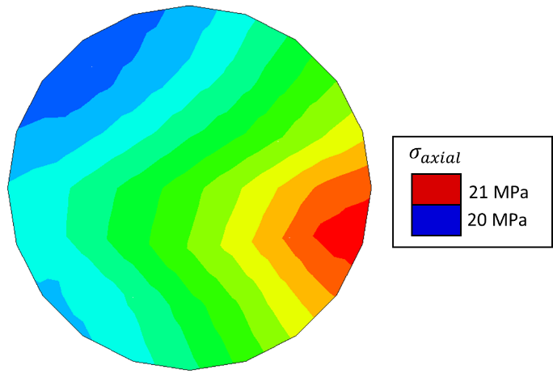{width="2.9921259842519685in" height="2.0436526684164478in"} |
+=================================================================================================+===================================================================================================+
| (a) Reinforcement in Submodel 2.                                                                | (b) Section B-B.                                                                                  |
+-------------------------------------------------------------------------------------------------+---------------------------------------------------------------------------------------------------+

: []{#_Ref179536451 .anchor}Figure 41: Critical section on the central submodel.

## 4.2 Submodel in Extreme Event Analysis

From the 4 extreme events that showed instabilities due to high stress concentrations in the global FE analysis, Event 8 in the North Sea was by far the case with highest stress concentrations. All the events presented higher stress concentrations around the sharp edges in the model, but their effect mostly did not interfere with the analysis and did not cause major negative effects in the observed mechanical result. However, for this event, the stress concentrations showed major mechanical failure of the breakwater. This event was further studied by applying the submodelling methodology to better analyse the extent of the effect of the mesh used for modelling the breakwater, and to discern whether the mechanical failure predicted in the global simulation was a definite result or a numerical artifact. As described in the previous section, the submodelling analysis requires two simulations (global and local). However, the damaged volume (region where plasticity effects occurred) in the global analysis of the event was far too large to be used as boundary conditions for the submodel. Therefore, a simple linear elastic material model that would not result in any damage was used for the global simulation. For the submodel, the sharp edges present in the breakwater were rounded for the numerical analysis, and a denser mesh was used. The boundary for the submodel can be seen in [Figure 42](#_Ref181100940).

![[]{#_Ref181100940 .anchor}Figure 42: Boundary of the submodel to analyse the impact of sharp edges during the most critical event (North Sea - Event 8).](../images/2024-11-07_surewave_d5.3_structural_integrity_assessment/image54.png){alt="P1153#yIS1" width="6.6930555555555555in" height="3.327777777777778in"}

Most of the sharp edges were rounded with a radius of 50 to 100 mm, while some remained sharp due to their lack of associated danger. To accurately capture the curvature in the model, a finer mesh was required, which necessitated the use of tetrahedral elements measuring 10 mm. [Figure 43](#_Ref181098057) illustrates the differences between the two models\' meshes and highlights some of the areas that were modified in the submodel.

![[]{#_Ref181098057 .anchor}Figure 43: Mesh difference between the global model and the submodel for the most critical event (North Sea - Event 8).](../images/2024-11-07_surewave_d5.3_structural_integrity_assessment/image55.png){alt="P1156#yIS1" width="6.690024059492563in" height="2.5416666666666665in"}

In [Figure 43](#_Ref181098057), two areas are highlighted to compare the geometrical and mesh differences, shown in [Figure 44](#_Ref181101532) and [Figure 45](#_Ref181101534).

![[]{#_Ref181101532 .anchor}Figure 44: Geometrical details and mesh of the 1^st^ highlighted area in [Figure 43](#_Ref181098057).](../images/2024-11-07_surewave_d5.3_structural_integrity_assessment/image56.png){alt="P1159#yIS1" width="6.6930555555555555in" height="3.1645833333333333in"}

![[]{#_Ref181101534 .anchor}Figure 45: Geometrical details and mesh of the 2^nd^ highlighted area in [Figure 43](#_Ref181098057).](../images/2024-11-07_surewave_d5.3_structural_integrity_assessment/image57.png){alt="P1162#yIS1" width="6.6930555555555555in" height="3.1645833333333333in"}

The geometrical changes result in a noticeable reduction of the tensile equivalent plastic strain, which is the factor that causes the concrete to soften and initiates structural failure. In [Figure 46](#_Ref181105502), the strains reached in the new submodel are clearly considerably smaller in magnitude. Although the differences between the overall model and the sub-model are significant, the adjustments made still indicate the presence of tensile cracking.

Two factors influence these results: first, the inherent challenge associated with modelling concrete, and its negative response to local stress accumulations. Although the effect has been drastically reduced in the submodelling due to the finer mesh, it has not been eliminated completely. Submodelling simulations required great computational effort (around 24 hours using a Ryzen Threadripper 3970X 32-core @ 3.7 GHz CPU, taking up around 200 GB of RAM), and it was not viable to further refine the mesh to completely quantify the influence. Still, the great reduction in damage accumulation indicates that the effect of the mesh is major.

The second factor is the conservative nature of the boundary conditions used to model the breakwater. Assuming symmetry around the central plane translates to a loading condition reflecting that critical events (maximum loads) occur at exactly the same time in both ends of the breakwater. Specifically for these load cases where the largest load comes from the moment around the vertical axis, the loading scheme is close to pure bending. This naturally generates heavy tensile loading in one side of the breakwater, which is the worst loading case for concrete. Even with this pessimistic assumption, almost all simulation cases have displayed no issues of the breakwater to withstand these loads. From this submodelling study, it has become clear that the remaining 3 cases showed tensile cracking in the global simulation were only failing due to the relatively coarse mesh, although the simulations have not been carried out due to the high computational cost.

+--------------------------------------------------------------------------------------------------------+
| 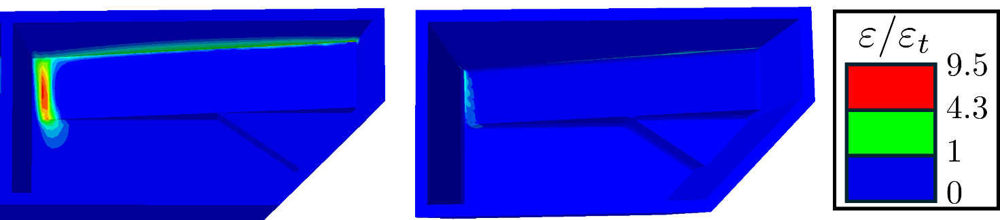{width="6.6172462817147855in" height="1.448409886264217in"}       |
+==================================+==================================+==================================+
| (a) Global model                 | (b) Submodel                     |                                  |
+----------------------------------+----------------------------------+----------------------------------+

: []{#_Ref181105502 .anchor}Figure 46: PEEQT, tensile equivalent plastic strain (North Sea - Event 8).

From the global simulation to the submodel, the proportion of the volume that exceeds the critical tensile strength has been reduced from $10.3\%$ to $3.1\%$. Moreover, the maximum value of tensile strain from one simulation to the other has decreased from $\frac{\varepsilon}{\varepsilon_{t}} \approx 9.5$ to $\frac{\varepsilon}{\varepsilon_{t}} \approx 4.3$. Observing this tendency and considering the conservative nature of all assumptions made during the analysis, in combination with the natural difficulties that simulations using concrete imply, optimistic conclusions about the structural integrity of the breakwater can be drawn. As a global result, the damaging nature of the moment around the vertical axis was made apparent.

# Structural Analysis/Lifetime Assessment

## 5.1 Structural Integrity of Concrete Structure: Analysis of Maximum Loads

In this section, results of the simulations of extreme events will be discussed. In total, 33 simulations of extreme events have been conducted: for each of the 3 sea conditions, 10 corresponding to the maximum positive and negative values of each of the 5 components of connector force, and 1 for the maximum mooring force's modulus. Critical events in [Table 4](#_Ref176786684), [Table 5](#_Ref179679999) and [Table 6](#_Ref179680000) corresponded to loads 2-35 times larger (in modulus) than the mean absolute value of their corresponding time series.

[Table 9](#_Ref180427666) shows the plastic strains under compression and tension in the global FE simulations described in section [3 Global FE Model](#global-fe-model), normalised to their corresponding crushing/cracking critical value, above which softening would occur. Events where failure of the system is expected (those with $\varepsilon_{r} > 1$) have been marked in red. Out of all the simulations, 13 of them presented no plasticity effect at all. In 16 of the events, some plasticity (in the hardening regime) was present, but below the critical threshold value. For the remaining 4 simulations, tensile cracking events were complete and the plasticity limit was exceeded. Particularly in Event 8 in the North Sea, the tensile plastic deformation was above 9 times as high as the threshold value. These events were addressed in section [4.2 Submodel in Extreme Event Analysis](#submodel-in-extreme-event-analysis), and will be mentioned shortly. From the results of the global FE simulations, it has been concluded that, even with the geometrical simplifications necessary to define the system, the generated model is robust enough to reliably capture the behaviour of the breakwater under most of the extreme conditions without the need of additional modification. As expected from the study of a concrete system, tensile cracking was the main cause for failure, and no significant plasticity effect was observed in compression (except for the most extreme Event 8 in the North Sea). Needless to say, the reinforcement bars were far from yielding in any of these simulations, with highest stress values of $- 36$ MPa under compression and $28$ MPa in tension, corresponding to a ratio of stress to yield strength of $\sigma_{r} = \sigma\text{/}\sigma_{Y} \leq 0.07$.

+-----------+-----------------------------------------------------------------------------------------------------------------------------------------+-----------------------------------------------------------------------------------------------------------------------------------------+-----------------------------------------------------------------------------------------------------------------------------------------+
|           | **Baltic Sea**                                                                                                                          | **Mediterranean Sea**                                                                                                                   | **North Sea**                                                                                                                           |
+:=========:+:==================================================================:+:==================================================================:+:==================================================================:+:==================================================================:+:==================================================================:+:==================================================================:+
| **Event** | **Tensile *\***                                                    | **Compressive *\***                                                | **Tensile *\***                                                    | **Compressive *\***                                                | **Tensile *\***                                                    | **Compressive *\***                                                |
|           | $$\frac{\mathbf{\varepsilon}}{\mathbf{\varepsilon}_{\mathbf{t}}}$$ | $$\frac{\mathbf{\varepsilon}}{\mathbf{\varepsilon}_{\mathbf{c}}}$$ | $$\frac{\mathbf{\varepsilon}}{\mathbf{\varepsilon}_{\mathbf{t}}}$$ | $$\frac{\mathbf{\varepsilon}}{\mathbf{\varepsilon}_{\mathbf{c}}}$$ | $$\frac{\mathbf{\varepsilon}}{\mathbf{\varepsilon}_{\mathbf{t}}}$$ | $$\frac{\mathbf{\varepsilon}}{\mathbf{\varepsilon}_{\mathbf{c}}}$$ |
+-----------+--------------------------------------------------------------------+--------------------------------------------------------------------+--------------------------------------------------------------------+--------------------------------------------------------------------+--------------------------------------------------------------------+--------------------------------------------------------------------+
| 1         | 0.052                                                              | 0                                                                  | 0.156                                                              | 0                                                                  | 0.831                                                              | 0.065                                                              |
+-----------+--------------------------------------------------------------------+--------------------------------------------------------------------+--------------------------------------------------------------------+--------------------------------------------------------------------+--------------------------------------------------------------------+--------------------------------------------------------------------+
| 2         | 0                                                                  | 0                                                                  | 0.052                                                              | 0                                                                  | 0                                                                  | 0                                                                  |
+-----------+--------------------------------------------------------------------+--------------------------------------------------------------------+--------------------------------------------------------------------+--------------------------------------------------------------------+--------------------------------------------------------------------+--------------------------------------------------------------------+
| 3         | 0.104                                                              | 0                                                                  | 0                                                                  | 0                                                                  | 0                                                                  | 0                                                                  |
+-----------+--------------------------------------------------------------------+--------------------------------------------------------------------+--------------------------------------------------------------------+--------------------------------------------------------------------+--------------------------------------------------------------------+--------------------------------------------------------------------+
| 4         | 0                                                                  | 0                                                                  | 0.208                                                              | 0.022                                                              | 2.909                                                              | 0.216                                                              |
+-----------+--------------------------------------------------------------------+--------------------------------------------------------------------+--------------------------------------------------------------------+--------------------------------------------------------------------+--------------------------------------------------------------------+--------------------------------------------------------------------+
| 5         | 0.260                                                              | 0                                                                  | 0                                                                  | 0                                                                  | 0                                                                  | 0                                                                  |
+-----------+--------------------------------------------------------------------+--------------------------------------------------------------------+--------------------------------------------------------------------+--------------------------------------------------------------------+--------------------------------------------------------------------+--------------------------------------------------------------------+
| 6         | 0                                                                  | 0                                                                  | 0                                                                  | 0                                                                  | 0                                                                  | 0                                                                  |
+-----------+--------------------------------------------------------------------+--------------------------------------------------------------------+--------------------------------------------------------------------+--------------------------------------------------------------------+--------------------------------------------------------------------+--------------------------------------------------------------------+
| 7         | 0.312                                                              | 0                                                                  | 1.506                                                              | 0.065                                                              | 0                                                                  | 0                                                                  |
+-----------+--------------------------------------------------------------------+--------------------------------------------------------------------+--------------------------------------------------------------------+--------------------------------------------------------------------+--------------------------------------------------------------------+--------------------------------------------------------------------+
| 8         | 0.156                                                              | 0                                                                  | 0.104                                                              | 0                                                                  | 9.455                                                              | 1.080                                                              |
+-----------+--------------------------------------------------------------------+--------------------------------------------------------------------+--------------------------------------------------------------------+--------------------------------------------------------------------+--------------------------------------------------------------------+--------------------------------------------------------------------+
| 9         | 0.208                                                              | 0.022                                                              | 0.052                                                              | 0                                                                  | 0                                                                  | 0                                                                  |
+-----------+--------------------------------------------------------------------+--------------------------------------------------------------------+--------------------------------------------------------------------+--------------------------------------------------------------------+--------------------------------------------------------------------+--------------------------------------------------------------------+
| 10        | 0.052                                                              | 0                                                                  | 0.156                                                              | 0                                                                  | 3.896                                                              | 0.281                                                              |
+-----------+--------------------------------------------------------------------+--------------------------------------------------------------------+--------------------------------------------------------------------+--------------------------------------------------------------------+--------------------------------------------------------------------+--------------------------------------------------------------------+
| 11        | 0                                                                  | 0                                                                  | 0.468                                                              | 0.022                                                              | 0.831                                                              | 0.065                                                              |
+-----------+--------------------------------------------------------------------+--------------------------------------------------------------------+--------------------------------------------------------------------+--------------------------------------------------------------------+--------------------------------------------------------------------+--------------------------------------------------------------------+

: []{#_Ref180427666 .anchor}Table 9: Plastic deformation values (normalised with cracking/crushing limit) in the global simulations of extreme events.

The results from the submodelling of the most extreme sea state (8th event in the North Sea) case study are promising. The submodels show a significant reduction in concrete softening when geometrical details are included and a finer mesh is used. Although the FE models still show areas that register high strains, the influence that the mesh has on the response has been clearly proven. As discussed in section [4.2 Submodel in Extreme Event Analysis](#submodel-in-extreme-event-analysis), the conservative nature of the boundary conditions defined for the FE simulation and the observed tendency, as well as the natural difficulties/uncertainties associated with concrete FE simulations, a final optimistic outlook of the structural health of the breakwater is drawn.

## 5.2 Infinite Fatigue Life of Steel Rebar: Goodman and Soderberg Criteria

In this section, results from the submodelling simulations of the representative fatigue cycles are used to evaluate the fitness for infinite fatigue life of the breakwater system. Fulfilling this criterion would imply that the steel rebars' working conditions are suited for indefinitely long operation under ideal conservation of the material's integrity and properties over time. In other words, this analysis does not account for any effect of corrosion or other sources of degradation.

Maximum and minimum von Mises equivalent stresses are converted to alternating and mean stresses during the fatigue cycle, following equation (3):

  ---------------------------------------------------------------------------------------------------------------------------------------------
  $$\sigma_{a} = \frac{\sigma_{\max} - \sigma_{\min}\ \ }{2}$$   ,   $$\sigma_{m} = \frac{\sigma_{\max} + \sigma_{\min}\ \ }{2}$$   .   \(3\)
  -------------------------------------------------------------- --- -------------------------------------------------------------- --- -------

  ---------------------------------------------------------------------------------------------------------------------------------------------

From these stress values and relevant material properties, fatigue security coefficients (FSCs) were calculated following two standard criteria, as described in equations (4) and (5). These criteria are widely used in evaluation of fatigue performance of mechanical components. Goodman's formulation is most common, while Soderberg's is used for applications with need for high reliability such as the airspace sector, due to its more conservative nature. For the material at hand (B500A steel), yield stress and uniaxial tensile strength are very similar, so the FSCs from both criteria are expected be close in value.

  -------------------------------------------------------------------------------------------------------------------
   $$\frac{1}{n_{Soderberg}} = \frac{\sigma_{m}}{\sigma_{Y}} + \ \frac{\sigma_{a}}{\sigma_{e}}\ $$   ,         \(4\)
  ------------------------------------------------------------------------------------------------- --- -- -- -------
       $$\frac{1}{n_{Goodman}} = \frac{\sigma_{m}}{UTS} + \ \frac{\sigma_{a}}{\sigma_{e}}\ $$        ,         \(5\)

  -------------------------------------------------------------------------------------------------------------------

where $\sigma_{Y}$ is the yield stress, $UTS$ is the uniaxial tensile strength and $\sigma_{e}$ is the modified endurance limit. Their values for B500A steel are included in the DIN 488:2009-08 standard, except for the endurance limit. The value included in the standard is the tensile test endurance limit $\sigma_{e}'$, which is only material-dependent (geometry and processing are standardised) and needs to be modified depending on the geometry (for cylindrical specimens, diameter $d$), processing (ribbed rebar is usually obtained via rolling and cold twisting) and work conditions of the sample to be evaluated. $\sigma_{e}$ is calculated from $\sigma_{e}'$, following equation (6):

  ------------------------------------------------------------------------------
  $$\sigma_{e} = K_{a}\ K_{b}\ K_{c}\ K_{d}\ \sigma_{e}'\ $$   ,         \(6\)
  ------------------------------------------------------------ --- -- -- -------

  ------------------------------------------------------------------------------

where $K_{i}$ are correction factors to account for multiple effects. $K_{a}$ is the surface roughness factor, $K_{b}$ is the size factor, $K_{c}$ is the load factor (no effect in the analysis, since the loading is complex, and the equivalent stress considers all components of the stress tensor) and $K_{d}$ is the temperature factor (negligible effect for systems working at low temperature). Factors $K_{a}$ and $K_{b}$ are calculated using equations (7) and (8):

  -------------------------------------------------------------------------------------------------------------
   $$K_{a} = 1 - 0.22 \times 2.301 \times \ \log_{10}\frac{2\ \sigma_{Y}}{400} = 0.79855\ $$   ,         \(7\)
  ------------------------------------------------------------------------------------------- --- -- -- -------
                       $$K_{b} = 1.189 \times d^{- 0.097} = 0.96077\ $$                        ,         \(8\)

  -------------------------------------------------------------------------------------------------------------

The $0.22$ and $2.301$ factors in equation (7) depend on the material (steel) and the processing (rolling, assumed no further machining or polishing) of the part to obtain the final product. $\sigma_{Y}$ and $d$ are introduced in MPa and mm, respectively. [Table 10](#_Ref179944110) contains the material properties and correction factors used for the fatigue life analysis.

  ----------------------------------------------------------------------------------------------------------------------------------------------------------------------------------------------------------------------------------------------------------------------------------------------------------------------
   $\mathbf{\sigma}_{\mathbf{Y}}$ **(MPa)**   $\mathbf{UTS}$ **(MPa)**   $\mathbf{\sigma}_{\mathbf{e}}^{\mathbf{'}}\mathbf{\ }$ **(MPa)**   $$\mathbf{K}_{\mathbf{a}}$$   $$\mathbf{K}_{\mathbf{b}}$$   $$\mathbf{K}_{\mathbf{c}}$$   $$\mathbf{K}_{\mathbf{d}}$$   $\mathbf{\sigma}_{\mathbf{e}}\mathbf{\ }$ **(MPa)**
  ------------------------------------------ -------------------------- ------------------------------------------------------------------ ----------------------------- ----------------------------- ----------------------------- ----------------------------- -----------------------------------------------------
                   $$500$$                            $$525$$                                        $$175$$                                        $$0.79855$$                   $$0.96077$$                      $$1$$                         $$1$$                                  $$134.26$$

  ----------------------------------------------------------------------------------------------------------------------------------------------------------------------------------------------------------------------------------------------------------------------------------------------------------------------

  : []{#_Ref179944110 .anchor}Table 10: Material properties of B500A steel according to DIN 488:2009-08 standard, and correction factors for endurance limit.

Stress values corresponding to the minimum fatigue security coefficient are included in [Table 11](#_Ref179944241) and [Table 12](#_Ref180115132), for the region corresponding to Submodel 1 and Submodel 2, respectively. The stress values used for the calculation ($\sigma_{\max}$, $\sigma_{\min}$, $\sigma_{m}$, $\sigma_{a}$) were also included:

  ------------------------------------------------------------------------------------------------------------------------------------------------------------------------------------------------------------------------------------------------------------------------------------------
   **Sea Condition**   $\mathbf{\sigma}_{\mathbf{\max}}$ **(MPa)**   $\mathbf{\sigma}_{\mathbf{\min}}\mathbf{\ }$ **(MPa)**   $\mathbf{\sigma}_{\mathbf{m}}$ **(MPa)**   $\mathbf{\sigma}_{\mathbf{a}}$ **(MPa)**   $$\mathbf{n}_{\mathbf{Soderberg}}$$   $$\mathbf{n}_{\mathbf{Goodman}}$$
  ------------------- --------------------------------------------- -------------------------------------------------------- ------------------------------------------ ------------------------------------------ ------------------------------------- -----------------------------------
        Baltic                          $$14.61$$                                          $$12.44$$                                         $$13.52$$                                   $$1.09$$                                $$28.45$$                            $$29.54$$

     Mediterranean                      $$4.12$$                                            $$2.61$$                                          $$3.36$$                                   $$0.76$$                                $$80.93$$                            $$83.08$$

       North Sea                        $$11.93$$                                          $$10.28$$                                         $$11.10$$                                   $$0.82$$                                $$35.29$$                            $$36.66$$
  ------------------------------------------------------------------------------------------------------------------------------------------------------------------------------------------------------------------------------------------------------------------------------------------

  : []{#_Ref179944241 .anchor}Table 11: Identification of worst performing element in fatigue analysis: maximum and minimum stress, equivalent mean and alternating stress, and FSCs following Soderberg and Goodman criteria. Submodel 1.

  ------------------------------------------------------------------------------------------------------------------------------------------------------------------------------------------------------------------------------------------------------------------------------------------
   **Sea Condition**   $\mathbf{\sigma}_{\mathbf{\max}}$ **(MPa)**   $\mathbf{\sigma}_{\mathbf{\min}}\mathbf{\ }$ **(MPa)**   $\mathbf{\sigma}_{\mathbf{m}}$ **(MPa)**   $\mathbf{\sigma}_{\mathbf{a}}$ **(MPa)**   $$\mathbf{n}_{\mathbf{Soderberg}}$$   $$\mathbf{n}_{\mathbf{Goodman}}$$
  ------------------- --------------------------------------------- -------------------------------------------------------- ------------------------------------------ ------------------------------------------ ------------------------------------- -----------------------------------
        Baltic                          $$26.27$$                                          $$22.40$$                                         $$24.34$$                                   $$1.94$$                                $$15.84$$                            $$16.45$$

     Mediterranean                      $$10.36$$                                           $$7.82$$                                          $$9.09$$                                   $$1.27$$                                $$36.17$$                            $$37.34$$

       North Sea                        $$25.20$$                                          $$21.31$$                                         $$23.25$$                                   $$1.95$$                                $$16.39$$                            $$17.01$$
  ------------------------------------------------------------------------------------------------------------------------------------------------------------------------------------------------------------------------------------------------------------------------------------------

  : []{#_Ref180115132 .anchor}Table 12: Identification of worst performing element in fatigue analysis: maximum and minimum stress, equivalent mean and alternating stress, and FSCs following Soderberg and Goodman criteria. Submodel 2.

Suffices to say, that the minimum values for fatigue security coefficients obtained from the analysis are well above 1, meaning that the conventional infinite life criteria indicate validity of the system. The distribution of the security coefficients in all the elements included in the analysis is shown in [Figure 47](#_Ref180115599). It can be observed that the fatigue performance of the Baltic Sea condition and the North Sea condition are similar (as are their representative fatigue cycle's loads), with around $75\%$ of their elements having a FSC between $\approx 30$ and $100$ for the region included in Submodel 1, and all elements with FSC between $\approx 15$ and $\approx 60$. For the Mediterranean Sea conditions, security coefficients are even larger than the other two cases. For the region labelled Submodel 1, not even $20\%$ of the elements have security coefficients below $100$, and for the other region the $0 < FSC < 100$ range does not include all its elements.

These results indicate that the design of the breakwater is robust under ideal working conditions, where effects such as degradation due to corrosion and fatigue crack growth are not considered. Advanced fatigue crack propagation analyses will be carried out in Task 5.4, where stress calculations from the submodels presented in this report will be adapted and used as input.

![[]{#_Ref180115599 .anchor}Figure 47: Cumulative Density Functions (CDFs) showing fatigue security coefficients following Soderberg's and Goodman's criteria, for all sea conditions and two analysed regions. Vertical black lines represent the median value, above the plot limit in two cases.](../images/2024-11-07_surewave_d5.3_structural_integrity_assessment/image59.png){alt="P1432#yIS1" width="6.102362204724409in" height="7.399845800524934in"}

# 6 Conclusions and Future Work

This analysis has focused on the structural integrity of the floating breakwater system. More specifically, a representative breakwater with mooring attached (not all breakwaters are connected to mooring) and highest axial loads from the CFD calculations was selected for the study. After verifying its durability based on standard analyses, a further analysis based on the crack propagation algorithms in task 5.4 will be carried out. This analysis will consist of the implementation of semi-analytical crack propagation laws based on a Paris-Erdogan type formulation. The results from this analysis, specifically the stress distribution in the rebar during the representative fatigue cycles, will be used as input for this task.

A basin test campaign has already been accomplished, where a reduced-scale test of an FPV array with and without breakwater under realistic sea conditions has been performed. A new test campaign is underway, where sensors to measure (proportionally scaled down) slamming forces in the breakwater will be included. From the results obtained in that future experimental campaign, an additional evaluation of the mechanical response of the breakwater system to the slamming forces will be done. The results are not expected to be particularly critical, but the assessment will be done for completeness.

During the development of the project, it has become obvious that the part most prone to failure in the whole FPV solution are the hinges connecting the solar panels. A redesign of these hinges is in progress, and additional modelling of the mechanical behaviour of the new hinge solution will be done to support this process. This analysis will be included in the reporting of the new hinge concept (to be determined), so a more complete analysis of the SUREWAVE project's solution will be available. This way, two relevant and complementary analyses will be completed: on the one hand, evaluating the behaviour of the floating breakwater, a component with a very long expected lifetime and a critical role (failure of the breakwater system would significantly hinder the operation of the system). On the other, an analysis to aid with the improvement of the performance of the hinge, which is the component that has been concluded to be most prone to failure.

# 7 References 

\[1\] Deutsches Institut für Normung, *Betonstahl (DIN 488:2009-08)*. (2009)

\[2\] Dassault Systèmes. *Abaqus (6.11) Analysis User's Manual, Volume IV: Elements*, Velizy-Villacoublay, France, 2011

\[3\] [LUBLINER, Jacob, et al. *A plastic-damage model for concrete*. International Journal of solids and structures, 1989, vol. 25, no 3, p. 299-326]{.mark}

\[4\] European Standard (EN), *Eurocode 2: Design of concrete structures - Part 1-1: General rules and rules for buildings (EN 1992-1-1)*. (2004)

\[5\] S. Dhakal, M.A. Moustafa, A. *MC-BAM: Moment--curvature analysis for beams with advanced materials*. SoftwareX, 2019, vol. 9, p. 175-182

\[6\] S. Tabatabaei, E. Bedogni, Antonio R. Melro, Dmitry S. Ivanov, Stepan V. Lomov. *Meso-scale progressive damage simulation of textile composites using mesh superposition*. Int. J. Solids. Struct. (202), 256.

\[7\] O. Vorobiov, S. Tabatabaei, S. Lomov. *Mesh superposition applied to meso-FE modelling of fibre-reinforced composites: Cross-comparison of implementations*. Int. J. Numer. Meth. Engng (2017), 111, pp. 1003--1024.

\[8\] S.A. Tabatabaei, S.V. Lomov, I. Verpoest. *Assessment of embedded element technique in meso-FE modelling of fibre reinforced composites*. Compos. Struct. (2014), 107, pp. 436--446.

\[9\] U. Eibar, A. Dorronsoro, JM Martínez-Esnaola, *Hormigoi armatuaren errefortzua elementu finituen metodoaren bitartez simulatzeko baliabideen arteko konparaketa*, Materialen Zientzia eta Teknologia VI. Kongresua, Bilbao. (2024)

\[10\] M. Abasolo, J. Aguirrebeitia, I. Coria, I. Heras. *Guía práctica de Elementos Finitos en Estática*. Madrid: Parainfo. (2017)

\[11\] J. Stoner. *Finite Element Modelling of GFRP Reinforced Concrete Beams*. PhD thesis, University of Waterloo, ON, Canada. (2015)

\[12\] F. Rojas, J.C. Anderson, L.M. Massone. *A nonlinear quadrilateral layered membrane element with drilling degrees of freedom for the modeling of reinforced concrete walls*. Eng. Struct. (2016), 124, pp. 521-538

\[13\] A. J. C. B. Saint-Venant, 1855, *Mémoire sur la Torsion des Prismes*, Mem. Divers Savants, 14, pp. 233-560

APPENDIX A: DRAWING OF THE SIMPLIFIED BREAKWATER

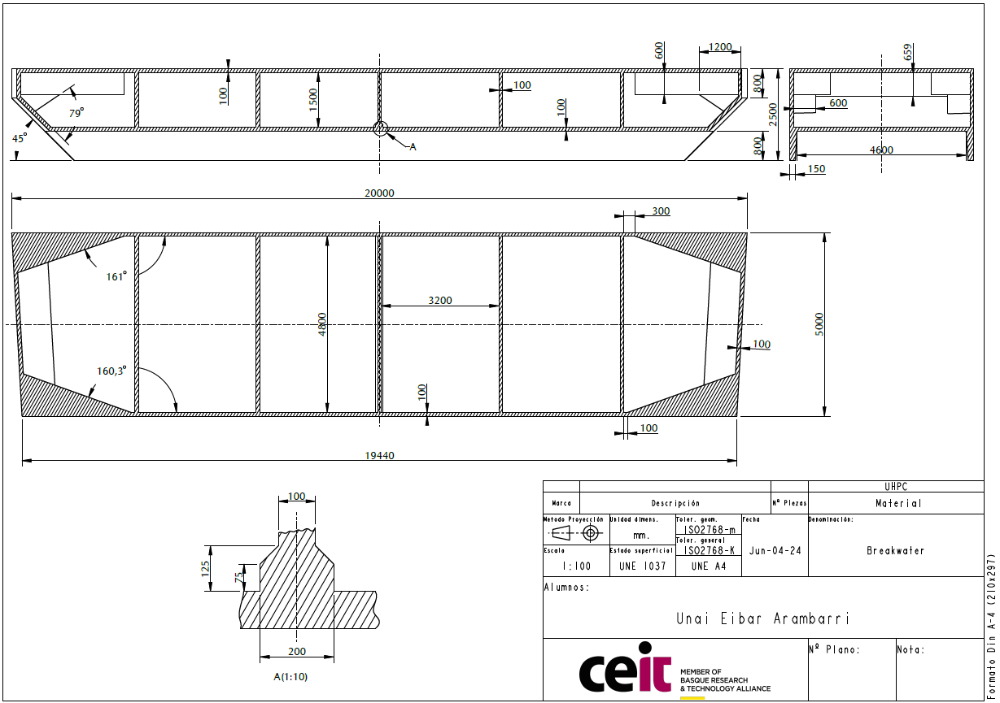{width="8.68261154855643in" height="6.111032370953631in"} 

APPENDIX B: Rainflow analysis CHARTS WITH FILTER THRESHOLDS

![[]{#_Toc179548549 .anchor}Figure 48: Rainflow cycle counting of the F~x~ loads for Baltic Sea condition, after filtering low amplitude cycles.](../images/2024-11-07_surewave_d5.3_structural_integrity_assessment/image11.png){alt="P1465#yIS1" width="5.372689195100612in" height="7.299348206474191in"}

![[]{#_Toc179548550 .anchor}Figure 49: Rainflow cycle counting of the F~y~ loads for Baltic Sea condition, after filtering low amplitude cycles.](../images/2024-11-07_surewave_d5.3_structural_integrity_assessment/image67.png){alt="P1467#yIS1" width="5.372688101487314in" height="7.299348206474191in"}

![[]{#_Toc179548551 .anchor}Figure 50: Rainflow cycle counting of the F~z~ loads for Baltic Sea condition, after filtering low amplitude cycles.](../images/2024-11-07_surewave_d5.3_structural_integrity_assessment/image68.png){alt="P1469#yIS1" width="5.372688101487314in" height="7.299348206474191in"}

![[]{#_Toc179548552 .anchor}Figure 51: Rainflow cycle counting of the M~x~ loads for Baltic Sea condition, after filtering low amplitude cycles.](../images/2024-11-07_surewave_d5.3_structural_integrity_assessment/image69.png){alt="P1471#yIS1" width="5.372688101487314in" height="7.299348206474191in"}

![[]{#_Toc179548553 .anchor}Figure 52: Rainflow cycle counting of the M~z~ loads for Baltic Sea condition, after filtering low amplitude cycles.](../images/2024-11-07_surewave_d5.3_structural_integrity_assessment/image70.png){alt="P1473#yIS1" width="5.372688101487314in" height="7.299348206474191in"}

![[]{#_Toc179548554 .anchor}Figure 53: Rainflow cycle counting of the F~m~ loads for Baltic Sea condition. No cycles were filtered.](../images/2024-11-07_surewave_d5.3_structural_integrity_assessment/image12.png){alt="P1475#yIS1" width="5.372688101487314in" height="7.299348206474191in"}

![[]{#_Toc179548555 .anchor}Figure 54: Rainflow cycle counting of the F~x~ loads for Mediterranean Sea condition, after filtering low amplitude cycles.](../images/2024-11-07_surewave_d5.3_structural_integrity_assessment/image71.png){alt="P1477#yIS1" width="5.372688101487314in" height="7.299348206474191in"}

![[]{#_Toc179548556 .anchor}Figure 55: Rainflow cycle counting of the F~y~ loads for Mediterranean Sea condition, after filtering low amplitude cycles.](../images/2024-11-07_surewave_d5.3_structural_integrity_assessment/image72.png){alt="P1479#yIS1" width="5.372688101487314in" height="7.299347112860892in"}

![[]{#_Toc179548557 .anchor}Figure 56: Rainflow cycle counting of the F~z~ loads for Mediterranean Sea condition, after filtering low amplitude cycles.](../images/2024-11-07_surewave_d5.3_structural_integrity_assessment/image73.png){alt="P1481#yIS1" width="5.372688101487314in" height="7.299347112860892in"}

![[]{#_Toc179548558 .anchor}Figure 57: Rainflow cycle counting of the M~x~ loads for Mediterranean Sea condition, after filtering low amplitude cycles.](../images/2024-11-07_surewave_d5.3_structural_integrity_assessment/image74.png){alt="P1483#yIS1" width="5.372688101487314in" height="7.299347112860892in"}

![[]{#_Toc179548559 .anchor}Figure 58: Rainflow cycle counting of the M~z~ loads for Mediterranean Sea condition, after filtering low amplitude cycles.](../images/2024-11-07_surewave_d5.3_structural_integrity_assessment/image75.png){alt="P1485#yIS1" width="5.372688101487314in" height="7.299347112860892in"}

![[]{#_Toc179548560 .anchor}Figure 59: Rainflow cycle counting of the F~m~ loads for Mediterranean Sea condition. No cycles were filtered.](../images/2024-11-07_surewave_d5.3_structural_integrity_assessment/image76.png){alt="P1487#yIS1" width="5.372688101487314in" height="7.299347112860892in"}

![[]{#_Toc179548561 .anchor}Figure 60: Rainflow cycle counting of the F~x~ loads for North Sea condition, after filtering low amplitude cycles.](../images/2024-11-07_surewave_d5.3_structural_integrity_assessment/image77.png){alt="P1489#yIS1" width="5.372688101487314in" height="7.299347112860892in"}

![[]{#_Toc179548562 .anchor}Figure 61: Rainflow cycle counting of the F~y~ loads for North Sea condition, after filtering low amplitude cycles.](../images/2024-11-07_surewave_d5.3_structural_integrity_assessment/image78.png){alt="P1491#yIS1" width="5.372687007874016in" height="7.299347112860892in"}

![[]{#_Toc179548563 .anchor}Figure 62: Rainflow cycle counting of the F~z~ loads for North Sea condition, after filtering low amplitude cycles.](../images/2024-11-07_surewave_d5.3_structural_integrity_assessment/image79.png){alt="P1493#yIS1" width="5.372687007874016in" height="7.299347112860892in"}

![[]{#_Toc179548564 .anchor}Figure 63: Rainflow cycle counting of the M~x~ loads for North Sea condition, after filtering low amplitude cycles.](../images/2024-11-07_surewave_d5.3_structural_integrity_assessment/image80.png){alt="P1495#yIS1" width="5.372687007874016in" height="7.299347112860892in"}

![[]{#_Toc179548565 .anchor}Figure 64: Rainflow cycle counting of the M~z~ loads for North Sea condition, after filtering low amplitude cycles.](../images/2024-11-07_surewave_d5.3_structural_integrity_assessment/image81.png){alt="P1497#yIS1" width="5.372687007874016in" height="7.299347112860892in"}

![[]{#_Toc179548566 .anchor}Figure 65: Rainflow cycle counting of the F~m~ loads for North Sea condition. No cycles were filtered.](../images/2024-11-07_surewave_d5.3_structural_integrity_assessment/image82.png){alt="P1499#yIS1" width="5.372687007874016in" height="7.299347112860892in"}

APPENDIX C: VOLUMETRIC FORCE TABLES

+-------------+-----------------------------------------------------------------------------------------+--------------------------------------------------------------------------------------------------------------------+-----------------------------------------------------------------------------------------------------------------------+-----------------------------------------------------------------------------------------------+
| **Event**   | **Connector forces** $\left( \frac{\mathbf{kN}}{\mathbf{m}^{\mathbf{3}}} \right)$       | **Forces due to moments on the left**$\mathbf{\ }\left( \frac{\mathbf{kN}}{\mathbf{m}^{\mathbf{3}}} \right)$       | **Forces due to moments on the right**$\mathbf{\ }\left( \frac{\mathbf{kN}}{\mathbf{m}^{\mathbf{3}}} \right)$         | **Mooring forces**$\mathbf{\ }\left( \frac{\mathbf{kN}}{\mathbf{m}^{\mathbf{3}}} \right)$     |
+:===========:+:===========================:+:===========================:+:===========================:+:====================================:+:====================================:+:====================================:+:=====================================:+:=====================================:+:=====================================:+:=============================================:+:=============================================:+
|             | **X**                       | **Y**                       | **Z**                       | **X**                                | **Y**                                | **Z**                                | **X**                                 | **Y**                                 | **Z**                                 | **X**                                         | **Y**                                         |
+-------------+-----------------------------+-----------------------------+-----------------------------+--------------------------------------+--------------------------------------+--------------------------------------+---------------------------------------+---------------------------------------+---------------------------------------+-----------------------------------------------+-----------------------------------------------+
| 1           | 1470.9                      | -124.6                      | 1727.5                      | -425.4                               | -1784.4                              | 1985.3                               | -612.2                                | 1784.4                                | -1876.9                               | -921.5                                        | -1316.1                                       |
+-------------+-----------------------------+-----------------------------+-----------------------------+--------------------------------------+--------------------------------------+--------------------------------------+---------------------------------------+---------------------------------------+---------------------------------------+-----------------------------------------------+-----------------------------------------------+
| 2           | -1512.1                     | -107.6                      | -926.9                      | -248.2                               | -609.5                               | 1158.3                               | -357.2                                | 609.5                                 | -1095.1                               | -1146.1                                       | -1636.8                                       |
+-------------+-----------------------------+-----------------------------+-----------------------------+--------------------------------------+--------------------------------------+--------------------------------------+---------------------------------------+---------------------------------------+---------------------------------------+-----------------------------------------------+-----------------------------------------------+
| 3           | 320.7                       | 943.7                       | -2973.1                     | 1044.4                               | 369.8                                | -4873.6                              | 1503.0                                | -369.8                                | 4607.7                                | -115.4                                        | -164.9                                        |
+-------------+-----------------------------+-----------------------------+-----------------------------+--------------------------------------+--------------------------------------+--------------------------------------+---------------------------------------+---------------------------------------+---------------------------------------+-----------------------------------------------+-----------------------------------------------+
| 4           | -338.2                      | -997.9                      | -3909.7                     | -1138.7                              | 324.4                                | 5313.6                               | -1638.7                               | -324.4                                | -5023.7                               | -75.5                                         | -107.9                                        |
+-------------+-----------------------------+-----------------------------+-----------------------------+--------------------------------------+--------------------------------------+--------------------------------------+---------------------------------------+---------------------------------------+---------------------------------------+-----------------------------------------------+-----------------------------------------------+
| 5           | -64.0                       | 490.7                       | 4413.8                      | -1746.9                              | 547.7                                | 8151.8                               | -2514.0                               | -547.7                                | -7707.0                               | -135.0                                        | -192.8                                        |
+-------------+-----------------------------+-----------------------------+-----------------------------+--------------------------------------+--------------------------------------+--------------------------------------+---------------------------------------+---------------------------------------+---------------------------------------+-----------------------------------------------+-----------------------------------------------+
| 6           | -350.6                      | -996.5                      | -3964.9                     | -1062.8                              | 303.3                                | 4959.6                               | -1529.5                               | -303.3                                | -4689.0                               | -76.2                                         | -108.8                                        |
+-------------+-----------------------------+-----------------------------+-----------------------------+--------------------------------------+--------------------------------------+--------------------------------------+---------------------------------------+---------------------------------------+---------------------------------------+-----------------------------------------------+-----------------------------------------------+
| 7           | -642.9                      | 93.2                        | -552.5                      | -3074.0                              | 235.0                                | 14345.2                              | -4424.0                               | -235.0                                | -13562.5                              | -310.2                                        | -443.0                                        |
+-------------+-----------------------------+-----------------------------+-----------------------------+--------------------------------------+--------------------------------------+--------------------------------------+---------------------------------------+---------------------------------------+---------------------------------------+-----------------------------------------------+-----------------------------------------------+
| 8           | -134.5                      | 35.1                        | 9.2                         | 2278.2                               | -2237.6                              | -10631.4                             | 3278.7                                | 2237.6                                | 10051.3                               | -170.4                                        | -243.4                                        |
+-------------+-----------------------------+-----------------------------+-----------------------------+--------------------------------------+--------------------------------------+--------------------------------------+---------------------------------------+---------------------------------------+---------------------------------------+-----------------------------------------------+-----------------------------------------------+
| 9           | 1293.7                      | -529.3                      | 649.0                       | -1250.1                              | -5906.7                              | 5833.6                               | -1799.0                               | 5906.7                                | -5515.3                               | -115.4                                        | -164.8                                        |
+-------------+-----------------------------+-----------------------------+-----------------------------+--------------------------------------+--------------------------------------+--------------------------------------+---------------------------------------+---------------------------------------+---------------------------------------+-----------------------------------------------+-----------------------------------------------+
| 10          | 303.8                       | 77.5                        | -721.5                      | -1048.6                              | 2403.9                               | 4893.2                               | -1509.0                               | -2403.9                               | -4626.2                               | -152.8                                        | -218.2                                        |
+-------------+-----------------------------+-----------------------------+-----------------------------+--------------------------------------+--------------------------------------+--------------------------------------+---------------------------------------+---------------------------------------+---------------------------------------+-----------------------------------------------+-----------------------------------------------+
| 11          | 323.6                       | -213.7                      | -482.5                      | -1063.0                              | 847.4                                | 4960.7                               | -1529.8                               | -847.4                                | -4690.0                               | -18926.8                                      | -27030.3                                      |
+-------------+-----------------------------+-----------------------------+-----------------------------+--------------------------------------+--------------------------------------+--------------------------------------+---------------------------------------+---------------------------------------+---------------------------------------+-----------------------------------------------+-----------------------------------------------+
| Fatigue     | 664.7                       | 198.4                       | 853.2                       | -1200.0                              | -472.4                               | 5599.9                               | -1727.0                               | 472.4                                 | -5294.3                               | -736.6                                        | -1051.9                                       |
|             |                             |                             |                             |                                      |                                      |                                      |                                       |                                       |                                       |                                               |                                               |
| Max         |                             |                             |                             |                                      |                                      |                                      |                                       |                                       |                                       |                                               |                                               |
+-------------+-----------------------------+-----------------------------+-----------------------------+--------------------------------------+--------------------------------------+--------------------------------------+---------------------------------------+---------------------------------------+---------------------------------------+-----------------------------------------------+-----------------------------------------------+
| Fatigue Min | -426.6                      | -119.0                      | -734.1                      | 1025.8                               | 189.0                                | -4787.0                              | 1476.3                                | -189.0                                | 4525.8                                | -245.5                                        | -350.6                                        |
+-------------+-----------------------------+-----------------------------+-----------------------------+--------------------------------------+--------------------------------------+--------------------------------------+---------------------------------------+---------------------------------------+---------------------------------------+-----------------------------------------------+-----------------------------------------------+

: []{#_Ref179548705 .anchor}Table 13: Volumetric force values of connector and mooring loads. Baltic Sea condition.

+-------------+-----------------------------------------------------------------------------------------+--------------------------------------------------------------------------------------------------------------------+-----------------------------------------------------------------------------------------------------------------------+-----------------------------------------------------------------------------------------------+
| **Event**   | **Connector forces** $\left( \frac{\mathbf{kN}}{\mathbf{m}^{\mathbf{3}}} \right)$       | **Forces due to moments on the left**$\mathbf{\ }\left( \frac{\mathbf{kN}}{\mathbf{m}^{\mathbf{3}}} \right)$       | **Forces due to moments on the right**$\mathbf{\ }\left( \frac{\mathbf{kN}}{\mathbf{m}^{\mathbf{3}}} \right)$         | **Mooring forces**$\mathbf{\ }\left( \frac{\mathbf{kN}}{\mathbf{m}^{\mathbf{3}}} \right)$     |
+:===========:+:===========================:+:===========================:+:===========================:+:====================================:+:====================================:+:====================================:+:=====================================:+:=====================================:+:=====================================:+:=============================================:+:=============================================:+
|             | **X**                       | **Y**                       | **Z**                       | **X**                                | **Y**                                | **Z**                                | **X**                                 | **Y**                                 | **Z**                                 | **X**                                         | **Y**                                         |
+-------------+-----------------------------+-----------------------------+-----------------------------+--------------------------------------+--------------------------------------+--------------------------------------+---------------------------------------+---------------------------------------+---------------------------------------+-----------------------------------------------+-----------------------------------------------+
| 1           | 2398.7                      | 254.4                       | -91.6                       | 1503.1                               | -1774.1                              | -7014.3                              | 2163.2                                | 1774.1                                | 6631.6                                | -2208.7                                       | -3154.3                                       |
+-------------+-----------------------------+-----------------------------+-----------------------------+--------------------------------------+--------------------------------------+--------------------------------------+---------------------------------------+---------------------------------------+---------------------------------------+-----------------------------------------------+-----------------------------------------------+
| 2           | -1408.2                     | 16.8                        | 179.1                       | -1918.4                              | 855.9                                | 8952.3                               | -2760.8                               | -855.9                                | -8463.8                               | -2424.2                                       | -3462.1                                       |
+-------------+-----------------------------+-----------------------------+-----------------------------+--------------------------------------+--------------------------------------+--------------------------------------+---------------------------------------+---------------------------------------+---------------------------------------+-----------------------------------------------+-----------------------------------------------+
| 3           | 833.1                       | 276.1                       | 628.2                       | -63.9                                | -460.9                               | 298.0                                | -91.9                                 | 460.9                                 | -281.7                                | -4322.9                                       | -6173.7                                       |
+-------------+-----------------------------+-----------------------------+-----------------------------+--------------------------------------+--------------------------------------+--------------------------------------+---------------------------------------+---------------------------------------+---------------------------------------+-----------------------------------------------+-----------------------------------------------+
| 4           | 727.8                       | -74.3                       | 244.5                       | -2462.8                              | -2110.7                              | 11492.8                              | -3544.3                               | 2110.7                                | -10865.7                              | -5949.2                                       | -8496.3                                       |
+-------------+-----------------------------+-----------------------------+-----------------------------+--------------------------------------+--------------------------------------+--------------------------------------+---------------------------------------+---------------------------------------+---------------------------------------+-----------------------------------------------+-----------------------------------------------+
| 5           | 381.9                       | 39.5                        | 2662.7                      | 637.5                                | -14.8                                | -2974.9                              | 917.5                                 | 14.8                                  | 2812.6                                | -905.9                                        | -1293.7                                       |
+-------------+-----------------------------+-----------------------------+-----------------------------+--------------------------------------+--------------------------------------+--------------------------------------+---------------------------------------+---------------------------------------+---------------------------------------+-----------------------------------------------+-----------------------------------------------+
| 6           | -366.1                      | 63.4                        | -1950.3                     | 1052.9                               | 322.3                                | -4913.4                              | 1515.3                                | -322.3                                | 4645.3                                | -715.4                                        | -1021.7                                       |
+-------------+-----------------------------+-----------------------------+-----------------------------+--------------------------------------+--------------------------------------+--------------------------------------+---------------------------------------+---------------------------------------+---------------------------------------+-----------------------------------------------+-----------------------------------------------+
| 7           | 60.8                        | 49.5                        | 292.3                       | -4028.7                              | -51.2                                | 18800.3                              | -5797.9                               | 51.2                                  | -17774.4                              | -11489.4                                      | -16408.5                                      |
+-------------+-----------------------------+-----------------------------+-----------------------------+--------------------------------------+--------------------------------------+--------------------------------------+---------------------------------------+---------------------------------------+---------------------------------------+-----------------------------------------------+-----------------------------------------------+
| 8           | 1004.4                      | 31.2                        | 605.2                       | 2179.9                               | -422.1                               | -10172.6                             | 3137.2                                | 422.1                                 | 9617.5                                | -641.8                                        | -916.6                                        |
+-------------+-----------------------------+-----------------------------+-----------------------------+--------------------------------------+--------------------------------------+--------------------------------------+---------------------------------------+---------------------------------------+---------------------------------------+-----------------------------------------------+-----------------------------------------------+
| 9           | 1065.9                      | 93.0                        | -661.4                      | -1312.7                              | -3671.3                              | 6126.0                               | -1889.2                               | 3671.3                                | -5791.7                               | -3327.3                                       | -4751.9                                       |
+-------------+-----------------------------+-----------------------------+-----------------------------+--------------------------------------+--------------------------------------+--------------------------------------+---------------------------------------+---------------------------------------+---------------------------------------+-----------------------------------------------+-----------------------------------------------+
| 10          | 910.2                       | 147.2                       | 403.3                       | -1787.4                              | 1622.4                               | 8341.2                               | -2572.4                               | -1622.4                               | -7886.0                               | -11656.6                                      | -16647.3                                      |
+-------------+-----------------------------+-----------------------------+-----------------------------+--------------------------------------+--------------------------------------+--------------------------------------+---------------------------------------+---------------------------------------+---------------------------------------+-----------------------------------------------+-----------------------------------------------+
| 11          | 341.9                       | 162.0                       | 364.5                       | -3135.1                              | 947.9                                | 14630.3                              | -4511.9                               | -947.9                                | -13832.0                              | -13544.6                                      | -19343.7                                      |
+-------------+-----------------------------+-----------------------------+-----------------------------+--------------------------------------+--------------------------------------+--------------------------------------+---------------------------------------+---------------------------------------+---------------------------------------+-----------------------------------------------+-----------------------------------------------+
| Fatigue Max | 585.3                       | 59.5                        | 337.3                       | -358.1                               | -264.6                               | 1670.9                               | -515.3                                | 264.6                                 | -1579.8                               | -773.4                                        | -1104.5                                       |
+-------------+-----------------------------+-----------------------------+-----------------------------+--------------------------------------+--------------------------------------+--------------------------------------+---------------------------------------+---------------------------------------+---------------------------------------+-----------------------------------------------+-----------------------------------------------+
| Fatigue Min | -307.5                      | 29.8                        | -456.3                      | 416.1                                | 113.4                                | -1941.9                              | 598.9                                 | -113.4                                | 1835.9                                | -699.8                                        | -999.4                                        |
+-------------+-----------------------------+-----------------------------+-----------------------------+--------------------------------------+--------------------------------------+--------------------------------------+---------------------------------------+---------------------------------------+---------------------------------------+-----------------------------------------------+-----------------------------------------------+

: []{#_Ref179680293 .anchor}Table 14: Volumetric force values of connector and mooring loads. Mediterranean Sea condition.

+-------------+-----------------------------------------------------------------------------------------+--------------------------------------------------------------------------------------------------------------------+-----------------------------------------------------------------------------------------------------------------------+-----------------------------------------------------------------------------------------------+
| **Event**   | **Connector forces** $\left( \frac{\mathbf{kN}}{\mathbf{m}^{\mathbf{3}}} \right)$       | **Forces due to moments on the left**$\mathbf{\ }\left( \frac{\mathbf{kN}}{\mathbf{m}^{\mathbf{3}}} \right)$       | **Forces due to moments on the right**$\mathbf{\ }\left( \frac{\mathbf{kN}}{\mathbf{m}^{\mathbf{3}}} \right)$         | **Mooring forces**$\mathbf{\ }\left( \frac{\mathbf{kN}}{\mathbf{m}^{\mathbf{3}}} \right)$     |
+:===========:+:===========================:+:===========================:+:===========================:+:====================================:+:====================================:+:====================================:+:=====================================:+:=====================================:+:=====================================:+:=============================================:+:=============================================:+
|             | **X**                       | **Y**                       | **Z**                       | **X**                                | **Y**                                | **Z**                                | **X**                                 | **Y**                                 | **Z**                                 | **X**                                         | **Y**                                         |
+-------------+-----------------------------+-----------------------------+-----------------------------+--------------------------------------+--------------------------------------+--------------------------------------+---------------------------------------+---------------------------------------+---------------------------------------+-----------------------------------------------+-----------------------------------------------+
| 1           | 2310.6                      | -269.2                      | 408.4                       | 3866.7                               | -115.8                               | -18044.4                             | 5564.8                                | 115.8                                 | 17059.8                               | -12611.2                                      | -18010.6                                      |
+-------------+-----------------------------+-----------------------------+-----------------------------+--------------------------------------+--------------------------------------+--------------------------------------+---------------------------------------+---------------------------------------+---------------------------------------+-----------------------------------------------+-----------------------------------------------+
| 2           | -118.5                      | -88.3                       | -2662.2                     | 225.5                                | 3.9                                  | -1052.4                              | 324.6                                 | -3.9                                  | 995.0                                 | -936.8                                        | -1337.9                                       |
+-------------+-----------------------------+-----------------------------+-----------------------------+--------------------------------------+--------------------------------------+--------------------------------------+---------------------------------------+---------------------------------------+---------------------------------------+-----------------------------------------------+-----------------------------------------------+
| 3           | -9.1                        | 200.3                       | -2047.5                     | 79.0                                 | -80.2                                | -368.8                               | 113.7                                 | 80.2                                  | 348.7                                 | -1178.3                                       | -1682.7                                       |
+-------------+-----------------------------+-----------------------------+-----------------------------+--------------------------------------+--------------------------------------+--------------------------------------+---------------------------------------+---------------------------------------+---------------------------------------+-----------------------------------------------+-----------------------------------------------+
| 4           | 1572.4                      | -400.0                      | 1040.8                      | 4423.2                               | 1136.9                               | -20641.1                             | 6365.6                                | -1136.9                               | 19514.8                               | -4203.5                                       | -6003.2                                       |
+-------------+-----------------------------+-----------------------------+-----------------------------+--------------------------------------+--------------------------------------+--------------------------------------+---------------------------------------+---------------------------------------+---------------------------------------+-----------------------------------------------+-----------------------------------------------+
| 5           | 316.1                       | -68.4                       | 3595.6                      | 256.5                                | -325.3                               | -1197.0                              | 369.2                                 | 325.3                                 | 1131.7                                | -1326.8                                       | -1894.9                                       |
+-------------+-----------------------------+-----------------------------+-----------------------------+--------------------------------------+--------------------------------------+--------------------------------------+---------------------------------------+---------------------------------------+---------------------------------------+-----------------------------------------------+-----------------------------------------------+
| 6           | -22.4                       | 129.2                       | -3519.2                     | 630.5                                | -69.5                                | -2942.4                              | 907.4                                 | 69.5                                  | 2781.9                                | -1283.1                                       | -1832.5                                       |
+-------------+-----------------------------+-----------------------------+-----------------------------+--------------------------------------+--------------------------------------+--------------------------------------+---------------------------------------+---------------------------------------+---------------------------------------+-----------------------------------------------+-----------------------------------------------+
| 7           | -9.3                        | -35.7                       | -414.7                      | -1331.0                              | -252.4                               | 6211.4                               | -1915.6                               | 252.4                                 | -5872.5                               | -630.9                                        | -901.0                                        |
+-------------+-----------------------------+-----------------------------+-----------------------------+--------------------------------------+--------------------------------------+--------------------------------------+---------------------------------------+---------------------------------------+---------------------------------------+-----------------------------------------------+-----------------------------------------------+
| 8           | 1271.4                      | -320.3                      | 116.7                       | 6021.8                               | 996.9                                | -28101.0                             | 8666.2                                | -996.9                                | 26567.6                               | -3073.7                                       | -4389.7                                       |
+-------------+-----------------------------+-----------------------------+-----------------------------+--------------------------------------+--------------------------------------+--------------------------------------+---------------------------------------+---------------------------------------+---------------------------------------+-----------------------------------------------+-----------------------------------------------+
| 9           | 605.1                       | -59.5                       | -794.1                      | 2377.9                               | -1193.5                              | -11096.4                             | 3422.1                                | 1193.5                                | 10491.0                               | -3487.2                                       | -4980.2                                       |
+-------------+-----------------------------+-----------------------------+-----------------------------+--------------------------------------+--------------------------------------+--------------------------------------+---------------------------------------+---------------------------------------+---------------------------------------+-----------------------------------------------+-----------------------------------------------+
| 10          | 714.1                       | -235.2                      | -882.0                      | 4887.0                               | 2110.9                               | -22805.4                             | 7033.1                                | -2110.9                               | 21561.0                               | -2729.9                                       | -3898.8                                       |
+-------------+-----------------------------+-----------------------------+-----------------------------+--------------------------------------+--------------------------------------+--------------------------------------+---------------------------------------+---------------------------------------+---------------------------------------+-----------------------------------------------+-----------------------------------------------+
| 11          | 2310.6                      | -269.2                      | 408.4                       | 3868.5                               | -115.8                               | -18052.6                             | 5567.3                                | 115.8                                 | 17067.5                               | -12611.2                                      | -18010.6                                      |
+-------------+-----------------------------+-----------------------------+-----------------------------+--------------------------------------+--------------------------------------+--------------------------------------+---------------------------------------+---------------------------------------+---------------------------------------+-----------------------------------------------+-----------------------------------------------+
| Fatigue Max | 79.4                        | -29.8                       | 754.0                       | -1064.5                              | -122.8                               | 4967.6                               | -1532.0                               | 122.8                                 | -4696.6                               | -773.4                                        | -1104.5                                       |
+-------------+-----------------------------+-----------------------------+-----------------------------+--------------------------------------+--------------------------------------+--------------------------------------+---------------------------------------+---------------------------------------+---------------------------------------+-----------------------------------------------+-----------------------------------------------+
| Fatigue Min | 9.9                         | -49.6                       | -833.3                      | 871.0                                | 160.6                                | -4064.4                              | 1253.4                                | -160.6                                | 3842.6                                | -699.8                                        | -999.4                                        |
+-------------+-----------------------------+-----------------------------+-----------------------------+--------------------------------------+--------------------------------------+--------------------------------------+---------------------------------------+---------------------------------------+---------------------------------------+-----------------------------------------------+-----------------------------------------------+

: []{#_Ref179680298 .anchor}Table 15: Volumetric force values of connector and mooring loads. North Sea condition.
