> Source: `SUREWAVE_D6.3.docx` — Document date: 2025-02-12 — Converted: 2026-09-28 via pandoc/pdftotext

---

##### 

**Deliverable number: D6.3**

+------------------------------------------------------------------------------------------------------------------------------------------------------+
| ##### {width="7.8701301399825025in" height="2.5902777777777777in"} |
+======================================================================================================================================================+
| ##### SUREWAVE -- Structural Reliable Offshore Floating PV Solution Integrating Circular Concrete Floating Breakwater                                |
+------------------------------------------------------------------------------------------------------------------------------------------------------+

Title: Mechanical performance of the new connection system between the FPVs

# **Disclaimer:**  {#disclaimer .TOC-Heading}

The SUREWAVE project is Funded by the European Union. Views and opinions expressed are however those of the author(s) only and do not necessarily reflect those of the European Union. Neither the European Union nor European Climate, Infrastructure and Environment Executive Agency (CINEA) can be held responsible for them

Deliverable details

+--------------------------------------+-------------------------------------------------------+-----------------------------------+
| **WP**                               | 6                                                     |                                   |
+:========================+:===========+:===========+:============+:============+:=============+:=============+:===================+
| **Task**                             | T6.3                                                  |                                   |
+-------------------------+------------+--------------------------+-------------+--------------+--------------+--------------------+
| **Dissemination level** | PU classified                         |             | **Due delivery date**       | 31.01.2025         |
+-------------------------+---------------------------------------+-------------+-----------------------------+--------------------+
| **Deliverable type**    | R --- Document, report                |             | **Actual delivery date**    | 12.02.2025         |
+-------------------------+-------------------------+-------------+-------------+-----------------------------+--------------------+
| **Lead beneficiary**                              | **SINTEF**                                                                   |
+---------------------------------------------------+------------------------------------------------------------------------------+
| **Contributing beneficiaries**                    |                                                                              |
+---------------------------------------------------+------------------------------------------------------------------------------+

  ---------------------- ------------ ------------------------ -----------------------------
  **Document Version**   **Date**     **Author**               **Comments**

  1.0                    13/01/2025   Virgile Delhaye          Draft version for reviewing

  1.1                    01/02/2025   Stephane Dumoulin        Revision 1

  1.2                    12/02/2025   Balram Panjwani          Revision 2

  2                      12/02/2025   Virgile Delhaye          Final version

                                                               

                                                               
  ---------------------- ------------ ------------------------ -----------------------------

+-------------------------------------------------------------------------------------------------------------------------------------------------+
| **Dissemination level**                                                                                                                         |
+:====================================+:==========================================================================================================+
| PU                                  | Public- fully open                                                                                        |
+-------------------------------------+-----------------------------------------------------------------------------------------------------------+
| SEN                                 | SEN = Sensitive -- limited under the conditions of the Grant Agreement                                    |
+-------------------------------------+-----------------------------------------------------------------------------------------------------------+
| EU classified                       | EU classified -- restraint -- UE/EU-restricted, confidential, secret-UE/EU secret under Decision 2015/444 |
+-------------------------------------+-----------------------------------------------------------------------------------------------------------+
| **Deliverable type**                                                                                                                            |
+-------------------------------------+-----------------------------------------------------------------------------------------------------------+
| R:                                  | Document, report (excluding the periodic and final reports)                                               |
+-------------------------------------+-----------------------------------------------------------------------------------------------------------+
| DEM:                                | Demonstrator, pilot, prototype, plan designs                                                              |
+-------------------------------------+-----------------------------------------------------------------------------------------------------------+
| DEC:                                | Websites, patent filing, press & media actions, videos, etc.                                              |
+-------------------------------------+-----------------------------------------------------------------------------------------------------------+
| OTHER:                              | Software, technical diagram, etc.                                                                         |
+-------------------------------------+-----------------------------------------------------------------------------------------------------------+

**EXECUTIVE SUMMARY**

The document herein reports the activities carried out in Task 6.3 concerning tests performed in SINTEF laboratories to characterise the failure modes and strength capacities of the new connection system designed by the project SUNLIT SEA during the SUREWAVE project. This connection is used for connecting the FPV modules together: the new connection system was designed based on the results from D6.2 which clearly highlighted that the first version of the connection system would not meet the requirements on properties and survivability. The connection system still uses a Polyurethane (PU) material which was tested in D6.1.

Section 1 covers the deliverable with an introduction and outline of the objectives of the deliverable.

Section 2 focuses on the evaluation of the mechanical properties and strength of the new PU connections system.

Section 3 focuses on the fatigue properties of the PU material and the estimation of fatigue life of the new connection system.

The report ends with conclusions in section 4.

**Deliverable Review**

+---------------------------------------------------------------------------------+---------------------------------------------------------------------------+---------------------------------------------------------------------------+
|                                                                                 | **Reviewer #1: Stephane Dumoulin**                                        | **Reviewer #2: Balram Panjwani**                                          |
|                                                                                 +-----------------+---------------------------------------+-----------------+-----------------+---------------------------------------+-----------------+
|                                                                                 | **Answer**      | **Comments**                          | **Type\***      | **Answer**      | **Comments**                          | **Type\***      |
+=================================================================================+=================+=======================================+=================+=================+=======================================+=================+
| 1.  Is the deliverable in accordance with                                                                                                                                                                                               |
+---------------------------------------------------------------------------------+-----------------+---------------------------------------+-----------------+-----------------+---------------------------------------+-----------------+
| i.  The Description of Work?                                                    | ☒ Yes           |                                       | ☐ M             | ☒Yes            |                                       | ☐ M             |
|                                                                                 |                 |                                       |                 |                 |                                       |                 |
|                                                                                 | ☐ No            |                                       | ☐ m             | ☐ No            |                                       | ☐ m             |
|                                                                                 |                 |                                       |                 |                 |                                       |                 |
|                                                                                 |                 |                                       | ☐ a             |                 |                                       | ☐ a             |
+---------------------------------------------------------------------------------+-----------------+---------------------------------------+-----------------+-----------------+---------------------------------------+-----------------+
| ii. The international State of the Art?                                         | ☐ Yes           | *Not applicable for this deliverable* | ☐ M             | ☐ Yes           | *Not applicable for this deliverable* | ☐ M             |
|                                                                                 |                 |                                       |                 |                 |                                       |                 |
|                                                                                 | ☐ No            |                                       | ☐ m             | ☐ No            |                                       | ☐ m             |
|                                                                                 |                 |                                       |                 |                 |                                       |                 |
|                                                                                 |                 |                                       | ☐ a             |                 |                                       | ☐ a             |
+---------------------------------------------------------------------------------+-----------------+---------------------------------------+-----------------+-----------------+---------------------------------------+-----------------+
| 2.  Is the quality of the deliverable in a status                                                                                                                                                                                       |
+---------------------------------------------------------------------------------+-----------------+---------------------------------------+-----------------+-----------------+---------------------------------------+-----------------+
| iii. That allows it to be sent to European Commission?                          | ☒ Yes           |                                       | ☐ M             | ☒ Yes           |                                       | ☐ M             |
|                                                                                 |                 |                                       |                 |                 |                                       |                 |
|                                                                                 | ☐ No            |                                       | ☐ m             | ☐ No            |                                       | ☐ m             |
|                                                                                 |                 |                                       |                 |                 |                                       |                 |
|                                                                                 |                 |                                       | ☐ a             |                 |                                       | ☐ a             |
+---------------------------------------------------------------------------------+-----------------+---------------------------------------+-----------------+-----------------+---------------------------------------+-----------------+
| iv. That needs improvement of the writing by the originator of the deliverable? | ☐ Yes           |                                       | ☐ M             | ☐ Yes           |                                       | ☐ M             |
|                                                                                 |                 |                                       |                 |                 |                                       |                 |
|                                                                                 | ☒ No            |                                       | ☐ m             | ☒No             |                                       | ☐ m             |
|                                                                                 |                 |                                       |                 |                 |                                       |                 |
|                                                                                 |                 |                                       | ☐ a             |                 |                                       | ☐ a             |
+---------------------------------------------------------------------------------+-----------------+---------------------------------------+-----------------+-----------------+---------------------------------------+-----------------+
| v.  That need further work by the Partners responsible for the deliverable?     | ☐ Yes           |                                       | ☐ M             | ☐ Yes           |                                       | ☐ M             |
|                                                                                 |                 |                                       |                 |                 |                                       |                 |
|                                                                                 | ☒ No            |                                       | ☐ m             | ☒No             |                                       | ☐ m             |
|                                                                                 |                 |                                       |                 |                 |                                       |                 |
|                                                                                 |                 |                                       | ☐ a             |                 |                                       | ☐ a             |
+---------------------------------------------------------------------------------+-----------------+---------------------------------------+-----------------+-----------------+---------------------------------------+-----------------+

\* Type of comments: M = Major comment; m = minor comment; a = advice

Table of Contents

[1 Introduction [7](#introduction)](#introduction)

[2 Mechanical behaviour and strength of the new PU connection between modules [7](#mechanical-behaviour-and-strength-of-the-new-pu-connection-between-modules)](#mechanical-behaviour-and-strength-of-the-new-pu-connection-between-modules)

[2.1 Experimental matrix [7](#experimental-matrix)](#experimental-matrix)

[2.2 Tensile tests on the PU connections [9](#tensile-tests-on-the-pu-connections)](#tensile-tests-on-the-pu-connections)

[2.2.1 Experimental setup [9](#experimental-setup)](#experimental-setup)

[2.2.2 Results [10](#results)](#results)

[2.3 Effect of a stiff rod substituting the rope for tightening the Male-Female connection in tension [12](#effect-of-a-stiff-rod-substituting-the-rope-for-tightening-the-male-female-connection-in-tension)](#effect-of-a-stiff-rod-substituting-the-rope-for-tightening-the-male-female-connection-in-tension)

[2.4 Compression tests on the PU connections [15](#compression-tests-on-the-pu-connections)](#compression-tests-on-the-pu-connections)

[2.4.1 Compression test setup [15](#compression-test-setup)](#compression-test-setup)

[2.4.2 Compression results [15](#compression-results)](#compression-results)

[2.5 Shear tests on the PU connections [17](#shear-tests-on-the-pu-connections)](#shear-tests-on-the-pu-connections)

[2.5.1 Shear test setup [17](#shear-test-setup)](#shear-test-setup)

[2.5.2 Shear tests results [18](#shear-tests-results)](#shear-tests-results)

[3 Fatigue properties of the PU connections [19](#fatigue-properties-of-the-pu-connections)](#fatigue-properties-of-the-pu-connections)

[3.1 Fatigue tests of the PU material [19](#fatigue-tests-of-the-pu-material)](#fatigue-tests-of-the-pu-material)

[3.1.1 Fatigue methodology [19](#fatigue-methodology)](#fatigue-methodology)

[3.1.2 SN curves results [23](#sn-curves-results)](#sn-curves-results)

[3.1.3 Fatigue life estimate based on SN curves [26](#fatigue-life-estimate-based-on-sn-curves)](#fatigue-life-estimate-based-on-sn-curves)

[3.2 Evaluation of the fatigue life of the new connection system [26](#evaluation-of-the-fatigue-life-of-the-new-connection-system)](#evaluation-of-the-fatigue-life-of-the-new-connection-system)

[3.2.1 FE model definition [26](#fe-model-definition)](#fe-model-definition)

[3.2.2 FE results and stress estimations in the connection [27](#fe-results-and-stress-estimations-in-the-connection)](#fe-results-and-stress-estimations-in-the-connection)

[4 Conclusions [32](#conclusions)](#conclusions)

#  {#section-1 .TOC-Heading}

#  Table of Figures {#table-of-figures .TOC-Heading}

[*Figure 1 : Picture of the new connection system* [7](#_Ref190247362)](#_Ref190247362)

[Figure 2 : Picture of the new component tested during the campaign. Left: male and female components before assembly. Right: full component assembled with rope system in position. [8](#_Ref187922562)](#_Ref187922562)

[Figure 3 : Profile picture of the female and male parts showing the holes used to fit the rope (small holes) and the steel pipe (large holes) during testing. [8](#_Ref187922602)](#_Ref187922602)

[Figure 4: Illustration of the gap between the male and female plugs during the component assembly, which was induced by material retraction during the cooling process of the injection moulding. [8](#_Ref188003874)](#_Ref188003874)

[Figure 5: test setup used for the tensile and compression tests. [9](#_Ref187925319)](#_Ref187925319)

[Figure 6: Results of the tensile tests on connection components. [10](#_Ref188003480)](#_Ref188003480)

[Figure 7 : Illustration of the MF connection system using a steel rod just before failure (Test 22) [12](#_Ref189731622)](#_Ref189731622)

[Figure 8 : Force displacement of the MF connections using a steel rod. A PP rope MF connection is also represented for comparison (Test 1 in red) [13](#_Ref189732863)](#_Ref189732863)

[Figure 9 : Illustration of the early cracks initiated during the testing of test 23. Top : 5mm displ , middle :10mm , bottom : before total failure (35mm) [14](#_Ref189736945)](#_Ref189736945)

[Figure 10: Force-displacement curves obtained from compression tests of the components. [15](#_Ref188608843)](#_Ref188608843)

[Figure 11: connection collapse at the end of the compression test. [16](#_Ref188609119)](#_Ref188609119)

[Figure 12 : Shear test setup [17](#_Ref188611563)](#_Ref188611563)

[Figure 13: Force displacement curves of the connections in shear. [18](#_Ref188612437)](#_Ref188612437)

[Figure 14: Illustration of the connections twist when the peak force is reached during the shear tests. [18](#_Ref188612812)](#_Ref188612812)

[Figure 15: Different specimens configuration used to perform the fatigue tests on the PU material. The bottom one is the one used for the tests. [19](#_Ref187660053)](#_Ref187660053)

[Figure 16: Geometry of final the dog-bone specimen used to carry the fatigue test on the PU material. [20](#_Ref187660276)](#_Ref187660276)

[Figure 17: Illustration of the cyclic loading definition followed during the fatigue tests. [20](#_Ref189051667)](#_Ref189051667)

[Figure 18: FE model of the dog-bone specimen used to establish the relation between the stress and the imposed displacement during the tests. [22](#_Ref187662887)](#_Ref187662887)

[Figure 19: Evolution of the stress in the specimen in function of the displacement in the FE dog-bone model used for the fatigue tests. [22](#_Ref187663656)](#_Ref187663656)

[Figure 20: Comparison between FE/experiment showing the ability of the Marlow model to represent the tensile tests performed on the ISO527b specimens in D6.2 [23](#_Ref187664294)](#_Ref187664294)

[Figure 21: SN curves of the materials obtained from the experimental campaign: top number of cycles as function of the %US, and bottom, number of cycles as function of maximum stress (MPa). [25](#_Ref187670546)](#_Ref187670546)

[Figure 22: Overview of the FE model definition. [26](#_Ref187760643)](#_Ref187760643)

[Figure 23: Comparison FEA-Experiment on the connection tensile test with and without rope. [27](#_Ref187767678)](#_Ref187767678)

[Figure 24: Comparison experiment-FEA on the tensile test at 33mm displacement. [28](#_Ref187768088)](#_Ref187768088)

[Figure 25: Comparison DIC (left)/FEA (right) for 10 mm (top) and 25 mm (bottom) displacements, in terms of first principal strain. The scales on the right are identical for the DIC and FEA. [28](#_Ref188879390)](#_Ref188879390)

[Figure 26: Comparison FEA-experiment in compression. [29](#_Ref187835662)](#_Ref187835662)

[Figure 27: Comparison FEA-experiment in shear. [29](#_Ref188879566)](#_Ref188879566)

[Figure 28: Evolution of the stress distribution in the component for different displacement values (9,18 and 28mm), in terms of Von Mises stress (left) and first principal stress (right). [30](#_Ref187838197)](#_Ref187838197)

[Figure 29: Focus on the areas with higher stress (principal stress) at 28 mm displacement. The colour scale corresponds to the one given in Figure 28. [31](#_Ref187841546)](#_Ref187841546)

# Table of Tables  {#table-of-tables .TOC-Heading}

[Table 1: Test matrix summarising the tests performed on the PU hinges. [9](#_Ref170814787)](#_Ref170814787)

[Table 2: Summary of the results obtained during tensile testing. [11](#_Ref188004247)](#_Ref188004247)

[Table 3 : Summary of the tensile tests on the MF connection with steel rod [13](#_Ref189734314)](#_Ref189734314)

[Table 4: Compression tests results summary. [16](#_Ref188609492)](#_Ref188609492)

[Table 5: Shear tests results summary. [19](#_Ref188613438)](#_Ref188613438)

[Table 6: Summary of the fatigue tests conducted on the PU specimens. [21](#_Ref187662257)](#_Ref187662257)

[Table 7: Summary of the fatigue tests results. [24](#_Ref187670085)](#_Ref187670085)

[Table 8: Coefficients values for the SN curve fitting using equation (1). [26](#_Ref187759392)](#_Ref187759392)

[Table 9: Conservative estimation of the maximum allowed stress in the material to withstand 25 years lifetime. [26](#_Ref187759664)](#_Ref187759664)

#  Introduction

The report summarises the work done in task 6.3 of the SUREWAVE project. Initially, the aim of the task was to assess the fatigue behaviour of the critical connections described and tested in D6.1. These critical connections were However, the results from Task 6.2 revealed that the previously designed hinge system is structurally weak, affecting the survivability and operability of the floating PV solution. These findings prompted a shift in focus for Task 6.3 towards testing a new generation of connection systems between FPVs, as they were identified as the most critical components in Task 6.2

The new connection system was designed by SUNLIT Sea, in order to avoid early buckling of the first generation of the connections on one hand and to have higher strength properties in tension on the other. [Figure 1](#_Ref190247362) illustrates the new connection system tested in this report. SINTEF utilized both standard and in-house test methods, allowing for setup adaptations to meet specific requirements. Custom test setups were also designed to fit the specimens in the lab equipment. Advanced strain measurement techniques (DIC) and cameras were employed during some tests, providing detailed information on localized deformation in the joints.

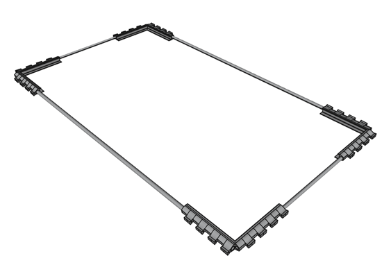

[]{#_Ref190247362 .anchor}*Figure 1 : Picture of the new connection system*

The connections were tested in tension, compression and shear to assess the new mechanical properties and to provide input to the work done in WP5 on the FE analysis of this connection system. In addition, fatigue tests were carried out on the Polyurethane material used to make the connection systems in order to evaluate the long-term fatigue properties of the newly designed connections. These results are presented in the present report.

# Mechanical behaviour and strength of the new PU connection between modules

## Experimental matrix 

The component assessed in task 6.3 is a portion of the new connection system designed by SUNLIT SEA in order to connect the solar modules together. The new test campaign focuses on a component which represents a portion of the full connection system. Components produced by injection moulding were delivered by SUNLIT Sea to SINTEF. A picture of a component is given in [Figure 2](#_Ref187922562). It consists of two parts (called male and female in the following) that are connected together by plugs, as illustrated in [Figure 2](#_Ref187922562). The average dimensions of the assembled connections were 360×70×22mm, representing 1/5^th^ of the total real connection length. In addition, a Polypropylene rope is positioned through the component via a hole in order to maintain the two parts in place. The rope characteristics are given here[^1]. A picture of the component profile is given in [Figure 3](#_Ref187922602) showing the holes running through the component to fit the rope and the steel pipes that will be used to connect the component to the machine.

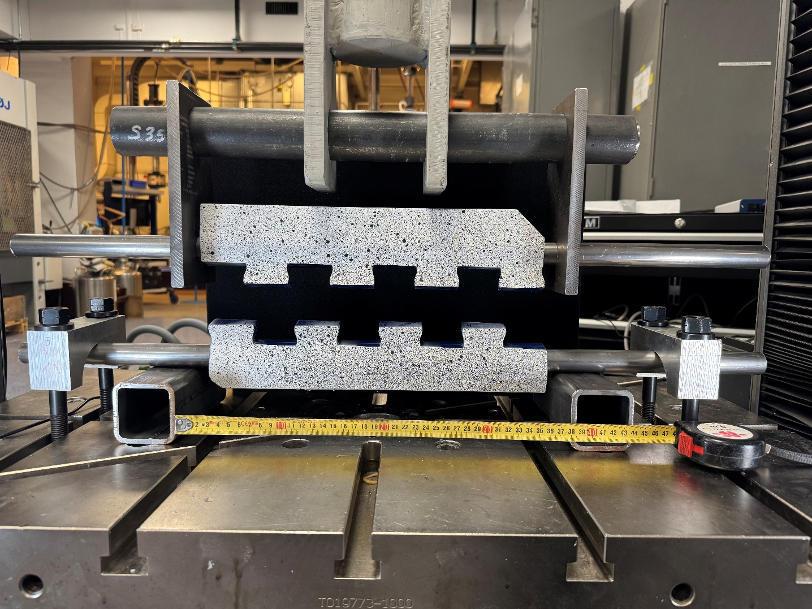{width="2.9328357392825897in" height="1.6447036307961505in"} 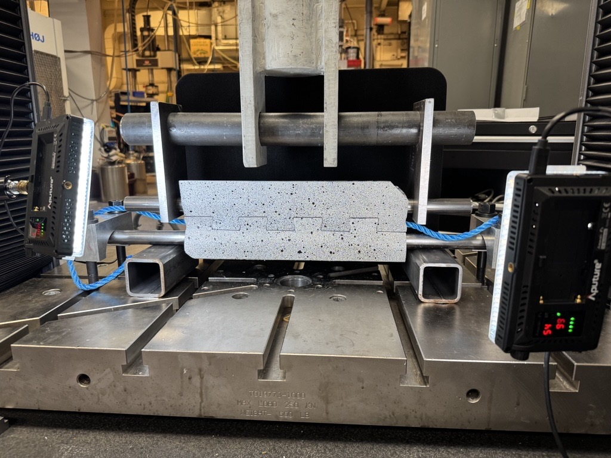{width="3.0788167104111985in" height="1.2704593175853018in"}

[]{#_Ref187922562 .anchor}Figure 2 : Picture of the new component tested during the campaign. Left: male and female components before assembly. Right: full component assembled with rope system in position.

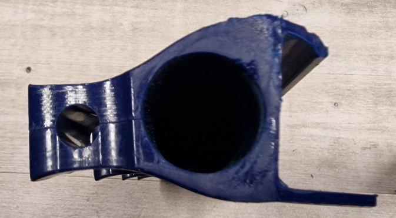{width="3.0287981189851267in" height="1.5988079615048119in"} 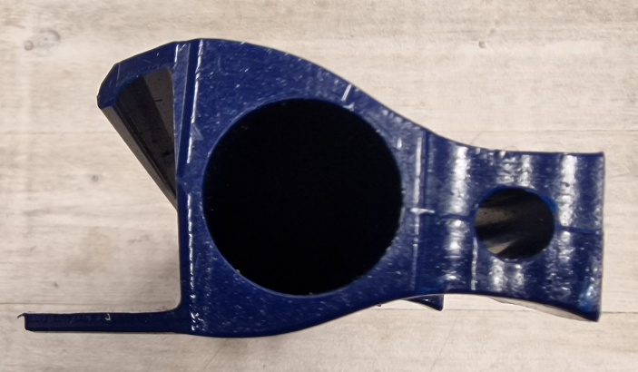{width="3.146884295713036in" height="1.5892136920384952in"}

[]{#_Ref187922602 .anchor}Figure 3 : Profile picture of the female and male parts showing the holes used to fit the rope (small holes) and the steel pipe (large holes) during testing.

The campaign to characterize the mechanical behaviour of the new connection is summarised in [Table 1](#_Ref170814787). In addition to estimating the ultimate strength of the connection, the campaign aimed at quantifying the stiffness in different loading directions in order to give input to the modelling work done in WP5 and for the design of the reduced scale basin tests in task 6.4.

During the production process of the connection components, the material significant shrinkage which induced significant gaps (around 1-2mm) between the male and female parts during the assembly, see [Figure 4](#_Ref188003874). This will be corrected in future iterations of the connection but will have an influence on the mechanical results presented in this report, especially in tension.

![[]{#_Ref188003874 .anchor}Figure 4: Illustration of the gap between the male and female plugs during the component assembly, which was induced by material retraction during the cooling process of the injection moulding.](../images/2025-02-12_surewave_d6.3/image10.png){width="5.665972222222222in" height="1.7916666666666667in"}

First, tensile tests of the components were run (11 tests in total), followed by compression (7 tests) and shear tests (3 tests). The total number of compression and shear tests was reduced from 20 to 10 due to limited material availability.

  --------------------------------------------------------------------------------------
  **Type of tests**   **Specimens**       **Instrumentation**   **Rep.**   **Status**
  ------------------- ------------------- --------------------- ---------- -------------
  **Tensile**         Connection system   DIC                   (5+3+3)    Done

  **Compression**     Connection system   DIC                   (3+2+2)    Done

  **Shear**           Connection system   DIC                   3          Done
  --------------------------------------------------------------------------------------

  : []{#_Ref170814787 .anchor}Table 1: Test matrix summarising the tests performed on the PU hinges.

The remaining of the section will describe each of the tests done, and present the results obtained.

## Tensile tests on the PU connections

### Experimental setup

Tensile tests were carried out in order to characterise the axial stiffness of the component, which is the most critical, and to provide input for the fatigue characterisation presented in section 2 of the present report.

A picture of the test setup is given in [Figure 5](#_Ref187925319). Two steel pipes are connected to the male and female parts of the connection. The bottom pipe (female part) is clamped to the tensile machine while the male part is fixed to a tailored machine grip that is fixed to the machine crosshead in order to apply the tensile load. The machine used was an Instron with a maximum capacity of 350 kN. The speed of the machine crosshead was fixed at 0.5 mm/s during the tests, which can be considered as quasi-static.

![[]{#_Ref187925319 .anchor}Figure 5: test setup used for the tensile and compression tests.](../images/2025-02-12_surewave_d6.3/image6.jpeg){alt="A machine with a piece of metal Description automatically generated" width="5.50632874015748in" height="4.128533464566929in"}

During the tests, the strains and displacements in the specimens were monitored using the DIC (Digital Image Correlation) technique. To this end, a speckle pattern was painted on each of the specimens, and its evolution was followed by a Basler camera. The acquisition system recorded images at a 0.5 Hz frequency with an average resolution of 900×2980 pixels. The acquisition system of the camera was synchronized with the tensile machine data acquisition system. All recorded images were post-processed using the eCorr software[^2]. The objective of the DIC is to provide full-field strain measurement during the test, using a digital grid. This provides access to local strain field measurements.

### Results

[Figure 6](#_Ref188003480) presents the force-displacement results obtained from the tensile tests on the connection components. The 5 first tests (1-5) are the normal connection consisting of the assembly of a male and female part. In order to quantify the influence of the gap induced by the injection process, male-male and female-female assemblies were also tested, which have tighter gaps between plugs during assembly. These are referred to as MM (male-male) and FF (female-female) in the following.

![[]{#_Ref188003480 .anchor}Figure 6: Results of the tensile tests on connection components.](../images/2025-02-12_surewave_d6.3/image11.png){width="6.033659230096238in" height="3.927321741032371in"}

[Figure 6](#_Ref188003480) shows that the force increases, when the assembly is loaded, until a maximum around 2 kN at a displacement of 30 mm. The tests are very repeatable overall. A slight difference can be seen between the normal (male-female) and MM/FF connections: the response of the MM and FF being stiffer. This is clearly connected to a tighter gap between the two parts of the connections which allows for a better force transfer. However, this does not seem to have a strong influence on the maximum recorded load. All the results from the tensile tests are summarised in [Table 2](#_Ref188004247), as well as some statistics for the different tests and some estimations of the stiffness of the components at different displacements.

+-----------------+---------------+-----------------+---------------------+-----------+------------+----------------+----------------+
| Tension         | Stiffness 5mm | Stiffness 10 mm | Stiffness max force | Max force | Max disp   |                |                |
+:================+:==============+:================+:====================+:==========+:===========+:===============+:===============+
|                 | kN/mm         | kN/mm           | kN/mm               | kN        | mm         |                                 |
|                 |               |                 |                     |           |            |                                 |
|                 |               |                 |                     |           |            |                                 |
+-----------------+---------------+-----------------+---------------------+-----------+------------+---------------------------------+
| Test1_with rope | 0.0519        | 0.0736          | 0.0682              | 2.059     | 30.169     |                                 |
|                 |               |                 |                     |           |            |                                 |
|                 |               |                 |                     |           |            |                                 |
|                 |               |                 |                     |           |            |                                 |
|                 |               |                 |                     |           |            |                                 |
|                 |               |                 |                     |           |            |                                 |
|                 |               |                 |                     |           |            |                                 |
|                 |               |                 |                     |           |            |                                 |
|                 |               |                 |                     |           |            |                                 |
|                 |               |                 |                     |           |            |                                 |
|                 |               |                 |                     |           |            |                                 |
|                 |               |                 |                     |           |            |                                 |
|                 |               |                 |                     |           |            |  **Male-Female**                |
|                 |               |                 |                     |           |            |                                 |
|                 |               |                 |                     |           |            | **connection**                  |
|                 |               |                 |                     |           |            |                                 |
|                 |               |                 |                     |           |            |                                 |
|                 |               |                 |                     |           |            |                                 |
|                 |               |                 |                     |           |            |                                 |
|                 |               |                 |                     |           |            |                                 |
|                 |               |                 |                     |           |            |                                 |
|                 |               |                 |                     |           |            |                                 |
|                 |               |                 |                     |           |            |                                 |
+-----------------+---------------+-----------------+---------------------+-----------+------------+                                 |
| Test2_with rope | 0.0537        | 0.0749          | 0.0641              | 2.042     | 31.842     |                                 |
+-----------------+---------------+-----------------+---------------------+-----------+------------+                                 |
| Test3_with rope | 0.0482        | 0.0697          | 0.0629              | 2.034     | 32.337     |                                 |
+-----------------+---------------+-----------------+---------------------+-----------+------------+                                 |
| Test4_with rope | 0.0515        | 0.0745          | 0.0655              | 2.080     | 31.741     |                                 |
+-----------------+---------------+-----------------+---------------------+-----------+------------+                                 |
| Test5_with rope | 0.0518        | 0.0731          | 0.0681              | 1.996     | 29.289     |                                 |
+-----------------+---------------+-----------------+---------------------+-----------+------------+                                 |
| mean            | **0.0514**    | **0.0732**      | **0.0658**          | **2.042** | **31.076** |                                 |
+-----------------+---------------+-----------------+---------------------+-----------+------------+                                 |
| max             | **0.0537**    | **0.0749**      | **0.0682**          | **2.080** | **32.337** |                                 |
+-----------------+---------------+-----------------+---------------------+-----------+------------+                                 |
| min             | **0.0482**    | **0.0697**      | **0.0629**          | **1.996** | **29.289** |                                 |
+-----------------+---------------+-----------------+---------------------+-----------+------------+                                 |
| dev             | **0.001785**  | **0.001839**    | **0.002129**        | **0.028** | **1.152**  |                                 |
+-----------------+---------------+-----------------+---------------------+-----------+------------+---------------------------------+
| Test6FF_rope    | 0.0859        | 0.1019          | 0.0818              | 2.135     | 26.0831    |                                 |
|                 |               |                 |                     |           |            |                                 |
|                 |               |                 |                     |           |            |                                 |
|                 |               |                 |                     |           |            |                                 |
|                 |               |                 |                     |           |            |                                 |
|                 |               |                 |                     |           |            |                                 |
|                 |               |                 |                     |           |            |                                 |
|                 |               |                 |                     |           |            |                                 |
|                 |               |                 |                     |           |            | **Female-Female connection**    |
|                 |               |                 |                     |           |            |                                 |
|                 |               |                 |                     |           |            |                                 |
|                 |               |                 |                     |           |            |                                 |
|                 |               |                 |                     |           |            |                                 |
+-----------------+---------------+-----------------+---------------------+-----------+------------+                                 |
| Test7FF_rope    | 0.0860        | 0.1054          | 0.0783              | 2.196     | 28.0593    |                                 |
+-----------------+---------------+-----------------+---------------------+-----------+------------+                                 |
| Test8FF_rope    | 0.0788        | 0.1009          | 0.0781              | 2.121     | 27.1427    |                                 |
+-----------------+---------------+-----------------+---------------------+-----------+------------+                                 |
| mean            | **0.0835**    | **0.1027**      | **0.0794**          | **2.151** | **27.095** |                                 |
+-----------------+---------------+-----------------+---------------------+-----------+------------+                                 |
| max             | **0.0860**    | **0.1054**      | **0.0818**          | **2.196** | **28.059** |                                 |
+-----------------+---------------+-----------------+---------------------+-----------+------------+                                 |
| min             | **0.0788**    | **0.1009**      | **0.0781**          | **2.121** | **26.083** |                                 |
+-----------------+---------------+-----------------+---------------------+-----------+------------+                                 |
| dev             | **0.003351**  | **0.001923**    | **0.001715**        | **0.032** | **0.807**  |                                 |
+-----------------+---------------+-----------------+---------------------+-----------+------------+---------------------------------+
| Test9MM_rope    | 0.0859        | 0.1017          | 0.0748              | 2.071     | 27.679     |                                 |
|                 |               |                 |                     |           |            |                                 |
|                 |               |                 |                     |           |            |                                 |
|                 |               |                 |                     |           |            |                                 |
|                 |               |                 |                     |           |            |                                 |
|                 |               |                 |                     |           |            |                                 |
|                 |               |                 |                     |           |            |                                 |
|                 |               |                 |                     |           |            |                                 |
|                 |               |                 |                     |           |            | **Male-Male connection**        |
|                 |               |                 |                     |           |            |                                 |
|                 |               |                 |                     |           |            |                                 |
|                 |               |                 |                     |           |            |                                 |
|                 |               |                 |                     |           |            |                                 |
|                 |               |                 |                     |           |            |                                 |
|                 |               |                 |                     |           |            |                                 |
|                 |               |                 |                     |           |            |                                 |
|                 |               |                 |                     |           |            |                                 |
|                 |               |                 |                     |           |            |                                 |
|                 |               |                 |                     |           |            |                                 |
|                 |               |                 |                     |           |            |                                 |
|                 |               |                 |                     |           |            |                                 |
+-----------------+---------------+-----------------+---------------------+-----------+------------+                                 |
| Test10MM_rope   | 0.0904        | 0.1037          | 0.0793              | 2.073     | 26.151     |                                 |
+-----------------+---------------+-----------------+---------------------+-----------+------------+                                 |
| Test11MM_rope   | 0.0731        | 0.0964          | 0.0779              | 1.977     | 25.382     |                                 |
+-----------------+---------------+-----------------+---------------------+-----------+------------+                                 |
| mean            | **0.0831**    | **0.1006**      | **0.0773**          | **2.040** | **26.404** |                                 |
+-----------------+---------------+-----------------+---------------------+-----------+------------+                                 |
| max             | **0.0904**    | **0.1037**      | **0.0793**          | **2.073** | **27.679** |                                 |
+-----------------+---------------+-----------------+---------------------+-----------+------------+                                 |
| min             | **0.0731**    | **0.0964**      | **0.0748**          | **1.977** | **25.382** |                                 |
+-----------------+---------------+-----------------+---------------------+-----------+------------+                                 |
| dev             | **0.007309**  | **0.003088**    | **0.001852**        | **0.045** | **0.954**  |                                 |
+-----------------+---------------+-----------------+---------------------+-----------+------------+---------------------------------+

: []{#_Ref188004247 .anchor}Table 2: Summary of the results obtained during tensile testing.

Results from [Table 2](#_Ref188004247) confirm that the tests are highly repeatable as indicated by the low standard deviation given in [Table 2](#_Ref188004247). The **mean maximum force measured on the male-female component is 2.04 kN**, while the mean stiffness at **5 mm displacement is 0.0514 kN/mm** and **0.0732 kN/mm at 10mm displacement. The mean displacement at maximum force is 31.076 mm and mean stiffness 0.0658 kN/mm. As observed on the graph in** [Figure 6](#_Ref188003480)**, the stiffness for the MM and FF connections are slightly higher**, but the maximum forces are nearly identical**.** This is because MM and FF have tighter coupling compared to MF, It means that the new iteration of the connection with better control of the retraction during cooling will probably have stiffnesses comparable to the MM and FF connection. However, the maximum force should remain similar.

## Effect of a stiff rod substituting the rope for tightening the Male-Female connection in tension

In this section , the effect of a stiff steel rod system was investigated as a substitute of the PP rope system used in section 2.2 in tensions. The new setup is illustrated in [Figure 7](#_Ref189731622). Same experimental conditions as the ones described in section 2.2.1 were used for comparison. The rod is inclined because the original hinges are also inclined.

![[]{#_Ref189731622 .anchor}Figure 7 : Illustration of the MF connection system using a steel rod just before failure (Test 22)](../images/2025-02-12_surewave_d6.3/image12.jpeg){width="6.536609798775153in" height="4.593073053368329in"}

The Force-displacement results are illustrated in [Figure 8](#_Ref189732863). It is clearly visible for the figure that changing the rope for a stiffer system increases the Ultimate strength of the connections and the overall connection system noticeably.

![[]{#_Ref189732863 .anchor}Figure 8 : Force displacement of the MF connections using a steel rod. A PP rope MF connection is also represented for comparison (Test 1 in red)](../images/2025-02-12_surewave_d6.3/image13.png){width="6.513114610673666in" height="4.2467541557305335in"}

[Table 3](#_Ref189734314) summarizes the results obtained from the tensile tests on the MF connections with a steel rod. The mean force measured during the tests is 8.3 kN, which is 4 times higher than the same connections using a PP rope. In addition, mean stiffnesses are higher than the connections with rope, with a similar factor.

+------------------------+---------------+-----------------+---------------------+------------+-----------+----------+----------+----------+
| Tensile with steel rod | Stiffness 5mm | Stiffness 10 mm | Stiffness max force | Max force  | Max disp  |          |          |          |
|                        |               |                 |                     |            |           |          |          |          |
|                        |               |                 |                     |            |           |          |          |          |
|                        +---------------+-----------------+---------------------+------------+-----------+----------+----------+----------+
|                        | kN/mm         | kN/mm           | kN/mm               | kN         | mm        | Male-Female connection         |
+------------------------+---------------+-----------------+---------------------+------------+-----------+                                |
| Test 22                | 0.321         | 0.309           | 0.134               | 9.195      | 68.450    |                                |
+------------------------+---------------+-----------------+---------------------+------------+-----------+                                |
| Test 23                | 0.329         | 0.320           | 0.195               | 6.393      | 32.72     |                                |
+------------------------+---------------+-----------------+---------------------+------------+-----------+                                |
| Test 24                | 0.349         | 0.330           | 0.120               | 9.415      | 78.78     |                                |
+------------------------+---------------+-----------------+---------------------+------------+-----------+                                |
| Test 25                | 0.322         | 0.321           | 0.148               | 8.443      | 56.93     |                                |
+------------------------+---------------+-----------------+---------------------+------------+-----------+                                |
| mean                   | **0.330**     | **0.320**       | **0.149**           | **8.362**  | **59.22** |                                |
+------------------------+---------------+-----------------+---------------------+------------+-----------+                                |
| max                    | **0.349**     | **0.330**       | **0.195**           | **9.415**  | **78.78** |                                |
+------------------------+---------------+-----------------+---------------------+------------+-----------+                                |
| min                    | **0.321**     | **0.309**       | **0.120**           | **6.393**  | **32.73** |                                |
+------------------------+---------------+-----------------+---------------------+------------+-----------+                                |
| dev                    | **0.0114**    | **0.0076**      | **0.0284**          | **1.1923** | **17.14** |                                |
+========================+===============+=================+=====================+============+===========+==========+==========+==========+

: []{#_Ref189734314 .anchor}Table 3 : Summary of the tensile tests on the MF connection with steel rod

The results from this section compared to the results obtained from section 2.2 clearly show that the type of roping system used to tighten both part of the connection system will have a strong influence of the mechanical behaviour of the connection, and should thus be carefully selected, depending on the loads anticipated.

It should also be noted than the **deviation during the tests is also noticeably higher**, due to one test (Test 23) that failed much earlier than the 3 others. This is due to early cracks initiated at the teeth corners of the components, as illustrated in [Figure 9](#_Ref189736945).

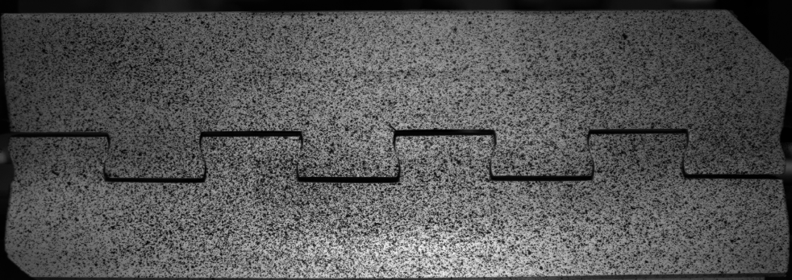

[]{#_Ref189736945 .anchor}

Figure 9 : Illustration of the early cracks initiated during the testing of test 23. Top : 5mm displ , middle :10mm , bottom : before total failure (35mm)

It is assumed that these early cracks are due to the production process of the PU component. It is this thus **very critical to control the production process to get components that have the expected mechanical performances.** A poor production process can result in components with compromised mechanical properties, affecting their performance in both extreme survivability scenarios and fatigue conditions.

## Compression tests on the PU connections

### Compression test setup

The compression test setup used is the same as the tension test setup described in section [2.2.1](#experimental-setup). (same machine, DIC, clamping system). The machine velocity was however decreased in order to avoid any collision between the grips during the compression tests. The velocity was set to 0.1 mm/s.

### Compression results

[Figure 10](#_Ref188608843) shows the force-displacement curves from the compression tests. The type of connection (Male-Male, Female-Male or Female Female) for each test on [Figure 10](#_Ref188608843) is given in [Table 4](#_Ref188609492) below. The response is first rather linear until the force peaks and then starts to decrease. This peak corresponds to the collapse of the connection, as illustrated in [Figure 11](#_Ref188609119).

![[]{#_Ref188608843 .anchor}Figure 10: Force-displacement curves obtained from compression tests of the components.](../images/2025-02-12_surewave_d6.3/image17.png){width="5.798515966754156in" height="3.7742661854768156in"}

It is also clear that the response of the female-male connection is better than the male-male and female-female connections. This is due to the fact that the male and female parts are not symmetric, and that the assembly of male-male or female-female will trigger earlier collapse due to this asymmetry, thus leading to a lower maximum peak force.

![[]{#_Ref188609119 .anchor}Figure 11: connection collapse at the end of the compression test.](../images/2025-02-12_surewave_d6.3/image18.jpeg){alt="A metal object with a white object on it Description automatically generated with medium confidence" width="5.338888888888889in" height="4.571181102362205in"}

[Table 4](#_Ref188609492) summarizes the results from the compression tests performed during the campaign. It is noticeable that the stiffness of the connection is significantly higher in compression than in tension. As an example, there is a factor 40 between the stiffnesses calculated at 5 mm for the female-male connections. The maximum peak force is also much higher, with a mean peak force of around 20.22 kN in compression, while the peak force is 2.04 kN in tension (smaller by a factor 10).

+--------------+---------------+-----------------+---------------------+------------+------------+----------+----------+----------+
| Compression  | Stiffness 5mm | Stiffness 10 mm | Stiffness max force | Max force  | Max disp   |          |          |          |
+:=============+:==============+:================+:====================+:===========+:===========+:=========+:=========+:=========+
|              | kN/mm         | kN/mm           | kN/mm               | kN         | mm         | Male-Female connection         |
+--------------+---------------+-----------------+---------------------+------------+------------+                                |
| Test-12-C    | 2.027         | 1.757           | 1.332               | 20.631     | 15.494     |                                |
+--------------+---------------+-----------------+---------------------+------------+------------+                                |
| Test-13-C    | 1.908         | 1.701           | 1.245               | 19.188     | 15.418     |                                |
+--------------+---------------+-----------------+---------------------+------------+------------+                                |
| Test-14-C    | 1.863         | 1.707           | 1.518               | 20.863     | 13.742     |                                |
+--------------+---------------+-----------------+---------------------+------------+------------+                                |
| mean         | **1.933**     | **1.722**       | **1.365**           | **20.227** | **14.885** |                                |
+--------------+---------------+-----------------+---------------------+------------+------------+                                |
| max          | **2.027**     | **1.757**       | **1.518**           | **20.863** | **15.494** |                                |
+--------------+---------------+-----------------+---------------------+------------+------------+                                |
| min          | **1.863**     | **1.701**       | **1.245**           | **19.188** | **13.742** |                                |
+--------------+---------------+-----------------+---------------------+------------+------------+                                |
| Dev          | **0.0694**    | **0.0252**      | **0.1141**          | **0.7407** | **0.8085** |                                |
+--------------+---------------+-----------------+---------------------+------------+------------+--------------------------------+
| Test-17-C-MM | 1.557         |                 | 1.491               | 14.777     | 9.911      | Male-male connection           |
+--------------+---------------+-----------------+---------------------+------------+------------+                                |
| Test-18-C-MM | 1.779         |                 | 1.578               | 14.962     | 9.484      |                                |
+--------------+---------------+-----------------+---------------------+------------+------------+                                |
| mean         | **1.668**     |                 | **1.534**           | **14.869** | **9.698**  |                                |
+--------------+---------------+-----------------+---------------------+------------+------------+--------------------------------+
| Test-15-C-FF | 1.794         |                 | 1.579               | 12.799     | 8.107      | Female-Female connection       |
+--------------+---------------+-----------------+---------------------+------------+------------+                                |
| Test-16-C-FF | 1.873         |                 | 1.630               | 13.177     | 8.085      |                                |
+--------------+---------------+-----------------+---------------------+------------+------------+                                |
| mean         | **1.834**     |                 | **1.604**           | **12.988** | **8.096**  |                                |
+--------------+---------------+-----------------+---------------------+------------+------------+--------------------------------+

: []{#_Ref188609492 .anchor}Table 4: Compression tests results summary.

## Shear tests on the PU connections

### Shear test setup

The shear test setup was adapted in order to prevent the two connecting parts to slide against the internal steel roller during the tests. In order to do that, some bolts and steel plates were fitted at each connection extremities to maintain good contact. An illustration of the test setup is given in [Figure 12](#_Ref188611563). The red circles indicate the plates and bolts position to prevent internal sliding during the shear tests. The same Instron machine was used for these tests, and the velocity was fixed at 2 mm/min. DIC was also used to track the strain field. 3 repetitions were run during the shear test campaign.In shear only Male-Female connections were investigated, due to limited number of compoenents available for the campaign.

![[]{#_Ref188611563 .anchor}](../images/2025-02-12_surewave_d6.3/image24.jpeg)

Figure 12 : Shear test setup

### Shear tests results

The results from the shear tests are shown in [Figure 13](#_Ref188612437), in terms of force-displacement. The response is rather linear until the force reaches a peak, then the load starts to decrease again. This can be explained by the fact that at high displacement, the two connection parts are twisting from each other, leading to a loss of contact between the connection plugs, see [Figure 14](#_Ref188612812).

![[]{#_Ref188612437 .anchor}Figure 13: Force displacement curves of the connections in shear.](../images/2025-02-12_surewave_d6.3/image21.png){width="4.914109798775153in" height="3.2041535433070867in"}

![[]{#_Ref188612812 .anchor}Figure 14: Illustration of the connections twist when the peak force is reached during the shear tests.](../images/2025-02-12_surewave_d6.3/image22.png){width="1.5162970253718284in" height="3.298701881014873in"}

A summary of the shear tests is given in [Table 5](#_Ref188613438). The stiffness in shear is higher than in tension, but lower than in compression. The mean maximum peak force is around 2.642 kN, slightly higher than in tension.

+---------+---------------+------------+------------+------------+------------+----------+----------+----------+
| Shear   | Stiffness 5mm | Stiffness  | Stiffness  | Max force  | Max disp   |          |          |          |
|         |               |            |            |            |            |          |          |          |
|         |               | 10 mm      | max force  |            |            |          |          |          |
+:========+:==============+:===========+:===========+:===========+:===========+:=========+:=========+:=========+
|         | kN/mm         | kN/mm      | kN/mm      | kN         | mm         |                                |
+---------+---------------+------------+------------+------------+------------+--------------------------------+
| Test 19 | 0.142         | 0.132      | 0.090      | 2.762      | 30.813     |                                |
|         |               |            |            |            |            |                                |
|         |               |            |            |            |            |                                |
|         |               |            |            |            |            |                                |
|         |               |            |            |            |            |                                |
|         |               |            |            |            |            |                                |
|         |               |            |            |            |            | Male-Female connection         |
|         |               |            |            |            |            |                                |
|         |               |            |            |            |            |                                |
|         |               |            |            |            |            |                                |
|         |               |            |            |            |            |                                |
|         |               |            |            |            |            |                                |
|         |               |            |            |            |            |                                |
+---------+---------------+------------+------------+------------+------------+                                |
| Test 20 | 0.124         | 0.117      | 0.075      | 2.656      | 35.296     |                                |
+---------+---------------+------------+------------+------------+------------+                                |
| Test 21 | 0.142         | 0.126      | 0.073      | 2.509      | 34.330     |                                |
+---------+---------------+------------+------------+------------+------------+                                |
| mean    | **0.136**     | **0.125**  | **0.079**  | **2.642**  | **33.480** |                                |
+---------+---------------+------------+------------+------------+------------+                                |
| max     | **0.142**     | **0.132**  | **0.090**  | **2.762**  | **35.296** |                                |
+---------+---------------+------------+------------+------------+------------+                                |
| min     | **0.124**     | **0.117**  | **0.073**  | **2.509**  | **30.813** |                                |
+---------+---------------+------------+------------+------------+------------+                                |
| dev     | **0.0083**    | **0.0060** | **0.0074** | **0.1039** | **1.9264** |                                |
+---------+---------------+------------+------------+------------+------------+--------------------------------+

: []{#_Ref188613438 .anchor}Table 5: Shear tests results summary.

# Fatigue properties of the PU connections

## Fatigue tests of the PU material

### Fatigue methodology

#### Experimental setup: 

The fatigue tests of the PU materials were originally intended to be made on the first generation of the connection systems that were tested and reported in D6.1. However, due to the huge elongation of the material (typical for an elastomer) and the limited displacement of the tensile machine available at SINTEF, it was not possible to perform fatigue tests on the components themselves. Thus, an alternative approach was used, consisting of performing fatigue tests on tensile specimens machined from the connections. Several iterations were made in order to get the correct specimen geometry, based on trial and error testing and FEA (Finite Element Analysis), in order to optimise the maximum machine displacement available vs the maximum load reachable. These iterations are illustrated in [Figure 15](#_Ref187660053).

![[]{#_Ref187660053 .anchor}Figure 15: Different specimens configuration used to perform the fatigue tests on the PU material. The bottom one is the one used for the tests.](../images/2025-02-12_surewave_d6.3/image23.png){width="4.453987314085739in" height="3.2399354768153983in"}

The specimens have a dog-bone shape in order to localise the deformation during the tests, with a very small gauge length to reach the desired load values with a limited machine displacement (+ 150mm allowed). The machine used was a ZWICK hydraulic. The details of the final geometry used are given in [Figure 16](#_Ref187660276).

![[]{#_Ref187660276 .anchor}Figure 16: Geometry of final the dog-bone specimen used to carry the fatigue test on the PU material.](../images/2025-02-12_surewave_d6.3/image24.png){width="5.555400262467192in" height="2.537949475065617in"}

The fatigue tests were displacement (strain) controlled. Load-control was first attempted but the machine could not be controlled with sufficient accuracy in this mode, due to increased elongation over time, and extreme softness of the material. The cyclic displacement was controlled as depicted in [Figure 17](#_Ref189051667).

![[]{#_Ref189051667 .anchor}Figure 17: Illustration of the cyclic loading definition followed during the fatigue tests.](../images/2025-02-12_surewave_d6.3/image25.png){width="6.358018372703412in" height="3.450495406824147in"}

First, a mean displacement was imposed to the specimens, then a displacement amplitude around this mean displacement was imposed as cycles. The different tests run during the campaign are given in [Table 6](#_Ref187662257).

  ----------------------------------------------------------------------------------------------------------
  Specimen   Ramp     Amplitude   Frequency   Max displacement   Corresponding % US   Corresponding stress
  ---------- -------- ----------- ----------- ------------------ -------------------- ----------------------
  \[#\]      \[mm\]   \[mm\]      \[Hz\]      mm                                      Mpa

  1          24.5     31.5        1           56                 126.4                94.8

  2          29.5     17.5        1           47                 106.1                79.6

  3          29.5     10          1           39.5               89.2                 66.9

  4          21.5     10          1           31.5               71.1                 53.3

  5          16.5     5           1           21.5               48.5                 36.4

  6          16.5     5           1           21.5               48.5                 36.4

  7          16.5     5           1           21.5               48.5                 36.4

  8          16.5     11          1           27.5               62.1                 46.6

  9          16.5     11          1           27.5               62.1                 46.6

  10         16.5     11          1           27.5               62.1                 46.6

  11         16.5     7           1           23.5               53.0                 39.8

  12         16.5     7           1           23.5               53.0                 39.8

  13         16.5     5           1           21.5               48.5                 36.4
  ----------------------------------------------------------------------------------------------------------

  : []{#_Ref187662257 .anchor}Table 6: Summary of the fatigue tests conducted on the PU specimens.

In [Table 6](#_Ref187662257), the "corresponding %US" refers to the percentage of the maximum load achieved during the tests compared to the ultimate strength measured for the material and reported in D6.1. For example, for specimen 3, 89.2% means that the maximum load during the test represents 89.2% of the ultimate strength of the material. The corresponding stress is established using an FE model of the dog-bone specimen to calculate the stress corresponding at a given displacement; the model is described in section [3.1.1.2](#fe-modelling-approach-to-estimate-the-stress-in-the-dog-bone-specimens) below. Note that in some case the %US is more than 100%. This is because the %US is calculated from the mean value of the US in D6.1, and it is possible that some specimens break above the mean value, yielding to a %US superior to 100%.

For all the tests, the frequency was set to 1 Hz. It is possible that self-heating might influence the results on elastomers, especially at high frequency, but these effects are neglected in this study. Moreover 1 Hz is in a range very representative of what a material would experience in real sea conditions, where most of the wave have peak periods between 1 and 0.1 Hz, see D2.1.

#### FE modelling approach to estimate the stress in the dog-bone specimens

The correlation between the maximum displacement followed during the tests and the corresponding stress was established using an FE model of the specimen, shown in [Figure 18](#_Ref187662887).

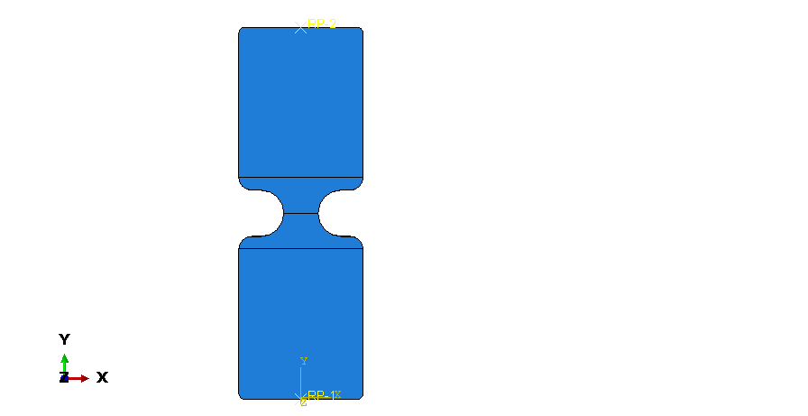{width="1.3in" height="3.240972222222222in"}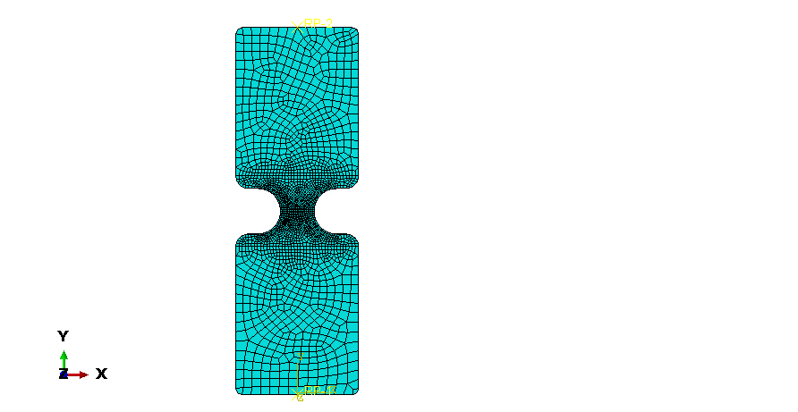{width="1.4305555555555556in" height="3.2539370078740157in"}

[]{#_Ref187662887 .anchor}Figure 18: FE model of the dog-bone specimen used to establish the relation between the stress and the imposed displacement during the tests.

The evolution of the stress in the specimen as function of the displacement is given in [Figure 19](#_Ref187663656) as well as an illustration of the stress field in the specimen for two different displacements (20 and 40 mm). The stresses are monitored at the lowest cross section of the specimen, where they are the highest.

[]{#_Ref187663656 .anchor}Figure 19: Evolution of the stress in the specimen in function of the displacement in the FE dog-bone model used for the fatigue tests.

The material law used in the FE model to describe the PU material is an hyperelastic model based on the \*MARLOW strain energy function[^3]. It was calibrated using the tensile test data input to Abaqus, and obtained from the tensile test campaign performed in the SUREWAVE project and reported in section 2 of D6.1. [Figure 20](#_Ref187664294) shows the good correlation obtained between the Abaqus FE model using the Marlow hyperplastic constitutive model and the experimental results obtained during the first campaign of SUREWAVE. The FE results are presented using fully integrated elements and reduced integrated elements formulation in order to evaluate the impact of the elements choice on the predicted response, which appear to be negligible in this case.

![[]{#_Ref187664294 .anchor}Figure 20: Comparison between FE/experiment showing the ability of the Marlow model to represent the tensile tests performed on the ISO527b specimens in D6.2](../images/2025-02-12_surewave_d6.3/image31.png){width="5.774094488188976in" height="3.7710465879265094in"}

### SN curves results

[Table 7](#_Ref187670085) summarizes the results from the different fatigue tests performed during the campaign. Overall, the higher the maximum stress during the tests, the lower the number of cycles to failure. There is a noticeable dispersion during the tests, which is expected for an elastomeric material. The dispersion is higher at high stress amplitude and tends to decrease at lower stress amplitude. It is interesting to notice that tests 5 and 7 were stopped before failure was reached due to the very high number of cycles to failure. This in terms will underestimate the number of cycles to failure at low stress amplitude, but it is also a conservative procedure, as more cycles are expected than what was currently run. Test 6 was found to be very low as compared to the other tests at this amplitude, because the specimen was highly degraded prior to testing, thus degrading the fatigue life (Burnt in the notch part during the machining). It was decided to represent it anyway on the figure, and is accounted in the calculation of the SN curves, leading to a more conservative estimation of the fatigue life. Overall, the high dispersion that we observed in fatigue was also observed in previous tests campaign of the PU during the project, also during the first one on the first-generation hinges, where the deviation was noticeable (See D6.1 and section 2.3 of the present document). In fatigue, the deviation is higher because it is coming from a combination of three sources: The material intrinsic properties, the defaults during production process and the nature of the fatigue tests themselves will all contribute to the tests deviation.

  ------------------------------------------------------------------------
  Specimen                   Cycles before fail     Fail
  -------------------------- ---------------------- ----------------------
  \[#\]                      \[-\]                  \[-\]

  1                          4                      Yes

  2                          33                     Yes

  3                          662                    Yes

  4                          102                    Yes

  5                          141500                 No

  6                          1540                   Yes

  7                          2800000                No

  8                          316                    Yes

  9                          723                    Yes

  10                         73                     Yes

  11                         380                    Yes

  12                         469                    Yes

  13                         480000                 Yes
  ------------------------------------------------------------------------

  : []{#_Ref187670085 .anchor}Table 7: Summary of the fatigue tests results.

From [Table 7](#_Ref187670085), there is clearly noticeable dispersion during the tests. This has two origins. The first one is due to the nature of the tests itself, fatigue, which always yield to dispersion. The other cause is attributed to the production process of the specimens, which will yield to a higher dispersion of the results, as already highlighted in section [2.3](#effect-of-a-stiff-rod-substituting-the-rope-for-tightening-the-male-female-connection-in-tension). This again indicates that care must be taken when producing PU components in the future, as the process can yield to very different results.

The different results presented in [Table 7](#_Ref187670085) can be plotted to represent a SN-curve, see [Figure 21](#_Ref187670546). Two representations are given: on the first graph, a %US as function of the number of cycles is given, while a typical stress vs number of cycles to failure (SN) curve is given on the bottom graph. The abscissa is represented in logarithmic scale. A typical exponential curve can be fitted between the points using the least-square fitting. This curve has the following equation:

$\sigma = A \cdot N_{f}^{b}$ (1)

The fitting is represented by a dark blue line in [Figure 21](#_Ref187670546). The fitted coefficients are also provided. The yellow curve represents the same curve with a safety material coefficient of $\gamma = 1.4$. This very high safety factor was used due to the high dispersion of the results, in order to ensure that the results given in the following are conservative. This is thus the curve that will be used for all fatigue life estimation in the following.

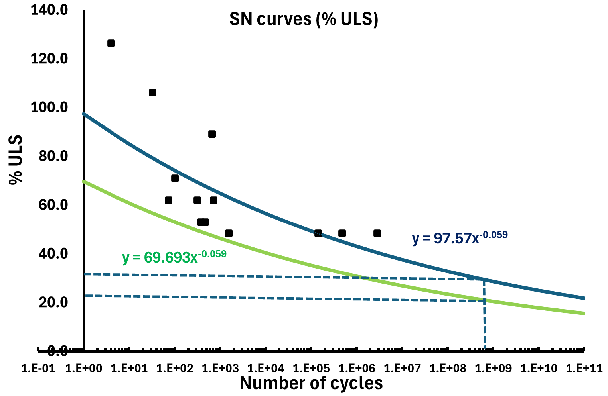{width="5.898997156605424in" height="3.8473293963254593in"}

![[]{#_Ref187670546 .anchor}Figure 21: SN curves of the materials obtained from the experimental campaign: top number of cycles as function of the %US, and bottom, number of cycles as function of maximum stress (MPa).](../images/2025-02-12_surewave_d6.3/image33.png){width="5.728525809273841in" height="3.736149387576553in"}

The list of A and b coefficients for equation (1) is given in [Table 8](#_Ref187759392).

+-----------------+--------------------------+-----------+----------------+
|                 |                          | A         | b              |
+:================+:=========================+:==========+:===============+
| %US-Nf curve    | RMS fitting (Blue curve) | **97.57** | **-0.059**     |
|                 +--------------------------+-----------+                |
|                 | Safety factor fitting    | **69.69** |                |
+-----------------+--------------------------+-----------+                |
| Stress-Nf curve | RMS fitting (Blue curve) | **73.18** |                |
|                 +--------------------------+-----------+                |
|                 | Safety factor fitting    | **52.27** |                |
+-----------------+--------------------------+-----------+----------------+

: []{#_Ref187759392 .anchor}Table 8: Coefficients values for the SN curve fitting using equation (1).

### Fatigue life estimate based on SN curves

Assuming a constant wave frequency of 1 Hz over 25 years and constant amplitude, this leads to a total of 7.88e+8 cycles that the material must withstand over its lifetime. Using the SN curve from [Figure 21](#_Ref187670546), and equation (1) with the fitted coefficients from [Table 8](#_Ref187759392), this means that the stress in the material cannot exceed **21.9 MPa** (**15.6 MPa** with a safety coefficient of 1.4) over its lifetime. These results are summarised in [Table 9](#_Ref187759664) and is highlighted by the blue dotted line on [Figure 21](#_Ref187670546).

+--------------------------+--------------------------------+--------------+
| Predictions              | Number years                   | 25           |
|                          +--------------------------------+--------------+
|                          | **Total corresponding cycles** | **7.88E+08** |
|                          +--------------------------------+--------------+
|                          | **Max US (%)**                 | **29.13**    |
|                          +--------------------------------+--------------+
|                          | **Max stress (Mpa)**           | **21.9**     |
|                          +--------------------------------+--------------+
|                          | **Max US safety**              | **20.81**    |
|                          +--------------------------------+--------------+
|                          | **Max stress safety**          | **15.6**     |
+==========================+================================+==============+

: []{#_Ref187759664 .anchor}Table 9: Conservative estimation of the maximum allowed stress in the material to withstand 25 years lifetime.

The following section will evaluate the stress distribution in the component using FEA in order to check if these requirements on stress are met with the new connection.

## Evaluation of the fatigue life of the new connection system

### FE model definition

The model used to calculate the stress in the component was built in Abaqus, using an imported CAD model provided by SUNLIT SEA and corresponding to the component geometry tested in section 1. The model was discretised with solid elements and consists of two connection parts (male and female) in PU material, one rope piece modelled with solid elements and two steel cylinders that were used to apply the tensile loads to the connection. The complete model is represented in [Figure 22](#_Ref187760643).

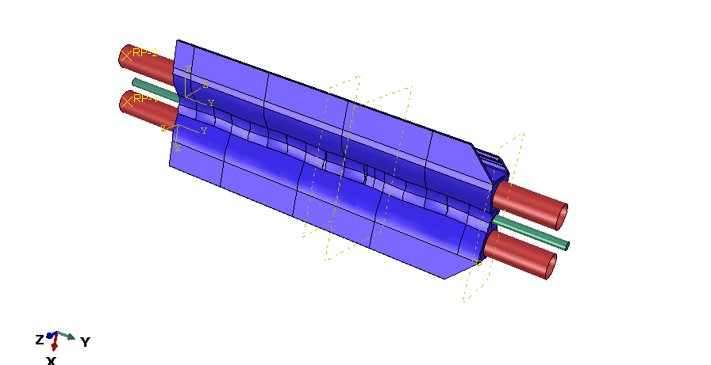{width="2.9923075240594925in" height="1.766411854768154in"}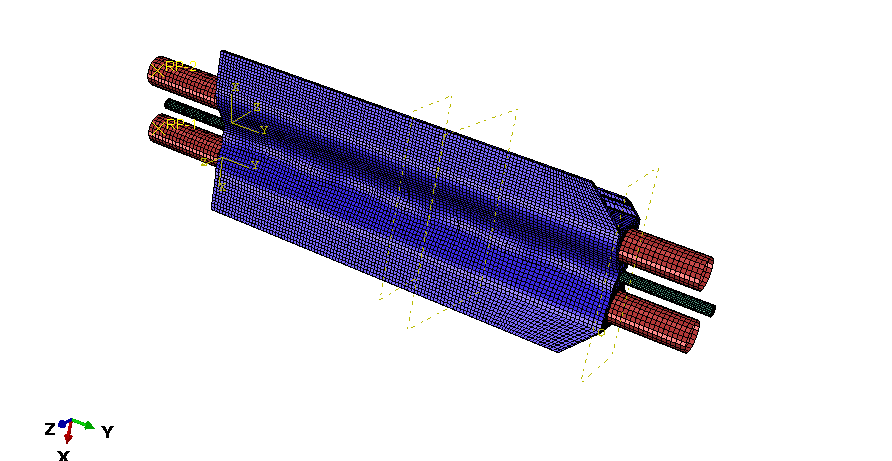{width="2.991994750656168in" height="1.6498337707786526in"}

[]{#_Ref187760643 .anchor}Figure 22: Overview of the FE model definition.

In total, the model consists of 67387 elements. The Marlow constitutive model described earlier was used to describe the two PU connections parts, while the steel cylinders were assumed as rigid materials. Finally, the rope was modelled using an anisotropic elastic model, with the main Young modulus set to 634 MPa (evaluated using the data of the supplier given here[^4] (960 kg to failure at 30% elongation yields to an elastic material with a Young modulus of 634 MPa, assuming linear elasticity). In order to capture the rope behaviour (no bending and compressive stiffnesses) the Young moduli in the transverse directions were set to very low values (i.e.: E2=E3=20 MPa) and the shear moduli were set to 5 MPa). These are our assumption and note that these are strong assumptions that are thought to be representative of the rope used but that cannot be fully verified without testing of the rope, which is outside of the scope of this work. The bottom cylinder was completely fixed, while the top cylinder is imposed a linear displacement over time (at a speed of 10 mm/s).

### FE results and stress estimations in the connection

Finite Element (FE) simulations were conducted to analyze the behavior of the components under tension, compression, and shear loading conditions. The results for the tensile tests are shown in [Figure 23](#_Ref187767678), while the outcomes from the compression simulations are presented in [Figure 26](#_Ref187835662). Additionally, the shear results are displayed in [Figure 27](#_Ref188879566). These simulations provide a comprehensive understanding of the material\'s performance across different loading scenarios, highlighting the varying stress distributions and behaviours in tension, compression, and shear.

Overall, the comparisons between these different loading conditions demonstrate that the model can describe the component\'s behaviour with sufficient accuracy. As a result, it will be further utilized to estimate the stress distribution and subsequent fatigue life of the component. While the current model performs well, there is potential for improvement by more accurately capturing the behaviour of the rope, which could enhance the overall accuracy of the simulations.

#### Comparison FEA/experimental results for model validation 

[Figure 23](#_Ref187767678) shows a comparison between the tests performed and presented in section 1 and the FE model.

![[]{#_Ref187767678 .anchor}Figure 23: Comparison FEA-Experiment on the connection tensile test with and without rope.](../images/2025-02-12_surewave_d6.3/image36.png){width="4.9140266841644795in" height="3.208287401574803in"}

The model clearly captures the level of the force and its evolution, although the response appears stiffer, especially for the configuration with a rope. This is due to the fact that the gap between the male and female parts in the model are tighter than on the real connections (due to the retraction of the plastic parts during cooling of the injection moulding process, as explained in section 1). This changes the friction at the contact areas between the male and female, and thus increases the stiffness of the component. For the configuration without rope, the models predict a higher force than the experiment, which is due to the fact that the male and female parts could twist during the tests, again because of the larger gaps between plugs, which is not present in the FE model.

A look at the deformed configuration of the component at high displacement clearly shows that the models capture correctly the deformation of the component, and in particular the motion of the rope when deformed during the tests, see [Figure 24](#_Ref187768088).

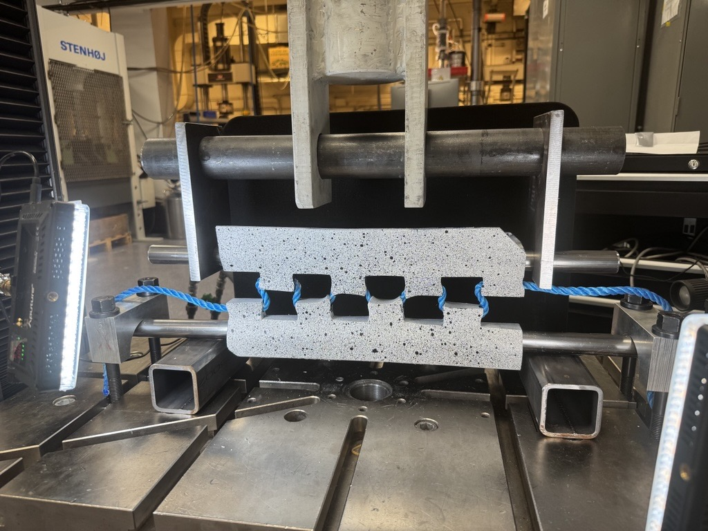{width="2.9144870953630795in" height="1.5013888888888889in"}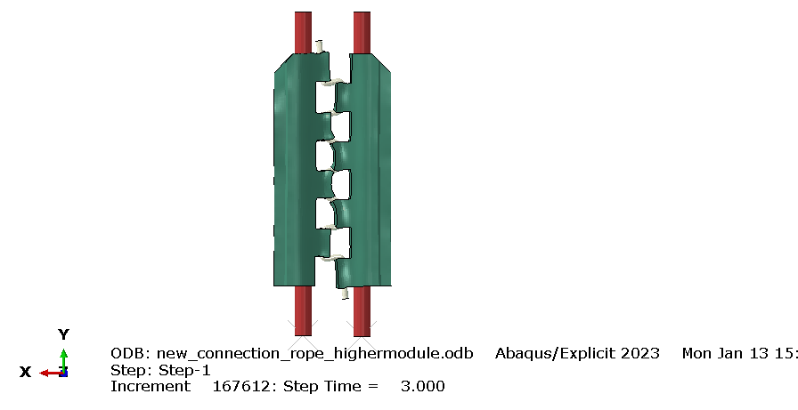{width="1.5245395888013997in" height="3.3443318022747155in"}

[]{#_Ref187768088 .anchor}Figure 24: Comparison experiment-FEA on the tensile test at 33mm displacement.

This is also confirmed by the comparison between the strain fields obtained experimentally and in the FE model, see [Figure 25](#_Ref188879390).

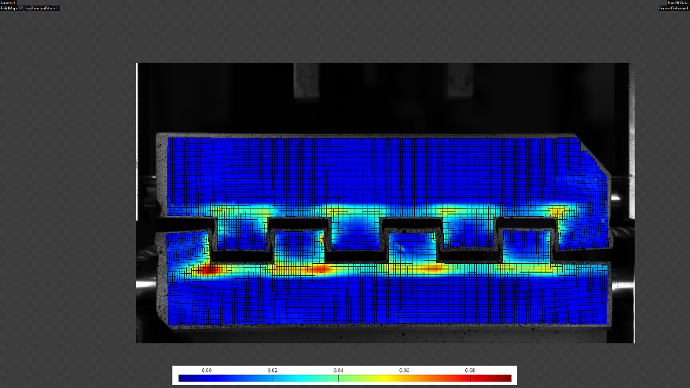{width="2.641742125984252in" height="1.1805555555555556in"} 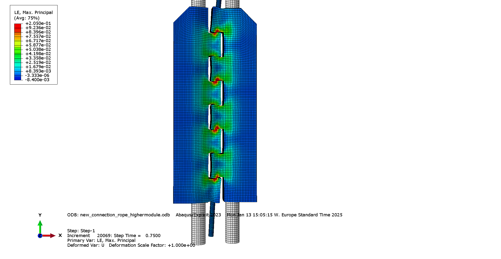{width="1.1879494750656168in" height="2.6440758967629048in"}{width="0.9444444444444444in" height="1.302681539807524in"}

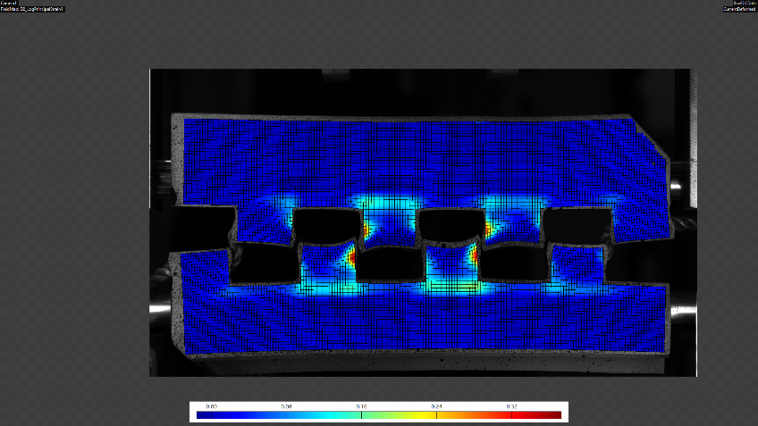{width="2.6041666666666665in" height="1.3293416447944006in"}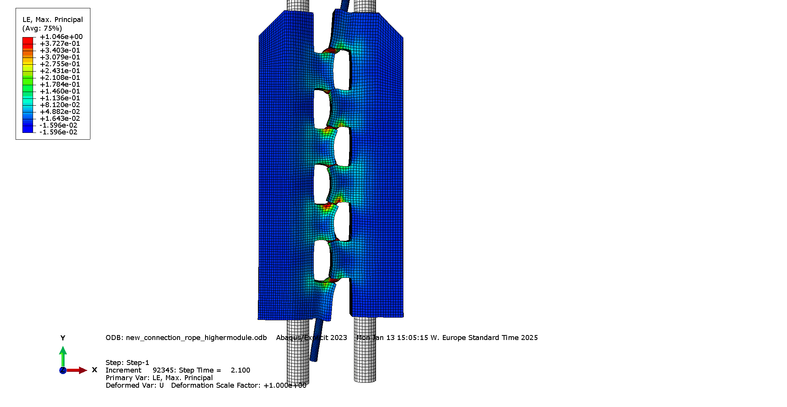{width="1.3547736220472442in" height="2.709902668416448in"}{width="0.9166666666666666in" height="1.4089818460192476in"}

[]{#_Ref188879390 .anchor}Figure 25: Comparison DIC (left)/FEA (right) for 10 mm (top) and 25 mm (bottom) displacements, in terms of first principal strain. The scales on the right are identical for the DIC and FEA.

**In compression,** the model predicts a stiffer response than experimentally observed (see [Figure 26](#_Ref187835662)) However, the correct trend is observed, and the maximum force level before collapse is also captured with 16% difference (21 vs 24.4 kN), which is acceptable. The collapse mechanism observed experimentally (twisting of the male and female parts) is also well captured by the FE model.

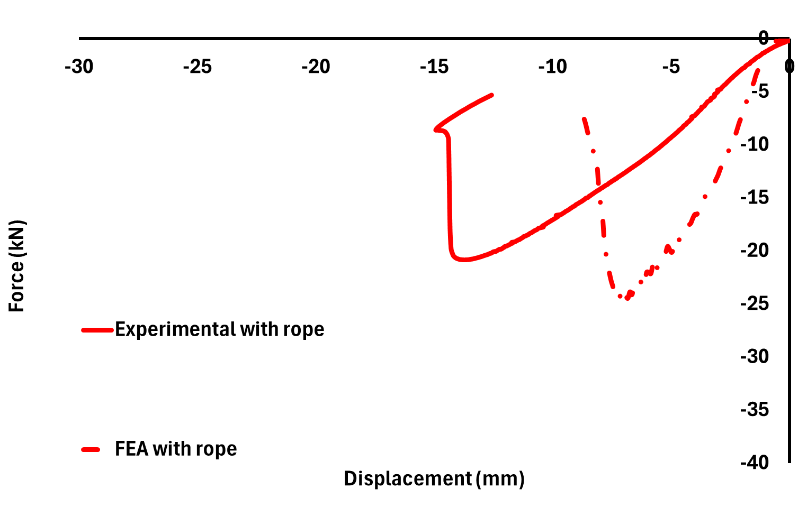

[]{#_Ref187835662 .anchor}

Figure 26: Comparison FEA-experiment in compression.

Finally, the response in **shear** is well represented by the FE model, in terms of force evolution, although the stiffness appears slightly lower than experimentally observed, see [Figure 27](#_Ref188879566).

![[]{#_Ref188879566 .anchor}Figure 27: Comparison FEA-experiment in shear.](../images/2025-02-12_surewave_d6.3/image46.png){width="5.326388888888889in" height="3.4669575678040245in"}

Overall, the different comparisons show that the model is able to describe the component behaviour with sufficient accuracy and will thus be further used for estimating the stress and subsequent fatigue life of the component. Accuracy improvements could certainly be made by better capturing the rope behaviour.

#### Use of the FE model to estimate the stress distribution in the component and fatigue life

In order to estimate the fatigue life, the model was loaded in tension, as it was shown earlier in the SUREWAVE project that the tension mode is the most critical loading mode for the connection (see D5.2). The force vs displacement evolution of the component predicted by the FE model is given in [Figure 23](#_Ref187767678), and the stress distribution in the male and female components is given in [Figure 28](#_Ref187838197) for different displacements (10, 20 and 30 mm) and in terms of Von Mises and first principle stresses. Note that the rope was removed from the pictures for clarity.

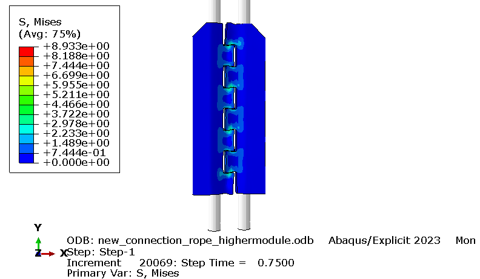{width="1.3278018372703413in" height="1.9236111111111112in"} {width="1.3521850393700787in" height="1.9236111111111112in"}

{width="1.0034011373578302in" height="2.7656244531933507in"} {width="0.9672812773403324in" height="2.7293318022747157in"}

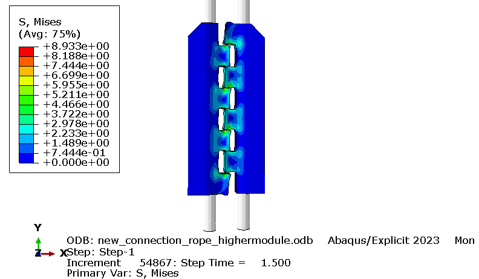{width="1.0721937882764654in" height="2.786457786526684in"} 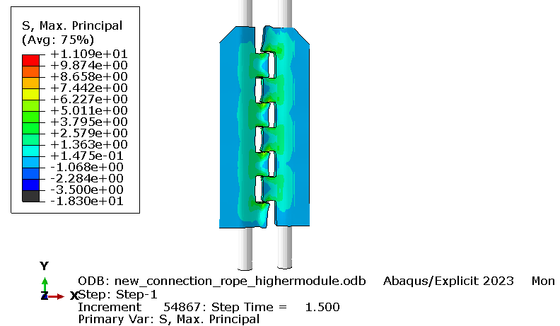{width="1.0431911636045494in" height="2.8071347331583554in"}

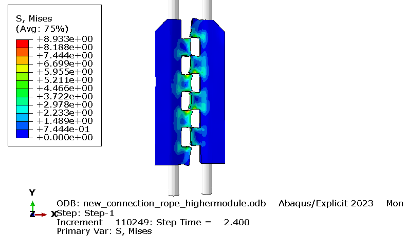{width="1.1029571303587051in" height="2.7916666666666665in"} 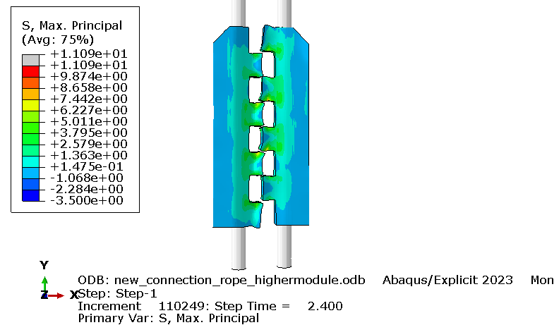{width="1.1065726159230096in" height="2.7597769028871393in"}

[]{#_Ref187838197 .anchor}Figure 28: Evolution of the stress distribution in the component for different displacement values (9,18 and 28mm), in terms of Von Mises stress (left) and first principal stress (right).

It is clear that the maximum stress areas are located in the plug areas at the contact between the male and female parts, and the rope, as expected. In these areas, the principal stress is positive, meaning that the material is in tension. An enlarged section of the plug area is shown in [Figure 29](#_Ref187841546).

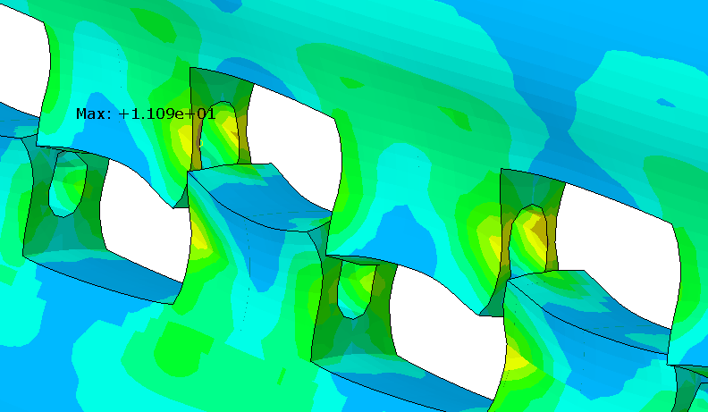{width="2.9186964129483814in" height="1.7in"} 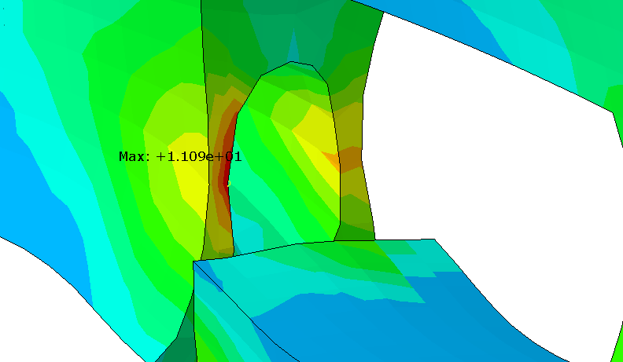{width="2.9110903324584427in" height="1.693001968503937in"}

[]{#_Ref187841546 .anchor}Figure 29: Focus on the areas with higher stress (principal stress) at 28 mm displacement. The colour scale corresponds to the one given in [Figure 28](#_Ref187838197).

From the FEA it appears that the maximum principal stress experienced by the PU component is **11.09 MPa**, which happens for a displacement of **28 mm**. At this displacement level, the connection is not functional anymore, as the plugs are disconnected from each other and the connection is permanently damaged. Thus, it is unlikely that this state will happen in operation, or the connection will need to be repaired. Still, using this stress value as a conservative value, it is clearly visible that the stress in the component **will not exceed the 15.6 MPa value defined in section [3.1.3](#fatigue-life-estimate-based-on-sn-curves)** for a 25 years lifetime. Using this value in equation (1) from [3.1.2](#sn-curves-results) with the coefficient from [Table 8](#_Ref187759392) yields a number of cycles to failure of

$$N_{f} = \left( \frac{\sigma}{A} \right)^{\frac{1}{b}} = \left( \frac{11.09}{52.25} \right)^{1/( - 0.059)} = 2.5e^{+ 11}$$

at this stress value.

It should be noted that this is a very rough fatigue estimation of the component, and that mixed modes loading (i.e. combined tension and shear for example) has not been considered here. Nevertheless, it is believed that the assumptions taken in this study and the conclusions are both reliable and conservative.

**If a steel rod system is used**, the force in the PU component is noticeably higher than if a rope system is used, as discussed in section 2.3. A FEA of such system shows that the force **cannot exceed 6.9 kN in order for the principal stress to remain under the safety value of 15.6 MPa**. It is still **3 times** the maximum load observed in the PU component test with PP rope.

# Conclusions

The current deliverable focused on reporting the results obtained from the experimental campaign performed in task 6.3 to assess the ultimate strength of the new connection design developed in the SUREWAVE project which will be used in the FPV solar system. In addition, some fatigue tests and preliminary lifetime estimations were also presented. From the results, the following conclusions can be made:

**[Concerning Ultimate strength and components stiffnesses :]{.underline}**

- The new connection system has a higher ultimate strength than the first version tested in D6.1 in tension, which is very noticeable: the portion tested had **an average of 2 kN to failure**, but represents only 1/5^th^ of the total real connection. A gain of almost **3 times compared to the original connection.**

- **The ultimate strength in tension will also vary noticeably depending on the rope system used to maintain both sides of the connection system in place. (From 2kN to 8.36 kN)**

- The deviation during the tests was also significant due to early cracks triggered during some tests. This is probably due to bad production process. **It is thus critical to have very good control over the production of the connections during mass production to get the expected mechanical properties.**

- The **compression behaviour has been significantly improved**, which will avoid earlier buckling and snapping loads compared to the original hinge design presented in D6.1. The strength to buckling in the component tested was **around 20 kN**.

- The new connection system kept its high shear deformation indicating that **tension is the only failure mode to consider** during operation.

**[Concerning the fatigue behaviour:]{.underline}**

- From the fatigue campaign run on the Polyurethane materials and the FEA performed, it seems that the stresses in the connection tightened with a PP rope remain very limited even when the maximum force is reached, with a **maximum calculated stress of 11.09 MPa**. This would then lead to a number of cycles to failure of approx. $2.5e^{+ 11}$, by extrapolating the SN curves obtained experimentally, which is **well beyond the 7.88e^+08^ corresponding to 25 years**. It thus indicates that fatigue would not be a main failure mode for these connections. However, the influence of ageing on the PU material was not accounted for in this campaign, so some additional checks should be performed in future research.

- If a steel rod is used instead of a PP rope, the load can get significantly higher in the PU component, and **the 7.88e^+08^ will be reached if the force in the component does not exceed 6.9 kN.**

Following the points highlighted during the testing of the new connections, it appears that **the new system has much better performance than the first version**, in all critical aspects underlined in D6.1. **Performance could however be further increased** if the rope system is changed with a stiffer one, for example with a steel wire instead of a PP rope. Overall, the new connection **is more robust and operates at higher load levels, and fatigue does not seem to be a strong issue as initially anticipated.**

[^1]: <https://www.biltema.no/batutstyr/tau/universaltau/presenningssnor-8-mm-x-30-m-2000059996>

[^2]: DIC Software eCorr v4.0, Copyright 2017, NTNU, Egil Fagerholt.

[^3]: <https://classes.engineering.wustl.edu/2009/spring/mase5513/abaqus/docs/v6.6/books/usb/default.htm?startat=pt05ch17s05abm07.html#usb-mat-chyperelastic>

[^4]: <https://www.biltema.no/batutstyr/tau/universaltau/presenningssnor-8-mm-x-30-m-2000059996>
