> Source: `SUREWAVE_D5.5_Fatigue_crack_propagation_algorithms_R1.docx` — Document date: 2025-04-30 — Converted: 2026-09-28 via pandoc/pdftotext

---

##### 

Deliverable number: D5.5

+------------------------------------------------------------------------------------------------------------------------------------------------------+
| ##### {width="7.8701301399825025in" height="2.5902777777777777in"} |
+======================================================================================================================================================+
| ##### SUREWAVE -- Structural Reliable Offshore Floating PV Solution Integrating Circular Concrete Floating Breakwater                                |
+------------------------------------------------------------------------------------------------------------------------------------------------------+

Title: Fatigue crack propagation algorithms

# **Disclaimer:**  {#disclaimer .TOC-Heading}

The SUREWAVE project is Funded by the European Union. Views and opinions expressed are however those of the author(s) only and do not necessarily reflect those of the European Union. Neither the European Union nor European Climate, Infrastructure and Environment Executive Agency (CINEA) can be held responsible for them

Deliverable details

  ---------- -------- ------------------------------------------------------
  **WP**     5        

  **Task**   D5.5     Fatigue crack propagation algorithms
  ---------- -------- ------------------------------------------------------

  ------------------------- --------------- -- -------------------------- ---------------------
  **Dissemination level**   EU classified      **Due delivery date**      31.03.2025

  **Deliverable type**      R                  **Actual delivery date**   30.04.2025
  ------------------------- --------------- -- -------------------------- ---------------------

  -------------------------------- ---------------------------------------------
  **Lead beneficiary**             **SINTEF**

  **Contributing beneficiaries**   
  -------------------------------- ---------------------------------------------

+----------------------+------------+-----------------------+-------------------------------------------------------------+
| **Document Version** | **Date**   | **Author**            | **Comments**[^1]                                            |
+----------------------+------------+-----------------------+-------------------------------------------------------------+
| 1.0                  | 01/04/2025 | Aritz Dorronsoro      | Version 1.0                                                 |
|                      |            |                       |                                                             |
|                      |            | Unai Eibar            |                                                             |
+----------------------+------------+-----------------------+-------------------------------------------------------------+
| R1                   | 29/04/2025 | Unai Eibar            | Reviewed by Balram Panjwani, Jon Alkorta, Stéphane Dumoulin |
|                      |            |                       |                                                             |
|                      |            | Aritz Dorronsoro      |                                                             |
+----------------------+------------+-----------------------+-------------------------------------------------------------+
| Final                | 30/04/2025 | Unai Eibar            | Final                                                       |
|                      |            |                       |                                                             |
|                      |            | Aritz Dorronsoro      |                                                             |
+----------------------+------------+-----------------------+-------------------------------------------------------------+
|                      |            |                       |                                                             |
+----------------------+------------+-----------------------+-------------------------------------------------------------+

+-------------------------------------------------------------------------------------------------------------------------------------------------+
| **Dissemination level**                                                                                                                         |
+=====================================+===========================================================================================================+
| PU                                  | Public- fully open                                                                                        |
+-------------------------------------+-----------------------------------------------------------------------------------------------------------+
| SEN                                 | SEN = Sensitive -- limited under the conditions of the Grant Agreement                                    |
+-------------------------------------+-----------------------------------------------------------------------------------------------------------+
| EU classified                       | EU classified -- restraint -- UE/EU-restricted, confidential, secret-UE/EU secret under Decision 2015/444 |
+-------------------------------------+-----------------------------------------------------------------------------------------------------------+
| **Deliverable type**                                                                                                                            |
+-------------------------------------+-----------------------------------------------------------------------------------------------------------+
| R:                                  | Document, report (excluding the periodic and final reports)                                               |
+-------------------------------------+-----------------------------------------------------------------------------------------------------------+
| DEM:                                | Demonstrator, pilot, prototype, plan designs                                                              |
+-------------------------------------+-----------------------------------------------------------------------------------------------------------+
| DEC:                                | Websites, patents filing, press & media actions, videos, etc.                                             |
+-------------------------------------+-----------------------------------------------------------------------------------------------------------+
| OTHER:                              | Software, technical diagram, etc.                                                                         |
+-------------------------------------+-----------------------------------------------------------------------------------------------------------+

**EXECUTIVE SUMMARY**

The following document outlines the activities conducted in Task 5.4, in collaboration with Task 5.3. This activity focuses on fatigue crack propagation algorithms as described in task 5.4.1, to serve as a tool for lifespan prediction. The primary objective of this deliverable is to explain the formulation of the algorithms of crack, and to serve as a conceptual basis for subsequent tasks related to their implementation in the Structural Health Management System. This implementation uses the detailed stress field obtained from the submodelling simulations of the reinforcement rebar, described in Task 5.3, to serve as an example of the applicability of the algorithms. The structure of the document is as follows:

Chapter 1 introduces the deliverable and outlines its objectives.

Chapter 2 explains the concepts of linear elastic fracture mechanics.

Chapter 3 presents a literature review of existing Stress Intensity Factors (SIFs).

Chapter 4 details the Finite Element (FE) model that has been used to generate new SIF solutions.

Chapter 5 shows a case study of the crack propagation algorithm.

The results presented in Chapter 5 are valuable for understanding the mechanics of crack propagation prediction, concluding the theoretical work related to the topic. This shall later be implemented in the Structural Health Management System.

**Deliverable Review**

+----------------------------------------------------------------------------------+-----------------+---------------------------------------+-----------------+-----------------+---------------------------------------+-----------------+
|                                                                                  | **Reviewer #1: Jon Alkorta**                                              | **Reviewer #2: Stéphane Dumoulin**                                        |
|                                                                                  +-----------------+---------------------------------------+-----------------+-----------------+---------------------------------------+-----------------+
|                                                                                  | **Answer**      | **Comments**                          | **Type\***      | **Answer**      | **Comments**                          | **Type\***      |
+----------------------------------------------------------------------------------+-----------------+---------------------------------------+-----------------+-----------------+---------------------------------------+-----------------+
| 1.  Is the deliverable in accordance with                                                                                                                                                                                                |
+----------------------------------------------------------------------------------+-----------------+---------------------------------------+-----------------+-----------------+---------------------------------------+-----------------+
| (i) The Description of Work?                                                     | Yes             |                                       | M               | Yes             |                                       | M               |
|                                                                                  |                 |                                       |                 |                 |                                       |                 |
|                                                                                  | No              |                                       | m               | No              |                                       | m               |
|                                                                                  |                 |                                       |                 |                 |                                       |                 |
|                                                                                  |                 |                                       | a               |                 |                                       | a               |
+----------------------------------------------------------------------------------+-----------------+---------------------------------------+-----------------+-----------------+---------------------------------------+-----------------+
| (ii) The international State of the Art?                                         | Yes             | *Not applicable for this deliverable* | M               | Yes             | *Not applicable for this deliverable* | M               |
|                                                                                  |                 |                                       |                 |                 |                                       |                 |
|                                                                                  | No              |                                       | m               | No              |                                       | m               |
|                                                                                  |                 |                                       |                 |                 |                                       |                 |
|                                                                                  |                 |                                       | a               |                 |                                       | a               |
+----------------------------------------------------------------------------------+-----------------+---------------------------------------+-----------------+-----------------+---------------------------------------+-----------------+
| 2.  Is the quality of the deliverable in a status                                                                                                                                                                                        |
+----------------------------------------------------------------------------------+-----------------+---------------------------------------+-----------------+-----------------+---------------------------------------+-----------------+
| (i) That allows it to be sent to European Commission?                            | Yes             |                                       | M               | Yes             |                                       | M               |
|                                                                                  |                 |                                       |                 |                 |                                       |                 |
|                                                                                  | No              |                                       | m               | No              |                                       | m               |
|                                                                                  |                 |                                       |                 |                 |                                       |                 |
|                                                                                  |                 |                                       | a               |                 |                                       | a               |
+----------------------------------------------------------------------------------+-----------------+---------------------------------------+-----------------+-----------------+---------------------------------------+-----------------+
| (ii) That needs improvement of the writing by the originator of the deliverable? | Yes             |                                       | M               | Yes             |                                       | M               |
|                                                                                  |                 |                                       |                 |                 |                                       |                 |
|                                                                                  | No              |                                       | m               | No              |                                       | m               |
|                                                                                  |                 |                                       |                 |                 |                                       |                 |
|                                                                                  |                 |                                       | a               |                 |                                       | a               |
+----------------------------------------------------------------------------------+-----------------+---------------------------------------+-----------------+-----------------+---------------------------------------+-----------------+
| (iii) That need further work by the Partners responsible for the deliverable?    | Yes             |                                       | M               | Yes             |                                       | M               |
|                                                                                  |                 |                                       |                 |                 |                                       |                 |
|                                                                                  | No              |                                       | m               | No              |                                       | m               |
|                                                                                  |                 |                                       |                 |                 |                                       |                 |
|                                                                                  |                 |                                       | a               |                 |                                       | a               |
+----------------------------------------------------------------------------------+-----------------+---------------------------------------+-----------------+-----------------+---------------------------------------+-----------------+

\* Type of comments: M = Major comment; m = minor comment; a = advice

# Table of Contents {#table-of-contents .TOC-Heading}

[1. Introduction. [6](#introduction.)](#introduction.)

[2. Linear Elastic Fracture Mechanics (LEFM). [7](#linear-elastic-fracture-mechanics-lefm.)](#linear-elastic-fracture-mechanics-lefm.)

[2.1. Development of LEFM. [7](#development-of-lefm.)](#development-of-lefm.)

[2.2. LEFM in fatigue problems. [9](#lefm-in-fatigue-problems.)](#lefm-in-fatigue-problems.)

[3. Literature review of existing SIF solutions. [12](#literature-review-of-existing-sif-solutions.)](#literature-review-of-existing-sif-solutions.)

[4. Generation of SIFs for new crack configurations. [13](#generation-of-sifs-for-new-crack-configurations.)](#generation-of-sifs-for-new-crack-configurations.)

[4.1. Sensitivity analysis. [15](#sensitivity-analysis.)](#sensitivity-analysis.)

[4.2. Validation of the FE model. [19](#validation-of-the-fe-model.)](#validation-of-the-fe-model.)

[4.3. Generation of the new SIF solutions. [20](#generation-of-the-new-sif-solutions.)](#generation-of-the-new-sif-solutions.)

[5. Implementation. Example case. [22](#implementation.-example-case.)](#implementation.-example-case.)

[Conclusions [25](#conclusions)](#conclusions)

[References [26](#references)](#references)

# List of figures {#list-of-figures .TOC-Heading}

[Figure 1: Stresses near the tip of a crack in an elastic material. \[1\] [8](#_Ref193802801)](#_Ref193802801)

[Figure 2: Loading modes of a crack. \[1\] [8](#_Toc196901572)](#_Toc196901572)

[Figure 3: Fatigue crack growth diagram, showing its main stages. \[8\] [10](#_Ref192149727)](#_Ref192149727)

[Figure 4: Spider web meshing of the crack front on a reinforcement rebar present in a floating breakwater. [13](#_Ref188967600)](#_Ref188967600)

[Figure 5: Tension (a) and bending (b) loading conditions. (Adapted from \[29\]) [13](#_Ref190168820)](#_Ref190168820)

[Figure 6: Standard mid-point (a) and quarter-point (b) C3D15 elements. The red line represents the crack front. Left side of (a) and (b) shows a side view of the elements, while the right side shows the front view. [14](#_Ref189575970)](#_Ref189575970)

[Figure 7: Parametric description of a round bar with an elliptical crack. [14](#_Ref190164599)](#_Ref190164599)

[Figure 8: Available SIF solutions in the literature. Adapted from \[25, 29\]. [15](#_Ref190164910)](#_Ref190164910)

[Figure 9: Parametric description of the spider web. [15](#_Ref192347018)](#_Ref192347018)

[Figure 10: Configurations of different spider web sizes. [16](#_Ref192347408)](#_Ref192347408)

[Figure 11: Configurations of different spider web patterns. [16](#_Ref192347950)](#_Ref192347950)

[Figure 12: Configurations of different levels of spider web refinement. [17](#_Ref192348064)](#_Ref192348064)

[Figure 13: Results of all the sensitivity analyses. [17](#_Ref192348862)](#_Ref192348862)

[Figure 14: Zoom on the results of the sensitivity analyses. [18](#_Ref192349229)](#_Ref192349229)

[Figure 15: Comparison of Geometric Correction Factors (F) for tension (a) and bending (b) loading cases for $\gamma = 0$. [19](#_Ref191378395)](#_Ref191378395)

[Figure 16: Crack geometry of new SIF solutions. [20](#_Ref188961670)](#_Ref188961670)

[Figure 17: Generation of Geometric Correction Factors (F) for tension (a) and bending (b) loading cases for $a/b \geq 2$. [21](#_Ref191379610)](#_Ref191379610)

[Figure 18: Fitting error for the tension (a) and bending (b) loading cases. [21](#_Ref190268065)](#_Ref190268065)

[Figure 19: FE model of the breakwater. [22](#_Ref192574669)](#_Ref192574669)

[Figure 20: Submodels for refined stress fields for the whole system (a) and for the reinforcement (b). [22](#_Ref192574820)](#_Ref192574820)

[Figure 21: Reinforcement rebar illustration (a), and maximum (b) and minimum (c) stress distributions. [23](#_Ref192576327)](#_Ref192576327)

[Figure 22: Stress decomposition in elementary stress distributions. [23](#_Ref192576742)](#_Ref192576742)

[Figure 23: Crack growth for a fatigue cycle. Growth increments have been exaggerated for easier visualisation. [25](#_Ref192599592)](#_Ref192599592)

# List of tables {#list-of-tables .TOC-Heading}

[Table 1: Parameters to define the FE model for the validation. [14](#_Ref190156125)](#_Ref190156125)

[Table 2: Parameters to define the FE model for the generation of new SIF solutions. [20](#_Ref190167862)](#_Ref190167862)

[Table 3: Decomposition of peak and valley stresses in elementary stress distributions. $\sigma max\$ and $\sigma min\$ correspond to results described in deliverable D5.3. Representative values $\sigma 0$ and $\sigma 1\$ are calculated to guarantee that $\sigma max\  = \sigma 0 + \sigma 1$ and $\sigma min = \sigma 0 - \sigma 1$, using expressions $\sigma 0 = (\sigma max + \sigma min)/2$ and $\sigma 1 = (\sigma max - \sigma min)/2$. [23](#_Ref192578549)](#_Ref192578549)

[Table 4: Geometric correction factors for points A and B for tension and bending loading cases. [24](#_Toc196901597)](#_Toc196901597)

[Table 5: Depth increments for points A and B. [24](#_Toc196901598)](#_Toc196901598)

# 1. Introduction.

In the SUREWAVE project, an innovative concept of a Floating Photo-Voltaic (FPV) system protected by an external floating breakwater line is developed. The goal of WP5 is to generate predictive modelling and simulation tools for material properties and structural integrity management of the different structural components and parts. In particular, the analysis focuses on the reinforcement bars within the floating breakwaters. Concrete only shows resistance under compressive loads, and it cracks easily under tension. Reinforcement bars are placed to withstand the tensile loads that would otherwise cause the concrete structure to fail. Therefore, mechanical failure of the reinforcement rebars would directly lead to the concrete structure's mechanical failure. In this deliverable, fatigue crack propagation algorithms are studied, necessary for calculations to analyse the lifespan of the reinforcement. This report does not address how cracks are initiated, since multiple possible causes exist: corrosion of the concrete's outer surface is likely to occur in the studied systems, due to long exposures to relatively aggressive environments; however, surface cracks on the pristine rebars would follow the same evolution, and so would impurities such as inclusions. Surface quality assessment techniques and microstructural analysis on pristine rebars are methods to ensure that no cracks (or impurities that can act as cracks) larger than certain critical sizes are not present. Suppliers are usually required to ensure certain quality criteria with respect to these factors. This analysis is not dependent on the specific crack generation mechanism.

The primary objective of this document is to give a complete explanation of the fatigue crack propagation analysis steps. For that, propagation laws based on stress intensity factor (SIF) are applied, namely Paris-Erdogan based laws. The formulation of the methodology is based on linear elastic fracture mechanics (LEFM), which describes the mechanical behaviour of materials as isotropic, linear elastic. This approach is compatible with typical working conditions for the studied system, since the reinforcement bars withstand low loads for long lifetimes. This is common for most systems which serve structural purpose, which are dimensioned so that they work in the elastic regime. These algorithms rely on the availability of SIF solutions for different part and crack geometries to be applicable. To enhance the current database of SIFs, solutions for new configurations have been generated during the development of the project.

This report is organised as follows:

> Chapter [2. Linear Elastic Fracture Mechanics (LEFM](#linear-elastic-fracture-mechanics-lefm.)): an introductory revision of linear elastic fracture mechanics is conducted, mainly focusing on the formulation of Stress Intensity Factors (SIFs) and Paris-Erdogan based crack propagation laws.
>
> Chapter 3. [Literature review of existing SIF s](#literature-review-of-existing-sif-solutions.): a literature review of existing SIF solutions is conducted, for various part geometries, crack configuration and loading cases, citing the most relevant authors and works.
>
> Chapter [4. Generation of SIFs for new crack configurations](#generation-of-sifs-for-new-crack-configurations.): The description of the Finite Element (FE) model used to generate SIFs for new geometries has been completed (chapter 4).
>
> Chapter [5. Implementation. Example case](#implementation.-example-case.): analysis of an example case, based on results obtained in Task 5.3 and described in deliverable D5.3.

Conclusions of the research are presented in the last chapter, [Conclusions](#conclusions).

# 2. Linear Elastic Fracture Mechanics (LEFM).

Fracture mechanics has been a relevant field for the past two centuries. This is largely due to the rising complexity and scale of engineering structures, as well as catastrophic failures that highlight the necessity for a better understanding of how materials behave under fatigue. Historically, several significant accidents, such as the Liberty ships during World War II and the Comet jetliner crashes in the 1950s, were associated with the propagation of cracks in structures. These incidents revealed the limitations of existing theories and underscored the necessity for a stronger framework to predict and prevent such failures \[1\].

## 2.1. Development of LEFM.

In 1920, Alan Arnold Griffith made one of the earliest contributions to the field. Griffth applied the first law of thermodynamics to develop a fracture theory based on a simple energy balance \[2\]. According to this theory, fracture occurs when a flaw becomes unstable, and the change in strain energy from a crack increment is sufficient to overcome the material\'s surface energy. However, since this model assumes that the work of fracture originates solely from the surface energy of the material, the Griffith approach applies only to ideally brittle solids. The limitations of Griffith\'s theory led to further advancements, most notably by George Rankine Irwin, who developed the energy release rate concept \[3\] and extended the concept to ductile materials by including the energy dissipated by local plastic flow \[4\]. Additionally, Irwin \[5\] utilised Westergaard\'s \[6\] approach to demonstrate that the stresses and displacements near the crack tip can be characterised by a single constant. This constant is related to the energy release rate, which is commonly referred to as the stress intensity factor (SIF).

The energy approach in fracture mechanics states that crack growth occurs when the energy available for crack extension is sufficient to overcome the material\'s resistance. In this context, the energy release rate, $G$, is defined as the rate at which potential energy changes with respect to the crack area in a linear elastic material. The J-integral is an alternative expression for the energy release rate, represented as a contour integral for an elastic medium (not necessarily linear). One of its significant properties is its invariance with respect to any integration contour surrounding the crack front. This characteristic allows the J-integral to be regarded as a parameter for crack propagation, and makes it relatable to SIFs in linear elasticity. The complete stress distribution at a crack's tip can be calculated using the equations shown in Figure 1, which are applicable for isotropic linear elasticity conditions.

![[]{#_Ref193802801 .anchor}Figure 1: Stresses near the tip of a crack in an elastic material. \[1\]](../images/2025-04-30_surewave_d5.5_fatigue_crack_propagation_algorithms/image4.png){alt="Diagrama Descripción generada automáticamente" width="6.0092147856517935in" height="2.680696631671041in"}

The stress intensity factor, $K$, characterises the intensity of the stress singularity at the crack tip. Specifically, the stresses near the crack tip increase in proportion to the value of $K.$ Furthermore, the stress intensity factor fully describes the conditions at the crack tip; if $K$ is known, it becomes possible to calculate all components of stress, strain, and displacement as functions of $r$ and $\theta$. As $r$ approaches 0, the leading term tends towards infinity, while the other terms either remain finite or approach zero. Therefore, the stress near the crack tip varies with $1/\sqrt{r}$, regardless of the configuration of the cracked body. It is also important to note that $K$ has a subscript. This subscript refers to how loads are applied on the cracked solid. Depending on the relative movement that is induced on the crack due to the remote stresses, three different modes can be differentiated (Figure 2).

![[]{#_Toc196901572 .anchor}Figure 2: Loading modes of a crack. \[1\]](../images/2025-04-30_surewave_d5.5_fatigue_crack_propagation_algorithms/image5.png){alt="Diagrama Descripción generada automáticamente" width="4.1827274715660545in" height="2.8175306211723536in"}

In any fracture problem, the local stress fields around the crack tip exhibit similar shapes and distributions. The primary differences between various problems arise in the values of the stress intensity factors: $K_{I}$, $K_{II}$, and $K_{III}$. These factors depend on the applied stresses, the geometry of the solid, and the size and position of the crack.

Although stress intensity solutions are provided in various forms, $K$ is typically written in the form of a correction factor to the simplest case, a through-thickness crack:

  ---------------------------------------------------------------------------
  $K_{(I,\ II,\ III)} = F\sigma\sqrt{\pi a}$,                         \(1\)
  ------------------------------------------------------------------- -------

  ---------------------------------------------------------------------------

where $\sigma$ is the characteristic stress, $a$ is the characteristic crack dimension, and $F$ is a dimensionless constant that depends on geometry and mode of loading.

For linear elastic materials, individual components of stress, strain, and displacement are additive. Similarly, stress intensity factors are additive, as long as the mode of loading remains unchanged . In many instances, the principle of superposition allows stress intensity solutions for complex configurations to be built from simple cases for which the solutions are well established. Due to this fact, real-life cases can be studied as a combination of simpler cases. For simple geometries, $K$ can be derived from closed-form solutions, but more complex situations require advanced experimental and/or numerical analysis. As previously mentioned, the J-integral can be utilised to calculate stress intensity factors (SIFs); thus, this parameter is computed using numerical methods. In the case of plane strain, this relationship can be expressed as:

  ---------------------------------------------------------------------------
  $J = \frac{1 - \nu^{2}}{E}(K_{I}^{2} + K_{II}^{2})$,                \(2\)
  ------------------------------------------------------------------- -------

  ---------------------------------------------------------------------------

where $J$ is the J-integral, $\nu$ is Poisson's ratio, $E$ is Young's modulus, and $K_{I}$ and $K_{II}$ are the stress intensity factors for mode $I$ and $II$, respectively.

During this project, the work has focused in analysing crack propagation for reinforcement bars in concrete. In this context, the contributions from modes $II$ and $III$ are excluded, as these systems work in mode $I$. For consideration of three-dimensional cracks, since crack growth occurs under mode I, 3D cracks are analysed as 2D projections along principal stress directions. Specifically, for the studied system (reinforcement rebars), loading conditions (superposition of uniaxial tension/compression + secondary pure bending) result in principal directions aligned with the cross section of the bars. Therefore, in this analysis, $K_{I}$ will be calculated as follows:

  ---------------------------------------------------------------------------
  $$K_{I} = \sqrt{\frac{JE}{1 - \nu^{2}}}$$                           \(3\)
  ------------------------------------------------------------------- -------

  ---------------------------------------------------------------------------

To relate stress intensity factors to crack geometry and stress state, the expression below can be used:

  ---------------------------------------------------------------------------------------------------
  $K_{I} = F\sigma\sqrt{\pi a}\$,                                     []{#_Ref188949560 .anchor}(4)
  ------------------------------------------------------------------- -------------------------------

  ---------------------------------------------------------------------------------------------------

where $K_{I}$ is the stress intensity factor in mode $I$, $F$ is the geometric correction factor, $\sigma$ is the stress in the normal direction to the crack surface and $a$ is the crack depth.

## 2.2. LEFM in fatigue problems.

Although stress intensity factors were initially defined for static or monotonic problems, they are widely applied to analyse fatigue phenomena. Fatigue crack growth rate depends on the SIFs present around the crack during operation. [Figure 3](#_Ref192149727) shows a universal representation of this dependence. In the diagram, three main stages or regimes are distinguished, each fundamentally different: the initiation stage, a stable propagation stage, and, finally, an accelerated propagation that leads to component failure.

Significant effort was dedicated in the research of crack growth rates, which lead to developing formulations and software such as NASGRO \[7\], a micromechanical tool for consideration of fatigue crack growth developed by NASA and still used nowadays.

![[]{#_Ref192149727 .anchor}Figure 3: Fatigue crack growth diagram, showing its main stages. \[8\]](../images/2025-04-30_surewave_d5.5_fatigue_crack_propagation_algorithms/image6.png){alt="A diagram of a diagram AI-generated content may be incorrect." width="4.2807370953630794in" height="3.084414916885389in"}

In the following sections, the three main stages of crack propagation are explained, focusing mostly on the intermediate (stable) stage.

### Regime I

At this stage, a proper micromechanical description of the material is necessary to characterise the microcrack, since the growth mechanism mainly consists of propagation through grain boundaries, which offer significant resistance. Often, a microcrack will only advance within a single grain before stopping, that is, it will not contribute to final failure. Local changes in loading or a high enough cycle can cause these crack propagations to restart. The study of short cracks is uncertain, since it is mostly dictated by the specific microstructural features in the immediate neighbourhood of the microcrack. More specifically, it is highly affected by dislocation dynamics, effect of crystal orientation, etc. which make an LEFM approach not applicable.

Several works have been published proposing different solutions to study this stage of crack growth. For instance, Papangelo \[9\] et al. proposed a unified formulation for crack growth rate for short cracks, after analysing and comparing the work done by El Haddad et al. \[10\], Paris et al. \[11\] and various other authors that modified NASGRO's original formulation.

### Regime II

During the initial stages of growth, cracks tend to grow primarily in the direction perpendicular to the maximum tensile principal stress direction. Specifically, cracks with 3D growth modes during the first stage tend to evolve into 2D crack fronts along these principal directions, corresponding to mode I growth This corresponds to mode I, and it usually happens when the microcrack's size covers a few grains. This corresponds to mode $I$, and it usually happens when the microcrack's size covers a few grains. From this moment, its propagation becomes stable, and it can be modelled using a potential law based on stress intensity factors. The original empirical law for crack growth rate proposed by Paris and Erdogan \[11\] is represented by equation [(5)](#_Ref192149807):

  ---------------------------------------------------------------------------------------------------
  $\frac{da}{dN} = C\ \Delta K_{I}^{m}\$,                             []{#_Ref192149807 .anchor}(5)
  ------------------------------------------------------------------- -------------------------------

  ---------------------------------------------------------------------------------------------------

where $a$ is the crack size, $N$ is the number of cycles, and $C$ and $m$ are material- and environment-dependent constants. Examples of more advanced formulations that account for other mechanisms is given in equation [(6)](#_Ref194303119):

  ---------------------------------------------------------------------------------------------------------------------------------------------------------------------------------------------------------------------------------------------------
  $\frac{da}{dN} = C\frac{\Delta K_{I}^{m}}{(1 - R)K_{IC} - \Delta K_{I}}\$ or $\frac{da}{dN} = C\frac{\left( \Delta K_{I} - \Delta K_{I\ th} \right)^{m}}{(1 - R)^{q}\ \left( K_{IC} - K_{I\ max} \right)^{p}}\$ ,   []{#_Ref194303119 .anchor}(6)
  ------------------------------------------------------------------------------------------------------------------------------------------------------------------------------------------------------------------- -------------------------------

  ---------------------------------------------------------------------------------------------------------------------------------------------------------------------------------------------------------------------------------------------------

where $R = \sigma_{\max}/\sigma_{\min}$ is the stress ratio, $K_{IC}$ is the critical stress intensity factor in mode $I$, ${\Delta K}_{I\ th}$ is the threshold stress intensity difference and $q$ and $p$ are phenomenological exponents that need experimental calibration. The $K_{IC}$ factor represents the value of stress intensity factor necessary to cause immediate catastrophic failure, that is, extremely fast crack growth (at a rate close to the speed of sound of the material) and complete mechanical failure of the part. ${\Delta K}_{I\ th}$ represents the minimum SIF range within a single fatigue cycle to cause crack growth. The more complex a crack growth model is, the more experimental data it requires for a reliable prediction. In many applications, using the original Paris' law is enough for a conservative prediction.

Starting from a long crack that spans several grains (referred to as a precursor or initial crack), the propagation rate can be measured as a function of the range of the applied stress intensity factors, resulting in a diagram similar to the middle section of [Figure 3](#_Ref192149727). Standards exist that describe the careful experimental procedure needed to carry out this kind of measurements, such as *ASTM E647-08 -- Standard test method for measurement of fatigue crack growth rates*. Depending on the material and fatigue loading profile, the majority of the lifetime of the specimen happens within growth regimes $I$ and $II$.

During the development of the project, all expressions for growth rate shown in equations [(5)](#_Ref192149807) and [(6)](#_Ref194303119) were implemented for the formulation of the analysis, where the appropriate one is used depending on the knowledge about crack growth rate parameters. For this analysis to be possible, knowledge about stress intensity factors is necessary.

### Regime III

When the crack size is large, the maximum stress intensity factor during the cycle approaches $K_{IC}$. Poppings (small areas broken by cleavage) are frequent, and the growth rate is further accelerated by these fragile contributions to their spread. When the $K_{IC}$ value is reached, the part breaks by cleavage or coalescence of microcavities. This last stage of fatigue is generally uninteresting from a modelling point of view: the growth rate is so large that the number of cycles consumed in the third regime hardly accounts for the life of the part, and the part is unsuited for operation when it reaches this regime.

There has been a great proliferation of models that try to provide theoretical support for the empirical equation of Paris and Erdogan. Many of these models are variants of others, all of which can be grouped into three major groups: models based on the blunting of the crack front \[12-14\], energetic models \[15, 16\] and micromechanics-assessed crack growth models \[17\].

# 3. Literature review of existing SIF solutions.

As previously mentioned, SIFs can be characterised either experimentally or through numerical methods \[18\]. Experimental measurement of stress intensity factors is indirect, and it is done through, for example, experimental quantification of residual stresses. Moreover, their measurement needs to comply with the formulations of LEFM. Their level of automation is low, and they are subject to the natural uncertainty to guarantee a specific crack geometry, among other external factors that can interfere with their measurement. As a result, numerical methods based on the Finite Element Method (FEM) are widely used to obtain SIF solutions. Most of the available SIF solutions generated by FEM use the virtual crack extension \[19\] and domain integral methods \[20\], and only a few of them use the stiffness derivative finite element technique \[21\].

Newman and Raju \[22\] were pioneers in this field, providing SIF solutions for internal and external surface cracks in cylindrical vessels. They also considered various loading conditions, ranging from uniform loads to cubic loading. As will be shown in this chapter, cylindrical geometries and plates of finite thickness are among the most studied geometries due to their simple geometric structure and their capabilities to provide approximate solutions to a wide variety of problems. The next remarkable piece of research was conducted by Carpinteri \[23, 24\], who investigated straight-edge and elliptical cracks in round bars. In his study, he focused solely on uniform and bending loading situations, as the stress fields in slender geometries can be accurately approximated by combining these two types of stress distributions. Several years later, Carpinteri introduced new solutions for SIF related to sickle-shaped crack geometries in the literature \[25\]. In his study of round bars, Toribio \[26\] conducted a comprehensive comparison of existing literature solutions, highlighting the best options for one \[27\], two \[23, 24, 28\], and three parameter \[29\] analyses: crack-shape ratio, relative crack depth, and relative crack front position. He also mentioned the approach used by each researcher to obtain the SIFs. Lastly, Aursand and Skallerud \[30\] generated new knowledge about straight, sickle-shaped, and almond-shaped elliptical cracks, also considering the curvature of the round bar while studying chain links. They also considered seven elementary loading cases, which allowed for the superposition of complex stress fields. Several articles have been published that focus on finite thickness plates, specifically examining embedded \[31, 32\] and surface \[32-35\] cracks.

It is noteworthy that in studies involving round bars, most researchers present their results in the form of polynomial fittings to SIF solutions using dimensionless parameters such as $a/D$ (where $a$ is the depth of the crack and $D$ is the diameter of the round bar). In contrast, those that do not present their results in this form have prompted other researchers to conduct numerical fittings of their results \[36\]. These polynomial fittings are only valid within certain validity windows, which need to be taken into account for the modelling tasks.

For this study, crack growth algorithms based on the SIF solutions provided by \[29, 32\] were implemented for the modelling of crack growth, those published in \[32\] being the most relevant for modelling of concrete reinforcement bars. Additionally, SIF solutions unavailable in literature were generated using the finite element method, as described in the following section.

# 4. Generation of SIFs for new crack configurations.

As mentioned in the previous section, polynomial fittings available in literature are only valid within certain parameter ranges for crack geometry. In this section, the work done to generate solutions for more crack geometries not available in the literature is described. First, the FE model implemented in Abaqus 2021 is explained, followed by a sensitivity analysis, a validation procedure where already existing solutions are reproduced with the generated model and, finally, the description of the new solutions generated using the model.

The rebars have been considered as round bars, and the crack as an ellipse. Due to the symmetry of the rebar and the geometry of the crack, only a quarter of the round bar is sufficient to be modelled. As shown in [Figure 4](#_Ref188967600), one of the symmetry planes aligns with the crack plane, the XY plane, while the other symmetry plane is oriented perpendicularly to the crack plane in the YZ plane.

Crack

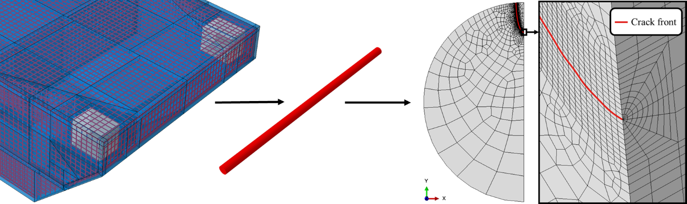{width="6.302084426946632in" height="1.8854166666666667in"}

[]{#_Ref188967600 .anchor}Figure 4: Spider web meshing of the crack front on a reinforcement rebar present in a floating breakwater.

For the material used in the study, the round bar is assumed to consist of a homogeneous and isotropic material that exhibits linear elastic behaviour. Two loading cases have been considered: uniform tension and pure bending. Although the stress field of a round bar can be decomposed into a summation of seven elementary loading cases, as stated in \[30\], an accurate approximation for reinforcement rebars can be achieved through the superposition of the loading cases illustrated in [Figure 5](#_Ref190168820). Loads are applied at the free surface, specifically the crack surface, while boundary conditions are fixed at the remaining surfaces along the symmetry planes.

+-------------------------------------------------------------------------------------+----------------------------------------------------------------------------------+
| 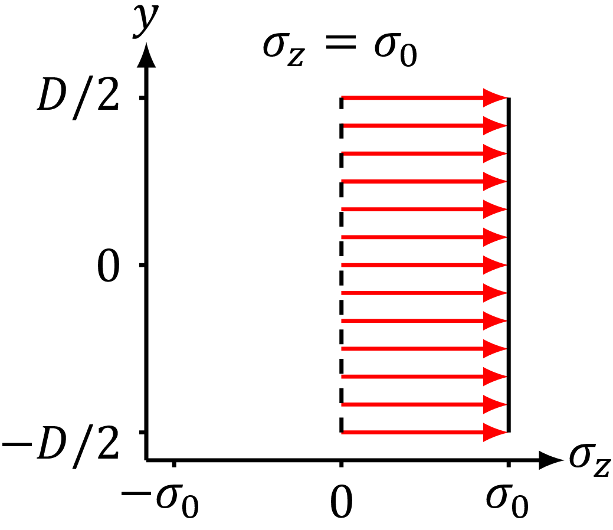{width="2.186490594925634in" height="1.889763779527559in"}     | 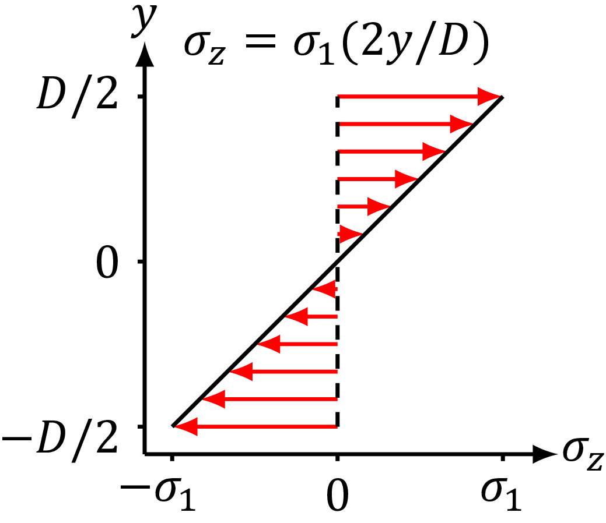{width="2.1864873140857393in" height="1.889763779527559in"} |
+:========================================:+:========================================:+:================================================================================:+
| **(a)**                                  | **(b)**                                                                                                                     |
+------------------------------------------+-----------------------------------------------------------------------------------------------------------------------------+
| []{#_Ref190168820 .anchor}Figure 5: Tension (a) and bending (b) loading conditions. (Adapted from \[29\])                                                              |
+------------------------------------------------------------------------------------------------------------------------------------------------------------------------+

Quadratic C3D15 wedge elements (triangular prisms) were used for the analysis. To reproduce the square-root singularity ($1/\sqrt{r}$ dependence of the stress field) near the crack tip, it is necessary to modify the position of the integration points of the elements in contact with the crack front. More specifically, the midpoints of the wedge elements of the edges that either begin or end at the crack front (but are not completely at the crack front) are adjusted to a quarter distance from the crack tip, as shown in [Figure 6](#_Ref189575970).

+-----------------------------------------------------------------------------------------------------------------------------+----------------------------------------------------------------------------------------------------------------------------+
| 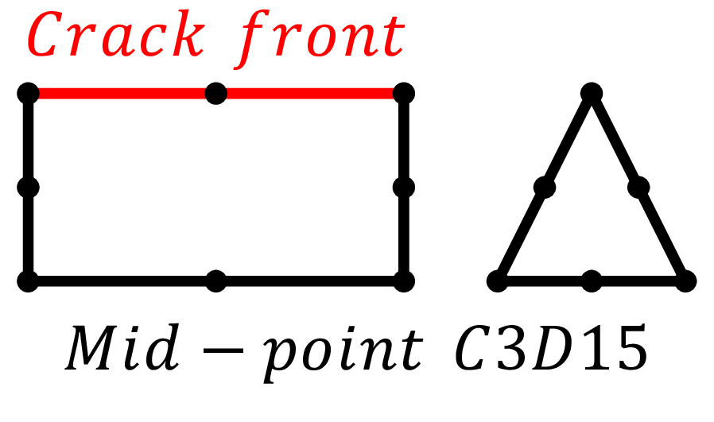{width="2.3140069991251093in" height="0.984251968503937in"} | 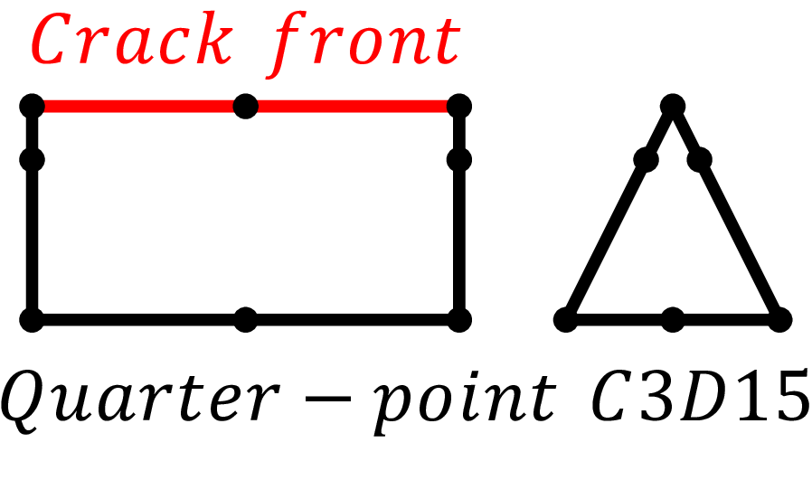{width="2.301142825896763in" height="0.984251968503937in"} |
+:===========================================================================================================================:+:==========================================================================================================================:+
| **(a)**                                                                                                                     | **(b)**                                                                                                                    |
+-----------------------------------------------------------------------------------------------------------------------------+----------------------------------------------------------------------------------------------------------------------------+
| []{#_Ref189575970 .anchor}Figure 6: Standard mid-point (a) and quarter-point (b) C3D15 elements. The red line represents the crack front. Left side of (a) and (b) shows a side view of the elements, while the right side shows the front view.         |
+----------------------------------------------------------------------------------------------------------------------------------------------------------------------------------------------------------------------------------------------------------+

The J-integral can be calculated in Abaqus, by defining the integration path along the various contours of the spider web pattern shown in [Figure 4](#_Ref188967600). Since the J-integral is invariant in perfectly elastic media, the validity of the mesh is evaluated by observing that all the path integrals converge to the same value. The solutions generated by the FE model are compared to the ones presented by Shin and Cai \[29\] to validate the model, as their method appears to be the best 3-parameter (crack shape ratio, crack depth ratio and relative crack front position) option according to \[26\]. Furthermore, Aursand and Skallerud \[30\] have recently introduced a three-parameter solution that applies to a broad range of crack-shape ratios, so they have been considered as well. To ensure a consistent comparison, the analysis was limited to the ranges specified in [Table 1](#_Ref190156125).

[]{#_Ref190156125 .anchor}Table 1: Parameters to define the FE model for the validation.

  ----------------------------------------------------------------------------
  Parameter                       Symbol       Range
  ------------------------------- ------------ -------------------------------
  Crack-shape ratio               $$a/b$$      $$\lbrack 0,\ 1\rbrack$$

  Relative crack depth            $$a/D$$      $$\lbrack 0.05,\ 0.6\rbrack$$

  Relative crack front position   $$\gamma$$   $$\lbrack 0,\ 1\rbrack$$
  ----------------------------------------------------------------------------

[Figure 7](#_Ref190164599) illustrates the various measures influencing crack shape and depth, facilitating a better understanding of the parameters highlighted in [Table 1](#_Ref190156125).

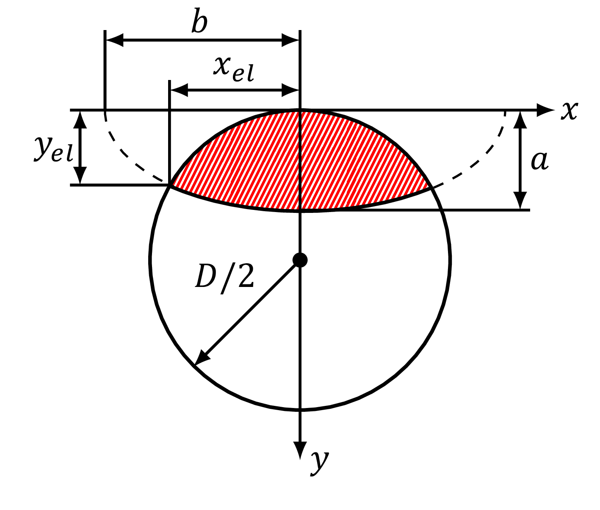{width="2.6852077865266843in" height="2.283464566929134in"}

[]{#_Ref190164599 .anchor}Figure 7: Parametric description of a round bar with an elliptical crack.

Regarding the relative position at the crack front, it is a normalised parameter that ranges between the two ends of the half crack front. A value of 1 refers to the point of the crack on the surface of the bar, while a value of 0 indicates the deepest point of the crack.

  ----------------------------------------------------------------------------
  $$\gamma = x/x_{el}$$                                                \(7\)
  -------------------------------------------------------------------- -------

  ----------------------------------------------------------------------------

[Figure 8](#_Ref190164910) illustrates the appearance of cracks for different crack-shape ratios for existing SIF solutions.

  ---------------------------------------------------------------------------------------------------------
  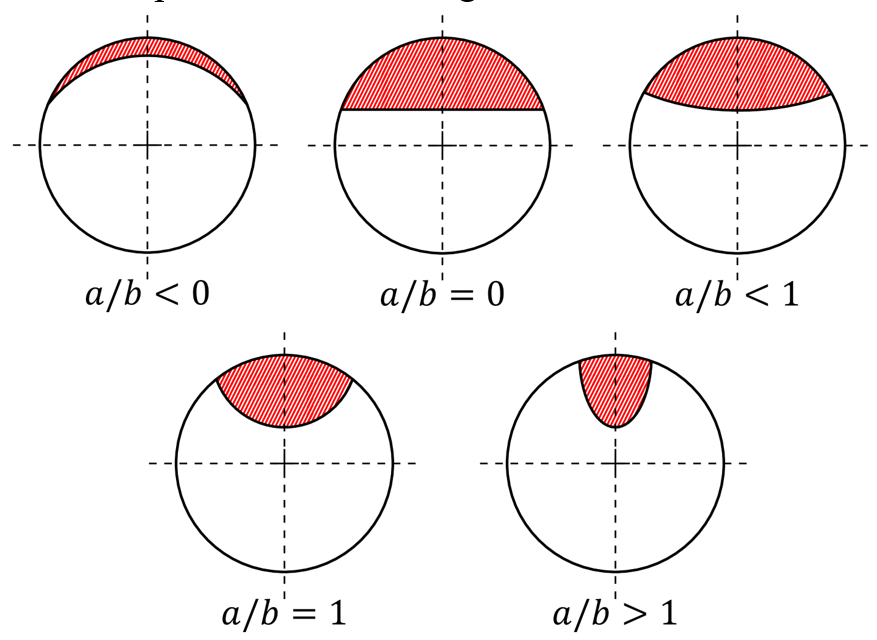{width="3.785627734033246in" height="2.6964523184601923in"}
  ---------------------------------------------------------------------------------------------------------
  []{#_Ref190164910 .anchor}Figure 8: Available SIF solutions in the literature. Adapted from \[25, 29\].

  ---------------------------------------------------------------------------------------------------------

## 4.1. Sensitivity analysis.

In the previous chapter, the importance of the wedge elements along the crack front has been mentioned. Due to its role in the calculation of the J-integral, a sensitivity analysis of the spider web mesh has been accomplished to obtain results as accurate as possible. Specifically, the case study analysing a crack depth of 1 mm and a crack shape ratio of 5 has been conducted. The spider web can be defined using the parameters shown in [Figure 9](#_Ref192347018).

![[]{#_Ref192347018 .anchor}Figure 9: Parametric description of the spider web.](../images/2025-04-30_surewave_d5.5_fatigue_crack_propagation_algorithms/image14.png){width="1.605313867016623in" height="2.84375in"}

In addition to examining the spider web\'s size through the three case studies shown in [Figure 10](#_Ref192347408), the number of elements along the crack front (see [Figure 4](#_Ref188967600)) has also been taken into account. More exactly, a crack front partitioned in 200, 225 and 250 pieces has been simulated.

+------------------------------------------------------------------------------------------------------------------------------------------------------+-------------------------------------------------------------------------------------------------------------------------------------------------------+-------------------------------------------------------------------------------------------------------------------------------------------------------+
| 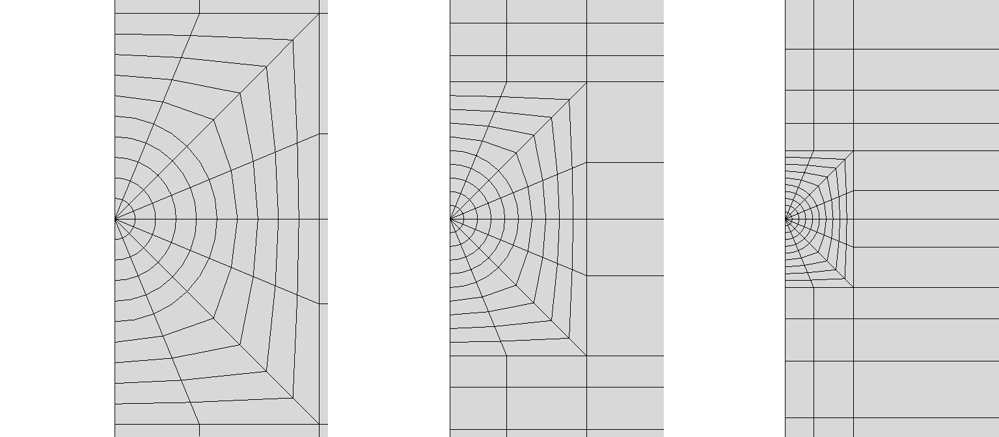{width="1.3204341644794402in" height="2.604861111111111in"} | {width="1.3731353893263343in" height="2.6022003499562554in"} | {width="1.3580533683289588in" height="2.6020833333333333in"} |
+:====================================================================================================================================================:+:=====================================================================================================================================================:+:=====================================================================================================================================================:+
| s = 0.1 mm                                                                                                                                           | s = 0.075 mm                                                                                                                                          | s = 0.05 mm                                                                                                                                           |
+------------------------------------------------------------------------------------------------------------------------------------------------------+-------------------------------------------------------------------------------------------------------------------------------------------------------+-------------------------------------------------------------------------------------------------------------------------------------------------------+
| **(a)**                                                                                                                                              | **(b)**                                                                                                                                               | **(c)**                                                                                                                                               |
+------------------------------------------------------------------------------------------------------------------------------------------------------+-------------------------------------------------------------------------------------------------------------------------------------------------------+-------------------------------------------------------------------------------------------------------------------------------------------------------+
| []{#_Ref192347408 .anchor}Figure 10: Configurations of different spider web sizes.                                                                                                                                                                                                                                                                                                                                                                                   |
+----------------------------------------------------------------------------------------------------------------------------------------------------------------------------------------------------------------------------------------------------------------------------------------------------------------------------------------------------------------------------------------------------------------------------------------------------------------------+

In addition to the size of the spider web, the influence of the mesh pattern has also been evaluated, using the configurations shown in [Figure 11](#_Ref192347950). Each layer represents a contour for calculating the J-integral. Given that the J-integral needs to be contour-invariant, the results should remain consistent if the model is precise enough.

+------------------------------------------------------------------------------------------------------------------------------------------------------+-----------------------------------------------------------------------------------------------------------------------------------------------------+-------------------------------------------------------------------------------------------------------------------------------------------------------+
| 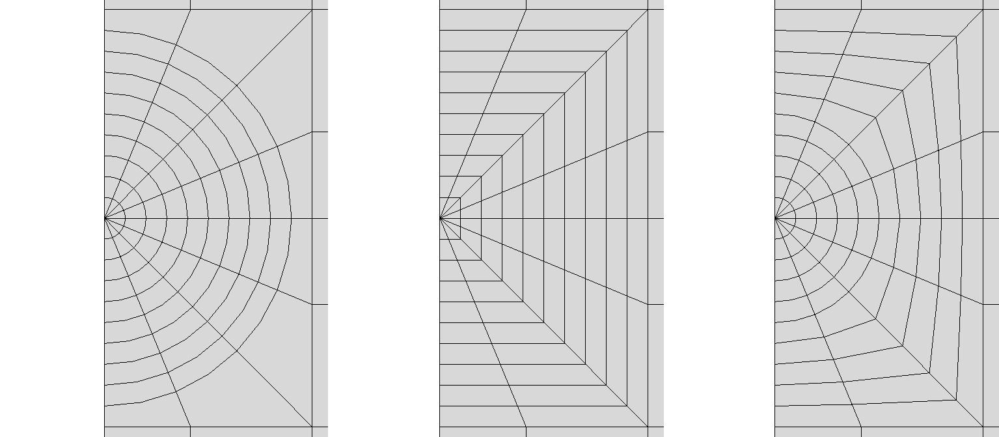{width="1.335291994750656in" height="2.6415430883639544in"} | {width="1.342049431321085in" height="2.639909230096238in"} | {width="1.3351465441819772in" height="2.6400962379702535in"} |
+:====================================================================================================================================================:+:===================================================================================================================================================:+:=====================================================================================================================================================:+
| **(a)**                                                                                                                                              | **(b)**                                                                                                                                             | **(c)**                                                                                                                                               |
+------------------------------------------------------------------------------------------------------------------------------------------------------+-----------------------------------------------------------------------------------------------------------------------------------------------------+-------------------------------------------------------------------------------------------------------------------------------------------------------+
| []{#_Ref192347950 .anchor}Figure 11: Configurations of different spider web patterns.                                                                                                                                                                                                                                                                                                                                                                              |
+--------------------------------------------------------------------------------------------------------------------------------------------------------------------------------------------------------------------------------------------------------------------------------------------------------------------------------------------------------------------------------------------------------------------------------------------------------------------+

Finally, similar to the previous case, an analysis was conducted on the number of contours used to derive the mean value of the J-integral ([Figure 12](#_Ref192348064)).

+-------------------------------------------------------------------------------------------------------------------------------------------------------------------+------------------------------------------------------------------------------------------------------------------------------------------------------+-------------------------------------------------------------------------------------------------------------------------------------------------------------------+
| 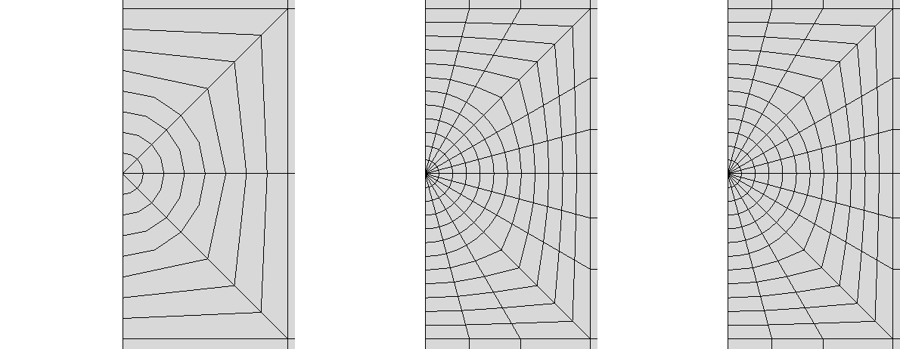{width="1.320346675415573in" height="2.604861111111111in"} | {width="1.3204341644794402in" height="2.604861111111111in"} | {width="1.323558617672791in" height="2.598957786526684in"} |
+:=================================================================================================================================================================:+:====================================================================================================================================================:+:=================================================================================================================================================================:+
| **(a)**                                                                                                                                                           | **(b)**                                                                                                                                              | **(c)**                                                                                                                                                           |
+-------------------------------------------------------------------------------------------------------------------------------------------------------------------+------------------------------------------------------------------------------------------------------------------------------------------------------+-------------------------------------------------------------------------------------------------------------------------------------------------------------------+
| []{#_Ref192348064 .anchor}Figure 12: Configurations of different levels of spider web refinement.                                                                                                                                                                                                                                                                                                                                                                                            |
+----------------------------------------------------------------------------------------------------------------------------------------------------------------------------------------------------------------------------------------------------------------------------------------------------------------------------------------------------------------------------------------------------------------------------------------------------------------------------------------------+

The results of the analysis are illustrated in [Figure 13](#_Ref192348862), which reveals minimal differences overall. The most significant variation is evident in the spider web size study. The absence of differences in the other cases may be attributed to the spider web size, which was fixed at the smallest size ($s = 0.05\$mm) after the initial analysis.

  ----------------------------------------------------------------------------------
   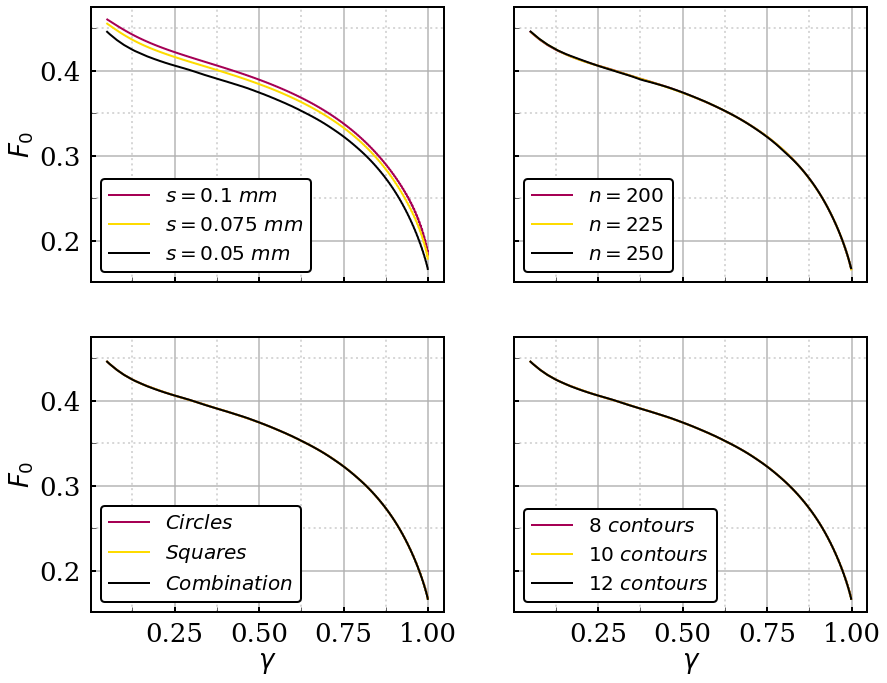{width="6.002915573053368in" height="4.622615923009624in"}
  ----------------------------------------------------------------------------------
    []{#_Ref192348862 .anchor}Figure 13: Results of all the sensitivity analyses.

  ----------------------------------------------------------------------------------

One notable aspect is the noise observed when approaching the elbow of the ellipse at the deepest point of the crack. In smaller crack-shape ratios, this phenomenon is less pronounced, which is why previous publications do not address it. As shown in the first row of [Figure 14](#_Ref192349229), a stairway-pattern is present in the solution for elements nearing the deepest part of the model. Increasing the number of elements reduces this noise, meaning that mesh density does impact the final result. The remaining two factors appear to have little effect on the results, once the spider web size was defined.

Keeping the number of elements, $n$, as low as possible without compromising the quality of the results is essential to ensure appropriate calculation time with an accurate enough representation of the crack\'s geometry. Since adequate element quality (in the form of geometrical aspect ratio) is necessary for the analysis, increasing the number of elements requires an overall refining of the mesh. Elements with poor quality are rejected by the Abaqus preprocessor. For the FE model used in the project, a spider web size of 0.05 mm has been established. The minimum number of elements along the crack front has been used for the simulation, 200, resulting in a hybrid spider web design composed of circles and squares, as shown in [Figure 4](#_Ref188967600). The model uses eight contours.

+---------------------------------------------------------------------------------------+
| 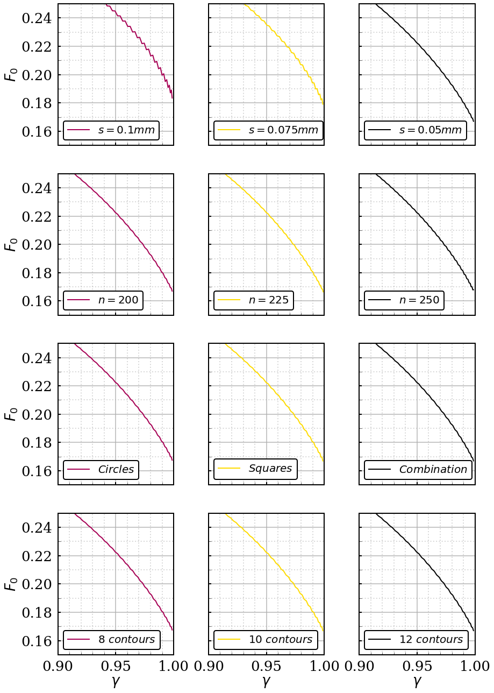{width="4.37288167104112in" height="6.1288834208223975in"}      |
|                                                                                       |
| []{#_Ref192349229 .anchor}Figure 14: Zoom on the results of the sensitivity analyses. |
+=======================================================================================+

## 4.2. Validation of the FE model.

As noted in Section 2, the J-integral is expected to be invariant when considered as a crack parameter. Consequently, values for J-integral at each position of the crack front should be consistent along every contour. Eight different contours surrounding the spider web were analysed, and this consistency was generally observed at almost every point. The discrepant points were located at the deepest point of the crack (due to boundary conditions) and the locations closest to the bar surface. As indicated by Benthem \[37, 38\], this discrepancy may occur because the conventional definition of the SIF may not be applicable within a near-surface boundary layer due to the appearance of additional stress singularities. Due to this, only the remaining nodes are utilised for fitting. Specifically, the deepest 1% of nodes at the crack front and the 5% of nodes closest to the surface are disregarded, similar to other researchers.

Once the property of invariance of the contour integrals is verified and the results are filtered, the model\'s accuracy is assessed. As shown in [Figure 15](#_Ref191378395), the SIFs generated by Shin and Cai \[29\] and Aursand and Skallerud \[30\] are quite similar to those obtained with the FE model presented in this work. The results have not been fitted to a polynomial equation because the existing solutions are already as accurate as the new results. Additionally, Aursand and Skallerud \[30\] took into account the curvature of the round bar, which makes their solution more comprehensive and flexible.

+---------------------------------------------------------------------------------------------------------------------------------------------------------+
| 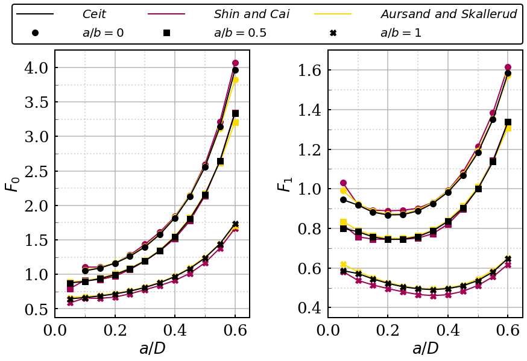{width="5.392122703412073in" height="3.6956517935258093in"}                                                                       |
+:==========================================================================:+:==========================================================================:+
| **(a)**                                                                    | **(b)**                                                                    |
+----------------------------------------------------------------------------+----------------------------------------------------------------------------+
| []{#_Ref191378395 .anchor}Figure 15: Comparison of Geometric Correction Factors (F) for tension (a) and bending (b) loading cases for $\gamma = 0$.     |
+---------------------------------------------------------------------------------------------------------------------------------------------------------+

The results plotted in [Figure 15](#_Ref191378395) correspond to the deepest point of the crack for tension and pure bending loading cases, but the similarity remains consistent along the whole crack front. This indicates that the implemented finite element model is valid for this type of analysis.

## 4.3. Generation of the new SIF solutions.

Until now, SIFs included in bibliography had crack-shape ratios $a/b \leq 2$. However, \"narrow\" elliptical-shaped cracks, characterised by a high depth-to-surface length aspect ratio ([Figure 16](#_Ref188961670)) have not yet been studied. To mitigate the significant economic and environmental risks associated with a potential catastrophic failure of the FPV panels farm, it has been decided to expand the variety of SIF solutions in round bars to address a wider range of scenarios.

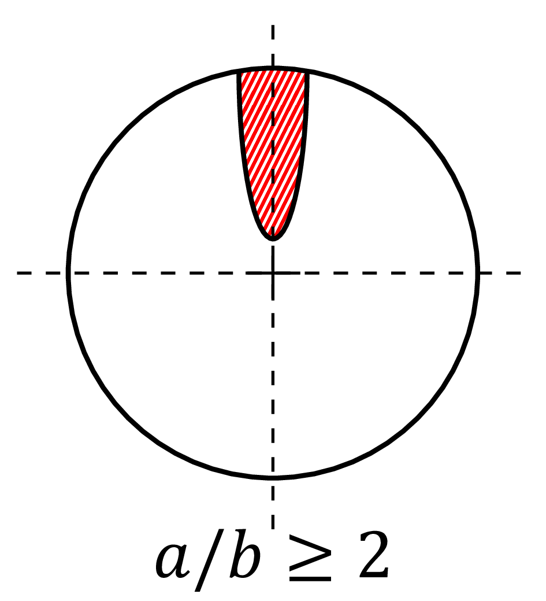{width="2.0173687664041995in" height="2.217949475065617in"}

[]{#_Ref188961670 .anchor}Figure 16: Crack geometry of new SIF solutions.

New crack-shape ratios have been considered, while the relative crack depth and position at the crack front remain similar to those in [Table 1](#_Ref190156125). The new ranges of these parameters are shown in [Table 2](#_Ref190167862).

[]{#_Ref190167862 .anchor}Table 2: Parameters to define the FE model for the generation of new SIF solutions.

  ----------------------------------------------------------------------------
  Parameter                       Symbol       Range
  ------------------------------- ------------ -------------------------------
  Crack-shape ratio               $$a/b$$      $$\lbrack 2,\ 5\rbrack$$

  Relative crack depth            $$a/D$$      $$\lbrack 0.06,\ 0.5\rbrack$$

  Relative crack front position   $$\gamma$$   $$\lbrack 0,\ 1\rbrack$$
  ----------------------------------------------------------------------------

However, the definition of the relative crack front position has changed [(8)](#_Ref190167942). Due to the shape of the ellipse, using the X axis can result in significant changes to the geometric correction factor for small increments of γ. Therefore, the Y axis is used for situations where $a/b \geq 2$.

  ----------------------------------------------------------------------------------------------------
  $$\gamma = \left( \frac{y - y_{el}}{a - y_{el}} \right)$$            []{#_Ref190167942 .anchor}(8)
  -------------------------------------------------------------------- -------------------------------

  ----------------------------------------------------------------------------------------------------

After validating the finite element model, new stress intensity factor solutions were generated. Specifically, 598 simulations were run to simulate crack shape ratios between 2 and 5, and crack depth ratios between 0.06 and 0.5, see [Figure 17](#_Ref191379610). Analysing [Figure 17](#_Ref191379610) reveals some noteworthy trends. First and foremost, higher values of geometric correction factors are observed for surface points compared to the deepest point of the crack. This indicates that cracks are more likely to propagate near the surface rather than deepen, ultimately tending to form a circular crack after several cycles. This observation aligns well with the principles of fracture mechanics, providing additional validation of the results. Furthermore, it is evident that the crack shape ratio and the geometric correction factor are sort of inversely proportional in both tension and pure bending loading cases. Finally, as expected, it should be noted that uniform tension loading appears to be more damaging than pure bending loading.

+---------------------------------------------------------------------------------------------------------------------------------------------------------+
| 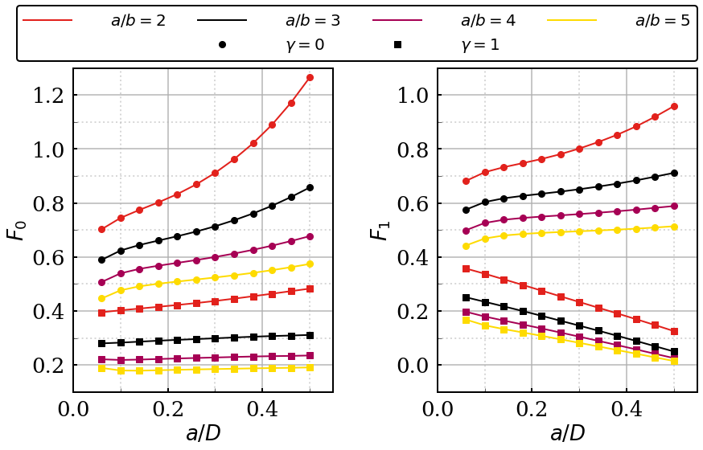{width="5.5292705599300085in" height="3.5430424321959757in"}                                                                      |
+:==========================================================================:+===========================================================================:+
| **(a)**                                                                    | **(b)**                                                                    |
+----------------------------------------------------------------------------+----------------------------------------------------------------------------+
| []{#_Ref191379610 .anchor}Figure 17: Generation of Geometric Correction Factors (F) for tension (a) and bending (b) loading cases for $a/b \geq 2$.     |
+---------------------------------------------------------------------------------------------------------------------------------------------------------+

To account for the problem\'s variability across the wide range of the three parameters, these results have been fitted to a 9th-order polynomial equation [(9](#_Ref191381121)).

  ---------------------------------------------------------------------------------------------------------------------------------------------------
  $$F = \sum_{i = 0}^{9}{\sum_{j = 0}^{9 - i}{\sum_{k = 0}^{9 - i - j}{C_{ijk}{(a/b)}^{i}{(a/D)}^{j}\gamma^{k}}}}$$   []{#_Ref191381121 .anchor}(9)
  ------------------------------------------------------------------------------------------------------------------- -------------------------------

  ---------------------------------------------------------------------------------------------------------------------------------------------------

The fitting has been applied to the crack front points specified above, resulting in the minimal fitting error shown in [Figure 18](#_Ref190268065). The coefficients needed for the summation of the fitted geometric correction factor have been uploaded to \[39\].

+-----------------------------------------------------------------------------------------------------------+
| 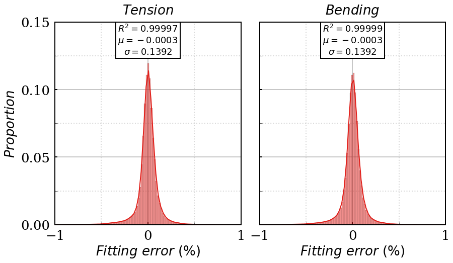{width="4.615498687664042in" height="2.681948818897638in"}                          |
+:===================================================:+====================================================:+
| **(a)**                                             | **(b)**                                             |
+-----------------------------------------------------+-----------------------------------------------------+
| []{#_Ref190268065 .anchor}Figure 18: Fitting error for the tension (a) and bending (b) loading cases.     |
+-----------------------------------------------------------------------------------------------------------+

#  5. Implementation. Example case.

Applicability of this crack growth modelling methodology is explained in this section, by describing an example case. The final objective of this study is to evaluate the fatigue life of the reinforcement rebars. In deliverable D5.3 \[40\], the structural integrity assessment of the breakwater was conducted through global FE simulations and local submodels for detailed stress and strain distributions. The global model for the breakwater used in that analysis is shown in [Figure 19](#_Ref192574669).

![[]{#_Ref192574669 .anchor}Figure 19: FE model of the breakwater.](../images/2025-04-30_surewave_d5.5_fatigue_crack_propagation_algorithms/image24.png){alt="Dibujo de ingeniería, Gráfico de superficie Descripción generada automáticamente" width="5.204453193350831in" height="3.356522309711286in"}

After obtaining the system displacements, these were used as boundary conditions for two submodels in the most critical areas ([Figure 20](#_Ref192574820)). These submodels allowed for the replacement of 1D elements, which were used in the global model as reinforcement, with 3D reinforcement rebars. Consequently, a detailed description of the stress fields could be obtained.

+---------------------------------------------------------------------------------------------------------------------------------------------+----------------------------------------------------------------------------------------------------------------------------------------+
| {width="3.271083770778653in" height="2.2869564741907262in"} | {width="2.8782600612423446in" height="2.1344225721784778in"} |
+:===========================================================================================================================================:+:======================================================================================================================================:+
| **(a)**                                                                                                                                     | **(b)**                                                                                                                                |
+---------------------------------------------------------------------------------------------------------------------------------------------+----------------------------------------------------------------------------------------------------------------------------------------+
| []{#_Ref192574820 .anchor}Figure 20: Submodels for refined stress fields for the whole system (a) and for the reinforcement (b).                                                                                                                                                     |
+--------------------------------------------------------------------------------------------------------------------------------------------------------------------------------------------------------------------------------------------------------------------------------------+

For example, when examining a section of the most demanded rebars, the results shown in [Figure 21](#_Ref192576327) can be noted. This figure displays two stress distributions corresponding to the maximum (b) and minimum (c) values observed during a load cycle in the North Sea. This particular cycle was used to illustrate the example of crack growth.

+--------------------------------------------------------------------------------------------------------------------------------------------+
| 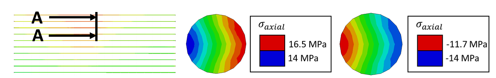{width="6.285416666666666in" height="1.032334864391951in"}                                                           |
+:============================================:+:============================================:+:============================================:+
| **(a)**                                      | **(b)**                                      | **(c)**                                      |
+----------------------------------------------+----------------------------------------------+----------------------------------------------+
| []{#_Ref192576327 .anchor}Figure 21: Reinforcement rebar illustration (a), and maximum (b) and minimum (c) stress distributions.           |
+--------------------------------------------------------------------------------------------------------------------------------------------+

The stress fields have been decomposed in two elementary stress distributions, as shown in [Figure 22](#_Ref192576742):

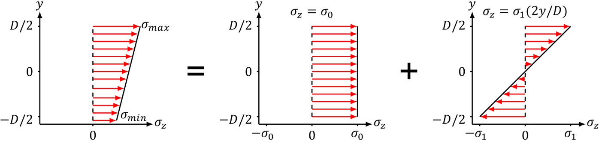{width="6.285597112860892in" height="1.5115485564304463in"}

[]{#_Ref192576742 .anchor}Figure 22: Stress decomposition in elementary stress distributions.

In this section, the propagation of an elliptical-shaped crack with a crack shape ratio of 5 and a crack depth ratio of 0.2 (a depth of 2 mm for a bar with a diameter of 10 mm) is calculated for the previously mentioned load cycle. First, the stress distributions need to be decomposed. Following the nomenclature depicted in [Figure 22](#_Ref192576742), [Table 3](#_Ref192578549) has been constructed.

  ----------------------------------------------------------------------------------------
                  $$\sigma_{\max}$$   $$\sigma_{\min}$$   $$\sigma_{0}$$   $$\sigma_{1}$$
  -------------- ------------------- ------------------- ---------------- ----------------
  Peak                16.5 MPa             14 MPa           15.25 MPa         1.25 MPa

  Valley              -11.7 MPa            -14 MPa          -12.85 MPa        1.15 MPa
  ----------------------------------------------------------------------------------------

  : []{#_Ref192578549 .anchor}Table 3: Decomposition of peak and valley stresses in elementary stress distributions. $\sigma_{max\ }$ and $\sigma_{min\ }$ correspond to results described in deliverable D5.3. Representative values $\sigma_{0}$ and $\sigma_{1\ }$ are calculated to guarantee that $\sigma_{max\ } = \sigma_{0} + \sigma_{1}$ and $\sigma_{\min} = \sigma_{0} - \sigma_{1}$, using expressions $\sigma_{0} = (\sigma_{\max} + \sigma_{\min})/2$ and $\sigma_{1} = (\sigma_{\max} - \sigma_{\min})/2$.

Once the problem is clearly defined, Paris' law [(5)](#_Ref192149807) can be applied to calculate the increase in the crack size. In this case, a single load cycle is being considered, so the law is modified to obtain [(10)](#_Ref192579203):

  -----------------------------------------------------------------------------------------------------
  $$\Delta a = C\Delta K_{I}^{m}$$                                     []{#_Ref192579203 .anchor}(10)
  -------------------------------------------------------------------- --------------------------------

  -----------------------------------------------------------------------------------------------------

The stress intensity factor amplitude represents the gap between the stress intensity factor at the peak and the valley during the load cycle (11).

  -----------------------------------------------------------------------------
  $${\Delta K}_{I} = K_{Imax} - K_{Imin}$$                             \(11\)
  -------------------------------------------------------------------- --------

  -----------------------------------------------------------------------------

However, since the stress distribution in the valley of the load cycle exhibits a compressive behaviour, the stress can be transmitted through the crack face, resulting in a non-existent stress intensity factor. Consequently, the amplitude of the stress intensity factor is equal to the value of the stress intensity factor at the peak of the load cycle. Considering this, equation [(12)](#_Ref192579536) is derived from equation [(10)](#_Ref192579203).

  -----------------------------------------------------------------------------------------------------
  $$\Delta a = CK_{Imax}^{m}$$                                         []{#_Ref192579536 .anchor}(12)
  -------------------------------------------------------------------- --------------------------------

  -----------------------------------------------------------------------------------------------------

By substituting equation [(4)](#_Ref188949560) into equation [(12)(12)](#_Ref192579536), equation [(13)](#_Ref192579739) is obtained:

  -----------------------------------------------------------------------------------------------------
  $$\Delta a = C\left( F\sigma\sqrt{\pi a} \right)^{m}$$               []{#_Ref192579739 .anchor}(13)
  -------------------------------------------------------------------- --------------------------------

  -----------------------------------------------------------------------------------------------------

Since the rebar operates in the linear elastic regime, the geometric correction factors can be superimposed. Taking this into account, equation [(14)](#_Ref192579960) is obtained.

  -----------------------------------------------------------------------------------------------------------------------------------
  $$\Delta a = C\left\lbrack {(F}_{0}\sigma_{0} + F_{1}\sigma_{1})\sqrt{\pi a} \right\rbrack^{m}$$   []{#_Ref192579960 .anchor}(14)
  -------------------------------------------------------------------------------------------------- --------------------------------

  -----------------------------------------------------------------------------------------------------------------------------------

$F_{0}$ and $F_{1}$ are geometric correction factors for tension and bending loading cases, respectively. These are characterised separately in the FE simulations, and they are calculated from the polynomial expression in equation [(9)](#_Ref191381121), using the input parameters in Table 4. Two distinct points along the crack have been analysed to determine the new crack front after the load cycle. To do so, the increment of the crack depth has been computed twice for different relative crack front positions.

  -----------------------------------------------------------------------------------------------------------------------------------
       Crack-shape ratio ($\alpha$)   Crack depth ratio ($\beta$)   Relative crack front position ($\gamma$)   $$F_{0}$$   $$F_{1}$$
  --- ------------------------------ ----------------------------- ------------------------------------------ ----------- -----------
  A                 5                             0.2                                  0                        0.5051      0.4874

  B                 5                             0.2                                  1                        0.1814      0.1144
  -----------------------------------------------------------------------------------------------------------------------------------

  : []{#_Toc196901597 .anchor}Table 4: Geometric correction factors for points A and B for tension and bending loading cases.

To calculate the crack depth increment [(14)](#_Ref192579960), some information is still needed. These are the constants of Paris' law. Standard values C = 1e-8 and m = 2.71 were used, relatively fast growth rate parameters for a structural steel grade \[41\].

+---+-----------+-----------+----------------+----------------+--------------+
|   | $$F_{0}$$ | $$F_{1}$$ | $$\sigma_{0}$$ | $$\sigma_{1}$$ | $$\Delta a$$ |
+===+:=========:+:=========:+:==============:+:==============:+:============:+
| A | 0.5051    | 0.4874    | 15.25 MPa      | 1.25 MPa       | 37.5 nm      |
+---+-----------+-----------+                |                +--------------+
| B | 0.1814    | 0.1144    |                |                | 2.18 nm      |
+---+-----------+-----------+----------------+----------------+--------------+

: []{#_Toc196901598 .anchor}Table 5: Depth increments for points A and B.

As expected, due to the higher value of the correction factor for point B, the crack tends to have a more circular shape, which aligns with the principles of linear elastic fracture mechanics. A representation of the crack propagation is shown in [Figure 23](#_Ref192599592), while the crack depth increments are shown in Table 5.

![[]{#_Ref192599592 .anchor}Figure 23: Crack growth for a fatigue cycle. Growth increments have been exaggerated for easier visualisation.](../images/2025-04-30_surewave_d5.5_fatigue_crack_propagation_algorithms/image29.png){alt="Logotipo Descripción generada automáticamente" width="6.3in" height="3.1659722222222224in"}

# Conclusions

This work details the crack propagation algorithms implemented for the evaluation of fatigue life of the breakwater system developed during the SUREWAVE project. First, this document provides a review of crack propagation algorithms, explaining the fundamentals of linear elastic fracture mechanics and examining existing solutions to date.

The generation of mode $I$ stress intensity factor solutions for narrow elliptical-shaped cracks in round bars has been presented as a new addition to the existing literature well. The study first compares existing solutions with those generated by the FE model developed during the project as a validation case, generating afterwards new solutions for crack-shape ratios between 2 and 5, and crack depth ratios between 0.06 and 0.5. These solutions will be published in a scientific journal.

The FE model has been demonstrated to be sufficiently accurate and capable of producing existing solutions with high precision. A sensitivity analysis was conducted to understand the effect of various parameters and to build an accurate FE model with this knowledge. The validation of the J-integral\'s invariance, along with comparisons to existing SIF solutions and alignment with the principles of elastic linear fracture mechanics, allows for the confident use of this model to generate new SIF solutions. Concerning the polynomial fitting of the results, the accuracy of the fitting and the publication of the coefficients enable other users to reproduce the results generated in this work with ease and precision.

In the final section of the document, the applicability of the methodology described in previous section is shown through a case study. The example case selected was the incremental growth of a relatively large, narrow crack on the surface of a steel rebar embedded in a breakwater located at the North Sea. An automatic algorithm that follows this methodology has been implemented in the Structural Health Management System application, the description of which is to be included in a future deliverable.

#  References

\[1\] T. L. Anderson. *Fracture Mechanics: Fundamentals and Applications (4^th^ edition)*, CRC Press (2017).

\[2\] A. A. Griffth. *The phenomena of rupture and flow in solids*, Philosophical Transactions, Series A, 221 (1920), 163--198.

\[3\] G. R. Irwin. *Onset of fast crack propagation in high strength steel and aluminum alloys*, Sagamore Research Conference Proceedings, 2 (1956), 289--305.

\[4\] G. R. Irwin. *Fracture dynamics, Fracturing of Metals*, American Society for Metals, Cleveland, (1948)

147--166.

\[5\] G. R. Irwin. *Analysis of stresses and strains near the end of a crack traversing a plate*, Journal of Applied Mechanics, 24 (1957), 361--364.

\[6\] H. M. Westergaard. *Bearing pressures and cracks,* Journal of Applied Mechanics, 6 (1939), 49--53.

\[7\] NASGRO. *Fracture mechanics and fatigue crack growth analysis software*. (Version 6.0.) A reference manual by NASA Johnson Space Center and Southwest Research Institute, Texas, USA (2010).

\[8\] Y. Kim, J. Kwon, H. Lee, W. Jang, J. Choi, and S. Kim. *Effect of Microstructure on Fatigue Crack Propagation and S--N Fatigue Behaviors of TMCP Steels with Yield Strengths of Approximately 450 MPa*, Computational Mechanics, 42 (2011), 986--999.

\[9\] A. Papangelo, R. Guarino, N. Pugno, and M. Ciavarella. *On unified crack propagation laws,* Engineering Fracture Mechanics, 207 (2019), 269--276.

\[10\] M.H. El Haddad, K.N. Smith, and T.H. Topper. *Fatigue crack propagation of short cracks*, Journal of Engineering Materials and Technology, 101 (1979), 42--46.

\[11\] P. Paris and F. Erdogan. *A Critical Analysis of Crack Propagation Laws*, Journal of Basic Engineering, 85 (1963), 528-533.

\[12\] C. Laird. *The Influence of Metallurgical Structure on the Mechanism of Fatigue Crack Propagation*. *Fatigue Crack Propagation*, ASTM STP 415 (1967) 131.

\[13\] R.M. McMeeking. *Finite deformation analysis of crack-tip opening in elastic-plastic materials and implications for fracture*, Journal of Mechanics and Physics of Solids, 25 (1977) 357-381.

\[14\] N.E. Frost, L.P. Pook, and K. Denton. *A fracture mechanics analysis of fatigue crack growth data for various materials*, Engineering Fracture Mechanics, 3 (1971) 109-126.

\[15\] K.N. Raju. *An energy balance criterion for crack growth under fatigue loading from considerations of energy of plastic deformation*, International Journal of Fracture Mechanics, 8 (1972) 1-14.

\[16\] R.G. Forman, V.E. Kearney, and R.M. Engle. *Numerical Analysis of Crack Propagation in Cyclic-Loaded Structures, Journal of Basic Engineering*, Trans. ASME Series D, 89 (1967) 459-464.

\[17\] J. Lankford and D.L. Davidson. *Fatigue crack micromechanisms in ingot and powder metallurgy 7XXX aluminum alloys in air and vacuum*, Acta Metallurgica, 31 (1983) 1273--1284.

\[18\] D.P. Rooke, F.I. Baratta, and D.J. Cartwright. *Simple methods of determining stress intensity factors,* Engineering Fracture Mechanics, 14(2) (1981) 397-426.

\[19\] D.M. Parks. *The Virtual Crack Extension Method for Nonlinear Material Behavior*, Computer Methods in Applied Mechanics and Engineering, 12 (1977) 353-364.

\[20\] C.F. Shih, B. Moran, and T. Nakamura. *Energy release rate along a three-dimensional crack front in a thermally stressed body*, International Journal of Fracture, 30 (1986) 79-102.

\[21\] D.M. Parks. *A stiffness derivative finite element technique for determination of crack tip stress intensity factors*, International Journal of Fracture, 10 (1974) 487-502.

\[22\] I.S. Raju and J.C. Newman. *Stress-Intensity Factors for Internal and External Surface Cracks in Cylindrical Vessels*, Journal of Pressure Vessel Technology, 104 (1982), 293-298.

\[23\] A. Carpinteri. *Stress intensity factors for straight-fronted edge cracks in round bars*, Engineering Fracture Mechanics, 42 (1992), 1035-1040.

\[24\] A. Carpinteri. *Elliptical-arc surface cracks in round bars,* Fatigue and Fracture of Engineering Materials and Structures, 15 (1992), 1141--1153.

\[25\] A. Carpinteri, R. Brighenti, S. Vantadori, and D. Viappiani. *Sickle-shaped crack in a round bar under complex Mode I loading*, Fatigue and Fracture of Engineering Materials and Structures, 30 (2007), 524--534.

\[26\] J. Toribio, N. Álvarez, B. González, and J.C. Matos. *A critical review of stress intensity factor solutions for surface cracks in round bars subjected to tension loading*, Engineering Failure Analysis, 16 (2009) 794-809.

\[27\] A. Valiente. *Criterios de fractura para alambres,* PhD thesis (1980), Universidad Politécnica de Madrid, Spain.

\[28\] M.A. Astiz. *An incompatible singular elastic element for two- and three-dimensional crack problems*, International Journal of Fracture, 31 (1986), 105--124.

\[29\] C.S. Shin and C.Q. Cai. *Experimental and finite element analyses on stress intensity factors of an elliptical surface crack in a circular shaft under tension and bending*, International Journal of Fracture, 129 (2004), 239-264.

\[30\] M. Aursand and B.H. Skallerud. *Mode I stress intensity factors for semi-elliptical fatigue cracks in curved round bars*, Theoretical and Applied Fracture Mechanics, 112 (2021), 102904.

\[31\] X. Wang and G. Glinka. *Determination of approximate point load weight functions for embedded elliptical cracks*, International Journal of Fatigue, 31 (2009), 1816--1827.

\[32\] R. Ghajar and H.S. Googarchin. *General point load weight function for semi-elliptical crack in finite thickness plates*, Engineering Fracture Mechanics, 109 (2013), 33--44.

\[33\] Y. Takaki and K. Gotoh. *Approximate weight functions of stress intensity factor for a wide range shapes of surface and an embedded elliptical crack*, Marine Structures, 70 (2020), 102696.

\[34\] K. Yuan, Y. Jiang, J. Liu, and M. Hong. *2D weight functions of stress intensity factors for high aspect ratio semi-elliptical surface cracks in finite thickness plate*, Theoretical and Applied Fracture Mechanics, 110 (2020), 102808.

\[35\] K. Yuan and J. Liu. *Two-dimensional weight function for the determination of stress intensity factors for semi-elliptical surface cracks in finite-thickness and finite-width plates*, Theoretical and Applied Fracture Mechanics, 121 (2022), 103495.

\[36\] Y.S. Shih and J.J. Chen. *Analysis of fatigue crack growth on a cracked shaft*. International Journal of Fracture, 19 (1997), 477--485.

\[37\] J.P. Benthem. *State of stress at the vertex of a quarter-infinite crack in a half-space*, International Journal of Solids and Structures, 13 (1977), 479-492.

\[38\] J.P. Benthem. *The quarter-infinite crack in a half space; Alternative and additional solutions*, International Journal of Solids and Structures, 16 (1980), 119-130.

\[39\] U. Eibar. Data for: *Generation of Mode I Stress Intensity Factor Solutions for Narrow Elliptical-Shaped Cracks in Round Bars: a Finite Element Approach*, Mendeley Data, V1 (2025), [[https://dx.doi.org/10.17632/sdxwvmrk3t.1]{.underline}](https://dx.doi.org/10.17632/sdxwvmrk3t.1)

\[40\] SUREWAVE Report D5.3: Report on structural integrity assessment.

\[41\] S. Seitl, P. Pokorný, P. Miarka, J. Klusák, Z. Kala, and L. Kunz. *Comparison of fatigue crack propagation behaviour in two steel grades S235, S355 and a steel from old crane way*, MATEC Web of Conferences, 310 (2020) 00034.

[^1]: Creation. modification. final version for evaluation. revised version following evaluation. final
