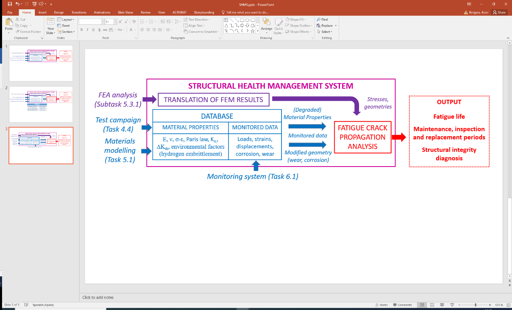
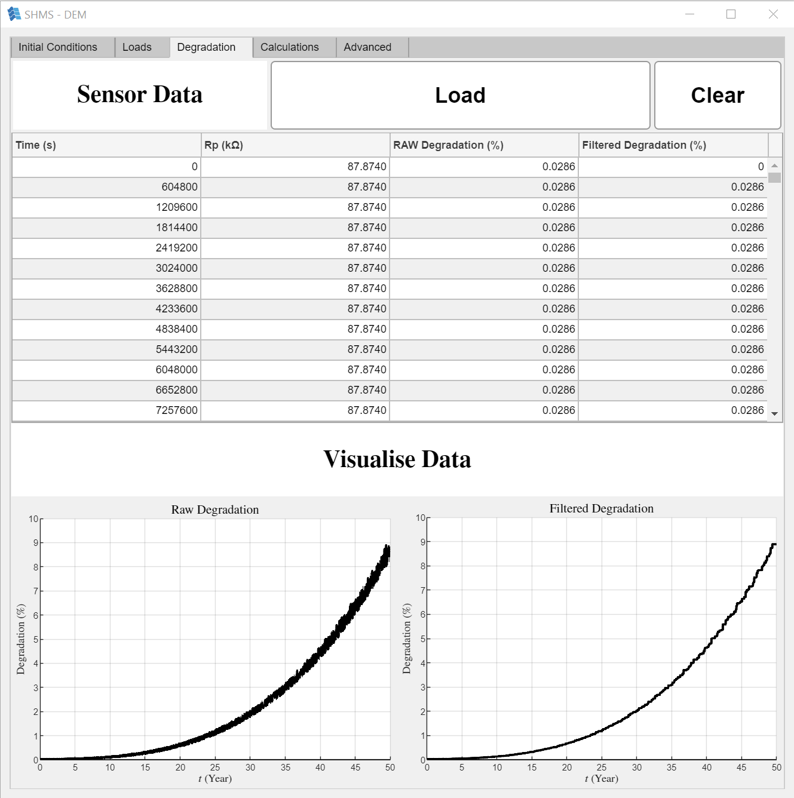
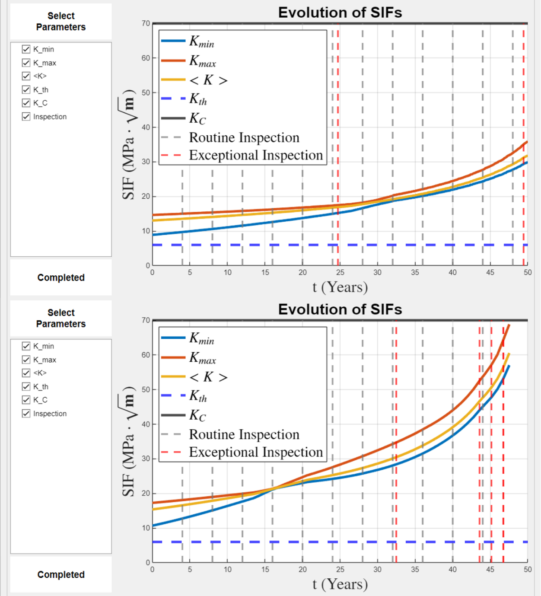
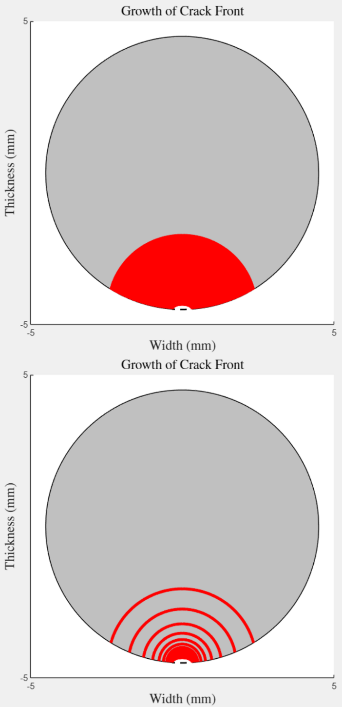

> Source: `SUREWAVE_D5.6-SHMS_DEMO_R1.docx` — Document date: 2025-06-13 — Converted: 2026-09-28 via pandoc/pdftotext

---

##### 

Deliverable number: D5.6

+------------------------------------------------------------------------------------------------------------------------------------------------------+
| ##### {width="7.8701301399825025in" height="2.5902777777777777in"} |
+======================================================================================================================================================+
| ##### SUREWAVE -- Structural Reliable Offshore Floating PV Solution Integrating Circular Concrete Floating Breakwater                                |
+------------------------------------------------------------------------------------------------------------------------------------------------------+

Title: Integrated Structural Health Management System

# **Disclaimer:**  {#disclaimer .TOC-Heading}

 The SUREWAVE project is Funded by the European Union. Views and opinions expressed are however those of the author(s) only and do not necessarily reflect those of the European Union. Neither the European Union nor European Climate, Infrastructure and Environment Executive Agency (CINEA) can be held responsible for them

Deliverable details

  ---------- -------- ------------------------------------------------------
  **WP**     5        

  **Task**   D5.6     
  ---------- -------- ------------------------------------------------------

  ------------------------- ------ -- -------------------------- ----------------------
  **Dissemination level**   SEN       **Due delivery date**      31.05.2025

  **Deliverable type**      DEM       **Actual delivery date**   13.06.2025
  ------------------------- ------ -- -------------------------- ----------------------

  -------------------------------- ---------------------------------------------
  **Lead beneficiary**             **CEIT**

  **Contributing beneficiaries**   
  -------------------------------- ---------------------------------------------

+----------------------+------------+-----------------------+-------------------+
| **Document Version** | **Date**   | **Author**            | **Comments**[^1]  |
+----------------------+------------+-----------------------+-------------------+
| 1.0                  | 08/06/2025 | Aritz Dorronsoro      | Version 1.0       |
|                      |            |                       |                   |
|                      |            | Unai Eibar            |                   |
+----------------------+------------+-----------------------+-------------------+
| 1.1                  | 10/06/2025 | Jon Alkorta Barragan  | Revision-1        |
+----------------------+------------+-----------------------+-------------------+
| 1.2                  | 12/06/2025 | Virgile Delhaye       | Revision-2        |
+----------------------+------------+-----------------------+-------------------+
| 1.3                  | 12/06/2025 | Balram Panjwani       | Revision-3        |
+----------------------+------------+-----------------------+-------------------+
| 2.0                  | 13/06/2025 | Aritz Dorronsoro      | Version 2.0       |
|                      |            |                       |                   |
|                      |            | Unai Eibar            |                   |
+----------------------+------------+-----------------------+-------------------+

+-------------------------------------------------------------------------------------------------------------------------------------------------+
| **Dissemination level**                                                                                                                         |
+=====================================+===========================================================================================================+
| PU                                  | Public- fully open                                                                                        |
+-------------------------------------+-----------------------------------------------------------------------------------------------------------+
| SEN                                 | SEN = Sensitive -- limited under the conditions of the Grant Agreement                                    |
+-------------------------------------+-----------------------------------------------------------------------------------------------------------+
| EU classified                       | EU classified -- restraint -- UE/EU-restricted, confidential, secret-UE/EU secret under Decision 2015/444 |
+-------------------------------------+-----------------------------------------------------------------------------------------------------------+
| **Deliverable type**                                                                                                                            |
+-------------------------------------+-----------------------------------------------------------------------------------------------------------+
| R:                                  | Document, report (excluding the periodic and final reports)                                               |
+-------------------------------------+-----------------------------------------------------------------------------------------------------------+
| DEM:                                | Demonstrator, pilot, prototype, plan designs                                                              |
+-------------------------------------+-----------------------------------------------------------------------------------------------------------+
| DEC:                                | Websites, patents filing, press & media actions, videos, etc.                                             |
+-------------------------------------+-----------------------------------------------------------------------------------------------------------+
| OTHER:                              | Software, technical diagram, etc.                                                                         |
+-------------------------------------+-----------------------------------------------------------------------------------------------------------+

**EXECUTIVE SUMMARY**

The following document constitutes a description for the Structural Health Management System (SHMS) developed within WP5 and, specifically, task 5.4.3. It integrates the results of the numerical analysis conducted in task 5.3 (described in deliverable D5.3 \[1\]) and the fatigue crack propagation algorithms developed within task 5.4 (described in deliverable D5.5 \[2\]) in the form of a MATLAB application. This application also includes a module that accepts degradation data to consider the degradation of the material. In its current state, it is prepared to interpret data from the eddy current (EC) sensors developed in task WP6. The document is structured as follows:

Chapter 1 introduces the deliverable and outlines its objectives.

Chapter 2 describes the functionalities and calculation types that the integrated SHMS offers.

Chapter 3 presents use cases for the SHMS APP.

Chapter 4 summarises the contents of the document.

**Deliverable Review**

+----------------------------------------------------------------------------------+-----------------+---------------------------------------+-----------------+-----------------+---------------------------------------+-----------------+
|                                                                                  | **Reviewer #1: Jon Alkorta Barragan**                                     | **Reviewer #2: Virgile Delhaye**                                          |
|                                                                                  +-----------------+---------------------------------------+-----------------+-----------------+---------------------------------------+-----------------+
|                                                                                  | **Answer**      | **Comments**                          | **Type\***      | **Answer**      | **Comments**                          | **Type\***      |
+----------------------------------------------------------------------------------+-----------------+---------------------------------------+-----------------+-----------------+---------------------------------------+-----------------+
| 1.  Is the deliverable in accordance with                                                                                                                                                                                                |
+----------------------------------------------------------------------------------+-----------------+---------------------------------------+-----------------+-----------------+---------------------------------------+-----------------+
| (i) The Description of Work?                                                     | Yes             |                                       | M               | Yes             |                                       | M               |
|                                                                                  |                 |                                       |                 |                 |                                       |                 |
|                                                                                  | No              |                                       | m               | No              |                                       | m               |
|                                                                                  |                 |                                       |                 |                 |                                       |                 |
|                                                                                  |                 |                                       | a               |                 |                                       | a               |
+----------------------------------------------------------------------------------+-----------------+---------------------------------------+-----------------+-----------------+---------------------------------------+-----------------+
| (ii) The international State of the Art?                                         | Yes             | *Not applicable for this deliverable* | M               | Yes             | *Not applicable for this deliverable* | M               |
|                                                                                  |                 |                                       |                 |                 |                                       |                 |
|                                                                                  | No              |                                       | m               | No              |                                       | m               |
|                                                                                  |                 |                                       |                 |                 |                                       |                 |
|                                                                                  |                 |                                       | a               |                 |                                       | a               |
+----------------------------------------------------------------------------------+-----------------+---------------------------------------+-----------------+-----------------+---------------------------------------+-----------------+
| 2.  Is the quality of the deliverable in a status                                                                                                                                                                                        |
+----------------------------------------------------------------------------------+-----------------+---------------------------------------+-----------------+-----------------+---------------------------------------+-----------------+
| (i) That allows it to be sent to European Commission?                            | Yes             |                                       | M               | Yes             |                                       | M               |
|                                                                                  |                 |                                       |                 |                 |                                       |                 |
|                                                                                  | No              |                                       | m               | No              |                                       | m               |
|                                                                                  |                 |                                       |                 |                 |                                       |                 |
|                                                                                  |                 |                                       | a               |                 |                                       | a               |
+----------------------------------------------------------------------------------+-----------------+---------------------------------------+-----------------+-----------------+---------------------------------------+-----------------+
| (ii) That needs improvement of the writing by the originator of the deliverable? | Yes             |                                       | M               | Yes             |                                       | M               |
|                                                                                  |                 |                                       |                 |                 |                                       |                 |
|                                                                                  | No              |                                       | m               | No              |                                       | m               |
|                                                                                  |                 |                                       |                 |                 |                                       |                 |
|                                                                                  |                 |                                       | a               |                 |                                       | a               |
+----------------------------------------------------------------------------------+-----------------+---------------------------------------+-----------------+-----------------+---------------------------------------+-----------------+
| (iii) That need further work by the Partners responsible for the deliverable?    | Yes             |                                       | M               | Yes             |                                       | M               |
|                                                                                  |                 |                                       |                 |                 |                                       |                 |
|                                                                                  | No              |                                       | m               | No              |                                       | m               |
|                                                                                  |                 |                                       |                 |                 |                                       |                 |
|                                                                                  |                 |                                       | a               |                 |                                       | a               |
+----------------------------------------------------------------------------------+-----------------+---------------------------------------+-----------------+-----------------+---------------------------------------+-----------------+

\* Type of comments: M = Major comment; m = minor comment; a = advice

# Table of Contents {#table-of-contents .TOC-Heading}

[1. Introduction [6](#introduction)](#introduction)

[2. Structural Health Management System DEMO - Description [6](#structural-health-management-system-demo---description)](#structural-health-management-system-demo---description)

[2.1. Initial Conditions [8](#initial-conditions)](#initial-conditions)

[2.2. Loads [11](#loads)](#loads)

[2.3. Degradation [14](#degradation)](#degradation)

[2.4. Calculations [16](#calculations)](#calculations)

[2.5. Advanced [25](#advanced)](#advanced)

[3. Use cases [26](#use-cases)](#use-cases)

[3.1. Comparison between materials [26](#comparison-between-materials)](#comparison-between-materials)

[3.2. Evaluation of effect of mechanical degradation [26](#evaluation-of-effect-of-mechanical-degradation)](#evaluation-of-effect-of-mechanical-degradation)

[3.3. Determination of inspection times [26](#determination-of-inspection-times)](#determination-of-inspection-times)

[3.4. Determination of quality control criteria [26](#determination-of-quality-control-criteria)](#determination-of-quality-control-criteria)

[3.5. Summary [27](#summary)](#summary)

[Conclusions [28](#conclusions)](#conclusions)

[References [29](#references)](#references)

# List of figures {#list-of-figures .TOC-Heading}

[Figure 1: SHM Tool methodology. [6](#_Ref200715018)](#_Ref200715018)

[Figure 2: Initial Conditions module -- Overview. [8](#_Ref199402725)](#_Ref199402725)

[Figure 3: Geometry selector dropdown. [9](#_Ref199583723)](#_Ref199583723)

[Figure 4: Geometrical parameters for rectangular parts without (left) and with (right) through-hole. [9](#_Ref199584038)](#_Ref199584038)

[Figure 5: Material selection dropdown. [10](#_Ref199586351)](#_Ref199586351)

[Figure 6: Loads module - Overview. [11](#_Ref199661474)](#_Ref199661474)

[Figure 7: Sea state selection dropdown. [12](#_Ref199664274)](#_Ref199664274)

[Figure 8: Load component selection dropdown. [12](#_Ref199662903)](#_Ref199662903)

[Figure 9: Stress field (σ(x,y)) visualisation with a 45-degree (left) and a 270-degree (right) rotation applied. [13](#_Ref199846172)](#_Ref199846172)

[Figure 10: Stress visualisation mode selection. [13](#_Ref199846558)](#_Ref199846558)

[Figure 11: Degradation module -- Overview. [14](#_Ref199846769)](#_Ref199846769)

[Figure 12: Calculations module -- Overview. [16](#_Ref199850676)](#_Ref199850676)

[Figure 13: Accuracy selection menu. [17](#_Ref199859277)](#_Ref199859277)

[Figure 14: Result visualisation selection menu. [18](#_Ref199856717)](#_Ref199856717)

[Figure 15: Geometry (top) and SIF (bottom) evolution calculated using the Defined Crack and Orientation analysis mode. The Select Parameters menu allows users to include/exclude the plotted factors. For geometry, parameters are defined in the diagrams in Figure 2 and Figure 4. For SIF visualisation, the evolution of maximum, minimum and mean SIF can be selected by checking $Kmin$, $Kmax$ and $< K >$ respectively, as well as the threshold and critical $Kth$ and $KC$ values. In both cases, inspection times (vertical dashed lines) can be visualised. [18](#_Ref199857524)](#_Ref199857524)

[Figure 16: Example of exceptional inspection suggestions. Top: system that reaches 50-year lifetime. Bottom: system that fails before 50 years. [19](#_Ref199858301)](#_Ref199858301)

[Figure 17: Crack growth visualisation. Top: $\Delta Nplot = 1$. Bottom: $\Delta Nplot = 200$. [20](#_Ref199858725)](#_Ref199858725)

[Figure 18: Critical orientation result - lifetime visualisation. Top: analysis that results in a lifetime shorter than 50 years for some orientations. Bottom: analysis where all orientations results in 50-year survival. [22](#_Ref200719633)](#_Ref200719633)

[Figure 19: Critical orientation result - SIF visualisation. Top: analysis that results in a lifetime shorter than 50 years for some orientations. Bottom: analysis where all orientations results in 50-year survival. [23](#_Ref200719634)](#_Ref200719634)

[Figure 20: Parameters for the critical crack size calculation. [24](#_Ref200012088)](#_Ref200012088)

[Figure 21: Critical crack size assessment result -- Lifetime. [24](#_Ref200022334)](#_Ref200022334)

[Figure 22: Critical crack size assessment result -- Maximum SIF. [25](#_Ref200027917)](#_Ref200027917)

# List of tables {#list-of-tables .TOC-Heading}

[Table 1: Reference material parameters. [10](#_Ref199660197)](#_Ref199660197)

[Table 2: Approximate computation times for each calculation mode. [17](#_Ref200630930)](#_Ref200630930)

[Table 3: Contents of the Advanced tab. [25](#_Ref200099656)](#_Ref200099656)

[Table 4: Summary of the analysis modes of the SHMS. [27](#_Ref190156125)](#_Ref190156125)

# 1. Introduction

This report presents the development and demonstration of a Structural Health Management System (SHMS) designed within the framework of the SUREWAVE project. The SHMS is a software tool aimed at assessing the structural integrity the floating breakwater (FBW) systems designed within the project, by applying advanced fatigue crack propagation algorithms to simulate the fatigue life of the reinforcement rebars.

The report is structured to provide a comprehensive overview of the SHMS application, detailing each of its functional modules. These include the definition of initial conditions, load characterisation, degradation modelling, and crack growth calculations.

The SHMS integrates the results of the numerical analysis described in deliverable D5.3 \[1\], the crack propagation algorithms and stress intensity factor (SIF) solutions described in D5.5 \[2\], model data from the Eddy Current corrosion sensors developed in WP6 and representative information about material properties in experimental data, numerical models, and user-defined parameters to simulate crack growth under realistic loading conditions. It also supports decision-making by suggesting inspection intervals and identifying critical crack sizes for definition of inspection criteria.

This deliverable is accompanied by a video, where the usage of the SHMS is showcased. The following chapters describe the system's components, demonstrate its capabilities through use cases, and summarise key considerations for its application.

The tool methodology integrates numerical modeling, experimental testing, material characterisation, and real-time monitoring into a Structural Health Management System (SHMS) for fatigue assessment (see [Figure 1](#_Ref200715018)). Finite Element Analysis (FEA) provides stress and geometry data, which are translated into formats suitable for fatigue crack propagation analysis. A central database compiles material properties (e.g., elastic modulus, fracture toughness, Paris law constants) from modelling and testing, along with monitored data such as loads, displacements, corrosion, and wear. These inputs---combined with degraded properties and geometry changes---feed into the fatigue analysis to simulate crack growth under operational conditions. The system outputs estimate of fatigue life, recommended maintenance and inspection intervals, and structural integrity diagnostics, enabling predictive maintenance and improved reliability.

{width="6.15625in" height="1.667361111111111in"}

[]{#_Ref200715018 .anchor}Figure 1: SHM Tool methodology.

# 2. Structural Health Management System DEMO - Description

This chapter describes the components and functionalities of the SHM System. A section is dedicated to each of the tabs within the Application (APP), each containing a module for a specific step within the structural health assessment. Editable fields, possible selections and default values within the modules are described. The sections are the following:

- **Definition of initial conditions**: geometry of the part, initial crack size and material properties.

- **Loads**: selection of sea state, visualisation of loads and stresses in representative fatigue cycle.

- **Degradation**: incorporation of degradation measurement from Eddy Current sensor data.

- **Calculations**: crack growth analysis.

An additional "Advanced" tab exists within the application, where relevant parameters for different analysis modes can be visualised.

## 2.1. Initial Conditions

[Figure 2](#_Ref199402725) shows an overview of the Initial Conditions module:

![[]{#_Ref199402725 .anchor}Figure 2: Initial Conditions module -- Overview.](../images/2025-06-13_surewave_d5.6_shms_demo/image5.png){width="6.299998906386701in" height="6.328428477690289in"}

In this tab, the initial conditions of the fatigue crack propagation problem are defined, namely the material and geometry of the studied part, and the size of the initial crack.

The main components and fields to modify are the following:

### Part Geometry Selector + Part/Crack Geometry Fields

This component allows the user to select the geometry of the part under study, as shown in [Figure 3](#_Ref199583723). For these geometries, stress intensity factor (SIF) solutions have been studied within the project.

![[]{#_Ref199583723 .anchor}Figure 3: Geometry selector dropdown.](../images/2025-06-13_surewave_d5.6_shms_demo/image6.png){width="6.123759842519685in" height="1.3375in"}

Each of the options activates their corresponding editable fields, one for each parameter in the diagram at the right-hand side of [Figure 2](#_Ref199402725). For the other two possible geometries, their diagrams are shown in [Figure 4](#_Ref199584038):

![[]{#_Ref199584038 .anchor}Figure 4: Geometrical parameters for rectangular parts without (left) and with (right) through-hole.](../images/2025-06-13_surewave_d5.6_shms_demo/image7.png){alt="A diagram of a graph of a function AI-generated content may be incorrect." width="6.3in" height="1.6854166666666666in"}

Within the SUREWAVE project, fatigue crack propagation was studied in the reinforcement rebars of the breakwater system. Therefore, other modules have only been developed for round geometries, so the rest of the analysis is described with the Round Bar option selected.

Knowledge about the initial crack size is crucial for this type of analysis. This information is not always easily available, as it depends on inspection before assembly and quality standards within the production chain. This challenge is addressed in section [*2.4. Calculations*](#calculations) and highlighted in chapter [*3. Use cases*](#use-cases), where the SHMS is shown to aid in the determination of criteria for determination of critical initial crack sizes.

### Material Selector + Material Parameter Fields

Material properties need to be defined for the crack propagation simulations. Using the fields in this section, relevant elastic, fracture and crack propagation parameters are defined. Elastic parameters include Young's modulus and Poisson's ratio. Fracture properties include the critical SIF (related to toughness, SIF value for which catastrophic failure occurs) and threshold SIF (SIF value below which no crack propagation can occur). Paris' law's parameters define the crack growth rate, following the Paris-Erdogan law:

$$\frac{da}{dN} = C\ (\Delta K)^{m}\ .$$

This is an experimentally determined law, where the $C$ and $m$ parameters are determined following test standards such as ASTM E647. $m$ is dimensionless, while $C$'s units are those needed for dimensional consistency (that is, dependent on $m$). As described in D5.5, it is possible to use extended laws for crack growth rates that account for other effects, from stress ratio $R$ to explicit dependence on proximity to threshold/critical SIF, or alternative expressions such as the NASGRO equation \[3\].

Accuracy of the results depends heavily on the representativeness of these parameters with respect to the real use case. Using the Select Material dropdown component, two reference value sets for steel and aluminium can be selected, as shown in [Figure 5](#_Ref199586351):

![[]{#_Ref199586351 .anchor}Figure 5: Material selection dropdown.](../images/2025-06-13_surewave_d5.6_shms_demo/image8.png){alt="A screenshot of a computer AI-generated content may be incorrect." width="6.3in" height="1.3645833333333333in"}

The reference material parameters included in the application are shown in [Table 1](#_Ref199660197):

  ------------------------------------------------------------------------------------------------------------------------------------------------------------------------------------------------------------------------------------------------------------------------------------------------------------------------------------
   **Material**   **E (GPa)**   $$\mathbf{\nu}$$   $$\mathbf{K}_{\mathbf{IC}}\mathbf{\ }\left( \mathbf{MPa}\mathbf{\ }\sqrt{\mathbf{m}} \right)$$   $$\mathbf{\Delta}\mathbf{K}_{\mathbf{th}}\mathbf{\ }\left( \mathbf{MPa}\mathbf{\ }\sqrt{\mathbf{m}} \right)$$   $$\mathbf{C}_{\mathbf{Paris}}$$   $$\mathbf{m}_{\mathbf{Paris}}$$
  -------------- ------------- ------------------ ------------------------------------------------------------------------------------------------ --------------------------------------------------------------------------------------------------------------- --------------------------------- ---------------------------------
      Steel           210             0.3                                                        70                                                                                                       6                                                            $$1.92 \times 10^{- 12}$$                    3.1

        Al            70              0.33                                                       40                                                                                                       2                                                            $$7.1 \times 10^{- 11}$$                    3.55
  ------------------------------------------------------------------------------------------------------------------------------------------------------------------------------------------------------------------------------------------------------------------------------------------------------------------------------------

  : []{#_Ref199660197 .anchor}Table 1: Reference material parameters.

After determining the initial conditions of the fatigue crack propagation problem, the loads that the system is subjected to are defined, as shown in the following section.

## 2.2. Loads

[Figure 6](#_Ref199661474) shows an overview of the Loads module:

![[]{#_Ref199661474 .anchor}Figure 6: Loads module - Overview.](../images/2025-06-13_surewave_d5.6_shms_demo/image9.png){width="6.299998906386701in" height="6.328428477690289in"}

To determine the stress intensity factors, it is essential to know the specific stress fields present in the region of the crack. To approximate the crack propagation and estimate the remaining service life of the rebar, representative fatigue cycles were simulated for the three marine environments studied in the project: North Sea, Baltic Sea and Mediterranean Sea. This work is explained in full detail in deliverable D5.3 \[1\]. In this module, the result of that work is incorporated. The module contains mostly visualisation and selection tools since the calculations have been carried out beforehand.

### Sea State and Load Component Selectors

This component is used to select a specific sea state, as shown in [Figure 7](#_Ref199664274):

![[]{#_Ref199664274 .anchor}Figure 7: Sea state selection dropdown.](../images/2025-06-13_surewave_d5.6_shms_demo/image10.png){alt="A screenshot of a computer AI-generated content may be incorrect." width="6.3in" height="1.3645833333333333in"}

Upon selection, the loads of the selected sea state are displayed, along with their rainflow analysis, as described in D5.3 \[1\]. Three hinge force directions, two hinge moment directions (calculations were done assuming no rotational stiffness in one direction) and mooring forces can be visualised by selecting the appropriate term in the selector shown in [Figure 8](#_Ref199662903).

![[]{#_Ref199662903 .anchor}Figure 8: Load component selection dropdown.](../images/2025-06-13_surewave_d5.6_shms_demo/image11.png){alt="A screen shot of a computer AI-generated content may be incorrect." width="1.0490529308836396in" height="4.2983912948381455in"}

### Representative Fatigue Cycle Visualisation

A representative fatigue cycle was calculated for each sea state, in the work described in D5.3. The period of the representative cycle is calculated from the number of events from the rainflow analysis, and it is displayed in the Period field. The number of cycles necessary for a 50-year lifetime is also calculated.

In the bottom right of the window, the spatial distribution of the stress field calculated from the representative fatigue cycle is shown, nominally called $\sigma(x,y)$. This stress distribution was calculated from the submodelling FE analysis. As shown in section [2.3. Degradation](#degradation), the stress field that the system is subjected is adjusted depending on the measured degradation level. The crack is also included in the representation. The Rotation field allows the variation of the crack's orientation within the specimen, as shown in [Figure 9](#_Ref199846172):

![[]{#_Ref199846172 .anchor}Figure 9: Stress field (σ(x,y)) visualisation with a 45-degree (left) and a 270-degree (right) rotation applied.](../images/2025-06-13_surewave_d5.6_shms_demo/image12.png){width="6.302083333333333in" height="2.5944444444444446in"}

The maximum and minimum stress values within the representative fatigue cycle can be visualised by changing the selection within the Component menu, as shown in [Figure 10](#_Ref199846558):

![[]{#_Ref199846558 .anchor}Figure 10: Stress visualisation mode selection.](../images/2025-06-13_surewave_d5.6_shms_demo/image13.png){alt="A screenshot of a computer AI-generated content may be incorrect." width="2.975in" height="1.6333333333333333in"}

The next module modifies the stress states selected in this section to account for mechanical degradation.

## 2.3. Degradation

[Figure 11](#_Ref199846769) shows an overview of the Degradation module:

{width="6.3in" height="6.333333333333333in"}

[]{#_Ref199846769 .anchor}Figure 11: Degradation module -- Overview.

This module is used to load data from the Eddy Current (EC) sensors developed within the SUREWAVE project. The tracked parameter is the parallel resistance (Rp), which reflects energy losses associated with eddy current generation. As degradation occurs in the rebar (due to corrosion), the effective section of the bar varies, which changes the measured Rp. This is related to the reduction in diameter from the calibration procedure described in deliverable D5.4. Data is loaded by using the Load button, which opens a file explorer window. Currently, .csv files with two columns (time, Rp) are used. The diameter reduction is calculated from the Rp data, as a percentage.

Since no real-life data exist for the studied system, model data has been generated to include its effect in the SHMS. Noise within the signal has been filtered, following the criterion that degradation level can never decrease. Therefore, the noisier the data, the more conservative the filtered degradation level is.

The degradation of the material causes the stress levels to vary. If $\eta$ is the unitary degradation level, $\eta = 1 - d/d_{0}$, the stress level that is applied is modified using the following expression:

$$\sigma_{DEG}(x,y) = \frac{A_{0}}{A_{d}}\ \sigma(x,y) = \frac{\pi{\ \left( d_{0} \right)}^{2}}{\pi\ d^{2}}\ \sigma(x,y) = \frac{1}{(1 - \eta)^{2}\ }\ \sigma(x,y)\ .$$

While this module is currently designed to consider degradation related to the specific signal coming from the EC sensors, but it can be adapted to include the effect of degradation from other sources, since the changes of stress levels are independent of the measurement technique.

The use of this module is optional. If no data is loaded in this section, the unmodified $\sigma(x,y)$ stress level (see [Figure 9](#_Ref199846172)) is used. The Clear button removes the loaded degradation data.

Using the data from the modules described so far, the following section explains the analysis types that the application is prepared to perform.

## 2.4. Calculations

[Figure 12](#_Ref199850676) shows an overview of the Calculations module:

![[]{#_Ref199850676 .anchor}Figure 12: Calculations module -- Overview.](../images/2025-06-13_surewave_d5.6_shms_demo/image15.png){width="6.3in" height="6.328428477690289in"}

Crack propagation simulations are performed in this module. Three calculation types have been implemented, which can be selected in the Analysis selection menu.

- Defined Crack and Orientation.

- Critical Orientation.

- Critical Crack Size.

The following sections explain each of the calculation modes and their specific output.

### Defined Crack and Orientation

This analysis mode carries out crack propagation simulations for a given crack geometry and orientation. The part and crack geometries are read from the fields shown in [Figure 2](#_Ref199402725) in the Initial Conditions module, and its orientation is defined in the Rotation field in the Calculations module. Upon pressing the Run button, the crack propagation calculations using the Paris Erdogan law, as described in detail in deliverable D5.5. The Status label reads "Completed" when the calculation has finished.

The Accuracy selector menu allows to select how big the time increments are for the crack growth simulations, as shown in [Figure 13](#_Ref199859277). For defined crack simulations, where a single simulation needs to be run, Fine or Extra Fine are recommended. For other analysis modes, Coarse or Extra Coarse simulations are suggested, and simulations using Extra Fine accuracy can be repeated for specific crack sizes identified in those simulations.

![[]{#_Ref199859277 .anchor}Figure 13: Accuracy selection menu.](../images/2025-06-13_surewave_d5.6_shms_demo/image16.png){alt="A screenshot of a computer AI-generated content may be incorrect." width="1.2206353893263342in" height="1.9890693350831146in"}

Approximate computation times for this demonstrator version of the SHMS using each calculation mode are given in [Table 2](#_Ref200630930). Further development and maturing of the SHMS will include code optimisation that reduces computational cost.

[]{#_Ref200630930 .anchor}Table 2: Approximate computation times for each calculation mode.

  ------------------------------------------------------------------------------------------------------------------------------------------------
   **Accuracy Level**   **Defined Crack and Orientation**   **Critical Orientation**   **Critical Crack Size (**$\mathbf{30 \times 30}$ **grid)**
  -------------------- ----------------------------------- -------------------------- ------------------------------------------------------------
      Extra Coarse               $\ll 1$ second                   $< 1$ second                             $\approx 1$ minute

         Coarse                   $< 1$ second                $\approx 2$ seconds                         $\approx 5$ minutes

          Fine                 $\approx 1$ second             $\approx 5$ seconds                         $\approx 15$ minutes

       Extra Fine              $\approx 5$ seconds            $\approx 20$ seconds                          $\approx 1$ hour
  ------------------------------------------------------------------------------------------------------------------------------------------------

The output obtained from this analysis is the evolution of the geometry of the crack, the SIFs and a visual representation of the crack growth. The desired output is selected from the Visualise Results selector, as shown in [Figure 14](#_Ref199856717). For this Analysis Mode, only the first three options (Geometry, SIF, Crack Growth) are enabled.

![[]{#_Ref199856717 .anchor}Figure 14: Result visualisation selection menu.](../images/2025-06-13_surewave_d5.6_shms_demo/image17.png){alt="A screenshot of a computer AI-generated content may be incorrect." width="4.173228346456693in" height="1.8547659667541558in"}

If the Geometry and SIF options are selected, checkboxes appear at the Select Parameters menu at the left-hand side of the graphics. By default, all checkboxes are selected, and they can be individually (de)activated to plot the desired parameters. [Figure 15](#_Ref199857524) shows examples of geometry and SIF evolution.

![[]{#_Ref199857524 .anchor}Figure 15: Geometry (top) and SIF (bottom) evolution calculated using the Defined Crack and Orientation analysis mode. The Select Parameters menu allows users to include/exclude the plotted factors. For geometry, parameters are defined in the diagrams in [Figure 2](#_Ref199402725) and [Figure 4](#_Ref199584038). For SIF visualisation, the evolution of maximum, minimum and mean SIF can be selected by checking $K_{\min}$, $K_{\max}$ and $< K >$ respectively, as well as the threshold and critical $K_{th}$ and $K_{C}$ values. In both cases, inspection times (vertical dashed lines) can be visualised.](../images/2025-06-13_surewave_d5.6_shms_demo/image18.png){width="5.118110236220472in" height="5.591964129483815in"}

In addition to the geometrical and SIF evolution, inspection times are suggested. Two types of inspection are distinguished: routine inspections and exceptional inspections. Routine inspections are suggested every 4 years, following the criterion for offshore wind stated by the BSEE in reference \[4\]. These are the only ones present in [Figure 15](#_Ref199857524).

Additional inspections are suggested whenever the calculated SIFs reach a certain proportion to the critical K~IC~ value: 25%, 50%, 75%, 80%, 90% and 95%. An example of a diagram where exceptional inspections are suggested is shown in [Figure 16](#_Ref199858301):

{width="6.208333333333333in" height="6.836557305336833in"}

[]{#_Ref199858301 .anchor}Figure 16: Example of exceptional inspection suggestions. Top: system that reaches 50-year lifetime. Bottom: system that fails before 50 years.

The evolution of the crack front can be visualised by selecting the Crack Growth option in the Visualise Results menu. The $\Delta N_{plot}$ field modifies the number of plotted growth increments, which especially helps visualisation for slow growth stages, where multiple lines may overlap. An example is shown in [Figure 17](#_Ref199858725). This visualisation mode does not have any checkbox parameter.

{width="3.190021872265967in" height="6.589582239720035in"}

[]{#_Ref199858725 .anchor}Figure 17: Crack growth visualisation. Top: $\Delta N_{plot} = 1$. Bottom: $\Delta N_{plot} = 200$.

This analysis mode requires the user to define a specific crack size and orientation. The following two calculation modes are tools that allow the user to estimate the impact of crack orientation and size in the lifetime assessment.

### Critical Orientation

This calculation mode explores multiple crack orientations for a given crack geometry (defined in the Initial Conditions module) and calculates their lifetime and maximum SIF value, following the crack propagation simulation procedure. From the results at multiple orientation, it identifies the most critical initial crack orientation, and modifies the Rotation field to the corresponding angle, which makes the following analyses (unless the Rotation angle is modified) most conservative.

The critical orientation is identified as the one that yields lowest lifetime, unless all configurations complete the 50-year period without reaching critical values, in which case the simulation with highest SIF value is selected.

[Figure 18](#_Ref200719633) and [Figure 19](#_Ref200719634) show the results obtained using the Critical Orientation module. Two examples are shown, one for a system where the appearance of a crack in the most critical orientation results in a lifetime that is shorter than 50 years, and another for a system where survival is at least 50 years in all cases.

Critical Orientation must be selected in the Visualise Results menu. Two checkboxes appear in the Select Parameters menu -- Lifetime and K -- which show the calculated lifetime (capped at 50 years) and maximum SIF value during the analysis (capped at K~IC~, for systems with lifetime lower than 50 years), respectively. Both visualisation modes cannot be activated at the same time, and selecting one deactivates the other.

![[]{#_Ref200719633 .anchor}Figure 18: Critical orientation result - lifetime visualisation. Top: analysis that results in a lifetime shorter than 50 years for some orientations. Bottom: analysis where all orientations results in 50-year survival.](../images/2025-06-13_surewave_d5.6_shms_demo/image21.png){alt="A screen shot of a graph Description automatically generated" width="6.692913385826771in" height="7.369723315835521in"}

![[]{#_Ref200719634 .anchor}Figure 19: Critical orientation result - SIF visualisation. Top: analysis that results in a lifetime shorter than 50 years for some orientations. Bottom: analysis where all orientations results in 50-year survival.](../images/2025-06-13_surewave_d5.6_shms_demo/image22.png){width="6.692913385826771in" height="7.366941163604549in"}

### Critical Crack Size

The last calculation mode is the Critical Crack Size mode. In this mode, multiple crack propagation simulations using different initial crack sizes are completed, with a fixed orientation (defined in the Rotation field). For each size, the total lifetime of the system is registered, as well as the maximum SIF value, similar to the Critical Orientation analysis. These values are then represented as surfaces in $a$,$b$,Lifetime (or $a$,$b$,$K$) three-dimensional plots. Discrete values from a user-specified minimum and maximum values are used, with a partition level that is also selected by the user. These parameters are defined at the bottom of the module, using the fields shown in [Figure 20](#_Ref200012088). Minimum and maximum values for the initial crack semiaxes ($a$ and $b$) need to be defined in millimetres. The size of the calculation grid, $\left( N_{a},N_{b} \right)$, is selected from the options given in the Grid menu.

![[]{#_Ref200012088 .anchor}Figure 20: Parameters for the critical crack size calculation.](../images/2025-06-13_surewave_d5.6_shms_demo/image23.png){alt="A screenshot of a computer AI-generated content may be incorrect." width="3.1102362204724407in" height="1.697001312335958in"}

From the selected parameters, a simulation is run for each $\left( a_{i}\ ,\ b_{j} \right)$ pair, defined as:

$$\left( a_{i}\ ,\ b_{j} \right),\ where\ a_{i} = a_{\min} + \frac{\Delta a}{N_{a} - 1}i\ and\ b_{j} = b_{\min} + \frac{\Delta b}{N_{b} - 1}j\ ;i \in \left\lbrack 0,N_{a} - 1 \right\rbrack\ and\ j \in \left\lbrack 0,N_{b} - 1 \right\rbrack.$$

[Figure 21](#_Ref200022334) and [Figure 22](#_Ref200027917) show a result of the critical size analysis, using the parameters contained in [Figure 20](#_Ref200012088), partitioned in a $30 \times 30$ grid. The first result shows the representation of the lifetime value, and the second graphic contains the maximum SIF during the analysis.

![[]{#_Ref200022334 .anchor}Figure 21: Critical crack size assessment result -- Lifetime.](../images/2025-06-13_surewave_d5.6_shms_demo/image24.png){width="5.354330708661418in" height="2.9656003937007873in"}

![[]{#_Ref200027917 .anchor}Figure 22: Critical crack size assessment result -- Maximum SIF.](../images/2025-06-13_surewave_d5.6_shms_demo/image25.png){width="5.31496062992126in" height="2.9357272528433946in"}

This calculation mode requires a large number of crack growth simulations. Therefore, selecting Coarse or Extra Coarse in the Accuracy menu is recommended (especially for the larger grids). For detailed crack size effect estimates, reducing the grid size (after adjusting the explored ranges) is advised before selecting higher refinement settings in the Accuracy menu.

Critical Crack Size must be selected in the Visualise Results menu. Similar to the critical orientation analysis, checkboxes corresponding to Lifetime and maximum SIF appear in the Select Parameters menu, which cannot be active simultaneously.

## 2.5. Advanced

This module shows the values of relevant parameters for the analysis. These values cannot be directly edited in the module. Those that can be modified are edited from other menus in the application. [Table 3](#_Ref200099656) contains a summary of these parameters, a brief description, whether their values can be changed and how:

[]{#_Ref200099656 .anchor}Table 3: Contents of the Advanced tab.

+--------------------------------+-------------------+------------------------------------------------------------------------------------+------------------------------------------+
| **Parameter**                  | **Default value** | **Comment**                                                                        | **How to adjust**                        |
+:==============================:+:=================:+:==================================================================================:+:========================================:+
| $$\Delta N_{Cycle}$$           | 5e4               | $\Delta N$ in Paris' law.                                                          | Select Accuracy in Calculations module.  |
|                                |                   |                                                                                    |                                          |
|                                | Fine accuracy     |                                                                                    |                                          |
+--------------------------------+-------------------+------------------------------------------------------------------------------------+------------------------------------------+
| Crack Front Discretisation     | 153               | Number of points that the crack front is divided into for propagation simulations. | Not modified.                            |
+--------------------------------+-------------------+------------------------------------------------------------------------------------+------------------------------------------+
| $$\left( N_{a},N_{b} \right)$$ | $$(10,10)$$       | Grid size for Critical Crack Size calculation.                                     | Select grid size in Calculations module. |
+--------------------------------+-------------------+------------------------------------------------------------------------------------+------------------------------------------+
| $$N_{\theta}$$                 | 12                | Number of angles for Critical Orientation calculation.                             | Not modified.                            |
+--------------------------------+-------------------+------------------------------------------------------------------------------------+------------------------------------------+

# 3. Use cases

This chapter briefly describes the possible practical applications of the SHMS, demonstrating how its various calculation modes can be used to support decisions in design, health monitoring and maintenance planning.

## 3.1. Comparison between materials

The SHMS allows users to simulate crack propagation using different material properties. By selecting predefined material datasets (currently, representative values for steel and aluminium are included) or inputting custom values, users can assess how material choice affects fatigue life and crack growth behaviour. This is particularly useful during the design phase, where trade-offs between strength, durability, and cost must be evaluated. The results can guide material selection for specific marine environments.

## 3.2. Evaluation of effect of mechanical degradation

Using data from Eddy Current (EC) sensors, the SHMS can incorporate mechanical degradation into the stress field calculations. This feature enables users to simulate how corrosion or other forms of degradation affect structural performance over time. Even in the absence of real-world data, model-generated signals can be used to estimate degradation effects. This use case is essential for understanding long-term durability and for planning maintenance in corrosive environments.

## 3.3. Determination of inspection times

The SHMS provides automated suggestions for inspection intervals based on crack growth simulations. Routine inspections are recommended every four years, in line with regulatory guidelines for offshore wind \[4\], while exceptional inspections are suggested whenever calculated stress intensity factors reach critical thresholds. This functionality supports risk-based inspection planning, helping to optimise maintenance schedules and reduce the likelihood of unexpected failures.

## 3.4. Determination of quality control criteria

The SHMS provides valuable tools for establishing quality control standards during the manufacturing and assembly of structural components. Two key analysis modes support this process:

- **Critical Orientation Calculation**: This analysis identifies the most unfavourable crack orientation for a given geometry and loading condition. It is particularly useful for determining optimal sensor placement and inspection strategies. The results from the Critical Orientation calculation mode are also necessary to determine the most conservative simulation conditions for the other calculation modes.

- **Critical Crack Size Calculation**: This mode evaluates the impact of different initial crack sizes on the structure's lifetime. It helps define acceptable defect thresholds during production and assembly. By simulating a range of crack dimensions, the SHMS can identify the maximum allowable initial crack size that still ensures structural integrity over the desired service life. These insights support the development of robust quality control criteria and inspection standards.

## 3.5. Summary

[Table 4](#_Ref190156125) shows a summary of relevant factors to be considered when using the SHMS for the analysis types described in this chapter.

[]{#_Ref190156125 .anchor}Table 4: Summary of the analysis modes of the SHMS.

+----------------------+-----------------------------------------------------------------+-----------------------------------------------------------------------------------+-------------------------------------------------------------------------------------------------------------------------------------------------------+
| **Analysis**         | **Complexity**                                                  | **Use**                                                                           | **Comments**                                                                                                                                          |
+:====================:+:===============================================================:+:=================================================================================:+:=====================================================================================================================================================:+
| Material             | Medium                                                          | Evaluate performance of different materials for structural lifetime.              | Requires reliable material behaviour parameters. Useful in early design stages.                                                                       |
|                      |                                                                 |                                                                                   |                                                                                                                                                       |
|                      | Requires modifying material parameters -- not always available. |                                                                                   |                                                                                                                                                       |
+----------------------+-----------------------------------------------------------------+-----------------------------------------------------------------------------------+-------------------------------------------------------------------------------------------------------------------------------------------------------+
| Degradation          | High                                                            | Assess impact of corrosion on stress levels and lifetime.                         | Real-life degradation data unavailable. Model EC sensor signal was generated.                                                                         |
|                      |                                                                 |                                                                                   |                                                                                                                                                       |
|                      | Requires access to sensor information or generating model data. |                                                                                   |                                                                                                                                                       |
+----------------------+-----------------------------------------------------------------+-----------------------------------------------------------------------------------+-------------------------------------------------------------------------------------------------------------------------------------------------------+
| Inspection times     | Zero                                                            | Design of inspection times.                                                       | Global criterion of 4-year inspection period. For analyses where SIF values reach certain proportions of K~IC~, additional inspections are suggested. |
|                      |                                                                 |                                                                                   |                                                                                                                                                       |
|                      | Directly computes result.                                       |                                                                                   |                                                                                                                                                       |
+----------------------+-----------------------------------------------------------------+-----------------------------------------------------------------------------------+-------------------------------------------------------------------------------------------------------------------------------------------------------+
| Critical Orientation | Zero                                                            | Identify crack orientation that leads to most pessimistic structural performance. | Usable for sensor placement criteria. Used in the SHMS to determine most pessimistic calculation conditions.                                          |
|                      |                                                                 |                                                                                   |                                                                                                                                                       |
|                      | Directly computes result.                                       |                                                                                   |                                                                                                                                                       |
+----------------------+-----------------------------------------------------------------+-----------------------------------------------------------------------------------+-------------------------------------------------------------------------------------------------------------------------------------------------------+
| Quality Control      | Low                                                             | Define acceptable defect sizes to design inspection criteria.                     | Helps set quality control thresholds to ensure long-term structural integrity.                                                                        |
|                      |                                                                 |                                                                                   |                                                                                                                                                       |
|                      | Requires modifying crack size ranges.                           |                                                                                   |                                                                                                                                                       |
+----------------------+-----------------------------------------------------------------+-----------------------------------------------------------------------------------+-------------------------------------------------------------------------------------------------------------------------------------------------------+

# Conclusions

The Structural Health Management System (SHMS) developed within the SUREWAVE project represents a significant advancement in the digital monitoring and assessment of floating marine infrastructure. By integrating material properties, environmental loading conditions, degradation data, and advanced crack propagation models, the SHMS provides a comprehensive and user-friendly tool for evaluating structural integrity over time.

The modular design of the application allows users to simulate various scenarios, assess the impact of different materials and degradation levels, and to determine optimal inspection intervals. The inclusion of tools for identifying critical crack orientations and sizes further enhances its utility in both design and maintenance planning.

Although the current version relies on model-generated data for degradation, the system is designed to accommodate real sensor inputs, making it adaptable for future field applications. The SHMS thus serves not only as a predictive tool but also as a decision-support system for engineers and asset managers aiming to extend the service life of critical infrastructure.

Continued development and validation with real-world data will further strengthen the SHMS's capabilities, paving the way for its integration into broader structural health monitoring strategies.

#  References

\[1\] SUREWAVE Report D5.3: Report on structural integrity assessment.

\[2\] SUREWAVE Report D5.5: Fatigue crack propagation algorithms.

\[3\] FORMAN, Royce G.; METTU, Sambi R. Behavior of surface and corner cracks subjected to tensile and bending loads in Ti-6Al-4V alloy. 1990.

\[4\] Bureau of Safety and Environmental Enforcement -- Inspection Methodologies for Offshore Wind Turbine Facilities. 2009. <https://www.bsee.gov/sites/bsee.gov/files/tap-technical-assessment-program/627aa.pdf>

[^1]: Creation. modification. final version for evaluation. revised version following evaluation. final
