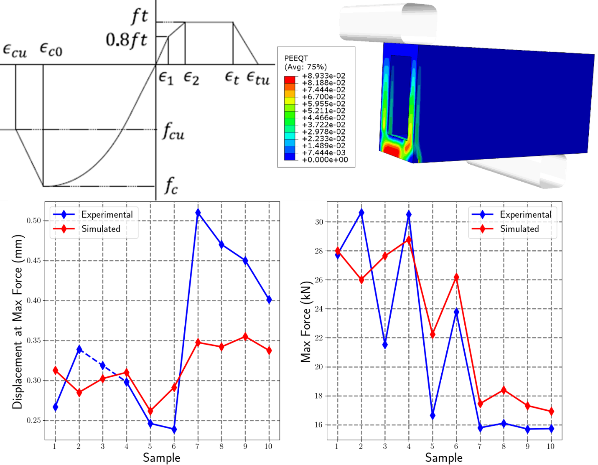

> Source: `SUREWAVE_D5.7-Modelling_Tools_Validation_Report_R01_Clean.docx` — Document date: 2025-09-05 — Converted: 2026-09-28 via pandoc/pdftotext

---

##### 

Deliverable number: D5.7

+---------------------------------------------------------------------------------------------------------------------------------------------------------------------------------------------------------------------------------------------------------------------------------------------------------------------------------------+
| #####                                                                                                                                                                                                                                                                                                                                 |
+===================================================================================================================================================================+===================================================================================================================================================================+
| ##### {width="7.8701301399825025in" height="2.5902777777777777in"}                                                                                                                                                                               |
+---------------------------------------------------------------------------------------------------------------------------------------------------------------------------------------------------------------------------------------------------------------------------------------------------------------------------------------+
| ##### SUREWAVE -- Structural Reliable Offshore Floating PV Solution Integrating Circular Concrete Floating Breakwater                                                                                                                                                                                                                 |
+---------------------------------------------------------------------------------------------------------------------------------------------------------------------------------------------------------------------------------------------------------------------------------------------------------------------------------------+
| Title: Modelling Tools Validation Report                                                                                                                                                                                                                                                                                              |
|                                                                                                                                                                                                                                                                                                                                       |
| #####                                                                                                                                                                                                                                                                                                                                 |
+---------------------------------------------------------------------------------------------------------------------------------------------------------------------------------------------------------------------------------------------------------------------------------------------------------------------------------------+
| #####                                                                                                                                                                                                                                                                                                                                 |
|                                                                                                                                                                                                                                                                                                                                       |
| #####                                                                                                                                                                                                                                                                                                                                 |
|                                                                                                                                                                                                                                                                                                                                       |
| ##### **Disclaimer:**                                                                                                                                                                                                                                                                                                                 |
|                                                                                                                                                                                                                                                                                                                                       |
| > The SUREWAVE project is Funded by the European Union. Views and opinions expressed are however those of the author(s) only and do not necessarily reflect those of the European Union. Neither the European Union nor European Climate, Infrastructure and Environment Executive Agency (CINEA) can be held responsible for them    |
+---------------------------------------------------------------------------------------------------------------------------------------------------------------------------------------------------------------------------------------------------------------------------------------------------------------------------------------+
| #####                                                                                                                                                                                                                                                                                                                                 |
+-------------------------------------------------------------------------------------------------------------------------------------------------------------------+-------------------------------------------------------------------------------------------------------------------------------------------------------------------+
| ##### The SUREWAVE project has received funding from the European Union\'s Horizon Europe Research and innovation funding programme under GA No. 101083342.       | ##### {width="3.00255249343832in" height="0.6299212598425197in"}       |
+-------------------------------------------------------------------------------------------------------------------------------------------------------------------+-------------------------------------------------------------------------------------------------------------------------------------------------------------------+

Deliverable details

  ---------- -------- ------------------------------------------------------
  **WP**     5        

  **Task**   D5.7     
  ---------- -------- ------------------------------------------------------

  ------------------------- ------ -- -------------------------- ----------------------
  **Dissemination level**   SEN       **Due delivery date**      31.07.2025

  **Deliverable type**      R         **Actual delivery date**   05.09.2025
  ------------------------- ------ -- -------------------------- ----------------------

  -------------------------------- ---------------------------------------------
  **Lead beneficiary**             **CEIT**

  **Contributing beneficiaries**   
  -------------------------------- ---------------------------------------------

+----------------------+------------+-----------------------+-------------------+
| **Document Version** | **Date**   | **Author**            | **Comments**[^1]  |
+----------------------+------------+-----------------------+-------------------+
| 1.0                  | 29/07/2025 | Aritz Dorronsoro      | Draft             |
|                      |            |                       |                   |
|                      |            | Unai Eibar            |                   |
+----------------------+------------+-----------------------+-------------------+
| 1.1                  | 05/08/2025 | Afaf Saai             | Review-1          |
+----------------------+------------+-----------------------+-------------------+
| 1.2                  | 15/08/2025 | Virgile Delhaye       | Review-2          |
+----------------------+------------+-----------------------+-------------------+
| 2.0                  | 22/08/2025 | Aritz Dorronsoro      | Final             |
+----------------------+------------+-----------------------+-------------------+

+-------------------------------------------------------------------------------------------------------------------------------------------------+
| **Dissemination level**                                                                                                                         |
+=====================================+===========================================================================================================+
| PU                                  | Public- fully open                                                                                        |
+-------------------------------------+-----------------------------------------------------------------------------------------------------------+
| SEN                                 | SEN = Sensitive -- limited under the conditions of the Grant Agreement                                    |
+-------------------------------------+-----------------------------------------------------------------------------------------------------------+
| EU classified                       | EU classified -- restraint -- UE/EU-restricted, confidential, secret-UE/EU secret under Decision 2015/444 |
+-------------------------------------+-----------------------------------------------------------------------------------------------------------+
| **Deliverable type**                                                                                                                            |
+-------------------------------------+-----------------------------------------------------------------------------------------------------------+
| R:                                  | Document, report (excluding the periodic and final reports)                                               |
+-------------------------------------+-----------------------------------------------------------------------------------------------------------+
| DEM:                                | Demonstrator, pilot, prototype, plan designs                                                              |
+-------------------------------------+-----------------------------------------------------------------------------------------------------------+
| DEC:                                | Websites, patents filing, press & media actions, videos, etc.                                             |
+-------------------------------------+-----------------------------------------------------------------------------------------------------------+
| OTHER:                              | Software, technical diagram, etc.                                                                         |
+-------------------------------------+-----------------------------------------------------------------------------------------------------------+

**EXECUTIVE SUMMARY**

This report validates the modelling and simulation tools developed in the SUREWAVE project for assessing the structural health of offshore floating photovoltaic systems. The task focused on verifying, calibrating, and validating these tools using experimental data from WP4 and WP6, complemented by literature, international standards, and third-party databases.

Finite element models were benchmarked against well-defined standards/guidelines and calibrated using WP4 concrete test data. Crack propagation simulations incorporated real-time corrosion data from WP6 sensors and were validated using established fracture mechanics laws and external experimental studies. The integration of these models into the SHMS application enables real-time condition assessment and predictive maintenance planning.

The report confirms that the tools are technically robust, experimentally grounded, and aligned with international best practices, fulfilling the task's scope and supporting the long-term reliability of offshore FPV infrastructure.

The report also summarises and validates the numerical modelling methodologies and tools developed within WP5, and it constitutes the final deliverable of the work package. The in-depth description of the modelling tools is given in previous deliverables: (SUREWAVE Project D5.3, 2024) refers to the finite element analysis of the breakwater system (task T5.3), which uses the results from task T5.2 as input; (SUREWAVE Project D5.5, 2025) details the fatigue crack propagation methodology developed within task T5.4; and (SUREWAVE Project D5.6, 2025) describes the Structural Health Management System (SHMS) demonstrator MATLAB application, which integrates the results of the previous modelling tools with data from the eddy current corrosion sensors developed within work package WP6.

In this final report, the validity of the modelling tools is evaluated against international standards, state-of-the-art literature and third-party databases/simulation tools. A chapter is dedicated to each of the tools and methodologies necessary for the final structural health assessment, from the finite element modelling and stress range characterisation to the crack propagation algorithms and the type of output provided by the SHMS. The document is structured as follows:

Chapter [1. Introduction](#introduction): Presents the context for the development of the modelling tools. Specifically, it addresses the lack of literature about structural health assessment for floating photovoltaic solutions, shows the current research trends about FPV and presents the reference guidelines used for the validation of the developed modelling tools.

Chapter [2. Finite Element Methodology and Stress Range Definition](#finite-element-methodology-and-stress-range-definition): Describes the modelling framework, and stress range characterisation. The procedure followed to define the finite element model is compared to guidelines, as well as the interpretation of load data. Additionally, advanced aspects of the developed models, namely the use of concrete material models and embedded elements, are highlighted.

Chapter [3. Crack Propagation Simulations](#crack-propagation-simulations): Details the methodology for simulating fatigue crack growth in reinforcement bars using fracture mechanics. Includes validation against standards, incorporation of corrosion effects, and development of custom stress intensity factor (SIF) solutions.

Chapter [4. Structural Health Monitoring Strategy](#structural-health-monitoring-strategy): Presents the SHMS APP, which integrates simulation tools and sensor data for real-time condition assessment. Describes its analysis modes and compares its outputs with international standards. It also discusses inspection planning criteria and presents potential improvements to the current version of the SHMS.

Chapter [Conclusions](#conclusions): Summarises the validation of the modelling tools and highlights their alignment with international standards. Notes current limitations (e.g., localised corrosion modelling) and outlines future work to enhance the SHMS and modelling framework.

**Deliverable Review**

+----------------------------------------------------------------------------------+-----------------+---------------------------------------+-----------------+-----------------+---------------------------------------+-----------------+
|                                                                                  | **Reviewer #1: Afaf Saai**                                                | **Reviewer #2: Virgile Delhaye**                                          |
|                                                                                  +-----------------+---------------------------------------+-----------------+-----------------+---------------------------------------+-----------------+
|                                                                                  | **Answer**      | **Comments**                          | **Type\***      | **Answer**      | **Comments**                          | **Type\***      |
+----------------------------------------------------------------------------------+-----------------+---------------------------------------+-----------------+-----------------+---------------------------------------+-----------------+
| 1.  Is the deliverable in accordance with                                                                                                                                                                                                |
+----------------------------------------------------------------------------------+-----------------+---------------------------------------+-----------------+-----------------+---------------------------------------+-----------------+
| (i) The Description of Work?                                                     | Yes             |                                       | M               | Yes             |                                       | M               |
|                                                                                  |                 |                                       |                 |                 |                                       |                 |
|                                                                                  | No              |                                       | m               | No              |                                       | m               |
|                                                                                  |                 |                                       |                 |                 |                                       |                 |
|                                                                                  |                 |                                       | a               |                 |                                       | a               |
+----------------------------------------------------------------------------------+-----------------+---------------------------------------+-----------------+-----------------+---------------------------------------+-----------------+
| (ii) The international State of the Art?                                         | Yes             | *Not applicable for this deliverable* | M               | Yes             | *Not applicable for this deliverable* | M               |
|                                                                                  |                 |                                       |                 |                 |                                       |                 |
|                                                                                  | No              |                                       | m               | No              |                                       | m               |
|                                                                                  |                 |                                       |                 |                 |                                       |                 |
|                                                                                  |                 |                                       | a               |                 |                                       | a               |
+----------------------------------------------------------------------------------+-----------------+---------------------------------------+-----------------+-----------------+---------------------------------------+-----------------+
| 2.  Is the quality of the deliverable in a status                                                                                                                                                                                        |
+----------------------------------------------------------------------------------+-----------------+---------------------------------------+-----------------+-----------------+---------------------------------------+-----------------+
| (i) That allows it to be sent to European Commission?                            | Yes             |                                       | M               | Yes             |                                       | M               |
|                                                                                  |                 |                                       |                 |                 |                                       |                 |
|                                                                                  | No              |                                       | m               | No              |                                       | m               |
|                                                                                  |                 |                                       |                 |                 |                                       |                 |
|                                                                                  |                 |                                       | a               |                 |                                       | a               |
+----------------------------------------------------------------------------------+-----------------+---------------------------------------+-----------------+-----------------+---------------------------------------+-----------------+
| (ii) That needs improvement of the writing by the originator of the deliverable? | Yes             |                                       | M               | Yes             |                                       | M               |
|                                                                                  |                 |                                       |                 |                 |                                       |                 |
|                                                                                  | No              |                                       | m               | No              |                                       | m               |
|                                                                                  |                 |                                       |                 |                 |                                       |                 |
|                                                                                  |                 |                                       | a               |                 |                                       | a               |
+----------------------------------------------------------------------------------+-----------------+---------------------------------------+-----------------+-----------------+---------------------------------------+-----------------+
| (iii) That need further work by the Partners responsible for the deliverable?    | Yes             |                                       | M               | Yes             |                                       | M               |
|                                                                                  |                 |                                       |                 |                 |                                       |                 |
|                                                                                  | No              |                                       | m               | No              |                                       | m               |
|                                                                                  |                 |                                       |                 |                 |                                       |                 |
|                                                                                  |                 |                                       | a               |                 |                                       | a               |
+----------------------------------------------------------------------------------+-----------------+---------------------------------------+-----------------+-----------------+---------------------------------------+-----------------+

\* Type of comments: M = Major comment; m = minor comment; a = advice

# Table of Contents {#table-of-contents .TOC-Heading}

[1. Introduction [8](#introduction)](#introduction)

[2. Finite Element Methodology and Stress Range Definition [12](#finite-element-methodology-and-stress-range-definition)](#finite-element-methodology-and-stress-range-definition)

[2.1. Validation against References [12](#validation-against-references)](#validation-against-references)

[2.2 Key Aspects of the Developed Methodology [21](#key-aspects-of-the-developed-methodology)](#key-aspects-of-the-developed-methodology)

[2.3. Conclusion [23](#conclusion)](#conclusion)

[3. Crack Propagation Simulations [25](#crack-propagation-simulations)](#crack-propagation-simulations)

[3.1. Validation against References [25](#validation-against-references-1)](#validation-against-references-1)

[3.2 Key Aspects of the Developed Methodology [31](#key-aspects-of-the-developed-methodology-1)](#key-aspects-of-the-developed-methodology-1)

[3.3. Conclusion [33](#conclusion-1)](#conclusion-1)

[4. Structural Health Monitoring Strategy [34](#structural-health-monitoring-strategy)](#structural-health-monitoring-strategy)

[4.1. Validation against References [34](#validation-against-references-2)](#validation-against-references-2)

[4.2. Key Aspects of the Developed Methodology [38](#key-aspects-of-the-developed-methodology-2)](#key-aspects-of-the-developed-methodology-2)

[4.3. Conclusion [38](#conclusion-2)](#conclusion-2)

[Conclusions [39](#conclusions)](#conclusions)

[Bibliography [40](#_Toc207976605)](#_Toc207976605)

# List of figures {#list-of-figures .TOC-Heading}

[Figure 1: General procedure for structural health management in the SUREWAVE project. [9](#_Ref204102904)](#_Ref204102904)

[Figure 2: General procedure for fracture analysis. Source: (American Bureau of Shipping, 2022). [10](#_Ref204102843)](#_Ref204102843)

[Figure 3: Mesh example for global (top) and local (bottom) FE model for structural calculations. Source: (American Bureau of Shipping, 2022). [13](#_Ref204509574)](#_Ref204509574)

[Figure 4. Meshes used in the models developed during the SUREWAVE project. Top left: meshes of global and local models. Top right: discretisation of reinforcement bars in submodel. Middle left: cross section of global model, where the region in the bottom row is highlighted. Middle right: cross section of submodel, where the region in the bottom row is highlighted.Bottom left: region in global model with coarse mesh. Bottom right: same region, with finer mesh and geometrical details added. Source: (SUREWAVE Project D5.3, 2024). [14](#_Ref204514916)](#_Ref204514916)

[Figure 5: Definition of Boundary Conditions in the breakwater system. Left: high reaction forces concentrated in a point. Right: distributed reaction forces. Source: (SUREWAVE Project D5.3, 2024). [15](#_Ref204521277)](#_Ref204521277)

[Figure 6: Definition of loads in the global model of the breakwater system and the references used for their design. Source: (SUREWAVE Project D5.3, 2024). [16](#_Ref204522776)](#_Ref204522776)

[Figure 7: Hot-spot stress calculation. Source: (American Bureau of Shipping, 2022). [17](#_Ref204508462)](#_Ref204508462)

[Figure 8: Submodelling procedure developed in the SUREWAVE project to account for the complexity of reinforced concrete. Source: (SUREWAVE Project D5.3, 2024)~~.~~ [18](#_Ref204508987)](#_Ref204508987)

[Figure 9: Rainflow-based methodology used for stress characterisation. Top: time-series of the loads/momenta. Bottom: rainflow analysis of one of the components. The signal follows a bimodal distribution, the red box represents low-amplitude occurrences that were discarded, to focus on the higher-amplitude mode Source: (SUREWAVE Project D5.3, 2024). [20](#_Ref204574106)](#_Ref204574106)

[Figure 10: Summary of the constitutive model calibration procedure. Top left: constitutive law. Top right: three-point bending simulation example. Bottom: calibration results. Source: (SUREWAVE Project D5.3, 2024). [22](#_Ref204565718)](#_Ref204565718)

[Figure 11: Comparison of the meshes necessary to apply the embedded element technique (left) vs. the direct description of the concrete-reinforcement system (right). Source: (SUREWAVE Project D5.3, 2024). [23](#_Ref204567617)](#_Ref204567617)

[Figure 12: New SIF generation procedure. Top left: variable definition. Top right: mesh definition. Bottom left: description of calculated new solutions. Bottom right: calibration results, $F$ values. Source: (SUREWAVE Project D5.5, 2025). [26](#_Ref204624807)](#_Ref204624807)

[Figure 13: Corrosion mass loss vs fatigue life of reinforced concrete. For the in-situ test, different markers correspond to different corrosion currents (Table 2). Sources: (Yi, 2010), (Lu, 2018). [29](#_Ref204272082)](#_Ref204272082)

[Figure 14: Uniform vs. localised corrosion in accelerated degradation tests. Source: (Ma, 2014). [30](#_Ref204218456)](#_Ref204218456)

[Figure 15: Examples of the stress distribution for crack propagation. Source: (SUREWAVE Project D5.6, 2025). [31](#_Ref204675242)](#_Ref204675242)

[Figure 16: Example of EC corrosion sensor data used in crack growth simulations. Source: (SUREWAVE Project D5.6, 2025). [32](#_Ref204676109)](#_Ref204676109)

[Figure 17: Model verification for SIF generation simulations. Source: (SUREWAVE Project D5.5, 2025). [33](#_Ref204634416)](#_Ref204634416)

[Figure 18: Analysis modes of the SHMS APP. Source: (SUREWAVE Project D5.6, 2025). [35](#_Ref204702834)](#_Ref204702834)

[Figure 19: Example of a Failure Assessment Diagram. Source: (American Bureau of Shipping, 2022). [36](#_Ref204708941)](#_Ref204708941)

# List of tables {#list-of-tables .TOC-Heading}

[Table 1: Fatigue life and initial corrosion level for reinforced concrete. Data from (Yi, 2010). [28](#_Ref204223156)](#_Ref204223156)

[Table 2: Fatigue life, mass loss and corrosion current for reinforced concrete. Data from: (Lu, 2018). [29](#_Ref204272133)](#_Ref204272133)

# 1. Introduction

A modelling framework was developed in SUREWAVE Project within the work package 5 targeting the prediction of lifetime of floating photovoltaic (FPV) technology for structural health management system. The current report evaluates the validity of the developed modelling tools against international standards, state-of-the-art literature and third-party databases and simulation tools. The focus is the structural health of the floating breakwater solution necessary to ensure the correct functioning of the FPV solution. Specifically, fatigue crack growth and corrosion phenomena in the reinforcement bars of the breakwaters have been addressed. The output of the WP is an integrated Structural Health Management System (SHMS) enabling the prediction of the lifetime of the breakwater system.

In addition to the current report, in-depth descriptions of the modelling tools can be found in the project deliverables (SUREWAVE Project D5.3, 2024), (SUREWAVE Project D5.5, 2025) and (SUREWAVE Project D5.6, 2025). The deliverable (SUREWAVE Project D5.3, 2024) refers to the finite element analysis of the breakwater system (task T5.3). The deliverable (SUREWAVE Project D5.5, 2025) details the fatigue crack propagation methodology developed within task T5.4. The deliverable (SUREWAVE Project D5.6, 2025) describes the Structural Health Management System (SHMS) demonstrator based on MATLAB application, which integrates the results of the previous modelling tools with data from the eddy current corrosion sensors developed within WP6.

The general procedure for SHMS developed in SUREWAVE project is illustrated in [Figure 1](#_Ref204102904). As can be observed, the development of the integrated SHMS involves:

I.  Incorporation of advanced finite element (FE) analysis to obtain the stress distributions of the reinforcement bars. It includes the modelling of mechanical behaviour of the concrete solution designed during the project and the implementation of submodelling methodologies to get an accurate representation of stress distributions (Chapter [2. Finite Element Methodology and Stress Range Definition](#finite-element-methodology-and-stress-range-definition)). In [Figure 1](#_Ref204102904), this is represented by the purple *FEA analysis* and *TRANSLATION OF FEM RESULTS* elements.

II. Implementation of fatigue crack propagation algorithms and compilation of relevant information needed for the analysis, including material properties (mechanical, fatigue) and stress intensity factors, both from literature and solutions generated in the project (Chapter [3. Crack Propagation Simulations](#crack-propagation-simulations)). In [Figure 1](#_Ref204102904), this is represented by the blue *MATERIAL PROPERTIES* and red *FATIGUE CRACK PROPAGATION ANALYSIS* elements.

III. Integration of information about monitored data (Eddy Current based corrosion sensors) in the crack propagation simulations (Chapter [3. Crack Propagation Simulations](#crack-propagation-simulations)). In [Figure 1](#_Ref204102904), this is represented by the blue *MONITORED DATA* elements.

IV. Implementation of developed modelling tools in the SHMS APP, and processing of crack propagation analyses to provide relevant output for SHMS (Chapter [4. Structural Health Monitoring Strategy](#structural-health-monitoring-strategy)) In [Figure 1](#_Ref204102904), this is represented by the pink *STRUCTURAL HEALTH MANAGEMENT SYSTEM* and red *OUTPUT* elements.

![[]{#_Ref204102904 .anchor}Figure 1: General procedure for structural health management in the SUREWAVE project.](../images/2025-09-05_surewave_d5.7_modelling_tools_validation/image3.jpeg){alt="A diagram of health management system AI-generated content may be incorrect." width="7.069444444444445in" height="1.913888888888889in"}

Each of the steps needed for the SHMS was evaluated against international standards and state-of-the-art literature. It must be mentioned that the state of the art concerned with integrated structural health assessment of FPV is limited. Since offshore FPV technology is at an early stage of development, scientific publications address their assessment at the design phase. Most general aspects of the technology still need to be addressed before these technologies reach a mature state. Scientific literature focusing on floating PV mostly target:

- [Connector systems between PV panels and mooring]{.underline}: a conference paper titled "Review on the Structural Components of Floating Photovoltaic Covering Systems" (Ravichandran, 2022) shows that the wave conditions require careful design and sizing of these two components. The SUREWAVE project addresses these issues by improving the design of the hinge systems, and through the use of the floating breakwaters.

- [Hydrodynamic analyses]{.underline} (with or without the use of a breakwater) are still at the hydrodynamic design phase and need multiple stages before considering the structural assessment of the breakwaters. This was highlighted by the review of (Jin, 2025), where the current state, challenges, and future directions of offshore floating photovoltaic were addressed. It highlights the needs for improved modelling of systems from a wave-structure interaction and mooring optimisation point of view.

- [Exceedingly simplified analyses of FBW systems]{.underline}: (Huo, 2022) is one of the few works that includes the breakwater in the structural analysis. However, linear behaviour of the material is assumed, and the structural assessment is limited to obtaining the stress distribution within the system. Other works, such as (Samuel, 2025), simply mention that the breakwater contributes to the lifetime of the system it protects, and that it must be dimensioned properly to withstand the loads.

As shown in these references, the focus of FPV research is mostly in the design of the solutions. Consequently, there is a lack of guidelines for structural health assessment in these systems. An example of research related to structural health is shown in (Song, Noh, & Kim, 2025). The article presents a data-driven approach for structural health assessment. Its aim is to evaluate damage in connectors by detecting anomalies in the motion of the floating panels using ANN. The study aligns with the trends just described: it focuses on the connector systems, it is based on hydrodynamic behaviour (not in material behaviour) and it does not include the effects of a FBW.

Even in the more mature offshore wind field, structural health monitoring is still undergoing development. (Yang, 2024) shows a review of SHM and fault diagnosis of offshore wind turbine (OWT) support structures. Many references are provided related to monitoring critical components such as welds and bolts using different sensor technologies (accelerometers, EC sensors, strain gauges, ultrasounds). Model-based strategies are focused on modal analysis, as shown in (Tewolde, 2017), where changes in natural frequencies detected by accelerometers are related to stiffness loss via FE analysis. Other hybrid approaches are presented, such as (Kolios, 2019). A combination of 3D laser scanning and FE analysis is used to evaluate stress concentration factors for welds in OWT supports.

To overcome the challenges highlighted by the literature and lack of references for validation of the integrated system, each of the steps needed for the analysis was evaluated against international standards and/or state-of-the-art publications. The experimental campaign carried out in WP6 considering the concrete material developed in WP4 enabled the validation of the definition of constitutive model used in the finite element simulations, as described in (SUREWAVE Project D5.3, 2024). For the validation of the methodology and the computational tools, the main reference documents are guidelines published by the American Bureau of Shipping (ABS), a globally recognized classification society, which plays a pivotal role in the maritime, offshore, and energy sectors. The "Guide for Fatigue Assessment of Offshore Structures" (American Bureau of Shipping, 2020) and the "Guidance Notes on Fracture Analysis for Marine and Offshore Structures" (American Bureau of Shipping, 2022) were mainly used as reference guidelines for evaluation. These guides often refer to the British Standard "BS7910: Guide to methods for assessing the acceptability of flaws in metallic structures" (British Standards Committee, 2019). The general procedure for structural health management proposed by the ABS is shown in [Figure 2](#_Ref204102843). Its structure is analogous to those followed during the project ([Figure 1](#_Ref204102904)), so that each of the steps followed to complete the work can be validated against these references.

![[]{#_Ref204102843 .anchor}Figure 2: General procedure for fracture analysis. Source: (American Bureau of Shipping, 2022).](../images/2025-09-05_surewave_d5.7_modelling_tools_validation/image4.jpeg){alt="A diagram of a technical flowchart Description automatically generated" width="4.625664916885389in" height="3.878261154855643in"}

For aspects where the information in these documents was not directly applicable to the studied system, such as the considered materials (mostly metallic vs reinforced concrete) and the effects of corrosion, relevant additional sources were consulted for the validation.

In the following chapters, the validity of the models and tools developed during the SUREWAVE project is evaluated. The general structure of each chapter is: a section to describe available data (guidelines, experimental data, reference results, etc.) and a comparison with the completed work, followed by a section that highlights specific methodological advancements (or differences in general) of the current work, and ending in a brief discussion of the validity of the models.

# 2. Finite Element Methodology and Stress Range Definition

During the SUREWAVE project, an advanced FE-based modelling framework has been developed for evaluating the structural performance of a floating breakwater system. It includes material model adapted and calibrated for the prediction of concrete response with valid model parameters and advanced finite element simulations incorporating embedded concrete and reinforcement models, submodelling techniques, and generalised fatigue life prediction using standard industry criteria. The deliverable report D5.3 (SUREWAVE Project D5.3, 2024) provides a detailed description of the developed methodology. In the current report, the validation of the FE framework is performed considering standard guides of the American Bureau of Shipping. The guidance notes on fracture analysis for marine and offshore structure are used to evaluate methodologies for finite element analyses, focusing on the fracture and fatigue behaviour. For stress range definition, the main reference document is the ABS guide for fatigue assessment of offshore structures (American Bureau of Shipping, 2020) with complementary ABS guide on Spectral-Based Fatigue Analysis for Floating Production, Storage and Offloading (FPSO) Installations (American Bureau of Shipping, 2018).

## 2.1. Validation against References

To evaluate the fitness for service of any structure, the effect of the loads needs to be calculated in terms of stress levels and distributions. For that purpose, finite element simulations are used as methods to determine the critically loaded regions (called hot spots) and quantify the stress levels in those regions. This requires that the FE model must capture with sufficient precision the factors relevant for the analysis including geometrical representation of the system and representations of material behaviour, boundary conditions, and loads).

Once the stresses are characterised, multiple methods exist to evaluate the performance of the structures. They are divided into three main categories: direct, spectral and deterministic (like the one applied in the project) methods. In this section, standards about FE model definition and load interpretation are reviewed, and the validity of the models used in the SUREWAVE project is verified.

### FE Model Definition 

For offshore application, existing guidelines for FE model definition refer mostly to ships and ship-like structures, as shown in (American Bureau of Shipping, 2022) and DNV's Class Guideline "DNVGL-CG-0127: Finite Element Analysis" (DNV, 2015). The document from ABS details strategies for meshing and hotspot stress identification, while DNV provides additional information about definition of boundary conditions and loading. These models are compared with those developed for the analysis of the FBW.

FE models designed to analyse the mechanical response of ships use shell elements mainly, since surface interactions and stresses are most critical in these analyses, and shell elements provide sufficiently good accuracy and reduced computation times compared to solid elements. Ships are complex structures that require relatively large models, so including fine geometry and meshing details for the whole structure is often too time and resource demanding. Therefore, a two-step analysis is often done. First, a global model with moderate amount of detail and is simulated, to provide the necessary input to simulate specific regions of interest in subsequent local models, where higher geometrical details and mesh density can be included. Element size for the global models is required to be of the order of the smallest important feature of the model (such as structural stiffeners), or 50 mm characteristic length (DNV, 2015) as a general rule, and an aspect ratio smaller than 1:3.

For local models, element sizes are required to be of the order of the minimum member thickness, that is, representative of the additional geometrical detail included in the local models. Near the hot spots, multiple elements (of the order of 10) need to have this minimum size, while a larger element size can be used in the rest of the local model. Examples of valid meshes for global and local FE analysis are shown in [Figure 3](#_Ref204509574):

![[]{#_Ref204509574 .anchor}Figure 3: Mesh example for global (top) and local (bottom) FE model for structural calculations. Source: (American Bureau of Shipping, 2022).](../images/2025-09-05_surewave_d5.7_modelling_tools_validation/image5.png){alt="A wireframe of a rectangular object AI-generated content may be incorrect." width="4.571428258967629in" height="5.905918635170604in"}

An element size of 50 mm (with aspect ratios close to 1, never exceeding 1:2) was used in the global models for the SUREWAVE project to represent the concrete region. The reinforcement bars were modelled using 1D truss bars to capture the axial stiffening that reinforcement provides to the concrete. To account for the local response in critical regions, the submodelling technique in ABAQUS was used with solid (3D) elements to represent the reinforcement bars and determine the stress field distributions for crack propagation analyses. The sub model setup ensures refined mesh of the structural feature and compared to global model leading to precise calculation of stress and stress gradient in the structure.

[Figure 4](#_Ref204514916) shows representative images of the meshing strategy followed during the SUREWAVE project. It shows the relationship between the global and local models, the discretisation used to represent the reinforcement bars, and the geometrical details added in the local models.

![[]{#_Ref204514916 .anchor}Figure 4. Meshes used in the models developed during the SUREWAVE project. Top left: meshes of global and local models. Top right: discretisation of reinforcement bars in submodel. Middle left: cross section of global model, where the region in the bottom row is highlighted. Middle right: cross section of submodel, where the region in the bottom row is highlighted.Bottom left: region in global model with coarse mesh. Bottom right: same region, with finer mesh and geometrical details added. Source: (SUREWAVE Project D5.3, 2024).](../images/2025-09-05_surewave_d5.7_modelling_tools_validation/image6.png){width="6.0625in" height="7.200833333333334in"}

Boundary conditions must be defined to prevent rigid body motions and prevent over-constraining which might generate inaccurate reaction forces in the FE analysis. Boundary conditions of the breakwater system consisted of pinning the symmetry plane (the section at the centre of the geometry), since localised restriction of in-plane motion resulted in high reaction forces in the selected nodes. [Figure 5](#_Ref204521277) shows an example of the differences in response between localised restrictions (left) and generalised pinning (right). The system of the left is pinned only at a vertex, where high reaction forces appear. This causes high reaction forces to appear on the node. The system on the right was pinned along the whole symmetry plane, causing distributed reaction forces.

![[]{#_Ref204521277 .anchor}Figure 5: Definition of Boundary Conditions in the breakwater system. Left: high reaction forces concentrated in a point. Right: distributed reaction forces. Source: (SUREWAVE Project D5.3, 2024).](../images/2025-09-05_surewave_d5.7_modelling_tools_validation/image7.png){width="6.723343175853018in" height="2.3972692475940507in"}

Loads must reflect realistic operational and environmental conditions. The (American Bureau of Shipping, 2020) guideline categorises loads based on the type of vessel and operating regime it must withstand. Different indications are given for crane vessels, cable/pipe laying vessels, etc. for considerations of each of the loads the system must withstand. In our analysis, the loading modes that the breakwater was designed to withstand were hinge loads (forces and momenta) and mooring forces (force). For that purpose, load application regions were defined in a manner that relatively closely represented their geometrical definition and the volume force distribution they caused on the system, as shown in [Figure 6](#_Ref204522776):

![[]{#_Ref204522776 .anchor}Figure 6: Definition of loads in the global model of the breakwater system and the references used for their design. Source: (SUREWAVE Project D5.3, 2024).](../images/2025-09-05_surewave_d5.7_modelling_tools_validation/image8.png){width="4.226087051618547in" height="3.6579965004374455in"}

Although not reflected in previous reports, since the experimental campaigns had not been carried out yet, results of the second wave basin experiment showed that slamming forces on the breakwaters resulted in stresses orders of magnitude smaller than those resulting from the hinge and mooring analysis and, therefore, the effect of not including these forces in the initial FE model was negligible.

In the analyses carried out in the SUREWAVE project, 3D (brick) elements of sufficiently small size and appropriate geometrical aspect ratios were used instead of shell type elements, since the description of volume stresses was of high importance, to guarantee appropriate load transmission from the load application regions (hinges and mooring) to the whole system. Careful design of boundary conditions was carried out to avoid over-constraining and excessive reaction forces in the regions of interest. This step was particularly critical in these models, since high reaction forces caused accumulation of damage in the form of concrete softening, which caused the analyses to diverge. Lastly, loads were defined in a manner that accurately described the real-life working conditions of the breakwater system. Therefore, meshing, boundary condition and load definition requirements specified by ABS and DNV were fulfilled in these analyses.

In (American Bureau of Shipping, 2022), characterisation of hot-spot stresses is done using simple extrapolation calculations, following the schematic described in [Figure 7](#_Ref204508462). This methodology is enabled by using a simple material model in their analyses.

![[]{#_Ref204508462 .anchor}Figure 7: Hot-spot stress calculation. Source: (American Bureau of Shipping, 2022).](../images/2025-09-05_surewave_d5.7_modelling_tools_validation/image9.png){alt="A diagram of a curve AI-generated content may be incorrect." width="6.52712489063867in" height="2.973611111111111in"}

Due to the complexity of the concrete material model, as well as the co-existence of concrete and steel reinforcement in the system, the methodology described in the guideline published by ABS was not possible. In the models used in the SUREWAVE project, local stress calculation was only possible via detailed description of the reinforcement bars in the submodelling simulations, to obtain an accurate representation of the stress field. A graphical summary of the geometrical aspects of the models used in submodelling analysis is shown in [Figure 8](#_Ref204508987):

![[]{#_Ref204508987 .anchor}Figure 8: Submodelling procedure developed in the SUREWAVE project to account for the complexity of reinforced concrete. Source: (SUREWAVE Project D5.3, 2024)~~.~~](../images/2025-09-05_surewave_d5.7_modelling_tools_validation/image10.png){width="6.254811898512686in" height="4.4434787839020125in"}

### Stress Range Definition

ABS guidelines describe three methods to perform a stress-based fatigue assessment of the structure (which does not account for crack growth modelling), each associated with the processing that is given to the stresses applied to the ships. In the work developed during the SUREWAVE project, a stress-based preliminary assessment was conducted prior to the crack propagation studies. From these fatigue assessment methodologies, the definition of the stress ranges from the applied loads is of most importance, since these stresses must be used for the crack propagation-based lifetime assessment. From the possible stress sources (waves, propeller vibrations, loading/offloading of ships) contained in the ABS guidelines, only wave loads are considered in these analyses, since the other loads are negligible for the study of floating breakwaters.

At the lowest level of complexity, the **permissible range method** (or **simplified method**) is described. It is a simple pass/fail criterion that is used as a screening technique, based on the load (or stress) history and the S-N curve of the system. The time distribution of stress ranges is modelled as a 2-parameter Weibull distribution, see equation [1](#_Ref204570875):

  --------------------------------------------------------------------------------------------------------------------------------------------------------------
          $$f(s;\delta,\gamma) = \frac{\gamma}{\delta}\left( \frac{s}{\delta} \right)^{\gamma - 1}e^{- {(s/\delta)}^{\gamma}},$$   []{#_Ref204570875 .anchor}1
  ------- ------------------------------------------------------------------------------------------------------------------------ -----------------------------

  --------------------------------------------------------------------------------------------------------------------------------------------------------------

where $s$ is the stress range, $\delta$ is the scale parameter and $\gamma$ is the shape parameter of the distribution. Thanks to the closed form of the distribution, damage accumulation as a function of $s$ can be calculated directly from the S-N curves. To evaluate the total damage caused by the load distribution, Miner's rule for cumulative fatigue is applied, accounting for the number of occurrences of each stress range in the distribution. For that evaluation, the maximum stress range of the studied period ($s_{T}$) and the total number of cycles ($N_{T}$) are needed, which are readily available. According to this method, stress ranges equal to or larger than $s$ occur $N$ times in a $T$ period, following the expressions in equation [2](#_Ref204084963):

  ------------------------------------------------------------------------------------------------------------------
          $$s = s_{T} \times \left( 1 - \frac{\log N}{\log N_{T}} \right)\alpha\ ,$$   []{#_Ref204084963 .anchor}2
  ------- ---------------------------------------------------------------------------- -----------------------------

  ------------------------------------------------------------------------------------------------------------------

where $s_{T}$ is the stress range caused by the largest probable wave in the $T$ period ($T$ return period wave), $N_{T}$ is the total number of waves in the same period, and $\alpha$ is a correction factor (for concrete gravity structures, $1.3 < \alpha < 1.6$). This simple methodology is recommended by (American Bureau of Shipping, 2020) only as a screening tool to identify sensitive areas where detailed analyses are needed.

The **spectral method** (or the **direct method**) consists of transforming the wave time series into the frequency domain, considering wave height and incidence direction as its variables. A "stress transfer function" $H_{\sigma}\left( \omega|\theta \right)$ is defined for each region to be evaluated, by using the FE methodology just described. By knowing every $H_{\sigma}\left( \omega|\theta \right)$ component, stresses generated by any sea state are modelled as linear superposition of their corresponding components. The same is done for damage accumulation, following Miner's rule. This analysis assumes that a linear relationship between loads and generated stresses is held, which allows the application of superposition and scaling methodologies, to help reduce computational effort via elemental load analyses. This can be considered an appropriate assumption for some ship-like (steel) structures, but it is not valid for the breakwater system.

The final method is the **time domain analysis method**, where the behaviour of the system is simulated throughout representative sea-states, and the stress distribution is calculated for those simulations. A stress response time series is obtained this way, and the rainflow counting method (ASTM, 2017) is applied to obtain equivalent fatigue cycles based on the stress time series. This method can capture nonlinear effects (if included in the FE analysis) and simulates non-elemental stress states, instead of relying on the superposition method. From the calculated stress ranges in each representative period, Miner's rule for cumulative damage is applied to assess the fatigue life. This approach offers the highest level of detail and is the most computationally expensive. This method was used as basis for the stress range definition in the SUREWAVE project.

During the SUREWAVE project, time domain analyses of the three studied sea states were carried out for the whole floating solution assuming rigid behaviour of the breakwaters. From those simulations, hinge forces/momenta and mooring forces were extracted, to then incorporate into the structural analysis. Simultaneous simulations of such large systems with complete structural definition were not an option, owing to the size of the system, and the software tools used for each of the tasks. Therefore, an adaptation of the time domain method was followed in the analysis. It consisted of applying rainflow analyses to each of the load components (hinge forces, moments and mooring force), and to identify the most common loading cycle for each component. Since the mechanical response of the system is not linear, simulations of the system loaded by the representative values for each loading component were used, instead of adding the results from elemental force simulations.

[Figure 9](#_Ref204574106) shows the spectra of loading data received, and an example of the rainflow analysis of one of the components:

![[]{#_Ref204574106 .anchor}Figure 9: Rainflow-based methodology used for stress characterisation. Top: time-series of the loads/momenta. Bottom: rainflow analysis of one of the components. The signal follows a bimodal distribution, the red box represents low-amplitude occurrences that were discarded, to focus on the higher-amplitude mode Source: (SUREWAVE Project D5.3, 2024).](../images/2025-09-05_surewave_d5.7_modelling_tools_validation/image11.png){alt="A screenshot of a graph AI-generated content may be incorrect." width="6.205831146106736in" height="7.617390638670166in"}

### Direct Failure Analysis

Before studying fatigue crack propagation, a simplified direct structural analysis was carried out using the stress distributions obtained in the structural analysis. The methodology is simple and purely stress based. Instead of using the full S-N curve, some mechanical properties of the material are incorporated into the analysis.

From the maximum and minimum stress values in the representative fatigue cycle, alternating and mean stress values were calculated, using the expressions in equation [3](#_Ref204575616):

  -----------------------------------------------------------------------------------------------------------------------------------------------------------------
          $$\sigma_{a} = \frac{\sigma_{\max} - \sigma_{\min}}{2}\ \ ,\ {\ \sigma}_{m} = \frac{\sigma_{\max} + \sigma_{\min}}{2}\ $$   []{#_Ref204575616 .anchor}3
  ------- --------------------------------------------------------------------------------------------------------------------------- -----------------------------

  -----------------------------------------------------------------------------------------------------------------------------------------------------------------

These stress values, in combination with relevant material properties, were used to calculate fatigue security coefficients according to Soderberg's and Goodman's law, following equation [4](#_Ref204575532):

  ---------------------------------------------------------------------------------------------------------------------------------------------------------------------------------------------------------------
          $$\frac{1}{n_{S}} = \frac{\sigma_{m}}{\sigma_{Y}} + \frac{\sigma_{a}}{\sigma_{e}}\ \ ,\ \frac{1}{n_{G}} = \frac{\sigma_{m}}{UTS} + \frac{\sigma_{a}}{\sigma_{e}}\ \ ,$$   []{#_Ref204575532 .anchor}4
  ------- ------------------------------------------------------------------------------------------------------------------------------------------------------------------------- -----------------------------

  ---------------------------------------------------------------------------------------------------------------------------------------------------------------------------------------------------------------

where $\sigma_{e}$ is the fatigue limit stress (infinite life asymptote in the S-N curves), $\sigma_{Y}$ is the yield stress and $UTS$ is the ultimate tensile strength of the material. These security factors provide a simplified fatigue assessment for ideal working conditions, where effects such as degradation due to corrosion and fatigue crack growth are not considered, and were followed by fatigue crack propagation analyses.

## 2.2 Key Aspects of the Developed Methodology

After evaluating the developed models versus standard procedure within the context established by the ABS and DNV guidelines, other relevant aspects particular to the studied system are highlighted in this section. Specifically, the challenges associated with the description of the concrete material, a project-specific formulation, are detailed.

### Concrete Material Model

The major difference between ABS guidelines and the system studied in this project is the material used to build the floating structure. Finite element modelling of concrete is challenging in many ways, from the nonlinear nature of the mechanical response to the vastly different tension-compression behaviour. The mechanical behaviour of the concrete mix developed in the SUREWAVE project was characterised in an experimental campaign. Results from this campaign were used to calibrate the parameters of the constitutive model used in the finite element simulations. Specifically, three-point bending test results of multiple rectangular beams with different wall thicknesses were reproduced, and a constitutive model adapted from the work of (Dhakal, 2019) was calibrated using the data. [Figure 10](#_Ref204565718) contains the most important aspects of the calibration procedure, described in full detail in deliverable (SUREWAVE Project D5.3, 2024).

A notable aspect of this calibration process is the fact that the same procedure and base constitutive law were successfully applied to calibrate the models according to the behaviour of the two concrete mixes developed during the project.

{width="7.097916666666666in" height="5.517361111111111in"}

[]{#_Ref204565718 .anchor}Figure 10: Summary of the constitutive model calibration procedure. Top left: constitutive law. Top right: three-point bending simulation example. Bottom: calibration results. Source: (SUREWAVE Project D5.3, 2024).

These results, and the methodology to obtain them, can contribute to the study of reinforced concrete. In the work described in paper (Spartali, 2022), contained in the Zenodo open repository (<https://zenodo.org/records/6759404>), a methodology to calculate the mechanical response of reinforced concrete is described. Specifically, differences between carbon fiber reinforcement and steel reinforcement are evaluated. For these studies, the mechanical behaviour of the concrete must be known. An appropriate calibration procedure for non-standard concrete mixes can contribute to this field.

### Two-material System -- Embedded Elements

Closely related to the calibration of concrete, inclusion of the reinforcement bars was necessary. Continuum models to describe the global behaviour of reinforced concrete exist, such as the one just cited from (Dhakal, 2019). However, the final goal of the project was to study the fatigue life of the steel reinforcement, so an explicit representation of the bars was needed. Every bar of the reinforcement mesh was included individually, for a total number of 2303. These were described as truss elements in the global model, and their full 3D representation was introduced in the sub-modelling analyses.

The stiffening effect of the reinforcement on the concrete was modelled using the embedded element technique. The technique allows meshing the matrix (concrete) and reinforcement as two independent features, and to account for the effect of reinforcement as a perturbation to the stiffness tensor of the matrix material (Tabatabaei, 2014). Thanks to this methodology, the spatial distribution of the whole reinforcement mesh could be modelled, without the need to mesh the concrete-reinforcement interfaces, which would result in models too computationally demanding to be viable. [Figure 11](#_Ref204567617) shows the differences between a model that uses the embedded element technique and one that does not.

![[]{#_Ref204567617 .anchor}Figure 11: Comparison of the meshes necessary to apply the embedded element technique (left) vs. the direct description of the concrete-reinforcement system (right). Source: (SUREWAVE Project D5.3, 2024).](../images/2025-09-05_surewave_d5.7_modelling_tools_validation/image13.png){alt="A red circles on a blue background AI-generated content may be incorrect." width="6.277042869641295in" height="1.8924825021872267in"}

## 2.3. Conclusion

As shown in the previous sections, the modelling tools developed in the SUREWAVE project comply with the standards defined in floating offshore structural assessment guidelines. The modelling framework developed in the SUREWAVE project demonstrates a great potential for Structural Health Management System, considering:

- **Realistic representation of structural material**: incorporating the nonlinear mechanical behaviour of the concrete mix developed during the project, modelling tension cracking and compression stiffening and crushing. The developed finite element simulations enable accurately prediction of structural response compared to experimental measurements.

- **Detailed integral description of the system**: not only were the geometry of the breakwater and loading conditions highly detailed, but the spatial distribution of structural concrete and the reinforcement bars (modelled individually) was also included in the analysis.

- **Advanced FE simulation tools**: embedded elements were used to reproduce the stiffening effect of the reinforcement on the concrete structure. Additionally, to obtain the detailed stress distributions on the reinforcement bars, refined simulations were carried out in the stress concentration sites of the structure, using a submodelling methodology. This allowed to obtain the full spatial distribution of the stresses in the bars.

In summary, the models and tools developed during the project for the characterisation of stress distributions and structural health assessment are on par with state-of-the-art and regulation procedures. In the level of detail achieved for the definition of the material behaviour, the completed research can even be considered advanced.

From the analyses described in this chapter, accurate representations of the stress distributions in a representative fatigue cycle are obtained, which are necessary for information for the crack propagation algorithms implemented during the project, as will be discussed in Chapter [3. Crack Propagation Simulations](#crack-propagation-simulations).

# 3. Crack Propagation Simulations

While stress-based fatigue assessments provide a first-level screening of structural performance, they do not fully capture the progressive nature of damage accumulation under cyclic loading. For this reason, crack propagation simulations are an essential component of the structural health assessment framework developed in the SUREWAVE project. Specifically, these are commonly used to evaluate remaining life after a flaw is discovered during inspection.

This chapter presents the methodology used to simulate fatigue crack growth in the reinforcement bars of the breakwater system. These simulations are based on linear elastic fracture mechanics principles and model growth as a function of stress intensity factors (SIFs) (Newman & Raju, 1982). The SIF describes how stress is redistributed around a crack of certain geometry. SIFs are represented by the symbol $K$ and have dimensions of $\lbrack\sigma\rbrack\lbrack L\rbrack^{1/2}$ (MPa m^1/2^ units are typically used). SIFs depend on specimen geometry, size and location of crack, and magnitude and distribution of loads. For a stress level $\sigma$, the general expression for $K$ is given by equation [5](#_Ref204621683):

  ----------------------------------------------------------------------------------------------
          $K = F\ \sigma\ \sqrt{\pi a}$ ,                          []{#_Ref204621683 .anchor}5
  ------- -------------------------------------------------------- -----------------------------

  ----------------------------------------------------------------------------------------------

where $a$ is the crack depth, and $F$ is a form factor that is dependent on part and crack geometry. $F$ is dimensionless and, in principle, multivariate, where its variables depend on the level of complexity used to describe the crack. As described in (SUREWAVE Project D5.5, 2025), finite element calculations of parts with cracks of certain dimensions are used to obtain stress intensity factors. The simulation approach developed during the project enables the accurate prediction of crack growth rates under realistic loading conditions, including the effects of corrosion.

## 3.1. Validation against References

To ensure the reliability of the crack propagation simulations developed in the SUREWAVE project, this section benchmarks the adopted methodology against established standards. In particular, the used fatigue growth laws and level of detail in the description of the growth phenomenon will be analysed. The comparison highlights both the alignment with best practices and the specific adaptations made for reinforced concrete structures in offshore environments.

### Crack Propagation Laws

Both ABS guides, (American Bureau of Shipping, 2020) and (American Bureau of Shipping, 2022) provide a description of the methodologies followed to carry out the lifetime assessment based on a fracture mechanics approach. Formulae corresponding to the SIF solutions for some elemental crack and part geometries are provided, without describing the procedure to obtain them. Geometries contained in the reference guidelines include embedded, corner, surface and through-thickness cracks in plates, representative of a ship's hull. During the project, part of the developed code included surface, embedded and corner cracks in rectangular parts. However, since the focus of the project has been the lifetime assessment of the steel rebars, the final implemented application focuses on surface cracks on round bars.

For these systems, new stress intensity factor solutions have been calculated for sharp elliptical cracks, as described in detail in deliverable (SUREWAVE Project D5.5, 2025). [Figure 12](#_Ref204624807) shows the steps followed, and meshing details implemented to generate these solutions.

![[]{#_Ref204624807 .anchor}Figure 12: New SIF generation procedure. Top left: variable definition. Top right: mesh definition. Bottom left: description of calculated new solutions. Bottom right: calibration results, $F$ values. Source: (SUREWAVE Project D5.5, 2025).](../images/2025-09-05_surewave_d5.7_modelling_tools_validation/image14.png){alt="A screenshot of a computer generated graph AI-generated content may be incorrect." width="5.875in" height="4.769553805774279in"}

The crack propagation law used in ABS' documents is the Paris-Erdogan Law (Paris & Erdogan, 1963), represented in equation [6](#_Ref204626929):

  ----------------------------------------------------------------------------------------------
          $$\frac{da}{dN} = C\ \Delta K^{m}\ ,$$                   []{#_Ref204626929 .anchor}6
  ------- -------------------------------------------------------- -----------------------------

  ----------------------------------------------------------------------------------------------

where $a$ is the crack depth, $N$ is the number of cycles, and $C$ and $m$ are material- and environment-dependent constants. $C$ and $m$ factors can be obtained through normalised crack propagation tests, such as those contained in ASTM E647 (ASTM, 2024).

Crack propagation algorithms need a starting point. ABS guidelines assume that a flaw is detected during inspection, and that the size and position of the initial crack is therefore known. This is the ideal scenario for these calculations. When the initial crack cannot be characterised precisely, crack propagation simulations can still provide highly relevant information about maximum allowable crack sizes and their most critical orientations, as discussed in chapter [4. Structural Health Monitoring Strategy](#structural-health-monitoring-strategy).

Using Paris' law, fatigue life can be estimated. In the simplest case, where the crack is simplified as infinitely sharp (fully characterised by its depth $a)$ and stress ranges are assumed constant in time and homogeneous in space, the number of cycles until failure can be calculated directly. The number of cycles necessary for a crack of initial size $a_{i}$ to grow into size $a_{f}$ is given in equation [7](#_Ref204628621). Specifically, for $a_{i} = a_{0}$ and $a_{f} = a_{c}$ (critical crack size), the equation can be used to calculate the total lifetime:

  ----------------------------------------------------------------------------------------------------------------------------------------------------------------------------------------
          $$N_{i \rightarrow f} = \frac{1}{C\ {\Delta\sigma}^{m}}\int_{a_{i}}^{a_{f}}{\frac{1}{\left\lbrack F(x) \right\rbrack^{m}\ (\pi x)^{m/2}}dx}\ .$$   []{#_Ref204628621 .anchor}7
  ------- -------------------------------------------------------------------------------------------------------------------------------------------------- -----------------------------

  ----------------------------------------------------------------------------------------------------------------------------------------------------------------------------------------

For variable-amplitude loading, incremental crack propagation is calculated following equation [8](#_Ref204628999):

  -------------------------------------------------------------------------------------------------------------------------------------------------------------------------------------------------
          $$\frac{da}{dN} = C\ \Delta K^{m} \Longrightarrow \Delta a = \Delta N\ C\ \Delta K^{m} \Longrightarrow a_{i + 1} = a_{i} + \Delta N\ C\ \Delta K^{m}\ ,$$   []{#_Ref204628999 .anchor}8
  ------- ----------------------------------------------------------------------------------------------------------------------------------------------------------- -----------------------------

  -------------------------------------------------------------------------------------------------------------------------------------------------------------------------------------------------

where $\Delta K$, although not included explicitly, depends on time. An alternative to this method is the equivalent stress range approach, where a variable amplitude stress history is represented by an equivalent constant amplitude stress range which is assumed to cause the same amount of crack propagation. To calculate this equivalent stress, Weibull distributions similar to those mentioned in section [Stress Range Definition](#stress-range-definition) are used. In the SUREWAVE project, an equivalent stress cycle was calculated directly from the loading history using a rainflow-type approach, since calculating the stress response for all loading cases was not viable.

However, directly applying equation [7](#_Ref204628621) was not possible, and performing an incremental crack propagation analysis was necessary. This comes from the fact that in the SUREWAVE project, the spatial distribution of stresses in the sample was included, from the results of the submodelling analysis. Additionally, crack growth at multiple points of the crack front (as opposed to only at the tip) is calculated in the developed methodology, so that the influence of the stress field can be included.

Multiple adaptations of Paris' law were proposed to account for other effects, such as the NASGRO equation (NASGRO, 2010), shown in equation [9](#_Ref204630246):

  --------------------------------------------------------------------------------------------------------------------------------------------------------------------------------------------------------------------------------------------------
          $$\frac{da}{dN} = C\ \left\lbrack \frac{1 - f}{1 - R}\ \Delta K \right\rbrack^{m}\frac{\left( 1 - \frac{\Delta K_{th}}{\Delta K} \right)^{p}}{\left( 1 - \frac{\Delta K_{\max}}{K_{C}} \right)^{q}}\ \ ,$$   []{#_Ref204630246 .anchor}9
  ------- ------------------------------------------------------------------------------------------------------------------------------------------------------------------------------------------------------------ -----------------------------

  --------------------------------------------------------------------------------------------------------------------------------------------------------------------------------------------------------------------------------------------------

where $R = \sigma_{\min}/\sigma_{\max}$ is the stress ratio, $\Delta K_{th}$ is the threshold SIF value (below which no growth occurs), $K_{C}$ is the critical SIF value (at which catastrophic failure occurs immediately), $f$ determines the crack opening effect and $C$, $m$, $p$ and $q$ are experimental coefficient. Although this model requires more experimental measurements to calibrate its parameters, the formulation can be more accurate for the description of very small (near threshold) or very large (near catastrophic) growth rates, with similar behaviour to the original Paris' law in the intermediate region. The work by (Liu, 2011) shows an example of this, where experimental results of crack growth tests on compact tension (CT) samples at different $R$ values were fitted using both formulations, and NASGRO models were able to better capture near-threshold and high $\Delta K$ values. In the SUREWAVE project, Paris' law was used for crack growth simulations, but including the NASGRO equation (or other variant) is possible in future versions. Implementing propagation laws is simple, but it is always dependent on the availability of reliable knowledge about the model's parameters. Extensive experimental effort is necessary to accurately calibrate the systems.

### Consideration of Corrosion

Corrosion is a highly relevant phenomenon in the studied system: reinforcement bars embedded in concrete, exposed to corroding agents (sea water) during extended periods of time. This is only approximately included in ABS guidelines, through the use of different $C$ and $m$ parameters for corrosive environments, but a detailed analysis is not available. The ABS standards focus on possible treatments to improve corrosion performance of metallic systems, either through coatings, surface treatments such as shot peening, or a combination of both approaches. However, similar to the limitations regarding finite element modelling, these guides fall short on their scope when it comes to the study of the floating breakwaters. Therefore, relevant information related to corrosion mechanisms and their effect on the fatigue life of reinforced concrete was searched in the literature.

(Yi, 2010) investigated the effect of corrosion on the fatigue performance of reinforced concrete beams, as well as the residual mechanical properties of corroded steel reinforcement after fatigue failure. For that purpose, accelerated corrosion tests were carried out on reinforced concrete beams. These beams were later tested under bending conditions. [Table 1](#_Ref204223156) shows the results of their testing, where an initial measured fatigue lifetime of over 2 million cycles (stopping criterion for the test) was reduced by a minimum factor of ≈2.83 due to the presence of corrosion.

  ------------------------------------------------------------------- -------- ------ ------ ------ ------ ------ ------ ------- -------
                           **Mass Loss (%)**                             0      3.25   3.50   4.20   5.50   6.35   8.04   10.17   11.60

   **Fatigue Life (**$\mathbf{1}\mathbf{0}^{\mathbf{3}}$ **Cycles)**   \>2000   626    707    497    334    326     62     324     89

              $\mathbf{\sigma}_{\mathbf{\max}}$ **(MPa)**               194     200    201    203    205    207    211     216     220
  ------------------------------------------------------------------- -------- ------ ------ ------ ------ ------ ------ ------- -------

  : []{#_Ref204223156 .anchor}Table 1: Fatigue life and initial corrosion level for reinforced concrete. Data from (Yi, 2010).

From these results, it is obvious that corrosion plays a notable role in the fatigue life. In fact, two effects occurred simultaneously: on the one hand, corrosion-induced pitting and surface irregularities promoted crack propagation phenomena, thus dramatically accelerating the failure. On the other hand, the loss of material caused a larger stress level (and stress range) to be applied to the system, since the forces applied by the test machine remained the same (as in real life applications).

In the methodology developed during the SUREWAVE project, the effect that the loss of cross section has in the stress distribution is considered. The detrimental effect of pitting during the lifetime of the floating breakwater requires a more complicated study than the one carried out in the reference. In this study, corrosion was introduced in the samples before any mechanical test, which allowed the corrosion dynamics to occur naturally. In a real-life situation, corrosion and fatigue crack growth are simultaneous (and reciprocating) phenomena. Although the effect of generalised corrosion was included in the numerical models explicitly, the contributions of localised pitting have not been considered directly.

(Lu, 2018) studied the simultaneous action of corrosion and mechanical fatigue on the lifetime of reinforced beams. A custom bending setup with an accelerated corrosion module (a saltwater solution and a cathode connected to a DC power supply was used in the study. After the tests, the degradation level was measured, similar to the previous study. The results are shown in [Table 2](#_Ref204272133):

  ------------------------------------------------------------------- -------- ------ ------ ------ ------- ------ ------- ------- -------
                           **Mass Loss (%)**                             0      7.91   4.03   7.35   10.07   8.62   14.54   13.82   18.55

   **Fatigue Life (**$\mathbf{1}\mathbf{0}^{\mathbf{3}}$ **Cycles)**   \>2000   745    1003   1016    692    1297   1225     725     569

                       **Corrosion Current (A)**                         0      1.5    0.5    1.0     2.5    0.5     1.0     1.5     2.5
  ------------------------------------------------------------------- -------- ------ ------ ------ ------- ------ ------- ------- -------

  : []{#_Ref204272133 .anchor}Table 2: Fatigue life, mass loss and corrosion current for reinforced concrete. Data from: (Lu, 2018).

The results from both experimental campaigns ([Table 1](#_Ref204223156) and [Table 2](#_Ref204272133)) are shown in [Figure 13](#_Ref204272082):

![[]{#_Ref204272082 .anchor}Figure 13: Corrosion mass loss vs fatigue life of reinforced concrete. For the in-situ test, different markers correspond to different corrosion currents ([Table 2](#_Ref204272133)). Sources: (Yi, 2010), (Lu, 2018).](../images/2025-09-05_surewave_d5.7_modelling_tools_validation/image15.png){alt="A graph with red and blue lines AI-generated content may be incorrect." width="5.826388888888889in" height="4.606628390201225in"}

These results are not directly comparable, because they provide from two different experimental campaigns, where neither the samples nor the conditions are the same, on top of the fundamental differences behind the studied phenomena. The test bar for both campaigns resisted the same 2 million cycles in the pristine state. In general, pre-corroded bars show a smaller dispersion in their maximum cycle number, and lower lifetimes. These differences are expected. The larger dispersion in the in-situ corrosion tests comes from the local nature of the pitting effect, which influences fatigue crack propagation greatly. In the ex-situ tests, corrosion occurs more homogeneously across all samples, since no local stress-activation occurs. Longer lifetimes are also expected in the in-situ tests, since the initial state of the test is the pristine bar and corrosion developed during the test, while in the tests with the pre-corroded samples the effects of corrosion were present from the first cycle.

Thanks to the EC sensors developed in the SUREWAVE project and their incorporation to the crack propagation methodology, information about the evolution of corrosion is available for realistic lifetime estimates. Nevertheless, only the effect of generalised corrosion is considered in its current formulation. Other authors' contributions have set the grounds to evaluate the contribution of both generalised and localised corrosion phenomena.

In a publication titled "Fatigue life prediction for aging RC beams considering corrosive environments" (Ma, 2014) the authors also attempted to evaluate the effect of corrosion on fatigue life. The final objective of their work was to generate data for data-driven numerical models. For that purpose, they first carried out an accelerated corrosion test on reinforced concrete beams, and they measured the weight loss as well as the maximum pit depth of the steel bars. This was done using a digital pit depth gauge, and its objective was to distinguish between generalised degradation and degree of local pitting. The results of their measurements are shown in [Figure 14](#_Ref204218456):

![[]{#_Ref204218456 .anchor}Figure 14: Uniform vs. localised corrosion in accelerated degradation tests. Source: (Ma, 2014).](../images/2025-09-05_surewave_d5.7_modelling_tools_validation/image16.png){width="5.826771653543307in" height="4.498218503937008in"}

Although these results are limited to the material and sample geometry they used, they indicate that in earlier stages of corrosion, pitting is less significant than for more severe corrosion levels. They used these values to calibrate a machine-learning based model to predict corrosion levels and modes (generalised and maximum). Additionally, fatigue tests on corroded beams from other authors, including the work from (Yi, 2010), were used to feed their numerical models. These models were developed to account for multiple effects, such as temperature-dependent fatigue crack growth, as shown in (Lü, 1992). The authors have continued developing models for different corrosion mechanisms, as shown in paper (Guo, 2019), although no contribution has been made on the effect of localised corrosion during fatigue testing for these systems.

In these studies, multiple authors have observed that dominant failure mechanism observed in their experiments was fatigue fracture of the corroded steel reinforcement. Concrete degradation was considered secondary and had a minor influence on the overall fatigue life in their test conditions. This justifies the simplified numerical models they built, which only considers the damage of the steel rebar, and also supports the methodology followed during the SUREWAVE project.

## 3.2 Key Aspects of the Developed Methodology

Tools to model crack growth phenomena have been developed, with results that are in line with the indications contained in guidelines. In this section, three aspects of the developed work are highlighted, where a level of detail exceeding standard procedures was reached.

### Consideration of Stress Distribution and Complex Crack Front

A key aspect of the work carried out in this project is the level of detail for the description of the system at hand. From specifically calibrated material properties to the accurate representation of the breakwater's geometry for the calculation of stress distributions, the obtained results have been specific and descriptive of the floating breakwater solution. Crack propagation algorithms have been developed to be compatible with the level of detail of the known stress fields.

Since the stresses on the studied system follow a non-homogeneous spatial distribution, crack growth will be dependent on the position of the crack within the part. This has been incorporated in the developed work, by allowing crack growth simulations to consider the position of the crack within the part's surface. [Figure 15](#_Ref204675242) shows examples of two different positions for crack initiation.

![[]{#_Ref204675242 .anchor}Figure 15: Examples of the stress distribution for crack propagation. Source: (SUREWAVE Project D5.6, 2025).](../images/2025-09-05_surewave_d5.7_modelling_tools_validation/image17.png){alt="A rainbow colored circles with a white background AI-generated content may be incorrect." width="6.3in" height="2.5935870516185475in"}

Furthermore, growth of different points within the crack front will also be different. To capture this phenomenon, local growth on multiple points (153 in the SHMS demonstrator) within the crack front is simulated in the developed models, considering the local stress field and stress intensity factor at each point. Standard procedures typically use a single point for crack propagation, thus omitting the dependence that SIFs have on the crack geometry.

### Consideration of Corrosion

The importance of corrosion has already been discussed in detail in section [3.1. Validation against References](#validation-against-references-1). Corrosion was shown to dramatically accelerate crack growth phenomena in standard fatigue tests, and the differences between coupled and independent crack growth and corrosion were shown, indicating that simultaneous consideration of both effects is necessary to accurately reproduce real-life behaviour.

In the developed work, the effect of generalised corrosion as crack growth accelerator has been implemented. Specifically, the models have been prepared to read and interpret data from the Eddy Current corrosion sensors developed during the SUREWAVE project (example shown in [Figure 16](#_Ref204676109)), although the methodology is compatible with other measurement methods.

![[]{#_Ref204676109 .anchor}Figure 16: Example of EC corrosion sensor data used in crack growth simulations. Source: (SUREWAVE Project D5.6, 2025).](../images/2025-09-05_surewave_d5.7_modelling_tools_validation/image18.png){alt="A graph of a function AI-generated content may be incorrect." width="6.68364501312336in" height="2.6152744969378827in"}

ABS offers a guide about non-destructive inspection (American Bureau of Shipping, 2010), where inspection procedures using multiple techniques (radiographic, ultrasonic, magnetic -- including eddy currents) are described. However, most of these techniques require direct access to the metallic part, not possible in reinforced concrete.

As shown in the literature review done on the topic, effects of localised corrosion around the crack tip that accelerate crack propagation are complex and are still being investigated. Inclusion of such effects would enhance the predictive capabilities of the developed models in future versions.

### Calculation of own SIF solutions

Although not explicitly related to the formulation, development of new SIF solutions for crack aspect ratios not available in the literature constitutes an important point of innovation for the developed models. Accuracy of the crack propagation simulation depends heavily on the availability and accuracy of SIF solutions. Consequently, the ability to develop SIF solutions as needed helps with the robustness of the developed methodology, and it enables the adaptation to apply it for the characterisation of components with complex geometries.

Verification of the methodology to calculate SIFs using finite element analysis was included in deliverable (SUREWAVE Project D5.6, 2025), where the model accurately reproduced SIF values for geometries where solutions had been reported before, as shown in [Figure 17](#_Ref204634416):

![[]{#_Ref204634416 .anchor}Figure 17: Model verification for SIF generation simulations. Source: (SUREWAVE Project D5.5, 2025).](../images/2025-09-05_surewave_d5.7_modelling_tools_validation/image19.png){alt="A graph of different colored lines AI-generated content may be incorrect." width="5.434911417322835in" height="3.7249792213473314in"}

## 3.3. Conclusion

The crack propagation simulation tools developed within the SUREWAVE project integrate fracture mechanics principles with detailed finite element stress fields and corrosion data, resulting in a methodology that enables realistic and robust prediction of fatigue life in reinforced concrete components. Validation against international standards confirms the methodological soundness of the approach. Furthermore, the development of custom stress intensity factor (SIF) solutions and the incorporation of generalised corrosion effects demonstrate the adaptability and depth of the modelling framework.

Key innovations include the simulation of crack front evolution across multiple points, the use of real sensor data from Eddy Current (EC) corrosion monitoring, and the ability to model complex stress distributions in complex offshore structures. While the current implementation does not yet account for localised pitting corrosion or probabilistic uncertainty, the modular nature of the simulation tools allows for future integration of these features.

Overall, the crack propagation framework developed in this work provides a solid foundation for predictive maintenance and structural health management in offshore FPV systems, and it is well-positioned for further enhancement and industrial application.

# 4. Structural Health Monitoring Strategy

This chapter presents the integration of the modelling tools into a Structural Health Management System (SHMS) tailored for offshore floating photovoltaic (FPV) applications. The SHMS serves as the operational interface for condition-based assessment and predictive maintenance of the floating breakwater system, enabling real-time decision-making and lifecycle management. It combines the finite element simulation outputs, sensor data from eddy current corrosion sensors and fracture mechanics discussed in the previous chapter to estimate remaining service life and support inspection planning. In the following sections, alignment of the developed methodology with international standards is discussed.

## 4.1. Validation against References

Previous chapters focused on discussing the simulation methodology for crack propagation and the FE models developed to provide information for the assessment, which are at the core of the final SHMS APP built in the project. The validity of these tools allows the development of a structural health monitoring strategy, which ultimately relies on the interpretation of their results. In this section, compatibility of the outputs provided by the SHMS is compared against the (American Bureau of Shipping, 2022) guideline and aspects about inspection planning are discussed. Additionally, an example of a similar methodology to evaluate the structural health of an aircraft is discussed, where similarities and differences with the SUREWAVE workflow are highlighted.

### Failure Assessment

The SHMS APP has three analysis modes: defined crack propagation analysis, critical orientation analysis and critical crack size analysis. Each of these modes provides different information:

- **Defined Crack Propagation**: in this mode, the user selects a crack size (depth and width of the semi-elliptical crack) and position (orientation), and Paris' law is applied to simulate the evolution of the crack, in terms of crack geometry and the SIF levels reached. Depending on the maximum SIF values, inspections are planned accordingly. This analysis mode requires knowledge about the crack's initial geometry and position which can be obtained, for instance through inspection using a technique defined in (American Bureau of Shipping, 2010).

- **Critical Orientation**: this calculation mode helps identify the most critical orientation for a specific crack to appear or, in other words, the orientation that yields the most conservative life estimate. Crack propagation calculations are carried out for multiple positions, and the one that results in shortest lifetime (or highest SIF) is identified. This analysis mode is necessary when the stress profile is complex, or non-homogeneous in general.

- **Critical Crack Size**: this calculation mode helps assess the influence of crack size (and specific geometry) on the lifetime of the system. Within a user-defined window, propagation of multiple crack geometries is simulated, and its lifetime assessed. The output is a graph where acceptable and critical crack sizes can be easily identified with a quick visual inspection. This analysis mode can provide a starting point when no information about an initial crack is known beforehand, or it can be used to design quality inspection criteria.

Therefore, the SHMS APP is designed to provide the most critical output (lifetime, inspection routines) and to assist users with appropriate parameter selection when not all variables in the problem are known. A visual summary of the output from each of the modules is shown in [Figure 18](#_Ref204702834):

![[]{#_Ref204702834 .anchor}Figure 18: Analysis modes of the SHMS APP. Source: (SUREWAVE Project D5.6, 2025).](../images/2025-09-05_surewave_d5.7_modelling_tools_validation/image20.png){alt="A screenshot of a computer AI-generated content may be incorrect." width="4.964285870516186in" height="8.217536089238845in"}

Fatigue life assessments described in the ABS guidelines calculate the same output for their analyses: total fatigue life and inspection periods. Fatigue lifetime assessment was discussed in section [3.1. Validation against References](#validation-against-references-1), where the total number of cycles could be calculated using a closed-form integral (provided uniform loading and simplifying crack geometry to a single point). Crack propagation simulations are also used for that for nonuniform stress ranges, following the same incremental procedure used in the SUREWAVE project.

To determine whether a crack is acceptable or not, Failure Assessment Diagrams (FADs) are used. These diagrams represent whether a crack is stable under the current loading conditions, depending on the loads (elastic criterion, $L_{r}$) and the maximum SIF (fracture criterion, $K_{r}$), as shown in [Figure 19](#_Ref204708941). It is calculated by following procedures described in document (British Standards Committee, 2019). Crack growth simulations are combined with the FAD analysis to evaluate stability.

![[]{#_Ref204708941 .anchor}Figure 19: Example of a Failure Assessment Diagram. Source: (American Bureau of Shipping, 2022).](../images/2025-09-05_surewave_d5.7_modelling_tools_validation/image21.emf){width="6.619048556430446in" height="3.456415135608049in"}

In the SUREWAVE project, only a fracture criterion is followed, where the maximum SIF is compared to the critical SIF value. For loads considerably lower than the yield strength (which is the case for the breakwater system), the fatigue criterion for failure converges towards $K_{C}$, so these analyses are analogous in this case. However, the methodology developed within the SUREWAVE project could benefit from incorporating a more complete failure criterion.

Since the crack propagation algorithms described in the ABS documents do not include stress distributions and assume accurate knowledge about the flaw present in the system, no assessments analogous to the Critical Orientation and Critical Crack Size analysis modes exists in these guidelines.

### Inspection Planning

Inspection planning in the SUREWAVE project is designed as follows: a minimum routine inspection period is planned (4 years), and additional exceptional inspections are suggested based on the results from the crack propagation calculations. Specifically, exceptional inspections are suggested when SIF values reach certain proportions of the critical $K_{C}$ value. This approach is quite conservative.

In the ABS guidelines, inspections are suggested at half the calculated lifetime of the system. At each inspection, flaw sizes are updated, and fatigue life is calculated again, and the following inspection is planned accordingly, at half the updated lifetime. This approach is less conservative than the one adopted in the SUREWAVE project. Therefore, it is concluded that, although valid, the inspection cycles suggested by the SHMS system are overly conservative.

Example: Structural Health Analysis of an Aircraft

In the work described in reference (Fernandes, 2021), an approach completely analogous to the one developed in the SUREWAVE project has been followed to evaluate the fatigue life of the Portuguese Air Force Epsilon TB-30 Aircraft. A summary of their methodology is:

- FE modelling of the analysed section of the frame, to calculate local loads. Mesh convergence is checked to ensure adequate results. This FE model is used to identify the critical region of the studied system, similar to the SUREWAVE methodology.

- Calculation of SIFs in the region, including the crack in a simplified model of the frame. Although only cracks with fixed aspect ratio and limited size ranges are analysed, this is a great example of the flexibility that the SIF generation procedure provides, as discussed in section [3. Crack Propagation Simulations](#crack-propagation-simulations).

- Crack propagation is calculated using the NASGRO and Walker equations, which is an adaptation of Paris' law to model the effect of the loading ratio on growth (see equation [10](#_Ref204711679)). Iterative crack growth is calculated, with a purely fracture-based stopping criterion (similar to the one followed in the SUREWAVE project).

  -------------------------------------------------------------------------------------------------------------------------------------------------------------------------------------------------
          $$\overline{\Delta K} = \frac{\Delta K}{(1 - R)^{1 - \gamma}}\ \ \ \  \Longrightarrow \ \ \frac{da}{dN} = C\ \left( \overline{\Delta K} \right)^{m}\ ,$$   []{#_Ref204711679 .anchor}10
  ------- ---------------------------------------------------------------------------------------------------------------------------------------------------------- ------------------------------

  -------------------------------------------------------------------------------------------------------------------------------------------------------------------------------------------------

where $0.3 < \gamma < 1$ is a model parameter.

- For two flight conditions, crack growth is modelled and the results from the two methods are compared. Walker's approach is found to be more conservative in the studied case.

The procedure followed in this work holds close resemblance to the one developed during the SUREWAVE project. This example serves as a verification that the methodology for the SHMS APP is on pair with current investigation endeavours and procedures followed in the airspace sector, where fatigue assessment plays a crucial role.

## 4.2. Key Aspects of the Developed Methodology

Key innovations about the structural health strategy reside mostly in the models that it is built upon. This last chapter has focused on the interpretation of the obtained results. The main point of innovation with respect to established standards and methodologies is the implementation of the demonstrator APP, presented in deliverable (SUREWAVE Project D5.6, 2025).

### Structural Health Management System APP

The SHMS APP provides a graphical interface adapted for use by non-experts, and it envelopes all the models and methodologies developed throughout the project in a single, simple tool. The modular nature of the APP also enables adaptation to new studied systems, further development of each module (such as the incorporation of other sensor data) and incorporation of new functionalities.

Within the implemented SHMS APP, the Critical Orientation and Critical Size analysis modes offer additional information that expand the scope of standard structural health assessment tools.

## 4.3. Conclusion

The validation of the SHMS methodology against international standards confirms the adequacy of the developed approach. Moreover, potential areas for improvement of the developed methodology have been identified, such as:

- A more detailed failure criterion can be incorporated into the crack growth analysis, following the FAD approach. For low stresses (which is the case in the studied system), the current criterion yields the same results, but the FAD approach is more complete.

- A conservative inspection planning strategy was adopted in the SHMS, which recommends inspections based on stress intensity factor thresholds. Although this approach is appropriate (in the sense that it is not negligent), the inspection criterion can be adjusted to that it may lead to longer inspection periods without compromising safety.

While the fracture criterion used in the current implementation is conservative, it aligns with the low-stress operating conditions of the breakwater system and ensures safe operation.

The SHMS APP itself stands out as a key innovation, offering a user-friendly interface that encapsulates complex modelling tools in an accessible format. Its modular design ensures adaptability to future enhancements, including the incorporation of additional sensor types, alternative crack growth laws, and more sophisticated failure criteria. The inclusion of analysis modes such as Critical Orientation and Critical Crack Size further enhances the system's diagnostic capabilities, offering insights not typically available in standard guidelines.

# Conclusions

This report presents a comprehensive validation of the modelling tools developed within WP5 of the SUREWAVE project. These tools, comprising finite element modelling, fatigue crack propagation analysis, and a structural health management system (SHMS), have been tailored to address the challenges associated with SHMS of concrete offshore floating structures used in floating photovoltaic (FPV) systems.

The finite element methodology integrates advanced material models, submodelling techniques, and embedded reinforcement strategies to capture the complex stress distributions in the breakwater system. Validation against international standards such as American Bureau of Shipping (ABS) guides and DNV standard guidelines confirms the robustness of the modelling approach. Furthermore, the incorporation of experimental data from WP6 has enabled accurate calibration of the concrete material model, enhancing the prediction of FE simulations for SHMS.

The crack propagation simulations extend traditional fatigue analysis by incorporating corrosion effects, particularly generalised corrosion, into the stress calculations. Literature-based insights and experimental data have informed the modelling of corrosion-fatigue interactions, although the current implementation does not yet explicitly account for localised pitting. This represents a key area for future enhancement.

The Structural Health Management System (SHMS) developed in this work integrates sensor data and tailored numerical models, allowing it to perform fast condition assessment and help design predictive maintenance routines. The modular architecture of the SHMS allows for future expansion, be it the studied component, the selected crack growth algorithm, or the integration with additional or alternative monitoring technologies.

Despite the significant progress made, several limitations remain. The modelling of localised corrosion and its interaction with fatigue crack growth is not yet fully developed. Additionally, the SHMS currently relies on generalised corrosion data and does not incorporate probabilistic uncertainty quantification or machine learning-based diagnostics.

**Future work will be focused on:**

- Incorporating localised pitting effects into the crack propagation models.

- Extending the validation framework to include real long-term field data from the deployed breakwater prototype.

- Exploring the integration of other types of sensor feedback into the modelling workflow.

- Extending the crack propagation module to incorporate alternative formulations.

- Incorporating a FAD-like stability criterion.

In conclusion, the modelling tools and methodologies developed in the SUREWAVE project provide a strong foundation for future research and industrial deployment, contributing to the safe and sustainable expansion of the offshore renewable energy infrastructure.

# Bibliography

American Bureau of Shipping. (2010). GUIDE FOR NONDESTRUCTIVE INSPECTION OF HULL WELDS. Retrieved from https://ww2.eagle.org/content/dam/eagle/rules-and-guides/archives/survey_and_inspection/14_nondestructiveinspectionofhullwelds/ndihw_e-nov10.pdf

American Bureau of Shipping. (2018). Spectral-Based Fatigue Analysis for Floating Production, Storage and Offloading (FPSO) Installations. Retrieved from https://ww2.eagle.org/content/dam/eagle/rules-and-guides/current/design_and_analysis/104_sfaforfloatingoffshorestructures/SFA-FPSO_Guide_e-Jan18.pdf

American Bureau of Shipping. (2020). Guide for Fatigue Assessment of Offshore Structures. *ABS Guides*. Retrieved from https://ww2.eagle.org/content/dam/eagle/rules-and-guides/current/offshore/115_fatigueassessmentofoffshorestructures/offshore-fatigue-guide-jun20.pdf

American Bureau of Shipping. (2022). Guidance Notes on Fracture Analysis for Marine and Offshore Structures. Retrieved from https://ww2.eagle.org/content/dam/eagle/rules-and-guides/current/design_and_analysis/329_fracture_analysis_2022/fracture-analysis-gn-feb22.pdf

ASTM. (2017). *ASTM E1049-85: Standard Practices for Cycle Counting in Fatigue Analysis.* American Society for Testing and Materials.

ASTM. (2024). *ASTM E647: Standard Test Method for Measurement of Fatigue Crack Growth Rate.* American Society for Testing and Materials.

British Standards Committee. (2019). *BS7910: Guide to methods for assessing the acceptability of flaws in metallic structures.*

Dhakal, S. &. (2019). MC-BAM: Moment--curvature analysis for beams with advanced materials. *SoftwareX, 9*, 175-182.

DNV. (2015). *Class Guideline DNVGL-CG-0127: Finite Element Analysis.* DNV.

Fernandes, B. C. (2021). *Fatigue crack propagation study on the Portuguese Air Force Epsilon TB-30 aircraft.* Universidad de Beira Interior - Portugal. Master Thesis.

Guo, Z. M. (2019). Modelling guidelines for corrosion-fatigue life prediction of concrete bridges: Considering corrosion pit as a notch or crack. *Engineering Failure Analysis, 105*, 883-895.

Huo, F. Y. (2022). Design and Overall Strength Analysis of Multi-Functional Elastic Connections Floating Breakwater System. *Journal of Shanghai Jiaotong University (Science), 27(3)*, 326-338.

Jin, R. G. (2025). An overview for offshore floating photovoltaic structures and their fluid dynamic issues. *Physics of Fluids, 37(6)*.

Kolios, A. W. (2019). Determination of stress concentration factors in offshore wind welded structures through a hybrid experimental and numerical approach. *Ocean Engineering, 178*, 38-47.

Liu, W. L. (2011). Comparison of crack growth models and crack closure effect. *Advanced Materials Research, 311*, 822-825.

Lü, B. &. (1992). A model for predicting fatigue crack growth behaviour of a low alloy steel at low temperatures. *Engineering fracture mechanics, 42*(6), 1001-1009.

Lu, Y. T. (2018). Effects of simultaneous fatigue loading and corrosion on the behavior of reinforced beams. *Construction and Building Materials, 181*, 85-93.

Ma, Y. e. (2014). Fatigue life prediction for aging RC beams considering corrosive environments. *Engineering Structures, 79*, 211-221.

NASGRO. (2010). Fracture mechanics and fatigue crack growth analysis software (Version 6.0.) A reference manual by NASA Johnson Space Center and Southwest Research Institute. Texas, USA.

Newman, J., & Raju, I. (1982). Stress-Intensity Factors for Internal and External Surface Cracks in Cylindrical Vessels. *Journal of Pressure Vessel Technology, 104*, 293-298.

Paris, P., & Erdogan, F. (1963). A Critical Analysis of Crack Propagation Laws. *Journal of Basic Engineering, 85*, 528-533.

Ravichandran, N. R. (2022). Review on the Structural Components of Floating Photovoltaic Covering Systems. *Reddy, A.N.R., Marla, D., Favorskaya, M.N., Satapathy, S.C. (eds) Intelligent Manufacturing and Energy Sustainability. Smart Innovation, Systems and Technologies*(vol 265.).

Samuel, S. P. (2025). Motion responses with hydrodynamic factors in designing a floating breakwater and wave energy converter: a review. *Journal of Ocean Engineering and Marine Energy, 11(1)*, 233-263.

Song, J., Noh, Y., & Kim, S. (2025). Enhanced structural health monitoring for large-scale offshore. *IABSE Symposium*, (pp. 3150-3157). Tokyo.

Spartali, H. H. (2022). Flexural behavior of CFRP reinforced beams: a case study with comparisons to steel reinforced elements. *fib Congress*. Retrieved from https://zenodo.org/records/6759404

SUREWAVE Project D5.3. (2024). *Report on Structural Integrity Assessment.*

SUREWAVE Project D5.5. (2025). *Report on Fatigue Crack Propagation Algorithms.*

SUREWAVE Project D5.6. (2025). *Structural Health Management System DEMO.*

Tabatabaei, S. A. (2014). Assessment of embedded element technique in meso-FE modelling of fibre reinforced composites. *Composite Structures, 107*, 436-446.

Tewolde, S. H. (2017). Validated model based development of damage index for Structural Health Monitoring of offshore wind turbine support structures. *Procedia Engineering, 199*, 3242-3247.

Yang, Y. L. (2024). An overview on structural health monitoring and fault diagnosis of offshore wind turbine support structures. *Journal of Marine Science and Engineering, 12*(3), 377.

Yi, W. J. (2010). Fatigue Behavior of Reinforced Concrete Beams with Corroded Steel Reinforcement. *ACI Structural Journal, 107(5)*.

[^1]: Creation. modification. final version for evaluation. revised version following evaluation. final
