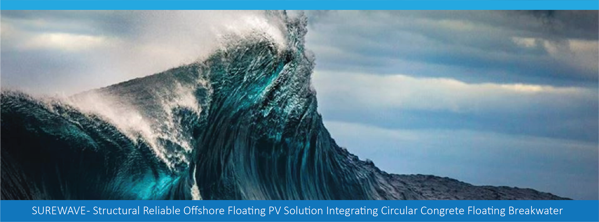
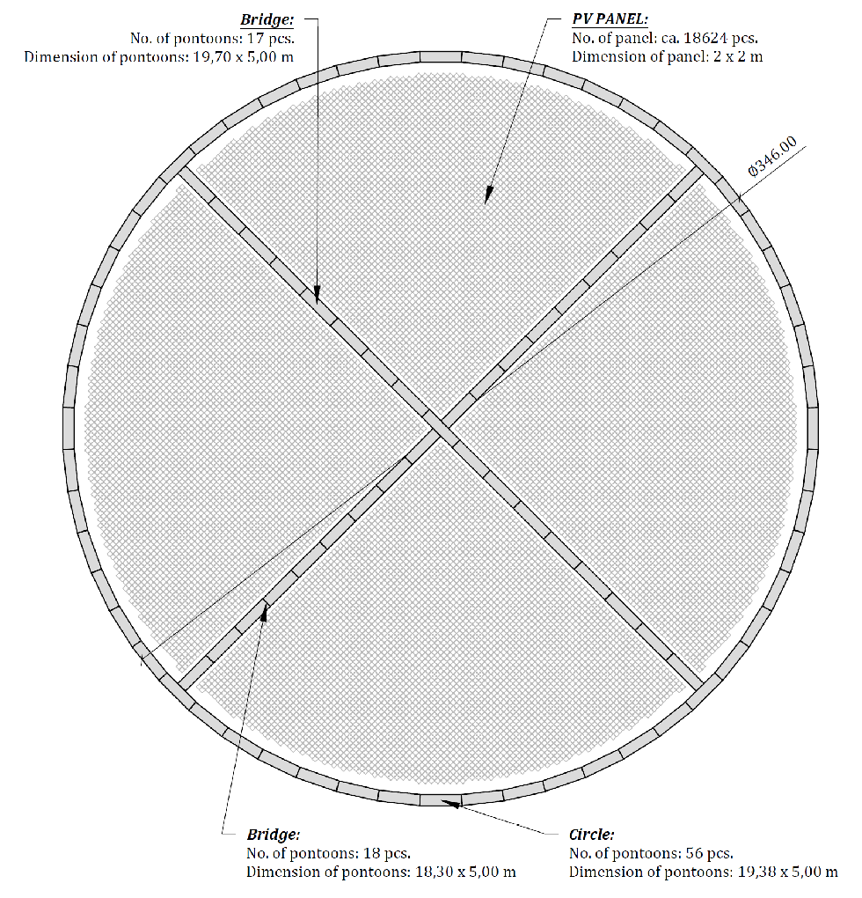
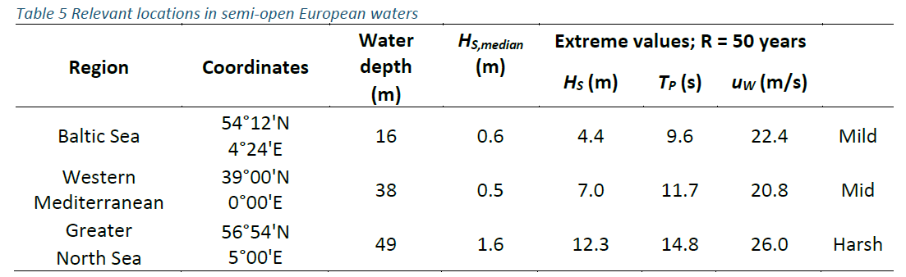

> Source: `D7.4_Economic_Assessment_final.docx` — Document date: 2025-09-05 — Converted: 2026-09-28 via pandoc/pdftotext

---

##### 

**Deliverable number: D7.4**

+-------------------------------------------------------------------------------------------------------------------------------------------------------------------+-------------------------------------------------------------------------------------------------------------------------------------------------------------------+
| #####                                                                                                                                                                                                                                                                                                                                 |
+---------------------------------------------------------------------------------------------------------------------------------------------------------------------------------------------------------------------------------------------------------------------------------------------------------------------------------------+
| ##### {width="7.8719772528433944in" height="2.5908858267716535in"}                                                                                                                                                                                                                                               |
+---------------------------------------------------------------------------------------------------------------------------------------------------------------------------------------------------------------------------------------------------------------------------------------------------------------------------------------+
| ##### SUREWAVE -- Structural Reliable Offshore Floating PV Solution Integrating Circular Concrete Floating Breakwater                                                                                                                                                                                                                 |
+---------------------------------------------------------------------------------------------------------------------------------------------------------------------------------------------------------------------------------------------------------------------------------------------------------------------------------------+
| ##### **Economic Assessment of floating PV solution (SUREWAVE)**                                                                                                                                                                                                                                                                      |
+---------------------------------------------------------------------------------------------------------------------------------------------------------------------------------------------------------------------------------------------------------------------------------------------------------------------------------------+
| #####                                                                                                                                                                                                                                                                                                                                 |
|                                                                                                                                                                                                                                                                                                                                       |
| ##### **Disclaimer:**                                                                                                                                                                                                                                                                                                                 |
|                                                                                                                                                                                                                                                                                                                                       |
| > The SUREWAVE project is Funded by the European Union. Views and opinions expressed are however those of the author(s) only and do not necessarily reflect those of the European Union. Neither the European Union nor European Climate, Infrastructure and Environment Executive Agency (CINEA) can be held responsible for them    |
+---------------------------------------------------------------------------------------------------------------------------------------------------------------------------------------------------------------------------------------------------------------------------------------------------------------------------------------+
| #####                                                                                                                                                                                                                                                                                                                                 |
+-------------------------------------------------------------------------------------------------------------------------------------------------------------------+-------------------------------------------------------------------------------------------------------------------------------------------------------------------+
| ##### The SUREWAVE project has received funding from the European Union\'s Horizon Europe Research and innovation funding programme under GA No. 101083342.       | ##### {width="3.00255249343832in" height="0.6299212598425197in"}                                                                             |
+-------------------------------------------------------------------------------------------------------------------------------------------------------------------+-------------------------------------------------------------------------------------------------------------------------------------------------------------------+

**Deliverable details**

  ---------------------- ----------------------------------------------------
  Work package:          7

  Task:                  7.4

  Document name:         D7.4_Economic_Assessment

  Lead beneficiary:      Sunlit Sea

  Dissemination level:   PU

  Deliverable type:      R

  Due date:              30.05.2025

  Delivery date:         05.09.2025
  ---------------------- ----------------------------------------------------

  -------------- -------------- --------------------------- ------------------
   **version**      **Date**            **Author**           **Comments**[^1]

       1.0         28.04.2025          Eirik Larsen            Final draft

       1.1         15.05.2025          Heiko Keller              Review-1

       1.1         01.08.2025           Jon Samseth              Review-2

       1.2         19.08.2025          Schalk Cloete             Review-3

       2.0         25.08.2025          Eirik Larsen               Final
  -------------- -------------- --------------------------- ------------------

+:------------------------------------+:-----------------------------------------------------------------+
| **Dissemination level**                                                                                |
+-------------------------------------+------------------------------------------------------------------+
| PU                                  | > Public: fully open                                             |
+-------------------------------------+------------------------------------------------------------------+
| SEN                                 | > Sensitive: limited under the conditions of the Grant Agreement |
+-------------------------------------+------------------------------------------------------------------+
| **Deliverable type**                                                                                   |
+-------------------------------------+------------------------------------------------------------------+
| R                                   | > Document, report (excluding the periodic and final reports)    |
+-------------------------------------+------------------------------------------------------------------+
| DEM                                 | > Demonstrator, pilot, prototype, plan designs                   |
+-------------------------------------+------------------------------------------------------------------+
| DEC                                 | > Websites, patents filing, press & media actions, videos, etc.  |
+-------------------------------------+------------------------------------------------------------------+
| OTHER                               | > Software, technical diagram, etc.                              |
+-------------------------------------+------------------------------------------------------------------+

**Executive summary**

This report evaluates the economic and technical feasibility of deploying the SUREWAVE offshore floating photovoltaic (FPV) system in three European regions (Mediterranean, Baltic Sea, North Sea) at multiple scales (2 MW, 10 MW modular, 10 MW full-scale), under base, pessimistic, and optimistic scenarios.

**The report must be seen in conjunction with the economic calculations given in the following spreadsheet:**

[D7.4_surewave_costs.xlsx](https://sintef.sharepoint.com/:x:/r/teams/work-22638/_layouts/15/Doc.aspx?sourcedoc=%7BD1F2C260-9997-4BD3-9211-8AB9DD35952B%7D&file=D7.4_surewave_costs_v2.xlsx)

Key Financial Findings:

Note that the key findings focus primarily on the 10 MW full-scale scenario as 2 MW and 10 MW modular are significantly less economically viable.

- Mediterranean 10 MW Configuration:

  - Net Present Value (NPV): €8.9M

  - Internal Rate of Return (IRR): 10.7%

  - Levelised Cost of Electricity (LCOE): €0.062/kWh

  - Payback: 7--8 years

  - Recommendation: Strongly viable; prioritize for pilot and scale-up.

- Baltic Sea 10 MW Configuration:

  - NPV: €2.1M

  - IRR: 2.2%

  - LCOE: €0.096/kWh

  - Payback: 14--16 years

  - Recommendation: Viable under favourable conditions; second-phase expansion opportunity.

- North Sea 10 MW Configuration:

  - NPV: Negative

  - IRR: Negative

  - LCOE: €0.139/kWh

  - Recommendation: Not viable for stand-alone deployment; suitable for hybrid/offshore demonstration only.

Technical Highlights:

- Structural resilience with marine-grade concrete pontoons.

- Energy loss from wave-induced mismatch controlled to 0.3--1.2%.

- Asset lifetime: 50 years (including mid-life PV module reinstallation).

Strategic Impact:

- Bankability enhanced through modular design, marine spatial efficiency, and potential carbon market participation (€5M lifetime opportunity).

Deployment Recommendations:

1.  Immediate: Launch Mediterranean 10 MW pilot deployment.

2.  Next: Prepare Baltic Sea sites for strategic diversification.

3.  Selective: Use North Sea sites for hybridization and R&D or with appropriate financial support.

4.  Financial Structuring: Integrate grant funding, benchmark against offshore diesel replacement costs, and target green investment mechanisms.

The SUREWAVE Mediterranean 10 MW FPV configuration offers a highly competitive, sustainable, and bankable offshore renewable energy solution, ready for pilot deployment and scalable replication.

**Deliverable Review**

+----------------------------------------------------------------------------------+-----------------+---------------------------------------+-----------------+-----------------+---------------------------------------+-----------------+
|                                                                                  | **Reviewer #1:** Heiko Keller                                             | **Reviewer #2:** Schalk Cloete                                            |
|                                                                                  +-----------------+---------------------------------------+-----------------+-----------------+---------------------------------------+-----------------+
|                                                                                  | **Answer**      | **Comments**                          | **Type\***      | **Answer**      | **Comments**                          | **Type\***      |
+----------------------------------------------------------------------------------+-----------------+---------------------------------------+-----------------+-----------------+---------------------------------------+-----------------+
| 1.  Is the deliverable in accordance with                                                                                                                                                                                                |
+----------------------------------------------------------------------------------+-----------------+---------------------------------------+-----------------+-----------------+---------------------------------------+-----------------+
| (i) The Description of Work?                                                     | ☐ **Yes**       |                                       | ☐ M             | ☐Yes            |                                       | ☐ M             |
|                                                                                  |                 |                                       |                 |                 |                                       |                 |
|                                                                                  | ☐ No            |                                       | ☐ m             | ☐ No            |                                       | ☐ m             |
|                                                                                  |                 |                                       |                 |                 |                                       |                 |
|                                                                                  |                 |                                       | ☐ a             |                 |                                       | ☐ a             |
+----------------------------------------------------------------------------------+-----------------+---------------------------------------+-----------------+-----------------+---------------------------------------+-----------------+
| (ii) The international State of the Art?                                         | ☐ Yes           | *Not applicable for this deliverable* | ☐ M             | ☐ Yes           | *Not applicable for this deliverable* | ☐ M             |
|                                                                                  |                 |                                       |                 |                 |                                       |                 |
|                                                                                  | ☐ No            |                                       | ☐ m             | ☐ No            |                                       | ☐ m             |
|                                                                                  |                 |                                       |                 |                 |                                       |                 |
|                                                                                  |                 |                                       | ☐ a             |                 |                                       | ☐ a             |
+----------------------------------------------------------------------------------+-----------------+---------------------------------------+-----------------+-----------------+---------------------------------------+-----------------+
| 2.  Is the quality of the deliverable in a status                                                                                                                                                                                        |
+----------------------------------------------------------------------------------+-----------------+---------------------------------------+-----------------+-----------------+---------------------------------------+-----------------+
| (i) That allows it to be sent to European Commission?                            | ☐ Yes           |                                       | ☐ M             | ☐ Yes           |                                       | ☐ M             |
|                                                                                  |                 |                                       |                 |                 |                                       |                 |
|                                                                                  | ☐ No            |                                       | ☐ m             | ☐ No            |                                       | ☐ m             |
|                                                                                  |                 |                                       |                 |                 |                                       |                 |
|                                                                                  |                 |                                       | ☐ a             |                 |                                       | ☐ a             |
+----------------------------------------------------------------------------------+-----------------+---------------------------------------+-----------------+-----------------+---------------------------------------+-----------------+
| (ii) That needs improvement of the writing by the originator of the deliverable? | ☐ Yes           |                                       | ☐ M             | ☐ Yes           |                                       | ☐ M             |
|                                                                                  |                 |                                       |                 |                 |                                       |                 |
|                                                                                  | ☐ No            |                                       | ☐ m             | ☐No             |                                       | ☐ m             |
|                                                                                  |                 |                                       |                 |                 |                                       |                 |
|                                                                                  |                 |                                       | ☐ a             |                 |                                       | ☐ a             |
+----------------------------------------------------------------------------------+-----------------+---------------------------------------+-----------------+-----------------+---------------------------------------+-----------------+
| (iii) That need further work by the Partners responsible for the deliverable?    | ☐ Yes           |                                       | ☐ M             | ☐ Yes           |                                       | ☐ M             |
|                                                                                  |                 |                                       |                 |                 |                                       |                 |
|                                                                                  | ☐ No            |                                       | ☐ m             | ☐No             |                                       | ☐ m             |
|                                                                                  |                 |                                       |                 |                 |                                       |                 |
|                                                                                  |                 |                                       | ☐ a             |                 |                                       | ☐ a             |
+----------------------------------------------------------------------------------+-----------------+---------------------------------------+-----------------+-----------------+---------------------------------------+-----------------+

\* Type of comments: M = Major comment; m = minor comment; a = advice

########## Contents {#contents .TOC-Heading}

[1. Introduction [9](#introduction)](#introduction)

[1.1 Summary of Key Financial Results [10](#summary-of-key-financial-results)](#summary-of-key-financial-results)

[1.2 Technical Considerations [10](#technical-considerations)](#technical-considerations)

[1.3 Strategic and Environmental Context [11](#strategic-and-environmental-context)](#strategic-and-environmental-context)

[1.4 Implications for Deployment Strategy [11](#implications-for-deployment-strategy)](#implications-for-deployment-strategy)

[2. Purpose and Context [13](#purpose-and-context)](#purpose-and-context)

[2.1 Role within the SUREWAVE Project [13](#role-within-the-surewave-project)](#role-within-the-surewave-project)

[2.2 Objective and Application [13](#objective-and-application)](#objective-and-application)

[2.3 Relevance to Wider Project Goals [14](#relevance-to-wider-project-goals)](#relevance-to-wider-project-goals)

[3. Site and Technology Description [16](#site-and-technology-description)](#site-and-technology-description)

[3.1 Locations and Scenario Configurations [16](#locations-and-scenario-configurations)](#locations-and-scenario-configurations)

[3.2 System Design and Architecture [17](#system-design-and-architecture)](#system-design-and-architecture)

[3.2.1 Floating Platform [17](#floating-platform)](#floating-platform)

[3.2.2 Electrical Configuration [18](#electrical-configuration)](#electrical-configuration)

[3.3 Site-Specific Constraints [19](#site-specific-constraints)](#site-specific-constraints)

[4. Technical Performance and Risks [21](#technical-performance-and-risks)](#technical-performance-and-risks)

[4.1 Degradation Mechanisms [21](#degradation-mechanisms)](#degradation-mechanisms)

[4.1.1 Potential-Induced Degradation (PID) [21](#potential-induced-degradation-pid)](#potential-induced-degradation-pid)

[4.1.2 Thermal Stress [22](#thermal-stress)](#thermal-stress)

[4.2 Environmental Loads and Marine Exposure [22](#environmental-loads-and-marine-exposure)](#environmental-loads-and-marine-exposure)

[4.2.1 Wave-Induced Electrical Mismatch [22](#wave-induced-electrical-mismatch)](#wave-induced-electrical-mismatch)

[4.2.2 Mooring and Anchoring Fatigue [23](#mooring-and-anchoring-fatigue)](#mooring-and-anchoring-fatigue)

[4.3 Component Lifetime and Reinstallation Considerations [24](#component-lifetime-and-reinstallation-considerations)](#component-lifetime-and-reinstallation-considerations)

[4.3.1 PV Modules and Inverter Systems [24](#pv-modules-and-inverter-systems)](#pv-modules-and-inverter-systems)

[4.3.2 Structural Durability and Asset Integrity [24](#structural-durability-and-asset-integrity)](#structural-durability-and-asset-integrity)

[4.4 Disassembly and End-of-Life Considerations [24](#disassembly-and-end-of-life-considerations)](#disassembly-and-end-of-life-considerations)

[5. Financial Inputs and Assumptions [26](#financial-inputs-and-assumptions)](#financial-inputs-and-assumptions)

[5.1 Discount Rate and Financing Assumptions [26](#discount-rate-and-financing-assumptions)](#discount-rate-and-financing-assumptions)

[5.2 Capital Expenditure (CAPEX) [26](#capital-expenditure-capex)](#capital-expenditure-capex)

[5.3 Operational Expenditure (OPEX) [28](#operational-expenditure-opex)](#operational-expenditure-opex)

[5.4 Reinstallation and Long-Term System Use [28](#reinstallation-and-long-term-system-use)](#reinstallation-and-long-term-system-use)

[5.5 Scenario Modifiers [29](#scenario-modifiers)](#scenario-modifiers)

[6. Energy Production and Revenue [31](#energy-production-and-revenue)](#energy-production-and-revenue)

[6.1 Yield Estimates [31](#yield-estimates)](#yield-estimates)

[6.1.1 Initial Specific Yield [31](#initial-specific-yield)](#initial-specific-yield)

[■ 6.1.2 Annual Degradation [32](#annual-degradation)](#annual-degradation)

[6.1.3 Reinstalled Production (Years 26--50) [32](#reinstalled-production-years-2650)](#reinstalled-production-years-2650)

[6.2 Revenue Streams [33](#revenue-streams)](#revenue-streams)

[6.2.1 Sale Price Assumptions [33](#sale-price-assumptions)](#sale-price-assumptions)

[6.2.2 Reinstallation Phase Revenue (Years 26--50) [34](#reinstallation-phase-revenue-years-2650)](#reinstallation-phase-revenue-years-2650)

[7. Summary of results [35](#summary-of-results)](#summary-of-results)

[7.1 Core Financial Metrics [35](#core-financial-metrics)](#core-financial-metrics)

[7.1.1 Summary: Base Case Results [35](#summary-base-case-results)](#summary-base-case-results)

[7.2 LCOE Composition and Cost Structure [36](#lcoe-composition-and-cost-structure)](#lcoe-composition-and-cost-structure)

[7.3 Payback Time and Return on Investment (ROI) [36](#payback-time-and-return-on-investment-roi)](#payback-time-and-return-on-investment-roi)

[7.4 Sensitivity to Discount Rate [37](#sensitivity-to-discount-rate)](#sensitivity-to-discount-rate)

[7.5 Sensitivity analyses on cable connection and breakwater [38](#sensitivity-analyses-on-cable-connection-and-breakwater)](#sensitivity-analyses-on-cable-connection-and-breakwater)

[8. Comparative and Strategic Evaluation [40](#comparative-and-strategic-evaluation)](#comparative-and-strategic-evaluation)

[8.1 Cross-Technology Benchmarking [40](#cross-technology-benchmarking)](#cross-technology-benchmarking)

[8.1.1 Comparative Performance [40](#comparative-performance)](#comparative-performance)

[8.1.2 Strategic Attributes of Floating Solar [41](#strategic-attributes-of-floating-solar)](#strategic-attributes-of-floating-solar)

[8.1.3 Why offshore PV's cost uplift differs from offshore wind [42](#why-offshore-pvs-cost-uplift-differs-from-offshore-wind)](#why-offshore-pvs-cost-uplift-differs-from-offshore-wind)

[8.1.4 Hybrid Offshore Wind + FPV: system value [42](#hybrid-offshore-wind-fpv-system-value)](#hybrid-offshore-wind-fpv-system-value)

[8.2 Emissions Reduction Potential [42](#emissions-reduction-potential)](#emissions-reduction-potential)

[8.3 Marine Spatial Value [43](#marine-spatial-value)](#marine-spatial-value)

[8.4 Strategic Deployment Roles [43](#strategic-deployment-roles)](#strategic-deployment-roles)

[8.5 Summary [43](#summary)](#summary)

[9. Recommendations and Bankability Considerations [44](#recommendations-and-bankability-considerations)](#recommendations-and-bankability-considerations)

[9.1 Deployment Strategy [44](#deployment-strategy)](#deployment-strategy)

[9.1.1 Prioritise Large-Scale Mediterranean Systems [44](#prioritise-large-scale-mediterranean-systems)](#prioritise-large-scale-mediterranean-systems)

[9.1.2 Consider Baltic Deployments for Strategic Expansion [45](#consider-baltic-deployments-for-strategic-expansion)](#consider-baltic-deployments-for-strategic-expansion)

[9.1.3 Limit North Sea Deployment to Demonstration and Hybrid Applications [45](#limit-north-sea-deployment-to-demonstration-and-hybrid-applications)](#limit-north-sea-deployment-to-demonstration-and-hybrid-applications)

[9.2 Technical and Financial Risk Management [46](#technical-and-financial-risk-management)](#technical-and-financial-risk-management)

[9.3 Financial Structuring Considerations [47](#financial-structuring-considerations)](#financial-structuring-considerations)

[9.4 Pathway to Demonstration and Scale-Up [48](#pathway-to-demonstration-and-scale-up)](#pathway-to-demonstration-and-scale-up)

[9.5 Bankability and Insurance Cost Assumptions [49](#bankability-and-insurance-cost-assumptions)](#bankability-and-insurance-cost-assumptions)

[9.5.1 Expected Cost of Insurance [50](#expected-cost-of-insurance)](#expected-cost-of-insurance)

[Appendices [52](#appendices)](#appendices)

[Appendix A --- Description of Economic Model [52](#appendix-a-description-of-economic-model)](#appendix-a-description-of-economic-model)

[A.1 Overview [52](#a.1-overview)](#a.1-overview)

[A.2 Structure of the Spreadsheet [52](#a.2-structure-of-the-spreadsheet)](#a.2-structure-of-the-spreadsheet)

[A.3 Spreadsheet Parameters [53](#a.3-spreadsheet-parameters)](#a.3-spreadsheet-parameters)

[A.3.1 Sheet: summary [53](#a.3.1-sheet-summary)](#a.3.1-sheet-summary)

[A.3.2 Sheet: in_loc [54](#a.3.2-sheet-in_loc)](#a.3.2-sheet-in_loc)

[A.3.3 Sheet: in_gen [55](#a.3.3-sheet-in_gen)](#a.3.3-sheet-in_gen)

[A.3.4 Sheet: inter_gen [57](#a.3.4-sheet-inter_gen)](#a.3.4-sheet-inter_gen)

[A.3.5 Sheet: out_loc [57](#a.3.5-sheet-out_loc)](#a.3.5-sheet-out_loc)

[A.3.6 Sheet: pontoons [58](#a.3.6-sheet-pontoons)](#a.3.6-sheet-pontoons)

[A.3.7 Sheet: freight [59](#a.3.7-sheet-freight)](#a.3.7-sheet-freight)

[A.3.8 Sheet: harbors [59](#a.3.8-sheet-harbors)](#a.3.8-sheet-harbors)

[A.3.9 Sheet: sens_discounts [59](#a.3.9-sheet-sens_discounts)](#a.3.9-sheet-sens_discounts)

[A.3.10 Sheet: sens_subsea_cable [59](#a.3.10-sheet-sens_subsea_cable)](#a.3.10-sheet-sens_subsea_cable)

[A.3.10 Sheet: sens_pontoons [59](#a.3.10-sheet-sens_pontoons)](#a.3.10-sheet-sens_pontoons)

[A.3.10 Sheet: aggregates [59](#a.3.10-sheet-aggregates)](#a.3.10-sheet-aggregates)

# Introduction

This report presents an economic evaluation of floating photovoltaic (FPV) system configurations developed within the SUREWAVE project. The work contributes directly to two project objectives:

- Objective 4: *Advanced Testing and Validation Frameworks for Offshore FPV*, by ensuring a high level of techno-economic feasibility under offshore conditions while modelling degradation, failure rates, and energy output over system lifetime.

- Objective 8: *High Exploitability*, by validating configurations that achieve cost-effectiveness, operational durability, and low maintenance burden.

The feasibility study covers three selected European maritime regions: the North Sea, the Baltic Sea, and the Mediterranean Sea.

Three system scales are considered: a single 2 MW array, a modular arrangement of 5×2 MW units (10 MW total), and a full-scale 10 MW installation. Each configuration is assessed under base case, pessimistic, and optimistic financial scenarios. The analysis integrates component-level cost modelling, performance degradation modelling, and site-specific technical constraints. Broader strategic and environmental factors are also considered with regards to bankability and is reflected in the proposed discount rate.

The purpose of this report is to provide data-driven support for:

- Location prioritisation,

- System design optimisation,

- Potential scale-up strategies for commercial deployment.

The SUREWAVE floating PV concept combines modular aluminium platforms with an integrated wave attenuation structure formed from circular concrete elements, aiming to deliver offshore renewable energy solutions with high reliability and replicability.

Financial modelling is based on the following key metrics:

- Levelised Cost of Electricity (LCOE),

- Net Present Value (NPV),

- Internal Rate of Return (IRR),

- Payback period.

In addition to financial indicators, the study considers environmental contributions such as land-use avoidance and emissions mitigation potential, within the defined sustainability framework.

## Summary of Key Financial Results

  --------------- --------------- --------- --------- -------------- -----------------
       Site        Configuration   NPV (€)   IRR (%)   LCOE (€/kWh)   Payback (years)

   Mediterranean     1 x 10 MW      8.9M      10.6        0.062              8

      Baltic         1 x 10 MW      2.11M     2.21        0.096             16

     North Sea       1 x 10 MW     --2.91M   --3.11       0.139             --
  --------------- --------------- --------- --------- -------------- -----------------

The results, based on a reference electricity sale price of €0.12/kWh, which was the target price indicated in the SUREWAVE planning and application process, indicate that the Mediterranean 10 MW configuration delivers the most favourable financial performance across all assessed metrics.

The Baltic Sea 10 MW scenario is marginally viable under baseline assumptions, reflecting lower solar resource and moderate installation costs.

Smaller-scale configurations (2 MW) across all sites show limited economic potential without additional support mechanisms.

Under the €0.12/kWh assumption, no configuration assessed for the North Sea achieves financial viability. However, given the harsher offshore environment and potentially higher marginal cost of alternative offshore generation (e.g., diesel or hybridised platforms), higher effective electricity pricing could be applicable in North Sea contexts. This issue is explored further in subsequent sections of the report.

A key driver of these results is the finding that cable-exclusive non-panel costs for offshore PV are similar to that of onshore PV, in contrast to experience from offshore wind, where cable-exclusive non-turbine costs are \~3x higher than onshore wind for shallow-water fixed-bottom installations and \~5x higher for floating installations. Although the material mass required per kW of installed capacity is similar for floating offshore wind and offshore PV, avoidance of this large offshore installation premium faced by wind power is attributed to the modularity and relative simplicity of the offshore PV structures.

## Technical Considerations

The SUREWAVE system architecture is designed to enhance mechanical stability and electrical performance under offshore conditions.

Key technical characteristics include:

- Wave attenuation structures that reduce platform motion and structural loading, contributing to reduced wave-induced mismatch losses (estimated at 0.3--1.2% of annual output).

- Low degradation rates associated with PID (potential-induced degradation) and thermal stress, modelled at rates comparable to land-based high-quality PV deployments.

- Marine-grade aluminium frames and prefabricated string assemblies that support rapid deployment, reduced maintenance, and long operational lifetimes.

Structural modelling confirms that the floating systems are dimensioned to accommodate expected wave regimes in selected deployment regions, while preserving energy yield stability over time.

## Strategic and Environmental Context

Offshore FPV deployment addresses broader strategic and environmental objectives beyond direct financial returns. Floating systems:

- Reduce land-use conflicts, enabling solar deployment without potential competition with agriculture, urbanisation, or conservation needs.

- Support decarbonisation targets by contributing additional renewable capacity in regions where onshore expansion is constrained.

Moreover, offshore deployment offers opportunities for synergies with existing marine infrastructure (e.g., ports, oil and gas platforms, offshore substations) and supports diversification of the renewable energy portfolio into spatially unconstrained zones.

## Implications for Deployment Strategy

Based on the techno-economic assessment:

- Mediterranean 10 MW configurations are recommended as the primary target for pilot deployment and initial commercial scale-up, offering the strongest financial and technical performance.

- Baltic 10 MW deployments may serve as transitional or second-phase opportunities, particularly for expanding into northern European markets.

- North Sea deployments, under the current assumptions, are not recommended for stand-alone commercial development. However, they may remain valuable for targeted R&D projects or co-location strategies that leverage existing offshore infrastructure.

Smaller-scale 2 MW installations are primarily suited for testbeds, demonstration activities, or niche applications where specific non-financial drivers justify deployment.

This deliverable supports project-level decision-making for deployment pathways and contributes to external stakeholder communication regarding the SUREWAVE concept's technical, and financial credentials.

# Purpose and Context

## 2.1 Role within the SUREWAVE Project

This deliverable constitutes the primary output of Task 7.4 -- Economic Assessment, under Work Package 7 -- Integrated Sustainability Assessment.

Its purpose is to evaluate the techno-economic feasibility of the SUREWAVE floating photovoltaic (FPV) system across different deployment scales and maritime contexts, supporting the project's integrated sustainability objectives.

While developed within WP7, the findings are relevant for multiple work packages:

- WP6 -- Technical Validation of the Floating PV Solution, where they inform the prioritisation of deployment scenarios for fatigue testing and long-term component validation (Task 6.3),

- WP8 -- Dissemination, Communication, Exploitation, and Societal Engagement, where they underpin outreach to external stakeholders, investors, and policymakers.

By linking techno-economic analysis to strategic deployment choices, this report supports the translation of the SUREWAVE concept from design to real-world demonstration and commercialisation.

## 2.2 Objective and Application

The objective of this report is to determine the economic viability of deploying the SUREWAVE system offshore, based on quantified financial metrics and consistent modelling assumptions.

The analysis focuses on:

- Levelised Cost of Electricity (LCOE),

- Internal Rate of Return (IRR),

- Net Present Value (NPV),

- Payback period, under different technical, regional, and financial scenarios.

The methodology integrates:

- Component-level cost structures,

- Site-specific solar resource and environmental data,

- Degradation and maintenance assumptions across the 50-year operational horizon,

- Sensitivity analyses to address key uncertainties such as energy yield, discount rate, and reinstallation costs.

The use cases examined include:

- Grid-connected offshore FPV arrays located near coastal substations,

- Hybridisation with offshore infrastructure such as oil and gas platforms or offshore wind facilities,

- Standalone systems supplying energy to remote microgrids,

- Replacement of offshore diesel generation, addressing industrial sectors where full grid connection is not viable.

These deployment pathways reflect both current technological readiness and emerging market opportunities, providing a practical foundation for investment planning and site selection within SUREWAVE's broader roadmap.

## 2.3 Relevance to Wider Project Goals

The economic evaluation serves as a critical pillar within SUREWAVE's integrated sustainability assessment. By clarifying financial feasibility across use cases and locations, it supports:

- Sustainability analysis (WP7) which links economic outcomes to environmental and social indicators,

- Engineering development (WP3 and WP6) by informing technical specifications needed for cost-efficient deployment,

- Strategic dissemination and exploitation (WP8) by providing quantitative evidence to support business case development and policy engagement.

The analysis follows methodological principles established in the D7.1 deliverable (*Interim Report on Sustainability Definitions and Settings*), ensuring compatibility with SUREWAVE's overall lifecycle and sustainability evaluation framework.

Thus, the deliverable serves both as an internal decision-support tool and an external-facing validation of the SUREWAVE floating PV concept's viability.

#   Site and Technology Description

This chapter outlines the geographical settings, system configurations, and structural variants evaluated in the techno-economic analysis of the SUREWAVE floating photovoltaic (FPV) system. It is in accordance with the SUREWAVE system description with the following exceptions:

Panels are replaced due to the change of hinge systems. This affects the number of panels, the layout, the DC cable length, and the total power of the system.

Costs are calculated from the cheapest wavebreaker alternative, which is regular concrete wavebreakers.

The assessment spans three distinct European marine environments, reflecting a representative range of climatic, hydrodynamic, and infrastructural conditions relevant for offshore FPV deployment.

## 3.1 Locations and Scenario Configurations

Three sites were selected for modelling:

- Greater North Sea: Characterised by frequent storms, high wave energy, and cold sea temperatures, requiring enhanced structural resilience and robust maintenance strategies.

- Baltic Sea: Featuring moderate wave climates and cold winters with potential ice formation risks but benefitting from proximity to industrial ports and floating infrastructure.

- Western Mediterranean: Offering consistently calm sea states, high solar resource availability, and excellent proximity to port and grid infrastructure, presenting the most favourable deployment conditions.

At each site, three system sizes are evaluated:

- 2 MW installation representing small-scale demonstration,

- 5 × 2 MW modular system (total 10 MW) offering flexible scaling. This is also referred to as split unit.

- Single 10 MW unit optimised for full economies of scale. This is also referred as singe unit

Each size and location combination is assessed under three financial scenarios (base case, pessimistic, optimistic), reflecting variations in cost structure, yield, and discount rate assumptions.

In total, 27 site-configuration permutations were analysed across a 50-year operational horizon. PV module reinstallation is modelled at year 25, allowing reuse of structural infrastructure and continued energy generation in the final project phase.

## 3.2 System Design and Architecture

The SUREWAVE system architecture integrates floating photovoltaic platforms with perimeter wave attenuation structures.

The modular approach enables flexibility in system sizing, phased deployment, and maintenance operations while ensuring mechanical stability in offshore conditions.

{width="3.28125in" height="3.40625in"}

*Global geometry of the SUREWAVE FPV concept in terms of the single 10 ha design (taken from D3.3)*

### 3.2.1 Floating Platform

The primary floating structures are prefabricated concrete pontoons reinforced with steel rebar and partially filled with expanded polystyrene (EPS) foam to ensure buoyancy redundancy.

Economic modelling demonstrates that conventional/EPS/reinforcement concrete pontoons are the cost-optimal design based on manufacturing, material, and installation costs (ref "pontoons" sheet of "D7.4_surewave_costs.xlsx").

Four structural variants were evaluated:

  -------------- --------------------------------------------------------------
     Variant                              Description

   Conventional           Standard concrete construction with EPS core

      Hybrid      Mixed material layering (concrete and lightweight materials)

       LWAC                      Lightweight aggregate concrete

       HPC                         High-performance concrete
  -------------- --------------------------------------------------------------

Each variant was modelled using standardised pontoon geometries referred to as *Bridge1830* and *Bridge1968*, pre-tested for mechanical compatibility with offshore FPV applications.

Each pontoon module incorporates a perimeter breakwater element designed to attenuate incoming wave energy, thereby reducing tilt, vibrational loading, and associated dynamic stresses on the PV arrays and electrical connections.

Costs for the "Breakwater" component are representative for the other types, and these were the key findings:

  -------------- -------------- ------------ ----------------
      Design      Installation    Pontoon     Total Cost (€)

   Conventional       10MW       Breakwater     1,341,740

      Hybrid          10MW       Breakwater     1,403,286

       LWAC           10MW       Breakwater     1,513,384

       HPC            10MW       Breakwater     2,146,102
  -------------- -------------- ------------ ----------------

### 3.2.2 Electrical Configuration

The photovoltaic arrays use commercial crystalline silicon modules rated at approximately 730 Wp per panel.\
This higher power class reflects industry trends toward larger-format offshore-suited modules.

Electrical system assumptions include:

- String layouts of 11--19 modules per string depending on system variant,

- Small-scale installations use string inverters; larger systems use centralised inverter configurations,

- Standard DC cabling losses (2--3%) included,

- Inverter replacement cycles modelled over the project lifetime.

Each FPV system is assumed to connect to a floating substation located approximately 300 meters from the array, not to land-based infrastructure.

This approach reflects integration with existing offshore assets (e.g., floating wind farms, oil and gas platforms) and avoids long-distance submarine cabling costs.

Sheet "*out_loc"* in the attached spreadsheet confirms that shore-based submarine cable costs are excluded from the base CAPEX models.

Medium-voltage cabling to the floating substation is dimensioned accordingly for each system size.

## 3.3 Site-Specific Constraints

Each selected site introduces distinct physical and logistical constraints relevant to design, installation, and long-term operation. These are defined in detail in Deliverable D2.1 and reflected in the techno-economic modelling conducted for this report.

{width="6.299660979877515in" height="1.9305555555555556in"}

- North Sea deployments face the most demanding marine environment, with high wave loading and extended periods of poor installability. Seasonal weather windows for offshore works are narrower compared to the other regions, which limits scheduling flexibility. Structural elements---such as pontoons and breakwater connections---must account for enhanced fatigue resistance and operational robustness. Inspection frequencies are therefore assumed to be higher in this region.

- Baltic Sea installations benefit from milder conditions throughout much of the year. While winter icing must be considered in mooring design, the wave environment is generally moderate. Installation windows are broader than in the North Sea, and wave data shows that most conditions remain within acceptable ranges for both installation and operation. When comparing overall exposure, the Baltic and Mediterranean seas show similar wave occurrence profiles.

- Mediterranean Sea sites offer the most favourable environment for floating PV deployment. Wave occurrence analysis shows that over 90% of waves are below one meter, and wave periods are generally long enough to be considered non-critical. Although larger waves can occur, the overall sea state is comparable to the Baltic. Installability is generally favourable year-round, and proximity to shore simplifies logistics and shortens cable runs.

These site-specific constraints are explicitly integrated into the cost and performance models through:

- Adjusted freight and installation logistics,

- Vessel and crane requirements,

- Pontoon structural loading,

- OPEX adjustments based on maintenance exposure and inspection regimes.

This approach ensures that the techno-economic results reflect realistic, site-adapted deployment conditions. It also supports policy and investment decisions by accounting for practical implementation risks across the three maritime zones.

Note: All modelling is based on current technology readiness levels. No assumptions are made about future breakthroughs. Yield calculations incorporate location-specific irradiance data and adjusted degradation rates based on marine exposure scenarios.

# Technical Performance and Risks

The operational reliability of offshore floating photovoltaic (FPV) systems depends on their ability to maintain mechanical stability and electrical performance under long-term marine exposure.

This chapter outlines the degradation mechanisms, environmental loading risks, and component lifetime assumptions applied in the SUREWAVE techno-economic analysis.

The findings are grounded in the system designs described in Chapter 3 and directly inform the sustainability modelling in Work Package 7.

## 4.1 Degradation Mechanisms

### 4.1.1 Potential-Induced Degradation (PID)

Potential-induced degradation (PID) is a known reliability risk for crystalline silicon PV modules operating in humid, saline, and high-voltage environments. It arises from leakage currents induced by voltage differentials across module surfaces, particularly when salt mist or moisture are present.

Degradation rates are size-dependent, due to cumulative string voltages:

  ------------- --------------------------------
   System Size   Estimated PID Degradation Rate

      2 MW            0.05--0.1% per year

      10 MW            0.1--0.2% per year
  ------------- --------------------------------

Mitigation measures integrated into the SUREWAVE design include:

- Selection of PID-resistant module technologies (e.g., n-type, glass-glass encapsulation),

- Grounding configurations that minimise potential differences,

- Optional PID recovery procedures (e.g., nighttime reverse biasing).

These assumptions reflect realistic operational expectations for offshore marine environments.

### 4.1.2 Thermal Stress

While proximity to the water surface supports passive convective cooling, large-scale FPV arrays may experience mild thermal stress due to restricted airflow in densely packed interior sections.

Identified degradation effects include:

- Encapsulant discoloration (e.g., EVA yellowing),

- Solder joint fatigue,

- Accelerated chemical breakdown of materials.

Thermal degradation impacts by system size:

  --------------- ---------------------------------
    System Size         Thermal Stress Impact

       2 MW                  Negligible

       10 MW       0.05--0.1% degradation per year
  --------------- ---------------------------------

Design mitigations include:

- Maintaining spacing between strings to enhance ventilation,

- Use of reflective float materials to reduce thermal absorption,

- Avoidance of overly dense core layouts.

These strategies aim to preserve module performance over extended offshore deployment periods.

## 4.2 Environmental Loads and Marine Exposure

### 4.2.1 Wave-Induced Electrical Mismatch

Wave-induced tilting introduces angular misalignments across PV strings, leading to electrical mismatch losses both within and between strings.

Mismatch loss estimates:

  ------------- ------------------------------------
   System Size   Estimated Wave-Induced Energy Loss

      2 MW                   0.3--0.7%

      10 MW                  0.5--1.2%
  ------------- ------------------------------------

(Assuming significant wave heights of 0.5--1.5 m.)

Planned mitigation measures include:

- Distributed maximum power point tracking (MPPT) at string level,

- Optimised array geometries aligned with prevailing wave directions,

- Integration of directional damping through perimeter breakwater design.

The SUREWAVE structural concept specifically addresses dynamic load attenuation to minimise mismatch-induced energy losses.

### 4.2.2 Mooring and Anchoring Fatigue

Anchoring and mooring systems are critical for long-term platform stability.

Mechanical stress arises from wave loading, wind forces, and storm events, particularly in more demanding environments such as the North Sea. In contrast, Baltic and Mediterranean sites experience more moderate marine conditions, as discussed in Section 3.3.

SUREWAVE fatigue mitigation measures include:

- Structural design with safety margins dimensioned for a 50-year project life,

- Redundant mooring points and low-drag anchoring geometries,

- Integrated access platforms to support scheduled inspection and maintenance.

Higher inspection frequencies are assumed for North Sea deployments only, reflecting increased mechanical loading and reduced installability windows. Baltic and Mediterranean systems are treated with comparable inspection assumptions due to their similar wave occurrence profiles.

## 4.3 Component Lifetime and Reinstallation Considerations

### 4.3.1 PV Modules and Inverter Systems

- PV modules are modelled with an operational lifetime of 25 years under offshore conditions, after which full reinstallation of the generation layer is scheduled. Structural and electrical infrastructures are reused wherever feasible, minimising CAPEX in the reinstallation phase.

- Inverters are modelled with replacement cycles of 12--15 years, but associated costs are integrated into the initial CAPEX rather than treated as a recurring operational expense.

These lifetime assumptions are consistently applied across the financial modelling and the sustainability assessment in Work Package 7.

### 4.3.2 Structural Durability and Asset Integrity

The floating pontoons and perimeter breakwater structures are dimensioned for a 50-year service life under conservative assumptions, supporting two full generations of PV modules within the system lifecycle.

Key structural durability features include:

- Use of regular marine-grade concrete (not lightweight aggregate concrete), as selected based on CAPEX optimisation analysis (ref sheet "pontoons" in the spreadsheet),

- EPS foam cores providing buoyancy redundancy,

- Passivated steel reinforcement dimensioned to resist corrosion over extended marine exposure.

Although reinforcement and flotation materials contribute significantly to initial CAPEX, they are justified by low expected maintenance costs and extended infrastructure reusability.

The durability of the structural elements supports SUREWAVE's broader sustainability objectives, including circularity, lifecycle cost reduction, and minimisation of offshore intervention requirements.

## 4.4 Disassembly and End-of-Life Considerations

The SUREWAVE system includes planned disassembly activities aligned with the lifetime of its major components:

- Solar PV system disassembly and reinstallation (Year 25):\
  After 25 years of operation, photovoltaic modules are removed and replaced. The disassembly and reinstallation costs for the PV layer are already included in the financial model, amounting to approximately €1.22 million for a typical 10 MW Mediterranean system.

- Pontoon and breakwater structure disassembly (Year 50):\
  After 50 years, the pontoons and associated structural elements are decommissioned. The disassembly methods are expected to mirror installation (marine crane handling, towing), and the nominal cost is assumed comparable to initial installation costs, approximately €798,000 for a 10 MW system.

However, because this structural disassembly occurs after 50 years, the financial impact is negligible:

- Discounted at 8.5%, the present value of €798,000 after 50 years is approximately €10,700.

- This is less than 0.1% of the initial CAPEX and has no material influence on NPV, IRR, or LCOE outcomes.

Accordingly, pontoon disassembly costs are conservatively excluded from the economic model. Future project phases should define detailed recycling or reuse strategies for concrete and metal components to maximise end-of-life sustainability.

# Financial Inputs and Assumptions

This chapter defines the financial modelling parameters underpinning the techno-economic assessment of the SUREWAVE floating PV system across different scales, sites, and deployment scenarios.

The assumptions presented establish the boundary conditions for calculating economic indicators and ensure internal consistency with the integrated sustainability framework in Work Package 7.

The modelling adopts a full 50-year project horizon, consistent with the extended structural design life of the SUREWAVE platform, and accounts for capital expenditures, operational expenditures, degradation effects, and major component replacements.

Scenario variation reflects uncertainties relevant to early-stage offshore renewable deployments.

## 5.1 Discount Rate and Financing Assumptions

The applied discount rate reflects private-sector cost of capital for offshore energy investments without public guarantees.

  --------------- -------------------
     Scenario      Discount Rate (%)

     Base Case           8.50

    Pessimistic          8.84

    Optimistic           8.16
  --------------- -------------------

For reference, land-based utility PV projects supported by government schemes typically assume lower discount rates (5--6%).

Scenario sensitivity to discount rates is explicitly tested to evaluate financial exposure to capital cost dynamics.

## 5.2 Capital Expenditure (CAPEX)

CAPEX excludes MV/subsea export cable (treated separately) and site-specific grid interconnection. Values reflect a nearshore Mediterranean 10 MW reference with breakwater load attenuation and standardised marine logistics. Comparative numbers in Chapter 8 are contextual ranges, not like-for-like bottom-up models.

Capital expenditure is calculated per installed kilowatt-peak (kWp) and disaggregated into key component categories. Costs are specific to site conditions, system scale, and logistics, and are based on a nominal installed capacity of 10,375 kWp for the 10 MW Mediterranean Sea configuration.

  ------------------------------ ---------------- --------
            Component             Total Cost (€)   €/kWp

            PV Modules              5,187,380       400

       Pontoon + Breakwater         2,171,034      209.26

       Anchoring & Mooring           208,650       20.11

   Installation (incl. Freight)     1,624,000      156.53

   Electrical Balance of System      144,596       13.94

      Total (excl. MV Cable)        9,335,660      899.83
  ------------------------------ ---------------- --------

The PV modules are priced at €400/kWp, including shipping and mounting. Pontoon and breakwater costs, which benefit from economies of scale, amount to €209/kWp. Anchoring and mooring components represent a minor share of CAPEX at \~€20/kWp. Installation costs, including transport and offshore handling, total €156/kWp.

The electrical balance of system (including DC cabling and string connectors) is €13.94/kWp. The submarine cable is not included in this CAPEX summary, as it is calculated separately for each location and excluded from the core economic model due to its variability and case-specific applicability.

These values serve as the baseline inputs for lifecycle modelling and financial scenario analysis. Rather than relying on abstract benchmarks or literature averages, the cost figures are grounded in direct experience from floating PV project development activities and the information obtained through the Stakeholder Advisory Board. They reflect procurement negotiations, installation logistics, and component-level engineering considerations encountered in real-world deployments. All values correspond to the "out_loc" and "in_loc" sheets of the economic model spreadsheet, where they are calibrated to the project's target configuration.

Compared to offshore wind, which comes with a premium cost from tall/heavy rotating machinery, deep foundations, heavy-lift vessels, long offshore campaigns, and complex O&M, FPV has lower mass/height, prefabricated modules, smaller vessels, shorter repeated installs, and breakwater-mediated loads, which together contain non-PV CAPEX. Due to these factors, floating offshore wind with a similar power rating has non-turbine CAPEX roughly and order of magnitude higher than the non-PV CAPEX estimated here, even though the mass of materials required is similar. The base case is nearshore or close to offshore substations, with short cable runs (export cable excluded), further reducing offshore adders.

## 5.3 Operational Expenditure (OPEX)

Operational expenditure (OPEX) is modelled on an annual per-kilowatt-peak basis (€/kWp/year), covering:

- Preventive and corrective maintenance,

- Scheduled inspections and repairs,

- SCADA (Supervisory Control and Data Acquisition) and control system operation --- a centralized system for monitoring and managing real-time data, alarms, and operational status of PV arrays and electrical components,

- Inverter replacement, treated through CAPEX accounting.

O&M cost assumptions for main system configurations:

  --------------- ----------------------- ----------------------------------------------------------
   Configuration   O&M Cost (€/kWp/year)                            Notes

       n_10                20.0               High wave loading, challenging access (North Sea)

       b_10                12.0            Moderate climate, manageable offshore logistics (Baltic)
  --------------- ----------------------- ----------------------------------------------------------

These values represent conservative estimates based on current marine O&M practices, without assuming breakthroughs from digitalisation, robotics, or remote intervention technologies.

## 5.4 Reinstallation and Long-Term System Use

At year 25, full PV module reinstallation is scheduled:

  ----------------------------------- ----------------------------------------------------------------
                Aspect                                           Assumption

          Reinstallation Cost                 €137,000 to €800,000, depending on configuration

   Energy Output Post-Reinstallation   Equivalent to new modules, adjusted for site degradation rates

           Structural Reuse             Breakwaters, pontoons, mooring systems, cabling are retained

          O&M (Years 26--50)                Modelled at 10--15% reduction from initial O&M phase
  ----------------------------------- ----------------------------------------------------------------

By modelling reinstallation, the financial and environmental value of the SUREWAVE platform's long-life structural design is fully captured. The seemingly low reinstallation cost reflects its discounted present value: at an 8.5% discount rate over 25 years, future expenditures have a substantially reduced impact on today's financial model. This ensures realistic treatment of long-term reinvestment without overstating its economic burden.

## 5.5 Scenario Modifiers

Scenario-based adjustments address uncertainties in key parameters:

  --------------------- --------------- ------------- ------------
        Parameter          Base Case     Pessimistic   Optimistic

      Discount Rate          8.5%           8.84%        8.16%

   PV Degradation Rate     0.6%/year      1.5%/year    0.3%/year

    Installation Cost    Site-specific    +15--25%     --10--15%

   Reinstallation Cost     Included         +25%         --15%

           O&M           Site-specific      +20%         --15%

      Energy Yield       Site-specific      --10%         +5%
  --------------------- --------------- ------------- ------------

These modifiers ensure robust financial evaluation across a plausible range of technical and market conditions, aligned with sustainability impact assessment methodologies.

# Energy Production and Revenue

This chapter defines the assumptions and calculations used to estimate annual energy yield, lifetime electricity production, and associated revenue streams for SUREWAVE system configurations.

The analysis incorporates site-specific solar resource conditions, system-level loss factors, degradation mechanisms, and reinstallation scenarios across a full **50-year** project lifetime.

## 6.1 Yield Estimates

### 6.1.1 Initial Specific Yield

Initial site-specific energy yields are assigned based on project data inputs (ref sheet "in_gen" in the spreadsheet):

  --------------- ---------------------------------- ------------------------------------------------------
     **Site**      **Initial Yield (kWh/kWp/year)**                        **Notes**

     North Sea                   898                  Low irradiance, high cloud cover, atmospheric losses

    Baltic Sea                   927                  Moderate irradiance, significant seasonal variation

   Mediterranean                 1306                   High irradiance, low tilt loss, minimal shading
  --------------- ---------------------------------- ------------------------------------------------------

These raw yield values are adjusted to account for:

- **Wave-induced mismatch losses**: 0.3--1.2% depending on configuration and sea state,

- **DC and inverter losses**: standard assumption of 2--3%,

- **Operational downtime**: varying with site accessibility (minimal for Mediterranean, higher for North Sea).

Adjusted net energy yields are used as the basis for revenue and LCOE calculations.

### 6.1.2 Annual Degradation

Progressive system degradation is modelled over the full 50-year project horizon.\
Degradation rates are differentiated by configuration size and financial scenario:

  ------------------- ----------------------------- --------------------
   **Configuration**   **Degradation Rate (Base)**   **Scenario Range**

     2 MW Systems               0.6%/year              0.3--1.5%/year

     10 MW Systems              0.7%/year              0.4--1.6%/year
  ------------------- ----------------------------- --------------------

Higher degradation rates in 10 MW systems reflect:

- Elevated system voltages increasing PID susceptibility,

- Reduced convective cooling in larger floating arrays leading to mild thermal stresses.

Degradation assumptions include the combined effects of partial PID, thermal fatigue, mechanical loading, and solder joint deterioration.

### 6.1.3 Reinstalled Production (Years 26--50)

At the end of year 25, full PV module reinstallation is assumed.

For years 26--50:

- Energy output is modelled as equivalent to that of a new system,

- First-year performance degradation effects are reset,

- Annual degradation resumes according to the scenario-specific degradation rate,

- Reused infrastructure (pontoons, breakwaters, anchoring systems, cabling) supports cost-effective continued operation,

- No significant revenue downtime is assumed during the reinstallation period (assumed to occur during a low-yield season).

This modelling approach reflects the long-term asset strategy designed into the SUREWAVE system architecture.

## 6.2 Revenue Streams

### 6.2.1 Sale Price Assumptions

All revenue calculations are based on a fixed electricity sale price of **€0.12/kWh**, as defined in sheets "in_gen" under "solar_energy_target_price".

This price is not derived from current market rates but originates from the target value committed in the project's original grant application, reflecting the expected competitiveness of offshore solar energy in the medium term. It aligns with indicative regional wholesale electricity prices and long-term renewable integration goals in EU coastal grids.

No separate diesel substitution pricing is applied in the base-case modelling, as all configurations assume grid-based electricity valuation.

This consistent pricing approach provides a uniform financial baseline for evaluating:

- Net Present Value (NPV),

- Internal Rate of Return (IRR),

- Levelised Cost of Electricity (LCOE),

- Payback time.

Using a common electricity price across scenarios ensures comparability of financial viability between sites and system scales.

While a base electricity sale price of €0.12/kWh is assumed consistently throughout the financial modeling, real-world electricity prices are subject to fluctuation. Sensitivity analysis indicates that project viability remains robust under moderate price variations:

- A 10% decrease in electricity price (€0.108/kWh) would reduce NPV by approximately 10%.

- A 10% increase (€0.132/kWh) would increase NPV by approximately 10%.

Because electricity revenues linearly scale with the sale price, the Mediterranean 10 MW configuration remains financially viable even under adverse energy pricing scenarios. North Sea projects, however, remain unviable under all tested price variations without co-location or targeted support.

### 6.2.2 Reinstallation Phase Revenue (Years 26--50)

During the reinstallation phase (years 26--50):

- Revenue generation continues at near-initial levels after module replacement,

- OPEX is slightly reduced (10--15% lower than years 1--25), reflecting retained infrastructure,

- No reinstallation downtime is assumed to significantly impact annual production.

Financial modelling confirms that the second 25-year production period yields substantial net revenues, especially in Mediterranean deployments where initial yield levels are high and OPEX is low.

In optimal cases (e.g., Mediterranean 10 MW configuration), revenues from the reinstallation phase approach or exceed 90% of the revenues generated during the initial 25 years.

# Summary of results

This chapter presents the financial performance outcomes for the SUREWAVE floating PV system across representative configurations, based on the modelling assumptions outlined in Chapters 5 and 6.

Each system configuration has been evaluated under base case, pessimistic, and optimistic scenarios to reflect plausible uncertainties in capital cost, degradation rates, operational expenditure, and energy yield.

The financial assessment adopts a full 50-year project lifetime, including mid-life PV module reinstallation and reuse of structural infrastructure.

## 7.1 Core Financial Metrics

The following key indicators are used:

- Net Present Value (NPV): Present value of net cashflows over the project horizon,

- Internal Rate of Return (IRR): Discount rate yielding NPV = 0,

- Levelised Cost of Electricity (LCOE): Average lifecycle cost per kWh produced,

- Payback Period: Years to reach cumulative positive cashflow,

- Return on Investment (ROI): Net profit relative to capital investment.

### 7.1.1 Summary: Base Case Results

  ------------------------- ------------------- --------------- -------------- --------------- ---------
        Configuration             NPV (€)           IRR (%)      LCOE (€/kWh)   Payback (yrs)   ROI (%)

   n_10 (North Sea, 10 MW)       Negative          Negative         0.139            --           --

    b_10 (Baltic, 10 MW)     Positive (\~2.1M)    Low (\~2.2)       0.096            16          21.6

     m_10 (Med., 10 MW)       Strong (\~8.9M)    High (\~10.7)      0.062             8          94.0
  ------------------------- ------------------- --------------- -------------- --------------- ---------

Observations:

- n_10: North Sea deployments are not financially viable under base assumptions. High CAPEX and low yields result in negative NPV and IRR.

- b_10: Baltic deployments show marginal viability with long payback periods and low IRR, highly sensitive to financing conditions.

- m_10: Mediterranean deployments deliver strong financial performance, approaching commercial grid parity.

## 7.2 LCOE Composition and Cost Structure

The LCOE figures result from a full discounted cashflow model, incorporating CAPEX at commissioning, annual O&M expenditures, and module reinstallation at year 25. CAPEX remains the dominant contributor to LCOE, followed by discounted O&M and minor contributions from reinstallation costs.

Key points:

- CAPEX remains the dominant contributor to total LCOE across all configurations.

- O&M costs are lower in Mediterranean deployments due to favourable environmental conditions.

- Reinstallation costs add approximately €0.004--0.008/kWh, demonstrating the benefit of long-life structural components.

## 7.3 Payback Time and Return on Investment (ROI)

  --------------- --------------- ----------
   Configuration   Payback (yrs)   ROI (%)

       n_10             --            --

       b_10           14--16        20--34

       m_10            7--8        90--100+
  --------------- --------------- ----------

Interpretation:

- m_10 demonstrates rapid payback and high ROI, indicating strong investment viability.

- b_10 is feasible under favourable assumptions but remains sensitive to small shifts in cost or yield.

- n_10 does not achieve positive payback within the project horizon under current assumptions.

## 7.4 Sensitivity to Discount Rate

A detailed NPV sensitivity analysis was performed using discount rates from 2% to 10%, as provided in updated modelling.

  ------------------- ---------------- ---------------- ----------------
   Discount Rate (%)   NPV (n_10) (€)   NPV (b_10) (€)   NPV (m_10) (€)

           2             12,137,414       20,258,428       38,637,389

           3             7,822,413        15,049,556       30,114,367

           4             4,613,657        11,170,120       23,754,927

           5             2,180,513        8,228,054        18,929,212

           6              297,148         5,954,065        15,202,204

           7            --1,191,398       4,162,220        12,271,742

           8            --2,392,101       2,723,298        9,926,501

           9            --3,379,376       1,546,776        8,017,486

          10            --4,205,477        568,638         6,438,652
  ------------------- ---------------- ---------------- ----------------

Key findings:

- North Sea 10 MW remains financially non-viable even at discount rates as low as 2%.

- Barents Sea 10 MW becomes strongly viable (NPV \> €10M) at discount rates below 4%.

- Mediterranean Sea 10 MW is consistently robust across all discount rates considered, reinforcing its bankability.

## 7.5 Sensitivity analyses on cable connection and breakwater

Two targeted sensitivity analyses were conducted to evaluate how specific infrastructure choices affect the financial performance of floating solar deployments: (1) the type and distance of grid connection (subsea vs. floating cable), and (2) the material and structural design of breakwaters.

7.5.1 Subsea Cable vs. Floating Cable to Nearby Substation

Replacing a short floating cable connection (≈300 m) with a full-length submarine cable to shore significantly increases capital costs and undermines financial viability---particularly in sites farther from shore. This effect is especially pronounced in the North Sea configuration (n_10), where CAPEX rises to over €47 million, driving the LCOE above €0.45/kWh and pushing NPV deeply negative. Even in the more favourable Mediterranean context (m_10), the LCOE increases from €0.062 to €0.076/kWh, and IRR drops from 10.7% to 6.2%.

These results reinforce prior modelling choices in this report to exclude submarine cable costs from the base-case financial analysis and to treat such connections as site-specific, high-impact variables. Where possible, project configurations should prioritise floating cable links to nearby offshore substations, hybrid energy platforms, or shorelines within 15 km.

7.5.2 Breakwater Design: Conventional vs. Advanced Materials

Breakwater design has a more modest but still measurable influence on economic outcomes. Among the evaluated options---Conventional, HPC (High-Performance Concrete), LWAC (Lightweight Aggregate Concrete), and Hybrid structures---the conventional design consistently yields the most favourable results. HPC designs in particular are associated with significantly higher CAPEX, with marginal or no improvement in performance metrics. For instance, in the Mediterranean site (m_10), switching from a conventional to an HPC-based breakwater increases the LCOE and reduces ROI.

Given the relatively small financial benefit of advanced materials under the current cost structure, conventional breakwater solutions remain preferable unless structural or regulatory constraints demand alternatives. In future phases, more detailed environmental and durability assessments may help requalify this conclusion.

# Comparative and Strategic Evaluation

This chapter situates the SUREWAVE floating solar configurations within the wider context of renewable energy deployment, financial competitiveness, and climate relevance. It compares SUREWAVE \'s techno-economic profile to other technologies, assesses strategic advantages, and identifies sustainability-aligned benefits. It also quantifies emissions reduction potential and discusses the broader spatial and planning implications of offshore floating solar deployment.

Chapter 8 provides contextual benchmarking to situate SUREWAVE's economics among established technologies. Metrics for other technologies are reported as literature-range indicators and not as results of a bespoke bottom-up model built within this WP. A full like-for-like bottom-up comparison (e.g., offshore wind; nearby onshore PV) would require a separate modelling effort and is identified as future work / external to this deliverable's scope.

## 8.1 Cross-Technology Benchmarking

### 8.1.1 Comparative Performance

The SUREWAVE Mediterranean 10 MW configuration (m_10) yields an LCOE of approximately €0.062/kWh, NPV of €8.9 million, and IRR above 10% under base assumptions. This places it in direct competition with large-scale land-based PV in favourable markets. Other cases, such as Baltic 10 MW (b_10), show moderate viability (€0.096/kWh), while North Sea systems (n_10) remain financially uncompetitive at current cost and performance levels.

Comparative benchmarks:

  ------------------------------ --------- -------------- --------------- ------------------ -----------------------------------------------------
            Technology            IRR (%)   LCOE (€/kWh)   CAPEX (€/kW)    Typical Lifetime                     Key Constraints

   SUREWAVE Mediterranean 10 MW   \~10.7       0.062          \~€910           50 years       Requires marine-graded components, curtailment risk

          Floating Wind            6--9      0.12--0.18    €3,000--5,000       25 years                Higher OPEX, deep-sea complexity

          Land-based PV            8--12     0.04--0.07     €900--1,200      30--35 years             Land use conflict, curtailment risk

       Offshore Diesel Gen.         \-       0.36--0.42         \-                \-                      High OPEX, carbon-intensive
  ------------------------------ --------- -------------- --------------- ------------------ -----------------------------------------------------

Relative position (indicative, not like-for-like):

- m_10 (LCOE €0.062/kWh) sits within onshore PV's €0.04--0.07/kWh range (≈+55% vs the low end; ≈11% below the high end) and \~48--66% lower than floating wind's €0.12--0.18/kWh.

- b_10 (LCOE €0.096/kWh) is \~37--140% higher than onshore PV and still \~20--47% lower than floating wind.

- m_10 CAPEX (\~€910/kW) is ≈1% above the low end of onshore PV (€900/kW) and ≈24% below the high end (€1,200/kW), while \~70--82% lower than floating wind (€3,000--5,000/kW).

Note: These are contextual ratios to published ranges, not outputs of identical modelling frameworks.

### 8.1.2 Strategic Attributes of Floating Solar

Floating solar offers a unique combination of replicability, low land-use conflict, and synergy with offshore infrastructure.

  ------------------- --------------------------------------------------------------------- -----------------------------------------------
  Attribute           SUREWAVE Performance                                                  Comparative Context

  CAPEX               Moderate, scale-sensitive                                             Lower than floating wind, higher than land PV

  OPEX                Low in Med., moderate elsewhere                                       Advantageous vs. floating wind and diesel

  Deployable Area     High (uses ocean surface)                                             Avoids terrestrial siting constraints

  Complexity          Low-mod. (prefab modules, breakwater)                                 Simpler than wind/fixed offshore

  Replicability       High (modular, standardised)                                          Well-suited for scale-up and co-location

  Environmental Fit   High. Seabed impact can be minimised. See Environmental assessment.   
  ------------------- --------------------------------------------------------------------- -----------------------------------------------

### 8.1.3 Why offshore PV's cost uplift differs from offshore wind

Offshore wind's large offshore premium is driven by tall, heavy rotating machinery, deep foundations, heavy-lift vessels, and complex O&M. Offshore FPV faces different (not trivial) drivers: lower mass and height, prefab modularity, shallow-draft logistics, shorter installation durations for repeats, and breakwater-mediated loads. These engineering differences explain why the uplift relative to onshore PV can be moderate while still requiring marine-grade materials, corrosion protection, and inspection regimes. This chapter reflects those requirements in CAPEX/OPEX but does not claim parity of methods with offshore wind studies.

### 8.1.4 Hybrid Offshore Wind + FPV: system value

Co-location with offshore wind can improve substation utilisation, smooth production profiles, and shorten/ share cable routes. Quantifying joint capacity-factor gains and shared-infrastructure effects requires integrated system modelling and is flagged for future work; here we note the qualitative system-value channels and the relevance for North Sea pilots.

## 8.2 Emissions Reduction Potential

The climate benefit compared to fossil-based electricity is not monetised in the financial model but is relevant for:

- ESG-driven investment scoring

- Carbon credit markets (Voluntary Carbon Market prices: €5--20/tCO₂)

- Premium PPAs with embedded emissions value

See the environmental report for more details.

## 8.3 Marine Spatial Value

SUREWAVE \'s offshore deployment avoids land-use conflicts entirely, freeing land for agriculture, conservation, or development. Key advantages include:

- Co-location with offshore infrastructure (wind farms, oil/gas platforms)

- Use of exclusive economic zones (EEZs) for energy generation

- No displacement of coastal habitats (if sited appropriately)

- Visual neutrality (relative to onshore wind or solar)

These features make SUREWAVE a strong candidate for inclusion in long-term marine spatial planning and multi-use offshore zones.

Co-location with existing offshore assets is treated economically via cable-length/scenario assumptions elsewhere in this report; a full multi-use optimisation is out of scope.

## 8.4 Strategic Deployment Roles

SUREWAVE \'s modular, marine-grade system can support:

- Direct electrification of offshore assets (platforms, islands)

- Decarbonisation of marine logistics or hydrogen production

- Temporary or mobile grid support in remote regions

These use cases extend SUREWAVE \'s relevance beyond baseline grid supply to strategic, high-value applications.

## 8.5 Summary

The SUREWAVE floating PV system, particularly at 10 MW scale in the Mediterranean, demonstrates strong comparative performance and spatial flexibility. While North Sea cases are currently unviable, Mediterranean and Baltic deployments present a replicable, bankable pathway to offshore solar expansion with meaningful climate and strategic benefits.

Where decision-makers require like-for-like bottom-up benchmarks (offshore wind; nearby onshore PV), these should be conducted as a separate comparative study using identical methodological assumptions across technologies.

#   Recommendations and Bankability Considerations

This chapter provides deployment-oriented guidance based on the financial, technical, and findings of the SUREWAVE assessment. Recommendations are structured by system configuration, site context, and financial optimisation strategy. They are based on quantified techno-economic results, scenario sensitivity analyses, and practical considerations for moving from concept validation to large-scale deployment.

In addition to investor-focused insights, the chapter also outlines key policy measures that could enhance the bankability and uptake of offshore floating solar, particularly in alignment with EU energy transition objectives.

## 9.1 Deployment Strategy

### 9.1.1 Prioritise Large-Scale Mediterranean Systems

The 10 MW floating solar configuration in the Mediterranean consistently demonstrates the strongest performance across all modelled scenarios, with:

- LCOE below €0.062/kWh, even under conservative assumptions,

- IRR exceeding 10% and ROI above 90%,

- Payback periods of 7--8 years, consistent with typical infrastructure investment criteria,

- Documented alignment with EU energy transition priorities, including the REPowerEU plan and the European Green Deal.

This alignment is supported by policy objectives in REPowerEU, which emphasise rapid solar deployment in high-irradiation regions and increased energy independence for southern Europe. Floating solar mitigates land-use conflicts, a concern highlighted in the Green Deal, and can support spatially efficient renewable roll-out near existing coastal infrastructure. The SUREWAVE platform's modularity and reuse of anchoring and structural systems also align with the Green Deal's circular economy objectives.

Policy recommendation:\
To accelerate deployment of high-potential systems like SUREWAVE in the Mediterranean, EU and national policymakers should:

- Establish dedicated support mechanisms for offshore solar under existing funding streams (e.g. Innovation Fund, Horizon Europe),

- Include floating PV in national energy and climate plans (NECPs) and maritime spatial plans,

- Streamline permitting processes for nearshore floating solar through harmonised EU guidance.

### 9.1.2 Consider Baltic Deployments for Strategic Expansion

The Baltic Sea 10 MW configuration reaches financial viability under base-case and optimistic scenarios, particularly with discount rates below 8.5%. Key advantages include:

- Moderate LCOE (\~€0.085--0.096/kWh) and positive NPV,

- Proximity to industrial load centres and grid infrastructure,

- Milder marine conditions compared to the North Sea (e.g., lower wave heights and wind stress).

Baltic deployments should be framed as second-phase expansions, allowing operational experience under more variable environmental conditions while broadening the geographic and climatic applicability of the SUREWAVE concept.

Policy recommendation:\
Support for early Baltic projects could be provided through:

- Targeted demonstration calls in cooler-climate seas,

- Grid integration incentives for pilot systems close to coastal demand clusters,

- Instruments that support learning-by-doing under moderate resource and climate conditions.

### 9.1.3 Limit North Sea Deployment to Demonstration and Hybrid Applications

Standalone floating solar in the North Sea is not financially viable under current assumptions due to:

- High CAPEX from complex installation logistics,

- Lower solar yields and higher O&M costs,

- Harsh marine conditions (e.g., elevated wave and wind loading).

However, targeted demonstration projects remain justified in cases where:

- Submarine cable distances are minimal (e.g., co-location with offshore wind, platforms, substations),

- Infrastructure is shared through hybrid energy systems,

- Technology validation or strategic positioning is the primary objective.

Note: All financial models in this report exclude submarine cable costs. Separate estimates indicate that avoiding a 100 km cable can reduce CAPEX by €3,000--€4,000 per kW installed.

Policy recommendation:\
Policymakers can support strategic North Sea pilots by:

- Including floating PV in multi-use offshore zones in maritime spatial planning,

- Funding hybridisation projects through EU mechanisms that promote integrated offshore systems,

- Providing higher public cost-share for high-risk, high-learning-value demonstration deployments.

## 9.2 Technical and Financial Risk Management

Risk mitigation strategies are critical to maintain project bankability and reduce exposure during development and operation.

  ---------------------------------- -----------------------------------------------------------------------------------------
              Risk Area                                           Recommended Mitigation Strategy

       Capital cost escalation                      Prioritise short-cable sites; leverage modular construction

         O&M cost uncertainty                        Incorporate SCADA, modular design for remote maintenance

      Reinstallation complexity       Allocate CAPEX reserve for module replacement at year 25; maximise infrastructure reuse

   Wave-induced electrical mismatch       Optimise system layout geometry, MPPT integration, directional wave attenuation

       Marine degradation risks       Use PID-resistant PV modules, inert frame materials, corrosion-protected reinforcements
  ---------------------------------- -----------------------------------------------------------------------------------------

Additionally, scenario-based sensitivity testing should be systematically embedded in all investment decision processes, especially where project NPV and IRR are sensitive to discount rate, installation logistics, or yield assumptions.

Insurance premiums and decommissioning costs have not been explicitly modelled. Based on offshore energy project norms, insurance costs could account for 1--3% of CAPEX annually, and decommissioning is typically estimated at 5--10% of initial CAPEX at end-of-life. These factors are expected to have minor but non-negligible financial impacts and should be assessed during final investment planning.

Similarly, while floating solar avoids land conflicts, marine spatial planning constraints (such as shipping lanes, fishing zones, and protected areas) may affect deployment viability in specific regions. Early stakeholder engagement and permitting studies are recommended to mitigate these risks.

Policy recommendation:

Establish EU-level technical standards and certification frameworks for floating PV systems to reduce perceived risk and support insurability. Guidance could draw from existing offshore wind standards, adapted for solar-specific conditions.

## 9.3 Financial Structuring Considerations

To maximise the financial viability of real-world SUREWAVE deployments, several key financial strategies are recommended:

- Alternative energy cost benchmarking:\
  In project-specific LCOE calculations, benchmark against the alternative cost of energy at the deployment site --- for instance, offshore diesel generation (€0.36--0.42/kWh) rather than only comparing to a flat €0.12/kWh grid parity threshold.\
  This adjustment can reveal competitive advantages that are otherwise obscured.

- Grant and support integration:\
  Systematically model the impact of capital grants or subsidies on project outcomes. For example, determine how much grant support (e.g., €300--500/kW) is needed to bring LCOE below €0.08/kWh, or to achieve IRRs exceeding 10% in marginal locations like the Baltic or North Sea.

- Hybridisation with existing offshore assets:\
  Prioritise co-location opportunities with floating wind farms, offshore substations, or offshore oil/gas installations to reduce submarine cabling requirements and share infrastructure.\
  If co-location is not possible, then focus on building large-scale (≥10 MW) systems or sites located close to shore (\<15 km) to minimise transmission costs and installation risks.

By adopting these financial structuring strategies, SUREWAVE deployments can substantially improve NPV, IRR, and payback periods, making them more attractive to commercial investors and public-private financing platforms.

Policy recommendation:

Incorporate floating solar into eligibility criteria for green finance instruments, such as the EU taxonomy for sustainable activities and the InvestEU guarantee facility, to unlock blended finance opportunities.

## 9.4 Pathway to Demonstration and Scale-Up

The following actions are recommended to transition from modelling to actual deployments:

- Advance engineering finalisation for the Mediterranean 10 MW reference configuration, including validated bill of materials, structural detailing, and O&M planning.

- Initiate permitting and stakeholder engagement at Mediterranean pilot sites, focusing on:

  - Substation proximity (floating or land-based within 15 km),

  - Port access and marine logistics support,

  - Low to moderate sea-state environments.

- Pursue blended financing mechanisms, leveraging:

  - SUREWAVE\'s strong ESG and sustainability performance,

  - Quantified CO₂ avoidance,

  - Bankable financial metrics (LCOE, IRR),

  - EU Green Deal and REPowerEU strategic objectives.

- Design for modular scale-up, allowing phased deployment starting from 5×2 MW units, maintaining shared anchoring, cabling, and logistical infrastructure.

- Integrate feedback from northern demonstration projects (Baltic and North Sea), using early pilots to derisk operations under harsher climatic and mechanical conditions.

The Mediterranean 10 MW SUREWAVE configuration provides a compelling, bankable entry point for offshore floating solar deployment. Phased, evidence-based expansion --- grounded in techno-economic robustness and strategic co-location --- positions SUREWAVE as a leading platform for Europe\'s offshore energy transition.

Policy recommendation:

Create a dedicated EU funding stream or challenge call for offshore floating solar demonstration projects, with emphasis on modular, replicable systems aligned with Green Deal and REPowerEU metrics.

## 9.5 Bankability and Insurance Cost Assumptions

The economic assessment of the SUREWAVE floating PV system demonstrates that under Mediterranean and Baltic deployment scenarios, 10 MW-scale systems achieve positive financial performance with robust returns across a range of discount rates and sensitivity margins. These characteristics contribute positively to the project\'s bankability.

Bankability in offshore renewable energy projects is typically assessed based on:

- Demonstrated technical durability and low failure rates over time,

- Predictable and stable operational cash flows, including considerations for degradation, maintenance, and downtime,

- Conservative treatment of key risks such as installation costs, energy pricing, and component lifetimes,

- Alignment with environmental and sustainability goals to facilitate access to green finance instruments.

The SUREWAVE model addresses these elements by integrating a 50-year operational horizon, explicit PV reinstallation assumptions, conservative OPEX estimates, and location-specific installation and maintenance costs. Moreover, the modular nature of the system and the protection provided by the integrated breakwater reduce exposure to extreme weather events compared to more exposed offshore structures.

### 9.5.1 Expected Cost of Insurance

Offshore renewable energy projects typically incur insurance costs covering construction, operational liability, equipment damage, and environmental liability. While detailed premium rates vary depending on project specifics, indicative benchmarks can be applied:

- Construction insurance (one-time): approximately 1--2% of total CAPEX,

- Operational insurance (annual): approximately 0.5--1.5% of insured asset value (declining over project life).

For the SUREWAVE 10 MW Mediterranean base case, assuming a CAPEX of approximately €12 million, indicative insurance costs would be:

- Construction phase: €120,000--€240,000 (one-time),

- Operational phase: €60,000--€180,000 per year, reducing slightly over time as insured value depreciates.

Over a 50-year project life, cumulative insurance costs could represent 5--8% of total project expenditures. These costs were not explicitly modelled in the base financial analysis but should be considered in final investment decision frameworks. Insurance requirements are also expected to be lower for Mediterranean deployments relative to North Sea or Baltic deployments due to milder sea-state conditions and lower exposure to extreme weather events.

We expect the first 10 MW to be a pilot project. Since the technology is not yet proven offshore, insurance will likely be more expensive for the pilot than for mature deployments. In the long term, insurance costs should fall to the level typical for land-based solar PV, usually less than 0.5% of project costs. Because the pilot project's insurance costs are expected to be "unfairly high" relative to long-term averages, they were not modelled into the financial model. It is also expected that the pilot deployment would be backed by public support mechanisms, such as calls under EU research and innovation programmes.

The SUREWAVE 10 MW Mediterranean system shows a combination of low LCOE, high ROI, and moderate CAPEX that compares favorably to other offshore renewable energy investments. With conservative assumptions, proven component technologies, and modular risk containment strategies, the system presents a strong profile for project financeability, subject to customary insurance and risk management provisions.

Policy recommendation:

Encourage insurance industry engagement through pre-competitive research consortia (e.g., under ERA-NET or Innovation Fund partnerships) to develop actuarial data, reduce premium uncertainty, and support risk-pooling mechanisms for early deployments.

#  

# Appendices

#   Appendix A --- Description of Economic Model

## A.1 Overview

The SUREWAVE techno-economic analysis is supported by an Excel spreadsheet model (XLSX format, which is available on Zenodo: <https://zenodo.org/records/17534609> ) calculating detailed financial and technical performance across multiple project variations and maritime sites. The model is a separate digital document from this document to preserve spreadsheet formulas so the bottom-up approach can be inspected.

- Project Variations:

  - 2 MW: Single ring of solar modules.

  - 5×2 MW: Five smaller rings.

  - 10 MW: Large continuous array.

- Locations:

  - North Sea

  - Baltic Sea

  - Mediterranean Sea

Each configuration (variation + location + scenario) results in 27 unique evaluation cases.

The model outputs key financial and performance KPIs for each case, enabling cross-comparison and supporting sensitivity analysis.

## A.2 Structure of the Spreadsheet

The economic model is a spreadsheet (xlsx) with formulas to calculate important KPIs and intermediary financial data related to 3 project variations across 3 project locations.

Project variations:

- A 2 MW project. Small matrices of floating solar squares built in a ring, protected by wavebreakers.

- A 5×2 MW project. Same as the 2 MW projects, duplicated in a pentagon, resulting in 5 smaller rings.

- A 10 MW project, consisting of larger matrices of floating solar panels, protected by a larger wavebreaker ring.

Locations:

- North Sea

- Baltic Sea

- Mediterranean Sea

Across each combination of project variation and location, we look at the base case, the pessimistic case and the optimistic case. We use a common sensitivity margin to calculate these.

All these combinations result in 27 different cases, or 9 cases with base, pessimistic and optimistic view.

## A.3 Spreadsheet Parameters

### A.3.1 Sheet: summary

capex_total: Total capital expenditure. Including costs for solar panels, costs for wavebreakers, anchoring and mooring, cables, inverters (including any replacement costs throughout the lifetime), transformers, installation work and equipment, transport at sea. Not including substation.

opex_total: Total operational expenditure. Including operation and maintenance of pontoons, cables, anchoring and mooring, solar panels (including exchange of broken ones), boat trips to the location, personnel, equipment, etc. Discounted by discount rate of 8.5%.

revenue_total: Total electricity sales revenue. Given €0.12/kWh. Discounted by discount rate of 8.5%.

lcoe: Levelised cost of electricity (Euro/kWh). CAPEX and OPEX per produced energy.

npv: Net present value. Revenue minus capex and opex.

roi: Return on investment (%). The net present value divided by the CAPEX. Not considering the time it takes to get the return on investment.

payback_period: Years until cumulative cash flow turns positive.

irr: Discount rate at which project NPV is zero.

### A.3.2 Sheet: in_loc

installation_pontoons_equipment_cost: Equipment for pontoon installation.

installation_pontoons_fuel_cost: Fuel for pontoon installation.

installation_pontoons_personnel_cost: Labour for pontoon installation.

installation_pv_system_equipment_cost: Equipment for PV system installation.

installation_pv_system_fuel_cost: Fuel for PV system installation.

installation_pv_system_personnel_cost: Labour for PV system installation.

maintenance_pontoons_equipment_cost: Equipment maintenance for pontoons.

maintenance_pontoons_fuel_cost: Fuel for pontoon maintenance.

maintenance_pontoons_personnel_cost: Labour for pontoon maintenance.

replacement_of_pv_system_equipment_cost: Equipment for PV module reinstallation.

replacement_of_pv_system_fuel_cost: Fuel for PV module reinstallation.

replacement_of_pv_system_personnel_cost: Labour for PV module reinstallation.

inverters_transformers_cost: Inverter and transformer cost.

solar_maintenance_cost_per_kw_per_year: Solar maintenance cost per kWp per year.

anchors_count: Number of anchors.

pontoons_count: Number of pontoons.

matrices_per_quadrant: Matrices per quadrant.

rings_count: Number of ring structures.

anchor_weight: Weight per anchor.

chain_weight: Weight per chain.

pvc_pipe_weight: Weight of PVC piping.

polypropylene_rope_weight: Weight of rope.

solar_pipe_distance: Distance from panels to pipes.

pipe_wavebreaker_distance: Distance to wavebreaker.

matrix_side_length: Side length of one matrix.

distance_to_shore: Distance to shore (for reference).

panel_transport_km: Transport distance for panels, from factory to harbor.

solar_degradation_yearly: Annual solar degradation rate.

solar_wave_loss: Energy loss from wave-induced mismatch.

solar_production_yearly: Annual solar production before degradation and losses.

### A.3.3 Sheet: in_gen

solar_panel_prod_workhours_cost_per_hour: Workhour cost for panel production.

solar_panel_prod_material_costs: Material cost for panel production.

solar_panel_prod_other_costs: Other costs for panel production.

container_transport_cost_road: Container transport cost by road.

container_transport_cost_sea: Container transport cost by sea.

dc_cable_cost_per_m: DC cable cost per meter.

ac_cable_cost_per_m: AC cable cost per meter.

mv_floating_cable_cost_per_m: MV floating cable cost per meter.

mv_submarine_cable_cost_per_m: MV submarine cable cost per meter.

cable_installation_cost_per_m: Cable installation cost per meter.

scada_ppc: SCADA power plant controller cost.

scada_sems: SCADA energy management system cost.

scada_weather_station: SCADA weather station cost.

scada_smart_energy_meter: SCADA smart meter cost.

scada_gateway_rtu: SCADA gateway/RTU cost.

scada_switch_fiber: SCADA fiber switch cost.

scada_local_hmi: SCADA local human-machine interface cost.

scada_license_config: SCADA license and configuration cost.

scada_cabling_racks_power_backup: SCADA racks, cabling, and power backup.

pvc_cost: PVC material cost.

polypropylene_cost: Polypropylene rope cost.

anchor_cost_per_t: Anchor cost per tonne.

anchor_chain_cost_per_t: Anchor chain cost per tonne.

solar_energy_target_price: Solar energy sale price.

panels_per_container: Number of solar panels per container.

solar_lifetimes_per_wavebreaker_lifetime: Number of solar panel generations per wavebreaker generation.

dc_cable_per_panel: DC cable length per panel.

ac_cable_length: AC cable length.

mv_floating_cable_length: MV floating cable length.

solar_panel_width: Solar panel width.

solar_panel_length: Solar panel length.

solar_panel_hinge_length: Hinge length between panels.

pontoon_width: Pontoon width.

discount_rate: Discount rate.

solar_extra_production_from_cooling: Production gain from cooling effect of seawater.

sensitivity_margin: Sensitivity margin applied to cost/yield parameters.

solar_panel_power: Solar panel rated power (730 Wp).

solar_panel_prod_workhours_per_kw: Manufacturing labour hours per kW.

solar_lifetime: Solar panel operational lifetime (25 years).

### A.3.4 Sheet: inter_gen

total_ac_cable_cost: Total AC cable cost.

total_mv_floating_cable_cost: Total MV floating cable cost.

solar_panel_cost: Total solar panel cost.

scada_system: Total SCADA system cost.

### A.3.5 Sheet: out_loc

solar_panels_per_matrix_width: Number of panels across width of matrix.

solar_panels_per_matrix_length: Number of panels along length of matrix.

solar_panels_per_matrix: Total panels in one matrix.

solar_radius: Radius of the solar field.

total_solar_panels: Total solar panels installed.

solar_matrices_along_radii: Matrices counted along field radius.

total_dc_cable_cost: Total DC cabling cost.

total_solar_power: Total solar system capacity (kW).

solar_container_count: Number of shipping containers needed.

total_mv_submarine_cable_cost: Total cost of submarine medium-voltage cable (not used in base CAPEX).

total_pvc_cost: Total PVC material cost.

total_rope_cost: Total polypropylene rope cost.

solar_freight_cost: Freight cost for transporting panels.

total_pontoon_cost: Total pontoon cost.

total_cost_solar_panels: Total cost of solar panels.

total_cost_cabling_short_alternative: Cabling cost short route (floating cable only).

total_cost_cabling_long_alternative: Cabling cost including submarine cable to shore.

total_cost_anchoring_mooring: Anchoring and mooring cost.

total_cost_installation: Offshore installation and transport cost.

total_capex_cost: Total project CAPEX excluding substation.

total_solar_production: Total energy production over lifetime.

total_solar_maintenance_cost: Total maintenance cost over lifetime.

lcoe: Levelised cost of electricity (€/kWh).

total_solar_reinstall_cost: Total reinstallation cost at year 25.

total_solar_reinstall_production: Production during second life (year 26--50).

total_solar_reinstall_maintenance_cost: Maintenance cost during second life.

total_revenue: Total revenue over project lifetime.

npv: Net present value.

roi: Return on investment.

payback_period: Years until cumulative cash flow turns positive.

irr: Discount rate at which project NPV is zero.

### A.3.6 Sheet: pontoons

Defines cost breakdowns for different pontoon types:

- O0 Conv Ref

- O1 Conv LWAC

- O2 Hybrid

- O3 Sure LWAC

- O4 Sure HPC

Conventional pontoons are the most cost effective and thus the ones used for financial modelling.

### A.3.7 Sheet: freight

Defines freight cost scaling based on the number of containers shipped by truck and ship.

### A.3.8 Sheet: harbors

Lists candidate offshore sites and their distances to shore-based harbors.

### A.3.9 Sheet: sens_discounts

Hard-coded sensitivity table for KPIs vs discount rate.

### A.3.10 Sheet: sens_subsea_cable

Hard-coded sensitivity table for KPIs vs with or without subsea cable.

### A.3.10 Sheet: sens_pontoons

Hard-coded sensitivity table for KPIs vs concrete design type, i.e conventional, hybrid, lwac or hpc.

### A.3.10 Sheet: aggregates

Reference sheet discussing energy price levels relevant to the North Sea.

### 

[^1]: Creation, modification, final version for evaluation, revised version following evaluation, final
