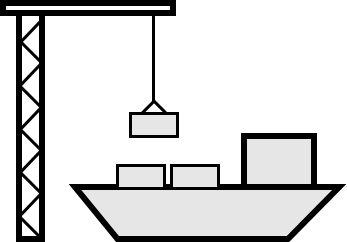
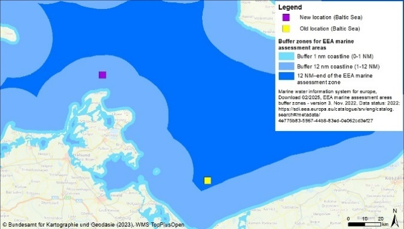
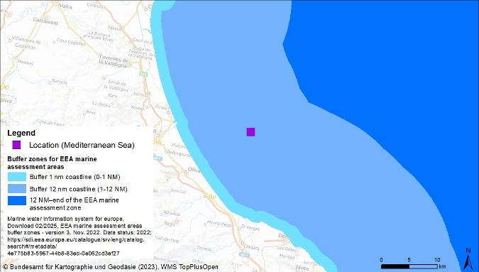
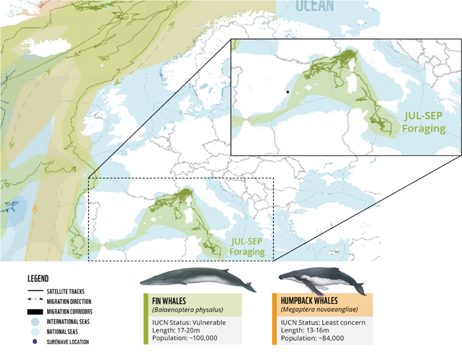
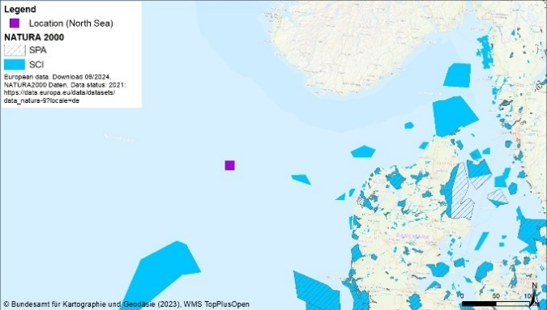
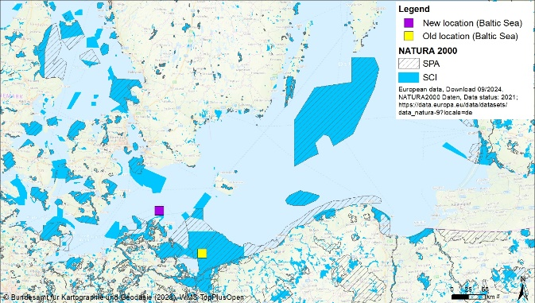
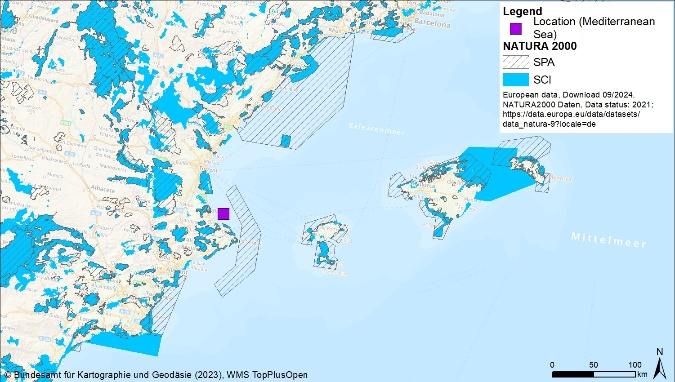

> Source: `SUREWAVE_D7.3_Environmental_Report_V4.docx` — Document date: 2025-10-06 — Converted: 2026-09-28 via pandoc/pdftotext

---

##### 

Deliverable number: D7.3

+-----------------------------------------------------------------------------------------------------------------------------------------------------------------------------------------------------------------------------------------------------------------------------------------------------------------------------------------+
| #####                                                                                                                                                                                                                                                                                                                                   |
+====================================================================================================================================================================+====================================================================================================================================================================+
| ##### {width="7.8701301399825025in" height="2.5902777777777777in"}                                                                                                                                                                                                                                                 |
+-----------------------------------------------------------------------------------------------------------------------------------------------------------------------------------------------------------------------------------------------------------------------------------------------------------------------------------------+
| ##### SUREWAVE -- Structural Reliable Offshore Floating PV Solution Integrating Circular Concrete Floating Breakwater                                                                                                                                                                                                                   |
+-----------------------------------------------------------------------------------------------------------------------------------------------------------------------------------------------------------------------------------------------------------------------------------------------------------------------------------------+
| ##### **Environmental assessment of offshore floating photovoltaic systems**                                                                                                                                                                                                                                                            |
+-----------------------------------------------------------------------------------------------------------------------------------------------------------------------------------------------------------------------------------------------------------------------------------------------------------------------------------------+
| #####                                                                                                                                                                                                                                                                                                                                   |
|                                                                                                                                                                                                                                                                                                                                         |
| #####                                                                                                                                                                                                                                                                                                                                   |
|                                                                                                                                                                                                                                                                                                                                         |
| ##### **Disclaimer:**                                                                                                                                                                                                                                                                                                                   |
|                                                                                                                                                                                                                                                                                                                                         |
| > The SUREWAVE project is Funded by the European Union. Views and opinions expressed are however those of the author(s) only and do not necessarily reflect those of the European Union. Neither the European Union nor European Climate, Infrastructure and Environment Executive Agency (CINEA) can be held responsible for them.     |
+-----------------------------------------------------------------------------------------------------------------------------------------------------------------------------------------------------------------------------------------------------------------------------------------------------------------------------------------+
| #####                                                                                                                                                                                                                                                                                                                                   |
+--------------------------------------------------------------------------------------------------------------------------------------------------------------------+--------------------------------------------------------------------------------------------------------------------------------------------------------------------+
| ##### The SUREWAVE project has received funding from the European Union\'s Horizon Europe Research and innovation funding programme under GA No. 101083342.        | ##### {width="3.00255249343832in" height="0.6299212598425197in"}                                                                              |
+--------------------------------------------------------------------------------------------------------------------------------------------------------------------+--------------------------------------------------------------------------------------------------------------------------------------------------------------------+

Deliverable details

  ---------------------------------------------------------------------------
  Work package:          7
  ---------------------- ----------------------------------------------------
  Task:                  7.3

  Document name:         D7.3 -- Report on environmental assessment

  Lead beneficiary:      IFEU

  Dissemination level:   PU

  Deliverable type:      R

  Due date:              30.05.2025

  Delivery date:         06.10.2025
  ---------------------------------------------------------------------------

  -----------------------------------------------------------------------------------------------------------------------------------------------------------------------------
   **Document version**    **Date**   **Authors**                                                                                              **Comments**[^1]
  ---------------------- ------------ ---------------------------------------------------------------------------------------- ------------------------------------------------
           1.0            26.05.2025  Dr Maximilian Breyer, Sven Gärtner, Dr Heiko Keller, Dr Guido Reinhardt, Nina Wallmann                        Draft

           1.1            10.06.2025  Thomas Pehlke, CLEMENT                                                                                        Review

           1.2            15.06.2025  Maria Aurora Casado Barrasa, ACCIONA                                                                          Review

           2.0            30.06.2025  Dr Maximilian Breyer, Sven Gärtner, Dr Heiko Keller, Dr Guido Reinhardt, Nina Wallmann                        Draft

           2.1            07/07/2025  Schalk Cloete, SINTEF                                                                                         Review

           2.2            11/07/2025  Jon Samseth, SINTEF                                                                                           Review

           3.0            29.07.2025  Dr Maximilian Breyer, Sven Gärtner, Dr Heiko Keller, Dr Guido Reinhardt, Nina Wallmann                        Final

           4.0            26.09.2025  Dr Maximilian Breyer, Sven Gärtner, Dr Heiko Keller, Dr Guido Reinhardt, Nina Wallmann    Revision following new insights in the project
  -----------------------------------------------------------------------------------------------------------------------------------------------------------------------------

+--------------------------------------------------------------------------------------------------------------------------------------------------+
| **Dissemination level**                                                                                                                          |
+:===================================:+:==========================================================================================================:+
| PU                                  | > Public: fully open                                                                                       |
+-------------------------------------+------------------------------------------------------------------------------------------------------------+
| SEN                                 | > Sensitive: limited under the conditions of the Grant Agreement                                           |
+-------------------------------------+------------------------------------------------------------------------------------------------------------+
| EU classified                       | > EU classified: restraint -- UE/EU-restricted, confidential, secret-UE/EU, secret under Decision 2015/444 |
+-------------------------------------+------------------------------------------------------------------------------------------------------------+
| **Deliverable type**                                                                                                                             |
+-------------------------------------+------------------------------------------------------------------------------------------------------------+
| R                                   | > Document, report (excluding the periodic and final reports)                                              |
+-------------------------------------+------------------------------------------------------------------------------------------------------------+
| DEM                                 | > Demonstrator, pilot, prototype, plan designs                                                             |
+-------------------------------------+------------------------------------------------------------------------------------------------------------+
| DEC                                 | > Websites, patents filing, press & media actions, videos, etc.                                            |
+-------------------------------------+------------------------------------------------------------------------------------------------------------+
| OTHER                               | > Software, technical diagram, etc.                                                                        |
+-------------------------------------+------------------------------------------------------------------------------------------------------------+

**Acknowledgement**

See chapter [10](#acknowledgement).

**Contact**

Dr Maximilian Breyer, <maximilian.breyer@ifeu.de>\
IFEU -- Institute for Energy and Environmental Research Heidelberg\
Wilckensstr. 3, 69120 Heidelberg, Germany; [www.ifeu.de](http://www.ifeu.de)

**Suggested citation**

Breyer, M., Gärtner, S., Keller, H., Reinhardt, G., Wallmann, N. (2025): Environmental assessment of offshore floating photovoltaic systems (D7.3). In: SUREWAVE project reports, funded by the European Union\'s Horizon Europe Research and innovation funding programme under grant agreement No 101083342, IFEU - Institute for Energy and Environmental Research Heidelberg, Heidelberg, Germany. <https://www.ifeu.de/en/project/surewave>.

Deliverable Review

+----------------------------------------------------------------------------------+-----------------+---------------------------------------+-----------------+-----------------+---------------------------------------+-----------------+
|                                                                                  | **Reviewer #1: Jon Samseth**                                              | **Reviewer #2: Schalk Cloete**                                            |
|                                                                                  +-----------------+---------------------------------------+-----------------+-----------------+---------------------------------------+-----------------+
|                                                                                  | **Answer**      | **Comments**                          | **Type\***      | **Answer**      | **Comments**                          | **Type\***      |
+----------------------------------------------------------------------------------+-----------------+---------------------------------------+-----------------+-----------------+---------------------------------------+-----------------+
| 1.  Is the deliverable in accordance with                                                                                                                                                                                                |
+----------------------------------------------------------------------------------+-----------------+---------------------------------------+-----------------+-----------------+---------------------------------------+-----------------+
| (i) The Description of Work?                                                     | Yes             |                                       | M               | Yes             |                                       | M               |
|                                                                                  |                 |                                       |                 |                 |                                       |                 |
|                                                                                  | No              |                                       | m               | No              |                                       | m               |
|                                                                                  |                 |                                       |                 |                 |                                       |                 |
|                                                                                  |                 |                                       | a               |                 |                                       | a               |
+----------------------------------------------------------------------------------+-----------------+---------------------------------------+-----------------+-----------------+---------------------------------------+-----------------+
| (ii) The international State of the Art?                                         | Yes             | *Not applicable for this deliverable* | M               | Yes             | *Not applicable for this deliverable* | M               |
|                                                                                  |                 |                                       |                 |                 |                                       |                 |
|                                                                                  | No              |                                       | m               | No              |                                       | m               |
|                                                                                  |                 |                                       |                 |                 |                                       |                 |
|                                                                                  |                 |                                       | a               |                 |                                       | a               |
+----------------------------------------------------------------------------------+-----------------+---------------------------------------+-----------------+-----------------+---------------------------------------+-----------------+
| 2.  Is the quality of the deliverable in a status                                                                                                                                                                                        |
+----------------------------------------------------------------------------------+-----------------+---------------------------------------+-----------------+-----------------+---------------------------------------+-----------------+
| (i) That allows it to be sent to European Commission?                            | Yes             |                                       | M               | Yes             |                                       | M               |
|                                                                                  |                 |                                       |                 |                 |                                       |                 |
|                                                                                  | No              |                                       | m               | No              |                                       | m               |
|                                                                                  |                 |                                       |                 |                 |                                       |                 |
|                                                                                  |                 |                                       | a               |                 |                                       | a               |
+----------------------------------------------------------------------------------+-----------------+---------------------------------------+-----------------+-----------------+---------------------------------------+-----------------+
| (ii) That needs improvement of the writing by the originator of the deliverable? | Yes             |                                       | M               | Yes             |                                       | M               |
|                                                                                  |                 |                                       |                 |                 |                                       |                 |
|                                                                                  | No              |                                       | m               | No              |                                       | m               |
|                                                                                  |                 |                                       |                 |                 |                                       |                 |
|                                                                                  |                 |                                       | a               |                 |                                       | a               |
+----------------------------------------------------------------------------------+-----------------+---------------------------------------+-----------------+-----------------+---------------------------------------+-----------------+
| (iii) That need further work by the Partners responsible for the deliverable?    | Yes             |                                       | M               | Yes             |                                       | M               |
|                                                                                  |                 |                                       |                 |                 |                                       |                 |
|                                                                                  | No              |                                       | m               | No              |                                       | m               |
|                                                                                  |                 |                                       |                 |                 |                                       |                 |
|                                                                                  |                 |                                       | a               |                 |                                       | a               |
+----------------------------------------------------------------------------------+-----------------+---------------------------------------+-----------------+-----------------+---------------------------------------+-----------------+

\* Type of comments: M = Major comment; m = minor comment; a = advice

Executive summary

The SUREWAVE project *\"Structurally reliable offshore floating PV solution integrating circular concrete floating breakwater\"*, funded by the European Union\'s Horizon Europe research and innovation funding programme, is developing and testing a new concept for floating photovoltaic (PV) systems in offshore marine environments. The main challenge is to protect the solar modules from the harsh weather and marine conditions. The aim is to massively expand the area suitable for PV installations and thus to support the European Union's decarbonisation ambitions. Among other things, the project has developed floating breakwaters made of innovative concrete mixtures and innovative, more stable connectors between the individual solar modules.

The project is accompanied by an integrated sustainability assessment. The sustainability of the innovative concept was analysed from a technological, environmental, social and economic perspective. This study presents the results of the environmental assessment carried out by IFEU‑Institute for Energy and Environmental Research Heidelberg. It covers both a life cycle assessment addressing global and regional environmental impacts and an assessment of local environmental impacts.

**Main results**

The study shows that offshore floating PV systems can enable significant savings of greenhouse gas emissions and other environmental impacts compared to fossil-based electricity production. This applies although the resource use and emissions associated with breakwaters, anchoring and vessel deployment required for offshore PV result in significantly higher environmental impacts than those associated with electricity production from other renewable energy sources such as onshore PV or wind.

From a local environmental perspective, in particular the cable from the offshore floating PV system to the shore can have a significant impact on biotopes worthy of protection. Other components can also cause local environmental impacts, for example by impairing migratory marine mammals and fish through the anchoring chains or the shading of sensitive ecotopes in case of a large-scale arrangement of the solar panels. However, all of these local impacts can and should be sufficiently reduced or avoided, so that they are no fundamental argument against offshore PV systems. Nevertheless, from an environmental perspective, there is a need for regulations specifically for locations in international waters, which could, for example, be based on the existing European environmental law.

From an overall environmental perspective, offshore floating PV is suitable for expanding the area that can be used for renewable energy production and should be upscaled and then implemented as quickly as technological de-risking allows, if it primarily replaces fossil-based electricity production in the respective electricity market.

**Optimised implementation of offshore floating PV systems**

The following levers can lead to an environmentally optimised use of offshore floating PV systems:

- Solar irradiation: The greatest contribution to the environmental benefits is determined by maximising the electricity yield and thus the replacement of fossil-based electricity. If there is freedom of choice regarding the location, locations should be chosen that receive the maximum average solar irradiation.

- Cable: Other significant contributors to the environmental impacts are the cable from the system to the shore, especially for sites very far from the coast, and the connection to the coast. This can be significantly reduced or avoided if the floating PV system can be connected to an existing offshore installation, e.g. an offshore wind farm.

- Vessel fuel: A third lever for significantly reducing the environmental impact is to reduce the amount of vessel fuel required for the installation, maintenance and dismantling of the floating PV systems. This can be achieved by increasing efficiency, pre-assembling parts of the floating PV installation in port so that it does not have to be laboriously assembled offshore, minimising overnight positioning of vessels and by using sustainable marine fuels or propulsion technologies.

- System design: In locations with shallow waters and light-sensitive ecosystems on the seabed, several split sub-systems may be environmentally preferable to a large single system due to a reduced shading depth, despite increased material inputs.

Other measures such as reduced material requirements for anchoring or innovative breakwater materials are much less relevant until substantial improvements at the identified levers have been achieved. Nevertheless, it is advisable to promote a circular design already now to facilitate the use of recycled materials and the recyclability in particular of materials such as copper, e.g. used in the cables, at the end of the system's life.

To facilitate a fast implementation with low impacts, it is advisable to choose a location that avoids sensitive seabed ecosystems as much as possible and is away from migration routes of fish and marine mammals.

**Summary and outlook**

The results of this study demonstrate that offshore floating PV systems can offer clear environmental benefits compared to fossil-based electricity production. In addition to existing technologies such as onshore PV or wind power, this concept can therefore contribute to decarbonizing Europe. From an environmental perspective, the concept analysed should hence be gradually upscaled and implemented as quickly as technical durability allows and if it primarily replaces fossil electricity in the respective electricity market. Pilot plants are an important next step, which could be facilitated by simplified regulatory approval.

As the environment represents only one dimension of sustainability, relevant technological, economic and social aspects need to be considered as well.

Table of Contents

[1. Introduction [10](#introduction)](#introduction)

[1.1. Background: Sustainability assessment [10](#background-sustainability-assessment)](#background-sustainability-assessment)

[1.2. Implementation of sustainability assessment within SUREWAVE [11](#implementation-of-sustainability-assessment-within-surewave)](#implementation-of-sustainability-assessment-within-surewave)

[2. Methodology [13](#methodology)](#methodology)

[2.1. Common definitions and settings [13](#common-definitions-and-settings)](#common-definitions-and-settings)

[2.1.1. Goal definition [13](#goal-definition)](#goal-definition)

[2.1.2. Scope definition [14](#scope-definition)](#scope-definition)

[2.2. Life cycle assessment (LCA) [16](#life-cycle-assessment-lca)](#life-cycle-assessment-lca)

[2.2.1. LCA methodology [16](#lca-methodology)](#lca-methodology)

[2.2.2. Settings for Life Cycle Inventory [17](#settings-for-life-cycle-inventory)](#settings-for-life-cycle-inventory)

[2.2.3. Settings for Life Cycle Impact Assessment [17](#settings-for-life-cycle-impact-assessment)](#settings-for-life-cycle-impact-assessment)

[2.3. Life cycle environmental impact assessment (LC-EIA) [19](#life-cycle-environmental-impact-assessment-lc-eia)](#life-cycle-environmental-impact-assessment-lc-eia)

[2.3.1. Regulatory frameworks for local environmental assessments [20](#regulatory-frameworks-for-local-environmental-assessments)](#regulatory-frameworks-for-local-environmental-assessments)

[2.3.2. Life cycle stages included in the LC-EIA [23](#life-cycle-stages-included-in-the-lc-eia)](#life-cycle-stages-included-in-the-lc-eia)

[2.3.3. Strategic Environmental Assessment (SEA) [23](#strategic-environmental-assessment-sea)](#strategic-environmental-assessment-sea)

[2.3.4. Environmental impact assessment (EIA) [24](#environmental-impact-assessment-eia)](#environmental-impact-assessment-eia)

[2.3.5. The LC-EIA approach in SUREWAVE [26](#the-lc-eia-approach-in-surewave)](#the-lc-eia-approach-in-surewave)

[3. System description [29](#system-description)](#system-description)

[3.1. General concept [29](#general-concept)](#general-concept)

[3.1.1. Main concept: one unit [29](#main-concept-one-unit)](#main-concept-one-unit)

[3.1.2. Alternative concept: split units [30](#alternative-concept-split-units)](#alternative-concept-split-units)

[3.2. Life cycle stages [31](#life-cycle-stages)](#life-cycle-stages)

[3.2.1. Components and their production [31](#components-and-their-production)](#components-and-their-production)

[3.2.2. Installation [35](#installation)](#installation)

[3.2.3. Maintenance [35](#maintenance)](#maintenance)

[3.2.4. Dismantling and end of life [35](#dismantling-and-end-of-life)](#dismantling-and-end-of-life)

[3.3. Locations [36](#locations)](#locations)

[3.4. Reference systems [38](#reference-systems)](#reference-systems)

[3.5. SUREWAVE scenarios [39](#surewave-scenarios)](#surewave-scenarios)

[3.6. Input data [39](#input-data)](#input-data)

[4. Results on life cycle assessment [41](#results-on-life-cycle-assessment)](#results-on-life-cycle-assessment)

[4.1. Overview of environmental impacts results [42](#overview-of-environmental-impacts-results)](#overview-of-environmental-impacts-results)

[4.1.1. Comparison of impacts to fossil electricity production [42](#comparison-of-impacts-to-fossil-electricity-production)](#comparison-of-impacts-to-fossil-electricity-production)

[4.1.2. Contribution of inputs [43](#contribution-of-inputs)](#contribution-of-inputs)

[4.1.3. Relevance of recycling [45](#relevance-of-recycling)](#relevance-of-recycling)

[4.2. Comparison of offshore PV scenarios [46](#comparison-of-offshore-pv-scenarios)](#comparison-of-offshore-pv-scenarios)

[4.2.1. Comparison of locations [46](#comparison-of-locations)](#comparison-of-locations)

[4.2.2. Comparison of layouts [48](#comparison-of-layouts)](#comparison-of-layouts)

[4.2.3. Carbon footprint of breakwater variants [49](#carbon-footprint-of-breakwater-variants)](#carbon-footprint-of-breakwater-variants)

[4.3. Excursus [51](#excursus)](#excursus)

[4.3.1. Connection to existing offshore facility [51](#connection-to-existing-offshore-facility)](#connection-to-existing-offshore-facility)

[4.3.2. Alternative vessel logistics [52](#alternative-vessel-logistics)](#alternative-vessel-logistics)

[4.3.3. Comparison to established renewable energy sources [53](#comparison-to-established-renewable-energy-sources)](#comparison-to-established-renewable-energy-sources)

[5. Results on local environmental impacts assessment [55](#results-on-local-environmental-impacts-assessment)](#results-on-local-environmental-impacts-assessment)

[5.1. Results with respect to life cycle stages [58](#results-with-respect-to-life-cycle-stages)](#results-with-respect-to-life-cycle-stages)

[5.1.1. Construction phase [58](#construction-phase)](#construction-phase)

[5.1.2. Operation phase [60](#operation-phase)](#operation-phase)

[5.1.3. Dismantling [65](#dismantling)](#dismantling)

[5.2. Comparison of locations [67](#comparison-of-locations-1)](#comparison-of-locations-1)

[5.3. Comparison of layouts [68](#comparison-of-layouts-1)](#comparison-of-layouts-1)

[6. Key results, conclusions and recommendations [69](#key-results-conclusions-and-recommendations)](#key-results-conclusions-and-recommendations)

[6.1. Key results [69](#key-results)](#key-results)

[6.1.1. Key results from a life cycle assessment perspective [69](#key-results-from-a-life-cycle-assessment-perspective)](#key-results-from-a-life-cycle-assessment-perspective)

[6.1.2. Key results from the perspective of local environmental impacts [71](#key-results-from-the-perspective-of-local-environmental-impacts)](#key-results-from-the-perspective-of-local-environmental-impacts)

[6.2. Conclusions [73](#kopf-mit-zahnrädern-mit-einfarbiger-füllungconclusions)](#kopf-mit-zahnrädern-mit-einfarbiger-füllungconclusions)

[6.3. Recommendations [76](#recommendations)](#recommendations)

[7. Outlook [79](#outlook)](#outlook)

[8. Abbreviations [79](#abbreviations)](#abbreviations)

[9. References [80](#references)](#references)

[10. Acknowledgement [83](#acknowledgement)](#acknowledgement)

11\. Annex (see next page)

[11. Annex [84](#annex)](#annex)

[11.1. Local environmental impacts on further protected goods [84](#local-environmental-impacts-on-further-protected-goods)](#local-environmental-impacts-on-further-protected-goods)

[11.2. Local environmental impacts: construction phase [85](#local-environmental-impacts-construction-phase)](#local-environmental-impacts-construction-phase)

[11.2.1. Floating solar modules [85](#floating-solar-modules-2)](#floating-solar-modules-2)

[11.2.2. Transportation / shipping [86](#transportation-shipping)](#transportation-shipping)

[11.2.3. Facilities onshore [86](#facilities-onshore)](#facilities-onshore)

[11.3. Local environmental impacts: operation phase [87](#local-environmental-impacts-operation-phase)](#local-environmental-impacts-operation-phase)

[11.3.1. Floating solar modules [87](#floating-solar-modules-3)](#floating-solar-modules-3)

[11.3.2. Anchoring piles [89](#anchoring-piles-1)](#anchoring-piles-1)

[11.3.3. Cable to shore [90](#cable-to-shore-1)](#cable-to-shore-1)

[11.3.4. Transportation/shipping/maintenance Work [90](#transportationshippingmaintenance-work-1)](#transportationshippingmaintenance-work-1)

[11.3.5. Facilities onshore [91](#facilities-onshore-1)](#facilities-onshore-1)

[11.4. Local environmental impacts: dismantling [92](#local-environmental-impacts-dismantling)](#local-environmental-impacts-dismantling)

[11.4.1. Transportation/shipping [92](#transportationshipping)](#transportationshipping)

# Introduction

The SUREWAVE project *\"Structurally reliable offshore floating PV solution integrating circular concrete floating breakwater\"*, funded by the European Union\'s Horizon Europe research and innovation funding programme, is developing and testing a new concept for floating photovoltaic (PV) systems in offshore marine environments. The main challenge is to protect the solar modules from the sometimes harsh weather and marine conditions. The aim is to massively expand the area suitable for PV installations and thus to support the European Union's decarbonisation ambitions. Among other things, the project has developed floating breakwaters made of innovative concrete mixtures and innovative, more stable connectors between the individual solar modules.

The project is accompanied by an integrated sustainability assessment. The sustainability of the innovative concept was analysed from a technological, environmental, social and economic perspective. This study presents the results of the environmental assessment carried out by IFEU‑Institute for Energy and Environmental Research Heidelberg. It covers both a life cycle assessment addressing global and regional environmental impacts and an assessment of local environmental impacts.

## Background: Sustainability assessment

The most well-known definition of sustainability can be found in the report of the Brundtland Commission: 'sustainable development is development that meets the needs of the present without compromising the ability of future generations to meet their own needs' \[UN 1987\]. At the 2005 World Summit it was noted that this requires the reconciliation of environmental, social and economic demands -- the \"three pillars\" of sustainability. This view has been expressed as a scheme using three overlapping circles indicating that the three pillars of sustainability are not mutually exclusive and can be mutually reinforcing ([Figure 1](#_Ref153265083)).

+---------------------------------------------------------------------------------------------------------------------+----------------------------------------------------------------------------------------------------------------------------------------+
| {width="1.571661198600175in" height="1.4960629921259843in"}                                    | {width="1.811023622047244in" height="1.4512325021872265in"}                                                       |
|                                                                                                                     |                                                                                                                                        |
| []{#_Ref153265083 .anchor}Figure 1: Scheme of sustainable development: at the confluence of three constituent parts | []{#_Ref153265110 .anchor}Figure 2: Scheme indicating the relationship between the three pillars of sustainability \[Scott-Cato 2008\] |
+=====================================================================================================================+========================================================================================================================================+

The UN definition is not universally accepted and has undergone various interpretations. For many environmentalists the idea of sustainable development is an oxymoron as development seems to entail environmental degradation. From this perspective, the economy is a subsystem of the human society, which in itself is a subsystem of the ecosphere; thus a gain in one sector is a loss from another. This can be illustrated as three ellipses in [Figure 2](#_Ref153265110).

As a result of the growing pressure on the environment and increased scarcity of some important natural resources, the sustainability discussion is often focussed on the environment, as both society and economy are constrained by environmental limits. There is abundant scientific evidence that mankind is currently living unsustainably and jeopardising the living conditions of future generations, e.g. by excessive use of resources and excessive use of the environment as a sink, e.g. for greenhouse gas emissions etc. Hence, strong efforts are needed to identify and develop sustainable technologies that are able to reconcile economic, social and environmental demands.

## Implementation of sustainability assessment within SUREWAVE

The integrated assessment of sustainability carried out in []{.indexref entry="WP" crossref="Work package"}the SUREWAVE project takes into account all major pillars of sustainability. The work flow structure of the related integrated life cycle sustainability assessment is depicted in [Figure 3](#_Ref195713648).

![[]{#_Ref195713648 .anchor}Figure 3: Structure of the work package on sustainability assessment in SUREWAVE.](../images/2025-10-06_surewave_d7.3_environmental_report/image5.emf){width="6.175694444444445in" height="3.093974190726159in"}

In order to achieve reliable and robust sustainability assessment results, it is inevitable that the principles of comprehensiveness and life cycle thinking (LCT[]{.indexref entry="LCT" crossref="Life cycle thinking"}) are applied. LCT means that all life cycle stages for products are considered, i.e. the complete supply or value chains, from the production of technological components as well as their respective material inputs, through installation and operation, to dismantling and end-of-life treatment / final disposal (see [Figure 4](#_Ref197422991) and section [2.1.2](#scope-definition)). Through such a systematic overview and perspective, the unintentional shifting of environmental burdens, economic benefits and social well-being between life cycle stages or individual processes can be identified and possibly avoided or at least minimised.

![[]{#_Ref197422991 .anchor}Figure 4: Sustainability assessment in SUREWAVE: Life cycle sustainability assessment compares the whole life cycles of all involved technologies/products (simplified illustration).](../images/2025-10-06_surewave_d7.3_environmental_report/image6.emf){width="6.3in" height="3.214583333333333in"}

The performance of each technological approach is compared to alternative reference technologies, e.g. conventional energy production. Relevant aspects of sustainability are analysed using methodologies that are based on LCT. In this project, relevant sustainability impacts are covered using (environmental) life cycle assessment (LCA[]{.indexref entry="LCA" crossref="Life cycle assessment"}), social life cycle assessment (S-LCA[]{.indexref entry="S-LCA" crossref="Social life cycle assessment"}) and an economic analysis based on the levelised costs of electricity (LCoE[]{.indexref entry="LCoE" crossref="Levelised costs of electricity"}) complemented by life cycle environmental impact assessment (LC-EIA[]{.indexref entry="LC-EIA" crossref="Life cycle environmental impact assessment"}) and a technological assessment. Subsequently, these complementary sustainability aspects are brought together according to the methodology of integrated life cycle sustainability assessment (ILCSA[]{.indexref entry="ILCSA" crossref="Integrated life cycle sustainability assessment"}) \[Keller et al. 2015\]. This report covers the results of the environmental assessment based on LCA and LC-EIA.

# Methodology

This chapter describes the methodology and settings applied for the assessment of environmental impacts. Definitions and settings common to all sustainability assessments within the SUREWAVE project ([Figure 3](#_Ref195713648) in section [1.2](#implementation-of-sustainability-assessment-within-surewave)), such as goal and scope, are described in section [2.1](#common-definitions-and-settings). The specific methodologies and settings applied for the environmental assessment are described in section [2.2](#life-cycle-assessment-lca) for life cycle assessment covering global and regional environmental impacts and in section [2.3](#life-cycle-environmental-impact-assessment-lc-eia) for the assessment of local environmental impacts through life cycle environmental impact assessment.

## Common definitions and settings

A well-founded sustainability assessment requires common definitions and settings on which the technological, environmental, economic and social assessments are based. Thus, general definitions and settings ensure consistent data and results for the integrated sustainability assessment. The goal and scope definition is the first phase of any sus­tainability assessment and is relevant for all sub-analyses on technological, environmental, economic and social impacts.

### Goal definition

The comprehensiveness and depth of detail of the environmental assessment can differ considerably depending on its goal. Therefore, the intended applications, the reasons for carrying out the study, and the decision context have to be described within the goal definition.

#### Intended applications

The environmental assessment within the SUREWAVE project aims at two separate applications:

1.  Project-internal support of ongoing process development. This makes this study an ex-ante assessment because the systems to be assessed are not yet implemented in this particular form on a relevant scale and for a sufficiently long time.

2.  To provide a basis to communicate findings of the SUREWAVE project to external stakeholders, especially science, industry, and policy makers.

#### Guiding questions

The following questions will serve as a guide for the environmental assessment.

**Main question**:

Which environmental impacts are associated with renewable electricity generation using offshore floating photovoltaic (FPV[]{.indexref entry="FPV" crossref="Floating photovoltaic"}) in Europe?

Additionally, the following **sub-questions** have been identified in an internal workshop with all project partners:

- Which parameters or life cycle stages determine the environmental impacts significantly and what are the resulting optimisation potentials?

<!-- -->

- What are the differences of environmental impacts if offshore PV is compared to fossil fuels such as coal-based electricity?

<!-- -->

- What are the differences of environmental impacts if offshore PV is placed in the North Sea, the Baltic Sea or the Mediterranean Sea representing different conditions?

  Further questions to be answered in **excursus**:

<!-- -->

- What are the differences of environmental impacts associated with a split FPV concept (five smaller units) in contrast to one large uniform concept?

<!-- -->

- What are the differences of environmental impacts if the SUREWAVE FPV is placed within an existing offshore wind park?

<!-- -->

- What are the differences concerning the carbon footprint of the innovative SUREWAVE "new" breakwater systems compared with conventional breakwaters (expanded polystyrene core)?

### Scope definition

With the scope definition, the object of the environmental assessment (i.e. the exact product or other system(s) to be analysed) is identified and described. The scope should be sufficiently well defined to ensure that the comprehensiveness, depth and detail of the study are compatible and sufficient to address the stated goal. Resulting definitions and settings are used in the subsequent analyses (tasks) to guarantee the consistency between the different assessments of environmental, economic and social implications.

#### System boundaries

System boundaries determine which processes are to be included into the assessment and which not, e. g. if the whole life cycle will be analysed or only a part of it.

In SUREWAVE, the entire supply chain including input production, assembly, operational phase, and decommissioning is assessed (**cradle-to-grave**). These boundaries apply to the environmental, economic, and social assessment.

This setting was chosen as the concept of life cycle thinking, which integrates existing consumption and production strategies, thereby preventing a piece-meal approach. Life cycle approaches avoid problem shifting from one life cycle stage to another, from one geographic area to another and from one environmental medium or protection target to another.

For **local environmental impacts**, however, analysis **includes impacts on marine and coastal ecosystems only**. Here, most relevant impacts are expected while least knowledge is available.

#### Geographical coverage

Geography determines a range of used background data. Within SUREWAVE this concerns e.g. metocean conditions and available transport systems, which are primarily relevant for economic assessment and LCA, and information on depth range, hydrography and type of sea floor, currents, distance to shoreline and other parameters that are primarily relevant for the assessment of local environmental impacts.

Generally, the assessment covers European seas. To make best use of available resources and to achieve a good balance of specificity and coverage, it uses exemplary locations to derive relevant insights including research questions for possible future studies.

**Three exemplary locations** were chosen for further analyses in D2.1 "Use case scenario basis for typical, rough location" based on various project considerations (see D2.1 for details). They are

- The Greater North Sea (56°54\'N, 05°00\'E) representing harsh conditions

- The Western Mediterranean (39°00\'N, 00°00\'E) representing mid conditions

- The Baltic Sea (54°47′N, 13°23′E) representing mild conditions[^2].

They were adopted to **form the basis for more generic scenarios** of the environmental assessment. In particular for the investigation of local environmental impacts, more generic areas are analysed, in which conditions are similar to the specific conditions at the selected locations. Thus, this analysis does not aim at studying the specific locations listed as it would be needed e.g. for an approval process.

#### Technical reference

The technical reference describes the technology to be assessed in terms of scale, development status, and maturity.

The SUREWAVE system is assessed as **mature, industrial-scale technology** to ensure comparability to established alternatives. The respective scenarios go beyond the TRL[]{.indexref entry="TRL" crossref="Technology readiness level"}5 pursued with the technical work done within the project.

#### Time frame

The SUREWAVE system must be described not only in space but also in time. The timeframe of the assessment determines e.g. the development status of used technology. Likewise, the environmental impact associated with conventional products changes over time, e.g. greenhouse gas emissions associated with electricity generation. Like geography, the time frame of the assessment hence determines background datasets used.

2030 was selected as first realistic year in which the technology could be mature and available.

#### Reference unit - Functional unit

The functional unit is a key element of sustainability assessment. It is a reference to which the environmental, social and economic effects of the studied system are related, and is typically a measure for the function of the studied system. Consequently, it is the basis for the comparison of different systems.

For the SUREWAVE sustainability assessment, 1 kWh of produced electricity is used as the functional unit. In individual cases, however, it can be convenient to show the results with other units of references. For instance, investment costs in the economic assessment are usually provided per installed peak power.

## Life cycle assessment (LCA)

The life cycle assessment (LCA) is based on international standards such as \[ISO 2006a; b\] and the International Reference Life Cycle Data System (ILCD[]{.indexref entry="ILCD" crossref="International reference life cycle data system"}) guidelines \[JRC-IES 2012\]. In the following, specific settings and methodological choices are detailed.

### LCA methodology

Life cycle assessment (LCA) is structured, com­prehensive and internationally standar­dised through ISO standards 14040:2006 and 14044:2006 \[ISO 2006a; b\]. The LCA within the SUREWAVE project is carried out largely following these ISO standards on product life cycle assessment. According to the ISO standards, a LCA consists of four iterative phases):

Figure 5: Phases of an LCA

\[ISO 2006a; b\]

Goal and scope definition (see section [2.1](#common-definitions-and-settings))

- Inventory analysis (see section [2.2.2](#settings-for-life-cycle-inventory)),

- Impact assessment (see section [2.2.3](#settings-for-life-cycle-impact-assessment)), and

- Interpretation (see chapter [4](#results-on-life-cycle-assessment)).

The ISO standards 14040 and 14044 provide the indispensable framework for life cycle assessment. This framework, however, leaves the individual LCA analysts with a range of choices, which can affect the legitimacy of the results of an LCA study. While flexibility is essential in responding to the large variety of questions addressed, further guidance is needed to support consistency and quality assurance.

The International Reference Life Cycle Data System (ILCD) Handbook \[JRC-IES 2012\] has therefore been developed to provide guidance and specifications that go beyond the ISO standards 14040 and 14044, aiming at consistent and quality-assured life cycle assessment data and studies. The screening LCA study carried out within the SUREWAVE project has taken into account the major requirements of the ILCD Handbook. It has been performed according to these considerations of flexibility and strictness. The analyses in this study are so-called screening LCAs, which follow the above-mentioned ISO standards except for a) the level of detail of documentation, b) the quantity of sensitivity analyses and c) the mandatory critical review. Still, the results of these screening LCAs are suitable to answer the goal questions reliably due to the close conformity with the ISO standards.

### Settings for Life Cycle Inventory

Settings for Life Cycle Inventory include the following aspects:

- Data sources

- Attributional vs. consequential modelling

- Infrastructure

#### Data sources

Primary data on mass and energy balances is provided by task 7.1 on sustainability framework definition and mass & energy balances analysis. A summary of the most important primary quantitative input data is provided in section [3.6](#input-data). Further secondary data such as on background processes were taken from IFEU's internal database \[IFEU 2024\], from the Ecoinvent database \[Ecoinvent 2024\] and from literature data where necessary. For photovoltaic panels, own models based on \[Frischknecht et al. 2020\] and \[Stucki et al. 2024\] were used.

#### Attributional vs. consequential modelling

The LCA based environmental assessment can follow either a so-called consequential or an attributional approach, which has implications for the methodological approach to co-products, reference systems, indirect effects, etc. Consequential modelling is more extensive and 'aims at identifying the consequences that a decision in the foreground system has for other processes and systems of the economy' according to the ILCD Handbook \[JRC-IES 2010\]. Consequential modelling is recommended for decision-contexts where influential impacts are expected on a meso/macro-level \[JRC-IES 2010\]. This is the case for the goal and scope questions raised in this study. Hence, a consequential modelling approach is applied in this assessment.

#### Infrastructure

That part of the infrastructure is included in the inventory of the foreground system that is required to reach the goal of this study given the current state of development. The floating PV installation itself, its maintenance and disassembly are included, however, the production equipment to manufacture the FPV modules elements and breakwaters is not included.

### Settings for Life Cycle Impact Assessment

According to ISO standard 14040 \[ISO 2006a\], life cycle impact assessment (LCIA[]{.indexref entry="LCIA" crossref="Life cycle impact assessment"}) includes the mandatory steps of classification and characterisation as well as the optional steps of normalisation and weighting. Classification and characterisation depend on the chosen impact categories and LCIA methods. Regarding the optional elements, only the normalisation step is applied within the SUREWAVE project. The corresponding specifications of these LCIA elements are described in the following sections including

- Impact categories and LCIA methods

- Normalisation

- Weighting

#### Impact categories and LCIA methods

All main environmental issues related to the SUREWAVE concept should be covered within the impact categories of the screening life cycle assessment in a comprehensive way. Further, the impact categories must be consistent with the goal of the study and the intended applications of the results. Potential environmental impacts can be analysed at midpoint or at endpoint level. For environmental assessments within technology development projects such as SUREWAVE, the midpoint level is considered more suitable than the endpoint level because the impacts are analysed in a more differentiated way and the results are more accurate. This project assesses the midpoint indicators listed in [Table 1](#_Ref184900904) according to the Environmental Footprint method 3.1 (EF3.1[]{.indexref entry="EF3.1" crossref="Environmental Footprint method 3.1"}). This method refers to several original LCIA methods such as GWP[]{.indexref entry="GWP" crossref="Global warming potential"} 100 of IPCC 2021 \[IPCC 2021\]. For further details on EF3.1 please refer to \[European Commission. Joint Research Centre. 2023\].

  --------------------------------------------------------------------------------------------------------------------------------------------------------------------------------------------------------------------------------------------------------------
  **Midpoint impact category**    **Short description**
  ------------------------------- ------------------------------------------------------------------------------------------------------------------------------------------------------------------------------------------------------------------------------
  Resource use, fossil            Depletion of abiotic energy resources, i.e. fossil fuels such as mineral oil, natural gas and coal as well as uranium ore.

  Climate change                  Global warming/climate change as a consequence of the anthropogenic release of greenhouse gases.

  Acidification                   Shift of the acid/base equilibrium in soils by acidifying gases like sulphur dioxide, nitrogen oxides and ammonia (keyword "acid rain").

  Terrestrial eutrophication      Input of excess nutrients into terrestrial ecosystems directly or indirect via gaseous emissions and erosion (e.g. nitrogen species such as ammonia and nitrogen oxides).

  Photochemical ozone formation   Formation of specific reactive substances, e.g. ozone, in presence of nitrogen oxides, volatile hydrocarbons and solar radiation in the lower atmosphere that impacts human health (keyword "ozone alert" or "summer smog").

  Ozone depletion                 Loss of the protective ozone layer in the stratosphere by certain gases such as chlorofluorocarbons (keyword "ozone hole").

  Particulate matter              Damage to human health due to air pollutants, such as fine, primary particles and secondary particles (mainly from NOX, NH3 and SO2, keyword "winter smog").

  Land use                        Occupation and transformation of land weighted by a soil quality index
  --------------------------------------------------------------------------------------------------------------------------------------------------------------------------------------------------------------------------------------------------------------

  : []{#_Ref184900904 .anchor}Table 1: Overview on included midpoint impact categories.

Impact categories were chosen according to the relevance for the SUREWAVE concept. Others are excluded such as ionising radiation. Impact categories are excluded because (i) they are still too immature to provide conclusive results or (ii) one cannot ensure sufficient life cycle inventory (LCI[]{.indexref entry="LCI" crossref="Life cycle inventory"}) data quality for the reference year 2030 (i.e. impact categories on toxicity). Specific issues on human health are nevertheless covered by the categories particulate matter formation and photochemical ozone formation.

#### Normalisation

Normalisation in LCA is an optional step to better understand the relative magnitude of the results for the different environmental impact categories. To this end, the category indicator results are set into relation with reference information. Normalisation transforms an indicator result by dividing it by a selected reference value, e.g. a certain emission caused by the system is divided by this emission per capita in a selected country.

As the investigated FPV is developed for installation and operation for electricity supply to European markets, the resource demand and emissions per capita in the European region are chosen as reference for normalisation. The latest available data from \[European Commission. Joint Research Centre. 2023\] are used. For land use, see \[Crenna et al. 2019\]. These values refer to the year 2010 and the EU[]{.indexref entry="EU" crossref="European Union"} countries.

#### Weighting

Weighting uses numerical factors based on value-choices to compare and sometimes also aggregate indicator results, which are not comparable on a physical basis. Weighting is not applied in this study.

## Life cycle environmental impact assessment (LC-EIA)

There are a number of environmental management tools which differ both in terms of subject of study (product, production site or project) and in their potential to address environmental impacts at different spatial levels. Life cycle assessment (LCA), for example, addresses potential environmental impacts of a product system. However, for a comprehensive picture of environmental impacts, also site-specific impacts on environmental factors like e.g. biodiversity, water and soil must be considered.

The methodology developed and applied here borrows elements from environmental impact assess­ment and applies them to selected parts of the life cycle. Hence, it is called life cycle environmental impact assessment (LC-EIA).

The LC-EIA methodology was developed and tested by IFEU (Institute for Energy and Environmental Research Heidelberg) and IUS []{.indexref entry="IUS" crossref="Institute for Environmental Studies, IUS Team Ness GmbH"}(Institute for Environmental Studies, IUS Team Ness GmbH) as part of environmental assessments of renewable energies and renewable raw materials \[Rettenmaier et al. 2013\]. The now established methodology (e.g. \[Keller et al. 2014\], \[Kretschmer et al. 2013\]) is basically used for the present issue of the environmental assessment of floating PV systems offshore, but it has been modified with respect to some key aspects. This modification is not only due to the different technologies and land use requirements of biomass production and use compared to photovoltaics, but also to the specific environmental objectives applicable to marine and coastal protection, which arise, among other directives and legal frameworks, from the Habitats Directive and the Marine Protection Directive.

These regulations and strategies require a focused spatial approach to environmental assessment, with special consideration of protected areas, compared to biomass production and use, which usually takes place on sites already used for agriculture or forestry.

### Regulatory frameworks for local environmental assessments

Although the term 'LC-EIA' suggests an exclusive reference to the EU\'s EIA[]{.indexref entry="EIA" crossref="Environmental impact assessment"} (Environmental Impact Assessment) directive, the LC-EIA takes into account other European regulations on environmental, water and nature conservation.

#### Geographic assignment

The actual relevant regulations depend on the location of the sites.

This concerns the location at sea (coastal waters, 12-mile zone, continental shelf/exclusive economic zone) and, the administrative jurisdiction, i.e. the member state in whose jurisdiction the necessary approval procedures are carried out and whose designated protected areas under national law may be affected.

In the following, the relevant or presumably relevant regulations for the various sites are summarised. In principle, it is up to the responsible approval authority of each member state to decide which regulations it applies when approving a project.

Likewise, current and future developments in regulations that serve to accelerate the expansion of renewable energies or to defend the European Union are not to be considered here.

The following overview of the applicability of regulations arises from the European directives and national laws or ordinances ([Table 2](#_Ref193288084)).

  ----------------------------------------------------------------------------------------------------------------------------------------------------------------------------------------------------
  **EU Directive / National Law or Ordinance (Protected Areas)\*^1^**   **Designated protected areas**   **Coast (land)**   **Coastal waters**   **12-mile zone**   **EEZ\*^2^ / continental shelf**
  --------------------------------------------------------------------- -------------------------------- ------------------ -------------------- ------------------ ----------------------------------
  SEA-Directive (2001/42/EC)                                            ●                                ●                  ●                    ●                  ○

  EIA Directive (2011/92/EU)                                            ●                                ●                  ●                    ●                  ○

  MSFD (2008/56/EC)                                                                                                         ●                    ●                  ●

  MSPD (2014/89/EU)                                                                                                         ●                    ●                  ●

  Habitat Dir. (92/43/EEC)                                              ●                                ●                  ●                                       

  Birds Dir. (79/409/EEC, actualised by 2009/147/EC)                    ●                                ●                  ●                    ●                  

  Waste Fra. Dir. (2008/98/EU)                                                                                              ●                    ○                  

  National protected areas                                              ●                                ●                  ●                    ●                  ○
  ----------------------------------------------------------------------------------------------------------------------------------------------------------------------------------------------------

  : []{#_Ref193288084 .anchor}Table 2: Applicability of the regulations to be considered in the LC-EIA.

Legend:

● = relevant and to be considered regularly

○ = either at the discretion of the nation state or generally not relevant in this zone

\*^1^ MSFD[]{.indexref entry="MSFD" crossref="Marine strategy framework directive"} (2008/56/EC): Marine Strategy Framework Directive (Directive 2008/56/EC of the European Parliament and of the Council of 17 June 2008 establishing a framework for community action in the field of marine environmental policy); MSPD[]{.indexref entry="MSPD" crossref="Maritime spatial planning directive"} (2014/89/EU): Maritime Spatial Planning Directive (Directive 2014/89/EU of the European Parliament and of the Council of 23 July 2014 establishing a framework for maritime spatial planning); Waste Fra. Dir. (2008/98/EU): Waste Framework Directive (2008/98/EU); National protected areas: e.g. National Parks, Nature Conservation Areas

\*^2^ Exclusive Economic Zone

The spatial allocation for the three locations in SUREWAVE is shown in chapter [3.3](#locations) ([Table 7](#_Ref193288113)).

In order to comply with the Water Framework Directive (WFD[]{.indexref entry="WFD" crossref="Water framework directive"}) applicable throughout Europe, the waters affected by the planned facilities are assessed with regard to the quality components in accordance with Annex 3 of the WFD. The affected waters are divided into coastal and territorial waters or exclusive economic zones (EEZ[]{.indexref entry="EEZ" crossref="Exclusive economic zone"}). However, the WFD only officially applies to coastal waters, or the chemical status applies to coastal waters and territorial waters. In addition, the North Sea location is located in Norwegian territorial waters, which do not belong to the EU. However, since Norway has committed itself to applying all EU directives, the WFD criteria are applied to all waters.

+-------------------+------------------------------------------+-------------------------------+
| **Location**      | **Coastal waters**                       | **Territorial waters/EEZ**    |
+:==================+:=========================================+:==============================+
| North Sea         |                                          | **Norwegian EEZ**             |
|                   +------------------------------------------+-------------------------------+
|                   | Skagerrak (Danish)                       | Skagerrak, 12 SM (Danish)     |
|                   +------------------------------------------+-------------------------------+
|                   | Vesterhavet nord (Danish)                | Vesterhavet, 12 SM (Danish)   |
+-------------------+------------------------------------------+-------------------------------+
| Mediterranean Sea | **Port of Gandia - Cabo of San Antonio** |                               |
|                   +------------------------------------------+-------------------------------+
|                   | Cabo Cullera - Port of Gandia            |                               |
|                   +------------------------------------------+-------------------------------+
|                   | Port of Gandia                           |                               |
|                   +------------------------------------------+-------------------------------+
|                   | Port of Denia                            |                               |
+-------------------+------------------------------------------+-------------------------------+
| Baltic Sea        | Northern and eastern waters              | **1 - 2 nautical miles zone** |
+-------------------+------------------------------------------+-------------------------------+

: Table 3: Coastal waters, territorial waters and EEZ, the waters in which the SUREWAVE site is located are marked in bold

#### Schedule of environmental assessments

As a rule, the planning for offshore deployment involves a multi-stage planning process. These include:

- Spatial planning or area concepts and their strategic environmental assessment (SEA[]{.indexref entry="SEA" crossref="Strategic environmental assessment"}). The aim is to designate priority areas for the respective offshore deployment. Such plans already exist, for example, for offshore wind energy planning.

- The level of approval of specific individual projects, including the various environmental assessments (EIA, FFH impact assessment, SPA impact assessment, species protection, conformity with the Water Framework Directive, conformity with the Marine Strategy Directive).

The corresponding procedures usually last several years. In addition to environmental aspects, other aspects are also included; such as conflicts of use and impacts on military uses.

In SUREWAVE, essential environmental aspects of the various planning levels are traced in a simplified form in three stages based on defined criteria.

Stage 1 contains elements of the SEA, i.e. a simplified, broad-scale planning and environmental assessment. The aim is to assess the locations with respect to the expected environmental obstacles related to approval and to optimise the selection of locations from an environmental perspective in the early planning and design stage.

Stage 2 contains elements of the EIA and other environmental planning instruments (FFH, SPA, WFD). This includes identifying the relevant factors and environmental impacts for the environmental assessment (i.e. those that are likely to have significant adverse effects), and by screening out the factors and impacts that are not or less relevant. This stage of the process is based on the protected goods.

Stage 3 comprises the comparative site-related assessment of the relevant environmental impacts, both in terms of the generic environmental impacts (i.e. those that are not dependent on the specific sensitivity of the protected goods), and the local environmental impacts, taking into account the possible sensitivity of the protected goods. This stage also includes a comparison of the three locations for possible deployment.

### Life cycle stages included in the LC-EIA

LC-EIA does not analyse the entire life cycle, but only selected stages of the life cycle for which

- considerably adverse environmental impacts in addition to the emissions and resource consumption considered in the LCA are to be expected, and

- sufficiently specific information on the type and influencing factors on the impact intensity of the impact factors can be met.

Upstream and downstream processes are also considered in the EIA, but in practice not with the same intensity as local impacts. This is the case, for example, in the screening, where impacts on the emission of greenhouse gases or resource consumption are addressed.

However, they are not part of the EIA as part of the integrated environmental assessment of the SUREWAVE project. They are dealt with in detail in the LCA and their additional consideration in the EIA would lead to duplicate assessments or duplicate tests.

The subject of the environmental assessment regarding the LC-EIA are thus the following life cycle stages:

- Transport and assembly (installation)

- Operation and maintenance

- Dismantling

### Strategic Environmental Assessment (SEA)

Stage 1 involves determining whether the selected locations (anchor points) are located in or near planned or designated protected areas.

Protected areas can be:

- Bird protection areas according to the EU Birds Directive

- FFH areas according to the Habitats Directive

- Protected marine areas (e.g. marine national parks or other protected areas at sea) that are included in the spatial protection measures within the meaning of Article 13 (4) and thus form part of the programme of measures under the Marine Strategy Framework Directive

It can be assumed that, in the comparative assessment of locations within or outside protected areas, the locations within protected areas will generally be assessed as less favourable from an environmental perspective. This does not mean that the implementation of projects in these areas is ruled out in principle. However, significantly higher requirements apply to the authorisation of projects in protected areas with regard to the demonstration of public interest, the absence of reasonable alternatives and the possibilities of mitigation measures.

### Environmental impact assessment (EIA)

Environmental impact assessment (EIA) is a standardised methodology for analysing proposed projects regarding their potential to affect the local environment. It is based on the identification, description and estimation of the project's environmental impacts and is usually applied at an early planning stage, i.e. before the project is carried out. EIA primarily serves as a decision support for project management and authorities which have to decide on approval. Moreover, it helps decision makers to identify more environmentally friendly alternatives as well as to minimise negative impacts on the environment by applying mitigation and compensation measures.

The environmental impacts of a planned project depend on both the nature / specifications of the project (e.g. emissions or spatial extension) and on the specific quality of the environment at a certain geographic location (e.g. occurrence of rare or endangered species, air and water quality etc.). Thus, the same project probably entails different environmental impacts at different locations. EIA is therefore usually conducted at a site-specific / local level. These environmental impacts are compared to a situation where the project is not being implemented ("no-action alternative").

#### EIA methodology

An EIA covers direct and indirect effects of a project on the following **environmental factors** \[CEC 1985\]:

- Human beings, fauna and flora; biodiversity

- Soil, water, air, climate and the landscape

- Material assets and the cultural heritage

- The interaction between these factors

An EIA generally includes the following steps:

- Screening

- Scoping

- EIA report

  - Project description and consideration of alternatives

  - Description of environmental factors

  - Prediction and evaluation of impacts

  - Mitigation measures

- Monitoring and auditing measures

A conventional EIA report starts with a project description and a consideration of alternatives including a description of the status and trends of relevant environmental factors, against which predicted changes can be compared and evaluated in terms of importance. Mitigation measures conclude the study and provide actions to minimise adverse impacts.

Impact prediction is a description of the likely significant effects of the proposed project on the environment resulting from:

- The construction / installation of the project; temporary impacts expected, e.g. by noise from construction sites.

- The project itself: buildings, infrastructure and installations; durable impacts expected e.g. by shadowing of water below the floating PV.

- The operation phase of the project; durable impacts expected, e.g. by emission of gases.

- The dismantling, removal of substrate with sessile organisms.

Prediction should be based on the available environmental project data. Such predictions are described in quantitative or qualitative terms considering e.g.:

- Quality of impact

- Magnitude of impact

- Extent of impact

- Duration of impact

Mitigation measures are recommended actions to reduce, avoid or offset the potential adverse environmental consequences of development activities. The objective of mitigation measures is to maximise project benefits and minimise negative impacts on the environment.

#### LC-EIA in SUREWAVE

Within the SUREWAVE project three case study areas were chosen in order to assess the potential of implementing marine floating PV. The assessment is based on existing and publicly available environmental data. No on-site investigations were implemented at the present stage of technology development. Main reason for this is that the exact location, that will be subject to the possibly following approval process is not known today.

Investigations of environmental aspects such as occurrence of habitats, plants or animal species will have to be carried out as part of the EIA in the approval process.

In line with the specific objectives and requirements of the Marine Strategy Framework Directive, a step-by-step approach was chosen for the EIA in the SUREWAVE project.

### The LC-EIA approach in SUREWAVE

#### General considerations

For the purpose of the integrated environmental assessment, it is not appropriate or possible to perform a full-scale EIA according to the regulatory frameworks. Nevertheless, elements of EIA are used. Taking the comparability of the assessment into account, the LC-EIA approach for SUREWAVE therefore is based on three essential preconditions:

- Assessment is performed predominantly at a generic level. Only in parts site-specific information are integrated.

- Assessment addresses not only the installation of floating-PV at the sea, but also the connection to the land by power lines. This is exceptionally important due to the high conservation value of coastal habitats.

- Other uses, especially military uses of the marine sites are not considered in the SUREWAVE study. These concerns must be addressed in the approval process for distinct projects.

The scope of EIA addressed in SUREWAVE is shown in [Figure 6](#_Ref193288080)**.**

![[]{#_Ref193288080 .anchor}Figure 6: Scope of EIA in the SUREWAVE project. F=FPV (floating PV modules), A=Anchoring pile, VA=Anchoring chain, VC=Cable, LC=Cable to shore, FL=Facilities onshore](../images/2025-10-06_surewave_d7.3_environmental_report/image9.png){width="5.06669072615923in" height="3.433332239720035in"}

#### Generic level

The main objective of the modified EIA approach is to qualitatively assess the impacts associated with floating PV at a generic level.

The impact assessment is based on the comparison of the status quo / no-action alternative with the project alternative. The impact assessment will be done mainly on the following basis of:

- Expert opinion

- Consultations within the SUREWAVE project

- Matrices (weighted / unweighted), depicting the different aspects of the construction and operation of the plant, their possible direct and indirect effects and their impact on the environmental factors.

#### Impact prediction and evaluation

Following impact identification and prediction, impact evaluation is the formal stage where their significance is determined. Impact significance depends on the joint consideration of its characteristics (quality, magnitude, extent, duration) and the importance (or value) that is attached to the resource losses, environmental deterioration or alternative uses. Significant negative impacts will be taken into further consideration since they could require mitigation measures. Impacts are likely to be significant if they

- lead to the total functional loss of an environmental factor.

- have adverse effects of special or high relevance for environmental factors.

- are extensive over space or time.

- exceed environmental standards and thresholds.

- do not comply with environmental policies / land use plans.

- affect ecologically sensitive areas.

- affect community lifestyle, traditional land use and values.

Non-significantly affected environmental factors are of minor importance in the further process. They do not require mitigation actions. [Table 4](#_Ref197336934) highlights potential environmental impacts of offshore PV on various protected goods.

#### Description of the valuation

The location-specific assessment of the environmental impacts is carried out on the basis of the individual system components, whose impacts on each protected good during the construction, operation and dismantling phases are itemised.

Here, generic impacts resulting from the system design at the respective location are addressed without taking into account local sensitivities of the protected goods. One example of this is the different impact characteristics depending on the number of anchors required. Although this is location-specific, as it depends on the water depth and swell, it does not depend on certain location characteristics, e.g. the use of a location as part of a migration route of marine mammals.

Furthermore, local impacts are considered where the specific sensitivity of the protected good at the site is relevant. For example, the occurrence of elevated viewpoints relevant to the perception of a facility from land.

+-------------------------------------------------------------------------------------+-----------------------------------------------------------------------------------------------------------------------------------------------------------+
| **Technology related factor**                                                       | **Environmental factors**                                                                                                                                 |
|                                                                                     +---------------+---------------+--------------------+---------------------+---------------------------+----------------+---------------+-------------------+
|                                                                                     | **Water**     | **Soil**      | **Flora (plants)** | **Fauna (animals)** | **Climate / air quality** | **Land-scape** | **Human\      | **Bio-diversity** |
|                                                                                     |               |               |                    |                     |                           |                | health**      |                   |
|                                                                                     | **\           | **\           | **P**              | **A**               | **C**                     | **L**          |               | **B**             |
|                                                                                     | \             | \             |                    |                     |                           |                | **H**         |                   |
|                                                                                     | W**           | S**           |                    |                     |                           |                |               |                   |
+:====================================================================================+:==============+:==============+:===================+:====================+:==========================+:===============+:==============+:==================+
| **1 Construction phase**                                                                                                                                                                                                                        |
+-------------------------------------------------------------------------------------+---------------+---------------+--------------------+---------------------+---------------------------+----------------+---------------+-------------------+
| 1.1 FPV - visual disturbance, emission of noise                                     |               |               |                    | A1.1                |                           |                |               | B1.1              |
|                                                                                     |               |               |                    |                     |                           |                |               |                   |
|                                                                                     |               |               |                    |                     |                           |                |               | (🡪 A1.1)          |
+-------------------------------------------------------------------------------------+---------------+---------------+--------------------+---------------------+---------------------------+----------------+---------------+-------------------+
| 1.2 Anchoring piles - emission of noise and vibrations                              |               |               |                    | A1.2                |                           |                |               | B1.2              |
|                                                                                     |               |               |                    |                     |                           |                |               |                   |
|                                                                                     |               |               |                    |                     |                           |                |               | (🡪 A1.2)          |
+-------------------------------------------------------------------------------------+---------------+---------------+--------------------+---------------------+---------------------------+----------------+---------------+-------------------+
| 1.3 Anchoring piles -- occupy soil                                                  |               |               | P1.3               |                     |                           |                |               | B1.3              |
|                                                                                     |               |               |                    |                     |                           |                |               |                   |
|                                                                                     |               |               |                    |                     |                           |                |               | (🡪 P1.3)          |
+-------------------------------------------------------------------------------------+---------------+---------------+--------------------+---------------------+---------------------------+----------------+---------------+-------------------+
| 1.4 FPV and anchoring piles - emission of substances and odour                      | W1.4          |               |                    |                     | C1.4                      |                |               |                   |
+-------------------------------------------------------------------------------------+---------------+---------------+--------------------+---------------------+---------------------------+----------------+---------------+-------------------+
| 1.5 Transport / shipping                                                            |               |               | P1.5               | A1.5                |                           |                |               |                   |
+-------------------------------------------------------------------------------------+---------------+---------------+--------------------+---------------------+---------------------------+----------------+---------------+-------------------+
| 1.6 Construction of cables and facilities to / on shore                             |               | S1.6          | P1.6               | A1.6                |                           | L1.6           |               | B1.6              |
+-------------------------------------------------------------------------------------+---------------+---------------+--------------------+---------------------+---------------------------+----------------+---------------+-------------------+
| **2 Infrastructure and installations during operation phase**                                                                                                                                                                                   |
+-------------------------------------------------------------------------------------+---------------+---------------+--------------------+---------------------+---------------------------+----------------+---------------+-------------------+
| 2.1 FPV -- shadowing of water body underneath                                       | W2.1          |               | P2.1               | A2.1                |                           |                |               | B2.1              |
|                                                                                     |               |               |                    |                     |                           |                |               |                   |
|                                                                                     |               |               |                    |                     |                           |                |               | (🡪 P2.1, A2.1)    |
+-------------------------------------------------------------------------------------+---------------+---------------+--------------------+---------------------+---------------------------+----------------+---------------+-------------------+
| 2.2 FPV -- artificial structure (substrate / habitat / light emission)              |               |               |                    | A2.2                |                           | L2.2           |               | B2.2              |
|                                                                                     |               |               |                    |                     |                           |                |               |                   |
|                                                                                     |               |               |                    |                     |                           |                |               | (🡪 A2.2)          |
+-------------------------------------------------------------------------------------+---------------+---------------+--------------------+---------------------+---------------------------+----------------+---------------+-------------------+
| 2.3 Anchoring chain -- artificial structure (possible barrier / habitat)            |               |               |                    | A2.3                |                           |                |               | B2.3              |
|                                                                                     |               |               |                    |                     |                           |                |               |                   |
|                                                                                     |               |               |                    |                     |                           |                |               | (🡪 A2.3)          |
+-------------------------------------------------------------------------------------+---------------+---------------+--------------------+---------------------+---------------------------+----------------+---------------+-------------------+
| 2.4 Anchoring piles -- artificial structures (habitat / pollutants)                 | W2.4          |               |                    | A2.4                |                           |                |               | B2.5              |
|                                                                                     |               |               |                    |                     |                           |                |               |                   |
|                                                                                     |               |               |                    |                     |                           |                |               | (🡪 A2.4)          |
+-------------------------------------------------------------------------------------+---------------+---------------+--------------------+---------------------+---------------------------+----------------+---------------+-------------------+
| 2.5 Cable -- artificial structure (habitat, pollutants / electromagnetic emissions) | W2.5          |               |                    | A2.5                |                           |                |               | B2.5              |
|                                                                                     |               |               |                    |                     |                           |                |               |                   |
|                                                                                     |               |               |                    |                     |                           |                |               | (🡪 A2.5)          |
+-------------------------------------------------------------------------------------+---------------+---------------+--------------------+---------------------+---------------------------+----------------+---------------+-------------------+
| 2.6 Transport / shipping / maintenance work                                         | W2.6          |               |                    | A2.6                |                           |                |               |                   |
+-------------------------------------------------------------------------------------+---------------+---------------+--------------------+---------------------+---------------------------+----------------+---------------+-------------------+
| 2.7 Facilities onshore - artificial structures                                      |               |               |                    |                     |                           | L2.7           |               |                   |
+-------------------------------------------------------------------------------------+---------------+---------------+--------------------+---------------------+---------------------------+----------------+---------------+-------------------+
| **3 Dismantling**                                                                                                                                                                                                                               |
+-------------------------------------------------------------------------------------+---------------+---------------+--------------------+---------------------+---------------------------+----------------+---------------+-------------------+
| 3.1 FPV and anchoring chains - removing artificial structures                       |               |               |                    | A3.1                |                           |                |               | B2.5              |
|                                                                                     |               |               |                    |                     |                           |                |               |                   |
|                                                                                     |               |               |                    |                     |                           |                |               | (🡪 A3.1)          |
+-------------------------------------------------------------------------------------+---------------+---------------+--------------------+---------------------+---------------------------+----------------+---------------+-------------------+
| 3.2 Transport / shipping                                                            |               |               | P3.2               | A3.2                |                           |                |               |                   |
+-------------------------------------------------------------------------------------+---------------+---------------+--------------------+---------------------+---------------------------+----------------+---------------+-------------------+

: []{#_Ref197336934 .anchor}Table 4: Technology-related factors, environmental issues and potential environmental impacts.

  -----------------------------------------------------------------------
          **Potential impacts**
  ------- ---------------------------------------------------------------
          

  **🡪**   **Impacts due to the interaction of environmental factors**
  -----------------------------------------------------------------------

# System description

To assess the offshore floating PV[]{.indexref entry="PV" crossref="photovoltaic"} system from an environmental point of view, environmental impacts from all life cycle stages must be taken into account. This chapter provides a detailed description of the offshore PV system as well as the assessed scenarios, locations, reference systems, and final scenarios. [Figure 7](#_Ref152677301) displays a simplified scheme of the offshore PV life cycle.

![[]{#_Ref152677301 .anchor}Figure 7: Simplified scheme of the offshore PV life cycle.](../images/2025-10-06_surewave_d7.3_environmental_report/image10.emf){width="6.3in" height="3.3055555555555554in"}

The floating PV solution primarily consists of floating PV modules surrounded by innovative floating breakwater elements. Section [3.1](#general-concept) presents the general concept of the system, while section [3.2](#life-cycle-stages) describes all life cycle stages from the production of components to the final dismantling (cradle to grave).

## General concept

### Main concept: one unit

The main layout concept investigated in this study follows one large uniform circular layout as depicted in [Figure 8](#_Ref193287628). The outer boundary of the system is formed by a closely interconnected floating breakwater pontoons which enclose a network of floating photovoltaic modules, i.e. photovoltaic panels mounted to aluminium floats. The modules are arranged in matrices of several dozen modules each. Neighbouring matrices are interrupted by a single row of so-called dummy floats which reflect the same aluminium floats, however, without the photovoltaic panels, enabling maintenance and cleaning of the PV modules. The outer photovoltaic modules are connected to a surrounding circular PVC[]{.indexref entry="PVC" crossref="Polyvinyl chloride"} pipe by elastic polypropylene ropes, while the pipe in turn is connected to the breakwaters. To secure geometrical integrity of the layout, two additional lines of bridge breakwaters cross the photovoltaic setup and are connected to the adjacent modules via PVC pipes and polypropylene ropes. To hold the system in place, several breakwaters along the circle as well as several bridge breakwaters are moored to the seabed via steel chains and anchoring steel piles. The system is equipped with electrical devices specified in section [3.2.1](#components-and-their-production) that are required to transport the produced electricity to shore.

![[]{#_Ref193287628 .anchor}Figure 8: Layout for a 9 MWp plant. © by Sunlit Sea AS.](../images/2025-10-06_surewave_d7.3_environmental_report/image11.png){width="5.0in" height="3.8275798337707787in"}

### Alternative concept: split units

To address potential differences in environmental impacts, a second layout concept with the same electricity yield is investigated. Compared to the large uniform concept described in section [3.1.1](#main-concept-one-unit), the required number of floating photovoltaic modules is split into five smaller units equidistantly arranged in a pentagon and individually encircled by breakwaters similar to the main concept. Bridge breakwaters, as they cross the system following the large concept, are not required in the split concept. In total, the concept translates to a 75 % increase of the breakwater number due to a less favourable circumference to area ratio. Each of the five smaller units is individually moored to the seabed. To prevent entanglement of the anchoring and mooring, the individual units are installed with a minimum distance. The split concept is investigated for harsh conditions (i.e. North Sea) only.

## {width="1.86875in" height="0.8034722222222223in"}Life cycle stages

### Components and their production

#### Floating photovoltaic (PV) modules

The floating PV modules reflect a commercial product originally designed by the project partner Sunlit Sea for land locked systems. They consist of monocrystalline solar panels which are mounted on floating substructures. The floats are made from two opposing pressed and rolled marine grade aluminium sheets with cup-shaped dimples which are filled with Styrofoam. Individual modules are connected via a combination of flexible polyurethane hinges as well as metal brackets and electrically wired in series according to the layout presented in section [3.1](#general-concept).

{width="4.490697725284339in" height="2.0in"}

The solar panels are assembled in Lithuania. The final modules are produced in Norway and transported to the respective harbour.

#### Breakwater

The breakwater pontoons, which are connected via a combination of steel ropes and rubber, consist of a reinforced concrete structural shell and a non-structural inner core, designed with a box-shaped cross section ([Figure 10](#_Ref153552224)) (see D3.2).

- For the shell, two different material solutions were developed by the project partner ACCIONA: high-performance concrete (HPC[]{.indexref entry="HPC" crossref="High-performance concrete"}) and lightweight aggregate concrete (LWAC[]{.indexref entry="LWAC" crossref="Lightweight aggregate concrete"}). HPC requires less material than conventional concrete due to its high strength. It further incorporates blast-furnace slag and fly ash, reducing the clinker content in 20%. LWAC replaces 100% conventional lightweight aggregates with recycled glass aggregates and 20% of the weight of natural coarse aggregates with recycled concrete aggregates from construction and demolition waste (CDW[]{.indexref entry="CDW" crossref="Construction and demolition waste"}). The respective shell material is structurally supported by steel reinforcement.

- For the core of the breakwater, a circular cellular lightweight concrete (CCLC[]{.indexref entry="CCLC" crossref="Circular cellular lightweight concrete"}) is employed, using a minimum amount of cement and recycled glass aggregates. To assess the advantages of the new material solutions with regard to the greenhouse gas balance, they are compared to conventional breakwaters using polystyrene as core material and conventional concrete (CC) which complies with the requirements of the applicable concrete standards for floating concrete structures. In addition, a hybrid design is considered which combines CCLC and polystyrene as core materials. [Table 5](#_Ref197337502) shows the material combinations investigated in this study.

  -----------------------------------------------------------------------------------------------------------------------------------------------
  **Name**                             **Shell material**   **Core material**
  ------------------------------------ -------------------- -------------------------------------------------------------------------------------
  Conventional design                  CC                   Expanded polystyrene (EPS[]{.indexref entry="EPS" crossref="Expanded polystyrene"})

  Hybrid design                        LWAC                 40% CCLC + 60% EPS (approx. % v/v)

  SUREWAVE design with LWAC concrete   LWAC                 CCLC

  SUREWAVE design with HPC concrete    HPC                  CCLC
  -----------------------------------------------------------------------------------------------------------------------------------------------

  : []{#_Ref197337502 .anchor}Table 5: Material combinations regarding the breakwater shell and core investigated in this study.

LWAC: lightweight aggregate concrete; HPC: high-performance concrete; CCLC: circular cellular lightweight concrete

In the LCA results presented in chapter [4](#results-on-life-cycle-assessment), "SUREWAVE design with LWAC concrete" is used for the calculation of breakwater-related impacts unless otherwise specified. Only in section [4.2.3](#carbon-footprint-of-breakwater-variants), the other material combinations are compared with regard to the carbon footprint.

The breakwaters are produced in a production facility directly at the harbour. The individual components of the respective concrete solutions for shell and core are cast using a mobile concrete mixing plant. The shell is cast directly around the core. After hardening, the pontoons are transported within the facility with a crawler crane. The components for the shell and core, respectively, are available in Europe and transported by trailers on land.

![[]{#_Ref153552224 .anchor}Figure 10: Cross section of a single breakwater pontoon. © by Clement Germany GmbH.](../images/2025-10-06_surewave_d7.3_environmental_report/image14.png){width="4.329350393700787in" height="2.197673884514436in"}

#### Anchoring

To hold the floating system in place and transfer wave loads to the ground, multiple breakwaters are anchored to the seabed while the photovoltaic matrices are secured by their breakwater connection. The multi-point anchoring is realized with two steel chains attached to the longitudinal inside and outside of anchored breakwaters, respectively. While each outer chain leads radially to a separate driven tubular anchor pile, the inner chain configuration differs for harsh, mid, and mild metocean conditions.

In case of mild conditions, each outer anchor pile is opposed by an equidistant pile inside of the breakwater line and connected to the inner chain.

For mid and harsh conditions, however, all inner chains are anchored to one single tubular steel pile beneath the center of the floating system ([Figure 11](#_Ref193287630)).

For logistic reasons, this center pile is assembled from several smaller piles. In the final installation, the steel chains follow a catenary line. The number of required anchor points is specific for the metocean condition and additionally differs between the uniform and split concept at the North Sea location.

The tubular steel piles are available in Europe and transported by trailers on land. The chains are produced in China and transported overseas.

![[]{#_Ref193287630 .anchor}Figure 11: Anchoring concept of the uniform system using the example of mid conditions. © by Clement Germany GmbH.](../images/2025-10-06_surewave_d7.3_environmental_report/image15.png){width="3.8188976377952755in" height="3.502734033245844in"}

**Split concept:** The outer anchor points are not opposed by anchor points within the breakwater line but on the opposite site of the circular assembly ([Figure 12](#_Ref190191307)). Furthermore, single anchor piles used with the split concept are smaller compared to the piles used with the uniform concept.

![[]{#_Ref190191307 .anchor}Figure 12: Anchoring concept for one unit of the split layout at harsh conditions (North Sea). © by Clement Germany GmbH.](../images/2025-10-06_surewave_d7.3_environmental_report/image16.png){width="3.8976377952755907in" height="3.6680358705161855in"}

#### Electrical connection

The produced electricity from each module matrix is collected in individual combiner boxes located on the dummy floats. These combiners are connected to inverters that convert DC[]{.indexref entry="DC" crossref="Direct current"} electricity generated by solar panels to AC electricity. The inverters are located on the bridge breakwaters and lead to a single transformer station at the center of the floating system. A single AC[]{.indexref entry="AC" crossref="Alternating current"} power cable is installed on the seabed and connects the floating PV system to the shore. At the shore, a small distribution unit is used as the interface to the grid or local consumers. Each breakwater is further equipped with a sensor developed by the project partner CEIT to monitor the structural integrity.

**Split concept:** The individual units are electrically connected to their respective left and right neighbours, while, again, a single AC power cable leads to the shore.

**Excursus:** Connection of the system to an existing offshore installation such as a wind park is investigated as an excursus. In this case, the power cable to shore is replaced by a short floating cable supported by buoys.

#### Accessory devices

Beacons are installed on top of the breakwaters to ensure visibility for passing ships*.*

{width="0.8861111111111111in" height="0.6173611111111111in"}

### Installation

All components of the offshore PV concept, i.e. floating PV modules, Breakwaters, anchoring steel piles, chains, connections, and electrical components, are loaded to appropriately sized vessels and transported to the installation site. Depending on the layout concept (see section [3.1](#general-concept)) as well as the location (see section [3.3](#locations)), this requires two to four journeys of crane ships with different operation times on site. Anchoring piles are vibrated into the seabed, and breakwaters are offloaded and connected. Breakwaters are towed into their final position by small tugboats. PV modules are installed separately from the breakwaters and anchoring. After installation, the ships return to the harbour. While all other components remain at the installation site for 50 years, the floating PV modules are exchanged after 25 years.

{width="0.5736111111111111in" height="0.5736111111111111in"}

### Maintenance

Maintenance at the breakwater pontoon connections is done four times a year if weather conditions allow. Maintenance of the breakwaters themselves is performed remotely due to the monitoring sensors so that no on-site operatives are required. The floating PV are maintained and cleaned four times a year using drones.

{width="0.6340277777777777in" height="0.5930555555555556in"}

### Dismantling and end of life

After 50 years of operation, the breakwaters as well as the second installation of floating PV modules (see section [3.2.2](#installation)) are dismantled using appropriately sized vessels. With regard to the other components such as the anchoring piles, partial or complete dismantling may be required or individual elements may remain in the seafloor depending on the approval conditions. The following scenario has been decided by the project team: The mooring chains are cut from the anchor piles below the water line in such a way that 75 % of the steel is transported away for recycling, while 25 % of the respective chain remains on the seabed together with the anchoring piles. Breakwaters, PV modules and chains are loaded to the vessels and transported back to shore. As the polyurethane hinges are tightly connected to the aluminium floats, only limited areas of the floats can be recycled. For all other parts of the PV modules: If material recovery is not possible, at least they are subjected to energy production by combustion in a combined heat and power plant. The cable to shore remains at the seabed. Due to the impacts of biofouling, the breakwaters are sent to landfill unless they can be decontaminated and used e.g. in road construction.

**Excursus:** Alternative vessel logistics are investigated as an excursus. They may involve pre-assembly of parts of the floating PV system at the harbour and subsequent tugging to the final location. Another aspect could be the prevention of overnight positioning of vessels during installation by returning into the port by the end of each day. This approach may also affect dismantling activities. Further, maintenance could be performed directly from the shoreline, likewise preventing overnight positioning. All these alternatives lead towards less vessel fuel consumption.

## Locations

In this study, the offshore PV concept is assessed at three different European locations to investigate the effect of different meteorological and oceanographical (metocean) conditions on the environmental performance of the system.

1.  **Greater North Sea (56°54\'N, 05°00\'E):** This location reflects harsh metocean conditions, i.e. high wave-induced turbulences and extreme weather events. Therefore, the anchoring must meet higher standards which implies increased amounts of material. In addition, solar irradiation is lower compared to the other two locations and the distance to shore is much larger. This site is close to the Ekofisk oil field and to Sørlige Nordsjø II, a possible future offshore wind park.

2.  **The Western Mediterranean (39°00\'N, 00°00\'E)**: This location possesses medium metocean conditions and material consumption for anchoring is therefore lower than in the North Sea. At the same time, it has the largest solar irradiation and is the closest to the shore.

3.  **The Baltic Sea (54°47′N, 13°23′E):** This location shows only mild metocean conditions which place the lowest structural demands on the offshore PV system. The amounts of material required for anchoring of the system are lowest, while the solar irradiation is slightly higher than in the North Sea. The distance to shore is comparable to that of the location in the Mediterranean Sea.

The solar irradiation represents the main driver of the achievable electricity yield, which decreases over the years due to technical degradation of the PV panels. [Table 6](#_Ref204180263) lists the calculated average electricity yields for the three locations over the period of 25 years of operation.

  ----------------------------------------------------------------------------------------------
  **Location**                             North Sea         Mediterranean     Baltic Sea
  ---------------------------------------- ----------------- ----------------- -----------------
  **Electricity yield \[kWh/kWp/year\]**   845               1.472             971

  ----------------------------------------------------------------------------------------------

  : []{#_Ref204180263 .anchor}Table 6: Electricity yields.

[Table 7](#_Ref193288113) provides a more detailed geographical classification of the three locations relevant for the assessment of local environmental impacts in chapter [5](#results-on-local-environmental-impacts-assessment). [Figure 13](#_Ref193288252) highlights the locations in relation to the coast.

**Note:** At the beginning of the project, a different location was chosen for the Baltic Sea scenario (coordinates: 54°12\'N, 14°24\'E, yellow square in [Figure 13](#_Ref193288252)). However, during an early scoping performed for the assessment of local environmental impacts, the location was identified to be within a marine environmental protection area. It was hence relocated to another location with similar metocean conditions yet outside of any environmental protection areas.

  -------------------------------------------------------------------------------------------------------------------------------------------------------------------------------------------------------------------
  **Component of the plant**                             **North Sea**                                            **Baltic Sea**                                    **Mediterranean**
  ------------------------------------------------------ -------------------------------------------------------- ------------------------------------------------- -------------------------------------------------
  State                                                  Norway                                                   Germany                                           Spain

  Floating PV and anchoring                              EEZ\* and continental shelf                              12-mile zone                                      12-mile zone

  Cable (land connection)                                EEZ\*, continental shelf, coastal waters, coast (land)   Continental shelf, coastal waters, coast (land)   Continental shelf, coastal waters, coast (land)

  Power distributor (not part of the SUREWAVE concept)   Coast (land)                                             Coast (land)                                      Coast (land)
  -------------------------------------------------------------------------------------------------------------------------------------------------------------------------------------------------------------------

  : []{#_Ref193288113 .anchor}Table 7: Geographical classification of the three locations in SUREWAVE.

\* Exclusive Economic Zone

+----------------------------------------------------------------------------------------------------------------------------------------------------------------------+
| {width="4.143437226596675in" height="2.3478258967629047in"}{width="4.141732283464567in" height="2.3444367891513562in"} |
|                                                                                                                                                                      |
| {width="4.141732283464567in" height="2.349725503062117in"}                                                                                    |
+======================================================================================================================================================================+

: []{#_Ref193288252 .anchor}Figure 13: Locations of the offshore PV plant in the North Sea (top), Baltic Sea (centre), and Mediterranean (bottom) assessed.

## Reference systems

The goal of existing policies in most countries of the European Union is to replace fossil energy sources by renewable energy sources. The goal of this project is to contribute to making FPV available as a further alternative to other renewable electricity sources for an accelerated transition of the electricity market at growing demand. Theoretically, sufficient capacities of PV could be installed onshore, too, but for several e.g. socio-political reasons further alternatives are sought for, which is the reason for this project. Therefore, the offshore PV concept is compared to fossil-based electricity production to determine the potential for environmental impact mitigation.

The main fossil fuels used to generate electricity are coal, natural gas, and crude oil. Crude oil plays a virtually negligible role in this context in Europe. Coal is used almost exclusively to cover base load. Natural gas, on the other hand, is used as an important energy source to cover peak loads, a role that will continue to play an important role in the future. Therefore, coal is considered the most important fossil fuel to be replaced by renewable energies and is considered being the reference for the offshore PV concept investigated in this project. For this, a European average mix based on hard coal and lignite is applied.

Finally, we note that PV cannot physically replace coal one-to-one due to the different load profiles and dispatchability. However, as part of a suitable mix of all renewable energy sources, all PV systems can make a contribution. The goal of this study is not to determine when and where this can be the case in the future, but to assess how far such a replacement would be environmentally friendly if it were to take place. To this end, FPV is compared with coal power.

**Excursus:** For comparison purposes, offshore PV is contrasted with PV on land as well as wind energy onshore and offshore in terms of climate change impacts. The purpose is to see how far the additional efforts needed to unlock offshore PV installation potentials could increase those impacts.

## SUREWAVE scenarios

Taking into account the goal and scope questions, the system description, and the requirements for the integrated sustainability assessment, the following main scenarios need to be considered in the technological, environmental, economic, and social assessments:

1.  **North Sea** location, uniform layout, innovative breakwater

2.  **Baltic Sea** location, uniform layout, innovative breakwater

3.  **Mediterranean** location, uniform layout, innovative breakwater

For North Sea location only:

4.  North Sea location, **split layout**, innovative breakwater

5.  North Sea location, uniform layout, **conventional** breakwater

## Input data

[Table 8](#_Ref196836640) provides an extract of the most important primary quantitative input data, i.e. mass and energy balances, for the environmental assessment. All inputs \< 1 t / plant are not listed here, e.g. monitoring sensors or silicon edges of the floats. Data are provided for a 9 MWp system each.

+----------------------------------------------------------------------+----------------+-------------------+---------------+------------------------+
| **Material**                                                         | **Baltic Sea** | **Mediterranean** | **North Sea** | **Unit**               |
+:=====================================================================+:===============+:==================+:==============+:=======================+
| ***Breakwater***                                                     |                                                                             |
+----------------------------------------------------------------------+----------------+-------------------+---------------+------------------------+
| LWAC                                                                 | 8,200          | 8,200             | 8,200         | t / plant              |
+----------------------------------------------------------------------+----------------+-------------------+---------------+------------------------+
| Cellular concrete core                                               | 5,100          | 5,100             | 5,100         | t / plant              |
+----------------------------------------------------------------------+----------------+-------------------+---------------+------------------------+
| Reinforcement                                                        | 680            | 680               | 680           | t / plant              |
+----------------------------------------------------------------------+----------------+-------------------+---------------+------------------------+
| ***Breakwater connections***                                         |                                                                             |
+----------------------------------------------------------------------+----------------+-------------------+---------------+------------------------+
| Structural steel                                                     | 210            | 210               | 210           | t / plant              |
+----------------------------------------------------------------------+----------------+-------------------+---------------+------------------------+
| Rubber                                                               | 32             | 32                | 32            | t / plant              |
+----------------------------------------------------------------------+----------------+-------------------+---------------+------------------------+
| ***Anchoring***                                                      |                                                                             |
+----------------------------------------------------------------------+----------------+-------------------+---------------+------------------------+
| Tubular piles: steel                                                 | 630            | 1,500             | 2,200         | t / plant              |
+----------------------------------------------------------------------+----------------+-------------------+---------------+------------------------+
| Chains: steel                                                        | 660            | 800               | 1200          | t / plant              |
+----------------------------------------------------------------------+----------------+-------------------+---------------+------------------------+
| ***Transition elements***                                            |                                                                             |
+----------------------------------------------------------------------+----------------+-------------------+---------------+------------------------+
| PVC pipe                                                             | 57             | 57                | 57            | t / plant              |
+----------------------------------------------------------------------+----------------+-------------------+---------------+------------------------+
| Polypropylen ropes                                                   | 4.1            | 4.1               | 4.1           | t / plant              |
+----------------------------------------------------------------------+----------------+-------------------+---------------+------------------------+
| ***Fl*oating *PV modules***                                          |                                                                             |
+----------------------------------------------------------------------+----------------+-------------------+---------------+------------------------+
| Aluminium sheet                                                      | 88             | 88                | 88            | t / plant              |
+----------------------------------------------------------------------+----------------+-------------------+---------------+------------------------+
| Solar panel                                                          | 490            | 490               | 490           | t / plant              |
+----------------------------------------------------------------------+----------------+-------------------+---------------+------------------------+
| Transport pallet: wood                                               | 40             | 40                | 40            | t / plant              |
+----------------------------------------------------------------------+----------------+-------------------+---------------+------------------------+
| Hinges: polyurethane                                                 | 38             | 38                | 38            | t / plant              |
+----------------------------------------------------------------------+----------------+-------------------+---------------+------------------------+
| EVA[]{.indexref entry="EVA" crossref="Ethylene-vinyl acetate"} sheet | 40             | 40                | 40            | t / plant              |
+----------------------------------------------------------------------+----------------+-------------------+---------------+------------------------+
| EPS                                                                  | 14             | 14                | 14            | t / plant              |
+----------------------------------------------------------------------+----------------+-------------------+---------------+------------------------+
| Polyurethane                                                         | 15             | 15                | 15            | t / plant              |
+----------------------------------------------------------------------+----------------+-------------------+---------------+------------------------+
| Power                                                                | 48,000         | 48,000            | 48,000        | kWh / plant            |
+----------------------------------------------------------------------+----------------+-------------------+---------------+------------------------+
| ***Dummy floats***                                                   |                                                                             |
+----------------------------------------------------------------------+----------------+-------------------+---------------+------------------------+
| Aluminium sheet                                                      | 12             | 12                | 12            | t / plant              |
+----------------------------------------------------------------------+----------------+-------------------+---------------+------------------------+
| Transport pallet: wood                                               | 5.4            | 5.4               | 5.4           | t / plant              |
+----------------------------------------------------------------------+----------------+-------------------+---------------+------------------------+
| Hinges: polyurethane                                                 | 5.1            | 5.1               | 5.1           | t / plant              |
+----------------------------------------------------------------------+----------------+-------------------+---------------+------------------------+
| EVA sheet                                                            | 5.4            | 5.4               | 5.4           | t / plant              |
+----------------------------------------------------------------------+----------------+-------------------+---------------+------------------------+
| EPS                                                                  | 1.9            | 1.9               | 1.9           | t / plant              |
+----------------------------------------------------------------------+----------------+-------------------+---------------+------------------------+
| Polyurethane                                                         | 2              | 2                 | 2             | t / plant              |
+----------------------------------------------------------------------+----------------+-------------------+---------------+------------------------+
| Power                                                                | 480            | 480               | 480           | kWh / plant            |
+----------------------------------------------------------------------+----------------+-------------------+---------------+------------------------+
| ***Electrical components***                                          |                                                                             |
+----------------------------------------------------------------------+----------------+-------------------+---------------+------------------------+
| Combiner boxes                                                       | 68             | 68                | 68            | number / plant         |
+----------------------------------------------------------------------+----------------+-------------------+---------------+------------------------+
| DC cable                                                             | 4,100          | 4,100             | 4,100         | m / plant              |
+----------------------------------------------------------------------+----------------+-------------------+---------------+------------------------+
| Inverter                                                             | 20             | 20                | 20            | number / plant         |
+----------------------------------------------------------------------+----------------+-------------------+---------------+------------------------+
| AC cable                                                             | 1,800          | 1,800             | 1,800         | m / plant              |
+----------------------------------------------------------------------+----------------+-------------------+---------------+------------------------+
| Transformer station                                                  | 1              | 1                 | 1             | number / plant         |
+----------------------------------------------------------------------+----------------+-------------------+---------------+------------------------+
| Cable to shore                                                       | 30             | 11                | 170           | km / plant             |
+----------------------------------------------------------------------+----------------+-------------------+---------------+------------------------+
| ***Ship fuel consumption***                                          |                                                                             |
+----------------------------------------------------------------------+----------------+-------------------+---------------+------------------------+
| Transport and installation                                           | 1,200          | 1,200             | 1,500         | t of ship fuel / plant |
+----------------------------------------------------------------------+----------------+-------------------+---------------+------------------------+
| Replacement of PV after 25 a                                         | 500            | 500               | 570           | t of ship fuel / plant |
+----------------------------------------------------------------------+----------------+-------------------+---------------+------------------------+
| Maintenance                                                          | 1,300          | 1,300             | 1,600         | t of ship fuel / 25 a  |
+----------------------------------------------------------------------+----------------+-------------------+---------------+------------------------+
| Dismantling                                                          | 740            | 740               | 1,000         | t of ship fuel / plant |
+----------------------------------------------------------------------+----------------+-------------------+---------------+------------------------+

: []{#_Ref196836640 .anchor}Table 8: Summary of the most important quantitative input data for the environmental assessment.

# Results on life cycle assessment

The following sections [4.1](#overview-of-environmental-impacts-results) to [4.3](#excursus) present the results of the Life Cycle Assessment (LCA) covering global and regional impacts (see section [2.2](#life-cycle-assessment-lca)). The results on local environmental impacts can be found in chapter [5](#results-on-local-environmental-impacts-assessment), while chapter [6](#key-results-conclusions-and-recommendations) summarises key findings from both assessments, and formulates consolidated conclusions as well as recommendations to several stakeholder groups.

The LCA related impacts in this chapter are shown as stacked bar diagrams highlighting individual contributions of different life cycle categories to the respective environmental impact. The various inputs to the SUREWAVE concept were aggregated by the following categories:

- **Breakwater:** The breakwaters consisting of shell and core, the connection elements between the breakwaters, and the energy required for their production.

- **Transition elements:** Connections between the breakwaters and the floating PV modules, comprising PVC pipes and polyethylene ropes.

- **Anchoring:** The tubular steel piles and steel chains used for anchoring of the system.

- **Transport:** All trailer and ship transport required to make the various components available at the harbour before loading to the installation ships, including transport of the individual sub-components to the respective production facility of floating PV, breakwaters, etc.

- **Other FPV components:** All components of the floating PV modules apart from the solar panels. It comprises the aluminium floats, the hinges, and other materials.

- **Solar panel:** The photovoltaic panels that reside on top of the floats.

- **FPV production and waste treatment:** The energy consumed during production of the floating PV modules, and the efforts required for the treatment of waste materials.

- **Dummy floats:** The floats installed within the floating PV system for maintenance purposes, which reflect normal floating PV modules without the photovoltaic panels on top.

- **Electrical components:** The inverters, combiners, transformers, and electrical cables within the floating PV system required to transport the produced electricity to the central cable to shore. For the excursus "connection to existing offshore facility" (section [4.3.1](#connection-to-existing-offshore-facility)), this category additionally includes a short floating cable supported by buoys.

- **Cable to shore:** The large cable on the seabed which leads from the central transformer unit to the distribution unit onshore.

- **Installation:** The marine fuel consumed by the ships used to transport all components to the respective offshore location and install them.

- **Replacement:** The marine fuel consumed by the ships used for replacement of the floating PV modules after the operating period of 25 years.

- **Dismantling:** The marine fuel consumed by the ships used for dismantling of the offshore PV installation after 50 years.

- **Maintenance:** The marine fuel consumed by the ships used for maintenance of the components.

## Overview of environmental impacts results

### Comparison of impacts to fossil electricity production

This section presents the results on all environmental impacts specified in section [2.2.3](#settings-for-life-cycle-impact-assessment), comparing offshore PV with electricity production from coal ([Figure 14](#_Ref192855792)). As described in section [2.1.2](#scope-definition), all inputs and outputs over the entire life cycle from cradle to grave are considered.

![[]{#_Ref192855792 .anchor}Figure 14: Comparison of several environmental impacts associated to electricity production from offshore PV and coal, respectively, using the example of the North Sea location. Impacts are normalised to the average impact caused by one European inhabitant per year.](../images/2025-10-06_surewave_d7.3_environmental_report/image24.emf){width="6.3in" height="5.489583333333333in"}

**How to read [Figure 14](#_Ref192855792):** The *upper* panel contrasts environmental impacts associated to offshore PV with the credits given for the replacement of coal-based electricity. The 2nd bar in the *lower* panel illustrates that replacing 1 GWh electricity produced from coal by offshore PV can save greenhouse gas emissions equal to the average annual greenhouse gas emissions of about 140 EU inhabitants.

Compared to electricity production from coal, offshore PV can yield large savings with respect to the emission of greenhouse gases (climate change) and the consumption of non-renewable energy sources (resource use, fossil). All other impact categories show moderate advantages of offshore PV or at least no disadvantages. The remaining impact categories such as ozone depletion or land use are irrelevant for an implementation of the SUREWAVE concept as neither offshore PV nor the replaced fossil electricity production are associated with any considerable impacts.

**Findings:**

- Compared to electricity generation from fossil energy resources, especially coal, the SUREWAVE concept could enable large savings of greenhouse gas emissions and fossil resources.

- All other impact categories show moderate advantages of offshore PV or at least no disadvantages.

- Further environmental impacts such as land use and ozone depletion are of less importance.

### Contribution of inputs

[Figure 15](#_Ref192851754) shows the contribution of the different inputs of the SUREWAVE concept to environmental impact categories with relevant emissions.

{width="6.3in" height="2.8541666666666665in"}

![[]{#_Ref192851754 .anchor}Figure 15: Contribution of inputs of offshore PV to various environmental impact categories with relevant emissions, normalised to the average impact caused by one European inhabitant per year. Contributions are shown using the example of the North Sea location.](../images/2025-10-06_surewave_d7.3_environmental_report/image26.emf){width="6.3in" height="1.115003280839895in"}

The largest contributor to the environmental impacts is the marine diesel consumed by the vessels during maintenance, installation, replacement of the floating PV modules after 25 years, and dismantling. Further considerable contributions come from the solar panels, the anchoring, and the breakwaters. Other inputs such as the aluminium floats, the transition elements, the hinges (included in *Other FPV components*) and the various electrical components play only a minor role.

Especially for acidification, terrestrial eutrophication and photochemical ozone formation (summer smog), the fuel consumption largely dominates the impacts due to air pollutants and is therefore the only obstacle for additional savings also in these impact categories (compare section [4.1.1](#comparison-of-impacts-to-fossil-electricity-production)).

As [Figure 15](#_Ref192851754) displays the example of the North Sea location far away from the coast, the cable to shore becomes another considerable contributor to the environmental impacts. For locations closer to the shore the impact of the cable becomes less significant or may be neglectable.

**Findings:**

- The environmental impacts are dominated in particular by the quantities of vessel fuel used for maintenance, installation, replacement of the floating PV modules and dismantling, especially for locations far from the shore. Further, yet lower, considerable environmental contributions are caused by the solar cells, the anchoring, and the breakwaters.

- For floating offshore PV systems further from the coast (\> approx. 50 km), the cable to shore becomes another relevant factor.

- All other components contribute much less to the overall result. They include the aluminium floats, the various connecting elements as well as most electrical components.

### Relevance of recycling

In the previous and following sections of chapter [4](#results-on-life-cycle-assessment), credits due to replacement of primary materials by recycled SUREWAVE components -- such as the aluminium floats or steel anchoring chains - are directly considered within the respective contribution. To assess the relevance of recycling for the results of the LCA, these credits are shown separately in [Figure 16](#_Ref192856505) using the example of climate change.

![[]{#_Ref192856505 .anchor}Figure 16: Relevance of recycling credits using the example of the impact category climate change at the North Sea location.](../images/2025-10-06_surewave_d7.3_environmental_report/image27.emf){width="6.3in" height="3.15in"}

Compared to the emissions related to the SUREWAVE concept, the credits achievable by recycling of components at their respective end of life are negligible. This is mainly due to the fact that the SUREWAVE plant will be at sea for a long period of time, since in 50 or even 25 years\' time, it is likely that the production of replaced primary materials will be much more environmentally friendly than it is today. For instance, the electricity required for aluminium or steel production will be largely provided by low carbon electricity such as from renewable and nuclear energy sources.

Regarding resource scarcity, too, further or repeated use of materials is of limited importance. The reason is that recyclable components of offshore PV mainly consist of aluminium and steel, as the raw materials bauxite and iron ore, respectively, are expected to still be widely available in the future. The only resource that is significantly scarce is copper, which could be found in larger quantities in the cable to shore next to the shares in the other electronical components.

**Findings:**

- The further or repeated use of resources after the dismantling of the facility plays no significant role from an LCA perspective since the production of alternative primary materials in the future is likely to be more environmentally friendly.

- From a resource perspective, recycling of copper is important due to scarcity.

## Comparison of offshore PV scenarios

This section investigates the scenarios of the SUREWAVE concept described in chapter [3](#system-description). Since the environmental consequences of the scenarios are the same across the different environmental impact categories shown in section [4.1](#overview-of-environmental-impacts-results), they are presented as examples in terms of the carbon footprint. In SUREWAVE, the environmental impact category climate change (carbon footprint) is further of utmost importance as greenhouse gas emissions associated to the concepts determine whether such marine concepts have the potential to extend land-based photovoltaic areas from an environmental perspective.

### Comparison of locations

[Figure 17](#_Ref193206741) shows the climate impacts of the SUREWAVE concept within an operating period of 25 years for three different locations that differ with respect to the metocean conditions and solar irradiation (see section [3.3](#locations)).

{width="6.3in" height="1.8854166666666667in"}

![[]{#_Ref193206741 .anchor}Figure 17: Climate change impacts of the SUREWAVE concept at three different location per plant and operating period of 25 years.](../images/2025-10-06_surewave_d7.3_environmental_report/image26.emf){width="6.3in" height="1.1145833333333333in"}

Due to higher anchoring efforts (red bar), a longer cable to shore (light yellow bar) as well as more fuel consumption for installation, maintenance, and dismantling (greenish bars) associated to offshore PV at the North Sea location, greenhouse gas emissions are higher compared to the other two locations that benefit from milder metocean conditions, shallower sea, and closer distance to shore. Meanwhile, the breakwaters, floating PV modules, and the electrical components are identical for all locations. Compared to the Baltic Sea location, implementation of the SUREWAVE concept at the North Sea causes approx. 40 % more greenhouse gas emissions per plant and operating period.

To determine the carbon footprint of the produced electricity reflecting the product of offshore PV, the numbers per plant and operating period must be correlated with the electricity yield at the respective location. [Figure 18](#_Ref192857834) compares the three locations based on 1 kWh of produced electricity, which is determined by the solar irradiation.

{width="6.299074803149606in" height="1.8541666666666667in"}

![[]{#_Ref192857834 .anchor}Figure 18: Climate change impacts of the SUREWAVE concept at three different locations per kWh of produced electricity.](../images/2025-10-06_surewave_d7.3_environmental_report/image26.emf){width="6.3in" height="1.1145833333333333in"}

Due to the highest solar irradiation, the Mediterranean location becomes the most favourable option from an LCA perspective despite requiring slightly higher material efforts than the Baltic Sea location. On the other hand, the disadvantages of the North Sea location become even higher due to the lowest solar irradiation, which translates into an increase of greenhouse gas emissions of approx. 120 % compared to the Mediterranean location.

However, even with a carbon footprint of about 150 g of CO~2~ equivalents per kWh produced electricity at the North Sea location, large savings of more than 180,000 t of CO~2~ equivalents compared to coal-fired electricity production are possible over a 25-year operating period.

**Findings:**

- The electricity yield that is determined by different solar irradiation levels represents the largest single contribution to the environmental advantage of different locations such as the North Sea or the Mediterranean.

- In contrast, the differences with respect to higher material and fuel efforts due to higher waves or greater distances from the coast are significantly less important.

- The differences with regard to the location are **not decisive** compared to the large environmental savings achievable by replacement of fossil energy sources.

### Comparison of layouts

[Figure 19](#_Ref193209880) shows the comparison of climate changes impacts of offshore PV following a large uniform layout and a split layout with five smaller units (see section [3.1](#general-concept)) for the North Sea scenario, i.e., at similar solar irradiation and hence electricity yield.

{width="6.299736439195101in" height="1.5377351268591426in"}

![[]{#_Ref193209880 .anchor}Figure 19: Climate change impacts of the SUREWAVE concept following a large uniform layout compared to a split layout with five smaller units, using the example of the North Sea location.](../images/2025-10-06_surewave_d7.3_environmental_report/image26.emf){width="6.3in" height="1.1145833333333333in"}

Given the higher circumference to surface area ratio, a split of the system into five smaller units requires a significantly larger number of breakwaters (brown bar), more material for the anchoring (red bar), as well as more fuel consumed during installation, maintenance, and dismantling (greenish bars). At the North Sea location, this translates to an increase of greenhouse gas emissions of approx. 30 %. From an LCA perspective, the split layout is hence unfavourable.

Compared to more than 160,000 t of CO~2~ equivalents that can be saved even with the split layout at the North Sea by replacing coal-fired electricity production over a 25-year operating period, the differences to the uniform layout are not decisive.

**Findings:**

- Due to the higher material requirements and the associated efforts for installation and dismantling, a design in which the plant is split into five smaller units has a higher environmental impact from an LCA perspective.

- The differences with regard to the layout are **not decisive** compared to the large environmental savings achievable by replacement of fossil energy sources.

### Carbon footprint of breakwater variants

[Figure 20](#_Ref193212324) compares the contribution of the breakwaters to the carbon footprint of the SUREWAVE concept (corresponding to the brown bar in the previous [Figure 15](#_Ref192851754) to [Figure 19](#_Ref193209880)) for four combinations of different breakwater shell and core options as specified in section [3.2.1](#components-and-their-production). Results are shown per plant and operating period of 25 years.

![[]{#_Ref193212324 .anchor}Figure 20: Comparison of the carbon footprint associated with the breakwaters for four combinations of different breakwater shell and core options.](../images/2025-10-06_surewave_d7.3_environmental_report/image31.emf){width="6.292361111111111in" height="4.415094050743657in"}

The carbon footprint associated to the breakwaters is not substantially different for the four material combinations considering the uncertainty of the underlying background data. A comparison of the lower two rows in [Figure 20](#_Ref193212324) shows that the two shell options, namely LWAC and HPC, lead to more or less the same greenhouse gas emissions while also the contributing materials remain largely the same. In addition, the innovative material options, i.e. LWAC or HPC as shell material and CCLC as core material, do not account for considerable savings of greenhouse gases when compared to conventional breakwaters with a concrete shell and an expanded polystyrene core. The reason for the similar climate performance of the innovative shell materials compared to the conventional concrete lies in the content of cement that is needed to achieve the required compressive strength. Notably, the steel reinforcement already makes up about half of the shell carbon footprint. The possible impacts of improving the concrete mixes are hence limited in general. Regarding the core, the climate change impacts of the polystyrene are by chance levelled by the emissions associated to the innovative core components, mainly by glass waste aggregates, lime and aluminium powder. Therefore, the hybrid core option (second row from the top) is also similar to the other options.

**Reliability of the result:** In accordance with LCA requirements, the carbon footprint associated with expanded polystyrene shown in [Figure 20](#_Ref193212324) includes the atmospheric release of carbon stored within the material itself at the end of its life, e.g. through combustion. Depending on the actual end of life treatment after 50 years of operation, however, this part of the polystyrene-related footprint could be much smaller. For instance, if the polystyrene in the breakwaters is subjected to landfill or combusted in combination with carbon capture and storage, carbon release to the atmosphere could be reduced or even prevented. This could result in a reduction of up to 50 % for the total carbon footprint of expanded polystyrene (orange bar in [Figure 20](#_Ref193212324)). Similar variability relates to the glass waste aggregates used in the innovative core material. The carbon footprint of the latter is largely determined by the electricity required for the production. This means that a future electricity mix, provided it largely consists of low carbon electricity such as from renewable and nuclear sources, could reduce the total carbon footprint of the glass waste aggregates up to 70 %.

All these changed boundary conditions can therefore significantly change the results of the carbon footprint, but relate to the future (10, 20, or 30 years from now). From today\'s perspective, the result that there are currently no significant differences in the carbon footprints associated with the different breakwater variants can therefore be regarded as reliable.

Given the limited contribution of the breakwaters to the overall carbon footprint of the SUREWAVE concept (see section [4.1.2](#contribution-of-inputs)), it can further be stated that the choice of the material option is not decisive from an LCA perspective.

Besides environmental impacts studied in LCA, the choice of the material can have an influence on the circularity because the innovative breakwaters concrete mixes contain substantial amounts of by-products from other industrial processes. Unfortunately, many circularity indicators exist these days that depend on different goal and scope intentions and/or on specific circularity aspects. Circularity benefits can for example vary with the amounts of recycled inputs, how these inputs can or would be used otherwise or with the amounts of reusable materials at the end of life. Therefore, circularity was analysed on the technical level in the technological assessment conducted in parallel to this study.

**Findings:**

- The innovative circular, concrete-based material options developed as part of the SUREWAVE project for the breakwaters do not result in any relevant savings in greenhouse gas emissions compared to conventional breakwaters.

- The choice of material for the breakwaters is not crucial due to the large greenhouse gas savings that can be achieved overall by the SUREWAVE concept compared to fossil electricity production.

## Excursus 

### Connection to existing offshore facility

To investigate potential environmental advantages associated to a connection of the SUREWAVE PV plant to existing offshore facilities (see section [2.1.1](#goal-definition)), [Figure 21](#_Ref193216824) compares the carbon footprint for the North Sea location with and without electrical connection to a facility such as a wind park.

{width="6.3in" height="1.632075678040245in"}

![[]{#_Ref193216824 .anchor}Figure 21: Comparison of the carbon footprint of the SUREWAVE concept at the North Sea location with and without connection to an existing offshore facility.](../images/2025-10-06_surewave_d7.3_environmental_report/image26.emf){width="6.3in" height="1.1145833333333333in"}

The replacement of the cable to shore by a significantly shorter cable used to connect the system to the wind park, translates to greenhouse gas savings of approx. 10 % in the case of the North Sea location. For other locations, the level of savings is determined by the distance to shore and the related cable length.

**Finding:**

Connection to existing offshore installations, such as an offshore wind farm, can significantly reduce the environmental impact from an LCA perspective, as the cable to shore is no longer necessary and electrical losses are lower. This is particularly true for installations that are far from the coast.

### Alternative vessel logistics

Depending on the distance between the respective offshore PV locations and the port, pre-assembly of parts of the offshore floating PV systems in the port and subsequent tugging to the final location can be an alternative to the installation on site. In addition, overnight positioning of vessels could be prevented if they return into the port by the end of each day. [Table 9](#_Ref198635477) shows the resulting fuel consumptions for the Baltic Sea and Mediterranean.

  --------------------------------------------------------------------------------------------------
  ***Alternative fuel consumption***    **Baltic Sea**   **Mediterranean**          **Unit**
  ------------------------------------ ---------------- ------------------- ------------------------
  Transport and installation                 150                90           t of ship fuel / plant

  Replacement of PV after 25 a                90                70           t of ship fuel / plant

  Maintenance                               1,300               400          t of ship fuel / 25 a

  Dismantling                                110                60           t of ship fuel / plant

  **Distance to nearest port**                45                13                     km
  --------------------------------------------------------------------------------------------------

  : []{#_Ref198635477 .anchor}Table 9: Fuel (marine diesel) consumption based on alternative vessel logistics. The last row indicates the considered distance to the nearest port.

[Figure 22](#_Ref196825796) shows the effect of such alternative vessel logistics on the environmental impacts at the Baltic Sea location using the example of the carbon footprint.

{width="6.3in" height="1.7916666666666667in"}

![[]{#_Ref196825796 .anchor}Figure 22: Comparison of the carbon footprint of the SUREWAVE concept at the Baltic Sea location with conventional and alternative vessel logistics such as pre-assembly of parts of the system at the harbour and prevention of overnight positioning.](../images/2025-10-06_surewave_d7.3_environmental_report/image26.emf){width="6.3in" height="1.1145833333333333in"}

If the distance between the intended location and the shore is small enough for such alternative logistics to be implemented, as would in principle be conceivable for the Baltic Sea or Mediterranean location investigated in this study, environmental impacts associated with the vessel fuel could be considerably reduced from an LCA perspective. In case of the Baltic Sea location, the carbon footprint of offshore PV could for instance be about 20 % smaller. This emphasises the importance of the vessel fuel as it is not only the largest contributor to the environmental impacts (see section [4.1.2](#contribution-of-inputs)) but can feasibly be reduced through suitable measures in contrast to most other, rather material-dependent, inputs.

**Finding:**

Alternative vessel logistics, e.g. pre-assembly and tugging of parts of the offshore floating PV system or the avoidance of overnight positioning of vessels, has the potential to largely reduce the global and regional environmental impacts by minimizing the vessel fuel.

### Comparison to established renewable energy sources

[Figure 23](#_Ref193216548) compares the carbon footprint of the SUREWAVE concept per kWh of produced electricity to a selection of other renewable energy sources.

{width="6.3in" height="3.1981135170603676in"}

![[]{#_Ref193216548 .anchor}Figure 23: Climate change impact of the SUREWAVE concept at different locations compared to the impacts associated to electricity production from selected other renewable energy sources.](../images/2025-10-06_surewave_d7.3_environmental_report/image26.emf){width="6.3in" height="1.1145833333333333in"}

Compared to PV onshore, offshore PV comes with a significantly higher material demand and efforts for installation, maintenance and dismantling. While PV on land usually requires only few components in addition to the solar panels, e.g. a simple metal substructure, offshore PV following the SUREWAVE concept relies on both breakwaters and material intensive anchoring. This implies higher environmental impacts per kWh of produced electricity.

From an LCA perspective, the system performs also worse than wind energy, which requires at least turbines, blades and heavy piles.

**Finding:**

Compared to other renewable energy sources, in particular onshore PV or onshore and offshore wind power, offshore floating PV systems perform significantly worse from an LCA perspective, mainly due to the significantly higher material input and efforts for installation, operation and dismantling.

# Results on local environmental impacts assessment

In accordance with the methodological approach described in chapter [2.3](#life-cycle-environmental-impact-assessment-lc-eia), an assessment of the locations with regard to the expected environmental obstacles to approval and optimisation from an environmental perspective was carried out early in the project. As a result of these investigations, the site originally planned in Polish waters in the Baltic Sea was abandoned in favour of a site in the German part of the Baltic Sea. The reason was that the location was within a Polish national park, Fauna, Flora, Habitat area (FFH[]{.indexref entry="FFH" crossref="Fauna, Flora, Habitat area"}) and bird sanctuary. Finally, all of the locations investigated in SUREWAVE are located outside of protected areas and are generally eligible for approval from an environmental perspective. For more information, see section [3.3](#locations). The situation is illustrated in [Figure 24](#_Ref195628450).

![[]{#_Ref195628450 .anchor}Figure 24: Location of the tested sites in the Baltic Sea.](../images/2025-10-06_surewave_d7.3_environmental_report/image35.jpeg){width="6.2972222222222225in" height="3.564583333333333in"}

In the subsequent investigation phase, a large number of protected goods that are potentially affected by the deployment of the analysed system were considered (see [Table 4](#_Ref197336934) in section [2.3.5](#the-lc-eia-approach-in-surewave)). In the case of offshore PV, the following protected goods proved to be particularly relevant in an initial scoping for at least one of the phases under consideration (construction, operation, dismantling):

- Water

- Flora

- Fauna

- Landscape

The local environmental impacts on these protected goods are described in detail in the following sections [5.1.1](#construction-phase) to [5.1.3](#dismantling) depending on the implementation phase and the respective system component. Subsequently, section [5.2](#comparison-of-locations-1) describes differences in the local environmental impacts as they arise when comparing the three analysed locations (see section [3.3](#locations)). Section [5.3](#comparison-of-layouts-1) compares them for the different layouts (see section [3.1](#general-concept)). All other protected goods are only slightly affected (soil, cultural/material goods) or are already sufficiently addressed elsewhere in the environmental assessment in this study (climate/air, human health, biodiversity). They are therefore no longer listed in the following sections. Details on these protected goods can be found in section [11.1](#local-environmental-impacts-on-further-protected-goods) in the annex.

[Table 10](#_Ref195628455) shows generic and local parameters that were used or developed for the assessment of environmental impacts.

+--------------------------------------------------------------+------------------------------------------------------------------------------------------+------------------------------------------------------------------------------------------+-----------------------------------------------------------------------------+------------------------------------------------------------------------------------+
| **Parameters**                                               | **North Sea I**                                                                          | **North Sea II**                                                                         | **Mediterranean Sea**                                                       | **Baltic Sea**                                                                     |
|                                                              |                                                                                          |                                                                                          |                                                                             |                                                                                    |
|                                                              | **(one large unit)**                                                                     | **(five split units)**                                                                   | **(one large unit)**                                                        | **(one large unit)**                                                               |
+==============================================================+==========================================================================================+==========================================================================================+=============================================================================+====================================================================================+
| **Generic = predominantly location-independent**                                                                                                                                                                                                                                                                                                                                                                      |
+--------------------------------------------------------------+------------------------------------------------------------------------------------------+------------------------------------------------------------------------------------------+-----------------------------------------------------------------------------+------------------------------------------------------------------------------------+
| Distance to the coast                                        | 166 km                                                                                   | 166 km                                                                                   | 11 km                                                                       | 11 km                                                                              |
+--------------------------------------------------------------+------------------------------------------------------------------------------------------+------------------------------------------------------------------------------------------+-----------------------------------------------------------------------------+------------------------------------------------------------------------------------+
| Water depth                                                  | 49 m                                                                                     | 49 m                                                                                     | 38 m                                                                        | 16 m                                                                               |
+--------------------------------------------------------------+------------------------------------------------------------------------------------------+------------------------------------------------------------------------------------------+-----------------------------------------------------------------------------+------------------------------------------------------------------------------------+
| Size of the system area                                      | 94.025 m^2^                                                                              | 5 X 23,506 m^2^                                                                          | 94.025 m^2^                                                                 | 94.025 m^2^                                                                        |
+--------------------------------------------------------------+------------------------------------------------------------------------------------------+------------------------------------------------------------------------------------------+-----------------------------------------------------------------------------+------------------------------------------------------------------------------------+
| Height of the system above the water surface                 | 1 m (breakwater)                                                                         | 1 m (breakwater)                                                                         | 1 m (breakwater)                                                            | 1 m (breakwater)                                                                   |
+--------------------------------------------------------------+------------------------------------------------------------------------------------------+------------------------------------------------------------------------------------------+-----------------------------------------------------------------------------+------------------------------------------------------------------------------------+
| Number of anchor chains or anchors                           | 38                                                                                       | 5 X 16                                                                                   | 26                                                                          | 26                                                                                 |
+--------------------------------------------------------------+------------------------------------------------------------------------------------------+------------------------------------------------------------------------------------------+-----------------------------------------------------------------------------+------------------------------------------------------------------------------------+
| Length of the anchor chains                                  | 192.3 m                                                                                  | 192.3 m                                                                                  | 184.4 m                                                                     | 101 m                                                                              |
+--------------------------------------------------------------+------------------------------------------------------------------------------------------+------------------------------------------------------------------------------------------+-----------------------------------------------------------------------------+------------------------------------------------------------------------------------+
| Diameter of the anchor chains incl. corrosion allowance      | 87 mm                                                                                    | 66 mm                                                                                    | 87 mm                                                                       | 107 mm                                                                             |
+--------------------------------------------------------------+------------------------------------------------------------------------------------------+------------------------------------------------------------------------------------------+-----------------------------------------------------------------------------+------------------------------------------------------------------------------------+
| Height of the beacons                                        | 3 m                                                                                      | 3 m                                                                                      | 3 m                                                                         | 3 m                                                                                |
+--------------------------------------------------------------+------------------------------------------------------------------------------------------+------------------------------------------------------------------------------------------+-----------------------------------------------------------------------------+------------------------------------------------------------------------------------+
| **Local = predominantly location-dependent**                                                                                                                                                                                                                                                                                                                                                                          |
+--------------------------------------------------------------+------------------------------------------------------------------------------------------+------------------------------------------------------------------------------------------+-----------------------------------------------------------------------------+------------------------------------------------------------------------------------+
| Characterisation of the soil                                 | Gravel                                                                                   | Gravel                                                                                   | Sand and silt                                                               | Sand and rock in place                                                             |
+--------------------------------------------------------------+------------------------------------------------------------------------------------------+------------------------------------------------------------------------------------------+-----------------------------------------------------------------------------+------------------------------------------------------------------------------------+
| Occurrence of aquatic plants                                 | Unknown                                                                                  | Unknown                                                                                  | Potentially surrounding *Posidonia* meadows                                 | Unknown                                                                            |
+--------------------------------------------------------------+------------------------------------------------------------------------------------------+------------------------------------------------------------------------------------------+-----------------------------------------------------------------------------+------------------------------------------------------------------------------------+
| Proximity to the equator (mean solar altitude)               | 32,90°                                                                                   | 32,90°                                                                                   | 44,45°                                                                      | 34,55°                                                                             |
+--------------------------------------------------------------+------------------------------------------------------------------------------------------+------------------------------------------------------------------------------------------+-----------------------------------------------------------------------------+------------------------------------------------------------------------------------+
| Shaded area on the seabed                                    | Approx. 115,707 m^2^                                                                     | Approx. 34,347 m² \* 5 = 171,736 m^2^                                                    | Approx. 107,163 m^2^                                                        | Approx. 100,883 m²                                                                 |
+--------------------------------------------------------------+------------------------------------------------------------------------------------------+------------------------------------------------------------------------------------------+-----------------------------------------------------------------------------+------------------------------------------------------------------------------------+
| Light conditions on the seabed                               | 0.0055 % of the sunlight                                                                 | 0.0055 % of the sunlight                                                                 | 14.96 % of the sunlight                                                     | 4.08 % of the sunlight                                                             |
+--------------------------------------------------------------+------------------------------------------------------------------------------------------+------------------------------------------------------------------------------------------+-----------------------------------------------------------------------------+------------------------------------------------------------------------------------+
| Protected areas on the coast / coastal habitat types         | Norway: no, Denmark: bird protection and FFH area, sandbanks, shallow water zones, reefs | Norway: no, Denmark: bird protection and FFH area, sandbanks, shallow water zones, reefs | Bird sanctuaries on parts of the coast, Posidonia meadows, reefs, sandbanks | FFH area on the nearest coast, reefs                                               |
+--------------------------------------------------------------+------------------------------------------------------------------------------------------+------------------------------------------------------------------------------------------+-----------------------------------------------------------------------------+------------------------------------------------------------------------------------+
| Nearby resting places for migratory birds / bird sanctuaries | No bird sanctuaries in the vicinity                                                      | No bird sanctuaries in the vicinity                                                      | Bird sanctuaries within a radius of less than 15 km                         | Bird sanctuaries within a radius of less than 25 km, crane resting places on Rügen |
+--------------------------------------------------------------+------------------------------------------------------------------------------------------+------------------------------------------------------------------------------------------+-----------------------------------------------------------------------------+------------------------------------------------------------------------------------+
| Wind farms in the neighbourhood                              | Next wind farm planned within a 25 km radius                                             | Next wind farm planned within a 25 km radius                                             | No wind farm in the immediate vicinity                                      | Nearest wind farm within 20 km radius                                              |
+--------------------------------------------------------------+------------------------------------------------------------------------------------------+------------------------------------------------------------------------------------------+-----------------------------------------------------------------------------+------------------------------------------------------------------------------------+

: []{#_Ref195628455 .anchor}Table 10 : Generic and local parameters for the three SUREWAVE locations.

## Results with respect to life cycle stages

### Construction phase

During the construction phase, both the anchoring piles and the cable to shore prove to be relevant factors for the local environment. Both components are analysed in detail below. Floating solar modules, transportation/shipping and the facilities onshore (distribution unit), on the other hand, have only minor construction-related impacts on the protected goods analysed. Details on this can be found in section [11.2](#local-environmental-impacts-construction-phase) in the annex.

#### Anchoring piles

+--------------------+-------------------------------+--------------------------------+-------------------------------+
| **Protected good** | **North Sea**                 | **Mediterranean Sea**          | **Baltic Sea**                |
|                    +------------+------------------+-------------+------------------+------------+------------------+
|                    | **Impact** | **Significance** | **Impact**  | **Significance** | **Impact** | **Significance** |
+--------------------+------------+------------------+-------------+------------------+------------+------------------+
| Water              | no         | \-               | no          | \-               | no         | \-               |
+--------------------+------------+------------------+-------------+------------------+------------+------------------+
| Flora              | yes        | medium           | yes         | medium           | yes        | low              |
+--------------------+------------+------------------+-------------+------------------+------------+------------------+
| Fauna              | yes        | high             | yes         | medium           | yes        | medium           |
+--------------------+------------+------------------+-------------+------------------+------------+------------------+
| Landscape          | no         | \-               | no          | \-               | no         | \-               |
+====================+============+==================+=============+==================+============+==================+

: Table 11: Impact of the anchoring piles on the protected goods during construction.

**Water:** Contamination by lubricants or similar during construction is to be expected, but is unlikely to be measurable if handled properly. No impact on biological, hydromorphological or chemical quality components is expected.

**Flora**: Piling the anchors to the ground damages the habitats there. The extent of the damage increases with the number of anchors and is therefore greatest for the North Sea location (see [Table 10](#_Ref195628455)). As the vegetation in the North Sea and Baltic Sea is not known, the presence of *Posidonia* meadows means that the Mediterranean site in particular can be assumed to be a sensitive location in this respect. The underwater vegetation must be investigated in subsequent authorisation procedures.

**Fauna**: Piling the anchors to the ground by \"vibrating\" will result in the disturbance/scaring away of animals, including fish and mammals, in the surrounding area due to the vibrations and noise generated. The more anchors are required, the greater the disturbance effect which is therefore greatest for the North Sea site (see [Table 10](#_Ref195628455)), where there were also some sightings of marine mammals (see excursus in section [5.1.2](#operation-phase)). Furthermore, the spawning grounds of various fish species are located around the area of the North Sea site \[Sundby et al. 2017\]. These include the commercial important species cod and sand eel. However, the sand eel requires water depths of 20 to 50 m and sandy substrate during spawning, which is both not available at the North Sea site (see Table 7). Cod prefers water depths of up to 200 m for spawning, which is much deeper than the Noth Sea site (see Table 7). Furthermore, the cod eggs are free-floating and therefore not endangered by the anchor piling. A scaring effect on these and other fish species cannot be ruled out.

**Finding:** The \"vibrating\" during the installation of the anchors generates vibrations and noise, which can disturb fish and marine mammals.

#### Cable to shore 

+--------------------+-------------------------------+--------------------------------+-------------------------------+
| **Protected good** | **North Sea**                 | **Mediterranean Sea**          | **Baltic Sea**                |
|                    +------------+------------------+-------------+------------------+------------+------------------+
|                    | **Impact** | **Significance** | **Impact**  | **Significance** | **Impact** | **Significance** |
+--------------------+------------+------------------+-------------+------------------+------------+------------------+
| Water              | no         | \-               | no          | \-               | no         | \-               |
+--------------------+------------+------------------+-------------+------------------+------------+------------------+
| Flora              | yes        | low              | yes         | low              | yes        | low              |
+--------------------+------------+------------------+-------------+------------------+------------+------------------+
| Fauna              | yes        | low              | yes         | low              | yes        | low              |
+--------------------+------------+------------------+-------------+------------------+------------+------------------+
| Landscape          | yes        | medium           | yes         | medium           | yes        | medium           |
+====================+============+==================+=============+==================+============+==================+

: Table 12: Impact of the cable to shore on the protected goods during construction.

For the connection to land, a cable must be routed over the seabed and over areas close to the coast. The distance of the offshore PV system from the coast has an influence on the cable route on the seabed. Connections to existing wind parks are possible for the North Sea and Baltic Sea locations (see [Table 10](#_Ref195628455)) and would shorten the cable route on the seabed and avoid routing over areas close to the coast.

**Flora:** Damage to plants during installation of the cable cannot be ruled out.

**Fauna**: Short-term disturbance of aquatic life due to movement in the water cannot be ruled out, but is probably insignificant.

**Landscape:** Depending on the exact location of the land connection, protected areas and special habitat types may be affected. Particularly sensitive coastal structures (habitat types, protected areas) depend on the location and must be avoided when considering the project (see [Table 10](#_Ref195628455)).

**Finding:** The cable must be routed over areas close to the coast which, depending on the exact location, could include relevant biotopes such as seagrass meadows or reefs as well as onshore coastal biotopes, e.g. sand cliffs, dunes or salt marshes.

### Operation phase

During the operation phase, the floating solar modules and the anchoring chains prove to be relevant factors for the local environment. Both components are analysed in detail below. Anchoring piles, the cable to shore, transportation/shipping/maintenance work and the facilities onshore, on the other hand, have only minor operation-related impacts on the protected goods analysed. Details can be found in section [11.3](#local-environmental-impacts-operation-phase) in the annex.

#### Floating solar modules

+--------------------+-------------------------------+--------------------------------+-------------------------------+
| **Protected good** | **North Sea**                 | **Mediterranean Sea**          | **Baltic Sea**                |
|                    +------------+------------------+-------------+------------------+------------+------------------+
|                    | **Impact** | **Significance** | **Impact**  | **Significance** | **Impact** | **Significance** |
+--------------------+------------+------------------+-------------+------------------+------------+------------------+
| Water              | yes        | low              | yes         | low              | yes        | low              |
+--------------------+------------+------------------+-------------+------------------+------------+------------------+
| Flora              | yes        | medium           | yes         | high             | yes        | medium           |
+--------------------+------------+------------------+-------------+------------------+------------+------------------+
| Fauna              | yes        | medium           | yes         | medium           | yes        | medium           |
+--------------------+------------+------------------+-------------+------------------+------------+------------------+
| Landscape          | yes        | low              | yes         | medium           | yes        | medium           |
+====================+============+==================+=============+==================+============+==================+

: Table 13: Impact of the floating solar modules on the protected goods during operation.

The floating offshore PV systems will cause shading of the ground due to their opacity. The size of the shaded area is significantly influenced by the area size of the system, the water depth and the position of the sun (see [Table 10](#_Ref195628455)). The area calculated taking the above parameters into account is largest for the system in the North Sea, followed by the system in the Mediterranean and the smallest shaded area is generated by the system in the Baltic Sea, which is due to the shallow water depth at this location. It should be noted that less than 1 % of the sunlight reaches the seabed at the North Sea location, even in the unshaded case, and the effect of the shade is therefore very small. The water at the Mediterranean site is more permeable to light, whereas only small amounts of light reach the bottom at the Baltic Sea location. The comparatively lower visibility depth in the Baltic Sea is due to its shallower waters compared to the Mediterranean and North Sea, which results in higher turbidity from suspended particles and algae growth.

**Water:** A possible influence on the local water temperature is not considered relevant. For details, see section [11.3.1](#floating-solar-modules-3) in the annex.

**Flora:** Shading will have an impact on soil-colonising and photosynthetic organisms. The effects of shading depend on the size of the shaded area, as well as water depth, light permeability and plant occurrence (see [Table 10](#_Ref195628455)). A potentially relevant impact can be expected up to a depth of 5-10 metres. If a kelp forest (brown algae forest up to 50 m high) occurs in an area, it must be kept free of shading. In the Mediterranean, there may be *Posidonia* meadows in the vicinity of the location. Whether the particular FPV installation will affect these by shading and if mitigation measures are to be implemented must be investigated in subsequent authorisation procedures.

**Fauna**: If the shading causes a change in the habitat by affecting the flora, which serves as a reproduction and living area, an interaction of the flora and fauna is possible.

The floating PV modules form an artificial substrate in the water, which serves as a settlement area for sessile organisms such as mussels or sponges, which in turn can lead to the attraction of new fish species. Colonisation varies with the distance of the facility from the coast \[Apolinario & Coutinho 2009; Van Der Stap et al. 2016\] (see [Table 10](#_Ref195628455)) and is a potential positive environmental impact. It is to be expected that at greater distances from the coast (\>20 km to the North Sea location) there will be less fouling on the systems than at shorter distances \[Apolinario & Coutinho 2009\]. The size of the area to be colonised differs depending on the size of the facilities (see [Table 10](#_Ref195628455)).

The offshore PV modules could also pose an obstacle to the emergence of marine mammals, but this impact is negligible due to the size of the installations and it tends to be smaller if the systems are arranged in split units with distances between them.

A dazzling effect of the solar panels on birds, landing attempts due to the \"lake effect\" \[NOROCK, Northern Rocky Mountain Science Center 2025\] or an attraction effect on birds \[Wang & Lund 2022\] cannot be ruled out, but have not yet been sufficiently researched. The site in the North Sea has no nature conservation areas in the vicinity, but is located on a route used by migratory birds \[Critchley et al. 2025\]. Additionally, there are bird sanctuaries within a radius of less than 15 km around the Mediterranean site. The Baltic Sea site is located less than 25 km from the nearest bird sanctuaries and is presumably on the migration route of cranes \[Kranichschutz Deutschland 2025\]. Birds are likely to occur on the installations at all three sites.

As fish are sensitive to light \[Brüning et al. 2015\], an impact of the beacons on the animals cannot be ruled out. Additional lighting is to be expected in the Baltic Sea, as the site is close to a shipping route. However, the local environmental impact of light emissions from beacons is not considered relevant overall.

**Landscape*:*** The perceptibility of the offshore PV systems, e.g. from the coast or cruise ships, is considered to be non-existent or irrelevant. For details, see section [11.3.1](#floating-solar-modules-3) in the annex.

**Findings:**

- The adverse impact of the shading caused by the systems on photosynthetic organisms is highly site-dependent (turbidity), but up to a depth of 5-10 metres it can also have a relevant impact on marine animals that use the affected habitats as reproduction and living space.

- The floating installation serves as a \"floating island\" and thus as a colonisation opportunity for sessile organisms, which has a potential attraction effect on fish. This is considered a beneficial effect.

#### Anchoring chain

+--------------------+-------------------------------+--------------------------------+-------------------------------+
| **Protected good** | **North Sea**                 | **Mediterranean Sea**          | **Baltic Sea**                |
|                    +------------+------------------+-------------+------------------+------------+------------------+
|                    | **Impact** | **Significance** | **Impact**  | **Significance** | **Impact** | **Significance** |
+--------------------+------------+------------------+-------------+------------------+------------+------------------+
| Water              | yes        | low              | yes         | low              | yes        | low              |
+--------------------+------------+------------------+-------------+------------------+------------+------------------+
| Flora              | no         | \-               | no          | \-               | no         | \-               |
+--------------------+------------+------------------+-------------+------------------+------------+------------------+
| Fauna              | yes        | high             | yes         | high             | yes        | high             |
+--------------------+------------+------------------+-------------+------------------+------------+------------------+
| Landscape          | no         | \-               | no          | \-               | no         | \-               |
+====================+============+==================+=============+==================+============+==================+

: Table 14: Impact of the anchoring chain on the protected goods during operation.

The number and length of chains are greater in the North Sea than in the Mediterranean and Baltic Sea (see [Table 10](#_Ref195628455)), and the number becomes even larger for the split concept than for the large uniform concept.

**Water****:** An impact on biological quality elements according to the EU Water frame directive may occur and has to be considered in the approval process. These biological quality elements include - for coastal and transitional water bodies - phytoplankton, macroalgae and angiosperms, benthic invertebrates, and fish fauna. An influence on the direction of prevailing currents, which belongs to the hydromorphological quality components, is possible in the water body in which the system is located. However, the impacts on the quality components probably do not affect the entire water body.

**Fauna**: The anchor chains form an artificial substrate in the water to which sessile organisms can attach and serve as an attraction for other fish species. The attachment of sessile organisms varies according to the length, thickness and depth of the anchor chains, as well as the distance from the coast \[Apolinario & Coutinho 2009; Van Der Stap et al. 2016\] (see [Table 10](#_Ref195628455)), but should generally be seen as a positive impact. It is to be expected that there will be less fouling on the installations at greater distances from the coast (\>20 km from the North Sea location) than at shorter distances \[Apolinario & Coutinho 2009\], which is why more fouling is expected at the Mediterranean and Baltic Sea locations.

The vertical structures can also act as a disturbance factor for migrating marine mammals and fish migration through their visual perception and perception through echolocation. As the anchor chains used consist of individual chain links that rub against each other due to water motion, noise is also generated that can have an irritating effect on marine mammals. Both are particularly relevant for marine mammals in the North Sea (see Excursus in [5.1.2](#operation-phase)). As some fish are sensitive to noise \[Codarin et al. 2009; Ladich 2012\], too, the possibility of irritation cannot be ruled out. The spawning grounds of various fish species are located in the area of the North Sea site \[Sundby et al. 2017\]. Even if the irritation of fish cannot be ruled out, spawning of the commercial relevant fish species cod and sand eel is not expected to be affected (see section [5.1.1](#construction-phase)). Furthermore, there are no known spawning areas of endangered or critically endangered fish species at the North Sea site (according to IUCN).

**Excursus: Potential impact on marine mammals at the three locations**

There have been sightings of harbour porpoises and minke whales in the North Sea. Furthermore, white-beaked dolphins have also been sighted in the North Sea (see [Figure 25](#_Ref195628672)) \[ORCA 2025\]. In the Baltic Sea harbour porpoises have been found in the vicinity of the location \[German Oceanographic Museum 2025\]. Fin whales can be found feeding in the northern Mediterranean from July to September (see [Figure 26](#_Ref195628681)) \[WWF 2025\]. It should be considered whether construction can be avoided during this period. If a site is affected by known migration routes, the system must be designed in such a way that known routes are not disrupted. This is part of subsequent authorisation procedures. In addition, grey seals live around Rügen in the Baltic Sea \[German Oceanographic Museum 2025\]. Known resting places for marine mammals and their access to the open sea should not be obstructed.

![[]{#_Ref195628672 .anchor}Figure 25: Sightings of marine mammals in the North Sea since 2010 \[ORCA modified\].](../images/2025-10-06_surewave_d7.3_environmental_report/image36.png){width="4.809501312335958in" height="3.90625in"}

{width="5.134027777777778in" height="3.9138888888888888in"}

[]{#_Ref195628681 .anchor}Figure 26: Whale migration routes in Europe \[WWF modified\].

**Findings:**

- The anchor chains also form an artificial substrate in the water to which sessile organisms can attach and serve as an attraction for other fish species. This is seen as a beneficial effect.

<!-- -->

- The anchor chains create a visual and acoustic disturbance that particularly affects migratory marine mammals and fish (sharks, mackerel, etc.). The acoustic environmental impacts of the anchor chains are caused by the chain link friction.

#### Transportation/shipping/maintenance work

Cleaning and maintenance processes will lead to regular ship traffic, noise and the washing in of small quantities of cleaning agents. However, this is not considered a relevant environmental impact. Details on this and other non-relevant impacts of transportation/shipping/maintenance work can be found in section [11.3.4](#transportationshippingmaintenance-work-1) in the annex.

### Dismantling

During dismantling, both the floating solar modules and the anchoring chains prove to be relevant factors for the local environment. Both components are analysed in detail below. Transportation/shipping, on the other hand, is only associated with minor dismantling-related impacts on the protected goods analysed. Details on this can be found in section [11.4](#local-environmental-impacts-dismantling) in the annex. As the anchoring piles and the cable to shore remain in the seabed, they do not play a role in the dismantling-related local environmental impacts.

#### Floating solar modules

+--------------------+-------------------------------+--------------------------------+-------------------------------+
| **Protected good** | **North Sea**                 | **Mediterranean Sea**          | **Baltic Sea**                |
|                    +------------+------------------+-------------+------------------+------------+------------------+
|                    | **Impact** | **Significance** | **Impact**  | **Significance** | **Impact** | **Significance** |
+--------------------+------------+------------------+-------------+------------------+------------+------------------+
| Water              | yes        | low              | yes         | low              | yes        | low              |
+--------------------+------------+------------------+-------------+------------------+------------+------------------+
| Flora              | no         | \-               | no          | \-               | no         | \-               |
+--------------------+------------+------------------+-------------+------------------+------------+------------------+
| Fauna              | yes        | medium           | yes         | high             | yes        | high             |
+--------------------+------------+------------------+-------------+------------------+------------+------------------+
| Landscape          | no         | \-               | no          | \-               | no         | \-               |
+====================+============+==================+=============+==================+============+==================+

: Table 15: Impact of the floating solar modules on the protected goods during dismantling.

When the system is dismantled, the artificial structures are removed from the water.

**Water**: An impact on biological quality elements according to the EU Water frame directive may occur and has to be considered in the approval process. These biological quality elements include - for coastal and transitional water bodies - phytoplankton, macroalgae and angiosperms, benthic invertebrates, and fish fauna. The impact will probably not affect the entire water body.

**Fauna:** The removal of the system means a loss of sessile organisms at the floating PV system. The larger the area of the system (see [Table 10](#_Ref195628455)), the greater the amount of grown organisms lost during dismantling. It is to be expected that there will be less fouling on the systems at greater distances from the coast (\>20 km from the North Sea site) than at shorter distances \[Apolinario & Coutinho 2009\]. More attachment of sessile organisms is therefore to be expected at the Mediterranean and Baltic Sea locations.

**Finding:** Established habitat, including the organisms living on it, is removed when the plant is dismantled. This is considered an adverse impact, though it may depend on the specific conditions.

#### Anchoring chains

+--------------------+-------------------------------+--------------------------------+-------------------------------+
| **Protected good** | **North Sea**                 | **Mediterranean Sea**          | **Baltic Sea**                |
|                    +------------+------------------+-------------+------------------+------------+------------------+
|                    | **Impact** | **Significance** | **Impact**  | **Significance** | **Impact** | **Significance** |
+--------------------+------------+------------------+-------------+------------------+------------+------------------+
| Water              | yes        | low              | yes         | low              | yes        | low              |
+--------------------+------------+------------------+-------------+------------------+------------+------------------+
| Flora              | no         | \-               | no          | \-               | no         | \-               |
+--------------------+------------+------------------+-------------+------------------+------------+------------------+
| Fauna              | yes        | medium           | yes         | high             | yes        | high             |
+--------------------+------------+------------------+-------------+------------------+------------+------------------+
| Landscape          | no         | \-               | no          | \-               | no         | \-               |
+====================+============+==================+=============+==================+============+==================+

: Table 16: Impact of the anchoring chains on the protected goods during dismantling.

When the system is dismantled, 75 % of the anchor chains are removed from the water. 25 % remain in the sea and sink to the bottom.

**Water**: An impact on the biological quality components is to be expected in the body of water in which the system is located. An impact on the structure and substrate of the soil due to the sinking anchor chains, which is part of the hydromorphological quality components, is possible in the water body in which the system is located. The impacts will probably not affect the entire water body.

**Fauna:** The sinking of the chains to the ground means a change in the \"anchor chain habitat\". Pulling out the chains means a loss of the sessile organisms living on these chains. The more anchor chains there are (most anchor chains in the North Sea, see [Table 10](#_Ref195628455)), the greater the amount of sessile organisms lost when they are decommissioned. However, it is to be expected that at a great distance from the coast (\>20 km from the North Sea location) there will be less fouling on the installations than at shorter distances \[Apolinario & Coutinho 2009\] (see [Table 10](#_Ref195628455)). Therefore, more growth is expected at the Mediterranean and Baltic Sea locations.

**Finding:** When the anchor chains are pulled out, established habitat, including the organisms living on it, is removed. This is considered an adverse impact, though it may depend on specific conditions.

## Comparison of locations

The location in the North Sea has the least impact in terms of shading due to the low transparency and the great depth of the water. Furthermore, there are no protected areas in the immediate vicinity. A connection to the wind farm planned within a radius of 25 km of the system can be considered. With respect to the disturbance potential of the anchor chains on marine mammals, the impact at the North Sea location is greater than at the other locations and special attention must be paid to avoidance measures in the course of the authorisation procedure.

The location in the Mediterranean is probably only affected by migratory marine mammals for a few months of the year and requires fewer anchor chains and anchors. Therefore, the impacts of disturbance from the anchor chains on migratory marine mammals are presumably lower. With respect to the impacts of shading, special attention must be paid to avoidance measures in the course of the authorisation process due to the more translucent water and the shallower water depth, combined with the occurrence of seagrass meadows. There are no wind farms in the immediate vicinity. The protected areas on the coast must be taken into account for the connection to land in the course of the authorisation procedure.

The Baltic Sea site has several protected areas on the coast, which must be taken into account in the authorisation procedure with regard to the connection to land. The impact of the anchor chains on marine mammals living around the Baltic Sea location must be minimised during the approval process by paying particular attention to avoidance measures. Special lighting of the Baltic Sea site using beacons may be necessary due to its location on a shipping route, which increases the visibility of the installation from the coast as well as the light emission for fish. In terms of shading, the impact at this location is lower than at the Mediterranean location. The proximity of the Baltic Sea site to wind parks would enable a connection.

It is conceivable to install the offshore PV systems at any of the three locations. The recommendations outlined should be taken into account.

  ----------------------------------------------------------------------------------------------------
  **Indicator**                                   **North Sea**    **Mediterranean**   **Baltic Sea**
  ---------------------------------------------- ---------------- ------------------- ----------------
  Floating system: shading                                                 ●          

  Connection to land: protected areas                                                        ●

  Shipping routes                                                                            ●

  Anchor chains: noises                                 ●                                    ●

  Connection to existing technology: wind farm                             ●          
  ----------------------------------------------------------------------------------------------------

  : Table 17 : Particularly relevant impact factors for the respective SUREWAVE locations. The● marks the location at which the impact of the respective indicator is particularly relevant during the authorisation procedure.

**Finding:** The adverse and beneficial impacts of the SUREWAVE concept described above come into play in different ways at the three locations under consideration. It is therefore not possible to prioritise the sites in the SUREWAVE project from a local environmental perspective. Rather, the impact factors presented must be assessed on a case-by-case basis and weighted and taken into account in the location selection (assessment of alternatives) and project approval according to the current situation. They include shading influenced by water depth and light transmission, the presence of designated protected areas and protected biotopes (e.g. FFH areas, seagrass meadows, reefs and sandbanks), connection options to wind farms to save the cable to shore, and the disturbance potential of the anchor chains on migratory marine mammals.

## Comparison of layouts

From a local environmental perspective, two aspects are relevant for the comparison of the layout options defined in section [3.1](#general-concept): shading of the seabed and the impacts of the anchor chains. For a detailed description of the anchor chain-related impacts, see section [5.1.2](#operation-phase).

With regard to shading, the following picture emerges: The size of the shaded area is significantly influenced by the size of the installation area, the water depth and the position of the sun (see [Table 10](#_Ref195628455)). The area calculated taking the above parameters into account is larger for the split system in the North Sea than for the large uniform layout. The shading depth, on the other hand, is lower for the split layout than for the large uniform system.

Due to the lower shading depth, the split layout can therefore tend to be advantageous at locations with particularly shallow water depths compared to a large uniform system. The spatial flexibility therefore represents an advantage of the concept.

**Finding:** While the total shading area of a system consisting of five smaller units is slightly larger than that of one large uniform unit, the shading depth decreases in comparison. The latter can be an advantage for biotopes in shallower waters. The decision on the layout must be made in the assessment of alternatives or the project authorisation. It is conceivable that, particularly in the case of locations closer to the coast, the choice of the layout based on local investigations may help to avoid affecting protected marine biotopes. The spatial flexibility therefore represents an advantage of the concept.

# Key results, conclusions and recommendations

This chapter summarises the key results from chapter [4](#results-on-life-cycle-assessment) and [5](#results-on-local-environmental-impacts-assessment) and derives conclusions and recommendations from these. Reference is made in particular to the following main and sub-questions (see section [2.1.1](#goal-definition) for more details):

- What are the environmental impacts associated with the production of electricity from floating offshore photovoltaic systems compared to production from fossil fuels?

- Which parameters or life cycle stages significantly determine the environmental impacts and which optimisation potentials result from this?

- What are the differences in environmental impacts when floating PV is installed in the North Sea, the Baltic Sea or the Mediterranean under different conditions?

- What are the differences in the environmental impacts of a system concept with several smaller split units compared to a large, uniform unit with the same electricity production?

- What are the differences in environmental impacts if the system concept analysed in the project is connected to an existing offshore wind farm?

- Which are the differences concerning the CO~2~ footprint of the innovative \"new\" breakwaters developed in the project compared to conventional breakwaters with expanded polystyrene core?

## Key results

The most important results of the environmental assessment are summarised in two sub-chapters: with regard to the life cycle assessment methodology (see section [2.2](#life-cycle-assessment-lca)) and with regard to the life cycle environmental impact assessment methodology for the analysis of local environmental impacts (see section [2.3](#life-cycle-environmental-impact-assessment-lc-eia)).

{width="0.6770833333333334in" height="0.6770833333333334in"}

### Key results from a life cycle assessment perspective

The results of the environmental assessment with regard to the LCA methodology derived in chapter [4](#results-on-life-cycle-assessment) can be summarised as follows:

- **Floating PV systems compared to fossil energy resources:** Compared to the production of electricity from fossil energy resources, especially coal, the SUREWAVE concept could enable large savings in greenhouse gas emissions as well as a reduction in other relevant environmental impacts.

- **Dominant individual contributions:** The environmental impacts are dominated in particular by the vessel fuel required for maintenance, installation, replacement of the floating PV modules, and dismantling. Other considerable contributions are caused by the solar panels, breakwaters, and anchoring.

- **Cable for shore connection:** For larger distances of the floating PV system from shore (\> approx. 50 km), the cable to shore becomes another relevant factor.

- **Impacts with low relevance:** All other individual contributions contribute to the overall result. These include the aluminium floats, the various connecting elements and further electrical components.

- **Material recycling after dismantling**: The further use or reuse of materials after dismantling the system (after 50 years of operation or 25 years in the case of the floating PV elements and electronics) does not play a significant role from an LCA perspective since the production of alternative primary materials is likely to be much more environmentally friendly in the future and can outweigh the efforts for the whole recycling-related logistic processes. One exception is copper, being a scarce and hence relevant resource.

- **Differences between the locations:** The electricity yield due to different solar irradiation makes the largest single contribution to the environmental benefits at different locations such as the North Sea or the Mediterranean. In contrast, the differences due to higher material efforts and higher efforts for installation, maintenance and dismantling due to higher waves or larger distances from the coast are much less significant. This is valid as long as the implementation relies on similar vessel logistics. If not, the fuel consumed by the vessel activities could become a relevant factor.

- **Uniform versus split concept:** Due to higher material requirements and the associated effort for installation and dismantling, a design in which the system is split into five smaller units has a higher environmental impact from a life cycle assessment perspective, e.g. in terms of the CO~2~ footprint. The additional material consumption causes around 8,000 tonnes of greenhouse gases. However, this is not decisive with respect to the saving of around 170,000 tonnes of CO~2~ compared to electricity generation from coal over a 25-year operating period.

- **Connection to offshore facilities:** The connection to existing offshore facilities such as an offshore wind farm can significantly reduce the environmental impacts from a life cycle assessment perspective, as the cabling distance can be significantly shorter than to onshore grid connection. This applies in particular to plants that are far from the coast.

- **Innovative breakwaters**: The innovative circular, concrete-based material options developed as part of the SUREWAVE project do not result in any relevant greenhouse gas savings compared to conventional breakwaters. Ultimately, however, the choice of material for the breakwaters is not decisive because of the large greenhouse gas savings that can be achieved with the SUREWAVE concept compared to fossil-based electricity production.

- **Evaluation of optimisation potentials:** In view of the clear environmental advantages that even an unfavourable system concept (especially with comparably low solar irradiation, far from the coast, high swell) offers compared to electricity production from fossil fuels, the choice of location, layout and material for the breakwaters is only of secondary importance.

- **Comparison with other renewable energy sources:** Compared to other renewable energy sources, such as PV on land or onshore and offshore wind power in particular, offshore floating PV systems can perform significantly worse from an environmental perspective, mainly due to the significantly higher material input and efforts for installation, maintenance and dismantling.

{width="0.6456692913385826in" height="0.6456692913385826in"}

### Key results from the perspective of local environmental impacts

The results of the assessment of local environmental impacts based on the Life Cycle Environmental Impact Assessment (LC-EIA), see chapter [5](#results-on-local-environmental-impacts-assessment), can be summarised as follows:

- **Relevant adverse impacts:** For the environmental assessment, the following aspects have emerged as relevant adverse impact factors of the SUREWAVE concept.

<!-- -->

- Piling the anchors during installation (construction phase): Vibrations and noise are generated by the \"vibrating\", which can disturb fish and marine mammals.

- The shading caused by the floating plant and its effect on photosynthetic organisms (operation phase): The latter is highly location-dependent (turbidity), but can also have a relevant impact on marine animals that use affected habitats as reproduction and living space up to a depth of 5-10 metres.

- The environmental impact of anchor chains through their visual and acoustic disturbance, which particularly affects migratory marine mammals and fish (sharks, mackerel, etc.). The acoustic environmental impact of anchor chains is caused by the friction between chain links.

- The removal of artificial, colonised structures during the dismantling of the system, as established habitat including the organisms living on it is removed. Still, its extent depends on the actual local conditions.

- The installation of the cable to shore. This must be routed across coastal areas which, depending on the exact location, could include relevant biotopes such as seagrass meadows or reefs as well as land-based coastal biotopes, e.g. sand cliffs, dunes or salt marshes.

Note: not all of the impact factors ally at all locations. The extend of the impacts depend on\
the actual local conditions.

- **Relevant beneficial impacts:** For the environmental assessment, the following aspects have emerged as relevant beneficial impact factors of the SUREWAVE concept.

  - The function of the floating installation as a \"floating island\" and thus as a colonisation possibility for sessile organisms and its potential attraction effect on fish.

  - The anchor chains form another artificial substrate in the water to which sessile organisms can attach and serve as an attraction for other fish species.

  - The marine space beneath the floating device can serve as a refuge for maritime species, since fishing is not possible. Still, this is not an argument in favour of the floating device, but at least a positive side effect.

- **Impacts of low relevance:** All other local impacts of the SUREWAVE concept were found to be not significantly relevant for the environmental assessment in the analysis carried out. These include a possible local change in water temperature, visibility of the installations from the coast, noise and shipping traffic generated during cleaning and maintenance, and light emissions from beacons.

- **Differences between the locations**: The adverse and beneficial effects of the SUREWAVE system described above contribute in different ways at the three locations under consideration. Thus, it is not possible to prioritise the locations in the SUREWAVE project from a local environmental perspective. Rather, the impact factors presented in section [5.2](#comparison-of-locations-1) must be assessed on a case-by-case basis, weighted and taken into account in the site selection process (assessment of alternatives) and project authorisation process. They include shading influenced by water depth and light transmission, presence of designated protected areas and protected biotopes (e.g. FFH areas, seagrass meadows, reefs and sandbanks), connection options to wind farms to save the cable to shore, and the disturbance potential of the anchor chains on marine mammals.

- **Uniform versus split concept:** While the total shading area is slightly larger with a layout consisting of five smaller units than with one large unit, the shading depth decreases in comparison. The latter can be an advantage for light-sensitive biotopes in shallower waters. The decision on the system layout must be made in the assessment of alternatives or in the project authorisation process. It is conceivable that, particularly in the case of near coast locations, the choice of the layout based on local investigations may help to avoid affecting protected marine biotopes. The spatial flexibility therefore represents an advantage of the concept.

- **Suitability of the method used:** The assessment of environmental impacts with respect to protected goods, both generic (i.e. not dependent on the specific sensitivity of the protected goods) and local environmental impacts (taking into account the possible sensitivity of the protected goods), has proven its worth and enables a comparison of the technologies with regards to the environmental impacts at different locations.

## {width="0.8020833333333334in" height="0.8020833333333334in"}Conclusions

The following conclusions on the environmental impacts of offshore PV systems can be drawn from the key results listed in section [6.1](#key-results):

***General conclusions***

- **Offshore PV concept as an important component of the energy transition:** The analysed offshore PV concept in European waters is advantageous from an environmental perspective compared to electricity production from fossil fuels. Even if they perform less favourably from an environmental perspective compared to conventional renewable energy sources, they can complement the portfolio of renewable energy sources in the energy transition. This can be overall environmentally friendly in particular if the expansion of other renewable energy sources is limited e.g. by land availability or its mobilisation and if at the same time primarily fossil-based electricity is replaced in the electricity market into which the offshore FPV systems are to be integrated.

- **Optimisation reasonable, but not decisive:** Optimising the concept with respect to the selected location or layout can significantly reduce the environmental impacts in some cases. However, this is subordinate to implementing such offshore photovoltaic systems as quickly as possible, as all of the considered offshore PV scenarios in European waters can enable an enormous reduction in greenhouse gas emissions and other environmental impacts compared to electricity production from fossil energy resources.

- **Reasonable from a local environmental perspective:** Most of the local environmental impacts in question can be categorised as rather irrelevant or less relevant and do not fundamentally hinder offshore PV installations in European waters. However, the few very relevant potential impacts, such as the shading of biotopes or the impact on migratory marine mammals and fish (sharks, mackerel, etc.), can be severe and must be assessed in detail in every single case. The efforts required for this can be significantly reduced in advance through appropriate early scoping and, if necessary, adaptation of the location selection or layout design. Provided that the factors specified are taken into account and adequately addressed in the course of an authorisation process, the concept is justifiable from a local environmental perspective. Overall, the creation of settlement opportunities (artificial reefs) and possibly the creation of refuges that are blocked for fishing can even have a positive overall impact on the local environment.

Note: The mature technology scenarios underlying these conclusions include a durability, which is not yet achieved in practise. In particular the hinges connecting the PV modules are currently still under intensive development to improve durability under extreme conditions. For a technological assessment see \[Panjwani 2025\]. Still, as the quantitative LCA results do not significantly depend on the hinges themselves (below 1 %) the conclusions drawn are not affected as long as sufficient durability is achieved in the further development.

***Conclusions on the methodology***

- **Global and regional environmental impacts:** The LCA methodology used here is suitable for accurately determining the global and regional environmental impacts associated with the implementation of the SUREWAVE scenarios analysed from an LCA perspective.

<!-- -->

- **Local environmental impacts:** The life cycle environmental impact assessment (LC-EIA) methodology used to determine local environmental impacts does not replace the location- and project-related environmental impact assessment, but can identify key aspects in advance and help to assess the efforts required for an environmental impact assessment and, if necessary, reduce them through an adapted location selection initiated by scoping.

***Conclusions on the choice of location***

- **Suitability of the analysed locations:** Installation of offshore PV is conceivable at any of the three analysed locations from an environmental perspective. The recommendations for avoiding relevant environmental impacts outlined in section [5.2](#comparison-of-locations-1) should be taken into account.

- **Solar irradiation first criterion for location:** In the long term, the environmental impacts per kWh of electricity produced can be reduced most effectively by choosing locations with high solar irradiation instead of making it dependent on metocean conditions and the associated material requirements for anchoring. However, vessel fossil fuel consumption could become a relevant factor when comparing locations if optimized vessel logistics for installation, maintenance, and dismantling (see section [4.3.2](#alternative-vessel-logistics)) are feasible only at one or the other location. This depends, for example, on the distance to the port.

- **Proximity to the coast:** Whether a location near or far from the coast is more favourable within a region with uniform solar irradiation cannot be clearly stated at a generic level from the point of view of the locally occurring environmental impacts, as this depends on several factors such as, in particular, the water depth and the biotopes present on the seabed, which must be examined on a case-by-case basis. In this sense, both nearshore and offshore sites are conceivable from a local environmental perspective. If relevant local environmental impacts can be ruled out, from a general environmental perspective, locations should be favoured that involve the lowest possible material efforts for anchoring and shore connection as well as fuel consumption of the vessels, i.e. closer to the coast and in a uniform layout or with a direct connection to existing facilities such as an offshore wind farm. With regard to the vessel fuel consumption, a shorter distance to the coast can be especially beneficial if this allows optimised logistic concepts as discussed in section [4.3.2](#alternative-vessel-logistics).

- **Impact on biotopes**: The impact of offshore PV systems on location-specific biotopes (FFH areas, seagrass meadows, reefs, sandbanks) should be reduced or avoided altogether as part of the project approval process.

- **Impact on marine species**: Locations of offshore PV installations on the edge of or within known migration routes of marine mammals and fish can lead to significant negative impacts on the marine species concerned due to visual and acoustic disturbance. However, provided that disturbance of marine mammals by the anchor chains can be avoided, the overall benefit of the chains is given from a local environmental perspective due to the possibility of colonisation by sessile organisms. Next to this, also spawning grounds of fish should be considered.

- **Compensatory measures:** It is known that the environmental impact assessment to be carried out specifies appropriate compensatory measures for the respective site-specific boundary conditions (e.g. provision of artificial reefs following the removal of colonised structures). No specific supplementary recommendations can be made in this regard in the context of the rather generic derivation carried out here.

- **Locations in international waters:** The installation of offshore PV systems outside the European economic zone and thus at locations where international maritime law applies is not necessarily bound by the relatively high requirements of European environmental authorisation procedures. This means that it is not possible to make a conclusive assessment of the potential local environmental impacts without analysing international maritime law in more detail if the requirements of the European procedures are not complied with as part of a voluntary commitment.

***Conclusions on optimisation potentials***

- **Cable to shore:** The onshore connection of an offshore PV system is particularly important in terms of local environmental impacts and can be associated with major environmental interventions. Affected are sea-land ecotones in which ecosystems that are particularly worthy of protection often occur. This issue could be avoided by connecting the offshore PV system to existing offshore facilities such as wind farms or oil platforms.

- **Vessel fuel consumption**: A further improvement in the environmental footprint of offshore PV systems can be achieved by minimising the fossil fuel consumption of the vessels during installation, maintenance and dismantling of the system, as well as by using more environmentally friendly fuels or propulsion technologies. If local conditions permit, the operating time of the vessels offshore and thus fuel consumption can be reduced by pre-assembling parts of the offshore floating PV system in the harbour and then merely pulling them to the final location. Returning the vessels to the harbour in the evening can also significantly reduce idle times offshore if the distance from the location to port makes this logistically possible.

- **Lifetime of the breakwaters:** As, from a climate perspective, the innovative material options developed in this project do not provide any relevant advantages over conventional concrete and expanded polystyrene used in conventional breakwaters, it is possible to optimise the greenhouse gas balance primarily by significantly increasing the lifetime of the breakwaters beyond 50 years.

***Conclusion on the design of the system***

- **Split concept a serious alternative in coastal regions:** Particularly in locations with shallower water depths and sensitive biotopes, an arrangement in which the installation is not designed as one large uniform unit, but is divided into several smaller units, can be advantageous due to the lower shading depth despite the slightly higher material requirements. The prioritisation of the system design can therefore vary depending on the location. Therefore, a clear prioritisation from an environmental point of view is not possible without specific regard to the location and must be based on the specific investigation of the locations.

- **Recyclability**: From today\'s perspective, the reuse or further use of the individual system components does not play a decisive role in emission-related environmental impacts, as the materials will only be available after the replacement or dismantling of the PV system in 25 or 50 years\' time and therefore replaceable primary materials can probably be produced much more sustainably at that time than today. The situation is different in terms of resource scarcity: the copper required for the cable to shore and other electrical components in particular is limited in its global availability.

{width="0.5625in" height="0.5625in"}

## Recommendations

The following recommendations for the target groups defined in section [2.1.1](#goal-definition) can be derived from the conclusions.

***To the scientific community and industry (process developers)***

- Upscale the offshore photovoltaic systems developed in this project in several steps as quickly as technological de-risking allows. From an environmental perspective, implement the offshore photovoltaic systems afterwards in addition to established renewable energy sources, insofar as they improve their expansion rate, resilience or load distribution and thus primarily replace fossil-based electricity. Where this is the case should be narrowed down using electricity market models. The resulting expansion of the portfolio of renewable energy sources can represent an important building block for the energy transition as well as for greenhouse gas reduction. The conclusions of this assessment on overall environmental benefits however have to be verified before an industrial-scale deployment if the FPV systems should deviate substantially from the analysed scenarios, in particular in their ratio of electricity yield to material intensity -- either resulting from major design updates or from other developments beyond this project.

- Ensure that the logistics of the vessels used for installation, maintenance and dismantling are as efficient as possible, as the fuel consumption associated with them makes by far the greatest contribution to the environmental burdens. In addition to sustainable fuels, alternative propulsion technologies such as LNG[]{.indexref entry="LNG" crossref="Liquefied natural gas"} (liquefied natural gas) or electric drive could also be used here. In order to minimise the idle time of the vessels associated with fuel consumption during the installation of the system offshore, the floating solar systems and breakwaters should further be assembled in port if the distance to shore allows the system to be towed to the location afterwards.

<!-- -->

- Examine and generally favour a connection to existing offshore facilities, e.g. offshore wind parks. This would save the cable to shore, which can have a local environmental impact on ecosystems in coastal areas that are particularly worthy of protection, but also improves the environmental balance due to the reduced use of materials.

<!-- -->

- If there is freedom of choice, select locations with higher solar radiation, even if they have unfavourable metocean conditions and therefore require more material for anchoring.

- If relevant local environmental impacts, such as the shading of sensitive biotopes or the influencing of migration routes of marine mammals, can be ruled out, from a general environmental point of view and with comparable solar irradiation locations should be favoured, which are associated with the lowest possible material requirements for anchoring and fuel consumption for the vessels.

- Generally, consider the potential impact on seabed biotopes when choosing whether to design a large uniform unit or several smaller units. Particularly at locations with shallower water depths and light-sensitive biotopes, an arrangement in which the system is divided into several smaller units may be advantageous due to the reduced shading depth. Otherwise, large uniform layouts are advantageous due to the lower material efforts.

- Design the overall system so that the individual solar modules can be replaced with minimal effort if, for example, the efficiency of the solar cells develops so quickly that it becomes reasonable to replace them well before the end of the planned service life, e.g. as part of a repowering programme.

- Design for recycling: The concept of the individual components, such as the solar modules, should be based on the recyclability of individual materials such as aluminium. In particular, the cable to shore and other electrical components (such as inverters or transformers) should be designed to maximise the recovery of copper in order to conserve it as a resource. If the cable remains on the seabed after the plant has been dismantled - especially at locations far from the coast - care should be taken to minimise the use of copper when selecting the cable, if technically possible.

- If a location is affected by known migration routes of marine mammals:

  - Position the system in such a way that known routes are not dissected. Although this is part of the authorisation procedure to be carried out, it should already be taken into account when selecting the location.

  - Do not obstruct known resting places and their access to the open sea. It should also be checked whether construction can be avoided in months when other species are temporarily present in the area in question to feed.

  - Monitor pilot plants with regard to their influence on the migration of marine mammals.

***To policy makers and research funding agencies***

- Clearly support concepts for producing electricity from offshore PV in order to expand the portfolio of renewable energy technologies and thus drive forward the energy transition and accelerate the reduction of greenhouse gases.

- Take into account that, from a life cycle assessment perspective, current renewable technologies do not need to be fully optimised beyond the level reached in this project in order to contribute to reducing the fossil energy resources used and climate change, as long as technical durability is ensured. Research aimed at such optimisation should be carried out in parallel or even as a secondary priority to actual implementation if it delays it. If new technological developments such as those in this project can increase the possible applications/potentials, this is reasonable and should be implemented as soon as possible regardless of possible further developments.

- After an establishment phase, use electricity market models to determine the regions in which a large-scale expansion of offshore photovoltaic systems such as the SUREWAVE concept can improve the expansion speed, resilience or load distribution and thus replace fossil-based electricity in particular. This should be taken into account in political planning for expansion targets for renewable energies.

- Consistently continue the approach of carrying out environmental accompanying projects in parallel with projects that analyse technological developments. This allows undesirable developments - from an environmental perspective - to be recognised at an early stage and optimisations to the environmental impacts to be identified.

- In order to simplify planning processes in the future, it is recommended that the Commission or expert committees define particularly sensitive habitats to be taken into account when planning specific locations. These are also habitats or habitat types that do not occur at the three investigated SUREWAVE locations, such as kelp forests or mudflats. The following locations are found within SUREWAVE: seagrass meadows, reefs, shallow water zones and shallow sandbanks. Particularly sensitive structures of this type should be avoided when considering the project.

- It is recommended to provide guidance on the environmental considerations to be taken into account based on the location of sites in marine zones applicable under international law. This guidance should be based on the regulations that apply to locations to which EU law applies.

- Support the implementation of pilot offshore PV systems in European waters until they are developed to market maturity. For the first pilot plants, examine whether a simplified authorisation for construction can be granted if the most important critical local environmental concerns have been demonstrably excluded in advance

# Outlook

The environmental analysis applied here, based on the life cycle assessment (LCA) and supplemented by a life cycle environmental impact assessment, represents a practical method for comprehensively analysing and evaluating global, regional and local environmental impacts. However, in order to represent the entire sustainability spectrum, other sustainability aspects (in particular economic, social, technical, political and legal aspects) should be taken into consideration. This can be realised by an application of a so-called integrated life cycle sustainability assessment (ILCSA) described by \[Keller et al. 2015\], which allows a joint evaluation of all aspects with the aid of multi-dimensional comparison matrices. This helps decision-makers to understand the overall complexity of a system and to initiate appropriate steering measures.

# Abbreviations

AC *Alternating current*

CCLC *Circular cellular lightweight concrete*

CDW *Construction and demolition waste*

DC *Direct current*

EEZ *Exclusive economic zone*

EF3.1 *Environmental Footprint method 3.1*

EIA *Environmental impact assessment*

EPS *Expanded polystyrene*

EU *European Union*

EVA *Ethylene-vinyl acetate*

FFH *Fauna, Flora, Habitat area*

FPV *Floating photovoltaic*

GWP *Global warming potential*

HPC *High-performance concrete*

ILCD *International reference life cycle data system*

ILCSA *Integrated life cycle sustainability assessment*

IUS *Institute for Environmental Studies, IUS Team Ness GmbH*

LCA *Life cycle assessment*

LC-EIA *Life cycle environmental impact assessment*

LCI *Life cycle inventory*

LCIA *Life cycle impact assessment*

LCoE *Levelised costs of electricity*

LCT *Life cycle thinking*

LNG *Liquefied natural gas*

LWAC *Lightweight aggregate concrete*

MSFD *Marine strategy framework directive*

MSPD *Maritime spatial planning directive*

PV *photovoltaic*

PVC *Polyvinyl chloride*

SEA *Strategic environmental assessment*

S-LCA *Social life cycle assessment*

TRL *Technology readiness level*

WFD *Water framework directive*

WP *Work package*

# References

Apolinario, M., Coutinho, R. (2009): Understanding the biofouling of offshore and deep-sea structures. *Advances in Marine Antifouling Coatings and Technologies*, Elsevier. pp. 132--147.

Brüning, A., Hölker, F., Franke, S., Preuer, T., Kloas, W. (2015): Spotlight on fish: Light pollution affects circadian rhythms of European perch but does not cause stress. *Science of The Total Environment*, Vol. 511, pp. 516--522.

CEC (1985): Council of the European Communities: Council Directive of 27 June 1985 on the assessment of the effects of certain public and private projects on the environment (85/337/EEC). *Official Journal of the European Union Brussels*.

Codarin, A., Wysocki, L. E., Ladich, F., Picciulin, M. (2009): Effects of ambient and boat noise on hearing and communication in three fish species living in a marine protected area (Miramare, Italy). *Marine Pollution Bulletin*, Vol. 58, No.12, pp. 1880--1887.

Crenna, E., Secchi, M., Benini, L., Sala, S. (2019): Global environmental impacts: data sources and methodological choices for calculating normalization factors for LCA. *The International Journal of Life Cycle Assessment*, Vol. 24, No.10, pp. 1851--1877.

Critchley, E. J., Nilsson, A., Helberg, M., May, R. (2025): Life‐cycle impact assessment of offshore wind energy development on migrating bird diversity in the North Sea. *Journal of Applied Ecology*, Vol. 62, No.7, pp. 1597--1610.

Ecoinvent (2024): Ecoinvent database V3.11. Swiss Centre for Life Cycle Inventories, Dübendorf, Switzerland.

European Commission. Joint Research Centre. (2023): Updated characterisation and normalisation factors for the environmental footprint 3.1 method. Publications Office, LU.

Frischknecht, R., Stolz, P., Krebs, L., de Wild-Scholten, M., Sinha, P. (2020): Life Cycle Inventories and Life Cycle Assessments of Photovoltaic Systems. IEA Photovoltaic Power Systems Programme (IEA PVPS), Task 12, Report IEA-PVPS T12-19:2020. URL: *https://iea-pvps.org/key-topics/life-cycle-inventories-and-life-cycle-assessments-of-photovoltaic-systems/*.

German Oceanographic Museum (2025): Marine Mammal Sightings reported to the Ocean Museum Germany. URL: https://www.deutsches-meeresmuseum.de/wissenschaft/sichtungen/sichtungskarte.

IFEU (2024): Continuously updated internal IFEU database. IFEU - Institute for Energy and Environmental Research Heidelberg, Heidelberg, Germany.

IPCC (2021): Climate Change 2021: The Physical Science Basis. Contribution of Working Group I to the Sixth Assessment Report of the Intergovernmental Panel on Climate Change. Cambridge University Press, Cambridge, United Kingdom and New York, NY, USA.

ISO (2006a): ISO 14040:2006 Environmental management - Life cycle assessment - Principles and framework. International Organization for Standardization.

ISO (2006b): ISO 14044:2006 Environmental management - Life cycle assessment - Requirements and guidelines. International Organization for Standardization.

JRC-IES (2010): International Reference Life Cycle Data System (ILCD) Handbook: General guide for Life Cycle Assessment - Detailed guidance. Joint Research Centre - Institute for Environment and Sustainability (JRC-IES), Ispra, Italy.

JRC-IES (2012): The International Reference Life Cycle Data System (ILCD) Handbook. Joint Research Centre - Institute for Environment and Sustainability (JRC-IES), Ispra, Italy. p. 72.

Keller, H., Gärtner, S., Müller-Lindenlauf, M., Reinhardt, G., Rettenmaier, N., Schorb, A., Bischoff, S., Hanebeck, G., Kretschmer, W., Müller-Falkenhahn, H. (2014): Environmental assessment of SUPRABIO biorefineries. SUPRABIO project reports supported by the EU's Seventh Framework programme under grant agreement number 241640, Institute for Energy and Environmental Research (IFEU) & Institute for Environmental Studies Weibel & Ness GmbH (IUS), Heidelberg, Germany.

Keller, H., Rettenmaier, N., Reinhardt, G. A. (2015): Integrated life cycle sustainability assessment -- A practical approach applied to biorefineries. *Applied Energy*, Vol. 154, pp. 1072--1081.

Kranichschutz Deutschland (2025): Zugwege. URL: https://www.kraniche.de/de/zugwege.html.

Kretschmer, W., Capaccioli, S., Chiaramonti, D., De Bari, I., Frattini, A., Giovannini, A., Janssen, R., Keller, H., Langer, M., Líden, G., Liuzzi, F., Masoni, P., Mergner, R., Müller-Lindenlauf, M., Notarfonso, M., Palmqvist, B., Passerini, G., Pescarolo, S., Reinhardt, G., Riva, A., Rossi, F., Rutz, D., Sissot, F., Weibel, U., Wolf, J. (2013): Integrated sustainability assessment of BIOLYFE second generation bioethanol. BIOLYFE project reports supported by the EC's Seventh Framework programme under grant agreement number 239204, Institut für Umweltstudien (IUS), Heidelberg, Germany. *http://www.biolyfe.eu/images/stories/downloads/BIOLYFE-Integrated%20sustainability%20assessment.pdf*.

Ladich, F. (2012): Akustische Kommunikation bei Fischen: Lautbildung, Hören und der Einfluss von Lärm. Sitzungsberichte der Gesellschaft Naturforschender Freunde zu Berlin.

NOROCK, Northern Rocky Mountain Science Center (2025): USGS research on the effects of renewable energy on wildlife. URL: https://www.usgs.gov/centers/norock/science/usgs-research-effects-renewable-energy-wildlife.

ORCA (2025): Whale & Dolphin Sightings. URL: https://orca.org.uk/whale-dolphin-sightings.

Panjwani, B. (2025): Report on technological qualitative assessment. SUREWAVE project reports, funded by the European Union\'s Horizon Europe Research and innovation funding programme under grant agreement No 101083342. SINTEF, Norway.

Rettenmaier, N., Harter, R., Himmler, H., Keller, H., Kretschmer, W., Müller-Lindenlauf, M., Pajula, T., Pihkola, H., Raamsdonk, L., Redl, A., Reinhardt, G., Scheurlen, K., Schröter, C., Vanlerberghe, B., Peij, N. van (2013): Environmental sustainability assessment of the BIOCORE biorefinery concept. BIOCORE project reports supported by the EU's FP7 under GA No. 241566, Institute for Energy and Environmental Research (IFEU), Heidelberg, Germany. *http://www.biocore-europe.org/file/BIOCORE_D7_5_Environmental%20assessment_2014-05-15.pdf*.

Scott-Cato, M. (2008): Green Economics: An Introduction to Theory, Policy and Practice. Earthscan, London, UK.

Stucki, M., Götz, M., de Wild-Scholten, M., Frischknecht, R. (2024): Fact Sheet: Environmental Life Cycle Assessment of Electricity from PV Systems. IEA Photovoltaic Power Systems Programme (PVPS). URL: *https://iea-pvps.org/fact-sheets/fact-sheet-environmental-life-cycle-assessment-of-electricity-from-pv-systems/* (last accessed: 09/24/2025).

Sundby, S., Kristiansen, T., Nash, R., Johannessen, T. (2017): Dynamic Mapping of North Sea Spawning -- Report of the KINO Project. Fisken og havet;2-2017 Havforskningsinstituttet.

UN (1987): Report of the World Commission on Environment and Development: Our Common Future (Brundtland Report). Annex to document A/42/427 Oxford University Press. URL: *http://www.un-documents.net/wced-ocf.htm*.

Van Der Stap, T., Coolen, J. W. P., Lindeboom, H. J. (2016): Marine Fouling Assemblages on Offshore Gas Platforms in the Southern North Sea: Effects of Depth and Distance from Shore on Biodiversity. *PLOS ONE*, Vol. 11, No.1, p. e0146324.

Wang, J., Lund, P. D. (2022): Review of Recent Offshore Photovoltaics Development. *Energies*, Vol. 15, No.20, p. 7462.

WWF (2025): World-First Map Exposes Growing Dangers Along Whale Superhighways. URL: https://wwfwhales.org/news-stories/protecting-blue-corridors-report.

#  Acknowledgement

The authors would like to thank all SUREWAVE project partners sincerely for the provision of information and data. In particular, we would like to express our gratitude to Thomas Pehlke (CLEMENT) and Eirik Larsen (Sunlit Sea) as well as to the ACCIONA team for providing all relevant data required for the mass and energy balances. Moreover, we would like to thank our IFEU colleagues Dr Hanna Karg and Nils Rettenmaier for valuable discussions, comments and support in preparing the report. We would also like to extend our gratitude to Balram Panjwani, PhD, from SINTEF for the professional coordination and management of the project.

Last but not least, we would like to express our sincere gratitude to Karl Scheurlen (Institute for Environmental Studies, IUS Team Ness GmbH, Germany) for his constant support and guidance throughout the investigation of local environmental impacts. His expertise and decades of experience have been invaluable for the success of this study.

This deliverable is part of the SUREWAVE project which has received funding from the European Union\'s Horizon Europe Research and innovation funding programme under GA No. 101083342.

#  Annex

This chapter provides additional information on the local environmental impacts of offshore PV on further protected goods not included in chapter [5](#results-on-local-environmental-impacts-assessment) due to low relevance or consideration elsewhere in this report (section [11.1](#local-environmental-impacts-on-further-protected-goods)). Further, local environmental impacts of offshore PV components with low impacts on the investigated protected goods are presented for each life cycle stage (section [11.2](#local-environmental-impacts-construction-phase) to [11.4](#local-environmental-impacts-dismantling)).

## Local environmental impacts on further protected goods

**Soil**: The project is only expected to have an impact on soil as a protected good during the construction phase. A local assessment of the impact is not possible as the exact locations of the onshore facilities (distribution unit) and cables are not known. The laying of the cable on land and the excavation of a trench will result in land utilisation. When laying the cable, areas with specially protected species must be avoided. Heating of the cable and immediately surrounding structures is possible. No significant adverse impact is expected.

**Climate/air:** Offshore PV systems are a substitute for fossil fuels, which are being reduced in response to climate change. The protected good climate/air is considered in the life cycle assessment (chapter [4](#results-on-life-cycle-assessment)). In order to avoid a duplicate assessment, it is therefore not dealt with in the LC-EIA.

**Human beings/human health:** Human beings and human health as a protected good are affected as the project contributes to energy security. There are further impacts on workers during cleaning and maintenance processes. As this is part of occupational safety, this topic is addressed in the SWOT analysis.

**Biodiversity:** Biodiversity as a protected good serves to preserve biological diversity and therefore relates to the location of the sites in protected areas, which was already addressed and excluded in the first assessment stage. Any impact on Natura 2000 protected areas and habitat types as a result of the land connection is included in the protected good landscape, as these are spatially delimited areas.

As the protected good biodiversity comprises the diversity of species and habitats, it can also be affected by environmental impacts on the protected goods flora and fauna.

**Culture/material goods**: Any impact on culture as a protected good can be ruled out. Material goods could be affected in the form of economic activity. If fishing is carried out at the planned locations of offshore PV, this would be restricted by the construction of the facilities. This could have a positive effect on benthic organisms.

Furthermore, there is military territory in the Baltic Sea waters off Rügen. However, it is not part of the environmental assessment to take this into account.

**Fish/spawning waters:** Whether such facilities, which are relatively small in size and have a low impact compared to other offshore facilities (oil, wind), can have a demonstrable effect on reproductive behaviour or the use of spawning grounds is currently unknown and must be scientifically investigated in the future. Based on the current state of knowledge, no significant adverse environmental impacts are expected due to the small amount of space required on the seabed and the location outside the core areas of the spawning grounds identified in this study. A small-scale displacement of spawning grounds is conceivable, but a complete loss of spawning grounds is unlikely due to their peripheral location. With regard to the protected good fish/spawning waters within the meaning of environmental and nature conservation law, no significant adverse effects are therefore assumed. With respect to the possible effects on fishing yields due to the relocation of spawning grounds, no statement can be made within the scope of SUREWAVE. Such an assessment requires substantiated analyses and evaluations of catch yields over several years. Such an analysis can be integrated into the scientific study of spawning grounds mentioned above. Ultimately, it is the task of fisheries experts to verify the compatibility with fisheries management as part of the approval process.

## Local environmental impacts: construction phase

This section of the annex provides the results of the analysis of local environmental impacts for offshore PV components that have only minor impacts on the analysed protected goods during the construction phase. For a detailed analysis of relevant components, see section [5.1.1](#construction-phase).

### Floating solar modules 

+--------------------+-------------------------------+--------------------------------+-------------------------------+
| **Protected good** | **North Sea**                 | **Mediterranean Sea**          | **Baltic Sea**                |
|                    +------------+------------------+-------------+------------------+------------+------------------+
|                    | **Impact** | **Significance** | **Impact**  | **Significance** | **Impact** | **Significance** |
+--------------------+------------+------------------+-------------+------------------+------------+------------------+
| Water              | no         | \-               | no          | \-               | no         | \-               |
+--------------------+------------+------------------+-------------+------------------+------------+------------------+
| Flora              | no         | \-               | no          | \-               | no         | \-               |
+--------------------+------------+------------------+-------------+------------------+------------+------------------+
| Fauna              | yes        | medium           | yes         | medium           | yes        | medium           |
+--------------------+------------+------------------+-------------+------------------+------------+------------------+
| Landscape          | no         | \-               | no          | \-               | no         | \-               |
+====================+============+==================+=============+==================+============+==================+

: Table 18: Impact of the floating solar modules on the protected goods during construction.

**Fauna:** The installation of the offshore PV system on the water is expected to cause movement disturbance, ship traffic, noise and visual disturbance, e.g. through light, which can lead to a short-term disturbance (scaring effect) of marine species, including mammals (see excursus in section [5.1.2](#operation-phase)).

### Transportation / shipping 

+--------------------+-------------------------------+--------------------------------+-------------------------------+
| **Protected good** | **North Sea**                 | **Mediterranean Sea**          | **Baltic Sea**                |
|                    +------------+------------------+-------------+------------------+------------+------------------+
|                    | **Impact** | **Significance** | **Impact**  | **Significance** | **Impact** | **Significance** |
+--------------------+------------+------------------+-------------+------------------+------------+------------------+
| Water              | no         | \-               | no          | \-               | no         | \-               |
+--------------------+------------+------------------+-------------+------------------+------------+------------------+
| Flora              | no         | \-               | no          | \-               | no         | \-               |
+--------------------+------------+------------------+-------------+------------------+------------+------------------+
| Fauna              | yes        | low              | yes         | low              | yes        | low              |
+--------------------+------------+------------------+-------------+------------------+------------+------------------+
| Landscape          | no         | \-               | no          | \-               | no         | \-               |
+====================+============+==================+=============+==================+============+==================+

: Table 19: Impact of the transportation/shipping on the protected goods during construction.

**Water:** In the case of accident-free vessel operation, no measurable or naturally detectable input of pollutants and thus no impact on chemical QC can be assumed.

**Flora:** The shipping traffic caused by the construction of the system could lead to damage to kelp if these were located on the route between the coast and the plant. However, there is no known kelp site between one of the locations and the nearest coastline. Should such a site be discovered in the future, it must be avoided.

**Fauna:** The construction of the offshore PV system on the water is expected to result in an increased volume of shipping traffic, which may lead to a short-term disturbance (scaring effect) of marine species, including mammals (see excursus in section [5.1.2](#operation-phase)).

### Facilities onshore 

+--------------------+-------------------------------+--------------------------------+-------------------------------+
| **Protected good** | **North Sea**                 | **Mediterranean Sea**          | **Baltic Sea**                |
|                    +------------+------------------+-------------+------------------+------------+------------------+
|                    | **Impact** | **Significance** | **Impact**  | **Significance** | **Impact** | **Significance** |
+--------------------+------------+------------------+-------------+------------------+------------+------------------+
| Water              | no         | \-               | no          | \-               | no         | \-               |
+--------------------+------------+------------------+-------------+------------------+------------+------------------+
| Flora              | yes        | low              | yes         | low              | yes        | low              |
+--------------------+------------+------------------+-------------+------------------+------------+------------------+
| Fauna              | yes        | low              | yes         | low              | yes        | low              |
+--------------------+------------+------------------+-------------+------------------+------------+------------------+
| Landscape          | yes        | low              | yes         | low              | yes        | medium           |
+====================+============+==================+=============+==================+============+==================+

: Table 20: Impact of the facilities onshore on the protected goods during construction.

The laying of the power lines and the installation of electric facilities on land will probably cause a temporary closure of a limited section of the coast. The duration of the construction phase and the exact location of the onshore connection are not known and will have to be investigated in subsequent authorisation procedures. Connections to existing wind farms are possible for the North Sea and Baltic Sea locations and would make the construction of new onshore facilities unnecessary.

**Flora:** The traffic associated with the construction and the construction of the facilities itself may cause damage to plants in the construction area. No significant impacts on the flora are expected.

**Fauna:** The noise and traffic during the construction phase can have a temporary disturbing effect on animals.

**Landscape:** The duration of the construction phase and the exact location of the land connection are not known and must be investigated in subsequent authorisation procedures, which means that the number of visitors to this area cannot be estimated. If construction is completed within a short period of time, the disruptive effect on recreation is likely to be insignificant.

Depending on the exact location of the land connection, protected areas and special habitat types may be affected. Particularly sensitive coastal structures (habitat types, protected areas) depend on the location and must be avoided when considering the project (see [Table 10](#_Ref195628455)).

## Local environmental impacts: operation phase

This section of the annex provides the results of the analysis of local environmental impacts for offshore PV components that have only minor impacts on the analysed protected goods during the operation phase. For a detailed analysis of relevant components, see section [5.1.2](#operation-phase).

### Floating solar modules

**Water:** It is conceivable that the water beneath the offshore PV systems will cool down, but this will be distributed by the ocean currents. An impact on biological quality elements according to the EU Water frame directive may occur and has to be considered in the approval process. These biological quality elements include - for coastal and transitional water bodies - phytoplankton, macroalgae and angiosperms, benthic invertebrates, and fish fauna. The impact will probably not affect the entire water body. An influence on the water temperature, which is one of the general physical-chemical quality components, is not expected to be measurable or detectable in nature due to water current.

**Landscape:** The visibility of the floating solar installations is influenced by their size and height above sea level, their arrangement, potential ancillary facilities and the distance to the coast as well as the nature of the coast as a vantage point (see [Table 10](#_Ref195628455)).

Due to the great distance between the North Sea location and both the Norwegian and Danish coasts, it can be ruled out that the solar plant will be visible from land. As far as the Mediterranean location is concerned, it is possible that parts of the plant can be recognised from the beach in the distance. The installation is probably visible from higher altitudes up to a distance of 122 km. The system in the Baltic Sea would probably be visible from the elevated vantage point \"Siebenschneiderstein\".

A disturbing effect can arise from the overutilisation of the sea surface if the visibility of the system restricts the recreation of people, e.g. holidaymakers. This applies to shipping routes, for example. Existing technical infrastructure, e.g. a wind farm in the immediate vicinity of the planned system, is considered as positive (see [Table 10](#_Ref195628455)). If shipping routes are affected, stronger lighting or acoustic signals of the plants are necessary to make it noticeable. This increases the overall noticeability of the installations from the coast in the dark and the light and noise emission.

It cannot be ruled out that the location in the North Sea is on a route used by cruise ships. Frequently operating ferries in this area are not known. Perception of the installation from a cruise ship is to be expected at a distance of approx. 32 km. The centre of the location in the Mediterranean is 750 m from a route used by ferries. Cruise ships do not use this route; the visibility of the system from cruise ships passing in the distance is negligible. The location in the Baltic Sea is in the area of the shipping routes for both Lübeck and Rostock. In addition, it is located about 250 m from the Travemünde-Helsinki route. This could result in increased lighting and acoustic alarms in foggy and stormy weather.

If one of the planned sites is located in a protected area (see [Table 10](#_Ref195628455) and [Figure 27](#_Ref197274290)), it must be excluded. The site originally considered in Polish waters in the Baltic Sea was abandoned in favour of a site in the German part of the Baltic Sea. The reason for this was the location in a Polish national []{.mark}park, FFH and bird sanctuary (see [Figure 27](#_Ref197274290)). Nearby protected areas must be taken into account in further planning (e.g. land connections).

  ------------------------------------------------------------------------------------------------------------------------------------------------------------------------------------------------------------------------------------
  {width="3.068221784776903in" height="1.7375in"}{width="3.0680555555555555in" height="1.7374070428696413in"}   {width="3.068221784776903in" height="1.7375in"}
  ----------------------------------------------------------------------------------------------------------------------------------------------------------- ------------------------------------------------------------------------

  ------------------------------------------------------------------------------------------------------------------------------------------------------------------------------------------------------------------------------------

  : []{#_Ref197274290 .anchor}Figure 27: Location of Natura 2000 protected areas.

### Anchoring piles 

+--------------------+-------------------------------+--------------------------------+-------------------------------+
| **Protected good** | **North Sea**                 | **Mediterranean Sea**          | **Baltic Sea**                |
|                    +------------+------------------+-------------+------------------+------------+------------------+
|                    | **Impact** | **Significance** | **Impact**  | **Significance** | **Impact** | **Significance** |
+--------------------+------------+------------------+-------------+------------------+------------+------------------+
| Water              | yes        | low              | yes         | low              | yes        | low              |
+--------------------+------------+------------------+-------------+------------------+------------+------------------+
| Flora              | no         | \-               | no          | \-               | no         | \-               |
+--------------------+------------+------------------+-------------+------------------+------------+------------------+
| Fauna              | yes        | low              | yes         | medium           | yes        | medium           |
+--------------------+------------+------------------+-------------+------------------+------------+------------------+
| Landscape          | no         | \-               | no          | \-               | no         | \-               |
+====================+============+==================+=============+==================+============+==================+

: Table 21: Impact of the anchoring piles on the protected goods during operation.

**Water:** The anchors can cause small-scale flow changes (turbulence). As the anchors remain in the ground for a long time, corrosion is likely to form, but this is not associated with a measurable input of pollutants. An impact on the structure and substrate of the soil, as well as on the direction of prevailing currents, which are part of the hydromorphological quality components, is possible in the body of water in which the facility is located. An impact on biological quality elements according to the EU Water frame directive may occur and has to be considered in the approval process. These biological quality elements include - for coastal and transitional water bodies - phytoplankton, macroalgae and angiosperms, benthic invertebrates, and fish fauna. An impact on the chemical quality components is not to be expected. The impacts on the various quality components will probably not affect the entire water body.

**Fauna:** The anchors piled in the ground form an artificial substrate in the water and can lead to a change in benthic colonisation. The water depth and distance to the coast are greatest at the North Sea site (see [Table 10](#_Ref195628455)) and the benthic colonisation is therefore presumably the lowest \[Van Der Stap et al. 2016\]. Disturbance of significant structures on the seabed (e.g. local ridges with corals) should be avoided.

### Cable to shore 

+--------------------+-------------------------------+--------------------------------+-------------------------------+
| **Protected good** | **North Sea**                 | **Mediterranean Sea**          | **Baltic Sea**                |
|                    +------------+------------------+-------------+------------------+------------+------------------+
|                    | **Impact** | **Significance** | **Impact**  | **Significance** | **Impact** | **Significance** |
+--------------------+------------+------------------+-------------+------------------+------------+------------------+
| Water              | yes        | low              | yes         | low              | yes        | low              |
+--------------------+------------+------------------+-------------+------------------+------------+------------------+
| Flora              | no         | \-               | no          | \-               | no         | \-               |
+--------------------+------------+------------------+-------------+------------------+------------+------------------+
| Fauna              | yes        | low              | yes         | low              | yes        | low              |
+--------------------+------------+------------------+-------------+------------------+------------+------------------+
| Landscape          | no         | \-               | no          | \-               | no         | \-               |
+====================+============+==================+=============+==================+============+==================+

: Table 22: Impact of the cable to shore on the protected goods during operation.

**Water:** Due to the plastic sheathing of the cables, the entry of microplastics is conceivable, but could be limited by vegetation or sedimentation. The polyurethane hinges are removed during dismantling. Antifouling coating of the cables should be avoided. If an antifouling coating is used, the release of pollutants in the immediate vicinity of the cable cannot be ruled out. An impact on the biological and hydromorphological quality components is unlikely. An impact on the chemical quality components due to the entry of pollutants into the waters in which the installation is located and into coastal waters is possible. The impact will probably not affect the entire water body.

**Fauna:** Similar to anchor chains, the power cables form an artificial substrate in the water. The effects are less pronounced as there are fewer and presumably less thick structures. Electromagnetic fields may occur in the immediate vicinity of the cables, but are not considered to have a significant impact.

### Transportation/shipping/maintenance Work 

+--------------------+-------------------------------+--------------------------------+-------------------------------+
| **Protected good** | **North Sea**                 | **Mediterranean Sea**          | **Baltic Sea**                |
|                    +------------+------------------+-------------+------------------+------------+------------------+
|                    | **Impact** | **Significance** | **Impact**  | **Significance** | **Impact** | **Significance** |
+--------------------+------------+------------------+-------------+------------------+------------+------------------+
| Water              | yes        | low              | yes         | low              | yes        | low              |
+--------------------+------------+------------------+-------------+------------------+------------+------------------+
| Flora              | no         | \-               | no          | \-               | no         | \-               |
+--------------------+------------+------------------+-------------+------------------+------------+------------------+
| Fauna              | yes        | low              | yes         | low              | yes        | low              |
+--------------------+------------+------------------+-------------+------------------+------------+------------------+
| Landscape          | no         | \-               | no          | \-               | no         | \-               |
+====================+============+==================+=============+==================+============+==================+

: Table 23: Impact of transport/shipping/maintenance work on the protected goods during operation.

**Water**: No impact on the biological quality components is expected. An impact on the chemical quality components due to the input of pollutants into the water body in which the facility is located is probably not measurable or detectable in nature. In the case of accident-free ship operation, no measurable or naturally detectable input of pollutants and thus no impact on chemical quality components is expected.

**Flora**: The shipping traffic caused by cleaning and maintenance of the system could lead to damage to kelp forests if these were located on the route between the coast and the facility. However, there is no known kelp location between one of the facilities and the nearest coastline. Should such a site be discovered in the future, it must be avoided.

**Fauna:** Regular shipping traffic can lead to a regular, short-term disturbance effect on marine species.

The proximity to bird sanctuaries probably leads to a need for more regular cleaning, as the excrements left behind by the birds staying at the facility must be removed. Due to the proximity to bird sanctuaries and the coast (see [Table 10](#_Ref195628455)), more frequent cleaning is to be expected in the Mediterranean and the Baltic Sea than in the North Sea.

### Facilities onshore 

+--------------------+-------------------------------+--------------------------------+-------------------------------+
| **Protected good** | **North Sea**                 | **Mediterranean Sea**          | **Baltic Sea**                |
|                    +------------+------------------+-------------+------------------+------------+------------------+
|                    | **Impact** | **Significance** | **Impact**  | **Significance** | **Impact** | **Significance** |
+--------------------+------------+------------------+-------------+------------------+------------+------------------+
| Water              | no         | \-               | no          | \-               | no         | \-               |
+--------------------+------------+------------------+-------------+------------------+------------+------------------+
| Flora              | no         | \-               | no          | \-               | no         | \-               |
+--------------------+------------+------------------+-------------+------------------+------------+------------------+
| Fauna              | no         | \-               | no          | \-               | no         | \-               |
+--------------------+------------+------------------+-------------+------------------+------------+------------------+
| Landscape          | yes        | low              | yes         | low              | yes        | low              |
+====================+============+==================+=============+==================+============+==================+

: Table 24: Impact of the facilities onshore on the protected goods during operation.

Connection to existing wind parks is an option for the North Sea and Baltic Sea locations and would eliminate the need for additional onshore facilities.

**Landscape:** As the appearance of the onshore facilities (distribution unit) is unlikely to blend in with the coastal structure, its presence could be perceived as a nuisance by those seeking recreation. As the exact location of the distribution unit on land is not known and has to be investigated in subsequent authorisation processes, it is not possible to make a concrete assessment of the disturbance effect. The severity of the disturbance varies with the visitor density of the affected coastal section.

## Local environmental impacts: dismantling

This section of the annex provides the results of the analysis of local environmental impacts for offshore PV components that have only minor impacts on the analysed protected goods during dismantling. For a detailed analysis of relevant components, see section [5.1.3](#dismantling).

### Transportation/shipping 

+--------------------+-------------------------------+--------------------------------+-------------------------------+
| **Protected good** | **North Sea**                 | **Mediterranean Sea**          | **Baltic Sea**                |
|                    +------------+------------------+-------------+------------------+------------+------------------+
|                    | **Impact** | **Significance** | **Impact**  | **Significance** | **Impact** | **Significance** |
+--------------------+------------+------------------+-------------+------------------+------------+------------------+
| Water              | no         | \-               | no          | \-               | no         | \-               |
+--------------------+------------+------------------+-------------+------------------+------------+------------------+
| Flora              | no         | \-               | no          | \-               | no         | \-               |
+--------------------+------------+------------------+-------------+------------------+------------+------------------+
| Fauna              | yes        | low              | yes         | low              | yes        | low              |
+--------------------+------------+------------------+-------------+------------------+------------+------------------+
| Landscape          | no         | \-               | no          | \-               | no         | \-               |
+====================+============+==================+=============+==================+============+==================+

: Table 25: Impact of the transportation/shipping on the protected goods during dismantling.

**Water:** In the case of accident-free ship operation, no measurable or naturally detectable input of pollutants and thus no impact on chemical quality components can be assumed.

**Flora:** The shipping traffic caused by the dismantling of the facility could lead to damage to kelp forests if these were located on the route between the coast and the facility. However, there is no known kelp site between one of the installations and the nearest coastline. Should such a site be discovered in the future, it must be avoided.

**Fauna:** When dismantling the offshore PV system on the water, an increased volume of shipping traffic is expected, which can lead to a short-term disturbance (scaring effect) of animals living in the water, including mammals (see excursus in section [5.1.2](#operation-phase)).

[^1]: Creation, modification, final version for evaluation, revised version following evaluation, final

[^2]: The initial location chosen for the Baltic Sea in D2.1 "Use case scenario basis for typical, rough location" was changed at an early stage of the project due to conflicts with protected areas. For more details see section [3.3](#locations).
