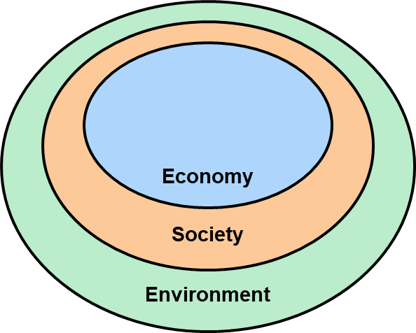
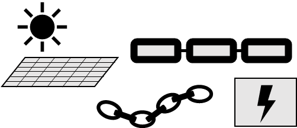
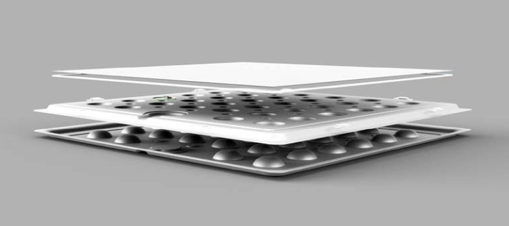
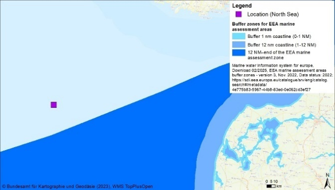
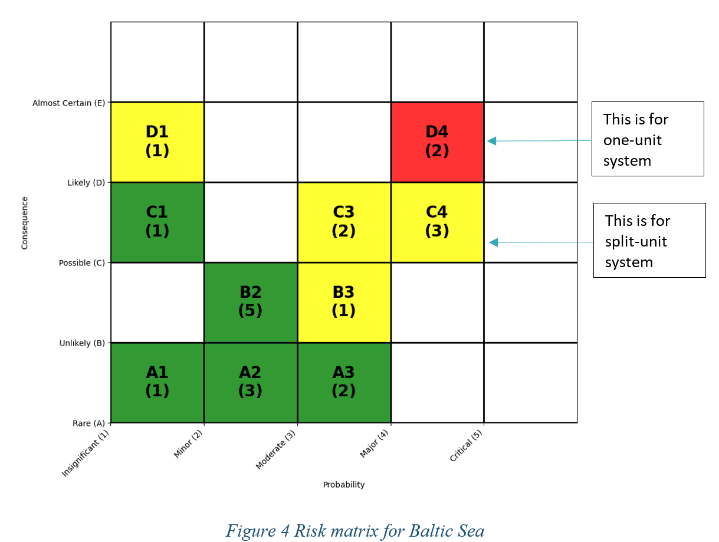

> Source: `SUREWAVE_D7.6_Integrated_Sustainability_Report-v2.docx` — Document date: 2025-11-05 — Converted: 2026-09-28 via pandoc/pdftotext

---

##### 

Deliverable number: D7.6

+--------------------------------------------------------------------------------------------------------------------------------------------------------------------------------------------------------------------------------------------------------------------------------------------------------+
| #####                                                                                                                                                                                                                                                                                                  |
+=============================================================================================================================================================+==========================================================================================================================================+
| ##### {width="7.8701301399825025in" height="2.5902777777777777in"}                                                                                                                                                                                                                |
+--------------------------------------------------------------------------------------------------------------------------------------------------------------------------------------------------------------------------------------------------------------------------------------------------------+
| ##### SUREWAVE -- Structural Reliable Offshore Floating PV Solution Integrating Circular Concrete Floating Breakwater                                                                                                                                                                                  |
+--------------------------------------------------------------------------------------------------------------------------------------------------------------------------------------------------------------------------------------------------------------------------------------------------------+
| ##### **Integrated sustainability assessment of offshore floating PV systems**                                                                                                                                                                                                                         |
+--------------------------------------------------------------------------------------------------------------------------------------------------------------------------------------------------------------------------------------------------------------------------------------------------------+
| #####                                                                                                                                                                                                                                                                                                  |
|                                                                                                                                                                                                                                                                                                        |
| #####                                                                                                                                                                                                                                                                                                  |
|                                                                                                                                                                                                                                                                                                        |
| ##### **Disclaimer:**                                                                                                                                                                                                                                                                                  |
|                                                                                                                                                                                                                                                                                                        |
| > The SUREWAVE project is funded by the European Union. Views and opinions expressed are however those of the author(s) only and do not necessarily reflect those of the European Union. Neither the European Union nor the granting authority can be held responsible for them.                       |
+--------------------------------------------------------------------------------------------------------------------------------------------------------------------------------------------------------------------------------------------------------------------------------------------------------+
| #####                                                                                                                                                                                                                                                                                                  |
+-------------------------------------------------------------------------------------------------------------------------------------------------------------+------------------------------------------------------------------------------------------------------------------------------------------+
| ##### The SUREWAVE project has received funding from the European Union\'s Horizon Europe Research and innovation funding programme under GA No. 101083342. | ##### {width="3.00255249343832in" height="0.6299212598425197in"}                                                    |
+-------------------------------------------------------------------------------------------------------------------------------------------------------------+------------------------------------------------------------------------------------------------------------------------------------------+

Deliverable details

  -------------------------------------------------------------------------------
  Work package:          7
  ---------------------- --------------------------------------------------------
  Task:                  7.6

  Document name:         D7.6 -- Report on integrated sustainability assessment

  Lead beneficiary:      IFEU

  Dissemination level:   PU

  Deliverable type:      R

  Due date:              30.09.2025

  Delivery date:         05.11.2025
  -------------------------------------------------------------------------------

  ---------------------------------------------------------------------------------------------------------------------------------
   **Document version**    **Date**   **Authors**                                                                 **Comments**[^1]
  ---------------------- ------------ -------------------------------------------------------------------------- ------------------
           1.0            08.08.2025  Dr Heiko Keller, Dr Maximilian Breyer, Dr Hanna Karg, Dr Guido Reinhardt         Draft

           2.0            10.10.2025  Dr Heiko Keller, Dr Maximilian Breyer, Dr Hanna Karg, Dr Guido Reinhardt       Version-1

           3.0            01.11.2025  Balram Panjwani and Jon Samseth                                                 Review-1

           4.0            05.11.2025  Dr Heiko Keller                                                                  Final
  ---------------------------------------------------------------------------------------------------------------------------------

+--------------------------------------------------------------------------------------------------------------------------------------------------+
| **Dissemination level**                                                                                                                          |
+:===================================:+:==========================================================================================================:+
| PU                                  | > Public: fully open                                                                                       |
+-------------------------------------+------------------------------------------------------------------------------------------------------------+
| SEN                                 | > Sensitive: limited under the conditions of the Grant Agreement                                           |
+-------------------------------------+------------------------------------------------------------------------------------------------------------+
| EU classified                       | > EU classified: restraint -- UE/EU-restricted, confidential, secret-UE/EU, secret under Decision 2015/444 |
+-------------------------------------+------------------------------------------------------------------------------------------------------------+
| **Deliverable type**                                                                                                                             |
+-------------------------------------+------------------------------------------------------------------------------------------------------------+
| R                                   | > Document, report (excluding the periodic and final reports)                                              |
+-------------------------------------+------------------------------------------------------------------------------------------------------------+
| DEM                                 | > Demonstrator, pilot, prototype, plan designs                                                             |
+-------------------------------------+------------------------------------------------------------------------------------------------------------+
| DEC                                 | > Websites, patents filing, press & media actions, videos, etc.                                            |
+-------------------------------------+------------------------------------------------------------------------------------------------------------+
| OTHER                               | > Software, technical diagram, etc.                                                                        |
+-------------------------------------+------------------------------------------------------------------------------------------------------------+

Deliverable Review

+----------------------------------------------------------------------------------+-----------------+---------------------------------------+-----------------+-----------------+---------------------------------------+-----------------+
|                                                                                  | **Reviewer #1: Jon Samseth**                                              | **Reviewer #2: Balram Panjwani**                                          |
|                                                                                  +-----------------+---------------------------------------+-----------------+-----------------+---------------------------------------+-----------------+
|                                                                                  | **Answer**      | **Comments**                          | **Type\***      | **Answer**      | **Comments**                          | **Type\***      |
+----------------------------------------------------------------------------------+-----------------+---------------------------------------+-----------------+-----------------+---------------------------------------+-----------------+
| 1.  Is the deliverable in accordance with                                                                                                                                                                                                |
+----------------------------------------------------------------------------------+-----------------+---------------------------------------+-----------------+-----------------+---------------------------------------+-----------------+
| (i) The Description of Work?                                                     | Yes             |                                       | M               | Yes             |                                       | M               |
|                                                                                  |                 |                                       |                 |                 |                                       |                 |
|                                                                                  | No              |                                       | m               | No              |                                       | m               |
|                                                                                  |                 |                                       |                 |                 |                                       |                 |
|                                                                                  |                 |                                       | a               |                 |                                       | a               |
+----------------------------------------------------------------------------------+-----------------+---------------------------------------+-----------------+-----------------+---------------------------------------+-----------------+
| (ii) The international State of the Art?                                         | Yes             | *Not applicable for this deliverable* | M               | Yes             | *Not applicable for this deliverable* | M               |
|                                                                                  |                 |                                       |                 |                 |                                       |                 |
|                                                                                  | No              |                                       | m               | No              |                                       | m               |
|                                                                                  |                 |                                       |                 |                 |                                       |                 |
|                                                                                  |                 |                                       | a               |                 |                                       | a               |
+----------------------------------------------------------------------------------+-----------------+---------------------------------------+-----------------+-----------------+---------------------------------------+-----------------+
| 2.  Is the quality of the deliverable in a status                                                                                                                                                                                        |
+----------------------------------------------------------------------------------+-----------------+---------------------------------------+-----------------+-----------------+---------------------------------------+-----------------+
| (i) That allows it to be sent to European Commission?                            | Yes             |                                       | M               | Yes             |                                       | M               |
|                                                                                  |                 |                                       |                 |                 |                                       |                 |
|                                                                                  | No              |                                       | m               | No              |                                       | m               |
|                                                                                  |                 |                                       |                 |                 |                                       |                 |
|                                                                                  |                 |                                       | a               |                 |                                       | a               |
+----------------------------------------------------------------------------------+-----------------+---------------------------------------+-----------------+-----------------+---------------------------------------+-----------------+
| (ii) That needs improvement of the writing by the originator of the deliverable? | Yes             |                                       | M               | Yes             |                                       | M               |
|                                                                                  |                 |                                       |                 |                 |                                       |                 |
|                                                                                  | No              |                                       | m               | No              |                                       | m               |
|                                                                                  |                 |                                       |                 |                 |                                       |                 |
|                                                                                  |                 |                                       | a               |                 |                                       | a               |
+----------------------------------------------------------------------------------+-----------------+---------------------------------------+-----------------+-----------------+---------------------------------------+-----------------+
| (iii) That need further work by the Partners responsible for the deliverable?    | Yes             |                                       | M               | Yes             |                                       | M               |
|                                                                                  |                 |                                       |                 |                 |                                       |                 |
|                                                                                  | No              |                                       | m               | No              |                                       | m               |
|                                                                                  |                 |                                       |                 |                 |                                       |                 |
|                                                                                  |                 |                                       | a               |                 |                                       | a               |
+----------------------------------------------------------------------------------+-----------------+---------------------------------------+-----------------+-----------------+---------------------------------------+-----------------+

\* Type of comments: M = Major comment; m = minor comment; a = advice

**Contact**

Dr Heiko Keller, <heiko.keller@ifeu.de>\
IFEU -- Institute for Energy and Environmental Research Heidelberg\
Wilckensstr. 3, 69120 Heidelberg, Germany; [www.ifeu.de](http://www.ifeu.de)

**Suggested citation**

Keller, H., Breyer, M., Karg, H., Reinhardt, G. (2025): Integrated sustainability assessment of offshore floating PV systems (D7.6). In: SUREWAVE project reports, supported by the EU's Horizon 2020 research and innovation programme under grant agreement No 101083342, IFEU - Institute for Energy and Environmental Research Heidelberg, Heidelberg, Germany. <https://www.ifeu.de/en/project/surewave>.

# Executive summary 

The SUREWAVE project *\"Structurally reliable offshore floating PV solution integrating circular concrete floating breakwater\"*, funded by the European Union\'s Horizon Europe research and innovation funding programme, is developing and testing a new concept for floating photovoltaic (PV) systems in offshore marine environments. The main challenge is to protect the solar modules from the sometimes harsh weather and marine conditions. The aim is to massively expand the area suitable for PV installations and thus to support the European Union's decarbonisation ambitions. Among other things, the project has developed floating breakwaters made of innovative concrete mixtures and innovative, more stable connectors between the individual solar modules.

The project is accompanied by an integrated sustainability assessment. The sustainability of the innovative concept was analysed from a technological, environmental, social and economic perspective. Several scenarios were examined involving offshore floating PV units of about 10 MW at several European sea locations to cover the whole spectrum of different conditions such as in solar irradiation, metocean conditions, and sea depths.

This study presents the results of the final integrated assessment carried out by IFEU ‑ Institute for Energy and Environmental Research Heidelberg, Germany, that joins all previous results and provides integrated recommendations.

**Main results**

The study shows that offshore FPV systems can be a sustainable additional renewable option to replace fossil-based electricity generation, in particular coal power, while impacts are as expected higher than for land-based PV or wind power. Therefore, offshore FPV can play an important role in preserving very limited remaining greenhouse gas emission budgets where further onshore PV deployment is limited or too slow for a fast phase-out of fossil-based electricity. From a sustainability perspective, FPV should be demonstrated offshore at a relevant intermediate scale as quickly as remaining technological de-risking allows. Otherwise, the current state of research and development is far enough to allow for significant savings of greenhouse gas emissions at scale while acceptable further sustainability impacts can be ensured if certain conditions are met.

**Conditions for a sustainable deployment of offshore FPV**

Environmental benefits only arise from accelerating the phase-out of fossil-based electricity. Therefore, offshore FPV needs to target those regional markets in which this is the case and competition with wind power or land-based PV is largely avoided.

A high efficiency is important to improve most sustainability aspects including economics. Efficiency is in large parts connected to the location via high electricity yields and/or low material intensity as well as limited efforts for installation and maintenance. Beneficial are a high solar radiation such as in the Mediterranean Sea, mild metocean conditions (i.e. wind and waves) and small depths to reduce material demand for anchoring and mooring as well as short distance to shore or to an existing offshore grid connection and to the next harbour to reduce the demand for cables and vessel fuel for installation and maintenance, respectively. The extent to which each of these factors contributes to the advantages depends on the analysed sustainability indicator. Since the levelised cost of electricity (LCOE) was found to be most sensitive to these conditions, it is a promising proxy to identify locations that allow for efficient FPV electricity generation. The Mediterranean Sea was found to be particularly advantageous. For marginally profitable locations further away from harbours (e.g. more than 100 km), measures to reduce emissions from vessels used for offshore FPV installation and maintenance are additionally advisable to limit air pollution.

Further conditions have to be met for a sustainable implementation also at locations that allow for efficient electricity generation: Sensitive ecotopes in particular in locations with shallow waters and migration routes of marine mammals must not be substantially disturbed and socially beneficial procurement is required. This can lead to a certain degree of goal conflicts in particular because shallow waters reduce material intensity and socially beneficial procurement might exclude some very cheap providers. Nonetheless, these conflicts can and need to be managed and do not prevent a sustainable and profitable offshore FPV deployment.

**Technological optimisations and challenges**

All analysed technical configurations of the offshore FPV unit itself, consisting of floating PV modules surrounded by concrete-based breakwaters, show a sufficient environmental and social sustainability. Furthermore, more profitable technical choices tend to be more sustainable, too, if above conditions regarding local environment and procurement are met. Only the choice of the layout requires considerations under some conditions: Large uniform units are preferred over 5 units of about 2 MW each because of the lower material intensity if durability is supported by offshore experience and if shading of sensitive ecosystems is not an issue at the given location. Overall, sustainability assessment results are supported by the fact that the core components FPV modules and breakwaters are modular and resulting in a comparatively low uncertainty regarding material inputs at the end of this research project. From a technological perspective, the development of offshore FPV has progressed significantly, providing strong potential for safe and reliable long-term operation in offshore environments. The most critical challenge identified during earlier assessments was the hinge system connecting PV modules. Initial designs (v2) were unable to withstand extreme hydrodynamic loads, with simulations showing hinge loads up to **54 kN**, far exceeding the previous ULS of **14 kN**. A new hinge design (generation v3) spanning the full width of the floater (1.88 m) was introduced, increasing ULS from 14 kN to 37 kN.. Updated simulations confirm substantial improvements: hinge loads have been reduced to **34 kN** in the Baltic Sea and **33 kN** in the Mediterranean---both below the ULS threshold---while North Sea loads decreased to **40 kN**, which remains above ULS but represents a major improvement. This mitigation transforms hinge failure from a critical vulnerability into a manageable risk, enabling progression toward TRL 7. Future work should focus on further hinge optimisation, nonlinear hydrodynamic simulations, and full-scale offshore testing to validate performance under extreme conditions. In parallel, enhancements to breakwater design for circularity and continued material innovation will support sustainability improvements beyond current achievements. These steps will ensure that the SUREWAVE concept evolves into a robust, economically viable, and environmentally responsible solution for offshore renewable energy deployment.

[]{.mark}

**Summary and outlook**

The offshore FPV technology developed in this project shows a high potential to become an additional sustainable option to decarbonise regional electricity markets where an acceleration of PV deployment is beneficial and should thus be tested at relevant scales as soon as possible. This report contains detailed recommendations from a sustainability perspective to policymakers, research funding agencies, investors and technology developers in industry and science on how to realise the sustainability potentials in upscaling and deployment. Results from detailed numeric analyses are put into a wider context of further aspects such as grid integration, potential mutually conflicting interests of stakeholders such as in fisheries, nature protection and defence or initial highly profitable niche applications at existing offshore installations that should be considered for the next steps. Taken together, a fast and well-planned deployment of offshore FPV at scale can become a valuable contribution to preserving very limited remaining carbon budgets.

Table of Contents

[Executive summary [4](#executive-summary)](#executive-summary)

[1. Introduction [9](#introduction)](#introduction)

[1.1. Background: Sustainability assessment [9](#background-sustainability-assessment)](#background-sustainability-assessment)

[1.2. Implementation of sustainability assessment within SUREWAVE [10](#implementation-of-sustainability-assessment-within-surewave)](#implementation-of-sustainability-assessment-within-surewave)

[2. Methodology [12](#methodology)](#methodology)

[2.1. Common definitions and settings [12](#common-definitions-and-settings)](#common-definitions-and-settings)

[2.1.1. Goal definition [12](#goal-definition)](#goal-definition)

[2.1.2. Scope definition [13](#scope-definition)](#scope-definition)

[2.2. Integrated life cycle sustainability assessment (ILCSA) [15](#integrated-life-cycle-sustainability-assessment-ilcsa)](#integrated-life-cycle-sustainability-assessment-ilcsa)

[2.2.1. General approach [15](#general-approach)](#general-approach)

[2.2.2. Collection of indicators and results [16](#collection-of-indicators-and-results)](#collection-of-indicators-and-results)

[2.2.3. Additional indicators [16](#additional-indicators)](#additional-indicators)

[2.2.4. Benchmarking [17](#benchmarking)](#benchmarking)

[2.2.5. Overall comparison [17](#overall-comparison)](#overall-comparison)

[3. System description [18](#system-description)](#system-description)

[3.1. General concept [18](#general-concept)](#general-concept)

[3.1.1. Main concept: one unit [18](#main-concept-one-unit)](#main-concept-one-unit)

[3.1.2. Alternative concept: split units [19](#alternative-concept-split-units)](#alternative-concept-split-units)

[3.2. Life cycle stages [20](#life-cycle-stages)](#life-cycle-stages)

[3.2.1. Components and their production [20](#components-and-their-production)](#components-and-their-production)

[3.2.2. Installation [24](#installation)](#installation)

[3.2.3. Maintenance [24](#maintenance)](#maintenance)

[3.2.4. Dismantling and end of life [24](#dismantling-and-end-of-life)](#dismantling-and-end-of-life)

[3.3. Locations [25](#locations)](#locations)

[3.4. Reference systems [27](#reference-systems)](#reference-systems)

[3.5. SUREWAVE scenarios [27](#surewave-scenarios)](#surewave-scenarios)

[4. Summaries of contributing studies [29](#summaries-of-contributing-studies)](#summaries-of-contributing-studies)

[4.1. Summary of technological assessment [29](#summary-of-technological-assessment)](#summary-of-technological-assessment)

[4.2. Summary of environmental assessment [34](#summary-of-environmental-assessment)](#summary-of-environmental-assessment)

[4.3. Summary of economic assessment [37](#summary-of-economic-assessment)](#summary-of-economic-assessment)

[4.4. Summary of social assessment [41](#summary-of-social-assessment)](#summary-of-social-assessment)

[5. Results and conclusions [46](#results-and-conclusions)](#results-and-conclusions)

[5.1. Overview of sustainability impacts [46](#overview-of-sustainability-impacts)](#overview-of-sustainability-impacts)

[5.1.1. Selection of scenarios and indicators [46](#selection-of-scenarios-and-indicators)](#selection-of-scenarios-and-indicators)

[5.1.2. Additional indicators [47](#additional-indicators-1)](#additional-indicators-1)

[5.1.3. Categorisation [47](#categorisation)](#categorisation)

[5.1.4. General sustainability performance [50](#general-sustainability-performance)](#general-sustainability-performance)

[5.2. Comparison of scenarios [53](#comparison-of-scenarios)](#comparison-of-scenarios)

[5.2.1. Identification of benchmark scenarios [53](#identification-of-benchmark-scenarios)](#identification-of-benchmark-scenarios)

[5.2.2. Benchmark I: electricity from coal [54](#benchmark-i-electricity-from-coal)](#benchmark-i-electricity-from-coal)

[5.2.3. Benchmark II: North Sea, short cable [57](#benchmark-ii-north-sea-short-cable)](#benchmark-ii-north-sea-short-cable)

[5.2.4. Benchmark III: Mediterranean Sea, short cable [60](#benchmark-iii-mediterranean-sea-short-cable)](#benchmark-iii-mediterranean-sea-short-cable)

[5.3. Wider context [63](#wider-context)](#wider-context)

[6. Recommendations [66](#recommendations)](#recommendations)

[6.1. To policy makers and research funding agencies [66](#to-policy-makers-and-research-funding-agencies)](#to-policy-makers-and-research-funding-agencies)

[6.2. To investors [68](#to-investors)](#to-investors)

[6.3. To technology developers in industry and science [71](#to-technology-developers-in-industry-and-science)](#to-technology-developers-in-industry-and-science)

[7. Acknowledgements [75](#acknowledgements)](#acknowledgements)

[8. Abbreviations [75](#abbreviations)](#abbreviations)

[9. References [77](#references)](#references)

# Introduction

Offshore floating PV (FPV) is considered a promising option to complement existing renewable energy sources in the energy transition. Therefore, the European Commission has funded the project *\"Structurally reliable offshore floating PV solution integrating circular concrete floating breakwater\" (SUREWAVE) under the* European Union\'s Horizon Europe research and innovation funding programme. The main purpose of this project is to develop and test a new concept for floating photovoltaic systems in offshore marine environments. The main challenge is to protect the solar modules from the sometimes harsh weather and marine conditions. The aim is to massively expand the area suitable for PV installations and thus to support the European Union's decarbonisation ambitions. Among other things, the project has developed floating breakwaters made of innovative concrete mixtures and innovative, stable connectors between the individual solar modules.

The project is accompanied by an integrated sustainability assessment. The sustainability of the innovative concept was previously analysed from a technological, environmental, social and economic perspective. This study presents the results of the integrated assessment, which combines all of these individually assessed aspects of sustainability, and is carried out by IFEU‑Institute for Energy and Environmental Research Heidelberg, Germany.

## Background: Sustainability assessment

The most well-known definition of sustainability can be found in the report of the Brundtland Commission: 'sustainable development is development that meets the needs of the present without compromising the ability of future generations to meet their own needs' \[UN 1987\]. At the 2005 World Summit it was noted that this requires the reconciliation of environmental, social and economic demands -- the \"three pillars\" of sustainability. This view has been expressed as a scheme using three overlapping circles indicating that the three pillars of sustainability are not mutually exclusive and can be mutually reinforcing ([Figure 1](#_Ref153265083)).

+---------------------------------------------------------------------------------------------------------------------+----------------------------------------------------------------------------------------------------------------------------------------+
| {width="1.571661198600175in" height="1.4960629921259843in"}                                    | {width="1.811023622047244in" height="1.4512325021872265in"}                                                       |
|                                                                                                                     |                                                                                                                                        |
| []{#_Ref153265083 .anchor}Figure 1: Scheme of sustainable development: at the confluence of three constituent parts | []{#_Ref153265110 .anchor}Figure 2: Scheme indicating the relationship between the three pillars of sustainability \[Scott-Cato 2008\] |
+=====================================================================================================================+========================================================================================================================================+

The UN[]{.indexref entry="UN" crossref="United Nations"} definition is not universally accepted and has undergone various interpretations. For many environmentalists the idea of sustainable development is an oxymoron as development seems to entail environmental degradation. From this perspective, the economy is a subsystem of the human society, which in itself is a subsystem of the ecosphere; thus a gain in one sector is a loss from another. This can be illustrated as three ellipses ([Figure 2](#_Ref153265110)).

As a result of the growing pressure on the environment and increased scarcity of some important natural resources, the sustainability discussion is often focussed on the environment, as both society and economy are constrained by environmental limits. There is abundant scientific evidence that mankind is currently living unsustainably and jeopardising the living conditions of future generations, e.g. by excessive use of resources and excessive use of the environment as a sink, e.g. for greenhouse gas emissions. Hence, strong efforts are needed to identify and develop sustainable technologies that are able to reconcile economic, social and environmental demands.

## Implementation of sustainability assessment within SUREWAVE

The integrated assessment of sustainability carried out in []{.indexref entry="WP" crossref="Work package"}the SUREWAVE project takes into account all major pillars of sustainability. The work flow structure of the related integrated life cycle sustainability assessment is depicted in [Figure 3](#_Ref195713648).

![[]{#_Ref195713648 .anchor}Figure 3: Structure of the work package on sustainability assessment in SUREWAVE.](../images/2025-11-05_surewave_d7.6_integrated_sustainability_report/image5.emf){width="6.175694444444445in" height="3.093974190726159in"}

In order to achieve reliable and robust sustainability assessment results, it is inevitable that the principles of comprehensiveness and life cycle thinking (LCT[]{.indexref entry="LCT" crossref="Life cycle thinking"}) are applied. LCT means that all life cycle stages for products are considered, i.e. the complete supply or value chains, from the production of technological components as well as their respective material inputs, through installation and operation, to dismantling and end-of-life treatment / final disposal (see [Figure 4](#_Ref197422991) and section [2.1.2](#scope-definition)). Through such a systematic overview and perspective, the unintentional shifting of environmental burdens, economic benefits and social well-being between life cycle stages or individual processes can be identified and possibly avoided or at least minimised.

![[]{#_Ref197422991 .anchor}Figure 4: Sustainability assessment in SUREWAVE: Life cycle sustainability assessment compares the whole life cycles of all involved technologies/products (simplified illustration).](../images/2025-11-05_surewave_d7.6_integrated_sustainability_report/image6.emf){width="6.3in" height="3.214583333333333in"}

The performance of each technological approach is compared to alternative reference technologies, e.g. conventional energy production. Relevant aspects of sustainability are analysed using methodologies that are based on LCT. In this project, relevant sustainability impacts were covered using (environmental) life cycle assessment (LCA[]{.indexref entry="LCA" crossref="Life cycle assessment"}), social life cycle assessment (S-LCA[]{.indexref entry="S-LCA" crossref="Social life cycle assessment"}) and an economic analysis based on the levelised costs of electricity (LCOE[]{.indexref entry="LCOE" crossref="Levelised costs of electricity"}) complemented by life cycle environmental impact assessment (LC-EIA[]{.indexref entry="LC-EIA" crossref="Life cycle environmental impact assessment"}) and a technical risk assessment. These complementary sustainability aspects are brought together in this report according to the methodology of integrated life cycle sustainability assessment (ILCSA[]{.indexref entry="ILCSA" crossref="Integrated life cycle sustainability assessment"}) \[Keller et al. 2015\].

# Methodology

This chapter describes the applied methodology. Definitions and settings common to all sustainability assessments within the SUREWAVE project (compare [Figure 3](#_Ref195713648) in section [1.2](#implementation-of-sustainability-assessment-within-surewave)), such as goal and scope, are described in section [2.1](#common-definitions-and-settings), and the methodologies and settings applied for the integrated sustainability assessment are described in section [2.2](#integrated-life-cycle-sustainability-assessment-ilcsa).

## Common definitions and settings

A well-founded sustainability assessment requires common definitions and settings on which the technological, environmental, economic and social assessments are based. Thus, general definitions and settings ensure consistent data and results for the integrated sustainability assessment. The goal and scope definition is the first phase of any sus­tainability assessment and is relevant for all sub-analyses on technological, environmental, economic and social impacts.

### Goal definition

The comprehensiveness and depth of detail of the environmental assessment can differ considerably depending on its goal. Therefore, the intended applications, the reasons for carrying out the study, and the decision context have to be described within the goal definition.

#### Intended applications

The environmental assessment within the SUREWAVE project aims at two separate applications:

1.  Project-internal support of ongoing process development. This makes this study an ex-ante assessment because the systems to be assessed are not yet implemented in this particular form on a relevant scale and for a sufficiently long time.

2.  To provide a basis to communicate findings of the SUREWAVE project to external stakeholders, especially science, industry, and policy makers.

#### Guiding questions

The following questions guide the sustainability assessment.

**Main question**:

Which sustainability impacts are associated with renewable electricity generation using offshore floating photovoltaic (FPV[]{.indexref entry="FPV" crossref="Floating photovoltaic"}) in Europe?

Additionally, the following **sub-questions** have been identified in an internal workshop with all project partners:

- Which parameters or life cycle stages determine the sustainability impacts significantly and what are the resulting optimisation potentials?

<!-- -->

- What are the differences of sustainability impacts if offshore PV is compared to fossil fuels such as coal-based electricity?

<!-- -->

- What are the differences of sustainability impacts if offshore PV is placed in the North Sea, the Baltic Sea or the Mediterranean Sea representing different conditions?

  Further questions to be answered in **excursus**:

<!-- -->

- What are the differences of sustainability impacts associated with a split FPV concept (five smaller units) in contrast to one large uniform concept?

<!-- -->

- What are the differences of sustainability impacts if the SUREWAVE FPV is placed within an existing offshore wind park?

<!-- -->

- What are the differences concerning the carbon footprint of the innovative SUREWAVE "new" breakwater systems compared with conventional breakwaters (expanded polystyrene core)?

### Scope definition

With the scope definition, the object of the sustainability assessment (i.e. the exact product or other system(s) to be analysed) is identified and described. The scope should be sufficiently well defined to ensure that the comprehensiveness, depth and detail of the study are compatible and sufficient to address the stated goal. Resulting definitions and settings are used in the subsequent analyses (tasks) to guarantee the consistency between the different assessments of environmental, economic and social implications.

#### System boundaries

System boundaries determine which processes are to be included into the assessment and which not, e. g. if the whole life cycle is analysed or only a part of it.

In SUREWAVE, the entire supply chain including input production, assembly, operational phase, and decommissioning is assessed (**cradle-to-grave**). These boundaries apply to the environmental, economic, and social assessment.

This setting was chosen as the concept of life cycle thinking, which integrates existing consumption and production strategies, thereby preventing a piece-meal approach. Life cycle approaches avoid problem shifting from one life cycle stage to another, from one geographic area to another and from one environmental medium or protection target to another.

For **local environmental impacts**, however, analysis **includes impacts on marine and coastal ecosystems only**. Here, most relevant impacts are expected while least knowledge is available.

#### Geographical coverage

Geography determines a range of used background data. Within SUREWAVE this concerns e.g. metocean conditions and available transport systems, which are primarily relevant for economic assessment and LCA, and information on depth range, hydrography and type of sea floor, currents, distance to shoreline and other parameters that are primarily relevant for the assessment of local environmental impacts.

Generally, the assessment covers European seas. To make best use of available resources and to achieve a good balance of specificity and coverage, it uses exemplary locations to derive relevant insights including research questions for possible future studies.

**Three exemplary locations** were chosen for further analyses in D2.1 "Use case scenario basis for typical, rough location" based on various project considerations (see D2.1 for details). They are

- The Greater North Sea (56°54\'N, 05°00\'E) representing harsh conditions

- The Western Mediterranean (39°00\'N, 00°00\'E) representing mid conditions

- The Baltic Sea (54°47′N, 13°23′E) representing mild conditions[^2].

They were selected to cover the whole range of conditions that lead to higher or lower efforts for materials, logistics and electricity yields, and thus also costs. These ranges concern the local wave conditions, sea depth, distance to shore and solar irradiation. Further information is provided in section [3.3](#locations).

In particular for the investigation of local environmental impacts, more generic areas are analysed, in which conditions are similar to the specific conditions at the selected locations. Thus, this analysis does not aim at studying the specific locations listed as it would be needed e.g. for an approval process.

#### Technical reference

The technical reference describes the technology to be assessed in terms of scale, development status, and maturity.

The SUREWAVE system is assessed as **mature, industrial-scale technology** to ensure comparability to established alternatives. The respective scenarios go beyond the TRL[]{.indexref entry="TRL" crossref="Technology readiness level"}5 pursued with the technical work done within the project.

#### Time frame

The SUREWAVE system must be described not only in space but also in time. The timeframe of the assessment determines e.g. the development status of used technology. Likewise, the environmental impact associated with conventional products changes over time, e.g. greenhouse gas emissions associated with electricity generation. Like geography, the time frame of the assessment hence determines background datasets used.

2030 was selected as first realistic year in which the technology could be mature and available.

#### Reference unit - Functional unit

The functional unit is a key element of sustainability assessment. It is a reference to which the environmental, social and economic effects of the studied system are related, and is typically a measure for the function of the studied system. Consequently, it is the basis for the comparison of different systems.

For the SUREWAVE sustainability assessment, 1 kWh of produced electricity is used as the functional unit. In individual cases, however, it can be convenient to show the results with other units of references. For instance, investment costs in the economic assessment are usually provided per installed peak power.

## Integrated life cycle sustainability assessment (ILCSA)

The integrated sustainability assessment in SUREWAVE is based on the integrated life cycle sustainability assessment (ILCSA) methodology \[Keller et al. 2015\]. In the following sub-sections, specific settings and methodological choices are detailed.

### General approach

ILCSA extends the concept of environmental life cycle assessment (LCA). It consists of the same general phases as an LCA study and provides a framework for integrated LCA, LCC[]{.indexref entry="LCC" crossref="Life cycle costing"} or TEA[]{.indexref entry="TEA" crossref="Techno-economic assessment"}, S-LCA and further analyses ([Figure 5](#_Ref191647231)). To ensure that results of integrated analysis are compatible, ILCSA studies provide common goal and scope definitions (see section [2.1](#common-definitions-and-settings)) and common scenarios resulting from common system modelling (see chapter [3](#system-description)).

![[]{#_Ref191647231 .anchor}Figure 5: Phases of integrated life cycle sustainability assessment (ILCSA) studies.](../images/2025-11-05_surewave_d7.6_integrated_sustainability_report/image7.emf){width="4.358208661417323in" height="2.2052602799650045in"}

LCA: (environmental) life cycle assessment, LCC: lifecycle costing, S-LCA: social life cycle assessment. Adapted from \[Keller et al. 2015\].

Results are then joined to deliver common conclusions and recommendations. There are two general ways of integrating a diverse set of indicator results of a set of scenarios:

#### Weighting and mathematical integration

All indicators could be mathematically combined into one score using weighting factors or ranked otherwise according to a weighting algorithm. These approaches, in particular the required weighting factors or schemes, cannot be entirely based on scientific facts but depend on personal value-based choices defined beforehand. Furthermore, conflict situations do not become apparent and decisions regarding these conflicts depend on weighting factors, which are hard to understand for decision-makers not involved in the study. Therefore, this approach is not applied.

#### Structured discussion

All strengths, weaknesses and conflicts of the options can be discussed verbally argumentatively. This can make conflicts transparent and enable their active management. Considering the number of options and indicators, this requires a structured approach. This approach is followed in this study. This section describes the methodology used for the structured comparison and presentation of decision options based on a multi-criteria analysis.

### Collection of indicators and results

Indicators and results for all scenarios are provided by the parallel assessments addressing one single sustainability perspective each \[Breyer et al. 2025; Karg & Keller 2025; Larsen 2025; Panjwani 2025\]. They are collected in overview tables. In some cases, indicators are selected or aggregated by the authors of the respective contributing studies to focus on the most relevant aspects for decision support.

The integrated sustainability assessment of this project is based on:

- 2 qualitative and 1 semi-quantitative indicators from the technological risk assessment

- 6 quantitative environmental indicators from the life cycle assessment (LCA)

- 4 qualitative environmental indicators from the life cycle environmental impact assessment (LC-EIA)

- 5 quantitative economic indicators from the economic assessment

- 5 quantitative social indicators from the social life cycle assessment (S-LCA)

Specific settings, methodological choices, and data sources apply unchanged as documented in the respective reports.

For comparability to qualitative indicators, quantitative indicators are categorised and the tables are coloured accordingly (see also [Figure 19](#_Ref192771107)). Dark and light green fields represent advantageous results compared to the range of all analysed alternatives. Yellow fields represent intermediate results while orange and red fields represent the disadvantageous end of the range. Thresholds are generally defined by dividing the range of all analysed alternatives into 5 equally wide sections. Deviations are defined in section [5.1.3](#categorisation) to reflect specific goals of the study. This way of categorising results supports the identification of options that perform best among all studied options but also maintains the quantitative information on the sustainability performance of a scenario.

### Additional indicators

Climate protection under the condition of limited financial resources has to use the available financial resources as efficiently as possible. Efficiency means here to achieve the highest possible greenhouse gas (GHG[]{.indexref entry="GHG" crossref="Greenhouse gas"}) emission savings with the lowest monetary expenditures necessary for that. GHG abatement costs are frequently used as indicator for this purpose. GHG abatement costs are defined as quotient of the differential costs for a GHG reduction measure and the avoided GHG emissions by this measure.

GHG abatement costs represent an efficiency indicator to prioritise expenses such as subsidies. Abatement costs have to be interpreted carefully because in many situations their robustness and comparability are poor. For further details and a critical review of the method see \[Pehnt et al. 2010\]. This indicator was evaluated and discarded because it did not yield additional insights (see section [5.1.2](#additional-indicators-1)).

### Benchmarking

The benchmarking step compares all scenarios to one benchmark scenario. This serves the purpose to answer questions such as 'What are the trade-offs if the economically most favourable scenario would be implemented?'. Benchmarking tables focus the attention on one decision option and deliver additional information on the robustness of differences.

The benchmark is chosen according to the questions to be answered and the respective perspectives of various stakeholders. Depending on the question to be answered, overview tables may contain all or a part of the indicators and scenarios. The unit of reference underlying the comparison of quantitative indicators is chosen according to the question.

A subsequent categorisation of the benchmarking results reflects the robustness of advantages or disadvantages over the benchmark. For all quantitative indicators, the benchmarking process involves calculating the differences between the respective scenario and the benchmark. These comparisons should serve as a decision support to answer the question of whether a scenario performs better than the benchmark regarding a certain indicator. Therefore, these quantitative differences are categorised into very advantageous \[++\], advantageous \[+\], neutral \[0\], disadvantageous \[-\], or very disadvantageous \[\--\] as described in section [5.2](#comparison-of-scenarios).

### Overall comparison

For an overall comparison, a verbal-argumentative discussion of decision options is supported by structured tables containing overviews of original indicator results or benchmarking results. Benchmarking tables can be used to deduce further concrete recommendations that could not be based on the underlying individual indicators but at the same time cannot contain all information from the underlying assessments. The deduction of recommendations from overview and benchmarking tables therefore also requires further in-depth analyses of the contributions e.g., of life cycle stages or unit processes that lead to these results. Obviously, all available information on individual contributions to all results cannot be displayed in one table. Necessary additional information is provided as background information to the reader in the discussion (e.g., differences A, B and C, which become apparent in benchmarking Table Z, are caused by the input of material X in process Y; therefore, the input of material X should be reduced as far as possible.). This way, overview and benchmarking tables provide additional insight, support the discussion, help not to miss any relevant aspect and make recommendations comprehensible.

# System description

To assess the offshore floating PV[]{.indexref entry="PV" crossref="photovoltaic"} system from an sustainability point of view, all life cycle stages must be taken into account. This chapter provides a detailed description of the offshore PV system as well as the assessed locations, reference systems, and final scenarios. [Figure 6](#_Ref152677301) displays a simplified scheme of the offshore PV life cycle.

![[]{#_Ref152677301 .anchor}Figure 6: Simplified scheme of the offshore PV life cycle.](../images/2025-11-05_surewave_d7.6_integrated_sustainability_report/image8.emf){width="6.3in" height="3.3055555555555554in"}

The floating PV solution primarily consists of floating PV modules surrounded by innovative floating breakwater elements. Section [3.1](#general-concept) presents the general concept of the system, while section [3.2](#life-cycle-stages) describes all life cycle stages from the production of components to the final dismantling (cradle to grave).

## General concept

### Main concept: one unit

The main layout concept investigated in this study follows one large uniform circular layout as depicted in [Figure 7](#_Ref193287628). The outer boundary of the system is formed by closely interconnected floating breakwater pontoons which enclose a network of floating photovoltaic modules, i.e. photovoltaic panels mounted to aluminium floats. The modules are arranged in matrices of several dozen modules each. Neighbouring matrices are interrupted by a single row of so-called dummy floats which reflect the same aluminium floats, however, without the photovoltaic panels, enabling maintenance and cleaning of the PV modules. The outer photovoltaic modules are connected to a surrounding circular PVC[]{.indexref entry="PVC" crossref="Polyvinyl chloride"} pipe by elastic polypropylene ropes, while the pipe in turn is connected to the breakwaters. To secure geometrical integrity of the layout, two additional lines of bridge breakwaters cross the photovoltaic setup and are connected to the adjacent modules via PVC pipes and polypropylene ropes. To hold the system in place, several breakwaters along the circle as well as several bridge breakwaters are moored to the seabed via steel chains and anchoring steel piles. The system is equipped with electrical devices specified in section [3.2.1](#components-and-their-production) that are required to transport the produced electricity to shore.

![[]{#_Ref193287628 .anchor}Figure 7: Layout for a 9 MWp plant. © by Sunlit Sea AS.](../images/2025-11-05_surewave_d7.6_integrated_sustainability_report/image9.png){width="5.0in" height="3.8275798337707787in"}

### Alternative concept: split units

To address potential differences in environmental impacts, a second layout concept with the same electricity yield is investigated. Compared to the large uniform concept described in section [3.1.1](#main-concept-one-unit), the required number of floating photovoltaic modules is split into five smaller units equidistantly arranged in a pentagon and individually encircled by breakwaters similar to the main concept. Bridge breakwaters, as they cross the system following the large concept, are not required in the split concept. In total, the concept translates to a 75 % increase of the breakwater number due to a less favourable circumference to area ratio. Each of the five smaller units is individually moored to the seabed. To prevent entanglement of the anchoring and mooring, the individual units are installed with a minimum distance. The split concept is investigated for harsh conditions (i.e. North Sea) only.

## {width="1.86875in" height="0.8034722222222223in"}Life cycle stages

### Components and their production

#### Floating photovoltaic (PV) modules

The floating PV modules reflect a commercial product originally designed by the project partner Sunlit Sea for land locked systems. They consist of monocrystalline solar panels which are mounted on floating substructures. The floats are made from two opposing pressed and rolled marine grade aluminium sheets with cup-shaped dimples which are filled with Styrofoam. Individual modules are connected via a combination of flexible polyurethane hinges as well as metal brackets and electrically wired in series according to the layout presented in section [3.1](#general-concept).

{width="4.490697725284339in" height="2.0in"}

The solar panels are assembled in Lithuania. The final modules are produced in Norway and transported to the respective harbour.

#### Breakwater

The breakwater pontoons, which are connected via a combination of steel ropes and rubber, consist of a reinforced concrete structural shell and a non-structural inner core, designed with a box-shaped cross section ([Figure 9](#_Ref153552224)) (see D3.2). Different shell and core combinations are considered in this study:

- The conventional breakwater design relies on a shell of conventional concrete (CC[]{.indexref entry="CC" crossref="Conventional concrete"}), which complies with the requirements of the applicable concrete standards for floating concrete structures, in combination with steel reinforcement. The shell surrounds a core of expanded polystyrene (EPS[]{.indexref entry="EPS" crossref="Expanded polystyrene"}).

- As part of the SUREWAVE project, ACCIONA developed innovative material solutions both for the shell and core. Two different material solutions were developed for the shell: high-performance concrete (HPC[]{.indexref entry="HPC" crossref="High-performance concrete"}) and lightweight aggregate concrete (LWAC[]{.indexref entry="LWAC" crossref="Lightweight aggregate concrete"}). HPC requires less material than conventional concrete due to its high strength. It further incorporates blast-furnace slag and fly ash, reducing the clinker content in 20%. LWAC replaces 100% conventional lightweight aggregates with recycled glass aggregates and 20% of the weight of natural coarse aggregates with recycled concrete aggregates from construction and demolition waste (CDW[]{.indexref entry="CDW" crossref="Construction and demolition waste"}). The respective shell material is structurally supported by steel reinforcement. For the core of the innovative breakwaters, a circular cellular lightweight concrete (CCLC[]{.indexref entry="CCLC" crossref="Circular cellular lightweight concrete"}) is employed, using a minimum amount of cement and recycled glass aggregates.

The breakwaters are produced in a production facility directly at the harbour. The individual components of the respective concrete solutions for the shell and, in case of the innovative breakwaters, also for the core are cast using a mobile concrete mixing plant. The shell is cast directly around the core. After hardening, the pontoons are transported within the facility with a crawler crane. The components for the shell and core, respectively, are available in Europe and transported by trailers on land.

![[]{#_Ref153552224 .anchor}Figure 9: Cross section of a single breakwater pontoon. © by Clement Germany GmbH.](../images/2025-11-05_surewave_d7.6_integrated_sustainability_report/image12.png){width="4.329350393700787in" height="2.197673884514436in"}

#### Anchoring

To hold the floating system in place and transfer wave loads to the ground, multiple breakwaters are anchored to the seabed while the photovoltaic matrices are secured by their breakwater connection. The multi-point anchoring is realized with two steel chains attached to the longitudinal inside and outside of anchored breakwaters, respectively. While each outer chain leads radially to a separate driven tubular anchor pile, the inner chain configuration differs for harsh, mid, and mild metocean conditions.

In case of mild conditions, each outer anchor pile is opposed by an equidistant pile inside of the breakwater line and connected to the inner chain.

For mid and harsh conditions, however, all inner chains are anchored to one single tubular steel pile beneath the center of the floating system ([Figure 10](#_Ref193287630)).

For logistic reasons, this center pile is assembled from several smaller piles. In the final installation, the steel chains follow a catenary line. The number of required anchor points is specific for the metocean condition and additionally differs between the uniform and split concept at the North Sea location.

The tubular steel piles are available in Europe and transported by trailers on land. The chains are produced in China and transported overseas.

![[]{#_Ref193287630 .anchor}Figure 10: Anchoring concept of the uniform system using the example of mid conditions. © by Clement Germany GmbH.](../images/2025-11-05_surewave_d7.6_integrated_sustainability_report/image13.png){width="3.8188976377952755in" height="3.502734033245844in"}

**Split concept:** The outer anchor points are not opposed by anchor points within the breakwater line but on the opposite site of the circular assembly ([Figure 11](#_Ref190191307)). Furthermore, single anchor piles used with the split concept are smaller compared to the piles used with the uniform concept.

![[]{#_Ref190191307 .anchor}Figure 11: Anchoring concept for one unit of the split layout at harsh conditions (North Sea). © by Clement Germany GmbH.](../images/2025-11-05_surewave_d7.6_integrated_sustainability_report/image14.png){width="3.8976377952755907in" height="3.6680358705161855in"}

#### Electrical connection

The produced electricity from each module matrix is collected in individual combiner boxes located on the dummy floats. These combiners are connected to inverters that convert DC[]{.indexref entry="DC" crossref="Direct current"} electricity generated by solar panels to AC electricity. The inverters are located on the bridge breakwaters and lead to a single transformer station at the center of the floating system. A single AC[]{.indexref entry="AC" crossref="Alternating current"} power cable is installed on the seabed and connects the floating PV system to the shore. At the shore, a small distribution unit is used as the interface to the grid or local consumers. Each breakwater is further equipped with a sensor developed by the project partner CEIT to monitor the structural integrity.

In an alternative scenario (see also [Table 1](#_Ref204013538)), the system is connected to an existing offshore installation such as a wind park or an oil platform. For this, a short floating power cable to the adjacent offshore installation supported by buoys is used instead of a cable to shore.

**Split concept:** The individual units are electrically connected to their respective left and right neighbours, while, again, a single AC power cable leads to the shore or adjacent offshore installations.

#### Accessory devices

Beacons are installed on top of the breakwaters to ensure visibility for passing ships*.*

{width="0.8861111111111111in" height="0.6173611111111111in"}

### Installation

For locations far offshore (i.e. Greater North Sea scenario in section [3.3](#locations)), all components of the offshore PV concept, i.e. floating PV modules, Breakwaters, anchoring steel piles, chains, connections, and electrical components, are loaded to appropriately sized vessels and transported to the installation site. Depending on the layout concept (see section [3.1](#general-concept)), this requires two to four journeys of crane ships with different operation times on site. Anchoring piles are vibrated into the seabed, and breakwaters are offloaded and connected. Breakwaters are towed into their final position by small tugboats. PV modules are installed separately from the breakwaters and anchoring. After installation, the ships return to the harbour.

If the distance between the respective offshore PV location and the shore is comparably close to the shore and if respective logistic facilities are available, pre-assembly of parts of the offshore floating PV system at the harbour and subsequent towing to the final location with tugboats is applied. In addition, overnight positioning of vessels is prevented by returning into the port by the end of each day. Further, maintenance is performed directly from the shoreline due to the small distance, likewise preventing overnight positioning. This variant is considered in scenario 2-3 and 8-9 as listed in section [3.5](#surewave-scenarios), i.e. for the investigated locations in the Mediterranean and Baltic Sea, respectively.

While all other components remain at the installation site for 50 years, the floating PV modules are exchanged after 25 years.

{width="0.5736111111111111in" height="0.5736111111111111in"}

### Maintenance

Maintenance at the breakwater pontoon connections is done four times a year if weather conditions allow. Maintenance of the breakwaters themselves is performed remotely due to the monitoring sensors so that no on-site operatives are required. The floating PV are maintained and cleaned four times a year using drones.

{width="0.6340277777777777in" height="0.5930555555555556in"}

### Dismantling and end of life

After 50 years of operation, the breakwaters as well as the second installation of floating PV modules (see section 3.2.2) are dismantled using appropriately sized vessels. With regard to the other components such as the anchoring piles, partial or complete dismantling may be required or individual elements may remain in the seafloor depending on the approval conditions. The following scenario has been decided by the project team: The mooring chains are cut from the anchor piles below the water line in such a way that 75 % of the steel is transported away for recycling, while 25 % of the respective chain remains on the seabed together with the anchoring piles. Breakwaters, PV modules and chains are loaded to the vessels and transported back to shore. As the polyurethane hinges are tightly connected to the aluminium floats, only limited areas of the floats can be recycled. For all other parts of the PV modules: If material recovery is not possible, at least they are subjected to energy production by combustion in a combined heat and power plant. The cable to shore remains at the seabed. Due to the impacts of biofouling, the breakwaters are sent to landfill unless they can be decontaminated and used e.g. in road construction.

## Locations

In this study, the offshore PV concept is assessed at three different European locations to investigate the effect of different meteorological and oceanographical (metocean) conditions on the sustainability performance of the system.

1.  **Greater North Sea (56°54\'N, 05°00\'E):** This location reflects harsh metocean conditions, i.e. high wave-induced turbulences and extreme weather events. Therefore, the anchoring must meet higher standards which implies increased amounts of material. In addition, solar irradiation is lower compared to the other two locations and the distance to shore is much larger. This site is close to the Ekofisk oil field and to Sørlige Nordsjø II, a possible future offshore wind park, and at a distance of about 170 km to shore and about 275 km to a harbour.

2.  **The Western Mediterranean (39°00\'N, 00°00\'E)**: This location possesses medium metocean conditions and material consumption for anchoring is therefore lower than in the North Sea. At the same time, it has the largest solar irradiation and is the closest to the shore (about 15 km) and 60 km to the next harbour.

3.  **The Baltic Sea (54°47′N, 13°23′E):** This location shows only mild metocean conditions which place the lowest structural demands on the offshore PV system. The amounts of material required for anchoring of the system are lowest, while the solar irradiation is slightly higher than in the North Sea. The distances to shore and to the next harbour are roughly comparable to that of the location in the Mediterranean Sea (about 30 km and 60 km, respectively).

The solar irradiation represents the main driver of the achievable electricity yield, which decreases over the years due to technical degradation of the PV panels. For further information see \[Breyer et al. 2025\].

[Figure 12](#_Ref193288252) indicates the locations in relation to the coast.

Note: At the beginning of the project, a different location was chosen for the Baltic Sea scenario (coordinates: 54°12\'N, 14°24\'E, yellow square in [Figure 12](#_Ref193288252)). However, during an early scoping performed for the assessment of local environmental impacts, the location was identified to be within a marine environmental protection area. It was hence relocated to another location with similar metocean conditions yet outside of any environmental protection areas.

+----------------------------------------------------------------------------------------------------------------------------------------------------------------------+
| {width="4.143437226596675in" height="2.3478258967629047in"}{width="4.141732283464567in" height="2.3444367891513562in"} |
|                                                                                                                                                                      |
| {width="4.141732283464567in" height="2.349725503062117in"}                                                                                    |
+======================================================================================================================================================================+

: []{#_Ref193288252 .anchor}Figure 12: Locations of the offshore PV plant in the North Sea (top), Baltic Sea (centre), and Mediterranean (bottom) assessed.

## Reference systems

The goal of existing policies in most countries of the European Union is to replace fossil energy sources by renewable energy sources. The goal of this project is to contribute to making FPV available as a further alternative to other renewable electricity sources for an accelerated transition of the electricity market at growing demand. Theoretically, sufficient capacities of PV could be installed onshore, too, but for several e.g. socio-political reasons further alternatives are sought for, which is the reason for this project. Therefore, the offshore PV concept is compared to fossil-based electricity production to determine the potential for environmental impact mitigation.

The main fossil fuels used to generate electricity are coal, natural gas, and crude oil. Crude oil plays a virtually negligible role in this context in Europe. Coal is used almost exclusively to cover base load. Natural gas, on the other hand, is used as an important energy source to cover peak loads, a role that will continue to play an important role in the future. Therefore, coal is considered the most important fossil fuel to be replaced by renewable energies and is considered being the reference for the offshore PV concept investigated in this project. For this, a European average mix based on hard coal and lignite is applied.

Finally, we note that PV cannot physically replace coal one-to-one due to the different load profiles and dispatchability. However, as part of a suitable mix of all renewable energy sources, all PV systems can make a contribution. The goal of this study is not to determine when and where this can be the case in the future, but to assess how far such a replacement would be environmentally friendly if it were to take place. To this end, FPV is compared with coal power.

## SUREWAVE scenarios

Taking into account the goal and scope questions as well as the system description, the scenarios provided in [Table 1](#_Ref204013538) are considered in the integrated assessment.

  ----------------------------------------------------------------------------------------------------------------------------------------------------------
  **Scenario no.**   **Name**                                **Location**        **Layout**   **Breakwater shell**   **Breakwater core**   **Cable**
  ------------------ --------------------------------------- ------------------- ------------ ---------------------- --------------------- -----------------
  1                  Basic configuration                     **North Sea**       uniform      CC                     EPS                   To shore

  2                  Basic configuration                     **Baltic Sea**      uniform      CC                     EPS                   To shore

  3                  Basic configuration                     **Mediterr. Sea**   uniform      CC                     EPS                   To shore

  4                  Split layout                            North Sea           **split**    CC                     EPS                   To shore

  5                  Innov. breakwater (LWAC)                North Sea           uniform      **LWAC**               **CCLC**              To shore

  6                  Innov. breakwater (HPC)                 North Sea           uniform      **HPC**                **CCLC**              To shore

  7                  Short cable                             North Sea           uniform      CC                     EPS                   **To windfarm**

  8                  Short cable                             Baltic Sea          uniform      CC                     EPS                   **To windfarm**

  9                  Short cable                             Mediterr. Sea       uniform      CC                     EPS                   **To windfarm**

  10                 Split layout, short cable               North Sea           split        CC                     EPS                   **To windfarm**

  11                 Innov. breakwater (LWAC), short cable   North Sea           uniform      LWAC                   CCLC                  **To windfarm**

  12                 Innov. breakwater (HPC), short cable    North Sea           uniform      HPC                    CCLC                  **To windfarm**
  ----------------------------------------------------------------------------------------------------------------------------------------------------------

  : []{#_Ref204013538 .anchor}Table 1: Scenarios assessed in the integrated sustainability assessment.

The scenarios used in this report deviate in some aspects from the scenarios shown in the environmental, social and economic assessment reports \[Breyer et al. 2025; Karg & Keller 2025; Larsen 2025\] because of the optimisation of individual design parameters (see also [5.1.1](#selection-of-scenarios-and-indicators)). Not all of the scenario results were shown in the respective reports but are consistent with these.

# Summaries of contributing studies

The integrated sustainability assessment integrates the results of the technological assessment \[Panjwani 2025\], the environmental assessment \[Breyer et al. 2025\], the economic assessment \[Larsen 2025\] and the social assessment \[Karg & Keller 2025\], which are summarised in this chapter. Where needed, scenarios used in those underlying studies were harmonised and additional adapted results were provided by the authors before results are joined in section [5.1](#overview-of-sustainability-impacts). For that reason, certain deviations in scenario coverage occur between chapter [4](#summaries-of-contributing-studies) and the harmonised scenario descriptions in chapter [3](#system-description) and well as the harmonised results in chapter [5](#results-and-conclusions).

## Summary of technological assessment

As part of the SUREWAVE project, a comprehensive analysis of technical risks of offshore floating PV was carried out. The respective results are incorporated into the integrated sustainability assessment. A selection of important results is summarised here. For a comprehensive overview see the corresponding report \[Panjwani 2025\].

#### Methodology

In this study, a comprehensive risk quantification analysis has been conducted for the SUREWAVE FPV systems. To systematically assess and categorize potential risks, the widely accepted risk matrix methodology has been employed. The risk matrix methodology involves a dual-ranking system, where severity and probability are assigned distinct classifications. The severity of each identified risk is rated on a scale from 1 to 5, where 1 represents an insignificant impact with minimal consequences, while 5 signifies an extremely critical event with severe ramifications for system performance and safety. In addition to severity classification, each risk is assigned a probability ranking based on the likelihood of occurrence. Probability levels are categorized using a scale from A to E, where A denotes risks that are rare, occurring with minimal frequency, and E represents risks that are almost certain, meaning they are highly likely to occur during operation. By combining these severity and probability ratings, the risk matrix helps prioritize risks, allowing for effective decision-making in risk mitigation strategies.

#### Risks related to durability and maturity

Several risks have been identified ([Table 2](#_Ref205300864)) that relate to the domain's durability and maturity. A survey was distributed to experts within the project consortium to gather their assessments on these potential risks for each of the three locations.

+-----------------------------------------------------------------------------------------+-----------------------------------------------+
| **Durability**                                                                          | **Maturity**                                  |
+:========================================================================================+:==============================================+
| Failure due to FPV hinges                                                               | Installability and serviceability issues      |
|                                                                                         |                                               |
| Failure due to connection system (BW[]{.indexref entry="BW" crossref="Breakwater"}-FPV) | Hydrodynamic performance                      |
|                                                                                         |                                               |
| Failure due to fatigue on all connections                                               | Aerodynamics performance                      |
|                                                                                         |                                               |
| Anchor and mooring system reliability                                                   | Maintainability                               |
|                                                                                         |                                               |
| Wave-induced mechanical stress                                                          | Electrical connections                        |
|                                                                                         |                                               |
| Thermal cycling                                                                         | PV fire prevention                            |
|                                                                                         |                                               |
| UV and saltwater degradation                                                            | Defective wiring or arcing hazards            |
|                                                                                         |                                               |
| Corrosion (Saltwater corrosion and biofouling)                                          | Packaging deficiencies leading to degradation |
|                                                                                         |                                               |
| Biofouling                                                                              |                                               |
|                                                                                         |                                               |
| Collision of breakwater with PV                                                         |                                               |
|                                                                                         |                                               |
| Stability issues of breakwater structures and FPV modules                               |                                               |
|                                                                                         |                                               |
| Storm surges and hurricanes                                                             |                                               |
|                                                                                         |                                               |
| Breakwater materials failure                                                            |                                               |
|                                                                                         |                                               |
| Breakwater failure including BW-BW connection systems                                   |                                               |
|                                                                                         |                                               |
| Glass breakage due to impact loads                                                      |                                               |
|                                                                                         |                                               |
| Moisture ingress affecting electrical insulation                                        |                                               |
|                                                                                         |                                               |
| Electrical overload or short circuits                                                   |                                               |
+-----------------------------------------------------------------------------------------+-----------------------------------------------+

: []{#_Ref205300864 .anchor}Table 2: Risks / technical indicators included in the technical risk assessment

The system demonstrates strong robustness in most areas, with high-TRL components such as mooring lines, surface mooring systems, and breakwater connections showing reliable performance across all sites. These components are derived from proven offshore applications and are designed with conservative safety margins, redundancy, and compliance with international marine standards.

The initial assessment identified a critical vulnerability in the hinge connections between FPV panels. Earlier configurations---shorter hinges (v2) installed at panel corners---were insufficient to withstand the maximum loads observed in simulations, particularly under Mode 2 and Mode 3 wave interactions. This issue was consistent across all three locations and most pronounced in the North Sea, where extreme wave conditions amplified mechanical stresses. Compared to the split-unit concept, a single large-unit configuration was expected to exhibit even greater vulnerability due to increased structural coupling and excitation of additional motion modes.

To address this, a new hinge design (generation v3) was introduced, spanning the full width of the floater (1.88 m) and significantly increasing stiffness and ultimate limit state (ULS) break load from 14 kN (v2) to 37 kN. Detailed hydrodynamic simulations confirmed that this design substantially reduces hinge loads and improves structural resilience. For the Baltic and Mediterranean sites, maximum hinge loads now remain below the ULS threshold, while for the North Sea, loads are reduced but still exceed the ULS under extreme conditions, warranting continued monitoring and further optimization. This mitigation measure transforms hinge failure from a critical vulnerability into a manageable risk, supporting progression toward TRL 7.

Other risks---such as biofouling, UV degradation, and corrosion---are acknowledged but remain within manageable limits due to material selection, protective coatings, and planned inspection routines. Location-specific risk aspects are summarized below and visualized in the updated risk matrices (see [Figure 13](#_Ref205562837).)

Baltic Sea:

- Exhibits the lowest overall risk profile, largely due to milder metocean conditions and stable marine environment.

- Most risks fall within low severity and low probability categories.

- Technical challenges are well within the scope of standard engineering solutions and can be effectively managed.

Mediterranean:

- Presents a moderate overall risk profile, shaped by medium wave climate, higher solar irradiation, and proximity to shore.

- UV degradation, corrosion, and maintainability are more pronounced due to increased exposure to solar radiation, saltwater, and thermal cycling.

- Wave conditions frequently excite Mode 2 and Mode 3 interactions, amplifying localized loads within the breakwater ring and stressing hinge connectors---though significantly mitigated by the v3 hinge design.

[]{#_Ref205562837 .anchor}Figure 13: Risk matrices.

North Sea:

- The North Sea presents the highest overall risk profile, primarily due to its harsh metocean conditions, frequent storm surges, and high wave loads.

- Shallow bathymetry and funnel-like coastal geometry amplify wave energy and water levels during extreme weather events, while wind-driven forces can induce significant lift forces, increasing mechanical and aerodynamic stresses on the floating PV system.

- Risks related to aerodynamic instability, glass breakage due to impact loads, and installability challenges are exacerbated by the dynamic and unpredictable marine environment.

- Frequent excitation of critical wave modes (Mode 2 and Mode 3) amplifies localized loads on hinge connectors. Earlier hinge designs (v2) were unable to withstand these loads, with simulations showing maximum hinge loads up to 54 kN, far exceeding the previous ULS of 14 kN.

- Following the adoption of the new hinge design (v3), which spans the full width of the floater and raises the ULS to 37 kN, updated simulations indicate a significant reduction in hinge loads to approximately 40 kN under extreme North Sea conditions. While this remains above the ULS threshold, the improvement is substantial, and the risk is now considered manageable with continued refinement and monitoring.

- UV and saltwater degradation, corrosion, and electrical connection failures are more pronounced due to aggressive marine exposure but remain within controllable limits thanks to marine-grade materials, protective coatings, and planned maintenance.

- With ongoing hinge optimization, real-time load monitoring, and operational vigilance, the North Sea FPV system can achieve long-term reliability and safe deployment under even the most demanding offshore conditions.

#### Circularity

While circularity itself is not classified as a risk within the SUREWAVE project, it represents an important barrier and strategic opportunity, especially as regulatory policies increasingly prioritize the use of sustainable materials with higher circularity in marine infrastructure projects.

Several critical factors must be carefully managed to fully realize the benefits of circularity and to address potential challenges during the project lifecycle:

**Decommissioning and Recyclability of System Components**

• Lack of well-established recycling pathways for certain composite and specialty materials.

• Potential difficulties in separating materials for reuse or proper disposal.

• Risks of incurring high costs or environmental harm if recycling and disposal are not adequately planned.

**Impact of Material Degradation on the Marine Ecosystem**

• Water quality through leaching of chemicals or particulate matter.

• Local biodiversity and marine organisms, potentially disrupting ecosystem balance.

• Long-term ecological health and stability of the surrounding marine environment.

**Use of Recyclable and Sustainable Materials in System Components**

• Material availability and supply chain robustness for marine-grade sustainable alternatives.

• Ensuring long-term durability and mechanical performance under harsh marine conditions without compromising recyclability.

• Balancing cost-effectiveness with sustainability criteria, especially for novel materials lacking extensive operational track records.

#### Conclusion on technical risks

The SUREWAVE system now represents a **TRL 5 offshore FPV solution** with significantly improved structural resilience and strong potential for long-term deployment across diverse marine environments. While the overall design demonstrates high robustness---supported by high-TRL components such as mooring lines, surface mooring systems, and breakwater connections---the hinge system remains the most critical element influencing risk.

Earlier assessments identified hinge overload as a major vulnerability, with maximum loads reaching **54 kN** under North Sea conditions, far exceeding the previous ULS of **14 kN** for hinge v2. To address this, a new hinge design (generation v3) was introduced, spanning the full width of the floater and increasing stiffness and ULS capacity to **37 kN**. Updated hydrodynamic simulations confirm that hinge loads have been substantially reduced:

- **Baltic Sea:** Maximum hinge loads reduced to **34 kN** (below ULS).

- **Mediterranean:** Maximum hinge loads reduced to **33 kN** (below ULS).

- **North Sea:** Maximum hinge loads reduced to **40 kN** (still above ULS, but significantly improved).

This mitigation transforms hinge failure from a critical vulnerability into a manageable risk, though continued refinement and monitoring remain essential---particularly for the North Sea, where extreme metocean conditions persist. Aerodynamic effects, especially in high-wind regions, and hydrodynamic loads under oblique wave conditions also require further investigation.

Other risks---such as biofouling, UV degradation, corrosion, and electrical failures---are acknowledged but remain within controllable limits due to marine-grade materials, protective coatings, and planned maintenance strategies.

Overall, the adoption of hinge v3 marks a major step toward achieving TRL 7. Continued efforts in hinge optimization, nonlinear simulations, full-scale testing, and integration of real-time structural health monitoring will be critical to ensuring safe and reliable operation under demanding offshore conditions.

## Summary of environmental assessment

As part of the SUREWAVE project, a comprehensive environmental analysis of the global and local environmental impacts of offshore floating PV was carried out. The respective results are incorporated into the integrated sustainability assessment. A selection of important results is summarised here. For a comprehensive overview see the corresponding publication \[Breyer et al. 2025\].

The results of the global and regional environmental impacts investigated by life cycle assessment methodology show that offshore floating PV systems can enable significant savings of greenhouse gas emissions and other environmental impacts compared to fossil-based electricity production (exemplarily shown for the North Sea scenario with highest material and fuel efforts in [Figure 14](#_Ref204163543)). This applies although the resource use and emissions associated with breakwaters, anchoring and vessel deployment required for offshore PV result in significantly higher environmental impacts than those associated with electricity production from other renewable energy sources such as onshore PV or wind.

![[]{#_Ref204163543 .anchor}Figure 14: Comparison of several environmental impacts associated to electricity production from offshore PV and coal, respectively, using the example of the North Sea location. Impacts are normalised to the average impact caused by one European inhabitant per year. Source: \[Breyer et al. 2025\]](../images/2025-11-05_surewave_d7.6_integrated_sustainability_report/image28.emf){width="5.678265529308836in" height="4.947826990376203in"}

From a **local** environmental perspective, in particular the cable from the offshore floating PV system to the shore can have a significant impact on biotopes worthy of protection. Other components can also cause local environmental impacts, for example by impairing migratory marine mammals and fish through the anchoring chains or the shading of sensitive ecotopes in case of a large-scale arrangement of the solar panels. However, all of these local impacts can and should be sufficiently reduced or avoided, so that they are no fundamental argument against offshore PV systems. One way to achieve this from an environmental perspective could be, for example, to adopt regulations specifically for locations in international waters, which could, for example, be based on the existing European environmental law.

From an **overall environmental perspective**, the analysed offshore floating PV concept is hence suitable for expanding the area that can be used for renewable energy production in addition to existing technologies such as onshore PV or wind power, if it primarily replaces fossil-based electricity production in the respective electricity market and given that it is technologically de-risked.

{width="6.181102362204724in" height="2.8002996500437445in"}

![[]{#_Ref204164760 .anchor}Figure 15: Contribution of inputs of offshore PV to various environmental impact categories with relevant emissions, normalised to the average impact caused by one European inhabitant per year. Contributions are shown using the example of the North Sea location. Source: \[Breyer et al. 2025\]](../images/2025-11-05_surewave_d7.6_integrated_sustainability_report/image30.emf){width="6.181102362204724in" height="1.093548775153106in"}

The largest contributor to the environmental impacts is the marine diesel consumed by the vessels during maintenance, installation, replacement of the floating PV modules after 25 years, and dismantling (exemplarily shown for the North Sea scenario in [Figure 15](#_Ref204164760)). Further considerable contributions come from the solar panels, the anchoring, and the breakwaters. Other inputs such as the aluminium floats, the transition elements, the hinges (included in Other FPV components) and the various electrical components play only a minor role.

These contributions as well as local environmental considerations lead to the following aspects that are key to further optimise the implementation of offshore floating PV systems.

- Solar irradiation: The greatest contribution to the environmental benefits is determined by maximising the electricity yield and thus the replacement of fossil-based electricity.

- Cable: Other significant contributors to the environmental impacts are the cable from the system to the shore, especially for sites very far from the coast, and the connection to the coast. This could be significantly reduced or avoided if the floating PV system can be connected to an existing offshore installation, e.g. an offshore wind farm.

- Vessel fuel: A third lever for significantly reducing the environmental impact is to reduce the amount of vessel fuel required for the installation, maintenance and dismantling of the floating PV systems. This can be achieved by increasing efficiency, pre-assembling parts of the floating PV installation in port so that it does not have to be laboriously assembled offshore, minimising overnight positioning of vessels and by using sustainable marine fuels or propulsion technologies.

- System design: In locations with shallow waters and light-sensitive ecosystems on the seabed, several split sub-systems may be environmentally preferable to a large single system due to a reduced shading depth, despite increased material inputs.

Other measures such as reduced material requirements for anchoring or innovative breakwater materials are much less relevant until substantial improvements at the identified levers have been achieved. Nevertheless, circular design, facilitating the use of recycled materials and the recyclability of materials, can be an important measure to save scarce raw materials such as copper, e.g. used in the cables, at the end of the system's life.

Fast implementation with low impacts can further be facilitated by choosing a location that avoids sensitive seabed ecosystems as much as possible and is away from migration routes of fish and marine mammals.

## Summary of economic assessment

As part of the SUREWAVE project, a comprehensive economic analysis of offshore floating PV was carried out. The respective results are incorporated into the integrated sustainability assessment. A selection of important results is summarised here. For a comprehensive overview see the corresponding report \[Larsen 2025\].

This report presents an economic evaluation of floating photovoltaic (FPV) system configurations developed within the SUREWAVE project. The following key findings focus primarily on the full-scale scenario (one large uniform unit) as small-scale and the modular scenario (split units) are significantly less economically viable. [Table 3](#_Ref205563213) summarises the economic results.

  --------------- ------------------- --------------------------- --------------------------------- ------------------------------------------- ---------------------
  **Site**        **Configuration**   **Net Present Value (€)**   **Internal Rate of Return (%)**   **Levelised Cost of Electricity (€/kWh)**   **Payback (years)**

  Mediterranean   One large unit      8.9M                        10.6                              0.062                                       8

  Baltic          One large unit      2.11M                       2.21                              0.096                                       16

  North Sea       One large unit      --2.91M                     --3.11                            0.139                                       --
  --------------- ------------------- --------------------------- --------------------------------- ------------------------------------------- ---------------------

  : []{#_Ref205563213 .anchor}Table 3: Summary of key economic results

#### Mediterranean

The results, based on a reference electricity sale price of €0.12/kWh, indicate that the Mediterranean configuration delivers the most favourable financial performance across all assessed metrics.

Key findings:

- Mediterranean deployments deliver strong financial performance, approaching commercial grid parity.

- Demonstrates rapid payback and high ROI, indicating strong investment viability.

- Mediterranean Sea (large uniform layout) is consistently robust across all discount rates considered, reinforcing its bankability.

- Operations and maintenance (O&M[]{.indexref entry="O&M" crossref="Operations and maintenance"}) costs are lower in Mediterranean deployments due to favourable environmental conditions.

#### Baltic Sea

The Baltic Sea scenario is marginally viable under baseline assumptions, reflecting lower solar resource and moderate installation costs.

Key findings:

- Baltic deployments show marginal viability with long payback periods and low IRR, highly sensitive to financing conditions.

- Is feasible under favourable assumptions but remains sensitive to small shifts in cost or yield.

- Baltic Sea (large uniform layout) becomes strongly viable (NPV \> €10M) at discount rates below 4%.

#### North Sea

Under the €0.12/kWh assumption, no configuration assessed for the North Sea achieves financial viability. However, given the harsher offshore environment and potentially higher marginal cost of alternative offshore generation (e.g., diesel or hybridised platforms), higher effective electricity pricing could be applicable in North Sea contexts.

Key findings:

- North Sea deployments are not financially viable under base assumptions. High capital expenditure (CAPEX) and low yields result in negative NPV and IRR.

- Does not achieve positive payback within the project horizon under current assumptions.

- North Sea (large uniform layout) remains financially non-viable even at discount rates as low as 2%.

#### Contributions to costs

CAPEX remains the dominant contributor to total LCOE across all configurations. Reinstallation costs add approximately €0.004--0.008/kWh, demonstrating the benefit of long-life structural components.

#### Significance of the cable to shore

Replacing a short floating cable connection (≈300 m) with a full-length submarine cable to shore significantly increases capital costs and undermines financial viability---particularly in sites farther from shore. This effect is especially pronounced in the North Sea configuration, where CAPEX rises to over €47 million, driving the LCOE above €0.45/kWh and pushing NPV deeply negative. Even in the more favourable Mediterranean context, the LCOE increases from €0.062 to €0.076/kWh, and IRR drops from 10.7% to 6.2%.

#### Comparison with benchmarks

  ---------------------------------------------------------------------------------------------------------------------------------------------------------
  **Technology**           **IRR (%)**   **LCOE (€/kWh)**   **CAPEX (€/kW)**   **Typical Lifetime**   **Key Constraints**
  ------------------------ ------------- ------------------ ------------------ ---------------------- -----------------------------------------------------
  SUREWAVE Mediterranean   \~10.7        0.062              \~€910             50 years               Requires marine-graded components, curtailment risk

  Floating Wind            6--9          0.12--0.18         €3,000--5,000      25 years               Higher OPEX, deep-sea complexity

  Land-based PV            8--12         0.04--0.07         €900--1,200        30--35 years           Land use conflict, curtailment risk

  Offshore Diesel Gen.     \-            0.36--0.42         \-                 \-                     High OPEX, carbon-intensive
  ---------------------------------------------------------------------------------------------------------------------------------------------------------

  : Table 4: Financial results for offshore PV and selected benchmarks

Offshore versus onshore: Cable-exclusive non-panel costs for offshore PV are similar to that of onshore PV, in contrast to experience from offshore wind, where cable-exclusive non-turbine costs are about 3x higher than onshore wind for shallow-water fixed-bottom installations and about 5x higher for floating installations. Although the material mass required per kW of installed capacity is similar for floating offshore wind and offshore PV, avoidance of this large offshore installation premium faced by wind power is attributed to the modularity and relative simplicity of the offshore PV structures.

#### Relevance of breakwater design

Breakwater design has a more modest but still measurable influence on economic outcomes. Among the evaluated options---Conventional, HPC (High-Performance Concrete), LWAC (Lightweight Aggregate Concrete), and Hybrid structures---the conventional design consistently yields the most favourable results. HPC designs in particular are associated with significantly higher CAPEX, with marginal or no improvement in performance metrics. For instance, in the Mediterranean site, switching from a conventional to an HPC-based breakwater increases the LCOE and reduces ROI.

Given the relatively small financial benefit of advanced materials under the current cost structure, conventional breakwater solutions remain preferable unless structural or regulatory constraints demand alternatives

#### Conclusion on economics

The SUREWAVE floating PV system, particularly at 10 MW scale in the Mediterranean, demonstrates strong comparative performance and spatial flexibility. While North Sea cases are currently unviable, Mediterranean and Baltic deployments present a replicable, bankable pathway to offshore solar expansion with meaningful climate and strategic benefits.

## Summary of social assessment

As part of the SUREWAVE project, a comprehensive analysis of social impacts of offshore floating PV was carried out using social life cycle assessment (S-LCA). The respective results are incorporated into the integrated sustainability assessment. A selection of important results is summarised here. For a comprehensive overview see the corresponding report \[Karg & Keller 2025\].

In addition, a so-called SWOT[]{.indexref entry="SWOT" crossref="Strengths, weaknesses, opportunities and threats"} analysis on strengths, weaknesses, opportunities and threats was conducted, which considered further aspects such as stakeholder engagement and social acceptance \[Karg & Reinhardt 2025\]. However, these are characterized less by objective facts than by subjective perception, which is why they are not dealt with in depth as part of the integrated sustainability assessment.

#### Brief overview of the sLCA applied 

The social life cycle assessment (S-LCA[]{.indexref entry="S-LCA" crossref="Social life cycle assessment"}) was used to assess the social risks associated with the supply chain of inputs required to build the offshore FPV as well as those relating to the construction, maintaining and dismantling. The extent of social risks determined in S-LCA is commonly expressed in medium risk working hours equivalents (mrwh eq[]{.indexref entry="mrwh eq" crossref="Medium risk working hours equivalents"}). It depends on the (physical) quantity of material and energy inputs, unit prices and risk scores, as defined by the Social Hotspots Database (SHDB[]{.indexref entry="SHDB" crossref="Social Hotspots Database"}) \[Benoît Norris et al. 2019\], and depend on the country of origin and the economic sector to which inputs are assigned.

#### Social risk hotspots of offshore FPV

The results show that purchased inputs contribute most to the social risk associated with electricity produced by the offshore FPV ([Figure 16](#_Ref196837090)). Although social risks arising from construction, maintenance and dismantling are small, specific risks relating to work safety, particularly in offshore conditions, as well as labour rights, must be managed.

The supply chain of the solar panel is the biggest contributor to social risks, accounting for almost half of the total risks, most of which originates from the **solar cells**. While this scenario generally considers inputs from domestic sources, i.e., within the EU and Norway, solar cells are sourced from China in all scenarios because China dominates every solar PV supply chain segment, from raw materials to module production \[International Energy Agency 2022\]. The strong concentration of production not only makes it challenging to purchase solar cells from other, lower-risk countries, but increases the vulnerability of PV supply chains in the event of a disruption.

Other relevant contributions to the overall social risks can arise from the supply chains of the breakwater, the steel for anchoring, the cable to the shore and the vessel fuel used for the installation and maintenance of the offshore FPV.

The extent of the overall social risks depends, on the one hand, on the origin of the materials and, on the other hand, on the material intensity of any future offshore FPV implementation scenario.

![[]{#_Ref196837090 .anchor}Figure 16: Contribution of inputs to social risks of offshore FPV. Social risks associated with inputs used to produce one MWh of electricity (mrwh eq). Location: North Sea; Breakwater type: CC/EPS (shell made of conventional concrete and core made of expanded polystyrene); Layout: uniform; Supplier country: domestic (EU, Norway) and China (solar cells).](../images/2025-11-05_surewave_d7.6_integrated_sustainability_report/image31.emf){width="6.3in" height="2.3541666666666665in"}

#### Influence of country of origin

The total social risks of offshore floating PV can more than triple if key inputs are sourced from **higher-risk countries** ([Figure 17](#_Ref197611904)). The highest social risks arise from those (parts of the) supply chains, that are located in countries with poorly regulated and/or enforced social and labour standards. Apart from solar cells, social risks hotspots can then include the supply chains of metals such as steel for anchoring and breakwater reinforcement, and aluminium and copper. The latter two are key components of submarine cables and can be associated with high social risks, if they are sourced from countries with substantial reserves and production capacity that are considered high-risk, such as Guinea for bauxite, the primary ore of aluminium, or the Democratic Republic of the Congo, an important copper producer.

These findings are in line with previous publications on social risks related to solar PV (e.g. \[European Bank for Reconstruction and Development 2024; MacLeod & Racionero Gómez 2017\]).

![[]{#_Ref197611904 .anchor}Figure 17: Social risks of offshore FPV in the North Sea according to low- and high-risk supplier countries of inputs (mrwh eq). Location: North Sea; Breakwater type: CC/EPS; Layout: uniform; Supplier country: various.](../images/2025-11-05_surewave_d7.6_integrated_sustainability_report/image32.emf){width="6.216666666666667in" height="3.170138888888889in"}

#### Influence of local conditions and FPV design

The material intensity per kWh of electricity primarily depends on the conditions at the offshore FPV location. The conditions at the location of the offshore PV affect overall social risks ([Figure 18](#_Ref196837519)). This is due to different factors:

- Higher **solar irradiation** increases the electricity output per operation period, thereby reducing the social risks associated with all inputs per MWh of electricity produced. Solar irradiation is highest at the Mediterranean site and lowest at the North Sea site.

- **Metocean conditions** vary greatly, ranging from very harsh (North Sea) to mild conditions (Baltic Sea). This has an impact on the amount of material used for anchoring and the associated social risks, as higher standards are required in harsher conditions.

- The **distance from the shore** affects the length of the cable required to connect the offshore FPV plant to the coast, and therefore the amount of material required. As the North Sea site is 169 km from the coast, it has a higher social risk associated with the cable than the other two sites.

In contrast, the **type of breakwater and the layout** (5 smaller units vs. a single uniform unit) have **no substantial impact** on overall social risk.

{width="6.236111111111111in" height="3.283333333333333in"}

[]{#_Ref196837519 .anchor}Figure 18: Social risks of offshore FPV in the North Sea, the Baltic Sea and the Mediterranean Sea (mrwh eq). Location: various; Breakwater type: CC/EPS; Layout: uniform; Supplier country: domestic (EU, Norway) and China (solar cells).

#### Social risks of offshore PV and conventional electricity 

The social risks associated with offshore FPV can be clearly lower than those of the fossil fuel reference scenario if risk reduction measures are applied.

- **Comparison with social risks from fossil fuel-based electricity:** The wide range of both offshore FPV and fossil fuel-based electricity generation, combined with uncertainties in the underlying social risk data, makes direct comparison between the two energy sources difficult. However, if inputs are from low-risk sources and a long cable to the shore is not required, offshore FPV is likely to have clearly lower social risks than the fossil fuel-based reference scenario. Even if only one of these conditions is met, thorough optimisation of all other risk-relevant aspects can lead to overall acceptable risks. Therefore, the offshore FPV can be a good option for expanding the portfolio of technologies used to decarbonise electricity.

<!-- -->

- **Comparison with land-based PV**: The major supply chain risks of land-based and offshore FPV originating from the solar cells are similar. However, compared to land-based PV systems, the offshore FPV plant requires more material to mount and stabilise the solar panels, particularly in harsh conditions, and to connect the system to the shore. They also require marine fuel, unlike land-based PV systems. Therefore, offshore FPV is associated with increased social risks.

Taken together, these results support the targeted concept to extend the area suitable for PV deployment by offshore FPV to replace fossil fuel-based electricity where land-based PV reaches its limits.

#### Optimised implementation of offshore floating PV systems

Social risks can be reduced by optimising risk-relevant aspects, including the site of a future offshore FPV and sourcing of critical materials.

**Risk hotspots**

- The majority of social risks come from **purchased inputs** rather than on-site activities. Therefore, risks associated with purchased supplies are the social hotspots to focus on.

- Work within the EU (+Norway) are associated with overall low social risks but specific risks related to **work safety, particularly in offshore conditions, and** **labour rights** must be taken into account and managed.

**Impact of country of origin on social risks**

- Social risk hotspots include **solar cells** from China. These are difficult to avoid because of the high level of dependence on a single supplier country, unless alternative PV technologies are used. Other potential social risk hotspots include **steel** (for anchoring), **aluminium and copper** (for the cable to shore), depending on the material intensity and the supply chain, as well as **vessel fuel**.

- Social risks are strongly influenced by the countries from which inputs are sourced. Therefore, **responsible sourcing** is a major lever to reduce supply chain social risks. Sourcing from high-risk countries is not generally something to be avoided, and can even improve people\'s living and working conditions if precautions are taken to reduce the risk.

- **Optimising vessel logistics** can reduce vessel fuel consumption and, consequently, the overall social risks.

**Impacts of local site conditions and FPV design on social risks**

- The most important parameters for site selection are **high solar irradiation and minimising the length of the cable to the shore**. While other parameters can be optimised, the most important factor is the implementation of offshore FPV as an alternative to electricity generated from fossil fuels.

- **The type of breakwater and the layout** do not affect the overall social risks much, i.e., they are not a deciding factor**.**

# Results and conclusions

## Overview of sustainability impacts

### Selection of scenarios and indicators 

Several **scenarios** of possible future mature industrial scale implementations of the floating photovoltaics (FPV) concept developed in the SUREWAVE project were analysed for their impacts on technological risks, environment, economy and society in the previous assessments \[Breyer et al. 2025; Karg & Keller 2025; Larsen 2025; Panjwani 2025\]. These scenarios included optimisations and excursuses beyond the original common scenarios to analyse and optimise ranges of design parameters beyond the original scope that were found to be relevant for individual, mainly economic aspects. In particular, the following design parameters were found to have a substantial influence:

- The conventional breakwater design with CC shell and EPS core was found to be economically more attractive than the innovative breakwaters while environmental and social impacts were found to be similar. Therefore, the basic configuration in this integrated assessment considers the conventional breakwater design ([Table 1](#_Ref204013538)).

- The alternative connection of the FPV unit to an existing offshore installation ("to windfarm") instead of to the shore was found to be advantageous for all analysed sustainability indicators and was therefore included as main scenarios for this assessment while being covered as sensitivity analyses in most contributing studies ([Table 1](#_Ref204013538)).

- Efficiency-optimised vessel logistics for locations with small distance to the shore ([3.2.2](#installation)) were found to be advantageous for all analysed sustainability indicators and were therefore included for all scenarios except for the North Sea, where the distance to shore is too long for this strategy.

This resulted in 12 scenarios used of the integrated sustainability assessment (see section [3.5](#surewave-scenarios)).

Various technological, environmental, economic and social impacts or risks were studied in the respective assessments, which form the basis of this integrated sustainability assessment (for summaries see chapter [4](#summaries-of-contributing-studies)). The performance of assessed scenarios and conventional reference systems regarding all these aspects were quantified or qualitatively rated using various indicators. The suitability and scientific validity of the indicators were verified in the individual assessments.

For the integrated sustainability assessment, the **indicators** of the economic assessment were directly adopted. Out of the calculated (environmental) life cycle assessment (LCA) indicators, all but two (ozone depletion and land use) were included because these two were found to be not relevantly influenced by the assessed scenarios. Land use was nevertheless included in the overview of results to demonstrate the negligible impact. Indicators on technological risks and local environmental impacts were combined into the summarising indicators durability / maturity and water / flora / fauna / landscape, respectively. Durability was further differentiated by components to reflect an uneven current status of development with regard to structural integrity and long-term performance. For social supply chain risks analysed in the social life cycle assessment (S-LCA), the 5 more aggregated category-level indicators ('labour rights and decent work', 'health and safety', 'human rights', 'governance' and 'community') were chosen instead of a larger set of sub-category indicators.

### Additional indicators

The combination of economic and selected environmental indicators into abatement costs can yield addi­tional information on the efficiency e.g. of potential policy measures. For example, greenhouse gas (GHG) abatement costs could indicate, how much reduction in emissions could be achieved per Euro of additional costs or incentives (see also section [2.2.3](#additional-indicators)). GHG abatement costs were not calculated because the exact amount of GHG emission savings is dependent on hourly electricity demand and marginal suppliers over the next 25 years on the regional electricity market to which the FPV unit is connected, which cannot be extrapolated from today. For that reason, coal was selected as exemplary reference system with the highest priority for replacement. This allows to conclude on the effectiveness of the substitution but not on the effectivity of it as reflected in GHG abatement costs.

### Categorisation

For comparability to qualitative indicators, quantitative and semi-quantitative indicators are categorised and the tables are col­oured accordingly ([Figure 19](#_Ref192771107)): Colours of the table fields designate how advantageous to disadvantageous each specific scenario performs relative to the range of all analysed scenarios (see section [2.2.2](#collection-of-indicators-and-results) for further details). Thresholds are defined by dividing the range of all analysed alternatives into 5 equally wide sections. Deviating from this general rule for the indicator climate change, the threshold for the category "intermediate"/yellow is set to 80% emission savings compared to the reference coal power to reflect the goal of the study of substantial emission reductions. Furthermore, the economic profitability indicators are not evaluated for and compared to the fossil reference system but compared to exemplary investors' expectations. Therefore, the ranges equally divided into categories are set to 0 to the highest value for the net present value (NPV[]{.indexref entry="NPV" crossref="Net present value"}), 0% to 20% for the internal rate of return (IRR[]{.indexref entry="IRR" crossref="Internal rate of return"}), 0 to 20 years for the pay-back period and 0% to the highest value for the return on investment (ROI[]{.indexref entry="ROI" crossref="Return on investment"}), respectively. This way of categorising results supports the identifica­tion of options that perform best among all studied options but also maintains the quantitative information on the sustainability and profitability of a scenario.

+---------------------------------------+--------------------------------------------------------------------------------------------------------------------------------------------------------------------------------------------------+
| **Impact category**                   | **Short description**                                                                                                                                                                            |
+=======================================+==================================================================================================================================================================================================+
| Technological risks                                                                                                                                                                                                                      |
+---------------------------------------+--------------------------------------------------------------------------------------------------------------------------------------------------------------------------------------------------+
| Maturity                              | This indicator reflects the current status of development.                                                                                                                                       |
+---------------------------------------+--------------------------------------------------------------------------------------------------------------------------------------------------------------------------------------------------+
| Current durability of hinges          | This indicator summarises the performance in 2 different analysed aspects regarding structural integrity and long-term performance of the hinges between the PV modules.                         |
+---------------------------------------+--------------------------------------------------------------------------------------------------------------------------------------------------------------------------------------------------+
| Durability of other components        | This indicator summarises the performance in 13 different analysed aspects regarding structural integrity and long-term performance.                                                             |
+---------------------------------------+--------------------------------------------------------------------------------------------------------------------------------------------------------------------------------------------------+
| Environment: global/regional impacts                                                                                                                                                                                                     |
+---------------------------------------+--------------------------------------------------------------------------------------------------------------------------------------------------------------------------------------------------+
| Climate change                        | Global warming/climate change as a consequence of the anthropogenic release of greenhouse gases.                                                                                                 |
+---------------------------------------+--------------------------------------------------------------------------------------------------------------------------------------------------------------------------------------------------+
| Acidification                         | Shift of the acid/base equilibrium in soils by acidifying gases like sulphur dioxide, nitrogen oxides and ammonia (keyword "acid rain").                                                         |
+---------------------------------------+--------------------------------------------------------------------------------------------------------------------------------------------------------------------------------------------------+
| Terrestrial eutrophication            | Input of excess nutrients into terrestrial ecosystems directly or indirectly via gaseous emissions and erosion (e.g. nitrogen species such as ammonia and nitrogen oxides).                      |
+---------------------------------------+--------------------------------------------------------------------------------------------------------------------------------------------------------------------------------------------------+
| Ozone depletion                       | Loss of the protective ozone layer in the stratosphere by certain gases such as chlorofluorocarbons (keyword 'ozone hole').                                                                      |
+---------------------------------------+--------------------------------------------------------------------------------------------------------------------------------------------------------------------------------------------------+
| Particulate matter                    | Damage to human health due to air pollutants, such as fine, primary particles and secondary particles (mainly from NO~X~, NH~3~ and SO~2~, key-word 'winter smog').                              |
+---------------------------------------+--------------------------------------------------------------------------------------------------------------------------------------------------------------------------------------------------+
| Resource use, fossil                  | Depletion of abiotic energy resources, i.e. fossil fuels such as mineral oil, natural gas and coal as well as uranium ore.                                                                       |
+---------------------------------------+--------------------------------------------------------------------------------------------------------------------------------------------------------------------------------------------------+
| Land use (weighted)                   | Land use weighted by the decrease in soil quality by its use. Does not include the use of waterbodies or the deterioration of the seabed.                                                        |
+---------------------------------------+--------------------------------------------------------------------------------------------------------------------------------------------------------------------------------------------------+
| Environment: local impacts                                                                                                                                                                                                               |
+---------------------------------------+--------------------------------------------------------------------------------------------------------------------------------------------------------------------------------------------------+
| Flora                                 | Potential effects on marine plants such as sea grass if not considered and mitigated in the planning process.                                                                                    |
+---------------------------------------+--------------------------------------------------------------------------------------------------------------------------------------------------------------------------------------------------+
| Fauna                                 | Potential effects on marine animals such as fish or marine mammals if not considered and mitigated in the planning process.                                                                      |
+---------------------------------------+--------------------------------------------------------------------------------------------------------------------------------------------------------------------------------------------------+
| Water                                 | Potential changes of physical parameters of the water body such as temperature.                                                                                                                  |
+---------------------------------------+--------------------------------------------------------------------------------------------------------------------------------------------------------------------------------------------------+
| Landscape                             | Potential visual disturbance of the landscape.                                                                                                                                                   |
+---------------------------------------+--------------------------------------------------------------------------------------------------------------------------------------------------------------------------------------------------+
| Economic aspects                                                                                                                                                                                                                         |
+---------------------------------------+--------------------------------------------------------------------------------------------------------------------------------------------------------------------------------------------------+
| Net present value (NPV)               | Measure of profitability: The added present worth of future cash inflows and outflows.                                                                                                           |
+---------------------------------------+--------------------------------------------------------------------------------------------------------------------------------------------------------------------------------------------------+
| Internal rate of return (IRR)         | Measure of profitability: Discount rate at which a net present value of zero is obtained for the investment.                                                                                     |
+---------------------------------------+--------------------------------------------------------------------------------------------------------------------------------------------------------------------------------------------------+
| Levelised costs of electricity (LCOE) | A financial metric used to compare the cost of different energy generation technologies over their entire operational lifespan.                                                                  |
+---------------------------------------+--------------------------------------------------------------------------------------------------------------------------------------------------------------------------------------------------+
| Pay-back period                       | Measure of profitability: Time in years after which investments have been paid back from revenues.                                                                                               |
+---------------------------------------+--------------------------------------------------------------------------------------------------------------------------------------------------------------------------------------------------+
| Return on investment (ROI)            | Measure of profitability: Ratio between discounted net income over the operational lifespan and the investment.                                                                                  |
+---------------------------------------+--------------------------------------------------------------------------------------------------------------------------------------------------------------------------------------------------+
| Society                                                                                                                                                                                                                                  |
+---------------------------------------+--------------------------------------------------------------------------------------------------------------------------------------------------------------------------------------------------+
| Social risks:\                        | Risk of unfair conditions of work or labour accords violations in the value chain; such as child labour, low wages, forced labour, excessive working time or suppression of workers association. |
| Labour rights & decent work           |                                                                                                                                                                                                  |
+---------------------------------------+--------------------------------------------------------------------------------------------------------------------------------------------------------------------------------------------------+
| Social risks:\                        | Risk along the value chain of high prevalence of occupational injuries and deaths, as well as high exposure to workplace hazards.                                                                |
| Health & safety                       |                                                                                                                                                                                                  |
+---------------------------------------+--------------------------------------------------------------------------------------------------------------------------------------------------------------------------------------------------+
| Social risks:\                        | Risk of human right violations along the value chain; such as infringements of indigenous rights, weakness of gender equality, potential for high conflicts, and prevalence of diseases.         |
| Human rights                          |                                                                                                                                                                                                  |
+---------------------------------------+--------------------------------------------------------------------------------------------------------------------------------------------------------------------------------------------------+
| Social risks:\                        | Risk of manufacturing processes located in countries or regions with weak legal systems, with high risk of corruption or poor law enforcement.                                                   |
| Governance                            |                                                                                                                                                                                                  |
+---------------------------------------+--------------------------------------------------------------------------------------------------------------------------------------------------------------------------------------------------+
| Social risks:\                        | Risk of negative impacts along the value chain to the local community; such as school for children, drinking water, sanitation, hospital beds and land ownership of small land holdings.         |
| Community                             |                                                                                                                                                                                                  |
+---------------------------------------+--------------------------------------------------------------------------------------------------------------------------------------------------------------------------------------------------+

: Table 5: Overview of sustainability indicators selected for the integrated assessment.

### General sustainability performance

The available results for all selected scenarios and indicators are shown in [Figure 19](#_Ref192771107). The indicators show the life cycle performance of the SUREWAVE FPV systems and of the reference scenario electricity from coal, respectively. Independent of scenario-specific relative advantages and disadvantages, several results apply to all analysed SUREWAVE FPV systems.

All analysed FPV scenarios are, compared to the analysed fossil-based electricity,

- substantially more **climate-friendly** and use much **fewer fossil resources**.

- associated with **very low land use** footprints, too.\
  Land use is not considered in the following comparisons because it is very low in all scenarios and relative differences are not relevant.

- associated with **less social supply chain risks**.

- still **less mature** but reached the envisioned development target including a high durability of almost all components. Hinge durability was identified as a critical bottleneck that is being addressed.

- Additionally, FPV can be associated with **negative local environmental impacts**, which **can and need to be managed** to reach acceptable extents.

Results are more differentiated amongst scenarios for further indicators:

- **Profitability differs** substantially among scenarios within a range that is attractive to unattractive for investors.

- Environmental indicators on **air pollution** (acidification, terrestrial eutrophication, photochemical ozone formation, particulate matter emissions) **vary substantially**.

Nevertheless, at least acceptable outcomes can be reached for each indicator in at least one scenario. These results underline that the main goals of the project to develop further an additional climate-friendly source of renewable electricity with a low land use footprint were achieved while low further sustainability impacts and a profitable implementation are possible but not reached in all scenarios. How far all goals can be achieved simultaneously, requires a differentiated comparison of the analysed scenarios.

{width="5.748031496062992in" height="7.833847331583552in"}

[]{#_Ref192771107 .anchor}Figure 19: Overview of selected sustainability indicator results for selected scenarios of electricity from possible future FPV units. Values are categorised from very disadvantageous (red) via neutral (yellow) to very advantageous (dark green). For details see section [5.1](#overview-of-sustainability-impacts). N/D[]{.indexref entry="N/D" crossref="Not determined"}: not determined, N/A: not applicable.\
{width="6.3in" height="7.851388888888889in"}\
[Figure 19](#_Ref192771107), continued (further scenarios).

## Comparison of scenarios

This chapter discusses advantages and disadvantages that are expected to arise from the realisation of different scenarios. None of the scenarios scores best in all indicators. Therefore, no best solution can be identified on an entirely scientific basis without value-based choices. This is an almost unavoidable result if the sustainability assessment of a system with a certain degree of complexity is sufficiently comprehensive. Furthermore, at the current stage of development, it is not necessary to decide for one scenario to implement. Instead, this comparison of scenarios identifies optimisation potentials and trade-offs to support further development.

To this end, all scenarios are compared to one benchmark scenario at a time. In the case of quantitative indicators, two scenarios are considered very different (\[++\] or \[\--\]) if the difference of the respective indicator results is greater than twice the threshold used for defining the result category ranges (see section [5.1.3](#categorisation)). They are considered different (\[+\] or \[-\]) if their difference exceeds once the threshold value and otherwise not considered different \[0\]. For all qualitative indicators, differences of one or two grades of the 5-part scale are rated as \[+\] or \[-\] and \[++\] or \[\--\], respectively.

This benchmarking results in tables with green fields where scenarios are better than the benchmark and orange/red fields where they perform worse. Green fields thus represent forgone benefits if the benchmark was chosen and orange/red fields represent avoided drawbacks. If one scenario is associated with both foregone benefits and avoided drawbacks compared to a benchmark, there is a conflict of goals for choosing the most sustainable option.

### Identification of benchmark scenarios

Several scenarios are identified as useful benchmarks. For additional information on the scenarios, see section [3.5](#surewave-scenarios).

1.  Electricity from coal (fossil reference):\
    The comparison to the reference scenario is used to support the conclusions on the general sustainability performance.

2.  North Sea, short cable:\
    This scenario is an optimised version of the basic North Sea scenario and serves as a basis for the variation of many parameters such as type of breakwater used or layout. This benchmark can therefore deliver insights on the sustainability impacts of several different parameters.

3.  Mediterranean Sea, short cable:\
    This scenario has the greatest advantages but also a disadvantage compared to benchmark II.

### Benchmark I: electricity from coal

In a first step, all scenarios are compared to the fossil reference of electricity generation from coal as a benchmark ([Figure 20](#_Ref204849463)). Durability, local environmental impacts and economic performance were not determined for this reference in the respective assessments of the individual sustainability dimensions. The reason is that these aspects are dependent on parameters that are very different from those relevant for FPV assessment and optimisation and thus out of scope of this assessment[^3]. Therefore, comparisons regarding these indicators are not applicable.

The results support the conclusions on general sustainability performance drawn in section [5.1.4](#general-sustainability-performance). Only two disadvantages, which indicate **goal conflicts for implementation,** are visible for FPV in this comparison: The first concerns **maturity, which shows an expected gap at the end of a research project** when comparing to a system with over a century of industrial scale experience. It is nevertheless remarkable, that the durability of almost all components of the offshore FPV system is already sufficient and that the need for further development can clearly be focussed on the hinges between the PV modules. This already led to the development of a new generation of re-designed hinges via an intermediate design step inside and beyond this project. The robustness of these advanced hinges however could not be fully validated any more within the project while their slightly increased material demand is taken into account for the rest of the sustainability assessment. Depending on outcomes of a later validation, the geometric layout may still have to be adapted to avoid certain modes of standing waves in support of hinge durability. The apparent trade-off compared to state-of-the-art coal power concerns the air pollution caused by some scenarios at North Sea locations. In this regard it is important to know that air pollution impacts of FPV are overestimated to a certain degree. The reason is that these emissions mainly occur from vessels at sea where they are the less likely to cause harm on land the further it is away. This is not reflected in the standard impact assessment models used in LCA. This overestimation is particularly relevant for the North Sea scenarios because the distance to shore is the longest of all scenarios. Considering the absolute values of **air pollution, the apparent disadvantages cannot be confirmed**. Nevertheless, measures to reduce emissions from vessels used for FPV installation and maintenance at locations further away from the coast (in this scenario 170 km) are advisable to limit air pollution to values clearly below those of European coal power, although they are strictly limited. Additionally to the goal conflicts visible in this comparison, the mixed profitability of the scenarios needs to be analysed further in the following comparisons.

Taken together, **no unavoidable goal conflicts** could be identified for the analysed FPV scenarios. Mitigation of the currently existing or apparent conflicts requires **to** **improve the maturity focussing on the robustness of the hinges between PV modules, to scrutinise profitability and to reduce air pollution as far as possible if distances to the next harbour are great**.

![[]{#_Ref204849463 .anchor}Figure 20: Comparison of all other scenarios to the benchmark "Electricity from coal".](../images/2025-11-05_surewave_d7.6_integrated_sustainability_report/image36.emf){width="5.78740157480315in" height="7.5251541994750655in"}

Advantages (++/+) or disadvantages (\--/-) of each scenario compared to the benchmark are rated as detailed in section [5.2](#comparison-of-scenarios). N/A[]{.indexref entry="N/A" crossref="Not applicable"}: not applicable because values for scenario or benchmark are not determined.

{width="6.299212598425197in" height="7.376854768153981in"}

[Figure 20](#_Ref204849463), continued (further scenarios).

### Benchmark II: North Sea, short cable

The North Sea was chosen as the site to exemplarily vary several parameters resulting in 8 scenarios. These differ in:

- Cable connection to shore ("basic configuration") or to existing offshore facilities ("short cable")

- Uniform layout consisting of one about 10 ha unit (unless indicated otherwise) or split layout consisting of 5 about 2 ha units ("split layout").

- Conventional breakwater consisting of an EPS core and a conventional concrete shell (unless indicated otherwise) and innovative breakwaters ("LWAC" and "HPC", see section [3.2.1](#components-and-their-production) for details)

[Figure 21](#_Toc184805225) shows that neither breakwaters nor cable length substantially affect the technological, environmental or social impacts considering the whole range of results, although shorter cables consistently lead to somewhat lower impacts (see [Figure 19](#_Ref192771107)). **Unexpectedly, an increased circularity of the innovative breakwaters did not lead to substantially reduced environmental impacts**. While the individual circular materials including furnace slag, fly ash and recycled glass aggregates show low sustainability impacts, this did not translate to a decreased system level impact considering the whole concrete mixtures and respective required amounts. This however only applies to the analysed scenarios as they are. Further research and development based on the insights gained from this analysis could help to realise the sustainability potentials of increased circularity, e.g. by a revisited combination of promising elements. All North Sea scenarios are associated with an LCOE above the target of 0.12 €/kWh leading to negative internal rates of return. Therefore, their overall profitability was not analysed in detail and thus cannot be compared further in this study. Nevertheless, **a long cable to the shore and innovative breakwaters were found to add significant costs** when analysing individual cost items in \[Larsen 2025\]. Moreover, a cable connection through coastal habitats can be an important contributor to local environmental impacts \[Breyer et al. 2025\].

The split layout has disadvantages regarding air pollution and LCOE ([Figure 21](#_Toc184805225)) due to a higher demand for materials, in particular breakwaters, and higher installation efforts. The only advantage, which is not visible in this comparison, is that there is less shading at low water depths, which can be a benefit for certain kinds of marine plants (see section [4.1](#summary-of-technological-assessment)), which is however irrelevant at the greater depths at the exemplarily chosen North Sea location. Nevertheless, the deployment of a limited number of smaller systems corresponding to one of the units used in the split layout could be an important step in the upscaling process to gain further experience.

Comparing the different locations, the Baltic Sea scenario and the Mediterranean Sea scenario perform better or neutral in all analysed aspects, with **greater advantages for the Mediterranean Sea**. The only exception is a higher risk for local environmental impacts on the flora around the location selected for the Mediterranean Sea scenario. The reason is that **certain marine plants such as seagrass meadows could be negatively affected by shading at the given water depth**. This disadvantage can either be mitigated by using a split layout, which has its own disadvantages (see above), or by moving the location outside of sensitive habitats, should they be found at the specific location.

{width="5.748031496062992in" height="7.473961067366579in"}

[]{#_Toc184805225 .anchor}Figure 21: Comparison of all other scenarios to the benchmark "North Sea, short cable".

Advantages (++/+) or disadvantages (\--/-) of each scenario compared to the benchmark are rated as detailed in section [5.2](#comparison-of-scenarios). N/A: not applicable because values for scenario or benchmark are not determined.

{width="6.299212598425197in" height="7.376854768153981in"}

[Figure 21](#_Toc184805225), continued (further scenarios).

Taken together, the **biggest lever for sustainability and profitability is the location**. A **shorter cable** always has advantages although they may be less decisive for most impacts besides costs. A **split layout** mainly shows disadvantages except for locations where the shading of the uniform layout harms the marine flora. In those cases, a goal conflict exists between nature protection and all other sustainability dimensions. It can be resolved by deploying large uniform units at unaffected locations. In contrast, at the current stage of development, the **innovative breakwaters** do not substantially affect the analysed sustainability indicators but are expected to be more costly.

### Benchmark III: Mediterranean Sea, short cable

This scenario is the most promising one in all sustainability aspects as long as habitats at certain water depths that are sensitive to shading are avoided (see also section [5.2.3](#benchmark-ii-north-sea-short-cable)). While most other FPV scenarios show acceptable though mostly less advantageous results for most sustainability indicators also at the other locations, the Mediterranean Sea clearly is the economically most attractive decision option (see [Figure 22](#_Ref192770739)).

The **Mediterranean Sea scenario benefits from the coincidence of several factors that each contribute positively** to a higher material and energy efficiency and thus sustainability:

- **Highest solar irradiation**: greater electricity yield per input

- **Milder metocean conditions and smaller depth** than in the North Sea: smaller technological challenges regarding durability and installability, less material required in particular for anchoring

- **Shortest distance to shore**: less efforts for installation and maintenance as well as shortest cable to shore in case no connection to existing offshore facilities is possible.

The extent to which each of these factors contributes to the advantages depends on the analysed sustainability indicator and is discussed in the contributing studies of individual sustainability dimensions (chapter [4](#summaries-of-contributing-studies)).

{width="5.748031496062992in" height="7.473961067366579in"}

[]{#_Ref192770739 .anchor}Figure 22: Comparison of all other scenarios to the benchmark "Mediterranean Sea, short cable".

Advantages (++/+) or disadvantages (\--/-) of each scenario compared to the benchmark are rated as detailed in section [5.2](#comparison-of-scenarios). N/A: not applicable because values for scenario or benchmark are not determined.

{width="6.299212598425197in" height="7.376854768153981in"}

[Figure 22](#_Ref192770739), continued (further scenarios).

## Wider context

**Transferability to other locations**

As part of this study, potential FPV deployment was examined for 3 exemplary locations. It was found that the influence of the **choices of the type of breakwater and layout of the FPV units** on sustainability is largely **independent of the locations**, as long as durability is ensured at the respective sea conditions. Only at sites with rather shallow waters and shading-sensitive ecosystems can a split layout (using several smaller units) bring advantages, although these come at the expense of other disadvantages. These locations should therefore be avoided and, similarly, nature protection areas should not be affected. In any case, **local environmental impacts need to be studied in detail for each location** as part of the regulatory approval process. This sustainability assessment cannot replace this but instead aims at providing **guidance for avoiding potentially costly changes** or compensatory measures during the approval process by proactive planning.

As long as unacceptable impacts on the marine fauna and flora are avoided by the choice of a suitable location, **solar irradiation, the possibility of sharing existing grid connections, metocean conditions, distance to shore and depths are the most relevant parameters** for sustainability. With the knowledge gained in this study, the influence of each combination of these parameters on the various sustainability indicators can be anticipated. Because all of these parameters are clearly connected to efficiency, there are no trade-offs between the various sustainability indicators, including profitability. Moreover, profitability tuned out to be the most sensitive outcome so that, as a rule of thumb, **locations that allow for a profitable FPV operation also allow for otherwise acceptable sustainability impacts** when replacing fossil-based electricity, in particular from coal. Especially regarding social impacts along the supply chain, this nevertheless requires responsible sourcing of inputs.

{width="3.145521653543307in" height="2.097014435695538in"}

**Integration into electricity markets**

Due to the temporal variability and other restricting reasons, PV systems alone are not suitable to replace energy systems that currently or in the future cover the base load in electricity markets, which include coal-fired power plants. Even less they can alone replace dispatchable peak capacities including natural gas-fired power plants. It will require a complex combination of PV, wind, hydro power and other renewable electricity together with short term and seasonal storage, more long-distance grid connections and demand side management to approach 100% replacement of non-renewable electricity or, dependent on political preferences about nuclear power, replacement of fossil-based electricity. This study did not aim at creating models of potential electricity market developments over the next 25 years in several European regions to be able to determine which market responses may result from installing additional offshore FPV capacities. Instead, FPV was compared to electricity from coal as important base load source to see **how far FPV can play a role as further option in an accelerated decarbonization of the European electricity supply**. The profitable FPV scenarios resulted in a reduction of the carbon footprint of more than 90% to more than 95%. Beyond the scope of the analysed scenarios, these scenarios would still lead to a reduction of more than 80% to more than 90% compared to gas fired power plants. Because other sustainability impacts can be limited to acceptable degrees (see section []{.mark}[5.2](#comparison-of-scenarios)), this leaves sufficient room for integration into the regional electricity markets, even if some degree of temporary curtailing due to grid overload or additional measures should be necessary as long as the great majority of the replaced electricity stems from fossil sources.

Nevertheless, sensitivity analyses comparing FPV to onshore PV \[Breyer et al. 2025\] confirm the expectation that the additional infrastructure required for offshore FPV causes substantially higher environmental impacts. Therefore, FPV should only be deployed as **additional capacity where onshore PV development is limited** due to e.g. land availability, socioeconomic or political boundary conditions. Considering the **very limited remaining greenhouse gas budget**, a fast FPV deployment is however preferred over a substantially later deployment of other renewable energies with lower impacts due to long political debates or over waiting for a full optimisation of FPV to further reduce its impacts. Therefore, from a sustainability perspective, **upscaling of technologically de-risked FPV should be started as quickly as possible**. This is particularly important to verify that the assessed scenarios can be realised under real world conditions.

Larger scale deployment will nevertheless have to meet several **challenges**: An **integration with existing offshore infrastructure can be very beneficial** because of possible synergies in connection and maintenance **but is not trivial** because of existing uses and e.g. peak capacities of cables. Furthermore, current **requirements for defence** need to be taken into account and **potentially conflicting interests e.g. of fishers and nature protection** will need to be managed early on. In this respect, **a suitable implementation could even benefit both fisheries and nature protection**: Several FPV installations, in particular if located within a wind park, can be designed to create a positive effect on the local fauna. Depending on the exact kind of anchoring, location and, if applicable, scour protection, FPV units could create an artificial reef effect \[Werner et al. 2024\] that increases with the number of FPV units and wind turbines. Furthermore, a local concentration of wind turbines and FPV units could have the effect of blocking fisheries by creating a physical barrier, by introducing fishing bans as part of the approval process of the offshore park and/or by serving as a basis for surveillance against illegal fishing activities in the vicinity. Given an appropriate technical and legal design, this could contribute to restoring fish populations, benefitting both fauna and the fishing industry, while individual fishers can hardly fish in the blocked areas for their own benefit at the cost of the long-term benefit of the majority. Such scenarios would have to be developed together with scientists and the respective stakeholders for efficacy and acceptance.

Also, the spatial flexibility of FPV could open up **further fields of application, such as providing electricity to offshore sites** (industrial platforms, small islands etc.) where full grid connection is not viable and which thus rely on diesel-based electricity. While this might present an opportunity to decarbonise offshore industries that will otherwise hardly be affected by the increase of renewable energies on a grid level, sustainability benefits must be confirmed in every case. From a financial perspective, such offshore use cases are particularly promising because the alternatives are more costly and a long and expensive cable to shore is not needed \[Larsen 2025\].

Taken together, offshore FPV was found to be appropriate to complement the spectrum of currently available renewable energy technologies for an accelerated decarbonization of the European electricity supply. Some potential drawbacks can be mitigated with identified measures, so that a sustainable implementation is possible.

# Recommendations

Based on the results and conclusions described above, following concrete recommendations for a sustainable implementation of offshore FPV from an integrated sustainability point of view can be made from today's perspective. In particular further implications resulting from the wider context (see also section [5.3](#wider-context)) and ongoing technology development and testing should be taken into account to adapt these recommendations to future developments and insights as needed.

{width="1.2472222222222222in" height="0.85625in"}

## To policy makers and research funding agencies

A clear support of a **quick deployment of** **first** **intermediate scale** **FPV demonstrators** similar to the smaller units developed in the SUREWAVE project will be an important next step. The insights gained from these demonstrators will be crucial to overcome the few remaining technical durability obstacles and bring the concept closer to large scale implementation. This way, offshore FPV can soon contribute to driving forward the energy transition and accelerating the reduction of greenhouse gases. Concretely, **for particularly suitable locations** mainly in the Mediterranean Sea, EU and national policymakers should:

- Establish dedicated support mechanisms for offshore floating solar under existing funding streams (e.g. Innovation Fund, Horizon Europe).

- Consider offshore floating PV as further future option in national energy and climate plans (NECPs[]{.indexref entry="NECPs" crossref="National energy and climate plans"}) and maritime spatial plans, also as part of multi-use offshore zones.

Beyond such preferred sites, consider a **strategic expansion** e.g. in the Baltic Sea to gain further experience. Additional support required to compensate for higher costs could include:

- Targeted demonstration calls in cooler-climate seas.

- Grid integration incentives for demonstration systems e.g. close to coastal demand clusters.

- Providing higher public cost-share if selected high-risk demonstration deployments e.g. in the North Sea promise high learning value.

Additional to this direct support, support the **improvement of conditions for planning and investment**:

- Streamline permitting processes for nearshore floating solar through harmonised EU guidance. For example, the Commission or expert committees should define particularly sensitive habitats to be avoided to accelerate the location scouting. These may include sensitive structures such as kelp forests, mudflats, seagrass meadows, reefs, shallow water zones and shallow sandbanks.

- Establish EU-level technical standards and certification frameworks for floating PV systems to reduce perceived risk and support insurability. Guidance could draw from existing offshore wind standards, adapted for solar-specific conditions.

- Incorporate floating solar into eligibility criteria for green finance instruments, such as the EU taxonomy for sustainable activities and the InvestEU guarantee facility, to unlock blended finance opportunities.

- Encourage insurance industry engagement through pre-competitive research consortia (e.g., under ERA-NET or Innovation Fund partnerships) to develop actuarial data, reduce premium uncertainty, and support risk-pooling mechanisms for early deployments.

- Ensure sustainability through continued assessment as part of demonstration projects. Especially if these projects target offshore FPV concepts, which deviate substantially from the analysed scenarios, conclusions from the sustainability assessment should be reconfirmed. Deviations in particular concern the ratios of electricity yield to material intensity resulting from major design updates or from other developments beyond this project. This allows unsustainable developments to be recognised at an early stage and optimisations of sustainability impacts to be identified.

A sustainable large-scale deployment after successful demonstrations can benefit from the following measures:

- Use electricity market models to determine the regions in which a large-scale expansion of offshore photovoltaic systems can contribute substantially to improving the expansion speed, resilience or load distribution of the portfolio of renewable energies. These regions should be targeted for FPV deployment to reduce the remaining greenhouse gas emissions from electricity production as quickly as possible and to avoid competition with and curtailing of existing or less material-intensive renewable energies. This should be taken into account in political planning for expansion targets for renewable energies such as via national energy and climate plans (NECPs).

- It is recommended to provide guidance on the environmental considerations to be taken into account at locations in marine zones under international law based on existing EU regulations. Compliance should be required for connection to the grid.

- Build production capacity for the production of solar cells and other key inputs within the EU, including the circular resource use. A more diverse range of sources not only enables a socially acceptable production, but also reduces dependence on individual countries and the likelihood of supply chain disruption. This enhances value chain resilience and is in line with existing frameworks, such as the EU Critical Raw Materials Act.

- Support and enforce regulations that prohibit the entry of products made using forced labour into the domestic market such as the 'EU Forced Labour Ban Regulation', and require transparency from suppliers. Advocate for the implementation of certification schemes, such as the 'Responsible Mining Assurance (IRMA[]{.indexref entry="IRMA" crossref="Responsible Mining Assurance"})', the 'Aluminium Stewardship Initiative (ASI[]{.indexref entry="ASI" crossref="Aluminium Stewardship Initiative"})', 'Copper Mark', and the 'SSI Supply Chain Traceability Standard Initiative' \[European Bank for Reconstruction and Development 2024\]. The effective enforcement of such initiatives requires alternative sourcing options (s. above).

- Ensure a rigorous EU-wide enforcement of the EU Corporate Sustainability Due Diligence Directive (CSDDD[]{.indexref entry="CSDDD" crossref="Corporate Sustainability Due Diligence Directive"}) to create a level playing field for companies across the EU. Following the update in 2025, a risk assessment among indirect business partners will only be required if there is credible information indicating potential issues \[ECIIA 2025\]. Make sure that information about such potential issues is widely available and is used to address human rights impacts further down the supply chain.

- As long as dependence on solar cells from China is high, provide companies with higher-level support for responsible sourcing. For example, provide them with easy access to trusted information on PV suppliers along the value chain, e.g. through shared supplier registries.

Further lab-based research on different FPV concepts or on the optimisation of existing ones should be supported in parallel with secondary priority as soon as sufficient technical durability is reached.

{width="1.1923611111111112in" height="1.1923611111111112in"}

## To investors

The current level of optimisation is already sufficient for an implementation from a sustainability point of view if FPV systems similar to the ones assessed in this study can be successfully demonstrated at sea. From a technical point of view, this requires an improvement of the hinge system that connects PV modules beyond the level reached within this project. Since all other components of the analysed concept reached a sufficient technical durability, investors should consider the following recommendations once hinges are mature enough for the respective steps:

- Engage in relevant size demonstration projects as soon as possible to gain access to advanced knowledge on FPV and to prepare investments at larger scale. Use public support as far as available.

- Initiate permitting and stakeholder engagement at Mediterranean demonstration sites, focusing on:

  - Substation proximity (floating or land-based within 15 km)

  - Port access and marine logistics support

  - Low to moderate sea-state environments

  - Sites for which relevant local environmental impacts, such as the shading of sensitive biotopes or the influencing of migration routes of marine mammals, can be excluded.

- In particular for first installations, consider alternative energy cost benchmarking: In project-specific LCOE calculations, benchmark against the alternative cost of electricity at the deployment site --- for instance, offshore diesel generation (€0.36--0.42/kWh) rather than only comparing to a flat €0.12/kWh grid parity threshold. This adjustment can reveal competitive advantages that are otherwise obscured. If supplying electricity to offshore oil and gas facilities, make sure that FPV units can be used further after their decommissioning.

For large scale deployment after a successful demonstration, first identify suitable regions:

- Concentrate on electricity markets in which FPV does not compete with land-based PV but fossil-based electricity for increased profitability and sustainability. Where this is the case should be narrowed down using electricity market models.

- Select locations with higher solar radiation, even if they have unfavourable metocean conditions and therefore require more material for anchoring. This applies as long as the sea conditions are compatible with the durability of the system. For example, Mediterranean sites with floating cable links to nearby offshore substations, hybrid energy platforms, or shorelines within 15 km are recommended as the primary target for initial commercial scale-up, offering the strongest financial, technical and environmental performance at lower social risks.

- Baltic Sea deployments may serve as transitional or second-phase opportunities, particularly for expanding into northern European markets. North Sea deployments, under the current assumptions, are not recommended for stand-alone commercial development. However, they may remain valuable for targeted R&D projects or co-location strategies that leverage existing offshore infrastructure.

- Make use of all available information in particular on shading-sensitive habitats and potentially affected migration routes of marine mammals to ensure low local environmental impacts and a fast permitting process.

- If a location is affected by migration routes of marine mammals:

  - Position the system in such a way that known routes are not dissected. Although this is part of the authorisation procedure to be carried out, it should already be taken into account when selecting the location.

  - Do not obstruct known resting places and their access to the open sea. It should also be checked whether construction can be avoided in months when other species are temporarily present in the area in question to feed.

  - Monitor pilot plants with regard to their influence on the migration of marine mammals.

- Early stakeholder engagement and permitting studies are recommended to mitigate risks concerning marine spatial planning constraints (such as shipping lanes, fishing zones, and protected areas), which may affect deployment viability in specific regions.

Furthermore, ensure responsible procurement and operation:

- Most of the social risks associated with the offshore FPV supply chain can be mitigated by responsibly sourcing key materials, such as solar cells, steel, and copper. In general, there are three options for responsible sourcing:

  - Sourcing from low-risk countries if the majority of production takes place there.

  - Sourcing from certified suppliers that follow trusted standards, when purchasing inputs from high-risk countries, or when substantial parts of the upstream process take place in high-risk countries.

  - Sourcing from high-risk countries if direct engagement with responsible suppliers is possible.

> Importantly, social risks do not necessarily result in negative social impacts, but can also lead to highly positive outcomes. Therefore, they should be managed rather than avoided. Sourcing from high-risk countries can substantially improve people's living and working conditions in these countries, but this requires engagement, access to first-hand information, such as supplier audits, and the leverage to hold suppliers accountable for non-compliance.
>
> If none of the above options are possible, e.g., due to a concentration of production in a higher-risk country or a lack of access to trusted suppliers and producers, at least those suppliers should be excluded that have been proven to be implicated in human rights violations.

- Be aware of social risks potentially embedded in products from lower-risk countries through upstream suppliers from high-risk countries, which can be difficult to trace. This may include raw materials sourced from mines in high-risk countries.

- Existing safety measures should be rigorously applied in offshore conditions. Particular attention should be given to ensuring that subcontracted workers have fair working conditions and wages.

For any business case on FPV, take the following into account:

- Grant and support integration: Systematically model the impact of capital grants or subsidies on project outcomes. For example, determine how much grant support (e.g., €300--500/kW) is needed to bring LCOE below €0.08/kWh, or to achieve IRRs exceeding 10% in marginal locations like the Baltic or North Sea.

- Insurance premiums and decommissioning costs, which have not been explicitly modelled in SUREWAVE, are expected to have minor but non-negligible financial impacts and should be assessed during final investment planning.

- Reinstallation complexity: Allocate CAPEX[]{.indexref entry="CAPEX" crossref="Capital expenditure"} reserve for module replacement at year 25; maximise infrastructure reuse.

- Potential cost increases associated with responsible sourcing and possibly domestic PV production capacity building should be considered an investment in long-term strategic industrial planning. The effectiveness of specific measures in keeping the costs of low-risk PV panels manageable should be evaluated comprehensively, taking into account all relevant circumstances.

- Scenario-based sensitivity testing should be systematically embedded in all investment decision processes, especially where project NPV and IRR are sensitive to discount rate, installation logistics, or yield assumptions.

{width="1.1416666666666666in" height="1.0319444444444446in"}

## To technology developers in industry and science

Focus on preparing and validating the technology for demonstration and deployment. Lab scale research on new components or new generations of components should be done in parallel at a lower priority without affecting the timelines for first demonstration projects, as long as technical durability has been reached for all components including the hinges.

***Further improvement of robustness and durability***

- A key priority for future development is the redesign and validation of hinge systems, which have been identified as the most significant structural vulnerability under wave-induced loads. This effort should include the exploration of alternative materials, optimized geometries, and multi-hinges configurations, supported by full-scale testing and advanced hydrodynamic simulations that incorporate nonlinear effects such as overwash, wave breaking, and standing wave amplification. Particular measures could include:

  - Increasing the number of connectors per hinge to better distribute wave-induced forces and reduce localized stress.

  - Explore materials with improved fatigue resistance.

  - Develop production methods that reduce variability in failure loads.

  - If robustness is not achieved by these measures, consider redesigning the hinge system entirely.

> As the polyurethane-based hinges analysed in this project only contribute negligibly to the overall environmental impacts, the environmental performance of offshore FPV is not expected to change significantly when alternative hinge designs are involved.

- Changes to the surface mooring layout may also help to reduce loads on the hinges.

- The breakwater design should be optimised to minimise the formation of standing wave patterns within the FPV array. One effective strategy is to avoid enclosing the entire perimeter with breakwaters. Instead, breakwaters should be strategically placed only along the dominant wave direction. This targeted configuration reduces wave reflection, which is a primary contributor to standing wave formation and localised load amplification.

- To reduce hinge stress and improve structural resilience in the one-unit FPV system, it could be beneficial to subdivide the large photovoltaic array into multiple smaller, modular sub-arrays --- all housed within the same circular breakwater ring. While smaller sub-arrays experience less cumulative wave-induced motion, reducing the excitation of critical mode shapes that amplify hinge loads, material efficiency is preserved. Additionally, smaller units allow for easier inspection, maintenance, and potential isolation of faulty segments without disrupting the entire system.

- Besides development of the hinges, ensure long-term durability and mechanical performance under harsh marine conditions without compromising recyclability. Use potential-induced degradation (PID[]{.indexref entry="PID" crossref="Potential-induced degradation"})-resistant PV modules, inert frame materials, corrosion-protected reinforcements to limit marine degradation risks. In addition, the use of fire-retardant materials in junction boxes and connectors, along with improved connector design to withstand thermal cycling and UV exposure, can reduce fire risk.

- To mitigate increased aerodynamic loads on the FPV system that might occur due to extreme storm surges in the North Sea and may exacerbate mechanical stresses on structural components, consider additional mooring lines or anchoring points and the incorporation of dead weight to enhance the system's resistance to uplift and overturning and reduce the risk of structural failure.

***Engineering and logistics***

- For demonstration and initial deployment, design for modular scale-up, allowing phased deployment starting from smaller, e.g. 2 MW, units, maintaining shared anchoring, cabling, and logistical infrastructure.

- Once sufficient experience is available, advance engineering finalisation for the Mediterranean 10 MW reference configuration, including validated bill of materials, structural detailing, and O&M planning. Smaller units are not recommended for large scale deployment because of higher material intensities, unless required to limit technical risks. If shading of sensitive marine flora is an issue, rather find alternative sites instead of adapting the layout.

- Develop a detailed logistics concept for installation, maintenance and dismantling that is as efficient as possible, as the marine diesel consumption of vessels makes by far the greatest contribution to the environmental burdens. In addition to sustainable fuels, alternative propulsion technologies such as LNG[]{.indexref entry="LNG" crossref="Liquefied natural gas"} (liquefied natural gas) or electric drive could also be used. In order to minimise the idle time of the vessels associated with fuel consumption during the installation of the system offshore, the floating solar systems and breakwaters should further be assembled in port if the distance to shore allows the system to be towed to the location afterwards, and overnight positioning should be avoided.

- Wave-induced electrical mismatch: Optimise system layout geometry, maximum power point tracking (MPPT[]{.indexref entry="MPPT" crossref="Maximum power point tracking"}) integration, and directional wave attenuation.

- When considering major configuration changes, such as another type of solar cells, screen for potential additional social risks. For instance, if poorly managed, the mining, recycling and refining of cadmium used in CdTe PV technology can cause severe health problems.

***Maintenance***

- In general, follow preventive strategies such as durability assessments and adherence to industry standards to mitigate the severity and likelihood of failures.

- To support long-term reliability and proactive maintenance, the integration of real-time structural health monitoring systems is recommended. This includes embedding load sensors at critical (e.g. hinge) points and developing Supervisory Control and Data Acquisition (SCADA[]{.indexref entry="SCADA" crossref="Supervisory Control and Data Acquisition"})-based predictive maintenance algorithms to detect early signs of fatigue, corrosion, or mechanical failure.

- It is further recommended to implement robust remote monitoring systems capable of detecting early signs of electrical anomalies such as overheating, arcing, or insulation degradation, to mitigate the residual risk of fire. Regular visual inspections and thermal imaging surveys should also be part of the maintenance protocol to identify potential failure points before they escalate.

- Develop the details of autonomous cleaning systems to avoid reduced yields e.g. due to soiling by birds.

***Circularity***

- Prioritise robustness, durability, high lifetimes through thorough maintenance and reuse over recycling.

- Use recycled materials if they bring sustainability advantages for the overall FPV unit. Consider their availability, supply chain robustness and durability especially for novel materials lacking extensive operational track records.

- Design the overall system so that the individual solar modules can be replaced with minimal effort if defect instead of replacing whole lines of modules.

- Design the system for repowering with new solar modules. This can be the case either at the end of their planned service life or if the efficiency of the solar cells develops so quickly that it becomes reasonable to replace them earlier.

- Promote proactive lifecycle planning and collaboration with recycling industries to ensure efficient decommissioning, establish recycling pathways for composite and specialty materials where such are lacking, and develop techniques to separate materials for reuse or proper disposal.

  - As a first step, this includes a design for recycling of the individual components, such as the solar modules, which should be based on the recyclability of individual materials such as aluminium. In particular, the cable to shore and other electrical components (such as inverters or transformers) should be designed to maximise the recovery of copper in order to conserve it as a resource. If the cable remains on the seabed after the plant has been dismantled - especially at locations far from the coast - care should be taken to minimise the use of copper when selecting the cable, if technically possible.

  - Future project phases should define detailed recycling or reuse strategies for concrete and metal components to maximise end-of-life sustainability.

These recommendations to diverse stakeholder groups (policy makers, research funding agencies, investors, technology developers) support a fast and well-planned deployment of offshore FPV at scale. They indicate a way forward how offshore FPV can become a valuable and sustainable contribution to preserving the very limited remaining global carbon budget.

# Acknowledgements

The authors would like to thank all SUREWAVE project partners sincerely for the provision of information and data. In particular, we would like to express our gratitude to Thomas Pehlke (CLEMENT) and Eirik Larsen (Sunlit Sea) as well as to the ACCIONA team for providing all relevant data required for the mass and energy balances. Moreover, we would like to thank our IFEU colleagues Sven Gärtner and Nils Rettenmaier for valuable discussions, comments and support in preparing the report. We would also like to extend our gratitude to Balram Panjwani, PhD, from SINTEF for the professional coordination and management of the project as well as the provision of the summary of the technical risk assessment.

We further express our gratitude to Karl Scheurlen (Institute for Environmental Studies, IUS Team Ness GmbH, Germany) for his constant support with the investigation of local environmental impacts.

This deliverable is part of the SUREWAVE project which has received funding from the European Union\'s Horizon Europe Research and innovation funding programme under GA No. 101083342.

# Abbreviations

AC *Alternating current*

ASI *Aluminium Stewardship Initiative*

BW *Breakwater*

CAPEX *Capital expenditure*

CC *Conventional concrete*

CCLC *Circular cellular lightweight concrete*

CDW *Construction and demolition waste*

CSDDD *Corporate Sustainability Due Diligence Directive*

DC *Direct current*

EPS *Expanded polystyrene*

FPV *Floating photovoltaic*

GHG *Greenhouse gas*

HPC *High-performance concrete*

ILCSA *Integrated life cycle sustainability assessment*

IRMA *Responsible Mining Assurance*

IRR *Internal rate of return*

LCA *Life cycle assessment*

LCC *Life cycle costing*

LC-EIA *Life cycle environmental impact assessment*

LCOE *Levelised costs of electricity*

LCT *Life cycle thinking*

LNG *Liquefied natural gas*

LWAC *Lightweight aggregate concrete*

MPPT *Maximum power point tracking*

mrwh eq *Medium risk working hours equivalents*

N/A Not applicable

N/D Not determined

NECPs *National energy and climate plans*

NPV *Net present value*

O&M *Operations and maintenance*

PID *Potential-induced degradation*

PV *photovoltaic*

PVC *Polyvinyl chloride*

ROI *Return on investment*

SCADA *Supervisory Control and Data Acquisition*

SHDB *Social Hotspots Database*

S-LCA *Social life cycle assessment*, *Social life cycle assessment*

SWOT *Strengths, weaknesses, opportunities and threats*

TEA *Techno-economic assessment*

TRL *Technology readiness level*

UN *United Nations*

UV *Ultraviolet*

WP *Work package*

# References

Benoît Norris, C., Bennema, M., Norris, G. (2019): The social hotspot database - Supporting documentation - Update 2019 (V4). NewEarth B, York, Maine, USA. p. 115.

Breyer, M., Gärtner, S., Keller, H., Reinhardt, G., Wallmann, N. (2025): Environmental assessment of offshore floating photovoltaic systems. SUREWAVE project reports. IFEU - Institut für Energie- und Umweltforschung Heidelberg.

European Bank for Reconstruction and Development (2024): Sector supply-chain guidance -- solar energy. London, UK.

International Energy Agency (2022): Special Report on Solar PV Global Supply Chains. OECD.

Karg, H., Keller, H. (2025): Social risks of offshore floating photovoltaic systems. SUREWAVE project reports. IFEU - Institut für Energie- und Umweltforschung Heidelberg.

Karg, H., Reinhardt, G. (2025): Report on societal needs and engagement. SUREWAVE project reports. IFEU - Institut für Energie- und Umweltforschung Heidelberg.

Keller, H., Rettenmaier, N., Reinhardt, G. A. (2015): Integrated life cycle sustainability assessment -- A practical approach applied to biorefineries. *Applied Energy*, Vol. 154, pp. 1072--1081.

Larsen, E. (2025): Economic Assessment of floating PV solution. SUREWAVE project reports. Sunlit Sea AS.

MacLeod, K., Racionero Gómez, B. (2017): Solar Photovoltaic and Energy Storage in the Electric Grid. GREEN ECONOMY SERIES, Levin Sources.

Panjwani, B. (2025): Report on technological qualitative assessment. SUREWAVE project reports. SINTEF.

Pehnt, M., Paar, A., Bauer, M. (2010): CO2-Vermeidungskosten. Entwicklung eines Rechners zum Vergleich verschiedener Energieversorgungsanlagen. \[CO2 abatement costs. Development of a calculator to compare different energy supply systems\]. Final report. IFEU, Heidelberg, Germany.

Scott-Cato, M. (2008): Green Economics: An Introduction to Theory, Policy and Practice. Earthscan, London, UK.

UN (1987): Report of the World Commission on Environment and Development: Our Common Future (Brundtland Report). Annex to document A/42/427 Oxford University Press. *http://www.un-documents.net/wced-ocf.htm*.

Werner, K. M., Haslob, H., Reichel, A. F., Gimpel, A., Stelzenmüller, V. (2024): Offshore wind farm foundations as artificial reefs: The devil is in the detail. *Fisheries Research*, Vol. 272, p. 106937.

[^1]: Creation, modification, final version for evaluation, revised version following evaluation, final

[^2]: The initial location chosen for the Baltic Sea in D2.1 "Use case scenario basis for typical, rough location" was changed at an early stage of the project due to conflicts with protected areas. For more details see section [3.3](#locations).

[^3]: Assessments of profitability are based on a target LCOE of 0.12 €/kWh, which was determined not only but also taking into account the price structure of coal power generation \[Larsen 2025\].
