# SUREWAVE — technical system images (curated)

Curated index of images that describe the technical system: FPV floats and modules, the floating breakwater (FB), module-to-module hinges/brackets, the FB↔FPV connection, the mooring/anchoring layouts, the electrical layout, and real-world context photos of Sunlit Sea deployments.

Two source paths:

- Pandoc-extracted images from filed SUREWAVE deliverables, under `images/<deliverable>/`. Every image below was opened and visually inspected; captions reflect what the image actually shows, which occasionally differs from the source-document caption (noted per entry). EMF vector originals extracted from Word documents were rasterised to PNG via `scripts/emf_to_png.ps1` (2× scale) and the EMFs deleted afterwards; only the PNG rasters are kept. If higher-resolution rasters are needed, request the source `.docx` from the coordinator and rerun the pandoc extraction + `emf_to_png.ps1 -Scale N`.
- Real-world Sunlit Sea installation photographs from the Sunlit Sea webpage, under `images/2026-09-29_sunlit_sea_webpage/`. Used for context and to pair the technical drawings with the finished product.

D3.4 (Summary of global system design) is the single richest deliverable source and provides the backbone of this list.

---

## 1. Global system / installation overview

- **3D model of a 14×14 (196-module, 105 kWp) FPV installation with corner mooring lines** — SLS's Haugaland reference layout.  
  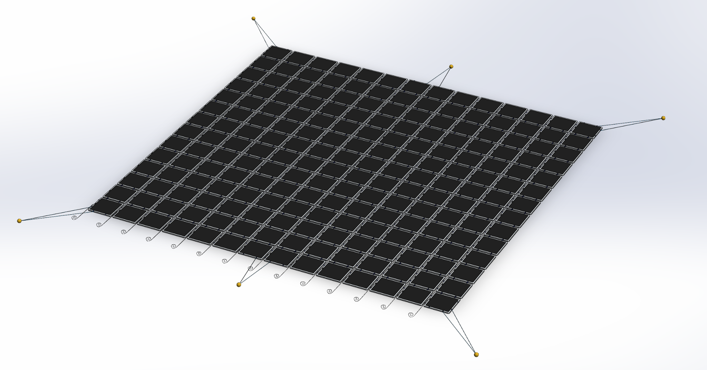  
  Source: D3.4 Figure 1 — `images/2024-03-19_surewave_d3.4_summary_global_system_design/image3.png`

- **Global system plan — circular FB ring enclosing four FPV matrices in an X arrangement.** Labels: Circular TS, Dummy float, 14×14 FPV, Linear TS, Linear FB, Circular FB.  
    
  Source: D3.4 Figure 13 — `.../image26.png`

- **Plan of the 420 kWp installation** — four PV matrices with dimensioned FB segments (81 m × 81 m outer envelope, 19.57 m matrix pitch).  
    
  Source: D3.4 Figure 51 — `.../image66.png`

- **Detail of one FPV matrix inside the FB ring with "Dummy float string location" annotation.**  
    
  Source: D3.4 Figure 30 — `.../image44.png`

- **Underwater rendering of the FB ring (yellow) with its full mooring spread** (MARIN visualisation).  
    
  Source: D3.4 Figure 14 — `.../image27.png`

- **Methodology flowchart for designing the floating breakwater** — from wave-information assessment to structural design, with feedback loops.  
    
  Source: D3.4 Figure 8 — `.../image15.png`

---

## 2. Aluminium float

- **Assembly drawing of the two aluminium blanks that form one float** — 1880 mm × 1880 mm outer envelope, embossed cup pattern in the base, drain hole at bottom edge. Original CAD title-block reads "Assembly of 2 blanks relevant to TWI".  
    
  Source: D3.4 Figure 15 — `.../image29.png`

- **Cross-section illustration of the float showing the two pressed shells welded together with foam-cup infill and a PV panel bonded on top.** (Note: the source-doc caption calls this "the aluminium float from 2 symmetrical blanks"; the image is a side-on rendering, not a photo.)  
  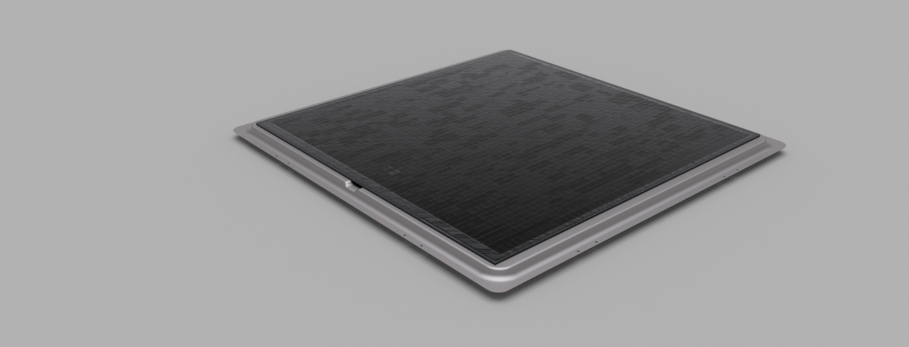  
  Source: D2.3 Figure 4 — `images/2023-01-31_surewave_d2.3_general_loads/image8.png`

- **Cross-section rendering of a Gen 1 float** — two pressed aluminium shells, foam cups visible, yellow bracket lugs at the base.  
    
  Source: D3.1 Figure 2 — `images/2023-06-26_surewave_d3.1_design_internal_floating_pv_components/image6.png`

---

## 3. PV panel

- **PV panel rear-view drawing with dimensions (1700 ± 2 mm × 1665 ± 2 mm) and junction-box location callout on the back sheet.** (Source-doc caption calls this "PV panel close up"; the image is a technical drawing, not a photograph.)  
    
  Source: D3.4 Figure 17 — `.../image31.png`

- **PV panel front view at cells** — dimensioned cell-string layout on the front side. (Source-doc caption reads "back drawing of PV"; the image is labelled "FRONT VIEW AT CELLS".)  
    
  Source: D3.4 Figure 18 — `.../image32.png`

- **Cell → Module → String hierarchy diagram.** (Source-doc caption says "Modules connected to make string, here only 7 modules shown"; the image actually shows the three-level cell/module/string decomposition.)  
    
  Source: D3.1 Figure 1 — `images/2023-06-26_surewave_d3.1_design_internal_floating_pv_components/image7.jpeg`

---

## 4. Module-to-module connection: hinge, bracket, string

- **PU hinge geometry drawing** — plan/side/perspective views with angles (69.77°, 96.2°, 83.8°, 22.5°) and dimensions (204.37 mm long, 102.17 mm across). Sunlit Sea title-block; drawing name "Hinge angles".  
    
  Source: D3.4 Figure 22/23 — `.../image37.png`

- **Aluminium bracket alone** — the U-shaped bracket that socket-mounts around the PU hinge.  
    
  Source: D3.4 Figure 24 — `.../image38.png`

- **Assembled bracket + PU hinge mounted on the lip of two adjacent floats** — rendering showing the connection in situ.  
    
  Source: D3.4 Figure 25 — `.../image39.png`

- **String of 14 panels — plan drawing** with overall dimensions 28.3 m × 1.88 m and Detail A showing the hinge junction at 1:12.  
    
  Source: D3.4 Figure 26 — `.../image40.png`

- **String of panels on water — deployment photo at a lake.**  
    
  Source: D3.4 Figure 27 — `.../image41.jpg`

- **Close-up of deployed string on water** showing hinges, yellow interconnect cables and cell-string front pattern.  
    
  Source: D3.4 Figure 28 — `.../image42.jpeg`

- **Mechanical connection between two adjacent units (breakwater/float variant)** — cross-section showing a bolted rod through the shared edge cavity.  
  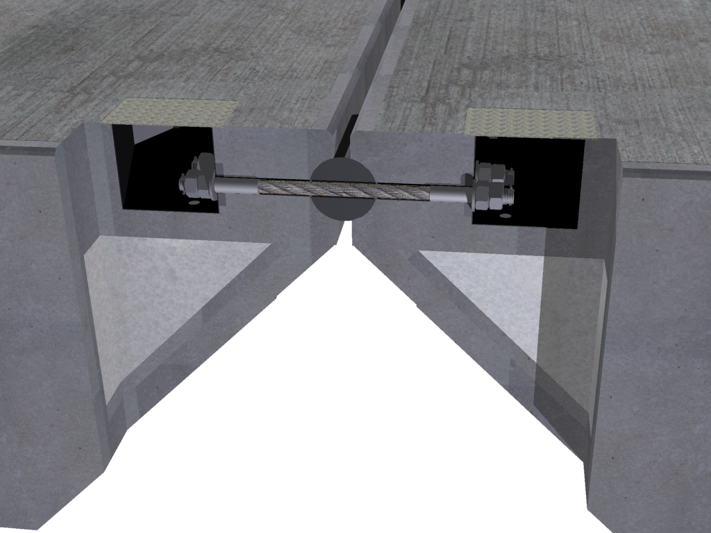  
  Source: D2.3 Figure 3 — `images/2023-01-31_surewave_d2.3_general_loads/image5.png`

- **Present Sunlit Sea bracket design (rendering).** (Source-doc caption calls this the "hinge design"; the image shows the aluminium bracket component.)  
  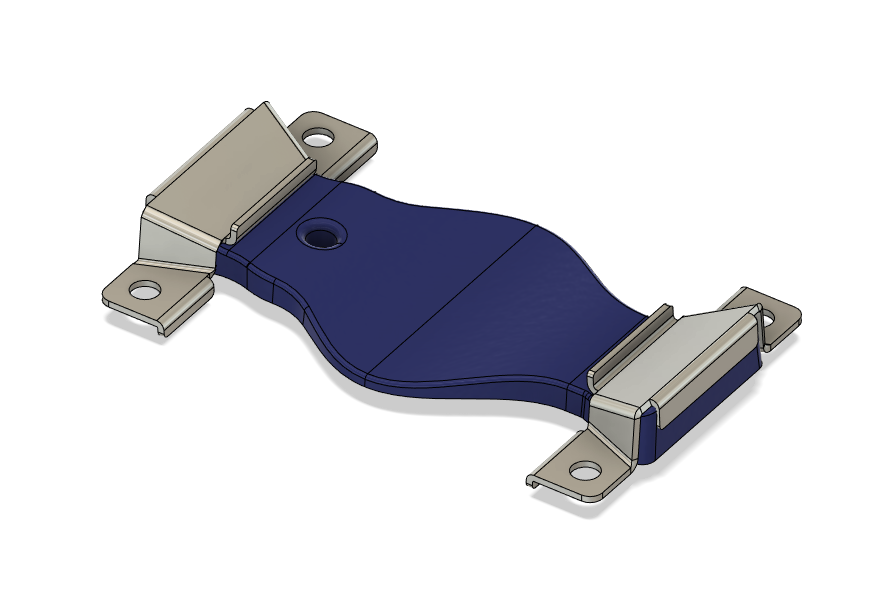  
  Source: D2.3 Figure 5 — `images/2023-01-31_surewave_d2.3_general_loads/image9.png`

- **PU hinge with mounting inserts (Ceit/IFEU final geometry)** — the geometry that was tested in Task 6.2.  
  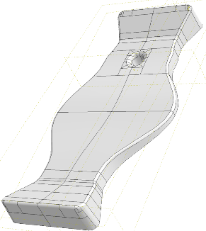  
  Source: D6.1 Figure 1 — `images/2024-09-12_surewave_d6.1_ultimate_strength_capacity/image60.png`

---

## 5. Floating breakwater design

- **Conventional pontoon interior — isometry.** Long trapezoidal-ended hull with internal bulkheads dividing it into open bays.  
  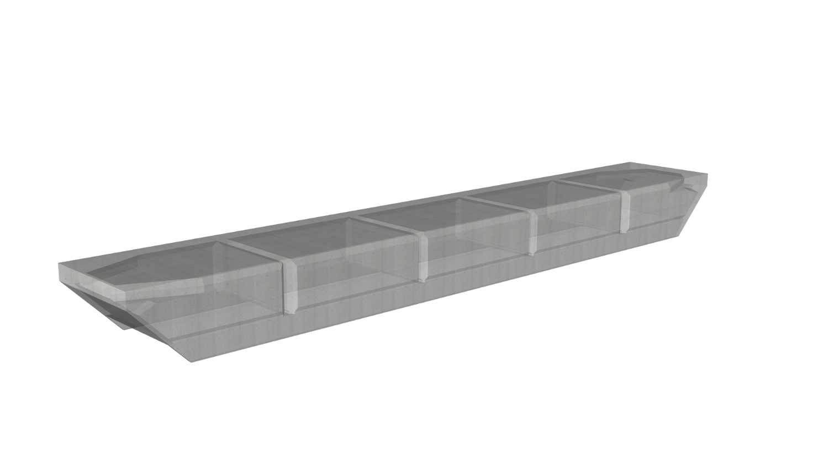  
  Source: D3.2 Figure 7 — `images/2023-08-08_surewave_d3.2_floating_breakwater_design/image9.png`

- **Conventional pontoon interior — longitudinal section.**  
  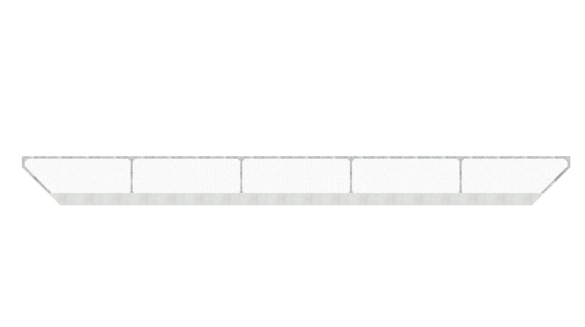  
  Source: D3.2 Figure 8 — `.../image10.png`

- **Conventional pontoon interior — cross section.**  
  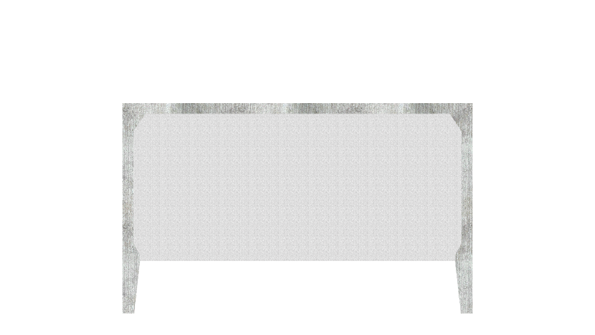  
  Source: D3.2 Figure 9 — `.../image11.png`

- **Pontoon with new circular-materials bottom slab — isometry.** Shorter than the conventional variant, with a visible thick base slab.  
  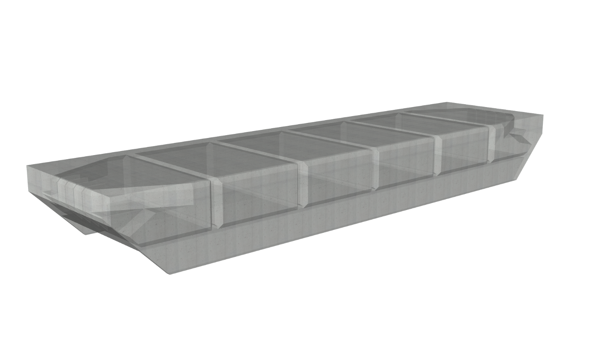  
  Source: D3.2 Figure 10 — `.../image12.png`

- **Pontoon with new circular-materials bottom slab — longitudinal section.**  
  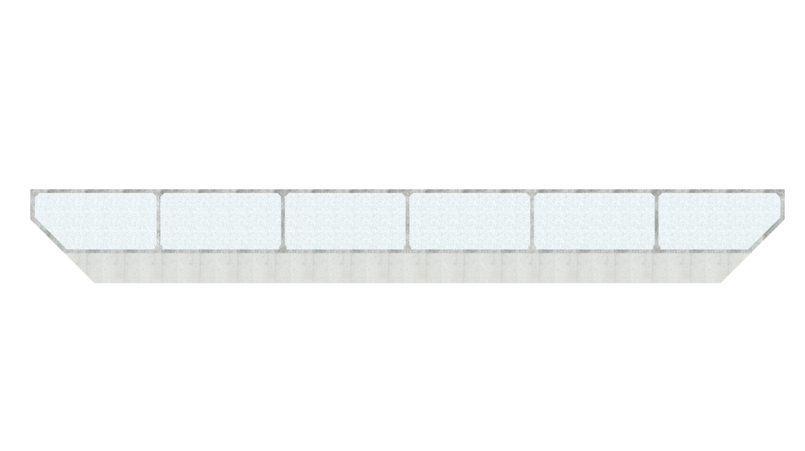  
  Source: D3.2 Figure 11 — `.../image13.png`

- **Pontoon with new circular-materials bottom slab — cross section.** (Image is low-contrast; readable but faint.)  
  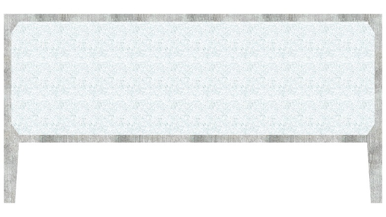  
  Source: D3.2 Figure 12 — `.../image14.jpeg`

- **Rendering of the chosen FB (translucent 3D view).** Same design also appears as D3.4 Figure 42.  
    
  Source: D3.2 Figure 58 — `.../image54.png`

- **Duplicate rendering of chosen FB from D3.4 (context: system-level view).**  
    
  Source: D3.4 Figure 42 — `images/2024-03-19_surewave_d3.4_summary_global_system_design/image57.png`

- **Exterior FB location — circular ring layout** (annotated "Floating breakwaters (circular)").  
    
  Source: D3.4 Figure 43 — `.../image58.png`

- **Interior FB location — X-shaped cross layout** (annotated "Floating breakwaters (linear)").  
    
  Source: D3.4 Figure 44 — `.../image59.png`

---

## 6. Breakwater ↔ FPV connection

- **Preliminary design of the breakwater ↔ FPV connection (Clement)** — 3D rendering of the concrete breakwater edge with steel eye plates and tensioned rope/steel link to a float.  
  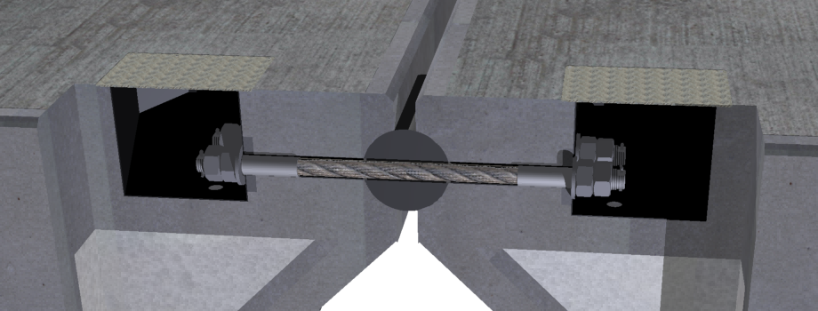  
  Source: D5.1 Figure 40 — `images/2024-04-16_surewave_d5.1/image56.png`

- **Experimental setup used to test the breakwater–solar-module connection** — laboratory test rig with braided rope specimen mounted between two black cylindrical fixtures inside a safety cage.  
  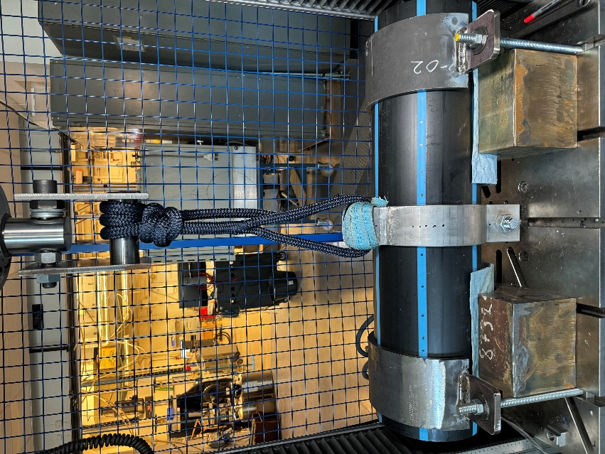  
  Source: D6.1 Figure 27 — `images/2024-09-12_surewave_d6.1_ultimate_strength_capacity/image79.jpeg`

---

## 7. Mooring / anchoring

- **Mooring-line shape (catenary) at equilibrium for three site depths** — z vs horizontal distance to fairlead, plotted for Baltic (~16 m), Mediterranean (~38 m) and North Sea (~49 m).  
  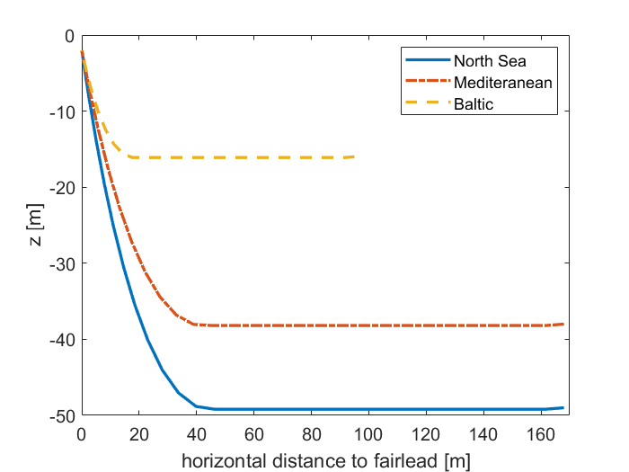  
  Source: D5.1 Figure 39 — `images/2024-04-16_surewave_d5.1/image55.png`

- **Mooring layout — Baltic Sea.** Ø173 m breakwater ring with eight-point radial anchor spread (A1–A8), catenary attachment shown, upper-attachment-point call-outs.  
  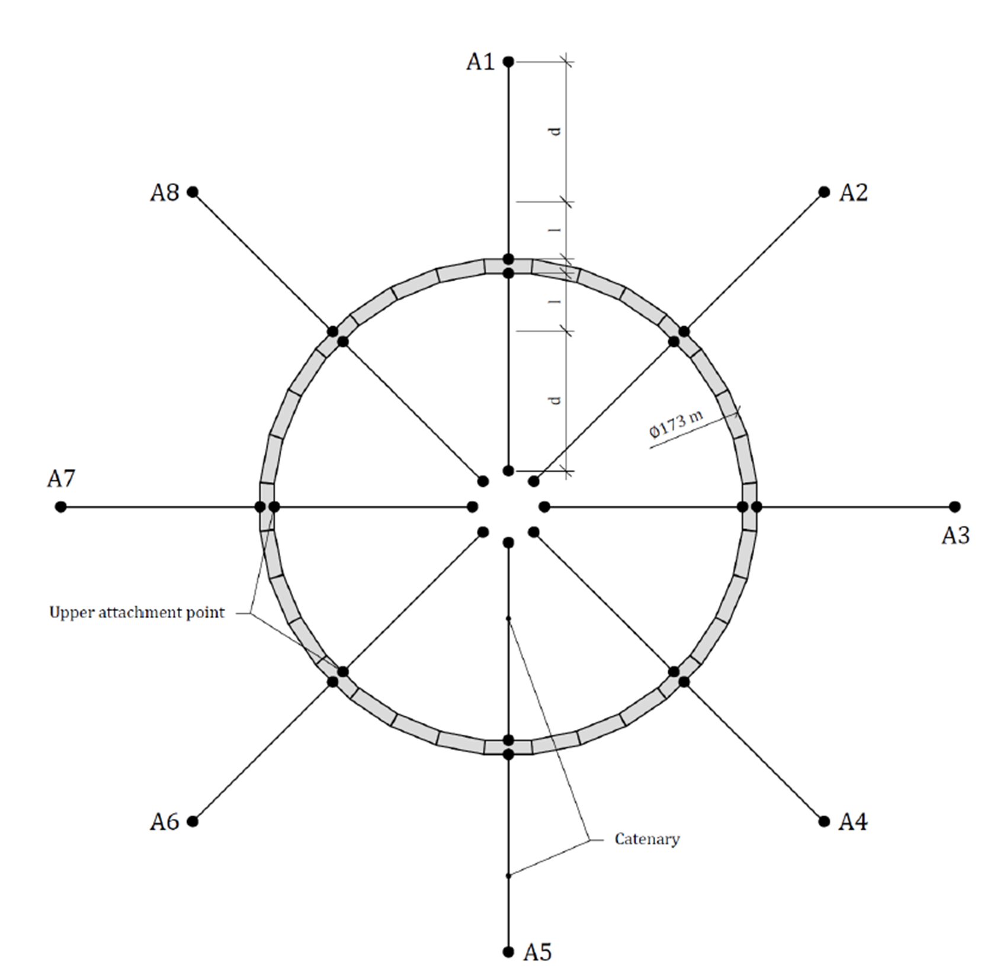  
  Source: D5.1 Figure 52 — `images/2024-04-16_surewave_d5.1/image74.png`

- **Anchor-point layout, mild conditions (Baltic Sea).** Circular FB ring Ø346 m with 8 anchor lines (A1–A8), catenary attachment shown.  
  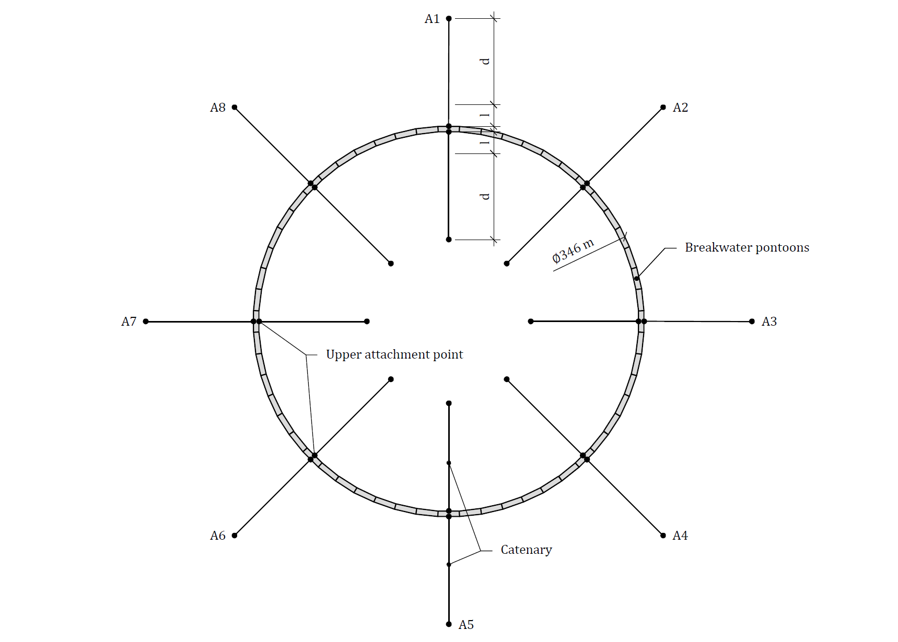  
  Source: D3.3 Figure 27 — `images/2023-12-08_surewave_d3.3_final/image13.png`

- **Anchor-point layout, mid conditions (Mediterranean Sea).** Same 8-line topology, longer catenary reach.  
  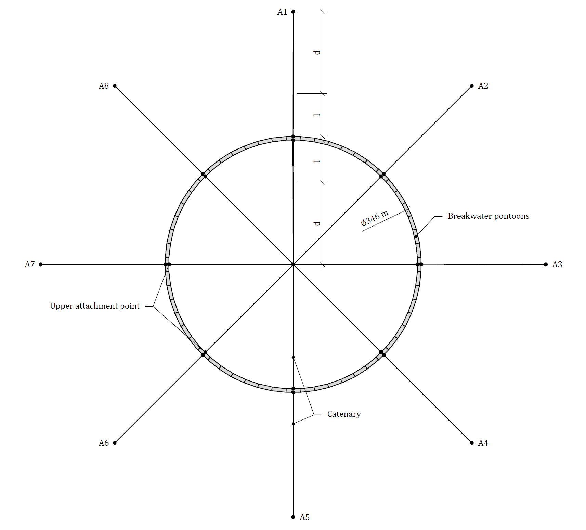  
  Source: D3.3 Figure 32 — `.../image15.png`

- **Anchor-point layout, harsh conditions (North Sea).** 14 anchor lines (A1–A14).  
  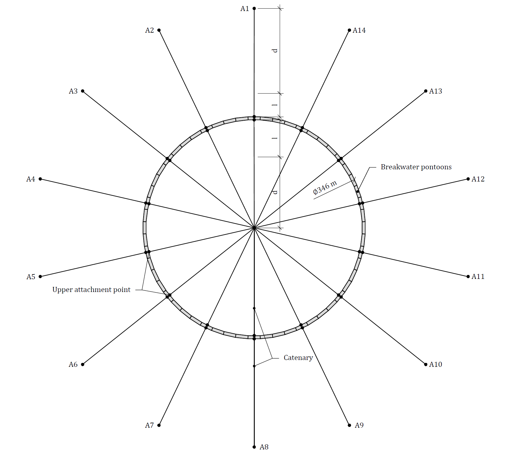  
  Source: D3.3 Figure 37 — `.../image17.png`

- **Driven-anchor-pile design, mild conditions (Baltic Sea).** Clement engineering sheet — pile schedule with subgrade modulus, active earth pressure, passive earth pressure, moment, shear and normal stress diagrams for a 24.7 m long / 8.35 kN/m'-loaded steel-pipe pile in EC 7 GC 3 (mild).  
  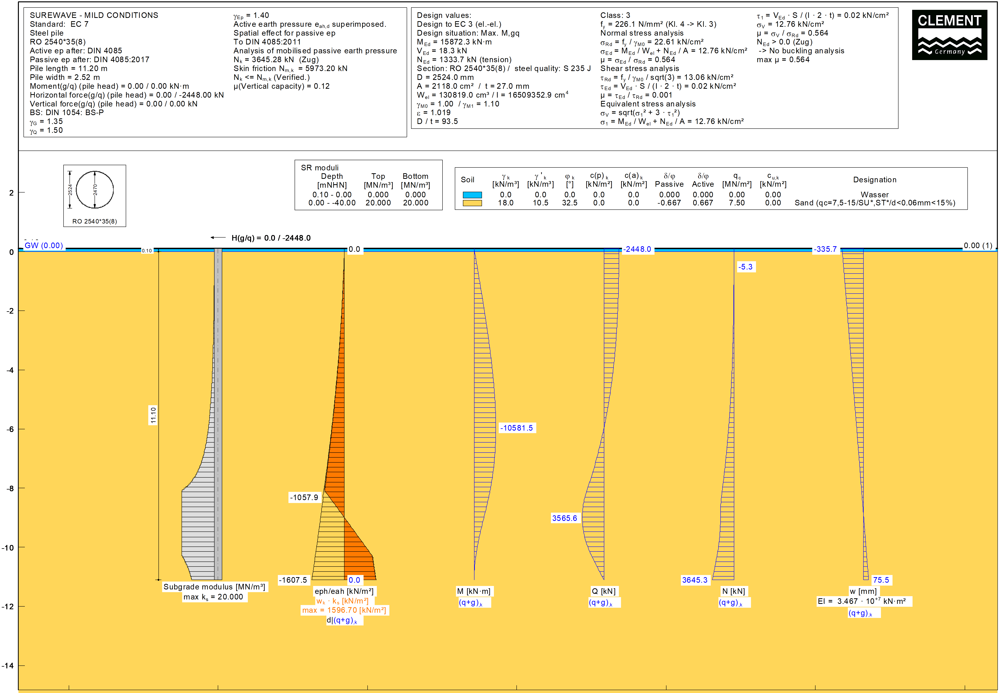  
  Source: D3.3 Figure 38 — `images/2023-12-08_surewave_d3.3_final/image18.png`

- **Driven-anchor-pile design, mid conditions (Mediterranean, outer piles).** Same Clement sheet layout as Fig 38 but sized for the "MID-HARSH" load class (Mediterranean, outer piles) — longer pile, higher horizontal-force capacity.  
  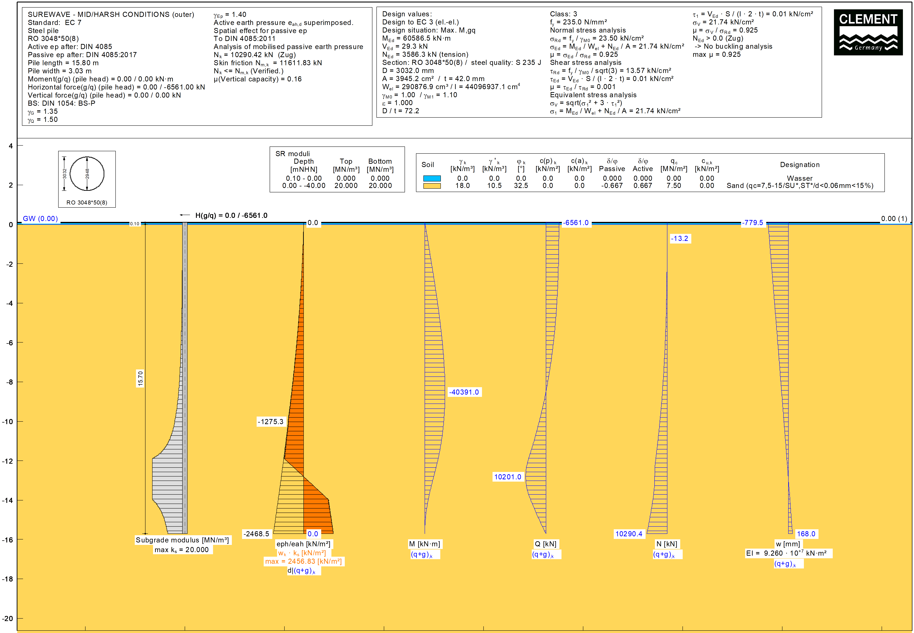  
  Source: D3.3 Figure 39 — `images/2023-12-08_surewave_d3.3_final/image19.png`

- **Catenary-line geometry diagram** — anchor point, upper attachment, angle φ(s), tensions T_H / T_V / T_0 / T, effective length l_eff, coordinates.  
  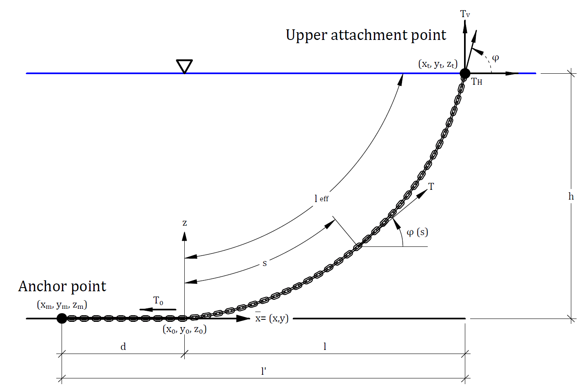  
  Source: D3.3 Figure 22 — `.../image10.png`

- **Tensioning-rope deployment area — plan view** with red triangular zones marking where ropes run between the tension elements (TE) and the FPV.  
    
  Source: D3.4 Figure 40 — `images/2024-03-19_surewave_d3.4_summary_global_system_design/image55.png`

- **Polypropylene multifilament ropes from FB to TE** — rendering of the roped connection between a concrete breakwater edge and a float.  
    
  Source: D3.4 Figure 41 — `.../image56.png`

---

## 8. Electrical layout

- **PV Combiner Box (product photo).** (Both D3.4 Figure 45 and D2.3 Figure 7 call this the "solar junction box"; the unit itself is labelled "PV Combiner Box".)  
    
  Source: D3.4 Figure 45 (also D2.3 Figure 7 `.../image12.png`) — `images/2024-03-19_surewave_d3.4_summary_global_system_design/image60.png`

- **14 parallel-coupled strings combined at a central junction/combiner box (plan view).** Cable channel runs across the matrix; the far-right column houses the combiner.  
    
  Source: D3.4 Figure 46 (also D2.3 Figure 8 `.../image13.png`) — `.../image61.png`

- **Close-up of a combiner node — 14 strings combined into two home runs.** Red/black DC pairs enter, join at the orange combiner box, exit as two thicker home-run cables. Green tracks and blue bushings visible.  
    
  Source: D3.4 Figure 47 (also D2.3 Figure 9 `.../image14.png`) — `.../image62.png`

- **Location of the 68 combiner elements in the installation** — plan of the circular FB ring, red squares marking combiner positions along the X-shaped internal service channels.  
    
  Source: D3.4 Figure 48 — `.../image63.png`

- **Inverter locations** — same plan, blue markers along the X channels.  
    
  Source: D3.4 Figure 49 — `.../image64.png`

---

## 9. Sunlit Sea deployment context (from sunlitsea.no)

Real-world context photographs from the Sunlit Sea website — installed hardware in Norwegian coastal waters, useful for pairing the CAD drawings and technical diagrams above with the finished product.

- **Aerial view of a Sunlit Sea Haugaland installation** — dark rectangular FPV matrix on a fjord/lake surface, road on the left, forested shore. The layout matches the 14×14 105 kWp Haugaland reference plant that D3.4 Figure 1 renders in CAD.  
  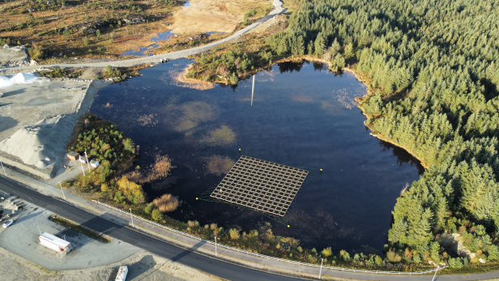  
  Source: sunlitsea.no — `images/2026-09-29_sunlit_sea_webpage/haugaland1.png`

- **Close-up of Sunlit Sea flat-aluminium FPV floats on water** — waterline view showing the low-profile aluminium module architecture with water droplets on the panel surface. Pairs with the D2.3 and D3.1 float renderings in Section 2.  
  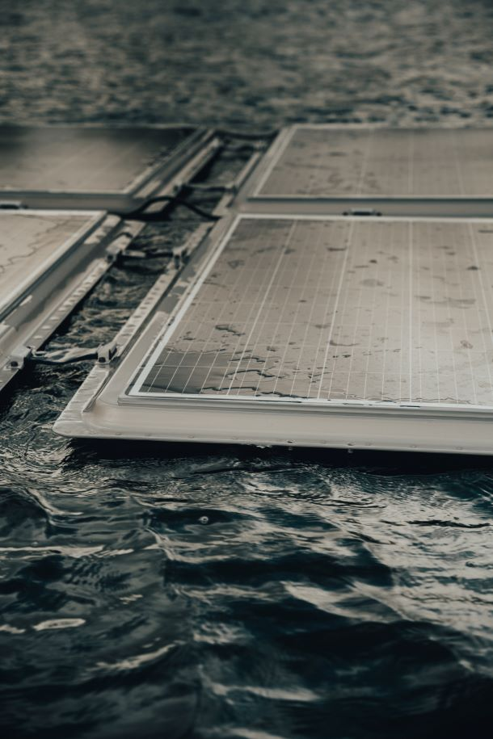  
  Source: sunlitsea.no — `images/2026-09-29_sunlit_sea_webpage/asset-solar-floating.jpg`

- **Deployed Sunlit Sea FPV string with technician on the array** — person in yellow drysuit standing on a large deployed installation at sunrise, showing the walkable-scale flat-aluminium string arrangement. Pairs with the D3.4 Figure 27/28 "String of 14 panels on water" photos in Section 4.  
  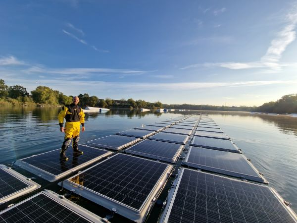  
  Source: sunlitsea.no — `images/2026-09-29_sunlit_sea_webpage/asset-solar-panels-multiple.jpg`

---

## Validation notes

Every image above was opened and visually inspected against the source-document caption (EMF vectors extracted from Word were rasterised to PNG via `scripts/emf_to_png.ps1` and the EMFs then deleted; only PNGs are stored). Discrepancies flagged inline:

- D3.1 `image7.jpeg` — source caption implies "modules → string"; image actually shows cell → module → string hierarchy.
- D3.4 `image29.png` — labelled "aluminium float assembled from 2 pressings"; image is the CAD assembly drawing of the two blanks, not a photo.
- D3.4 `image31.png` — labelled "PV panel close up"; image is a dimensioned rear-view drawing.
- D3.4 `image32.png` — labelled "back drawing of PV"; image is titled "FRONT VIEW AT CELLS".
- D2.3 `image9.png` — labelled "Present Sunlit Sea hinge design"; image renders the aluminium bracket component.
- D3.4 `image60.png` / D2.3 `image12.png` — labelled "solar junction box"; product itself is labelled "PV Combiner Box".

Three previously non-previewable `.emf` metafiles (D5.1 mooring layout, D3.3 anchor-pile designs mild and mid) were rasterised to PNG at 2× scale via `scripts/emf_to_png.ps1` and the EMF originals removed. To regenerate at higher resolution for print, request the source `.docx` from the coordinator, re-extract media with pandoc, and rerun `emf_to_png.ps1 -Scale N`.
