# SUREWAVE

## Offshore floating photovoltaics for the open sea

*Technical brochure — Deliverable D8.3*

*Structural reliable offshore floating PV solution integrating circular concrete floating breakwater*

Horizon Europe project 101083342 · HORIZON-CL5-2021-D3-03 · Coordinator: SINTEF AS · Draft edition, September 2026

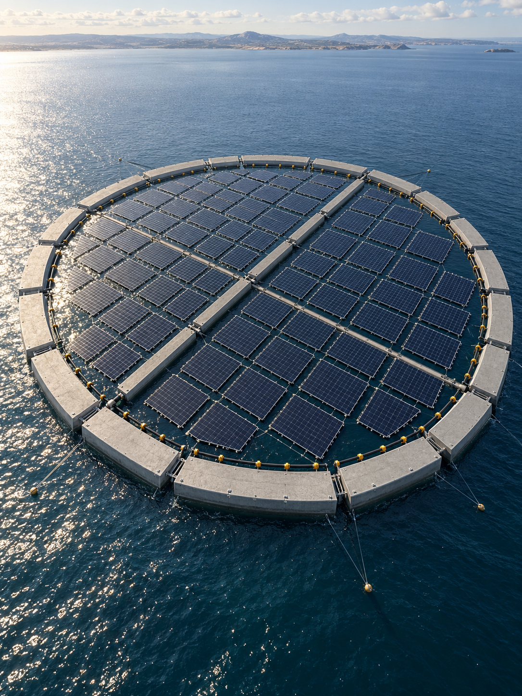{width=90%}

---

## About this brochure

SUREWAVE is a Horizon Europe research and innovation project that has developed and validated an integrated offshore floating photovoltaic (FPV) system designed to survive the wave, wind and current conditions of the open sea. The brochure summarises what the SUREWAVE consortium has built between 2022 and 2026 and what it means for the offshore renewable energy sector. It is written for offshore energy developers, floating PV manufacturers, EPC contractors, marine engineering firms, port and grid operators, insurers and investors who evaluate offshore FPV as a portfolio option.

The material is drawn from thirty-two SUREWAVE consortium deliverables spanning site definition, system design, materials development, coupled aero-hydrodynamic modelling, structural integrity assessment, structural health management, laboratory and field testing, life-cycle environmental and social assessment, and economic viability. Full technical references are held by the consortium; the SUREWAVE Zenodo Community and CORDIS project record hold the publicly disclosable outputs.

---

## At a glance — technical achievements

The four-year project delivered:

- An offshore FPV system and floating breakwater concept designed as one integrated whole rather than as separate products.
- Three novel circular concrete formulations developed and tested at laboratory and prototype scale — high-performance concrete, lightweight aggregate concrete, and cellular lightweight concrete.
- A reduced-scale breakwater prototype manufactured at Acciona's workshop and deployed at the Port of Gijón for long-term monitoring in a real marine environment.
- Mooring, anchoring and connection concepts developed and dimensioned across the three reference site classes, including a novel breakwater-to-FPV transition element.
- Limitations of the first-generation FPV polyurethane hinge identified through mechanical testing at SINTEF — ultimate tensile strength on average 3.5 kN against operational loads of 8 to 10 kN.
- A modified hinge design developed by Sunlit Sea, validated in a second SINTEF test round at approximately three times the first-generation ultimate strength, and demonstrated as safe for Baltic and Mediterranean loads.
- Two wave-basin testing campaigns completed — at Stadt Towing Tank in Norway for float and connector behaviour, and at MARIN in Wageningen for the coupled breakwater-FPV response in scaled waves and wind.
- A coupled aerodynamic, hydrodynamic and structural modelling toolchain developed and validated against classical theoretical models and both basin campaigns.
- A Structural Health Management System with an eddy-current corrosion sensor and a fatigue-assessment tool based on new stress-intensity-factor solutions — both completed and integrated into a single MATLAB platform.
- Environmental, economic, social and integrated sustainability assessments — with quantified greenhouse-gas savings, per-site levelised cost of energy, social-risk mapping across the supply chain, and a combined viability picture — completed or submitted.

---

## 1. Why offshore floating photovoltaics

Solar photovoltaic capacity is being deployed faster than any other electricity technology. The land constraint that limits onshore PV in dense coastal economies does not exist over water. Land-based floating PV — on reservoirs, lakes and ponds — has grown to more than 2.5 GW installed globally. Offshore FPV has barely started. The sea offers scale, but it also brings wave loads, wind loads, currents, salinity and biofouling that a lake-tuned float cannot handle.

Europe's offshore renewable energy strategy identifies floating PV as one of the technologies needed to diversify beyond offshore wind. The addressable resource is very large: even a small fraction of Europe's exclusive economic zone under offshore PV would exceed today's total European solar generation. What has been missing is a design that survives open-sea conditions economically over a 25- to 40-year operating life.

SUREWAVE targets that gap. The project has advanced offshore FPV from technology readiness level 2–3 (concept formulated) to TRL 4–5 (validated in relevant environment) by combining a novel external floating breakwater with a redesigned FPV array, backed by validated numerical models and a structural health management platform.

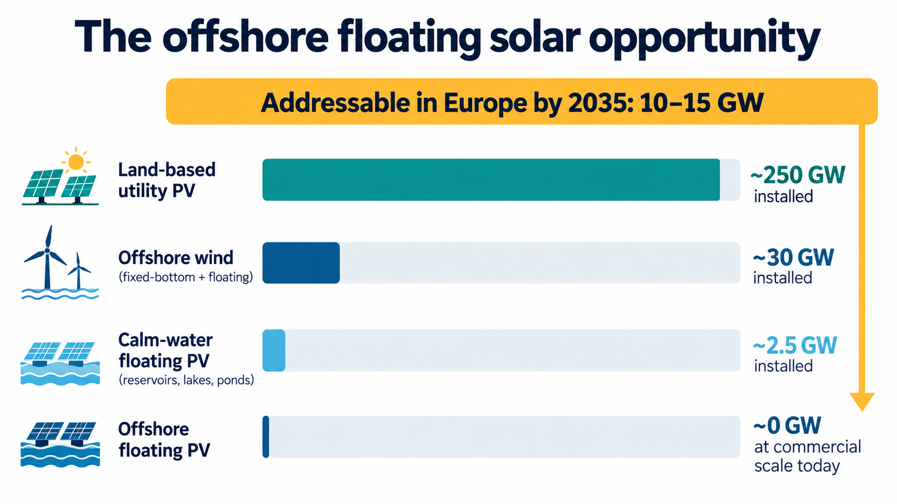{width=90%}

---

## 2. The SUREWAVE concept

SUREWAVE is an integrated system. Four subsystems work together:

- An external floating breakwater built from circular concrete formulations attenuates incoming waves before they reach the PV array.
- A flexible transition-element system connects the breakwater to the FPV array while absorbing differential motion.
- The FPV array itself uses marine-grade aluminium modules connected by polyurethane hinges into large matrices, arranged for wave shielding by neighbouring floats.
- A catenary mooring system holds the whole installation on station across mild to harsh European sea states.

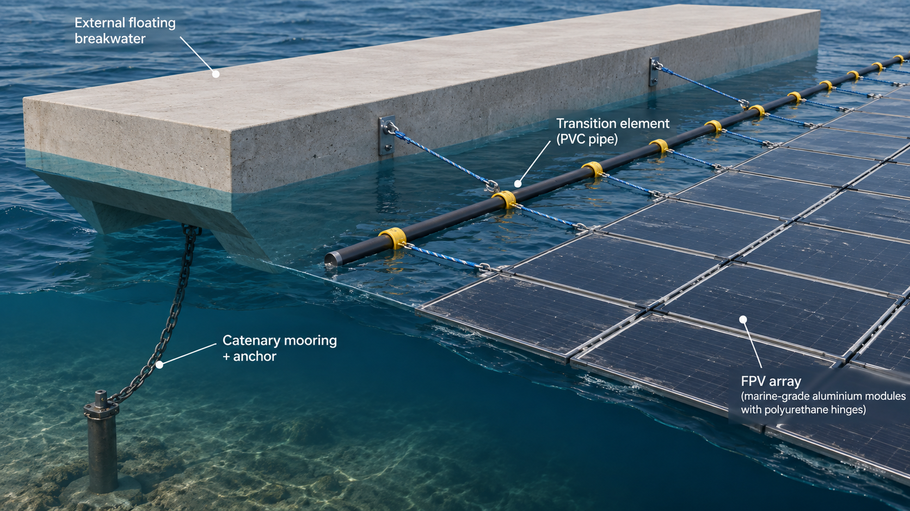{width=90%}

The reference plant is 7 MWp, laid out on a 346 m diameter circular footprint. Sixty-eight matrices of fourteen by fourteen FPV modules sit inside a perimeter of external floating breakwater units, with two internal linear breakwater lines dividing the array into sub-farms for structural and hydrodynamic reasons. A 420 kWp pilot-scale variant is designed for mild-sea early deployments.

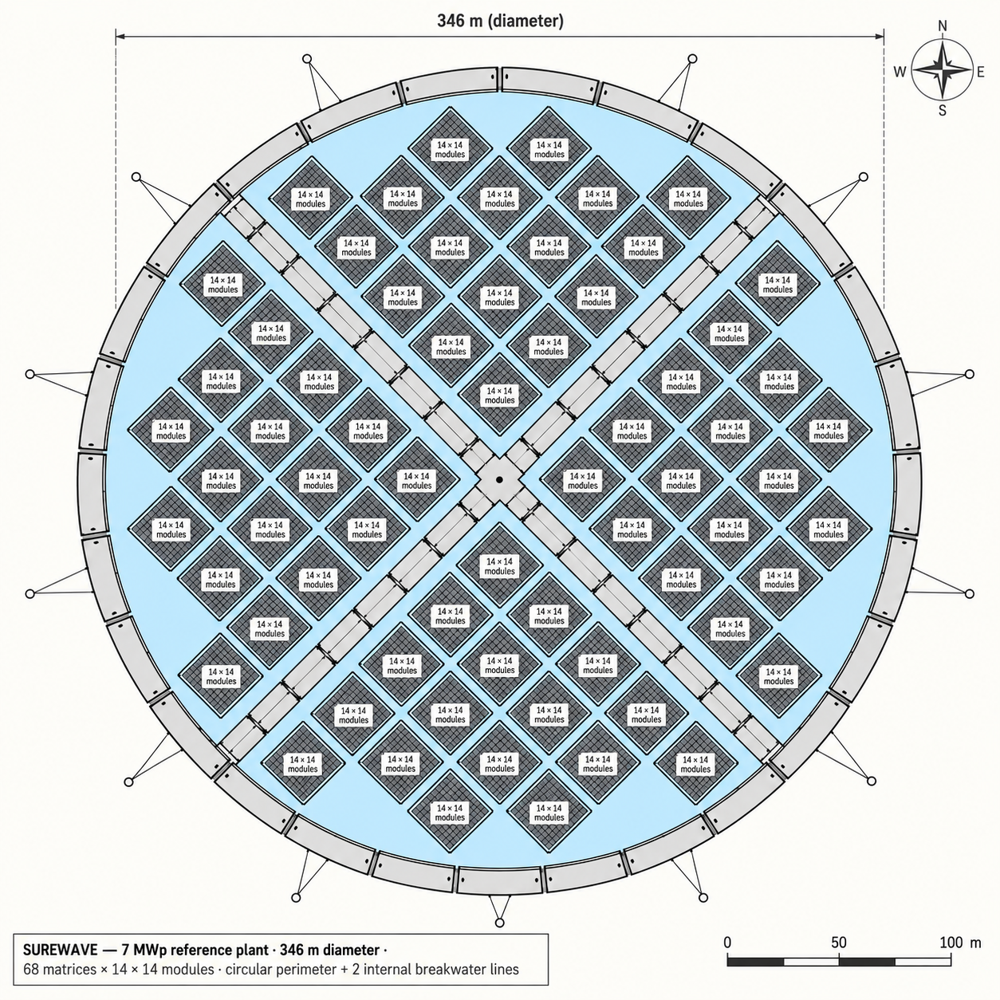{width=90%}

The system is dimensioned against three reference site classes taken from twenty-five years of ERA5 hindcast data at representative European locations: a mild Baltic site (16 m water depth, significant wave height 0.6 m), a mid-condition Western Mediterranean site (38 m, 0.5 m) and a harsh Greater North Sea site (49 m, 1.6 m). Extreme fifty-year design values cover wind above 25 m/s, current above 1.2 m/s and wave height above 14 m.

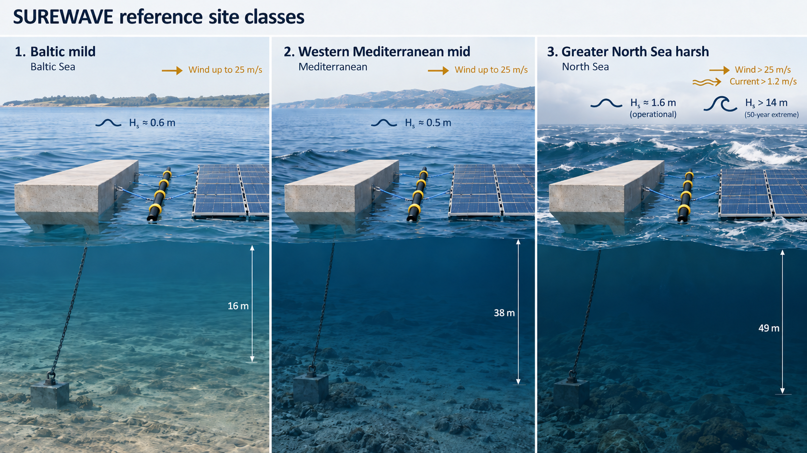{width=90%}

---

## 3. System design highlights

### The floating breakwater

Wave attenuation was studied across ten candidate cross-sections and mooring layouts using coupled aero-hydrodynamic CFD in FLOW-3D HYDRO and validated against classical Macagno, Wiegel, Cox and Fousert-van Tol theoretical models. The selected breakwater is 20 m long, 5 m wide, 2.5 m high, with double keels. It weighs 123.4 t at 2.03 m draft and cuts more than 40% of wave energy in the 1–3 second period range where wave-panel interaction is most damaging.

Larger draft and width improve efficiency across all wave conditions. Keels raise performance for longer wave periods without a proportional weight penalty. The circular layout produces uniform load distribution and lower peak connector forces than square, octagonal or elliptical layouts, and simplifies anchorage design at scale.

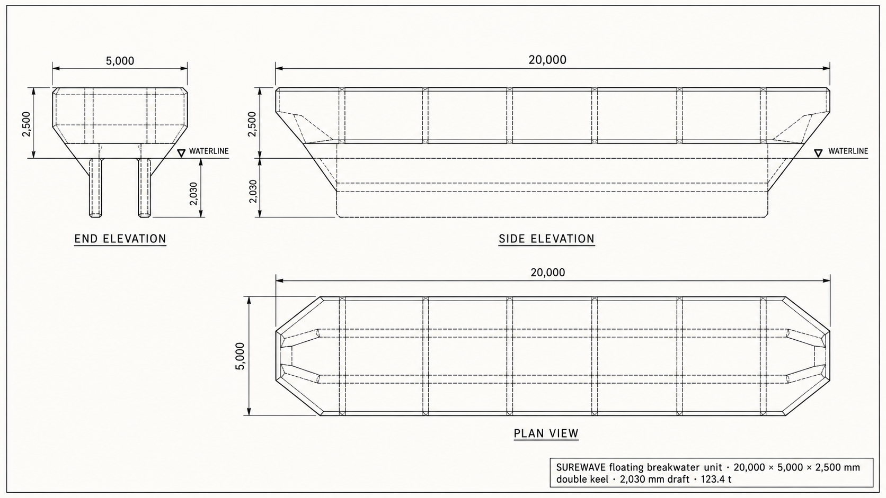{width=90%}

### The FPV modules

The FPV modules use marine-grade aluminium shells with sealed cavities, individually potted, arranged in string modules that pre-assemble into complete matrices for rapid deployment. Modules connect through polyurethane hinges that flex under wave-induced motion while transmitting only limited force between neighbours. The very flat profile minimises wind drag and simplifies stacking on shipping barges. Cooling is passive by convection and evaporation over the seawater below the array.

Built-in sensing (gyroscope, accelerometer, environmental sensors) supports real-time monitoring of module attitude, matrix response and array-level dynamic behaviour, feeding into the structural health management platform described in Section 7.

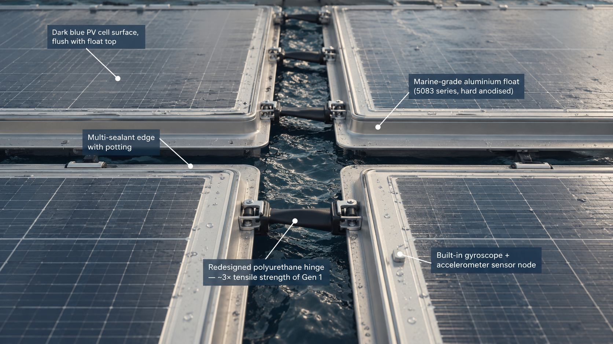{width=90%}

### Mooring, anchoring, connections

Catenary mooring with stud-link steel chain is dimensioned to DNVGL-OS-E301 for each of the three site classes. Chain diameter ranges from 70 mm (Baltic mild) to 111 mm (Mediterranean mid and North Sea harsh). Corrosion allowance is set for a 40-year design life. Driven anchor piles are sized for medium-dense sand seabed conditions; site-specific geotechnical adjustments apply elsewhere.

The transition element connecting each floating breakwater to the FPV array uses elasticized rope with safety factors of 3.2 to 4.4 at critical connection points. It allows differential motion between the heavy breakwater and the lightweight FPV array without transmitting damaging peak loads to either.

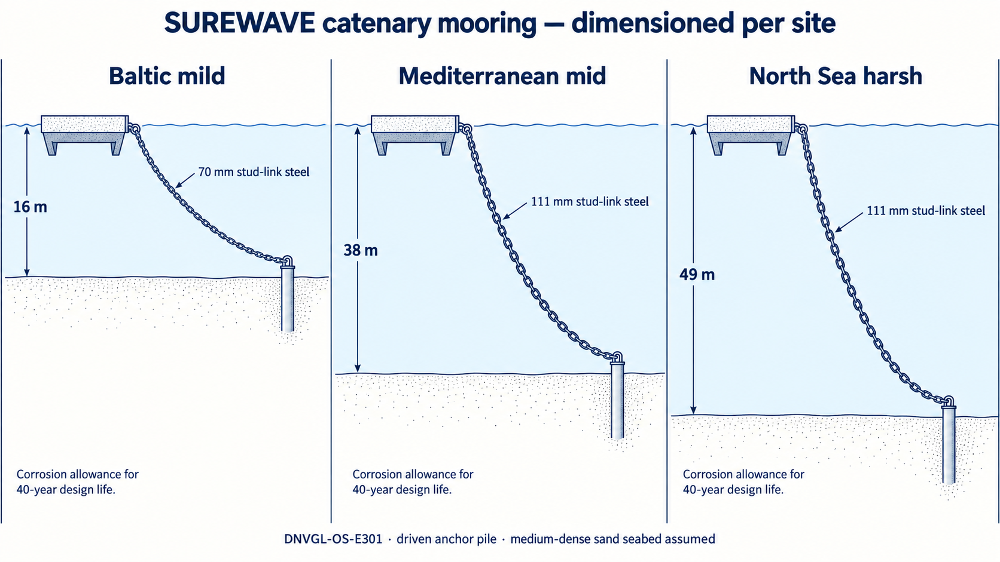{width=90%}

---

## 4. Materials innovation

SUREWAVE designed and characterised three new circular concrete formulations for the floating breakwater.

### High-performance concrete (HPC)

Compressive strength 120 MPa. The optimised mix (Sample 2 in the consortium record) uses reduced cement content substituted by ground granulated blast-furnace slag and fly ash, plus a Krystaline Add1 waterproofing admixture. Marine-exposure code compliance was confirmed by durability testing; the material shows zero water penetration at test scale. Mechanical testing of small-scale prototypes showed HPC delivering 55% higher strength than the LWAC alternative with a better strength-to-weight ratio. HPC was selected for the structural shell of the reduced-scale breakwater prototype.

### Lightweight aggregate concrete (LWAC)

Compressive strength 45 MPa, density ≤ 1900 kg/m³. Optimised mixes (Samples 17 and 18) use recycled construction and demolition waste, glass-derived Minolite lightweight aggregate, fly ash and blast-furnace slag. LWAC with CEM III cement and Krystaline Add1 gave the optimal chloride resistance of the tested combinations. Selected for the top slab of the prototype.

### Cellular lightweight concrete

Target density ~300 kg/m³. Optimised mix (Sample 26) provides the inner core of the breakwater with the buoyancy safety margin required for open-sea operation. Additional EPS blocks are included in the current prototype design as a manufacturing safety margin.

### FPV structural materials

The FPV floats use marine-grade aluminium alloy (5083 series) with hard anodisation for corrosion resistance and multi-sealant edge architecture. Polyurethane is used for hinges, structural infill and connection elements — the material choice reflects both flexibility and manufacturing suitability, with the trade-offs and open questions on long-term durability addressed in Section 6.

### Circular content

Across the concrete formulations, recycled aggregates, ground blast-furnace slag, fly ash, glass-derived lightweight aggregate and silica fume displace primary materials at the tens of percent level. The environmental footprint of the finished concrete is reduced correspondingly, in line with the project's circular-economy objective.

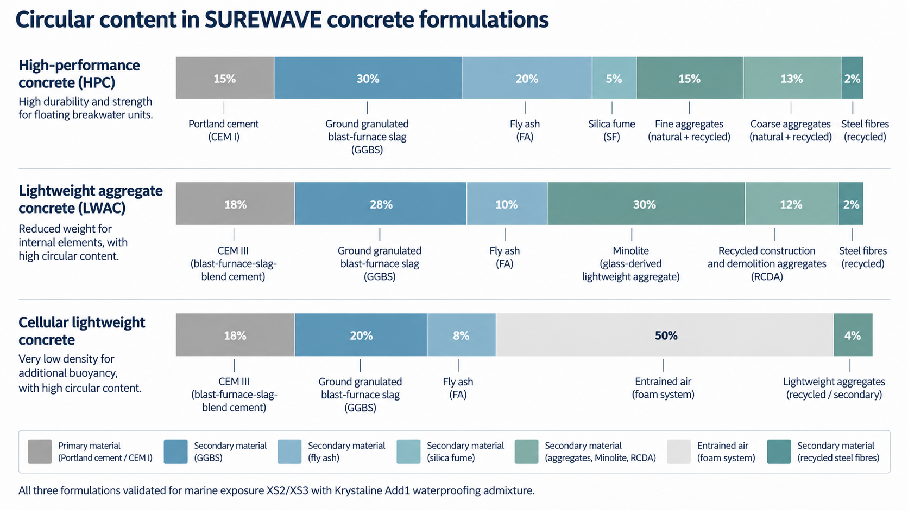{width=90%}

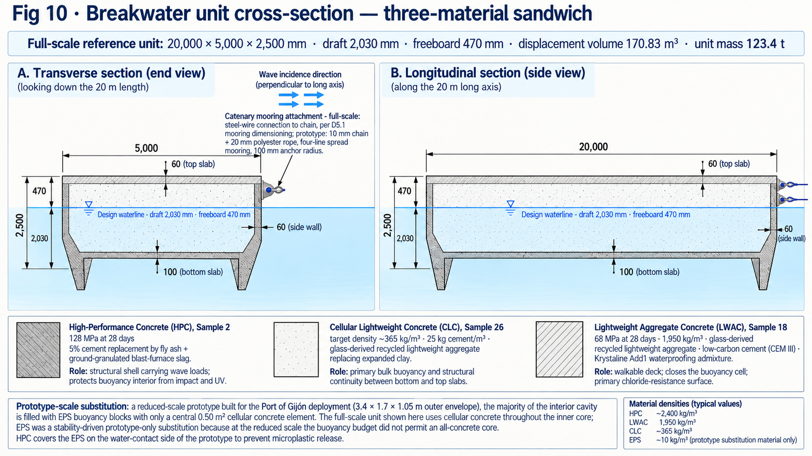{width=90%}

---

## 5. Modelling and simulation

The SUREWAVE consortium built and validated a coupled modelling toolchain covering hydrodynamics, aerodynamics, structural integrity and fatigue.

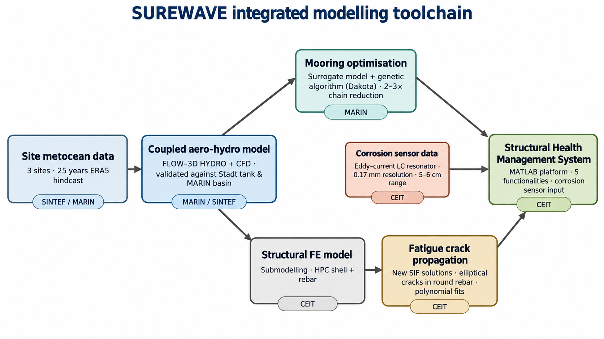{width=90%}

### Coupled aero-hydrodynamics

Hydrodynamic behaviour of the coupled FPV-breakwater system was analysed with linear methods at low to mid fidelity, calibrated against Stadt towing-tank test results. Motion response, connector loading with varying float sizes, and mooring design loads were evaluated across the three reference sites. Aerodynamic simulations in CFD characterised lift and drag coefficients as functions of PV module inclination and array geometry, and produced correlations for breakwater shielding effectiveness at different angles of attack.

The floating breakwater substantially reduces vertical loads on the FPV array. Its horizontal shielding effect is more limited across large farms, which motivated the sub-farm mooring strategy adopted in the reference plant.

### Mooring optimisation

Mooring designs were optimised via surrogate modelling and genetic algorithms, delivering up to 56% weight reduction relative to a baseline design at equal structural safety. The optimisation covered chain size, catenary geometry, anchor spacing and pretensioning strategy.

### Structural integrity

Advanced finite element analysis with submodelling techniques was used to assess critical breakwater components. Global FE models fed reinforced-concrete submodels subjected to extreme and fatigue load cases across the three sites. Fatigue analysis used Goodman and Soderberg criteria and demonstrated infinite-life design for the breakwater under specified loading. Detailed stress-field outputs feed the crack propagation and health-management tools.

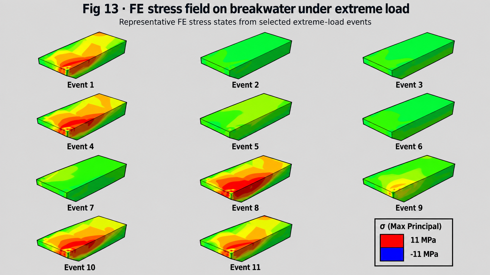{width=90%}

### Fatigue crack propagation and the fatigue-assessment tool

New stress-intensity-factor solutions for elliptical cracks in round reinforcement bars under tension and bending were developed and validated against literature. The solutions are packaged as polynomial fits that support fast evaluation, and are wrapped in a dedicated fatigue-assessment tool delivered as part of the SUREWAVE toolchain. The tool takes stress-history inputs from the coupled hydrodynamic and structural analysis and returns crack-growth trajectories and remaining-life estimates for critical breakwater rebar locations. A North Sea case study demonstrated the methodology end to end. The fatigue-assessment tool feeds directly into the Structural Health Management System described in Section 7 but is also usable as a stand-alone design-phase capability.

### Validation

All modelling methodologies were validated against international standards (ABS, DNV, ABS guidelines) and experimental data from the WP4 material tests and WP6 physical prototyping. The validation report closes the modelling loop; identified limitations include localised pitting corrosion (generalised corrosion only for now), lack of probabilistic uncertainty quantification, and limited long-term field data for calibration — all identified as forward-work priorities.

{width=90%}

---

## 6. Testing and validation

### Laboratory scale — materials

Durability testing on HPC and LWAC shell materials with and without waterproofing admixture confirmed compliance with marine-exposure code XS2/XS3. Static and cyclic bending, pullout and drop-tower impact tests on 600 × 150 × 100 mm sandwich beams (HPC or LWAC shell over cellular concrete core) demonstrated HPC as mechanically superior for both static and dynamic loading.

### Component-level — connections

Three critical connection systems were tested at SINTEF: polyurethane hinges between FPV modules, cable systems between floating breakwaters, and new tailored connections between breakwaters and FPV modules. First-generation polyurethane hinges showed ultimate tensile strength of 3.5 kN on average — below the 8 to 10 kN operational loads expected from coupled hydrodynamic analysis — and low compressive resistance. Steel-wire connections between breakwaters performed as specified at 402 kN ultimate load against a 450 kN rating. The new breakwater-to-module connection met its 41 kN requirement, with the rope element identified as the weak point.

The first-generation hinge finding drove a redesign led by Sunlit Sea. The redesigned polyurethane connection was validated in a second round of testing at SINTEF and delivered approximately three times the ultimate tensile strength of the first generation on the same test scale, with buckling strength raised to 20 kN. Fatigue testing on the polyurethane material combined with finite element analysis under operational loading gives a calculated failure life of 2.5 × 10¹¹ cycles — well above the 7.88 × 10⁸ cycles required for 25 years of service. Production quality control is the remaining sensitivity: material shrinkage of 1 to 2 mm during casting drives performance variability and needs strict process control in mass production.

The redesigned hinge underlies the load-margin conclusions in the integrated sustainability assessment: it handles Baltic (34 kN) and Mediterranean (33 kN) design loads with margin and is marginal for North Sea (40 kN). A further design iteration is required for full North Sea qualification.

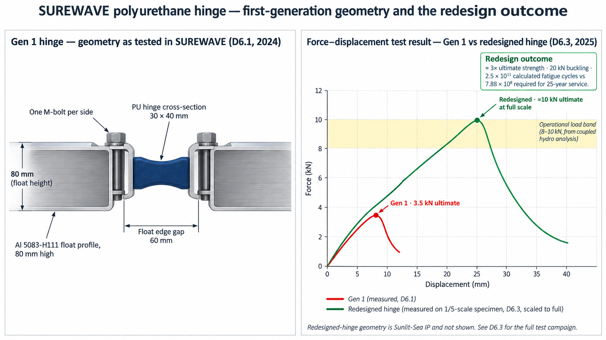{width=90%}

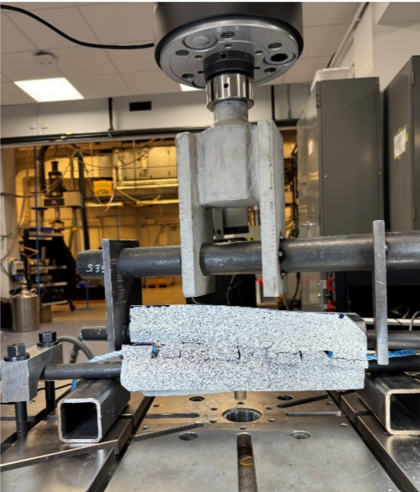{width=90%}

### Reduced-scale prototype

A 3.4 m by 1.7 m footprint reduced-scale breakwater prototype was manufactured at Acciona's workshop. It combines an HPC bottom slab and walls (0.94 m³), an LWAC top slab (0.35 m³), a cellular concrete core (0.50 m³) and EPS buoyancy blocks. Design parameters — metacentric height above 0.25 m, freeboard above 0.3 m — were set for deployment at the Port of Gijón, taking wave loading and marine growth into account. A four-line catenary spread mooring with 10 mm chain and 20 mm polyester rope holds the prototype on station while minimising vertical loads.

Manufacturing proceeded without major complications. Surface finish came out rougher than target due to LWAC casting characteristics but is acceptable for the prototype's monitoring purpose.

The deployment site is El Musel Port in Gijón, on the northern Spanish coast — one of Atlantic Europe's main maritime ports and host to Acciona's R&D maritime environment demo area. Design-basis metocean data for the site was drawn from the Spanish national ports oceanographic archive. Field deployment feeds long-term degradation and structural-health data back into the modelling toolchain: the prototype is instrumented and monitored under WP6 with periodic inspection and sensor-driven readouts, validating both the durability of the three circular concrete formulations and the mooring behaviour in real wave, tide and current conditions.

{width=90%}

### Basin testing

Two wave-basin campaigns were completed across the project.

The first was at the Stadt Towing Tank in Norway, provided by Sunlit Sea. Six FPV floats in a representative string configuration were tested under regular and irregular waves to measure motion response, inter-float connector loading and matrix-level dynamic behaviour. The results calibrated the linear hydrodynamic methodology used subsequently across all three reference sites and gave the first physical evidence for the connector-force distribution assumed in the design of the polyurethane hinges.

The second was at MARIN's wave basin in Wageningen. A scaled model combining the floating breakwater and an FPV array segment was tested under coupled wave and wind loading representative of the reference site classes. The MARIN campaign validated the coupled aero-hydrodynamic response of the system as a whole, including the wave-attenuation effect of the breakwater on the FPV array behind it and the mooring-line load distribution across the full ring geometry.

Together the two campaigns closed the loop between analytical model, numerical simulation and physical measurement across the range of scales relevant to open-sea deployment.
---

## 7. Structural Health Management System

The SUREWAVE Structural Health Management System (SHMS) is a MATLAB-based platform that integrates the validated finite element stress fields, crack propagation algorithms and degradation data from an eddy-current corrosion sensor developed specifically for embedded reinforcement in offshore concrete structures.

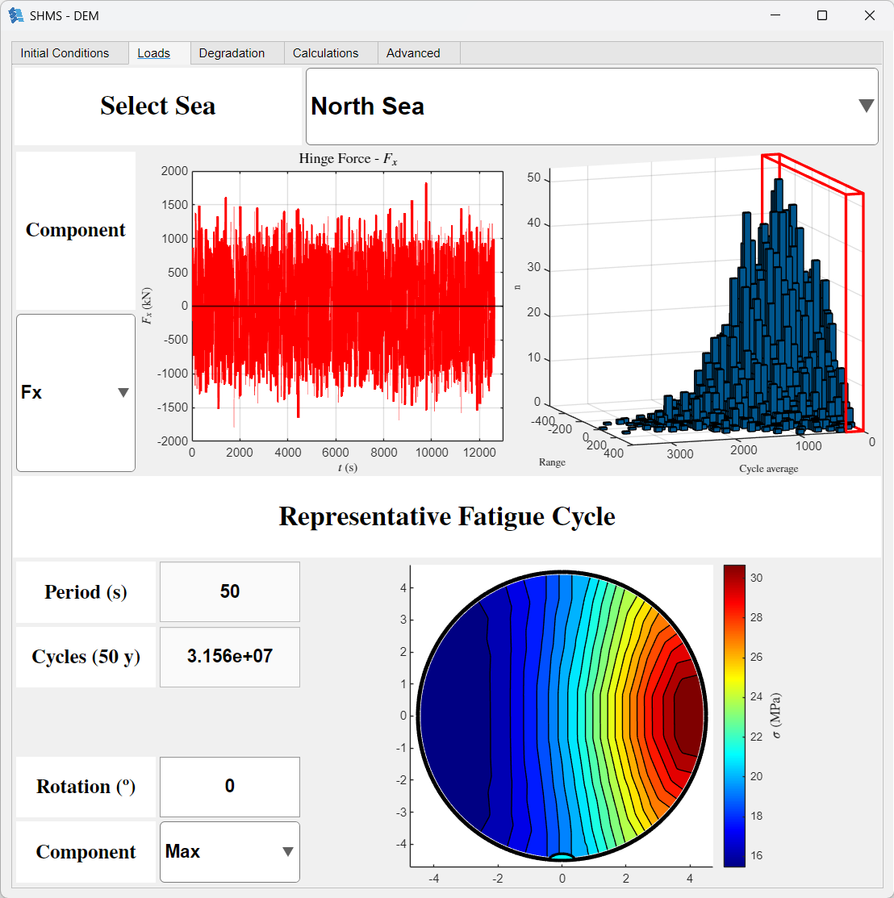{width=80%}

### The corrosion sensor

The sensor is an eddy-current-based device using an LC resonator with a circular air-cored inductor. Its detection range is 5 to 6 cm outside the concrete surface, with a resolution of 0.17 mm for material-loss quantification. Sensor-node electronics are designed and calibrated. Recommended placement follows the stress-field output from the structural integrity assessment: highest-load breakwaters, regions near mooring and connector attachments, and geometric stress concentrators.

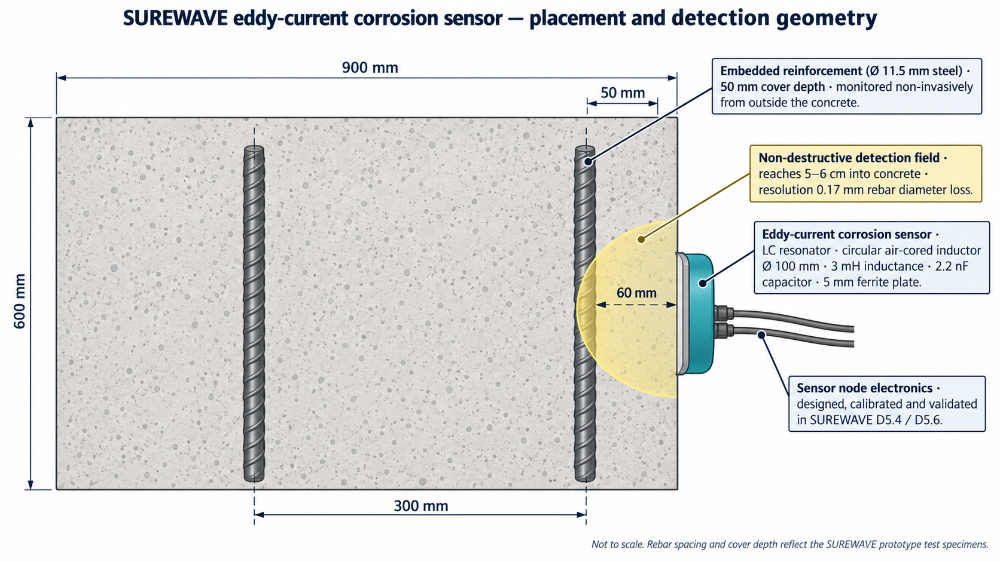{width=90%}

### SHMS functionalities

The platform delivers five design- and operations-phase capabilities:

- Material comparison for design-phase optimisation across candidate formulations and reinforcement schedules.
- Mechanical degradation impact assessment relating sensor readings to residual load capacity.
- Automated inspection interval recommendations — a routine four-year cycle plus event-triggered inspections based on real-time sensor data.
- Critical crack orientation identification for optimal sensor placement.
- Quality control criteria for production, informed by design-phase stress and fatigue analysis.

### Deployment readiness

The current implementation uses model-generated degradation data because real long-term field data does not yet exist. The modular architecture accommodates real sensor inputs, alternative crack-growth formulations and future machine-learning diagnostics. Full field validation depends on data from deployed prototypes and eventual first-of-a-kind installations.

---

## 8. Environmental impact

Life-cycle assessment and local environmental impact assessment were carried out across the three reference sites.

### Climate benefit

Compared with coal-based electricity generation, offshore FPV installed under SUREWAVE assumptions delivers greenhouse gas savings of approximately 170,000 tonnes CO₂-equivalent over 25 years for the reference plant scale — a reduction of more than 80% versus coal at all three sites. This is the strongest single environmental case for the technology.

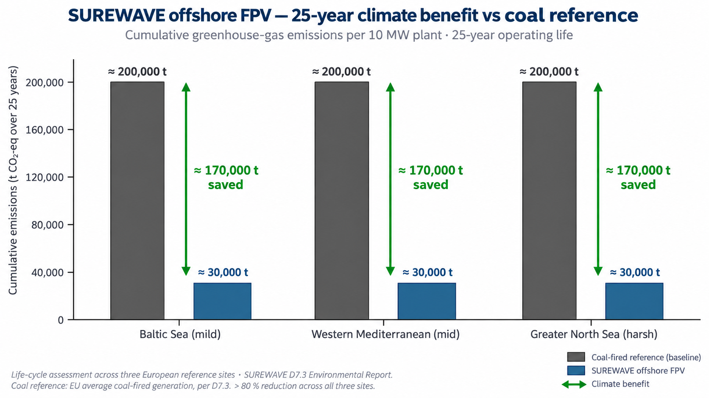{width=90%}

### Other environmental impacts

Impacts higher than onshore renewables are documented; offshore FPV is positioned to complement, not replace, land-based solar. The dominant contributions are:

- Vessel fuel consumption during installation and O&M — the largest single life-cycle impact category.
- Submarine cable routing through sensitive marine biotopes.
- Shading of underlying marine flora within the array footprint.
- Underwater noise from anchoring operations, affecting marine mammals during deployment.

### Design recommendations

Environmental performance is optimised by high-irradiation site selection, minimising cable length by tapping into existing offshore infrastructure where possible, adopting sustainable marine fuels for the installation and O&M fleet, and applying site-specific mitigation measures informed by full Environmental Impact Assessments per deployment location.

---

## 9. Economic case

The economic assessment covers three configurations (2 MW, 10 MW modular, 10 MW full-scale) at each of the three reference sites, across pessimistic, base and optimistic scenarios, over a fifty-year project lifetime with mid-life PV module reinstallation.

### Headline results — 10 MW full-scale base scenario

| Region | LCoE (€/kWh) | NPV | IRR | Payback |
|---|---:|---:|---:|---:|
| Western Mediterranean | 0.062 | + €8.9 M | 10.7% | 7–8 years |
| Baltic Sea | 0.096 | + €2.1 M | 2.2% | 14–16 years |
| Greater North Sea | 0.139 | negative | negative | not viable |

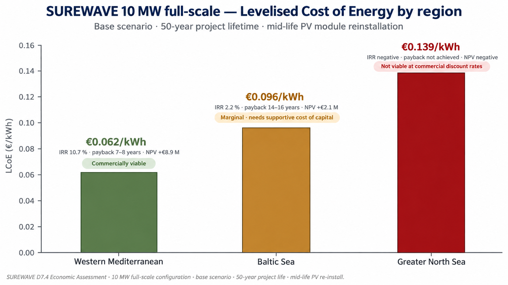{width=90%}

The Mediterranean 10 MW full-scale configuration is commercially viable under conventional discount rates. The Baltic configuration is marginal — viable for developers with a lower cost of capital or with policy support. The North Sea configuration is not viable without significant financial support or a hybrid framing (co-siting with offshore wind, dedicated demonstration funding, or grid-integration credits).

### Sensitivities

CAPEX dominates the LCoE across all sites. Sensitivity to discount rate is high — North Sea only turns positive at discount rates below 6%. Cable connection is the single most sensitive economic variable: short floating cables to existing offshore infrastructure preserve viability; adding a full dedicated submarine cable connection erodes it substantially.

Innovative circular concrete breakwater formulations, while environmentally motivated, do not deliver a material cost advantage over conventional concrete designs at the system level. The economic case for SUREWAVE is built on the combined offshore-FPV concept, not on the specific breakwater material choice.

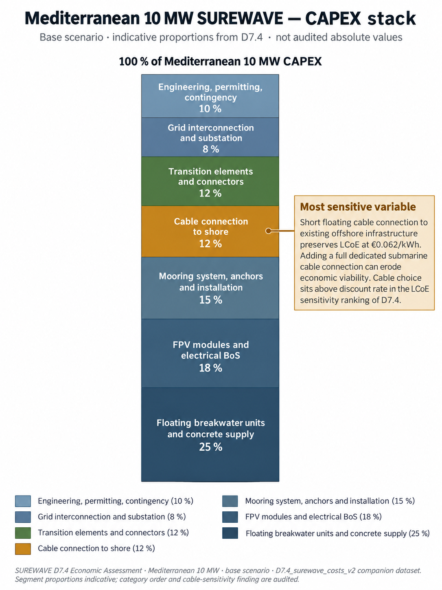{width=70%}

### Recommended deployment sequencing

Mediterranean first for commercial pilots. Baltic second, with cost-of-capital arrangements or policy support. North Sea third, deferred to hybrid or demonstration contexts until either the cost stack or the market environment changes.

---

## 10. Social sustainability

Social life-cycle assessment across the offshore FPV supply chain and construction/operation phases shows offshore FPV social risks can be substantially lower than the fossil reference, provided that:

- High-risk supply chains are avoided or actively managed. Solar cell production is heavily concentrated in China, with documented forced-labour concerns in Xinjiang traceable through the polysilicon supply chain. Steel for anchoring and reinforcement, aluminium and copper for cables and frames, and marine fuel consumption are additional risk hotspots.
- Material intensity per kWh is minimised. Location choice — solar irradiation, cable length, metocean conditions — dominates over technology-design choices for social risk. Breakwater type and layout have negligible effect on social risks.
- Construction and maintenance labour rights and offshore worker safety are actively managed. These carry documented risks even though their overall contribution to total social risk is small.

Recommendations align with the EU Corporate Sustainability Due Diligence Directive: EU low-risk-country sourcing where possible, certified suppliers in higher-risk nations, direct engagement models with critical upstream partners, and diversification of PV production capacity within the EU as a strategic priority.

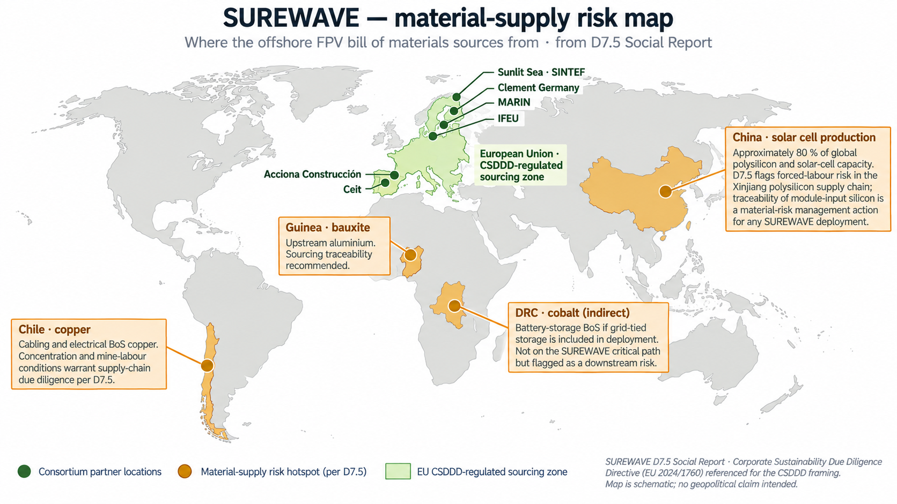{width=90%}

Local social engagement — with fishing, tourism, navigation and other maritime economic actors — is addressed by a stakeholder engagement framework developed in the project. Effective site-level deployment requires broad and early stakeholder engagement, careful marine spatial planning, and consideration of trade-offs across environmental, social and economic dimensions.

---

## 11. Path to market

SUREWAVE takes offshore floating photovoltaics from TRL 2–3 to TRL 4–5. What sits between TRL 5 and commercial deployment:

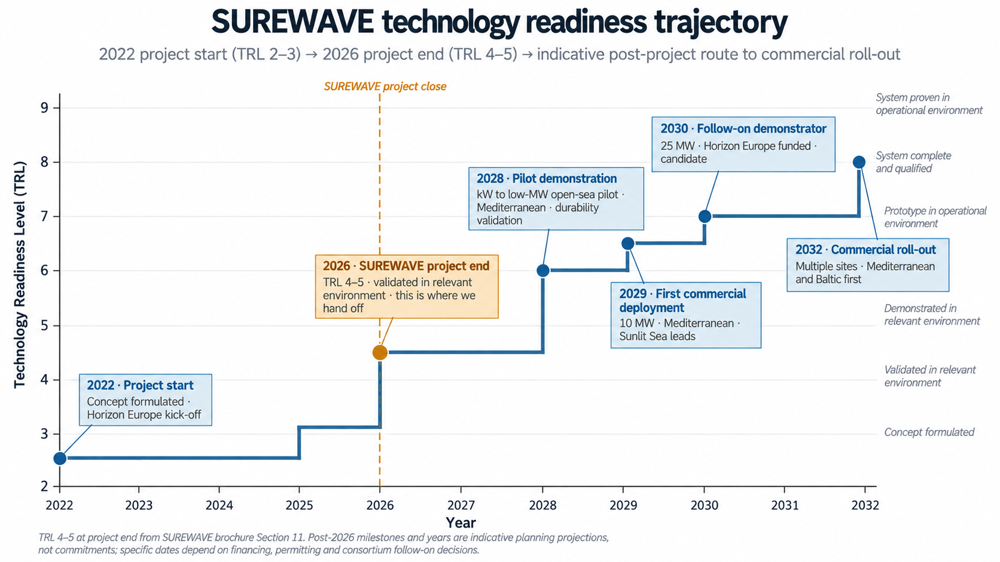{width=90%}

- A first open-sea demonstrator at pilot scale (kW to low-MW range) to validate long-term durability of the redesigned polyurethane hinge and the concrete breakwater under real environmental exposure.
- A further hinge design iteration for full North Sea qualification (current Gen-3 design is marginal at 40 kN North Sea design loads with 37 kN ultimate; a fourth iteration could raise the margin further or steel-rope alternatives could substitute polyurethane at the highest-load positions).
- Field data from the deployed reduced-scale breakwater prototype and instrumented components, feeding the Structural Health Management System with the real corrosion, motion and load data needed to move from model-generated to sensor-driven diagnostics.
- Integration with existing offshore infrastructure at candidate deployment sites, to minimise the cable-connection cost sensitivity that dominates the economic case.
- Regulatory approvals, environmental permits and stakeholder agreements at candidate deployment locations.

### The commercial proposition

For offshore energy developers, floating PV manufacturers, EPC contractors and the wider offshore renewables ecosystem, SUREWAVE offers:

- A validated design basis for offshore FPV across three European sea-basin conditions, with published metocean, load, structural, hydrodynamic and material characterisation data.
- A modular manufacturing approach — reduced-scale prototypes, marine-grade aluminium modules, cast concrete breakwater units — that supports port-side assembly and rapid deployment.
- Structural health management from day one, with an integrated platform that supports design optimisation, inspection planning and predictive maintenance.
- A concrete Mediterranean-first commercial pathway with LCoE at €0.062/kWh and 10.7% IRR at the 10 MW scale — competitive with fixed offshore wind (35–45 €/MWh) at Mediterranean irradiation levels and well below floating offshore wind (62–106 €/MWh per SET Plan targets).
- Alignment with EU Corporate Sustainability Due Diligence Directive obligations and with the Horizon Europe Mission for Healthy Oceans.

### Where SUREWAVE fits in the offshore renewables portfolio

SUREWAVE does not compete with offshore wind. It complements it. Floating PV at coastal irradiation levels and moderate sea states is a distinct addressable segment, particularly attractive where sea-basin conditions permit but seabed conditions or wind resource make offshore wind less attractive, and where existing offshore infrastructure — cables, substations, ports — can be leveraged to reduce marginal deployment cost.

Co-location with offshore wind is a natural extension. A floating PV array inside the perimeter of a floating offshore wind farm shares grid infrastructure, mooring corridors, monitoring assets and operational logistics. SUREWAVE has established the design basis and validated toolchain that make such co-location engineering feasible.

---

## 12. The consortium

Seven partners across four European countries.

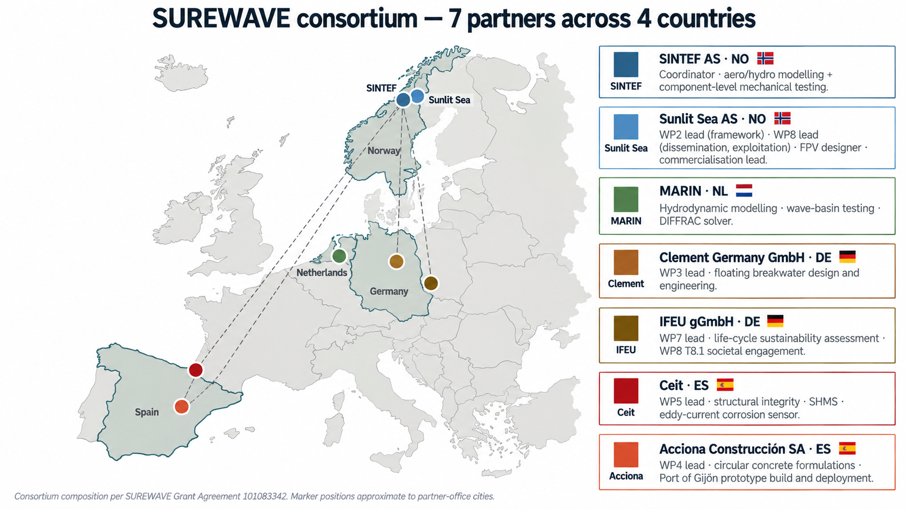{width=90%}

| Short | Full name | Country | Role in SUREWAVE |
|---|---|---|---|
| SINTEF | SINTEF AS | Norway | Coordinator; aero- and hydrodynamic simulation; mechanical testing (WP6 lead) |
| Sunlit Sea | Sunlit Sea AS | Norway | Framework and specifications (WP2 lead); dissemination and exploitation (WP8 lead); FPV module and connection design; commercialisation |
| Ceit | Asociación Centro Tecnológico Ceit | Spain | Structural integrity, SHMS, corrosion sensing (WP5 lead) |
| MARIN | Stichting Maritiem Research Instituut Nederland | Netherlands | Hydrodynamics, basin testing |
| Acciona | Acciona Construcción SA | Spain | Circular concrete materials, breakwater manufacture (WP4 lead) |
| Clement Germany | Clement Germany GmbH | Germany | Floating breakwater design (WP3 lead) |
| IFEU | Institut für Energie- und Umweltforschung Heidelberg gGmbH | Germany | Sustainability assessment (WP7 lead) |

Total consortium effort: 341.7 person-months across the four-year project. EU contribution: €3,515,097.50 at 100% funding rate.

---

## 13. About Sunlit Sea

Sunlit Sea AS is a Norwegian technology company developing floating solar photovoltaic solutions for offshore and coastal deployment. Founded in Trondheim, Sunlit Sea's technology combines pressed marine-grade aluminium float modules with modular string assembly for rapid deployment and low CAPEX. The company has delivered pilot installations in Norwegian coastal waters and is preparing utility-scale deployments in Norway and abroad. Sunlit Sea leads SUREWAVE Work Packages 2 and 8, contributes to Work Package 3 on internal FPV component design and to Work Package 6 on component-level mechanical validation, and is responsible for the economic assessment in Work Package 7.
Sunlit Sea's role in SUREWAVE positions the company as the natural commercialisation partner for the integrated offshore FPV concept the project has developed. The company's independent Gen 2 product line and the SUREWAVE consortium output share a design DNA — flat aluminium modules, flexible hinge connections, matrix-based deployment — that makes technology transfer from SUREWAVE research into a shipping product a design-continuous, rather than a design-discontinuous, step.

---

## Further information

- Project record: European Commission CORDIS database, project reference 101083342.
- Public deliverables and datasets: SUREWAVE Zenodo Community.
- Scientific publications: peer-reviewed articles in offshore engineering, materials, life-cycle assessment and energy economics journals arising from the project.
- Coordinator contact: SINTEF AS, Trondheim, Norway.
- Editorial contact for this brochure: Sunlit Sea AS.

---

*SUREWAVE is funded by the European Union under Horizon Europe. Views and opinions expressed are those of the author(s) only and do not necessarily reflect those of the European Union. Neither the European Union nor the granting authority can be held responsible for them.*
