\begin{titlepage}
\thispagestyle{empty}
\begin{tikzpicture}[remember picture, overlay]
  \node[opacity=0.35, inner sep=0pt] at (current page.center)
    {\includegraphics[width=\paperwidth, height=\paperheight, keepaspectratio=false]{C:/dev/src/sure-d61/surewave/images/2026-09-28_surewave_d8.3_technical_brochure_lowres/fig01.png}};
\end{tikzpicture}%
\vspace*{4cm}
\begin{center}
{\fontsize{72pt}{80pt}\selectfont\bfseries\color{MidnightBlue}SUREWAVE}\\[1.2em]
{\LARGE\bfseries\color{MidnightBlue}Offshore floating photovoltaics for the open sea}\\[2em]
{\Large\itshape An integrated wave-shielded FPV system\\for open-sea conditions}\\[5em]
\includegraphics[width=2cm]{C:/dev/src/sure-d61/surewave/images/eu_flag.png}\\[1em]
{\small Horizon Europe grant 101083342 $\cdot$ Cluster 5 (Climate, Energy and Mobility) --- Destination 3 \\ Call HORIZON-CL5-2021-D3-03 $\cdot$ Coordinator: SINTEF AS $\cdot$ September 2026\\[0.6em]Deliverable D8.3 Technical Brochure $\cdot$ Work Package 8 $\cdot$ Dissemination level: PU (public) $\cdot$ Lead beneficiary: Sunlit Sea AS}
\end{center}
\end{titlepage}

## About this brochure

SUREWAVE is an integrated offshore floating photovoltaic (FPV) system designed to survive the wave, wind and current conditions of the open sea. It couples a novel external floating breakwater with a redesigned FPV array, backed by a validated numerical modelling toolchain and a structural health management platform. Between 2022 and 2026 a seven-partner European consortium coordinated by SINTEF built and validated the system through laboratory testing, wave-basin campaigns and a reduced-scale prototype in the water at the Port of Gijón, taking offshore FPV from technology readiness level 2–3 to TRL 4–5.

The brochure is written for offshore energy developers, floating PV manufacturers, EPC contractors, marine engineering firms, port and grid operators, insurers and investors who evaluate offshore FPV as a portfolio option. It summarises what the technology does, how it performs, what it costs, and what remains between here and commercial deployment.

---

## At a glance

- A novel circular-concrete floating breakwater designed by Clement Germany, with three new circular concrete formulations developed by Acciona (high-performance, lightweight-aggregate and cellular lightweight concrete).
- Reduced-scale breakwater prototype in the water at the Port of Gijón, backed by two wave-basin campaigns at Stadt Towing Tank and MARIN Wageningen and by an integrated modelling toolchain validated against classical theory and experiment.
- The FPV polyurethane hinge redesigned by Sunlit Sea to approximately three times the first-generation component tensile strength. Full-hinge ultimate limit state is 37 kN — clears the Baltic (34 kN) and Mediterranean (33 kN) design loads with margin; the North Sea design load (40 kN) exceeds ULS and a further design iteration is required for North Sea qualification.
- A Structural Health Management System developed by Ceit — eddy-current corrosion sensor for embedded reinforcement, fatigue-assessment tool, and five design- and operations-phase capabilities integrated on a MATLAB platform.
- Life-cycle sustainability assessment by ifeu — of the order of 170,000 tonnes CO₂-equivalent saved per reference plant over 25 years against a coal-fired marginal reference (above 80 % reduction across all three sites); smaller but still substantial against the 24-hour EU average generation mix.
- Levelised cost of energy €0.062/kWh in the Mediterranean at 10 MW scale — competitive with fixed-bottom offshore wind, well below floating offshore wind — and technology readiness advanced from TRL 2–3 to TRL 4–5 (validated in relevant environment).

---

## 1. Why offshore floating photovoltaics

Solar photovoltaic capacity is being deployed faster than any other electricity technology. The land constraint that limits onshore PV in dense coastal economies does not exist over water. Land-based floating PV — on reservoirs, lakes and ponds — has grown to more than 2.5 GW installed globally. Offshore FPV is at pilot and early-commercial scale, with sub-MW to low-MW arrays now in the water in several European and Asian locations. Volume-scale commercial roll-out is still ahead; the sea offers scale, but it also brings wave loads, wind loads, currents, salinity and biofouling that a lake-tuned float cannot handle.

Europe's offshore renewable energy strategy identifies floating PV as one of the technologies needed to diversify beyond offshore wind. Even a small fraction of Europe's exclusive economic zone under offshore PV would exceed today's total European solar generation. What has been missing is a design that survives open-sea conditions economically over a 25- to 40-year operating life.

SUREWAVE targets that gap. The project has advanced offshore FPV from technology readiness level 2–3 (concept formulated) to TRL 4–5 (validated in relevant environment) by combining a novel external floating breakwater with a redesigned FPV array, backed by validated numerical models and a structural health management platform.

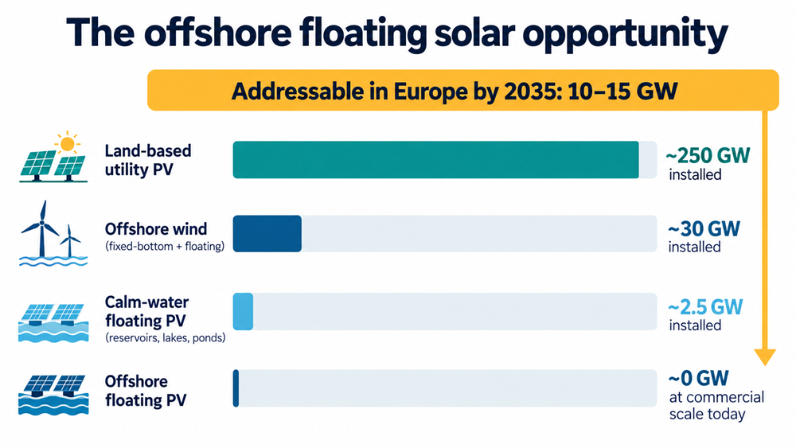{width=70%}

---

## 2. The SUREWAVE concept

SUREWAVE is an integrated system. Four subsystems work together:

- An external floating breakwater built from circular concrete formulations attenuates incoming waves before they reach the PV array.
- A flexible transition-element system connects the breakwater to the FPV array while absorbing differential motion.
- The FPV array itself uses marine-grade aluminium modules connected by polyurethane hinges into large matrices, arranged for wave shielding by neighbouring floats.
- A catenary mooring system holds the whole installation on station across mild to harsh European sea states.

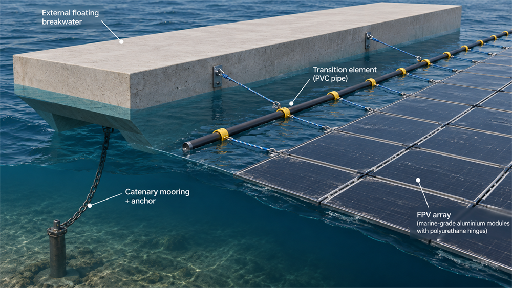{width=70%}

The reference plant is 7 MWp, laid out on a 346 m diameter circular footprint. Sixty-eight matrices of fourteen by fourteen FPV modules sit inside a perimeter of external floating breakwater units, with two internal linear breakwater lines dividing the array into sub-farms for structural and hydrodynamic reasons. A 420 kWp pilot-scale variant is designed for mild-sea early deployments.

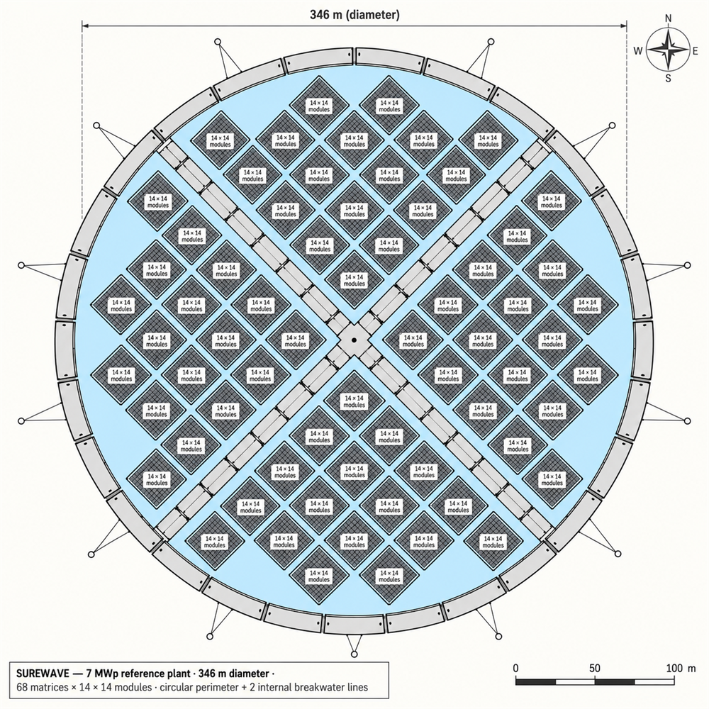{width=85%}

The system is dimensioned against three reference site classes taken from twenty-five years of ERA5 hindcast data at representative European locations: a mild Baltic site (16 m water depth, significant wave height 0.6 m), a mid-condition Western Mediterranean site (38 m, 0.5 m) and a harsh Greater North Sea site (49 m, 1.6 m). Extreme fifty-year design values cover wind above 25 m/s, current above 1.2 m/s and wave height above 14 m.

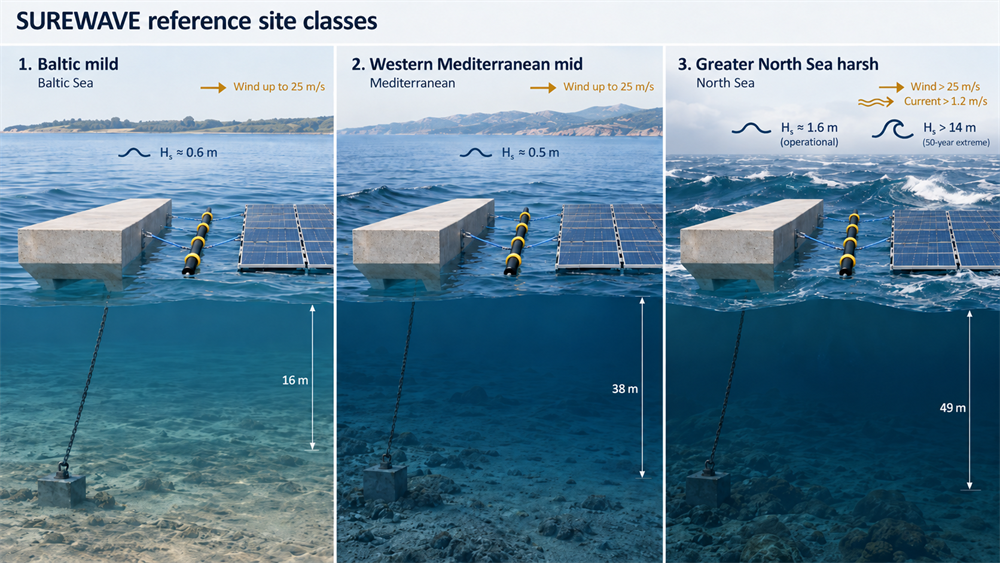{width=70%}

---

## 3. System design highlights

### The floating breakwater

The floating breakwater was designed and dimensioned by Clement Germany across ten candidate cross-sections and mooring layouts, with wave attenuation evaluated using coupled aero-hydrodynamic CFD in FLOW-3D HYDRO (Flow Science Inc.) and validated against classical Macagno, Wiegel, Cox and Fousert-van Tol theoretical models. The selected unit is 20 m long, 5 m wide, 2.5 m high, with double keels. It weighs 123.4 t at 2.03 m draft. The breakwater specifically attenuates more than 40 % of the wave energy in the 1–3 second short-period wind-sea band — the frequencies that drive FPV module fatigue. Long-period swell is handled by the mooring and hinge design, which lets each subsystem be sized for its own job rather than compromising a single float geometry across all frequencies.

Larger draft and width improve efficiency across all wave conditions. Keels raise performance for longer wave periods without a proportional weight penalty. The circular layout produces uniform load distribution and lower peak connector forces than square, octagonal or elliptical layouts, and simplifies anchorage design at scale.

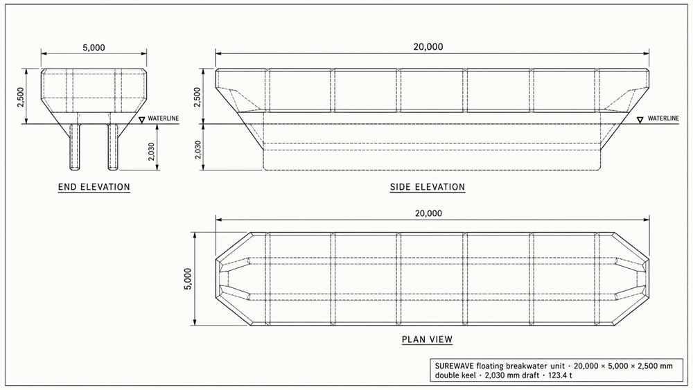{width=70%}

### The FPV modules

The FPV modules use marine-grade aluminium shells with sealed cavities, individually potted, arranged in string modules that pre-assemble into complete matrices for rapid deployment. Modules connect through polyurethane hinges that flex under wave-induced motion while transmitting only limited force between neighbours. The flat profile minimises wind drag and simplifies stacking on shipping barges. Cooling is passive by convection and evaporation over the seawater below the array.

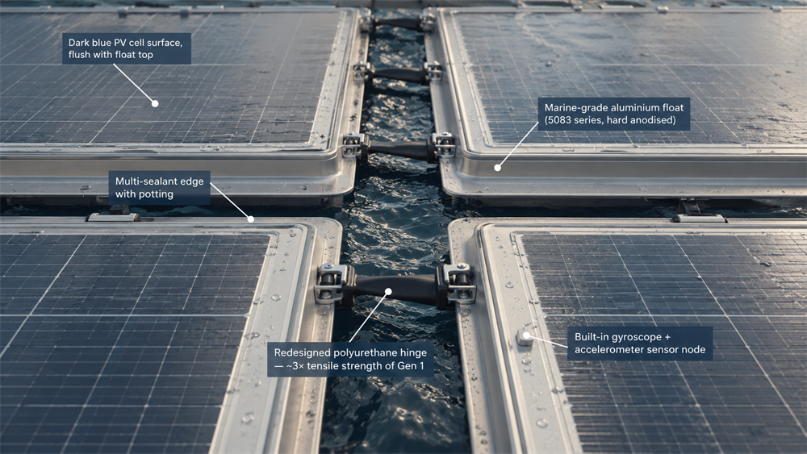{width=70%}

### Mooring, anchoring, connections

The mooring, anchoring and transition-element design is Clement Germany's work alongside the breakwater itself. Catenary mooring with stud-link steel chain is dimensioned to DNV-OS-E301 for each of the three site classes. Nominal chain diameter is 54 mm at the Baltic site and 95 mm at the Mediterranean and North Sea sites; the 16 mm corrosion allowance built on top gives outer diameters of 70 and 111 mm respectively. Mediterranean and North Sea share the same chain size but the North Sea layout uses more mooring lines and higher anchor count. The corrosion allowance is sized for a 40-year design life and is refreshed at mid-project chain replacement in the 50-year economic model. Driven anchor piles are sized for medium-dense sand seabed conditions; site-specific geotechnical adjustments apply elsewhere.

The transition element connecting each floating breakwater to the FPV array uses elasticized rope with safety factors of 3.2 to 4.4 at critical connection points. It allows differential motion between the heavy breakwater and the lightweight FPV array without transmitting damaging peak loads to either.

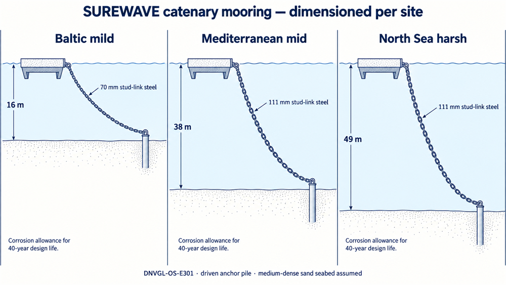{width=70%}

---

## 4. Materials innovation

Acciona Construcción, as WP4 lead, developed three new circular concrete formulations for the floating breakwater, with concrete-properties modelling by SINTEF supporting the mix characterisation.

### High-performance concrete (HPC)

Compressive strength 128 MPa achieved (target 120 MPa). The optimised mix (Sample 2 in the consortium record) uses reduced cement content substituted by ground granulated blast-furnace slag and fly ash, plus a Krystaline Add1 waterproofing admixture. Durability testing confirmed marine-exposure code compliance (XS2/XS3) with no measurable water penetration. Mechanical testing on small-scale prototypes gave HPC 55 % higher strength than the LWAC alternative at a better strength-to-weight ratio. HPC was selected for the structural shell of the reduced-scale breakwater prototype.

### Lightweight aggregate concrete (LWAC)

Compressive strength 68 MPa achieved, density approximately 1950 kg/m³. Optimised mixes (Samples 17 and 18) use recycled construction and demolition waste, glass-derived Minolite lightweight aggregate, fly ash and blast-furnace slag. LWAC with CEM III cement and Krystaline Add1 gave the optimal chloride resistance of the tested combinations. Selected for the top slab of the prototype.

### Cellular lightweight concrete

Achieved density 365 kg/m³ (target 300 kg/m³). Optimised mix (Sample 26) provides the inner core of the breakwater with the buoyancy safety margin required for open-sea operation. Additional EPS blocks are included in the current prototype design as a manufacturing safety margin.

### FPV structural materials

The FPV floats use marine-grade aluminium alloy (5083 series) with hard anodisation for corrosion resistance and multi-sealant edge architecture. Polyurethane is used for hinges, structural infill and connection elements — the material choice reflects both flexibility and manufacturing suitability, with the trade-offs and open questions on long-term durability addressed in Section 6.

### Circular content

Across the concrete formulations, recycled aggregates, ground blast-furnace slag, fly ash, glass-derived lightweight aggregate and silica fume displace primary materials at the tens of percent level. The environmental footprint of the finished concrete is reduced correspondingly, in line with the project's circular-economy objective.

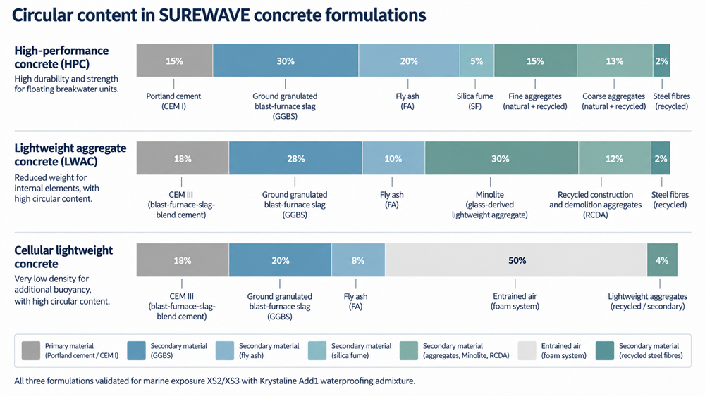{width=70%}

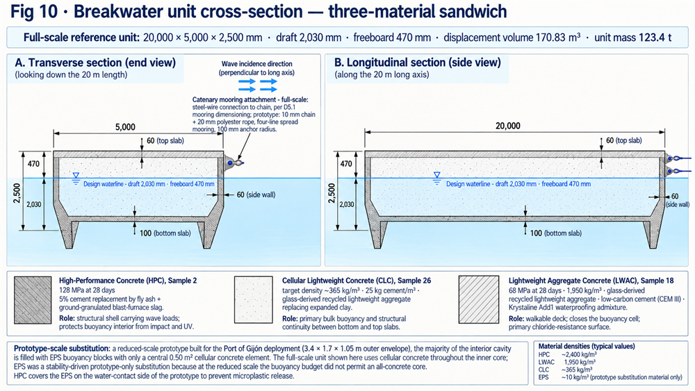{width=70%}

---

## 5. Modelling and simulation

The SUREWAVE consortium built and validated a coupled modelling toolchain covering hydrodynamics, aerodynamics, structural integrity and fatigue.

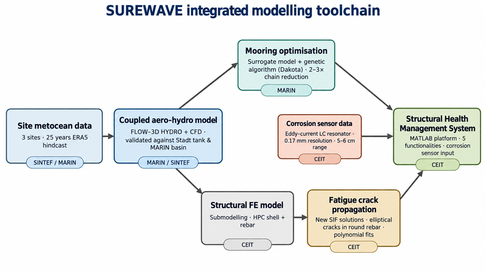{width=70%}

### Coupled aero-hydrodynamics

Hydrodynamic behaviour of the coupled FPV-breakwater system was analysed with linear methods at low to mid fidelity, calibrated against Stadt towing-tank test results. Motion response, connector loading with varying float sizes, and mooring design loads were evaluated across the three reference sites. Aerodynamic simulations in CFD characterised lift and drag coefficients as functions of PV module inclination and array geometry, and produced correlations for breakwater shielding effectiveness at different angles of attack.

The floating breakwater substantially reduces vertical loads on the FPV array. Its horizontal shielding effect is more limited across large farms, which motivated the sub-farm mooring strategy adopted in the reference plant.

### Mooring optimisation

Mooring designs were optimised by MARIN via surrogate modelling and genetic algorithms, delivering up to 56 % chain-weight reduction against a first-iteration deterministically-sized baseline at equal structural safety (case-specific to the SUREWAVE breakwater ring; not a general claim about mooring systems). The optimisation covered chain size, catenary geometry, anchor spacing and pretensioning strategy.

### Structural integrity

Advanced finite element analysis with submodelling techniques was used to assess critical breakwater components. Global FE models fed reinforced-concrete submodels subjected to extreme and fatigue load cases across the three sites. Fatigue analysis used Goodman and Soderberg criteria and demonstrated infinite-life design for the breakwater under specified loading. Detailed stress-field outputs feed the crack propagation and health-management tools.

Beyond static and extreme-load analysis, the toolchain includes a fatigue-assessment tool for critical breakwater rebar locations, validated against literature and demonstrated end to end in a North Sea case study. The tool also feeds the Structural Health Management System described in Section 7.

### Validation

All modelling methodologies were validated against international standards (ABS and DNV guidelines) and experimental data from the WP4 material tests and WP6 physical prototyping. The validation report closes the modelling loop; identified limitations include localised pitting corrosion (generalised corrosion only for now), lack of probabilistic uncertainty quantification, and limited long-term field data for calibration — all identified as forward-work priorities.

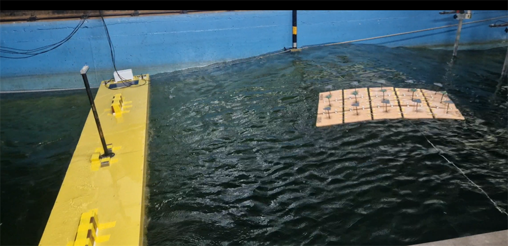{width=70%}

---

## 6. Testing and validation

### Laboratory scale — materials

Durability testing on HPC and LWAC shell materials with and without waterproofing admixture confirmed compliance with marine-exposure code XS2/XS3. Static and cyclic bending, pullout and drop-tower impact tests on 600 × 150 × 100 mm sandwich beams (HPC or LWAC shell over cellular concrete core) demonstrated HPC as mechanically superior for both static and dynamic loading.

### Component-level — connections

Three critical connection systems were tested at SINTEF: polyurethane hinges between FPV modules, cable systems between floating breakwaters, and new tailored connections between breakwaters and FPV modules. First-generation polyurethane hinges showed a component tensile ultimate of 3.5 kN on average — below the 8 to 10 kN operational-load band expected from coupled hydrodynamic analysis — and low compressive resistance. Steel-wire connections between breakwaters performed as specified at 402 kN ultimate load against a 450 kN rating. The new breakwater-to-module connection met its 41 kN requirement, with the rope element identified as the weak point.

The first-generation hinge finding drove a redesign led by Sunlit Sea. The redesigned polyurethane component was validated in a second round of testing at SINTEF and delivered approximately three times the first-generation component tensile ultimate on the same test scale, with buckling strength raised to 20 kN. Fatigue testing at the design operational stress (approximately 11 MPa in the polyurethane) gave a calculated failure life of 2.5 × 10¹¹ cycles — well above the 7.88 × 10⁸ cycles required for 25 years of service; the margin is stress-conditional and would tighten if a stiffer connecting element raised the component stress. Production quality control is the remaining sensitivity: material shrinkage of 1 to 2 mm during casting drives performance variability and needs strict process control in mass production.

At the full-hinge system level, integrated finite-element analysis under 50-year design storms gives an ultimate limit state of 37 kN. The Baltic (34 kN) and Mediterranean (33 kN) design loads clear the ULS with margin; the North Sea design load of 40 kN exceeds the current Gen-3 ULS and a further design iteration is required for North Sea qualification. Two distinct load regimes drive the design: the 50-year extreme values set the ULS; the 8–10 kN operational band sets the fatigue life.

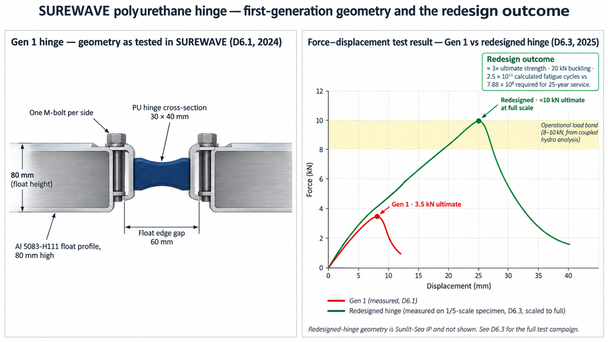{width=70%}

### Reduced-scale prototype

A 3.4 m by 1.7 m footprint reduced-scale breakwater prototype was manufactured at Acciona's workshop. It combines an HPC bottom slab and walls (0.94 m³), an LWAC top slab (0.35 m³), a cellular concrete core (0.50 m³) and EPS buoyancy blocks. Design parameters — metacentric height above 0.25 m, freeboard above 0.3 m — were set for deployment at the Port of Gijón, taking wave loading and marine growth into account. A four-line catenary spread mooring with 10 mm chain and 20 mm polyester rope holds the prototype on station while minimising vertical loads. At approximately 1:6 in plan against the 20 × 5 × 2.5 m production breakwater the prototype validates the concrete formulations, the buoyancy design and the mooring behaviour in a real marine environment; the structural response of the full-scale unit is separately validated through the modelling toolchain described in Section 5.

Manufacturing proceeded without major complications. Surface finish came out rougher than target due to LWAC casting characteristics but is acceptable for the prototype's monitoring purpose; the LWAC surface-finish behaviour is a documented material trade-off that Acciona is addressing in follow-on R&D.

The deployment site is El Musel Port in Gijón, on the northern Spanish coast — one of Atlantic Europe's main maritime ports and host to Acciona's R&D maritime environment demo area. Design-basis metocean data for the site was drawn from the Spanish national ports oceanographic archive. Field deployment feeds long-term degradation and structural-health data back into the modelling toolchain: the prototype is instrumented and monitored under WP6 with periodic inspection and sensor-driven readouts, validating both the durability of the three circular concrete formulations and the mooring behaviour in real wave, tide and current conditions.

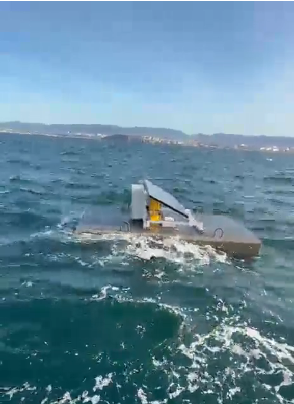{width=45%}

### Basin testing

Two wave-basin campaigns were completed across the project.

The first was at the Stadt Towing Tank in Norway, provided by Sunlit Sea. Six FPV floats in a representative string configuration were tested under regular and irregular waves to measure motion response, inter-float connector loading and matrix-level dynamic behaviour. The results calibrated the linear hydrodynamic methodology used subsequently across all three reference sites and gave the first physical evidence for the connector-force distribution assumed in the design of the polyurethane hinges.

The second was at MARIN's wave basin in Wageningen. A scaled model of individual floating-breakwater units was tested under coupled wave and wind loading representative of the reference site classes. The MARIN campaign measured unit-level loads under coupled loading, produced the mooring-line load distribution used to close the modelling loop for the extreme-load response, and established an elastic-scaling methodology for the polyurethane connecting elements so that basin-scale measurements extrapolate meaningfully to full-scale loads.

Together the two campaigns closed the loop between analytical model, numerical simulation and physical measurement across the range of scales relevant to open-sea deployment.

---

## 7. Structural Health Management System

The SUREWAVE Structural Health Management System (SHMS) is a MATLAB platform that integrates finite-element stress fields, crack-propagation algorithms and degradation data from a purpose-built eddy-current corrosion sensor for embedded reinforcement in offshore concrete. It delivers five design- and operations-phase capabilities: material comparison for design optimisation, degradation-impact assessment relating sensor readings to residual capacity, automated inspection-interval recommendations (a four-year cycle plus event-triggered checks), critical crack-orientation identification for sensor placement, and quality-control criteria for production.

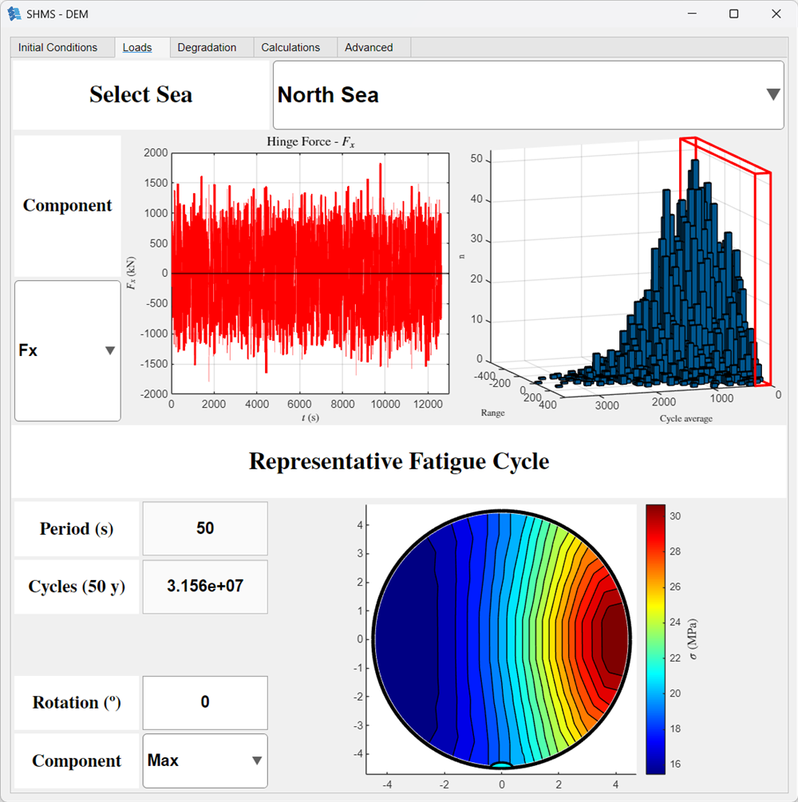{width=65%}

The corrosion sensor is a non-destructive eddy-current device that detects rebar degradation through the concrete cover at sub-millimetre resolution. Placement follows the structural-integrity stress field: highest-load breakwaters, mooring and connector attachments, geometric stress concentrators. Full sensor specifications are held in the consortium record.

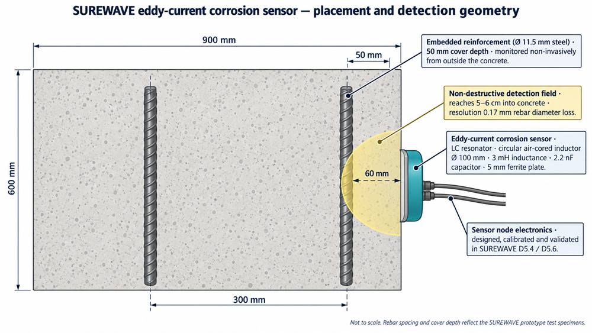{width=60%}

The sensor hardware, the finite-element stress fields and the crack-propagation algorithms are validated SUREWAVE outputs. In the design-phase build the corrosion-degradation input stream is populated by physical model, awaiting replacement by live sensor-driven field data from the first open-sea deployments. The modular architecture accommodates alternative crack-growth formulations and future machine-learning diagnostics as that field data accumulates.

---

## 8. Environmental impact

Life-cycle assessment and local environmental impact assessment were carried out across the three reference sites.

### Climate benefit

The life-cycle sustainability assessment was carried out by ifeu (WP7 lead) using the project's own LCA framework, with the sustainability-framework methodology and technological-risk method developed by SINTEF (T7.1 and T7.2).

Offshore FPV installed under SUREWAVE assumptions avoids of the order of 170,000 tonnes CO₂-equivalent per reference plant over 25 years, measured against the fossil generation it displaces at the moment of production. In the European markets considered, that marginal generation is still predominantly coal during peak-demand hours, which coincide with the solar production profile. D7.3 gives 180,000 t for the uniform North Sea layout and 160,000 t for the split North Sea layout; Baltic and Mediterranean reference plants deliver comparable reductions. Measured against the 24-hour EU average generation mix the savings are of the order of 100,000 tonnes CO₂-equivalent per plant over 25 years — smaller than the coal counterfactual but still a substantial contribution to European decarbonisation.

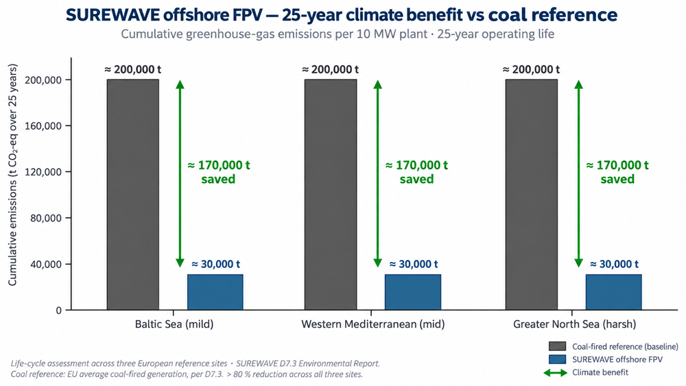{width=70%}

### Other environmental impacts

Impacts higher than onshore renewables are documented; offshore FPV is positioned to complement, not replace, land-based solar. The dominant contributions are:

- Vessel fuel consumption during installation and O&M — the largest single life-cycle impact category.
- Submarine cable routing through sensitive marine biotopes.
- Shading of underlying marine flora within the array footprint.
- Underwater noise from anchoring operations, affecting marine mammals during deployment.

### Design recommendations

Environmental performance is optimised by high-irradiation site selection, minimising cable length by tapping into existing offshore infrastructure where possible, adopting sustainable marine fuels for the installation and O&M fleet, and applying site-specific mitigation measures informed by full Environmental Impact Assessments per deployment location.

---

## 9. Economic case

The economic assessment covers three configurations (2 MW, 10 MW modular, 10 MW full-scale) at each of the three reference sites, across pessimistic, base and optimistic scenarios. The base-case model uses a weighted-average cost of capital of 8.5 % and a notional offtake electricity price of €0.12/kWh carried from the grant-application assumptions; a bankable project would need to negotiate its own PPA on project-specific terms. The 50-year project lifetime is sustained by a mid-life PV module reinstallation at year 25 and a mooring-chain replacement at year 40, both costed into the model as scheduled OPEX reserves.

### Headline results — 10 MW full-scale base scenario

| Region | LCoE (€/kWh) | NPV | IRR | Payback |
|---|---:|---:|---:|---:|
| Western Mediterranean | 0.062 | + €8.9 M | 10.7% | 7–8 years |
| Baltic Sea | 0.096 | + €2.1 M | 2.2% | 14–16 years |
| Greater North Sea | 0.139 | — | — | not viable |

*Indicative figures from the SUREWAVE economic assessment; not an offer or a representation. Project-specific pricing requires site, offtake and financing-structure assumptions beyond those in the modelling base case.*

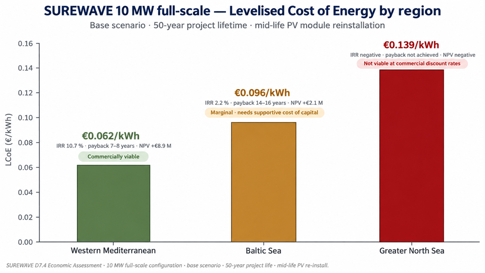{width=70%}

The Mediterranean 10 MW full-scale configuration is commercially viable under conventional discount rates. The Baltic configuration is marginal — viable for developers with a lower cost of capital or with policy support. The North Sea configuration is not viable without significant financial support or a hybrid framing (co-siting with offshore wind, dedicated demonstration funding, or grid-integration credits).

### Sensitivities

CAPEX dominates the LCoE across all sites. Sensitivity to discount rate is high — North Sea only turns positive at discount rates below 6 %. Cable connection is the single most sensitive economic variable: short floating cables to existing offshore infrastructure preserve viability; adding a full dedicated submarine cable connection to a greenfield site erodes it substantially. For reference, a Mediterranean 10 MW SUREWAVE plant tied in via a short connection to a nearby offshore substation delivers €0.062/kWh; the same plant with a dedicated 20 km submarine connection sits in the €0.09–0.11/kWh range depending on landing conditions. Any serious bankability case for the technology begins with the connection route.

Project insurance (nominally in the range 1–3 % of CAPEX per year for first-of-kind marine assets) and decommissioning liability (typically 5–10 % of CAPEX, project-funded via a sinking fund or bond) are not included in the LCoE figures above. Both are project-specific line items that a developer or lender model would add in their own commercial pro-forma.

The three circular concrete formulations were specified to carry the breakwater's structural duty while reducing embodied carbon in the units. The economics of a SUREWAVE plant are dominated by the cable connection route and overall CAPEX rather than by the breakwater material choice; the circular formulations contribute to the sustainability case documented in Section 8 without penalising the economics.

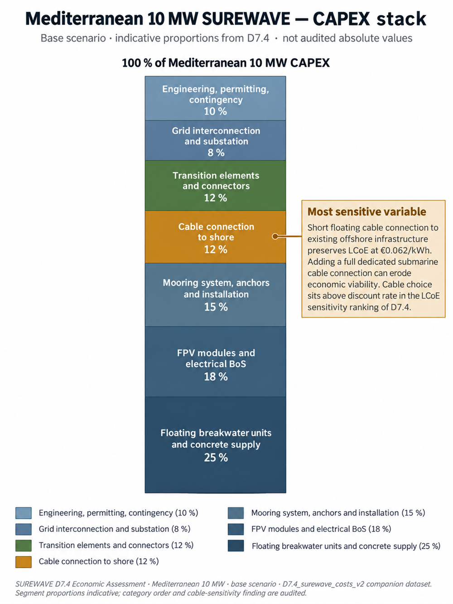{width=70%}

### Recommended deployment sequencing

Mediterranean first for commercial pilots. Baltic second, with cost-of-capital arrangements or policy support. North Sea third, deferred to hybrid or demonstration contexts until either the cost stack or the market environment changes.

---

## 10. Social sustainability

The social life-cycle assessment (S-LCA) was carried out by the ifeu WP7 sustainability team across the offshore FPV supply chain and construction/operation phases. It shows that offshore FPV social risks can be substantially lower than the fossil reference, provided that:

- High-risk supply chains are avoided or actively managed. Solar cell production is heavily concentrated in China, with documented forced-labour concerns in Xinjiang traceable through the polysilicon supply chain. Steel for anchoring and reinforcement, aluminium and copper for cables and frames, and marine fuel consumption are additional risk hotspots.
- Material intensity per kWh is minimised. Location choice — solar irradiation, cable length, metocean conditions — dominates over technology-design choices for social risk. Site and supply chain are the primary social-risk drivers rather than the choice of breakwater material or layout.
- Construction and maintenance labour rights and offshore worker safety are actively managed. These carry documented risks even though their overall contribution to total social risk is small.

The ifeu WP7 team recommends that deployment align with the EU Corporate Sustainability Due Diligence Directive: EU low-risk-country sourcing where possible, certified suppliers in higher-risk nations, direct engagement models with critical upstream partners, and diversification of PV production capacity within the EU as a strategic priority.

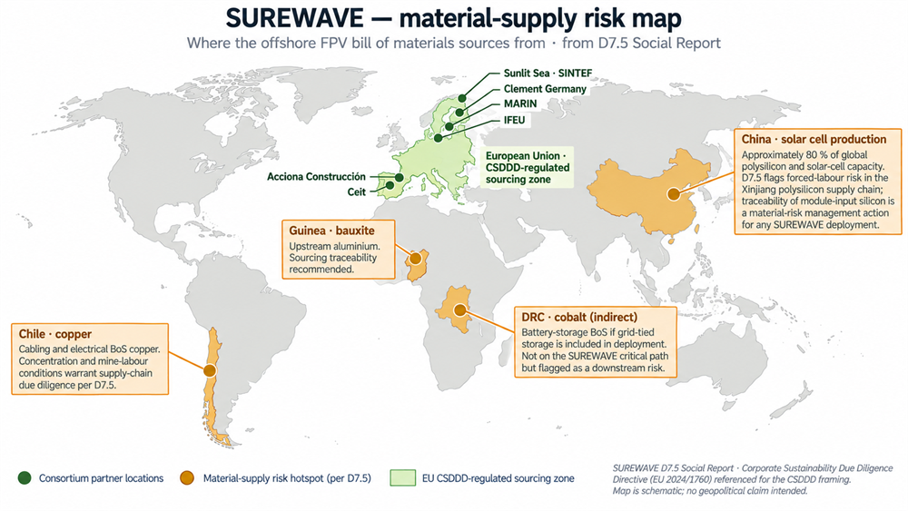{width=70%}

Local social engagement — with fishing, tourism, navigation and other maritime economic actors — is addressed by a stakeholder engagement framework developed in the project. Effective site-level deployment requires broad and early stakeholder engagement, careful marine spatial planning, and consideration of trade-offs across environmental, social and economic dimensions.

---

## 11. Path to market

SUREWAVE takes offshore floating photovoltaics from TRL 2–3 to TRL 4–5. What sits between TRL 5 and commercial deployment:

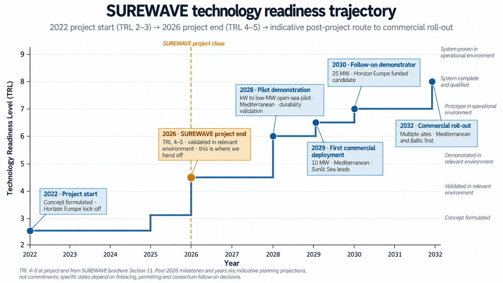{width=70%}

- A first open-sea demonstrator at pilot scale (kW to low-MW range) to validate long-term durability of the redesigned polyurethane hinge and the concrete breakwater under real environmental exposure.
- A further hinge design iteration for North Sea qualification. The current Gen-3 design has a 37 kN ULS and does not clear the 40 kN North Sea design load; a fourth iteration is needed to open that margin, or steel-rope alternatives could substitute polyurethane at the highest-load positions.
- Field data from the deployed reduced-scale breakwater prototype and instrumented components, feeding the Structural Health Management System with the live corrosion, motion and load data to extend its design-phase build into a running sensor-driven diagnostic.
- Integration with existing offshore infrastructure at candidate deployment sites, to minimise the cable-connection cost sensitivity that dominates the economic case.
- Regulatory approvals, environmental permits and stakeholder agreements at candidate deployment locations.
- Technology qualification under DNV-RP-A203 (or an equivalent independent-engineer certification pathway), which first-of-kind offshore marine assets typically require before commercial lenders will underwrite.

### The commercial proposition

For offshore energy developers, floating PV manufacturers, EPC contractors and the wider offshore renewables ecosystem, SUREWAVE offers:

- A validated design basis for offshore FPV across three European sea-basin conditions, with published metocean, load, structural, hydrodynamic and material characterisation data.
- A modular manufacturing approach — reduced-scale prototypes, marine-grade aluminium modules, cast concrete breakwater units — that supports port-side assembly and rapid deployment.
- Structural health management from day one, with an integrated platform that supports design optimisation, inspection planning and predictive maintenance.
- A concrete Mediterranean-first commercial pathway with LCoE at €0.062/kWh and 10.7% IRR at the 10 MW scale — competitive with fixed offshore wind (35–45 €/MWh) at Mediterranean irradiation levels and well below floating offshore wind (62–106 €/MWh per SET Plan targets).
- Alignment with EU Corporate Sustainability Due Diligence Directive obligations and with the Horizon Europe Mission for Healthy Oceans.

The breakwater, mooring and connection engineering developed in WP3 are also applicable beyond offshore FPV — to marinas, port terminals, passenger facilities and other floating infrastructure where wave shielding and station-keeping are design-driving. The circular-concrete manufacturing route developed in WP4 and the Structural Health Management System developed in WP5 are similarly transferable to adjacent marine applications.

### Where SUREWAVE fits in the offshore renewables portfolio

SUREWAVE does not compete with offshore wind. It complements it. Floating PV at coastal irradiation levels and moderate sea states is a distinct addressable segment, particularly attractive where sea-basin conditions permit but seabed conditions or wind resource make offshore wind less attractive, and where existing offshore infrastructure — cables, substations, ports — can be leveraged to reduce marginal deployment cost.

Co-location with offshore wind is a natural extension. A floating PV array inside the perimeter of a floating offshore wind farm shares grid infrastructure, mooring corridors, monitoring assets and operational logistics. SUREWAVE has established the design basis and validated toolchain that make such co-location engineering feasible.

---

## 12. The consortium

Seven partners across four European countries.

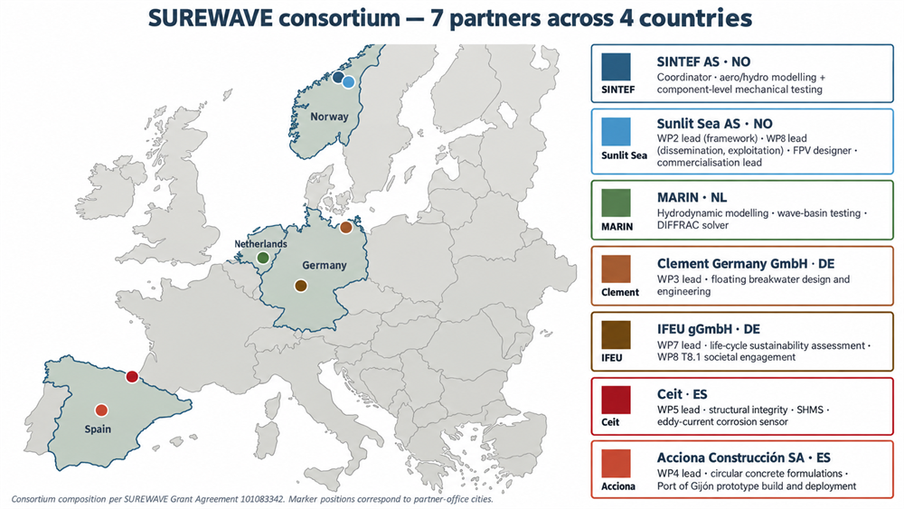{width=90%}

\begin{center}
\begin{tabular}{@{}p{2.3cm}p{3.8cm}p{1.8cm}p{8.2cm}@{}}
\toprule
\textbf{Short} & \textbf{Full name} & \textbf{Country} & \textbf{Role in SUREWAVE} \\
\midrule
SINTEF & SINTEF AS & Norway & Coordinator (WP1); mechanical testing of critical connections (WP6 lead); concrete materials modelling and shell/core interface durability; sustainability framework and technological risk assessment; contribution to coupled aero-hydrodynamic modelling \\
\addlinespace[2pt]
Sunlit Sea & Sunlit Sea AS & Norway & Framework and specifications (WP2 lead); dissemination and exploitation (WP8 lead); FPV module and connection design; commercialisation \\
\addlinespace[2pt]
Ceit & Asociación Centro Tecnológico Ceit & Spain & Structural integrity, SHMS, corrosion sensing (WP5 lead) \\
\addlinespace[2pt]
MARIN & Stichting Maritiem Research Instituut Nederland & Netherlands & Coupled aero-hydrodynamic modelling and mooring optimisation (T5.2 lead); wave-basin testing (T6.4 lead); scale-up of MARIN's DIFFRAC wave-diffraction solver to approximately 4,000 floating elements \\
\addlinespace[2pt]
Acciona & Acciona Construcción SA & Spain & Circular concrete materials, breakwater manufacture (WP4 lead) \\
\addlinespace[2pt]
Clement Germany & Clement Germany GmbH & Germany & Floating breakwater, mooring and connection design (WP3 lead) \\
\addlinespace[2pt]
IFEU & Institut für Energie- und Umweltforschung Heidelberg gGmbH & Germany & Life-cycle sustainability assessment --- environmental, social and integrated (WP7 lead); societal engagement (T8.1) \\
\bottomrule
\end{tabular}
\end{center}

Total consortium effort: 341.7 person-months across the four-year project. EU contribution: €3,515,097.50 at 100% funding rate.

---

## 13. About the partners

**SINTEF AS (coordinator)** --- SINTEF is one of Europe's largest independent research organisations, headquartered in Trondheim, with roughly 2,200 employees across its Industry, Ocean, Energy, Digital and other research divisions. In SUREWAVE, SINTEF coordinates the project (WP1) and leads mechanical testing of critical connections (WP6), with further contributions to concrete-materials modelling, shell/core interface durability, the sustainability framework and the technological-risk assessment. sintef.no

**Sunlit Sea AS** --- Sunlit Sea is a Norwegian technology company developing floating solar photovoltaic solutions for offshore and coastal deployment, combining pressed marine-grade aluminium float modules with modular string assembly for rapid deployment and low CAPEX. In SUREWAVE, Sunlit Sea leads framework and specifications (WP2) and dissemination and exploitation (WP8), is responsible for the FPV module and hinge redesign, and takes commercialisation of the integrated concept forward. sunlitsea.no

**Asociación Centro Tecnológico Ceit** --- Ceit is a Spanish applied-research technology centre in San Sebastián (Donostia), part of the University of Navarra's technology-transfer network, specialising in materials, structural integrity and electronics. In SUREWAVE, Ceit leads WP5 structural integrity, built the Structural Health Management System and developed the eddy-current corrosion sensor for embedded reinforcement in offshore concrete. ceit.es

**MARIN --- Maritime Research Institute Netherlands** --- MARIN is a Dutch independent not-for-profit maritime research institute in Wageningen, operating world-leading hydrodynamic testing facilities and software products including the DIFFRAC wave-diffraction solver. In SUREWAVE, MARIN leads coupled aero-hydrodynamic modelling and mooring optimisation (T5.2) and wave-basin testing (T6.4), and scaled DIFFRAC up to approximately 4,000 floating elements for the SUREWAVE reference plant. marin.nl

**Acciona Construcción SA** --- Acciona Construcción is the construction arm of the Acciona Group, a Spanish infrastructure and sustainable-development major with a long record in marine and port engineering. In SUREWAVE, Acciona leads WP4 circular concrete materials, developed the high-performance, lightweight-aggregate and cellular lightweight concrete formulations, and manufactured and deployed the reduced-scale breakwater prototype at the Port of Gijón. acciona.com

**Clement Germany GmbH** --- Clement Germany is a marine-engineering firm based in Rostock, on Germany's Baltic coast, specialising in floating structures, mooring and connection systems for marinas, port facilities and offshore applications. In SUREWAVE, Clement leads WP3 and designed the floating breakwater, the catenary mooring system and the breakwater-to-FPV transition element. clement-systems.com

**ifeu --- Institut für Energie- und Umweltforschung Heidelberg gGmbH** --- ifeu is a German independent not-for-profit research institute specialising in environmental, social and energy-system research, with a long track record in life-cycle assessment and policy-engaged sustainability work. In SUREWAVE, ifeu leads WP7 and delivered the environmental, social, economic and integrated sustainability assessments, and also leads societal engagement (T8.1). ifeu.de

---

## Talk to us

**Consortium coordination, scientific enquiries, press and project-level partnership**
SINTEF AS (coordinator) · Trondheim, Norway · sintef.no

**FPV module and hinge technology, system-level commercial enquiries, pilot deployments**
Sunlit Sea AS · Trondheim, Norway · sunlitsea.no

**Floating breakwater, mooring and connection engineering (SUREWAVE and other floating-infrastructure applications)**
Clement Germany GmbH · Rostock, Germany · clement-systems.com

**Circular concrete materials and breakwater manufacture**
Acciona Construcción SA · Alcobendas, Spain · acciona.com

**Structural Health Management System, structural integrity, corrosion sensing**
Ceit · San Sebastián, Spain · ceit.es

**Life-cycle sustainability, CSDDD and societal-engagement enquiries**
ifeu · Heidelberg, Germany · ifeu.de

**Hydrodynamic modelling, mooring optimisation, wave-basin testing**
MARIN · Wageningen, Netherlands · marin.nl

A Mediterranean 10 MW reference-plant commercial pro-forma — with CAPEX breakdown, operating-cost assumptions, insurance and decommissioning reserves, PPA sensitivities and the current certification pathway — is available via Sunlit Sea to qualified counterparties on request under NDA.

---

## Further information

- Project record: European Commission CORDIS database, project reference 101083342.
- Public deliverables and datasets: SUREWAVE Zenodo Community at https://zenodo.org/communities/surewave.
- Scientific publications: peer-reviewed articles in offshore engineering, materials, life-cycle assessment and energy economics journals arising from the project.

---

\begin{center}
\includegraphics[width=2.5cm]{C:/dev/src/sure-d61/surewave/images/eu_flag.png}
\end{center}

*First edition · September 2026.*

*Funded by the European Union. Views and opinions expressed are however those of the author(s) only and do not necessarily reflect those of the European Union or the European Climate, Infrastructure and Environment Executive Agency (CINEA). Neither the European Union nor the granting authority can be held responsible for them.*
